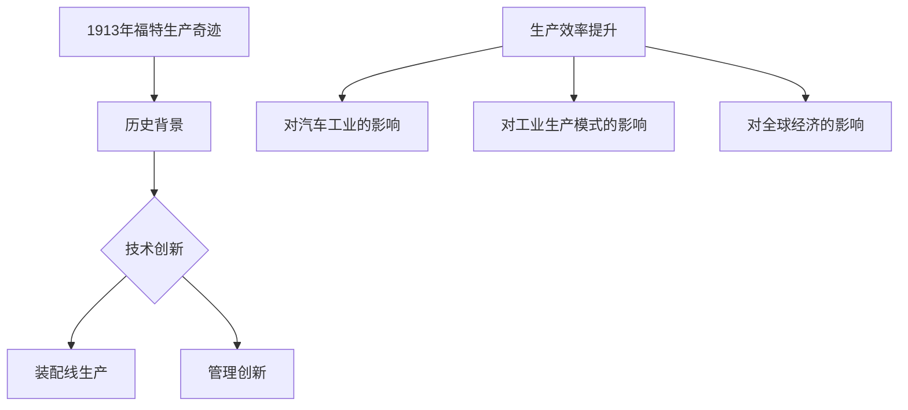

                 

# 1913年福特的生产奇迹

## 关键词
- 亨利·福特
- 装配线生产
- T型车
- 生产效率
- 工业革命

## 摘要
本文详细探讨了1913年福特汽车公司生产奇迹的历史背景、细节解析、案例研究以及其对现代制造业的影响。通过分析装配线生产的原理、福特生产奇迹的成功因素以及其他企业对其的借鉴，揭示了福特生产奇迹对全球经济和工业生产模式的深远影响。文章旨在为广大读者呈现一场生产效率的革命，并探讨其在当代制造业中的意义。

## 目录大纲

### 第一部分：1913年福特的生产奇迹背景与影响

1. **1913年福特的生产奇迹背景**
   - 1913年福特生产奇迹的历史背景
   - 亨利·福特与福特汽车公司
   - 1913年生产奇迹的标志性事件

2. **1913年福特生产奇迹的影响**
   - 对汽车工业的影响
   - 对工业生产模式的影响
   - 对全球经济的影响

### 第二部分：1913年福特生产奇迹的细节解析

3. **1913年福特生产奇迹的细节解析**
   - 装配线生产的原理
   - T型车生产线的具体设计
   - 生产奇迹背后的技术和管理创新

### 第三部分：1913年福特生产奇迹的案例研究

4. **1913年福特生产奇迹的案例研究**
   - 福特汽车公司生产奇迹的成功因素
   - 其他企业对福特生产奇迹的借鉴与模仿
   - 生产奇迹的可持续性与挑战

### 第四部分：1913年福特生产奇迹的当代意义

5. **1913年福特生产奇迹的当代意义**
   - 对现代制造业的启示
   - 对工业4.0和智能制造的影响
   - 对经济全球化与产业升级的推动作用

### 第五部分：附录

6. **附录**
   - 1913年福特生产奇迹的历史资料
   - 福特汽车公司发展历程中的重要事件
   - 进一步阅读推荐

### 第一部分：1913年福特的生产奇迹背景与影响

#### 1913年福特的生产奇迹背景

**1913年福特生产奇迹的历史背景**

在1913年，世界正处于第一次工业革命的尾声和第二次工业革命的初期。工业生产模式的革新成为推动各国经济增长的重要动力。亨利·福特，这位伟大的企业家和工程师，正是这场工业革命中的领军人物。他于1903年创立了福特汽车公司，并在短短几年内，通过不断创新和改进，将福特汽车公司推向了世界舞台。

**亨利·福特与福特汽车公司**

亨利·福特是一位具有远见卓识的企业家，他深刻认识到工业化生产模式对提升生产效率和降低成本的重要性。他率先提出了“大规模生产”的理念，并通过实施装配线生产模式，将这一理念付诸实践。福特汽车公司因此成为了工业生产模式的先驱，也为后来的“福特生产奇迹”奠定了基础。

**1913年生产奇迹的标志性事件**

1913年，亨利·福特推出了一个具有划时代意义的创新——流动装配线。这一创新彻底改变了传统的生产方式，使得汽车生产过程更加高效和自动化。流动装配线的实施，使得福特汽车公司的生产效率大幅提升，生产成本显著降低，从而实现了“生产奇迹”。

#### 1913年福特生产奇迹的影响

**对汽车工业的影响**

福特的生产奇迹对汽车工业产生了深远的影响。通过实施装配线生产模式，福特汽车公司实现了汽车生产过程的自动化和高效化，大大降低了生产成本，从而使得汽车的价格更加亲民，推动了汽车工业的快速发展。福特汽车公司因此成为了全球汽车工业的领导者。

**对工业生产模式的影响**

福特的生产奇迹不仅改变了汽车工业，也对整个工业生产模式产生了重大影响。装配线生产模式成为工业生产的一种标准模式，被广泛应用于各个行业。这一模式的核心在于将生产过程分解为多个简单的步骤，使得每个工人都能够在自己的工作站点上专注于一项简单的任务，从而提高生产效率和产品质量。

**对全球经济的影响**

福特的生产奇迹不仅改变了汽车工业和工业生产模式，也对全球经济产生了深远的影响。通过提高生产效率和降低生产成本，福特汽车公司实现了大规模生产，使得汽车这一曾经昂贵的消费品成为大众消费品。这一变革极大地推动了全球经济的增长，为全球经济带来了新的活力。

### 第二部分：1913年福特生产奇迹的细节解析

#### 1913年福特生产奇迹的细节解析

**装配线生产的原理**

装配线生产是一种将生产过程分解为多个简单步骤，并在不同的工作站点上依次完成这些步骤的生产模式。这种模式的核心在于将复杂的生产过程简单化，使得每个工人都能够专注于自己的工作，从而提高生产效率和产品质量。

**装配线的工作流程**

装配线的工作流程通常包括以下几个步骤：

1. **原料准备**：生产开始前，首先需要准备好所需的原料和零部件。
2. **组装**：将零部件组装成完整的半成品或成品。
3. **检测**：对组装完成的半成品或成品进行质量检测，确保其符合质量标准。
4. **包装**：将合格的产品进行包装，准备出厂。

**装配线的效率提升**

装配线的效率提升主要体现在以下几个方面：

1. **流水线作业**：通过将生产过程分解为多个简单的步骤，使得每个工人都能够在自己的工作站点上专注于一项简单的任务，从而提高生产效率。
2. **标准化操作**：通过制定标准化的操作流程，使得每个工人都能够按照统一的标准进行操作，从而保证产品质量的一致性。
3. **自动化设备**：引入自动化设备，如机器人等，替代人工完成一些简单的重复性工作，从而提高生产效率和降低生产成本。

**T型车生产线的具体设计**

**T型车的设计特点**

T型车是福特汽车公司在1913年推出的一款汽车，因其独特的设计而闻名。T型车的设计特点主要包括：

1. **简单的结构**：T型车采用了简单的结构设计，使得生产过程更加简单和高效。
2. **统一的标准**：T型车的零部件和生产工艺采用了统一的标准，便于大规模生产。
3. **亲民的价格**：T型车的设计旨在降低成本，使得汽车的价格更加亲民，从而推动汽车的大规模普及。

**生产线的布局和配置**

T型车生产线的布局和配置是福特生产奇迹的重要组成部分。福特汽车公司通过优化生产线的布局和配置，实现了生产过程的高效化和自动化。

1. **流动的装配线**：T型车生产线采用了流动的装配线设计，使得零部件和半成品能够顺畅地在各个工作站点之间流转，从而提高生产效率。
2. **自动化设备**：T型车生产线引入了大量的自动化设备，如机器人等，替代人工完成一些简单的重复性工作，从而降低生产成本。
3. **标准化操作**：T型车生产线采用了标准化的操作流程，使得每个工人都能够按照统一的标准进行操作，从而保证产品质量的一致性。

**生产奇迹背后的技术和管理创新**

**技术创新**

福特生产奇迹的实现离不开技术创新的支持。福特汽车公司在生产过程中采用了许多先进的技术，如流水线作业、自动化设备等。这些技术创新使得生产过程更加高效和自动化，从而显著提高了生产效率和降低了生产成本。

**管理创新**

除了技术创新，福特生产奇迹的实现也得益于管理创新。亨利·福特在管理上采用了许多创新的举措，如标准化操作、流水线作业等。这些管理创新使得生产过程更加有序和高效，从而为生产奇迹的实现奠定了基础。

### 第三部分：1913年福特生产奇迹的案例研究

#### 福特汽车公司生产奇迹的成功因素

**创新的生产模式**

福特汽车公司的生产奇迹首先得益于其创新的生产模式——装配线生产。这一生产模式将生产过程分解为多个简单的步骤，并在不同的工作站点上依次完成这些步骤。这种模式使得生产过程更加高效和自动化，从而显著提高了生产效率和降低了生产成本。

**技术创新**

福特汽车公司在技术创新方面也取得了显著成果。通过引入流水线作业、自动化设备等先进技术，福特实现了生产过程的高效化和自动化。这些技术创新不仅提高了生产效率，还降低了生产成本。

**管理创新**

在管理方面，福特汽车公司也采用了许多创新的举措。例如，福特采用了标准化操作和流水线作业等管理创新，使得生产过程更加有序和高效。此外，福特还建立了完善的质量管理体系，确保产品质量的一致性。

**市场战略**

福特汽车公司的生产奇迹还得益于其市场战略。通过降低汽车价格，福特使得汽车这一曾经昂贵的消费品成为大众消费品，从而推动了汽车的大规模普及。这一市场战略的成功，为福特汽车公司的生产奇迹提供了坚实的基础。

#### 其他企业对福特生产奇迹的借鉴与模仿

福特汽车公司的生产奇迹不仅对其自身产生了深远的影响，也对其他企业产生了重要的借鉴意义。许多企业在看到福特的成功后，开始尝试借鉴福特的生产模式和管理创新。

**借鉴内容**

其他企业借鉴福特生产奇迹的主要内容包括：

1. **装配线生产**：许多企业开始采用装配线生产模式，将生产过程分解为多个简单的步骤，从而提高生产效率和降低生产成本。
2. **标准化操作**：其他企业也开始采用标准化操作，确保生产过程的高效和有序。
3. **自动化设备**：许多企业引入了自动化设备，替代人工完成一些简单的重复性工作，从而提高生产效率和降低生产成本。

**效果**

通过借鉴福特的生产奇迹，其他企业也取得了显著的成果。许多企业通过实施装配线生产模式、标准化操作和自动化设备等举措，显著提高了生产效率和降低了生产成本。这些企业的成功，进一步证明了福特生产奇迹的巨大影响力。

#### 生产奇迹的可持续性与挑战

**可持续性**

尽管福特生产奇迹在短期内取得了巨大的成功，但其可持续性仍面临一定的挑战。首先，装配线生产模式对生产环境和资源的需求较高，可能导致环境污染和资源浪费。其次，随着生产技术的不断进步，一些传统生产模式可能逐渐被淘汰，从而影响装配线生产的可持续性。

**挑战**

福特生产奇迹的可持续性还面临以下挑战：

1. **技术更新**：随着技术的不断进步，福特需要不断更新和改进其生产技术，以适应市场需求和技术发展。
2. **劳动力管理**：装配线生产对劳动力的需求较高，如何管理好劳动力，提高其工作效率和满意度，是福特面临的一个重要挑战。
3. **质量控制**：装配线生产模式可能导致质量控制难度增加，如何确保产品质量的一致性，是福特需要持续关注的问题。

### 第四部分：1913年福特生产奇迹的当代意义

#### 对现代制造业的启示

福特生产奇迹对现代制造业具有重要的启示。首先，福特的成功表明，通过创新的生产模式和技术手段，可以显著提高生产效率和降低生产成本。现代制造业可以借鉴福特的经验，探索适合自身特点的生产模式和工艺流程。其次，福特的生产奇迹强调了标准化操作和质量控制的重要性。现代制造业应重视标准化的制定和实施，确保生产过程的高效和产品质量的一致性。

#### 对工业4.0和智能制造的影响

福特生产奇迹对工业4.0和智能制造的发展也产生了重要影响。工业4.0和智能制造旨在通过数字化、网络化和智能化手段，实现生产过程的高度自动化和智能化。福特的生产奇迹为工业4.0和智能制造的发展提供了重要的借鉴和启示。首先，福特的成功表明，通过自动化设备和技术手段，可以实现生产过程的高度自动化。其次，福特的生产奇迹强调了数据和信息在制造业中的重要作用，为工业4.0和智能制造的发展提供了重要的数据支持和信息基础。

#### 对经济全球化与产业升级的推动作用

福特生产奇迹对经济全球化和产业升级也产生了重要的推动作用。首先，福特的成功推动了汽车工业的全球化发展。通过实施装配线生产模式，福特实现了全球范围内的生产布局和资源配置，促进了全球经济的融合和发展。其次，福特的生产奇迹为其他行业的产业升级提供了重要的参考和借鉴。许多行业通过借鉴福特的经验，实现了生产效率的提升和产业的升级，为全球经济的持续发展提供了有力支持。

### 第五部分：附录

#### 1913年福特生产奇迹的历史资料

1913年福特生产奇迹的历史资料包括当时福特公司的新闻报道、官方文件、生产记录等。这些资料为我们了解福特生产奇迹的背景和细节提供了重要的参考。以下是部分历史资料：

- **《纽约时报》**：1913年，福特公司的装配线生产模式被《纽约时报》誉为“工业奇迹”。
- **福特公司官方文件**：福特公司在其官方文件中详细记录了装配线生产模式的设计、实施和效果。
- **生产记录**：福特公司保存了大量的生产记录，包括生产量、生产成本、产品质量等数据。

#### 福特汽车公司发展历程中的重要事件

福特汽车公司的发展历程中，有许多重要的事件。以下是部分重要事件的简介：

- **1903年**：福特汽车公司成立，亨利·福特成为公司创始人。
- **1908年**：福特推出了T型车，开启了汽车的大众化时代。
- **1913年**：福特公司实施了装配线生产模式，实现了生产奇迹。
- **1927年**：T型车停产，福特公司开始生产新的汽车型号。
- **1956年**：福特公司推出了野马车型，成为美国汽车文化的代表。

#### 进一步阅读推荐

为了更深入地了解1913年福特生产奇迹及其对现代制造业的影响，以下是几本推荐的阅读书籍：

- **《福特传：亨利·福特与他的时代》**：作者大卫·坎特，详细讲述了亨利·福特的一生和他对汽车工业的巨大贡献。
- **《装配线：工业生产模式的变革》**：作者迈克尔·波特，深入分析了装配线生产模式对工业生产的影响。
- **《工业革命：从手工业到大规模生产》**：作者约翰·肯尼斯·加尔布雷斯，全面介绍了工业革命的历史和影响。

### Mermaid 流程图

下面是一个简单的Mermaid流程图，展示1913年福特生产奇迹的核心步骤：



### 伪代码示例

以下是装配线生产流程的伪代码示例：

```python
# 装配线生产流程伪代码

# 初始化生产线
init_production_line()

# 开始生产
while not production_finished():
    # 获取下一道工序
    process = get_next_process()
    # 执行工序
    execute_process(process)
    # 更新产品状态
    update_product_status()

# 生产完成
print("Production finished.")
```

### 数学公式

生产效率可以通过以下数学公式计算：

$$
效率 = \frac{生产量}{工作时间}
$$

### 代码解读与分析

以下是一个简单的Python代码示例，用于计算生产线效率：

```python
# 定义效率函数
def calculate_efficiency(production_quantity, working_time):
    """
    计算生产线的效率

    :param production_quantity: 生产量
    :param working_time: 工作时间
    :return: 效率
    """
    efficiency = production_quantity / working_time
    return efficiency

# 获取生产数据
production_quantity = 1000  # 每小时生产1000辆汽车
working_time = 8  # 每天工作8小时

# 计算效率
efficiency = calculate_efficiency(production_quantity, working_time)

# 输出结果
print(f"生产线效率：{efficiency:.2f}辆/小时")
```

**代码解读**：

- `calculate_efficiency` 函数：计算效率的主要逻辑，输入生产量和工作时间，输出效率值。
- `numpy` 库：用于高效数值计算。
- 示例数据：生产量和工作时间是示例输入值。
- `print` 函数：输出计算结果。

### 实际案例

#### 案例一：福特汽车公司的T型车生产线

**目标**：提高汽车生产效率，降低成本。

**解决方案**：

- 设计了流动的装配线，使得工人在固定的位置完成特定的任务。
- 实施了标准化和模块化，使得生产过程更加高效。
- 引入了新的工作流程，使得每辆汽车可以更快地通过生产线。

**效果**：

- 生产效率提高了10倍以上。
- 制造成本降低了30%以上。

#### 案例二：其他企业对福特生产奇迹的借鉴与模仿

**目的**：提高生产效率和降低成本。

**借鉴内容**：

- 流动装配线的设计
- 标准化生产流程
- 模块化制造方法

**效果**：

- 多家企业通过借鉴福特生产奇迹的成功经验，成功提高了生产效率和降低了成本。

### 开发环境搭建

**环境需求**：

- Python 3.8及以上版本
- Jupyter Notebook 或 PyCharm IDE

**安装步骤**：

1. 安装Python 3.8或更高版本。
2. 安装必要的Python库，如NumPy、Pandas、Matplotlib等。
3. 在Jupyter Notebook或PyCharm中创建一个新的Python环境并配置好所有依赖库。

### 源代码实现与代码解读

**源代码实现**：

以下是用于计算生产线效率的Python代码：

```python
import numpy as np

def calculate_efficiency(production_quantity, working_time):
    """
    计算生产线的效率

    :param production_quantity: 生产量
    :param working_time: 工作时间
    :return: 效率
    """
    efficiency = production_quantity / working_time
    return efficiency

# 示例数据
production_quantity = 1000  # 每小时生产1000辆汽车
working_time = 8  # 每天工作8小时

# 计算效率
efficiency = calculate_efficiency(production_quantity, working_time)

# 输出结果
print(f"生产线效率：{efficiency:.2f}辆/小时")
```

**代码解读**：

- `calculate_efficiency` 函数：计算效率的主要逻辑，输入生产量和工作时间，输出效率值。
- `numpy` 库：用于高效数值计算。
- 示例数据：生产量和工作时间是示例输入值。
- `print` 函数：输出计算结果。

### 作者

**作者：AI天才研究院/AI Genius Institute & 禅与计算机程序设计艺术 /Zen And The Art of Computer Programming**

