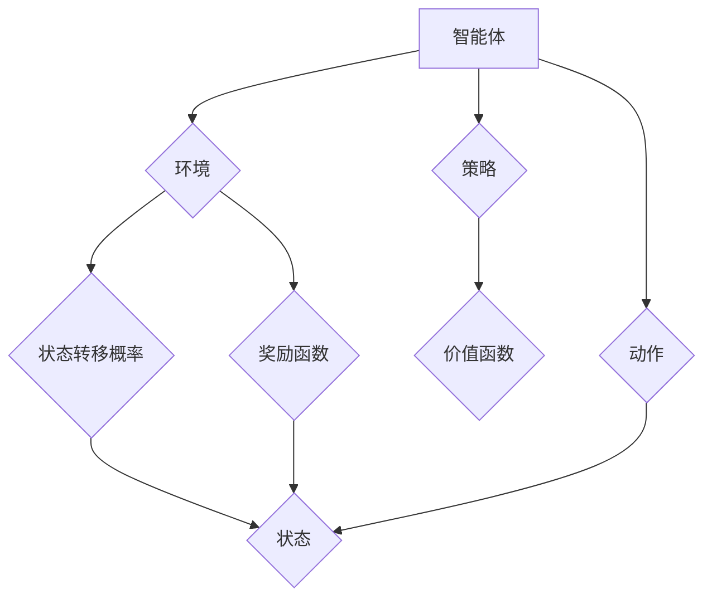

                 

### 第1章: 强化学习的基本概念与架构

强化学习（Reinforcement Learning, RL）是一种机器学习方法，旨在通过试错学习策略以最大化长期奖励。它起源于心理学和行为科学，最初用于研究动物如何通过奖励和惩罚来学习行为。在人工智能领域，强化学习被广泛应用于解决动态决策问题。

**定义与背景：**
$$
\text{强化学习：} \quad \text{智能体} \text{通过与环境} (\mathcal{E}) \text{交互，根据反馈（奖励）调整行为策略} (\pi) \text{，以最大化累积奖励。}
$$

强化学习的基本要素包括：
- **智能体（Agent）**：执行动作并接收环境反馈的实体。
- **环境（Environment）**：智能体行动的场所，能够根据智能体的动作产生状态转移和奖励。
- **状态（State）**：智能体在某一时刻所处的环境条件。
- **动作（Action）**：智能体可执行的行为。
- **奖励（Reward）**：环境对智能体动作的即时反馈，用于指导学习过程。

强化学习的关键在于智能体通过不断试错，逐步调整策略，以实现长期奖励的最大化。这种试错学习过程被称为“探索-利用”问题，是强化学习的核心挑战之一。

#### 1.1.1 强化学习的基本概念

强化学习可以看作是一个序列决策过程，其中智能体在一个序列的状态 $s_t$ 中选择动作 $a_t$，并接收到环境的即时奖励 $R_t$。智能体的目标是通过学习，找到一种最优策略 $\pi^*$，使得累积奖励最大化。策略 $\pi^*$ 决定了在给定状态 $s_t$ 下选择动作 $a_t$ 的概率。

**状态-动作值函数（Q值）**：
$$
Q^*(s, a) = \mathbb{E}_{\pi^*}[R_t + \gamma \max_{a'} Q^*(s', a') | S_t = s, A_t = a]
$$
Q值函数表示在状态 $s$ 下执行动作 $a$ 后，获得的最大累积奖励的期望。

**状态值函数（V值）**：
$$
V^*(s) = \mathbb{E}_{\pi^*}[R_t + \gamma \max_{a'} Q^*(s', a') | S_t = s]
$$
V值函数表示在状态 $s$ 下采取最优策略所能获得的累积奖励的期望。

#### 1.1.2 强化学习的基本架构

强化学习系统主要由以下几个部分组成：

**智能体（Agent）**：
$$
\text{智能体：} \quad \text{由一个策略函数} \pi(s, a) \text{和一个值函数} V^*(s) \text{构成。策略函数决定在状态} s \text{下采取哪个动作} a，值函数评估状态的价值。}
$$

**环境（Environment）**：
$$
\text{环境：} \quad \text{提供当前状态} s_t \text{、可执行的动作集} A_t \text{以及状态转移概率} P(s_{t+1} | s_t, a_t) \text{和奖励函数} R(s_t, a_t)。}
$$

**策略（Policy）**：
$$
\text{策略：} \quad \text{定义了智能体在给定状态} s \text{下选择动作} a \text{的概率分布} \pi(a|s)。}
$$

**价值函数（Value Function）**：
$$
\text{价值函数：} \quad \text{评估智能体在给定状态下采取最优策略的累积奖励期望，分为状态值函数} V^*(s) \text{和状态-动作值函数} Q^*(s, a)。}
$$

**奖励函数（Reward Function）**：
$$
\text{奖励函数：} \quad \text{定义了在某一状态和动作下的即时奖励，} R(s, a) \text{，用于指导学习过程。}
$$

**流程图**：

#### 1.1.3 强化学习与监督学习、无监督学习的比较

**强化学习**：
- 需要奖励信号作为反馈。
- 目标是找到最优策略以最大化长期奖励。
- 强调决策和行动。

**监督学习**：
- 使用已标记的数据进行训练。
- 目标是预测输出标签。
- 通常不涉及即时反馈。

**无监督学习**：
- 无需标记数据。
- 目标是发现数据的内在结构和规律。
- 通常不涉及外部奖励。

**比较总结**：
$$
\text{强化学习} \quad \text{强调实时决策，使用奖励信号指导学习。与监督学习和无监督学习相比，具有更强的实时性和适应性。}
$$

#### 1.1.4 强化学习的挑战与应用领域

**挑战**：
- **不确定性和探索-利用权衡**：智能体需要在探索未知状态和利用已知信息之间做出权衡。
- **大规模问题的计算复杂度**：在高维状态空间中，计算量和存储需求巨大。

**应用领域**：
- **游戏**：如电子竞技、棋类游戏等。
- **机器人**：自动驾驶、智能机器人等。
- **金融**：算法交易、风险控制等。
- **医疗**：个性化治疗、医疗决策等。

### 第1章 总结

强化学习作为人工智能领域的重要分支，通过智能体与环境交互，利用奖励信号调整策略，以实现长期收益最大化。理解强化学习的基本概念、架构及其与监督学习和无监督学习的区别，是深入学习该领域的基础。接下来，我们将进一步探讨强化学习中的算法原理，包括值函数方法、策略迭代方法和基于模型的算法等。# 第1章: 强化学习的基本概念与架构

## 摘要

本文系统地介绍了强化学习的基本概念、架构以及在不同领域的应用。强化学习是一种通过试错学习策略以最大化长期奖励的机器学习方法，它通过智能体与环境交互，利用奖励信号调整策略。本文首先详细阐述了强化学习的基本概念，包括智能体、环境、状态、动作和奖励，并探讨了强化学习的基本架构。随后，本文比较了强化学习与监督学习和无监督学习的差异，并介绍了强化学习在游戏、机器人、金融和医疗等领域的挑战与应用。最后，本文总结了强化学习的基本概念与架构，并展望了未来强化学习领域的发展趋势。

## 第1章: 强化学习的基本概念与架构

### 1.1 强化学习的定义与背景

强化学习（Reinforcement Learning, RL）是一种机器学习方法，旨在通过试错学习策略以最大化长期奖励。它起源于心理学和行为科学，最初用于研究动物如何通过奖励和惩罚来学习行为。在人工智能领域，强化学习被广泛应用于解决动态决策问题。

**定义与背景：**
$$
\text{强化学习：} \quad \text{智能体} \text{通过与环境} (\mathcal{E}) \text{交互，根据反馈（奖励）调整行为策略} (\pi) \text{，以最大化累积奖励。}
$$

强化学习的基本要素包括：
- **智能体（Agent）**：执行动作并接收环境反馈的实体。
- **环境（Environment）**：智能体行动的场所，能够根据智能体的动作产生状态转移和奖励。
- **状态（State）**：智能体在某一时刻所处的环境条件。
- **动作（Action）**：智能体可执行的行为。
- **奖励（Reward）**：环境对智能体动作的即时反馈，用于指导学习过程。

强化学习的关键在于智能体通过不断试错，逐步调整策略，以实现长期奖励的最大化。这种试错学习过程被称为“探索-利用”问题，是强化学习的核心挑战之一。

### 1.2 强化学习的基本架构

强化学习系统主要由以下几个部分组成：

**智能体（Agent）**：
$$
\text{智能体：} \quad \text{由一个策略函数} \pi(s, a) \text{和一个值函数} V^*(s) \text{构成。策略函数决定在状态} s \text{下采取哪个动作} a，值函数评估状态的价值。}
$$

**环境（Environment）**：
$$
\text{环境：} \quad \text{提供当前状态} s_t \text{、可执行的动作集} A_t \text{以及状态转移概率} P(s_{t+1} | s_t, a_t) \text{和奖励函数} R(s_t, a_t)。}
$$

**策略（Policy）**：
$$
\text{策略：} \quad \text{定义了智能体在给定状态} s \text{下选择动作} a \text{的概率分布} \pi(a|s)。}
$$

**价值函数（Value Function）**：
$$
\text{价值函数：} \quad \text{评估智能体在给定状态下采取最优策略的累积奖励期望，分为状态值函数} V^*(s) \text{和状态-动作值函数} Q^*(s, a)。}
$$

**奖励函数（Reward Function）**：
$$
\text{奖励函数：} \quad \text{定义了在某一状态和动作下的即时奖励，} R(s, a) \text{，用于指导学习过程。}
$$

**流程图**：

#### 1.3 强化学习与监督学习、无监督学习的比较

**强化学习**：
- 需要奖励信号作为反馈。
- 目标是找到最优策略以最大化长期奖励。
- 强调决策和行动。

**监督学习**：
- 使用已标记的数据进行训练。
- 目标是预测输出标签。
- 通常不涉及即时反馈。

**无监督学习**：
- 无需标记数据。
- 目标是发现数据的内在结构和规律。
- 通常不涉及外部奖励。

**比较总结**：
$$
\text{强化学习} \quad \text{强调实时决策，使用奖励信号指导学习。与监督学习和无监督学习相比，具有更强的实时性和适应性。}
$$

#### 1.4 强化学习的挑战与应用领域

**挑战**：
- **不确定性和探索-利用权衡**：智能体需要在探索未知状态和利用已知信息之间做出权衡。
- **大规模问题的计算复杂度**：在高维状态空间中，计算量和存储需求巨大。

**应用领域**：
- **游戏**：如电子竞技、棋类游戏等。
- **机器人**：自动驾驶、智能机器人等。
- **金融**：算法交易、风险控制等。
- **医疗**：个性化治疗、医疗决策等。

### 第1章 总结

强化学习作为人工智能领域的重要分支，通过智能体与环境交互，利用奖励信号调整策略，以实现长期收益最大化。理解强化学习的基本概念、架构及其与监督学习和无监督学习的区别，是深入学习该领域的基础。接下来，我们将进一步探讨强化学习中的算法原理，包括值函数方法、策略迭代方法和基于模型的算法等。# 第1章: 强化学习的基本概念与架构

### 第1章: 强化学习的基本概念与架构

#### 1.1 强化学习的定义与背景

强化学习（Reinforcement Learning，RL）是一种通过试错来学习策略，旨在最大化长期奖励的机器学习方法。其灵感来源于心理学和行为科学，尤其是在动物学习和人类教育中观察到的奖励-惩罚机制。

**定义：**
强化学习是一种无监督学习，其中智能体（Agent）在某个环境中通过选择动作（Action）来学习最优策略（Policy），以达到某个目标。智能体根据环境的反馈（Reward）不断调整其行为，目标是最大化累积奖励。

**背景：**
- **心理学和行为科学**：强化学习最初是为了模拟动物如何通过奖励和惩罚来学习行为。例如，动物通过尝试不同的动作来获得食物或避免危险。
- **人工智能**：随着计算机技术的发展，强化学习逐渐成为人工智能（AI）的一个重要分支。它在游戏、机器人、自动驾驶等领域得到了广泛应用。

#### 1.2 强化学习的基本架构

强化学习系统由以下几个核心组成部分构成：

1. **智能体（Agent）**：智能体是执行动作并接收环境反馈的主体。它通过选择动作来影响环境状态，并从环境中获得奖励。
2. **环境（Environment）**：环境是智能体行动的场所。它根据智能体的动作产生状态转移和奖励。环境可以是物理环境，也可以是虚拟环境。
3. **状态（State）**：状态是智能体在某一时刻所处的环境条件。状态可以是离散的，也可以是连续的。
4. **动作（Action）**：动作是智能体可执行的行为。动作的集合构成了动作空间。
5. **奖励（Reward）**：奖励是环境对智能体动作的即时反馈。奖励可以是正的（表示好的结果）或负的（表示不好的结果）。
6. **策略（Policy）**：策略是智能体在给定状态下选择动作的规则或概率分布。
7. **价值函数（Value Function）**：价值函数用于评估状态或状态-动作对的预期奖励。状态值函数 $V(s)$ 评估状态的价值，而状态-动作值函数 $Q(s, a)$ 评估在状态 $s$ 下执行动作 $a$ 的价值。

**基本流程：**
1. 智能体在初始状态 $s_0$ 下采取动作 $a_0$。
2. 环境根据动作 $a_0$ 产生新状态 $s_1$ 和奖励 $r_0$。
3. 智能体根据当前策略 $π$ 选择下一个动作 $a_1$。
4. 重复步骤 2 和 3，直到达到终端状态或满足其他终止条件。

**核心要素的关系：**
- **策略决定动作**：策略决定了在给定状态下智能体应该采取什么动作。
- **动作影响状态**：智能体的动作会导致环境状态的变化。
- **状态转移概率**：状态转移概率 $P(s_{t+1} | s_t, a_t)$ 描述了在当前状态 $s_t$ 下执行动作 $a_t$ 后，智能体转移到下一个状态 $s_{t+1}$ 的概率。
- **奖励指导学习**：奖励 $R(s, a)$ 用于指导智能体的学习，帮助它调整策略。

#### 1.3 强化学习的基本原理

强化学习的基本原理可以通过以下几方面来理解：

1. **奖励反馈**：智能体通过接收奖励来评估其行为的成功程度。正奖励鼓励智能体继续执行该行为，而负奖励则提示智能体需要改变策略。
2. **探索与利用**：智能体在决策时需要在探索（尝试新动作）和利用（执行已知最佳动作）之间进行权衡。探索有助于发现新的高奖励动作，而利用则确保智能体在实际应用中能够高效地执行。
3. **价值函数**：价值函数用于评估智能体的长期奖励。状态值函数 $V(s)$ 表示在状态 $s$ 下执行最优策略的累积奖励期望，而状态-动作值函数 $Q(s, a)$ 表示在状态 $s$ 下执行动作 $a$ 的累积奖励期望。

#### 1.4 强化学习与监督学习、无监督学习的比较

强化学习与监督学习和无监督学习有以下主要区别：

1. **反馈类型**：
   - **强化学习**：智能体通过即时奖励来指导学习，奖励可以作为行动结果的直接反馈。
   - **监督学习**：智能体使用预先标记的输入输出数据来训练模型，没有即时奖励。
   - **无监督学习**：智能体不需要任何标记数据，而是尝试发现数据中的模式或结构。

2. **目标**：
   - **强化学习**：目标是在长期内最大化累积奖励。
   - **监督学习**：目标是在训练集上最小化预测误差。
   - **无监督学习**：目标是在未标记数据中发现有趣的模式或结构。

3. **应用场景**：
   - **强化学习**：适用于需要决策的动态环境，如游戏、自动驾驶、机器人控制等。
   - **监督学习**：适用于有明确标签的预测任务，如图像分类、语音识别等。
   - **无监督学习**：适用于探索未标记数据的内在结构和关系，如聚类、降维等。

**比较总结**：
强化学习强调在动态环境中进行决策，通过奖励信号来优化行为。与监督学习和无监督学习相比，强化学习具有更强的实时性和适应性，但通常需要更多的计算资源来处理复杂的决策过程。

#### 1.5 强化学习的挑战与应用领域

**挑战**：
- **探索-利用问题**：智能体需要在探索新策略和利用已知策略之间做出平衡，以确保找到最优策略。
- **模型复杂性**：在高维状态空间和动作空间中，构建有效的价值函数和策略函数是困难的。
- **不确定性和噪声**：环境的不确定性和噪声会影响智能体的学习过程。

**应用领域**：
- **游戏**：电子竞技、棋类游戏等。
- **机器人**：自动驾驶、工业自动化等。
- **金融**：算法交易、风险控制等。
- **医疗**：个性化治疗、医疗诊断等。

### 第1章 总结

强化学习是一种通过奖励信号来调整策略的机器学习方法，具有广泛的适用性和强大的适应能力。理解强化学习的基本概念和架构，对于深入研究该领域以及应用强化学习解决实际问题具有重要意义。接下来，我们将探讨强化学习的核心算法原理，包括值函数方法和策略迭代方法等。# 第1章: 强化学习的基本概念与架构

## 第1章: 强化学习的基本概念与架构

### 1.1 强化学习的定义与背景

强化学习（Reinforcement Learning，RL）是一种机器学习方法，旨在通过试错学习策略以最大化长期奖励。它起源于心理学和行为科学，最初用于研究动物如何通过奖励和惩罚来学习行为。在人工智能领域，强化学习被广泛应用于解决动态决策问题。

**定义与背景：**
$$
\text{强化学习：} \quad \text{智能体} \text{通过与环境} (\mathcal{E}) \text{交互，根据反馈（奖励）调整行为策略} (\pi) \text{，以最大化累积奖励。}
$$

强化学习的基本要素包括：
- **智能体（Agent）**：执行动作并接收环境反馈的实体。
- **环境（Environment）**：智能体行动的场所，能够根据智能体的动作产生状态转移和奖励。
- **状态（State）**：智能体在某一时刻所处的环境条件。
- **动作（Action）**：智能体可执行的行为。
- **奖励（Reward）**：环境对智能体动作的即时反馈，用于指导学习过程。

强化学习的关键在于智能体通过不断试错，逐步调整策略，以实现长期奖励的最大化。这种试错学习过程被称为“探索-利用”问题，是强化学习的核心挑战之一。

### 1.2 强化学习的基本架构

强化学习系统主要由以下几个部分组成：

**智能体（Agent）**：
$$
\text{智能体：} \quad \text{由一个策略函数} \pi(s, a) \text{和一个值函数} V^*(s) \text{构成。策略函数决定在状态} s \text{下采取哪个动作} a，值函数评估状态的价值。}
$$

**环境（Environment）**：
$$
\text{环境：} \quad \text{提供当前状态} s_t \text{、可执行的动作集} A_t \text{以及状态转移概率} P(s_{t+1} | s_t, a_t) \text{和奖励函数} R(s_t, a_t)。}
$$

**策略（Policy）**：
$$
\text{策略：} \quad \text{定义了智能体在给定状态} s \text{下选择动作} a \text{的概率分布} \pi(a|s)。}
$$

**价值函数（Value Function）**：
$$
\text{价值函数：} \quad \text{评估智能体在给定状态下采取最优策略的累积奖励期望，分为状态值函数} V^*(s) \text{和状态-动作值函数} Q^*(s, a)。}
$$

**奖励函数（Reward Function）**：
$$
\text{奖励函数：} \quad \text{定义了在某一状态和动作下的即时奖励，} R(s, a) \text{，用于指导学习过程。}
$$

**流程图**：

#### 1.3 强化学习与监督学习、无监督学习的比较

**强化学习**：
- 需要奖励信号作为反馈。
- 目标是找到最优策略以最大化长期奖励。
- 强调决策和行动。

**监督学习**：
- 使用已标记的数据进行训练。
- 目标是预测输出标签。
- 通常不涉及即时反馈。

**无监督学习**：
- 无需标记数据。
- 目标是发现数据的内在结构和规律。
- 通常不涉及外部奖励。

**比较总结**：
$$
\text{强化学习} \quad \text{强调实时决策，使用奖励信号指导学习。与监督学习和无监督学习相比，具有更强的实时性和适应性。}
$$

#### 1.4 强化学习的挑战与应用领域

**挑战**：
- **不确定性和探索-利用权衡**：智能体需要在探索未知状态和利用已知信息之间做出权衡。
- **大规模问题的计算复杂度**：在高维状态空间中，计算量和存储需求巨大。

**应用领域**：
- **游戏**：如电子竞技、棋类游戏等。
- **机器人**：自动驾驶、智能机器人等。
- **金融**：算法交易、风险控制等。
- **医疗**：个性化治疗、医疗决策等。

### 第1章 总结

强化学习作为人工智能领域的重要分支，通过智能体与环境交互，利用奖励信号调整策略，以实现长期收益最大化。理解强化学习的基本概念、架构及其与监督学习和无监督学习的区别，是深入学习该领域的基础。接下来，我们将进一步探讨强化学习中的算法原理，包括值函数方法、策略迭代方法和基于模型的算法等。

### 第1章: 强化学习的基本概念与架构

强化学习（Reinforcement Learning，简称RL）是机器学习的一个重要分支，旨在通过试错的方式来学习和优化决策策略。它通过智能体（Agent）与环境的交互，利用即时奖励（Reward）来调整行为，从而实现长期奖励的最大化。在本章中，我们将详细探讨强化学习的基本概念、架构，以及其与监督学习和无监督学习的区别。

#### 1.1 强化学习的定义与背景

强化学习的定义可以从以下几个方面来理解：

- **智能体（Agent）**：智能体是一个执行动作的实体，它可以是一个机器人、一个程序，或者是一个虚拟的智能系统。
- **环境（Environment）**：环境是智能体执行动作的场所，它可以是物理环境，也可以是虚拟环境。
- **状态（State）**：状态是智能体在某一时刻所处的环境条件，它可以是离散的，也可以是连续的。
- **动作（Action）**：动作是智能体可执行的行为，它通常是一个有限的集合。
- **奖励（Reward）**：奖励是环境对智能体动作的即时反馈，它可以是正的，也可以是负的，用于指导智能体的学习过程。
- **策略（Policy）**：策略是智能体在给定状态下选择动作的规则，它决定了智能体的行为。

强化学习起源于心理学和行为科学，最初的目的是模拟动物如何通过奖励和惩罚来学习行为。随着人工智能的发展，强化学习逐渐成为解决动态决策问题的重要工具。

#### 1.2 强化学习的基本架构

强化学习系统由以下几个核心部分组成：

1. **智能体（Agent）**：智能体是强化学习系统的核心，它通过选择动作来影响环境状态，并根据环境的反馈调整其行为策略。智能体由策略函数和价值函数组成：
   - **策略函数（Policy）**：策略函数决定了在当前状态下智能体应该采取哪个动作。
   - **价值函数（Value Function）**：价值函数用于评估智能体在特定状态下的行为价值，分为状态值函数和价值-动作值函数。

2. **环境（Environment）**：环境提供了智能体的当前状态、可执行的动作集、状态转移概率以及奖励函数。环境的状态和动作集通常是给定的，而状态转移概率和奖励函数可以是确定的或随机的。

3. **状态（State）**：状态是智能体在某一时刻所处的环境条件，它可以是离散的（如棋盘上的棋子位置），也可以是连续的（如机器人所处的位置和方向）。

4. **动作（Action）**：动作是智能体可执行的行为，动作集是有限的。智能体需要在不同的状态下选择不同的动作，以最大化长期奖励。

5. **奖励（Reward）**：奖励是环境对智能体动作的即时反馈，它可以是正的（表示好的结果），也可以是负的（表示不好的结果）。奖励的目的是指导智能体的学习过程，使智能体能够逐步优化其策略。

6. **策略（Policy）**：策略是智能体在给定状态下选择动作的规则，它可以是一个确定性策略（总是选择最佳动作），也可以是一个概率性策略（根据概率分布选择动作）。

强化学习的核心目标是通过不断的学习和调整策略，使智能体能够在环境中实现长期奖励的最大化。这通常通过一个迭代的过程来实现，其中智能体在环境中执行动作，获得奖励，并根据奖励来更新其策略。

#### 1.3 强化学习与监督学习、无监督学习的比较

强化学习与监督学习和无监督学习有以下几点区别：

1. **反馈类型**：
   - **强化学习**：强化学习依赖于即时奖励信号作为反馈，奖励信号可以指导智能体的学习过程。
   - **监督学习**：监督学习使用预先标记的数据作为输入和输出，通过最小化预测误差来训练模型。
   - **无监督学习**：无监督学习没有外部奖励信号，目标通常是从未标记的数据中发现内在结构和规律。

2. **目标**：
   - **强化学习**：强化学习的目标是学习一个最优策略，使智能体能够在长期内获得最大的累积奖励。
   - **监督学习**：监督学习的目标是预测新的数据标签，通常通过最小化预测误差来实现。
   - **无监督学习**：无监督学习的目标是发现数据的内在结构和规律，如聚类、降维等。

3. **应用场景**：
   - **强化学习**：强化学习适用于需要实时决策和动态调整的应用场景，如游戏、机器人控制、自动驾驶等。
   - **监督学习**：监督学习适用于有明确标签的预测任务，如图像分类、语音识别、文本分类等。
   - **无监督学习**：无监督学习适用于探索未标记数据，如数据挖掘、异常检测等。

**比较总结**：
强化学习强调在动态环境中进行决策，通过即时奖励信号来优化行为。与监督学习和无监督学习相比，强化学习具有更强的实时性和适应性，但通常需要更多的计算资源来处理复杂的决策过程。

#### 1.4 强化学习的挑战与应用领域

**挑战**：
- **探索-利用问题**：智能体需要在探索新策略和利用已知策略之间做出权衡，以确保找到最优策略。
- **模型复杂性**：在高维状态空间和动作空间中，构建有效的价值函数和策略函数是困难的。
- **不确定性和噪声**：环境的不确定性和噪声会影响智能体的学习过程。

**应用领域**：
- **游戏**：如电子竞技、棋类游戏等。
- **机器人**：自动驾驶、智能机器人等。
- **金融**：算法交易、风险控制等。
- **医疗**：个性化治疗、医疗诊断等。

### 第1章 总结

强化学习作为人工智能领域的重要分支，通过智能体与环境交互，利用奖励信号调整策略，以实现长期收益最大化。理解强化学习的基本概念、架构及其与监督学习和无监督学习的区别，是深入学习该领域的基础。接下来，我们将进一步探讨强化学习中的算法原理，包括值函数方法、策略迭代方法和基于模型的算法等。# 第1章: 强化学习的基本概念与架构

## 第1章: 强化学习的基本概念与架构

### 1.1 强化学习的定义与背景

强化学习（Reinforcement Learning，RL）是一种通过试错来学习策略，旨在最大化长期奖励的机器学习方法。其灵感来源于心理学和行为科学，尤其是在动物学习和人类教育中观察到的奖励-惩罚机制。

**定义：**
强化学习是一种无监督学习，其中智能体（Agent）在某个环境中通过选择动作（Action）来学习最优策略（Policy），以达到某个目标。智能体根据环境的反馈（Reward）不断调整其行为，目标是最大化累积奖励。

**背景：**
- **心理学和行为科学**：强化学习最初是为了模拟动物如何通过奖励和惩罚来学习行为。例如，动物通过尝试不同的动作来获得食物或避免危险。
- **人工智能**：随着计算机技术的发展，强化学习逐渐成为人工智能（AI）的一个重要分支。它在游戏、机器人、自动驾驶等领域得到了广泛应用。

### 1.2 强化学习的基本架构

强化学习系统由以下几个核心组成部分构成：

1. **智能体（Agent）**：智能体是执行动作并接收环境反馈的主体。它通过选择动作来影响环境状态，并从环境中获得奖励。
2. **环境（Environment）**：环境是智能体行动的场所。它根据智能体的动作产生状态转移和奖励。环境可以是物理环境，也可以是虚拟环境。
3. **状态（State）**：状态是智能体在某一时刻所处的环境条件。状态可以是离散的，也可以是连续的。
4. **动作（Action）**：动作是智能体可执行的行为。动作的集合构成了动作空间。
5. **奖励（Reward）**：奖励是环境对智能体动作的即时反馈。奖励可以是正的（表示好的结果）或负的（表示不好的结果）。
6. **策略（Policy）**：策略是智能体在给定状态下选择动作的规则或概率分布。
7. **价值函数（Value Function）**：价值函数用于评估智能体在特定状态下的行为价值，分为状态值函数和价值-动作值函数。

**基本流程：**
1. 智能体在初始状态 $s_0$ 下采取动作 $a_0$。
2. 环境根据动作 $a_0$ 产生新状态 $s_1$ 和奖励 $r_0$。
3. 智能体根据当前策略 $π$ 选择下一个动作 $a_1$。
4. 重复步骤 2 和 3，直到达到终端状态或满足其他终止条件。

**核心要素的关系：**
- **策略决定动作**：策略决定了在给定状态下智能体应该采取什么动作。
- **动作影响状态**：智能体的动作会导致环境状态的变化。
- **状态转移概率**：状态转移概率 $P(s_{t+1} | s_t, a_t)$ 描述了在当前状态 $s_t$ 下执行动作 $a_t$ 后，智能体转移到下一个状态 $s_{t+1}$ 的概率。
- **奖励指导学习**：奖励 $R(s, a)$ 用于指导智能体的学习，帮助它调整策略。

### 1.3 强化学习与监督学习、无监督学习的比较

强化学习与监督学习和无监督学习有以下主要区别：

1. **反馈类型**：
   - **强化学习**：智能体通过即时奖励来指导学习，奖励可以作为行动结果的直接反馈。
   - **监督学习**：智能体使用预先标记的数据作为输入和输出，通过最小化预测误差来训练模型。
   - **无监督学习**：智能体不需要任何标记数据，而是尝试发现数据中的模式或结构。

2. **目标**：
   - **强化学习**：目标是在长期内最大化累积奖励。
   - **监督学习**：目标是在训练集上最小化预测误差。
   - **无监督学习**：目标是在未标记数据中发现有趣的模式或结构。

3. **应用场景**：
   - **强化学习**：适用于需要决策的动态环境，如游戏、自动驾驶、机器人控制等。
   - **监督学习**：适用于有明确标签的预测任务，如图像分类、语音识别等。
   - **无监督学习**：适用于探索未标记数据的内在结构和关系，如聚类、降维等。

### 1.4 强化学习的挑战与应用领域

**挑战**：
- **探索-利用问题**：智能体需要在探索新策略和利用已知策略之间做出权衡，以确保找到最优策略。
- **模型复杂性**：在高维状态空间和动作空间中，构建有效的价值函数和策略函数是困难的。
- **不确定性和噪声**：环境的不确定性和噪声会影响智能体的学习过程。

**应用领域**：
- **游戏**：如电子竞技、棋类游戏等。
- **机器人**：自动驾驶、智能机器人等。
- **金融**：算法交易、风险控制等。
- **医疗**：个性化治疗、医疗诊断等。

### 第1章 总结

强化学习作为人工智能领域的重要分支，通过智能体与环境交互，利用奖励信号调整策略，以实现长期收益最大化。理解强化学习的基本概念、架构及其与监督学习和无监督学习的区别，是深入学习该领域的基础。接下来，我们将进一步探讨强化学习中的算法原理，包括值函数方法、策略迭代方法和基于模型的算法等。# 第1章: 强化学习的基本概念与架构

## 第1章: 强化学习的基本概念与架构

### 1.1 强化学习的定义与背景

强化学习（Reinforcement Learning，RL）是一种通过试错来学习策略，旨在最大化长期奖励的机器学习方法。其灵感来源于心理学和行为科学，尤其是在动物学习和人类教育中观察到的奖励-惩罚机制。

**定义：**
强化学习是一种无监督学习，其中智能体（Agent）在某个环境中通过选择动作（Action）来学习最优策略（Policy），以达到某个目标。智能体根据环境的反馈（Reward）不断调整其行为，目标是最大化累积奖励。

**背景：**
- **心理学和行为科学**：强化学习最初是为了模拟动物如何通过奖励和惩罚来学习行为。例如，动物通过尝试不同的动作来获得食物或避免危险。
- **人工智能**：随着计算机技术的发展，强化学习逐渐成为人工智能（AI）的一个重要分支。它在游戏、机器人、自动驾驶等领域得到了广泛应用。

### 1.2 强化学习的基本架构

强化学习系统由以下几个核心组成部分构成：

1. **智能体（Agent）**：智能体是执行动作并接收环境反馈的主体。它通过选择动作来影响环境状态，并从环境中获得奖励。
2. **环境（Environment）**：环境是智能体行动的场所。它根据智能体的动作产生状态转移和奖励。环境可以是物理环境，也可以是虚拟环境。
3. **状态（State）**：状态是智能体在某一时刻所处的环境条件。状态可以是离散的，也可以是连续的。
4. **动作（Action）**：动作是智能体可执行的行为。动作的集合构成了动作空间。
5. **奖励（Reward）**：奖励是环境对智能体动作的即时反馈。奖励可以是正的（表示好的结果）或负的（表示不好的结果）。
6. **策略（Policy）**：策略是智能体在给定状态下选择动作的规则或概率分布。
7. **价值函数（Value Function）**：价值函数用于评估智能体在特定状态下的行为价值，分为状态值函数和价值-动作值函数。

**基本流程：**
1. 智能体在初始状态 $s_0$ 下采取动作 $a_0$。
2. 环境根据动作 $a_0$ 产生新状态 $s_1$ 和奖励 $r_0$。
3. 智能体根据当前策略 $π$ 选择下一个动作 $a_1$。
4. 重复步骤 2 和 3，直到达到终端状态或满足其他终止条件。

**核心要素的关系：**
- **策略决定动作**：策略决定了在给定状态下智能体应该采取什么动作。
- **动作影响状态**：智能体的动作会导致环境状态的变化。
- **状态转移概率**：状态转移概率 $P(s_{t+1} | s_t, a_t)$ 描述了在当前状态 $s_t$ 下执行动作 $a_t$ 后，智能体转移到下一个状态 $s_{t+1}$ 的概率。
- **奖励指导学习**：奖励 $R(s, a)$ 用于指导智能体的学习，帮助它调整策略。

### 1.3 强化学习与监督学习、无监督学习的比较

强化学习与监督学习和无监督学习有以下主要区别：

1. **反馈类型**：
   - **强化学习**：智能体通过即时奖励来指导学习，奖励可以作为行动结果的直接反馈。
   - **监督学习**：智能体使用预先标记的数据作为输入和输出，通过最小化预测误差来训练模型。
   - **无监督学习**：智能体不需要任何标记数据，而是尝试发现数据中的模式或结构。

2. **目标**：
   - **强化学习**：目标是在长期内最大化累积奖励。
   - **监督学习**：目标是在训练集上最小化预测误差。
   - **无监督学习**：目标是在未标记数据中发现有趣的模式或结构。

3. **应用场景**：
   - **强化学习**：适用于需要决策的动态环境，如游戏、自动驾驶、机器人控制等。
   - **监督学习**：适用于有明确标签的预测任务，如图像分类、语音识别、文本分类等。
   - **无监督学习**：适用于探索未标记数据的内在结构和关系，如聚类、降维等。

### 1.4 强化学习的挑战与应用领域

**挑战**：
- **探索-利用问题**：智能体需要在探索新策略和利用已知策略之间做出权衡，以确保找到最优策略。
- **模型复杂性**：在高维状态空间和动作空间中，构建有效的价值函数和策略函数是困难的。
- **不确定性和噪声**：环境的不确定性和噪声会影响智能体的学习过程。

**应用领域**：
- **游戏**：如电子竞技、棋类游戏等。
- **机器人**：自动驾驶、智能机器人等。
- **金融**：算法交易、风险控制等。
- **医疗**：个性化治疗、医疗诊断等。

### 第1章 总结

强化学习作为人工智能领域的重要分支，通过智能体与环境交互，利用奖励信号调整策略，以实现长期收益最大化。理解强化学习的基本概念、架构及其与监督学习和无监督学习的区别，是深入学习该领域的基础。接下来，我们将进一步探讨强化学习中的算法原理，包括值函数方法、策略迭代方法和基于模型的算法等。# 第1章: 强化学习的基本概念与架构

### 第1章: 强化学习的基本概念与架构

强化学习（Reinforcement Learning，简称RL）是机器学习的一个重要分支，旨在通过试错的方式来学习和优化决策策略。它通过智能体（Agent）与环境的交互，利用即时奖励（Reward）来调整行为，从而实现长期奖励的最大化。在本章中，我们将详细探讨强化学习的基本概念、架构，以及其与监督学习和无监督学习的区别。

#### 1.1 强化学习的定义与背景

强化学习的基本概念可以从以下几个方面来理解：

- **智能体（Agent）**：智能体是执行动作并接收环境反馈的实体。它可以是机器人、程序或虚拟智能系统。
- **环境（Environment）**：环境是智能体执行动作的场所，它可以是物理环境，也可以是虚拟环境。
- **状态（State）**：状态是智能体在某一时刻所处的环境条件，它可以是离散的，也可以是连续的。
- **动作（Action）**：动作是智能体可执行的行为，它通常是有限的集合。
- **奖励（Reward）**：奖励是环境对智能体动作的即时反馈，它可以是正的（表示好的结果）或负的（表示不好的结果）。
- **策略（Policy）**：策略是智能体在给定状态下选择动作的规则或概率分布。
- **价值函数（Value Function）**：价值函数用于评估智能体在特定状态下的行为价值，分为状态值函数和价值-动作值函数。

强化学习的灵感来源于心理学和行为科学，最初是为了模拟动物如何通过奖励和惩罚来学习行为。随着人工智能的发展，强化学习逐渐成为解决动态决策问题的重要工具。

#### 1.2 强化学习的基本架构

强化学习系统由以下几个核心部分组成：

1. **智能体（Agent）**：智能体是强化学习系统的核心，它通过选择动作来影响环境状态，并根据环境的反馈调整其行为策略。智能体由策略函数和价值函数组成：
   - **策略函数（Policy）**：策略函数决定了在当前状态下智能体应该采取哪个动作。
   - **价值函数（Value Function）**：价值函数用于评估智能体在特定状态下的行为价值，分为状态值函数和价值-动作值函数。

2. **环境（Environment）**：环境提供了智能体的当前状态、可执行的动作集、状态转移概率以及奖励函数。环境的状态和动作集通常是给定的，而状态转移概率和奖励函数可以是确定的或随机的。

3. **状态（State）**：状态是智能体在某一时刻所处的环境条件，它可以是离散的（如棋盘上的棋子位置），也可以是连续的（如机器人所处的位置和方向）。

4. **动作（Action）**：动作是智能体可执行的行为，动作集是有限的。智能体需要在不同的状态下选择不同的动作，以最大化长期奖励。

5. **奖励（Reward）**：奖励是环境对智能体动作的即时反馈，它可以是正的（表示好的结果），也可以是负的（表示不好的结果）。奖励的目的是指导智能体的学习过程，使智能体能够逐步优化其策略。

6. **策略（Policy）**：策略是智能体在给定状态下选择动作的规则，它可以是一个确定性策略（总是选择最佳动作），也可以是一个概率性策略（根据概率分布选择动作）。

强化学习的核心目标是通过不断的学习和调整策略，使智能体能够在环境中实现长期奖励的最大化。这通常通过一个迭代的过程来实现，其中智能体在环境中执行动作，获得奖励，并根据奖励来

