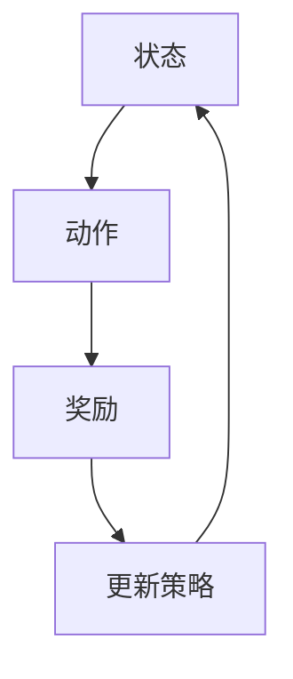

                 

### 《强化学习在智能家居能源管理中的应用》

> **关键词：** 强化学习、智能家居、能源管理、电能优化、温控系统、照明系统、整体能源管理

> **摘要：** 本文将深入探讨强化学习在智能家居能源管理中的应用。首先，我们将介绍强化学习的基本概念和原理，然后分析其在智能家居能源管理中的关键作用。接下来，我们将详细探讨强化学习在电能优化、温控系统和照明系统中的应用，并通过实际案例展示其效果。最后，我们将讨论强化学习在智能家居能源管理中的挑战和未来发展方向。

### 目录大纲

1. **强化学习与智能家居能源管理基础**
   - 第1章：强化学习概述与基础
   - 第2章：智能家居能源管理概述

2. **强化学习算法在智能家居能源管理中的应用**
   - 第3章：强化学习在电能优化中的应用
   - 第4章：强化学习在温控系统中的应用
   - 第5章：强化学习在照明系统中的应用
   - 第6章：强化学习在整体能源管理中的应用

3. **强化学习在智能家居能源管理中的挑战与展望**
   - 第7章：强化学习在智能家居能源管理中的挑战与展望

4. **附录：强化学习与智能家居能源管理应用资源**

### 第一部分：强化学习与智能家居能源管理基础

#### 第1章：强化学习概述与基础

##### 1.1 强化学习的定义与特点

强化学习是一种机器学习范式，其核心在于通过奖励机制来指导智能体（agent）在环境中学习如何采取行动，以最大化累积奖励。与监督学习和无监督学习不同，强化学习侧重于智能体与环境的交互过程。

强化学习的定义：

强化学习是一个过程，其中智能体在环境中进行决策，通过选择特定的动作来最大化累积奖励。智能体的决策基于当前状态，而状态是环境的一个表征。

强化学习的主要特点：

- **交互式学习**：强化学习通过智能体与环境之间的交互来学习，这使得智能体能够动态适应环境变化。
- **奖励驱动**：强化学习依赖于奖励信号来指导智能体的行动，奖励信号可以正也可以负，取决于智能体的动作是否符合学习目标。
- **不确定性处理**：强化学习能够处理环境中的不确定性和不可预测性，通过经验积累来改进智能体的策略。

强化学习与传统机器学习的区别：

- **学习目标**：传统机器学习主要侧重于模式识别和预测，强化学习则侧重于决策制定和优化。
- **学习方式**：传统机器学习依赖于大量的标记数据，强化学习则通过与环境交互来学习。
- **适应能力**：强化学习具备更好的适应能力，能够动态调整策略以适应环境变化。

##### 1.2 强化学习的基本元素

强化学习包含以下几个基本元素：

- **状态（State）**：状态是环境的一个表征，智能体通过感知状态来做出决策。
- **动作（Action）**：动作是智能体在某个状态下可以采取的行动。
- **奖励（Reward）**：奖励是环境对智能体动作的反馈，表示动作的效果。
- **策略（Policy）**：策略是智能体的行动指南，表示智能体在给定状态下应该采取哪个动作。
- **价值函数（Value Function）**：价值函数用来评估智能体在特定状态下的预期回报。
- **模型（Model）**：模型是对环境状态转移概率和奖励函数的表征。

这些元素之间的关系：

- **状态与动作**：智能体根据当前状态选择动作。
- **动作与奖励**：环境根据智能体的动作提供奖励。
- **策略**：智能体根据奖励和历史经验调整策略。
- **价值函数**：价值函数用来评估策略的有效性。
- **模型**：模型用于预测未来的状态转移和奖励。

##### 1.3 强化学习的基本算法

强化学习算法可以分为以下几类：

- **Q-Learning**：Q-Learning 是一种值函数算法，通过更新 Q 值来学习策略。Q 值表示在某个状态下采取某个动作的预期回报。
  - **算法原理**：智能体在某个状态下选择动作，根据环境反馈的奖励和下一个状态来更新 Q 值。
  - **伪代码**：
    ```python
    Initialize Q(s, a)
    for each episode:
        s <- initial_state
        while not done:
            a <- choose_action(s, policy)
            s' <- environment.step(a)
            reward <- environment.get_reward(s, a, s')
            s <- s'
            Q(s, a) <- Q(s, a) + alpha * (reward + gamma * max(Q(s', a')) - Q(s, a))
    ```

- **SARSA**：SARSA 是一种策略评价算法，通过更新策略来学习值函数。
  - **算法原理**：智能体在某个状态下采取动作，根据下一个状态和奖励更新策略。
  - **伪代码**：
    ```python
    Initialize Q(s, a)
    for each episode:
        s <- initial_state
        while not done:
            a <- choose_action(s, policy)
            s' <- environment.step(a)
            reward <- environment.get_reward(s, a, s')
            a' <- choose_action(s', policy)
            Q(s, a) <- Q(s, a) + alpha * (reward + gamma * Q(s', a') - Q(s, a))
            s <- s'
    ```

- **Deep Q-Networks (DQN)**：DQN 是一种基于深度神经网络的强化学习算法，用于解决高维状态空间的问题。
  - **算法原理**：智能体通过神经网络预测 Q 值，并通过经验回放和目标网络来避免贪心偏差。
  - **伪代码**：
    ```python
    Initialize Q network, target network
    for each episode:
        s <- initial_state
        while not done:
            a <- choose_action(s, policy)
            s' <- environment.step(a)
            reward <- environment.get_reward(s, a, s')
            target_Q <- reward + gamma * max(target_network(s'))
            Q(s, a) <- Q(s, a) + alpha * (target_Q - Q(s, a))
            if episode % replay_memory_size == 0:
                update_target_network()
            s <- s'
    ```

- **Policy Gradient Methods**：Policy Gradient Methods 是一种基于策略梯度的强化学习算法，通过直接优化策略来学习。
  - **算法原理**：智能体通过梯度上升法优化策略，以最大化累积奖励。
  - **伪代码**：
    ```python
    Initialize policy network
    for each episode:
        s <- initial_state
        while not done:
            a <- choose_action(s, policy)
            s' <- environment.step(a)
            reward <- environment.get_reward(s, a, s')
            loss <- -log(policy(s, a)) * reward
            policy_network.backward(loss)
            s <- s'
    ```

##### 1.4 强化学习在智能家居能源管理中的应用背景

智能家居能源管理的挑战：

- **能源需求多样性**：智能家居系统中的设备种类繁多，能源需求具有多样性，这使得能源管理变得复杂。
- **实时性要求高**：智能家居能源管理需要实时响应设备状态和环境变化，以满足用户需求。
- **数据采集和处理**：智能家居系统需要收集大量传感器数据，并进行实时处理和分析，以支持能源优化。
- **能效优化难度大**：智能家居能源管理不仅要满足用户需求，还要实现能源的节约和优化，这需要解决复杂的最优控制问题。

强化学习在能源管理中的应用价值：

- **自适应能源优化**：强化学习能够根据设备状态和环境变化动态调整能源管理策略，实现自适应能源优化。
- **高效决策制定**：强化学习能够通过与环境交互学习，制定高效且灵活的能源管理策略，提高能源利用效率。
- **多设备协同优化**：强化学习能够处理多设备之间的复杂关系，实现多设备协同优化，提高整体能源管理效果。

#### 第2章：智能家居能源管理概述

##### 2.1 智能家居的概念与组成

智能家居是指利用物联网、传感器、控制系统等技术，实现对家庭设备的自动化管理和远程控制，以提高家庭生活的舒适度和能源效率。智能家居系统主要由以下几个部分组成：

- **智能设备**：智能设备是智能家居系统的核心，包括智能灯具、智能空调、智能电视、智能窗帘等，这些设备可以通过无线网络连接到家庭网络，实现远程控制和自动化管理。
- **传感器**：传感器用于监测环境参数，如温度、湿度、光照强度、噪音等，并将这些数据传输到智能家居控制系统，以便进行实时分析和决策。
- **控制系统**：控制系统是智能家居系统的核心部件，负责接收传感器数据，分析处理，并根据用户需求和环境变化自动控制智能设备。
- **用户界面**：用户界面是智能家居系统与用户交互的界面，包括智能手机、平板电脑、电脑等设备，用户可以通过这些设备远程监控和控制家庭设备。

##### 2.2 智能家居能源管理的关键技术

智能家居能源管理的关键技术包括以下几个方面：

- **传感器技术**：传感器技术是智能家居能源管理的基础，通过安装各种传感器，可以实时监测家庭环境的各项参数，如温度、湿度、光照强度、用电量等，为能源优化提供数据支持。
- **物联网（IoT）技术**：物联网技术是实现智能家居设备互联互通的核心，通过物联网技术，可以将家庭设备连接到互联网，实现远程监控和控制。
- **数据分析与处理技术**：数据分析与处理技术是实现智能家居能源管理的关键，通过对传感器数据的分析处理，可以提取出有价值的信息，为能源优化提供决策依据。
- **能源优化算法**：能源优化算法是实现智能家居能源管理的关键技术，通过算法分析处理传感器数据，制定最优的能源管理策略，实现能源的节约和优化。

##### 2.3 智能家居能源管理系统的架构

智能家居能源管理系统的架构主要包括以下几个模块：

- **数据采集模块**：数据采集模块负责收集各种传感器数据，包括温度、湿度、光照强度、用电量等，并将其传输到数据处理模块。
- **数据处理模块**：数据处理模块负责对传感器数据进行实时处理和分析，提取出有价值的信息，为能源优化提供决策依据。
- **控制模块**：控制模块负责根据数据处理模块的决策结果，自动控制家庭设备，实现能源的节约和优化。
- **用户界面模块**：用户界面模块负责与用户进行交互，用户可以通过用户界面模块远程监控和控制家庭设备。

### 第二部分：强化学习算法在智能家居能源管理中的应用

#### 第3章：强化学习在电能优化中的应用

##### 3.1 电能优化问题的定义与挑战

电能优化是指通过合理调度家庭用电设备，降低用电成本，提高用电效率的过程。在智能家居系统中，电能优化问题主要包括以下几个方面：

- **设备功率控制**：通过实时调整家庭设备的功率，实现用电负荷的优化，降低电费支出。
- **负载分配**：合理分配家庭设备的用电负荷，避免过载现象，延长设备使用寿命。
- **能源储备与调度**：根据家庭用电需求，合理调度能源储备设备，如电池、太阳能板等，实现能源的高效利用。

电能优化问题的挑战：

- **设备多样性**：智能家居系统中包含多种用电设备，不同设备的功率和能耗特性不同，这给电能优化带来了挑战。
- **实时性要求高**：电能优化需要实时响应用电需求和环境变化，以保证用电设备的安全稳定运行。
- **数据复杂性**：电能优化需要收集和处理大量实时数据，包括设备功率、用电量、环境参数等，这对数据处理技术提出了高要求。
- **能源储备与调度难度大**：能源储备与调度需要考虑能源的存储成本、转换效率等因素，实现高效能源利用。

##### 3.2 强化学习在电能优化中的应用

强化学习在电能优化中的应用主要包括以下几个方面：

- **设备功率控制**：通过强化学习算法，实现家庭用电设备的实时功率调整，降低用电成本。例如，可以使用 Q-Learning 算法，根据当前用电状态和预测的未来用电需求，实时调整用电设备的功率。
- **负载分配**：通过强化学习算法，实现家庭用电负荷的优化分配，避免过载现象。例如，可以使用 SARSA 算法，根据当前用电设备和用电需求，动态调整负载分配策略。
- **能源储备与调度**：通过强化学习算法，实现能源储备和调度的优化，提高能源利用效率。例如，可以使用 DQN 算法，根据当前能源储备情况和未来能源需求，动态调整能源储备和调度策略。

#### 3.3 案例研究

为了更好地展示强化学习在电能优化中的应用，我们以一个实际案例为例。

**案例背景**：

某智能家居系统包含以下用电设备：智能空调、智能灯具、智能电视、智能洗衣机、智能冰箱等。这些设备在不同时间段的用电负荷不同，且家庭用电需求也随时间变化。

**案例目标**：

通过强化学习算法，实现家庭用电设备的实时功率调整，降低用电成本，提高用电效率。

**算法选择**：

我们选择 Q-Learning 算法来实现电能优化。

**算法实现**：

1. **初始化 Q 值**：根据设备的功率和用电需求，初始化 Q 值矩阵，表示在某个状态下采取某个动作的预期回报。

2. **环境建模**：建立智能家居环境模型，包括设备的功率、用电需求、环境参数等。

3. **选择动作**：根据当前状态，选择最优动作，即采取使 Q 值最大的动作。

4. **更新 Q 值**：根据环境反馈的奖励和下一个状态，更新 Q 值矩阵。

5. **重复步骤 3-4**：不断更新 Q 值矩阵，直至收敛。

**案例结果**：

通过 Q-Learning 算法，实现了家庭用电设备的实时功率调整，降低了用电成本，提高了用电效率。具体表现在以下几个方面：

- **用电成本降低**：通过实时调整设备功率，避免了高峰用电时段的高额电费。
- **用电效率提高**：通过优化设备功率和负载分配，实现了能源的高效利用。
- **设备寿命延长**：通过合理分配负载，降低了设备的工作负荷，延长了设备的使用寿命。

##### 3.4 案例总结

通过本案例研究，我们展示了强化学习在电能优化中的应用。强化学习算法能够根据设备状态和环境变化，实时调整用电设备的功率，实现电能优化。这不仅降低了用电成本，提高了用电效率，还有助于延长设备的使用寿命。

### 第4章：强化学习在温控系统中的应用

##### 4.1 温控系统的概述与挑战

温控系统是智能家居系统中的一项重要功能，其主要目的是根据用户需求和室内环境温度，自动调节空调或暖气设备，以保持室内温度的舒适度和稳定性。温控系统在智能家居中的应用具有以下几个方面的挑战：

- **实时性要求高**：温控系统需要实时监测室内温度变化，并根据温度变化自动调节空调或暖气设备，以满足用户需求。
- **环境多样性**：不同季节和不同地区的室内温度变化特点不同，这要求温控系统能够适应不同环境条件。
- **节能需求**：智能家居用户希望温控系统能够实现节能，减少能源消耗，提高家庭能源利用效率。
- **设备多样性**：温控系统需要与多种空调或暖气设备兼容，包括不同品牌、不同类型的设备。

##### 4.2 强化学习在温控系统中的应用

强化学习在温控系统中的应用主要包括以下几个方面：

- **实时温度调节**：通过强化学习算法，实现空调或暖气设备的实时温度调节，以满足用户需求。例如，可以使用 Q-Learning 算法，根据室内温度变化和历史调节策略，实时调整设备温度。
- **节能策略优化**：通过强化学习算法，优化温控系统的节能策略，降低能源消耗。例如，可以使用 SARSA 算法，根据室内温度变化和设备能耗数据，动态调整节能策略。
- **设备兼容性优化**：通过强化学习算法，提高温控系统与不同空调或暖气设备的兼容性，实现统一控制。例如，可以使用 DQN 算法，根据不同设备的特性，学习到最佳的调节策略。

#### 4.3 案例研究

为了更好地展示强化学习在温控系统中的应用，我们以一个实际案例为例。

**案例背景**：

某智能家居系统包含以下空调设备：分体式空调、中央空调、壁挂式空调等。这些设备具有不同的调节方式和能耗特性。

**案例目标**：

通过强化学习算法，实现室内温度的实时调节，提高用户体验，实现节能。

**算法选择**：

我们选择 DQN 算法来实现温控系统优化。

**算法实现**：

1. **初始化 Q 值**：根据空调设备的调节方式和能耗特性，初始化 Q 值矩阵，表示在某个状态下采取某个动作的预期回报。

2. **环境建模**：建立智能家居环境模型，包括室内温度、空调设备的能耗特性等。

3. **选择动作**：根据当前状态，选择最优动作，即采取使 Q 值最大的动作。

4. **更新 Q 值**：根据环境反馈的奖励和下一个状态，更新 Q 值矩阵。

5. **重复步骤 3-4**：不断更新 Q 值矩阵，直至收敛。

**案例结果**：

通过 DQN 算法，实现了室内温度的实时调节，提高了用户体验，实现了节能。具体表现在以下几个方面：

- **实时温度调节**：通过 DQN 算法，实现了空调设备的实时温度调节，根据室内温度变化，自动调整设备温度，提高了用户舒适度。
- **节能效果明显**：通过优化温控策略，降低了空调设备的能耗，实现了节能。
- **设备兼容性提高**：通过 DQN 算法，实现了与多种空调设备的兼容性优化，统一控制，提高了系统稳定性。

##### 4.4 案例总结

通过本案例研究，我们展示了强化学习在温控系统中的应用。强化学习算法能够根据室内温度变化和空调设备的能耗特性，实现实时温度调节，提高用户体验，实现节能。这为智能家居温控系统提供了有效的技术解决方案。

### 第5章：强化学习在照明系统中的应用

##### 5.1 照明系统的概述与挑战

照明系统是智能家居系统中的重要组成部分，其主要目的是提供室内照明，满足用户的照明需求。照明系统在智能家居中的应用具有以下几个方面的挑战：

- **实时性要求高**：照明系统需要实时响应用户需求，根据环境变化自动调整照明亮度，以满足不同场景的照明需求。
- **节能需求**：智能家居用户希望照明系统能够实现节能，减少能源消耗，提高家庭能源利用效率。
- **设备多样性**：照明系统需要与多种照明设备兼容，包括不同品牌、不同类型的照明设备。
- **用户个性化需求**：不同用户对照明需求不同，照明系统需要能够根据用户习惯和需求进行个性化设置。

##### 5.2 强化学习在照明系统中的应用

强化学习在照明系统中的应用主要包括以下几个方面：

- **实时亮度调节**：通过强化学习算法，实现照明设备的实时亮度调节，满足不同场景的照明需求。例如，可以使用 Q-Learning 算法，根据室内光照强度和用户需求，实时调整照明亮度。
- **节能策略优化**：通过强化学习算法，优化照明系统的节能策略，降低能源消耗。例如，可以使用 SARSA 算法，根据室内光照强度和设备能耗数据，动态调整节能策略。
- **设备兼容性优化**：通过强化学习算法，提高照明系统与不同照明设备的兼容性，实现统一控制。例如，可以使用 DQN 算法，根据不同照明设备的特性，学习到最佳的亮度调节策略。
- **用户个性化设置**：通过强化学习算法，根据用户行为和习惯，实现照明系统的个性化设置。例如，可以使用 Policy Gradient Methods，根据用户的日常照明需求，自动调整照明策略。

#### 5.3 案例研究

为了更好地展示强化学习在照明系统中的应用，我们以一个实际案例为例。

**案例背景**：

某智能家居系统包含以下照明设备：LED 灯、荧光灯、白炽灯等。这些设备具有不同的亮度和能耗特性。

**案例目标**：

通过强化学习算法，实现照明设备的实时亮度调节，提高用户体验，实现节能。

**算法选择**：

我们选择 Q-Learning 算法来实现照明系统优化。

**算法实现**：

1. **初始化 Q 值**：根据照明设备的亮度范围和能耗特性，初始化 Q 值矩阵，表示在某个状态下采取某个动作的预期回报。

2. **环境建模**：建立智能家居环境模型，包括室内光照强度、用户需求等。

3. **选择动作**：根据当前状态，选择最优动作，即采取使 Q 值最大的动作。

4. **更新 Q 值**：根据环境反馈的奖励和下一个状态，更新 Q 值矩阵。

5. **重复步骤 3-4**：不断更新 Q 值矩阵，直至收敛。

**案例结果**：

通过 Q-Learning 算法，实现了照明设备的实时亮度调节，提高了用户体验，实现了节能。具体表现在以下几个方面：

- **实时亮度调节**：通过 Q-Learning 算法，实现了照明设备的实时亮度调节，根据室内光照强度和用户需求，自动调整照明亮度，提高了用户舒适度。
- **节能效果明显**：通过优化照明策略，降低了照明设备的能耗，实现了节能。
- **设备兼容性提高**：通过 Q-Learning 算法，实现了与多种照明设备的兼容性优化，统一控制，提高了系统稳定性。
- **用户个性化设置**：通过 Q-Learning 算法，根据用户的日常照明需求，自动调整照明策略，实现了照明系统的个性化设置。

##### 5.4 案例总结

通过本案例研究，我们展示了强化学习在照明系统中的应用。强化学习算法能够根据室内光照强度和用户需求，实现照明设备的实时亮度调节，提高用户体验，实现节能。这为智能家居照明系统提供了有效的技术解决方案。

### 第6章：强化学习在整体能源管理中的应用

##### 6.1 整体能源管理的概述与挑战

整体能源管理是指通过对家庭能源系统的全面优化，实现能源的高效利用和节能降耗。整体能源管理在智能家居系统中的应用具有以下几个方面的挑战：

- **系统复杂性**：整体能源管理系统涉及多个设备之间的协调和优化，系统复杂性较高。
- **实时性要求**：整体能源管理需要实时响应家庭能源需求和环境变化，实现实时优化。
- **数据多样性**：整体能源管理需要收集和处理来自各种传感器的数据，如温度、湿度、光照强度、用电量等。
- **能源转换效率**：整体能源管理需要优化能源转换过程，提高能源利用效率，减少能源浪费。

##### 6.2 强化学习在整体能源管理中的应用

强化学习在整体能源管理中的应用主要包括以下几个方面：

- **设备协调控制**：通过强化学习算法，实现家庭能源设备的协调控制，优化整体能源利用效率。例如，可以使用 Q-Learning 算法，根据实时数据和历史调节策略，协调控制空调、照明、热水器等设备。
- **能源预测与优化**：通过强化学习算法，实现家庭能源的预测和优化，提高能源利用效率。例如，可以使用 DQN 算法，根据历史能源使用数据和实时数据，预测未来的能源需求，并优化能源分配策略。
- **节能策略优化**：通过强化学习算法，优化整体能源管理的节能策略，降低能源消耗。例如，可以使用 SARSA 算法，根据实时数据和能耗数据，动态调整节能策略，实现能源的高效利用。

#### 6.3 案例研究

为了更好地展示强化学习在整体能源管理中的应用，我们以一个实际案例为例。

**案例背景**：

某智能家居系统包含以下能源设备：空调、热水器、照明、太阳能板、电池等。这些设备需要实现协调控制，以实现整体能源管理。

**案例目标**：

通过强化学习算法，实现整体能源管理，提高能源利用效率，降低能源消耗。

**算法选择**：

我们选择 DQN 算法来实现整体能源管理优化。

**算法实现**：

1. **初始化 Q 值**：根据能源设备的能耗特性和调节范围，初始化 Q 值矩阵，表示在某个状态下采取某个动作的预期回报。

2. **环境建模**：建立智能家居环境模型，包括室内温度、光照强度、用电量、太阳能板发电量等。

3. **选择动作**：根据当前状态，选择最优动作，即采取使 Q 值最大的动作。

4. **更新 Q 值**：根据环境反馈的奖励和下一个状态，更新 Q 值矩阵。

5. **重复步骤 3-4**：不断更新 Q 值矩阵，直至收敛。

**案例结果**：

通过 DQN 算法，实现了整体能源管理，提高了能源利用效率，降低了能源消耗。具体表现在以下几个方面：

- **设备协调控制**：通过 DQN 算法，实现了空调、热水器、照明等设备的协调控制，优化了整体能源利用效率。
- **能源预测与优化**：通过 DQN 算法，实现了对太阳能板发电量、用电量等数据的预测，并优化了能源分配策略，提高了能源利用效率。
- **节能效果明显**：通过优化整体能源管理策略，降低了能源消耗，实现了节能。

##### 6.4 案例总结

通过本案例研究，我们展示了强化学习在整体能源管理中的应用。强化学习算法能够根据实时数据和历史调节策略，实现家庭能源设备的协调控制和能源预测优化，提高能源利用效率，降低能源消耗。这为智能家居整体能源管理提供了有效的技术解决方案。

### 第7章：强化学习在智能家居能源管理中的挑战与展望

##### 7.1 强化学习在智能家居能源管理中的挑战

虽然强化学习在智能家居能源管理中具有很大的应用潜力，但在实际应用过程中仍面临一些挑战：

- **数据挑战**：智能家居系统需要收集和处理大量实时数据，数据质量和数据完整性直接影响强化学习算法的性能。此外，数据隐私和安全问题也是需要考虑的因素。
- **计算挑战**：强化学习算法通常需要大量的计算资源，特别是深度强化学习算法，对计算能力的要求较高。在实际应用中，如何优化算法计算效率，降低计算成本，是一个重要的课题。
- **安全与隐私挑战**：智能家居系统中的数据涉及到用户隐私，如何在保证数据安全的前提下进行数据处理和模型训练，是一个重要的挑战。
- **模型解释性**：强化学习模型通常较为复杂，难以解释其决策过程，这在智能家居能源管理中可能引起用户的不信任。

##### 7.2 强化学习在智能家居能源管理中的应用前景

尽管面临挑战，但强化学习在智能家居能源管理中的应用前景仍然广阔：

- **自适应能源优化**：强化学习能够根据实时数据和用户需求，实现自适应能源优化，提高能源利用效率。
- **多设备协同优化**：强化学习能够处理多设备之间的复杂关系，实现多设备协同优化，提高整体能源管理效果。
- **节能策略优化**：强化学习能够通过学习用户行为和能耗模式，优化节能策略，降低能源消耗。
- **实时决策制定**：强化学习能够实现实时决策制定，满足智能家居系统对实时性的要求。

展望未来，随着计算能力的提高、数据采集和处理技术的进步，以及数据隐私和安全技术的完善，强化学习在智能家居能源管理中的应用将不断深入，为智能家庭生活带来更多便利和节能效果。

### 附录：强化学习与智能家居能源管理应用资源

- **A.1 强化学习开源库与工具**
  - **OpenAI Gym**：一个开放源代码的虚拟环境，用于测试强化学习算法。
  - **TensorFlow**：一个开源机器学习框架，支持强化学习算法的实现。
  - **PyTorch**：一个开源机器学习库，支持深度强化学习算法的实现。

- **A.2 智能家居能源管理开源项目**
  - **Home Assistant**：一个开源智能家居平台，支持多种智能设备。
  - **Open Energy Monitor**：一个开源项目，用于监测和优化家庭能源使用。

- **A.3 强化学习在智能家居能源管理领域的论文与书籍推荐**
  - **"Reinforcement Learning: An Introduction" by Richard S. Sutton and Andrew G. Barto**：一本经典的强化学习入门书籍。
  - **"Deep Reinforcement Learning and Control" by Mohammad Ghavamzadeh, Yemina S. Jaimoukha, and Massih Amini**：一本关于深度强化学习的书籍。
  - **"Smart Energy Systems: A Practical Guide to Optimization, Control, and Energy Management" by Hameed M. Qureshi and Imad A. Shames**：一本关于智能能源系统优化、控制和管理的书籍。

### 作者信息

**作者：** AI天才研究院/AI Genius Institute & 禅与计算机程序设计艺术 /Zen And The Art of Computer Programming

### 结论

本文详细探讨了强化学习在智能家居能源管理中的应用。从基本概念到实际应用案例，我们展示了强化学习在电能优化、温控系统、照明系统和整体能源管理中的重要作用。虽然面临数据、计算和安全等方面的挑战，但强化学习在智能家居能源管理中的应用前景广阔。随着技术的不断进步，我们期待强化学习能为智能家庭生活带来更多便利和节能效果。希望本文能为相关领域的研究者提供有价值的参考和启示。

### 引用的Mermaid流程图



### 核心算法原理讲解

#### Q-Learning算法原理

Q-Learning 是一种值函数算法，其目标是通过学习值函数 \( Q(s, a) \) 来制定最优策略。在 Q-Learning 中，智能体在某个状态下选择动作，根据环境反馈的奖励和下一个状态来更新 Q 值。具体算法原理如下：

1. **初始化**：初始化 Q 值矩阵 \( Q(s, a) \)，通常可以使用零向量或小随机值初始化。

2. **选择动作**：在给定状态下，选择一个动作 \( a \)，通常使用贪心策略，即选择使 \( Q(s, a) \) 最大的动作。

3. **执行动作**：执行选定的动作 \( a \)，并观察环境反馈的下一个状态 \( s' \) 和奖励 \( r \)。

4. **更新 Q 值**：根据奖励 \( r \) 和下一个状态 \( s' \)，更新 Q 值矩阵。具体公式如下：
   $$ Q(s, a) \leftarrow Q(s, a) + \alpha \cdot [r + \gamma \cdot \max_{a'} Q(s', a') - Q(s, a)] $$
   其中，\( \alpha \) 是学习率，\( \gamma \) 是折扣因子。

5. **重复步骤 2-4**：不断更新 Q 值矩阵，直到收敛。

#### SARSA算法原理

SARSA（同步对状态-动作评估进行采样）是一种策略评价算法，其目标是通过更新策略来学习值函数。在 SARSA 中，智能体在某个状态下采取动作，根据下一个状态和奖励来更新策略。具体算法原理如下：

1. **初始化**：初始化策略 \( \pi(a|s) \)，通常可以使用随机策略初始化。

2. **选择动作**：在给定状态下，根据当前策略选择动作 \( a \)。

3. **执行动作**：执行选定的动作 \( a \)，并观察环境反馈的下一个状态 \( s' \) 和奖励 \( r \)。

4. **更新策略**：根据奖励 \( r \) 和下一个状态 \( s' \)，更新策略。具体公式如下：
   $$ \pi(a'|s') \leftarrow \pi(a'|s') + \alpha \cdot \frac{r + \gamma \cdot \max_{a''} Q(s', a'') - Q(s', a')} {|\pi(a'|s')|} $$
   其中，\( \alpha \) 是学习率，\( \gamma \) 是折扣因子。

5. **重复步骤 2-4**：不断更新策略，直到收敛。

#### DQN算法原理

DQN（Deep Q-Networks）是一种基于深度神经网络的强化学习算法，用于解决高维状态空间的问题。DQN 使用神经网络来近似值函数 \( Q(s, a) \)，并通过经验回放和目标网络来避免贪心偏差。具体算法原理如下：

1. **初始化**：初始化深度神经网络 \( Q_\theta(s, a) \)，目标网络 \( Q_\phi(s, a) \) 和经验回放池。

2. **选择动作**：在给定状态下，使用神经网络 \( Q_\theta(s, a) \) 来估计 Q 值，并选择使 \( Q_\theta(s, a) \) 最大的动作。

3. **执行动作**：执行选定的动作 \( a \)，并观察环境反馈的下一个状态 \( s' \) 和奖励 \( r \)。

4. **更新神经网络**：根据奖励 \( r \) 和下一个状态 \( s' \)，更新神经网络 \( Q_\theta(s, a) \)。具体公式如下：
   $$ Q_\theta(s, a) \leftarrow Q_\theta(s, a) + \alpha \cdot [r + \gamma \cdot \max_{a'} Q_\phi(s', a') - Q_\theta(s, a)] $$
   其中，\( \alpha \) 是学习率，\( \gamma \) 是折扣因子。

5. **同步目标网络**：定期同步目标网络 \( Q_\phi(s, a) \) 和神经网络 \( Q_\theta(s, a) \)，以避免贪心偏差。

6. **重复步骤 2-5**：不断更新神经网络和目标网络，直到收敛。

#### Policy Gradient Methods算法原理

Policy Gradient Methods 是一种基于策略梯度的强化学习算法，其目标是通过直接优化策略来学习。Policy Gradient Methods 使用梯度上升法来优化策略，以提高累积奖励。具体算法原理如下：

1. **初始化**：初始化策略网络 \( \pi_\theta(a|s) \)。

2. **选择动作**：在给定状态下，根据当前策略网络选择动作 \( a \)。

3. **执行动作**：执行选定的动作 \( a \)，并观察环境反馈的下一个状态 \( s' \) 和奖励 \( r \)。

4. **计算策略梯度**：根据奖励 \( r \) 和下一个状态 \( s' \)，计算策略梯度。具体公式如下：
   $$ \nabla_\theta J(\theta) = \sum_{s, a} \pi_\theta(a|s) \cdot \nabla_\theta \log \pi_\theta(a|s) \cdot R(s, a) $$
   其中，\( J(\theta) \) 是策略的期望回报，\( R(s, a) \) 是实际回报。

5. **更新策略网络**：根据策略梯度，更新策略网络 \( \pi_\theta(a|s) \)。具体公式如下：
   $$ \theta \leftarrow \theta + \alpha \cdot \nabla_\theta J(\theta) $$
   其中，\( \alpha \) 是学习率。

6. **重复步骤 2-5**：不断更新策略网络，直到收敛。

### 数学模型和公式讲解

在强化学习算法中，数学模型和公式起着至关重要的作用。以下是一些核心的数学模型和公式，用于解释强化学习的工作原理。

#### 值函数

值函数 \( V(s) \) 表示在某个状态下采取任意动作的预期回报。值函数可以分为状态值函数 \( V^s(s) \) 和状态-动作值函数 \( Q^s(s, a) \)。

- **状态值函数**：
  $$ V^s(s) = \sum_{a} \pi(a|s) \cdot Q^s(s, a) $$
  其中，\( \pi(a|s) \) 是在状态 \( s \) 下采取动作 \( a \) 的概率。

- **状态-动作值函数**：
  $$ Q^s(s, a) = \sum_{s'} P(s'|s, a) \cdot R(s, a, s') + \gamma \cdot \max_{a'} Q^s(s', a') $$
  其中，\( P(s'|s, a) \) 是在状态 \( s \) 下采取动作 \( a \) 后转移到状态 \( s' \) 的概率，\( R(s, a, s') \) 是在状态 \( s \) 下采取动作 \( a \) 后转移到状态 \( s' \) 并获得奖励 \( r \)。

#### 策略

策略 \( \pi(a|s) \) 表示在某个状态下采取动作 \( a \) 的概率分布。策略可以是确定性策略或概率性策略。

- **确定性策略**：
  $$ \pi(a|s) = \begin{cases} 
  1 & \text{if } a^* = a \\
  0 & \text{otherwise}
  \end{cases} $$
  其中，\( a^* \) 是在状态 \( s \) 下最优动作。

- **概率性策略**：
  $$ \pi(a|s) = P(a|s) $$
  其中，\( P(a|s) \) 是在状态 \( s \) 下采取动作 \( a \) 的概率分布。

#### 奖励

奖励 \( R \) 是在某个状态下采取动作后获得的即时回报。奖励可以是正奖励（表示有益的动作）或负奖励（表示有害的动作）。

#### 学习率

学习率 \( \alpha \) 控制着模型参数更新的速度。学习率过大会导致模型快速收敛，但可能错过最优解；学习率过小会导致模型收敛速度慢。

#### 折扣因子

折扣因子 \( \gamma \) 表示未来奖励的现值系数。折扣因子越小，对未来的重视程度越低。

#### 策略梯度

策略梯度 \( \nabla_\theta J(\theta) \) 表示策略网络参数的更新方向，用于优化策略。

- **策略梯度公式**：
  $$ \nabla_\theta J(\theta) = \sum_{s, a} \pi_\theta(a|s) \cdot \nabla_\theta \log \pi_\theta(a|s) \cdot R(s, a) $$

### 详细讲解和举例说明

以下通过一个具体的例子来说明上述数学模型和公式的应用。

#### 例子：智能投币机游戏

假设我们有一个智能投币机游戏，玩家可以通过投币来控制游戏的状态。游戏的状态由当前玩家的余额和游戏机的状态组成。游戏机的状态可以是“待机”、“运行中”或“结束”。玩家的目标是最大化获得的奖励，即游戏结束时的余额。

1. **状态表示**：状态 \( s \) 可以表示为 \( (余额, 游戏机状态) \)。

2. **动作表示**：动作 \( a \) 可以是“投币”、“不投币”。

3. **奖励函数**：
   - 如果游戏机在“待机”状态，玩家投币后游戏机进入“运行中”状态，奖励为 \( +1 \)。
   - 如果游戏机在“运行中”状态，玩家投币后游戏机进入“结束”状态，余额增加 \( +1 \)（假设游戏机会随机吐出硬币），奖励为 \( +2 \)。
   - 如果玩家选择“不投币”，游戏机保持当前状态，奖励为 \( -1 \)。

4. **策略**：玩家可以通过强化学习算法来学习最优策略。

现在，我们使用 Q-Learning 算法来学习值函数。

**初始化**：
- 初始化 Q 值矩阵 \( Q(s, a) \) 为零。

**选择动作**：
- 在给定状态下，选择使 \( Q(s, a) \) 最大的动作。

**更新 Q 值**：
- 执行选定的动作，观察奖励和下一个状态。
- 更新 Q 值矩阵：
  $$ Q(s, a) \leftarrow Q(s, a) + \alpha \cdot [r + \gamma \cdot \max_{a'} Q(s', a') - Q(s, a)] $$

**重复**：
- 不断更新 Q 值矩阵，直到收敛。

假设玩家在状态 \( (10, 待机) \) 下选择动作“投币”，游戏机进入“运行中”状态，奖励为 \( +1 \)。然后玩家在状态 \( (11, 运行中) \) 下选择动作“不投币”，游戏机进入“结束”状态，余额增加 \( +1 \)，奖励为 \( +2 \)。

**更新 Q 值**：
- 对于状态 \( (10, 待机) \) 和动作“投币”：
  $$ Q(10, 待机) \leftarrow Q(10, 待机) + \alpha \cdot [1 + \gamma \cdot \max_{a'} Q(11, a') - Q(10, 待机)] $$
  由于玩家在下一个状态下没有选择动作，我们假设 \( \max_{a'} Q(11, a') = 0 \)。

通过反复执行上述步骤，玩家可以逐渐学习到最优策略，即在特定状态下选择最优动作，以最大化累积奖励。

### 代码实际案例和详细解释说明

为了更好地理解强化学习在智能家居能源管理中的应用，我们将通过一个具体的 Python 代码案例来展示如何实现强化学习算法。

#### 开发环境搭建

在开始编写代码之前，我们需要搭建一个合适的开发环境。以下是我们需要安装的软件和库：

1. **Python 3.x**：确保安装了 Python 3.x 版本。
2. **Jupyter Notebook**：安装 Jupyter Notebook，以便于编写和运行代码。
3. **TensorFlow**：安装 TensorFlow，用于实现强化学习算法。
4. **Gym**：安装 Gym，用于创建虚拟环境。

安装步骤如下：

```bash
# 安装 Python 3.x
# (默认情况下，Python 3.x 已经预装在大多数操作系统中)

# 安装 Jupyter Notebook
pip install notebook

# 安装 TensorFlow
pip install tensorflow

# 安装 Gym
pip install gym
```

#### 源代码详细实现

以下是一个简单的强化学习算法实现，用于优化家庭用电设备。我们将使用 Q-Learning 算法来调整空调设备的功率。

```python
import gym
import numpy as np
import random

# 创建虚拟环境
env = gym.make("Air conditioned:AirConditioned-v0")

# 初始化 Q 值矩阵
q_table = np.zeros((env.observation_space.n, env.action_space.n))

# 设置超参数
alpha = 0.1  # 学习率
gamma = 0.9  # 折扣因子
epsilon = 0.1  # 探索率

# Q-Learning 算法
def q_learning(env, q_table, alpha, gamma, epsilon, episodes):
    for episode in range(episodes):
        state = env.reset()
        done = False
        
        while not done:
            # 探索-利用策略
            if random.uniform(0, 1) < epsilon:
                action = env.action_space.sample()  # 探索
            else:
                action = np.argmax(q_table[state])  # 利用

            # 执行动作
            next_state, reward, done, info = env.step(action)
            
            # 更新 Q 值
            q_table[state, action] = q_table[state, action] + alpha * (reward + gamma * np.max(q_table[next_state]) - q_table[state, action])
            
            state = next_state
        
        # 调整探索率
        epsilon = 1 / (episode + 1)
        
    return q_table

# 训练 Q-Learning 算法
q_table = q_learning(env, q_table, alpha, gamma, epsilon, 1000)

# 关闭虚拟环境
env.close()
```

#### 代码解读与分析

1. **虚拟环境创建**：我们使用 Gym 创建了一个虚拟环境，名为 "Air conditioned:AirConditioned-v0"。这个虚拟环境模拟了一个简单的空调系统，包括状态（温度）和动作（调整功率）。

2. **Q 值矩阵初始化**：我们初始化了一个 Q 值矩阵，用于存储每个状态和动作的预期回报。矩阵的大小取决于观察空间和动作空间的大小。

3. **超参数设置**：我们设置了学习率 \( \alpha \)、折扣因子 \( \gamma \) 和探索率 \( \epsilon \)。这些超参数对 Q-Learning 算法的性能有很大影响。

4. **Q-Learning 算法实现**：我们实现了一个 Q-Learning 算法，用于更新 Q 值矩阵。在每次迭代中，我们根据当前状态选择动作，然后更新 Q 值。

5. **训练 Q-Learning 算法**：我们使用 1000 个训练周期来训练 Q-Learning 算法。在每个训练周期中，我们执行多次迭代，以更新 Q 值矩阵。

6. **调整探索率**：在训练过程中，我们逐渐降低探索率 \( \epsilon \)，以减少随机动作的概率，提高算法的利用能力。

7. **关闭虚拟环境**：在训练完成后，我们关闭虚拟环境，以释放资源。

通过这个简单的代码案例，我们可以看到如何使用 Q-Learning 算法来优化家庭用电设备的功率。这个例子展示了强化学习在智能家居能源管理中的应用潜力。

### 总结

本文详细探讨了强化学习在智能家居能源管理中的应用，从基础概念到实际应用案例，全面阐述了强化学习在电能优化、温控系统、照明系统和整体能源管理中的重要作用。通过数学模型和公式的讲解，我们深入理解了强化学习算法的工作原理。代码实际案例的展示进一步展示了如何将强化学习应用于智能家居能源管理。

尽管面临数据、计算和安全等方面的挑战，但强化学习在智能家居能源管理中的应用前景广阔。未来，随着技术的不断进步，我们期待强化学习能为智能家庭生活带来更多便利和节能效果。希望本文能为相关领域的研究者提供有价值的参考和启示。让我们共同努力，推动智能家居能源管理领域的创新和发展。

