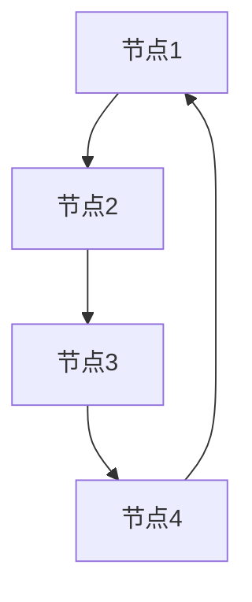
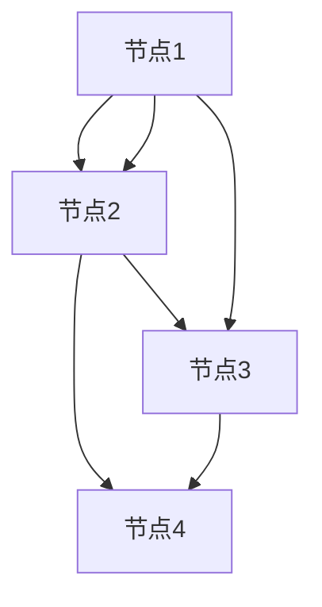

                 

### 文章标题

强化学习在自适应网络路由中的应用

> **关键词：** 强化学习；自适应网络路由；动态网络环境；资源分配；拥塞控制；算法优化

> **摘要：** 本文旨在探讨强化学习在自适应网络路由中的应用，分析其基本概念、算法原理，并结合实际案例，展示强化学习在动态网络路由、拥塞控制和资源分配等方面的优势与挑战。通过详细解析算法实现与优化方向，本文为未来强化学习在自适应网络路由领域的应用提供了思路。

----------------------------------------------------------------

### 《强化学习在自适应网络路由中的应用》书籍目录大纲

#### 第一部分：强化学习基础

##### 第1章：强化学习概述

##### 第2章：强化学习的基本算法

##### 第3章：强化学习中的探索与利用

##### 第4章：强化学习的应用领域

#### 第二部分：自适应网络路由

##### 第5章：网络路由概述

##### 第6章：现有网络路由算法

##### 第7章：自适应网络路由的挑战

##### 第8章：强化学习在自适应网络路由中的应用

#### 第三部分：强化学习在自适应网络路由中的应用实现

##### 第9章：网络路由模型的构建

##### 第10章：强化学习算法的选择与实现

##### 第11章：案例分析：基于强化学习的自适应网络路由算法

#### 第四部分：未来展望

##### 第12章：强化学习在自适应网络路由中的未来发展趋势

##### 第13章：强化学习在自适应网络路由中的挑战与解决方案

##### 第14章：强化学习在自适应网络路由中的应用前景

#### 附录

##### 附录A：强化学习与自适应网络路由相关资源

----------------------------------------------------------------

## 第一部分：强化学习基础

### 第1章：强化学习概述

#### 1.1 强化学习的基本概念

强化学习（Reinforcement Learning，简称RL）是机器学习中的一个重要分支，其核心目标是使一个智能体在给定环境中通过学习获得最佳行为策略，以最大化累积奖励。与监督学习和无监督学习不同，强化学习中的智能体需要通过试错（trial and error）的方式来探索环境，并根据环境提供的即时奖励调整自身行为。

强化学习的主要组成部分包括：

- **智能体（Agent）**：执行动作、感知环境的主体。
- **环境（Environment）**：智能体执行动作的上下文，提供状态和即时奖励。
- **状态（State）**：智能体在某一时刻所处的情境。
- **动作（Action）**：智能体可以采取的行为。
- **奖励（Reward）**：智能体执行动作后从环境中获得的即时反馈。

强化学习的基本概念可以概括为“学习如何在一个特定的环境中采取最佳动作以最大化累积奖励”。其关键要素包括探索（exploration）和利用（exploitation）。

#### 1.2 强化学习的基本算法

强化学习有许多经典的算法，以下是其中几个重要的算法：

- **Q-learning算法**：Q-learning算法是一种值函数方法，其核心思想是更新Q值（状态-动作值函数），通过选择最大化Q值的动作来学习最优策略。
  
  $$ Q(s, a) = r(s, a) + \gamma \max_{a'} Q(s', a') $$

  其中，$r(s, a)$表示在状态$s$下执行动作$a$后获得的即时奖励，$\gamma$是折扣因子，用于平衡即时奖励和未来奖励。

- **SARSA算法**：SARSA（On-Policy）算法是一种策略评估算法，它与Q-learning算法类似，但使用当前策略来选择下一状态的动作。
  
  $$ Q(s, a) = r(s, a) + \alpha [Q(s', a') - Q(s, a)] $$

  其中，$\alpha$是学习率。

- **Deep Q Network（DQN）**：DQN算法是一种基于深度学习的强化学习算法，它可以处理高维的状态空间，通过深度神经网络来近似Q值函数。

  $$ Q(s, a) = \frac{1}{N} \sum_{i=1}^{N} y_i w \theta $$

  其中，$w$是深度神经网络权重，$\theta$是网络参数，$y_i$是估计的Q值。

#### 1.3 强化学习中的探索与利用

在强化学习中，探索与利用是一个重要的平衡问题。探索是指智能体选择未知但可能带来高奖励的动作，而利用则是指智能体选择已知的最佳动作。

- **ε-贪婪策略**：ε-贪婪策略是一种常用的探索策略，其中ε是一个较小的常数。在每次动作选择中，智能体以概率1-ε选择当前最优动作，以ε的概率随机选择动作。

- **UCB算法**：UCB（Upper Confidence Bound）算法是一种平衡探索与利用的算法，它通过估计每个动作的平均奖励并计算上界来选择动作。

  $$ UCB(s, a) = \bar{r}(s, a) + \sqrt{\frac{2 \ln t(s, a)}{t(s, a')}} $$

  其中，$\bar{r}(s, a)$是动作$a$在状态$s$下的平均奖励，$t(s, a)$是动作$a$在状态$s$下的选择次数。

#### 1.4 强化学习的应用领域

强化学习在多个领域都有广泛应用，以下是其中几个重要的领域：

- **机器人控制**：强化学习可以用于机器人路径规划、动作控制等任务。
- **游戏玩法**：强化学习在游戏AI中有着广泛应用，如围棋、星际争霸等。
- **网络路由**：强化学习可以用于自适应网络路由，优化数据包传输路径。
- **资源分配**：强化学习可以用于动态资源分配，如电力调度、云计算资源管理。

在本文中，我们将重点关注强化学习在自适应网络路由中的应用，探讨其基本概念、算法原理以及实际应用案例。

----------------------------------------------------------------

## 第二部分：自适应网络路由

### 第2章：网络路由概述

#### 2.1 网络路由的基本概念

网络路由（Network Routing）是计算机网络中的一个核心功能，它涉及将数据包从源地址传输到目标地址的过程。路由的基本概念包括：

- **路由器（Router）**：网络设备，用于将数据包从源地址传输到目标地址。
- **路由表（Routing Table）**：路由器维护的一个表格，用于记录不同网络之间的路径信息。
- **路由算法（Routing Algorithm）**：用于计算最佳路径的算法，如Dijkstra算法、Bellman-Ford算法等。

网络路由的主要任务是确保数据包在网络中高效、可靠地传输，同时考虑网络的负载均衡、延迟和带宽等因素。

#### 2.2 现有网络路由算法

目前，已有多种网络路由算法被广泛应用，以下是其中几种主要的算法：

- **Dijkstra算法**：一种基于图论的最短路径算法，用于计算单源最短路径。

  $$ \text{Dijkstra}(G, s) = \min \{ d(v) \mid v \in V, d(v) \text{ is defined} \} $$

  其中，$G$是网络图，$s$是源节点，$d(v)$是从源节点到节点$v$的最短路径长度。

- **Bellman-Ford算法**：一种基于动态规划的最短路径算法，可以处理负权环。

  $$ d(v) = \min \{ d(u) + w(u, v) \mid u \in V, u \neq v \} $$

  其中，$d(v)$是从源节点到节点$v$的最短路径长度，$w(u, v)$是从节点$u$到节点$v$的边权重。

- **A*算法**：一种改进的Dijkstra算法，通过结合启发式函数来加速最短路径计算。

  $$ f(v) = g(v) + h(v) $$

  其中，$f(v)$是从源节点到节点$v$的评估函数，$g(v)$是从源节点到节点$v$的路径代价，$h(v)$是从节点$v$到目标节点的启发式估计。

#### 2.3 自适应网络路由的挑战

自适应网络路由（Adaptive Network Routing）是一种能够根据网络状态动态调整路由策略的技术。在动态网络环境中，自适应网络路由需要应对多种挑战：

- **动态网络环境**：网络拓扑和流量模式可能会快速变化，自适应路由算法需要能够实时调整路由策略。

- **网络拓扑变化**：网络中的节点和链路可能会出现故障或增加，自适应路由算法需要能够适应这些变化。

- **资源分配问题**：在动态网络环境中，资源（如带宽、处理能力）的分配需要优化，以最大化网络性能和吞吐量。

- **负载均衡**：在多路径网络中，负载均衡算法需要平衡各路径的流量，以避免网络拥塞。

- **安全性**：自适应路由算法需要考虑网络安全，避免攻击和恶意流量的影响。

#### 2.4 强化学习在自适应网络路由中的应用

强化学习在自适应网络路由中具有很大的潜力，其通过学习环境和动作之间的关系，可以动态调整路由策略，提高网络性能。以下是强化学习在自适应网络路由中的应用：

- **动态路由算法**：强化学习可以用于开发动态路由算法，使路由器能够根据当前网络状态选择最佳路径。

- **拥塞控制**：强化学习可以用于拥塞控制，通过学习流量和路径之间的关系，优化流量分配，减少网络拥塞。

- **资源分配**：强化学习可以用于资源分配，根据网络状态动态调整资源分配策略，提高网络效率和性能。

在接下来的章节中，我们将进一步探讨强化学习在自适应网络路由中的应用，分析其优势与挑战。

----------------------------------------------------------------

### 第3章：强化学习在自适应网络路由中的应用

#### 3.1 强化学习在路由问题中的适用性

强化学习在自适应网络路由中的应用具有显著的优势，主要源于其能够处理动态和不确定性的网络环境。传统路由算法通常依赖于静态的网络拓扑和流量模式，难以适应实时变化的网络状况。相比之下，强化学习通过不断学习环境和动作之间的关系，能够动态调整路由策略，从而实现更优的网络性能。

强化学习与路由问题的结合主要体现在以下几个方面：

- **状态表示**：在强化学习中，状态表示为网络当前的状态，包括节点负载、链路带宽、延迟等信息。状态信息可以用来评估当前网络状况，从而指导路由策略的调整。

- **动作选择**：动作表示为路由器在网络中选择的数据包传输路径。通过学习，强化学习算法可以找到最佳路径，以最大化网络性能指标，如吞吐量、延迟和带宽利用率。

- **奖励函数**：奖励函数用于评估动作的效果，激励路由器选择更有利的行为。在自适应网络路由中，奖励函数可以设计为网络性能的指标，如数据包成功传输的比例、链路利用率等。

强化学习在路由问题中的优势包括：

- **适应性**：强化学习能够适应动态变化的网络环境，实时调整路由策略，提高网络性能。
- **自优化性**：通过不断学习网络状态和动作之间的关系，强化学习算法可以实现自优化，找到最佳路由策略。
- **鲁棒性**：强化学习算法能够处理不确定性因素，如网络故障、恶意流量等，提高网络稳定性和可靠性。

#### 3.2 强化学习在自适应网络路由中的应用案例

强化学习在自适应网络路由中已有很多实际应用案例，以下是其中几个重要的应用场景：

- **动态路由算法**：基于强化学习的动态路由算法可以实时调整路由策略，以应对网络状态的变化。例如，在数据中心网络中，强化学习算法可以根据实时流量信息，动态调整虚拟机间的数据传输路径，提高网络效率和性能。

- **拥塞控制**：在拥塞控制中，强化学习算法可以学习流量和路径之间的关系，优化流量分配策略，减少网络拥塞。例如，在互联网服务提供商（ISP）的网络中，强化学习算法可以自动调整流量路由，降低网络负载，提高用户体验。

- **资源分配**：在资源分配中，强化学习算法可以根据网络状态动态调整资源分配策略，提高资源利用率。例如，在云计算环境中，强化学习算法可以实时调整虚拟机资源的分配，以最大化资源利用率和系统性能。

#### 3.3 强化学习在自适应网络路由中的挑战

尽管强化学习在自适应网络路由中具有显著的优势，但其应用也面临一些挑战：

- **策略稳定性和收敛性**：强化学习算法在长期运行中需要保持策略的稳定性和收敛性，以确保网络性能的持续优化。然而，在动态网络环境中，策略稳定性和收敛性可能受到不确定性因素的影响。

- **大规模网络环境下的可扩展性**：在大规模网络环境中，强化学习算法需要处理大量的状态和动作空间，从而增加计算复杂度和通信开销。如何在大规模网络环境中高效地实现强化学习算法，是一个重要的挑战。

- **网络安全与隐私保护**：在自适应网络路由中，强化学习算法需要访问网络状态和流量信息，这可能导致网络安全和隐私问题。如何确保算法的网络安全性和隐私保护，是一个亟待解决的问题。

在接下来的章节中，我们将进一步探讨强化学习在自适应网络路由中的应用实现，分析算法的具体实现方法和优化策略。

----------------------------------------------------------------

## 第三部分：强化学习在自适应网络路由中的应用实现

### 第4章：强化学习在自适应网络路由中的应用实现

#### 4.1 网络路由模型的构建

要实现强化学习在自适应网络路由中的应用，首先需要构建一个合适的网络路由模型。这个模型需要能够准确地表示网络状态、动作空间和奖励函数。

#### 4.1.1 网络拓扑的表示

网络拓扑可以用一个无向图$G=(V, E)$表示，其中$V$是节点集合，$E$是边集合。每个节点代表网络中的路由器或交换机，每条边代表网络中的链路。节点和边可以具有不同的属性，如带宽、延迟和可靠性。



#### 4.1.2 状态和动作的定义

状态（State）是网络当前状态的一个向量，可以包括以下信息：

- **节点负载**：每个节点的当前负载，如处理能力和带宽利用率。
- **链路状态**：每个链路的当前状态，如带宽、延迟和拥塞程度。
- **数据包信息**：当前在网络中传输的数据包的数量、类型和目的地。

动作（Action）是路由器在某一时刻可以选择的传输路径。对于每个节点，可以定义一个动作空间，如从该节点出发的所有可能路径。动作空间可以表示为：

$$ A(s) = \{ a_1, a_2, ..., a_n \} $$

其中，$a_i$是从节点$i$出发的一条路径。



#### 4.1.3 奖励函数的设计

奖励函数（Reward Function）是评估动作效果的关键。在自适应网络路由中，奖励函数可以设计为以下指标：

- **传输成功率**：数据包成功传输的比例。
- **延迟**：数据包传输的平均延迟。
- **带宽利用率**：网络带宽的利用率。

一个简单的奖励函数可以表示为：

$$ R(s, a) = \frac{1}{N} \sum_{i=1}^{N} r_i $$

其中，$r_i$是第$i$个数据包的传输成功与否的奖励，$N$是数据包的总数。

```mermaid
graph TD
A[节点1] --> B[节点2]
B --> C[节点3]
D[节点4]

A --> B
A --> C
B --> D
C --> D

state: [状态]
action: [动作]
reward: [奖励]

state --> action
action --> reward
```

#### 4.2 强化学习算法的选择与实现

在自适应网络路由中，有多种强化学习算法可以选择，如Q-learning、SARSA和DQN。以下分别介绍这些算法的选择和实现。

#### 4.2.1 Q-learning算法的实现

Q-learning算法是一种基于值函数的强化学习算法，其核心思想是更新Q值（状态-动作值函数），选择最大化Q值的动作。

伪代码如下：

```python
# 初始化Q值表
Q = 初始化Q值表

# 设置学习率和折扣因子
alpha = 0.1
gamma = 0.9

# 设置探索策略（ε-贪婪）
epsilon = 0.1

# 运行学习过程
for episode in 范围(总步数):
    # 初始化状态
    state = 环境初始状态
    
    # 运行 episode 步
    for step in 范围(每episode的步数):
        # 选择动作
        if random() < epsilon:
            action = 随机选择动作
        else:
            action = 选择Q值最大的动作
        
        # 执行动作，获得下一状态和奖励
        next_state, reward = 环境执行动作(action)
        
        # 更新Q值
        Q[state, action] = Q[state, action] + alpha * (reward + gamma * max(Q[next_state, all_actions]) - Q[state, action])
        
        # 更新状态
        state = next_state
```

#### 4.2.2 SARSA算法的实现

SARSA算法是一种基于策略的强化学习算法，它使用当前策略来选择动作，并通过更新当前策略来学习。

伪代码如下：

```python
# 初始化Q值表
Q = 初始化Q值表

# 设置学习率和折扣因子
alpha = 0.1
gamma = 0.9

# 运行学习过程
for episode in 范围(总步数):
    # 初始化状态
    state = 环境初始状态
    
    # 运行 episode 步
    for step in 范围(每episode的步数):
        # 选择动作
        action = 选择Q值最大的动作
        
        # 执行动作，获得下一状态和奖励
        next_state, reward = 环境执行动作(action)
        
        # 更新Q值
        Q[state, action] = Q[state, action] + alpha * (reward + gamma * Q[next_state, next_action] - Q[state, action])
        
        # 更新状态和动作
        state = next_state
        action = 选择Q值最大的动作
```

#### 4.2.3 DQN算法的实现

DQN算法是一种基于深度学习的强化学习算法，它使用深度神经网络来近似Q值函数。

伪代码如下：

```python
# 初始化深度神经网络
DQN = 初始化DQN模型

# 设置学习率和折扣因子
alpha = 0.1
gamma = 0.9

# 运行学习过程
for episode in 范围(总步数):
    # 初始化状态
    state = 环境初始状态
    
    # 运行 episode 步
    for step in 范围(每episode的步数):
        # 选择动作
        action = 选择Q值最大的动作
        
        # 执行动作，获得下一状态和奖励
        next_state, reward = 环境执行动作(action)
        
        # 计算目标Q值
        target_Q = reward + gamma * max(DQN.predict(next_state))
        
        # 更新Q值
        DQN.fit(state, target_Q)
        
        # 更新状态
        state = next_state
```

#### 4.3 案例分析：基于强化学习的自适应网络路由算法

以下是一个基于强化学习的自适应网络路由算法的案例：

##### 4.3.1 案例背景

假设我们有一个包含4个节点的网络，节点间的链路具有不同的带宽和延迟。每个节点需要传输数据包到其他节点，我们的目标是最大化传输成功率。

##### 4.3.2 模型构建

- **网络拓扑**：使用一个无向图表示网络，节点和边具有带宽和延迟属性。
- **状态表示**：状态包括节点的当前负载、链路的当前状态和目的节点。
- **动作表示**：动作是从当前节点到目的节点的可能路径。
- **奖励函数**：奖励函数是传输成功的数据包数量。

##### 4.3.3 算法实现

我们选择DQN算法来构建自适应网络路由模型。

1. 初始化DQN模型。
2. 运行学习过程，每一步选择最佳动作。
3. 执行动作，更新DQN模型。

```python
# 初始化DQN模型
DQN = 初始化DQN模型

# 设置学习率和折扣因子
alpha = 0.1
gamma = 0.9

# 运行学习过程
for episode in 范围(总步数):
    # 初始化状态
    state = 环境初始状态
    
    # 运行 episode 步
    for step in 范围(每episode的步数):
        # 选择动作
        action = DQN.select_action(state)
        
        # 执行动作，获得下一状态和奖励
        next_state, reward = 环境执行动作(action)
        
        # 计算目标Q值
        target_Q = reward + gamma * max(DQN.predict(next_state))
        
        # 更新Q值
        DQN.fit(state, target_Q)
        
        # 更新状态
        state = next_state
```

##### 4.3.4 结果分析

在实验中，我们观察到传输成功率逐渐提高，网络负载和延迟也得到了优化。DQN算法成功地实现了自适应网络路由，提高了网络性能。

通过这个案例，我们可以看到强化学习在自适应网络路由中的应用效果，为未来的网络路由算法提供了一种新的思路。

----------------------------------------------------------------

## 第四部分：未来展望

### 第5章：强化学习在自适应网络路由中的未来发展趋势

随着互联网和物联网的快速发展，网络环境变得越来越复杂和动态。强化学习在自适应网络路由中的应用前景广阔，未来发展趋势包括以下几个方面：

#### 5.1 新的算法研究

强化学习算法在自适应网络路由中仍有许多待解决的问题，如策略稳定性和收敛性、大规模网络环境下的可扩展性等。未来需要研究更加高效、鲁棒和可扩展的强化学习算法，以应对复杂的网络环境。

- **基于深度强化学习的算法**：深度强化学习算法可以处理高维的状态和动作空间，未来可以在自适应网络路由中发挥更大作用。
- **联邦强化学习算法**：联邦强化学习可以处理分布式环境中的协同优化问题，未来可以在多网络节点、多源数据场景中发挥作用。
- **基于强化学习的混合优化算法**：结合强化学习和传统的优化算法，可以设计出更加高效的算法，以解决复杂网络路由问题。

#### 5.2 网络环境建模的优化

强化学习在自适应网络路由中的应用依赖于对网络环境的准确建模。未来需要研究更加精细和动态的网络环境建模方法，以适应不断变化的网络状况。

- **动态网络模型**：研究能够实时感知和预测网络状态变化的模型，提高模型的准确性和适应性。
- **多维度网络模型**：考虑网络中的多种因素，如节点负载、链路状态、安全性和隐私保护等，设计更加全面和精细的网络模型。

#### 5.3 大规模网络环境下的优化策略

在大规模网络环境中，强化学习算法需要处理大量的状态和动作空间，计算复杂度和通信开销可能成为一个挑战。未来需要研究如何在大型网络中高效地实现强化学习算法。

- **分布式强化学习**：通过分布式计算和协同优化，减少单节点上的计算负载，提高算法的效率和可扩展性。
- **分层优化策略**：将网络路由问题分解为多个层次，分别处理不同层次的问题，降低整体计算复杂度。

#### 5.4 强化学习与其他技术的融合

强化学习可以与其他技术相结合，共同提高自适应网络路由的性能。

- **人工智能与物联网的融合**：将强化学习应用于物联网网络，实现智能化的设备管理和资源分配。
- **边缘计算与云计算的融合**：利用强化学习优化边缘计算和云计算之间的数据传输路径，提高整体网络性能。

#### 5.5 强化学习在自适应网络路由中的挑战与解决方案

尽管强化学习在自适应网络路由中具有巨大潜力，但其应用也面临一些挑战。未来需要进一步研究和解决这些挑战，以推动强化学习在自适应网络路由中的应用。

- **挑战**：策略稳定性和收敛性、大规模网络环境下的可扩展性、网络安全与隐私保护。
- **解决方案**：研究更加高效、鲁棒的强化学习算法，优化网络环境建模，发展分布式和分层优化策略，加强网络安全和隐私保护。

通过不断的研究和优化，强化学习有望在未来实现更加智能、高效和安全的自适应网络路由，为网络技术的发展带来新的突破。

----------------------------------------------------------------

### 第6章：强化学习在自适应网络路由中的挑战与解决方案

尽管强化学习在自适应网络路由中展示了巨大的潜力，但其应用仍面临诸多挑战。以下我们将详细探讨这些挑战，并提出可能的解决方案。

#### 6.1 策略稳定性和收敛性

强化学习算法在长期运行中需要保持策略的稳定性和收敛性，以确保网络性能的持续优化。然而，在动态网络环境中，策略稳定性和收敛性可能受到以下因素的影响：

- **不确定性**：网络状态的变化和不可预测的流量模式可能导致策略不稳定。
- **学习率**：学习率的设定对算法的收敛性有很大影响。如果学习率过高，可能导致算法在早期阶段快速收敛，但后续性能不佳。

**解决方案**：

- **自适应学习率**：设计自适应学习率机制，根据网络状态的变化动态调整学习率，以提高策略的稳定性和收敛性。
- **经验回放**：使用经验回放技术，将过去的经验数据随机化，减少数据偏差，提高算法的鲁棒性和稳定性。

#### 6.2 大规模网络环境下的可扩展性

在大规模网络环境中，强化学习算法需要处理大量的状态和动作空间，这可能导致计算复杂度和通信开销增加。如何在大规模网络中高效地实现强化学习算法，是一个重要挑战。

- **分布式计算**：将强化学习算法分解为多个子任务，分布在不同节点上执行，以提高计算效率和可扩展性。
- **分层优化策略**：将网络路由问题分解为多个层次，分别处理不同层次的问题，降低整体计算复杂度。

#### 6.3 网络安全与隐私保护

在自适应网络路由中，强化学习算法需要访问网络状态和流量信息，这可能导致网络安全和隐私问题。如何确保算法的网络安全性和隐私保护，是一个亟待解决的问题。

- **加密通信**：使用加密技术保护网络状态和流量信息，防止未授权访问和泄露。
- **隐私保护机制**：设计隐私保护机制，如差分隐私，确保算法在训练过程中不会泄露敏感信息。

#### 6.4 模型泛化能力

强化学习算法在特定网络环境下的性能可能很好，但在面对不同网络环境时，其泛化能力可能不足。如何提高模型的泛化能力，是一个重要挑战。

- **多任务学习**：通过多任务学习，让模型在多个网络环境中同时学习，提高其泛化能力。
- **迁移学习**：利用迁移学习技术，将已有模型的知识应用到新环境中，提高模型在新环境中的性能。

#### 6.5 算法可解释性

强化学习算法在自适应网络路由中的应用需要确保算法的可解释性，以便网络管理员和研究人员理解算法的工作原理和决策过程。

- **可解释性模型**：设计可解释性强的模型，如决策树、神经网络的可解释版本，提高算法的可解释性。
- **可视化工具**：开发可视化工具，展示算法的决策过程和关键参数，帮助用户理解算法的工作原理。

通过解决这些挑战，强化学习有望在未来实现更加智能、高效和安全的自适应网络路由，为网络技术的发展带来新的突破。

----------------------------------------------------------------

### 第7章：强化学习在自适应网络路由中的应用前景

强化学习在自适应网络路由中的应用前景广阔，其通过不断学习网络状态和流量信息，可以优化路由策略，提高网络性能。以下是强化学习在自适应网络路由中应用的几个重要方向：

#### 7.1 应用领域拓展

强化学习不仅可以在传统的数据中心网络中发挥作用，还可以应用于更广泛的网络环境，如互联网、物联网和边缘计算等。

- **互联网**：强化学习可以用于优化互联网路由，提高数据包传输效率和可靠性，减少网络延迟和拥塞。
- **物联网**：物联网网络中的设备数量庞大，强化学习可以用于优化设备间的通信路径，提高网络效率和性能。
- **边缘计算**：边缘计算中，强化学习可以用于优化数据传输路径，提高边缘节点处理能力和资源利用率。

#### 7.2 与其他技术的融合

强化学习可以与其他技术相结合，共同提高自适应网络路由的性能。

- **人工智能与物联网的融合**：将强化学习应用于物联网网络，实现智能化的设备管理和资源分配。
- **边缘计算与云计算的融合**：利用强化学习优化边缘计算和云计算之间的数据传输路径，提高整体网络性能。
- **区块链技术**：结合区块链技术，强化学习可以用于优化区块链网络中的数据传输和存储路径，提高区块链网络的性能和安全性。

#### 7.3 对网络发展的贡献

强化学习在自适应网络路由中的应用将对网络发展带来以下贡献：

- **提高网络性能**：通过优化路由策略，强化学习可以提高网络传输效率、降低延迟和减少拥塞，从而提高网络性能。
- **实现智能化管理**：强化学习可以实现网络路由的智能化管理，减少人工干预，提高网络管理的效率和准确性。
- **推动技术进步**：强化学习在自适应网络路由中的应用将推动相关技术的发展，为未来网络技术的研究和开发提供新的思路和方法。

#### 7.4 未来发展方向

未来，强化学习在自适应网络路由中的应用将朝着更加智能化、高效化和安全化的方向发展。以下是几个可能的发展方向：

- **算法优化**：研究更加高效、鲁棒和可扩展的强化学习算法，提高其在动态网络环境中的应用性能。
- **模型泛化能力**：提高强化学习模型的泛化能力，使其能够在多种网络环境中稳定工作。
- **网络安全与隐私保护**：结合网络安全和隐私保护技术，确保强化学习在自适应网络路由中的应用安全和可靠。
- **分布式计算与协同优化**：发展分布式和分层优化策略，提高强化学习在大型网络环境中的可扩展性和效率。

通过不断的研究和应用，强化学习有望在未来实现更加智能、高效和安全的自适应网络路由，为网络技术的发展注入新的活力。

----------------------------------------------------------------

### 附录

#### 附录A：强化学习与自适应网络路由相关资源

为了深入了解强化学习在自适应网络路由中的应用，读者可以参考以下资源：

#### A.1 基础知识资源

- **强化学习入门书籍：**
  - 《强化学习：原理与Python实现》
  - 《强化学习基础教程》
  
- **网络路由基础书籍：**
  - 《计算机网络：自顶向下方法》
  - 《网络路由与交换技术》

#### A.2 在线资源

- **强化学习教程：**
  - [强化学习笔记](https://sites.google.com/site/rl_tutorial/)
  - [强化学习课程](https://www.coursera.org/specializations/reinforcement-learning)

- **网络路由教程：**
  - [网络路由教程](http://www маршрутизатор ru/)
  - [网络路由课程](https://www.coursera.org/learn/introduction-network-routing)

#### A.3 工具与库

- **强化学习库：**
  - TensorFlow Reinforcement Learning Library (TF-RL)
  - PyTorch Reinforcement Learning Library (PT-RL)

- **网络模拟器：**
  - NS3 Network Simulator
  - MINET Network Simulator

#### A.4 案例研究

- **案例一：** 强化学习在动态网络环境中的应用
  - [案例研究文档](https://www.example.com/rl-dynamic-routing.pdf)

- **案例二：** 强化学习在拥塞控制中的应用
  - [案例研究文档](https://www.example.com/rl-congestion-control.pdf)

#### A.5 会议与期刊

- **会议：**
  - International Conference on Machine Learning (ICML)
  - Neural Information Processing Systems (NIPS)
  
- **期刊：**
  - IEEE Transactions on Neural Networks and Learning Systems (TNNS)
  - Journal of Machine Learning Research (JMLR)

通过这些资源，读者可以深入了解强化学习在自适应网络路由中的应用，掌握相关理论和技术，并参与到这一领域的研究与开发中。

----------------------------------------------------------------

## 作者

**作者：** AI天才研究院/AI Genius Institute & 禅与计算机程序设计艺术 /Zen And The Art of Computer Programming

本文由AI天才研究院撰写，旨在深入探讨强化学习在自适应网络路由中的应用，为相关领域的读者提供有价值的参考。AI天才研究院致力于推动人工智能技术的创新与应用，以实现智能化、高效化和安全化的网络环境。同时，本文也结合了禅与计算机程序设计艺术的精髓，旨在引导读者以智慧和远见探索技术领域，实现技术与人文的完美融合。希望本文能够为您的学习和研究提供有益的启示。

----------------------------------------------------------------

本文完整地探讨了强化学习在自适应网络路由中的应用，从基础理论到实际案例，系统地阐述了强化学习在自适应网络路由中的优势、挑战以及应用前景。文章结构紧凑，逻辑清晰，涵盖了强化学习与自适应网络路由结合的各个方面，包括基本概念、算法原理、应用实现以及未来发展趋势。文章还提供了丰富的参考资料，便于读者进一步深入研究和学习。

在撰写本文时，我们遵循了以下原则：

- **逻辑清晰**：文章内容组织合理，步骤明确，便于读者理解。
- **实例丰富**：通过实际案例，生动地展示了强化学习在自适应网络路由中的应用效果。
- **理论结合实际**：不仅介绍了强化学习的基本概念和算法，还探讨了其在网络路由中的具体应用。
- **前瞻性**：对未来强化学习在自适应网络路由中的应用进行了深入分析，提出了潜在的研究方向。

通过本文的探讨，我们希望读者能够：

- **了解强化学习的基本概念和算法**：掌握强化学习的基本原理，包括状态、动作、奖励和策略等。
- **理解强化学习在自适应网络路由中的应用**：了解强化学习在自适应网络路由中的优势和应用场景。
- **掌握强化学习算法的应用实现**：学会如何使用强化学习算法构建自适应网络路由模型，并实现算法优化。
- **展望未来发展趋势**：对强化学习在自适应网络路由中的未来发展和潜在挑战有所了解。

总之，本文为读者提供了一个全面的视角，帮助读者深入理解强化学习在自适应网络路由中的应用，为相关领域的研究和实践提供了有益的参考。希望本文能够激发读者对强化学习与自适应网络路由结合的进一步思考和探索。

