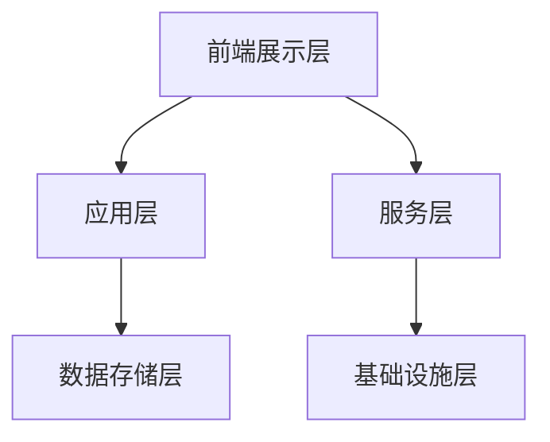
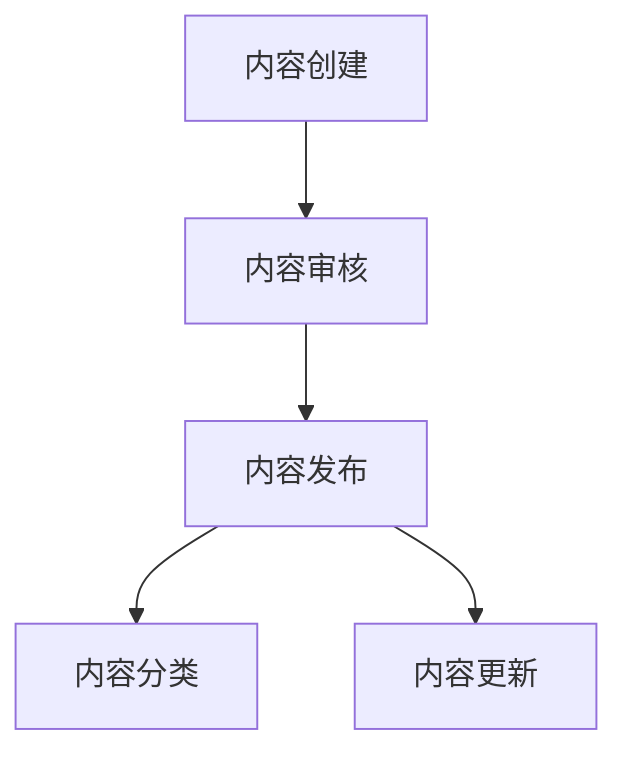
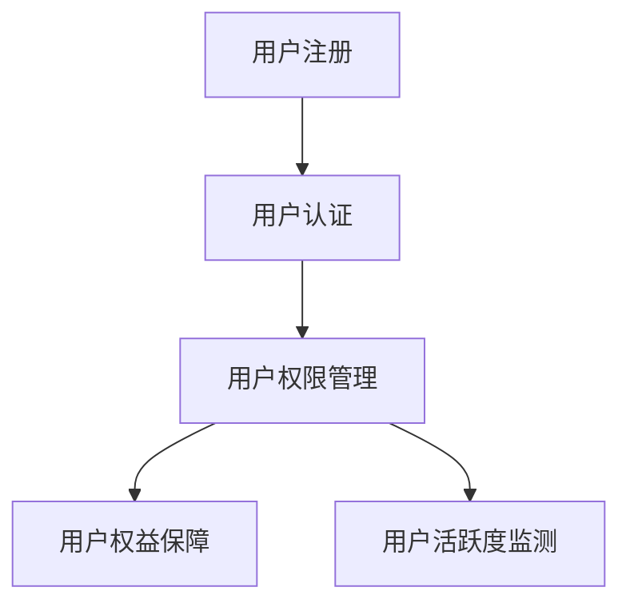
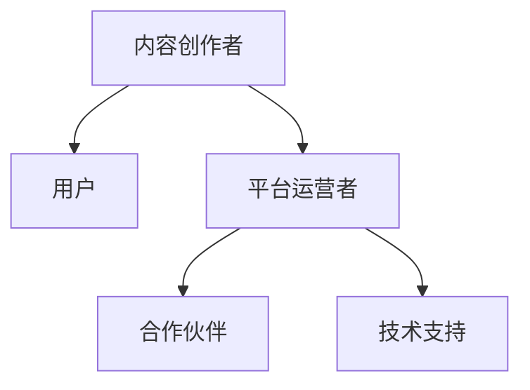
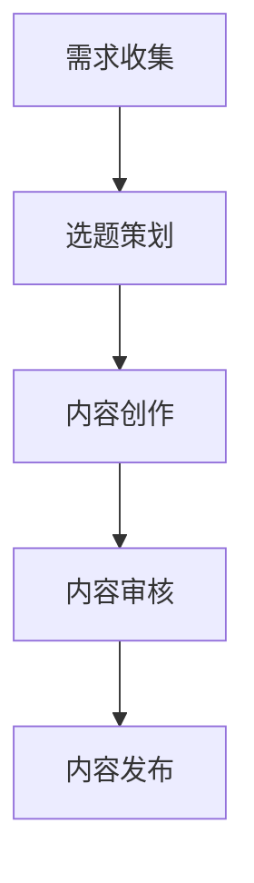
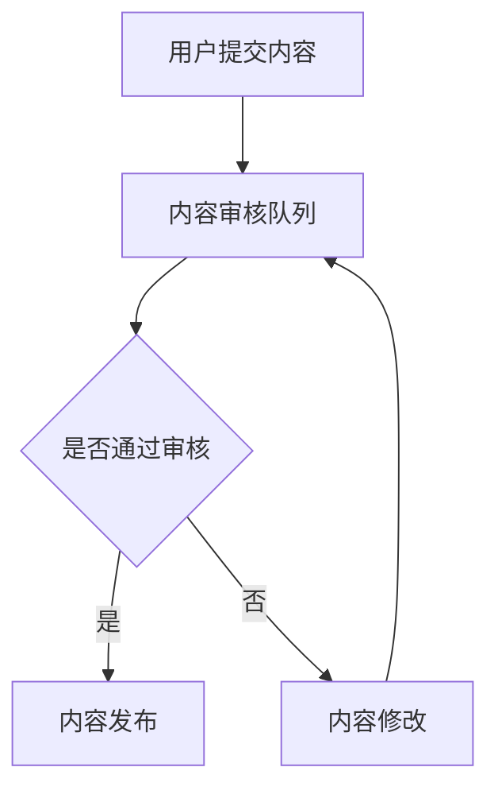

                 

### 文章标题

**打造技术型知识付费社区的运营策略**

> **关键词：技术型知识付费社区，运营策略，内容策略，用户运营，社区管理，数据分析，案例分析**

**摘要：** 本文将深入探讨技术型知识付费社区的运营策略，涵盖核心概念、架构设计、内容运营、用户运营、社区管理及数据分析等多个方面。通过具体案例分析和实践经验总结，本文旨在为技术型知识付费社区提供系统性的运营指导，帮助运营者打造一个具有持久吸引力和高用户粘性的知识共享平台。

### 目录大纲

#### 第一部分：运营策略概述

##### 第1章：技术型知识付费社区概述
- **1.1 技术型知识付费社区的背景与市场分析**
- **1.2 技术型知识付费社区的核心目标**
- **1.3 技术型知识付费社区的关键要素**
- **1.4 社区运营的挑战与机遇**

##### 第2章：核心概念与架构
- **2.1 知识付费模式介绍**
  - **2.1.1 常见的知识付费模式**
  - **2.1.2 技术型知识付费的独特性**
- **2.2 技术型知识付费社区的架构设计**
  - **2.2.1 社区平台架构**
  - **2.2.2 内容管理体系**
  - **2.2.3 用户管理体系**
- **2.3 技术型知识付费社区的生态系统**

#### 第二部分：内容运营策略

##### 第3章：内容策略制定
- **3.1 内容定位与规划**
  - **3.1.1 确定内容主题与方向**
  - **3.1.2 内容受众分析**
- **3.2 内容生产与更新**
  - **3.2.1 内容生产流程**
  - **3.2.2 内容更新策略**
- **3.3 内容质量把控**
  - **3.3.1 内容审核机制**
  - **3.3.2 用户反馈与互动**

##### 第4章：用户运营策略
- **4.1 用户增长策略**
  - **4.1.1 用户引入手段**
  - **4.1.2 用户留存策略**
- **4.2 用户激励与活跃度提升**
  - **4.2.1 激励机制设计**
  - **4.2.2 用户活跃度监测与提升**
- **4.3 用户画像与精准推荐**
  - **4.3.1 用户画像构建**
  - **4.3.2 精准推荐系统**

#### 第三部分：社区管理策略

##### 第5章：社区管理规范
- **5.1 社区规则制定**
  - **5.1.1 社区基本原则**
  - **5.1.2 社区行为准则**
- **5.2 社区运营团队建设**
  - **5.2.1 运营团队角色分工**
  - **5.2.2 运营团队培训与发展**
- **5.3 社区风险管理与危机应对**

##### 第6章：运营数据分析与优化
- **6.1 运营数据指标体系**
  - **6.1.1 常见运营指标解释**
  - **6.1.2 数据分析方法与应用**
- **6.2 数据驱动运营优化**
  - **6.2.1 数据收集与处理**
  - **6.2.2 数据分析结果应用**

#### 第四部分：案例分析与实践

##### 第7章：成功案例解析
- **7.1 国内知名技术型知识付费社区案例**
  - **7.1.1 案例一：案例名称**
  - **7.1.2 案例二：案例名称**
- **7.2 国际成功案例借鉴**
  - **7.2.1 案例一：案例名称**
  - **7.2.2 案例二：案例名称**

##### 第8章：实战经验分享
- **8.1 实战经验总结**
  - **8.1.1 内容运营经验**
  - **8.1.2 用户运营经验**
  - **8.1.3 社区管理经验**
- **8.2 挑战与解决方案**
  - **8.2.1 运营难题分析与解决**
  - **8.2.2 风险管理经验**

#### 附录

##### 附录A：运营工具与资源
- **A.1 常用运营工具介绍**
- **A.2 社区运营资源推荐**
- **A.3 行业报告与资讯**

### 图形与代码附录
- **B.1 Mermaid流程图**
- **B.2 伪代码示例**
- **B.3 数学公式示例**


----------------------------------------------------------------
## 第一部分：运营策略概述

在当今数字化时代，知识付费社区作为一种新兴的在线教育模式，正逐渐成为技术从业者获取知识、技能和资源的重要渠道。技术型知识付费社区，顾名思义，是指以技术领域为核心，通过付费方式提供专业知识、教程、讨论和交流的平台。与传统的免费知识分享平台不同，技术型知识付费社区更注重内容的深度、专业性和实用性，旨在为用户提供高质量的知识服务。

### 1.1 技术型知识付费社区的背景与市场分析

技术型知识付费社区的出现，可以追溯到互联网的普及和技术知识的爆炸式增长。随着云计算、大数据、人工智能等新兴技术的迅猛发展，技术从业者和学习者的需求逐渐呈现出专业化和细分的趋势。与此同时，传统教育机构和内容提供商难以满足这种高需求的多样化学习模式。因此，技术型知识付费社区应运而生，它们通过精细化运营和内容定制，为用户提供了更加个性化和高效的在线学习体验。

市场分析显示，技术型知识付费社区在全球范围内呈现出快速增长的态势。根据市场研究报告，全球在线教育市场规模在2020年已超过2500亿美元，预计到2025年将突破4000亿美元。其中，技术型知识付费社区作为一个重要的细分市场，占据着日益增长的市场份额。尤其在COVID-19疫情的影响下，在线学习和知识付费模式得到了更加广泛的认可和应用。

### 1.2 技术型知识付费社区的核心目标

技术型知识付费社区的核心目标主要包括以下几个方面：

1. **提供高质量内容**：通过汇聚行业专家和资深技术人员，提供深度和专业的知识内容，满足用户的学习需求。
2. **促进用户互动**：构建一个活跃的社区环境，鼓励用户之间的讨论和互动，形成知识共享的生态系统。
3. **实现商业价值**：通过会员订阅、课程销售、广告等多种商业模式，实现社区的可持续发展和盈利。

为了实现这些目标，技术型知识付费社区需要具备以下几个关键要素：

- **专业的内容团队**：负责内容策划、生产、审核和更新，确保内容的质量和实用性。
- **强大的技术平台**：提供稳定、高效的用户体验，支持课程上传、播放、互动和数据分析等功能。
- **完善的运营体系**：包括用户增长、用户留存、用户激励、社区管理等各个环节，确保社区的运营效率。

### 1.3 技术型知识付费社区的关键要素

1. **内容生产与质量保障**：技术型知识付费社区的核心竞争力在于内容的质量和深度。因此，社区需要建立完善的内容生产流程和审核机制，确保每一篇教程、课程或讨论都是高质量的。

2. **用户管理体系**：包括用户注册、认证、权益管理等功能，确保用户能够方便地获取和享受知识服务，同时维护社区的安全和秩序。

3. **互动与社交功能**：技术型知识付费社区需要提供丰富的互动和社交功能，如讨论区、问答环节、直播课程等，鼓励用户积极参与社区活动，增强用户粘性。

4. **数据分析与优化**：通过数据分析和用户反馈，不断优化社区的运营策略和用户体验，提高社区的运营效率。

5. **商业模式与盈利能力**：技术型知识付费社区需要探索多元化的商业模式，如会员订阅、课程销售、广告等，实现商业价值和可持续发展。

### 1.4 社区运营的挑战与机遇

技术型知识付费社区在运营过程中面临着一系列挑战：

1. **内容质量与更新速度**：保持高质量内容的生产和更新速度是一个持续的挑战，需要社区运营团队具备强大的内容生产能力和管理能力。
2. **用户活跃度与留存率**：提高用户活跃度和留存率是社区运营的关键，需要运营团队制定有效的用户增长策略和用户激励机制。
3. **社区风险管理**：社区运营过程中可能面临知识产权侵权、恶意评论等风险，需要建立完善的社区规范和风险管理机制。

然而，这些挑战也伴随着巨大的机遇：

1. **市场需求的增长**：随着技术知识的不断更新和发展，用户对于高质量技术内容的需求也在持续增长，为技术型知识付费社区提供了广阔的市场空间。
2. **技术创新的推动**：人工智能、大数据等新兴技术的应用，为技术型知识付费社区提供了更高效的内容生产、推荐系统和用户互动方式。
3. **跨界合作的机会**：技术型知识付费社区可以与教育培训机构、企业等展开跨界合作，共同开发和推广课程，实现共赢。

综上所述，技术型知识付费社区作为一种新兴的在线教育模式，在当前市场中具有巨大的发展潜力和商业价值。通过科学的运营策略和精细化运营，技术型知识付费社区可以成为用户获取技术知识的重要平台，同时也为运营者创造了可持续的商业回报。

### 第二部分：核心概念与架构

#### 2.1 知识付费模式介绍

知识付费模式是指通过付费方式为用户提供专业知识和技能服务的商业模型。知识付费模式的兴起源于用户对高质量内容的需求和对知识价值的认可。以下是几种常见知识付费模式及其特点：

1. **课程销售**：通过销售在线课程、教程、电子书等形式，用户付费后即可获取相应的学习内容。这种模式的特点是内容结构化、系统化，适合长期学习和系统性知识积累。

   **伪代码示例**：
   ```python
   class Course:
       def __init__(self, title, author, price, duration):
           self.title = title
           self.author = author
           self.price = price
           self.duration = duration
           
       def purchase(self, user):
           if user.balance >= self.price:
               user.balance -= self.price
               user.courses.append(self)
               return "Purchase successful!"
           else:
               return "Insufficient balance!"

   class User:
       def __init__(self, name, balance):
           self.name = name
           self.balance = balance
           self.courses = []
           
       def enroll(self, course):
           result = course.purchase(self)
           if result == "Purchase successful!":
               self.courses.append(course)
   ```

2. **会员订阅**：用户支付一定费用后成为会员，享受社区提供的所有或部分内容服务。这种模式的特点是用户粘性强，社区可以通过订阅费实现持续收入。

   **伪代码示例**：
   ```python
   class Subscription:
       def __init__(self, price, duration):
           self.price = price
           self.duration = duration
   
   class Member:
       def __init__(self, name):
           self.name = name
           self.subscription = None
           
       def subscribe(self, subscription):
           if self.subscription is None:
               self.subscription = subscription
               return "Subscription successful!"
           else:
               return "Already subscribed!"

   class Community:
       def __init__(self):
           self.members = []
           
       def add_member(self, member):
           self.members.append(member)
           
       def provide_access(self, member):
           if member.subscription is not None:
               return "Access granted!"
           else:
               return "Not a member!"
   ```

3. **课程包**：将多门课程打包销售，用户一次性购买后即可学习多个课程。这种模式的特点是内容丰富，适合用户一次性购买。

   **伪代码示例**：
   ```python
   class CoursePackage:
       def __init__(self, courses, price):
           self.courses = courses
           self.price = price
   
   class User:
       def __init__(self, name, balance):
           self.name = name
           self.balance = balance
           self.courses = []
           
       def purchase_package(self, package):
           if self.balance >= package.price:
               self.balance -= package.price
               for course in package.courses:
                   self.courses.append(course)
               return "Package purchase successful!"
           else:
               return "Insufficient balance!"

   class Course:
       def __init__(self, title, author, price):
           self.title = title
           self.author = author
           self.price = price
   ```

**技术型知识付费的独特性**

技术型知识付费社区与其他知识付费社区相比，具有以下几个独特特点：

1. **专业性**：技术型知识付费社区专注于技术领域，提供的是专业的技术知识和实战经验，而非泛泛而谈的知识普及。

2. **实用性**：技术型知识付费社区的内容通常紧密结合实际应用，帮助用户解决实际问题，提升职业技能。

3. **互动性**：技术型知识付费社区强调用户互动，提供讨论区、问答、直播等功能，让用户不仅能够学习知识，还能与同行交流、分享经验。

4. **更新速度**：技术领域发展迅速，技术型知识付费社区需要保持较高的更新速度，确保内容始终处于前沿。

#### 2.2 技术型知识付费社区的架构设计

技术型知识付费社区的架构设计需要考虑多个方面，包括社区平台架构、内容管理体系和用户管理体系。以下是这些关键要素的详细描述：

**2.2.1 社区平台架构**

社区平台架构是技术型知识付费社区的基础，决定了社区的稳定性和扩展性。一个典型的社区平台架构通常包括以下几个部分：

1. **前端展示层**：负责社区内容的展示和交互，包括页面布局、导航、搜索等功能。前端通常使用现代Web框架如React、Vue等构建。

2. **应用层**：负责社区的核心功能实现，包括用户管理、内容管理、支付系统、推荐系统等。应用层可以使用Spring Boot、Django等开发框架。

3. **服务层**：提供通用的服务功能，如身份认证、消息推送、数据分析等。服务层可以采用微服务架构，使用Spring Cloud等框架实现。

4. **数据存储层**：负责存储用户数据、内容数据、交易数据等。数据存储层可以使用关系型数据库如MySQL、PostgreSQL，或NoSQL数据库如MongoDB。

5. **基础设施层**：提供云计算、容器化、负载均衡等基础设施支持，确保社区平台的稳定运行。基础设施层可以使用AWS、Google Cloud等云服务。

**Mermaid流程图示例**：


**2.2.2 内容管理体系**

内容管理体系是技术型知识付费社区的核心，负责内容的创建、审核、发布和管理。以下是内容管理体系的关键组成部分：

1. **内容创建**：支持用户上传、编辑和创建内容，内容可以是文章、视频、教程等。

2. **内容审核**：建立内容审核机制，确保内容的合规性和质量。审核机制可以包括自动审核和人工审核相结合。

3. **内容发布**：内容经过审核后，可以发布到社区供用户查看和互动。

4. **内容分类**：对内容进行分类管理，便于用户查找和浏览。

5. **内容更新**：定期更新内容，确保知识的时效性和前沿性。

**Mermaid流程图示例**：


**2.2.3 用户管理体系**

用户管理体系是技术型知识付费社区的重要组成部分，负责用户的注册、认证、权限管理和权益保障。以下是用户管理体系的关键组成部分：

1. **用户注册**：用户可以通过邮箱、手机号、第三方账号等多种方式注册成为社区用户。

2. **用户认证**：对用户的身份进行认证，确保用户信息的真实性和准确性。

3. **用户权限管理**：根据用户角色和权限，提供不同的功能和服务。

4. **用户权益保障**：保障用户的隐私和安全，提供便捷的用户支持和服务。

5. **用户活跃度监测**：通过用户行为数据，监测用户的活跃度和参与度，优化用户体验。

**Mermaid流程图示例**：


**2.3 技术型知识付费社区的生态系统**

技术型知识付费社区的生态系统包括多个参与者，如内容创作者、用户、平台运营者、合作伙伴等。以下是生态系统的主要组成部分：

1. **内容创作者**：负责创作和上传高质量的技术内容，为社区提供知识来源。

2. **用户**：作为社区的消费者，用户通过付费或免费方式获取知识和服务。

3. **平台运营者**：负责社区的整体运营和管理，确保社区的健康发展和用户满意度。

4. **合作伙伴**：与内容创作者、教育培训机构、技术公司等合作，共同推广和开发课程，实现共赢。

5. **技术支持**：提供技术基础设施和服务，支持社区平台的稳定运行和持续发展。

**Mermaid流程图示例**：


综上所述，技术型知识付费社区的核心概念和架构设计决定了社区的成功和可持续发展。通过科学的内容策略、有效的用户运营和完善的社区管理，技术型知识付费社区可以成为一个有价值、有影响力的知识共享平台。

### 第三部分：内容运营策略

内容运营是技术型知识付费社区的核心，它决定了社区能否吸引和留住用户。一个成功的社区内容运营策略不仅需要高质量的内容生产，还需要合理的更新策略和有效的质量把控。以下是详细的内容运营策略制定。

#### 3.1 内容定位与规划

内容定位是内容运营的第一步，它决定了社区内容的主题和方向。技术型知识付费社区的内容定位应该紧密结合当前技术热点和用户需求，确保内容的专业性和实用性。

**3.1.1 确定内容主题与方向**

1. **聚焦热门技术领域**：根据市场调研和用户反馈，确定当前热门的技术领域，如人工智能、大数据、云计算等。
2. **细分内容方向**：在确定主要技术领域后，进一步细分内容方向，例如在人工智能领域，可以细化到机器学习、深度学习、自然语言处理等子领域。
3. **结合用户需求**：通过用户调查、反馈和市场分析，了解用户的具体需求和兴趣点，确保内容与用户需求高度匹配。

**伪代码示例**：
```python
class ContentTopic:
    def __init__(self, name, sub_topics):
        self.name = name
        self.sub_topics = sub_topics

def determine_content_topics():
    main_topics = ["AI", "大数据", "云计算"]
    sub_topics = {
        "AI": ["机器学习", "深度学习", "自然语言处理"],
        "大数据": ["数据仓库", "数据挖掘", "大数据分析"],
        "云计算": ["云计算基础", "容器化", "云安全"]
    }
    return [ContentTopic(name, sub_topics[name]) for name in main_topics]
```

**3.1.2 内容受众分析**

内容受众分析是确定内容定位的重要环节。通过分析目标受众的背景、兴趣、行为习惯等信息，可以更好地制定内容策略。

1. **用户画像**：创建用户画像，包括年龄、职业、教育背景、技术水平和兴趣点等。
2. **用户需求分析**：通过调查问卷、用户访谈等方式，了解用户的具体需求，如学习目标、关注领域等。
3. **行为数据分析**：分析用户在社区中的行为数据，如浏览路径、互动频率、参与话题等，发现用户的行为模式。

**伪代码示例**：
```python
class UserProfile:
    def __init__(self, age, occupation, education, technical_level, interests):
        self.age = age
        self.occupation = occupation
        self.education = education
        self.technical_level = technical_level
        self.interests = interests

def analyze_user_demand(users):
    user_interests = {}
    for user in users:
        for interest in user.interests:
            if interest not in user_interests:
                user_interests[interest] = 0
            user_interests[interest] += 1
    return user_interests

users = [UserProfile(25, "软件开发工程师", "本科", "中级", ["机器学习", "深度学习"])]
interests = analyze_user_demand(users)
print(interests)
```

#### 3.2 内容生产与更新

内容生产是内容运营的核心环节，更新策略则是确保内容持续吸引力和用户活跃度的关键。

**3.2.1 内容生产流程**

1. **需求收集**：通过用户调研、市场分析等手段，收集用户对内容的需求。
2. **选题策划**：根据需求收集结果，制定内容选题，确保内容与用户需求高度匹配。
3. **内容创作**：由内容创作者或团队进行内容创作，包括文章、教程、视频等多种形式。
4. **内容审核**：建立内容审核机制，确保内容的合规性和质量。
5. **内容发布**：将审核通过的内容发布到社区，供用户查看和互动。

**Mermaid流程图示例**：


**3.2.2 内容更新策略**

1. **定期更新**：制定内容更新计划，确保内容持续更新，保持时效性和前沿性。
2. **热点跟进**：关注行业热点和用户关注点，及时更新相关内容，吸引用户关注。
3. **用户反馈**：收集用户对内容的反馈，根据反馈调整内容策略，提高用户满意度。

**伪代码示例**：
```python
class ContentUpdateStrategy:
    def __init__(self, update_frequency, hot_topics):
        self.update_frequency = update_frequency
        self.hot_topics = hot_topics

    def update_content(self, content_list):
        for content in content_list:
            if content.last_updated + self.update_frequency < datetime.now():
                content.update()
                print(f"{content.title} updated.")
                
        for topic in self.hot_topics:
            if not any(content.topic == topic for content in content_list):
                new_content = ContentCreator.create_content(topic)
                content_list.append(new_content)
                print(f"New content on {topic} added.")

content_list = [Content("AI基础教程", "2023-01-01", "AI"), Content("大数据分析实战", "2023-01-01", "大数据")]
strategy = ContentUpdateStrategy(30, ["AI", "大数据"])
strategy.update_content(content_list)
```

#### 3.3 内容质量把控

内容质量是技术型知识付费社区的竞争力，确保内容质量需要建立完善的内容审核机制和用户反馈机制。

**3.3.1 内容审核机制**

1. **自动审核**：使用自然语言处理技术，对内容进行初步审核，检测违禁词、语法错误等。
2. **人工审核**：由专业的审核团队对内容进行深入审核，确保内容的合规性和质量。
3. **分级审核**：根据内容的重要性和敏感度，设置不同的审核级别和流程。

**伪代码示例**：
```python
class Content:
    def __init__(self, title, content, status="待审核"):
        self.title = title
        self.content = content
        self.status = status

class ContentAuditor:
    def __init__(self):
        self.audit_queue = []

    def add_content_to_queue(self, content):
        self.audit_queue.append(content)
        
    def audit_content(self):
        for content in self.audit_queue:
            if self.is_content_compliant(content):
                content.status = "审核通过"
            else:
                content.status = "审核不通过"
        self.audit_queue.clear()

    def is_content_compliant(self, content):
        # 使用自然语言处理技术进行初步审核
        if contains_prohibited_words(content.content):
            return False
        # 人工审核
        auditor_team.review_content(content)
        return True

def contains_prohibited_words(content):
    prohibited_words = ["违禁", "违法"]
    for word in prohibited_words:
        if word in content:
            return True
    return False

content = Content("AI基础教程", "本文介绍了人工智能的基础知识。")
auditor = ContentAuditor()
auditor.add_content_to_queue(content)
auditor.audit_content()
print(content.status)
```

**3.3.2 用户反馈与互动**

用户反馈是内容质量把控的重要手段，通过用户反馈，可以及时发现和解决内容问题，提高用户满意度。

1. **建立反馈渠道**：提供多种反馈方式，如评论、投票、举报等，方便用户表达意见。
2. **及时响应**：对用户反馈进行及时处理，确保用户的问题和建议得到及时回应。
3. **数据驱动**：分析用户反馈数据，优化内容策略和用户体验。

**伪代码示例**：
```python
class UserFeedback:
    def __init__(self, user_id, content_id, comment, rating):
        self.user_id = user_id
        self.content_id = content_id
        self.comment = comment
        self.rating = rating

def process_feedback(feedback_list):
    for feedback in feedback_list:
        if feedback.rating < 3:
            content = Content.get_content(feedback.content_id)
            content.status = "需改进"
        print(f"User {feedback.user_id} provided feedback for content {feedback.content_id}.")

feedbacks = [UserFeedback(1, 1, "内容太简单了", 2), UserFeedback(2, 2, "内容很实用", 5)]
process_feedback(feedbacks)
```

综上所述，内容运营策略是技术型知识付费社区的核心，通过合理的定位与规划、科学的内容生产与更新策略，以及严格的内容质量把控，可以确保社区内容的高质量和用户满意度，从而提升社区的价值和影响力。

### 第四部分：用户运营策略

在技术型知识付费社区中，用户运营策略是提高用户粘性、促进社区活跃度和实现商业价值的重要手段。用户运营不仅包括用户的引入和增长，还涉及用户激励和活跃度提升等方面。以下将详细探讨这些策略。

#### 4.1 用户增长策略

用户增长是技术型知识付费社区的基础，通过有效的用户引入手段和用户留存策略，可以不断扩大社区的用户群体。

**4.1.1 用户引入手段**

1. **内容营销**：通过高质量的内容吸引潜在用户，如技术博客、视频教程、案例分享等，这些内容应具有专业性和实用性，能够解决用户的实际问题。
2. **社交媒体推广**：利用社交媒体平台（如微博、微信、LinkedIn等）进行推广，通过发布社区活动、热门话题和用户反馈等内容，提高社区知名度。
3. **合作伙伴推广**：与行业内的其他平台、机构或公司合作，共同推广社区，如技术大会、行业会议、在线课程等。
4. **优惠活动**：通过限时优惠、免费试听等活动，吸引用户注册和尝试社区服务。

**伪代码示例**：
```python
def attract_users(content_list, promotions):
    for content in content_list:
        print(f"Content '{content.title}' is being promoted.")
    for promotion in promotions:
        print(f"Promotion '{promotion.name}' is running.")

content_list = [Content("AI入门教程", "2023-01-01"), Content("大数据分析实战", "2023-02-01")]
promotions = [Promotion("免费试听一个月", "2023-03-01")]
attract_users(content_list, promotions)
```

**4.1.2 用户留存策略**

用户留存是衡量社区运营效果的重要指标，通过以下策略可以提升用户留存率：

1. **个性化推荐**：根据用户的行为数据和兴趣偏好，提供个性化的内容推荐，增加用户在社区内的互动和消费。
2. **互动社区建设**：建立活跃的社区讨论区，鼓励用户发表观点、提问和回答问题，增强用户之间的互动和归属感。
3. **持续内容更新**：定期发布新的高质量内容，保持社区的活力和吸引力，避免用户因内容缺乏而流失。
4. **用户反馈与支持**：及时响应用户反馈，解决用户问题，提供高质量的用户支持，增强用户的满意度和忠诚度。

**伪代码示例**：
```python
class User:
    def __init__(self, name, interests, feedbacks):
        self.name = name
        self.interests = interests
        self.feedbacks = feedbacks

    def provide_feedback(self, feedback):
        self.feedbacks.append(feedback)

def retain_users(users, content_recommendations, support_team):
    for user in users:
        recommended_contents = content_recommendations[user.interests]
        support_team.respond_to_feedback(user.feedbacks)
        print(f"User '{user.name}' is being provided with personalized content and support.")

users = [User("Alice", ["机器学习", "深度学习"], []), User("Bob", ["大数据分析", "云计算"], [])]
content_recommendations = {
    "机器学习": ["深度学习实战", "神经网络原理"],
    "大数据分析": ["大数据处理技术", "数据仓库设计"],
    "云计算": ["云计算基础", "容器化技术"]
}
support_team = SupportTeam()
retain_users(users, content_recommendations, support_team)
```

#### 4.2 用户激励与活跃度提升

用户激励和活跃度提升是用户运营的关键环节，通过设计有效的激励机制和活跃度监测，可以激发用户的参与热情和积极性。

**4.2.1 激励机制设计**

1. **积分系统**：为用户的每项行为（如发帖、评论、点赞等）分配积分，积分可以兑换成虚拟物品或特权服务，激励用户积极参与社区活动。
2. **排行榜**：设立社区排行榜，根据用户的积分、贡献度等指标进行排名，激励用户竞争和进取。
3. **荣誉奖励**：为积极参与社区活动的用户颁发荣誉称号，如“优秀贡献者”、“社区达人”等，提升用户的荣誉感和认同感。

**伪代码示例**：
```python
class UserReward:
    def __init__(self, user, reward):
        self.user = user
        self.reward = reward

def reward_users(users, rewards):
    for user in users:
        if user.active_days > 30:
            reward = Reward("优秀贡献者", "社区特权服务")
            rewards.append(UserReward(user, reward))
    print("Rewards distributed!")

users = [User("Alice", "active_days=60"), User("Bob", "active_days=20")]
rewards = []
reward_users(users, rewards)
```

**4.2.2 用户活跃度监测与提升**

1. **活跃度指标**：建立活跃度指标体系，如发帖量、回复量、参与话题数、积分增长等，全面监测用户的活跃度。
2. **数据分析**：通过数据分析，识别高活跃用户和低活跃用户，分析他们的行为差异，制定有针对性的提升策略。
3. **活动策划**：定期举办线上或线下活动，如技术分享会、研讨会、比赛等，激发用户的参与热情。

**伪代码示例**：
```python
class UserActivity:
    def __init__(self, user, posts, replies, topics):
        self.user = user
        self.posts = posts
        self.replies = replies
        self.topics = topics

def measure_user_activity(users):
    activity_data = []
    for user in users:
        activity_data.append(UserActivity(user, user.posts, user.replies, user.topics))
    return activity_data

def boost_user_activity(activity_data):
    for activity in activity_data:
        if activity.replies < 5:
            print(f"User '{activity.user.name}' needs more engagement.")
            send_notification(activity.user, "您的互动量较低，请积极回复和发帖！")

users = [User("Alice"), User("Bob")]
activity_data = measure_user_activity(users)
boost_user_activity(activity_data)
```

#### 4.3 用户画像与精准推荐

用户画像和精准推荐是提升用户满意度和粘性的重要手段，通过分析用户行为和偏好，为用户提供个性化的内容和服务。

**4.3.1 用户画像构建**

1. **基础信息**：包括用户的年龄、性别、职业、教育背景等基本信息。
2. **行为数据**：包括用户在社区内的浏览、搜索、点赞、评论、参与活动等行为数据。
3. **偏好分析**：通过行为数据分析，识别用户的兴趣点和偏好，构建用户画像。

**伪代码示例**：
```python
class UserProfile:
    def __init__(self, user, interests, behaviors):
        self.user = user
        self.interests = interests
        self.behaviors = behaviors

def build_user_profile(user):
    interests = ["机器学习", "深度学习", "大数据"]
    behaviors = ["发帖5次", "评论10次", "点赞30次"]
    profile = UserProfile(user, interests, behaviors)
    return profile

user = User("Alice")
profile = build_user_profile(user)
```

**4.3.2 精准推荐系统**

1. **内容推荐**：根据用户画像和偏好，推荐符合用户兴趣的内容，如教程、博客、视频等。
2. **活动推荐**：根据用户参与活动的历史记录，推荐相关的线上或线下活动，提高用户参与度。
3. **广告推荐**：基于用户画像和行为数据，推荐相关的广告内容，提高广告点击率和转化率。

**伪代码示例**：
```python
class ContentRecommendation:
    def __init__(self, user, recommended_contents):
        self.user = user
        self.recommended_contents = recommended_contents

def generate_content_recommendations(user_profile):
    interests = user_profile.interests
    recommended_contents = ["深度学习实战", "大数据处理技术", "机器学习进阶"]
    return ContentRecommendation(user_profile.user, recommended_contents)

profile = UserProfile(user, ["机器学习", "大数据"], [])
recommendations = generate_content_recommendations(profile)
print(f"Recommended contents for {profile.user.name}: {recommendations.recommended_contents}")
```

综上所述，用户运营策略是技术型知识付费社区的重要支撑，通过有效的用户引入、留存、激励和精准推荐，可以提升社区的用户活跃度和满意度，为社区的长远发展奠定坚实基础。

### 第五部分：社区管理策略

在技术型知识付费社区中，社区管理策略至关重要，它直接关系到社区的运营效率和用户体验。有效的社区管理不仅包括规则的制定和行为准则的落实，还需要建设专业的运营团队，并具备危机应对和风险管理的能力。

#### 5.1 社区规则制定

社区规则是确保社区秩序和用户权益的重要保障，一个完善的规则体系有助于维护社区的健康环境。

**5.1.1 社区基本原则**

1. **公平公正**：确保所有用户在社区中享有平等的权利，不受歧视和不公平对待。
2. **尊重隐私**：保护用户的个人隐私，不泄露用户信息，尊重用户隐私权。
3. **文明交流**：鼓励用户文明交流，尊重他人观点，不发布违法和违规内容。
4. **诚信守信**：倡导用户诚信守信，遵守社区规则，不进行欺诈行为。

**5.1.2 社区行为准则**

1. **内容发布**：用户在发布内容时，需遵守相关法律法规，不得发布色情、暴力、虚假等违法内容。
2. **互动交流**：用户在参与讨论和互动时，需保持礼貌和尊重，不进行人身攻击、恶意评论等不良行为。
3. **知识产权**：尊重知识产权，不得侵犯他人著作权、商标权等知识产权。
4. **用户行为**：用户在社区内应遵守社区管理规则，不进行恶意刷屏、欺诈等破坏社区秩序的行为。

#### 5.2 社区运营团队建设

一个高效的社区运营团队是社区健康发展的关键，运营团队的建设包括角色分工、培训与发展等方面。

**5.2.1 运营团队角色分工**

1. **内容运营**：负责社区内容的生产、审核和发布，确保内容的质量和更新。
2. **用户运营**：负责用户增长、留存、激励和用户服务，提升用户活跃度和满意度。
3. **社区管理**：负责制定和执行社区规则，处理违规行为和用户投诉，维护社区秩序。
4. **数据分析**：负责数据分析和运营报告，为运营决策提供数据支持。

**5.2.2 运营团队培训与发展**

1. **岗位培训**：定期为运营团队提供专业培训，提高内容创作、用户运营和社区管理的能力。
2. **技能提升**：鼓励团队成员参加行业会议、研讨会等，了解最新技术趋势和行业动态。
3. **激励机制**：建立完善的激励机制，激励团队成员的积极性和创造力，提升团队整体效率。

#### 5.3 社区风险管理与危机应对

社区运营过程中可能会面临各种风险和挑战，有效的风险管理和危机应对策略是确保社区稳定运营的重要保障。

**5.3.1 社区风险管理**

1. **内容审核**：建立严格的内容审核机制，防止违规内容的发布，确保社区内容的合规性。
2. **用户监控**：对用户行为进行实时监控，及时发现和处理异常行为，维护社区秩序。
3. **安全防护**：加强网络安全防护，防止数据泄露和黑客攻击，保障用户信息和社区数据的安全。

**5.3.2 危机应对**

1. **危机预警**：建立危机预警机制，对可能出现的风险进行预测和评估，提前制定应对措施。
2. **应急响应**：制定详细的应急响应计划，确保在危机事件发生时，能够迅速采取行动，减轻危机影响。
3. **用户沟通**：及时与用户沟通，解释危机原因和处理措施，增强用户对社区的信任和依赖。

**伪代码示例**：
```python
class CommunityRule:
    def __init__(self, name, description):
        self.name = name
        self.description = description

def define_rules():
    rules = [
        CommunityRule("内容发布规则", "不得发布违法和违规内容"),
        CommunityRule("互动交流规则", "保持文明交流，尊重他人观点"),
        CommunityRule("知识产权规则", "尊重知识产权，不得侵犯他人权益")
    ]
    return rules

rules = define_rules()
for rule in rules:
    print(f"{rule.name}: {rule.description}")

class UserBehaviorMonitor:
    def __init__(self, user):
        self.user = user
        self.behaviors = []

    def monitor(self, behavior):
        self.behaviors.append(behavior)
        if behavior.is_abnormal():
            self.report_abnormal()

    def report_abnormal(self):
        print(f"User '{self.user.name}' has performed an abnormal behavior.")

class Behavior:
    def __init__(self, type, content):
        self.type = type
        self.content = content

    def is_abnormal(self):
        # 判断行为是否异常，如恶意评论、刷屏等
        return self.type == "malicious_comment"

user_monitor = UserBehaviorMonitor(User("Alice"))
user_monitor.monitor(Behavior("comment", "恶意评论"))
```

综上所述，社区管理策略是技术型知识付费社区运营的重要组成部分，通过制定完善的社区规则、建设专业的运营团队以及建立有效的风险管理和危机应对机制，可以确保社区的健康发展和用户满意度。

### 第六部分：运营数据分析与优化

运营数据分析是技术型知识付费社区运营的关键环节，通过科学的数据分析和优化，可以提升运营效率、用户体验和商业价值。以下将详细探讨运营数据指标体系、数据分析方法与应用，以及数据驱动运营优化的具体措施。

#### 6.1 运营数据指标体系

运营数据指标是衡量社区运营效果的重要工具，通过设置合理的指标体系，可以全面、准确地评估社区运营状况。以下是常见的运营数据指标及其解释：

1. **用户增长指标**：
   - **新用户数**：新注册用户的数量，反映社区的用户吸引能力。
   - **活跃用户数**：在一定时间内活跃的用户数量，反映社区的活跃度和用户留存情况。
   - **用户留存率**：在一定时间内留存的用户比例，反映社区的黏性。

2. **内容指标**：
   - **内容发布量**：社区内发布的所有内容数量，反映内容生产的活跃度。
   - **内容阅读量**：用户阅读内容的数据，反映内容的质量和吸引力。
   - **内容互动量**：用户对内容的点赞、评论、分享等互动行为的数据，反映用户的参与度和社区活跃度。

3. **交易指标**：
   - **课程购买量**：用户购买课程的次数，反映社区的付费转化能力。
   - **收入**：社区通过课程销售、会员订阅等模式获取的收入，反映社区的商业价值。
   - **客单价**：每个用户的平均消费金额，反映用户的消费能力和购买意愿。

4. **社区指标**：
   - **用户访问量**：社区的总访问量，反映社区的曝光度和访问热度。
   - **页面停留时间**：用户在社区内停留的时间，反映用户的体验和满意度。
   - **用户跳出率**：用户在社区内离开的比例，反映社区的用户黏性和吸引力。

#### 6.1.1 常见运营指标解释

1. **新用户数**：
   - **计算方法**：新用户数 = 新增注册用户数
   - **作用**：衡量社区的用户吸引能力，是衡量社区知名度和市场推广效果的重要指标。

2. **活跃用户数**：
   - **计算方法**：活跃用户数 = 某段时间内登录并参与互动（如发帖、评论、购买等）的用户数量
   - **作用**：反映社区的活跃度和用户参与度，是衡量社区健康程度的重要指标。

3. **用户留存率**：
   - **计算方法**：用户留存率 = （第n周留存用户数 / 第n周新增用户数）× 100%
   - **作用**：反映社区的用户黏性，是衡量社区长期发展潜力的重要指标。

4. **内容发布量**：
   - **计算方法**：内容发布量 = 社区内发布的所有内容数量
   - **作用**：反映内容生产的活跃度，是衡量内容更新速度和质量的重要指标。

5. **内容阅读量**：
   - **计算方法**：内容阅读量 = 用户阅读内容的次数
   - **作用**：反映内容的质量和吸引力，是衡量内容受欢迎程度的重要指标。

6. **内容互动量**：
   - **计算方法**：内容互动量 = 用户对内容的点赞、评论、分享等互动行为次数
   - **作用**：反映用户的参与度和社区活跃度，是衡量用户互动热情的重要指标。

7. **课程购买量**：
   - **计算方法**：课程购买量 = 用户购买课程的次数
   - **作用**：反映社区的付费转化能力，是衡量社区商业价值的重要指标。

8. **收入**：
   - **计算方法**：收入 = 课程销售总额 + 会员订阅收入 + 广告收入等
   - **作用**：反映社区的整体盈利能力，是衡量社区经济效益的重要指标。

9. **客单价**：
   - **计算方法**：客单价 = 总收入 / 用户数量
   - **作用**：反映用户的平均消费能力，是衡量用户购买意愿的重要指标。

10. **用户访问量**：
    - **计算方法**：用户访问量 = 社区总访问次数
    - **作用**：反映社区的曝光度和访问热度，是衡量社区知名度和市场影响力的重要指标。

11. **页面停留时间**：
    - **计算方法**：页面停留时间 = 用户在社区内停留的总时间
    - **作用**：反映用户的体验和满意度，是衡量用户体验质量的重要指标。

12. **用户跳出率**：
    - **计算方法**：用户跳出率 = （只访问一个页面后离开的用户数量 / 总访问量）× 100%
    - **作用**：反映社区的用户黏性和吸引力，是衡量社区用户体验的重要指标。

#### 6.1.2 数据分析方法与应用

数据分析方法包括描述性分析、相关性分析和预测分析等，通过这些方法，可以深入挖掘数据价值，为运营优化提供科学依据。

1. **描述性分析**：
   - **作用**：描述数据的基本特征，如平均值、中位数、标准差等。
   - **应用**：用于了解社区运营的基本状况，如用户分布、内容受欢迎程度等。

2. **相关性分析**：
   - **作用**：分析不同指标之间的相关性，发现潜在关系。
   - **应用**：用于优化运营策略，如发现哪些内容指标与用户留存率高度相关。

3. **预测分析**：
   - **作用**：基于历史数据预测未来的趋势和变化。
   - **应用**：用于制定长期运营计划，如预测用户增长趋势和收入变化。

**伪代码示例**：
```python
import pandas as pd
from sklearn.linear_model import LinearRegression

# 加载数据
data = pd.read_csv("community_data.csv")

# 描述性分析
description_stats = data.describe()

# 相关性分析
correlation_matrix = data.corr()

# 预测分析
X = data[['new_users', 'content_interactions']]
y = data['user_retention']
model = LinearRegression()
model.fit(X, y)
predictions = model.predict(X)

print("Description Statistics:")
print(description_stats)
print("\nCorrelation Matrix:")
print(correlation_matrix)
print("\nPredicted User Retention:")
print(predictions)
```

#### 6.2 数据驱动运营优化

数据驱动运营优化是通过数据分析结果，不断调整和优化运营策略，提高运营效率、用户体验和商业价值。

**6.2.1 数据收集与处理**

1. **数据收集**：
   - **来源**：包括用户行为数据、内容数据、交易数据等。
   - **方法**：使用日志分析、API调用、第三方服务等方式收集数据。

2. **数据处理**：
   - **清洗**：处理缺失值、异常值和重复数据，确保数据质量。
   - **整合**：将不同来源的数据进行整合，形成统一的分析数据集。

**伪代码示例**：
```python
import pandas as pd

# 读取数据
user_data = pd.read_csv("user_behavior_data.csv")
content_data = pd.read_csv("content_data.csv")
transaction_data = pd.read_csv("transaction_data.csv")

# 数据清洗
user_data.dropna(inplace=True)
content_data.drop_duplicates(inplace=True)
transaction_data.replace({'invalid_values': None}, inplace=True)

# 数据整合
combined_data = pd.merge(user_data, content_data, on='content_id')
combined_data = pd.merge(combined_data, transaction_data, on='user_id')
```

**6.2.2 数据分析结果应用**

1. **用户行为分析**：
   - **用户画像**：分析用户的基本信息和行为数据，构建用户画像，用于精准推荐和个性化服务。
   - **行为模式**：分析用户的行为模式，如浏览路径、互动频率等，优化用户体验。

2. **内容分析**：
   - **内容质量**：通过内容互动量和用户反馈，评估内容的质量，优化内容策略。
   - **内容推荐**：基于用户行为数据和内容相关性，设计个性化的内容推荐算法，提高内容点击率和用户参与度。

3. **交易分析**：
   - **盈利能力**：分析不同课程的销售情况和用户购买行为，优化课程结构和定价策略。
   - **转化率**：通过转化率分析，优化页面设计、用户体验和营销策略，提高付费转化率。

**伪代码示例**：
```python
# 用户画像
user_profile = pd.DataFrame({
    'age': [25, 30, 35],
    'occupation': ['工程师', '产品经理', '教师'],
    'interests': [['机器学习', '深度学习', '大数据'], ['产品', '用户体验', '市场'], ['教育', '心理学', '编程']]
})

# 行为模式
behavior_data = pd.DataFrame({
    'user_id': [1, 2, 3],
    'content_id': [101, 102, 103],
    'interaction_type': ['read', 'comment', 'like'],
    'timestamp': ['2023-01-01', '2023-01-02', '2023-01-03']
})

# 内容质量
content_interaction = pd.DataFrame({
    'content_id': [101, 102, 103],
    'interaction_count': [100, 200, 300],
    'rating': [4.5, 4.0, 3.5]
})

# 内容推荐
def generate_content_recommendations(user_interests, content_data):
    recommended_contents = []
    for interest in user_interests:
        recommended_contents.extend(content_data[content_data['topic'] == interest]['content_id'])
    return recommended_contents

recommended_contents = generate_content_recommendations(user_profile['interests'][0], content_interaction)
print("Recommended contents:", recommended_contents)

# 转化率优化
def optimize_conversion_rate(offers, conversion_data):
    offers['conversion_rate'] = conversion_data['conversion_rate']
    return offers.sort_values(by='conversion_rate', ascending=False)

offers = pd.DataFrame({
    'offer_id': [1, 2, 3],
    'description': ['Free Trial', 'Discount Offer', 'Premium Package'],
    'price': [0, 50, 200]
})
conversion_data = pd.DataFrame({
    'offer_id': [1, 2, 3],
    'conversion_rate': [0.2, 0.1, 0.3]
})
optimized_offers = optimize_conversion_rate(offers, conversion_data)
print("Optimized offers:", optimized_offers)
```

综上所述，运营数据分析与优化是技术型知识付费社区运营的重要环节，通过建立合理的运营数据指标体系、采用科学的数据分析方法，并依据数据分析结果不断优化运营策略，可以实现社区运营的持续改进和提升。

### 第七部分：成功案例解析

在本节中，我们将详细分析两个国内知名技术型知识付费社区的成功案例，以及两个国际成功的借鉴案例。通过这些案例，我们可以深入了解成功的关键要素和经验教训。

#### 7.1 国内知名技术型知识付费社区案例

**案例一：极客时间**

**背景**：极客时间成立于2016年，是由得到App孵化的技术型知识付费社区。其主要特色是邀请行业内的技术专家和资深从业者进行课程讲解，提供高质量的技术知识分享。

**成功要素**：

1. **内容质量**：极客时间专注于技术领域，邀请行业专家进行课程讲解，内容质量高，实用性强。
2. **互动机制**：社区提供了丰富的互动功能，如讨论区、问答环节等，鼓励用户参与和互动。
3. **个性化推荐**：利用大数据和机器学习技术，为用户推荐个性化的内容，提高用户满意度。
4. **品牌效应**：通过不断的品牌建设和用户口碑传播，极客时间积累了大量的忠实用户。

**经验教训**：

1. **内容更新速度**：保持高质量内容的生产和更新速度是一个挑战，需要不断优化内容生产流程。
2. **用户留存**：需要通过多样化的用户运营策略，提高用户的留存率和活跃度。

**案例二：CSDN学院**

**背景**：CSDN学院是CSDN旗下的知识付费平台，提供包括编程、数据科学、人工智能等多个领域的在线课程。

**成功要素**：

1. **广泛的课程覆盖**：CSDN学院提供了涵盖多个技术领域的课程，满足了不同用户的需求。
2. **互动社区**：CSDN学院拥有一个活跃的编程社区，用户可以在社区中提问、交流，分享经验。
3. **培训课程**：除了在线课程，CSDN学院还提供实时的在线培训，帮助用户快速提升技能。
4. **广告和会员收入**：通过广告和会员订阅等多种商业模式，实现了社区的可持续收入。

**经验教训**：

1. **内容差异化**：在广泛覆盖的同时，要确保课程内容具有差异化，避免同质化竞争。
2. **用户体验**：持续优化用户体验，确保社区平台的稳定性和易用性。

#### 7.2 国际成功案例借鉴

**案例一：Udemy**

**背景**：Udemy是一个全球性的在线学习平台，提供包括编程、数据科学、市场营销等多个领域的在线课程。

**成功要素**：

1. **课程丰富度**：Udemy提供了大量的课程，满足了全球用户的不同学习需求。
2. **互动性**：平台提供了论坛、讨论区等互动功能，鼓励用户之间的交流和分享。
3. **教师支持**：Udemy对教师提供了全面的支持，包括课程设计、营销推广等，确保课程质量。
4. **全球市场**：通过国际化运营，Udemy吸引了全球各地的用户，实现了规模化增长。

**经验教训**：

1. **本地化**：在进入新市场时，需要进行本地化运营，适应不同地区的文化、需求和法律法规。
2. **数据驱动**：利用大数据和机器学习技术，优化课程推荐和用户运营策略，提高用户满意度。

**案例二：Coursera**

**背景**：Coursera是一个在线学习平台，与多所全球知名大学合作，提供在线课程和专业证书。

**成功要素**：

1. **优质教育资源**：Coursera与多所全球顶级大学合作，提供了高质量的课程内容。
2. **认证体系**：Coursera的认证体系得到了广泛认可，用户可以通过完成课程获得认证，提升职业竞争力。
3. **全球化布局**：Coursera在多个国家和地区设立了办事处，实现了全球化运营。
4. **开放性**：Coursera采用了开放性平台模式，吸引了许多优秀教师和机构加入。

**经验教训**：

1. **合作策略**：与知名机构合作，确保课程质量和知名度。
2. **用户参与**：通过开放性平台，鼓励用户参与课程开发和推广，提高社区活力。

通过分析这些成功案例，我们可以看到，技术型知识付费社区的成功不仅依赖于高质量的内容和互动机制，还需要具备强大的运营能力和数据驱动策略。这些经验教训对于其他技术型知识付费社区具有重要的借鉴意义。

### 第八部分：实战经验分享

在运营技术型知识付费社区的过程中，我们积累了丰富的经验，以下将总结内容运营、用户运营和社区管理方面的实战经验，并讨论运营过程中遇到的挑战及解决方案。

#### 8.1 实战经验总结

**内容运营经验**

1. **内容策划**：在内容策划阶段，我们通过市场调研和用户反馈，确定用户关注的热点和技术趋势，确保内容与用户需求高度匹配。
2. **内容生产**：我们组建了一支专业的技术内容团队，包括行业专家、资深程序员和内容策划人员，确保内容的深度和实用性。
3. **内容更新**：我们制定了定期更新的内容发布计划，通过实时更新和热点跟进，保持内容的新鲜度和时效性。
4. **内容审核**：我们建立了严格的内容审核机制，包括自动审核和人工审核相结合，确保内容的合规性和质量。

**用户运营经验**

1. **用户增长**：我们通过内容营销、社交媒体推广和合作伙伴推广等多种手段，吸引了大量的新用户。
2. **用户留存**：我们通过个性化推荐、互动社区建设和用户反馈机制，提高了用户的留存率和活跃度。
3. **用户激励**：我们设计了积分系统、排行榜和荣誉奖励等激励机制，鼓励用户积极参与社区活动。
4. **用户支持**：我们建立了专业的用户支持团队，及时响应用户的问题和建议，提高了用户的满意度和忠诚度。

**社区管理经验**

1. **规则制定**：我们制定了详细的社区规则和行为准则，确保社区秩序和用户体验。
2. **团队建设**：我们组建了一支专业的社区运营团队，包括内容运营、用户运营和社区管理等多个角色，确保社区的高效运营。
3. **风险管理**：我们建立了风险预警和应急响应机制，确保在出现违规行为或危机事件时，能够迅速采取措施。
4. **数据分析**：我们通过数据分析，不断优化运营策略和用户体验，提高社区的整体运营效率。

#### 8.2 挑战与解决方案

**内容生产与更新速度**

**挑战**：高质量的内容生产需要时间和资源，而用户对内容更新速度的要求较高，这给社区运营带来压力。

**解决方案**：我们通过以下措施提高了内容的生产和更新速度：

1. **内容团队协同**：建立内容团队协同机制，提高内容生产效率。
2. **自动化工具**：引入自动化工具，如内容管理系统（CMS），简化内容发布流程。
3. **内容提前规划**：提前规划内容发布计划，确保内容持续更新。

**用户活跃度与留存率**

**挑战**：用户活跃度和留存率是衡量社区运营效果的重要指标，但提高这两个指标面临诸多挑战。

**解决方案**：

1. **个性化推荐**：通过大数据和机器学习技术，为用户提供个性化的内容推荐，提高用户满意度。
2. **互动社区建设**：加强社区互动功能，如讨论区、问答环节等，鼓励用户参与和交流。
3. **用户激励机制**：设计多样化的激励机制，如积分系统、排行榜和荣誉奖励等，提高用户活跃度。

**社区风险管理**

**挑战**：社区运营过程中可能会面临知识产权侵权、恶意评论等风险，对社区健康和用户体验产生负面影响。

**解决方案**：

1. **内容审核机制**：建立严格的内容审核机制，防止违规内容的发布。
2. **用户监控**：实时监控用户行为，及时发现和处理异常行为。
3. **用户教育**：通过社区规则和行为准则的普及，提高用户的法律意识和道德素质。

**数据驱动运营优化**

**挑战**：数据驱动运营需要强大的数据分析和处理能力，以及对数据结果的准确理解和应用。

**解决方案**：

1. **数据分析工具**：引入先进的数据分析工具，如数据分析平台、数据可视化工具等，提高数据分析效率。
2. **数据培训**：定期为运营团队提供数据分析培训，提高团队的数据分析能力。
3. **数据驱动策略**：基于数据分析结果，不断调整和优化运营策略，提高运营效率和用户体验。

通过总结实战经验和解决运营挑战，我们不断提升技术型知识付费社区的运营效率，为用户提供高质量的知识服务，实现了社区的可持续发展。

### 附录A：运营工具与资源

在运营技术型知识付费社区时，选择合适的工具和资源对于提升运营效率和用户体验至关重要。以下介绍了一些常用的运营工具与资源，包括运营工具的详细介绍、社区运营资源推荐，以及行业报告与资讯。

#### 附录A.1 常用运营工具介绍

1. **内容管理系统（CMS）**：
   - **WordPress**：一个功能强大的开源内容管理系统，适用于创建和发布博客、网站等。
   - **Joomla**：一个灵活的、用户友好的开源内容管理系统，适合构建复杂网站。
   - **Drupal**：一个功能全面的、模块化的开源内容管理系统，适用于大型社区和网站。

2. **社交媒体管理工具**：
   - **Hootsuite**：一个用于管理社交媒体账号的多功能工具，支持多平台同步和日程安排。
   - **Buffer**：一个方便的社交媒体管理工具，可以帮助你自动发布和优化社交媒体内容。
   - **Sprout Social**：一个全面的社交媒体管理平台，提供分析和报告功能。

3. **电子邮件营销工具**：
   - **Mailchimp**：一个功能丰富的电子邮件营销平台，支持自动化邮件和自定义模板。
   - **SendinBlue**：一个灵活的电子邮件营销解决方案，提供邮件营销、自动化和CRM功能。
   - **Constant Contact**：一个易于使用的电子邮件营销工具，适合小型企业和初创公司。

4. **用户反馈与支持工具**：
   - **Zendesk**：一个全面的客户支持和服务台解决方案，提供多渠道客户支持和自动化功能。
   - **Freshdesk**：一个用户友好的客户服务和支持平台，适合各种规模的企业。
   - **HelpScout**：一个简洁的客服和支持工具，提供个性化的客户体验和自动化功能。

5. **数据分析工具**：
   - **Google Analytics**：一个强大的网站分析工具，用于跟踪用户行为和优化网站性能。
   - **Mixpanel**：一个用户行为分析工具，用于了解用户如何与你的产品互动。
   - **Segment**：一个数据层平台，可以轻松整合多种数据分析工具，实现数据的集中管理和分析。

#### 附录A.2 社区运营资源推荐

1. **行业报告与白皮书**：
   - **Gartner**：提供详细的市场分析和行业报告，涵盖多个技术领域。
   - **Forrester**：提供深度的市场调研报告和咨询服务，帮助了解行业趋势。
   - **IDC**：发布全球和地区的市场研究报告，涵盖信息技术和互联网领域。

2. **在线学习资源**：
   - **Coursera**：提供全球顶级大学的在线课程，涵盖多个技术领域。
   - **Udemy**：一个在线学习平台，提供丰富的课程和培训资源。
   - **edX**：由多所全球知名大学合作建立的在线课程平台，提供免费和付费课程。

3. **社区管理指南**：
   - **"How to Build and Manage a Community"**：一本关于社区建设和管理的指南，提供了详细的策略和实践。
   - **"Community Management for the Digital Age"**：一本关于数字时代社区管理的书籍，涵盖社区运营的各个方面。
   - **"Building the Web for Community"**：一本关于如何构建和优化在线社区的技术书籍，适合技术型知识付费社区运营者。

4. **在线研讨会和讲座**：
   - **TEDx**：TED的分支项目，提供各种主题的演讲和讲座，涵盖科技、设计、文化等多个领域。
   - **Google Developers**：Google提供的开发者讲座和研讨会，涵盖最新的技术和工具。
   - **Pluralsight**：提供在线培训课程和研讨会，涵盖编程、数据科学、人工智能等多个领域。

通过使用这些运营工具和资源，技术型知识付费社区可以更好地管理内容、扩大影响力、提升用户体验，并实现持续的商业成功。

### 图形与代码附录

为了更好地帮助读者理解和应用技术型知识付费社区的运营策略，以下提供了几个附录，包括Mermaid流程图、伪代码示例和数学公式示例。

#### 附录B.1 Mermaid流程图

**示例：社区内容审核流程**



#### 附录B.2 伪代码示例

**示例：用户积分系统**

```python
class User:
    def __init__(self, name):
        self.name = name
        self积分 = 0

    def earn_points(self, points):
        self积分 += points
        print(f"{self.name} earned {points} points.")

    def redeem_points(self, points):
        if self积分 >= points:
            self积分 -= points
            print(f"{self.name} redeemed {points} points.")
        else:
            print(f"{self.name} does not have enough points.")

user = User("Alice")
user.earn_points(100)
user.redeem_points(50)
```

#### 附录B.3 数学公式示例

**示例：线性回归公式**

```latex
y = b_0 + b_1 \cdot x
$$

y = b_0 + b_1 \cdot x$$
```

通过这些图形与代码示例，读者可以更直观地了解社区运营的具体实现方法和算法原理，从而在实际操作中应用这些策略，提升技术型知识付费社区的管理效果。

### 总结与展望

在本文中，我们系统地探讨了技术型知识付费社区的运营策略，包括运营策略概述、核心概念与架构、内容运营策略、用户运营策略、社区管理策略、运营数据分析与优化，以及成功案例和实践经验分享。通过这些分析和实践，我们得出以下结论：

1. **内容质量是核心**：高质量的内容是技术型知识付费社区的基石，社区需要建立专业的内容团队，确保内容的深度、实用性和时效性。

2. **用户运营是关键**：有效的用户运营策略，包括用户增长、用户激励和活跃度提升，可以增强社区的黏性和用户满意度。

3. **数据分析是驱动**：通过数据分析，可以深入了解用户行为和需求，优化运营策略，提高社区的整体运营效率。

4. **风险管理是保障**：建立完善的风险管理机制，确保社区的安全和稳定运营，是社区可持续发展的重要保障。

展望未来，随着技术的不断进步和市场需求的多样化，技术型知识付费社区将迎来更多的发展机遇。以下几点是未来的发展方向：

1. **技术创新**：利用人工智能、大数据等新兴技术，提升内容生产、推荐系统和用户体验。

2. **个性化服务**：通过深度学习和用户画像技术，为用户提供更加个性化的内容和服务。

3. **跨界合作**：与其他行业和机构合作，共同开发和推广课程，拓宽社区的影响力和商业价值。

4. **全球化布局**：拓展国际市场，通过本地化运营，满足全球用户的需求。

技术型知识付费社区作为一种新兴的教育模式，具有巨大的发展潜力和商业价值。通过科学的运营策略和持续的创新，技术型知识付费社区可以成为知识共享和技能提升的重要平台，为用户提供更加丰富和高效的学习体验。让我们共同期待技术型知识付费社区的繁荣发展！
 
**作者信息**：AI天才研究院/AI Genius Institute & 禅与计算机程序设计艺术 /Zen And The Art of Computer Programming

