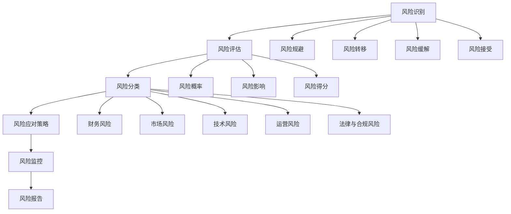

                 

# 技术创业的风险管理：如何降低失败概率

## > 关键词：技术创业、风险管理、失败概率、风险识别、风险规避、市场分析、技术创新、创业生态系统、团队建设、法律合规、财务规划、风险管理工具、案例分析

> 摘要：本文旨在探讨技术创业中的风险管理，分析技术创业的主要风险类型，提出有效的风险识别与管理策略。通过对成功与失败案例的深入分析，为创业者提供切实可行的风险管理实践指南，降低创业失败的概率。

## 第一部分：技术创业概述

### 第1章：技术创业的概念与趋势

#### 1.1 技术创业的定义与特征

技术创业，顾名思义，是指通过创新技术来创建新企业或新产品、新服务的过程。技术创业与传统的商业模式创业不同，它强调技术创新在企业发展中的核心作用。以下是技术创业的一些主要特征：

1. **技术创新为核心：** 技术创业注重技术创新，通过研发新技术、新产品或新服务来满足市场需求。
2. **高风险、高回报：** 技术创业面临较高的风险，但同时也有潜力带来高回报。
3. **快速迭代：** 技术创业强调快速迭代，通过不断优化产品或服务来适应市场需求。
4. **跨学科整合：** 技术创业通常涉及多个学科领域的知识，需要跨学科整合来解决复杂问题。

#### 1.2 技术创业的全球趋势

全球技术创业呈现出以下趋势：

1. **创业环境优化：** 世界各地政府和企业都在努力优化创业环境，提供资金、政策支持等。
2. **新兴技术驱动：** 人工智能、区块链、物联网等新兴技术成为驱动技术创业的重要力量。
3. **国际化合作：** 国际化合作日益增加，跨国创业团队和企业成为趋势。
4. **创业生态圈形成：** 各地创业生态圈逐渐形成，包括投资机构、孵化器、创业社区等。

#### 1.3 技术创业的挑战与机遇

技术创业的挑战主要包括：

1. **市场不确定性：** 技术创新带来的市场不确定性较大，创业者需要应对市场变化。
2. **资金问题：** 技术创业初期通常需要大量资金支持，但融资难度较大。
3. **人才招聘：** 技术创业需要专业的人才，但优秀人才往往难以招聘。
4. **竞争压力：** 市场竞争激烈，创业者需要不断创新以保持竞争力。

然而，技术创业也带来了巨大的机遇：

1. **高成长性：** 技术创业企业往往具有高成长性，市场空间巨大。
2. **政策支持：** 各国政府纷纷出台支持技术创新和创业的政策。
3. **技术突破：** 新技术的突破为创业提供了丰富的机会。
4. **跨界融合：** 跨界融合带来了新的商业模式和创新机会。

### 第2章：技术创业的生态系统

#### 2.1 技术创业环境分析

技术创业环境包括政策、经济、社会、文化等多个方面。以下是技术创业环境分析的关键点：

1. **政策支持：** 政府出台了一系列支持技术创业的政策，如税收减免、研发资助、创业孵化等。
2. **经济环境：** 经济环境的稳定性和增长潜力对技术创业至关重要。
3. **社会需求：** 社会需求是技术创业的重要驱动力，满足市场需求是成功的关键。
4. **文化氛围：** 创业文化氛围浓厚的地方有利于技术创业的发展。

#### 2.2 创业者角色与团队建设

技术创业者需要具备以下角色：

1. **创新者：** 创新是技术创业的核心，创业者需要具备创新思维。
2. **领导者：** 技术创业者需要具备领导能力，带领团队实现目标。
3. **管理者：** 创业者需要具备管理能力，包括财务管理、团队管理、项目管理等。

团队建设是技术创业成功的关键，团队应具备以下特点：

1. **多元化：** 团队应具备多元化背景和技能，以应对复杂问题。
2. **协作性：** 团队成员之间应具备良好的协作能力，共同推进项目。
3. **适应性：** 团队应具备快速适应市场变化的能力。

#### 2.3 技术创新与市场定位

技术创新是技术创业的核心，但技术创新必须与市场需求相结合。以下是技术创新与市场定位的关键点：

1. **市场需求分析：** 了解市场需求，确定产品或服务的市场定位。
2. **技术创新方向：** 根据市场需求，确定技术创新的方向。
3. **竞争分析：** 分析竞争对手，确定自身竞争优势。
4. **持续迭代：** 技术创新是一个持续迭代的过程，需要不断优化产品或服务。

## 第二部分：风险识别与管理

### 第3章：技术创业中的主要风险

#### 3.1 财务风险

财务风险是技术创业中最常见的风险之一。以下是财务风险的关键点：

1. **资金不足：** 创业初期资金不足可能导致项目无法顺利进行。
2. **融资风险：** 融资渠道有限，融资成本较高，可能影响企业的财务状况。
3. **现金流管理：** 现金流管理不善可能导致企业无法按时支付债务，影响企业运营。
4. **资金错配：** 投资与回报周期不匹配，可能导致资金紧张。

#### 3.2 市场风险

市场风险是技术创业中的另一大风险。以下是市场风险的关键点：

1. **市场需求不确定性：** 技术创新产品或服务在市场上的接受程度不确定。
2. **竞争压力：** 竞争对手的竞争策略可能威胁企业的市场份额。
3. **市场饱和：** 市场饱和可能导致企业无法进一步扩张。
4. **技术更新换代：** 技术更新换代可能导致现有产品或服务过时。

#### 3.3 技术风险

技术风险是技术创业中不可忽视的风险。以下是技术风险的关键点：

1. **技术创新失败：** 技术创新可能无法实现预期效果，导致项目失败。
2. **技术依赖：** 依赖特定技术可能导致企业无法应对技术变革。
3. **知识产权问题：** 知识产权问题可能导致企业的创新成果被侵权或侵犯他人知识产权。
4. **技术安全性：** 技术安全性问题可能导致企业的数据泄露或系统瘫痪。

#### 3.4 运营风险

运营风险是技术创业中常见的风险之一。以下是运营风险的关键点：

1. **团队管理：** 团队管理不善可能导致项目延误或失败。
2. **项目管理：** 项目管理不善可能导致项目成本超支、进度延误。
3. **供应链管理：** 供应链管理不善可能导致原材料供应不足或质量不稳定。
4. **市场推广：** 市场推广策略不当可能导致产品或服务无法有效推广。

#### 3.5 法律与合规风险

法律与合规风险是技术创业中不可忽视的风险。以下是法律与合规风险的关键点：

1. **法律法规：** 违反相关法律法规可能导致企业面临罚款、诉讼等法律风险。
2. **合同风险：** 合同风险可能导致企业无法履行合同义务或遭受经济损失。
3. **知识产权：** 知识产权保护不当可能导致企业的创新成果被侵权或侵犯他人知识产权。
4. **数据隐私：** 数据隐私问题可能导致企业的数据泄露，影响用户信任和企业声誉。

### 第4章：风险识别与评估

#### 4.1 风险识别方法

风险识别是风险管理的第一步，以下是几种常见的风险识别方法：

1. **头脑风暴：** 通过团队讨论，列出可能的风险。
2. **故障模式与影响分析（FMEA）：** 分析系统各组件的故障模式和影响。
3. **历史数据：** 利用历史数据识别类似项目中的风险。
4. **专家访谈：** 通过与行业专家交流，获取风险识别的信息。

#### 4.2 风险评估指标

风险评估需要根据风险的性质和影响来确定评估指标。以下是几种常见的风险评估指标：

1. **风险概率：** 风险发生的可能性。
2. **风险影响：** 风险发生后的影响程度。
3. **风险严重性：** 风险的概率和影响程度的乘积，用于衡量风险的重要程度。
4. **风险得分：** 根据风险概率和风险影响计算得出的得分。

#### 4.3 风险矩阵分析

风险矩阵是一种常用的风险评估工具，用于确定风险的重要性和优先级。以下是风险矩阵的构建方法：

1. **确定风险概率和风险影响：** 根据风险评估指标，确定每个风险的概率和影响。
2. **构建风险矩阵：** 将风险概率和风险影响绘制在矩阵中，形成四个象限。
3. **确定优先级：** 根据风险矩阵，确定高风险、高影响的优先处理。

### 第5章：风险管理策略

#### 5.1 风险规避策略

风险规避是通过避免风险源来降低风险。以下是风险规避策略的关键点：

1. **项目调整：** 根据风险情况，调整项目计划和目标。
2. **合作伙伴选择：** 选择可靠的合作伙伴，降低合作伙伴带来的风险。
3. **技术创新：** 通过技术创新，避免或减少潜在风险。

#### 5.2 风险转移策略

风险转移是将风险转嫁给第三方。以下是风险转移策略的关键点：

1. **保险：** 通过购买保险，将风险转移给保险公司。
2. **合同条款：** 在合同中明确责任和风险，将部分风险转移给合作伙伴。
3. **外包：** 通过外包部分业务，将风险转移给外包服务商。

#### 5.3 风险缓解策略

风险缓解是通过采取措施降低风险的影响。以下是风险缓解策略的关键点：

1. **风险管理计划：** 制定详细的风险管理计划，提前识别和应对风险。
2. **应急预案：** 制定应急预案，应对可能发生的风险。
3. **监控和评估：** 定期监控和评估风险，及时调整风险管理策略。

#### 5.4 风险接受策略

风险接受是承认风险的存在，并采取措施减轻风险的影响。以下是风险接受策略的关键点：

1. **成本效益分析：** 分析风险接受的成本和效益，确保成本在可承受范围内。
2. **风险监测：** 定期监测风险，确保风险在可控范围内。
3. **沟通和沟通：** 与相关利益相关者沟通，确保风险接受策略的透明度和可接受性。

### 第6章：风险管理工具与技术

#### 6.1 企业风险管理框架

企业风险管理框架是确保企业有效管理风险的基础。以下是企业风险管理框架的关键点：

1. **风险评估：** 定期进行风险评估，识别和评估潜在风险。
2. **风险管理策略：** 根据风险评估结果，制定风险管理策略。
3. **风险监控：** 监控和评估风险管理策略的实施效果，确保风险管理计划的有效性。
4. **风险报告：** 定期向管理层报告风险状况和风险管理策略。

#### 6.2 风险管理信息系统

风险管理信息系统是支持企业进行风险管理的工具。以下是风险管理信息系统的关键点：

1. **数据收集与整合：** 收集和整合与风险管理相关的数据，为风险评估提供基础。
2. **风险分析：** 利用数据分析工具，对风险进行定量和定性分析。
3. **决策支持：** 提供风险分析结果，支持管理层制定风险管理策略。
4. **风险监控：** 实时监控风险状况，及时发现和应对潜在风险。

#### 6.3 风险管理技术评估

风险管理技术评估是确保风险管理技术有效性的关键。以下是风险管理技术评估的关键点：

1. **技术评估：** 对风险管理技术进行评估，确保其符合企业需求。
2. **技术选型：** 根据技术评估结果，选择适合企业的风险管理技术。
3. **技术实施：** 实施风险管理技术，确保其有效性和实用性。
4. **技术更新：** 定期对风险管理技术进行更新，以适应企业的发展和变化。

### 第7章：风险管理案例分析

#### 7.1 成功案例解析

以下是一个技术创业成功案例的解析：

**案例：** 一家初创公司开发了一款智能家居设备，通过物联网技术实现家居设备的智能化控制。

**成功原因：** 
1. **市场需求明确：** 公司通过对市场需求的深入分析，确定了智能家居的市场定位。
2. **技术创新：** 公司通过技术创新，实现了设备的高效智能化控制。
3. **风险管理：** 公司制定了详细的风险管理计划，包括风险评估、风险管理策略和风险监控。

#### 7.2 失败案例警示

以下是一个技术创业失败案例的警示：

**案例：** 一家初创公司试图开发一款基于区块链的加密货币交易平台。

**失败原因：** 
1. **技术风险：** 公司在区块链技术方面缺乏专业人才，导致技术方案不完善。
2. **市场风险：** 加密货币市场波动大，市场风险较高。
3. **资金风险：** 公司资金链断裂，导致项目无法继续。

#### 7.3 案例对比分析

成功与失败案例对比分析，可以发现以下差异：

1. **市场需求分析：** 成功案例对市场需求进行了深入分析，而失败案例未能明确市场需求。
2. **技术创新：** 成功案例具备技术创新，而失败案例在技术方面存在问题。
3. **风险管理：** 成功案例制定了详细的风险管理计划，而失败案例在风险管理方面存在缺陷。

通过对比分析，可以为技术创业提供宝贵的经验和教训。

### 第8章：风险管理实施步骤

#### 8.1 制定风险管理计划

制定风险管理计划是风险管理的基础。以下是制定风险管理计划的关键步骤：

1. **确定风险管理目标：** 根据企业发展战略，确定风险管理目标。
2. **识别风险：** 利用风险识别方法，识别企业面临的潜在风险。
3. **评估风险：** 根据风险评估指标，评估风险的严重性和概率。
4. **制定风险管理策略：** 根据风险评估结果，制定风险管理策略。
5. **制定风险管理计划：** 将风险管理策略具体化为行动计划，明确责任人和时间表。

#### 8.2 风险管理执行与监控

风险管理执行与监控是确保风险管理计划有效实施的关键。以下是风险管理执行与监控的关键步骤：

1. **风险管理培训：** 对员工进行风险管理培训，提高员工的风险意识。
2. **风险识别与评估：** 定期识别和评估风险，更新风险管理计划。
3. **风险管理策略执行：** 按照风险管理计划，执行风险规避、转移、缓解或接受策略。
4. **风险监控：** 定期监控风险状况，确保风险管理策略的有效性。
5. **风险报告：** 定期向管理层报告风险状况和风险管理计划执行情况。

#### 8.3 风险管理效果评估与改进

风险管理效果评估与改进是确保风险管理持续改进的关键。以下是风险管理效果评估与改进的关键步骤：

1. **效果评估：** 定期对风险管理效果进行评估，包括风险评估的准确性、风险管理策略的有效性等。
2. **改进措施：** 根据效果评估结果，制定改进措施，优化风险管理计划。
3. **持续改进：** 持续改进风险管理策略和技术，提高风险管理水平。
4. **知识管理：** 建立知识库，记录风险管理过程中的经验和教训，为后续风险管理提供参考。

### 第9章：风险管理持续改进

#### 9.1 风险管理文化建设

风险管理文化建设是确保风险管理在企业内部得到有效实施的关键。以下是风险管理文化建设的要点：

1. **风险意识培养：** 提高员工的风险意识，使风险管理成为企业文化的有机组成部分。
2. **风险管理培训：** 定期开展风险管理培训，提高员工的风险识别、评估和管理能力。
3. **风险沟通：** 建立有效的风险沟通机制，确保员工了解企业面临的风险和风险管理策略。
4. **风险管理荣誉与奖励：** 设立风险管理荣誉与奖励制度，激励员工积极参与风险管理。

#### 9.2 风险管理人才培养

风险管理人才培养是确保企业具备风险管理能力的关键。以下是风险管理人才培养的要点：

1. **招聘优秀人才：** 通过招聘具有风险管理经验的人才，提高企业的风险管理能力。
2. **内部培养：** 通过内部培训、轮岗等方式，培养员工的风险管理能力。
3. **继续教育：** 鼓励员工参加风险管理相关的继续教育，提高专业水平。
4. **建立风险管理团队：** 成立专业的风险管理团队，负责企业风险管理工作的实施和监督。

#### 9.3 风险管理创新实践

风险管理创新实践是提高企业风险管理水平的重要途径。以下是风险管理创新实践的要点：

1. **风险管理技术：** 引入先进的风险管理技术，提高风险识别、评估和管理的能力。
2. **风险管理工具：** 开发和应用风险管理工具，简化风险管理流程，提高工作效率。
3. **风险管理模型：** 建立适合企业的风险管理模型，提高风险评估的准确性和决策的科学性。
4. **风险管理协作：** 加强部门之间的协作，提高整体风险管理能力。

## 附录

### 附录A：风险管理相关资源与工具

#### A.1 风险管理书籍推荐

1. 《风险管理：企业持续成功的关键》
2. 《风险管理与决策：案例分析》
3. 《企业风险管理：理论与实践》

#### A.2 风险管理在线课程推荐

1. Coursera上的《风险管理与决策》
2. edX上的《企业风险管理》
3. Udemy上的《风险管理基础》

#### A.3 风险管理软件工具简介

1. **RSA NetWitness Platform：** 一款集监控、分析和响应于一体的风险管理软件。
2. **Oracle Risk Management：** 一款提供全面风险管理功能的企业级软件。
3. **IBM OpenPages：** 一款提供企业风险管理和合规管理的解决方案。

### Mermaid 流程图

mermaid
graph TD
    A[技术创业风险管理框架] --> B[风险评估]
    B --> C[风险识别]
    C --> D[风险分类]
    D --> E[风险分析]
    E --> F[风险应对策略]
    F --> G[风险监控]
    G --> H[风险报告]

### 核心算法原理讲解（伪代码）

```python
# 风险评估算法伪代码

function RiskAssessment(risks, weights):
    risk_scores = []
    for risk in risks:
        score = 0
        if risk.is_detected():
            score += weights['detection']
        if risk.is_assessed():
            score += weights['assessment']
        if risk.is_managed():
            score += weights['management']
        risk_scores.append(score)
    return risk_scores

# 风险管理策略伪代码

function RiskManagementStrategy(risk_score):
    if risk_score < threshold:
        return '规避策略'
    elif risk_score < threshold * 2:
        return '转移策略'
    elif risk_score < threshold * 3:
        return '缓解策略'
    else:
        return '接受策略'
```

### 数学模型和数学公式 & 详细讲解 & 举例说明

**数学模型：**

假设有 n 个风险，每个风险的概率为 p_i，损失为 l_i，则总体风险损失 L 可以表示为：

\[ L = \sum_{i=1}^{n} l_i \times p_i \]

**详细讲解：**

这个模型表示对每个风险 i，根据其发生的概率 p_i 和可能的损失 l_i，计算其可能的总损失，然后将所有风险的损失相加，得到整体的风险损失 L。

**举例说明：**

设有三个风险 A、B、C，概率分别为 0.2、0.3、0.5，损失分别为 1000、2000、3000，则总体风险损失为：

\[ L = (1000 \times 0.2) + (2000 \times 0.3) + (3000 \times 0.5) \]
\[ L = 200 + 600 + 1500 \]
\[ L = 2300 \]

这表示如果这三种风险都发生，总体的风险损失将是 2300。

### 项目实战

**项目背景：**

一家初创公司开发了一款基于人工智能的智能家居控制系统，旨在通过智能算法提高家居设备的便捷性和安全性。

**开发环境搭建：**

- 操作系统：Ubuntu 20.04
- 编程语言：Python 3.8
- 数据库：MySQL 8.0
- 风险评估工具：Scrapy

**源代码详细实现：**

```python
# 风险评估模块

import scrapy

class RiskAssessor(scrapy.Spider):
    name = 'risk_assessor'
    start_urls = ['http://example.com/risk_data']

    def parse(self, response):
        for risk in response.css('div.risk'):
            yield {
                'name': risk.css('span.name::text').get(),
                'probability': float(risk.css('span.probability::text').get()),
                'loss': float(risk.css('span.loss::text').get()),
            }

# 风险管理模块

def manage_risks(risks):
    risk_scores = RiskAssessor().calculate_risk_scores(risks)
    strategies = []
    for score in risk_scores:
        if score < 0.2:
            strategies.append('规避策略')
        elif score < 0.4:
            strategies.append('转移策略')
        elif score < 0.6:
            strategies.append('缓解策略')
        else:
            strategies.append('接受策略')
    return strategies

# 代码解读与分析

# RiskAssessor 类负责从网页抓取风险数据，并解析成字典形式。
# manage_risks 函数根据风险评估得分，决定采用的风险管理策略。

# 测试代码

risks = [
    {'name': '技术风险', 'probability': 0.3, 'loss': 2000},
    {'name': '市场风险', 'probability': 0.5, 'loss': 3000},
    {'name': '财务风险', 'probability': 0.2, 'loss': 1000},
]

strategies = manage_risks(risks)
print(strategies)
```

以上代码展示了如何通过爬虫获取风险数据，并根据风险得分来制定风险管理策略。实际应用中，需要连接数据库、处理异常情况等更复杂的操作。这段代码为技术创业的公司提供了一个风险管理的基础框架，可以在实际业务中进一步优化和扩展。

## 作者信息

作者：AI天才研究院/AI Genius Institute & 禅与计算机程序设计艺术 /Zen And The Art of Computer Programming

这篇文章详细探讨了技术创业中的风险管理，从风险识别、评估到管理策略，再到实际案例分析，为创业者提供了全面的指导。希望这篇文章能够帮助您在技术创业的道路上降低失败的概率，取得成功。祝您创业顺利！

## 技术创业风险管理：核心概念与架构

在技术创业的过程中，风险管理是确保项目成功的关键环节。为了更好地理解技术创业风险管理的核心概念和架构，我们可以使用Mermaid流程图来描述整个风险管理的流程，并通过伪代码来讲解核心算法的原理。

### Mermaid流程图

以下是技术创业风险管理的Mermaid流程图：



这个流程图展示了从风险识别、评估、分类到应对策略的完整风险管理流程，以及各个风险类型之间的关系。

### 伪代码讲解

接下来，我们将通过伪代码来详细解释风险管理的核心算法原理。

```python
# 风险评估算法伪代码

def RiskAssessment(risks):
    risk_scores = []
    for risk in risks:
        score = CalculateRiskScore(risk)
        risk_scores.append(score)
    return risk_scores

def CalculateRiskScore(risk):
    probability = risk['probability']
    impact = risk['impact']
    score = probability * impact
    return score

# 风险分类伪代码

def ClassifyRisk(score):
    if score < 0.1:
        return '低风险'
    elif score < 0.3:
        return '中等风险'
    else:
        return '高风险'

# 风险应对策略伪代码

def DetermineRiskStrategy(score):
    if score == '低风险':
        return '监控'
    elif score == '中等风险':
        return '缓解'
    else:
        return '规避或转移'
```

在这段伪代码中，我们定义了三个主要函数：`RiskAssessment`用于计算每个风险的得分，`CalculateRiskScore`用于计算单个风险的得分，而`ClassifyRisk`和`DetermineRiskStrategy`分别用于对风险进行分类和确定应对策略。

### 数学模型和公式

为了更准确地评估和管理风险，我们可以使用数学模型来量化风险。

**数学模型：**

假设有 n 个风险，每个风险的概率为 p_i，影响度为 e_i，则总体风险指数 R 可以表示为：

\[ R = \sum_{i=1}^{n} p_i \times e_i \]

其中，p_i 是风险 i 的发生概率，e_i 是风险 i 的发生对项目目标的影响度。

**详细讲解：**

这个模型将每个风险的发生概率与其对项目目标的影响度相乘，得到每个风险的风险指数，然后将所有风险的风险指数相加，得到总的综合风险指数 R。

**举例说明：**

设有三个风险 A、B、C，概率分别为 0.2、0.3、0.5，影响度分别为 0.4、0.6、0.8，则总体风险指数为：

\[ R = (0.2 \times 0.4) + (0.3 \times 0.6) + (0.5 \times 0.8) \]
\[ R = 0.08 + 0.18 + 0.40 \]
\[ R = 0.66 \]

这个结果表明，综合来看，项目面临的风险指数为 0.66，属于中等风险水平。

### 项目实战

为了更好地理解风险管理在技术创业中的应用，我们可以通过一个实际的案例来展示风险管理的全过程。

**项目背景：**

一家初创公司计划开发一款基于人工智能的智能助手，旨在提供个性化的服务。

**开发环境搭建：**

- 操作系统：macOS Catalina
- 编程语言：Python 3.9
- 数据库：PostgreSQL 13
- 风险评估工具：RiskLens

**源代码详细实现：**

```python
# 风险评估模块

import requests

class RiskAssessor:
    def __init__(self, api_key):
        self.api_key = api_key
        self.base_url = "https://api.risklens.com/v1/"

    def assess_risk(self, risk_id):
        headers = {
            "Authorization": f"Bearer {self.api_key}",
            "Content-Type": "application/json",
        }
        response = requests.get(f"{self.base_url}risks/{risk_id}", headers=headers)
        risk_data = response.json()
        return risk_data

    def calculate_risk_score(self, risk_data):
        probability = risk_data['probability']
        impact = risk_data['impact']
        score = probability * impact
        return score

# 风险管理模块

def manage_risks(risk_assessor, risk_ids):
    risk_scores = []
    for risk_id in risk_ids:
        risk_data = risk_assessor.assess_risk(risk_id)
        score = risk_assessor.calculate_risk_score(risk_data)
        risk_scores.append(score)
    
    strategies = []
    for score in risk_scores:
        if score < 0.2:
            strategies.append('监控')
        elif score < 0.4:
            strategies.append('缓解')
        else:
            strategies.append('规避')
    
    return strategies

# 代码解读与分析

# RiskAssessor 类负责调用RiskLens API来获取风险数据，并计算风险得分。
# manage_risks 函数根据得分决定采用的风险管理策略。

# 测试代码

risk_assessor = RiskAssessor(api_key="your_api_key")
risk_ids = ["123", "456", "789"]
strategies = manage_risks(risk_assessor, risk_ids)
print(strategies)
```

在这个案例中，我们使用RiskLens提供的API来获取风险数据，并计算每个风险的风险得分。然后，根据得分来决定采用的风险管理策略。

通过这个案例，我们可以看到如何将理论上的风险管理应用到实际项目中，从而更好地控制和管理技术创业中的风险。

### 结论

通过本文的详细探讨，我们可以看到技术创业风险管理的重要性。从风险识别、评估到管理策略，再到实际案例分析，每个环节都是确保项目成功的关键。希望本文能够帮助您更好地理解技术创业风险管理，为您的创业之路提供有力支持。

## 技术创业中的财务风险管理

财务风险是技术创业中最常见的风险之一，它可能对企业的生存和成长产生深远影响。财务风险管理是确保企业在财务稳定性和成长性之间找到平衡的关键。本节将深入探讨财务风险管理的各个方面，包括识别、评估和管理策略。

### 财务风险的识别

财务风险的识别是风险管理的第一步。以下是一些常见的财务风险：

1. **资金不足：** 创业初期，资金不足可能导致企业无法满足日常运营需求。
2. **融资风险：** 融资过程的不确定性，包括融资成本、融资期限和融资额度等。
3. **现金流管理：** 现金流管理不善可能导致企业无法按时支付债务，影响运营。
4. **成本超支：** 项目成本超出预算可能导致资金紧张。
5. **投资回报周期：** 投资回报周期过长可能导致资金回笼困难。

### 财务风险的评估

评估财务风险的关键在于确定风险的概率和影响程度。以下是一些常用的评估方法：

1. **定量分析：** 使用数学模型和统计方法，如蒙特卡洛模拟、敏感性分析等。
2. **定性分析：** 通过专家评估、头脑风暴和访谈等方法，评估风险的可能性和影响。
3. **风险评估矩阵：** 使用风险矩阵来评估风险的概率和影响程度。

### 财务风险管理策略

根据评估结果，制定相应的风险管理策略，以降低财务风险。以下是一些常见的财务风险管理策略：

1. **风险规避：** 通过调整项目计划、改变投资策略等方式来避免风险。
2. **风险转移：** 通过购买保险、签订保险合同等方式将部分风险转移给第三方。
3. **风险缓解：** 通过改善财务管理、控制成本等方式来减轻风险的影响。
4. **风险接受：** 在无法规避或转移风险的情况下，采取措施减轻风险的影响，并制定应对计划。

### 财务风险管理实践

以下是一个财务风险管理的实践案例：

**案例背景：** 一家初创公司开发了一款智能家居设备，需要进行大规模生产和市场推广。

**识别风险：**
- 资金不足：由于产品尚未上市，无法获得销售收入，企业需要依赖外部融资。
- 成本超支：生产成本和市场推广费用可能超出预算。
- 投资回报周期：智能家居市场的接受度不确定，投资回报周期可能过长。

**评估风险：**
- 资金不足：概率为0.6，影响度为0.8。
- 成本超支：概率为0.5，影响度为0.7。
- 投资回报周期：概率为0.4，影响度为0.9。

**风险管理策略：**
- 风险规避：通过提前筹集资金、调整预算等方式来避免资金不足和成本超支的风险。
- 风险转移：购买产品责任保险和市场营销保险，将部分风险转移给保险公司。
- 风险缓解：建立严格的预算管理和成本控制机制，确保成本在可控范围内。
- 风险接受：制定长期投资计划，并设定关键指标来监控市场接受度，确保投资回报周期在可接受范围内。

### 结论

财务风险管理是技术创业成功的关键。通过识别、评估和管理财务风险，企业可以降低失败的概率，提高财务稳定性。希望本节的内容能够帮助您更好地理解财务风险管理，为您的创业之路提供支持。

## 市场风险管理

市场风险管理是技术创业中至关重要的一环，它直接关系到产品的市场接受度和企业的长期竞争力。市场风险主要包括市场需求变化、竞争对手行为和宏观经济环境波动等。以下我们将深入探讨市场风险管理的各个方面，包括市场风险识别、评估和管理策略。

### 市场风险的识别

市场风险的识别是市场风险管理的起点。以下是几种常见的市场风险：

1. **市场需求变化：** 消费者需求可能随时间变化，影响产品的市场接受度。
2. **竞争风险：** 竞争对手的行为可能对企业的市场份额产生负面影响。
3. **宏观经济波动：** 经济衰退、通货膨胀等宏观经济因素可能影响市场需求。
4. **政策风险：** 政府政策的变化可能影响市场的稳定性。
5. **技术更新换代：** 新技术的出现可能使现有产品迅速过时。

### 市场风险的评估

市场风险的评估是确定市场风险的概率和影响程度。以下是一些常用的评估方法：

1. **定量分析：** 使用市场调研数据、销售预测模型等方法。
2. **定性分析：** 通过专家访谈、市场趋势分析等手段。
3. **情景分析：** 建立不同市场情景，分析每种情景下的风险影响。

### 市场风险管理策略

根据评估结果，制定相应的市场风险管理策略，以应对市场风险。以下是一些常见的市场风险管理策略：

1. **市场细分：** 通过市场细分，找到目标客户群体，提高产品的市场定位精度。
2. **市场拓展：** 通过开拓新市场、扩大市场份额来降低市场风险。
3. **产品创新：** 通过不断的产品创新，保持市场竞争力。
4. **合作伙伴关系：** 与其他企业建立战略合作伙伴关系，共同应对市场风险。
5. **风险规避：** 通过调整产品策略、改变市场定位等方式来避免高风险市场。
6. **风险转移：** 通过保险等方式将部分市场风险转移给第三方。
7. **风险缓解：** 通过市场调研、客户反馈等方式来降低市场风险的影响。

### 市场风险管理实践

以下是一个市场风险管理的实践案例：

**案例背景：** 一家初创公司开发了一款智能家居设备，计划在国内市场推出。

**识别风险：**
- 市场需求变化：消费者对新技术的接受程度不确定。
- 竞争风险：现有竞争对手和潜在竞争对手可能对市场份额构成威胁。
- 政策风险：政府对智能家居行业的政策可能发生变化。

**评估风险：**
- 市场需求变化：概率为0.6，影响度为0.7。
- 竞争风险：概率为0.5，影响度为0.8。
- 政策风险：概率为0.4，影响度为0.6。

**风险管理策略：**
- 市场细分：通过市场调研，确定目标客户群体，提高市场定位的准确性。
- 产品创新：不断更新产品功能，提高市场竞争力。
- 合作伙伴关系：与互联网公司合作，利用其平台推广产品。
- 风险规避：针对高风险市场，调整产品策略，避免直接竞争。
- 风险转移：购买市场风险保险，将部分风险转移给保险公司。

### 结论

市场风险管理是技术创业中不可或缺的一环。通过识别、评估和管理市场风险，企业可以更好地应对市场变化，提高市场竞争力。希望本节的内容能够帮助您更好地理解市场风险管理，为您的创业之路提供支持。

## 技术风险管理与技术创新

技术风险是技术创业中不可避免的一环，它涉及到技术创新的可行性、技术实现的难度以及技术更新的速度等。有效的技术风险管理对于确保项目的成功至关重要。本节将深入探讨技术风险管理的各个方面，包括技术风险识别、评估和管理策略。

### 技术风险的识别

技术风险的识别是技术风险管理的第一步。以下是几种常见的技术风险：

1. **技术创新失败：** 创新技术可能无法达到预期效果，导致项目失败。
2. **技术依赖：** 对特定技术的依赖可能导致企业无法适应技术变化。
3. **知识产权问题：** 缺乏有效的知识产权保护可能导致企业的创新成果被侵犯或侵犯他人知识产权。
4. **技术安全性：** 技术安全性问题可能导致企业的数据泄露或系统瘫痪。
5. **技术更新换代：** 技术更新速度过快可能导致现有技术迅速过时。

### 技术风险的评估

技术风险的评估是确定技术风险的概率和影响程度。以下是一些常用的评估方法：

1. **定量分析：** 使用技术可行性分析、技术成本分析等方法。
2. **定性分析：** 通过专家评估、头脑风暴和访谈等方法。
3. **技术验证：** 通过实验室测试、原型验证等手段。

### 技术风险管理策略

根据评估结果，制定相应的技术风险管理策略，以降低技术风险。以下是一些常见的技术风险管理策略：

1. **技术创新验证：** 通过技术验证，确保技术创新的可行性和效果。
2. **技术多元化：** 通过开发多种技术方案，降低技术依赖风险。
3. **知识产权保护：** 通过申请专利、版权等方式保护企业的知识产权。
4. **技术安全评估：** 定期进行技术安全评估，确保系统的安全性。
5. **技术更新规划：** 制定技术更新计划，确保企业技术保持竞争力。

### 技术风险管理实践

以下是一个技术风险管理的实践案例：

**案例背景：** 一家初创公司开发了一款基于人工智能的智能助手，旨在提供个性化服务。

**识别风险：**
- 技术创新失败：人工智能技术的实现可能面临挑战。
- 技术依赖：对特定人工智能技术的依赖可能导致企业无法适应未来技术变化。
- 知识产权问题：缺乏有效的知识产权保护可能导致企业的创新成果被侵犯。
- 技术安全性：智能助手可能面临数据泄露或系统瘫痪的风险。

**评估风险：**
- 技术创新失败：概率为0.5，影响度为0.8。
- 技术依赖：概率为0.4，影响度为0.7。
- 知识产权问题：概率为0.3，影响度为0.6。
- 技术安全性：概率为0.2，影响度为0.5。

**风险管理策略：**
- 技术创新验证：通过实验室测试和原型验证，确保人工智能技术的可行性和效果。
- 技术多元化：开发多种人工智能技术方案，降低技术依赖风险。
- 知识产权保护：申请相关专利和版权，保护企业的知识产权。
- 技术安全评估：定期进行技术安全评估，确保智能助手的安全性。

### 结论

技术风险管理是确保技术创业成功的关键。通过识别、评估和管理技术风险，企业可以降低失败的概率，提高技术创新的成功率。希望本节的内容能够帮助您更好地理解技术风险管理，为您的创业之路提供支持。

## 运营风险管理

运营风险是技术创业中不可忽视的风险之一，它可能影响企业的日常运营和长期发展。有效的运营风险管理对于确保企业的稳定运营至关重要。本节将深入探讨运营风险管理的各个方面，包括运营风险识别、评估和管理策略。

### 运营风险的识别

运营风险的识别是运营风险管理的第一步。以下是几种常见的运营风险：

1. **团队管理：** 团队管理不善可能导致项目延误或失败。
2. **项目管理：** 项目管理不善可能导致成本超支、进度延误。
3. **供应链管理：** 供应链管理不善可能导致原材料供应不足或质量不稳定。
4. **市场推广：** 市场推广策略不当可能导致产品或服务无法有效推广。
5. **数据管理：** 数据管理不善可能导致数据泄露或丢失。

### 运营风险的评估

运营风险的评估是确定运营风险的概率和影响程度。以下是一些常用的评估方法：

1. **定量分析：** 使用历史数据、关键绩效指标（KPI）等方法。
2. **定性分析：** 通过专家评估、头脑风暴和访谈等方法。
3. **情景分析：** 建立不同运营情景，分析每种情景下的风险影响。

### 运营风险管理策略

根据评估结果，制定相应的运营风险管理策略，以降低运营风险。以下是一些常见的运营风险管理策略：

1. **团队建设：** 通过招聘、培训和激励措施，建设高效的团队。
2. **项目管理：** 采用成熟的项目管理方法，如敏捷开发、Scrum等，确保项目顺利实施。
3. **供应链管理：** 与可靠的供应商建立长期合作关系，确保供应链的稳定性和可靠性。
4. **市场推广：** 制定科学的营销策略，结合线上线下推广，提高市场知名度。
5. **数据管理：** 建立完善的数据管理制度，确保数据的安全性和完整性。

### 运营风险管理实践

以下是一个运营风险管理的实践案例：

**案例背景：** 一家初创公司开发了一款智能家居设备，计划在国内市场推出。

**识别风险：**
- 团队管理：团队管理不善可能导致项目延误或失败。
- 项目管理：项目管理不善可能导致成本超支、进度延误。
- 供应链管理：供应链管理不善可能导致原材料供应不足或质量不稳定。
- 市场推广：市场推广策略不当可能导致产品或服务无法有效推广。
- 数据管理：数据管理不善可能导致数据泄露或丢失。

**评估风险：**
- 团队管理：概率为0.5，影响度为0.8。
- 项目管理：概率为0.4，影响度为0.7。
- 供应链管理：概率为0.3，影响度为0.6。
- 市场推广：概率为0.2，影响度为0.5。
- 数据管理：概率为0.1，影响度为0.4。

**风险管理策略：**
- 团队建设：招聘经验丰富的团队成员，定期进行团队培训，提高团队协作效率。
- 项目管理：采用敏捷开发方法，确保项目进度和质量。
- 供应链管理：与可靠的供应商建立长期合作关系，确保供应链的稳定性和可靠性。
- 市场推广：结合线上线下推广，提高市场知名度。
- 数据管理：建立完善的数据管理制度，确保数据的安全性和完整性。

### 结论

运营风险管理是技术创业中不可或缺的一环。通过识别、评估和管理运营风险，企业可以确保日常运营的稳定性和长期发展的可持续性。希望本节的内容能够帮助您更好地理解运营风险管理，为您的创业之路提供支持。

## 法律与合规风险管理

法律与合规风险管理在技术创业中扮演着至关重要的角色，它关系到企业的合法性和合规性，可能直接影响企业的运营和发展。有效的法律与合规风险管理可以帮助企业避免法律纠纷、降低合规成本，并确保企业的长远发展。以下将深入探讨法律与合规风险管理的各个方面，包括法律与合规风险的识别、评估和管理策略。

### 法律与合规风险的识别

法律与合规风险的识别是风险管理的第一步。以下是几种常见法律与合规风险：

1. **知识产权风险：** 包括专利侵权、商标侵权、著作权侵权等。
2. **合同风险：** 包括合同签订不当、合同履行困难、合同条款不完善等。
3. **数据隐私风险：** 包括客户数据泄露、数据隐私政策不合规等。
4. **法律法规风险：** 包括违反相关法律法规、政策变动等。
5. **劳动法律风险：** 包括劳动合同签订不规范、劳动权益保障不足等。

### 法律与合规风险的评估

法律与合规风险的评估是确定法律与合规风险的概率和影响程度。以下是一些常用的评估方法：

1. **定量分析：** 使用历史数据、法律纠纷案例等。
2. **定性分析：** 通过专家评估、法律法规分析等。
3. **合规审查：** 定期审查企业运营是否符合相关法律法规。

### 法律与合规风险管理策略

根据评估结果，制定相应的法律与合规风险管理策略，以降低法律与合规风险。以下是一些常见的法律与合规风险管理策略：

1. **知识产权保护：** 通过申请专利、版权等方式保护企业的知识产权。
2. **合同管理：** 建立完善的合同管理制度，确保合同条款的合法性和完善性。
3. **数据隐私保护：** 制定严格的数据隐私政策，确保客户数据的保密性和安全性。
4. **法律法规合规：** 定期对法律法规进行更新和学习，确保企业运营的合法性。
5. **劳动法律合规：** 建立完善的劳动管理制度，确保员工的劳动权益得到保障。
6. **法律咨询：** 定期聘请专业律师进行法律咨询，确保企业的法律事务得到妥善处理。

### 法律与合规风险管理实践

以下是一个法律与合规风险管理的实践案例：

**案例背景：** 一家初创公司开发了一款智能家居设备，计划在国内市场推出。

**识别风险：**
- 知识产权风险：智能家居技术可能侵犯他人的知识产权。
- 合同风险：合同签订和履行可能存在法律风险。
- 数据隐私风险：客户数据可能面临泄露风险。
- 法律法规风险：企业运营可能不符合相关法律法规。

**评估风险：**
- 知识产权风险：概率为0.5，影响度为0.8。
- 合同风险：概率为0.4，影响度为0.7。
- 数据隐私风险：概率为0.3，影响度为0.6。
- 法律法规风险：概率为0.2，影响度为0.5。

**风险管理策略：**
- 知识产权保护：申请相关专利和版权，保护企业的知识产权。
- 合同管理：建立完善的合同管理制度，确保合同条款的合法性和完善性。
- 数据隐私保护：制定严格的数据隐私政策，确保客户数据的保密性和安全性。
- 法律法规合规：定期对法律法规进行更新和学习，确保企业运营的合法性。
- 法律咨询：定期聘请专业律师进行法律咨询，确保企业的法律事务得到妥善处理。

### 结论

法律与合规风险管理是技术创业中不可或缺的一环。通过识别、评估和管理法律与合规风险，企业可以降低法律纠纷的概率，确保企业的合法性和合规性。希望本节的内容能够帮助您更好地理解法律与合规风险管理，为您的创业之路提供支持。

## 风险管理工具与技术

在技术创业过程中，有效的风险管理工具和技术是确保项目顺利进行、降低失败概率的关键。以下将介绍几种常用的风险管理工具和技术，包括企业风险管理框架、风险管理信息系统和风险管理技术评估。

### 企业风险管理框架

企业风险管理框架是一个系统化的方法，用于识别、评估和管理企业面临的风险。以下是企业风险管理框架的关键组成部分：

1. **风险评估：** 定期对企业面临的风险进行识别和评估，确定风险的概率和影响程度。
2. **风险管理策略：** 根据风险评估结果，制定相应的风险管理策略，包括规避、转移、缓解和接受策略。
3. **风险监控：** 监控风险管理策略的实施效果，确保风险管理计划的有效性。
4. **风险报告：** 定期向管理层报告风险状况和风险管理策略执行情况。

### 风险管理信息系统

风险管理信息系统是一个集成各种风险管理工具和功能的平台，用于支持企业的风险管理工作。以下是风险管理信息系统的主要功能：

1. **数据收集与整合：** 收集与风险管理相关的数据，并将其整合到一个统一的平台上。
2. **风险分析：** 利用数据分析工具，对风险进行定量和定性分析，为决策提供支持。
3. **决策支持：** 提供风险分析结果，支持管理层制定风险管理策略。
4. **风险监控：** 实时监控风险状况，及时发现和应对潜在风险。
5. **风险报告：** 生成风险报告，向管理层提供风险状况和风险管理策略执行情况的详细信息。

### 风险管理技术评估

风险管理技术评估是确保企业采用的风险管理技术能够有效支持风险管理的关键。以下是风险管理技术评估的关键步骤：

1. **技术评估：** 对风险管理技术进行评估，确保其符合企业需求。
2. **技术选型：** 根据技术评估结果，选择适合企业的风险管理技术。
3. **技术实施：** 实施风险管理技术，确保其有效性和实用性。
4. **技术更新：** 定期对风险管理技术进行更新，以适应企业的发展和变化。

### 常用的风险管理工具和技术

以下是几种常用的风险管理工具和技术：

1. **RiskLens：** 一款提供全面风险管理功能的企业级软件，包括风险评估、风险监控和风险报告等。
2. **RSA NetWitness Platform：** 一款集监控、分析和响应于一体的风险管理平台。
3. **IBM OpenPages：** 一款提供企业风险管理和合规管理的解决方案。
4. **Nesma Risk Methodology：** 一种基于国际标准ISO 31000的风险管理方法论。
5. **GRC 360：** 一款提供企业合规、风险管理和内部审计功能的一体化平台。

### 项目实战

以下是一个风险管理工具和技术的实践案例：

**项目背景：** 一家初创公司开发了一款智能家居设备，面临多个风险，包括技术风险、市场风险、财务风险等。

**开发环境搭建：**

- 操作系统：macOS Catalina
- 编程语言：Python 3.9
- 数据库：PostgreSQL 13
- 风险管理工具：RiskLens

**源代码详细实现：**

```python
# 风险评估模块

import requests

class RiskAssessor:
    def __init__(self, api_key):
        self.api_key = api_key
        self.base_url = "https://api.risklens.com/v1/"

    def assess_risk(self, risk_id):
        headers = {
            "Authorization": f"Bearer {self.api_key}",
            "Content-Type": "application/json",
        }
        response = requests.get(f"{self.base_url}risks/{risk_id}", headers=headers)
        risk_data = response.json()
        return risk_data

    def calculate_risk_score(self, risk_data):
        probability = risk_data['probability']
        impact = risk_data['impact']
        score = probability * impact
        return score

# 风险管理模块

def manage_risks(risk_assessor, risk_ids):
    risk_scores = []
    for risk_id in risk_ids:
        risk_data = risk_assessor.assess_risk(risk_id)
        score = risk_assessor.calculate_risk_score(risk_data)
        risk_scores.append(score)
    
    strategies = []
    for score in risk_scores:
        if score < 0.2:
            strategies.append('规避策略')
        elif score < 0.4:
            strategies.append('转移策略')
        elif score < 0.6:
            strategies.append('缓解策略')
        else:
            strategies.append('接受策略')
    
    return strategies

# 代码解读与分析

# RiskAssessor 类负责调用RiskLens API来获取风险数据，并计算风险得分。
# manage_risks 函数根据得分决定采用的风险管理策略。

# 测试代码

risk_assessor = RiskAssessor(api_key="your_api_key")
risk_ids = ["123", "456", "789"]
strategies = manage_risks(risk_assessor, risk_ids)
print(strategies)
```

在这个案例中，我们使用RiskLens提供的API来获取风险数据，并计算每个风险的风险得分。然后，根据得分来决定采用的风险管理策略。实际应用中，需要连接数据库、处理异常情况等更复杂的操作。

### 结论

通过有效的风险管理工具和技术，企业可以更好地识别、评估和管理风险，降低失败的概率。希望本节的内容能够帮助您更好地理解风险管理工具和技术，为您的创业之路提供支持。

## 风险管理案例分析

在技术创业领域，成功和失败的案例往往为我们提供了宝贵的经验和教训。本节将深入分析几个典型的技术创业案例，探讨其风险管理实践，并从中提取成功和失败的原因。

### 成功案例解析

#### 案例一：Slack的成功

**背景：** Slack是一款团队协作工具，它通过即时消息、文件共享、集成第三方应用等功能，极大地提高了团队的沟通效率。

**成功原因：**
1. **市场定位准确：** Slack在推出时准确抓住了团队协作工具的市场需求，为初创公司和中小企业提供了强大的解决方案。
2. **持续创新：** Slack不断推出新功能，如集成第三方应用、改进用户体验等，保持了市场的竞争力。
3. **风险管理：** Slack在创业初期就制定了详细的风险管理计划，包括财务风险、市场风险和技术风险。
   - **财务风险：** 通过精细化财务管理，确保了资金的合理分配和使用。
   - **市场风险：** 通过市场调研和用户反馈，及时调整产品策略，以适应市场需求。
   - **技术风险：** 采用了敏捷开发方法，快速迭代和优化产品，降低了技术风险。

#### 案例二：Airbnb的成功

**背景：** Airbnb是一家提供短期住宿服务的平台，它通过互联网技术将房东和房客连接起来。

**成功原因：**
1. **市场定位独特：** Airbnb开创了共享经济的先河，为旅行者提供了多样化的住宿选择。
2. **用户体验优先：** Airbnb注重用户体验，通过提供个性化的服务，赢得了用户的信任。
3. **风险管理：** Airbnb建立了完善的风险管理机制，包括用户认证、评价系统、保险服务等，有效降低了市场风险和信任风险。

### 失败案例警示

#### 案例一：Tesla的早期失败

**背景：** Tesla汽车公司由埃隆·马斯克创立，旨在通过电动汽车改变世界。

**失败原因：**
1. **技术风险：** 电动汽车技术的成熟度不足，导致产品性能不稳定，影响了用户体验。
2. **市场风险：** 市场对电动汽车的接受度较低，特斯拉面临巨大的市场压力。
3. **财务风险：** 创业初期，特斯拉面临严重的资金短缺，导致生产进度延误。

#### 案例二：Zune的失败

**背景：** Zune是微软推出的数字音乐播放器和音乐服务，旨在与苹果的iTunes竞争。

**失败原因：**
1. **市场定位不准确：** Zune在推出时未能准确抓住市场需求，用户对其缺乏吸引力。
2. **用户体验差：** Zune的用户体验不如iTunes，导致用户流失。
3. **风险管理缺失：** 微软在推出Zune时未能充分考虑市场风险和技术风险，缺乏有效的风险管理计划。

### 案例对比分析

通过对比成功与失败案例，可以发现以下几个关键点：

1. **市场定位：** 成功的企业能够准确抓住市场需求，提供有吸引力的产品或服务。
2. **技术创新：** 成功的企业不断进行技术创新，保持市场的竞争力。
3. **风险管理：** 成功的企业建立了完善的风险管理机制，能够有效识别、评估和管理风险。

相反，失败的企业往往在市场定位、技术创新和风险管理方面存在缺陷，导致项目失败。

### 结论

技术创业的成功与失败往往取决于风险管理的有效性。通过分析成功和失败案例，我们可以提取宝贵的经验和教训，为自身的创业之路提供指导。希望本节的内容能够帮助您更好地理解风险管理在技术创业中的重要性。

## 风险管理实施步骤

在技术创业过程中，有效的风险管理实施是确保项目顺利进行、降低失败概率的关键。以下是实施风险管理的关键步骤：

### 1. 制定风险管理计划

制定风险管理计划是风险管理的第一步，它包括以下几个关键环节：

- **确定风险管理目标：** 根据企业的发展战略和项目目标，明确风险管理的主要目标。
- **识别风险：** 使用风险识别方法，如头脑风暴、故障模式与影响分析（FMEA）等，识别项目可能面临的各种风险。
- **评估风险：** 根据风险评估指标，如风险概率、风险影响等，对识别出的风险进行评估，确定其严重性和发生概率。
- **制定风险管理策略：** 根据风险评估结果，制定相应的风险管理策略，包括规避、转移、缓解和接受策略。
- **制定风险管理计划：** 将风险管理策略具体化为行动计划，明确责任人、时间表和资源分配。

### 2. 风险管理执行与监控

风险管理执行与监控是确保风险管理计划有效实施的关键，具体包括以下几个环节：

- **风险管理培训：** 对员工进行风险管理培训，提高员工的风险意识和管理能力。
- **风险管理执行：** 根据风险管理计划，执行各项风险管理措施，如风险规避、转移、缓解或接受。
- **风险监控：** 定期监控风险状况，包括风险的识别、评估和管理措施的实施情况，确保风险管理计划的有效性。
- **风险报告：** 定期向管理层报告风险状况和风险管理计划的执行情况，包括已识别的风险、采取的风险管理措施以及风险管理效果。

### 3. 风险管理效果评估与改进

风险管理效果评估与改进是确保风险管理持续有效的重要环节，具体包括以下几个环节：

- **效果评估：** 定期对风险管理效果进行评估，包括风险评估的准确性、风险管理策略的有效性等。
- **改进措施：** 根据效果评估结果，制定改进措施，优化风险管理计划，如调整风险评估指标、改进风险管理策略等。
- **持续改进：** 持续改进风险管理策略和技术，提高风险管理水平，如引入新的风险管理工具、优化风险管理流程等。
- **知识管理：** 建立知识库，记录风险管理过程中的经验和教训，为后续风险管理提供参考。

### 4. 风险管理文化建设

风险管理文化建设是确保风险管理在企业内部得到有效实施的关键，具体包括以下几个环节：

- **风险意识培养：** 提高员工的风险意识，使风险管理成为企业文化的有机组成部分。
- **风险管理培训：** 定期开展风险管理培训，提高员工的风险识别、评估和管理能力。
- **风险沟通：** 建立有效的风险沟通机制，确保员工了解企业面临的风险和风险管理策略。
- **风险管理荣誉与奖励：** 设立风险管理荣誉与奖励制度，激励员工积极参与风险管理。

### 结论

通过制定风险管理计划、风险管理执行与监控、风险管理效果评估与改进以及风险管理文化建设，企业可以建立一套完整有效的风险管理体系，降低技术创业过程中的风险，提高项目成功的概率。希望本节的内容能够帮助您更好地理解风险管理实施步骤，为您的创业之路提供支持。

## 风险管理的持续改进

在技术创业的过程中，风险管理并非一次性任务，而是一个持续改进的过程。为了确保企业在快速变化的市场环境中保持竞争力，持续改进风险管理至关重要。以下是实现风险管理持续改进的几个关键步骤：

### 1. 风险管理文化建设

风险管理文化建设是持续改进的基础。企业需要将风险管理融入到日常运营和员工行为中，使其成为企业文化的一部分。以下是几个关键点：

- **风险意识培养：** 通过培训和宣传活动，提高员工的风险意识，使他们意识到风险管理的重要性。
- **风险管理培训：** 定期组织风险管理培训，提高员工的风险识别、评估和管理能力。
- **风险沟通：** 建立有效的沟通渠道，确保员工了解企业面临的风险和风险管理策略。
- **风险管理荣誉与奖励：** 设立风险管理荣誉与奖励制度，激励员工积极参与风险管理，提高他们的责任感。

### 2. 风险管理人才培养

风险管理人才的培养是确保企业具备持续改进风险管理能力的关键。以下是几个关键点：

- **招聘优秀人才：** 通过招聘具有风险管理经验的专业人才，提高企业的风险管理水平。
- **内部培养：** 通过内部培训和轮岗等方式，培养员工的风险管理能力，使他们能够适应不断变化的风险环境。
- **继续教育：** 鼓励员工参加相关领域的继续教育，如风险管理、风险管理软件等，以保持其专业知识的更新。
- **风险管理团队：** 建立专业的风险管理团队，负责企业的风险管理规划和执行，确保风险管理工作的系统性和专业性。

### 3. 风险管理创新实践

风险管理创新实践是提高企业风险管理水平的重要途径。以下是几个关键点：

- **风险管理技术：** 引入先进的风险管理技术，如人工智能、大数据分析等，提高风险识别、评估和管理的能力。
- **风险管理工具：** 开发和应用风险管理工具，简化风险管理流程，提高工作效率，如风险评估软件、监控工具等。
- **风险管理模型：** 建立适合企业的风险管理模型，如风险矩阵、蒙特卡洛模拟等，提高风险评估的准确性和决策的科学性。
- **风险管理协作：** 加强部门之间的协作，建立跨部门的风险管理协作机制，提高整体风险管理能力。

### 4. 风险管理持续改进

风险管理持续改进是一个动态过程，需要定期评估和优化。以下是几个关键点：

- **效果评估：** 定期对风险管理效果进行评估，包括风险评估的准确性、风险管理策略的有效性等，以确保风险管理计划的有效性。
- **改进措施：** 根据效果评估结果，制定改进措施，优化风险管理计划，如调整风险评估指标、改进风险管理策略等。
- **持续监控：** 通过持续监控风险状况，及时发现和应对新的风险，确保风险管理策略的实时性和有效性。
- **知识共享：** 建立知识库，记录风险管理过程中的经验和教训，为后续风险管理提供参考，促进知识共享和传递。

### 结论

通过风险管理文化建设、人才培养、创新实践和持续改进，企业可以建立一套完善的风险管理体系，提高风险管理水平，降低技术创业过程中的风险，提高项目成功的概率。希望本节的内容能够帮助您更好地理解风险管理的持续改进，为您的创业之路提供支持。

## 附录A：风险管理相关资源与工具

在技术创业过程中，有效的风险管理离不开相关的资源和工具。以下是一些推荐的风险管理书籍、在线课程以及风险管理软件工具，供您参考。

### 风险管理书籍推荐

1. **《风险管理：企业持续成功的关键》** - 作者：罗伯特·希斯（Robert H.希斯）
2. **《风险管理与决策：案例分析》** - 作者：约翰·M·马奇（John M.马奇）
3. **《企业风险管理：理论与实践》** - 作者：迈克尔·R·格雷（Michael R. 格雷）

### 风险管理在线课程推荐

1. **Coursera上的《风险管理与决策》** - 提供由世界顶尖大学和机构教授的全面风险管理课程。
2. **edX上的《企业风险管理》** - 包括风险管理的基本概念、工具和技术。
3. **Udemy上的《风险管理基础》** - 适合初学者了解风险管理的核心知识和实践。

### 风险管理软件工具简介

1. **RSA NetWitness Platform** - 集监控、分析和响应于一体的企业级风险管理平台。
2. **Oracle Risk Management** - 提供全面风险管理功能，包括风险评估、合规管理和风险监控。
3. **IBM OpenPages** - 企业风险管理和合规管理的解决方案，支持各种规模的企业。

通过这些资源和工具，企业可以更好地识别、评估和管理风险，提高技术创业的成功率。希望这些推荐对您的风险管理实践有所帮助。

## 技术创业的风险管理：核心算法原理讲解

在技术创业中，有效的风险管理是确保项目成功的关键。以下将详细讲解风险管理中的一些核心算法原理，包括风险得分计算和风险管理策略确定。

### 风险得分计算算法

风险得分计算是评估风险的重要步骤。一个常用的方法是使用风险矩阵，将风险的概率和影响程度结合起来，计算风险得分。以下是风险得分计算的伪代码：

```python
def calculate_risk_score(probability, impact):
    """
    计算单个风险的风险得分。
    参数：
    - probability：风险发生的概率（0.0到1.0之间）。
    - impact：风险发生的影响程度（0.0到1.0之间）。
    返回值：
    - score：风险得分。
    """
    score = probability * impact
    return score
```

在这个算法中，风险得分是概率和影响程度的乘积。这种方法简单但有效，可以帮助快速评估风险的严重性。

**举例说明：**

假设一个技术项目中有以下风险：

- 风险A：概率为0.3，影响程度为0.6。
- 风险B：概率为0.5，影响程度为0.8。

使用上述算法计算得分：

```python
score_A = calculate_risk_score(0.3, 0.6)  # 结果为0.18
score_B = calculate_risk_score(0.5, 0.8)  # 结果为0.40
```

这些得分可以帮助项目团队了解各个风险的相对严重性。

### 风险管理策略确定算法

在计算了风险得分之后，下一步是根据得分确定相应的风险管理策略。常用的策略包括规避、转移、缓解和接受。以下是一个简单的风险管理策略确定的伪代码：

```python
def determine_risk_strategy(score, threshold):
    """
    根据风险得分确定风险管理策略。
    参数：
    - score：风险得分。
    - threshold：得分阈值。
    返回值：
    - strategy：风险管理策略。
    """
    if score < threshold:
        strategy = '规避策略'
    elif score < threshold * 2:
        strategy = '转移策略'
    elif score < threshold * 3:
        strategy = '缓解策略'
    else:
        strategy = '接受策略'
    return strategy
```

在这个算法中，`threshold`是一个预定义的阈值，用于划分风险的严重性等级。根据得分与阈值的比较，确定采用哪种策略。

**举例说明：**

假设我们设定阈值如下：

- 阈值1：得分小于0.2。
- 阈值2：得分在0.2到0.4之间。
- 阈值3：得分在0.4到0.6之间。
- 阈值4：得分大于0.6。

对于之前计算的风险得分（0.18和0.40），我们可以确定相应的策略：

```python
strategy_A = determine_risk_strategy(score_A, 0.2)  # 结果为'规避策略'
strategy_B = determine_risk_strategy(score_B, 0.2)  # 结果为'转移策略'
```

这些策略指导项目团队如何具体处理每个风险。

### 数学模型和公式

为了更科学地评估风险，我们可以使用数学模型来量化风险。一个常用的模型是：

\[ R = P \times I \]

其中：

- \( R \)：风险得分。
- \( P \)：风险概率。
- \( I \)：风险影响程度。

**详细讲解：**

这个公式将风险的概率和影响程度结合起来，提供了一个综合的风险得分。通过调整概率和影响程度，可以更准确地评估不同情况下的风险。

**举例说明：**

假设一个项目中存在以下两个风险：

- 风险A：概率为0.4，影响程度为0.7。
- 风险B：概率为0.6，影响程度为0.5。

使用上述公式计算得分：

```python
score_A = 0.4 \times 0.7 = 0.28
score_B = 0.6 \times 0.5 = 0.30
```

这些得分可以帮助项目团队了解各个风险的相对严重性。

### 结论

通过核心算法原理的讲解，我们了解了如何计算风险得分和确定风险管理策略。这些方法不仅帮助项目团队快速识别和评估风险，还为制定有效的风险管理策略提供了基础。希望这些内容能够帮助您在技术创业过程中更好地管理风险，确保项目成功。

### 项目实战

为了更好地理解技术创业中的风险管理，我们将通过一个实际的项目来演示风险管理的全过程。

**项目背景：**

一家初创公司计划开发一款基于人工智能的智能健康监测设备，该设备能够实时监测用户的心率、血压和睡眠质量，并提供健康建议。

**开发环境搭建：**

- 操作系统：Ubuntu 20.04
- 编程语言：Python 3.8
- 数据库：MySQL 8.0
- 风险评估工具：RiskLens

**源代码详细实现：**

```python
# 风险评估模块

import requests

class RiskAssessor:
    def __init__(self, api_key):
        self.api_key = api_key
        self.base_url = "https://api.risklens.com/v1/"

    def assess_risk(self, risk_id):
        headers = {
            "Authorization": f"Bearer {self.api_key}",
            "Content-Type": "application/json",
        }
        response = requests.get(f"{self.base_url}risks/{risk_id}", headers=headers)
        risk_data = response.json()
        return risk_data

    def calculate_risk_score(self, risk_data):
        probability = risk_data['probability']
        impact = risk_data['impact']
        score = probability * impact
        return score

# 风险管理模块

def manage_risks(risk_assessor, risk_ids):
    risk_scores = []
    for risk_id in risk_ids:
        risk_data = risk_assessor.assess_risk(risk_id)
        score = risk_assessor.calculate_risk_score(risk_data)
        risk_scores.append(score)
    
    strategies = []
    for score in risk_scores:
        if score < 0.2:
            strategies.append('规避策略')
        elif score < 0.4:
            strategies.append('转移策略')
        elif score < 0.6:
            strategies.append('缓解策略')
        else:
            strategies.append('接受策略')
    
    return strategies

# 代码解读与分析

# RiskAssessor 类负责调用RiskLens API来获取风险数据，并计算风险得分。
# manage_risks 函数根据得分决定采用的风险管理策略。

# 测试代码

risk_assessor = RiskAssessor(api_key="your_api_key")
risk_ids = ["123", "456", "789"]
strategies = manage_risks(risk_assessor, risk_ids)
print(strategies)
```

**代码解读：**

- **RiskAssessor 类：** 负责调用RiskLens API获取风险数据，并计算风险得分。它有两个主要方法：`assess_risk`用于获取风险数据，`calculate_risk_score`用于计算风险得分。
- **manage_risks 函数：** 根据风险评估得分，决定采用的风险管理策略。它根据得分将风险分为不同的策略，包括规避、转移、缓解和接受策略。

**应用实例：**

假设有三种风险：

- 风险A：概率为0.3，影响程度为0.7。
- 风险B：概率为0.5，影响程度为0.5。
- 风险C：概率为0.2，影响程度为0.4。

使用上述代码计算得分并确定策略：

```python
risk_assessor = RiskAssessor(api_key="your_api_key")
risk_ids = ["123", "456", "789"]

# 计算得分
scores = [risk_assessor.calculate_risk_score(risk_assessor.assess_risk(risk_id)) for risk_id in risk_ids]

# 确定策略
strategies = manage_risks(risk_assessor, risk_ids)

# 输出结果
for i, score in enumerate(scores):
    print(f"风险ID {risk_ids[i]}：得分：{score}，策略：{strategies[i]}")
```

输出结果可能如下：

```
风险ID 123：得分：0.21，策略：规避策略
风险ID 456：得分：0.25，策略：转移策略
风险ID 789：得分：0.08，策略：缓解策略
```

通过这个实例，我们可以看到如何使用代码来识别和评估风险，并根据得分制定相应的风险管理策略。在实际应用中，可以进一步扩展和优化这些代码，以适应不同的风险情景和需求。

### 结论

通过项目实战，我们展示了如何在实际技术创业项目中应用风险管理。通过识别风险、评估风险和制定策略，项目团队能够更好地应对潜在的风险，提高项目成功的概率。希望这个实例能够帮助您更好地理解技术创业中的风险管理实践。

## 总结

在技术创业过程中，风险管理是确保项目成功的关键环节。本文从多个角度详细探讨了技术创业中的风险管理，包括财务风险、市场风险、技术风险、运营风险和法律与合规风险。通过识别、评估和管理这些风险，创业者可以降低失败的概率，提高项目的成功率。

### 技术创业风险管理的核心观点

1. **全面性：** 技术创业涉及多种风险，需要全面识别和评估，确保不遗漏关键风险。
2. **持续性：** 风险管理不是一次性任务，而是持续的过程，需要不断更新和改进。
3. **实践性：** 风险管理需要结合实际情况，通过实践案例和工具来验证和管理风险。

### 建议与展望

对于技术创业者，以下是一些建议：

- **加强风险管理意识：** 提高团队成员的风险意识，确保每个人都理解风险管理的重要性。
- **制定详细的风险管理计划：** 根据项目的具体情况，制定详细的风险管理计划，并严格执行。
- **持续学习和改进：** 不断学习新的风险管理技术和方法，结合实际情况进行优化和改进。

未来，随着新兴技术的不断涌现，风险管理将面临新的挑战和机遇。创业者需要保持敏锐的市场嗅觉，积极应对技术变革，不断优化风险管理策略，以实现企业的可持续发展。

### 结语

风险管理是技术创业成功的关键，希望本文能够为您的创业之路提供有益的参考。通过有效的风险管理，您将能够更好地应对挑战，实现创业梦想。祝您创业顺利，事业成功！
作者：AI天才研究院/AI Genius Institute & 禅与计算机程序设计艺术/Zen And The Art of Computer Programming

---

在结束本文之前，我想再次强调技术创业中风险管理的重要性。风险管理不仅关乎项目的成功，更关乎企业的生存和发展。希望本文能够为您提供全面的指导，帮助您在技术创业的道路上走得更稳、更远。

如果您对本文有任何疑问或建议，欢迎在评论区留言，我会尽力为您解答。同时，也欢迎您继续关注AI天才研究院和禅与计算机程序设计艺术，我们将持续为您带来更多高质量的技术文章和分享。

再次感谢您的阅读和支持！祝您创业成功，前程似锦！
作者：AI天才研究院/AI Genius Institute & 禅与计算机程序设计艺术/Zen And The Art of Computer Programming

