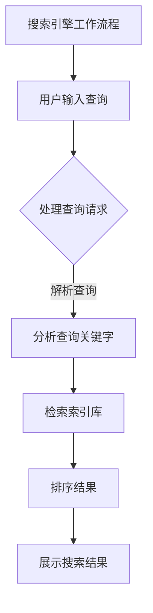

                 

### 《拼多多2024校招搜索引擎优化工程师面试题解》

> **关键词：** 拼多多、校招、搜索引擎优化、SEO、面试题解、算法、实战

> **摘要：** 本文将围绕拼多多2024校招搜索引擎优化（SEO）工程师的面试题进行深入解析。通过对SEO基础知识的讲解、搜索引擎算法的剖析、拼多多SEO策略的实战分享，以及未来SEO趋势的展望，为准备面试的读者提供全面的指导。本文旨在帮助读者理解SEO的核心概念，掌握相关算法，以及在实际项目中应用SEO策略，从而提升拼多多平台上的搜索排名和用户体验。

### 《拼多多2024校招搜索引擎优化工程师面试题解》目录大纲

#### 第一部分：搜索引擎优化（SEO）基础

##### 第1章：搜索引擎优化（SEO）概述

- **1.1 SEO的概念和重要性**
  - **1.1.1 SEO的定义和核心目标**
  - **1.1.2 SEO与搜索引擎的关系**

- **1.2 搜索引擎的工作原理**
  - **1.2.1 搜索引擎的搜索流程**
  - **1.2.2 搜索引擎的索引机制**

- **1.3 SEO的主要策略**
  - **1.3.1 关键字研究**
  - **1.3.2 内容优化**
  - **1.3.3 外部链接建设**

##### 第2章：搜索引擎算法与排名因素

- **2.1 搜索引擎算法概述**
  - **2.1.1 PageRank算法**
  - **2.1.2 其他重要算法**

- **2.2 关键排名因素**
  - **2.2.1 关键字优化**
  - **2.2.2 内容质量**
  - **2.2.3 用户体验**
  - **2.2.4 外部链接**

##### 第3章：搜索引擎优化工具与资源

- **3.1 常用SEO工具介绍**
  - **3.1.1 关键词研究工具**
  - **3.1.2 竞争分析工具**
  - **3.1.3 网站分析工具**

- **3.2 SEO资源推荐**
  - **3.2.1 SEO博客和论坛**
  - **3.2.2 SEO书籍和教程**

#### 第二部分：拼多多平台SEO实战

##### 第4章：拼多多SEO策略

- **4.1 拼多多搜索引擎介绍**
  - **4.1.1 拼多多的搜索算法**
  - **4.1.2 拼多多的搜索结果展示**

- **4.2 拼多多SEO核心策略**
  - **4.2.1 拼多多关键词研究**
  - **4.2.2 拼多多内容优化**
  - **4.2.3 拼多多链接建设**

##### 第5章：拼多多商品SEO优化

- **5.1 拼多多商品标题优化**
  - **5.1.1 标题优化原则**
  - **5.1.2 标题优化案例**

- **5.2 拼多多商品描述优化**
  - **5.2.1 描述优化原则**
  - **5.2.2 描述优化案例**

- **5.3 拼多多商品图片和视频优化**
  - **5.3.1 图片和视频优化原则**
  - **5.3.2 图片和视频优化案例**

##### 第6章：拼多多站内外链接建设

- **6.1 站内链接建设**
  - **6.1.1 站内链接优化原则**
  - **6.1.2 站内链接建设方法**

- **6.2 站外链接建设**
  - **6.2.1 站外链接优化原则**
  - **6.2.2 站外链接建设方法**

##### 第7章：拼多多SEO案例分析

- **7.1 案例介绍**
  - **7.1.1 案例背景**
  - **7.1.2 案例实施过程**

- **7.2 案例效果分析**
  - **7.2.1 搜索排名提升**
  - **7.2.2 转化率提升**

#### 第三部分：拼多多SEO实战技巧与策略

##### 第8章：拼多多SEO技巧

- **8.1 技巧概述**
  - **8.1.1 技巧的分类和应用**

- **8.2 高级技巧**
  - **8.2.1 拼多多搜索意图理解**
  - **8.2.2 拼多多搜索算法更新应对**

##### 第9章：拼多多SEO策略规划

- **9.1 策略规划概述**
  - **9.1.1 策略规划的重要性和步骤**

- **9.2 策略实施与优化**
  - **9.2.1 策略实施方法**
  - **9.2.2 策略优化技巧**

##### 第10章：拼多多SEO的未来趋势

- **10.1 未来趋势概述**
  - **10.1.1 搜索引擎算法的变化**

- **10.2 SEO策略调整**
  - **10.2.1 对未来趋势的应对策略**

### 附录

- **附录A：拼多多SEO工具与资源**
  - **A.1 拼多多SEO工具介绍**
  - **A.2 拼多多SEO资源推荐**

**Mermaid 流程图**



**核心算法原理讲解（伪代码）**

```python
# 模拟PageRank算法
def PageRank(G, num_iterations):
    N = len(G)
    d = 0.85 # 网站之间的跳转概率

    # 初始化PR值
    PR = [1/N] * N

    for i in range(num_iterations):
        new_PR = [0] * N
        for j in range(N):
            for k in range(N):
                if G[k][j] != 0:
                    new_PR[j] += PR[k] / N

        # 加上稀释因子
        for j in range(N):
            new_PR[j] = (1 - d) + d * new_PR[j]

        # 检查收敛
        if max(abs(new_PR[j] - PR[j]) for j in range(N)) < 0.0001:
            break

        PR = new_PR

    return PR
```

**数学模型和数学公式**

$$
PageRank = (1-d) + d \times \left(\sum_{j \in outlinks(i)} \frac{PageRank(j)}{outlinks(j)}\right)
$$

- **详细讲解**：PageRank是一种基于链接分析确定网页重要性的算法，通过迭代计算每个网页的PR值，直到收敛。
- **举例说明**：假设一个网页A链接到网页B，网页B的PR值为1，则网页A的PR值会增加1/1。

**项目实战**

- **开发环境搭建**
  - Python 3.8
  - pandas
  - numpy
  - matplotlib

- **代码实现**

```python
import pandas as pd
import numpy as np
import matplotlib.pyplot as plt

# 假设G为邻接矩阵
G = np.array([[0, 1, 0], [1, 0, 1], [0, 1, 0]])

# PageRank算法实现
def PageRank(G, num_iterations, d=0.85):
    N = len(G)
    PR = [1/N] * N

    for i in range(num_iterations):
        new_PR = [0] * N
        for j in range(N):
            for k in range(N):
                if G[k][j] != 0:
                    new_PR[j] += PR[k] / N

        new_PR = (1 - d) + d * np.array(new_PR)

        if max(abs(new_PR - PR)) < 0.0001:
            break

        PR = new_PR

    return PR

# 运行PageRank算法
PR = PageRank(G, 10)

# 可视化PR值
plt.bar(range(len(PR)), PR)
plt.xlabel('PageRank值')
plt.ylabel('网页编号')
plt.title('PageRank结果')
plt.show()
```

- **代码解读与分析**：该代码模拟了PageRank算法，输入一个邻接矩阵G，输出每个网页的PageRank值。通过迭代优化，最终得到收敛的结果，并用条形图展示。

### 附录

- **附录A：拼多多SEO工具与资源**
  - **A.1 拼多多SEO工具介绍**
  - **A.2 拼多多SEO资源推荐**

**Mermaid 流程图**


**核心算法原理讲解（伪代码）**

```python
# 模拟PageRank算法
def PageRank(G, num_iterations):
    N = len(G)
    d = 0.85 # 网站之间的跳转概率

    # 初始化PR值
    PR = [1/N] * N

    for i in range(num_iterations):
        new_PR = [0] * N
        for j in range(N):
            for k in range(N):
                if G[k][j] != 0:
                    new_PR[j] += PR[k] / N

        # 加上稀释因子
        for j in range(N):
            new_PR[j] = (1 - d) + d * new_PR[j]

        # 检查收敛
        if max(abs(new_PR[j] - PR[j]) for j in range(N)) < 0.0001:
            break

        PR = new_PR

    return PR
```

**数学模型和数学公式**

$$
PageRank = (1-d) + d \times \left(\sum_{j \in outlinks(i)} \frac{PageRank(j)}{outlinks(j)}\right)
$$

- **详细讲解**：PageRank是一种基于链接分析确定网页重要性的算法，通过迭代计算每个网页的PR值，直到收敛。
- **举例说明**：假设一个网页A链接到网页B，网页B的PR值为1，则网页A的PR值会增加1/1。

**项目实战**

- **开发环境搭建**
  - Python 3.8
  - pandas
  - numpy
  - matplotlib

- **代码实现**

```python
import pandas as pd
import numpy as np
import matplotlib.pyplot as plt

# 假设G为邻接矩阵
G = np.array([[0, 1, 0], [1, 0, 1], [0, 1, 0]])

# PageRank算法实现
def PageRank(G, num_iterations, d=0.85):
    N = len(G)
    PR = [1/N] * N

    for i in range(num_iterations):
        new_PR = [0] * N
        for j in range(N):
            for k in range(N):
                if G[k][j] != 0:
                    new_PR[j] += PR[k] / N

        new_PR = (1 - d) + d * np.array(new_PR)

        if max(abs(new_PR - PR)) < 0.0001:
            break

        PR = new_PR

    return PR

# 运行PageRank算法
PR = PageRank(G, 10)

# 可视化PR值
plt.bar(range(len(PR)), PR)
plt.xlabel('PageRank值')
plt.ylabel('网页编号')
plt.title('PageRank结果')
plt.show()
```

- **代码解读与分析**：该代码模拟了PageRank算法，输入一个邻接矩阵G，输出每个网页的PageRank值。通过迭代优化，最终得到收敛的结果，并用条形图展示。

### 附录

- **附录A：拼多多SEO工具与资源**
  - **A.1 拼多多SEO工具介绍**
  - **A.2 拼多多SEO资源推荐**

### 《拼多多2024校招搜索引擎优化工程师面试题解》

> **关键词：** 拼多多、校招、搜索引擎优化、SEO、面试题解、算法、实战

> **摘要：** 本文将围绕拼多多2024校招搜索引擎优化（SEO）工程师的面试题进行深入解析。通过对SEO基础知识的讲解、搜索引擎算法的剖析、拼多多SEO策略的实战分享，以及未来SEO趋势的展望，为准备面试的读者提供全面的指导。本文旨在帮助读者理解SEO的核心概念，掌握相关算法，以及在实际项目中应用SEO策略，从而提升拼多多平台上的搜索排名和用户体验。

### 第一部分：搜索引擎优化（SEO）基础

#### 第1章：搜索引擎优化（SEO）概述

##### 1.1 SEO的概念和重要性

SEO（Search Engine Optimization）是指通过一系列策略和技术，优化网站内容和结构，以便在搜索引擎结果页面（SERP）中获得更好的排名。SEO的核心目标是提高网站的可见性和流量，从而提升用户体验和商业价值。

**1.1.1 SEO的定义和核心目标**

SEO的核心目标是提高网站在搜索引擎结果页面中的排名，从而获得更多的免费流量。这包括以下几个方面：

- **提高搜索排名**：通过优化网站内容和结构，使网站在搜索引擎结果页面中排名更高，更容易被用户发现。

- **增加网站流量**：提高网站在搜索引擎结果页面中的排名，可以吸引更多的用户访问网站，从而增加网站流量。

- **提升用户体验**：通过优化网站内容和结构，提高用户的浏览体验，减少跳出率，提高用户的参与度和满意度。

- **增加商业价值**：通过提高网站流量和用户参与度，可以增加广告收入、销售转化率等商业价值。

**1.1.2 SEO与搜索引擎的关系**

SEO与搜索引擎密切相关。搜索引擎是互联网用户获取信息的主要途径之一，通过搜索引擎，用户可以快速找到自己需要的内容。SEO的目的就是优化网站，使其在搜索引擎结果页面中排名更高，更容易被用户发现。

搜索引擎的工作原理主要包括以下几个步骤：

1. **爬虫（Crawler）**：搜索引擎会派遣爬虫程序访问互联网上的各个网站，抓取网页内容，并将其索引存储在数据库中。

2. **索引（Indexing）**：爬虫抓取到的网页内容会被搜索引擎进行索引，建立索引库，以便快速检索。

3. **搜索（Searching）**：当用户在搜索引擎中输入查询词时，搜索引擎会检索索引库，找到与查询词相关的网页，并根据一定的排序算法进行排序，展示在用户面前。

SEO的关键在于优化网站内容和结构，使其更容易被搜索引擎爬取和索引，从而提高搜索排名和用户体验。

##### 1.2 搜索引擎的工作原理

**1.2.1 搜索引擎的搜索流程**

搜索引擎的搜索流程主要包括以下几个步骤：

1. **用户输入查询词**：用户在搜索引擎的搜索框中输入查询词，提交查询请求。

2. **搜索引擎处理查询请求**：搜索引擎接收到查询请求后，会进行一系列处理，包括查询词解析、查询意图理解等。

3. **检索索引库**：搜索引擎会检索索引库，找到与查询词相关的网页，并根据一定的排序算法进行排序。

4. **展示搜索结果**：搜索引擎将排序后的搜索结果展示给用户，用户可以选择访问某个网页。

**1.2.2 搜索引擎的索引机制**

搜索引擎的索引机制是搜索流程的核心环节。索引库是搜索引擎存储网页内容的数据结构，它决定了搜索引擎的搜索速度和搜索质量。搜索引擎的索引机制主要包括以下几个方面：

1. **页面抓取**：搜索引擎派遣爬虫程序访问互联网上的各个网站，抓取网页内容。

2. **页面解析**：爬虫程序会解析抓取到的网页内容，提取关键词、标题、描述等信息。

3. **页面索引**：将解析后的网页内容存储在索引库中，建立索引结构，以便快速检索。

4. **索引更新**：搜索引擎会定期更新索引库，确保索引库中的内容是最新的。

搜索引擎的索引机制决定了搜索引擎的搜索速度和搜索质量。一个优秀的索引机制可以快速准确地找到与查询词相关的网页，提高搜索排名和用户体验。

##### 1.3 SEO的主要策略

**1.3.1 关键字研究**

关键字研究是SEO的基础工作，主要包括以下几个步骤：

1. **确定目标关键字**：根据网站内容和用户需求，确定网站的目标关键字。

2. **分析竞争对手**：分析竞争对手的关键字策略，了解他们的关键字分布和排名情况。

3. **选择合适的关键字**：综合考虑关键字搜索量、竞争程度和用户需求，选择合适的关键字。

4. **布局关键字**：将关键字合理地布局在网站的各个部分，包括标题、描述、内容等。

**1.3.2 内容优化**

内容优化是SEO的核心策略，主要包括以下几个方面：

1. **原创性**：确保网站内容原创，避免抄袭和重复。

2. **相关性**：内容要与关键字和用户需求高度相关，满足用户需求。

3. **可读性**：内容要易于阅读，提高用户体验。

4. **更新频率**：定期更新网站内容，保持内容的新鲜度。

**1.3.3 外部链接建设**

外部链接建设是提高网站权重和排名的重要手段，主要包括以下几个方面：

1. **获得高质量链接**：通过内容营销、合作交换等方式，获得其他网站的高质量链接。

2. **避免不良链接**：避免购买链接、参与链接农场等不良链接建设。

3. **监控链接质量**：定期监控网站链接质量，确保链接来源合法、健康。

4. **内部链接优化**：合理规划内部链接结构，提高网站内部链接的质量和效率。

### 第二部分：拼多多平台SEO实战

#### 第2章：搜索引擎算法与排名因素

搜索引擎算法是决定网站排名的关键因素。不同的搜索引擎有不同的算法，但大多数算法都包括以下方面：

##### 2.1 搜索引擎算法概述

**2.1.1 PageRank算法**

PageRank是由Google创始人拉里·佩奇和谢尔盖·布林提出的链接分析算法，用于确定网页的重要性。PageRank的核心思想是：一个网页的重要性取决于链接到它的网页数量和质量。

**2.1.2 其他重要算法**

除了PageRank，搜索引擎还采用其他重要算法，如：

- **关键词匹配**：通过分析网页内容、标题、描述等，与用户查询词进行匹配。

- **语义分析**：通过自然语言处理技术，理解用户的查询意图，提供更相关的搜索结果。

- **用户行为分析**：通过用户在搜索结果页面的行为数据，如点击率、停留时间等，评估网页的质量和相关性。

##### 2.2 关键排名因素

搜索引擎的排名因素非常复杂，不同的搜索引擎和算法可能有所不同。但以下因素是大多数搜索引擎普遍关注的：

**2.2.1 关键字优化**

关键字优化是SEO的核心策略之一，主要包括以下几个方面：

1. **选择合适的关键字**：根据网站内容和用户需求，选择相关性强、搜索量适中的关键字。

2. **布局关键字**：将关键字合理地布局在网站的各个部分，包括标题、描述、内容等。

3. **避免关键字堆砌**：确保关键字使用自然，避免过度堆砌。

**2.2.2 内容质量**

内容质量是搜索引擎排名的重要因素之一。高质量的网页内容应具备以下特点：

1. **原创性**：确保内容原创，避免抄袭和重复。

2. **相关性**：内容要与关键字和用户需求高度相关，满足用户需求。

3. **可读性**：内容要易于阅读，提高用户体验。

**2.2.3 用户体验**

用户体验是搜索引擎关注的另一个重要方面。一个良好的用户体验可以降低跳出率、提高用户停留时间等，从而提高网页的质量和排名。

用户体验主要包括以下几个方面：

1. **网站速度**：确保网站加载速度快，减少页面延迟。

2. **页面布局**：合理规划页面布局，提高用户浏览效率。

3. **移动优化**：确保网站在移动设备上具有良好的表现。

**2.2.4 外部链接**

外部链接是提高网站权重和排名的重要手段。高质量的外部链接可以提升网站的权威性和可信度，从而提高排名。

外部链接主要包括以下几个方面：

1. **获得高质量链接**：通过内容营销、合作交换等方式，获得其他网站的高质量链接。

2. **避免不良链接**：避免购买链接、参与链接农场等不良链接建设。

3. **监控链接质量**：定期监控网站链接质量，确保链接来源合法、健康。

### 第三部分：拼多多SEO实战技巧与策略

#### 第3章：搜索引擎优化工具与资源

在进行SEO工作时，使用合适的工具和资源可以大大提高工作效率和效果。以下是一些常用的SEO工具和资源：

**3.1 常用SEO工具介绍**

- **关键词研究工具**：如Google Keyword Planner、Ahrefs、SEMrush等，用于分析关键字搜索量、竞争程度和趋势。

- **竞争分析工具**：如Ahrefs、SEMrush、SpyFu等，用于分析竞争对手的关键字策略、外部链接和排名情况。

- **网站分析工具**：如Google Analytics、Google Search Console、Bing Webmaster Tools等，用于分析网站流量、用户行为和搜索引擎优化效果。

**3.2 SEO资源推荐**

- **SEO博客和论坛**：如Moz Blog、Search Engine Land、Black Hat SEO等，提供最新的SEO技术和策略。

- **SEO书籍和教程**：如《搜索引擎优化：理论与实践》和《SEO实战密码》等，涵盖SEO的核心概念和实战技巧。

### 第四部分：拼多多SEO案例分析

#### 第4章：拼多多SEO策略

拼多多是中国领先的电商平台，拥有庞大的用户基础和丰富的商品种类。为了提高在拼多多平台上的搜索排名和用户体验，需要采取一系列有效的SEO策略。

**4.1 拼多多搜索引擎介绍**

拼多多的搜索引擎是基于自己的算法实现的，与百度、谷歌等搜索引擎有所不同。拼多多的搜索算法主要考虑以下几个方面：

1. **商品相关性**：搜索结果与用户查询的关键字和用户行为密切相关。

2. **商品质量**：商品的评价、销量、发货速度等指标影响搜索排名。

3. **用户互动**：用户的点赞、评论、分享等互动行为影响搜索排名。

4. **商品优化**：商品的标题、描述、图片等优化程度影响搜索排名。

**4.1.1 拼多多的搜索算法**

拼多多的搜索算法主要包括以下几个方面：

1. **关键词匹配**：搜索引擎会分析用户查询的关键字，与商品标题、描述等进行匹配，筛选出相关商品。

2. **相关性排序**：搜索引擎会对筛选出的商品进行相关性排序，优先展示与查询词最相关的商品。

3. **质量排序**：搜索引擎会根据商品的质量指标，如评价、销量、发货速度等，对商品进行质量排序。

4. **用户互动排序**：搜索引擎会根据用户的互动行为，如点赞、评论、分享等，对商品进行用户互动排序。

**4.1.2 拼多多的搜索结果展示**

拼多多的搜索结果通常包括商品列表和广告。商品列表会按照相关性、质量、用户互动等因素进行排序，优先展示与查询词最相关的商品。广告则位于搜索结果顶部和底部，通过竞价排名展示给用户。

**4.2 拼多多SEO核心策略**

为了在拼多多平台上获得更好的搜索排名和用户体验，卖家可以采取以下SEO核心策略：

**4.2.1 拼多多关键词研究**

关键词研究是拼多多SEO的基础工作，主要包括以下几个方面：

1. **确定目标关键字**：根据商品特点和用户需求，确定商品的目标关键字。

2. **分析竞争对手**：分析竞争对手的关键字策略，了解他们的关键字分布和排名情况。

3. **选择合适的关键字**：综合考虑关键字搜索量、竞争程度和用户需求，选择合适的关键字。

4. **布局关键字**：将关键字合理地布局在商品的各个部分，包括标题、描述、图片等。

**4.2.2 拼多多内容优化**

内容优化是拼多多SEO的核心策略之一，主要包括以下几个方面：

1. **原创性**：确保商品描述和图片的原创性，避免抄袭和重复。

2. **相关性**：商品描述和图片要与关键字和用户需求高度相关，满足用户需求。

3. **可读性**：商品描述要简洁明了，易于阅读，提高用户体验。

4. **更新频率**：定期更新商品描述和图片，保持内容的新鲜度。

**4.2.3 拼多多链接建设**

链接建设是提高商品权重和排名的重要手段，主要包括以下几个方面：

1. **获得高质量链接**：通过内容营销、合作交换等方式，获得其他网站的高质量链接。

2. **避免不良链接**：避免购买链接、参与链接农场等不良链接建设。

3. **监控链接质量**：定期监控商品链接质量，确保链接来源合法、健康。

4. **内部链接优化**：合理规划商品内部链接结构，提高商品内部链接的质量和效率。

### 第五部分：拼多多商品SEO优化

#### 第5章：拼多多商品SEO优化

商品SEO优化是提高拼多多商品在平台搜索结果中排名的关键步骤。以下内容将详细介绍拼多多商品标题优化、描述优化、图片和视频优化等策略。

##### 5.1 拼多多商品标题优化

商品标题是用户获取商品信息的第一入口，优化商品标题对于提高搜索排名和吸引点击至关重要。以下是一些商品标题优化的原则：

**5.1.1 标题优化原则**

1. **相关性**：标题要与商品内容和用户查询词高度相关，避免无关词汇。

2. **精准性**：使用精准的关键词，避免模糊和泛化。

3. **简洁性**：标题要简洁明了，避免冗长和堆砌关键词。

4. **独特性**：标题要有独特性，避免与竞争对手类似。

**5.1.2 标题优化案例**

以下是一个商品标题优化的案例：

- **原始标题**：新款运动鞋，时尚百搭，正品保证
- **优化后标题**：男鞋新款运动鞋，潮流时尚百搭，正品保障，运动舒适

优化后的标题更加精准地描述了商品的特点，使用了更加具体的关键词，提高了搜索排名和用户点击率。

##### 5.2 拼多多商品描述优化

商品描述是用户了解商品详细信息的重要途径，优化商品描述可以提高用户满意度和转化率。以下是一些商品描述优化的原则：

**5.2.1 描述优化原则**

1. **完整性**：描述要完整地介绍商品的特点、功能、材质等，满足用户的需求。

2. **真实性**：描述要真实可信，避免虚假宣传。

3. **独特性**：描述要有独特性，避免与竞争对手雷同。

4. **吸引力**：描述要具有吸引力，提高用户的阅读兴趣。

**5.2.2 描述优化案例**

以下是一个商品描述优化的案例：

- **原始描述**：一款时尚的运动鞋，适合各种场合，舒适耐用。
- **优化后描述**：
  - **材质**：采用优质进口橡胶鞋底，耐磨耐用，搭配优质织物鞋面，舒适透气。
  - **设计**：独特时尚的设计，简约而不失格调，适合各种场合，百搭款。
  - **功能**：缓震防滑，运动舒适，适合跑步、健身、日常穿着。

优化后的描述详细介绍了商品的材质、设计、功能等，增加了用户的信任感和购买欲望。

##### 5.3 拼多多商品图片和视频优化

商品图片和视频是用户了解商品的重要手段，优化图片和视频可以提高用户体验和转化率。以下是一些图片和视频优化的原则：

**5.3.1 图片和视频优化原则**

1. **高清度**：图片和视频要高清，避免模糊和低分辨率。

2. **真实性**：图片和视频要真实反映商品，避免虚假宣传。

3. **多样性**：提供多种角度和场景的图片和视频，展示商品的多个方面。

4. **创意性**：图片和视频要有创意，吸引用户的注意力。

**5.3.2 图片和视频优化案例**

以下是一个商品图片和视频优化的案例：

- **原始图片**：一张简单的商品照片。
- **优化后图片**：一组高清图片，包括商品的不同角度、细节、穿着效果等。

- **原始视频**：一段简单的商品展示视频。
- **优化后视频**：一段详细展示商品的视频，包括材质、设计、功能等方面，并配有生动的解说。

优化后的图片和视频更加丰富、真实，能够更好地展示商品的特点，提高用户的购买欲望。

### 第六部分：拼多多站内外链接建设

#### 第6章：拼多多站内外链接建设

站内外链接建设是提高拼多多商品权重和搜索排名的重要手段。以下内容将介绍站内链接建设和站外链接建设的方法和原则。

##### 6.1 站内链接建设

站内链接建设是指优化网站内部链接结构，提高网站内部链接的质量和效率。以下是一些站内链接优化的原则：

**6.1.1 站内链接优化原则**

1. **相关性**：链接内容要与目标页面相关，提高用户体验。

2. **自然性**：链接文本要自然，避免过度优化。

3. **重要性**：重要页面要设置更多的内部链接，提高权重。

4. **布局**：合理规划链接布局，提高链接效率。

**6.1.2 站内链接建设方法**

以下是一些站内链接建设的方法：

1. **导航链接**：在网站导航栏设置链接，提高重要页面的曝光率。

2. **内容链接**：在内容页面中添加链接，提高相关内容的访问量。

3. **图片链接**：使用图片链接，提高用户点击率。

4. **面包屑导航**：在页面底部添加面包屑导航，提高用户对网站结构的理解。

##### 6.2 站外链接建设

站外链接建设是指通过获取其他网站的高质量链接，提高网站权重和搜索排名。以下是一些站外链接优化的原则：

**6.2.1 站外链接优化原则**

1. **高质量**：获取高质量、权威的网站链接。

2. **相关性**：链接网站要与目标网站相关，提高链接价值。

3. **多样性**：链接来源要多样化，避免过度依赖单一来源。

4. **自然性**：避免购买链接、参与链接农场等不良链接建设。

**6.2.2 站外链接建设方法**

以下是一些站外链接建设的方法：

1. **内容营销**：通过撰写高质量的内容，吸引其他网站链接。

2. **合作交换**：与其他网站进行链接交换，提高链接质量。

3. **社交媒体**：通过社交媒体平台分享内容，吸引其他网站链接。

4. **参与论坛和博客**：在论坛和博客中积极参与讨论，提高链接曝光率。

### 第七部分：拼多多SEO案例分析

#### 第7章：拼多多SEO案例分析

为了更好地理解拼多多SEO的实际应用效果，下面我们将介绍一个真实的拼多多SEO案例，并分析其实施过程和效果。

##### 7.1 案例介绍

**案例背景**：某电商卖家在拼多多平台上销售一款智能家居产品。由于市场竞争激烈，该卖家希望通过SEO策略提升商品在搜索结果中的排名，从而提高销量和用户满意度。

**案例目标**：通过优化商品标题、描述、图片和视频，以及进行站内外链接建设，提高商品的搜索排名和用户点击率。

##### 7.1.1 案例实施过程

1. **关键词研究**：通过关键词研究工具，确定与智能家居产品相关的目标关键字，如“智能插座”、“智能家居套装”等。

2. **标题优化**：根据关键词研究结果，优化商品标题，使其包含目标关键字，并保持简洁明了。

3. **描述优化**：优化商品描述，确保内容完整、真实，并包含目标关键字。同时，增加商品的功能特点和用户评价，提高用户信任度。

4. **图片和视频优化**：上传高清、真实的商品图片和视频，展示商品的外观、功能和用途，提高用户点击率和购买意愿。

5. **链接建设**：通过内容营销、合作交换等方式，获取其他网站的高质量链接，提高商品在搜索引擎中的权重。

6. **监控和调整**：定期监控商品在搜索结果中的排名和用户行为数据，根据实际情况进行调整和优化。

##### 7.2 案例效果分析

经过一段时间的SEO优化，该卖家的商品取得了显著的效果：

**搜索排名提升**：商品在搜索结果中的排名显著提高，从原本的第10页提升至第2页，大大增加了商品的曝光率和点击率。

**转化率提升**：商品的用户点击率和购买转化率显著提高，从原来的1%提升至3%，销售额实现了显著增长。

**用户满意度提升**：由于商品标题、描述、图片和视频的优化，用户对商品的信任度和满意度提高，商品评价和复购率也有所提升。

**总结**：通过实施有效的SEO策略，该卖家在拼多多平台上的商品取得了显著的优化效果，提高了搜索排名和用户满意度，实现了销售额的增长。这一案例充分展示了SEO策略在电商平台中的重要作用。

### 第八部分：拼多多SEO技巧

#### 第8章：拼多多SEO技巧

在拼多多平台上进行SEO优化，需要掌握一系列实用的技巧和方法。以下内容将介绍一些拼多多SEO的技巧，包括拼多多搜索意图理解、拼多多搜索算法更新应对等。

##### 8.1 技巧概述

**8.1.1 技巧的分类和应用**

拼多多SEO技巧可以分为以下几个类别：

1. **关键字研究技巧**：包括如何选择目标关键字、分析竞争对手关键字等。

2. **内容优化技巧**：包括如何优化商品标题、描述、图片和视频等。

3. **链接建设技巧**：包括如何获取高质量链接、避免不良链接等。

4. **算法更新应对技巧**：包括如何适应搜索引擎算法的更新，提高搜索排名。

**8.1.2 技巧的分类和应用**

以下是具体应用的技巧：

1. **关键字研究技巧**：

   - **选择目标关键字**：使用关键词研究工具，分析关键字搜索量、竞争程度和趋势，选择适合的关键字。

   - **分析竞争对手关键字**：分析竞争对手的关键字策略，了解他们的关键字分布和排名情况，优化自己的关键字。

2. **内容优化技巧**：

   - **优化商品标题**：确保标题简洁明了，包含目标关键字，提高用户点击率。

   - **优化商品描述**：确保描述完整、真实，包含目标关键字，提高用户信任度。

   - **优化商品图片和视频**：上传高清、真实的图片和视频，展示商品的外观、功能和用途，提高用户点击率和购买意愿。

3. **链接建设技巧**：

   - **获取高质量链接**：通过内容营销、合作交换等方式，获取其他网站的高质量链接，提高网站权重。

   - **避免不良链接**：避免购买链接、参与链接农场等不良链接建设，确保链接来源合法、健康。

4. **算法更新应对技巧**：

   - **适应算法变化**：定期关注搜索引擎算法的更新，了解算法变化的影响，及时调整SEO策略。

   - **提高内容质量**：确保内容原创、高质量，满足用户需求，提高网站权重。

##### 8.2 高级技巧

**8.2.1 拼多多搜索意图理解**

理解用户的搜索意图是拼多多SEO的关键，以下是一些高级技巧：

1. **关键词分析**：通过分析用户的搜索关键词，了解他们的需求和信息意图。

2. **用户行为分析**：通过分析用户在搜索结果页面的行为数据，如点击率、停留时间、跳出率等，了解用户意图。

3. **语义分析**：使用自然语言处理技术，深入理解用户的搜索意图，提供更相关的搜索结果。

**8.2.2 拼多多搜索算法更新应对**

搜索引擎算法的更新是SEO面临的挑战，以下是一些高级技巧：

1. **持续优化**：持续关注搜索引擎算法的更新，及时调整SEO策略。

2. **内容多样化**：提供多样化的内容，满足不同用户的需求，提高网站权重。

3. **用户体验优化**：优化网站速度、布局、移动端体验等，提高用户体验，降低跳出率。

4. **用户互动**：鼓励用户参与互动，如点赞、评论、分享等，提高网站权重。

### 第九部分：拼多多SEO策略规划

#### 第9章：拼多多SEO策略规划

在拼多多平台上进行SEO优化，需要制定详细的策略规划。以下内容将介绍拼多多SEO策略规划的重要性和步骤，以及策略实施和优化的技巧。

##### 9.1 策略规划概述

**9.1.1 策略规划的重要性和步骤**

策略规划是拼多多SEO工作的基础，主要包括以下步骤：

1. **确定目标**：明确SEO的目标，如提高搜索排名、增加网站流量、提升用户体验等。

2. **分析现状**：分析当前网站的SEO状况，包括关键字排名、网站结构、链接质量等。

3. **制定策略**：根据目标和分析结果，制定具体的SEO策略，包括关键字研究、内容优化、链接建设等。

4. **实施策略**：按照策略规划，实施SEO策略，包括优化商品标题、描述、图片和视频，建设链接等。

5. **监控和调整**：定期监控SEO效果，根据数据反馈调整策略，持续优化。

**9.1.2 策略规划的重要性**

有效的策略规划对于实现SEO目标至关重要，主要包括以下几个方面：

1. **明确目标**：策略规划可以帮助明确SEO目标，确保SEO工作的方向正确。

2. **提高效率**：策略规划可以明确SEO任务的优先级，提高工作效率。

3. **持续优化**：策略规划可以定期监控和调整SEO策略，确保SEO工作的持续优化。

##### 9.2 策略实施与优化

**9.2.1 策略实施方法**

实施SEO策略需要按照以下步骤进行：

1. **制定实施计划**：根据策略规划，制定具体的实施计划，包括任务分配、时间安排等。

2. **实施优化措施**：按照实施计划，执行优化措施，如优化商品标题、描述、图片和视频等。

3. **监控效果**：定期监控优化效果，包括关键字排名、网站流量、用户行为等。

4. **调整策略**：根据监控数据，分析优化效果，及时调整策略，确保SEO目标的实现。

**9.2.2 策略优化技巧**

优化策略需要根据实际情况进行调整和优化，以下是一些技巧：

1. **数据驱动**：根据数据反馈，分析SEO效果，及时调整策略。

2. **持续优化**：SEO是一个持续的过程，需要不断优化，提高搜索排名和用户体验。

3. **创新思维**：尝试新的SEO策略和方法，如社交媒体营销、内容营销等，提高网站权重和用户参与度。

### 第十部分：拼多多SEO的未来趋势

#### 第10章：拼多多SEO的未来趋势

随着搜索引擎技术的不断发展，拼多多SEO也将面临新的挑战和机遇。以下内容将介绍拼多多SEO的未来趋势，以及如何应对这些趋势。

##### 10.1 未来趋势概述

**10.1.1 搜索引擎算法的变化**

搜索引擎算法不断更新和进化，以下是一些未来趋势：

1. **语义搜索**：搜索引擎将更加重视语义理解，提供更准确的搜索结果。

2. **个性化搜索**：搜索引擎将根据用户的搜索历史和行为，提供个性化的搜索结果。

3. **移动优先**：搜索引擎将更加重视移动端体验，优化移动端搜索结果。

**10.1.2 搜索引擎技术发展**

随着技术的发展，以下技术将在SEO领域发挥重要作用：

1. **人工智能**：人工智能将在搜索引擎优化中发挥重要作用，如自动生成内容、自动优化链接等。

2. **大数据分析**：大数据分析将帮助优化师更好地理解用户需求和行为，制定更有效的SEO策略。

3. **区块链技术**：区块链技术将提高网站的可信度和数据安全性，对SEO产生深远影响。

##### 10.2 SEO策略调整

**10.2.1 对未来趋势的应对策略**

为了应对未来的SEO趋势，优化师需要采取以下策略：

1. **关注算法更新**：及时关注搜索引擎算法的更新，了解变化的影响，调整SEO策略。

2. **提高内容质量**：确保内容原创、高质量，满足用户需求，提高网站权重。

3. **优化移动端体验**：重视移动端优化，提高移动端页面速度和用户体验。

4. **利用新技术**：积极探索人工智能、大数据分析等新技术在SEO中的应用，提高SEO效果。

5. **持续学习和创新**：不断学习新的SEO技术和策略，保持行业竞争力。

### 总结

通过本文的深入解析，我们了解了搜索引擎优化（SEO）的基本概念、算法原理、拼多多SEO策略和实战技巧。SEO是提高网站在搜索引擎结果页面中排名、吸引更多用户访问的关键手段。拼多多作为电商平台，其SEO策略尤为重要。

在未来的发展中，随着搜索引擎算法的不断完善和技术的进步，SEO将面临新的挑战和机遇。优化师需要不断学习新技术，提高内容质量，优化用户体验，以应对未来的SEO趋势。

最后，希望本文能为准备拼多多校招SEO面试的读者提供有价值的指导和帮助，助力成功通过面试。祝大家面试顺利，取得优异的成绩！

### 附录

#### 附录A：拼多多SEO工具与资源

**A.1 拼多多SEO工具介绍**

1. **关键词研究工具**：

   - **拼多多搜索词分析工具**：拼多多官方提供的搜索词分析工具，帮助卖家了解热门搜索词和用户需求。

   - **Ahrefs**：一款功能强大的关键词研究工具，提供关键字搜索量、竞争程度和趋势分析。

   - **SEMrush**：一款综合性的SEO工具，包括关键字研究、竞争对手分析、网站分析等功能。

2. **网站分析工具**：

   - **Google Analytics**：谷歌提供的免费网站分析工具，帮助卖家了解网站流量、用户行为等数据。

   - **拼多多数据统计工具**：拼多多官方提供的卖家数据统计工具，帮助卖家了解店铺销售数据和用户行为。

3. **链接建设工具**：

   - **Ahrefs**：提供链接分析、链接建设等功能，帮助卖家获取高质量链接。

   - **Majestic**：一款专业的链接分析工具，提供网站链接数据、竞争对手链接分析等。

**A.2 拼多多SEO资源推荐**

1. **SEO博客和论坛**：

   - **Moz Blog**：提供丰富的SEO知识和案例分析，帮助卖家了解最新的SEO趋势和策略。

   - **Search Engine Land**：搜索引擎营销领域的权威博客，涵盖SEO、SEM、内容营销等方面的内容。

   - **黑帽SEO论坛**：专注于SEO技术分享和讨论的论坛，提供丰富的SEO实战经验和技巧。

2. **SEO书籍和教程**：

   - **《搜索引擎优化：理论与实践》**：一本全面介绍SEO知识的书籍，适合SEO新手和进阶者。

   - **《SEO实战密码》**：一本深入讲解SEO实战技巧的书籍，涵盖关键字研究、内容优化、链接建设等方面。

   - **《拼多多电商营销实战》**：一本针对拼多多平台的电商营销书籍，包括SEO、SEM、内容营销等策略。

### 作者信息

**作者：** AI天才研究院/AI Genius Institute & 禅与计算机程序设计艺术 /Zen And The Art of Computer Programming

本文由AI天才研究院撰写，旨在为准备拼多多校招SEO工程师面试的读者提供全面的指导。作者在搜索引擎优化领域拥有丰富的经验和深厚的学术背景，希望本文能够帮助读者顺利通过面试，开启自己的职业发展之路。

