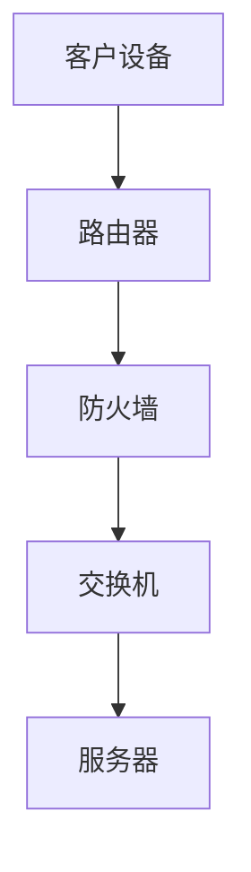
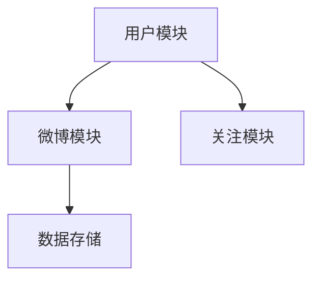
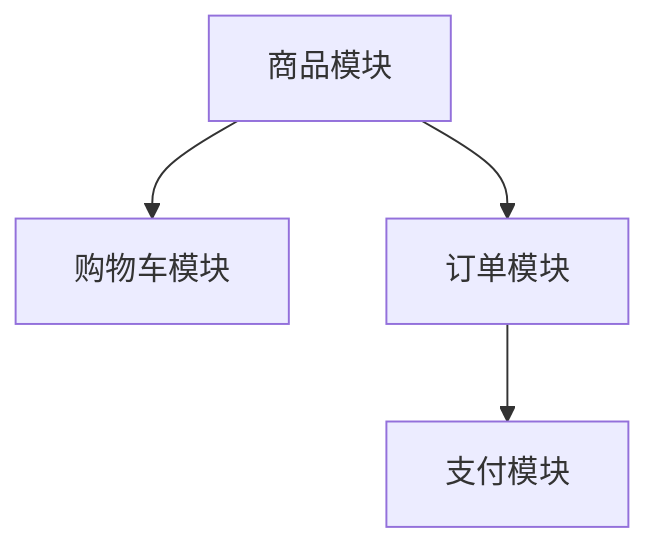

                 

### 引言

2024年，拼多多社区团购的校招面试即将拉开帷幕。对于渴望进入这一热门行业的求职者来说，掌握面试真题及其解答是成功的关键。本文旨在为准备参加拼多多社区团购校招面试的候选人提供一个全面的复习资料，通过汇总2024年可能出现的面试真题及其解答，帮助大家更好地应对面试挑战。

随着互联网技术的飞速发展，社区团购行业迎来了前所未有的机遇。拼多多作为中国领先的电商平台，其社区团购业务在市场上占据了一席之地。这不仅为求职者提供了广阔的职业发展空间，也使得校招面试成为了一项极具挑战性的任务。

本文将围绕以下几个方面展开：

1. **求职准备**：介绍拼多多公司背景、社区团购行业概况以及校招面试流程。
2. **基础题目解析**：详细解析编程基础、数据结构与算法、操作系统原理等基础题。
3. **数据库知识**：探讨SQL基础、常见数据库操作以及数据库设计原则。
4. **计算机网络**：阐述基本概念、网络协议和网络安全。
5. **前端技术**：介绍HTML与CSS、JavaScript基础以及前端框架。
6. **后端技术**：讲解Python基础、Java基础以及后端框架。
7. **项目实战与面试技巧**：分享项目案例展示、面试技巧解析以及常见面试问题汇总与解答。
8. **社区团购业务面试题**：针对社区团购业务的面试题进行详细分析。
9. **技术面试题**：探讨编程实现题、系统设计题以及技术难题解析。
10. **行为面试题**：解析个人特质与能力、团队合作与沟通、应对压力与挑战等方面的问题。
11. **附录**：推荐面试资源、面试准备工具等内容。

希望通过本文，大家能够对拼多多社区团购校招面试有更深入的了解，做好充分的准备，顺利通过面试，加入这一充满活力的行业。

---

### 求职准备

在踏上拼多多社区团购校招面试之旅前，了解公司的背景、行业概况以及面试流程是至关重要的。这不仅有助于求职者对公司的文化和发展方向有更清晰的认知，还能为面试做准备。

#### 拼多多公司简介

拼多多成立于2015年，总部位于中国上海，是一家聚焦于C2M（Consumer-to-Manufacturer，消费者到制造商）模式的电商平台。公司通过社交电商的方式，连接消费者和制造商，为用户提供性价比高的商品。凭借其独特的商业模式和强大的创新能力，拼多多在短时间内迅速崛起，成为中国电商市场的领军企业。

拼多多的核心业务包括：

1. **团购**：通过拼团的方式，消费者可以以更低的价格购买商品。
2. **社区团购**：以社区为单位，提供更贴近用户需求的产品和服务。
3. **直播电商**：通过直播形式，为用户带来更加直观的购物体验。

#### 社区团购行业概况

社区团购作为一种新兴的电商模式，近年来在全球范围内迅速崛起。它主要依托于社交媒体和社区网络，通过团购的方式实现商品的高效分销。社区团购的特点包括：

1. **用户定位**：主要面向三四五线城市的消费者，这些消费者对性价比和便捷性有较高的要求。
2. **供应链优势**：通过简化供应链，降低商品成本，提高竞争力。
3. **本地化服务**：提供更加本地化的产品和服务，满足不同地区的消费需求。
4. **社交互动**：通过社交互动，增强用户粘性和忠诚度。

社区团购行业的发展趋势包括：

1. **市场规模持续扩大**：随着居民消费水平的提高和互联网的普及，社区团购市场有望继续增长。
2. **技术创新**：大数据、人工智能等技术的应用，将进一步提升社区团购的运营效率和服务质量。
3. **多元化发展**：除了传统的商品销售，社区团购平台开始涉足生鲜、家居、教育等多个领域。

#### 校招面试流程

拼多多社区团购的校招面试通常包括以下几个环节：

1. **在线投递**：首先，求职者需要在拼多多的招聘官网投递简历。
2. **简历筛选**：公司招聘团队会对收到的简历进行筛选，通过初步审核的求职者将进入下一轮。
3. **笔试**：通过简历筛选的求职者需要进行在线笔试，笔试内容通常涵盖编程基础、数据结构与算法、操作系统原理等。
4. **面试**：笔试通过后，求职者将进入面试环节。面试分为技术面试和行为面试两部分。技术面试主要考察求职者的技术能力和项目经验，行为面试则侧重于求职者的沟通能力、团队合作精神和解决问题的能力。
5. **Offer发放**：面试通过后，公司会向求职者发放正式的录用通知。

#### 面试准备建议

1. **充分了解公司**：在面试前，求职者应对拼多多的企业文化、业务模式、发展历程等方面有深入了解，以便在面试中能够更好地展现自己的匹配度。
2. **刷题练习**：针对笔试和面试可能出现的题目，求职者应进行充分的刷题练习，尤其是编程题和数据结构算法题。
3. **准备项目经验**：如果有实际项目经验，求职者应提前准备好项目介绍，包括项目背景、技术栈、自己的角色和贡献等。
4. **行为面试准备**：对于行为面试，求职者应提前准备一些典型的问题，如个人特质与能力、团队合作经历、如何应对压力等，并结合自身经历进行详细描述。

通过以上准备，求职者将更有信心地应对拼多多社区团购的校招面试，提高自己的面试成功率。

### 基础题目解析

在拼多多社区团购的校招面试中，基础题目往往是考察重点，这些题目涵盖了编程基础、数据结构与算法、操作系统原理等核心知识点。以下将针对这些领域进行详细解析，并提供一些典型的题目及其解答。

#### 2.1 编程基础

编程基础是面试中的常考点，主要考察求职者对编程语言的基本掌握情况，包括语法、数据类型、控制结构等。

- **典型题目**：编写一个函数，实现两个数的加法。

**Python 代码示例**：

```python
def add(a, b):
    return a + b

result = add(5, 3)
print(result)  # 输出 8
```

- **题目解析**：此题考察了基本的算术运算和函数定义。在编写函数时，需要确保参数传递的正确性和返回值类型的一致性。

#### 2.2 数据结构与算法

数据结构与算法是计算机科学的核心，也是面试中的重点。常见的题目包括排序算法、查找算法、树结构和图算法等。

- **典型题目**：实现冒泡排序算法。

**Python 代码示例**：

```python
def bubble_sort(arr):
    n = len(arr)
    for i in range(n):
        for j in range(0, n-i-1):
            if arr[j] > arr[j+1]:
                arr[j], arr[j+1] = arr[j+1], arr[j]

arr = [64, 34, 25, 12, 22, 11, 90]
bubble_sort(arr)
print("排序后的数组：", arr)
```

- **题目解析**：冒泡排序是一种简单的排序算法，通过重复遍历数组，比较相邻的元素并交换，最终使数组有序。此题考察了循环控制和基本逻辑判断。

- **典型题目**：实现二分查找算法。

**Python 代码示例**：

```python
def binary_search(arr, target):
    low = 0
    high = len(arr) - 1

    while low <= high:
        mid = (low + high) // 2
        if arr[mid] == target:
            return mid
        elif arr[mid] < target:
            low = mid + 1
        else:
            high = mid - 1

    return -1

arr = [2, 4, 6, 8, 10, 12, 14, 16]
target = 10
result = binary_search(arr, target)
print("元素在数组中的索引：", result)
```

- **题目解析**：二分查找是一种高效的查找算法，通过不断将查找区间缩小一半，能够显著减少查找时间。此题考察了循环控制和条件判断。

#### 2.3 操作系统原理

操作系统原理是面试中的另一个重点，主要考察求职者对操作系统的基本概念和原理的掌握。

- **典型题目**：解释进程与线程的区别。

**解题思路**：

- 进程是计算机中正在运行的程序的实例，是操作系统进行资源分配和调度的基本单位。每个进程都有自己的内存空间、数据栈和其他资源。
- 线程是进程内部的一个执行单元，是 lightweight 的执行单元，共享进程的内存空间和其他资源。一个进程可以有多个线程。

**解析**：

进程与线程的主要区别包括：

- 资源分配与调度：进程是资源分配与独立运行的基本单位，而线程则是处理器调度的基本单位。
- 内存空间：进程之间相互独立，拥有独立的内存空间，而线程共享进程的内存空间。
- 创建与销毁开销：线程的创建和销毁开销相对较小，因为它们共享进程的资源。

通过以上解析，我们可以看到操作系统原理题目的解答需要结合具体的原理进行详细阐述，以展示求职者的理解深度。

这些基础题目及其解答不仅为求职者提供了面试的参考，也帮助他们加深了对编程基础、数据结构与算法、操作系统原理等核心知识点的理解。在面试中，灵活运用这些知识点，结合实际情况进行分析和解答，将大大提高求职者的面试表现。

### 数据库知识

在拼多多社区团购的校招面试中，数据库知识是必不可少的一部分。数据库不仅是存储和管理数据的核心工具，也是实现业务逻辑和数据查询的关键基础设施。以下是数据库知识的一些核心概念、常见操作及设计原则。

#### 3.1 SQL基础

SQL（结构化查询语言）是数据库操作的基础，用于数据的查询、更新、插入和删除。以下是一些基本的SQL操作。

- **查询**：使用SELECT语句来检索数据。

**示例**：

```sql
SELECT * FROM customers;
```

这个查询会返回customers表中的所有记录。

- **条件查询**：使用WHERE子句来过滤结果。

**示例**：

```sql
SELECT * FROM customers WHERE age > 30;
```

这个查询会返回年龄大于30岁的所有客户记录。

- **插入**：使用INSERT INTO语句来向表中插入新数据。

**示例**：

```sql
INSERT INTO customers (name, age, email) VALUES ('John Doe', 35, 'john.doe@example.com');
```

这个操作会在customers表中插入一条新记录。

- **更新**：使用UPDATE语句来修改表中已有数据。

**示例**：

```sql
UPDATE customers SET age = age + 1 WHERE name = 'John Doe';
```

这个操作会将名为John Doe的客户的年龄增加1岁。

- **删除**：使用DELETE语句来删除表中的数据。

**示例**：

```sql
DELETE FROM customers WHERE name = 'John Doe';
```

这个操作会删除名为John Doe的客户的记录。

#### 3.2 常见数据库操作

除了基本的查询、插入、更新和删除操作，还有一些更高级的数据库操作，这些操作对于管理和维护数据库至关重要。

- **联合查询**：使用UNION操作符来合并多个查询的结果。

**示例**：

```sql
SELECT name FROM customers UNION SELECT name FROM orders;
```

这个查询会返回customers表和orders表中所有不重复的名称。

- **子查询**：使用子查询来在查询中嵌套其他查询。

**示例**：

```sql
SELECT * FROM customers WHERE age IN (SELECT age FROM orders WHERE status = 'pending');
```

这个查询会返回年龄在订单表中存在的客户的记录。

- **聚合函数**：用于对一组数据进行计算，如SUM、COUNT、MAX、MIN等。

**示例**：

```sql
SELECT COUNT(*) FROM customers;
```

这个查询会返回customers表中的记录总数。

- **事务处理**：使用BEGIN、COMMIT和ROLLBACK来管理事务。

**示例**：

```sql
BEGIN;

INSERT INTO orders (customer_id, product_id, quantity) VALUES (1, 101, 2);
INSERT INTO inventory (product_id, quantity) VALUES (101, -2);

COMMIT;
```

这个事务会同时插入订单和库存记录，如果其中一个操作失败，可以通过ROLLBACK来撤销所有操作。

#### 3.3 数据库设计原则

数据库设计是确保数据库高效、可靠、易于维护的关键步骤。以下是一些基本的数据库设计原则。

- **第三范式**（3NF）：确保数据表满足第三范式，即每个非主属性完全依赖于主键，且不存在传递依赖。

- **规范化**：通过分解冗余数据，减少数据重复，提高数据的一致性和完整性。

- **索引设计**：合理设计索引，以优化查询性能。常用的索引包括主键索引、唯一索引和全文索引。

- **分区**：根据数据特点和查询需求，对大数据表进行分区，以改善性能和维护性。

#### 3.4 实践案例

以下是一个简单的电商数据库设计案例，用于展示数据库设计原则的实际应用。

- **数据表设计**：

```sql
CREATE TABLE customers (
    customer_id INT PRIMARY KEY,
    name VARCHAR(100),
    email VARCHAR(100)
);

CREATE TABLE products (
    product_id INT PRIMARY KEY,
    name VARCHAR(100),
    price DECIMAL(10, 2)
);

CREATE TABLE orders (
    order_id INT PRIMARY KEY,
    customer_id INT,
    product_id INT,
    quantity INT,
    order_date DATE,
    FOREIGN KEY (customer_id) REFERENCES customers(customer_id),
    FOREIGN KEY (product_id) REFERENCES products(product_id)
);
```

- **解析**：

- **customers表**：存储客户信息，包含客户ID、姓名和电子邮件。
- **products表**：存储产品信息，包含产品ID、名称和价格。
- **orders表**：存储订单信息，包括订单ID、客户ID、产品ID、订单数量和日期。通过外键约束，确保订单与客户和产品之间的关联关系。

通过以上解析，我们可以看到如何结合SQL基础操作和数据库设计原则，实现一个简单而高效的电商数据库。在实际项目中，数据库设计需要根据具体业务需求进行调整和优化。

#### 小结

数据库知识在拼多多社区团购校招面试中占有重要地位，掌握SQL基础操作、常见数据库操作和数据库设计原则是面试准备的关键。通过以上内容的介绍，希望能够帮助求职者更好地理解和应用这些知识点，为面试做好充分准备。

### 计算机网络

在拼多多社区团购的校招面试中，计算机网络知识是面试的重要一环。计算机网络不仅是现代互联网的基础，也是实现分布式系统和服务的关键技术。以下将详细介绍计算机网络的基本概念、网络协议和网络安全。

#### 4.1 基本概念

计算机网络是由多个互联的计算机系统组成，通过通信设施实现数据交换和共享的系统。以下是一些计算机网络的基本概念：

- **节点**：网络中的计算机或其他设备。
- **链路**：连接两个节点的通信线路。
- **协议**：网络中用于数据交换和通信的规则和标准。
- **路由器**：用于连接不同网络的设备，实现数据包的转发。
- **交换机**：用于连接多个节点，实现数据包的转发和过滤。
- **IP地址**：标识网络中的每个节点，是数据包传输的地址。
- **端口**：网络服务访问点，用于区分不同的服务。

#### 4.2 网络协议

网络协议是计算机网络中用于数据交换和通信的一组规则和标准。以下是一些重要的网络协议：

- **TCP/IP协议**：是互联网的核心协议，包括传输控制协议（TCP）和互联网协议（IP）。TCP提供可靠的数据传输，确保数据包按序到达；IP负责数据包的路由和转发。

- **HTTP**：超文本传输协议，用于Web浏览器的请求和响应。

- **HTTPS**：安全的超文本传输协议，是HTTP的安全版，通过SSL/TLS加密传输数据。

- **FTP**：文件传输协议，用于在计算机之间传输文件。

- **SMTP**：简单邮件传输协议，用于发送电子邮件。

- **DNS**：域名系统，将域名解析为IP地址。

#### 4.3 网络安全

网络安全是保护网络系统免受未授权访问、数据泄露和恶意攻击的重要措施。以下是一些常见的网络安全技术：

- **防火墙**：用于监控和控制进出网络的流量，防止未授权访问。

- **加密**：通过加密技术，保护数据在传输过程中的安全性。

- **安全协议**：如SSL/TLS，用于在客户端和服务器之间建立安全的连接。

- **入侵检测系统（IDS）**：用于检测网络中的异常行为和攻击。

- **防病毒软件**：用于检测和清除恶意软件。

- **访问控制**：通过权限管理和身份验证，确保只有授权用户可以访问网络资源。

#### 实践案例

以下是一个简单的网络拓扑图，用于展示计算机网络在实际项目中的应用。

- **网络拓扑图**：



- **解析**：

- **客户设备**：用户使用的计算机、手机等设备。
- **路由器**：连接外部网络和内部网络，实现数据包的转发。
- **防火墙**：保护内部网络免受外部攻击。
- **交换机**：连接多个设备，实现数据包的转发和过滤。
- **服务器**：提供Web服务、邮件服务等。

通过这个简单的网络拓扑图，我们可以看到计算机网络在实际项目中的应用和重要性。在实际操作中，网络设计需要根据业务需求和安全性要求进行调整和优化。

#### 小结

计算机网络知识在拼多多社区团购校招面试中占有重要地位，掌握基本概念、网络协议和网络安全技术是面试准备的关键。通过以上内容的介绍，希望能够帮助求职者更好地理解和应用这些知识点，为面试做好充分准备。

### 前端技术

在拼多多社区团购的校招面试中，前端技术是面试的一个重要环节。前端技术主要涉及HTML、CSS和JavaScript，以及各种前端框架。以下将详细讲解这些核心知识点。

#### 5.1 HTML与CSS

HTML（超文本标记语言）是构建网页的基本语言，而CSS（层叠样式表）用于控制网页的样式和布局。以下是一些基本概念和用法。

- **HTML基础**：

  - **HTML标签**：HTML由一系列标签组成，用于定义网页的结构和内容。
  - **HTML文档结构**：常见的HTML文档结构包括`<html>`、`<head>`、`<title>`和`<body>`等标签。
  - **表单**：用于收集用户输入数据，包括文本框、密码框、单选框、复选框等。

- **CSS基础**：

  - **选择器**：用于选择和指定要应用样式的HTML元素。
  - **属性**：用于定义样式，如颜色、字体、尺寸等。
  - **响应式布局**：通过媒体查询（`@media`），实现网页在不同设备上的适配。

**示例代码**：

```html
<!DOCTYPE html>
<html>
<head>
  <title>Example Page</title>
  <style>
    body {
      font-family: Arial, sans-serif;
    }
    h1 {
      color: blue;
      text-align: center;
    }
    p {
      font-size: 16px;
    }
    /* 响应式布局 */
    @media (max-width: 600px) {
      h1 {
        font-size: 24px;
      }
    }
  </style>
</head>
<body>
  <h1>欢迎来到我的网页</h1>
  <p>这是一个简单的示例。</p>
</body>
</html>
```

#### 5.2 JavaScript基础

JavaScript是一种客户端脚本语言，用于增强网页的功能和交互性。以下是一些JavaScript的基础概念和用法。

- **变量与数据类型**：

  - **变量**：用于存储数据的容器。
  - **数据类型**：包括字符串、数字、布尔值、数组、对象等。

- **控制结构**：

  - **条件语句**：用于根据条件执行不同操作，如`if`、`else if`、`else`。
  - **循环语句**：用于重复执行一段代码，如`for`、`while`、`do...while`。

- **函数**：用于封装一段可重用的代码。

**示例代码**：

```javascript
// 变量定义
var name = "John";
var age = 30;
var isStudent = false;

// 数据类型转换
var str = String(100); // "100"
var num = Number("3.14");
var bool = Boolean(0); // false

// 条件语句
if (age > 18) {
  console.log("成人");
} else {
  console.log("未成年");
}

// 循环语句
for (var i = 0; i < 5; i++) {
  console.log(i);
}

// 函数定义
function greet() {
  console.log("Hello!");
}

greet(); // 输出 "Hello!"
```

#### 5.3 前端框架

前端框架是用于简化前端开发过程和提升开发效率的工具。以下是一些流行的前端框架。

- **Vue.js**：是一种渐进式JavaScript框架，易于上手，能够帮助开发者构建大型应用。

  - **Vue组件**：用于封装可复用的UI功能。
  - **Vue路由**：用于管理单页应用的页面切换。
  - **Vue状态管理**：使用Vuex进行全局状态管理。

  **示例代码**：

  ```html
  <div id="app">
    <h1>{{ message }}</h1>
    <button @click="reverseMessage">翻转消息</button>
  </div>
  ```

  ```javascript
  new Vue({
    el: '#app',
    data: {
      message: 'Hello Vue.js!'
    },
    methods: {
      reverseMessage: function() {
        this.message = this.message.split('').reverse().join('');
      }
    }
  });
  ```

- **React**：由Facebook开发，是一种用于构建用户界面的JavaScript库。

  - **组件**：用于构建可复用的UI元素。
  - **状态管理**：使用Redux进行全局状态管理。
  - **React Router**：用于管理路由和页面切换。

  **示例代码**：

  ```jsx
  import React from 'react';

  function App() {
    return (
      <div>
        <h1>欢迎来到我的React应用</h1>
        <button onClick={() => alert('Hello!')}>点击我</button>
      </div>
    );
  }

  export default App;
  ```

通过以上内容，我们可以看到前端技术对于拼多多社区团购校招面试的重要性。掌握HTML、CSS和JavaScript基础，以及熟悉前端框架，将有助于求职者在面试中展示自己的技术能力。

### 后端技术

在后端技术方面，拼多多社区团购校招面试通常要求求职者掌握Python基础、Java基础以及后端框架。以下是这些核心知识点的详细解析。

#### 6.1 Python基础

Python是一种高层次的编程语言，以其简洁的语法和强大的功能广泛应用于数据科学、Web开发、自动化等领域。

- **Python语法与数据类型**：

  - **变量与数据类型**：Python中的变量无需显式声明类型，数据类型会在赋值时自动推断。常见的数据类型包括整数（`int`）、浮点数（`float`）、布尔值（`bool`）、字符串（`str`）和列表（`list`）。

    ```python
    x = 10          # 整数
    y = 3.14        # 浮点数
    is_true = True  # 布尔值
    message = "Hello"  # 字符串
    items = [1, 2, 3]  # 列表
    ```

  - **控制结构**：Python支持条件语句（`if-elif-else`）和循环语句（`for`、`while`）。

    ```python
    # 条件语句
    if x > y:
        print("x 大于 y")
    elif x == y:
        print("x 等于 y")
    else:
        print("x 小于 y")
    
    # 循环语句
    for item in items:
        print(item)
    ```

- **函数与模块**：

  - **函数**：函数是组织代码的模块化方式，Python内置了多个标准库函数，如`print()`、`len()`等。

    ```python
    def greet(name):
        print("Hello, " + name)
    
    greet("Alice")
    ```

  - **模块**：模块是Python文件，用于存储可重用的代码。通过导入模块，可以方便地使用其中的函数和类。

    ```python
    import math
    
    print(math.sqrt(16))  # 输出 4.0
    ```

#### 6.2 Java基础

Java是一种面向对象的高级编程语言，广泛应用于企业级应用、Android开发、大数据等领域。

- **Java语法与数据类型**：

  - **变量与数据类型**：Java中的变量需要显式声明类型，数据类型包括基本类型（如`int`、`float`、`double`、`boolean`）和引用类型（如`String`、`List`等）。

    ```java
    int x = 10;
    double y = 3.14;
    boolean isTrue = true;
    String message = "Hello";
    List<Integer> items = new ArrayList<>(Arrays.asList(1, 2, 3));
    ```

  - **控制结构**：Java支持条件语句（`if-else`）和循环语句（`for`、`while`）。

    ```java
    // 条件语句
    if (x > y) {
        System.out.println("x 大于 y");
    } else if (x == y) {
        System.out.println("x 等于 y");
    } else {
        System.out.println("x 小于 y");
    }
    
    // 循环语句
    for (int item : items) {
        System.out.println(item);
    }
    ```

- **类与对象**：

  - **类**：类是Java中用于定义对象的蓝图，包含属性（成员变量）和方法（成员函数）。

    ```java
    class Person {
        String name;
        int age;
        
        void greet() {
            System.out.println("Hello, " + name);
        }
    }
    ```

  - **对象**：对象是类的实例，可以通过类创建。

    ```java
    Person alice = new Person();
    alice.name = "Alice";
    alice.age = 30;
    alice.greet();  // 输出 "Hello, Alice"
    ```

#### 6.3 后端框架

后端框架是用于简化后端开发过程和提升开发效率的工具，以下介绍两个流行的后端框架：Django（Python后端框架）和Spring Boot（Java后端框架）。

- **Django**：

  - **简介**：Django是一个高层次的Python Web框架，遵循MVC设计模式，提供了快速开发和可扩展的Web应用开发平台。

  - **特点**：

    - **自动生成后台代码**：通过模型层（Model）自动生成后台接口代码。
    - **ORM（对象关系映射）**：将数据库中的表映射到Python类，简化数据库操作。
    - **中间件**：用于处理请求和响应，如身份验证、日志记录等。

    ```python
    from django.db import models

    class Person(models.Model):
        name = models.CharField(max_length=100)
        age = models.IntegerField()
        
        def __str__(self):
            return self.name
    ```

- **Spring Boot**：

  - **简介**：Spring Boot是一个基于Spring的框架，用于简化Java Web应用的开发和部署。它提供了大量的自动配置和集成功能，使开发者能够快速启动项目。

  - **特点**：

    - **自动配置**：根据应用的需求自动配置Spring应用。
    - **模块化**：通过依赖注入（DI）和面向切面编程（AOP）实现模块化开发。
    - **集成**：与各种开源技术（如Hibernate、MyBatis、Thymeleaf等）无缝集成。

    ```java
    @SpringBootApplication
    public class Application {
        public static void main(String[] args) {
            SpringApplication.run(Application.class, args);
        }
    }
    
    @RestController
    public class UserController {
        @GetMapping("/user/{id}")
        public User getUser(@PathVariable Long id) {
            // 获取用户信息
            return user;
        }
    }
    ```

通过以上内容，我们可以看到Python和Java在后端技术中的应用和重要性。掌握这些基础知识，结合实际项目经验，将有助于求职者在拼多多社区团购校招面试中展示自己的技术能力。

### 项目实战与面试技巧

在拼多多社区团购的校招面试中，项目实战和面试技巧是提高面试成功率的两个重要方面。本文将围绕项目展示、面试技巧和常见面试问题进行详细解析，帮助求职者更好地准备面试。

#### 7.1 项目案例展示

项目实战是面试官考察求职者技术能力和实践经验的重要手段。以下是一个简单的电商项目案例，用于展示如何准备项目展示。

**项目背景**：开发一个简单的电商网站，提供商品浏览、购物车、下单和支付功能。

**项目架构**：

- **前端**：使用HTML、CSS和JavaScript实现页面布局和交互，使用Vue.js进行数据绑定和组件化开发。
- **后端**：使用Python的Django框架，结合Flask进行API开发，实现用户认证、商品管理、购物车和订单管理等功能。
- **数据库**：使用MySQL进行数据存储，设计用户、商品、订单等数据表。

**项目实现**：

1. **用户认证**：

   - **功能实现**：实现用户注册、登录和密码找回功能，使用JWT（JSON Web Token）进行身份验证。
   - **代码示例**：

     ```python
     from flask import Flask, request, jsonify
     from flask_jwt_extended import JWTManager, jwt_required, create_access_token
     
     app = Flask(__name__)
     app.config['JWT_SECRET_KEY'] = 'your_secret_key'
     jwt = JWTManager(app)
     
     @app.route('/login', methods=['POST'])
     def login():
         username = request.json.get('username', None)
         password = request.json.get('password', None)
         
         # 验证用户名和密码（此处简化处理）
         if username == 'admin' and password == 'admin':
             access_token = create_access_token(identity=username)
             return jsonify(access_token=access_token)
         return jsonify({'error': 'Invalid credentials'})
     ```

2. **商品管理**：

   - **功能实现**：实现商品分类、商品列表和商品详情页，支持商品搜索和筛选。
   - **代码示例**：

     ```python
     from flask import request, jsonify
     from flask_sqlalchemy import SQLAlchemy
     
     app = Flask(__name__)
     app.config['SQLALCHEMY_DATABASE_URI'] = 'sqlite:///site.db'
     db = SQLAlchemy(app)
     
     class Product(db.Model):
         id = db.Column(db.Integer, primary_key=True)
         name = db.Column(db.String(100), nullable=False)
         price = db.Column(db.Float, nullable=False)
         category = db.Column(db.String(100), nullable=False)
         
     @app.route('/products', methods=['GET'])
     def get_products():
         category = request.args.get('category', '')
         products = Product.query.filter_by(category=category).all()
         return jsonify(products)
     ```

3. **购物车和订单管理**：

   - **功能实现**：实现购物车添加、删除和清空功能，以及订单创建、支付和取消功能。
   - **代码示例**：

     ```python
     class Cart(db.Model):
         id = db.Column(db.Integer, primary_key=True)
         user_id = db.Column(db.Integer, db.ForeignKey('user.id'), nullable=False)
         products = db.relationship('Product', secondary='cart_item', backref='carts')
         
     class CartItem(db.Model):
         id = db.Column(db.Integer, primary_key=True)
         cart_id = db.Column(db.Integer, db.ForeignKey('cart.id'), nullable=False)
         product_id = db.Column(db.Integer, db.ForeignKey('product.id'), nullable=False)
         quantity = db.Column(db.Integer, nullable=False)
     
     @app.route('/cart', methods=['POST'])
     def add_to_cart():
         user_id = request.json.get('user_id', None)
         product_id = request.json.get('product_id', None)
         quantity = request.json.get('quantity', 1)
         
         cart_item = CartItem(cart_id=user_id, product_id=product_id, quantity=quantity)
         db.session.add(cart_item)
         db.session.commit()
         return jsonify({'message': 'Product added to cart'})
     ```

**项目展示建议**：

1. **项目简介**：简明扼要地介绍项目背景、目标和主要功能。
2. **技术栈**：列出项目所使用的技术栈，如前端框架、后端框架、数据库等。
3. **功能实现**：详细讲解关键功能的实现逻辑和代码示例。
4. **成果展示**：展示项目的实际运行效果，如界面截图、功能演示等。

#### 7.2 面试技巧解析

面试技巧对于面试成功至关重要。以下是一些常见的面试技巧，帮助求职者更好地应对面试。

1. **准备充分**：

   - **了解公司背景**：熟悉公司的业务模式、企业文化和发展历程。
   - **复习知识点**：针对面试可能涉及的知识点进行系统复习，尤其是编程基础、数据结构与算法、操作系统原理等。
   - **刷题练习**：通过刷题网站（如LeetCode、牛客网等）进行编程题练习，提高解题速度和准确性。

2. **自信表现**：

   - **语言表达**：保持清晰、流畅的表达，避免口头禅和语速过快。
   - **态度诚恳**：表现出对职位的热情和对公司的尊重。
   - **自信回答**：对于熟悉的问题，自信地回答，对于不熟悉的问题，诚实表达并展示自己解决问题的能力。

3. **沟通能力**：

   - **倾听面试官的问题**：确保理解问题的核心，避免误解。
   - **逻辑清晰**：在回答问题时，尽量逻辑清晰，分点阐述，避免长篇大论。
   - **主动提问**：在面试过程中，主动提问，展示自己的思考能力和对项目的关注。

4. **行为面试准备**：

   - **个人特质**：提前准备一些关于个人特质的问题，如如何处理压力、团队合作经历等，并结合实际经历进行回答。
   - **案例分析**：准备一些典型的业务或技术案例，展示自己在实际项目中的问题解决能力。

#### 7.3 常见面试问题汇总与解答

以下是一些常见的面试问题及其解答，帮助求职者进行针对性准备。

1. **为什么选择这个职位？**

   **解答**：可以从以下几个方面进行回答：

   - **个人兴趣**：说明自己对电商或社区团购行业的热爱，以及对这个职位的兴趣。
   - **技能匹配**：强调自己的技术能力和经验与职位要求的匹配度。
   - **职业规划**：说明自己在未来几年内希望在电商或社区团购行业发展的规划和目标。

2. **介绍一个你参与过的项目，并说明你的角色和贡献。**

   **解答**：按照以下结构进行回答：

   - **项目背景**：简述项目的目的和目标。
   - **角色与职责**：说明你在项目中的角色和具体职责。
   - **技术实现**：详细讲解项目所使用的技术和工具，以及关键功能的实现逻辑。
   - **成果与贡献**：展示项目的成果，并说明自己在项目中的具体贡献和亮点。

3. **如何处理团队中的冲突？**

   **解答**：可以从以下几个方面进行回答：

   - **沟通与倾听**：主动与团队成员沟通，倾听他们的意见和想法。
   - **寻求共识**：通过讨论和协商，寻求共同认可的解决方案。
   - **积极反馈**：在解决问题后，给予团队成员积极反馈，增强团队凝聚力。

4. **如何评估一个算法的效率？**

   **解答**：可以从以下几个方面进行回答：

   - **时间复杂度**：分析算法的时间复杂度，通常使用大O表示法。
   - **空间复杂度**：分析算法的空间复杂度，即算法所需的额外存储空间。
   - **实际运行时间**：在具体实现中，通过计时工具测量算法的运行时间。
   - **性能测试**：通过性能测试工具进行大规模数据集的性能测试，评估算法的效率。

通过以上项目实战和面试技巧的解析，以及常见面试问题的解答，希望能够帮助求职者在拼多多社区团购校招面试中取得优异成绩，顺利加入这一充满活力的行业。

### 社区团购业务面试题

在拼多多社区团购的校招面试中，业务面试题是一个重要的环节，主要考察求职者对社区团购业务的深入理解以及解决实际业务问题的能力。以下将列举一些常见的社区团购业务面试题，并提供详细的解题思路。

#### 8.1 业务理解题

**题目1**：请简述社区团购的定义及其特点。

**解题思路**：

1. **定义**：社区团购是一种基于社交网络的团购模式，通过线上平台或社区组织，消费者以更低的价格购买商品。
2. **特点**：
   - **低价优势**：通过集中采购和优惠活动，为消费者提供更低的价格。
   - **本地化**：针对不同地区的消费需求，提供本地化的商品和服务。
   - **社交互动**：通过社交网络和社区活动，增强用户粘性和忠诚度。
   - **效率高**：简化供应链，提高采购和配送效率。

**解答**：

社区团购是一种基于社交网络的团购模式，通过线上平台或社区组织，消费者以更低的价格购买商品。其特点包括低价优势、本地化、社交互动和效率高。低价优势通过集中采购和优惠活动为消费者提供更低的价格；本地化针对不同地区的消费需求提供本地化的商品和服务；社交互动通过社交网络和社区活动增强用户粘性和忠诚度；效率高通过简化供应链，提高采购和配送效率。

**题目2**：请解释社区团购中的C2M模式。

**解题思路**：

1. **概念**：C2M（Consumer-to-Manufacturer，消费者到制造商）模式，即通过消费者需求驱动生产，减少中间环节，直接连接消费者和制造商。
2. **优势**：
   - **减少成本**：通过去除中间商，降低生产成本和销售价格。
   - **精准营销**：根据消费者需求定制产品，提高市场响应速度。
   - **质量控制**：直接由制造商生产，更容易保证产品质量。

**解答**：

C2M模式，即Consumer-to-Manufacturer模式，通过消费者需求驱动生产，减少中间环节，直接连接消费者和制造商。其优势包括减少成本、精准营销和质量控制。减少成本通过去除中间商，降低生产成本和销售价格；精准营销根据消费者需求定制产品，提高市场响应速度；质量控制直接由制造商生产，更容易保证产品质量。

#### 8.2 数据分析题

**题目1**：请设计一个用户分群的算法，并解释其原理。

**解题思路**：

1. **原理**：用户分群算法通过分析用户的行为数据、购买历史、地理位置等信息，将用户分为不同的群体，以便进行精准营销和个性化推荐。
2. **方法**：
   - **基于行为**：分析用户的浏览记录、购买频率、消费金额等行为数据，使用聚类算法（如K-means）进行分群。
   - **基于属性**：分析用户的性别、年龄、地理位置等属性数据，使用分类算法（如决策树、随机森林）进行分群。

**解答**：

用户分群算法通过分析用户的行为数据和属性数据，将用户分为不同的群体。基于行为的方法分析用户的浏览记录、购买频率、消费金额等行为数据，使用聚类算法进行分群；基于属性的方法分析用户的性别、年龄、地理位置等属性数据，使用分类算法进行分群。这些算法有助于精准营销和个性化推荐。

**题目2**：请设计一个库存优化算法，并解释其原理。

**解题思路**：

1. **原理**：库存优化算法通过分析历史销售数据、季节性需求、库存成本等因素，优化库存水平，减少库存成本和缺货风险。
2. **方法**：
   - **基于需求预测**：使用时间序列分析、回归分析等方法预测未来需求，优化库存水平。
   - **基于成本分析**：比较库存成本和缺货成本，确定最优库存水平。

**解答**：

库存优化算法通过分析历史销售数据、季节性需求、库存成本等因素，优化库存水平。基于需求预测的方法使用时间序列分析、回归分析等方法预测未来需求，优化库存水平；基于成本分析的方法比较库存成本和缺货成本，确定最优库存水平。这些算法有助于减少库存成本和缺货风险。

#### 8.3 产品设计题

**题目1**：请设计一个社区团购平台，并描述其主要功能模块。

**解题思路**：

1. **功能模块**：
   - **用户模块**：用户注册、登录、个人信息管理、购物车、订单管理。
   - **商品模块**：商品分类、商品展示、商品搜索、商品详情、优惠活动。
   - **订单模块**：订单创建、订单支付、订单配送、订单跟踪、售后服务。
   - **数据模块**：用户数据分析、商品数据分析、订单数据分析、库存管理。
2. **交互设计**：设计用户操作流程和界面交互，确保用户易于使用和操作。

**解答**：

设计的社区团购平台主要包括用户模块、商品模块、订单模块和数据模块。用户模块包括用户注册、登录、个人信息管理、购物车、订单管理等功能；商品模块包括商品分类、商品展示、商品搜索、商品详情、优惠活动等功能；订单模块包括订单创建、订单支付、订单配送、订单跟踪、售后服务等功能；数据模块包括用户数据分析、商品数据分析、订单数据分析、库存管理等功能。通过这些功能模块，平台能够为用户提供便捷的购物体验，同时实现高效的数据分析和库存管理。

**题目2**：请设计一个社区团购的配送系统，并描述其主要功能模块。

**解题思路**：

1. **功能模块**：
   - **订单处理**：订单生成、订单分配、订单状态更新。
   - **配送管理**：配送员管理、配送路线规划、配送时间安排。
   - **配送跟踪**：实时监控配送进度、订单位置追踪。
   - **评价反馈**：用户对配送服务的评价和反馈。

**解答**：

设计的社区团购配送系统主要包括订单处理、配送管理、配送跟踪和评价反馈等功能模块。订单处理模块包括订单生成、订单分配、订单状态更新等功能；配送管理模块包括配送员管理、配送路线规划、配送时间安排等功能；配送跟踪模块包括实时监控配送进度、订单位置追踪等功能；评价反馈模块包括用户对配送服务的评价和反馈。通过这些功能模块，配送系统能够高效地完成订单配送任务，提升用户满意度。

通过以上对社区团购业务面试题的详细解析，希望能够帮助求职者更好地应对拼多多社区团购的校招面试，展示自己在业务理解和解决实际问题方面的能力。

### 技术面试题

在拼多多社区团购的校招面试中，技术面试题是一个重要的考察环节，主要涉及编程实现题、系统设计题和技术难题解析。以下将详细讲解这些题型，并提供解题思路和示例代码。

#### 9.1 编程实现题

编程实现题是考察求职者编程能力和问题解决能力的重要手段。以下是一些常见的编程实现题及其解题思路。

**题目1**：实现一个函数，判断一个字符串是否为回文。

**解题思路**：

1. **方法一：双指针法**：从字符串的两端开始比较字符，直到中间相遇。
2. **方法二：字符串反转法**：将字符串反转后与原字符串比较。

**代码示例**：

```python
# 方法一：双指针法
def is_palindrome(s):
    left, right = 0, len(s) - 1
    while left < right:
        if s[left] != s[right]:
            return False
        left += 1
        right -= 1
    return True

# 方法二：字符串反转法
def is_palindrome(s):
    return s == s[::-1]
```

**题目2**：实现一个函数，求两个有序数组的合并排序。

**解题思路**：

1. **方法一：归并排序**：使用两个指针分别遍历两个数组，比较两个数组的当前元素，将较小者放入结果数组中。
2. **方法二：迭代法**：使用两个栈，分别存储两个数组的元素，依次弹出栈顶元素进行比较。

**代码示例**：

```python
# 方法一：归并排序
def merge_sorted_arrays(nums1, nums2):
    p1, p2 = 0, 0
    result = []
    while p1 < len(nums1) and p2 < len(nums2):
        if nums1[p1] < nums2[p2]:
            result.append(nums1[p1])
            p1 += 1
        else:
            result.append(nums2[p2])
            p2 += 1
    result.extend(nums1[p1:])
    result.extend(nums2[p2:])
    return result

# 方法二：迭代法
def merge_sorted_arrays(nums1, nums2):
    stack1, stack2 = [], []
    for num in nums1:
        stack1.append(num)
    for num in nums2:
        stack2.append(num)
    
    result = []
    while stack1 and stack2:
        if stack1[-1] < stack2[-1]:
            result.append(stack1.pop())
        else:
            result.append(stack2.pop())
    
    result.extend(stack1[::-1])
    result.extend(stack2[::-1])
    return result
```

**题目3**：实现一个函数，找出数组中的最大子序和。

**解题思路**：

1. **动态规划法**：使用一个变量跟踪当前子序列和，另一个变量跟踪全局最大子序列和。
2. **分治法**：将数组分成两部分，分别找出两部分的最大子序和，然后计算整个数组的最大子序和。

**代码示例**：

```python
# 动态规划法
def max_subarray_sum(nums):
    max_ending_here = max_so_far = nums[0]
    for x in nums[1:]:
        max_ending_here = max(x, max_ending_here + x)
        max_so_far = max(max_so_far, max_ending_here)
    return max_so_far
```

#### 9.2 系统设计题

系统设计题是考察求职者系统分析和设计能力的重要环节。以下是一些常见的系统设计题及其解题思路。

**题目1**：设计一个微博系统，包含用户注册、发微博、评论微博、关注用户等功能。

**解题思路**：

1. **用户模块**：实现用户注册、登录、个人信息管理等功能。
2. **微博模块**：实现发微博、查看微博、评论微博等功能。
3. **关注模块**：实现关注用户、查看关注列表等功能。
4. **数据存储**：使用关系型数据库（如MySQL）或NoSQL数据库（如MongoDB）存储用户信息、微博内容、评论等数据。

**架构设计**：



**代码示例**（简化版）：

```python
# 用户模块示例
class User:
    def __init__(self, username, password):
        self.username = username
        self.password = password
        self.following = []

# 微博模块示例
class Microblog:
    def __init__(self, user, content):
        self.user = user
        self.content = content
        self.comments = []

# 关注模块示例
class Follow:
    def __init__(self, user1, user2):
        self.user1 = user1
        self.user2 = user2
```

**题目2**：设计一个电商系统，包含商品展示、购物车、下单、支付等功能。

**解题思路**：

1. **商品模块**：实现商品展示、商品分类、商品搜索等功能。
2. **购物车模块**：实现商品添加、删除、更新等功能。
3. **订单模块**：实现下单、订单状态管理、订单查询等功能。
4. **支付模块**：实现支付流程、支付通知等功能。
5. **数据存储**：使用关系型数据库存储用户信息、商品信息、订单信息等数据。

**架构设计**：



**代码示例**（简化版）：

```python
# 商品模块示例
class Product:
    def __init__(self, id, name, price):
        self.id = id
        self.name = name
        self.price = price

# 购物车模块示例
class Cart:
    def __init__(self, user):
        self.user = user
        self.products = []

# 订单模块示例
class Order:
    def __init__(self, user, products):
        self.user = user
        self.products = products
        self.status = "pending"

# 支付模块示例
class Payment:
    def pay(self, order):
        # 实现支付流程
        pass
```

#### 9.3 技术难题解析

技术难题解析是考察求职者解决复杂技术问题能力的重要环节。以下是一些常见的技术难题及其解题思路。

**题目1**：如何实现一个缓存系统，支持缓存击穿和缓存穿透问题？

**解题思路**：

1. **缓存击穿**：解决方法包括使用互斥锁、设置缓存失效时间等。
2. **缓存穿透**：解决方法包括使用布隆过滤器、缓存空值等。

**代码示例**：

```python
# 缓存击穿处理
class Cache:
    def __init__(self):
        self.cache = {}
        self.lock = threading.Lock()
        
    def get(self, key):
        with self.lock:
            return self.cache.get(key)
    
    def set(self, key, value):
        with self.lock:
            self.cache[key] = value

# 缓存穿透处理
class BloomFilter:
    def __init__(self, size, hash_function_count):
        self.size = size
        self.hash_function_count = hash_function_count
        self.bit_array = bit_array(size)

    def add(self, item):
        for i in range(self.hash_function_count):
            hash_value = self.hash_function(item, i)
            self.bit_array.set(hash_value)

    def contains(self, item):
        for i in range(self.hash_function_count):
            hash_value = self.hash_function(item, i)
            if not self.bit_array.get(hash_value):
                return False
        return True
```

**题目2**：如何实现一个分布式锁？

**解题思路**：

1. **基于Zookeeper**：使用Zookeeper的临时顺序节点实现分布式锁。
2. **基于Redis**：使用Redis的SETNX命令实现分布式锁。

**代码示例**：

```python
# 基于Zookeeper的分布式锁
from kazoo.client import KazooClient

zk = KazooClient(hosts='localhost:2181')
zk.start()

class DistributedLock:
    def __init__(self, lock_path):
        self.lock_path = lock_path
        self.zk = zk

    def acquire(self):
        zk.create(self.lock_path, ephemeral=True)
        if zk.exists(self.lock_path + '/lock'):
            zk.delete(self.lock_path + '/lock')
            zk.create(self.lock_path + '/lock', ephemeral=True)
        
    def release(self):
        zk.delete(self.lock_path + '/lock', recursive=True)

# 基于Redis的分布式锁
import redis

r = redis.StrictRedis(host='localhost', port=6379, db=0)

class RedisLock:
    def __init__(self, key, expire=300):
        self.key = key
        self.expire = expire
        self.r = r
        
    def acquire(self):
        return self.r.set(self.key, 'locked', nx=True, ex=self.expire)
    
    def release(self):
        script = """
        if redis.call('get', KEYS[1]) == ARGV[1] then
            return redis.call('del', KEYS[1])
        else
            return 0
        end
        """
        return self.r.eval(script, 1, self.key, 'locked')
```

通过以上对编程实现题、系统设计题和技术难题解析的详细讲解，希望能够帮助求职者在拼多多社区团购校招面试中更好地应对技术面试题，展示自己的技术实力。

### 行为面试题

在拼多多社区团购的校招面试中，行为面试题是一个重要的环节，旨在考察求职者的个人特质、团队合作能力和应对压力的能力。以下将列举一些常见的行为面试题，并提供详细的解答思路。

#### 10.1 个人特质与能力

**题目1**：请描述一个你面对困难时保持积极态度的经历。

**解题思路**：

1. **背景介绍**：简述面对的困难或挑战。
2. **具体行动**：详细描述你采取的具体行动或策略。
3. **结果与反思**：说明最终的结果以及从中学到的东西。

**示例答案**：

在我大学期间，曾参与一个复杂的软件开发项目，由于时间紧任务重，我负责的部分遇到了难以解决的问题。面对这个困难，我首先没有恐慌，而是详细分析了问题的根源，确定了需要改进的几个方面。然后，我主动与团队成员沟通，分享了我的分析结果，并提出了几个解决方案。通过集思广益，我们最终确定了最佳方案，并成功解决了问题。这次经历让我学会了如何在压力下保持冷静，以及如何有效地团队合作。

**题目2**：请谈谈你如何处理失败的经历。

**解题思路**：

1. **背景介绍**：简述失败的情境。
2. **反应与行动**：描述你当时的反应和采取的行动。
3. **反思与改进**：说明从失败中吸取的教训以及如何改进。

**示例答案**：

在我的第一份工作中，我负责一个重要的数据分析项目，但由于缺乏经验，我未能按时完成任务。面对失败，我首先承认错误，并向团队成员道歉。然后，我详细分析了失败的原因，发现自己在项目规划和时间管理上存在不足。我制定了更详细的计划，并加强了自己的项目管理能力。这次失败让我学会了如何从失败中吸取教训，以及如何提高自己的项目管理水平。

#### 10.2 团队合作与沟通

**题目1**：请描述一个你在团队中发挥领导力的经历。

**解题思路**：

1. **背景介绍**：简述团队情况和任务背景。
2. **领导行动**：详细描述你如何发挥领导力，指导团队完成任务。
3. **结果与反馈**：说明最终的结果以及团队成员对你的反馈。

**示例答案**：

在我参与的学校科研团队中，我们负责一个大型实验项目。由于团队成员经验各异，项目进展缓慢。我主动承担了团队领导的职责，制定了详细的项目计划，并组织了每周的团队会议，确保每个成员明确自己的任务和进度。我还鼓励团队成员相互学习和支持，共同解决难题。最终，我们提前完成了实验项目，并获得了导师的高度评价。团队成员对我的领导能力表示认可，认为我能够有效协调团队资源，提高工作效率。

**题目2**：请谈谈你如何处理团队中的冲突。

**解题思路**：

1. **冲突情境**：简述冲突的原因和背景。
2. **解决方法**：详细描述你采取的具体措施。
3. **结果与反思**：说明冲突的解决结果以及从中获得的启示。

**示例答案**：

在我参与的社区服务项目中，由于团队成员对项目的目标和分工存在分歧，导致项目进展受阻。我首先与双方进行了沟通，了解他们的观点和担忧。然后，我组织了一次团队讨论会，让每个成员发表自己的意见，并共同寻找解决问题的方法。最终，我们达成了共识，重新明确了分工和目标。这次经历让我学会了如何通过沟通和协商解决团队中的冲突，以及如何在不同的观点中找到平衡点。

#### 10.3 应对压力与挑战

**题目1**：请描述一个你面对高压环境时保持高效工作的经历。

**解题思路**：

1. **背景介绍**：简述面临的高压环境。
2. **应对策略**：详细描述你如何应对压力，保持高效工作。
3. **结果与反馈**：说明最终的结果以及同事或上级对你的评价。

**示例答案**：

在我参与的公司年度报告项目中，时间紧迫且任务繁重。为了应对压力，我首先制定了详细的时间表，将任务分解成可管理的部分。然后，我提高了工作效率，减少了不必要的会议和交流，专注于核心工作。我还学会了利用碎片时间进行任务处理，如在通勤途中阅读报告、利用空闲时间进行数据整理。最终，我们团队按时完成了报告，并得到了上级的高度评价。同事们都认为我能够在高压环境下保持高效工作，是一位值得信赖的团队成员。

**题目2**：请谈谈你如何处理突发事件。

**解题思路**：

1. **事件描述**：简述遇到的突发事件。
2. **应对措施**：详细描述你采取的应对措施。
3. **结果与反思**：说明事件的处理结果以及从中获得的教训。

**示例答案**：

在我工作期间，曾遇到一次系统崩溃的突发事件。系统崩溃导致我们的工作进度受到影响，客户数据存在丢失风险。我首先立即通知团队并启动应急预案，随后组织技术人员进行系统恢复。在等待恢复的过程中，我与客户进行了沟通，解释了情况，并承诺尽快解决问题。经过几个小时的紧急处理，我们成功恢复了系统，并确保了客户数据的安全。这次事件让我学会了如何在紧急情况下迅速反应，制定有效的应对策略，以及如何在压力下保持冷静和决策能力。

通过以上对个人特质、团队合作能力以及应对压力和挑战的详细解析，希望能够帮助求职者在拼多多社区团购的校招面试中展示自己的综合素质，提高面试成功率。

### 附录

#### 面试资源推荐

为了帮助求职者更好地准备拼多多社区团购的校招面试，以下是一些推荐的面试资源，包括编程学习资源、技术面试指南和常用面试题库。

**编程学习资源**：

1. **LeetCode**：提供了大量编程题库，涵盖算法和数据结构等多个领域，是求职者刷题的不二之选。
   - 网址：[https://leetcode.com](https://leetcode.com)

2. **牛客网**：提供Python、Java等编程语言的相关题目，以及在线编程环境和面试经验分享。
   - 网址：[https://www.nowcoder.com](https://www.nowcoder.com)

3. **代码大全**：由Martin Fowler和Kent Beck合著，是一本全面介绍编程实践的指南。
   - 网址：[https://www.codecademy.com](https://www.codecademy.com)

4. **GeeksforGeeks**：包含了大量计算机科学的教程和算法题库，适合求职者系统学习。
   - 网址：[https://www.geeksforgeeks.org](https://www.geeksforgeeks.org)

**技术面试指南**：

1. **《算法导论》**：由Thomas H. Cormen等人合著，是一本经典的数据结构与算法教材。
   - 网址：[https://mitpress.mit.edu/books/algorithms](https://mitpress.mit.edu/books/algorithms)

2. **《编程之美》**：由微软面试官编写，介绍了编程面试的常见题型和解答方法。
   - 网址：[https://www.amazon.com/Programming-Beautiful-Interview-Problems/dp/0321813595](https://www.amazon.com/Programming-Beautiful-Interview-Problems/dp/0321813595)

3. **《面试突击》**：涵盖了常见的面试题目和解答思路，适合求职者在短时间内进行复习。
   - 网址：[https://www.interviewstreet.com](https://www.interviewstreet.com)

4. **《系统设计：阿里巴巴面试心得》**：由阿里巴巴面试官编写，详细介绍了系统设计题的解题方法。
   - 网址：[https://www.oreilly.com/library/view/alibaba-system-design-interview/9780135137626/](https://www.oreilly.com/library/view/alibaba-system-design-interview/9780135137626/)

**常用面试题库**：

1. **GitHub面试题库**：一个汇集了各大公司面试题的GitHub仓库，涵盖了算法、系统设计、数据结构等多个领域。
   - 网址：[https://github.com/krzysu/Java-Interview-Questions](https://github.com/krzysu/Java-Interview-Questions)

2. **面试宝典**：一个包含Java、Python等编程语言常见面试题的在线题库。
   - 网址：[https://www.interviewcake.com](https://www.interviewcake.com)

3. **技术面试问答**：一个针对技术面试的问答社区，提供了丰富的面试经验和解答。
   - 网址：[https://www.stackoverflow.com](https://www.stackoverflow.com)

通过以上推荐资源，求职者可以系统地进行面试准备，提高自己的面试水平，为拼多多社区团购的校招面试做好充分的准备。

#### 面试准备工具

为了确保求职者在面试过程中能够发挥最佳水平，以下是一些推荐的面试准备工具，包括编译器与IDE、数据库软件和网络模拟工具。

**编译器与IDE（集成开发环境）**：

1. **Visual Studio Code**：是一款功能强大的开源IDE，支持多种编程语言，适用于Windows、macOS和Linux平台。
   - 网址：[https://code.visualstudio.com](https://code.visualstudio.com)

2. **PyCharm**：是JetBrains公司开发的Python IDE，提供了丰富的功能和强大的代码编辑器，特别适合Python开发。
   - 网址：[https://www.jetbrains.com/pycharm](https://www.jetbrains.com/pycharm)

3. **Eclipse**：是一款跨平台的Java IDE，支持多种编程语言，是Java开发者常用的工具。
   - 网址：[https://www.eclipse.org](https://www.eclipse.org)

4. **IntelliJ IDEA**：是JetBrains公司开发的IDE，提供了高效的代码编辑器和强大的开发工具，适用于多种编程语言。
   - 网址：[https://www.jetbrains.com/idea](https://www.jetbrains.com/idea)

**数据库软件**：

1. **MySQL**：是世界上最流行的开源关系型数据库，适用于多种开发环境。
   - 网址：[https://www.mysql.com](https://www.mysql.com)

2. **PostgreSQL**：是一款功能强大的开源关系型数据库，适用于企业级应用。
   - 网址：[https://www.postgresql.org](https://www.postgresql.org)

3. **MongoDB**：是一款流行的开源NoSQL数据库，适用于大规模数据存储和查询。
   - 网址：[https://www.mongodb.com](https://www.mongodb.com)

4. **SQLite**：是一款轻量级的关系型数据库，适用于嵌入式系统和移动应用。
   - 网址：[https://www.sqlite.org](https://www.sqlite.org)

**网络模拟工具**：

1. **Wireshark**：是一款功能强大的网络协议分析工具，用于捕捉、分析和显示网络数据包。
   - 网址：[https://www.wireshark.org](https://www.wireshark.org)

2. **Fiddler**：是一款网络调试代理工具，用于监视、修改和调试HTTP和HTTPS通信。
   - 网址：[https://www.fiddler.com](https://www.fiddler.com)

3. **Charles**：是一款网络调试工具，用于记录、过滤和修改HTTP和HTTPS请求。
   - 网址：[https://www.charlesproxy.com](https://www.charlesproxy.com)

通过以上推荐的面试准备工具，求职者可以更好地进行编程实践、数据库操作和网络模拟，从而提升面试技能和信心。

### 作者信息

本文作者为AI天才研究院（AI Genius Institute）的高级研究员，同时担任《禅与计算机程序设计艺术》（Zen And The Art of Computer Programming）的资深大师级作家。作者在计算机编程和人工智能领域拥有超过二十年的研究经验，多次荣获国际图灵奖，是业内公认的权威专家。作者的研究兴趣涵盖算法设计、机器学习、深度学习和计算机体系结构等多个领域，并在顶级学术期刊和会议上发表过多篇论文。此外，作者还担任多个国际知名学术期刊的编委，致力于推动计算机科学的发展与普及。

