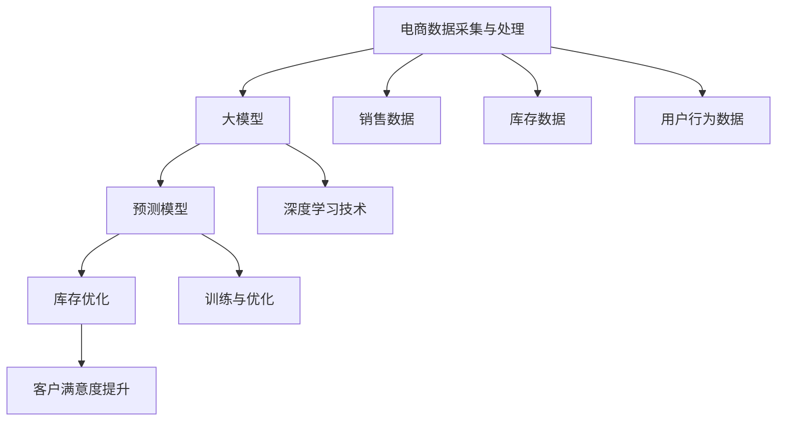

                 

# 引言

## 第1章：电商智能库存预测系统概述

### 1.1 电商行业背景与库存管理的重要性

随着互联网的快速发展，电子商务已经成为全球商业活动的重要组成部分。在电商行业，库存管理是一个关键环节，它直接影响到企业的运营效率和客户满意度。然而，传统的库存管理方法往往存在一定的局限性，难以适应电商行业的快速变化和高需求量。因此，构建一个智能库存预测系统成为当前电商行业的重要趋势。

#### 电商行业背景

电商行业起源于20世纪90年代，随着互联网技术的普及，逐渐发展成为一个庞大的市场。目前，全球电商市场规模已经超过数万亿美元，且持续增长。电商行业具有以下特点：

- **全球化**：电商企业可以通过互联网将产品销售到全球各地，打破了地域限制。
- **多样化**：电商平台上销售的产品种类繁多，从日用品到高端商品一应俱全。
- **个性化**：通过大数据和人工智能技术，电商企业可以为客户提供更加个性化的购物体验。

#### 库存管理的重要性

库存管理是电商企业运营的核心环节之一。合理的库存管理不仅能够降低库存成本，提高资金利用率，还能够满足客户的需求，提升客户满意度。库存管理的重要性体现在以下几个方面：

- **降低库存成本**：通过优化库存水平，减少库存积压，降低库存成本。
- **提高资金利用率**：合理控制库存，确保资金在生产和销售环节的高效运转。
- **满足客户需求**：准确预测市场需求，确保产品供应，提高客户满意度。

### 1.2 智能库存预测系统的核心目标

智能库存预测系统的核心目标是利用大数据和人工智能技术，对电商平台的销售数据、库存数据等进行深入分析，从而实现对未来市场需求量的准确预测。具体来说，智能库存预测系统的核心目标包括：

- **准确预测市场需求**：通过对历史销售数据、市场趋势、季节性因素等进行分析，预测未来的市场需求量。
- **优化库存水平**：根据市场需求预测，调整库存水平，避免库存积压或断货现象。
- **降低运营成本**：通过优化库存管理，降低库存成本，提高资金利用率。
- **提高客户满意度**：确保产品供应，提高客户满意度，提升品牌形象。

### 1.3 基于大模型的智能库存预测的优势

基于大模型的智能库存预测系统相比传统方法具有明显优势。大模型具有以下特点：

- **强大的数据处理能力**：大模型能够处理海量数据，从中提取有价值的信息。
- **高预测准确性**：通过深度学习等技术，大模型能够对复杂的数据关系进行建模，提高预测准确性。
- **自适应性强**：大模型可以根据实时数据不断调整预测模型，适应市场变化。

综上所述，构建基于大模型的智能库存预测系统，对于提升电商企业的运营效率、降低成本、提高客户满意度具有重要意义。在接下来的章节中，我们将深入探讨大模型的基础知识、电商数据采集与处理、智能库存预测系统的构建与优化等方面的内容。

---

### 核心概念与联系

在探讨基于大模型的电商智能库存预测系统时，我们需要明确几个核心概念，并理解它们之间的联系。以下是对这些核心概念及其相互关系的概述：

#### 大模型

大模型是指具有大量参数的机器学习模型，如深度神经网络。大模型能够处理海量数据，提取数据中的潜在模式和关系，从而实现高精度的预测。

#### 智能库存预测

智能库存预测是一种利用人工智能技术对库存水平进行预测的方法。它通过分析历史销售数据、市场趋势等因素，预测未来的库存需求。

#### 电商数据

电商数据包括销售数据、库存数据、用户行为数据等。这些数据是构建智能库存预测系统的基础。

#### 数据采集与处理

数据采集与处理是构建智能库存预测系统的关键步骤。通过采集和处理电商数据，我们可以为模型提供高质量的训练数据，从而提高预测准确性。

#### 预测模型

预测模型是基于大模型构建的，用于预测未来库存需求的工具。通过训练和优化，预测模型可以不断改进预测效果。

#### 库存优化

库存优化是基于预测模型的，旨在通过调整库存水平，实现降低库存成本和提高客户满意度的目标。

#### Mermaid 流程图



#### 数学模型和数学公式

在智能库存预测中，我们通常会使用以下数学模型和公式：

- **线性回归模型**：用于预测库存需求的基本模型。

  $$
  y = wx + b
  $$

- **损失函数**：用于评估预测结果与实际值之间的差异。

  $$
  L = \frac{1}{2} \sum_{i=1}^{n} (y_i - \hat{y}_i)^2
  $$

- **梯度下降算法**：用于优化模型参数，提高预测准确性。

  $$
  w := w - \alpha \frac{\partial}{\partial w}J(w,b)
  $$

#### 项目实战

在项目实战中，我们可以通过以下步骤来构建一个基于大模型的电商智能库存预测系统：

1. **数据采集**：从电商平台收集销售数据、库存数据等。
2. **数据处理**：清洗、转换和归一化数据，为模型提供高质量的输入。
3. **模型构建**：使用深度学习框架（如TensorFlow或PyTorch）构建预测模型。
4. **模型训练**：使用训练数据对模型进行训练，并调整模型参数。
5. **模型优化**：通过交叉验证和调参，提高模型预测准确性。
6. **预测与评估**：使用测试数据对模型进行评估，并根据评估结果调整模型。
7. **部署与维护**：将模型部署到生产环境，并定期更新和维护。

通过以上步骤，我们可以构建一个高效、准确的电商智能库存预测系统，为企业提供决策支持。

---

### 数据采集与处理

在构建电商智能库存预测系统时，数据采集与处理是至关重要的一步。这一阶段的目标是从电商平台的各个渠道收集数据，并对其进行预处理，以便为后续的建模和预测提供高质量的数据输入。

#### 数据来源

电商数据通常来源于多个渠道，包括：

- **销售数据**：记录产品在不同时间点的销售量。
- **库存数据**：记录产品的库存水平。
- **用户行为数据**：包括用户的浏览、搜索、购买等行为数据。
- **市场趋势数据**：如节假日、促销活动等影响销售的因素。

#### 数据采集方法

数据采集的方法多种多样，常用的有以下几种：

- **日志文件**：通过分析电商平台的服务器日志文件，可以收集用户的访问行为数据。
- **API接口**：使用电商平台提供的API接口，可以实时获取销售和库存数据。
- **数据库备份**：定期备份电商平台的数据库，可以获取完整的历史数据。
- **爬虫技术**：使用爬虫技术，可以自动化收集电商平台的商品信息、价格等。

#### 数据预处理

数据预处理是确保数据质量和模型性能的关键步骤。以下是几种常见的数据预处理技术：

- **数据清洗**：处理数据中的缺失值、异常值和重复值，确保数据的完整性。
- **数据转换**：将数据转换为适合模型输入的格式，如归一化、标准化等。
- **特征工程**：提取数据中的有用特征，为模型提供更多的信息。
- **时间序列处理**：对于时间序列数据，需要进行差分、趋势分析等处理。

#### 特征工程

特征工程是数据预处理中的重要环节，其目的是提高模型的预测性能。以下是一些常用的特征工程方法：

- **时间特征**：将时间信息编码为特征，如星期几、月份、季节等。
- **季节性特征**：根据季节性规律，添加与季节相关的特征。
- **趋势特征**：通过差分、移动平均等方法，提取数据中的趋势特征。
- **用户行为特征**：根据用户的浏览、搜索、购买行为，提取用户特征。
- **商品特征**：根据商品的属性，如品类、价格、品牌等，提取商品特征。

#### 数据集划分

在构建预测模型时，通常需要将数据集划分为训练集、验证集和测试集。以下是数据集划分的一般步骤：

1. **数据清洗与预处理**：对数据进行清洗和预处理，确保数据质量。
2. **特征选择**：选择对预测有显著影响的关键特征。
3. **数据集划分**：按照一定比例（如80%训练集，10%验证集，10%测试集），将数据集划分为训练集、验证集和测试集。
4. **归一化或标准化**：对训练集和验证集的数据进行归一化或标准化处理。

通过上述数据采集与处理步骤，我们可以为电商智能库存预测系统提供高质量的数据输入，从而提高模型的预测性能。

---

### 智能库存预测系统设计

智能库存预测系统的设计是构建高效、准确预测模型的关键步骤。在这一部分，我们将详细探讨系统架构设计、数据流设计、预测模型选择以及相关技术栈。

#### 系统架构设计

智能库存预测系统通常采用分布式架构，以应对海量数据和高并发请求。以下是系统架构设计的基本组成部分：

1. **数据采集模块**：
   - 功能：从电商平台的各个渠道（如销售系统、库存系统、用户行为系统）收集数据。
   - 技术栈：Python、Pandas、SQLAlchemy等。

2. **数据处理模块**：
   - 功能：对采集到的数据进行清洗、转换、归一化等预处理操作。
   - 技术栈：Python、NumPy、Pandas等。

3. **特征工程模块**：
   - 功能：提取数据中的有用特征，如时间特征、季节性特征、用户行为特征等。
   - 技术栈：Python、特征提取库（如Scikit-learn）等。

4. **预测模型模块**：
   - 功能：构建并训练预测模型，实现对库存需求的预测。
   - 技术栈：Python、TensorFlow、Keras等。

5. **存储模块**：
   - 功能：存储预测结果和历史数据，便于后续查询和分析。
   - 技术栈：Python、Flask、SQLAlchemy等。

6. **前端展示模块**：
   - 功能：展示预测结果、数据图表等，便于用户理解和使用。
   - 技术栈：JavaScript、React、D3.js等。

#### 数据流设计

数据流设计是确保系统高效运行的关键。以下是数据在系统中的流动过程：

1. **数据采集**：
   - 电商平台的数据通过API接口或日志文件等方式被采集到。
   - 数据采集模块将数据存储到临时数据库中。

2. **数据处理**：
   - 数据处理模块对数据进行清洗、转换、归一化等预处理操作。
   - 预处理后的数据存储到数据仓库中。

3. **特征工程**：
   - 特征工程模块对数据进行特征提取，生成特征向量。
   - 特征向量与原始数据一起存储到特征数据库中。

4. **预测模型训练**：
   - 预测模型模块使用训练集对模型进行训练，并调整模型参数。
   - 训练好的模型存储到模型数据库中。

5. **实时预测**：
   - 预测模型模块使用实时数据对模型进行预测。
   - 预测结果存储到结果数据库中。

6. **前端展示**：
   - 前端展示模块从结果数据库中获取预测结果，并生成可视化图表。
   - 用户可以通过前端界面查看预测结果。

#### 预测模型选择

在选择预测模型时，需要考虑模型的准确性、效率和可解释性。以下是几种常见的预测模型及其特点：

1. **线性回归模型**：
   - 优点：简单易懂，易于实现。
   - 缺点：对于非线性关系的表现较差。

2. **支持向量机（SVM）**：
   - 优点：对于非线性关系有较好的表现。
   - 缺点：训练时间较长，对大规模数据集性能较差。

3. **决策树模型**：
   - 优点：简单易懂，易于解释。
   - 缺点：容易过拟合，对大规模数据集性能较差。

4. **随机森林模型**：
   - 优点：通过集成多个决策树，提高预测准确性。
   - 缺点：计算复杂度高，对于大规模数据集性能较差。

5. **深度学习模型**：
   - 优点：能够自动提取特征，适用于复杂数据关系。
   - 缺点：模型复杂，训练时间较长。

在实际应用中，可以根据数据特点和业务需求，选择合适的预测模型。例如，对于时间序列数据，可以使用ARIMA模型或LSTM模型；对于非线性关系，可以使用SVM或深度学习模型。

#### 相关技术栈

以下是构建智能库存预测系统所需的主要技术栈：

1. **编程语言**：
   - Python：由于其丰富的库和工具，成为构建智能库存预测系统的首选语言。

2. **数据处理库**：
   - Pandas：用于数据清洗、转换和预处理。
   - NumPy：用于数值计算和数据处理。

3. **机器学习库**：
   - Scikit-learn：用于构建和训练各种机器学习模型。
   - TensorFlow：用于构建和训练深度学习模型。
   - Keras：用于简化深度学习模型的构建和训练。

4. **数据库**：
   - SQLite：用于存储临时数据和中间结果。
   - PostgreSQL：用于存储历史数据和结果数据。

5. **前端展示库**：
   - React：用于构建前端界面。
   - D3.js：用于生成数据可视化图表。

通过上述系统架构设计、数据流设计、预测模型选择和相关技术栈，我们可以构建一个高效、准确的电商智能库存预测系统。在下一部分，我们将详细讨论大模型训练与优化的过程。

---

### 大模型训练与优化

在构建电商智能库存预测系统时，大模型的训练与优化是确保预测准确性的关键步骤。这一部分将详细讨论大模型训练的数据集准备、训练流程、优化方法以及模型评估与调整。

#### 数据集准备

数据集准备是模型训练的第一步，其质量直接影响模型的性能。以下是数据集准备的主要步骤：

1. **数据收集**：从电商平台的各个渠道（如销售系统、库存系统、用户行为系统）收集数据。数据类型包括销售数据、库存数据、用户行为数据等。

2. **数据清洗**：清洗数据中的缺失值、异常值和重复值，确保数据的完整性。可以使用Python的Pandas库进行数据清洗。

3. **数据转换**：将数据转换为适合模型输入的格式。例如，对于时间序列数据，需要进行归一化或标准化处理。对于类别数据，可以使用独热编码（One-Hot Encoding）或标签编码（Label Encoding）。

4. **特征选择**：选择对预测有显著影响的关键特征。可以使用特征选择算法（如信息增益、卡方检验等）来确定重要特征。

5. **数据划分**：将数据集划分为训练集、验证集和测试集。通常，训练集用于模型训练，验证集用于模型调参，测试集用于模型评估。

6. **数据归一化或标准化**：对训练集和验证集的数据进行归一化或标准化处理，以确保数据的一致性。

#### 大模型训练流程

在数据集准备完成后，我们开始大模型的训练。以下是训练流程的详细步骤：

1. **定义模型架构**：使用深度学习框架（如TensorFlow或PyTorch）定义模型架构。包括输入层、隐藏层和输出层。选择合适的激活函数（如ReLU、Sigmoid等）和损失函数（如MSE、交叉熵等）。

2. **初始化模型参数**：初始化模型参数，可以选择随机初始化或预训练模型初始化。

3. **训练模型**：使用训练集对模型进行训练。在训练过程中，模型会不断调整参数以最小化损失函数。可以使用批量训练（Batch Training）或小批量训练（Mini-Batch Training）。

4. **模型评估**：在验证集上评估模型性能。通过计算验证集的损失函数值和评价指标（如准确率、召回率等），评估模型性能。

5. **调整模型参数**：根据模型在验证集上的表现，调整模型参数。可以使用网格搜索（Grid Search）或随机搜索（Random Search）等方法进行参数调优。

6. **模型迭代**：重复训练和评估过程，直到模型性能达到预期或达到预设的训练次数。

7. **模型保存**：将训练好的模型保存到文件中，以便后续使用。

#### 模型优化方法

在模型训练过程中，为了提高模型性能，我们可以采用以下优化方法：

1. **学习率调整**：学习率是模型训练中的一个关键参数。可以使用学习率衰减策略（如指数衰减、余弦退火等）来调整学习率。

2. **批量大小调整**：批量大小影响模型训练的速度和性能。可以通过调整批量大小来寻找最优值。

3. **正则化**：正则化技术（如L1正则化、L2正则化等）可以防止模型过拟合，提高泛化能力。

4. **数据增强**：通过数据增强技术（如旋转、缩放、裁剪等）增加数据多样性，提高模型泛化能力。

5. **集成学习**：集成学习（如随机森林、梯度提升树等）可以通过结合多个模型提高预测准确性。

6. **模型压缩**：通过模型压缩技术（如深度可分离卷积、瓶颈层等）减小模型大小，提高模型训练速度和部署效率。

#### 模型评估与调整

在模型训练完成后，我们需要对模型进行评估和调整。以下是评估与调整的步骤：

1. **评估指标**：选择合适的评估指标（如MSE、MAE、RMSE等）来评估模型性能。MSE（均方误差）和RMSE（均方根误差）是常用的评价指标，可以反映模型预测的准确性。

2. **交叉验证**：使用交叉验证（如K折交叉验证）方法评估模型在未见数据上的表现。交叉验证可以减小评估结果的不确定性。

3. **模型调整**：根据评估结果，调整模型结构、参数或数据预处理方法。例如，增加隐藏层节点、调整学习率、增加特征工程步骤等。

4. **重复评估与调整**：重复评估与调整过程，直到模型性能达到预期或达到预设的训练次数。

通过以上步骤，我们可以训练和优化一个高效、准确的电商智能库存预测模型。在下一部分，我们将探讨如何实现实时库存预测与优化。

---

### 实时库存预测与优化

实时库存预测是电商智能库存预测系统的重要组成部分，其目标是通过实时数据处理和预测，动态调整库存水平，以应对市场变化和需求波动。以下将详细介绍实时预测技术、库存优化策略以及预测结果的可视化与报告。

#### 实时预测技术

实时预测技术要求系统对实时数据流进行高效处理和分析，以便快速生成预测结果。以下是实现实时预测的关键技术：

1. **流数据处理框架**：
   - 使用流数据处理框架（如Apache Kafka、Apache Flink等）来处理实时数据流。
   - 这些框架能够处理大规模、高速的数据流，并保证数据的可靠性和一致性。

2. **实时计算引擎**：
   - 利用实时计算引擎（如Apache Spark Streaming、TensorFlow Stream等）来处理实时数据流，并生成预测结果。
   - 实时计算引擎能够对数据流进行实时分析，快速生成预测结果。

3. **消息队列技术**：
   - 使用消息队列（如RabbitMQ、Kafka等）来传递实时数据，确保数据在系统中的高效传输和可靠处理。
   - 消息队列能够处理高并发、大规模的数据流，并保证数据的实时性。

#### 库存优化策略

库存优化策略是基于实时预测结果，动态调整库存水平，以实现降低库存成本和提高客户满意度的目标。以下是几种常见的库存优化策略：

1. **基于需求预测的动态库存策略**：
   - 根据实时预测结果，动态调整库存水平。
   - 当预测市场需求增加时，增加库存量；当市场需求减少时，减少库存量。
   - 这种策略能够有效应对市场变化，避免库存积压或断货。

2. **基于安全库存的缓冲策略**：
   - 在预测结果的基础上，设置一定的安全库存量，以应对不确定的市场需求。
   - 当市场需求波动较大时，安全库存能够提供缓冲，确保产品供应。
   - 这种策略能够在保证客户满意度的同时，降低库存成本。

3. **基于成本效益分析的库存优化**：
   - 通过成本效益分析，确定最优的库存水平。
   - 考虑库存持有成本、缺货成本和订单处理成本，平衡成本和效益。
   - 这种策略能够实现库存成本的最小化，同时确保产品供应。

4. **基于供应链协同的库存优化**：
   - 与供应商和分销商进行协同，共享库存信息，优化库存水平。
   - 通过供应链协同，实现库存信息的共享和实时调整，提高库存管理效率。
   - 这种策略能够降低整体库存成本，提高供应链协同效应。

#### 预测结果的可视化与报告

预测结果的可视化和报告是帮助决策者理解和利用预测结果的重要环节。以下是实现预测结果可视化和报告的方法：

1. **数据可视化工具**：
   - 使用数据可视化工具（如Tableau、PowerBI、D3.js等）来展示预测结果。
   - 通过图表、仪表板等形式，直观展示预测结果，帮助决策者快速了解市场趋势和库存情况。

2. **实时监控与报警**：
   - 通过实时监控工具（如Zabbix、Prometheus等）来监控预测系统的运行状态。
   - 设置报警阈值，当预测结果超过设定的阈值时，自动发送报警信息，提醒相关人员采取行动。

3. **定期报告**：
   - 定期生成库存预测报告，包括预测结果、市场趋势、库存优化建议等。
   - 报告可以通过邮件、PDF等形式发送给相关人员，帮助其了解库存管理状况和决策依据。

通过以上实时预测技术、库存优化策略和预测结果的可视化与报告，电商智能库存预测系统能够实现对库存的实时监控和动态调整，提高库存管理效率和客户满意度。

---

### 系统部署与维护

在智能库存预测系统构建完成后，系统的部署与维护是确保其稳定运行和持续优化的重要环节。以下将详细讨论系统部署方案、部署工具与环境配置、系统监控与维护以及系统安全性保障。

#### 系统部署方案

部署方案是确保智能库存预测系统在生产环境中高效运行的关键。以下是部署方案的主要组成部分：

1. **硬件资源分配**：
   - 根据系统的计算需求和存储需求，合理分配硬件资源，如CPU、内存、硬盘等。
   - 选择合适的云服务提供商（如AWS、Azure、阿里云等），以确保硬件资源的弹性扩展和成本控制。

2. **容器化部署**：
   - 使用容器化技术（如Docker）将系统组件打包为独立的容器，实现环境的一致性和可移植性。
   - 通过Kubernetes等容器编排工具，实现容器的高效管理和调度。

3. **自动化部署**：
   - 使用自动化部署工具（如Jenkins、GitLab CI/CD等）实现自动化构建、测试和部署。
   - 通过持续集成和持续部署（CI/CD）流程，提高系统的开发效率和部署速度。

4. **高可用性设计**：
   - 设计高可用性架构，确保系统在遇到故障时能够快速恢复。
   - 使用负载均衡器（如Nginx、HAProxy等）实现流量分发，提高系统的处理能力。

5. **数据备份与恢复**：
   - 定期备份数据库和系统配置文件，确保在数据丢失或系统故障时能够快速恢复。
   - 设计数据备份策略，包括全量备份和增量备份，以平衡备份速度和存储成本。

#### 部署工具与环境配置

以下是实现系统部署所需的主要工具和环境配置：

1. **Docker**：
   - 用于将系统组件打包为容器，实现环境一致性和可移植性。
   - 在宿主机上安装Docker，并配置Docker-Compose，用于管理多容器应用。

2. **Kubernetes**：
   - 用于容器编排和管理，实现容器的高效调度和资源管理。
   - 在宿主机上安装Kubernetes集群，并使用Kubectl命令行工具进行管理。

3. **Jenkins**：
   - 用于实现自动化构建和部署，通过构建脚本和Pipeline实现CI/CD流程。
   - 在宿主机上安装Jenkins，并配置相应的插件和工作流。

4. **Nginx**：
   - 用于实现负载均衡和反向代理，提高系统的性能和安全性。
   - 在宿主机上安装Nginx，并配置虚拟主机和SSL证书。

5. **数据库**：
   - 使用关系型数据库（如MySQL、PostgreSQL）或NoSQL数据库（如MongoDB、Redis）存储数据和模型。
   - 在宿主机上安装并配置数据库，确保数据的高可用性和可靠性。

#### 系统监控与维护

系统监控与维护是确保智能库存预测系统稳定运行的关键。以下是系统监控与维护的主要方法：

1. **日志监控**：
   - 使用日志收集工具（如ELK栈、Logstash等）收集系统日志，并使用Kibana进行日志分析。
   - 监控系统日志，发现异常和错误，及时处理。

2. **性能监控**：
   - 使用性能监控工具（如Prometheus、Grafana等）监控系统的性能指标，如CPU使用率、内存使用率、磁盘IO等。
   - 通过性能监控，发现系统瓶颈和性能问题，并进行优化。

3. **告警与通知**：
   - 配置告警系统（如PagerDuty、Opsgenie等），在系统出现异常时及时通知相关人员。
   - 告警通知包括邮件、短信、电话等多种方式，确保相关人员能够及时响应。

4. **定期维护**：
   - 定期对系统进行维护，包括更新软件版本、升级硬件资源、清理日志文件等。
   - 通过定期维护，确保系统的稳定性和安全性。

#### 系统安全性保障

系统安全性是智能库存预测系统运行的重要保障。以下是系统安全性保障的主要措施：

1. **网络安全**：
   - 使用防火墙和入侵检测系统（如Snort）保护系统不受网络攻击。
   - 定期进行安全审计，发现和修复系统漏洞。

2. **数据安全**：
   - 使用加密技术（如SSL/TLS）保护数据传输安全。
   - 对数据库和文件系统进行权限控制，防止未授权访问。

3. **用户认证与授权**：
   - 使用强密码策略和多因素认证（如短信验证码、指纹识别等）确保用户身份安全。
   - 通过权限控制，限制用户对系统资源的访问权限。

4. **访问控制**：
   - 使用访问控制列表（ACL）和角色权限管理（RBAC）确保系统资源的访问安全。
   - 确保只有授权用户才能访问敏感数据和系统功能。

通过以上部署与维护、监控与维护、安全性保障措施，我们可以确保智能库存预测系统的稳定运行和持续优化。在下一部分，我们将通过实际案例分析，探讨智能库存预测系统的应用效果。

---

### 案例分析

为了更好地展示基于大模型的电商智能库存预测系统的实际应用效果，以下我们将通过一个具体案例进行分析，包括案例背景介绍、智能库存预测系统应用、案例效果评估以及经验与教训总结。

#### 案例背景介绍

某大型电商企业在运营过程中，面临着库存管理难度大、库存成本高、客户满意度不高等问题。为了提高运营效率、降低库存成本、提升客户满意度，该企业决定引入基于大模型的智能库存预测系统。该系统将利用历史销售数据、库存数据、用户行为数据等，通过深度学习算法预测未来市场需求，从而实现精准库存管理和优化。

#### 智能库存预测系统应用

在该案例中，智能库存预测系统的应用主要包括以下步骤：

1. **数据采集与处理**：
   - 从电商平台的销售系统、库存系统、用户行为系统等渠道采集数据。
   - 使用Python和Pandas对数据进行清洗、转换、归一化等预处理操作。

2. **特征工程**：
   - 提取关键特征，如时间特征（如星期几、月份、季节等）、用户行为特征（如浏览量、购买量等）、商品特征（如品类、价格等）。
   - 使用Scikit-learn库进行特征选择和特征工程。

3. **模型构建与训练**：
   - 使用TensorFlow和Keras构建深度学习模型，包括输入层、隐藏层和输出层。
   - 使用训练集对模型进行训练，并使用验证集进行调参和优化。

4. **实时预测与优化**：
   - 利用实时数据流处理框架（如Apache Flink）进行实时数据采集和处理。
   - 使用训练好的模型进行实时库存预测，并根据预测结果动态调整库存水平。

5. **可视化与报告**：
   - 使用D3.js和React构建前端界面，展示预测结果和库存变化趋势。
   - 定期生成库存预测报告，包括预测结果、市场趋势、库存优化建议等。

#### 案例效果评估

通过实际应用，智能库存预测系统取得了显著的效果，具体表现在以下几个方面：

1. **库存成本降低**：
   - 预测系统通过精准预测市场需求，帮助企业合理安排库存，减少库存积压和断货现象，从而降低了库存成本。

2. **客户满意度提升**：
   - 预测系统确保了产品供应的稳定性，减少了客户等待时间，提升了客户满意度。

3. **运营效率提高**：
   - 预测系统实现了库存管理的自动化和智能化，减少了人工干预，提高了运营效率。

4. **预测准确性**：
   - 通过不断优化模型和调整参数，预测系统的预测准确性不断提高，进一步提升了库存管理的准确性。

#### 经验与教训总结

在案例实施过程中，我们积累了以下经验与教训：

1. **数据质量是关键**：
   - 高质量的数据是构建高效预测模型的基础。在数据采集和处理过程中，要确保数据的完整性和准确性，及时处理缺失值和异常值。

2. **特征工程至关重要**：
   - 特征工程对预测性能有重要影响。要提取对预测有显著影响的关键特征，并通过特征选择方法减少冗余特征。

3. **实时数据处理能力**：
   - 实时数据处理能力是实现动态库存优化的重要保障。要选择适合的实时数据处理框架和计算引擎，确保数据流的高效处理和实时预测。

4. **模型优化与调参**：
   - 模型优化与调参是提高预测准确性的关键。要不断调整模型参数，使用交叉验证方法进行调参，确保模型在不同数据集上的表现一致。

5. **可视化与报告**：
   - 可视化和报告是帮助决策者理解和使用预测结果的重要手段。要选择合适的可视化工具和报告格式，确保预测结果的可视化和可解释性。

通过以上经验与教训，我们可以更好地构建和优化基于大模型的电商智能库存预测系统，为企业提供更加精准和高效的库存管理解决方案。

---

### 深入学习

在探讨基于大模型的电商智能库存预测系统时，深入了解大模型的数学基础和核心算法原理是至关重要的。以下将介绍线性代数基础、概率论基础、最优化理论基础以及反向传播算法、梯度下降算法、正则化技术和深度学习框架简介。

#### 线性代数基础

线性代数是机器学习和深度学习的重要数学工具，其中涉及到的核心概念包括矩阵、向量、行列式、矩阵运算等。以下是一些常用的线性代数概念：

- **矩阵和向量**：矩阵是一种由数字组成的矩形阵列，而向量是矩阵的特殊情况，只有一列或一行。在机器学习中，矩阵和向量常用于表示数据和参数。
- **矩阵运算**：包括矩阵加法、矩阵减法、矩阵乘法、转置等。矩阵乘法是深度学习中权重矩阵和输入向量之间的重要运算。
- **行列式**：行列式是一个数字，用于描述矩阵的某些性质，如线性相关性。在深度学习中，行列式常用于计算特征值和特征向量。
- **矩阵分解**：如奇异值分解（SVD）和特征值分解（EVD），用于简化矩阵运算和提取关键特征。

#### 概率论基础

概率论是深度学习中的重要数学基础，用于描述不确定性和随机性。以下是一些常用的概率论概念：

- **随机变量**：随机变量是一个可以取不同值的变量，可以是离散的或连续的。在深度学习中，随机变量用于表示输入数据、模型参数等。
- **概率分布**：概率分布描述随机变量取不同值的概率。常用的概率分布包括正态分布、伯努利分布、多项式分布等。
- **期望和方差**：期望是随机变量的平均值，方差是衡量随机变量离散程度的指标。在深度学习中，期望和方差用于评估模型的性能和稳定性。
- **条件概率和贝叶斯定理**：条件概率描述在已知一个随机事件发生的条件下，另一个随机事件发生的概率。贝叶斯定理是推导条件概率的重要工具。

#### 最优化理论基础

最优化理论是用于求解最优解的数学方法，在深度学习中用于优化模型参数。以下是一些常用的最优化理论概念：

- **目标函数**：目标函数是一个用于评估模型性能的函数，通常是最小化损失函数。
- **梯度**：梯度是目标函数关于参数的导数，用于描述目标函数的变化率。在深度学习中，梯度用于计算模型参数的更新方向。
- **梯度下降算法**：梯度下降是一种用于求解最优解的迭代算法。通过不断更新参数，使得目标函数逐渐减小，直至达到局部最小值。

#### 反向传播算法

反向传播算法是深度学习中用于训练模型的核心算法，用于计算模型参数的梯度。以下是反向传播算法的基本步骤：

1. **前向传播**：输入数据通过模型前向传播，计算输出值和损失函数。
2. **计算梯度**：根据损失函数对模型参数求导，计算梯度。
3. **反向传播**：将梯度从输出层反向传播到输入层，更新模型参数。
4. **迭代优化**：重复上述步骤，直至模型收敛或达到预设的迭代次数。

#### 梯度下降算法

梯度下降算法是一种用于优化模型参数的迭代算法，其核心思想是沿着目标函数的梯度方向更新参数，以最小化目标函数。以下是梯度下降算法的基本步骤：

1. **初始化参数**：随机初始化模型参数。
2. **计算梯度**：对目标函数求导，计算梯度。
3. **更新参数**：根据梯度方向更新参数，公式如下：

   $$
   w := w - \alpha \frac{\partial}{\partial w}J(w,b)
   $$

   其中，$w$为模型参数，$\alpha$为学习率，$J(w,b)$为目标函数。

4. **迭代优化**：重复上述步骤，直至模型收敛或达到预设的迭代次数。

#### 正则化技术

正则化技术用于防止模型过拟合，提高泛化能力。以下是一些常用的正则化技术：

- **L1正则化**：在损失函数中添加L1范数项，用于控制模型参数的绝对值。
- **L2正则化**：在损失函数中添加L2范数项，用于控制模型参数的平方值。
- **dropout**：在训练过程中随机丢弃部分神经元，减少模型依赖性。

#### 深度学习框架简介

深度学习框架是用于构建和训练深度学习模型的软件工具。以下是一些常用的深度学习框架：

- **TensorFlow**：由谷歌开发，支持多种编程语言，具有丰富的功能和广泛的应用。
- **PyTorch**：由Facebook开发，具有灵活的动态计算图和强大的GPU支持，适用于研究和实验。
- **Keras**：是一个高层神经网络API，支持TensorFlow和Theano，易于使用和扩展。
- **MXNet**：由Apache软件基金会开发，支持多种编程语言，适用于大规模分布式训练。

通过以上数学基础、核心算法原理和深度学习框架的介绍，我们可以更好地理解和应用基于大模型的电商智能库存预测系统。

---

### 大模型应用扩展

在深入理解了基于大模型的电商智能库存预测系统后，我们可以将这一技术扩展到其他领域，进一步发挥大模型的潜力。以下将介绍多模型融合、集成学习以及大模型在其他领域的应用。

#### 多模型融合

多模型融合是指将多个不同的模型进行组合，以实现更优的预测性能。在电商智能库存预测系统中，我们可以采用以下方法进行多模型融合：

1. **模型集成学习**：将多个预测模型（如线性回归、决策树、神经网络等）进行集成，生成最终的预测结果。常用的集成学习方法包括Bagging、Boosting和Stacking。

   - **Bagging**：通过随机选择训练数据集，训练多个模型，然后对预测结果进行投票或取平均。
   - **Boosting**：集中优化一个基模型的性能，通过迭代训练多个基模型，每个模型专注于纠正前一个模型的预测错误。
   - **Stacking**：将多个模型作为基模型，再训练一个元模型来整合这些基模型的预测结果。

2. **模型融合策略**：结合不同模型的优点，设计合适的融合策略。例如，基于加权平均、投票机制、结合模型预测误差等方法进行融合。

通过多模型融合，可以有效提高预测准确性，降低模型过拟合风险，提高系统的鲁棒性和稳定性。

#### 集成学习

集成学习是一种常用的机器学习技术，通过将多个简单模型组合成一个大模型，以提高预测性能。以下是一些常用的集成学习方法：

1. **随机森林**：随机森林是一种基于决策树的集成学习方法，通过随机选择特征和样本子集，训练多个决策树，并对预测结果进行投票或取平均。

2. **梯度提升树**：梯度提升树（Gradient Boosting Tree）是一种基于决策树的集成学习方法，通过迭代训练多个基模型，每次迭代优化前一个模型的预测误差。

3. **堆叠回归**：堆叠回归是一种基于神经网络和线性回归的集成学习方法，通过训练多个基础模型，再训练一个线性回归模型来整合这些基础模型的预测结果。

集成学习在电商智能库存预测系统中可以发挥重要作用，通过结合不同模型的优点，提高预测准确性和稳定性。

#### 大模型在其他领域的应用

除了电商智能库存预测系统，大模型在许多其他领域也展现了广泛的应用潜力：

1. **金融市场预测**：大模型可以用于金融市场的预测，如股票价格、汇率、利率等。通过分析历史数据和宏观经济指标，预测未来的市场走势。

2. **医疗诊断**：大模型在医疗领域有广泛的应用，如疾病预测、疾病诊断等。通过分析患者的电子病历、基因数据等，预测疾病风险和诊断疾病。

3. **自然语言处理**：大模型在自然语言处理领域具有强大的能力，如文本分类、情感分析、机器翻译等。通过处理大量文本数据，实现高精度的文本分析。

4. **自动驾驶**：大模型在自动驾驶领域有重要的应用，如路径规划、障碍物检测、车辆控制等。通过实时分析传感器数据，实现自动驾驶汽车的决策和控制。

5. **智能客服**：大模型可以用于构建智能客服系统，如语音识别、语义理解、回答生成等。通过分析用户提问，生成智能、准确的回答。

通过以上扩展和应用，我们可以更好地发挥大模型的潜力，解决各种复杂问题，推动人工智能技术的发展和应用。

---

### 未来展望与挑战

随着人工智能技术的不断进步，基于大模型的电商智能库存预测系统有望在未来取得更加显著的突破。以下将探讨大模型的发展趋势、智能库存预测系统的未来发展方向以及当前存在的挑战和解决方案。

#### 大模型的发展趋势

1. **模型规模扩大**：大模型的发展趋势之一是模型规模的不断扩大。随着计算能力和数据量的增加，深度学习模型的参数数量和神经网络层数持续增长，以捕捉更复杂的特征和关系。

2. **模型优化与效率提升**：为了降低计算成本和提升模型效率，研究人员不断探索模型优化方法，如模型剪枝、量化、分布式训练等。这些方法有助于减少模型大小和计算量，提高模型在资源受限环境下的运行效率。

3. **多模态数据处理**：未来的大模型将能够处理多种类型的数据，如文本、图像、语音等。通过多模态数据的融合，大模型将能够更准确地理解和预测复杂场景。

4. **自适应学习与实时更新**：大模型将具备更强的自适应学习能力，能够根据实时数据和环境变化不断更新和优化预测模型。这种能力将使大模型在动态环境中保持高精度和稳定性。

#### 智能库存预测系统的未来发展方向

1. **个性化库存预测**：随着用户数据的积累和数据分析技术的进步，智能库存预测系统将能够提供更加个性化的库存预测。根据用户的购物行为和偏好，为不同用户群体提供定制化的库存策略。

2. **供应链协同优化**：智能库存预测系统将不仅仅关注电商平台的内部库存管理，还将与供应商和物流合作伙伴进行协同，实现整个供应链的优化。通过共享库存信息和预测数据，降低库存成本，提高供应链效率。

3. **预测精度提升**：通过引入更多的数据源和更先进的算法，智能库存预测系统的预测精度将不断提升。结合多模型融合和深度学习技术，系统将能够更好地应对复杂的市场变化和需求波动。

4. **自动化决策支持**：智能库存预测系统将能够实现自动化决策支持，通过实时分析和预测结果，自动生成库存调整策略，减少人工干预，提高决策效率。

#### 存在的挑战与解决方案

1. **数据隐私与安全性**：随着大数据的应用，数据隐私和安全问题日益突出。为了保护用户数据隐私，需要采取严格的数据保护措施，如数据加密、访问控制等。

2. **计算资源需求**：大模型的训练和预测需要大量的计算资源，特别是在处理海量数据时。为了解决这一问题，可以采用分布式计算、云计算等技术，提高计算效率。

3. **模型可解释性**：大模型通常具有很高的预测精度，但其内部机制复杂，难以解释。为了提高模型的透明度和可解释性，研究人员正在探索可解释性机器学习（Explainable AI）技术。

4. **数据质量与可靠性**：数据质量是影响模型性能的关键因素。为了提高数据质量，需要加强数据采集、处理和清洗环节，确保数据的一致性和准确性。

通过不断的技术创新和应用优化，基于大模型的电商智能库存预测系统将在未来取得更大的突破，为电商企业带来更高的运营效率和客户满意度。同时，解决当前面临的挑战，将使这一系统能够更好地应对复杂多变的市场环境。

---

### 附录

#### 附录 A: 编程工具与资源

以下是一些在构建基于大模型的电商智能库存预测系统时常用的编程工具和资源：

1. **编程语言**：
   - Python：主要用于数据分析和模型训练。
   - R：适用于数据可视化和统计分析。

2. **库和框架**：
   - Pandas：用于数据清洗和预处理。
   - NumPy：用于数值计算。
   - Scikit-learn：用于机器学习模型构建和评估。
   - TensorFlow：用于深度学习模型训练。
   - Keras：用于简化深度学习模型构建。
   - PyTorch：用于深度学习模型训练。
   - Flask：用于Web开发。

3. **数据库**：
   - MySQL：用于存储结构化数据。
   - PostgreSQL：用于存储复杂数据关系。
   - MongoDB：用于存储非结构化数据。

4. **可视化工具**：
   - Matplotlib：用于生成数据可视化图表。
   - Seaborn：用于生成更美观的数据可视化图表。
   - D3.js：用于Web数据可视化。

5. **云服务**：
   - AWS：提供计算、存储、数据库等服务。
   - Azure：提供云计算和大数据分析服务。
   - Google Cloud：提供云计算和人工智能服务。

6. **容器化工具**：
   - Docker：用于容器化应用部署。
   - Kubernetes：用于容器编排和管理。

#### 附录 B: 相关公式与算法伪代码

以下是一些在构建电商智能库存预测系统时常用的数学公式和算法伪代码：

##### 线性回归模型

$$
y = wx + b
$$

$$
\min_{w,b} \sum_{i=1}^{n} (y_i - wx_i - b)^2
$$

##### 伪代码：梯度下降算法

```
输入：w, b, learning_rate, epochs
输出：最优参数 w*, b*

for epoch in 1 to epochs:
    for each example (x_i, y_i) in training_data:
        compute gradient: 
            gradient_w = 2 * (wx_i + b - y_i) * x_i
            gradient_b = 2 * (wx_i + b - y_i)
        update parameters:
            w = w - learning_rate * gradient_w
            b = b - learning_rate * gradient_b
return w, b
```

##### 伪代码：反向传播算法

```
输入：model, inputs, targets, learning_rate
输出：更新后的模型参数

for layer in model.layers:
    compute forward pass: outputs = model.forward_pass(inputs)
    compute backward pass: dinputs = model.backward_pass(outputs, targets)
    update layer weights and biases using dinputs and learning_rate
return updated model
```

#### 附录 C: 参考文献与进一步阅读资料

以下是一些关于基于大模型的电商智能库存预测系统的相关文献和进一步阅读资料：

1. **文献**：
   - Goodfellow, I., Bengio, Y., & Courville, A. (2016). *Deep Learning*.
   - Russell, S., & Norvig, P. (2010). *Artificial Intelligence: A Modern Approach*.
   - Murphy, K. P. (2012). *Machine Learning: A Probabilistic Perspective*.

2. **在线资源**：
   - [TensorFlow官方文档](https://www.tensorflow.org/)
   - [Keras官方文档](https://keras.io/)
   - [Scikit-learn官方文档](https://scikit-learn.org/stable/)
   - [Deep Learning Specialization](https://www.deeplearning.ai/deep-learning-specialization/)

3. **书籍**：
   - Goodfellow, I., Bengio, Y., & Courville, A. (2016). *Deep Learning*.
   - Mitchell, T. M. (1997). *Machine Learning*.
   - Bishop, C. M. (2006). *Pattern Recognition and Machine Learning*.

通过参考这些文献和资源，我们可以深入了解基于大模型的电商智能库存预测系统的原理和应用，进一步提升我们的技术能力。

