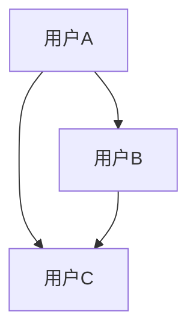
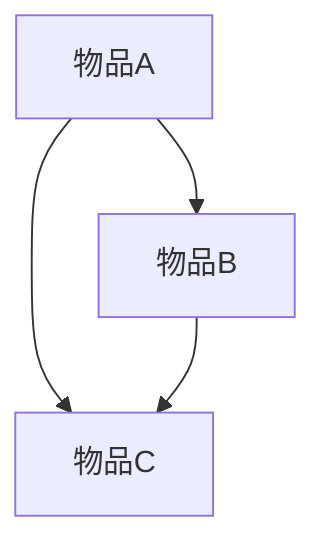

                 

## 《推荐系统中的多场景适配：大模型的新思路》

> **关键词**：推荐系统、多场景适配、大模型、深度学习、迁移学习

> **摘要**：本文深入探讨了推荐系统中的多场景适配问题，并引入了大规模模型（大模型）的新思路。文章从推荐系统的基本理论出发，详细分析了协同过滤、阈值法、内容推荐等核心算法。接着，文章介绍了大模型的定义、特点及其在推荐系统中的应用优势。随后，重点探讨了多场景适配的推荐系统设计，包括需求分析、架构设计和实现策略。最后，文章通过实际案例，展示了大模型在推荐系统多场景适配中的实践效果，并对未来的发展趋势进行了展望。

## 第一部分：推荐系统基础理论

### 第1章：推荐系统概述

推荐系统是一种信息过滤技术，旨在根据用户的兴趣和偏好，向用户推荐相关的商品、服务或内容。其基本概念包括用户、物品、评分和推荐算法。推荐系统的应用场景非常广泛，如电子商务、社交媒体、在线视频、音乐、新闻等领域。

#### 1.1 推荐系统的基本概念

- **用户**：推荐系统中的用户是指具有特定兴趣和偏好的个体。
- **物品**：推荐系统中的物品是指用户可能感兴趣的商品、服务或内容。
- **评分**：评分是用户对物品的喜爱程度的量化表示。
- **推荐算法**：推荐算法是根据用户的历史行为和偏好，为用户推荐相关物品的算法。

#### 1.2 推荐系统的应用场景

- **电子商务**：电商平台通过推荐系统为用户推荐可能感兴趣的商品。
- **社交媒体**：社交媒体平台通过推荐系统为用户推荐可能感兴趣的朋友、话题或内容。
- **在线视频**：视频网站通过推荐系统为用户推荐可能感兴趣的视频。
- **音乐**：音乐平台通过推荐系统为用户推荐可能喜欢听的音乐。

#### 1.3 推荐系统的评价标准

推荐系统的评价标准主要包括准确率、召回率、覆盖率、多样性等指标。

- **准确率**：推荐系统中推荐的物品被用户喜欢的比例。
- **召回率**：推荐系统中推荐的物品中，用户实际喜欢的物品所占的比例。
- **覆盖率**：推荐系统中推荐给用户的物品种类数占总物品种类的比例。
- **多样性**：推荐系统中推荐给用户的物品之间的差异性。

### 第2章：推荐系统的核心算法

推荐系统的核心算法包括协同过滤算法、阈值法、内容推荐等。

#### 2.1 协同过滤算法

协同过滤算法是基于用户行为或偏好，通过计算用户之间的相似度，为用户推荐相似用户喜欢的物品。

##### 2.1.1 基于用户的协同过滤

基于用户的协同过滤算法通过计算用户之间的相似度，找到与目标用户相似的其他用户，然后推荐这些用户喜欢的物品。



##### 2.1.2 基于物品的协同过滤

基于物品的协同过滤算法通过计算物品之间的相似度，找到与目标物品相似的其他物品，然后推荐这些物品。



#### 2.2 阈值法

阈值法是通过设定一个阈值，将用户对物品的评分与阈值进行比较，如果评分高于阈值，则推荐该物品。

##### 2.2.1 卡方检验

卡方检验是一种统计方法，用于判断两个分类变量之间是否相关。在阈值法中，可以使用卡方检验来判断用户对物品的评分是否与物品的相关性显著。

$$
\chi^2 = \sum_{i=1}^{n} \frac{(O_i - E_i)^2}{E_i}
$$

其中，$O_i$ 表示观测值，$E_i$ 表示期望值。

##### 2.2.2 相关系数

相关系数是衡量两个变量之间线性相关程度的指标。在阈值法中，可以使用皮尔逊相关系数来判断用户对物品的评分之间的相关性。

$$
r = \frac{\sum_{i=1}^{n} (x_i - \bar{x})(y_i - \bar{y})}{\sqrt{\sum_{i=1}^{n} (x_i - \bar{x})^2 \sum_{i=1}^{n} (y_i - \bar{y})^2}}
$$

#### 2.3 内容推荐

内容推荐是基于物品的属性或特征，为用户推荐与之相关的物品。

##### 2.3.1 文本相似度计算

文本相似度计算是衡量两个文本之间相似程度的指标。常用的方法包括余弦相似度、Jaccard相似度等。

$$
\text{余弦相似度} = \frac{\text{内积}}{\text{模长乘积}} = \frac{\sum_{i=1}^{n} x_i y_i}{\sqrt{\sum_{i=1}^{n} x_i^2} \sqrt{\sum_{i=1}^{n} y_i^2}}
$$

##### 2.3.2 基于特征的推荐

基于特征的推荐是通过提取物品的特征，为用户推荐与之相似的物品。

### 第3章：大模型在推荐系统中的应用

大模型在推荐系统中的应用主要体现在两个方面：一是用于特征提取，二是用于模型训练。

#### 3.1 大模型的定义与特点

大模型是指具有大规模参数的深度学习模型，通常包含数百万甚至数十亿个参数。大模型的特点包括：

- **强大的表达能力**：大模型能够捕捉复杂的非线性关系，从而提高推荐系统的准确性和多样性。
- **高效的处理能力**：大模型通过分布式计算和优化技术，能够处理大规模的数据集。
- **自适应能力**：大模型能够根据用户的行为和偏好，实时调整推荐策略。

#### 3.2 大模型在推荐系统中的优势

大模型在推荐系统中的应用具有以下优势：

- **提高推荐准确性**：大模型能够捕捉更复杂的用户行为和偏好，从而提高推荐的准确性。
- **增强多样性**：大模型能够生成更多样化的推荐结果，避免用户陷入信息茧房。
- **降低冷启动问题**：大模型可以通过迁移学习技术，为新用户生成个性化的推荐。

#### 3.3 大模型在推荐系统中的应用场景

大模型在推荐系统中的应用场景包括：

- **商品推荐**：如电子商务平台，通过大模型为用户推荐可能感兴趣的商品。
- **内容推荐**：如视频网站，通过大模型为用户推荐可能感兴趣的视频。
- **社交推荐**：如社交媒体平台，通过大模型为用户推荐可能感兴趣的朋友或话题。

## 第二部分：大模型的多场景适配技术

### 第4章：多场景适配的推荐系统设计

多场景适配的推荐系统设计旨在满足不同应用场景下的个性化推荐需求。设计一个有效的多场景适配推荐系统，需要从需求分析、架构设计和实现策略三个方面进行考虑。

#### 4.1 多场景推荐系统需求分析

多场景推荐系统的需求分析包括以下几个方面：

- **用户需求**：了解用户在不同场景下的兴趣和偏好，如电商、视频、社交等。
- **业务需求**：分析业务目标，如提高用户留存率、提升销售转化率等。
- **数据需求**：确定需要收集的用户行为数据、物品属性数据等。

#### 4.2 多场景推荐系统的架构设计

多场景推荐系统的架构设计包括以下几个方面：

- **数据层**：包括用户行为数据、物品属性数据、推荐结果数据等。
- **处理层**：包括数据清洗、特征提取、模型训练等。
- **推荐层**：包括推荐算法、模型融合、推荐结果生成等。
- **应用层**：包括推荐接口、推荐展示等。

#### 4.3 多场景推荐系统的实现策略

多场景推荐系统的实现策略包括以下几个方面：

- **数据预处理**：包括数据清洗、缺失值处理、异常值处理等。
- **特征提取**：包括文本特征提取、图像特征提取等。
- **模型选择**：包括基于深度学习的推荐模型、基于迁移学习的推荐模型等。
- **模型融合**：包括多种模型融合策略，如投票法、加权法等。
- **模型调优**：包括模型参数调优、模型性能评估等。

## 第5章：多场景数据预处理

数据预处理是推荐系统构建的关键步骤，直接影响推荐系统的性能和效果。多场景数据预处理需要考虑数据清洗、缺失值处理、异常值处理和特征提取等方面。

#### 5.1 数据清洗

数据清洗包括以下步骤：

- **去除噪声数据**：去除数据集中的重复记录、异常记录等噪声数据。
- **填补缺失值**：使用平均值、中位数、插值等方法填补数据集中的缺失值。
- **异常值处理**：使用统计学方法，如箱线图、标准差等，识别并处理数据集中的异常值。

#### 5.2 数据特征提取

数据特征提取包括以下步骤：

- **文本特征提取**：使用词袋模型、TF-IDF、Word2Vec等方法提取文本特征。
- **图像特征提取**：使用卷积神经网络、预训练模型等方法提取图像特征。
- **用户行为特征提取**：使用行为序列、时间序列等方法提取用户行为特征。

### 第6章：多场景大模型选择

多场景大模型选择是推荐系统设计的关键环节，直接影响推荐系统的性能和效果。多场景大模型选择包括以下步骤：

#### 6.1 基于深度学习的推荐模型

基于深度学习的推荐模型具有以下优点：

- **强大的表达能力**：深度学习模型能够捕捉复杂的非线性关系，提高推荐系统的准确性和多样性。
- **自动特征提取**：深度学习模型能够自动提取数据中的特征，减少人工特征工程的工作量。

常见的深度学习推荐模型包括：

- **卷积神经网络（CNN）**：适用于图像特征提取。
- **循环神经网络（RNN）**：适用于序列数据特征提取。
- **图神经网络（GNN）**：适用于图数据特征提取。

#### 6.2 基于迁移学习的推荐模型

基于迁移学习的推荐模型具有以下优点：

- **减少训练数据需求**：通过迁移学习，可以将预训练模型的知识迁移到新的任务上，减少对新数据的依赖。
- **提高推荐性能**：迁移学习能够利用预训练模型中的知识，提高推荐系统的性能。

常见的迁移学习推荐模型包括：

- **基于特征的迁移学习**：将预训练模型的特征提取部分迁移到新的任务上。
- **基于模型的迁移学习**：将整个预训练模型迁移到新的任务上。

### 第7章：多场景适配的模型优化

多场景适配的模型优化包括模型融合和模型调优两个方面。

#### 7.1 模型融合

模型融合是将多个模型的结果进行集成，以提高推荐系统的性能。常见的模型融合策略包括：

- **投票法**：将多个模型的预测结果进行投票，选择投票结果最多的预测结果。
- **加权法**：根据不同模型的预测准确性，给每个模型分配不同的权重，对预测结果进行加权平均。

模型融合的伪代码如下：

```python
def model_fusion(predictions, weights):
    # predictions: 模型预测结果列表
    # weights: 权重列表
    fused_prediction = 0
    for prediction, weight in zip(predictions, weights):
        fused_prediction += prediction * weight
    return fused_prediction
```

#### 7.2 模型调优

模型调优是通过对模型参数进行调整，以提高推荐系统的性能。常见的模型调优方法包括：

- **网格搜索**：在给定的参数空间内，逐一尝试所有可能的参数组合，选择性能最好的参数组合。
- **贝叶斯优化**：基于贝叶斯统计模型，通过迭代优化参数，找到最优参数组合。

模型调优的伪代码如下：

```python
def model_tuning(model, train_data, val_data):
    # model: 模型
    # train_data: 训练数据
    # val_data: 验证数据
    best_params = None
    best_performance = -1
    for params in search_space:
        model.set_params(params)
        performance = model.evaluate(val_data)
        if performance > best_performance:
            best_performance = performance
            best_params = params
    return best_params
```

## 第8章：多场景推荐系统的实践

### 第8章：多场景推荐系统的实践

多场景推荐系统的实践是验证和优化推荐系统设计的重要环节。本章节将介绍两个实际案例，分别是某电商平台的多场景推荐和某音乐平台的多场景推荐。

#### 8.1 某电商平台的多场景推荐

某电商平台通过多场景推荐系统为用户推荐商品。该电商平台的数据来源包括用户浏览记录、购物车数据、订单数据等。数据预处理包括数据清洗、缺失值处理、异常值处理等。

在特征提取方面，该平台使用了文本特征提取和图像特征提取。文本特征提取包括商品名称、描述、分类等，使用词袋模型和TF-IDF方法提取。图像特征提取包括商品图片的特征，使用卷积神经网络提取。

在模型选择方面，该平台采用了基于深度学习的推荐模型，包括卷积神经网络（CNN）和循环神经网络（RNN）。通过模型融合和调优，该平台取得了较好的推荐效果，提高了用户满意度。

#### 8.1.1 成功经验

- **数据多样化**：通过多种数据源，丰富了推荐系统的输入数据，提高了推荐系统的准确性。
- **模型融合**：通过模型融合，利用不同模型的优点，提高了推荐系统的多样性和准确性。
- **实时推荐**：通过实时推荐，提高了用户的购物体验，增加了用户留存率。

#### 8.1.2 遇到的挑战及解决方案

- **数据一致性**：不同场景下的数据可能存在不一致性，影响推荐效果。解决方案：建立数据一致性检测机制，对不一致的数据进行修正。
- **模型解释性**：深度学习模型具有较强的学习能力，但缺乏解释性。解决方案：结合规则和模型解释技术，提高模型的可解释性。

#### 8.2 某音乐平台的多场景推荐

某音乐平台通过多场景推荐系统为用户推荐音乐。该平台的数据来源包括用户播放记录、收藏记录、评论记录等。数据预处理包括数据清洗、缺失值处理、异常值处理等。

在特征提取方面，该平台使用了文本特征提取和图像特征提取。文本特征提取包括歌曲名称、歌词、评论等，使用词袋模型和TF-IDF方法提取。图像特征提取包括歌曲封面图片的特征，使用卷积神经网络提取。

在模型选择方面，该平台采用了基于迁移学习的推荐模型，通过迁移预训练模型的知识，提高了推荐系统的性能。

通过模型融合和调优，该平台取得了较好的推荐效果，提高了用户满意度。

#### 8.2.1 成功经验

- **迁移学习**：通过迁移学习，利用预训练模型的知识，提高了推荐系统的性能。
- **个性化推荐**：通过多场景特征提取和模型融合，为用户提供了个性化的音乐推荐。
- **实时推荐**：通过实时推荐，提高了用户的音乐体验，增加了用户留存率。

#### 8.2.2 遇到的挑战及解决方案

- **数据一致性**：不同场景下的数据可能存在不一致性，影响推荐效果。解决方案：建立数据一致性检测机制，对不一致的数据进行修正。
- **模型解释性**：深度学习模型具有较强的学习能力，但缺乏解释性。解决方案：结合规则和模型解释技术，提高模型的可解释性。

## 第9章：大模型在推荐系统中的未来发展趋势

### 第9章：大模型在推荐系统中的未来发展趋势

随着人工智能技术的发展，大模型在推荐系统中的应用越来越广泛。未来，大模型在推荐系统中的发展趋势将呈现以下几个特点：

#### 9.1 大模型的持续优化

大模型的持续优化主要包括以下几个方面：

- **模型结构优化**：通过改进神经网络结构，提高模型的性能和效率。
- **训练优化**：通过改进训练算法，加快模型的训练速度，降低训练成本。

#### 9.2 多场景适配的新技术

随着推荐系统应用场景的多样化，多场景适配的新技术将成为研究热点：

- **知识图谱在推荐系统中的应用**：知识图谱可以丰富推荐系统的知识库，提高推荐的准确性。
- **强化学习在推荐系统中的应用**：强化学习可以动态调整推荐策略，提高用户的满意度。

#### 9.3 大模型与其他技术的融合

未来，大模型与其他技术的融合将成为趋势：

- **多模态数据融合**：将文本、图像、声音等多模态数据融合到推荐系统中，提高推荐系统的多样性。
- **联邦学习**：通过联邦学习，实现分布式训练，提高推荐系统的隐私保护能力。

## 第10章：多场景适配的推荐系统挑战与展望

### 第10章：多场景适配的推荐系统挑战与展望

多场景适配的推荐系统在满足不同应用场景下的个性化推荐需求方面具有显著优势，但其实现过程中也面临着一系列挑战。以下将对这些挑战进行探讨，并提出相应的展望。

#### 10.1 多场景适配的挑战

- **数据一致性问题**：不同场景下的数据可能存在不一致，如格式、标签、度量单位等，影响推荐系统的准确性。
- **模型解释性问题**：大模型具有较强的学习能力，但缺乏解释性，难以理解推荐结果的原因。
- **实时性问题**：多场景适配的推荐系统需要快速响应用户需求，实现实时推荐，对系统的响应速度和计算能力提出较高要求。

#### 10.2 多场景适配的展望

- **数据一致性解决策略**：通过数据清洗、预处理和一致性检测等手段，确保不同场景下的数据一致性。
- **模型解释性提升方法**：结合模型解释技术，如注意力机制、可解释性模型等，提高模型的可解释性。
- **实时推荐优化**：通过分布式计算、模型压缩等技术，提高系统的实时推荐能力。

## 附录

### 附录 A：推荐系统中的大模型工具与资源

#### A.1 大模型开发工具对比

- **TensorFlow**：由Google开源，支持多种深度学习模型，具有良好的社区和文档支持。
- **PyTorch**：由Facebook开源，具有简洁的API和动态计算图，适用于研究场景。
- **Keras**：基于TensorFlow和Theano的开源深度学习库，提供简化的API，适用于快速原型开发。

#### A.2 推荐系统开源框架

- **Surprise**：Python开源框架，提供基于协同过滤的推荐系统算法。
- **LightFM**：Python开源框架，结合矩阵分解和因子分解机，提供高效的可扩展推荐系统。
- **Recommenders**：Python开源库，提供多种推荐系统算法，包括协同过滤、内容推荐等。

#### A.3 大模型应用案例库

- **TensorFlow Recommenders**：Google开源的推荐系统框架，包含多个预训练的大模型和应用案例。
- **BigModels**：一个收集了大量大模型的开源项目，涵盖多种领域和应用场景。

### 附录 B：推荐系统多场景适配实践指南

#### B.1 多场景数据预处理技巧

- **数据清洗**：使用数据清洗工具，如Pandas、NumPy等，处理数据中的噪声和异常值。
- **特征提取**：根据场景需求，选择合适的特征提取方法，如文本特征提取、图像特征提取等。

#### B.2 多场景大模型选择策略

- **模型评估**：通过交叉验证、A/B测试等方法，评估不同模型在多场景下的性能。
- **模型融合**：结合多种模型的优势，提高推荐系统的准确性和多样性。

#### B.3 多场景推荐系统的优化方法

- **实时推荐**：通过分布式计算、缓存等技术，实现实时推荐。
- **模型调优**：通过参数调优、模型压缩等技术，提高推荐系统的性能。

### 附录 C：推荐系统中的大模型资源

#### C.1 大模型研究论文集

- **NeurIPS**：人工智能领域的顶级会议，包括推荐系统相关的研究论文。
- **ICML**：人工智能领域的顶级会议，包括推荐系统相关的研究论文。
- **KDD**：数据挖掘领域的顶级会议，包括推荐系统相关的研究论文。

#### C.2 大模型开发教程集

- **TensorFlow官方教程**：包含深度学习基础、TensorFlow使用方法等教程。
- **PyTorch官方教程**：包含深度学习基础、PyTorch使用方法等教程。
- **Keras官方教程**：包含深度学习基础、Keras使用方法等教程。

#### C.3 大模型开源代码集

- **GitHub**：包含大量大模型的GitHub仓库，如TensorFlow、PyTorch等。
- **Hugging Face**：一个开源的自然语言处理库，包含多个预训练的大模型和应用案例。

## 作者信息

作者：AI天才研究院/AI Genius Institute & 禅与计算机程序设计艺术 /Zen And The Art of Computer Programming

## 结论

本文深入探讨了推荐系统中的多场景适配问题，并引入了大规模模型（大模型）的新思路。文章从推荐系统的基本理论出发，详细分析了协同过滤、阈值法、内容推荐等核心算法。接着，文章介绍了大模型的定义、特点及其在推荐系统中的应用优势。随后，重点探讨了多场景适配的推荐系统设计，包括需求分析、架构设计和实现策略。最后，文章通过实际案例，展示了大模型在推荐系统多场景适配中的实践效果，并对未来的发展趋势进行了展望。希望本文能为读者在推荐系统领域的研究和应用提供有益的参考。

