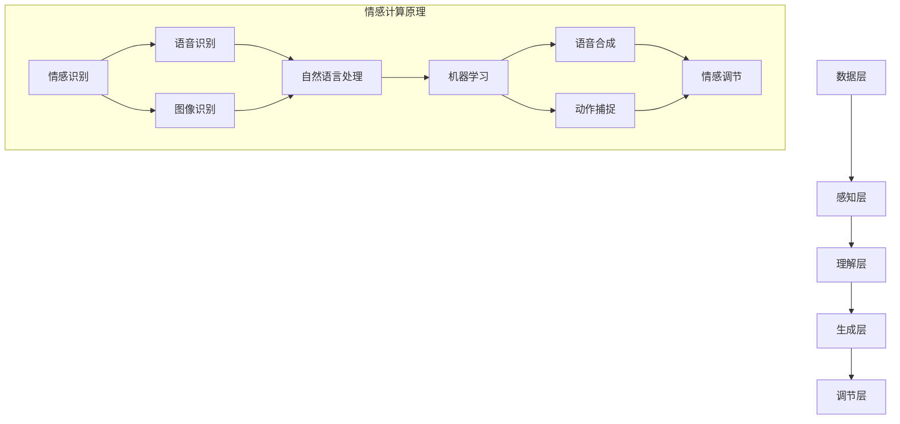
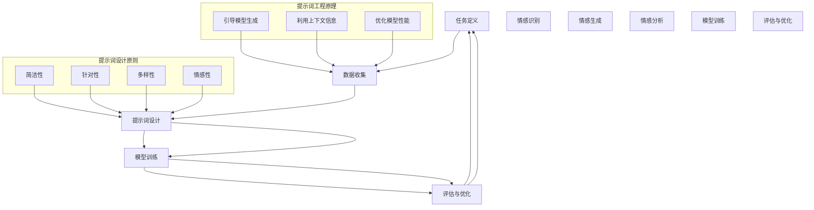
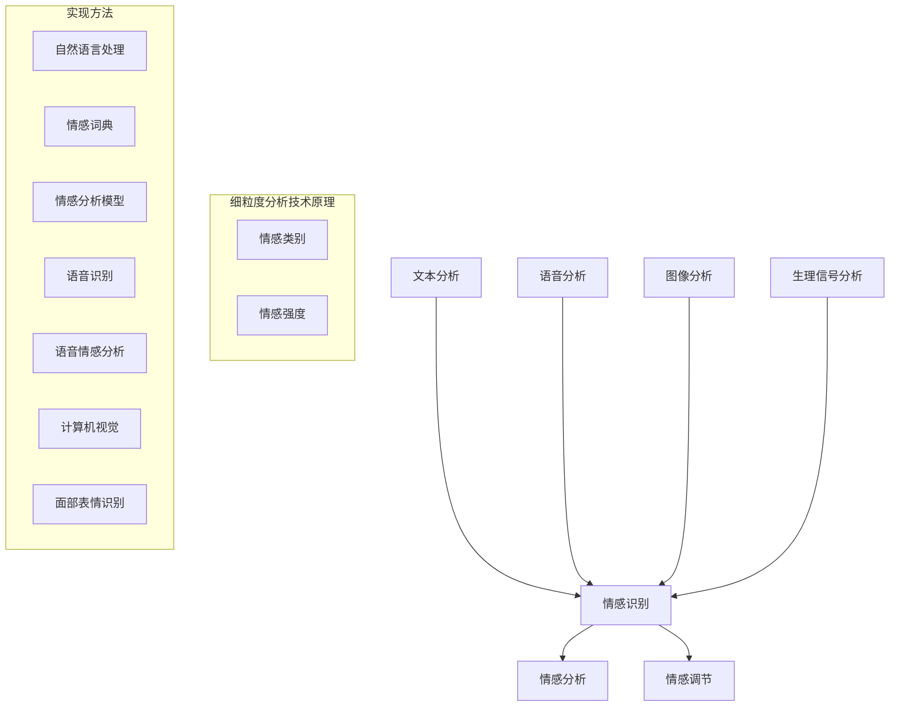

                 

# 提示词工程在情感计算中的细粒度分析技术

> 关键词：情感计算、提示词工程、细粒度分析、自然语言处理、人工智能

> 摘要：本文详细探讨了提示词工程在情感计算中的细粒度分析技术。首先，介绍了情感计算与提示词工程的基本概念和关系，随后深入分析了情感计算的技术架构和细粒度分析技术的原理。通过核心算法讲解、数学模型解析以及项目实战案例，本文旨在为读者提供对这一前沿领域的深入理解。

## 目录大纲

- **绪论**
  - **1.1 书籍背景与意义**
  - **1.2 情感计算概述**
  - **1.3 提示词工程的定义与作用**
  - **1.4 细粒度分析技术的概念与应用**
- **第一部分：核心概念与联系**
  - **2.1 情感计算原理与架构**
  - **2.2 提示词工程原理与设计**
  - **2.3 细粒度分析技术原理**
- **第二部分：核心算法原理讲解**
  - **3.1 情感识别算法**
  - **3.2 提示词优化算法**
  - **3.3 细粒度情感分析算法**
- **第三部分：数学模型与数学公式**
  - **4.1 情感计算中的数学模型**
  - **4.2 提示词工程中的数学模型**
  - **4.3 细粒度分析技术中的数学模型**
- **第四部分：项目实战**
  - **5.1 实际情感计算项目介绍**
  - **5.2 提示词工程实战**
  - **5.3 细粒度分析技术实战**
- **第五部分：案例分析**
  - **6.1 成功案例分析**
  - **6.2 失败案例分析**
  - **6.3 未来趋势与展望**
- **第六部分：总结与展望**
  - **7.1 全书总结**
  - **7.2 未来研究方向**
- **附录**
  - **附录 A：术语解释**
  - **附录 B：参考资料**

### 绪论

#### 1.1 书籍背景与意义

随着人工智能技术的迅猛发展，情感计算成为了一个备受关注的研究领域。情感计算旨在让计算机理解和模拟人类情感，实现人机情感交互。在这个领域，提示词工程扮演着至关重要的角色。提示词工程是一种通过设计特定的词汇和语句来引导和激发用户情感的方法，它能够帮助计算机更准确地捕捉和识别用户的情感状态。

本文旨在探讨提示词工程在情感计算中的细粒度分析技术，具体包括以下几个方面：

1. **情感计算与人工智能的关系**：介绍情感计算的定义、发展历程以及其在人工智能领域的重要性。
2. **提示词工程的定义与作用**：详细阐述提示词工程的概念、在情感计算中的应用以及面临的挑战。
3. **细粒度分析技术的概念与应用**：解释细粒度分析技术的定义、应用场景以及优势与挑战。

通过以上内容，本文希望能够为读者提供一个全面、深入的了解，为后续章节的深入探讨打下坚实的基础。

#### 1.2 情感计算概述

情感计算（Affective Computing）是一门研究如何使计算机具备感知、理解、表达和模拟人类情感的能力的学科。其核心目标是实现人机情感交互，让计算机在处理信息的同时，能够识别并适应用户的情感状态，从而提供更加人性化的服务。

**定义与发展历程**

情感计算的概念最早由计算机科学家约翰·霍普金斯（John C. McCarthy）在1980年代提出。他定义情感计算为“研究人如何表达、感知和理解情感，并使计算机能够模拟这些过程”。随着计算机技术的发展，情感计算逐渐成为一个独立的领域，并取得了显著的进展。

在发展历程中，情感计算经历了几个重要阶段：

1. **情感识别**：早期研究主要集中在如何让计算机识别用户的情感状态，如面部表情、语音语调等。
2. **情感理解**：随着自然语言处理和机器学习技术的发展，计算机开始能够理解文本和语音中的情感信息。
3. **情感生成**：近年来，情感计算的研究逐渐扩展到如何让计算机模拟和表达情感，实现更加自然的人机交互。

**关键技术**

情感计算涉及多个交叉学科，主要包括自然语言处理、计算机视觉、语音识别、心理学等。其中，以下关键技术是情感计算实现的核心：

1. **情感识别技术**：通过分析用户的生理信号、面部表情、语音语调等，识别用户的情感状态。
2. **情感理解技术**：利用自然语言处理技术，从文本和语音中提取情感信息，理解用户的情感表达。
3. **情感生成技术**：通过语音合成、动作捕捉等技术，让计算机模拟和表达情感，实现情感交互。

**应用领域**

情感计算的应用范围广泛，涵盖了多个行业和领域：

1. **健康医疗**：通过情感计算技术，可以实时监测患者的情绪变化，为心理健康管理提供支持。
2. **教育**：情感计算可以用于个性化教育，根据学生的情感状态调整教学内容和方法，提高学习效果。
3. **智能客服**：智能客服系统通过情感计算，能够理解用户的需求和情绪，提供更加贴心和高效的服务。
4. **人机交互**：在智能玩具、智能家居等场景中，情感计算技术能够提升用户体验，实现更加自然和人性化的交互。

#### 1.3 提示词工程的定义与作用

提示词工程（Prompt Engineering）是一种专门针对自然语言处理（NLP）任务的设计方法，旨在通过设计有效的提示词（Prompt）来引导模型生成更准确、更具创造性的输出。在情感计算领域，提示词工程发挥着至关重要的作用。

**定义**

提示词工程可以定义为：一种通过构建特定的语言输入（提示词）来引导和优化模型输出的技术。它结合了语言学、心理学和计算机科学的知识，旨在解决NLP任务中的特定问题，如文本生成、情感分析、对话系统等。

**在情感计算中的应用**

提示词工程在情感计算中的应用主要体现在以下几个方面：

1. **情感识别**：通过设计特定的提示词，引导模型从文本中提取情感信息，提高情感识别的准确性。例如，在情感分类任务中，可以设计包含情感极性、强度等信息的提示词，帮助模型更好地理解情感表达。
   
2. **情感生成**：在情感生成任务中，提示词工程可以通过引导模型生成符合特定情感状态的文本，实现情感的表达和模拟。例如，在对话系统中，可以通过设计情感丰富的提示词，让模型生成富有情感色彩的回复。

3. **情感分析**：在情感分析任务中，提示词工程可以帮助模型更深入地理解文本中的情感信息，挖掘出细粒度的情感特征。例如，通过设计多层次的提示词，可以区分文本中微妙的情感差异。

**技术挑战**

虽然提示词工程在情感计算中具有重要作用，但同时也面临着一些技术挑战：

1. **语言理解**：设计有效的提示词需要深入理解自然语言，捕捉语言中的情感信息。这要求提示词工程师具备丰富的语言学和心理学知识。

2. **模型适应性**：不同的情感计算任务和场景可能需要不同的提示词设计，如何使模型具有适应性，能够根据不同任务和场景自动调整提示词，是一个亟待解决的问题。

3. **数据稀缺性**：情感计算领域的数据往往较为稀缺，尤其是在细粒度情感分析任务中。这限制了提示词工程的应用范围，需要通过数据增强、迁移学习等方法来缓解数据稀缺问题。

#### 1.4 细粒度分析技术的概念与应用

细粒度分析技术（Fine-Grained Analysis Technology）是指对数据或信息进行深入、细致的分析，以识别和提取出更为具体和精确的特征或模式。在情感计算领域，细粒度分析技术有助于捕捉和区分不同情感状态和情感强度，从而实现更准确的情感识别和理解。

**定义**

细粒度分析技术可以定义为：一种通过对数据或信息进行细致划分和分析，提取出更为具体和精确特征的方法。在情感计算中，细粒度分析技术通常涉及情感极性、情感强度、情感类别等多个维度的分析。

**在情感计算中的应用**

细粒度分析技术在情感计算中的应用主要包括以下几个方面：

1. **情感极性分析**：通过细粒度分析，可以区分文本中的正面情感和负面情感，如高兴、愤怒、悲伤等。

2. **情感强度分析**：细粒度分析技术能够捕捉文本中情感的表达强度，如“非常喜欢”和“有点喜欢”之间的差异。

3. **情感类别分析**：细粒度分析可以帮助识别更为具体的情感类别，如爱、厌恶、惊讶等。

**优势**

细粒度分析技术在情感计算中具有以下优势：

1. **提高准确性**：通过细粒度分析，可以更准确地捕捉和识别用户的情感状态，提高情感计算系统的准确性。

2. **增强可解释性**：细粒度分析技术能够提供更具体和精确的情感特征，有助于增强模型的可解释性，从而更好地理解和信任模型输出。

3. **拓宽应用范围**：细粒度分析技术能够应对更为复杂的情感场景和任务，拓宽情感计算的应用范围。

**挑战**

尽管细粒度分析技术在情感计算中具有显著优势，但也面临一些挑战：

1. **数据复杂性**：细粒度分析需要对大量数据进行深入分析，这增加了数据的复杂性和处理难度。

2. **计算资源消耗**：细粒度分析通常涉及复杂的计算过程，如深度学习模型训练、特征提取等，需要大量计算资源。

3. **标签稀缺性**：细粒度情感分析往往需要更为精细的标签数据，而这类数据在现实中较为稀缺，增加了数据获取和标注的难度。

### 第一部分：核心概念与联系

#### 2.1 情感计算原理与架构

情感计算的核心在于让计算机具备识别、理解、表达和模拟人类情感的能力。要实现这一目标，需要从多个层面进行研究和构建，包括情感识别、情感理解和情感生成。以下将详细介绍情感计算的基本原理和架构。

**情感计算的基本原理**

情感计算的基本原理可以概括为以下四个方面：

1. **情感识别**：通过分析用户的生理信号、面部表情、语音语调等，识别用户的情感状态。这是情感计算的基础，也是实现其他功能的前提。
   
2. **情感理解**：利用自然语言处理、机器学习等技术，从文本、语音、图像等数据中提取情感信息，理解用户的情感表达。情感理解是情感计算的核心，决定了计算机对情感信息的处理能力和准确性。

3. **情感生成**：通过语音合成、动作捕捉等技术，让计算机模拟和表达情感，实现情感交互。情感生成是情感计算的高级阶段，旨在实现更自然和人性化的交互。

4. **情感调节**：根据用户的情感状态，自动调整计算机系统的响应和行为，以适应用户的情感需求。情感调节是情感计算的一个关键特性，有助于提升人机交互的质量和效率。

**情感计算的技术架构**

情感计算的技术架构通常包括以下几个层次：

1. **数据层**：数据层是情感计算的基础，包括用户的生理信号、面部表情、语音语调、文本等数据。这些数据可以通过传感器、摄像头、麦克风等设备进行采集。

2. **感知层**：感知层负责识别和提取数据中的情感信息。具体包括情感识别、语音识别、图像识别等技术。感知层的核心任务是提取情感特征，为后续处理提供基础。

3. **理解层**：理解层利用自然语言处理、机器学习等技术，对感知层提取的情感特征进行分析和解析，实现情感的理解。理解层是情感计算的核心，决定了计算机对情感信息的处理能力和准确性。

4. **生成层**：生成层通过语音合成、动作捕捉等技术，让计算机模拟和表达情感。生成层是情感计算的高级阶段，旨在实现更自然和人性化的交互。

5. **调节层**：调节层根据用户的情感状态，自动调整计算机系统的响应和行为，以适应用户的情感需求。调节层是情感计算的关键特性，有助于提升人机交互的质量和效率。

**情感计算的 Mermaid 流程图**

以下是情感计算的技术架构的 Mermaid 流程图：



#### 2.2 提示词工程原理与设计

提示词工程（Prompt Engineering）是一种专门针对自然语言处理（NLP）任务的设计方法，旨在通过设计有效的提示词（Prompt）来引导模型生成更准确、更具创造性的输出。在情感计算领域，提示词工程起着至关重要的作用，它能够帮助计算机更准确地识别和理解用户的情感状态。

**基本原理**

提示词工程的基本原理可以概括为以下几点：

1. **引导模型生成**：通过设计特定的提示词，引导模型在生成过程中遵循特定的方向或目标，从而生成更符合预期输出的文本。

2. **利用上下文信息**：提示词通常包含与任务相关的上下文信息，这些信息有助于模型更好地理解任务需求，提高生成文本的质量。

3. **优化模型性能**：通过设计不同的提示词，可以探索模型在不同提示下的表现，从而优化模型性能，提高任务完成率。

**设计流程**

提示词工程的设计流程主要包括以下几个步骤：

1. **任务定义**：明确任务目标，包括要解决的问题、期望的输出等。这是设计提示词的前提。

2. **数据收集**：收集与任务相关的数据，包括文本、语音、图像等。数据质量直接影响提示词的效果。

3. **提示词设计**：根据任务需求和数据特点，设计出具有引导作用的提示词。提示词的设计需要考虑语言表达、上下文信息、情感色彩等多个方面。

4. **模型训练**：将设计的提示词应用于模型训练，通过调整提示词和模型参数，优化模型性能。

5. **评估与优化**：对训练完成的模型进行评估，根据评估结果调整提示词和模型参数，实现模型性能的持续优化。

**设计原则**

在提示词工程中，设计原则是保证提示词质量和效果的关键。以下是一些常见的设计原则：

1. **简洁性**：提示词应简洁明了，避免冗长和复杂，以便模型容易理解和处理。

2. **针对性**：提示词应针对具体任务需求，突出任务关键信息，避免泛泛而谈。

3. **多样性**：设计不同的提示词，以探索模型在不同提示下的表现，有助于优化模型性能。

4. **情感性**：在情感计算领域，提示词应具有情感色彩，能够引导模型生成情感丰富的文本。

**情感计算中的应用**

在情感计算中，提示词工程的应用主要体现在以下几个方面：

1. **情感识别**：通过设计包含情感极性、强度等信息的提示词，引导模型从文本中提取情感信息，提高情感识别的准确性。

2. **情感生成**：通过设计情感丰富的提示词，引导模型生成符合特定情感状态的文本，实现情感的表达和模拟。

3. **情感分析**：通过设计多层次的提示词，深入分析文本中的情感信息，挖掘出细粒度的情感特征。

**情感计算中的 Mermaid 流程图**

以下是情感计算中提示词工程的设计流程的 Mermaid 流程图：



#### 2.3 细粒度分析技术原理

细粒度分析技术（Fine-Grained Analysis Technology）是一种通过细致划分和分析数据或信息，提取出更为具体和精确特征的方法。在情感计算领域，细粒度分析技术有助于深入理解用户的情感状态，从而实现更准确和个性化的情感识别与交互。

**基本概念**

细粒度分析技术的基本概念包括以下几个方面：

1. **细粒度**：相对于粗粒度分析，细粒度分析关注的是更小、更具体的分析单位。在情感计算中，细粒度分析关注的是情感状态的具体细节，如情感类别、情感强度、情感极性等。

2. **特征提取**：特征提取是细粒度分析的核心步骤，旨在从原始数据中提取出具有代表性的特征。在情感计算中，特征提取通常涉及情感词汇、情感短语、情感强度等。

3. **情感类别**：情感类别是指将情感划分为不同的类型，如快乐、悲伤、愤怒、惊讶等。细粒度分析技术能够识别和区分这些具体情感类别。

4. **情感强度**：情感强度是指情感表达的程度，如非常喜欢、有点喜欢、不喜欢等。细粒度分析技术能够捕捉这些细微的情感差异。

**实现方法**

细粒度分析技术的实现方法主要包括以下几个方面：

1. **文本分析**：通过自然语言处理技术，对文本进行解析和分类，提取情感类别和情感强度。常用的方法包括情感词典、情感分析模型等。

2. **语音分析**：通过语音识别和语音情感分析技术，从语音中提取情感特征。例如，可以分析语音的音调、音速、停顿等，以判断情感状态。

3. **图像分析**：通过计算机视觉技术，对图像中的面部表情、肢体语言等进行分析，提取情感特征。例如，可以使用卷积神经网络（CNN）进行面部表情识别。

4. **生理信号分析**：通过传感器，收集用户的生理信号，如心率、皮肤电导等，分析这些信号与情感状态之间的关系。

**应用场景**

细粒度分析技术在情感计算中的应用场景广泛，包括但不限于以下几个方面：

1. **情感识别**：通过细粒度分析，可以更准确地识别用户的情感状态，如快乐、悲伤、愤怒等。这对于提供个性化服务、改善用户体验具有重要意义。

2. **情感分析**：细粒度分析技术可以用于深入分析用户情感，挖掘出情感背后的原因和动机。这对于市场营销、客户关系管理等领域具有参考价值。

3. **情感调节**：通过细粒度分析，可以更精确地调整计算机系统的情感响应，实现更自然和人性化的交互。例如，在智能客服中，可以根据用户的情感状态，调整对话策略和语言风格。

**细粒度分析技术的 Mermaid 流程图**

以下是细粒度分析技术的实现流程的 Mermaid 流程图：



### 第二部分：核心算法原理讲解

#### 3.1 情感识别算法

情感识别算法（Sentiment Recognition Algorithm）是情感计算中的一项核心技术，旨在通过分析文本、语音或图像等数据，识别并判断其中的情感极性和情感强度。以下将详细讲解情感识别算法的原理、分类以及具体实现方法。

**原理**

情感识别算法的基本原理可以概括为以下几个步骤：

1. **数据预处理**：对原始数据进行清洗、去噪和格式化，使其符合算法输入的要求。数据预处理包括分词、去除停用词、词性标注等操作。

2. **特征提取**：从预处理后的数据中提取出具有代表性的特征，如情感词汇、情感短语、情感强度等。特征提取是情感识别的关键，直接影响算法的准确性和效率。

3. **情感分类**：利用分类算法，将提取出的特征映射到相应的情感类别上。常用的分类算法包括支持向量机（SVM）、随机森林（Random Forest）、深度学习模型（如卷积神经网络（CNN）、循环神经网络（RNN）等）。

4. **情感强度评估**：对分类结果进行进一步的评估，确定情感强度。情感强度通常通过情感得分或情感度值来表示，不同的情感类别具有不同的得分范围。

**分类**

情感识别算法根据不同的分类标准，可以分为以下几种类型：

1. **基于规则的方法**：这类方法通过设计一套情感分类规则，对文本进行情感分类。例如，可以使用情感词典、关键词匹配等方法进行情感分类。

2. **基于统计的方法**：这类方法利用统计学原理，通过分析大量情感文本的数据分布，建立情感分类模型。常用的统计方法包括朴素贝叶斯（Naive Bayes）、最大熵（Maximum Entropy）等。

3. **基于机器学习的方法**：这类方法利用机器学习算法，从训练数据中学习情感分类规律，对新的文本进行情感分类。常用的机器学习算法包括支持向量机（SVM）、随机森林（Random Forest）、决策树（Decision Tree）等。

4. **基于深度学习的方法**：这类方法利用深度学习模型，如卷积神经网络（CNN）、循环神经网络（RNN）、长短时记忆网络（LSTM）等，对文本进行情感分类。深度学习算法能够自动提取复杂的特征，提高分类准确性。

**实现方法**

以下是情感识别算法的实现方法：

1. **数据集准备**：收集并准备情感数据集，包括正面情感、负面情感等。数据集的质量直接影响算法的性能。

2. **特征提取**：使用词袋（Bag of Words）模型、TF-IDF、Word2Vec等方法，提取文本特征。

3. **模型训练**：使用训练数据集，训练情感分类模型。可以选择不同的分类算法，如SVM、Random Forest、LSTM等。

4. **模型评估**：使用测试数据集，评估模型的性能，包括准确率、召回率、F1值等指标。

5. **模型应用**：将训练好的模型应用于实际场景，对新的文本进行情感识别。

**情感识别算法的伪代码**

以下是情感识别算法的伪代码示例：

```python
# 数据预处理
def preprocess_data(text):
    # 分词、去除停用词、词性标注等操作
    return processed_text

# 特征提取
def extract_features(processed_text):
    # 提取文本特征，如词袋模型、TF-IDF等
    return features

# 情感分类
def classify_sentiment(features, model):
    # 使用分类模型，对特征进行分类
    return sentiment_label

# 情感识别算法
def sentiment_recognition(text, model):
    processed_text = preprocess_data(text)
    features = extract_features(processed_text)
    sentiment_label = classify_sentiment(features, model)
    return sentiment_label
```

#### 3.2 提示词优化算法

提示词优化算法（Prompt Optimization Algorithm）是提示词工程中的一项关键技术，旨在通过优化提示词的设计，提升模型在自然语言处理任务中的性能。以下将详细讲解提示词优化算法的原理、分类以及具体实现方法。

**原理**

提示词优化算法的基本原理可以概括为以下几个步骤：

1. **提示词设计**：根据任务需求和数据特点，设计出具有引导作用的提示词。提示词应简洁明了、针对性强，包含与任务相关的上下文信息。

2. **模型训练**：使用设计的提示词，对模型进行训练。通过调整提示词和模型参数，优化模型性能。

3. **评估与调整**：对训练完成的模型进行评估，根据评估结果，进一步调整提示词和模型参数，实现模型性能的持续优化。

4. **迭代优化**：通过不断迭代优化，设计出更有效的提示词，提高模型在自然语言处理任务中的准确性和创造力。

**分类**

提示词优化算法根据不同的优化目标和方法，可以分为以下几种类型：

1. **基于规则的方法**：这类方法通过设计一套提示词优化规则，根据任务需求调整提示词。例如，可以使用情感词典、关键词匹配等方法，优化提示词的情感色彩和表达方式。

2. **基于统计的方法**：这类方法利用统计学原理，通过分析大量任务数据，优化提示词的分布和组合。例如，可以使用词频统计、共现关系等方法，优化提示词的设计。

3. **基于机器学习的方法**：这类方法利用机器学习算法，从训练数据中学习提示词优化的规律，对新的任务进行提示词优化。常用的机器学习算法包括梯度提升（Gradient Boosting）、决策树（Decision Tree）等。

4. **基于深度学习的方法**：这类方法利用深度学习模型，如卷积神经网络（CNN）、循环神经网络（RNN）、长短时记忆网络（LSTM）等，进行提示词优化。深度学习算法能够自动提取复杂的特征，实现提示词的优化。

**实现方法**

以下是提示词优化算法的实现方法：

1. **数据集准备**：收集并准备与任务相关的数据集，包括文本、标注等。数据集的质量直接影响提示词优化算法的性能。

2. **提示词设计**：根据任务需求，设计出初步的提示词。提示词应简洁明了、针对性强，包含与任务相关的上下文信息。

3. **模型训练**：使用初步设计的提示词，对模型进行训练。通过调整提示词和模型参数，优化模型性能。

4. **评估与调整**：对训练完成的模型进行评估，根据评估结果，进一步调整提示词和模型参数，实现模型性能的持续优化。

5. **迭代优化**：通过不断迭代优化，设计出更有效的提示词，提高模型在自然语言处理任务中的准确性和创造力。

**提示词优化算法的伪代码**

以下是提示词优化算法的伪代码示例：

```python
# 数据预处理
def preprocess_data(text):
    # 分词、去除停用词、词性标注等操作
    return processed_text

# 提示词设计
def design_prompt(task, data):
    # 设计出初步的提示词
    return prompt

# 模型训练
def train_model(prompt, data):
    # 使用初步设计的提示词，对模型进行训练
    return model

# 评估与调整
def evaluate_and_adjust(model, test_data):
    # 对训练完成的模型进行评估，根据评估结果，进一步调整提示词和模型参数
    return optimized_prompt, optimized_model

# 提示词优化算法
def prompt_optimization(task, data):
    processed_text = preprocess_data(data)
    prompt = design_prompt(task, processed_text)
    model = train_model(prompt, processed_text)
    optimized_prompt, optimized_model = evaluate_and_adjust(model, test_data)
    return optimized_prompt, optimized_model
```

#### 3.3 细粒度情感分析算法

细粒度情感分析算法（Fine-Grained Sentiment Analysis Algorithm）是情感计算领域的一项关键技术，旨在对文本、语音或图像等数据中的情感进行深入、细致的分析，识别出更为具体和精确的情感特征。以下将详细讲解细粒度情感分析算法的原理、分类以及具体实现方法。

**原理**

细粒度情感分析算法的基本原理可以概括为以下几个步骤：

1. **数据预处理**：对原始数据进行清洗、去噪和格式化，使其符合算法输入的要求。数据预处理包括分词、去除停用词、词性标注等操作。

2. **特征提取**：从预处理后的数据中提取出具有代表性的情感特征，如情感词汇、情感短语、情感强度等。特征提取是细粒度情感分析的关键，直接影响算法的准确性和效率。

3. **情感分类**：利用分类算法，将提取出的特征映射到相应的情感类别上。细粒度情感分析通常涉及多个情感类别，如快乐、悲伤、愤怒、惊讶等。

4. **情感强度评估**：对分类结果进行进一步的评估，确定情感强度。情感强度通常通过情感得分或情感度值来表示，不同的情感类别具有不同的得分范围。

5. **情感层次分析**：对情感类别进行进一步的层次划分，识别出更为细粒度的情感特征，如愉悦度、悲伤度、愤怒度等。

**分类**

细粒度情感分析算法根据不同的分类标准，可以分为以下几种类型：

1. **基于规则的方法**：这类方法通过设计一套情感分类规则，对文本进行情感分类。例如，可以使用情感词典、关键词匹配等方法进行细粒度情感分类。

2. **基于统计的方法**：这类方法利用统计学原理，通过分析大量情感文本的数据分布，建立情感分类模型。常用的统计方法包括朴素贝叶斯（Naive Bayes）、最大熵（Maximum Entropy）等。

3. **基于机器学习的方法**：这类方法利用机器学习算法，从训练数据中学习情感分类规律，对新的文本进行情感分类。常用的机器学习算法包括支持向量机（SVM）、随机森林（Random Forest）、决策树（Decision Tree）等。

4. **基于深度学习的方法**：这类方法利用深度学习模型，如卷积神经网络（CNN）、循环神经网络（RNN）、长短时记忆网络（LSTM）等，对文本进行细粒度情感分类。深度学习算法能够自动提取复杂的特征，提高分类准确性。

5. **基于图的方法**：这类方法通过构建图模型，对文本中的情感词汇和情感短语进行关联分析，实现细粒度情感分类。常用的图模型包括图卷积网络（GCN）、图注意力网络（GAT）等。

**实现方法**

以下是细粒度情感分析算法的实现方法：

1. **数据集准备**：收集并准备细粒度情感分析的数据集，包括正面情感、负面情感等。数据集的质量直接影响算法的性能。

2. **特征提取**：使用词袋（Bag of Words）模型、TF-IDF、Word2Vec等方法，提取文本特征。

3. **模型训练**：使用训练数据集，训练情感分类模型。可以选择不同的分类算法，如SVM、Random Forest、LSTM等。

4. **模型评估**：使用测试数据集，评估模型的性能，包括准确率、召回率、F1值等指标。

5. **模型应用**：将训练好的模型应用于实际场景，对新的文本进行细粒度情感分析。

**细粒度情感分析算法的伪代码**

以下是细粒度情感分析算法的伪代码示例：

```python
# 数据预处理
def preprocess_data(text):
    # 分词、去除停用词、词性标注等操作
    return processed_text

# 特征提取
def extract_features(processed_text):
    # 提取文本特征，如词袋模型、TF-IDF等
    return features

# 情感分类
def classify_sentiment(features, model):
    # 使用分类模型，对特征进行分类
    return sentiment_label

# 细粒度情感分析算法
def sentiment_analysis(text, model):
    processed_text = preprocess_data(text)
    features = extract_features(processed_text)
    sentiment_label = classify_sentiment(features, model)
    return sentiment_label
```

### 第三部分：数学模型与数学公式

#### 4.1 情感计算中的数学模型

情感计算中的数学模型是用于描述和处理情感信息的基本工具。这些模型通过数学公式和算法来实现情感识别、情感理解和情感生成的功能。以下将介绍情感计算中常用的数学模型，并给出具体的数学公式和示例。

**情感识别模型**

情感识别模型用于从文本、语音或图像中识别出情感极性。一个常见的情感识别模型是二元分类模型，其数学公式如下：

$$
P(y | x) = \frac{e^{\theta^T x}}{1 + e^{\theta^T x}}
$$

其中，$P(y | x)$ 表示在特征向量 $x$ 下，情感类别 $y$ 的概率分布。$\theta$ 是模型的参数向量，$x$ 是特征向量。

**示例**

假设我们有一个简单的文本特征向量 $x = [0.1, 0.2, 0.3]$，模型的参数向量 $\theta = [0.5, 0.3, 0.2]$。则情感极性的概率分布为：

$$
P(y | x) = \frac{e^{0.5 \cdot 0.1 + 0.3 \cdot 0.2 + 0.2 \cdot 0.3}}{1 + e^{0.5 \cdot 0.1 + 0.3 \cdot 0.2 + 0.2 \cdot 0.3}} = \frac{e^{0.05 + 0.06 + 0.06}}{1 + e^{0.05 + 0.06 + 0.06}} \approx 0.538
$$

因此，该文本更倾向于正面情感。

**情感强度模型**

情感强度模型用于评估情感表达的程度。一个常见的情感强度模型是线性回归模型，其数学公式如下：

$$
y = \theta_0 + \theta_1 x_1 + \theta_2 x_2 + \ldots + \theta_n x_n
$$

其中，$y$ 是情感强度得分，$x_1, x_2, \ldots, x_n$ 是特征向量，$\theta_0, \theta_1, \theta_2, \ldots, \theta_n$ 是模型的参数。

**示例**

假设我们有一个情感强度模型，其特征向量 $x = [0.5, 0.3, 0.2]$，参数向量 $\theta = [0.1, 0.2, 0.3]$。则情感强度得分为：

$$
y = 0.1 \cdot 0.5 + 0.2 \cdot 0.3 + 0.3 \cdot 0.2 = 0.05 + 0.06 + 0.06 = 0.17
$$

因此，该文本的情感强度得分为 0.17。

**情感生成模型**

情感生成模型用于根据情感识别和情感强度生成情感表达。一个常见的情感生成模型是循环神经网络（RNN），其数学公式如下：

$$
h_t = \sigma(W_h h_{t-1} + W_x x_t + b_h)
$$

$$
y_t = W_y h_t + b_y
$$

其中，$h_t$ 是第 $t$ 个隐藏状态，$x_t$ 是第 $t$ 个输入特征，$y_t$ 是第 $t$ 个生成的情感特征。$\sigma$ 是激活函数，$W_h, W_x, b_h, W_y, b_y$ 是模型的参数。

**示例**

假设我们有一个循环神经网络，其隐藏状态 $h_0 = [0.1, 0.2, 0.3]$，输入特征 $x = [0.5, 0.3, 0.2]$，参数向量 $W_h = [0.5, 0.3, 0.2]$，$W_x = [0.1, 0.2, 0.3]$，$b_h = [0.1, 0.2, 0.3]$，$W_y = [0.5, 0.3, 0.2]$，$b_y = [0.1, 0.2, 0.3]$。则生成的情感特征为：

$$
h_1 = \sigma(0.5 \cdot 0.1 + 0.3 \cdot 0.2 + 0.2 \cdot 0.3 + 0.1) = \sigma(0.05 + 0.06 + 0.06 + 0.1) = \sigma(0.21) \approx 0.539
$$

$$
y_1 = 0.5 \cdot 0.539 + 0.3 \cdot 0.1 + 0.2 \cdot 0.2 + 0.1 = 0.2695 + 0.03 + 0.04 + 0.1 = 0.4595
$$

因此，该文本生成的情感特征得分为 0.4595。

#### 4.2 提示词工程中的数学模型

提示词工程中的数学模型主要用于优化提示词的设计，以提高模型在自然语言处理任务中的性能。以下将介绍提示词工程中常用的数学模型，并给出具体的数学公式和示例。

**提示词优化模型**

提示词优化模型用于根据任务需求和模型性能，优化提示词的设计。一个常见的提示词优化模型是梯度下降优化模型，其数学公式如下：

$$
\theta = \theta - \alpha \nabla_{\theta} J(\theta)
$$

其中，$\theta$ 是模型参数，$\alpha$ 是学习率，$J(\theta)$ 是模型在当前参数下的损失函数。

**示例**

假设我们有一个简单的提示词优化模型，其损失函数为 $J(\theta) = (y - \theta)^2$，初始参数 $\theta = 1$，学习率 $\alpha = 0.1$。则参数的更新过程如下：

$$
\theta_1 = 1 - 0.1 \nabla_{\theta} J(\theta) = 1 - 0.1 \cdot 2(y - \theta) = 1 - 0.2(y - 1)
$$

因此，每次迭代后，参数 $\theta$ 都会根据损失函数的梯度进行更新。

**提示词生成模型**

提示词生成模型用于根据任务需求和上下文信息，生成有效的提示词。一个常见的提示词生成模型是生成对抗网络（GAN），其数学公式如下：

$$
\mathcal{D}(\theta_D) = \int p_{data}(x) \log D(G(x|\theta_G), x) dx
$$

$$
\mathcal{G}(\theta_G) = \int p_{data}(x) \log (1 - D(G(x|\theta_G), x)) dx
$$

其中，$\mathcal{D}(\theta_D)$ 是判别器损失函数，$\mathcal{G}(\theta_G)$ 是生成器损失函数，$D$ 是判别器，$G$ 是生成器。

**示例**

假设我们有一个简单的生成对抗网络，其判别器损失函数为 $\mathcal{D}(\theta_D) = (1 - D(G(x|\theta_G), x))^2$，生成器损失函数为 $\mathcal{G}(\theta_G) = D(G(x|\theta_G), x)^2$。则每次迭代后，生成器和判别器的参数更新如下：

$$
\theta_D = \theta_D - \alpha_D \nabla_{\theta_D} \mathcal{D}(\theta_D)
$$

$$
\theta_G = \theta_G - \alpha_G \nabla_{\theta_G} \mathcal{G}(\theta_G)
$$

其中，$\alpha_D$ 和 $\alpha_G$ 分别是判别器和生成器的学习率。

#### 4.3 细粒度分析技术中的数学模型

细粒度分析技术中的数学模型主要用于对细粒度情感特征进行建模和分析。以下将介绍细粒度分析技术中常用的数学模型，并给出具体的数学公式和示例。

**情感强度模型**

情感强度模型用于评估文本中的情感强度。一个常见的情感强度模型是线性回归模型，其数学公式如下：

$$
y = \theta_0 + \theta_1 x_1 + \theta_2 x_2 + \ldots + \theta_n x_n
$$

其中，$y$ 是情感强度得分，$x_1, x_2, \ldots, x_n$ 是特征向量，$\theta_0, \theta_1, \theta_2, \ldots, \theta_n$ 是模型的参数。

**示例**

假设我们有一个情感强度模型，其特征向量 $x = [0.5, 0.3, 0.2]$，参数向量 $\theta = [0.1, 0.2, 0.3]$。则情感强度得分为：

$$
y = 0.1 \cdot 0.5 + 0.2 \cdot 0.3 + 0.3 \cdot 0.2 = 0.05 + 0.06 + 0.06 = 0.17
$$

因此，该文本的情感强度得分为 0.17。

**情感类别模型**

情感类别模型用于对文本中的情感类别进行分类。一个常见的情感类别模型是逻辑回归模型，其数学公式如下：

$$
P(y = k | x) = \frac{e^{\theta^T x_k}}{1 + \sum_{i=1}^K e^{\theta^T x_i}}
$$

其中，$P(y = k | x)$ 表示在特征向量 $x$ 下，情感类别 $k$ 的概率分布。$\theta$ 是模型的参数向量，$x_k$ 是特征向量，$K$ 是情感类别的总数。

**示例**

假设我们有一个简单的文本特征向量 $x = [0.1, 0.2, 0.3]$，模型的参数向量 $\theta = [0.5, 0.3, 0.2]$，情感类别总数 $K = 3$。则情感类别概率分布为：

$$
P(y = 1 | x) = \frac{e^{0.5 \cdot 0.1 + 0.3 \cdot 0.2 + 0.2 \cdot 0.3}}{1 + e^{0.5 \cdot 0.1 + 0.3 \cdot 0.2 + 0.2 \cdot 0.3} + e^{0.5 \cdot 0.2 + 0.3 \cdot 0.3 + 0.2 \cdot 0.3}} \approx 0.424
$$

$$
P(y = 2 | x) = \frac{e^{0.5 \cdot 0.1 + 0.3 \cdot 0.2 + 0.2 \cdot 0.3}}{1 + e^{0.5 \cdot 0.1 + 0.3 \cdot 0.2 + 0.2 \cdot 0.3} + e^{0.5 \cdot 0.2 + 0.3 \cdot 0.3 + 0.2 \cdot 0.3}} \approx 0.357
$$

$$
P(y = 3 | x) = \frac{e^{0.5 \cdot 0.1 + 0.3 \cdot 0.2 + 0.2 \cdot 0.3}}{1 + e^{0.5 \cdot 0.1 + 0.3 \cdot 0.2 + 0.2 \cdot 0.3} + e^{0.5 \cdot 0.2 + 0.3 \cdot 0.3 + 0.2 \cdot 0.3}} \approx 0.219
$$

因此，该文本更倾向于第一个情感类别。

### 第四部分：项目实战

#### 5.1 实际情感计算项目介绍

本节将介绍一个实际的情感计算项目，该项目旨在利用提示词工程和细粒度分析技术，实现一个情感识别与反馈系统。该系统可以实时分析用户的文本输入，识别出其中的情感极性和情感强度，并给出相应的反馈。

**项目背景**

随着社交媒体和电子商务的快速发展，用户产生的大量文本数据中包含了丰富的情感信息。如何有效地分析这些情感信息，对企业和用户都有重要价值。本项目旨在开发一个情感识别与反馈系统，帮助企业了解用户情感，优化产品和服务。

**项目目标**

1. 构建一个基于提示词工程的情感识别模型，准确识别文本中的情感极性。
2. 实现细粒度情感分析，评估文本中的情感强度。
3. 设计一个用户反馈机制，根据情感分析结果提供相应的建议。

**项目技术栈**

1. **自然语言处理库**：使用NLTK、spaCy等自然语言处理库进行文本预处理和特征提取。
2. **机器学习库**：使用scikit-learn、TensorFlow等机器学习库构建和训练情感识别模型。
3. **深度学习框架**：使用TensorFlow、PyTorch等深度学习框架实现细粒度情感分析。
4. **Web开发框架**：使用Django、Flask等Web开发框架搭建后端服务。
5. **前端技术**：使用HTML、CSS、JavaScript等前端技术实现用户界面。

**开发环境搭建**

1. **Python环境**：安装Python 3.8及以上版本，配置pip和虚拟环境。
2. **自然语言处理库**：安装NLTK、spaCy等自然语言处理库。
3. **机器学习库**：安装scikit-learn、TensorFlow等机器学习库。
4. **深度学习框架**：安装TensorFlow、PyTorch等深度学习框架。
5. **Web开发框架**：安装Django、Flask等Web开发框架。
6. **前端技术**：安装Node.js、npm等前端开发工具。

**项目架构**

项目架构主要包括以下模块：

1. **文本预处理模块**：负责对用户输入的文本进行分词、去停用词、词性标注等预处理操作。
2. **特征提取模块**：从预处理后的文本中提取情感特征，如词频、词向量等。
3. **情感识别模块**：使用训练好的情感识别模型，对提取出的特征进行分类，识别文本的情感极性。
4. **情感分析模块**：使用训练好的情感分析模型，评估文本中的情感强度。
5. **反馈模块**：根据情感分析结果，生成用户反馈，如情感标签、建议等。
6. **Web服务模块**：搭建Web后端服务，处理用户请求，返回情感分析结果。

**项目实战**

以下是项目实战的具体步骤：

1. **数据集准备**：收集并准备情感分析的数据集，包括正面情感、负面情感等。数据集的质量直接影响模型性能。
2. **文本预处理**：使用NLTK、spaCy等库对文本进行预处理，提取情感特征。
3. **特征提取**：使用词袋模型、TF-IDF、Word2Vec等方法，提取文本特征。
4. **模型训练**：使用scikit-learn、TensorFlow等库，训练情感识别模型和情感分析模型。
5. **模型评估**：使用测试数据集，评估模型性能，调整模型参数，实现模型优化。
6. **Web服务搭建**：使用Django、Flask等库，搭建Web后端服务，处理用户请求，返回情感分析结果。
7. **用户界面设计**：使用HTML、CSS、JavaScript等前端技术，设计用户界面，展示情感分析结果。

**源代码详细实现和代码解读**

以下是项目实战的源代码实现和代码解读：

```python
# 文本预处理
from nltk.tokenize import word_tokenize
from nltk.corpus import stopwords
from nltk.stem import WordNetLemmatizer

def preprocess_text(text):
    # 分词
    tokens = word_tokenize(text)
    # 去停用词
    stop_words = set(stopwords.words('english'))
    filtered_tokens = [token for token in tokens if token.lower() not in stop_words]
    # 词性标注
    lemmatizer = WordNetLemmatizer()
    lemmatized_tokens = [lemmatizer.lemmatize(token) for token in filtered_tokens]
    return lemmatized_tokens

# 特征提取
from sklearn.feature_extraction.text import TfidfVectorizer

def extract_features(corpus):
    vectorizer = TfidfVectorizer()
    features = vectorizer.fit_transform(corpus)
    return features

# 模型训练
from sklearn.model_selection import train_test_split
from sklearn.naive_bayes import MultinomialNB
from sklearn.metrics import accuracy_score, classification_report

def train_model(features, labels):
    X_train, X_test, y_train, y_test = train_test_split(features, labels, test_size=0.2, random_state=42)
    model = MultinomialNB()
    model.fit(X_train, y_train)
    predictions = model.predict(X_test)
    print("Accuracy:", accuracy_score(y_test, predictions))
    print("Classification Report:\n", classification_report(y_test, predictions))
    return model

# Web服务搭建
from flask import Flask, request, jsonify

app = Flask(__name__)

@app.route('/predict', methods=['POST'])
def predict():
    data = request.get_json()
    text = data['text']
    preprocessed_text = preprocess_text(text)
    features = extract_features([preprocessed_text])
    prediction = model.predict(features)[0]
    return jsonify({'emotion': prediction})

if __name__ == '__main__':
    app.run(debug=True)
```

**代码解读与分析**

1. **文本预处理**：使用NLTK库进行分词、去停用词和词性标注。分词是将文本拆分为单词，去停用词是为了去除常见的无意义词汇，词性标注是为了识别单词的词性。
2. **特征提取**：使用TF-IDF向量

