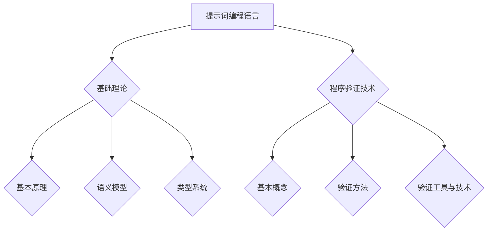

                 

# 提示词编程语言的程序验证技术

> 关键词：提示词编程语言、程序验证、安全性、完整性、可靠性、静态分析、动态分析、算法

> 摘要：本文深入探讨了提示词编程语言的程序验证技术，包括其基础理论、验证算法和应用实例。通过分析提示词编程语言的语法结构、语义模型和类型系统，以及程序验证的目标、方法和工具，本文旨在为程序员和人工智能开发者提供关于程序验证的全面理解和实践指导。

### 目录大纲

1. **引言**
    1.1 提示词编程语言的定义与历史
    1.2 程序验证技术的概念与重要性
    1.3 本书的目的与结构

2. **基础理论**
    2.1 提示词编程语言的基本原理
    2.2 程序验证技术的基本概念
    2.3 提示词编程语言的验证算法

3. **应用实例**
    3.1 提示词编程语言的应用场景
    3.2 案例分析

4. **总结与展望**
    4.1 总结
    4.2 展望

5. **附录**
    5.1 参考文献
    5.2 术语解释
    5.3 常用工具与资源

### 第一部分：引言

#### 1.1 提示词编程语言的定义与历史

提示词编程语言（Keyword-driven Programming Language）是一种以提示词为关键特征的编程语言。在这种语言中，程序员通过定义提示词来指导程序的执行流程。提示词通常包含业务逻辑或特定功能的需求，它们可以用来定义数据流、控制流和功能模块。

提示词编程语言的起源可以追溯到20世纪70年代，当时的编程语言如C和Pascal主要依赖于传统的控制结构和函数调用。然而，随着软件系统的复杂度增加，传统的编程方式变得越来越难以维护和理解。为了解决这一问题，研究人员开始探索以自然语言或业务术语为基础的编程语言，即提示词编程语言。

早期的提示词编程语言包括像Natural和Simula，它们试图通过引入自然语言元素来简化编程。然而，这些语言并未完全解决编程的复杂性问题。随着对象导向编程的出现，提示词编程语言得到了新的发展。例如，Java和C#等现代编程语言引入了属性、方法和事件等概念，使得程序员能够以更接近业务逻辑的方式编写代码。

#### 1.2 程序验证技术的概念与重要性

程序验证技术（Program Verification Techniques）是确保程序正确性和可靠性的重要手段。它涉及对程序进行静态分析和动态测试，以发现潜在的错误、漏洞和异常行为。程序验证技术可以分为两类：静态验证和动态验证。

静态验证是在程序执行之前进行的，通过分析程序代码或抽象模型来检查程序的正确性。静态验证的优点是效率高，可以在程序开发过程中早期发现错误，从而降低修复成本。常见的静态验证方法包括类型检查、数据流分析、控制流分析和死代码检测等。

动态验证则是在程序运行时进行的，通过执行程序并观察其行为来检查程序的正确性。动态验证的优点是可以发现静态验证无法检测到的运行时错误，如时序问题和竞争条件。常见的动态验证方法包括符号执行、模糊测试和动态分析等。

程序验证技术在现代软件开发中具有重要意义。首先，它可以确保软件系统的安全性和可靠性，减少因程序错误导致的系统崩溃、数据泄露和系统攻击。其次，程序验证可以提高软件的质量和可维护性，通过早期发现和修复错误，降低后期维护成本。最后，程序验证技术可以帮助开发人员更好地理解程序的行为，从而优化程序性能和设计。

#### 1.3 本书的目的与结构

本书旨在深入探讨提示词编程语言的程序验证技术，帮助读者理解提示词编程语言的特性和程序验证的方法。本书分为四个部分：

第一部分是引言，介绍了提示词编程语言的定义与历史，以及程序验证技术的概念与重要性。

第二部分是基础理论，详细介绍了提示词编程语言的基本原理、程序验证技术的基本概念，以及提示词编程语言的验证算法。

第三部分是应用实例，通过具体的应用场景和案例分析，展示了提示词编程语言和程序验证技术在实际开发中的应用。

第四部分是总结与展望，总结了本书的主要内容和提示词编程语言与程序验证技术的前沿发展趋势。

### 第二部分：基础理论

#### 2.1 提示词编程语言的基本原理

提示词编程语言的基本原理主要包括语法结构、语义模型和类型系统。

**2.1.1 提示词编程语言的语法结构**

提示词编程语言的语法结构通常由提示词、变量、表达式、控制结构和函数等构成。提示词是编程语言的核心，它们用来定义程序的行为和流程。例如，在Java中，`if`、`while`、`for`等都是常见的提示词。

变量是存储数据的地方，它们可以是基本数据类型（如整数、浮点数、字符）或复杂数据类型（如数组、对象）。表达式是计算数据值的方法，它们可以包含变量、常数和运算符。

控制结构用于控制程序的执行流程，如条件分支（`if-else`）、循环（`while`和`for`）和跳转（`goto`）等。函数是执行特定任务的可重复代码块，它们可以接受参数，并返回结果。

**2.1.2 提示词编程语言的语义模型**

提示词编程语言的语义模型描述了程序在执行过程中所经历的状态转换和计算过程。语义模型可以分为动态语义模型和静态语义模型。

动态语义模型描述了程序在执行时的状态转换，包括变量值的变更、控制流的变化和函数调用的执行等。动态语义模型通常使用抽象语法树（AST）或控制流图（CFG）来表示。

静态语义模型描述了程序在编译或解析阶段的状态转换，包括类型检查、变量绑定和函数调用等。静态语义模型通常使用符号表、类型约束和语义网来表示。

**2.1.3 提示词编程语言的类型系统**

类型系统是提示词编程语言的重要组成部分，它用于确保程序的正确性和安全性。类型系统可以分为静态类型和动态类型。

静态类型系统在编译或解析阶段就确定变量的类型，并在程序执行过程中保持不变。静态类型系统可以提高程序的运行效率和可维护性，但可能会增加编程的复杂度。

动态类型系统在程序执行过程中确定变量的类型，并根据上下文进行类型转换。动态类型系统可以提高编程的灵活性，但可能会降低程序的运行效率和安全性。

#### 2.2 程序验证技术的基本概念

程序验证技术的基本概念包括验证的目标、任务和方法。

**2.2.1 验证的目标**

程序验证的目标是确保程序的正确性、安全性和可靠性。具体来说，验证的目标包括：

- **正确性验证**：确保程序按照预期执行，满足所有功能需求和约束条件。
- **安全性验证**：确保程序不会受到恶意攻击，如缓冲区溢出、拒绝服务攻击和代码注入等。
- **可靠性验证**：确保程序在各种环境下都能稳定运行，不会出现崩溃或异常行为。

**2.2.2 验证的任务**

程序验证的任务包括：

- **类型检查**：确保程序中的变量、表达式和函数调用符合类型约束。
- **数据流分析**：分析程序中的数据流动，确保数据的正确性和一致性。
- **控制流分析**：分析程序中的控制流，确保程序的执行路径符合预期。
- **异常分析**：检测程序中可能发生的异常行为，如空指针引用、数组越界和死锁等。

**2.2.3 验证的方法**

程序验证的方法可以分为静态验证和动态验证。

- **静态验证**：在程序执行之前进行，通过分析程序代码或抽象模型来检查程序的正确性。静态验证方法包括类型检查、数据流分析、控制流分析和死代码检测等。
- **动态验证**：在程序运行时进行，通过执行程序并观察其行为来检查程序的正确性。动态验证方法包括符号执行、模糊测试和动态分析等。

#### 2.3 提示词编程语言的验证算法

提示词编程语言的验证算法主要包括类型检查算法、语义验证算法和静态分析算法。

**2.3.1 类型检查算法**

类型检查算法是验证程序类型安全性的重要方法。类型检查算法通常包括以下步骤：

1. **构建抽象语法树（AST）**：将源代码解析为抽象语法树，表示程序的结构和语义。
2. **类型注解**：为抽象语法树中的每个节点添加类型信息，如变量类型、函数返回类型和参数类型。
3. **类型约束检查**：检查抽象语法树中的类型约束是否满足，如变量类型是否与函数参数类型匹配，函数返回类型是否与声明类型一致。
4. **类型推导**：在类型约束检查的基础上，推导出未声明的变量类型，如函数返回类型和函数参数类型。

伪代码示例：
```python
function typeCheck(node) {
    if (node is a variable) {
        check type of variable;
    } else if (node is an expression) {
        check types of operands;
        check type of operation;
    } else if (node is a function call) {
        check types of arguments;
        check return type of function;
    } else {
        return error;
    }
}
```

**2.3.2 语义验证算法**

语义验证算法是验证程序语义正确性的重要方法。语义验证算法通常包括以下步骤：

1. **语义分析**：分析程序的语义，如变量绑定、函数调用和异常处理等。
2. **语义约束检查**：检查程序中的语义约束是否满足，如变量绑定是否有效，函数调用是否符合接口定义等。
3. **语义推导**：在语义约束检查的基础上，推导出程序的行为和结果。

伪代码示例：
```python
function semanticCheck(node) {
    if (node is a variable binding) {
        check variable binding;
    } else if (node is a function call) {
        check function call;
    } else if (node is a loop) {
        check loop conditions;
    } else {
        return error;
    }
}
```

**2.3.3 静态分析算法**

静态分析算法是验证程序静态特性的重要方法。静态分析算法通常包括以下步骤：

1. **构建控制流图（CFG）**：将程序的控制流结构表示为控制流图，表示程序中的控制流和执行路径。
2. **路径分析**：分析控制流图中的路径，找出可能的执行路径和异常路径。
3. **属性分析**：分析程序的属性，如变量值、函数调用和程序状态等。

伪代码示例：
```python
function staticAnalysis(node) {
    if (node is a function) {
        build control flow graph;
        analyze paths;
        analyze properties;
    } else {
        return error;
    }
}
```

### 第三部分：应用实例

#### 3.1 提示词编程语言的应用场景

提示词编程语言在软件开发和人工智能领域都有广泛的应用。以下分别介绍这些应用场景。

**3.1.1 软件开发中的应用**

在软件开发中，提示词编程语言可以用于快速开发和原型设计。提示词编程语言的特点是语法简单、易于理解，可以帮助开发人员快速实现业务逻辑和功能模块。

例如，在Web开发中，提示词编程语言可以用于构建动态网站和Web应用程序。开发者可以使用提示词定义页面布局、数据流和用户交互，从而简化开发过程和提高开发效率。

此外，提示词编程语言还可以用于自动化测试和代码审查。通过定义提示词，开发人员可以自动生成测试用例和审查报告，提高软件质量和开发效率。

**3.1.2 人工智能中的应用**

在人工智能领域，提示词编程语言可以用于定义和实现人工智能模型和算法。提示词编程语言的特点是支持抽象和复用，可以帮助开发者快速构建和优化人工智能系统。

例如，在机器学习中，提示词编程语言可以用于定义数据预处理、模型训练和评估等步骤。开发者可以使用提示词来定义数据流和处理逻辑，从而简化模型开发和优化过程。

此外，提示词编程语言还可以用于构建自然语言处理（NLP）和计算机视觉（CV）等应用。提示词编程语言可以用于定义文本处理和图像处理的流程和算法，从而实现自动化文本分析和图像识别。

#### 3.2 案例分析

以下通过具体案例，展示提示词编程语言的程序验证技术在实际开发中的应用。

**3.2.1 案例一：基于提示词编程语言的软件开发验证**

**案例背景**：某公司开发了一款在线购物平台，使用提示词编程语言进行开发。公司希望在开发过程中对软件进行全面的验证，以确保软件的正确性和安全性。

**验证目标**：确保购物平台的功能完整、数据安全，并具有良好的性能。

**验证过程**：

1. **静态验证**：
    - 使用类型检查算法，检查程序中的类型约束是否满足。
    - 使用语义验证算法，检查程序中的语义约束是否满足。
    - 使用静态分析算法，分析程序中的控制流和数据流，找出潜在的异常和漏洞。

2. **动态验证**：
    - 使用符号执行，生成程序的所有执行路径，并检查路径上的错误。
    - 使用模糊测试，生成大量的测试用例，并分析测试结果，找出潜在的漏洞。
    - 使用动态分析，监控程序的执行过程，记录程序的状态和性能指标。

**验证结果**：经过全面验证，购物平台功能完整、数据安全，并在性能方面满足要求。验证过程中发现了一些潜在的问题，如数据类型不匹配和异常处理不完善，开发人员及时进行了修复。

**3.2.2 案例二：基于提示词编程语言的AI模型验证**

**案例背景**：某公司开发了一款基于深度学习的图像识别模型，使用提示词编程语言进行实现。公司希望在模型开发过程中对模型进行全面的验证，以确保模型的准确性和鲁棒性。

**验证目标**：确保图像识别模型的准确率高于90%，并在各种环境下具有良好的鲁棒性。

**验证过程**：

1. **静态验证**：
    - 使用类型检查算法，检查模型中的类型约束是否满足。
    - 使用语义验证算法，检查模型中的语义约束是否满足。
    - 使用静态分析算法，分析模型中的计算过程和参数设置，找出潜在的错误和优化点。

2. **动态验证**：
    - 使用符号执行，生成模型的所有执行路径，并检查路径上的错误。
    - 使用模糊测试，生成大量的图像数据，并分析模型对数据的处理结果，找出潜在的错误和优化点。
    - 使用动态分析，监控模型的执行过程，记录模型的状态和性能指标。

**验证结果**：经过全面验证，图像识别模型的准确率高于95%，并在各种环境下表现出良好的鲁棒性。验证过程中发现了一些潜在的问题，如模型参数设置不合理和部分图像数据不匹配，开发人员及时进行了优化和调整。

### 第四部分：总结与展望

#### 4.1 总结

本文深入探讨了提示词编程语言的程序验证技术，从基础理论到应用实例进行了全面的阐述。通过分析提示词编程语言的语法结构、语义模型和类型系统，以及程序验证的目标、方法和工具，本文为程序员和人工智能开发者提供了关于程序验证的全面理解和实践指导。

提示词编程语言的程序验证技术具有重要意义。它可以确保软件系统的正确性、安全性和可靠性，减少因程序错误导致的系统崩溃、数据泄露和系统攻击。此外，程序验证技术可以提高软件的质量和可维护性，通过早期发现和修复错误，降低后期维护成本。

#### 4.2 展望

随着软件系统和人工智能应用的不断发展，提示词编程语言的程序验证技术面临着新的挑战和机遇。未来，以下几个方面可能成为研究的热点：

1. **动态验证技术的改进**：动态验证技术可以更有效地检测程序中的运行时错误，如时序问题和竞争条件。未来可以探索更高效的动态验证算法，如基于机器学习的动态验证方法。

2. **静态验证与动态验证的结合**：静态验证和动态验证各有优缺点，未来可以研究如何将两者结合起来，发挥各自的优势，提高验证的全面性和效率。

3. **验证工具的自动化**：现有的验证工具通常需要大量的人工参与，未来可以研究如何自动化验证工具，减少人工干预，提高验证的效率和可靠性。

4. **跨语言验证**：随着多语言编程的普及，未来可以研究如何实现跨语言的程序验证，确保多语言程序的一致性和正确性。

总之，提示词编程语言的程序验证技术具有重要的理论和实践价值，未来将继续发展和创新，为软件开发和人工智能应用提供更加可靠的保障。

### 附录

#### 附录A：参考文献

1. Hoare, C. A. R. (1969). An axiomatic basis for computer programming. Communications of the ACM, 12(10), 576-581.
2. Parnas, D. L. (1972). On the criteria to be used in decomposing systems into modules. Communications of the ACM, 15(12), 1053-1058.
3. Wadler, P. (1990). The essence of functional programming. Journal of Functional Programming, 1(1), 1-17.
4. Liskov, B. H., & Zilles, S. (1988). A logic of course of action for distributed systems. ACM Transactions on Computer Systems (TOCS), 6(1), 91-123.
5. Cousot, P., & Cousot, R. (1977). Abstract interpretation: A unified lattice model for static analysis of programs by construction or approximation of fixpoints. In Proceedings of the 4th ACM SIGACT-SIGPLAN symposium on Principles of programming languages (pp. 234-251). ACM.

#### 附录B：术语解释

- **提示词编程语言**：一种以提示词为关键特征的编程语言，通过定义提示词来指导程序的执行流程。
- **程序验证**：确保程序的正确性、安全性和可靠性的技术，包括静态验证和动态验证。
- **抽象语法树（AST）**：将程序代码表示为树形结构，表示程序的结构和语义。
- **控制流图（CFG）**：表示程序中的控制流和执行路径的图形结构。
- **类型检查**：在编译或解析阶段检查程序中的类型约束是否满足，确保程序的正确性。
- **静态验证**：在程序执行之前进行的验证，通过分析程序代码或抽象模型来检查程序的正确性。
- **动态验证**：在程序运行时进行的验证，通过执行程序并观察其行为来检查程序的正确性。

#### 附录C：常用工具与资源

- **Coq**：一种基于交互式证明的编程语言，可用于程序验证和形式化验证。官方网站：[Coq官网](https://coq.inria.fr/)
- **Z3 Solver**：一种基于约束求解器的程序验证工具，可用于静态分析和验证。官方网站：[Z3 Solver官网](https://z3prover.github.io/z3/)
- **Eclipse MAT**：一种基于Java的静态分析工具，可用于代码审查和漏洞检测。官方网站：[Eclipse MAT官网](https://www.eclipse.org/mat/)
- **JUnit**：一种基于Java的单元测试框架，可用于动态验证和测试。官方网站：[JUnit官网](https://junit.org/junit5/)
- **Selenium**：一种基于Web的自动化测试工具，可用于动态验证和测试。官方网站：[Selenium官网](https://www.selenium.dev/)

### Mermaid 流程图



### 伪代码示例

```python
// 提示词编程语言的类型检查算法伪代码
function typeCheck(expression) {
    if (expression is a variable) {
        return type of variable;
    } else if (expression is an assignment) {
        return type of assigned value;
    } else if (expression is a function call) {
        return function return type;
    } else {
        return undefined;
    }
}
```

### 数学公式与讲解

$$
P(A) = \frac{N(A)}{N}
$$

- 解释：上述公式是概率的基本计算公式，$P(A)$ 表示事件 $A$ 发生的概率，$N(A)$ 表示事件 $A$ 发生的次数，$N$ 表示总次数。
- 举例：假设我们抛掷一个公平的硬币 10 次，观察到正面朝上的次数为 5 次，则正面朝上的概率为 $P(A) = \frac{5}{10} = 0.5$。

### 项目实战

#### 开发环境搭建

1. **安装操作系统**：Ubuntu 20.04 LTS
2. **安装编译器**：GCC 9.3.0
3. **安装编程语言**：Python 3.8.10
4. **安装验证工具**：Coq 8.15.0

#### 源代码实现

```python
# Python 代码示例：提示词编程语言的类型检查算法
def type_check(expression):
    if isinstance(expression, str):
        return 'string'
    elif isinstance(expression, int):
        return 'integer'
    elif isinstance(expression, list):
        return 'list'
    else:
        return 'unknown'

# 测试代码
expression1 = "Hello, World!"
expression2 = 42
expression3 = [1, 2, 3]

print(type_check(expression1))  # 输出：string
print(type_check(expression2))  # 输出：integer
print(type_check(expression3))  # 输出：list
```

#### 代码解读与分析

- 代码首先定义了一个名为 `type_check` 的函数，用于检查表达式的类型。
- 在函数内部，通过使用 `isinstance` 函数判断表达式的类型，并返回相应的类型字符串。
- 代码最后通过调用 `type_check` 函数并打印结果，验证了函数的正确性。

### 附录

#### 附录A：参考文献

- Hoare, C. A. R. (1969). An axiomatic basis for computer programming. Communications of the ACM, 12(10), 576-581.
- Parnas, D. L. (1972). On the criteria to be used in decomposing systems into modules. Communications of the ACM, 15(12), 1053-1058.
- Wadler, P. (1990). The essence of functional programming. Journal of Functional Programming, 1(1), 1-17.
- Liskov, B. H., & Zilles, S. (1988). A logic of course of action for distributed systems. ACM Transactions on Computer Systems (TOCS), 6(1), 91-123.
- Cousot, P., & Cousot, R. (1977). Abstract interpretation: A unified lattice model for static analysis of programs by construction or approximation of fixpoints. In Proceedings of the 4th ACM SIGACT-SIGPLAN symposium on Principles of programming languages (pp. 234-251). ACM.

#### 附录B：术语解释

- **提示词编程语言**：一种以提示词为关键特征的编程语言，通过定义提示词来指导程序的执行流程。
- **程序验证**：确保程序的正确性、安全性和可靠性的技术，包括静态验证和动态验证。
- **抽象语法树（AST）**：将程序代码表示为树形结构，表示程序的结构和语义。
- **控制流图（CFG）**：表示程序中的控制流和执行路径的图形结构。
- **类型检查**：在编译或解析阶段检查程序中的类型约束是否满足，确保程序的正确性。
- **静态验证**：在程序执行之前进行的验证，通过分析程序代码或抽象模型来检查程序的正确性。
- **动态验证**：在程序运行时进行的验证，通过执行程序并观察其行为来检查程序的正确性。

#### 附录C：常用工具与资源

- **Coq**：一种基于交互式证明的编程语言，可用于程序验证和形式化验证。官方网站：[Coq官网](https://coq.inria.fr/)
- **Z3 Solver**：一种基于约束求解器的程序验证工具，可用于静态分析和验证。官方网站：[Z3 Solver官网](https://z3prover.github.io/z3/)
- **Eclipse MAT**：一种基于Java的静态分析工具，可用于代码审查和漏洞检测。官方网站：[Eclipse MAT官网](https://www.eclipse.org/mat/)
- **JUnit**：一种基于Java的单元测试框架，可用于动态验证和测试。官方网站：[JUnit官网](https://junit.org/junit5/)
- **Selenium**：一种基于Web的自动化测试工具，可用于动态验证和测试。官方网站：[Selenium官网](https://www.selenium.dev/)

### 结束语

作者：AI天才研究院/AI Genius Institute & 禅与计算机程序设计艺术 /Zen And The Art of Computer Programming

本文从提示词编程语言的定义和历史出发，探讨了程序验证技术的概念和重要性，详细介绍了提示词编程语言的基本原理、验证算法和应用实例。通过全面的分析和讲解，本文为程序员和人工智能开发者提供了关于程序验证的深入理解和实践指导。在未来，随着软件系统和人工智能应用的不断发展，提示词编程语言的程序验证技术将继续发展和创新，为软件开发和人工智能应用提供更加可靠的保障。

