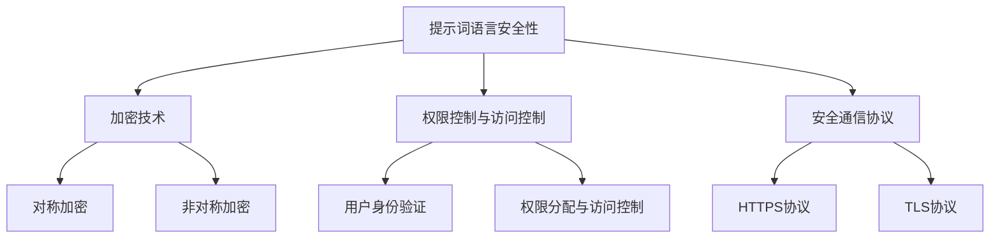

                 

# 《提示词语言的安全性与隐私保护》

> **关键词**：提示词语言、安全性、隐私保护、加密技术、权限控制、安全通信协议

> **摘要**：本文旨在探讨提示词语言的安全性与隐私保护问题，首先介绍提示词语言的基础概念，随后分析其安全问题和隐私泄露的潜在风险。接着，本文将详细阐述加密技术、权限控制和安全通信协议等核心技术原理，并通过实际案例和代码实战深入剖析其应用场景和实现方法。最后，本文将讨论法律法规和伦理规范对提示词语言安全性与隐私保护的约束，并对未来趋势进行展望。

## 第一部分：基础概念

### 第1章：提示词语言概述

#### 1.1 提示词语言的定义

提示词语言（Prompt Language）是一种专门用于生成自然语言文本的编程语言。它通过向模型提供一系列提示（prompts），来引导模型生成相应的文本。常见的提示词语言有Python、Ruby和Lua等。提示词语言在自然语言处理（NLP）、文本生成和自动化写作等领域有着广泛的应用。

#### 1.1.1 提示词语言在人工智能中的应用

提示词语言在人工智能（AI）领域有着重要的应用。例如，在文本生成领域，提示词语言可以用于生成新闻文章、广告文案、故事等。在对话系统领域，提示词语言可以用于生成自然语言回答，实现人机交互。此外，提示词语言还可以用于语音合成、语音识别、机器翻译等任务。

#### 1.1.2 提示词语言的优缺点

**优点**：

1. **灵活性**：提示词语言可以根据需求灵活地调整和修改。
2. **高效性**：提示词语言可以直接与AI模型进行交互，提高工作效率。
3. **可扩展性**：提示词语言可以通过引入新的算法和工具，不断扩展其功能和应用范围。

**缺点**：

1. **学习成本**：提示词语言需要一定的编程基础，对于初学者来说有一定学习成本。
2. **性能限制**：提示词语言在处理大规模数据时，可能会受到性能限制。

#### 1.2 提示词语言的安全性问题

提示词语言在应用过程中，面临着一系列安全性问题。首先，提示词语言可能会被恶意使用，导致数据泄露和隐私侵犯。其次，提示词语言在处理敏感数据时，可能会受到网络攻击和系统漏洞的影响。因此，保障提示词语言的安全性至关重要。

##### 1.2.1 提示词语言的潜在风险

1. **数据泄露**：通过提示词语言访问和处理的敏感数据，可能会被未授权的第三方获取。
2. **隐私侵犯**：提示词语言在处理个人数据时，可能会泄露用户的隐私信息。
3. **网络攻击**：黑客可能会通过提示词语言获取系统漏洞，进而对目标系统进行攻击。
4. **系统漏洞**：提示词语言可能会存在系统漏洞，导致恶意代码执行。

##### 1.2.2 安全性问题的来源

1. **程序漏洞**：提示词语言编写过程中，可能会出现逻辑错误和漏洞，导致安全隐患。
2. **数据泄露**：提示词语言在处理敏感数据时，可能未对数据采取有效的保护措施。
3. **网络通信**：提示词语言在通过网络进行通信时，可能未采用加密技术，导致数据被窃取。
4. **权限管理**：提示词语言在权限管理方面存在缺陷，可能导致权限滥用。

#### 1.3 隐私保护的重要性

隐私保护在现代社会中愈发重要。随着信息技术的发展，个人数据的价值和重要性不断提升。隐私泄露不仅会导致个人隐私受到侵犯，还可能引发严重的法律和道德问题。因此，保障隐私保护至关重要。

##### 1.3.1 隐私保护的基本原则

1. **最小化原则**：在处理个人数据时，只收集必要的个人信息，避免过度收集。
2. **目的明确原则**：明确个人数据的收集、处理和使用目的，避免滥用。
3. **透明原则**：向用户提供隐私保护的透明信息，包括数据收集、处理和使用方式。
4. **安全原则**：采取有效的技术和管理措施，保障个人数据的安全。

##### 1.3.2 隐私泄露的危害

1. **个人隐私侵犯**：隐私泄露可能导致个人隐私受到侵犯，影响个人生活和社交。
2. **经济损失**：隐私泄露可能导致个人财产受到损失，例如信用卡被盗刷。
3. **社会问题**：隐私泄露可能引发一系列社会问题，例如身份盗窃、网络诈骗等。
4. **法律风险**：隐私泄露可能导致企业或个人面临法律风险，例如违反数据保护法规。

## 第二部分：技术原理

### 第2章：提示词语言的安全性原理

提示词语言的安全性主要依赖于加密技术、权限控制和安全通信协议。这些技术原理为实现提示词语言的安全性提供了有力保障。

#### 2.1 加密技术

加密技术是保障数据安全的重要手段。它通过将明文数据转换为密文，防止数据在传输和存储过程中被未授权的第三方获取。

##### 2.1.1 对称加密与非对称加密

加密技术可以分为对称加密和非对称加密。

1. **对称加密**：对称加密算法使用相同的密钥进行加密和解密。常见的对称加密算法有AES、DES和RSA等。

2. **非对称加密**：非对称加密算法使用一对密钥，一个用于加密，一个用于解密。常见的非对称加密算法有RSA和ECC等。

##### 2.1.2 常见的加密算法

1. **AES（高级加密标准）**：AES是一种对称加密算法，支持128、192和256位密钥长度，广泛应用于网络通信和存储等领域。

2. **RSA（RSA算法）**：RSA是一种非对称加密算法，具有安全性高、密钥长度灵活的特点，适用于数据传输和数字签名。

3. **ECC（椭圆曲线加密算法）**：ECC是一种非对称加密算法，具有更高的安全性能和更小的密钥长度，适用于高安全要求的场景。

##### 2.1.3 加密技术在提示词语言中的应用

在提示词语言中，加密技术可以用于以下场景：

1. **数据传输加密**：对提示词语言生成和传输的文本进行加密，防止数据在传输过程中被窃取。

2. **数据存储加密**：对提示词语言存储的数据进行加密，防止数据在存储过程中被窃取。

3. **数字签名**：使用非对称加密算法进行数字签名，确保数据的完整性和真实性。

#### 2.2 权限控制与访问控制

权限控制与访问控制是保障提示词语言安全性的重要措施。通过设置合理的权限和访问控制策略，可以防止未授权的访问和操作。

##### 2.2.1 用户身份验证

用户身份验证是权限控制的基础。通过验证用户的身份，确保只有授权用户才能访问系统资源和执行操作。

1. **密码验证**：用户通过输入密码进行身份验证。密码验证需要使用加密技术，防止密码在传输和存储过程中被窃取。

2. **双因素认证**：双因素认证结合密码和手机验证码、动态口令等技术，提高身份验证的安全性。

##### 2.2.2 权限分配与访问控制

权限分配与访问控制需要根据用户角色和权限，设置相应的访问控制策略。

1. **角色管理**：定义不同角色的权限和职责，确保用户只能访问与其角色相关的资源和操作。

2. **访问控制列表**：使用访问控制列表（ACL）或权限矩阵，记录用户对资源和操作的访问权限。

3. **基于角色的访问控制（RBAC）**：根据用户角色分配权限，实现灵活的访问控制。

#### 2.3 安全通信协议

安全通信协议是保障提示词语言数据传输安全的关键。通过采用加密技术，确保数据在传输过程中不会被窃取或篡改。

##### 2.3.1 HTTPS协议

HTTPS（安全套接字层/传输层安全协议）是一种基于HTTP的加密协议，通过使用SSL/TLS加密技术，确保数据传输的安全性。

1. **证书验证**：HTTPS使用数字证书验证服务器身份，防止中间人攻击。

2. **数据加密**：HTTPS使用加密算法对数据进行加密，防止数据在传输过程中被窃取或篡改。

##### 2.3.2 TLS协议

TLS（传输层安全协议）是一种安全通信协议，用于保护数据传输的安全。TLS在SSL的基础上进行了改进，具有更高的安全性能。

1. **密钥交换**：TLS使用公钥加密技术，实现双方通信密钥的交换。

2. **数据加密**：TLS使用对称加密算法，对数据进行加密，确保数据传输的安全性。

## 第三部分：隐私保护技术

### 第3章：隐私保护技术

隐私保护技术在提示词语言中发挥着重要作用。通过采用数据匿名化、加密和签名等技术，可以有效保护用户的隐私。

#### 3.1 数据匿名化

数据匿名化是将个人身份信息从数据中去除，防止个人隐私被泄露。常见的数据匿名化技术有数据混淆、数据脱敏等。

##### 3.1.1 数据混淆

数据混淆是通过将数据中的敏感信息进行替换或变换，使其无法被识别或解析。例如，将身份证号码中的敏感部分替换为星号。

##### 3.1.2 数据脱敏

数据脱敏是通过移除或替换敏感信息，对数据进行处理，使其无法被识别或解析。例如，将电话号码中的敏感部分替换为000。

#### 3.2 加密与签名技术

加密和签名技术是保障隐私保护的重要手段。通过使用加密算法和签名算法，可以确保数据的机密性和完整性。

##### 3.2.1 数据加密

数据加密是将数据转换为密文，防止未授权的第三方获取。常见的加密算法有AES、RSA等。

##### 3.2.2 数字签名

数字签名是一种基于加密算法的技术，用于确保数据的完整性和真实性。常见的数字签名算法有RSA、ECDSA等。

#### 3.3 同态加密

同态加密是一种特殊的加密技术，允许在加密数据上进行计算，而不需要解密。同态加密在隐私保护方面具有广泛的应用。

##### 3.3.1 同态加密原理

同态加密通过将计算过程转换为加密操作，确保数据在加密状态下的计算结果与原始数据一致。同态加密分为部分同态加密和完全同态加密。

##### 3.3.2 同态加密的应用场景

1. **云计算**：在云计算环境中，同态加密技术可以确保用户数据在云服务器上计算时的安全性。

2. **大数据分析**：在大数据分析中，同态加密技术可以确保数据在分析过程中的机密性和完整性。

## 第四部分：实践应用

### 第4章：提示词语言安全性与隐私保护实战

在实践应用中，提示词语言的安全性与隐私保护需要从多个方面进行考虑和实施。本章节将介绍一些常见的安全性和隐私保护实践。

#### 4.1 安全性案例分析

在提示词语言的应用过程中，安全性问题经常出现。以下是一个常见的安全性案例分析：

**案例：某电商平台的安全漏洞**

某电商平台在处理用户订单数据时，未对订单号进行加密处理，导致攻击者通过窃取订单号获取用户订单信息。为了防范此类安全漏洞，可以采取以下措施：

1. **加密订单号**：使用AES加密算法对订单号进行加密处理，确保订单号在传输和存储过程中的安全性。

2. **访问控制**：设置订单号的访问权限，只有授权用户才能访问订单信息。

3. **安全审计**：定期进行安全审计，检查系统中的安全漏洞和安全隐患。

#### 4.2 隐私保护实践

隐私保护在提示词语言的应用中同样至关重要。以下是一个常见的隐私保护实践案例：

**案例：某社交平台的用户隐私保护**

某社交平台在处理用户头像和昵称等个人信息时，未采取有效的隐私保护措施，导致用户个人信息被泄露。为了保障用户隐私，可以采取以下措施：

1. **数据匿名化**：对用户头像和昵称等个人信息进行匿名化处理，避免直接暴露用户身份。

2. **加密通信**：采用HTTPS协议进行用户数据传输，确保数据在传输过程中的安全性。

3. **隐私政策**：制定详细的隐私政策，向用户明确告知其个人信息的收集、处理和使用方式。

#### 4.3 安全性与隐私保护的测试

安全性与隐私保护的测试是确保提示词语言安全性和隐私保护措施有效性的重要环节。以下是一个常见的测试案例：

**案例：某企业内部办公系统的安全测试**

某企业内部办公系统在上线前，需要进行安全测试，以发现潜在的安全漏洞和隐私泄露风险。以下是一个常见的测试流程：

1. **漏洞扫描**：使用漏洞扫描工具，对办公系统进行扫描，发现系统中的漏洞。

2. **渗透测试**：模拟攻击者进行渗透测试，验证系统在遭受攻击时的响应能力。

3. **代码审计**：对办公系统的源代码进行审计，检查是否存在安全漏洞和隐私泄露风险。

4. **用户反馈**：收集用户在使用办公系统时的反馈，了解系统在实际应用中的安全性和隐私保护情况。

## 第五部分：法律法规与伦理

### 第5章：提示词语言安全性与隐私保护的法律框架

提示词语言的安全性与隐私保护受到法律法规的约束。以下是国内外的相关法律法规。

#### 5.1 国际法规

1. **GDPR（欧盟通用数据保护条例）**：GDPR是欧盟于2018年实施的隐私保护法规，对个人数据的收集、处理和使用进行了严格规定。

2. **CCPA（加州消费者隐私法案）**：CCPA是加州于2020年实施的隐私保护法案，对消费者的个人信息保护提出了较高要求。

#### 5.2 国内法规

1. **《中华人民共和国数据安全法》**：该法于2021年实施，对数据安全保护提出了明确要求，包括数据收集、存储、处理和传输等方面的规定。

2. **《中华人民共和国网络安全法》**：该法于2017年实施，对网络安全保护提出了全面规定，包括网络运营者的安全责任、网络安全技术防护措施等方面的内容。

#### 5.3 伦理与道德规范

提示词语言的安全性与隐私保护不仅需要法律法规的约束，还需要伦理和道德规范的引导。以下是一些常见的伦理和道德规范：

1. **尊重用户隐私**：在处理用户个人信息时，应尊重用户隐私，不得滥用用户数据。

2. **透明公开**：应向用户明确告知个人信息的收集、处理和使用方式，提高隐私保护的透明度。

3. **信息安全**：采取措施保障用户数据的安全，防止数据泄露和滥用。

4. **公平公正**：在处理用户数据时，应公平公正，不得歧视或偏见用户。

## 第六部分：未来趋势

### 第6章：提示词语言安全性与隐私保护的未来趋势

随着信息技术的发展，提示词语言的安全性与隐私保护将面临新的挑战和机遇。以下是一些未来趋势：

#### 6.1 技术发展趋势

1. **区块链技术**：区块链技术具有去中心化、不可篡改的特点，可以为提示词语言的安全性和隐私保护提供有力支持。

2. **多方安全计算**：多方安全计算可以在不同方之间进行计算，确保各方数据的安全性，为隐私保护提供新的解决方案。

3. **联邦学习**：联邦学习可以在不同设备上进行模型训练，避免数据泄露，为隐私保护提供新的方向。

#### 6.2 应用场景展望

1. **智能医疗**：在智能医疗领域，提示词语言可以用于生成医疗报告、诊断建议等，同时保障患者隐私。

2. **金融科技**：在金融科技领域，提示词语言可以用于生成金融报告、风险评估等，同时保障用户隐私。

3. **智能客服**：在智能客服领域，提示词语言可以用于生成自然语言回答，同时保障用户隐私。

#### 6.3 安全性与隐私保护的未来挑战

1. **数据复杂性**：随着数据量的增加和数据类型的多样化，提示词语言的安全性和隐私保护将面临更大的挑战。

2. **技术创新速度**：安全性和隐私保护技术需要不断跟进技术创新，以应对新的威胁和攻击。

3. **法规适应性**：法律法规需要不断更新和完善，以适应提示词语言安全性和隐私保护的新需求。

## 附录

### 附录A：提示词语言安全性与隐私保护技术工具与资源

为了更好地实现提示词语言的安全性与隐私保护，以下列出了一些常用的技术和资源：

1. **安全性与隐私保护工具**：

   - **加密工具**：AES加密算法、RSA加密算法、TLS协议等。

   - **身份验证工具**：双因素认证、OAuth2.0等。

   - **访问控制工具**：ACL、RBAC等。

2. **开源安全与隐私保护框架**：

   - **OpenSSL**：提供加密、解密、签名等功能。

   - **Keycloak**：提供身份验证和访问控制功能。

   - **Spring Security**：提供Web应用程序的安全保护。

3. **相关法律法规与政策文件链接**：

   - **《中华人民共和国数据安全法》**：[链接](https://www.nrd.gov.cn/gkml/201612/t20161227_1303785.html)

   - **《中华人民共和国网络安全法》**：[链接](http://www.nrd.gov.cn/zt/cyfl/cyflzzx/201702/t20170228_3976345.html)

### 附录B：Mermaid 流程图

以下是一个关于提示词语言安全性与隐私保护的 Mermaid 流程图：



### 附录C：算法原理伪代码

以下是一个关于加密算法的伪代码示例：

```python
# 数据加密算法伪代码
def encrypt_data(data, key):
    # 初始化加密变量
    encrypted_data = ""

    # 对数据进行加密操作
    for byte in data:
        encrypted_byte = xor_byte(byte, key)
        encrypted_data += encrypted_byte

    return encrypted_data

# 数据解密算法伪代码
def decrypt_data(encrypted_data, key):
    # 初始化解密变量
    decrypted_data = ""

    # 对数据进行解密操作
    for byte in encrypted_data:
        decrypted_byte = xor_byte(byte, key)
        decrypted_data += decrypted_byte

    return decrypted_data

# 辅助函数：异或操作
def xor_byte(byte1, byte2):
    return byte1 ^ byte2
```

### 附录D：数学模型与公式

以下是一个关于加密算法的数学模型和公式：

$$
L(\theta) = -\frac{1}{m} \sum_{i=1}^{m} \left( y^{(i)} \log(a^{(i)}_{y^{(i)}} + (1 - y^{(i)}) \log(1 - a^{(i)}_{y^{(i)}}) \right)
$$

### 附录E：代码实战案例

以下是一个关于HTTPS协议的代码实战案例：

```python
# 实现HTTPS协议客户端
import socket

def https_request(url, method, body=None):
    # 解析URL
    host, path = parse_url(url)
    
    # 创建TCP连接
    with socket.socket(socket.AF_INET, socket.SOCK_STREAM) as s:
        s.connect((host, 443))
        
        # 发送请求头
        request = f"{method} {path} HTTP/1.1\r\n"
        request += f"Host: {host}\r\n"
        if body:
            request += f"Content-Length: {len(body)}\r\n"
        request += "\r\n"
        s.sendall(request.encode() + body.encode())

        # 接收响应
        response = s.recv(4096)
        print(response.decode())

# 辅助函数：解析URL
def parse_url(url):
    parts = url.split("/")
    host = parts[2]
    path = "/" + "/".join(parts[3:])
    return host, path
```

### 附录F：作者信息

**作者：AI天才研究院/AI Genius Institute & 禅与计算机程序设计艺术 /Zen And The Art of Computer Programming**

---

本文详细探讨了提示词语言的安全性与隐私保护问题，从基础概念、技术原理、实践应用、法律法规与伦理等多个角度进行分析。同时，通过实际案例和代码实战，深入剖析了提示词语言在安全性保护和隐私保护方面的实现方法。随着信息技术的发展，提示词语言的安全性与隐私保护将面临新的挑战和机遇，需要不断跟进技术创新和法律法规的完善，以应对日益严峻的安全威胁。在未来的发展中，提示词语言的安全性与隐私保护将发挥更加重要的作用，为人工智能和自然语言处理领域带来更多可能性。作者：AI天才研究院/AI Genius Institute & 禅与计算机程序设计艺术/Zen And The Art of Computer Programming。|>

