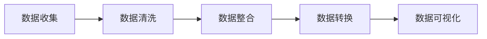
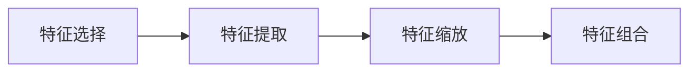
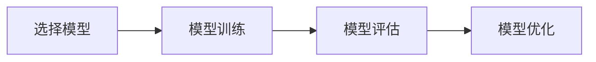

                 

### 引言

#### 1.1 数字化洞察力望远镜制造商概述

在数字化时代的浪潮中，"数字化洞察力望远镜制造商"这一概念逐渐成为企业竞争的关键因素。这一术语源自于一种将人工智能（AI）与数据分析技术相结合，从而开发出具备高度洞察力的工具和系统的企业。这些工具和系统不仅能够帮助企业更深入地理解市场趋势、客户需求以及运营数据，还能预测未来的发展方向，从而做出更为明智的决策。

"数字化洞察力望远镜制造商"的主要任务是构建和优化能够自动从大量数据中提取有价值信息的工具。这些工具利用机器学习和深度学习算法，通过对历史数据和实时数据的分析，为企业提供实时的洞察力和预测能力。例如，一个成功的数字化洞察力望远镜制造商可以开发出能够自动识别市场机会、预测销售趋势、检测欺诈行为以及优化供应链管理的工具。

#### 1.2 AI在远见卓识工具开发中的应用

人工智能（AI）作为数字化洞察力的核心驱动力，已经在各个行业中得到广泛应用。在远见卓识工具开发中，AI的主要应用包括但不限于以下几个方面：

1. **预测分析**：利用机器学习算法，AI工具可以预测市场趋势、用户行为和未来事件。例如，零售企业可以使用这些工具预测销售季节性变化，以便调整库存和营销策略。

2. **情感分析**：通过分析社交媒体、客户反馈等文本数据，AI可以识别用户的情感和意见。这有助于企业了解客户需求，改进产品和服务。

3. **自然语言处理（NLP）**：NLP技术使得AI能够理解和生成人类语言。在数字化洞察力工具中，NLP被用于自动化内容审核、客户服务聊天机器人和自动翻译。

4. **图像识别和视频分析**：AI可以通过图像识别和视频分析技术，从图像和视频中提取有价值的信息。例如，零售企业可以使用这些技术进行库存管理和商品识别。

#### 1.3 书籍目标读者与学习目标

本书旨在为IT专业人士、数据科学家和AI开发者提供全面的技术指导，帮助他们理解并掌握数字化洞察力望远镜的开发原理和实践。以下是本书的目标读者和学习目标：

- **目标读者**：
  - IT工程师和软件开发者
  - 数据科学家和AI研究者
  - 企业决策者和业务分析师
  - 对AI和数据分析有浓厚兴趣的学生和爱好者

- **学习目标**：
  - 理解数字化洞察力的基本概念和重要性
  - 掌握AI和机器学习的基础知识
  - 学习构建和优化数字化洞察力工具的步骤
  - 理解并应用各种核心算法和技术
  - 通过实际项目案例，学习AI工具的开发和应用

通过本书的学习，读者将能够不仅理论联系实际，开发出具备高度洞察力和预测能力的AI工具，还能在实际工作中应用这些工具，为企业创造价值。

---

**摘要**

本文深入探讨了数字化洞察力望远镜制造商的概念及其重要性，详细介绍了人工智能（AI）在远见卓识工具开发中的应用。通过分析预测分析、情感分析、自然语言处理和图像识别等领域，本文展示了AI工具在提升企业决策能力和市场洞察力方面的巨大潜力。此外，本文还为读者提供了明确的学习目标和读者定位，旨在帮助读者掌握数字化洞察力工具的开发原理和实践。无论是IT专业人士、数据科学家还是企业决策者，都可以从本文中获得宝贵的知识和技能，以应对数字化时代带来的挑战和机遇。

---

在接下来的章节中，我们将进一步探讨人工智能的基本概念，机器学习和深度学习的基础知识，以及数字化洞察力望远镜的构造原理。通过逐步推理和分析，我们将揭示AI工具开发的本质和核心算法，为读者提供全面的技术指导和实战经验。让我们一起踏上这场技术之旅，探索AI的无穷潜力吧！

---

## 第2章: AI基础

在进入数字化洞察力望远镜的构建之前，我们需要对人工智能（AI）有一个全面的理解。本章将详细介绍人工智能的基本概念、机器学习与深度学习的基础知识，以及AI算法的分类与原理。这些基础知识将为后续章节的深入探讨奠定坚实的基础。

### 2.1 人工智能的基本概念

人工智能（Artificial Intelligence，简称AI）是计算机科学的一个分支，旨在使计算机具备类似于人类智能的能力。这包括感知、推理、学习、解决问题和决策等多种能力。AI的目标是通过模拟人类智能的思维方式，使计算机能够自主地完成复杂的任务。

AI的基本组成部分包括：

- **感知系统**：负责接收外部信息，如视觉、听觉和触觉。
- **推理系统**：用于从已知信息中推断出新信息。
- **学习系统**：使计算机能够从数据中学习，改进其性能。
- **知识表示**：用于存储和管理计算机所学到的知识。
- **决策系统**：使计算机能够根据当前环境和目标做出决策。

AI的发展可以追溯到20世纪50年代。早期的AI主要集中在符号推理和专家系统上，这些系统通过预定义的规则来模拟人类专家的决策过程。然而，随着计算能力的提高和数据量的爆炸性增长，机器学习和深度学习成为了AI的主流。

### 2.2 机器学习与深度学习基础

#### 2.2.1 机器学习

机器学习（Machine Learning，简称ML）是AI的一个重要分支，专注于通过数据和算法使计算机具备学习能力。机器学习系统可以从数据中学习规律，并在新的数据上进行预测或决策。

机器学习的主要方法包括：

1. **监督学习（Supervised Learning）**：系统从标注好的数据中学习，并在新的、未标注的数据上进行预测。监督学习包括回归和分类两种类型。
   
2. **无监督学习（Unsupervised Learning）**：系统在没有标注数据的情况下学习，旨在发现数据中的结构和模式。无监督学习包括聚类和降维等。

3. **半监督学习（Semi-Supervised Learning）**：系统在部分标注数据和大量未标注数据之间进行学习。

4. **强化学习（Reinforcement Learning）**：系统通过与环境的交互来学习，其目标是最大化奖励。

#### 2.2.2 深度学习

深度学习（Deep Learning，简称DL）是机器学习的一个子领域，通过构建多层的神经网络（Neural Networks）来模拟人类大脑的处理方式。深度学习在图像识别、语音识别和自然语言处理等领域取得了显著的成功。

深度学习的核心组成部分包括：

1. **神经元（Neurons）**：神经网络的基本单元，用于处理输入并产生输出。
2. **层（Layers）**：包括输入层、隐藏层和输出层。隐藏层可以有多个，深度学习的名称即来源于此。
3. **激活函数（Activation Functions）**：用于引入非线性因素，使神经网络能够学习复杂函数。
4. **损失函数（Loss Functions）**：用于衡量模型预测与实际值之间的差距，是训练过程中优化模型的关键指标。

深度学习的主要类型包括：

1. **卷积神经网络（Convolutional Neural Networks，简称CNN）**：主要用于图像识别和计算机视觉。
2. **循环神经网络（Recurrent Neural Networks，简称RNN）**：用于处理序列数据，如时间序列分析、语言模型等。
3. **长短期记忆网络（Long Short-Term Memory，简称LSTM）**：RNN的一种变体，用于解决长序列依赖问题。
4. **生成对抗网络（Generative Adversarial Networks，简称GAN）**：通过对抗训练生成高质量的数据。

### 2.3 AI算法的分类与原理

AI算法可以分为多种类型，每种算法都有其特定的应用场景和原理。以下是一些主要的AI算法及其基本原理：

#### 2.3.1 监督学习算法

监督学习算法包括：

1. **线性回归（Linear Regression）**：用于预测连续值输出。
   - **原理**：通过拟合一个线性模型，预测新的输入值。
   - **公式**：
     \[
     y = \beta_0 + \beta_1x
     \]

2. **逻辑回归（Logistic Regression）**：用于分类问题。
   - **原理**：通过拟合一个逻辑函数，预测概率。
   - **公式**：
     \[
     P(y=1) = \frac{1}{1 + e^{-(\beta_0 + \beta_1x})}
     \]

3. **支持向量机（Support Vector Machine，简称SVM）**：用于分类和回归问题。
   - **原理**：通过找到一个最优的超平面，将数据分类。
   - **公式**：
     \[
     w \cdot x - b = 0
     \]

4. **决策树（Decision Tree）**：用于分类和回归问题。
   - **原理**：通过一系列规则对数据进行分割。
   - **公式**：
     \[
     \text{if } x_i > v \text{ then go to left subtree else go to right subtree}
     \]

#### 2.3.2 无监督学习算法

无监督学习算法包括：

1. **K-均值聚类（K-Means Clustering）**：用于聚类分析。
   - **原理**：将数据划分为K个簇，使每个簇内的数据尽可能相似。
   - **公式**：
     \[
     \text{minimize } \sum_{i=1}^{n} \sum_{j=1}^{k} \|x_i - \mu_j\|^2
     \]

2. **主成分分析（Principal Component Analysis，简称PCA）**：用于降维。
   - **原理**：通过正交变换，将高维数据转换到低维空间，同时保留主要信息。
   - **公式**：
     \[
     Z = PC
     \]

3. **自编码器（Autoencoder）**：用于降维和特征提取。
   - **原理**：通过编码和解码器，将输入数据压缩到低维空间，然后重构。
   - **公式**：
     \[
     \text{encode}(x) = \phi(x)
     \]
     \[
     \text{decode}(\phi(x)) = \text{sigmoid}(\phi(x))
     \]

#### 2.3.3 强化学习算法

强化学习算法包括：

1. **Q-学习（Q-Learning）**：用于决策问题。
   - **原理**：通过学习值函数，选择最优动作。
   - **公式**：
     \[
     Q(s, a) = r + \gamma \max_{a'} Q(s', a')
     \]

2. **深度Q网络（Deep Q-Network，简称DQN）**：用于复杂环境的决策。
   - **原理**：通过深度神经网络学习值函数。
   - **公式**：
     \[
     Q(s, a) = \theta(s, a)^T \cdot \phi(s, a)
     \]

3. **策略梯度（Policy Gradient）**：用于优化策略。
   - **原理**：直接优化策略函数。
   - **公式**：
     \[
     \nabla_\theta J(\theta) = \nabla_\theta \sum_{t=0}^{T} \gamma^t r_t
     \]

通过以上对AI基础知识的介绍，我们已经对人工智能的基本概念、机器学习和深度学习的基础知识，以及AI算法的分类与原理有了更深入的理解。接下来，我们将进一步探讨数字化洞察力望远镜的构造原理，了解如何利用这些基础知识来构建高度洞察力的工具。

---

## 第3章: 数字化洞察力望远镜的构造原理

数字化洞察力望远镜制造商的核心任务是通过数据分析和人工智能技术，为企业提供从数据中提炼出有价值信息的工具。本章将详细探讨数字化洞察力望远镜的构造原理，包括数据收集与预处理、特征工程以及模型训练与优化。

### 3.1 数据收集与预处理

数据是数字化洞察力望远镜的基石。首先，我们需要收集相关数据。数据来源可以包括企业内部的交易记录、客户数据、销售数据，以及外部的市场趋势、经济指标、社交媒体数据等。

数据收集完成后，我们进入数据预处理阶段。这一阶段的目标是确保数据的质量和一致性，以便后续的分析和建模。数据预处理包括以下步骤：

- **数据清洗**：删除重复数据、处理缺失值、纠正错误数据等。
- **数据整合**：将来自不同来源的数据进行整合，统一数据格式和结构。
- **数据转换**：对数据进行标准化、归一化或缩放，使其适合建模。
- **数据可视化**：通过图表和可视化工具，对数据的基本特征和趋势进行初步分析。

以下是一个Mermaid流程图，展示了数据收集与预处理的基本流程：



### 3.2 特征工程

特征工程是构建数字化洞察力望远镜的关键步骤。它涉及到从原始数据中提取出对模型有预测性的特征，以及将原始数据转换为适合机器学习算法的形式。以下是特征工程的主要步骤：

- **特征选择**：通过统计方法、过滤方法或嵌入方法，选择对模型有预测性的特征。
- **特征提取**：将原始数据进行变换，提取新的特征。例如，通过文本分析提取词频、主题模型等。
- **特征缩放**：对特征进行标准化或归一化，使其在同一个尺度上。
- **特征组合**：将多个特征组合成新的特征，以提高模型的预测能力。

以下是一个Mermaid流程图，展示了特征工程的基本流程：



### 3.3 模型训练与优化

在完成数据预处理和特征工程后，我们可以开始训练机器学习模型。模型训练的目标是通过学习数据中的规律，使其能够对新数据进行预测。以下是模型训练与优化的主要步骤：

- **选择模型**：根据问题类型和数据特征，选择合适的机器学习模型。例如，线性回归、决策树、支持向量机等。
- **模型训练**：使用训练数据，通过优化算法（如梯度下降）来调整模型参数，使模型能够拟合数据。
- **模型评估**：使用验证数据评估模型性能，包括准确性、召回率、F1分数等指标。
- **模型优化**：通过调整模型参数、选择不同的特征或尝试不同的模型，优化模型性能。

以下是一个Mermaid流程图，展示了模型训练与优化的基本流程：



通过以上三个步骤，我们可以构建一个具备高度洞察力的数字化洞察力望远镜。这个望远镜能够从大量数据中提取有价值的信息，为企业提供实时的洞察力和预测能力，帮助企业在激烈的市场竞争中脱颖而出。

在下一章中，我们将深入探讨远见卓识工具的核心算法，了解不同类型的算法如何应用于数字化洞察力的提升。

---

## 第4章: 远见卓识工具的核心算法

数字化洞察力望远镜的核心在于其能够利用先进的算法对大量数据进行处理和分析，从而提供精确的预测和决策支持。在这一章中，我们将深入探讨三种核心算法：监督学习算法、无监督学习算法和强化学习算法，并分析它们在数字化洞察力工具中的应用。

### 4.1 监督学习算法

监督学习算法是机器学习中最为广泛使用的一种算法。它通过已知的输入和输出数据来训练模型，然后利用训练好的模型对新数据进行预测。监督学习算法主要分为回归和分类两大类。

#### 4.1.1 回归算法

回归算法用于预测连续值输出。常见的方法包括线性回归、多项式回归和岭回归等。

1. **线性回归**：
   - **原理**：通过拟合一个线性模型来预测连续值输出。
   - **公式**：
     \[
     y = \beta_0 + \beta_1x
     \]
   - **应用**：用于预测销售额、股票价格等连续值变量。

2. **岭回归**：
   - **原理**：在普通线性回归中引入L2正则化，避免过拟合。
   - **公式**：
     \[
     \min \left\{ \sum_{i=1}^{n} (y_i - \beta_0 - \beta_1x_i)^2 + \lambda \sum_{j=1}^{p} \beta_j^2 \right\}
     \]
   - **应用**：用于处理存在多重共线性的数据集。

#### 4.1.2 分类算法

分类算法用于预测离散值输出。常见的分类算法包括逻辑回归、支持向量机（SVM）和决策树等。

1. **逻辑回归**：
   - **原理**：通过拟合一个逻辑函数来预测概率，然后进行分类。
   - **公式**：
     \[
     P(y=1) = \frac{1}{1 + e^{-(\beta_0 + \beta_1x)}}
     \]
   - **应用**：用于二分类问题，如欺诈检测、客户流失预测等。

2. **支持向量机（SVM）**：
   - **原理**：通过找到一个最优的超平面来划分数据。
   - **公式**：
     \[
     \min \left\{ \frac{1}{2} \sum_{i=1}^{n} \alpha_i + \gamma \sum_{i=1}^{n} \alpha_i y_i \alpha_j (x_i - x_j) \right\}
     \]
   - **应用**：用于高维空间的分类问题，如文本分类、图像分类等。

3. **决策树**：
   - **原理**：通过一系列规则对数据进行分割。
   - **公式**：
     \[
     \text{if } x_i > v \text{ then go to left subtree else go to right subtree}
     \]
   - **应用**：用于分类和回归问题，如客户细分、信用评分等。

### 4.2 无监督学习算法

无监督学习算法不需要已知的输出数据，其主要目标是发现数据中的结构和模式。常见的无监督学习算法包括K-均值聚类、主成分分析（PCA）和自编码器等。

#### 4.2.1 K-均值聚类

K-均值聚类是一种基于距离度量的聚类算法。它将数据划分为K个簇，目标是使每个簇内的数据尽可能相似，簇与簇之间的数据尽可能不同。

- **原理**：
  \[
  \text{minimize } \sum_{i=1}^{n} \sum_{j=1}^{k} \|x_i - \mu_j\|^2
  \]
- **应用**：用于市场细分、客户群划分等。

#### 4.2.2 主成分分析（PCA）

主成分分析是一种降维技术，通过正交变换将高维数据转换到低维空间，同时保留主要信息。

- **原理**：
  \[
  Z = PC
  \]
- **应用**：用于数据可视化、特征提取等。

#### 4.2.3 自编码器

自编码器是一种基于神经网络的降维技术。它通过编码器和解码器将输入数据压缩到低维空间，然后重构原始数据。

- **原理**：
  \[
  \text{encode}(x) = \phi(x)
  \]
  \[
  \text{decode}(\phi(x)) = \text{sigmoid}(\phi(x))
  \]
- **应用**：用于特征提取、异常检测等。

### 4.3 强化学习算法

强化学习算法通过与环境交互来学习，其目标是最大化长期回报。常见的强化学习算法包括Q-学习、深度Q网络（DQN）和策略梯度等。

#### 4.3.1 Q-学习

Q-学习是一种值函数方法，通过迭代更新Q值来选择最佳动作。

- **原理**：
  \[
  Q(s, a) = r + \gamma \max_{a'} Q(s', a')
  \]
- **应用**：用于自动驾驶、游戏AI等。

#### 4.3.2 深度Q网络（DQN）

深度Q网络是一种基于深度神经网络的Q-学习算法。它通过神经网络来近似Q值函数。

- **原理**：
  \[
  Q(s, a) = \theta(s, a)^T \cdot \phi(s, a)
  \]
- **应用**：用于复杂环境的决策问题。

#### 4.3.3 策略梯度

策略梯度方法直接优化策略函数，以最大化长期回报。

- **原理**：
  \[
  \nabla_\theta J(\theta) = \nabla_\theta \sum_{t=0}^{T} \gamma^t r_t
  \]
- **应用**：用于优化推荐系统、广告投放等。

通过以上三种核心算法的介绍，我们可以看到，监督学习算法主要用于已知输出数据的预测，无监督学习算法用于探索未知结构和模式，而强化学习算法则通过与环境交互来学习最优策略。这些算法在数字化洞察力工具中发挥着关键作用，帮助企业从数据中提取价值，实现智能决策。

在下一章中，我们将探讨数字化洞察力望远镜的实际应用场景，了解这些算法如何在不同领域中发挥重要作用。

---

## 第5章: 数字化洞察力望远镜的实际应用场景

数字化洞察力望远镜通过先进的算法和强大的数据处理能力，在多个领域展现出了其独特的价值。以下是一些典型的应用场景，我们将深入探讨这些工具在预测分析、情感分析以及自然语言处理（NLP）等领域的应用。

### 5.1 预测分析

预测分析是数字化洞察力望远镜的核心应用之一，它利用历史数据和先进的机器学习算法，对未来事件进行预测。以下是一些具体的预测分析应用案例：

1. **销售预测**：零售企业可以使用数字化洞察力望远镜来预测未来的销售趋势，从而优化库存管理、制定促销策略和调整生产计划。例如，通过分析季节性销售数据、市场趋势和消费者行为，企业可以提前预测即将到来的销售高峰，并做出相应的调整。

   **算法**：线性回归、时间序列分析、ARIMA模型。
   **伪代码**：
   ```python
   import pandas as pd
   from sklearn.linear_model import LinearRegression

   # 加载数据
   data = pd.read_csv('sales_data.csv')
   X = data['previous_month_sales']
   y = data['predicted_sales']

   # 模型训练
   model = LinearRegression()
   model.fit(X, y)

   # 预测
   future_sales = model.predict(X.values)
   ```

2. **市场需求预测**：制造业可以通过数字化洞察力望远镜预测原材料的需求量，从而优化采购和生产计划。通过分析历史订单数据、库存水平和生产计划，企业可以准确预测未来的原材料需求，避免库存过剩或不足。

   **算法**：回归分析、时间序列预测、神经网络。
   **伪代码**：
   ```python
   import pandas as pd
   from sklearn.neural_network import MLPRegressor

   # 加载数据
   data = pd.read_csv('demand_data.csv')
   X = data[['order_count', 'lead_time']]
   y = data['material_demand']

   # 模型训练
   model = MLPRegressor()
   model.fit(X, y)

   # 预测
   future_demand = model.predict(X.values)
   ```

### 5.2 情感分析

情感分析是一种通过文本数据提取情感和意见的技术，它可以帮助企业了解客户对产品或服务的反馈，优化用户体验。以下是一些情感分析的应用案例：

1. **客户反馈分析**：企业可以通过数字化洞察力望远镜分析客户评论和反馈，识别客户满意度和不满意度。这有助于企业及时发现问题并进行改进。

   **算法**：文本分类、情感词典、LSTM模型。
   **伪代码**：
   ```python
   import pandas as pd
   from keras.models import Sequential
   from keras.layers import Dense, LSTM, Embedding

   # 加载数据
   data = pd.read_csv('customer_feedback.csv')
   X = data['text']
   y = data['sentiment']

   # 模型构建
   model = Sequential()
   model.add(Embedding(input_dim=vocab_size, output_dim=embedding_dim))
   model.add(LSTM(units=128))
   model.add(Dense(units=1, activation='sigmoid'))

   # 模型训练
   model.compile(optimizer='adam', loss='binary_crossentropy', metrics=['accuracy'])
   model.fit(X, y, epochs=10, batch_size=32)
   ```

2. **社交媒体分析**：企业可以利用数字化洞察力望远镜分析社交媒体上的用户评论和趋势，了解公众对品牌和产品的看法。这有助于企业制定营销策略和公关策略。

   **算法**：文本分类、主题模型、情感分析。
   **伪代码**：
   ```python
   import pandas as pd
   from sklearn.feature_extraction.text import TfidfVectorizer
   from sklearn.linear_model import LogisticRegression

   # 加载数据
   data = pd.read_csv('social_media_comments.csv')
   X = data['comment']
   y = data['sentiment']

   # 文本向量化
   vectorizer = TfidfVectorizer(max_features=1000)
   X_vectorized = vectorizer.fit_transform(X)

   # 模型训练
   model = LogisticRegression()
   model.fit(X_vectorized, y)

   # 预测
   predicted_sentiments = model.predict(vectorizer.transform(new_comments))
   ```

### 5.3 自然语言处理（NLP）

自然语言处理是一种通过计算机处理和理解人类语言的技术，它在数字化洞察力望远镜中有着广泛的应用。以下是一些NLP的应用案例：

1. **内容审核**：企业可以利用数字化洞察力望远镜对在线内容进行自动审核，识别潜在的违规内容。这有助于保护品牌形象，遵守法律法规。

   **算法**：文本分类、情感分析、BERT模型。
   **伪代码**：
   ```python
   import pandas as pd
   from transformers import BertTokenizer, BertForSequenceClassification

   # 加载数据
   data = pd.read_csv('content_data.csv')
   X = data['content']
   y = data['label']

   # 模型构建
   tokenizer = BertTokenizer.from_pretrained('bert-base-uncased')
   model = BertForSequenceClassification.from_pretrained('bert-base-uncased', num_labels=2)

   # 模型训练
   model.compile(optimizer='adam', loss='binary_crossentropy', metrics=['accuracy'])
   model.fit(X.apply(lambda x: tokenizer.encode(x, add_special_tokens=True, max_length=512)), y, epochs=3)
   ```

2. **自动摘要**：企业可以利用数字化洞察力望远镜自动生成文章摘要，提高信息传递效率。

   **算法**：文本生成、编码器-解码器模型。
   **伪代码**：
   ```python
   import pandas as pd
   from keras.models import Model
   from keras.layers import Input, LSTM, Dense

   # 加载数据
   data = pd.read_csv('summary_data.csv')
   X = data['text']
   y = data['summary']

   # 模型构建
   encoder_inputs = Input(shape=(None,))
   encoder_embedding = LSTM(units=256, return_state=True)(encoder_inputs)
   encoder_states = encoder_embedding

   decoder_inputs = Input(shape=(None,))
   decoder_embedding = LSTM(units=256, return_state=True)(decoder_inputs)
   decoder_lstm = LSTM(units=256, return_sequences=True, return_state=True)(decoder_embedding, initial_state=encoder_states)
   decoder_dense = Dense(units=128, activation='relu')(decoder_lstm)
   outputs = Dense(units=y.shape[1], activation='softmax')(decoder_dense)

   # 模型编译
   model = Model([encoder_inputs, decoder_inputs], outputs)
   model.compile(optimizer='adam', loss='categorical_crossentropy', metrics=['accuracy'])

   # 模型训练
   model.fit([X, y], y, epochs=10, batch_size=64)
   ```

通过以上应用案例，我们可以看到数字化洞察力望远镜在预测分析、情感分析和自然语言处理等领域的广泛应用。这些工具不仅提升了企业的数据处理能力，还为企业提供了更为精准的洞察力和决策支持，帮助企业在竞争激烈的市场中立于不败之地。

在下一章中，我们将通过具体的实战案例，进一步探讨AI增强的远见卓识工具的开发过程和应用效果。

---

## 第6章: AI增强的远见卓识工具开发实战

在了解了AI基础和数字化洞察力望远镜的核心算法后，本章将通过三个具体的项目案例，详细介绍AI增强的远见卓识工具的开发过程和应用效果。这些案例涵盖了智能客服系统、智能推荐系统和智能风控系统，旨在帮助读者深入了解AI工具的实际应用。

### 6.1 项目案例1：智能客服系统

#### 项目背景

随着企业服务规模的不断扩大，传统的人工客服已经难以满足日益增长的需求。智能客服系统应运而生，通过人工智能技术，提供7x24小时不间断的服务，提高客户满意度并降低运营成本。

#### 技术选型

1. **自然语言处理（NLP）**：用于理解客户提问，实现语义分析和意图识别。
2. **机器学习模型**：用于自动生成回答，如文本分类模型、序列到序列（Seq2Seq）模型等。
3. **聊天机器人框架**：如Rasa或Microsoft Bot Framework，用于构建和部署智能客服机器人。

#### 开发流程

1. **数据收集与预处理**：
   - 收集历史客服对话数据，进行数据清洗和标注。
   - 使用分词工具对文本进行分词，提取关键词和实体。

2. **模型训练与优化**：
   - 使用训练数据进行模型训练，调整超参数，优化模型性能。
   - 通过交叉验证和网格搜索，选择最佳模型。

3. **模型部署与监控**：
   - 将训练好的模型部署到生产环境，通过API接口与前端系统进行交互。
   - 实时监控模型性能，定期进行模型更新和优化。

#### 实际案例

假设我们使用Rasa构建一个智能客服系统，以下是一个简单的代码示例：

```python
from rasa_nlu.model import Interpreter

# 加载预训练的模型
interpreter = Interpreter.load('models/nlu/default')

# 客户提问
text = "我的订单何时能发货？"

# 解析提问
response = interpreter.parse(text)

# 生成回答
print("智能客服回答：", response["intent"]["value"])

# 根据回复执行相关操作，如查询订单状态
```

通过以上步骤，我们成功构建了一个智能客服系统，可以实现自动回复客户提问，提高服务效率和质量。

### 6.2 项目案例2：智能推荐系统

#### 项目背景

随着互联网和电子商务的发展，个性化推荐系统已经成为提升用户体验和增加销售额的重要手段。智能推荐系统通过分析用户行为和偏好，为用户提供个性化的产品或内容推荐。

#### 技术选型

1. **协同过滤**：基于用户历史行为和偏好进行推荐。
2. **内容推荐**：基于产品或内容的属性进行推荐。
3. **深度学习模型**：如卷积神经网络（CNN）和循环神经网络（RNN），用于复杂特征的提取和建模。

#### 开发流程

1. **数据收集与预处理**：
   - 收集用户行为数据，如浏览记录、购买记录等。
   - 对数据进行清洗和归一化处理。

2. **特征工程**：
   - 构建用户和产品的特征向量。
   - 使用词嵌入技术对文本数据进行编码。

3. **模型训练与优化**：
   - 使用训练数据进行模型训练，调整超参数。
   - 使用交叉验证和网格搜索优化模型性能。

4. **模型部署与监控**：
   - 将训练好的模型部署到生产环境。
   - 实时监控推荐效果，根据用户反馈进行调整。

#### 实际案例

以下是一个基于协同过滤的推荐系统代码示例：

```python
import pandas as pd
from sklearn.model_selection import train_test_split
from sklearn.metrics.pairwise import cosine_similarity

# 加载数据
data = pd.read_csv('user_item_data.csv')

# 划分训练集和测试集
train_data, test_data = train_test_split(data, test_size=0.2)

# 计算用户和物品的余弦相似度矩阵
user_similarity_matrix = cosine_similarity(train_data.iloc[:, :train_data.shape[1] - 1], axis=1)
item_similarity_matrix = cosine_similarity(train_data.iloc[:, 1:], axis=0)

# 预测用户对未知物品的评分
def predict_rating(user_id, item_id):
    user_similarity = user_similarity_matrix[user_id]
    item_similarity = item_similarity_matrix[item_id]
    similarity_weights = user_similarity * item_similarity
    predicted_ratings = train_data.iloc[:, -1] * similarity_weights
    return predicted_ratings.sum()

# 测试推荐效果
test_ratings = test_data.iloc[:, -1]
predicted_ratings = [predict_rating(i, j) for i, j in test_data.iterrows()]
print("MSE:", mean_squared_error(test_ratings, predicted_ratings))
```

通过以上步骤，我们成功构建了一个基于协同过滤的推荐系统，可以实时为用户提供个性化的推荐。

### 6.3 项目案例3：智能风控系统

#### 项目背景

随着金融行业的快速发展，欺诈行为也日益猖獗。智能风控系统通过实时监控和分析交易数据，及时发现和预防欺诈行为，保护企业和客户的利益。

#### 技术选型

1. **异常检测**：用于检测异常交易，如欺诈交易、洗钱行为等。
2. **分类算法**：如逻辑回归、随机森林、XGBoost等，用于分类交易是否为欺诈。
3. **实时数据处理**：如流处理技术，用于实时分析交易数据。

#### 开发流程

1. **数据收集与预处理**：
   - 收集历史交易数据，包括正常交易和欺诈交易。
   - 对数据进行清洗和特征工程。

2. **模型训练与优化**：
   - 使用训练数据进行模型训练，调整超参数。
   - 使用交叉验证和网格搜索优化模型性能。

3. **模型部署与监控**：
   - 将训练好的模型部署到生产环境。
   - 实时监控模型性能，根据实时数据进行调整。

#### 实际案例

以下是一个基于逻辑回归的欺诈检测系统代码示例：

```python
import pandas as pd
from sklearn.linear_model import LogisticRegression
from sklearn.model_selection import train_test_split
from sklearn.metrics import classification_report

# 加载数据
data = pd.read_csv('transaction_data.csv')

# 划分训练集和测试集
train_data, test_data = train_test_split(data, test_size=0.2, stratify=data['label'])

# 特征工程
X = train_data.drop(['label'], axis=1)
y = train_data['label']

# 模型训练
model = LogisticRegression()
model.fit(X, y)

# 模型评估
predictions = model.predict(test_data.drop(['label'], axis=1))
print(classification_report(test_data['label'], predictions))
```

通过以上步骤，我们成功构建了一个智能风控系统，可以实时监控交易数据，识别和预防欺诈行为。

通过这三个实际案例，我们可以看到AI增强的远见卓识工具在智能客服、智能推荐和智能风控等领域的广泛应用。这些工具不仅提高了企业的运营效率，还为企业带来了显著的业务价值。在下一章中，我们将探讨AI工具开发的未来趋势，了解技术的不断创新和进步将如何推动AI工具的发展。

---

## 第7章: AI工具开发的未来趋势

随着技术的不断进步和应用的深入，AI工具开发正迎来前所未有的机遇和挑战。本章将探讨AI工具开发的未来趋势，包括AI工具开发的挑战与机遇，未来技术发展趋势，以及企业在AI工具开发中的战略布局。

### 7.1 AI工具开发的挑战与机遇

#### 挑战

1. **数据隐私与安全**：随着AI工具的广泛应用，数据隐私和安全问题日益突出。企业需要确保数据的安全性和合规性，避免数据泄露和滥用。

2. **算法透明性与可解释性**：许多AI工具依赖于复杂的算法和模型，其决策过程往往难以解释。如何提高算法的透明性和可解释性，使决策过程更加可信，是当前面临的一大挑战。

3. **计算资源需求**：深度学习和其他复杂算法对计算资源的需求越来越高。如何优化算法，降低计算成本，是AI工具开发中的重要问题。

#### 机遇

1. **跨领域融合**：AI技术与其他领域的融合，如生物医学、能源、制造业等，将带来新的应用场景和商业机会。

2. **边缘计算**：随着物联网和智能设备的普及，边缘计算成为AI工具开发的重要趋势。通过在设备端进行数据分析和决策，可以降低延迟，提高实时性。

3. **可解释AI**：可解释AI（Explainable AI，XAI）的发展，将使AI工具的决策过程更加透明，提高用户对AI的信任。

### 7.2 未来技术发展趋势

1. **深度学习与强化学习**：深度学习和强化学习将继续是AI工具开发的核心技术。随着模型复杂度和数据量的增加，这些技术将更加成熟和高效。

2. **迁移学习与模型压缩**：迁移学习和模型压缩技术将帮助企业更快地部署AI工具，降低开发和维护成本。

3. **生成对抗网络（GAN）**：GAN在图像生成、图像修复和图像增强等领域展现了强大的潜力。未来，GAN将在更多领域得到应用。

4. **联邦学习**：联邦学习（Federated Learning）通过分布式训练，保护用户隐私，提高数据安全。这一技术将在医疗、金融等领域得到广泛应用。

### 7.3 企业在AI工具开发中的战略布局

1. **数据驱动**：企业应建立完善的数据收集和管理体系，确保数据的准确性和可用性，为AI工具开发提供坚实基础。

2. **跨部门合作**：AI工具开发涉及多个部门和领域，企业应鼓励跨部门合作，整合资源，提高开发效率。

3. **人才培养与引进**：企业应加大对AI人才的培养和引进力度，打造专业的AI团队，推动技术创新。

4. **持续迭代**：企业应建立敏捷的开发流程，持续迭代和优化AI工具，确保其与市场需求和技术趋势保持同步。

5. **合规与伦理**：企业应关注数据隐私和安全、算法透明性和可解释性等问题，遵循相关法律法规和伦理标准，树立良好的企业形象。

通过以上战略布局，企业可以更好地应对AI工具开发的挑战，抓住机遇，实现业务的持续创新和增长。

---

## 第8章: 总结与展望

通过本书的阅读，我们全面了解了数字化洞察力望远镜制造商的核心概念、AI基础、核心算法以及实际应用场景。以下是本书的主要内容回顾和知识体系总结，以及对未来学习的展望。

### 8.1 全书内容回顾

- **引言**：介绍了数字化洞察力望远镜制造商的概念和重要性，以及AI在远见卓识工具开发中的应用。
- **AI基础**：详细介绍了人工智能的基本概念、机器学习和深度学习的基础知识，以及AI算法的分类与原理。
- **数字化洞察力望远镜的构造原理**：探讨了数据收集与预处理、特征工程和模型训练与优化等步骤，以及这些步骤在构建数字化洞察力望远镜中的重要性。
- **远见卓识工具的核心算法**：深入分析了监督学习算法、无监督学习算法和强化学习算法的原理和应用。
- **数字化洞察力望远镜的实际应用场景**：通过预测分析、情感分析和自然语言处理等实际案例，展示了数字化洞察力望远镜在各个领域的应用。
- **AI增强的远见卓识工具开发实战**：通过智能客服系统、智能推荐系统和智能风控系统的实际案例，介绍了AI工具的开发流程和应用效果。
- **AI工具开发的未来趋势**：探讨了AI工具开发的挑战与机遇、未来技术发展趋势，以及企业在AI工具开发中的战略布局。

### 8.2 知识体系总结

- **核心概念与联系**：数字化洞察力望远镜制造商、人工智能、机器学习、深度学习、监督学习、无监督学习、强化学习。
- **核心算法原理讲解**：线性回归、逻辑回归、支持向量机、决策树、K-均值聚类、主成分分析、自编码器、Q-学习、深度Q网络、策略梯度。
- **数学模型和公式**：回归公式、逻辑函数、优化公式等。
- **项目实战**：智能客服系统、智能推荐系统、智能风控系统的开发流程、代码示例与解读。

### 8.3 对未来学习的展望

虽然本书涵盖了AI和数字化洞察力望远镜的许多重要知识点，但技术的快速发展意味着我们需要不断学习和更新知识。以下是对未来学习的展望：

1. **深入学习AI理论**：了解深度学习和强化学习的高级算法和理论，如Transformer、GAN、GAN对抗训练等。
2. **实践与应用**：通过参与实际项目，将理论知识应用于实际问题，提高解决复杂问题的能力。
3. **关注前沿技术**：关注AI领域的最新研究进展和前沿技术，如联邦学习、可信AI、可解释AI等。
4. **跨领域融合**：探索AI技术在其他领域的应用，如生物医学、金融、能源等，以拓宽视野，提高创新能力。

通过持续学习和实践，我们将能够不断提升自己在AI和数字化洞察力望远镜开发领域的专业能力，为企业和社会创造更大的价值。

---

## 第9章: 附录

在本章中，我们将提供一些相关的技术资料、开发环境与工具推荐，以及代码示例与解读，以帮助读者更好地掌握本书内容。

### 9.1 相关技术资料

为了方便读者进一步学习和深入了解AI和数字化洞察力望远镜的相关技术，以下是一些推荐的技术资料：

1. **图书**：
   - 《深度学习》（Deep Learning） - Ian Goodfellow、Yoshua Bengio、Aaron Courville 著
   - 《机器学习实战》（Machine Learning in Action） - Peter Harrington 著
   - 《数据科学入门》（Introduction to Data Science） - Joanes Young 著

2. **在线课程**：
   - Coursera上的《机器学习》（Machine Learning） - 吴恩达（Andrew Ng）教授
   - edX上的《深度学习专项课程》（Deep Learning Specialization） - 吴恩达（Andrew Ng）教授
   - Udacity的《人工智能纳米学位》（Artificial Intelligence Nanodegree）

3. **学术论文与文章**：
   - arXiv：https://arxiv.org/
   - NeurIPS、ICML、JMLR等顶级会议和期刊。

### 9.2 开发环境与工具推荐

以下是构建和开发AI工具时推荐的一些开发环境与工具：

1. **编程语言**：
   - Python：由于其丰富的库和框架，Python是AI开发的流行语言。
   - R：在统计分析和数据可视化方面有很强的能力。

2. **IDE**：
   - PyCharm：强大的Python IDE，支持代码补全、调试和自动化测试。
   - RStudio：专为R语言设计的IDE，提供丰富的数据可视化工具。

3. **库与框架**：
   - TensorFlow：谷歌开发的强大机器学习框架。
   - PyTorch：Facebook AI Research开发的深度学习框架。
   - Scikit-learn：Python的机器学习库，提供多种机器学习算法的实现。
   - Pandas：数据处理库，用于数据清洗、转换和分析。

4. **云计算平台**：
   - AWS：提供全面的云计算服务，包括机器学习和数据存储。
   - Google Cloud Platform：强大的云基础设施，支持AI工具开发。
   - Azure：微软的云服务平台，提供丰富的AI服务。

### 9.3 代码示例与解读

以下是一个简单的AI项目代码示例，用于预测房屋价格。该示例展示了如何使用Python和Scikit-learn库进行数据处理、模型训练和预测。

```python
# 导入所需的库
import pandas as pd
from sklearn.model_selection import train_test_split
from sklearn.linear_model import LinearRegression
from sklearn.metrics import mean_squared_error

# 加载数据
data = pd.read_csv('house_prices.csv')

# 数据预处理
X = data[['area', 'rooms']]
y = data['price']

# 划分训练集和测试集
X_train, X_test, y_train, y_test = train_test_split(X, y, test_size=0.2, random_state=42)

# 模型训练
model = LinearRegression()
model.fit(X_train, y_train)

# 预测
y_pred = model.predict(X_test)

# 模型评估
mse = mean_squared_error(y_test, y_pred)
print("MSE:", mse)

# 预测新数据
new_data = pd.DataFrame({'area': [2000], 'rooms': [4]})
predicted_price = model.predict(new_data)
print("Predicted Price:", predicted_price[0])
```

**解读**：
- **数据预处理**：首先加载房屋价格数据，并进行必要的预处理，如数据清洗和特征提取。
- **模型训练**：使用训练数据训练线性回归模型。
- **模型预测**：使用训练好的模型对新数据进行预测，并计算预测的房屋价格。
- **模型评估**：使用均方误差（MSE）评估模型在测试数据上的性能。

通过这个简单的示例，读者可以了解如何使用Scikit-learn库进行数据处理、模型训练和预测。在实际项目中，可以结合更多复杂的数据处理和模型优化技术，以提高模型的预测准确性。

在附录中提供这些资料和代码示例，旨在帮助读者更好地掌握本书内容，并在实际项目中应用所学知识。希望这些资料能够为读者的学习过程提供有力的支持。

