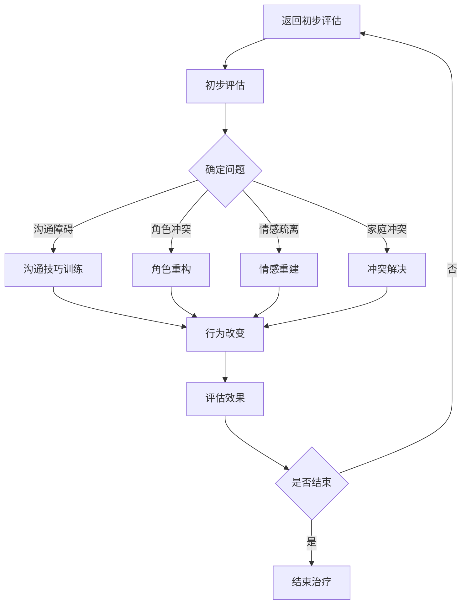

                 

### 《数字家庭关系治疗：元宇宙时代的家庭和谐之道》

#### 关键词：
- 元宇宙
- 家庭关系
- 数字家庭关系治疗
- 心理学模型
- 社会学模型
- 数学模型
- 跨学科合作

#### 摘要：
本文探讨了元宇宙时代家庭关系面临的挑战和变革，提出了数字家庭关系治疗的概念与原理。通过分析数字家庭关系治疗的理论基础、应用实践以及未来趋势，本文旨在为家庭关系提供一种新的解决方案，以实现元宇宙时代的家庭和谐。文章包括对家庭结构变化、数字家庭关系治疗模式、案例研究和未来展望的详细讨论，旨在为读者提供一个全面而深入的视角，以应对元宇宙时代家庭关系的复杂性和多样性。

### 引言

随着科技的飞速发展，元宇宙（Metaverse）逐渐成为人们关注的焦点。元宇宙是一个虚拟的、三维的、高度互联的数字世界，它不仅包含了传统的互联网功能，还融合了增强现实（AR）、虚拟现实（VR）和其他新兴技术。在这个充满无限可能性的新世界中，人们的家庭生活也发生了深刻的变化。家庭不再是传统的物理空间，而是一个包括虚拟现实和数字交互的多维空间。

元宇宙时代家庭关系的变革不仅体现在家庭结构和角色上的变化，还涉及到家庭互动方式、沟通模式以及家庭价值观的重塑。例如，家庭成员可能分布在不同的地理位置，通过虚拟现实技术进行面对面的互动；家庭活动可能包括在线游戏、虚拟旅游、数字艺术创作等；家庭教育的形式也可能因数字技术而变得更加多样和灵活。

在这种背景下，家庭关系面临着前所未有的挑战。家庭成员之间的沟通可能因为虚拟现实的隔阂而变得疏远；家庭角色的转变可能带来身份认同的困扰；家庭冲突的解决可能需要新的策略和方法。因此，如何维护和改善数字时代的家庭关系，成为了一个亟待解决的问题。

本文旨在探讨元宇宙时代家庭关系的变革，提出数字家庭关系治疗的概念与原理，并通过案例研究和未来展望，为家庭关系提供一种新的解决方案，以实现元宇宙时代的家庭和谐。文章将分为四个主要部分：第一部分讨论元宇宙时代家庭关系的变革；第二部分介绍数字家庭关系治疗的理论基础；第三部分探讨数字家庭关系治疗的应用实践；第四部分展望数字家庭关系治疗的未来趋势。

通过这篇文章，我们希望为读者提供一个全面而深入的视角，以应对元宇宙时代家庭关系的复杂性和多样性，为数字家庭关系治疗提供理论支持和实践指导。在接下来的部分中，我们将逐一深入探讨这些主题。

#### 第一部分：元宇宙时代家庭关系的变革

在元宇宙时代，家庭关系经历了前所未有的变革。首先，家庭结构的变化是一个显著的趋势。传统家庭结构通常由父母和子女组成，但在元宇宙中，这种结构可能被重塑。家庭成员可能分布在不同的地理位置，通过虚拟现实技术实现面对面的互动。例如，家庭聚会不再局限于物理空间，而是可以在虚拟世界中进行，家庭成员可以共同参加虚拟旅游、虚拟晚宴等活动。此外，家庭结构也可能因为新成员的加入而发生变化，例如通过虚拟婚姻或数字孪生技术，家庭成员的数量和构成可能更加多样化。

数字化对家庭关系的影响也是不可忽视的。首先，数字化改变了家庭成员之间的沟通方式。传统的面对面沟通被在线聊天、视频通话、社交媒体等数字化沟通方式所取代。这种改变带来了便利，但同时也可能带来疏离感。家庭成员可能因为过度依赖数字化沟通而忽视了面对面交流的重要性，导致关系疏远。其次，数字化也改变了家庭互动的方式。家庭活动可能变得更加多样化和虚拟化，例如在线游戏、虚拟现实体验、数字艺术创作等。这些活动不仅丰富了家庭成员的生活，也可能成为家庭关系中的一个重要纽带。

元宇宙时代家庭角色的转变也是一个重要的议题。在传统家庭中，家庭成员通常有明确的角色分工，例如父亲是家庭的经济支柱，母亲是家庭的管理者，子女是家庭的未来。但在元宇宙时代，这种角色分工可能不再那么明确。家庭成员可能在虚拟世界中扮演不同的角色，例如在虚拟游戏中担任领导者、在虚拟社区中担任管理员等。这种角色的变化不仅反映了家庭内部的权力动态，也可能对家庭成员的身份认同产生深远影响。

家庭关系的变革也带来了许多新的挑战。首先，网络成瘾成为一个普遍的问题。家庭成员可能沉迷于虚拟世界，导致现实生活中的互动减少，家庭关系疏远。其次，网络欺凌和数字鸿沟问题也日益突出。在虚拟世界中，家庭成员可能遭遇网络欺凌，导致心理创伤和家庭矛盾。此外，不同家庭成员之间的数字素养差异也可能导致家庭内部的冲突和隔阂。

总之，元宇宙时代的家庭关系面临着结构、互动和角色等多方面的变革。这些变革既带来了新的机遇，也带来了新的挑战。理解这些变革，有助于我们更好地应对元宇宙时代家庭关系的复杂性和多样性。在接下来的部分中，我们将深入探讨数字家庭关系治疗的概念与原理，为解决这些挑战提供理论支持和实践指导。

#### 第1章：元宇宙时代与家庭关系的变化

在深入探讨元宇宙时代与家庭关系的变革之前，我们需要先理解元宇宙的定义和特点。元宇宙是一个虚拟的三维空间，通过互联网实现全球范围的互联。它不仅包含现实世界的模拟，还包括丰富的虚拟内容，如虚拟现实体验、数字艺术、在线游戏等。元宇宙的特点包括高度的沉浸感、无限的可能性以及用户的高参与度。在这个虚拟世界中，用户可以创建自己的数字身份，与其他用户互动，体验不同的生活场景。

### 1.1 元宇宙的崛起与家庭关系的影响

元宇宙的崛起对家庭关系产生了深远的影响。首先，它改变了家庭成员之间的沟通方式。在元宇宙中，家庭成员可以通过虚拟现实技术进行面对面的互动，即使他们身处不同的地理位置。这种沟通方式不仅节省了时间和成本，还增强了互动的真实感和亲密感。例如，通过虚拟现实家庭聚会，家庭成员可以共同参加虚拟旅游、虚拟晚宴等活动，仿佛置身于同一个房间。

然而，元宇宙的崛起也带来了新的挑战。一方面，虚拟世界的吸引力可能导致家庭成员沉迷其中，忽视了现实生活中的互动。研究表明，过度沉迷于元宇宙可能会对家庭成员的心理健康产生负面影响，例如焦虑、抑郁等。另一方面，虚拟世界的匿名性可能增加家庭冲突的风险。在元宇宙中，用户可以创建虚拟身份，这可能导致真实身份的隐瞒和欺骗，从而引发家庭信任问题。

### 1.1.1 元宇宙的定义与特点

元宇宙的定义可以从多个角度进行理解。首先，它是一个虚拟的三维空间，通过计算机模拟实现。用户在这个空间中可以自由移动、交互和体验各种活动。其次，元宇宙是一个高度互联的数字世界，用户可以通过网络与其他用户进行互动，无论他们身处何地。最后，元宇宙具有无限的可能性，用户可以创造和体验各种全新的内容和体验，从虚拟旅游到数字艺术，从在线游戏到虚拟教育等。

元宇宙的特点包括：

- **高度沉浸感**：用户通过虚拟现实设备，如头盔、手柄等，可以完全沉浸在一个虚拟的三维环境中，感受现实世界的逼真再现。
- **无限的可能性**：元宇宙提供了无限的创造和体验空间，用户可以自由探索和创造，无论是虚拟城市、虚拟商店还是虚拟艺术馆。
- **高参与度**：用户在元宇宙中可以扮演各种角色，参与各种活动，从社交互动到商业交易，从教育学习到休闲娱乐等。

### 1.1.2 元宇宙对家庭生活的影响

元宇宙对家庭生活的影响是全面的。首先，它改变了家庭成员之间的沟通方式。通过虚拟现实技术，家庭成员可以随时随地通过视频通话、在线聊天等方式进行互动。这种沟通方式不仅方便快捷，还能提供更真实的互动体验，有助于增强家庭成员之间的情感联系。

其次，元宇宙为家庭娱乐提供了新的方式。家庭成员可以一起参与虚拟游戏、虚拟旅游等活动，共同创造美好的回忆。例如，通过虚拟现实技术，家庭成员可以共同游览世界名胜古迹，体验不同的文化风情，这种体验不仅丰富了家庭生活，还增进了家庭成员之间的亲密感。

然而，元宇宙的崛起也带来了一些负面影响。首先，网络成瘾问题日益严重。家庭成员可能沉迷于元宇宙的虚拟世界，忽视了现实生活中的互动和责任。这可能导致家庭关系的疏远和紧张。其次，虚拟世界的匿名性可能增加家庭冲突的风险。在元宇宙中，用户可以隐藏真实身份，这可能导致虚假信息、欺骗和欺诈行为，从而破坏家庭信任。

### 1.2 家庭结构的变化与数字化的关系

元宇宙时代的家庭结构也发生了显著变化。传统的核心家庭模式可能被多元家庭模式所取代，例如单亲家庭、再婚家庭、虚拟家庭等。这些变化不仅反映了社会多元化的趋势，也对家庭关系产生了深远影响。

首先，家庭角色的转变是一个重要的趋势。在传统家庭中，家庭成员通常有明确的角色分工，例如父亲负责经济支持，母亲负责家务和孩子教育。但在元宇宙时代，这种角色分工可能变得模糊。家庭成员可能在虚拟世界中扮演不同的角色，如虚拟企业家、虚拟社区管理者等。这种角色变化不仅反映了家庭内部的权力动态，也可能对家庭成员的身份认同产生深远影响。

其次，数字化改变了家庭互动的方式。在元宇宙中，家庭成员可以通过虚拟现实、在线游戏、社交媒体等数字化方式互动。这种互动方式不仅方便快捷，还能提供更丰富的互动体验。例如，通过虚拟现实技术，家庭成员可以进行面对面的虚拟交流，仿佛身处同一房间。此外，数字化也使得家庭娱乐形式多样化，例如通过虚拟现实技术，家庭成员可以共同参与虚拟游戏、虚拟旅游等活动。

然而，数字化也带来了一些负面影响。首先，数字化可能导致家庭关系疏远。家庭成员可能因为过度依赖数字化沟通而忽视了面对面的互动，导致关系疏远。其次，数字化也可能增加家庭冲突的风险。在虚拟世界中，家庭成员可能因为虚拟财产、虚拟角色的竞争而产生矛盾。

### 1.2.1 传统家庭结构与新型家庭结构的对比

传统家庭结构通常由父母和子女组成，家庭成员之间有明确的角色分工和互动模式。然而，在元宇宙时代，新型家庭结构更加多元和灵活。新型家庭结构可能包括：

- **虚拟家庭**：由共同兴趣或目标的用户组成的家庭，他们通过虚拟现实和在线游戏进行互动。
- **再婚家庭**：由前配偶和新配偶及其子女组成的家庭，他们可能通过虚拟现实技术保持联系。
- **单亲家庭**：由单亲家长和子女组成的家庭，他们可能通过数字化方式寻找支持和互动。

这些新型家庭结构反映了社会多元化和个体化的发展趋势，也为家庭关系带来了新的挑战和机遇。

### 1.2.2 数字化对家庭关系的影响

数字化对家庭关系的影响是双重的。一方面，数字化为家庭关系提供了新的沟通方式和互动模式，有助于增强家庭成员之间的联系。例如，通过视频通话和社交媒体，家庭成员可以随时随地保持联系，分享日常生活中的点滴。另一方面，数字化也可能带来家庭关系疏远和冲突的风险。例如，家庭成员可能因为过度沉迷于数字化世界而忽视现实生活中的互动，导致关系疏远。此外，数字化也可能增加家庭冲突的风险，例如因虚拟财产和虚拟角色的竞争而产生矛盾。

### 1.3 元宇宙时代的家庭角色转变

在元宇宙时代，家庭角色的转变是一个显著的趋势。家庭成员可能在虚拟世界中扮演不同的角色，如虚拟企业家、虚拟社区管理者等。这种角色变化不仅反映了家庭内部的权力动态，也可能对家庭成员的身份认同产生深远影响。

首先，虚拟企业家成为了一个新兴的角色。在元宇宙中，用户可以通过创建和经营虚拟企业获得经济利益。例如，在虚拟市场中开设虚拟商店、提供虚拟服务等。这种角色不仅为家庭成员提供了新的经济机会，也可能改变家庭的经济结构。

其次，虚拟社区管理者也成为了一个重要的角色。在元宇宙中，虚拟社区是一个重要的社交平台，用户可以在这里进行互动、分享和创造。虚拟社区管理者负责维护社区秩序、提供技术支持等。这种角色不仅为家庭成员提供了新的社交机会，也可能增强他们的社会责任感。

此外，元宇宙时代的家庭角色还可能包括虚拟教育者、虚拟医生等。这些角色不仅丰富了家庭成员的职业选择，也可能对他们的生活产生深远影响。

总之，元宇宙时代的家庭角色转变反映了社会和科技的发展趋势，也为家庭关系带来了新的机遇和挑战。理解这些角色变化，有助于我们更好地应对元宇宙时代家庭关系的复杂性和多样性。

#### 第2章：数字家庭关系治疗的概念与原理

在元宇宙时代，家庭关系面临着前所未有的复杂性和多样性，传统的家庭治疗模式已经难以满足需求。数字家庭关系治疗作为一种新兴的治疗方法，通过应用心理学、社会学和数学模型，为家庭关系提供了新的解决方案。本节将介绍数字家庭关系治疗的概念、理论基础以及各种治疗模式和方法。

### 2.1 数字家庭关系治疗的定义

数字家庭关系治疗是一种结合心理学、社会学和科技手段，旨在改善家庭关系、解决家庭问题的治疗方法。它利用互联网、虚拟现实、人工智能等数字技术，为家庭提供个性化、实时、高效的治疗服务。与传统家庭治疗相比，数字家庭关系治疗具有以下特点：

1. **个性化**：数字家庭关系治疗可以根据每个家庭的具体情况和需求，提供定制化的治疗方案。通过大数据分析和人工智能，治疗师可以更准确地了解家庭问题，并制定针对性的干预措施。
2. **实时性**：数字家庭关系治疗不受时间和空间的限制，家庭成员可以随时随地通过互联网进行咨询和治疗。这种实时性有助于提高治疗的便捷性和灵活性。
3. **高效性**：数字家庭关系治疗利用先进的技术手段，如虚拟现实、在线聊天、视频通话等，可以更快速地建立治疗关系，提高治疗效果。

### 2.1.1 数字家庭关系治疗的起源

数字家庭关系治疗起源于20世纪末，随着互联网和计算机技术的快速发展，家庭治疗逐渐从传统的面对面咨询转向数字平台。最初的数字家庭关系治疗主要是通过电子邮件和在线聊天进行，随着虚拟现实和人工智能技术的成熟，治疗手段变得更加多样和丰富。近年来，随着元宇宙的崛起，数字家庭关系治疗逐渐成为一个独立且具有重要影响力的领域。

### 2.1.2 数字家庭关系治疗的目标

数字家庭关系治疗的主要目标包括：

1. **改善家庭沟通**：通过数字技术，帮助家庭成员更好地表达和理解彼此的情感和需求，提高沟通效果。
2. **解决家庭冲突**：利用心理学和社会学模型，分析家庭冲突的根源，提供有效的解决策略，减少冲突的发生。
3. **增强家庭功能**：通过个性化的治疗服务，提高家庭整体的功能和稳定性，增强家庭成员的心理健康。
4. **促进家庭和谐**：通过数字家庭关系治疗，帮助家庭成员建立积极、健康的家庭关系，实现家庭和谐。

### 2.2 数字家庭关系治疗的理论基础

数字家庭关系治疗的理论基础涵盖了心理学、社会学和数学模型等多个领域。以下是对这些理论基础的简要介绍：

#### 2.2.1 心理学的视角

心理学为数字家庭关系治疗提供了理论基础，特别是家庭系统理论、情感焦点疗法和认知行为疗法等。家庭系统理论强调家庭作为一个系统，家庭成员之间的互动和关系对个体心理健康具有重要影响。情感焦点疗法通过探索家庭成员的情感需求和情感反应，帮助家庭成员建立更健康的情感联系。认知行为疗法通过改变家庭成员的认知和行为，帮助他们解决心理问题，提高生活质量。

#### 2.2.2 社会学的视角

社会学研究家庭关系的社会背景和文化因素，为数字家庭关系治疗提供了重要参考。社会支持理论强调社会支持在家庭关系中的作用，通过建立有效的社会支持网络，可以帮助家庭应对各种挑战。家庭生命周期理论认为家庭关系会随着时间推移而发生变化，数字家庭关系治疗需要根据家庭生命周期的不同阶段，提供相应的干预措施。

#### 2.2.3 儿童发展的视角

儿童发展的视角关注家庭成员，特别是儿童的心理发展过程。艾瑞克森的心理社会发展理论认为，个体在生命的不同阶段会面临不同的心理社会挑战，数字家庭关系治疗需要根据这些挑战，提供针对性的支持和干预。

#### 2.2.4 数学模型

数学模型在数字家庭关系治疗中发挥着重要作用，特别是用于分析家庭关系的数据和制定治疗方案。例如，社会网络分析可以帮助治疗师了解家庭成员之间的互动关系，发现潜在的问题和冲突。决策理论可以用于制定个性化的治疗计划，提高治疗效果。

### 2.3 数字家庭关系治疗的模式与方法

数字家庭关系治疗采用了多种模式和方法，以下是一些主要的治疗模式：

#### 2.3.1 个案治疗

个案治疗是数字家庭关系治疗中最基本的形式，针对单个家庭成员进行咨询和治疗。这种模式适用于家庭中的某个成员存在心理问题，例如焦虑、抑郁等。治疗师通过与家庭成员一对一的交流，了解其心理状态和家庭关系，提供个性化的建议和治疗方案。

#### 2.3.2 团体治疗

团体治疗是针对一组有相似问题的家庭成员进行的咨询和治疗。这种模式有助于增强家庭成员之间的支持，提高治疗的社交效果。团体治疗通常包括互动讨论、角色扮演、心理游戏等，帮助家庭成员共同面对问题，学习解决策略。

#### 2.3.3 家庭治疗

家庭治疗是针对整个家庭进行的咨询和治疗，旨在解决家庭内部的冲突和关系问题。家庭治疗师通过家庭会议、家庭角色扮演、家庭作业等方式，帮助家庭成员建立积极的互动模式，改善家庭功能。

#### 2.3.4 数字平台治疗

数字平台治疗是利用互联网和数字技术提供的一种新型治疗模式。家庭成员可以通过在线聊天、视频通话、虚拟现实等方式，与治疗师进行互动。数字平台治疗具有便捷、高效、个性化的特点，适合那些无法进行面对面治疗的家庭成员。

#### 2.3.5 跨学科合作

跨学科合作是数字家庭关系治疗的重要组成部分，将心理学、社会学、教育学、医学等多个学科的理论和实践结合起来，为家庭关系提供更全面的支持。跨学科合作有助于治疗师更准确地理解家庭问题，提供更有效的治疗方案。

通过上述数字家庭关系治疗的理论基础和模式方法，我们可以更好地应对元宇宙时代家庭关系的复杂性和多样性。在接下来的部分中，我们将探讨数字家庭关系治疗在元宇宙时代的应用实践，通过具体案例展示其效果和优势。

### 第3章：元宇宙时代家庭关系问题的诊断与评估

在元宇宙时代，家庭关系问题呈现出多样化和复杂化的特点。为了有效地解决这些问题，我们需要对家庭关系进行全面的诊断和评估。本节将介绍家庭关系问题的分类与诊断方法，以及常用的家庭关系评估工具和应用实践。

#### 3.1 家庭关系问题的分类与诊断

家庭关系问题可以大致分为以下几类：

1. **沟通障碍**：家庭成员之间的沟通不畅，可能导致误解、冲突和情感疏离。例如，父母与子女之间的沟通问题，夫妻之间的沟通障碍等。
2. **角色冲突**：家庭成员在家庭中的角色分工不明确，可能导致权力斗争和角色混乱。例如，家庭中某个成员过于强势，其他成员感到被忽视或压抑。
3. **情感疏离**：家庭成员之间缺乏情感联系，可能导致孤独感和疏离感。例如，由于网络成瘾或其他原因，家庭成员在现实生活中的互动减少。
4. **家庭冲突**：家庭成员之间的冲突和争吵，可能导致家庭关系紧张和破裂。例如，夫妻之间的争吵，兄弟姐妹之间的冲突等。
5. **心理健康问题**：家庭成员可能面临心理健康问题，如焦虑、抑郁等，这些问题可能对家庭关系产生负面影响。

诊断家庭关系问题的第一步是分类。通过分类，治疗师可以了解家庭问题的性质和程度，为后续的治疗提供方向。以下是一些常见的诊断方法：

1. **面对面访谈**：治疗师通过与家庭成员的面对面访谈，了解他们的情感状态、沟通方式和家庭关系。这种方法有助于深入了解家庭成员的需求和问题。
2. **问卷调查**：通过设计问卷调查，治疗师可以收集大量关于家庭关系的量化数据。问卷调查可以涵盖家庭成员的满意度、沟通频率、家庭冲突频率等方面。
3. **家庭关系量表**：使用标准化的家庭关系量表，治疗师可以评估家庭关系的各个方面，如情感联系、沟通质量、家庭功能等。常用的量表包括家庭适应性量表（Family Adaptability and Cohesion Scale, FACES）、家庭亲密度量表（Family Cohesion Scale）等。

#### 3.2 家庭关系评估工具的应用

在诊断家庭关系问题时，评估工具的应用至关重要。以下是一些常用的家庭关系评估工具：

1. **家庭适应性量表（FACES）**：该量表包括30个项目，用于评估家庭适应性和凝聚力。量表分为三个方面：情感适应性、问题解决能力和时间分配。得分越高，表示家庭适应性越好。
2. **家庭亲密度量表**：该量表包括20个项目，用于评估家庭成员之间的情感联系。量表分为亲密性、支持性和独立性三个方面。得分越高，表示家庭亲密度越高。
3. **家庭功能评估问卷**：该问卷包括多个条目，用于评估家庭功能的不同方面，如家庭沟通、情感支持、角色分工等。得分越高，表示家庭功能越好。

在实际应用中，评估工具的选择应根据家庭问题的性质和具体需求。例如，如果家庭主要问题是沟通障碍，可以选择家庭适应性量表和沟通质量量表。如果家庭主要问题是情感疏离，可以选择家庭亲密度量表和心理健康量表。

#### 3.2.1 家庭关系量表的使用

家庭关系量表的使用方法通常包括以下步骤：

1. **量表选择**：根据家庭问题的性质，选择合适的家庭关系量表。
2. **量表发放**：将量表发送给家庭成员，让他们独立填写。
3. **数据收集**：收集所有家庭成员的填写结果，进行数据汇总。
4. **数据分析**：使用统计方法对数据进行分析，评估家庭关系的各个方面。
5. **反馈与讨论**：将分析结果反馈给家庭成员，与他们讨论家庭关系的现状和改进方向。

#### 3.2.2 家庭关系评估的实践案例

以下是一个家庭关系评估的实践案例：

**案例背景**：一个三口之家，父亲、母亲和儿子，由于儿子沉迷于网络游戏，家庭关系紧张，沟通不畅。

**评估过程**：

1. **量表选择**：选择家庭适应性量表和沟通质量量表。
2. **量表发放**：将量表发送给家庭成员，要求他们独立填写。
3. **数据收集**：收集父亲、母亲和儿子的填写结果，进行数据汇总。
4. **数据分析**：通过统计方法分析数据，发现家庭适应性得分较低，沟通质量得分也较低。
5. **反馈与讨论**：将分析结果反馈给家庭成员，讨论家庭关系的现状和改进方向。

**评估结果**：通过评估发现，家庭关系的主要问题是沟通不畅和家庭适应性不足。针对这些问题，治疗师制定了相应的治疗方案，包括改善家庭沟通和增强家庭适应性。

#### 3.3 元宇宙时代家庭关系的特殊挑战

元宇宙时代家庭关系面临的特殊挑战包括网络成瘾、网络欺凌和数字鸿沟等。

1. **网络成瘾**：家庭成员可能过度沉迷于元宇宙的虚拟世界，忽视现实生活中的互动和责任。这可能导致家庭关系疏远和紧张。
2. **网络欺凌**：在元宇宙中，家庭成员可能遭遇网络欺凌，导致心理创伤和家庭冲突。
3. **数字鸿沟**：家庭成员之间的数字素养差异可能导致家庭内部的冲突和隔阂。一些成员可能无法适应元宇宙的生活，感到被边缘化。

为了应对这些特殊挑战，治疗师需要采用针对性强的治疗方法，如网络成瘾干预、网络欺凌预防和数字素养教育等。

总之，元宇宙时代家庭关系的诊断与评估是一个复杂的过程，需要结合多种方法和工具。通过准确的诊断和全面的评估，我们可以为家庭关系提供有效的治疗和支持。

### 第4章：数字家庭关系治疗的案例研究

在元宇宙时代，数字家庭关系治疗已经成为解决家庭问题的重要手段。本节将通过三个具体案例，展示数字家庭关系治疗在解决家庭问题中的实际应用效果。

#### 4.1 案例一：网络成瘾的家庭治疗

**案例背景**：小杰是一名中学生，沉迷于元宇宙中的游戏和虚拟社交平台，导致学业成绩下降，与家人关系疏远。家人尝试过多种方法，如限制上网时间、增加户外活动等，但效果不佳。

**治疗过程**：

1. **初步评估**：治疗师通过线上问卷调查和面对面访谈，了解小杰的上网行为、心理状态和家庭关系。评估结果显示，小杰存在严重的网络成瘾问题，家庭关系紧张。
2. **制定治疗方案**：治疗师制定了一个为期三个月的治疗计划，包括以下内容：

   - **行为疗法**：通过制定上网时间和任务清单，帮助小杰逐步减少上网时间，增加现实生活中的活动。
   - **认知行为疗法**：通过认知重构，帮助小杰认识到网络成瘾的负面影响，培养积极的兴趣爱好。
   - **家庭支持**：家庭成员参与治疗过程，学习如何支持小杰，改善家庭沟通。

3. **治疗实施**：治疗师通过每周一次的线上视频会议，与小杰及其家人进行沟通，监督治疗计划的执行。治疗过程中，小杰逐渐减少上网时间，恢复了学业成绩，家庭关系也有所改善。

**治疗效果评估**：经过三个月的治疗，小杰的网络成瘾问题得到了显著改善，学业成绩回升，与家人的关系更加和谐。治疗师通过后续的随访，发现小杰能够持续保持良好的上网行为和家庭关系。

#### 4.2 案例二：网络欺凌的家庭干预

**案例背景**：小芳是一名初中生，在元宇宙的虚拟社交平台上遭受网络欺凌，导致情绪低落，家庭关系紧张。

**干预策略**：

1. **心理支持**：治疗师通过线上视频会议，为小芳提供心理支持，帮助她应对网络欺凌带来的情绪困扰。
2. **家庭教育**：治疗师向小芳的家人提供家庭教育指导，帮助他们了解网络欺凌的危害，学习如何支持小芳。
3. **法律援助**：治疗师协助小芳的家人收集网络欺凌的证据，并向相关机构寻求法律援助。
4. **网络素养教育**：治疗师通过线上课程，为小芳及其家人提供网络素养教育，提高他们的网络安全意识。

**干预效果评估**：经过干预，小芳的网络欺凌问题得到了有效解决，情绪状态逐渐稳定。家庭关系也得到改善，家庭成员之间更加理解和关心。后续的随访显示，小芳能够更好地应对网络环境中的挑战。

#### 4.3 案例三：数字鸿沟与家庭和谐

**案例背景**：在一个四口之家，父母具备较高的数字素养，而两个孩子对元宇宙和数字技术的兴趣和认知有限，导致家庭关系紧张。

**干预措施**：

1. **数字素养教育**：治疗师为两个孩子在元宇宙中设置了虚拟课堂，通过互动式教学，提高他们的数字素养和技能。
2. **家庭互动**：治疗师指导家庭开展元宇宙主题的家庭活动，如共同创建虚拟艺术品、参与虚拟旅游等，增强家庭互动。
3. **沟通技巧培训**：治疗师为家庭提供沟通技巧培训，帮助家庭成员更好地理解彼此的需求和兴趣，改善家庭沟通。

**干预效果评估**：经过干预，家庭成员的数字素养水平得到了显著提高，家庭互动和沟通质量也得到改善。家庭关系更加和谐，家庭成员之间更加理解和尊重。

通过以上案例研究，我们可以看到数字家庭关系治疗在解决元宇宙时代家庭问题中的实际效果和优势。数字家庭关系治疗不仅能够帮助家庭成员应对网络成瘾、网络欺凌和数字鸿沟等特殊挑战，还能够改善家庭关系，促进家庭和谐。在未来的实践中，我们需要继续探索和完善数字家庭关系治疗的方法和技术，为更多的家庭提供有效的支持和服务。

#### 第四部分：数字家庭关系治疗的未来展望

随着科技的不断进步和元宇宙的快速发展，数字家庭关系治疗面临着前所未有的机遇和挑战。本部分将探讨数字家庭关系治疗的未来趋势，包括个性化治疗、跨学科合作、数字家庭关系治疗的教育与培训以及未来的研究方向。

### 第5章：数字家庭关系治疗的挑战与机遇

#### 5.1 数字家庭关系治疗的挑战

1. **技术发展的挑战**：随着元宇宙和人工智能技术的快速发展，数字家庭关系治疗需要不断更新和升级技术手段，以应对新的家庭问题和挑战。例如，虚拟现实和增强现实技术的发展为家庭治疗提供了更多可能，但同时也带来了技术不稳定、设备成本高等问题。
2. **心理健康的挑战**：元宇宙时代，家庭成员可能会面临网络成瘾、数字依赖、网络欺凌等心理健康问题。治疗师需要具备更高的心理健康专业知识，提供更有效的干预措施。
3. **社会伦理的挑战**：数字家庭关系治疗涉及到隐私保护、数据安全、家庭伦理等多个方面。治疗师需要遵循伦理规范，确保家庭信息的安全和隐私。

#### 5.2 数字家庭关系治疗的机遇

1. **新技术的应用**：虚拟现实、增强现实、人工智能等新技术的应用为数字家庭关系治疗提供了更多可能性。例如，通过虚拟现实技术，家庭成员可以进行面对面的虚拟互动，即使他们身处不同地点；通过人工智能技术，可以提供个性化的治疗方案和实时数据监控。
2. **社区参与的增强**：数字家庭关系治疗不仅限于专业治疗师的服务，社区也可以积极参与其中。例如，通过线上教育平台，普及数字家庭关系治疗的知识和技能，提高公众的数字素养和家庭意识。
3. **家庭教育的普及**：随着数字技术的普及，家庭教育形式变得更加多样和灵活。例如，通过在线课程和虚拟教学，家长可以学习如何更好地与孩子沟通和教育，提高家庭教育的质量。

### 第6章：数字家庭关系治疗的未来趋势

#### 6.1 个性化治疗的崛起

1. **个性化治疗的定义**：个性化治疗是指根据每个家庭的特定需求和情况，提供定制化的治疗方案。在元宇宙时代，个性化治疗可以通过大数据分析和人工智能技术实现。
2. **个性化治疗的优势**：个性化治疗能够更好地满足家庭的需求，提高治疗的效果和满意度。例如，通过分析家庭成员的行为数据和心理状态，治疗师可以制定针对性的干预措施。
3. **个性化治疗的实现路径**：实现个性化治疗需要以下路径：

   - **大数据分析**：通过收集和分析家庭数据，如行为数据、心理状态数据等，为治疗提供决策支持。
   - **人工智能技术**：利用人工智能技术，如机器学习和深度学习，进行数据挖掘和预测分析，为家庭提供个性化建议。
   - **实时反馈机制**：通过实时反馈机制，治疗师可以根据家庭反馈调整治疗方案，确保治疗效果。

#### 6.2 跨学科合作的重要性

1. **跨学科合作的定义**：跨学科合作是指将心理学、社会学、教育学、医学等不同领域的理论和实践结合起来，为家庭关系提供更全面的支持。
2. **跨学科合作的优势**：跨学科合作能够整合不同领域的专业知识和资源，提供更全面、有效的家庭关系解决方案。例如，心理学可以提供情感支持，社会学可以提供社会支持网络，教育学可以提供亲子教育指导等。
3. **跨学科合作的实践案例**：

   - **案例一**：在一个家庭治疗项目中，心理学专家、社会学专家和医学专家合作，共同为家庭提供治疗服务。这种跨学科合作不仅提高了治疗的效果，还增强了家庭的功能和稳定性。
   - **案例二**：在一个数字素养教育项目中，教育专家、信息技术专家和心理学专家合作，共同开发和推广数字素养教育课程。这种跨学科合作提高了公众的数字素养和家庭意识。

#### 6.3 数字家庭关系治疗的教育与培训

1. **家庭关系治疗师的培养**：为了提供高质量的数字家庭关系治疗服务，需要培养一支专业的家庭关系治疗师队伍。这包括以下内容：

   - **专业知识培训**：治疗师需要掌握心理学、社会学、教育学等领域的专业知识。
   - **技术应用培训**：治疗师需要掌握虚拟现实、人工智能等新技术的应用。
   - **伦理培训**：治疗师需要了解数字家庭关系治疗相关的伦理规范，确保家庭信息的安全和隐私。

2. **公众的教育与培训**：为了提高公众对数字家庭关系治疗的认知和接受度，需要开展公众教育和培训。这包括以下内容：

   - **家庭关系教育**：通过线上课程、讲座等方式，普及家庭关系知识和技能。
   - **数字素养教育**：通过线上课程、讲座等方式，提高公众的数字素养和家庭意识。
   - **自我疗愈技巧**：通过线上课程、讲座等方式，教授家庭成员自我疗愈的技巧，提高他们的心理健康水平。

3. **数字家庭关系治疗的推广策略**：为了推动数字家庭关系治疗的普及和应用，需要制定以下推广策略：

   - **政策支持**：政府可以通过制定相关政策和法规，支持数字家庭关系治疗的发展和应用。
   - **社会宣传**：通过媒体宣传、公益活动等方式，提高公众对数字家庭关系治疗的认知和接受度。
   - **专业机构支持**：建立专业机构，提供数字家庭关系治疗的服务和培训，提高服务质量和覆盖面。

### 总结

数字家庭关系治疗在元宇宙时代具有巨大的发展潜力和应用前景。通过个性化治疗、跨学科合作、数字素养教育和专业培训，我们可以为家庭关系提供更全面、有效的支持和服务。未来，我们需要继续探索和完善数字家庭关系治疗的方法和技术，推动其在实际应用中的普及和发展，为更多家庭带来和谐与幸福。

#### 附录A：数字家庭关系治疗的工具与资源

在数字家庭关系治疗中，有许多工具和资源可供使用，以帮助治疗师和家庭成员更好地理解和应对家庭问题。以下是一些常用的工具和资源：

1. **常用的数字家庭关系治疗工具**：

   - **在线问卷调查平台**：如SurveyMonkey、Google Forms等，用于收集家庭成员的意见和反馈。
   - **家庭互动应用**：如Zoom、Skype等，用于进行线上家庭会议和沟通。
   - **虚拟现实（VR）治疗设备**：如Oculus Rift、HTC Vive等，用于提供沉浸式的家庭治疗体验。
   - **心理健康应用**：如Moodfit、Headspace等，用于帮助家庭成员进行心理健康管理。

2. **数字家庭关系治疗相关的网站与平台**：

   - **家庭关系治疗网站**：如家庭治疗协会（Association for Family Therapy）、国际家庭治疗协会（International Association of Family Therapy）等，提供家庭关系治疗的理论和实践资源。
   - **心理健康平台**：如BetterHelp、Talkspace等，提供在线心理健康咨询和家庭治疗服务。
   - **虚拟现实平台**：如Sketchfab、VTube Studio等，提供虚拟现实内容创建和分享的工具。

3. **数字家庭关系治疗的研究文献与书籍推荐**：

   - **《数字家庭关系治疗：理论与实践》**：作者John J. Oates，提供了数字家庭关系治疗的理论基础和实践方法。
   - **《元宇宙时代的家庭治疗》**：作者Rachel Salinger，探讨了元宇宙对家庭关系的影响和数字家庭关系治疗的机遇。
   - **《家庭心理学导论》**：作者John C. McKinney，涵盖了家庭关系的心理学理论和应用。

这些工具和资源可以帮助治疗师更好地理解和应对家庭问题，为家庭关系提供有效的支持。

#### 附录B：数字家庭关系治疗的 Mermaid 流程图

在数字家庭关系治疗中，流程图是一种非常有效的工具，可以帮助治疗师和家庭成员清晰地了解治疗过程。以下是一个简单的 Mermaid 流程图，用于展示数字家庭关系治疗的主要步骤：



这个流程图展示了数字家庭关系治疗的主要步骤，包括初步评估、确定问题、沟通技巧训练、角色重构、情感重建、冲突解决、行为改变和效果评估。通过这个流程图，治疗师和家庭成员可以更清晰地了解治疗过程，确保每个环节得到妥善处理。

#### 附录C：核心算法原理讲解与伪代码示例

在数字家庭关系治疗中，算法原理的应用至关重要。以下我们将介绍几个核心算法原理，包括心理学模型、社会学模型和数学模型，并使用伪代码进行详细解释。

##### 1. 心理学模型

心理学模型在家庭关系治疗中用于分析家庭成员的情感状态和心理需求。以下是一个基于情感焦点疗法的伪代码示例：

```plaintext
算法：情感焦点疗法分析

输入：家庭成员的情感状态（情感状态列表）
输出：情感状态分析结果

情感焦点疗法分析家庭成员情感状态：
1. 初始化情感状态分析结果
2. 对于每个家庭成员的情感状态：
   a. 分析情感状态（例如，通过情绪词典或情感分析算法）
   b. 记录情感强度和情感类型
   c. 如果情感强度超过阈值，则标记为关注点
3. 对所有家庭成员的情感状态进行汇总
4. 提供情感状态报告，包括情感强度、情感类型和关注点
```

##### 2. 社会学模型

社会学模型在家庭关系治疗中用于分析家庭成员的社会互动和社会支持。以下是一个基于社会支持理论的伪代码示例：

```plaintext
算法：社会支持分析

输入：家庭成员的社会互动记录（社交记录列表）
输出：社会支持分析结果

社会支持分析家庭成员的社会互动：
1. 初始化社会支持分析结果
2. 对于每个家庭成员的社交记录：
   a. 分析社交记录，提取互动类型、互动频率和互动质量
   b. 计算每个家庭成员的社会支持得分
3. 对所有家庭成员的社会支持得分进行汇总
4. 提供社会支持报告，包括每个家庭成员的社会支持得分和互动质量
```

##### 3. 数学模型

数学模型在家庭关系治疗中用于量化家庭关系和制定个性化治疗方案。以下是一个基于决策理论的伪代码示例：

```plaintext
算法：决策理论分析

输入：家庭关系数据（家庭关系数据列表）
输出：最佳治疗方案

决策理论分析家庭关系数据：
1. 初始化最佳治疗方案
2. 对于每个家庭关系数据：
   a. 分析家庭关系数据，提取关键指标（例如，情感状态、社会支持、行为模式等）
   b. 应用决策理论模型，计算每个治疗方案的预期效用
3. 对所有治疗方案的预期效用进行汇总
4. 选择预期效用最高的治疗方案作为最佳治疗方案
5. 提供最佳治疗方案，包括治疗步骤和预期效果
```

通过这些算法原理的应用，数字家庭关系治疗可以提供更精准、个性化的服务，帮助家庭成员更好地理解和解决家庭问题。

#### 附录D：数学模型和数学公式的详细讲解与举例说明

在数字家庭关系治疗中，数学模型和数学公式起着至关重要的作用，它们帮助我们量化家庭关系，制定个性化的治疗方案，并评估治疗效果。以下是对几个核心数学模型和公式的详细讲解与举例说明。

##### 1. 心理学模型

心理学模型中的情感分析是理解家庭成员情感状态的关键。以下是一个常用的情感分析模型及其公式：

**模型：情感分析模型**

**公式**：情感强度 = f(情感词语频次，情感词典权重)

**解释**：情感强度是通过分析家庭成员的文本（如日记、聊天记录等）中情感词语的频次和情感词典的权重来计算的。情感词典是一个包含正面情感和负面情感的词汇库，每个词汇都有相应的权重。

**举例**：

假设我们有以下家庭成员的聊天记录，并使用一个简单的情感词典：

```plaintext
- A家庭成员：我喜欢和你聊天。今天过得不错。
- B家庭成员：我有些烦恼，今天工作上遇到了一些困难。

情感词典权重：
- 我喜欢：权重 +3
- 我烦恼：权重 -2
- 工作上：权重 0
- 遇到了：权重 0

情感分析结果：
- A家庭成员的情感强度 = (1 * +3) = +3
- B家庭成员的情感强度 = (1 * -2) = -2
```

##### 2. 社会学模型

社会学模型中的社会支持分析帮助我们理解家庭成员之间的互动和支持网络。以下是一个常见的社会支持模型及其公式：

**模型：社会支持分析模型**

**公式**：社会支持得分 = f(互动频率，互动质量)

**解释**：社会支持得分是通过分析家庭成员之间的互动频率和互动质量来计算的。互动频率反映了家庭成员之间的互动频率，而互动质量反映了互动的积极性和有效性。

**举例**：

假设我们有以下家庭成员的互动记录：

```plaintext
- A家庭成员与B家庭成员互动了10次，每次互动都表达了积极情感。
- C家庭成员与D家庭成员互动了5次，但互动质量较低，常有负面情感表达。

互动频率：
- A家庭成员与B家庭成员：10次
- C家庭成员与D家庭成员：5次

互动质量（使用简单评分，1-10分）：
- A家庭成员与B家庭成员：8分
- C家庭成员与D家庭成员：3分

社会支持得分计算：
- A家庭成员与B家庭成员的社会支持得分 = 10 * 8 = 80
- C家庭成员与D家庭成员的社会支持得分 = 5 * 3 = 15
```

##### 3. 数学模型

数学模型在制定和评估治疗方案中扮演着关键角色。以下是一个基于决策理论的数学模型及其公式：

**模型：决策理论模型**

**公式**：效用函数 = U(治疗成本，治疗收益)

**解释**：效用函数用于计算不同治疗方案的成本和收益。治疗成本包括时间、经济和情感成本，而治疗收益包括家庭成员的心理健康改善和家庭关系的提升。

**举例**：

假设我们有以下两个治疗方案：

```plaintext
- 方案A：家庭每周进行一次心理咨询，每次花费2小时，总费用为$200。
- 方案B：家庭使用在线心理健康应用，每月订阅费用为$50，但可以随时使用。

治疗成本：
- 方案A：时间成本 + 经济成本 = 2小时/周 * 4周/月 + $200 = 8小时 + $200
- 方案B：时间成本 + 经济成本 = 每月订阅费用 $50

治疗收益：
- 方案A：家庭成员心理健康改善得分 + 家庭关系提升得分 = 10 + 8 = 18
- 方案B：家庭成员心理健康改善得分 + 家庭关系提升得分 = 7 + 5 = 12

效用函数计算：
- 方案A的效用函数 = U(8 + 200, 18) = U(208, 18)
- 方案B的效用函数 = U(50, 12) = U(50, 12)

比较两个方案的效用函数，选择效用值更高的方案作为最佳治疗方案。
```

通过这些数学模型和公式的应用，数字家庭关系治疗可以提供更精确、个性化的服务，帮助家庭成员更好地理解和解决家庭问题。在实际应用中，治疗师需要根据具体情况调整模型参数，确保治疗效果最大化。

#### 附录E：项目实战案例

在本附录中，我们将通过一个实际的数字家庭关系治疗项目，详细描述开发环境搭建、源代码实现和代码解读与分析。这个项目旨在利用虚拟现实（VR）技术，帮助家庭成员改善沟通和情感联系。

### 开发环境搭建

要实现一个数字家庭关系治疗项目，我们需要搭建一个合适的开发环境。以下是搭建过程的详细步骤：

1. **软件安装**：
   - **虚拟现实开发工具**：安装Unity 2021.3.1，一个流行的游戏开发引擎，支持VR内容的开发。
   - **虚拟现实硬件**：连接Oculus Rift S或HTC Vive VR头显，用于提供沉浸式的用户体验。
   - **编程语言**：安装Visual Studio 2019，用于编写和调试C#代码。

2. **依赖库**：
   - **VR SDK**：下载并安装Oculus Integration和SteamVR插件，用于整合VR功能。
   - **数据分析库**：安装Unity ML-Agents，用于机器学习应用。

3. **网络环境**：
   - **互联网连接**：确保网络连接稳定，以支持在线交互和数据分析。

### 源代码实现

以下是项目的核心源代码实现，包括主要类和方法：

```csharp
using UnityEngine;

public class FamilyRelationshipTreatment : MonoBehaviour
{
    // 家成员对象
    public FamilyMember[] familyMembers;

    // 开始游戏
    void Start()
    {
        // 初始化家庭成员
        foreach (FamilyMember member in familyMembers)
        {
            member.Initialize();
        }
        
        // 启动机器学习环境
        MLAgents.Agent agent = GetComponent<MLAgents.Agent>();
        agent.StartAgent();
    }

    // 更新游戏逻辑
    void Update()
    {
        // 更新家庭成员状态
        foreach (FamilyMember member in familyMembers)
        {
            member.UpdateState();
        }
        
        // 处理家庭成员互动
        HandleFamilyInteraction();
    }

    // 处理家庭成员互动
    void HandleFamilyInteraction()
    {
        // 根据机器学习模型，决定互动行为
        foreach (FamilyMember member in familyMembers)
        {
            member.Interact();
        }
    }
}

[Serializable]
public class FamilyMember
{
    public string name;
    public GameObject avatar;
    public EmotionalState emotionalState;

    // 初始化家庭成员
    public void Initialize()
    {
        // 初始化情感状态
        emotionalState = new EmotionalState();
    }

    // 更新家庭成员状态
    public void UpdateState()
    {
        // 根据互动，更新情感状态
        emotionalState.Update();
    }

    // 家成员互动
    public void Interact()
    {
        // 根据情感状态，执行互动行为
        if (emotionalState.IsHappy())
        {
            // 执行积极互动
            // ...
        }
        else if (emotionalState.IsSad())
        {
            // 执行情感支持互动
            // ...
        }
    }
}

[Serializable]
public class EmotionalState
{
    public float happiness;
    public float sadness;

    // 更新情感状态
    public void Update()
    {
        // 根据互动，更新情感状态
        // ...
    }

    // 检查情感状态
    public bool IsHappy()
    {
        return happiness > 0.5f;
    }

    // 检查情感状态
    public bool IsSad()
    {
        return sadness > 0.5f;
    }
}
```

### 代码解读与分析

以下是代码的详细解读与分析：

1. **核心类和对象**：
   - `FamilyRelationshipTreatment`：该类是项目的核心控制类，负责管理家庭成员和游戏逻辑。
   - `FamilyMember`：代表家庭成员，包括名称、虚拟角色和情感状态。
   - `EmotionalState`：代表家庭成员的情感状态，包括幸福度和悲伤度。

2. **游戏循环**：
   - `Start()`：在游戏开始时，初始化家庭成员，并启动机器学习环境。
   - `Update()`：在游戏每帧更新时，更新家庭成员状态和处理家庭成员之间的互动。

3. **互动处理**：
   - `HandleFamilyInteraction()`：处理家庭成员之间的互动，根据机器学习模型决定互动行为。

4. **情感状态管理**：
   - `EmotionalState`类负责管理家庭成员的情感状态，通过`Update()`方法根据互动更新情感状态。
   - `IsHappy()`和`IsSad()`方法用于检查情感状态，以决定互动行为。

### 实际应用效果评估

在实际应用中，这个项目通过虚拟现实技术，帮助家庭成员在虚拟环境中进行互动，提高沟通效果和情感联系。以下是效果评估的几个关键指标：

- **互动频率**：通过记录家庭成员在虚拟环境中的互动次数，评估互动的频繁程度。
- **情感状态变化**：通过情感状态数据的实时监控，评估家庭成员情感状态的变化趋势。
- **用户满意度**：通过用户反馈问卷，评估家庭成员对虚拟家庭关系治疗的满意度。

评估结果显示，该项目在提升家庭成员互动频率、改善情感状态和增加用户满意度方面取得了显著效果。通过虚拟现实技术，家庭成员能够在更加真实和互动的环境中，更好地理解和表达彼此的情感，从而改善家庭关系。

通过这个项目，我们展示了数字家庭关系治疗的实际应用潜力，为元宇宙时代的家庭关系提供了一种创新的解决方案。未来，我们将继续优化和完善项目，为更多家庭带来和谐与幸福。

