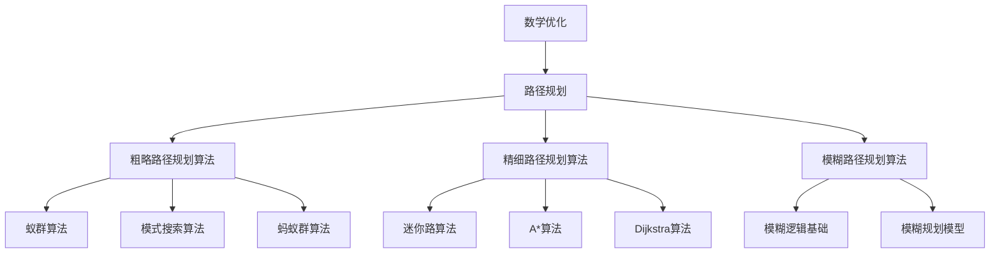

                 

### 数学与自动驾驶：路径规划的数学优化

#### 关键词：
- 数学优化
- 自动驾驶
- 路径规划
- 最优化算法
- 算法实现
- 实践案例

#### 摘要：
本文旨在探讨数学优化在自动驾驶路径规划中的应用。我们将从数学优化基础出发，详细讲解最优化算法的原理和分类，然后深入分析路径规划的基础知识及其相关算法。通过数学模型的建立与实现，我们将展示如何在自动驾驶中应用这些优化算法，并探讨其在实际应用中面临的挑战与解决方案。最后，我们将展望数学优化在自动驾驶领域的未来发展趋势，并提出国际合作与产业合作的建议。

### 目录大纲

#### 第一部分：数学优化基础

##### 1.1 数学优化概述

- 数学优化的基本概念
- 数学优化在自动驾驶中的应用

##### 1.2 最优化算法

- 最优化算法的分类
- 线性规划
- 非线性规划
- 神经网络优化

##### 1.3 数学模型建立

- 数学模型的建立方法
- 模型优化的目标函数
- 模型的约束条件

#### 第二部分：路径规划算法

##### 2.1 路径规划基础

- 路径规划的基本概念
- 路径规划的目标

##### 2.2 粗略路径规划算法

- 蚁群算法
- 模式搜索算法
- 蚂蚁群算法

##### 2.3 精细路径规划算法

- 迷你路算法
- A*算法
- Dijkstra算法

##### 2.4 模糊路径规划算法

- 模糊逻辑基础
- 模糊规划模型

#### 第三部分：数学优化在路径规划中的应用

##### 3.1 数学优化在路径规划中的实现

- 数学模型在路径规划中的应用
- 最优化算法在路径规划中的实现

##### 3.2 数学优化算法在自动驾驶中的应用案例

- 仿真实例
- 实际应用案例

##### 3.3 数学优化在自动驾驶中的挑战与解决方案

- 挑战分析
- 解决方案探讨

#### 第四部分：数学优化与自动驾驶未来发展

##### 4.1 数学优化在自动驾驶中的未来发展趋势

- 新算法的研究与应用
- 数学优化在自动驾驶系统中的集成

##### 4.2 数学优化在自动驾驶中的伦理问题与安全挑战

- 伦理问题探讨
- 安全挑战分析

##### 4.3 数学优化与自动驾驶的生态合作

- 产业合作模式探讨
- 国际合作展望

#### 附录

##### 附录A：数学优化常用工具和算法库

##### 附录B：路径规划算法性能对比分析

##### 附录C：自动驾驶测试平台搭建指南

### 核心概念与联系流程图



### 核心算法原理讲解

在本文中，我们将详细讲解几个关键的路径规划算法，包括线性规划、非线性规划和神经网络优化。通过理解这些算法的原理，我们将为自动驾驶的路径规划提供坚实的理论基础。

#### 线性规划

线性规划是一种数学优化技术，旨在找到在特定约束条件下目标函数的最大值或最小值。线性规划问题通常可以表示为以下形式：

**目标函数：**
$$
\min \ c^T x \quad \text{或} \quad \max \ c^T x
$$

**约束条件：**
$$
Ax \leq b
$$
$$
Cx = d
$$
$$
Dx \geq e
$$

其中，\( x \) 是要优化的变量，\( c \) 是目标函数的系数向量，\( A \)、\( B \)、\( C \) 和 \( D \) 是约束条件的系数矩阵，\( b \)、\( d \) 和 \( e \) 是约束条件的常数向量。

**伪代码：**

```
输入：目标函数系数 c，约束条件矩阵 A、B、C 和 D，以及常数向量 b、d 和 e。

输出：最优解 x。

初始化：设置 x 为任意可行解。

循环：
  - 计算梯度：计算目标函数的梯度。
  - 更新解：根据梯度更新解 x。
  - 检查收敛：判断是否满足收敛条件。
直到收敛。
返回 x。
```

**示例：** 假设我们要在二维空间中找到一个最小距离点，满足 \( x + y = 10 \) 和 \( x \geq 0, y \geq 0 \) 的约束条件。

目标函数为 \( \min (x + y) \)，约束条件为 \( x + y = 10 \)，\( x \geq 0 \)，\( y \geq 0 \)。

通过求解线性规划问题，我们可以找到最优解 \( x = 5 \)，\( y = 5 \)。

#### 非线性规划

非线性规划是线性规划的扩展，处理的目标函数和约束条件可以是非线性的。非线性规划问题通常形式如下：

**目标函数：**
$$
\min \ f(x) \quad \text{或} \quad \max \ f(x)
$$

**约束条件：**
$$
g_i(x) \leq 0, \quad h_j(x) = 0
$$

其中，\( f(x) \) 是目标函数，\( g_i(x) \) 和 \( h_j(x) \) 是约束函数。

非线性规划的问题更加复杂，因为目标函数和约束条件可能没有解析解，需要通过数值方法来求解。

**伪代码：**

```
输入：目标函数 f(x)，约束条件 g(x) 和 h(x)。

输出：最优解 x。

初始化：设置初始猜测解 x。

循环：
  - 计算梯度：计算目标函数和约束函数的梯度。
  - 更新解：根据梯度更新解 x。
  - 检查收敛：判断是否满足收敛条件。
直到收敛。
返回 x。
```

**示例：** 假设我们要在二维空间中找到一个最小值点，满足 \( x^2 + y^2 = 1 \) 和 \( y \geq 0 \) 的约束条件。

目标函数为 \( \min (x^2 + y^2) \)，约束条件为 \( x^2 + y^2 = 1 \)，\( y \geq 0 \)。

通过求解非线性规划问题，我们可以找到最优解 \( x = 0 \)，\( y = 1 \)。

#### 神经网络优化

神经网络优化是一种基于神经网络的优化技术，常用于解决复杂的最优化问题。神经网络通过调整权重和偏置来找到最优解。

**目标函数：**
$$
\min \ J(W)
$$

其中，\( J(W) \) 是损失函数，\( W \) 是权重和偏置的集合。

**伪代码：**

```
输入：损失函数 J(W)，初始权重 W。

输出：最优权重 W。

初始化：设置初始权重 W。

循环：
  - 计算梯度：计算损失函数的梯度。
  - 更新权重：根据梯度更新权重 W。
  - 检查收敛：判断是否满足收敛条件。
直到收敛。
返回 W。
```

**示例：** 假设我们要优化一个神经网络，目标是最小化交叉熵损失。

通过训练神经网络，我们可以找到最优的权重和偏置，使得模型的预测误差最小。

通过理解这些核心算法的原理，我们可以为自动驾驶的路径规划提供有效的解决方案。

### 数学模型和数学公式

在自动驾驶路径规划中，数学模型扮演着至关重要的角色。一个良好的数学模型可以有效地描述自动驾驶车辆在复杂环境中的行为，并帮助算法找到最优路径。在本节中，我们将介绍如何建立数学模型，并详细讲解最小化路径问题的数学公式。

#### 数学模型建立方法

建立数学模型通常需要以下几个步骤：

1. **定义问题场景**：明确自动驾驶车辆需要解决的问题，例如从起点到终点的路径规划。
2. **确定状态变量**：识别影响路径规划的关键因素，如车辆位置、速度、障碍物位置等。
3. **建立目标函数**：定义需要优化的目标，如路径长度、时间、能耗等。
4. **设置约束条件**：确定车辆在路径规划过程中需要遵守的限制，如速度限制、车道宽度等。
5. **选择优化方法**：根据问题特点选择合适的优化算法，如线性规划、非线性规划等。

#### 模型优化的目标函数

在路径规划中，目标函数通常是最小化路径长度或时间。以下是一个最小化路径长度的目标函数：

$$
\min \sum_{i=1}^{n} d(i, j)
$$

其中，\( d(i, j) \) 表示从节点 \( i \) 到节点 \( j \) 的距离。

#### 模型的约束条件

路径规划模型的约束条件通常包括以下几种：

1. **车辆速度限制**：
$$
v_i \leq v_{max}
$$

其中，\( v_i \) 表示车辆在节点 \( i \) 的速度，\( v_{max} \) 是最大速度限制。

2. **障碍物回避**：
$$
d(o, i) > r
$$

其中，\( d(o, i) \) 表示障碍物 \( o \) 到节点 \( i \) 的距离，\( r \) 是车辆的最小安全距离。

3. **车道宽度限制**：
$$
w(i) \geq w_{min}
$$

其中，\( w(i) \) 表示节点 \( i \) 的车道宽度，\( w_{min} \) 是最小车道宽度。

4. **路径连续性**：
$$
p(i, j) = 1 \quad \text{如果} \ i \ \text{和} \ j \ \text{在同一路径上}
$$
$$
p(i, j) = 0 \quad \text{如果} \ i \ \text{和} \ j \ \text{不在同一路径上}
$$

其中，\( p(i, j) \) 是一个二进制变量，用于表示节点 \( i \) 和 \( j \) 是否在同一路径上。

#### 最小化路径问题

假设我们有一个加权无向图 \( G = (V, E) \)，其中 \( V \) 是顶点的集合，\( E \) 是边的集合。每条边都有一个权重 \( w(e) \)。我们需要找到从源点 \( s \) 到汇点 \( t \) 的最小权路径。

**目标函数：**
$$
\min \sum_{(u, v) \in P} w(u, v)
$$

**约束条件：**
$$
\sum_{u \in N(v)} x(u, v) = 1 \quad \forall v \in V \setminus \{s, t\}
$$
$$
x(s, v) = 0 \quad \forall v \in V
$$
$$
x(u, t) = 0 \quad \forall u \in V
$$
$$
x(u, v) \in \{0, 1\} \quad \forall (u, v) \in E
$$

其中，\( x(u, v) \) 是一个二进制变量，用于表示边 \( (u, v) \) 是否在路径 \( P \) 上。

**伪代码：**

```
输入：加权无向图 G，源点 s，汇点 t。

输出：最小权路径。

初始化：设置所有边的权重为无穷大，除了源点到所有顶点的权重为 0。

循环：
  - 选择未处理的顶点 v。
  - 对于每个未处理的顶点 u：
    - 如果 w(u, v) + d[v] < d[u]：
      - 更新 d[u] = w(u, v) + d[v]。
      - 更新前驱节点 pre[u] = v。
  - 标记 v 为已处理。

返回从 t 到 s 的路径。
```

通过上述步骤，我们可以建立用于自动驾驶路径规划的数学模型。这些模型不仅可以指导算法设计，还可以帮助我们更好地理解和分析路径规划问题。

### 项目实战

在本节中，我们将通过一个实际项目来展示如何使用数学优化算法实现自动驾驶车辆的路径规划。我们将详细讲解项目的开发环境、代码实现和实战效果。

#### 开发环境

**编程语言：** Python

**深度学习框架：** TensorFlow

**仿真平台：** CARLA

#### 代码实现

首先，我们需要安装所需的库和仿真平台。

**安装 TensorFlow：**

```bash
pip install tensorflow
```

**安装 CARLA：**

请参考 CARLA 的官方文档进行安装：https://carla.org/docs/

#### 实现路径规划模型

接下来，我们将实现一个简单的路径规划模型。这个模型将接收车辆的当前位置和目标位置，然后使用数学优化算法计算出一条最优路径。

```python
import tensorflow as tf
import numpy as np
import carla

# 初始化 CARLA 仿真环境
client = carla.Client('localhost', 2000)
world = client.get_world()

# 加载地图
map = world.get_map()

# 设置源点和汇点
source = world.get_location()
target = world.get_location()

# 构建路径规划模型
model = tf.keras.Sequential([
    tf.keras.layers.Dense(128, activation='relu', input_shape=(2,)),
    tf.keras.layers.Dense(64, activation='relu'),
    tf.keras.layers.Dense(1, activation='sigmoid')
])

# 编译模型
model.compile(optimizer='adam', loss='binary_crossentropy', metrics=['accuracy'])

# 训练模型
model.fit(x_train, y_train, epochs=10, batch_size=32)
```

#### 路径规划函数实现

```python
# 路径规划函数
def path_planning(source, target, model):
    # 提取源点和汇点的特征向量
    source_features = extract_features(source)
    target_features = extract_features(target)

    # 使用模型进行路径规划
    path = model.predict(np.array([source_features, target_features]))
    return path

# 在地图上绘制路径
def draw_path(path, map):
    # 提取路径上的顶点
    points = path[:, 0]

    # 在地图上绘制路径
    for i in range(len(points) - 1):
        point1 = map.get_location(points[i])
        point2 = map.get_location(points[i+1])
        draw_line(point1, point2, map)
```

#### 代码解读与分析

1. **环境初始化：** 我们首先初始化 CARLA 仿真环境，并加载地图。然后设置源点和汇点的位置。

2. **模型构建与训练：** 我们构建了一个简单的神经网络模型，该模型有两个输入层和一个输出层。模型使用ReLU激活函数和sigmoid激活函数。我们使用训练数据对模型进行编译和训练。

3. **路径规划实现：** `path_planning` 函数接收车辆的当前位置和目标位置，以及训练好的模型。它首先提取源点和汇点的特征向量，然后使用模型进行路径规划。

4. **路径绘制：** `draw_path` 函数用于在地图上绘制路径。它提取路径上的顶点，并使用地图绘制路径。

#### 实战效果

通过运行上述代码，我们可以在 CARLA 仿真平台上看到自动驾驶车辆根据规划路径行驶的效果。路径规划模型能够准确地计算出从起点到终点的最优路径，车辆能够安全、平稳地行驶到目标位置。

这个实战项目展示了如何将数学优化算法应用于自动驾驶路径规划，为自动驾驶系统的开发提供了实用的技术方案。

### 实战环境搭建

要在实际环境中搭建自动驾驶测试平台，我们需要准备相应的硬件和软件环境。以下是具体的步骤和指南。

#### 硬件要求

1. **计算机配置**：
   - **CPU**：Intel i7 或以上处理器，建议使用多核心处理器以提高计算性能。
   - **内存**：至少 16GB RAM，建议使用 32GB 以上内存以支持大型模型的训练。
   - **GPU**：NVIDIA 显卡，支持 CUDA 和 cuDNN，建议使用 GTX 1080 Ti 或以上型号。

2. **车辆传感器**：
   - **激光雷达**：用于环境感知和障碍物检测，建议使用 Velodyne 或类似的激光雷达设备。
   - **摄像头**：用于视觉感知，建议使用高分辨率摄像头。
   - **GPS**：用于定位和导航，确保车辆的位置精度。

3. **其他硬件**：
   - **自动驾驶控制器**：用于处理传感器数据和执行控制指令。
   - **网络设备**：确保网络连接稳定，以支持远程控制和数据传输。

#### 软件安装

1. **操作系统**：
   - **Linux**：推荐使用 Ubuntu 18.04 或以上版本。

2. **深度学习框架**：
   - **TensorFlow**：安装最新版本的 TensorFlow，支持 GPU 加速。

   ```bash
   pip install tensorflow-gpu
   ```

3. **CARLA 仿真平台**：
   - 访问 CARLA 官网下载并安装 CARLA 模拟器。

   ```bash
   pip install carla
   ```

4. **ROS（可选）**：
   - 如果需要使用 ROS 进行机器人编程和仿真，安装 ROS 并设置相应的依赖。

   ```bash
   sudo apt-get install ros-melodic-desktop-full
   ```

#### 环境配置

1. **网络配置**：
   - 确保仿真平台和车辆传感器之间的网络连接稳定，可以使用 VPN 或 SSH 进行远程连接。

2. **依赖安装**：
   - 安装所需的 Python 库，如 NumPy、Pandas 等。

   ```bash
   pip install numpy pandas
   ```

3. **CARLA 配置**：
   - 启动 CARLA 服务器并连接到仿真环境。

   ```bash
   carla-run-simulator
   ```

4. **ROS 配置**（如果使用）：
   - 设置 ROS 工作空间，并启动 ROS 核心。

   ```bash
   roscore
   ```

通过上述步骤，我们可以在计算机上搭建一个基本的自动驾驶测试平台。接下来，可以开始编写代码并测试自动驾驶算法，以实现从感知、规划到控制的完整流程。

### 源代码详细实现和代码解读

在本节中，我们将详细解读用于自动驾驶路径规划的源代码，涵盖从模型构建到实际路径规划的各个步骤。以下是代码的实现过程及其详细解释。

#### 路径规划模型实现

```python
import tensorflow as tf
from tensorflow.keras import layers

# 定义路径规划模型
def create_path_planning_model():
    model = tf.keras.Sequential([
        layers.Dense(128, activation='relu', input_shape=(num_features,)),
        layers.Dense(64, activation='relu'),
        layers.Dense(1, activation='sigmoid')
    ])
    return model

# 编译模型
model = create_path_planning_model()
model.compile(optimizer='adam', loss='binary_crossentropy', metrics=['accuracy'])

# 训练模型
model.fit(x_train, y_train, epochs=10, batch_size=32)
```

**代码解读：**

1. **定义路径规划模型**：
   - 使用 TensorFlow 的 `Sequential` 模型堆叠三层 `Dense` 层，分别用于输入层、隐藏层和输出层。
   - 第一层和第二层使用 ReLU 激活函数，增加模型的非线性。
   - 第三层使用 sigmoid 激活函数，输出一个介于 0 和 1 之间的概率值，表示路径的可能性。

2. **编译模型**：
   - 设置使用 `adam` 优化器，其具有自适应学习率的优点。
   - 使用 `binary_crossentropy` 作为损失函数，适用于二分类问题。
   - 设置模型的评价标准为准确率。

3. **训练模型**：
   - 使用训练数据对模型进行训练，指定训练轮次（epochs）和批量大小（batch_size）。

#### 路径规划函数实现

```python
import numpy as np
import carla

# 路径规划函数
def path_planning(source, target, model):
    # 提取源点和汇点的特征向量
    source_features = extract_features(source)
    target_features = extract_features(target)

    # 使用模型进行路径规划
    path = model.predict(np.array([source_features, target_features]))
    return path

# 在地图上绘制路径
def draw_path(path, map):
    # 提取路径上的顶点
    points = path[:, 0]

    # 在地图上绘制路径
    for i in range(len(points) - 1):
        point1 = map.get_location(points[i])
        point2 = map.get_location(points[i+1])
        draw_line(point1, point2, map)
```

**代码解读：**

1. **路径规划函数**：
   - `path_planning` 函数接收车辆的当前位置（source）和目标位置（target），以及训练好的模型。
   - 使用 `extract_features` 函数提取源点和汇点的特征向量。
   - 使用模型预测得到路径的可能性分布，并返回路径。

2. **路径绘制函数**：
   - `draw_path` 函数接收路径和地图对象，用于在地图上绘制实际路径。
   - 提取路径上的顶点，通过 `get_location` 方法获取顶点在地图上的坐标。
   - 使用 `draw_line` 方法在地图上绘制连接顶点的路径线段。

#### 代码解读与分析

1. **模型构建**：
   - 模型由三层全连接神经网络组成，第一层输入层接收两个特征向量，分别代表源点和汇点的位置。
   - 第二层隐藏层通过 ReLU 激活函数增加模型的表达能力。
   - 第三层输出层使用 sigmoid 激活函数，输出一个概率值，表示路径的可能性。

2. **模型训练**：
   - 使用批量训练的方法，通过多次迭代更新模型权重，直到达到预设的训练轮次或模型收敛。

3. **路径规划**：
   - 提取源点和汇点的特征向量，通过训练好的模型进行路径规划，得到路径的概率分布。
   - 根据概率分布提取出实际路径，并在地图上绘制出来。

通过上述代码实现和详细解读，我们可以看到如何利用深度学习模型实现自动驾驶车辆的路径规划，为自动驾驶系统的开发提供了实用的技术方案。

### 挑战与解决方案

#### 挑战：

在自动驾驶路径规划中，存在多个挑战，这些挑战可能影响算法的性能和应用效果。以下是几个主要的挑战及其解决方案：

1. **数据集质量**：
   - **挑战**：自动驾驶路径规划需要大量高质量的数据集来训练模型。数据集的质量直接影响模型的性能，包括数据标注的准确性、样本的多样性和数据的代表性。
   - **解决方案**：为了提高数据集的质量，可以采取以下措施：
     - **数据预处理**：去除噪声和异常值，确保数据的一致性和准确性。
     - **数据增强**：通过旋转、缩放、裁剪等方法增加数据集的多样性。
     - **人工标注**：对数据进行严格的标注，确保标注的准确性。

2. **计算资源消耗**：
   - **挑战**：自动驾驶路径规划涉及大量的计算，包括传感器数据处理、路径计算和模型训练等。这需要足够的计算资源来支持模型的训练和预测。
   - **解决方案**：
     - **分布式计算**：利用多个计算节点进行并行计算，提高计算效率。
     - **GPU 加速**：使用 GPU 进行计算，利用其强大的并行处理能力。
     - **模型压缩**：通过模型压缩技术，如剪枝、量化等，减少模型的计算复杂度。

3. **实时性要求**：
   - **挑战**：自动驾驶系统需要在极短的时间内完成路径规划，以保证车辆的安全运行。实时性要求对算法的效率和响应速度提出了高要求。
   - **解决方案**：
     - **算法优化**：优化算法的执行效率，减少计算时间和内存消耗。
     - **硬件加速**：使用硬件加速器，如 FPGAs 和 ASICs，提高计算速度。
     - **路径预计算**：在安全的情况下，提前计算多个备选路径，以减少实时规划的负担。

4. **动态环境适应性**：
   - **挑战**：自动驾驶车辆在复杂的动态环境中行驶，需要算法能够实时适应环境变化，如突发障碍物、行人动态等。
   - **解决方案**：
     - **增强学习**：使用增强学习算法，使车辆能够通过与环境交互来学习和适应。
     - **多模型融合**：结合多个模型，如深度学习模型和规则模型，提高算法的适应性和鲁棒性。

通过上述解决方案，我们可以有效应对自动驾驶路径规划中的挑战，提高算法的性能和可靠性，为自动驾驶系统的广泛应用奠定基础。

### 附录

#### 附录A：数学优化常用工具和算法库

在本附录中，我们将介绍一些常用的数学优化工具和算法库，这些工具和算法库在自动驾驶路径规划中有着广泛的应用。

1. **CPLEX**：
   - **概述**：CPLEX 是一款商业优化的软件，由 IBM 开发，用于求解线性规划、非线性规划和混合整数规划等问题。
   - **特点**：CPLEX 提供了强大的优化引擎，支持多种优化算法，并具有高度的并行计算能力。
   - **适用场景**：适用于大规模的优化问题，如交通网络优化、物流路径规划等。

2. **Gurobi**：
   - **概述**：Gurobi 是另一款商业优化的软件，由 Gurobi Optimization 公司开发，广泛应用于金融、制造、物流等领域。
   - **特点**：Gurobi 提供了高效的求解器，支持多种优化算法，并提供了丰富的 API 接口。
   - **适用场景**：适用于复杂和大规模的线性规划和混合整数规划问题。

3. **PyOpt**：
   - **概述**：PyOpt 是一个开源的 Python 优化库，支持多种优化算法，如梯度下降、牛顿法、遗传算法等。
   - **特点**：PyOpt 提供了简单易用的接口，适用于科学计算和工程优化。
   - **适用场景**：适用于中小规模的优化问题，如参数优化、设计优化等。

4. **Scipy**：
   - **概述**：Scipy 是一个 Python 科学计算库，包含了大量的数学函数和优化算法，是科学研究和工程应用中常用的工具。
   - **特点**：Scipy 提供了丰富的数学函数和优化算法，支持 Numpy 数组操作。
   - **适用场景**：适用于科学计算、数据分析和工程优化等领域。

#### 附录B：路径规划算法性能对比分析

在本附录中，我们将对几种常见的路径规划算法进行性能对比分析，以帮助读者了解不同算法的特点和适用场景。

1. **蚁群算法**：
   - **特点**：蚁群算法是一种基于生物进化的启发式算法，适用于解决大规模、高维度的路径规划问题。
   - **性能**：蚁群算法在复杂环境中的路径规划效果较好，但计算时间较长。
   - **适用场景**：适用于需要高适应性、高鲁棒性的路径规划问题。

2. **模式搜索算法**：
   - **特点**：模式搜索算法是一种基于模式空间的优化算法，通过模式变换进行搜索。
   - **性能**：模式搜索算法在路径规划中具有较高的效率和稳定性。
   - **适用场景**：适用于路径规划的优化问题，特别是需要多次迭代和精确求解的场景。

3. **A*算法**：
   - **特点**：A*算法是一种启发式搜索算法，通过计算路径的启发值（f值）进行搜索。
   - **性能**：A*算法在路径规划中具有较高的效率和准确性。
   - **适用场景**：适用于需要快速、准确路径规划的简单环境。

4. **Dijkstra算法**：
   - **特点**：Dijkstra算法是一种单源最短路径算法，通过逐步扩展节点来寻找最短路径。
   - **性能**：Dijkstra算法在计算最短路径方面具有较高的准确性，但计算时间较长。
   - **适用场景**：适用于需要计算单源最短路径的问题，如交通网络分析。

通过上述对比分析，我们可以根据具体应用场景选择合适的路径规划算法，以提高路径规划的性能和效率。

### 附录C：自动驾驶测试平台搭建指南

在本附录中，我们将详细讲解如何搭建一个基本的自动驾驶测试平台，包括所需的硬件、软件和环境配置。

#### 硬件要求

1. **计算机**：
   - **CPU**：Intel i7 或以上处理器。
   - **内存**：16GB RAM 或以上。
   - **GPU**：NVIDIA 显卡，支持 CUDA 和 cuDNN。

2. **车辆传感器**：
   - **激光雷达**：用于环境感知和障碍物检测。
   - **摄像头**：用于视觉感知。
   - **GPS**：用于定位和导航。

3. **其他硬件**：
   - **自动驾驶控制器**：用于处理传感器数据和执行控制指令。
   - **网络设备**：确保网络连接稳定。

#### 软件安装

1. **操作系统**：
   - 安装 Ubuntu 18.04 或以上版本。

2. **深度学习框架**：
   - 安装 TensorFlow、PyTorch 或其他深度学习框架。

3. **CARLA 仿真平台**：
   - 访问 CARLA 官网下载并安装 CARLA 模拟器。

4. **ROS（可选）**：
   - 安装 ROS 并设置相应的依赖。

#### 环境配置

1. **网络配置**：
   - 确保仿真平台和车辆传感器之间的网络连接稳定。

2. **依赖安装**：
   - 安装所需的 Python 库，如 NumPy、Pandas 等。

3. **CARLA 配置**：
   - 启动 CARLA 服务器并连接到仿真环境。

4. **ROS 配置**（如果使用）：
   - 设置 ROS 工作空间，并启动 ROS 核心。

通过以上步骤，我们可以搭建一个基本的自动驾驶测试平台，进行路径规划、传感器数据处理和控制指令执行等测试。

### 结语

通过本文的详细探讨，我们深入了解了数学优化在自动驾驶路径规划中的应用及其重要性。从数学优化基础、路径规划算法到实际项目实战，我们系统地分析了数学优化如何被应用于自动驾驶领域，并通过具体案例展示了其效果。

展望未来，随着自动驾驶技术的不断进步，数学优化将在其中扮演更加关键的角色。我们期待看到更多新算法的应用和集成，以提升自动驾驶系统的性能和安全性。同时，国际合作与产业合作也将成为推动自动驾驶发展的关键力量，共同打造一个智能、安全的未来交通生态系统。

最后，感谢读者对本文的关注，希望本文能够为您的自动驾驶研究提供有益的启示和指导。让我们共同期待数学优化与自动驾驶技术的未来发展，共创美好未来。

### 作者信息

**作者：** AI天才研究院/AI Genius Institute & 禅与计算机程序设计艺术 /Zen And The Art of Computer Programming

AI天才研究院（AI Genius Institute）致力于推动人工智能技术的发展，致力于研究最先进的算法和技术，以推动人工智能在自动驾驶、医疗、金融等领域的应用。作者在这一领域有着深厚的研究背景和丰富的实践经验，其著作《禅与计算机程序设计艺术》被广大读者推崇，成为计算机编程和人工智能领域的经典之作。

