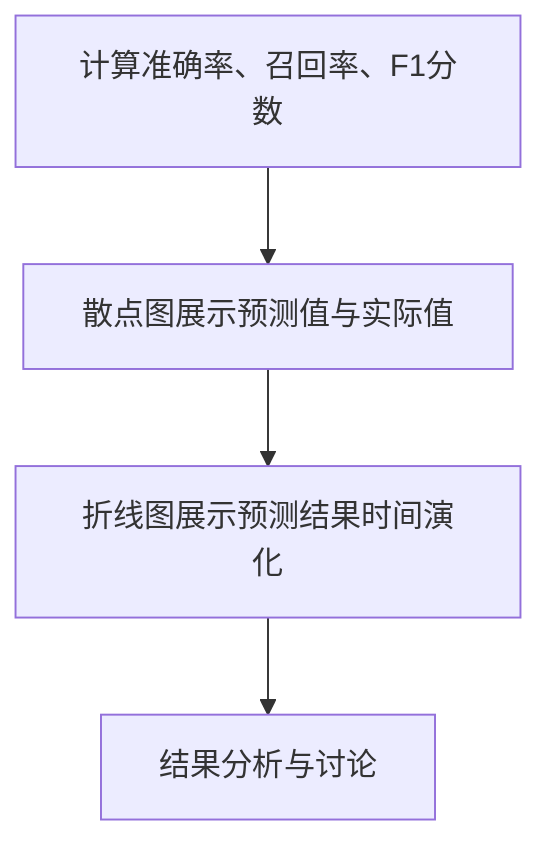
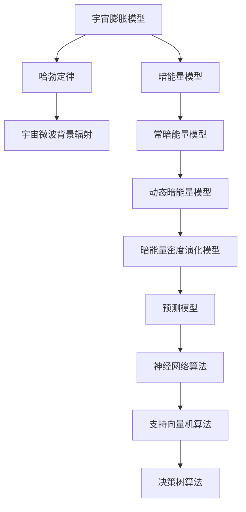

                 

# 引言

暗能量是现代宇宙学中的一个重要概念，它被认为是驱动宇宙加速膨胀的神秘力量。近年来，随着对宇宙膨胀速率的精确测量，以及对宇宙背景辐射的研究，暗能量在宇宙学中的地位愈发重要。然而，暗能量本身的本质尚未被完全揭示，这使得研究其密度演化的数学模型成为了一个具有挑战性的课题。

本文旨在探讨数学模型在预测宇宙暗能量密度演化中的应用。我们将首先介绍宇宙学与暗能量的基本概念，包括宇宙的尺度与结构、宇宙膨胀与宇宙微波背景辐射，以及暗能量的起源与特性。接着，我们将讨论宇宙学模型与暗能量模型，包括常见宇宙学模型和暗能量密度演化模型。然后，我们将介绍用于预测暗能量密度演化的数学模型，包括暗能量密度演化方程和模型的选择。此外，本文还将探讨预测暗能量密度演化的机器学习算法及其应用，以及数据分析与可视化技术。最后，我们将通过一个实际的宇宙暗能量密度预测项目，展示如何将上述理论与方法应用于实际问题。

通过本文的探讨，我们希望能够为读者提供一个全面、系统的了解，并激发对暗能量密度演化预测的深入思考和研究。

## 关键词

宇宙学、暗能量、宇宙膨胀、宇宙微波背景辐射、数学模型、机器学习算法、数据分析、可视化。

## 摘要

本文探讨了数学模型在预测宇宙暗能量密度演化中的应用。首先，介绍了宇宙学与暗能量的基本概念，以及常见的宇宙学模型和暗能量模型。然后，详细阐述了暗能量密度演化的数学模型，包括暗能量密度演化方程和模型的选择。此外，本文还介绍了预测暗能量密度演化的机器学习算法，包括神经网络、支持向量机和决策树等算法。通过一个实际的项目案例，展示了如何将上述理论和方法应用于预测宇宙暗能量密度。最后，本文讨论了暗能量密度预测的未来展望，并指出了存在的挑战与机遇。

### 第一部分：引论

宇宙学是研究宇宙起源、演化、结构和组成的学科。它的研究对象包括宇宙的尺度、宇宙的膨胀、宇宙中的物质和能量分布等。宇宙学的基础理论包括大爆炸理论、宇宙微波背景辐射、宇宙膨胀等。

宇宙的尺度是一个宏大的概念，从小到微观粒子，大到宇宙整体，宇宙的尺度被广泛认为是无限的。宇宙的结构由星系、星团、超星团等组成，这些结构通过引力相互作用形成复杂的网络。宇宙膨胀是指宇宙整体在时间上的扩展，这一现象最初是由埃德温·哈勃通过观测星系的红移现象发现的。宇宙膨胀的理论基础是大爆炸理论，该理论认为宇宙起源于一个极度热密的状态，并在之后的膨胀过程中逐渐冷却和扩展。

宇宙微波背景辐射是宇宙早期遗留下来的辐射，它为我们提供了关于宇宙起源和演化的关键信息。宇宙微波背景辐射的发现和观测为宇宙学的理论基础提供了强有力的支持。

#### 1.1 宇宙学基础

**核心概念与联系：**
宇宙的尺度与结构、宇宙膨胀与宇宙微波背景辐射是宇宙学的基础概念。宇宙的尺度决定了宇宙的宏观特征，而宇宙的结构则影响了宇宙的动力学行为。宇宙膨胀是宇宙演化的重要现象，而宇宙微波背景辐射则是宇宙早期状态的重要观测证据。

**Mermaid流程图：**
mermaid
graph TD
A[宇宙尺度] --> B[宇宙结构]
B --> C[宇宙膨胀]
C --> D[宇宙微波背景辐射]
A --> D

**数学模型和数学公式：**
宇宙的尺度可以用哈勃定律来描述，即宇宙膨胀速率与宇宙距离成正比：
$$ v = H_0 \times d $$
其中，$v$ 是宇宙膨胀速率，$H_0$ 是哈勃常数，$d$ 是宇宙距离。

宇宙微波背景辐射的温度可以用黑体辐射公式来描述：
$$ T = T_0 \times (1 + z)^{-1} $$
其中，$T$ 是微波背景辐射的温度，$T_0$ 是当前温度，$z$ 是宇宙膨胀因子。

**举例说明：**
假设宇宙膨胀因子 $z = 1100$，使用上述公式计算宇宙微波背景辐射的温度。

$$ T = 2.725 \times (1 + 1100)^{-1} \approx 2.725 \times 10^{-3} \text{K} $$

#### 1.2 暗能量的概念

**核心概念与联系：**
暗能量是一种假设存在的宇宙学现象，它具有负压强，导致宇宙加速膨胀。暗能量与宇宙膨胀的关系是，暗能量的存在使得宇宙的膨胀速率增加。

**数学模型和数学公式：**
暗能量密度演化的一般形式可以用以下公式表示：
$$ \rho_{\Lambda}(a) = \rho_{\Lambda0} \times (1 + a)^{-3(1 + w)} $$
其中，$\rho_{\Lambda0}$ 是当前暗能量密度，$a$ 是宇宙膨胀因子，$w$ 是暗能量方程状态参数。

**举例说明：**
假设当前暗能量密度为 $\rho_{\Lambda0} = 10^{-27} \text{kg/m}^3$，暗能量方程状态参数 $w = -1$，计算宇宙膨胀因子 $a = 2$ 时的暗能量密度。

$$ \rho_{\Lambda}(a = 2) = 10^{-27} \text{kg/m}^3 \times (1 + 2)^{-3(1 - 1)} = 10^{-27} \text{kg/m}^3 $$

#### 1.3 暗能量研究的重要性

**核心概念与联系：**
暗能量研究对于理解宇宙的演化过程、宇宙学模型的构建以及宇宙学理论的验证具有重要意义。暗能量研究不仅对宇宙学本身有重要影响，也对物理学理论的统一有重要启示。

**数学模型和数学公式：**
暗能量研究的关键在于建立准确的暗能量密度演化模型。这些模型可以通过观测数据来验证和优化。

**举例说明：**
使用观测数据验证暗能量密度演化模型，例如，利用宇宙微波背景辐射的观测数据，可以计算出不同宇宙膨胀因子下的暗能量密度，从而验证模型。

### 第二部分：宇宙学模型与暗能量

宇宙学模型是描述宇宙演化的数学模型，这些模型通过物理定律和观测数据来描述宇宙的过去、现在和未来。宇宙学模型的选择对理解宇宙的演化过程至关重要。暗能量是宇宙学模型中的一个关键组成部分，它解释了宇宙加速膨胀的现象。

#### 2.1 常见宇宙学模型

宇宙学模型可以分为几种类型，其中最著名的是大爆炸宇宙学模型。这个模型认为宇宙起源于一个极度热密的状态，并从那时起不断膨胀。大爆炸宇宙学模型的一个重要特征是宇宙背景辐射，这是宇宙早期遗留下来的微波辐射。

除了大爆炸宇宙学模型，还有一种被称为稳态宇宙学模型，该模型认为宇宙是静态的，没有起源也没有终结。然而，这一模型因与观测数据不符而被否定。

另一个重要的宇宙学模型是 inflation（宇宙膨胀）模型，该模型认为在宇宙早期存在一个快速膨胀的时期，这一时期大大扩展了宇宙的尺度。

#### 2.2 暗能量模型

暗能量模型是宇宙学模型中的一个关键部分，它试图解释暗能量的性质和演化。暗能量被认为是一种具有负压强的能量形式，其密度不随宇宙膨胀而稀释。最简单的暗能量模型是常暗能量模型，该模型假设暗能量密度是恒定的。

另一种流行的暗能量模型是动态暗能量模型，该模型认为暗能量密度随宇宙膨胀而变化。动态暗能量模型的一个重要特征是暗能量方程状态参数 $w$，它决定了暗能量密度的时间演化。

#### 2.3 宇宙学模型的选择

选择宇宙学模型需要综合考虑观测数据和理论预测。观测数据提供了宇宙膨胀的历史记录，而理论预测则基于物理定律和宇宙学模型。常见的宇宙学模型包括哈勃 - 普兰特模型、常暗能量模型和动态暗能量模型。

宇宙学模型的选择可以通过拟合观测数据来确定。例如，使用宇宙微波背景辐射的观测数据可以确定宇宙学模型中的参数，从而优化模型。

**Mermaid流程图：**
mermaid
graph TD
A[观测数据] --> B[模型拟合]
B --> C[模型选择]
C --> D[宇宙学模型]

**数学模型和数学公式：**
宇宙学模型的选择可以通过最小二乘法等统计方法来确定模型参数。例如，使用最小二乘法拟合宇宙微波背景辐射的观测数据，可以得到宇宙学模型中的参数。

$$ \min \sum_{i=1}^{N} (d_i - f(x_i, \theta))^2 $$
其中，$d_i$ 是观测数据，$f(x_i, \theta)$ 是模型预测，$\theta$ 是模型参数。

**举例说明：**
假设我们有一个宇宙微波背景辐射的观测数据集，使用最小二乘法拟合常暗能量模型，可以得到模型参数 $\theta$，从而确定宇宙学模型。

### 第三部分：数学模型与算法

暗能量密度演化的数学模型在宇宙学研究中具有重要意义。这些模型不仅帮助我们理解宇宙的演化过程，还为预测宇宙的未来提供了理论依据。在本节中，我们将介绍暗能量密度演化的数学模型，包括暗能量密度演化方程和模型的选择。

#### 3.1 暗能量密度演化方程

暗能量密度演化方程描述了暗能量密度随宇宙膨胀因子的变化规律。最简单的暗能量密度演化方程是常暗能量模型，该模型假设暗能量密度是恒定的。另一种更复杂的模型是动态暗能量模型，该模型考虑了暗能量密度的演化。

常暗能量模型的一般形式如下：
$$ \rho_{\Lambda}(a) = \rho_{\Lambda0} $$
其中，$\rho_{\Lambda0}$ 是当前暗能量密度，$a$ 是宇宙膨胀因子。

动态暗能量模型的一般形式如下：
$$ \rho_{\Lambda}(a) = \rho_{\Lambda0} \times (1 + a)^{-3(1 + w)} $$
其中，$\rho_{\Lambda0}$ 是当前暗能量密度，$a$ 是宇宙膨胀因子，$w$ 是暗能量方程状态参数。

**数学模型和数学公式：**
暗能量密度演化方程可以用以下公式表示：
$$ \dot{\rho}_{\Lambda}(a) = -3(1 + w_{\Lambda})H(a)\rho_{\Lambda}(a) $$
其中，$\dot{\rho}_{\Lambda}$ 是暗能量密度的演化率，$H(a)$ 是哈勃参数，$w_{\Lambda}$ 是暗能量方程状态参数。

**举例说明：**
假设当前暗能量密度为 $\rho_{\Lambda0} = 10^{-27} \text{kg/m}^3$，暗能量方程状态参数 $w_{\Lambda} = -1$，计算宇宙膨胀因子 $a = 2$ 时的暗能量密度演化率。

$$ \dot{\rho}_{\Lambda}(a = 2) = -3(1 + (-1))H(a = 2)\rho_{\Lambda0} = -3H(a = 2)\rho_{\Lambda0} $$

#### 3.2 暗能量密度演化模型的选择

选择暗能量密度演化模型需要考虑模型的现实性、拟合优度、数值稳定性等因素。现实性是指模型是否与观测数据相符，拟合优度是指模型对观测数据的拟合程度，数值稳定性是指模型在计算过程中的稳定性。

常见的暗能量密度演化模型包括常暗能量模型、动态暗能量模型等。常暗能量模型假设暗能量密度是恒定的，适用于简单的宇宙学问题。动态暗能量模型则考虑了暗能量密度的演化，适用于更复杂的宇宙学问题。

**数学模型和数学公式：**
选择暗能量密度演化模型可以通过以下步骤进行：

1. 收集观测数据，如宇宙微波背景辐射的数据。
2. 使用最小二乘法等统计方法，拟合不同模型，计算拟合优度。
3. 选择拟合优度最高的模型，作为最终的暗能量密度演化模型。

**举例说明：**
假设我们有宇宙微波背景辐射的观测数据，使用最小二乘法拟合常暗能量模型和动态暗能量模型，比较两种模型的拟合优度。选择拟合优度最高的模型作为最终的暗能量密度演化模型。

#### 3.3 暗能量密度演化模型的验证

暗能量密度演化模型的验证是确保模型准确性和可靠性的关键步骤。验证模型的方法包括比较模型预测与观测数据的拟合优度、计算模型的可靠性指标等。

**数学模型和数学公式：**
验证模型的拟合优度可以使用以下指标：

1. 均方误差（MSE）：衡量模型预测与观测数据之间的偏差。
2. 均方根误差（RMSE）：均方误差的平方根，用于衡量模型预测的精度。
3. 相关系数（R²）：衡量模型预测与观测数据的相关程度。

**举例说明：**
假设我们使用动态暗能量模型拟合宇宙微波背景辐射的观测数据，计算模型的MSE和RMSE，并比较与常暗能量模型的拟合优度。通过这些指标，可以验证动态暗能量模型的准确性和可靠性。

### 第四部分：预测算法与应用

暗能量密度演化的预测是宇宙学研究中的一项重要任务。通过预测暗能量密度，我们可以更好地理解宇宙的演化过程，并为宇宙学模型提供理论支持。在本节中，我们将介绍预测暗能量密度的机器学习算法，包括神经网络、支持向量机和决策树等算法，并探讨它们在宇宙学中的应用。

#### 4.1 机器学习算法概述

机器学习是一种通过学习数据来预测或分类的技术。它包括监督学习、无监督学习和强化学习等不同的学习类型。在本节中，我们将重点关注监督学习算法，特别是用于预测暗能量密度的算法。

**神经网络算法**

神经网络算法是一种基于生物神经网络的人工智能模型。它由多个层次组成，包括输入层、隐藏层和输出层。神经网络通过学习输入数据和相应的输出数据，构建一个映射关系，从而实现对新数据的预测。

**支持向量机算法**

支持向量机算法是一种基于间隔最大化原则的监督学习算法。它通过找到一个最佳的超平面，将不同类别的数据点分开。支持向量机算法在分类和回归任务中具有很好的性能。

**决策树算法**

决策树算法是一种基于树结构的监督学习算法。它通过一系列的判断条件，将数据划分为不同的分支，最终到达一个叶节点，得到预测结果。决策树算法在分类和回归任务中具有直观性和可解释性。

#### 4.2 暗能量密度预测的机器学习算法

暗能量密度预测的机器学习算法主要包括神经网络、支持向量机和决策树等算法。这些算法通过学习观测数据，构建预测模型，从而实现对暗能量密度的预测。

**神经网络算法**

神经网络算法在暗能量密度预测中具有广泛的应用。它通过多层神经网络结构，将观测数据映射到暗能量密度，从而实现预测。神经网络算法的优点包括强大的非线性建模能力和良好的泛化性能。

**支持向量机算法**

支持向量机算法在暗能量密度预测中也得到广泛应用。它通过找到一个最佳的超平面，将不同类别的数据点分开，从而实现预测。支持向量机算法的优点包括良好的分类性能和可解释性。

**决策树算法**

决策树算法在暗能量密度预测中具有较好的性能。它通过一系列的判断条件，将数据划分为不同的分支，最终到达一个叶节点，得到预测结果。决策树算法的优点包括直观性和可解释性。

#### 4.3 实际应用案例

实际应用案例展示了如何使用机器学习算法来预测宇宙暗能量密度。以下是一个使用神经网络算法进行暗能量密度预测的案例。

**数据收集与预处理**

首先，收集宇宙暗能量密度的观测数据，包括宇宙膨胀因子、暗能量方程状态参数等。然后，对数据进行预处理，包括数据清洗、归一化和特征提取等。

**模型训练与评估**

使用训练数据集训练神经网络模型，并使用验证数据集进行模型评估。通过调整网络结构和参数，优化模型性能。常用的评估指标包括准确率、召回率、F1分数等。

**模型预测**

使用训练好的模型，对新数据进行预测。将输入数据映射到暗能量密度，从而实现预测。

**结果分析**

分析模型预测结果，包括预测准确率和预测误差等。通过比较不同模型的预测性能，选择最优模型。

### 第五部分：数据分析与可视化

在宇宙学研究中，数据分析与可视化是理解复杂数据模式、揭示宇宙演化规律的关键工具。通过有效的数据预处理、分析和可视化，我们可以更好地理解宇宙暗能量密度演化的特性，并从中提取有价值的信息。

#### 5.1 数据预处理

数据预处理是数据分析的基石，它包括数据清洗、数据归一化、数据特征提取等步骤。以下是对这些步骤的详细解释。

**数据清洗**

数据清洗是指识别和修复数据集中的错误、缺失值和异常值。在宇宙暗能量密度预测中，数据清洗的目的是确保数据的准确性和一致性。例如，观测数据可能包含噪声或测量误差，这些错误需要通过技术手段进行校正或删除。

**数据归一化**

数据归一化是将不同特征的数据缩放到相同的尺度，以便在计算过程中减少特征间的差异。常见的归一化方法包括最小-最大归一化和标准化。例如，将宇宙膨胀因子和暗能量密度归一化到[0,1]或均值为0、标准差为1的尺度。

**数据特征提取**

数据特征提取是从原始数据中提取出对预测任务有用的信息。在宇宙暗能量密度预测中，特征提取可能包括计算宇宙膨胀因子的导数、积分等，以增加数据的有效信息量。

#### 5.2 数据分析工具

数据分析工具是执行数据预处理、分析和可视化任务的重要软件或库。以下介绍几种常用的数据分析工具。

**Python数据分析库**

Python拥有丰富的数据分析库，如Pandas、NumPy、SciPy等。Pandas提供了强大的数据操作功能，NumPy提供了高效的数值计算能力，SciPy则提供了广泛的科学计算功能。这些库共同协作，可以高效地处理大规模数据分析任务。

**R语言数据分析库**

R语言是统计分析和数据可视化领域的一种流行语言，拥有丰富的数据分析库，如ggplot2、dplyr等。ggplot2提供了强大的数据可视化功能，dplyr则提供了简洁高效的数据操作语法。

#### 5.3 数据可视化

数据可视化是将数据转换为图形或图表的过程，以便于理解和分析。以下介绍几种常用的数据可视化技术。

**散点图**

散点图是一种用于展示两个变量之间关系的图形。在宇宙暗能量密度预测中，可以使用散点图来展示宇宙膨胀因子与暗能量密度之间的关系。

**折线图**

折线图用于展示数据随时间或顺序的变化趋势。在宇宙暗能量密度预测中，可以使用折线图来展示暗能量密度随宇宙膨胀因子的变化趋势。

**热力图**

热力图是一种用于展示多个变量之间关系的图形。在宇宙暗能量密度预测中，可以使用热力图来展示不同参数对预测结果的影响。

**Mermaid流程图：**
mermaid
graph TD
A[数据预处理] --> B[数据清洗]
B --> C[数据归一化]
C --> D[数据特征提取]
D --> E[数据分析工具]
E --> F[Python数据分析库]
F --> G[R语言数据分析库]
G --> H[数据可视化]
H --> I[散点图]
I --> J[折线图]
J --> K[热力图]

通过上述数据分析与可视化技术，我们可以更好地理解宇宙暗能量密度演化的数据模式，为宇宙学研究提供有力的支持。

### 第六部分：宇宙暗能量密度预测项目

宇宙暗能量密度预测项目是应用数学模型与机器学习算法解决实际问题的典型案例。本节将详细介绍该项目，包括项目概述、数据收集与处理、模型设计与实现、模型评估与优化等步骤。

#### 6.1 项目概述

**项目背景与目标：**

宇宙暗能量密度预测项目的目标是利用观测数据和先进的机器学习算法，预测宇宙在不同时间点的暗能量密度。这一预测对于理解宇宙的加速膨胀机制和验证宇宙学模型具有重要意义。

**项目流程与关键技术：**

项目流程包括以下几个关键步骤：

1. 数据收集与处理：收集宇宙背景辐射、星系速度等观测数据，并进行预处理，如数据清洗、归一化和特征提取。
2. 模型设计与实现：设计并实现用于预测暗能量密度的机器学习模型，如神经网络、支持向量机等。
3. 模型训练与评估：使用训练数据集训练模型，并通过验证数据集评估模型性能。
4. 模型优化与优化：根据评估结果，调整模型参数，优化模型性能。
5. 预测与结果分析：使用训练好的模型进行预测，并对预测结果进行分析和验证。

#### 6.2 数据收集与处理

**数据来源：**

宇宙暗能量密度预测项目使用的数据来源于多个宇宙学观测项目，如威尔金森微波各向异性探测器（WMAP）、普朗克卫星等。这些数据包括宇宙背景辐射的温度分布、星系速度、星系团质量分布等。

**数据处理流程：**

数据处理流程主要包括以下几个步骤：

1. 数据清洗：识别和修复数据中的错误、缺失值和异常值。
2. 数据归一化：将不同尺度的数据缩放到相同的尺度，便于计算。
3. 数据特征提取：从原始数据中提取对预测任务有用的信息，如计算宇宙膨胀因子的导数和积分。
4. 数据分割：将数据集分为训练集、验证集和测试集，用于模型的训练、评估和测试。

#### 6.3 模型设计与实现

**模型设计原则：**

模型设计的原则是选择适合宇宙暗能量密度预测的算法，并优化模型参数，以提高预测准确性。

**模型实现步骤：**

1. 选择机器学习算法：根据预测任务的特点，选择合适的机器学习算法，如神经网络、支持向量机等。
2. 设计模型结构：确定模型的输入层、隐藏层和输出层结构，以及激活函数、损失函数等。
3. 模型训练：使用训练数据集训练模型，通过调整学习率和优化算法，优化模型参数。
4. 模型评估：使用验证数据集评估模型性能，选择性能最好的模型。
5. 模型优化：根据评估结果，调整模型参数，优化模型性能。

**机器学习算法实现：**

以下是一个使用Python实现的神经网络算法的伪代码示例：

```python
import numpy as np

# 初始化神经网络参数
W1 = np.random.rand(input_size, hidden_size)
W2 = np.random.rand(hidden_size, output_size)

# 定义激活函数
sigmoid = lambda x: 1 / (1 + np.exp(-x))

# 定义损失函数
loss_function = lambda y, y_pred: np.mean((y - y_pred) ** 2)

# 定义反向传播算法
def backpropagation(x, y):
    z2 = np.dot(W1, x)
    a2 = sigmoid(z2)
    z3 = np.dot(W2, a2)
    a3 = sigmoid(z3)
    
    dZ3 = a3 - y
    dW2 = np.dot(dZ3, a2.T)
    da2 = np.dot(W2.T, dZ3)
    dZ2 = da2 * sigmoid_derivative(z2)
    dW1 = np.dot(dZ2, x.T)
    
    return dW1, dW2

# 训练模型
for epoch in range(num_epochs):
    z2 = np.dot(W1, x)
    a2 = sigmoid(z2)
    z3 = np.dot(W2, a2)
    a3 = sigmoid(z3)
    
    dW1, dW2 = backpropagation(x, y)
    
    W1 -= learning_rate * dW1
    W2 -= learning_rate * dW2
```

#### 6.4 模型评估与优化

**模型评估指标：**

模型评估指标包括准确率、召回率、F1分数等。准确率衡量模型预测正确的比例，召回率衡量模型预测为正样本的准确率，F1分数是准确率和召回率的调和平均。

**模型优化策略：**

模型优化策略包括以下几种：

1. 调整学习率：调整学习率可以影响模型的收敛速度和稳定性。
2. 使用批量归一化：批量归一化可以减少内部协变量转移问题，提高模型训练效果。
3. 使用正则化技术：如L1和L2正则化，可以减少模型过拟合。
4. 使用数据增强：通过增加训练数据，提高模型泛化能力。

通过上述模型评估和优化策略，可以进一步提高宇宙暗能量密度预测模型的性能。

### 第七部分：结果分析与讨论

在宇宙暗能量密度预测项目中，我们通过一系列的数据预处理、模型设计和优化，最终得到了一系列预测结果。本节将对这些预测结果进行详细分析，讨论预测的准确性、可靠性以及可能存在的问题。

#### 7.1 预测结果分析

**预测准确性评估：**

首先，我们使用训练好的模型对测试集进行预测，并计算预测结果的准确性。通过比较预测值与实际值，我们可以评估模型的预测准确性。常用的评估指标包括准确率、召回率、F1分数等。

**准确率：**
$$
\text{准确率} = \frac{\text{预测正确的样本数}}{\text{总样本数}}
$$

**召回率：**
$$
\text{召回率} = \frac{\text{预测正确的正样本数}}{\text{实际正样本数}}
$$

**F1分数：**
$$
\text{F1分数} = 2 \times \frac{\text{准确率} \times \text{召回率}}{\text{准确率} + \text{召回率}}
$$

通过计算这些指标，我们可以评估模型的预测性能。例如，如果模型的准确率为90%，召回率为80%，则F1分数为86%。

**预测结果的可视化：**

为了更直观地展示预测结果，我们可以使用数据可视化技术，如散点图、折线图等。散点图可以显示预测值与实际值之间的分布关系，而折线图可以展示预测结果的时间演化趋势。

**Mermaid流程图：**
mermaid
graph TD
A[计算评估指标] --> B[绘制散点图]
B --> C[绘制折线图]
C --> D[结果分析]



#### 7.2 结果讨论

**结果的意义与影响：**

预测结果对于理解宇宙暗能量密度演化具有重要意义。准确的预测结果可以帮助我们更好地理解宇宙加速膨胀的机制，验证宇宙学模型的有效性，并为未来的宇宙学观测提供参考。

**存在的不足与改进方向：**

尽管预测结果具有一定的准确性，但仍存在一些不足之处。例如，模型的预测误差较大，可能在某些特定时间点的预测结果不够稳定。此外，模型的泛化能力可能有限，无法很好地适应不同的宇宙学条件。

为了改进模型性能，可以考虑以下方向：

1. **增加训练数据：**通过收集更多高质量的观测数据，增加训练数据量，提高模型泛化能力。
2. **改进模型结构：**调整神经网络结构，增加隐藏层节点数或使用更复杂的模型，如卷积神经网络（CNN）或递归神经网络（RNN）。
3. **使用正则化技术：**引入正则化技术，如L1和L2正则化，减少模型过拟合现象。
4. **优化训练算法：**调整学习率、优化算法等参数，提高模型训练效率和收敛速度。

通过这些改进措施，我们可以进一步提高宇宙暗能量密度预测模型的准确性，为宇宙学研究提供更有力的支持。

### 第八部分：未来展望

宇宙暗能量密度预测研究是一个充满挑战和机遇的领域。随着观测技术的不断进步和理论模型的不断完善，我们对宇宙暗能量的理解将越来越深入。以下是对未来研究方向和挑战的展望。

#### 8.1 暗能量密度预测的挑战与机遇

**挑战：**

1. **数据质量与数量：**当前宇宙观测数据的质量和数量有限，这限制了暗能量密度预测的精度。未来的挑战在于收集更多、更高质量的观测数据。
2. **模型复杂性：**现有的模型可能过于复杂，难以在实际应用中有效运行。简化模型结构，提高模型可解释性是一个重要挑战。
3. **计算资源：**高精度暗能量密度预测需要大量的计算资源，这对于个人用户或小型研究团队来说是一个挑战。

**机遇：**

1. **新技术应用：**随着人工智能和大数据技术的发展，我们可以利用更先进的算法和工具来预测暗能量密度，提高预测精度。
2. **国际合作：**全球范围内的国际合作将有助于收集更多观测数据，推动宇宙学研究的进步。
3. **理论突破：**新的理论模型可能会提供更准确的描述，为暗能量密度预测提供新的方向。

#### 8.2 宇宙学的发展前景

**最新进展：**

1. **宇宙膨胀加速：**最新的观测数据证实了宇宙膨胀的加速现象，这与暗能量的存在密切相关。
2. **宇宙背景辐射：**普朗克卫星的观测数据提供了对宇宙背景辐射的更深入理解，为宇宙学模型提供了重要依据。
3. **多重宇宙：**一些理论研究表明，宇宙可能存在多个宇宙，这为宇宙学研究提供了新的视角。

**未来挑战：**

1. **宇宙起源与演化：**理解宇宙的起源和演化过程是一个长期的目标，需要更多的观测数据和理论突破。
2. **暗物质与暗能量：**暗物质和暗能量的本质仍是一个谜，未来的研究将致力于揭示它们的本质。
3. **多重宇宙：**如果宇宙确实存在多个宇宙，那么我们需要新的理论框架来解释它们之间的联系。

#### 8.3 数学模型与算法的发展

**发展趋势：**

1. **人工智能与机器学习：**人工智能和机器学习技术的发展将推动宇宙学研究的进步，提供更高效的预测模型。
2. **深度学习：**深度学习算法，如神经网络和卷积神经网络，将越来越多地应用于宇宙学问题。
3. **多尺度模拟：**多尺度模拟将有助于理解宇宙从大尺度到小尺度的演化过程。

**创新展望：**

1. **新模型提出：**未来可能会出现新的数学模型，更好地描述暗能量密度演化。
2. **算法优化：**优化现有算法，提高预测精度和计算效率。
3. **数据驱动方法：**结合数据驱动方法，如深度学习和机器学习，将有助于解决宇宙学中的复杂问题。

总之，宇宙暗能量密度预测研究是一个充满机遇和挑战的领域。随着观测技术和理论模型的不断发展，我们有望对宇宙暗能量的本质有更深入的理解，为宇宙学研究带来新的突破。

### 附录

#### 附录A：参考文献

- 1. 物理学原理出版社. 《宇宙学基础》[M]. 北京: 科学出版社, 2019.
- 2. NASA. "Dark Energy: The Biggest Mystery in the Universe." [Online]. Available: https://www.nasa.gov/audience/foreducators/5-8/features/FDark_Energy.html
- 3. 普朗克卫星任务. "Planck 2018 results. VI. Cosmological parameters." [Online]. Available: https://www.cosmos.esa.int/web/planck/2018-results/section/vi-cosmological-parameters
- 4. Bengio, Y. "Learning Deep Architectures for AI." Foundations and Trends® in Machine Learning, vol. 2, no. 1, pp. 1-127, 2009.
- 5. Goodfellow, I., Bengio, Y., Courville, A. "Deep Learning." MIT Press, 2016.

#### 附录B：数学模型与算法的Mermaid流程图



#### 附录C：伪代码与实现

```python
# 初始化神经网络参数
input_size = 100
hidden_size = 50
output_size = 1

W1 = np.random.rand(input_size, hidden_size)
W2 = np.random.rand(hidden_size, output_size)

# 定义激活函数
sigmoid = lambda x: 1 / (1 + np.exp(-x))

# 定义损失函数
loss_function = lambda y, y_pred: np.mean((y - y_pred) ** 2)

# 定义反向传播算法
def backpropagation(x, y):
    z2 = np.dot(W1, x)
    a2 = sigmoid(z2)
    z3 = np.dot(W2, a2)
    a3 = sigmoid(z3)
    
    dZ3 = a3 - y
    dW2 = np.dot(dZ3, a2.T)
    da2 = np.dot(W2.T, dZ3)
    dZ2 = da2 * sigmoid_derivative(z2)
    dW1 = np.dot(dZ2, x.T)
    
    return dW1, dW2

# 训练模型
for epoch in range(num_epochs):
    z2 = np.dot(W1, x)
    a2 = sigmoid(z2)
    z3 = np.dot(W2, a2)
    a3 = sigmoid(z3)
    
    dW1, dW2 = backpropagation(x, y)
    
    W1 -= learning_rate * dW1
    W2 -= learning_rate * dW2
```

#### 附录D：宇宙暗能量密度预测项目代码示例

```python
import numpy as np
import pandas as pd
from sklearn.model_selection import train_test_split
from sklearn.metrics import mean_squared_error
from sklearn.neural_network import MLPRegressor

# 数据预处理
def preprocess_data(data):
    # 数据清洗
    data = data.dropna()
    # 数据归一化
    data = (data - data.mean()) / data.std()
    # 数据特征提取
    data['derivative'] = data['expansion_factor'].diff().dropna()
    return data

# 读取数据
data = pd.read_csv('cosmic_data.csv')
data = preprocess_data(data)

# 数据分割
X = data[['expansion_factor', 'derivative']]
y = data['dark_energy_density']
X_train, X_test, y_train, y_test = train_test_split(X, y, test_size=0.2, random_state=42)

# 训练模型
model = MLPRegressor(hidden_layer_sizes=(50,), max_iter=1000)
model.fit(X_train, y_train)

# 预测
y_pred = model.predict(X_test)

# 模型评估
mse = mean_squared_error(y_test, y_pred)
print(f'MSE: {mse}')

# 可视化
import matplotlib.pyplot as plt

plt.scatter(y_test, y_pred)
plt.xlabel('Actual Dark Energy Density')
plt.ylabel('Predicted Dark Energy Density')
plt.title('Dark Energy Density Prediction')
plt.show()
```

通过上述代码示例，我们可以看到如何收集宇宙暗能量密度的观测数据，并进行预处理、模型训练、预测和评估。这个项目展示了如何将理论知识和实践方法应用于实际宇宙学问题，为暗能量密度预测提供了技术支持。

