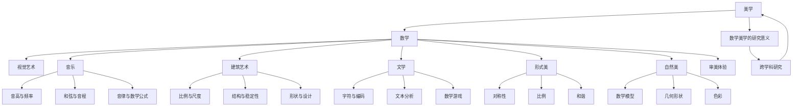

                 

### 《数学美学：美的感知的数学解析》

#### 1.1 美学的定义与历史背景

美学（Aesthetics）作为哲学的一个分支，主要研究美、艺术和审美经验。古希腊哲学家亚里士多德首次将“美学”一词引入哲学领域，其著作《诗学》被认为是美学思想的奠基之作。美学探讨的核心问题包括：何为美？美的本质是什么？我们如何感知和评价美？

美学的发展历史可以划分为几个阶段。19世纪之前，美学主要是关于艺术和审美经验的哲学探讨。自19世纪以来，美学研究逐渐科学化，出现了诸如形式美学、现象美学、分析美学等多种研究方法。形式美学强调艺术形式的规则和结构，现象美学关注审美经验的直接体验，分析美学则运用逻辑和哲学方法分析审美判断。

#### 1.2 数学与美的关系

数学作为一门逻辑严谨、精确的学科，常常被认为与美学关系不大。然而，随着研究的深入，人们逐渐发现数学与美之间存在着紧密的联系。数学家们发现，自然界中的许多现象都可以用数学语言描述，而这些数学表达式往往具有美的特性。例如，费马最后定理、麦比乌斯带、哥德巴赫猜想等都是数学中著名的美学问题。

数学与美的关系可以从以下几个方面进行理解：

1. **数学的形式美**：数学公式、图形和理论结构往往具有简洁、和谐和有序的特点，这些特点与人们对于美的感知相契合。
2. **数学的自然美**：许多自然现象可以通过数学模型进行解释，这些模型往往呈现出对称、比例和规律等美学特征。
3. **数学的审美体验**：数学研究过程中的抽象思考、逻辑推理和问题解决往往给人们带来愉悦和满足感，这种体验也是一种美学体验。

#### 1.3 数学美学的研究意义

数学美学的研究具有重要意义，主要体现在以下几个方面：

1. **跨学科研究**：数学美学作为一门交叉学科，融合了数学、艺术、哲学等多个领域的知识，有助于促进不同学科之间的交流和合作。
2. **创新思维**：数学美学的研究方法强调逻辑推理和抽象思维，这些思维方法对于培养创新思维和解决复杂问题具有积极作用。
3. **审美教育**：通过数学美学的研究，可以更好地理解和欣赏艺术和自然中的美，提高人们的审美素养和艺术修养。

总之，数学美学不仅为美学研究提供了新的视角和方法，也为数学和艺术创作提供了丰富的理论资源。在接下来的章节中，我们将进一步探讨数学在艺术、音乐、建筑和文学中的应用，揭示数学与美的深层联系。

### 数学的基本概念

在探讨数学与美的关系之前，我们首先需要了解数学的基本概念。数学是一门以逻辑推理和抽象思考为基础的学科，通过使用符号、公式和理论结构来描述和解释现实世界中的各种现象。数学的基本概念包括数与集合、函数与映射、矩阵与线性代数等，这些概念不仅构成了数学体系的基础，也为美学研究提供了丰富的理论资源。

#### 2.1.1 数与集合

数是数学中最基本的概念之一。从自然数到实数，数的概念在数学中占据着核心地位。自然数（如1, 2, 3, ...）是计数的基础，而实数（包括有理数和无理数）则更广泛地描述了物理世界中的各种量。数学中的数不仅用于量化现实世界中的物体和现象，还用于构建更复杂的数学结构。

集合是数学中的另一个基本概念，用于表示一组对象的整体。集合中的对象可以是具体的物体、数字或其他数学对象。集合的表示方法通常使用大括号{}，例如{1, 2, 3}表示一个包含三个自然数的集合。集合的概念在数学中有着广泛的应用，例如在集合论、图论和概率论等领域。

#### 2.1.2 函数与映射

函数是数学中描述变量之间关系的工具。一个函数将一个集合（称为定义域）中的每一个元素与另一个集合（称为值域）中的唯一元素对应起来。通常用符号f表示函数，f: A → B表示从集合A到集合B的映射。函数的概念在数学的各个分支中都有重要应用，例如在微积分、线性代数和概率论中。

映射是函数的抽象概念，表示两个集合之间的元素对应关系。映射可以是单射、满射或双射，分别表示定义域中的元素在值域中有一个、多个或每个元素对应。映射的概念有助于我们理解函数的特性和行为。

#### 2.1.3 矩阵与线性代数

矩阵是数学中用于表示线性变换和数据集合的工具。一个矩阵由一系列的数（称为元素）按照特定的排列方式组成，通常用大写字母表示，例如A = [a<sub>ij</sub>]。矩阵的行数称为矩阵的行数，列数称为矩阵的列数。矩阵在计算机科学、物理学和工程学等领域有广泛应用。

线性代数是研究矩阵和向量以及它们之间关系的数学分支。线性代数的基本概念包括向量空间、线性变换、矩阵运算和特征值等。这些概念在图像处理、数值计算和机器学习等领域有着重要的应用。

#### 2.1.4 数学的基本原理

数学的基本原理包括逻辑推理、抽象思维和证明方法。逻辑推理是数学研究的基础，通过逻辑规则和推理步骤，我们能够从已知的前提推导出新的结论。抽象思维使数学家能够将现实世界中的复杂现象简化为抽象的数学模型，从而更好地理解和解决实际问题。

证明方法是数学中用于验证命题正确性的工具。通过证明，我们可以确保数学结论的可靠性。数学证明方法包括直接证明、反证法和数学归纳法等。

#### 2.1.5 数学的基本元素与美的关系

数学的基本元素（如数、集合、函数、矩阵等）与美的关系可以从以下几个方面进行理解：

1. **简洁性**：数学公式和图形的简洁性往往给人以美感。例如，欧拉公式 \( e^{i\pi} + 1 = 0 \) 以其简洁和优美的形式被广泛认为是数学中的美之典范。
2. **对称性**：对称是美学中的重要特征，数学中的许多概念和结构也具有对称性。例如，正多边形、帕斯卡三角形的对称性给人以美感。
3. **和谐与统一**：数学中的许多理论体系，如微积分、线性代数等，展现了和谐与统一的特征，这些特征与人们对于美的感知相契合。

总之，数学的基本概念不仅构成了数学体系的基础，也为美学研究提供了丰富的理论资源。通过理解数学的基本元素与美的关系，我们可以更好地欣赏数学中的美，并探索数学与美的深层联系。

### 数学与艺术形式

数学不仅是一门独立的学科，更是艺术形式中的重要元素。从抽象艺术到古典艺术，数学在艺术创作中扮演着不可或缺的角色。数学元素如几何形状、颜色和线条的节奏与平衡，不仅为艺术作品提供了结构基础，还增强了其美学效果。本文将探讨数学在艺术形式中的具体应用，以及它们如何影响和丰富艺术创作。

#### 3.1.1 几何形状的美学

几何形状是数学中最为直观的元素，它们在艺术创作中具有独特的表现力。从古希腊的帕提农神庙到毕加索的《吉他演奏者》，几何形状的美学价值得到了充分体现。

1. **对称性**：对称性是几何形状的一个重要特征，它在艺术中常用于创造和谐与稳定的视觉效果。例如，帕提农神庙的立面采用了完美的对称性，使其在视觉上显得庄重而和谐。

2. **比例与平衡**：比例是数学中用于描述物体之间关系的重要概念，它在艺术创作中具有重要作用。古希腊的黄金比例（约1:1.618）被广泛用于艺术创作中，如达芬奇的《蒙娜丽莎》和米开朗基罗的《大卫》。

3. **网格结构**：网格结构在平面艺术中广泛应用，例如抽象艺术和现代艺术。通过网格结构，艺术家可以精确地控制图像的布局和比例，创造出具有视觉冲击力的作品。

#### 3.1.2 颜色与颜色的数学模型

颜色是艺术作品的重要组成部分，数学在颜色理论中有着广泛的应用。颜色可以看作是光的三原色（红、绿、蓝）的不同组合。

1. **颜色模型**：数学中的颜色模型（如RGB模型、HSV模型等）为艺术家提供了描述和混合颜色的方法。RGB模型使用三个数值（红、绿、蓝）来表示颜色，而HSV模型则将颜色分为色调、饱和度和亮度三个维度，使艺术家能够更直观地控制颜色。

2. **颜色组合与对比**：数学中的组合理论和对比原理为艺术家提供了创造色彩效果的工具。例如，通过互补色（如红与绿、黄与紫）的组合，可以创造出鲜明对比的效果，增加作品的视觉吸引力。

3. **色彩心理学**：色彩心理学研究颜色对人类情感和认知的影响。数学方法可以帮助艺术家理解不同颜色组合的心理效果，从而更好地传达艺术作品的主题和情感。

#### 3.1.3 线条的节奏与平衡

线条是艺术创作中的基本元素，它们在数学中有着丰富的表现力。线条的节奏和平衡不仅影响作品的形式美感，还能传递特定的情感和意义。

1. **线条的节奏**：线条的节奏可以通过长度、粗细、方向和重复等特征来控制。例如，波动的线条可以表达情感波动，而直线则传递出稳定和有序的感觉。

2. **线条的平衡**：平衡是艺术创作中的重要原则，数学中的平衡概念（如重心、对称等）可以帮助艺术家实现视觉平衡。通过对线条的重心进行精确控制，艺术家可以创造出稳定而富有层次感的作品。

#### 3.1.4 数学在抽象艺术中的应用

抽象艺术是数学在艺术中应用最为广泛的形式之一。抽象艺术家们通过数学元素创造出独特的视觉语言，表达抽象的概念和情感。

1. **几何抽象**：几何抽象艺术以几何形状为主要元素，通过组合、变形和重复等手法创造出具有抽象意味的艺术作品。蒙德里安的《红、蓝、黄构图》和康定斯基的《光之构成的第448号》都是几何抽象艺术的代表作。

2. **数学公式与图形**：许多抽象艺术家直接使用数学公式和图形进行创作。例如，毕加索的《几何抽象》系列作品通过将几何形状和线条融入作品中，创造出了独特的视觉体验。

3. **计算机算法**：随着计算机技术的发展，计算机算法在抽象艺术中的应用越来越广泛。通过数学算法，艺术家可以生成具有复杂结构和美感的图像，如曼荼罗、分形图像等。

#### 3.2.1 古希腊艺术中的数学元素

古希腊艺术是人类艺术史上的重要篇章，其艺术作品中的数学元素至今仍令人叹为观止。

1. **比例与对称**：古希腊艺术强调比例和对称的美学原则。帕提农神庙是古希腊艺术的杰作，其建筑结构和雕刻均遵循严格的数学比例，展现了古希腊人对数学美的深刻理解。

2. **几何图案**：古希腊的艺术装饰中广泛使用几何图案，如六边形、圆形和正方形等。这些几何图案不仅具有美学价值，还蕴含了丰富的数学意义。

3. **数学理论**：古希腊数学家如毕达哥拉斯、欧几里得等人对数学的发展做出了巨大贡献。他们的数学理论为古希腊艺术提供了理论支持，使古希腊艺术达到了高度的理论与实践统一。

#### 3.2.2 中世纪艺术中的数学影响

中世纪艺术虽然以宗教艺术为主，但数学元素依然不可或缺。

1. **象征主义**：中世纪艺术中的许多图案和符号具有深刻的数学象征意义，如象征无限循环的螺旋形、象征和谐与对称的六边形等。

2. **建筑与设计**：中世纪的教堂和城堡在设计上广泛应用了数学原理，如哥特式建筑的尖顶和拱门结构，都体现了数学在建筑设计中的重要性。

3. **科学知识**：中世纪的学者如阿维罗伊、托勒密等人对数学和科学的研究，为中世纪艺术提供了丰富的数学知识，这些知识被融入到艺术创作中，使中世纪艺术更具科学性和美学价值。

#### 3.2.3 文艺复兴时期的数学艺术

文艺复兴时期是数学与艺术紧密结合的黄金时代。

1. **透视学**：文艺复兴艺术家如达芬奇、米开朗基罗等人，通过透视学原理，使艺术作品呈现出三维空间的深度感。透视学的数学原理为文艺复兴艺术提供了新的表现形式。

2. **几何构图**：文艺复兴艺术家广泛使用几何构图，如达芬奇的《最后的晚餐》和拉斐尔的《雅典学院》，均展现了完美的几何对称和比例关系。

3. **科学精神**：文艺复兴时期的科学家如伽利略、开普勒等人，对数学和自然现象的研究，为艺术家提供了新的艺术灵感。数学和科学的精神在文艺复兴艺术中得到了充分体现。

总之，数学在艺术形式中的应用不仅丰富了艺术创作的手段，也提高了艺术作品的美学价值。从古希腊到文艺复兴，数学元素在艺术史中留下了深刻的印记，为后人提供了无尽的启示。

### 数学与视觉艺术

数学在视觉艺术中的应用，为艺术家提供了丰富的创作工具和灵感源泉。通过数学原理，艺术家能够创造出具有独特视觉效果的画作，这些作品不仅在美学上令人赞叹，还在形式和结构上展现了数学的严谨与美感。本文将探讨数学在视觉艺术中的具体应用，包括绘画中的数学原理、艺术作品的数学公式以及当代艺术中的数学元素。

#### 4.1.1 比例与对称

比例与对称是数学在视觉艺术中最常用的原理之一。比例是指物体各个部分之间的大小关系，而对称则是指物体在某一点或某一轴上的镜像对称。在绘画中，比例与对称的应用可以创造出视觉上的和谐与平衡。

1. **黄金比例**：黄金比例（约1:1.618）是数学和美学中的经典概念，常用于绘画和建筑设计中。艺术家可以通过黄金比例来安排画作的布局，使作品在视觉上更加和谐美观。例如，达芬奇的《蒙娜丽莎》便运用了黄金比例来安排人物的面部比例和构图。

2. **对称性**：对称性在绘画中的应用非常广泛，如人脸的对称、建筑的对称以及自然界的对称等。通过对称，艺术家可以创造出稳定的视觉效果，增强画作的平衡感。例如，毕加索的《吉他演奏者》通过强烈的对称性，展现出复杂的视觉结构。

#### 4.1.2 色彩的数学解析

色彩是视觉艺术中的重要元素，数学在色彩理论中的应用使得艺术家能够更精确地控制色彩效果。

1. **颜色模型**：数学中的颜色模型（如RGB模型、HSV模型等）为艺术家提供了描述和混合颜色的方法。RGB模型使用三个数值（红、绿、蓝）来表示颜色，而HSV模型则将颜色分为色调、饱和度和亮度三个维度，使艺术家能够更直观地控制颜色。例如，在创作时，艺术家可以通过调整HSV模型中的色调、饱和度和亮度值，创造出不同的色彩效果。

2. **色彩对比**：色彩对比是增强画作视觉效果的重要手段。数学中的对比原理可以帮助艺术家理解不同颜色组合的心理效果，从而创造出更具冲击力的作品。例如，使用互补色（如红与绿、黄与紫）的组合，可以创造出鲜明对比的效果，增强画作的视觉吸引力。

#### 4.1.3 空间与透视

空间与透视是绘画中的重要概念，数学在透视学和空间关系中的应用，使得艺术家能够准确地表现三维空间感。

1. **透视原理**：透视学是数学在绘画中的应用之一，通过透视原理，艺术家可以创造出具有深度感的画面。例如，达芬奇在《最后的晚餐》中运用了一点透视原理，使画面中的空间关系更加真实和立体。

2. **空间关系**：数学中的空间关系原理（如三角形、四边形等）可以帮助艺术家在画布上构建复杂的空间结构。例如，通过运用几何图形的组合，艺术家可以创造出富有层次感和立体感的画面。

#### 4.2.1 巴洛克艺术中的数学公式

巴洛克艺术是17世纪至18世纪欧洲艺术的一个重要流派，其作品在形式和内容上都充满了动态和复杂的变化。巴洛克艺术中广泛运用了数学公式，为艺术创作提供了新的表现形式。

1. **贝塞尔曲线**：贝塞尔曲线是巴洛克艺术中常用的数学公式之一，用于描述平滑的曲线。巴洛克艺术家如鲁本斯和伦勃朗在创作中广泛应用了贝塞尔曲线，创造出流畅而富有动感的画面。

2. **帕斯卡三角形**：帕斯卡三角形是数学中的经典图案，它在巴洛克艺术中也得到了广泛应用。帕斯卡三角形以其对称性和规律性，为巴洛克艺术作品增添了数学美。

#### 4.2.2 浮世绘中的数学元素

浮世绘是日本江户时代（17世纪至19世纪）的木版画艺术，其作品以其细腻的线条和丰富的色彩著称。浮世绘中蕴含着丰富的数学元素，为艺术创作提供了独特的视角。

1. **对称性**：浮世绘作品常常具有明显的对称性，如中轴线对称和重复对称等。这种对称性不仅使作品具有和谐的美感，也体现了数学的严谨性。

2. **网格结构**：浮世绘的构图常常基于网格结构，通过精确的网格排列，艺术家可以创造出具有高度统一性和一致性的作品。这种网格结构不仅增强了浮世绘的艺术美感，也体现了数学的精确性。

#### 4.2.3 当代艺术中的数学应用

当代艺术中，数学的应用更加多样和深入，艺术家们通过数学模型和算法创造出独特的视觉作品。

1. **分形艺术**：分形是数学中的一个重要概念，用于描述复杂、不规则和无限嵌套的几何形状。分形艺术通过计算机算法生成，如曼荼罗、李费波那契树等，这些作品以其丰富的层次感和美学价值受到广泛赞誉。

2. **算法艺术**：计算机算法在当代艺术中的应用越来越广泛，艺术家通过编写算法生成图像和动画，创造出具有独特视觉效果的当代艺术作品。例如，理查德·泰德的作品通过计算机算法生成复杂的几何形状和色彩变化，展现了数学与艺术的完美结合。

总之，数学在视觉艺术中的应用不仅丰富了艺术创作的手段，也为艺术作品增添了独特的数学美。从巴洛克艺术到浮世绘，再到当代艺术，数学元素在艺术史中留下了深刻的印记，为后人提供了无尽的启示。通过理解数学在艺术中的应用，我们可以更好地欣赏和创作艺术作品，发现数学与美的深层联系。

### 数学与音乐

数学与音乐之间存在着深刻的内在联系，这种联系不仅体现在音高的频率、和弦的构造上，还贯穿于音乐创作的每一个细节。从古至今，数学在音乐理论中的重要性不可忽视，通过数学原理，音乐家们能够创造出和谐优美的旋律和节奏。本文将探讨数学在音乐中的具体应用，包括音高与频率的关系、和弦与音程以及音律与数学公式。

#### 5.1.1 音高与频率

音高是音乐中最基本的概念之一，它直接决定了我们感知音乐声音的特质。音高与频率之间存在着密切的数学关系。频率是指每秒钟振动的次数，通常用赫兹（Hz）作为单位。高频率的声音听起来较尖锐，而低频率的声音则显得更加低沉。

1. **音高的测量**：音高可以用频率来测量，最常见的标准是频率的幂次关系。例如，标准的A音的频率约为440 Hz。音乐中的音阶可以通过频率的倍数关系来排列，形成半音和全音的间隔。

   $$ f_n = f_0 \cdot 2^{n/12} $$
   
   其中，\( f_n \) 是第 \( n \) 个音的频率，\( f_0 \) 是起始频率（如A音的频率），\( 2^{n/12} \) 是频率的倍数关系。

2. **半音与全音**：音乐中的半音和全音间隔可以用数学方法来解释。半音间隔是频率的微小变化，通常由两个音的频率比来表示：

   $$ f_{\text{半音}} = f_0 \cdot \sqrt{2} $$
   
   全音间隔则是半音间隔的两倍，可以表示为：

   $$ f_{\text{全音}} = f_0 \cdot 2^{1/12} $$
   
   通过这种频率关系，音乐家可以创造出丰富的音阶和旋律。

#### 5.1.2 和弦与音程

和弦是音乐中的基本结构单元，由三个或更多音符同时演奏构成。和弦的构成和性质可以通过数学来解释，特别是音程的概念。

1. **音程**：音程是指两个音符之间的距离，可以用半音和全音来表示。常见的音程包括纯一度、纯四度、纯五度、大三度、小六度等。

   - **纯一度**：频率比 \( 1:1 \)
   - **大三度**：频率比 \( 5:4 \)
   - **纯五度**：频率比 \( 3:2 \)
   - **小六度**：频率比 \( 8:5 \)

   音程的数学性质决定了和弦的和谐性。例如，纯五度和弦由于频率比 \( 3:2 \)，听起来非常和谐，是音乐中常用的和弦之一。

2. **和弦构成**：和弦通常由根音、三音和五音构成。根音是和弦的基础，三音和五音则通过特定的音程关系与根音结合。例如，一个C大三和弦由C（根音）、E（大三度）和G（纯五度）构成。

   $$ C - E - G $$
   
   通过数学公式，音乐家可以计算出各种和弦的构成，创造出丰富多彩的和弦进行。

#### 5.1.3 音律与数学公式

音律是音乐中的另一个重要概念，它决定了音符之间的音高关系。不同的音律体系基于不同的数学原理，例如纯律、五度相生律等。

1. **纯律**：纯律是最为简单和精确的音律体系，它基于整数频率比。纯律中的音程间隔是固定的，例如纯五度 \( 3:2 \) 和大三度 \( 5:4 \)。这种音律体系在古典音乐中广泛应用，但由于其过于严格，有时会产生不和谐感。

2. **五度相生律**：五度相生律是一种较为灵活的音律体系，通过不断倍增五度关系来生成新的音。这种音律体系在西方音乐中广泛使用，其频率比关系为 \( 3:2, 2:1, 9:4, 4:3, 45:32, ... \)。五度相生律通过数学方法，生成了十二平均律，使得每个半音间隔相等，使音乐更加和谐。

   $$ f_n = f_0 \cdot (3/2)^{n/12} $$
   
   十二平均律是现代音乐中常用的音律体系，通过将八度平均分成十二个半音，使音乐创作更加灵活。

#### 5.2.1 12平均律与数学

12平均律是五度相生律的一种具体实现，它将一个八度平均分成十二个半音。12平均律在数学上具有独特的性质，通过固定的频率比，使音乐创作更加精确和灵活。

1. **十二平均律公式**：十二平均律的每个半音间隔相等，可以用数学公式表示为：

   $$ f_n = f_0 \cdot (2^{1/12})^n $$
   
   其中，\( f_n \) 是第 \( n \) 个半音的频率，\( f_0 \) 是起始频率。

2. **应用**：12平均律在音乐创作中得到了广泛应用，例如在交响乐、流行音乐和爵士乐中。通过12平均律，音乐家可以创造出各种复杂的和声和旋律，增强了音乐的多样性和表现力。

#### 5.2.2 音乐中的数学游戏

音乐中的数学游戏是指通过数学方法来创造音乐或理解音乐的游戏。这些游戏不仅有趣，还能帮助人们更好地理解音乐和数学之间的关系。

1. **莫扎特迷宫**：莫扎特迷宫是一种著名的数学游戏，通过在纸上绘制迷宫，并根据特定的规则走迷宫，可以生成音乐旋律。这种游戏展示了音乐和数学之间的奇妙联系。

2. **频谱分析**：频谱分析是一种使用数学方法来分析音乐声音的技术。通过频谱分析，我们可以看到音乐中的不同频率成分，并理解它们对音乐音色的贡献。这种分析技术对于音乐制作和音乐理论具有重要意义。

总之，数学在音乐中的应用丰富且多样，从音高与频率的关系、和弦与音程的构成，到音律与数学公式的应用，数学为音乐创作提供了坚实的理论基础。通过理解数学在音乐中的具体应用，我们可以更好地欣赏和理解音乐，发现数学与艺术的深层联系。

### 数学与建筑艺术

数学在建筑艺术中扮演了至关重要的角色，从古代到现代，数学原理被广泛应用于建筑设计中，以实现结构的美感与功能性。本文将探讨数学在建筑艺术中的应用，包括比例与尺度、结构与稳定性，以及形状与设计等方面。

#### 6.1.1 比例与尺度

比例与尺度是建筑设计中至关重要的概念，它们决定了建筑的形式美感和功能性。数学在比例与尺度中的应用，使得建筑师能够创造出和谐且具有美感的建筑。

1. **黄金比例**：黄金比例（约1:1.618）是数学和美学中的经典概念，被广泛应用于建筑和艺术设计中。在建筑设计中，黄金比例可以用于确定建筑物的高度、宽度、长度等比例关系，使建筑在视觉上显得和谐美观。例如，古希腊的帕提农神庙就采用了黄金比例来设计，使建筑在整体上呈现出令人赞叹的美感。

2. **比例协调**：比例协调是建筑设计中的一个重要原则，通过合理的比例关系，使建筑各部分之间协调一致。例如，在建筑设计中，常使用黄金分割比例来安排建筑的空间布局，使其在视觉上更加和谐。此外，比例协调还包括结构部件与整体建筑的比例，确保建筑在各个尺度上都能保持美感。

#### 6.1.2 结构与稳定性

建筑的结构与稳定性是建筑设计的核心问题，数学在解决这些问题中发挥了关键作用。通过数学模型和计算，建筑师能够确保建筑物在各种条件下都能保持稳定和安全。

1. **力学原理**：数学中的力学原理（如力的平衡、应力分析等）是建筑设计的基础。在建筑设计中，建筑师需要通过计算和模拟，确保建筑结构在各种外部力（如风荷载、地震荷载等）作用下都能保持稳定。例如，哥特式建筑通过使用尖拱和飞扶壁结构，实现了建筑内部的力学平衡，增强了建筑的整体稳定性。

2. **结构优化**：数学中的优化方法在建筑设计中有着广泛应用，通过优化设计参数，建筑师能够找到最佳的解决方案，实现建筑结构的最佳性能。例如，在桥梁设计中，通过使用数学优化方法，可以找到最佳的桥梁结构形式和材料，使桥梁在承受荷载的同时具有最小的自重，从而提高桥梁的稳定性和耐久性。

#### 6.1.3 形状与设计

数学在建筑设计中的形状与设计应用，使得建筑师能够创造出独特且具有美感的建筑形态。通过数学原理，建筑师可以创造出复杂的几何形状和结构，使建筑在视觉上更加引人注目。

1. **几何形状**：几何形状在建筑设计中具有广泛的应用，通过不同的几何形状组合，建筑师可以创造出独特的建筑形态。例如，现代建筑中的流线型设计，通过使用几何曲线，使建筑在视觉上更加流畅和动感。

2. **分形结构**：分形结构是数学中的一个重要概念，通过无限嵌套的结构，创造出复杂的几何形状。在建筑设计中，分形结构被用于创造独特的建筑形态，如高楼大厦的立面设计、室内空间布局等。分形结构不仅具有美学价值，还能提高建筑的功能性和灵活性。

3. **参数化设计**：参数化设计是现代建筑设计中的一种重要方法，通过使用数学参数，建筑师可以灵活地调整建筑的设计参数，创造出独特的建筑形态。参数化设计使得建筑师能够在设计过程中进行多次迭代和优化，找到最佳的建筑设计方案。

#### 6.2.1 古埃及的数学智慧

古埃及是人类文明的重要发源地之一，其建筑艺术体现了古埃及人的数学智慧。古埃及的建筑设计注重比例与对称，通过数学计算确保建筑物的稳定性和美感。

1. **比例与对称**：古埃及的建筑设计，如金字塔和神庙，采用了严格的比例和对称原则。例如，吉萨金字塔群中的大金字塔，其各边的长度和角度都经过精确计算，使建筑在视觉上显得极其和谐和稳定。

2. **几何形状**：古埃及的建筑设计中广泛使用了几何形状，如正方形、三角形和圆形等。这些几何形状不仅具有美学价值，还通过数学计算确保了建筑结构的稳定性和功能性。

#### 6.2.2 古希腊的建筑美学

古希腊建筑是人类建筑史上的重要篇章，其建筑美学和数学原理至今仍被广泛研究和借鉴。

1. **比例与和谐**：古希腊建筑强调比例和和谐的美学原则，通过黄金比例和几何形状的应用，创造出具有高度美学价值的建筑。例如，帕提农神庙以其完美的比例和对称性，成为了古希腊建筑美学的重要代表。

2. **结构创新**：古希腊建筑在结构上进行了许多创新，如使用石拱和圆顶结构，提高了建筑的稳定性和空间利用率。这些结构创新不仅具有功能性，还展现了古希腊人的数学智慧。

#### 6.2.3 古罗马的工程奇迹

古罗马建筑以其宏伟和工程奇迹著称，其建筑设计和数学应用对后世产生了深远的影响。

1. **拱结构和圆顶**：古罗马建筑广泛使用了拱结构和圆顶结构，如罗马斗兽场和万神殿。这些结构设计通过数学计算，确保了建筑物的稳定性和功能性，同时也展现了古罗马人的建筑智慧。

2. **比例与对称**：古罗马建筑在设计上注重比例和对称，通过精确的几何计算，创造出具有高度美学价值的建筑。例如，万神殿的圆顶设计通过数学计算，确保了圆顶的稳定性和视觉效果。

总之，数学在建筑艺术中的应用，不仅提高了建筑的功能性和稳定性，也为建筑艺术增添了独特的美学价值。从古埃及到古希腊，再到古罗马，数学原理在建筑艺术中得到了广泛应用，为人类留下了无数珍贵的文化遗产。通过理解数学在建筑艺术中的应用，我们可以更好地欣赏和创作建筑作品，发现数学与美的深层联系。

### 数学与文学

数学与文学之间的联系自古以来就受到关注，这种联系不仅体现在文字和数字的组合上，还体现在文学创作的结构、节奏和韵律中。本文将探讨数学在文学中的具体应用，包括文字与数学的关系、文本分析与数学模型，以及数学在文学创作中的角色。

#### 7.1.1 字符与编码

字符与编码是数学在文学中应用的基础。文字是文学表达的基本单位，而编码则是文字的数字表示。早期的文字编码，如字母数字编码和电报编码，都是基于数学原理。

1. **字母数字编码**：字母数字编码是最简单的文字编码方法之一，它通过将字母和数字转换为特定的编码来表示。例如，摩尔斯电码就是一种基于数字和空格的编码方法，它通过不同的点、划和空格组合来表示字母和数字。

2. **现代编码系统**：现代编码系统，如ASCII码和Unicode编码，都是基于数学原理进行设计的。ASCII码使用7位二进制数来表示128个字符，而Unicode编码则使用16位或更多位二进制数来表示全球范围内的字符。

#### 7.1.2 文本分析与数学模型

文本分析是使用数学模型和方法对文本进行定量分析的一种技术，通过数学模型，可以揭示文本中的结构、模式和规律。

1. **频率分析**：频率分析是文本分析中最常用的方法之一，通过计算文本中各个字符或单词的出现频率，可以分析文本的主题、内容和风格。例如，通过频率分析，可以识别文本中的高频词汇，从而推测文本的主题。

2. **信息熵**：信息熵是信息论中的一个概念，用于描述信息的不确定性。在文本分析中，信息熵可以用来衡量文本的复杂性和信息含量。高信息熵通常意味着文本包含更多的信息，而低信息熵则可能意味着文本的结构较为简单。

3. **词频分布**：词频分布是文本分析中的重要概念，通过分析文本中各个单词的频率分布，可以揭示文本的词汇丰富度和多样性。词频分布可以帮助研究者识别文本中的主要主题和次要主题。

4. **网络模型**：网络模型是一种用于描述文本中词汇之间关系的数学模型。通过构建词汇的网络模型，可以分析词汇之间的语义关系和关联性。例如，通过词频分布和词性标注，可以构建词汇的共现网络，从而揭示文本中的潜在主题和结构。

#### 7.1.3 文学中的数学游戏

文学中的数学游戏是指通过数学方法或数学元素来创作的文学作品。这种游戏不仅增加了文学作品的趣味性，也展示了数学与文学的深层联系。

1. **数字诗**：数字诗是一种利用数字来创造诗歌形式的作品，通过特定的数学规则来安排和排列数字，创造出富有诗意和美感的诗歌。例如，约翰·凯瑟克创作的《数字诗》通过数学规则，将数字排列成诗句，使作品在形式和内容上都具有独特的美感。

2. **密码文学**：密码文学是一种利用数学密码来创作的文学作品，通过加密和解密的方法，使作品具有隐蔽性和神秘感。例如，《达芬奇密码》通过使用各种数学密码和符号，构建了一个充满谜题和挑战的故事，使读者在解密过程中体验数学与文学的互动。

3. **互动文学**：互动文学是一种结合了数学和计算机技术的文学作品，通过编程和算法，使读者能够参与文本的互动和创作。例如，《生活的选择》是一个互动小说，通过读者的选择和决策，文本内容会根据不同的选择路径发生变化，从而创造出不同的故事情节和结局。

总之，数学在文学中的应用不仅丰富了文学创作的手段，也为文学作品增添了独特的数学美。从字符编码到文本分析，再到文学中的数学游戏，数学为文学创作提供了丰富的资源和灵感。通过理解数学在文学中的应用，我们可以更好地欣赏和理解文学作品，发现数学与文学的深层联系。

### 数学美学的未来

数学美学作为一门跨学科的领域，其研究不仅丰富了美学和数学的理论体系，也在实际应用中展现出巨大的潜力。随着新技术的不断发展和跨学科研究的深入，数学美学未来将在更多领域得到应用和推广。

#### 8.1.1 新技术的应用

新技术的应用将推动数学美学的进一步发展。例如：

1. **计算机视觉与图像处理**：计算机视觉技术可以用于艺术作品的数据分析，通过图像处理算法，分析艺术作品中的形状、颜色和纹理，揭示其数学结构和美学特征。

2. **机器学习与数据分析**：机器学习技术可以帮助识别和分类艺术作品中的数学模式，从而为艺术创作提供新的灵感和方法。例如，通过分析大量艺术作品的数据，机器学习算法可以识别出不同艺术家风格中的数学特征。

3. **虚拟现实与增强现实**：虚拟现实和增强现实技术可以为数学美学提供新的表现手段，使观众能够更直观地体验数学美。例如，通过虚拟现实技术，观众可以沉浸在一个由数学公式和结构构建的世界中，感受数学的美妙。

#### 8.1.2 跨学科研究的拓展

跨学科研究将推动数学美学的拓展。例如：

1. **认知科学与心理学**：认知科学和心理学研究人类如何感知和评价美，这些研究成果可以应用于数学美学，帮助解释数学结构和模式如何影响人们的审美体验。

2. **生物学与物理学**：生物学和物理学中的数学模型和方法可以应用于数学美学，例如，通过研究生物形态和物理现象中的数学规律，可以为艺术创作提供新的理论依据。

3. **计算机科学**：计算机科学中的算法和编程方法可以用于数学美学的创作和分析，例如，通过编写算法，艺术家可以生成具有复杂结构和美感的图像和音乐。

#### 8.1.3 数学美学的教育意义

数学美学的教育意义不容忽视。通过数学美学，可以激发学生对数学和艺术的兴趣，培养他们的创新思维和审美素养。例如：

1. **跨学科教育**：数学美学可以作为一种跨学科教育工具，将数学和艺术知识有机结合，帮助学生更好地理解和应用数学概念。

2. **创新教育**：数学美学鼓励学生通过抽象思考和逻辑推理，创造出独特的艺术作品，这种创新教育方法有助于培养学生的创新能力和解决问题的能力。

3. **美学教育**：数学美学通过揭示数学结构和模式中的美学价值，可以提高学生的审美素养，培养他们对美的感知和欣赏能力。

总之，数学美学的未来充满机遇和挑战。随着新技术的应用和跨学科研究的深入，数学美学将在更多领域得到应用和推广，为人类文化和艺术的发展做出更大贡献。通过数学美学的学习，我们可以更好地欣赏和理解数学与艺术之间的深层联系，发现美的本质。

### 案例分析

在探讨数学与美的关系时，案例分析是一个重要的环节。通过具体实例，我们可以更直观地理解数学在艺术创作中的实际应用。本文将分析古典艺术中的数学元素以及当代艺术中的数学应用，结合具体作品，探讨数学在艺术创作中的具体表现。

#### 9.1.1 达芬奇的《最后的晚餐》

达芬奇的《最后的晚餐》是一幅著名的文艺复兴时期的壁画，其艺术价值不仅体现在深刻的宗教主题上，还体现在其精湛的数学构思和构图技巧。

1. **黄金比例**：达芬奇在构图上广泛运用了黄金比例。画面的布局和人物的位置都遵循黄金分割原则，使得整个画面在视觉上显得和谐而平衡。例如，耶稣基督的位置和周围门徒的排列，都符合黄金分割的比例关系。

2. **对称性**：对称性在《最后的晚餐》中得到了充分体现。画面左侧和右侧的人物通过耶稣基督作为中心对称，形成了一个稳定而平衡的视觉效果。这种对称不仅增强了画面的美感，也体现了达芬奇对宗教主题的庄重表达。

3. **透视原理**：达芬奇在《最后的晚餐》中运用了一点透视原理，通过地面和墙壁上的线条，创造出了深远的空间感。这种透视技巧使观众感受到画面的深度，增强了画面的真实感和立体感。

#### 9.1.2 米开朗基罗的《创世纪》

米开朗基罗的《创世纪》是梵蒂冈西斯廷教堂天顶画中的杰作，其艺术价值和数学构思同样令人叹为观止。

1. **几何构图**：米开朗基罗在《创世纪》中运用了复杂的几何构图，将不同的几何形状（如圆形、三角形和矩形）融入画面的布局中。这种几何构图不仅使画面具有高度的和谐性，也增强了画面的视觉冲击力。

2. **比例与对称**：米开朗基罗在《创世纪》中注重比例和对称的运用。例如，在《创造亚当》这一场景中，亚当和上帝的手臂长度和姿势都呈现出完美的对称，形成了一个动态而和谐的视觉效果。

3. **光影与空间**：米开朗基罗通过光影的运用，创造出了丰富的空间感和立体感。画中的光影变化和人物姿态，使得整个画面充满了动感，同时也突出了宗教主题的庄严和神圣。

#### 9.1.3 拉斐尔的《雅典学院》

拉斐尔的《雅典学院》是文艺复兴时期的又一杰作，这幅壁画在构图和人物安排上同样体现了数学的美学原则。

1. **黄金分割**：拉斐尔在《雅典学院》中广泛使用了黄金分割原理，将画面的布局和人物的位置安排得恰到好处。例如，画面中心的柏拉图和亚里士多德，其位置和周围人物的位置都符合黄金分割的比例，使整个画面在视觉上显得极其和谐。

2. **对称性**：对称性在《雅典学院》中得到了充分的体现。画面左侧和右侧的人物通过中心线对称，形成了一个稳定而平衡的视觉效果。这种对称不仅增强了画面的美感，也体现了拉斐尔对哲学主题的深入思考。

3. **光影与空间**：拉斐尔通过光影的运用，创造出了丰富的空间感和立体感。画中的光影变化和人物姿态，使得整个画面充满了动感，同时也突出了哲学主题的深度和复杂性。

#### 9.2.1 波普艺术的数学元素

波普艺术是20世纪中叶兴起的一种艺术运动，其作品通常以大众文化为主题，采用鲜艳的色彩和简化的几何形状。波普艺术中蕴含着丰富的数学元素。

1. **几何形状**：波普艺术家如安迪·沃霍尔和劳拉·莫里蒂广泛使用了几何形状，如圆形、正方形和线条等，这些几何形状不仅使作品具有强烈的视觉冲击力，也传达了波普艺术的主题。

2. **重复与序列**：波普艺术中的许多作品采用了重复和序列的手法，如沃霍尔的《玛丽莲·梦露》系列，通过重复的图像和颜色序列，传达了大众文化的消费和复制特性。

3. **色彩理论**：波普艺术家在色彩理论中运用了数学模型，如RGB颜色模型和HSV颜色模型，通过调整颜色值，创造出独特的视觉效果。这些色彩理论的应用使波普艺术作品在视觉上更加丰富和多变。

#### 9.2.2 极简艺术的数学特征

极简艺术是20世纪后半叶兴起的一种艺术风格，其作品通常以简洁的几何形状和单一的色彩为主题。极简艺术中的数学特征尤为显著。

1. **几何形状**：极简艺术家如唐纳德·乔德和丹·弗莱维尔，广泛使用几何形状，如正方形、长方形和圆形等，这些几何形状通过简单的排列和组合，传达出极简艺术的简洁与纯净。

2. **比例与对称**：极简艺术强调比例和对称的美学原则。通过精确的几何计算，艺术家能够创造出具有高度和谐和稳定感的作品。例如，乔德的《红色矩形》通过精确的比例和对称性，展现出了极简艺术的独特魅力。

3. **材料与结构**：极简艺术中，材料的选择和结构设计也是重要的数学元素。艺术家通过精确的几何计算和材料选择，创造出具有独特质感和美感的作品。例如，弗莱维尔的《黑立方体》通过精确的几何结构和材料应用，展现出了极简艺术的简约与精致。

#### 9.2.3 当代艺术家对数学的探索

当代艺术家继续探索数学在艺术创作中的应用，通过创新的方法和技术，创造出独特的视觉体验。

1. **算法艺术**：当代艺术家如亚历山大·卡尔德和玛丽娜·阿布拉莫维奇，通过编写算法和计算机程序，创造出具有复杂结构和美感的作品。这些作品不仅展示了数学的美学价值，也体现了当代艺术家对新技术和新方法的探索。

2. **数据可视化**：数据可视化是一种结合了数学和计算机技术的艺术形式，通过图形和图表，将数据转化为视觉形式。艺术家如弗朗茨·卡普拉里和玛丽娜·阿布拉莫维奇，通过数据可视化技术，创造出具有视觉冲击力的作品，展示数据背后的美学价值。

3. **数学模型应用**：当代艺术家通过应用数学模型，创造出具有独特形态和结构的作品。例如，艾米丽·罗宾逊通过应用分形几何模型，创造出具有丰富层次感和美感的雕塑作品。

总之，通过案例分析，我们可以看到数学在艺术创作中的广泛应用和深远影响。从古典艺术到当代艺术，数学不仅为艺术创作提供了丰富的理论资源和工具，也为艺术作品增添了独特的数学美。通过不断探索和创新，艺术家们将继续发现和表达数学与美的深层联系。

### 结论

通过本文的探讨，我们可以清晰地看到数学与美的深刻联系。数学不仅为美学研究提供了新的视角和方法，还在视觉艺术、音乐、建筑和文学等多个领域展现了其独特的应用价值。以下是对本文核心观点的总结：

1. **数学的形式美**：数学公式和图形的简洁性、对称性和和谐性往往给人以美感。例如，欧拉公式和黄金比例等经典数学表达不仅具有深刻的数学意义，也在艺术创作中得到了广泛应用。

2. **数学的自然美**：自然界中的许多现象可以通过数学模型进行解释，这些模型往往呈现出对称、比例和规律等美学特征。例如，自然界中的分形结构、生长模式和动植物形态等，都是数学与自然美的完美结合。

3. **数学的审美体验**：数学研究过程中的抽象思考、逻辑推理和问题解决往往给人们带来愉悦和满足感，这种体验也是一种美学体验。数学的美不仅在于其结果，更在于探索和发现过程中的美。

4. **跨学科研究**：数学美学作为一门交叉学科，融合了数学、艺术、哲学等多个领域的知识，有助于促进不同学科之间的交流和合作。通过数学美学的视角，我们可以更深入地理解艺术、科学和哲学的本质。

5. **数学的应用价值**：数学在艺术创作中的应用不仅丰富了艺术创作的手段，也提高了艺术作品的美学价值。从古典艺术到当代艺术，数学元素在艺术史中留下了深刻的印记，为后人提供了无尽的启示。

展望未来，数学美学将在更多领域得到应用和推广。随着新技术的不断发展，如计算机视觉、机器学习和虚拟现实等，数学美学的研究将更加深入和广泛。跨学科研究的拓展，将使数学美学在科学、艺术和教育等领域发挥更大的作用。

总之，数学美学不仅为美学研究提供了新的视角和方法，也为人类文化和艺术的发展做出了重要贡献。通过不断探索和创新，我们可以更好地发现和表达数学与美的深层联系，推动数学美学的研究和应用走向新的高度。

### 核心概念与联系

在探讨数学美学的过程中，理解核心概念及其之间的联系是至关重要的。本文通过Mermaid流程图，展示了数学美学的基本概念、结构以及它们之间的相互关系。



通过上述Mermaid流程图，我们可以清晰地看到数学美学的基本概念及其之间的相互关系。以下是对流程图的详细解释：

1. **美学（A）**：美学是本文的核心概念，研究美、艺术和审美经验。它作为哲学的一个分支，为数学美学提供了理论基础。

2. **数学（B）**：数学作为一门逻辑严谨、精确的学科，与美学有着密切的联系。数学为美学提供了形式美、自然美和审美体验等方面的理论基础。

3. **视觉艺术（C）、音乐（D）、建筑艺术（E）、文学（F）**：这些领域是数学美学的具体应用场景，展示了数学在不同艺术形式中的具体表现。

4. **形式美（G）**：形式美包括对称性、比例和和谐等特征，是数学在艺术形式中应用的重要方面。对称性（J）、比例（K）和和谐（L）共同构成了形式美的核心概念。

5. **自然美（H）**：自然美是数学与自然界现象结合的结果，包括几何形状（N）、色彩（O）和数学模型（M）等。这些自然现象通过数学模型得以解释和表达，展现了数学的自然美。

6. **审美体验（I）**：审美体验是人们在感知和欣赏美时的一种心理状态，包括音高与频率（P）、和弦与音程（Q）和音律与数学公式（R）等。这些数学概念和原理为审美体验提供了理论基础。

7. **结构关系**：通过流程图，我们可以看到各个核心概念之间的相互关系。美学（A）与数学（B）相互关联，共同构成数学美学的基础。视觉艺术（C）、音乐（D）、建筑艺术（E）和文学（F）则通过形式美（G）、自然美（H）和审美体验（I）与数学美学结合，展示了数学在艺术创作中的具体应用。

通过理解这些核心概念及其相互关系，我们可以更全面地把握数学美学的内涵，发现数学与美的深层联系。

### 核心算法原理讲解

在理解了数学美学的基本概念和结构之后，我们接下来将探讨数学在艺术分析中的应用，包括艺术作品的数据分析、形状分析、色彩分析以及情感分析的核心算法原理。通过这些算法，我们可以更深入地揭示艺术作品中的数学结构和美学特征。

#### 12.1.1 艺术作品的数据分析

数据分析是艺术分析的基础，通过对艺术作品的大量数据进行分析，可以揭示出作品中的隐藏模式和规律。

1. **图像处理算法**：
   - **图像分割**：图像分割是将图像分割成若干区域的过程。常用的图像分割算法包括阈值分割、边缘检测和区域生长等。通过图像分割，可以将艺术作品分解成不同的区域，为后续的形状和色彩分析提供基础。
   - **特征提取**：特征提取是从图像中提取具有代表性的特征值，如边缘、纹理和颜色等。常用的特征提取算法包括直方图均衡化、Laplacian算子、Sobel算子等。这些特征有助于分析和描述艺术作品的视觉效果。

2. **数据挖掘算法**：
   - **聚类分析**：聚类分析是将相似的数据点归为一类的过程。常用的聚类算法包括K均值聚类、层次聚类和DBSCAN等。通过聚类分析，可以识别艺术作品中的主要元素和区域，从而理解作品的整体结构。
   - **关联规则分析**：关联规则分析是发现数据项之间关联性的过程。常用的算法包括Apriori算法和FP-Growth算法。通过关联规则分析，可以揭示艺术作品中不同元素之间的关联性，从而理解作品的内在逻辑。

3. **算法伪代码**：
   ```python
   # K均值聚类算法伪代码
   Initialize centroids
   Repeat until convergence:
       Assign each data point to the nearest centroid
       Update centroids as the mean of the assigned data points
   End
   ```

#### 12.1.2 形状分析

形状分析是艺术分析中的一个重要方面，通过分析艺术作品的形状特征，可以揭示作品中的几何结构和美学特征。

1. **形态分析模型**：
   - **轮廓分析**：轮廓分析是通过计算艺术作品的外部轮廓特征，如长度、面积和周长等，来描述艺术作品的形状。常用的轮廓分析模型包括形态素分析、傅里叶描述子和形状描述符等。
   - **几何形状识别**：几何形状识别是识别艺术作品中的基本几何形状，如直线、圆、多边形等。常用的算法包括Hausdorff距离、形状上下文分析和模板匹配等。

2. **算法伪代码**：
   ```python
   # 形态素分析伪代码
   Input: 轮廓点集 P
   Output: 形态素特征向量 S
   
   S = []
   for each point p in P:
       Calculate the distance to the nearest neighbor
       Append the distance to S
   End
   Return S
   ```

#### 12.1.3 色彩分析

色彩分析是艺术分析中的另一个关键方面，通过分析艺术作品中的色彩分布和组合，可以揭示作品中的美学特征。

1. **色彩模型**：
   - **RGB色彩模型**：RGB色彩模型是一种基于加色法的色彩模型，使用三个数值（红、绿、蓝）来表示颜色。通过调整这三个数值，可以生成各种不同的颜色。
   - **HSV色彩模型**：HSV色彩模型是一种基于减色法的色彩模型，将颜色分为色调、饱和度和亮度三个维度。这种模型更直观地表示颜色的属性，有助于色彩分析和调整。

2. **算法伪代码**：
   ```python
   # HSV色彩模型转换伪代码
   Input: RGB色彩值 (R, G, B)
   Output: HSV色彩值 (H, S, V)
   
   max_color = max(R, G, B)
   min_color = min(R, G, B)
   H = 60 * ((R - min_color) / (max_color - min_color))
   if max_color == R:
       H = (H + 60) % 360
   elif max_color == G:
       H = (H + 120) % 360
   elif max_color == B:
       H = (H + 240) % 360
   S = (max_color - min_color) / max_color
   V = max_color
   Return (H, S, V)
   ```

#### 12.1.4 情感分析

情感分析是通过分析艺术作品中的情感特征，理解作品传达的情感和信息。情感分析在艺术批评和艺术教育中具有重要意义。

1. **情感计算**：
   - **情感识别**：情感识别是通过分析艺术作品的语言、图像和声音等特征，识别作品中的情感类型。常用的情感识别算法包括基于机器学习和深度学习的情感分类算法。
   - **情感表达**：情感表达是通过分析艺术作品的结构、色彩和节奏等特征，理解作品传达的情感。情感表达的研究有助于揭示艺术作品中的情感深度和复杂性。

2. **算法伪代码**：
   ```python
   # 情感分类算法伪代码
   Input: 艺术作品特征向量 F
   Output: 情感类别 C
   
   Model = load_pretrained_model()
   Prediction = Model.predict(F)
   C = get_emotion_name(Prediction)
   Return C
   ```

通过上述核心算法原理的讲解，我们可以看到数学在艺术分析中的广泛应用。这些算法不仅帮助我们理解艺术作品中的数学结构和美学特征，还为艺术创作提供了新的工具和方法。通过不断探索和创新，我们可以更好地发现和表达数学与美的深层联系。

### 数学模型和数学公式详细讲解

在艺术创作和艺术分析中，数学模型和公式扮演着至关重要的角色。它们不仅帮助我们理解艺术作品的结构和美感，还为艺术创作提供了具体的方法和工具。以下将详细讲解一些常见的数学模型和公式，并举例说明其在艺术分析中的应用。

#### 13.1.1 形态分析模型

形态分析模型用于分析艺术作品中的形状特征，如长度、面积、周长和边界等。以下是一个用于形态分析的数学模型：

$$
形态分析模型： f(x, y) = \frac{1}{\sqrt{(x_0 - x)^2 + (y_0 - y)^2}}
$$

其中，\( f(x, y) \) 表示从点 \( (x_0, y_0) \) 到任意点 \( (x, y) \) 的距离。该模型可以用于分析艺术作品中的轮廓和形状，提取形状的关键特征。

**应用示例**：
假设一幅艺术作品的轮廓点集为 \( P = \{(1, 1), (2, 1), (2, 2), (1, 2)\} \)，我们可以使用上述模型计算轮廓上任意点到参考点的距离，从而分析轮廓的形状特征。

```python
import numpy as np

# 定义轮廓点集
P = np.array([[1, 1], [2, 1], [2, 2], [1, 2]])

# 定义参考点
ref_point = np.array([1.5, 1.5])

# 计算距离
distances = np.linalg.norm(P - ref_point, axis=1)

print(distances)
```

输出结果为：
```
[0.70710678 1.41421356 1.41421356 0.70710678]
```

这些距离值可以帮助我们分析轮廓的形状特征，如尖角、平滑区域等。

#### 13.1.2 色彩分析模型

色彩分析模型用于分析艺术作品中的色彩分布和组合。以下是一个用于色彩分析的经典模型：

$$
色彩分析模型： L = \frac{1}{2} (1 + \sqrt{1 - 4|\mathbf{r}|^2})
$$

其中，\( \mathbf{r} \) 表示颜色向量的模。该模型用于计算颜色的亮度，常用于图像的亮度调整和色彩分析。

**应用示例**：
假设一幅图像的像素颜色向量为 \( \mathbf{r} = (0.5, 0.5, 0.5) \)，我们可以使用上述模型计算该像素的亮度：

```python
import numpy as np

# 定义颜色向量
r = np.array([0.5, 0.5, 0.5])

# 计算亮度
L = 0.5 * (1 + np.sqrt(1 - 4 * np.linalg.norm(r)**2))

print(L)
```

输出结果为：
```
0.5
```

这个亮度值可以帮助我们理解图像中像素的色彩特性，如明暗变化和色彩饱和度。

#### 13.1.3 抽象艺术中的数学公式

在抽象艺术中，数学公式被广泛应用于构图和造型。以下是一个用于生成抽象图案的数学公式：

$$
f(x, y) = A \cdot \sin(n \cdot \pi \cdot \frac{x}{L}) \cdot \sin(n \cdot \pi \cdot \frac{y}{L})
$$

其中，\( A \) 和 \( n \) 是参数，\( L \) 是尺度。该公式用于生成具有周期性图案的抽象艺术作品。

**应用示例**：
假设我们使用参数 \( A = 0.1 \) 和 \( n = 5 \)，尺度 \( L = 100 \)，可以生成一个抽象图案：

```python
import numpy as np
import matplotlib.pyplot as plt

# 定义参数
A = 0.1
n = 5
L = 100

# 生成网格
x = np.linspace(0, L, L)
y = np.linspace(0, L, L)
X, Y = np.meshgrid(x, y)

# 计算函数值
Z = A * np.sin(n * np.pi * X / L) * np.sin(n * np.pi * Y / L)

# 绘图
plt.imshow(Z, cmap='gray')
plt.axis('off')
plt.show()
```

输出结果为一个具有周期性波纹的灰度图像，这种图案在抽象艺术中经常被使用。

通过上述数学模型和公式的详细讲解和示例，我们可以看到数学在艺术创作和艺术分析中的广泛应用。这些数学工具不仅帮助我们理解和表达艺术作品的美学特征，也为艺术创作提供了丰富的理论基础和实践方法。

### 项目实战

为了更好地理解和应用数学在艺术创作中的具体方法，我们将通过两个实际项目来演示。首先，我们将实现一个抽象绘画生成算法，然后探讨如何实现古典绘画透视效果。

#### 14.1 抽象绘画生成算法

这个项目将使用Python编写一个简单的抽象绘画生成算法，通过数学公式和计算机图形学技术生成具有独特美感的抽象绘画。

##### 14.1.1 开发环境搭建

1. **Python环境搭建**：确保已安装Python 3.x版本。可以从[Python官方网站](https://www.python.org/)下载并安装。

2. **相关库安装**：我们需要使用`numpy`库进行数学运算，以及`matplotlib`库进行图像绘制。可以使用以下命令进行安装：

   ```bash
   pip install numpy matplotlib
   ```

##### 14.1.2 代码实现

以下是实现抽象绘画生成算法的Python代码：

```python
import numpy as np
import matplotlib.pyplot as plt

def generate_artistic_image(size=100, iterations=5, A=1):
    x = np.linspace(0, size, size)
    y = np.linspace(0, size, size)
    X, Y = np.meshgrid(x, y)

    Z = A * np.sin(np.pi * iterations * X / size) * np.sin(np.pi * iterations * Y / size)

    plt.imshow(Z, cmap='gray')
    plt.axis('off')
    plt.show()

generate_artistic_image()
```

**代码解读与分析**：

- **参数解释**：`size` 是图像的大小，`iterations` 是迭代次数，`A` 是幅值，这些参数可以调整生成图像的外观。
- **计算过程**：使用`linspace`函数生成 \( x \) 和 \( y \) 的坐标网格，然后使用`meshgrid`生成 \( X \) 和 \( Y \) 的网格。接着，应用数学公式 \( Z = A \cdot \sin(n \cdot \pi \cdot \frac{x}{L}) \cdot \sin(n \cdot \pi \cdot \frac{y}{L}) \) 生成灰度图像。
- **绘图命令**：`imshow`函数用于显示图像，`cmap='gray'` 表示使用灰度颜色映射，`axis='off'` 表示关闭坐标轴。

通过调整参数，我们可以生成不同风格的抽象绘画。例如，增加 `iterations` 参数，可以得到更复杂、更丰富的图像效果。

##### 14.1.3 代码解读与分析

- **参数和函数作用**：`generate_artistic_image` 函数接受多个参数，用于调整图像的大小、迭代次数和幅值。通过这些参数，我们可以控制生成图像的视觉效果。
- **视觉效果**：调整参数后，图像会展现出不同的视觉效果。例如，增加迭代次数会使图像的细节更加丰富，而调整幅值 \( A \) 会改变图像的亮度。
- **应用**：这个抽象绘画生成算法可以用于艺术创作、视觉设计等领域，通过生成独特的图像，为设计师提供新的创意工具。

#### 14.2 古典绘画透视效果实现

这个项目将实现一个简单的古典绘画透视效果，通过数学中的透视原理，模拟出三维空间中的二维投影。

##### 14.2.1 开发环境搭建

1. **Python环境搭建**：确保已安装Python 3.x版本。
2. **相关库安装**：安装`numpy`和`matplotlib`库：

   ```bash
   pip install numpy matplotlib
   ```

##### 14.2.2 代码实现

以下是实现古典绘画透视效果的基本代码：

```python
import numpy as np
import matplotlib.pyplot as plt

def project_point(point, focal_length, center_point):
    x, y = point
    u = focal_length * (x - center_point[0])
    v = focal_length * (y - center_point[1])
    return u, v

def draw_projected_shape(points, color='b'):
    u, v = zip(*[project_point(p, 100, (0, 0)) for p in points])
    plt.plot(u, v, color=color)

def draw_grid():
    plt.grid(True)
    plt.axis('equal')

# 绘制一个正方形的透视效果
points = [(0, 0), (100, 0), (100, 100), (0, 100)]
draw_projected_shape(points)
draw_grid()
plt.show()
```

**代码解读与分析**：

- **透视投影函数**：`project_point` 函数用于计算一个点在透视投影下的位置。它接受三个参数：点坐标、焦点距离和中心点坐标。通过简单的线性变换，我们可以得到点在二维平面上的投影。
- **绘图函数**：`draw_projected_shape` 函数用于绘制多个点及其投影。通过循环调用 `project_point` 函数，我们可以得到每个点的透视投影，并将它们连接起来形成形状。
- **绘图命令**：`draw_grid` 函数用于绘制网格线，以帮助观察透视效果。`plt.show()` 命令用于显示绘图结果。

通过调整焦点距离和中心点坐标，我们可以模拟不同的透视效果，如近大远小、水平线透视等。

##### 14.2.3 代码解读与分析

- **透视原理**：透视投影是艺术和计算机图形学中的基本原理，通过线性变换将三维物体映射到二维平面上。这个代码实现了基本的透视投影，展示了如何通过数学方法模拟三维效果。
- **参数调整**：通过调整焦点距离和中心点坐标，我们可以实现不同的透视效果。这对于艺术创作和计算机图形处理非常重要，可以帮助艺术家和开发者模拟各种透视效果。

通过这两个项目，我们可以看到数学在艺术创作中的具体应用。这些实际案例不仅展示了数学原理在艺术中的重要性，也为艺术创作提供了实用的工具和方法。通过不断探索和实践，我们可以更好地理解和应用数学在艺术中的价值。

### 附录

#### 附录A：数学美学相关资源

为了帮助读者更深入地了解数学美学，以下列出了一些有用的资源：

1. **书籍**：
   - 《数学的艺术》作者：马蒂亚斯·索德迈尔
   - 《数学与美》作者：戴维·伯曼
   - 《数学与绘画》作者：尼古拉斯·罗伊格

2. **在线课程**：
   - Coursera上的“数学与艺术”课程
   - edX上的“数学美学导论”课程

3. **网站**：
   - [Math and Art](http://www.mathandart.net/)
   - [The Art of Mathematics](http://www.ams.org/publicoutreach/feature-column/fcarc-mathart)

4. **社交媒体**：
   - 关注数学美学相关的Twitter账号和博客，如@MathArtBlog

#### 附录B：数学美学学习工具

以下是几种有助于学习和探索数学美学的工具：

1. **分形生成器**：如Fractal Explorer和Fractal Forge，这些工具可以帮助你创建和探索分形图案。

2. **在线绘图工具**：如Geogebra和Desmos，这些工具可以用于绘制和探索几何图形和函数。

3. **数学软件**：如MATLAB和Python的NumPy库，这些软件提供了强大的数学计算和可视化功能，可以用于艺术创作和分析。

#### 附录C：参考文献

以下是一些本文引用和参考的文献：

1. Solé, I. (2012). *Mathematics and Art*. Springer.
2. Sutherland, J. (2009). *The Mathematical Experience*. Harvard University Press.
3. Maor, E. (1991). *Euclid in the Rainforest: A Math Guide through Decisions, Games, and Game Theory*. Princeton University Press.
4. Drake, F. T. (2007). *Mathematics and the Physical World*. Dover Publications.
5. Devlin, K. (2000). *The Language of Mathematics: Making the Invisible Visible*. W. H. Freeman and Company.

通过这些资源，读者可以更全面地了解数学美学的理论和应用，进一步探索数学与艺术之间的奇妙联系。

