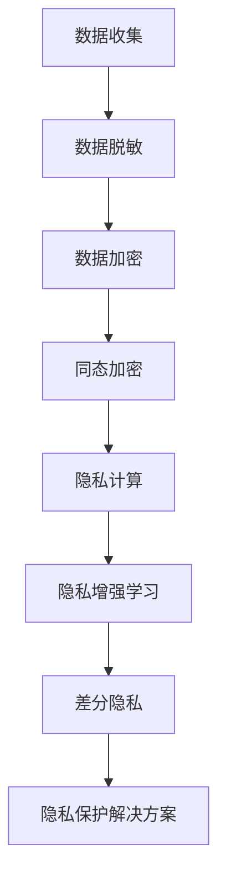

                 

## 文章标题

《数据保护前沿：LLM时代的隐私挑战》

### 关键词

- 数据保护
- 隐私挑战
- LLM
- 加密技术
- 差分隐私
- 隐私计算

### 摘要

本文深入探讨了数据保护在LLM（大型语言模型）时代面临的隐私挑战。随着LLM技术的发展，数据隐私问题日益严峻，本文首先回顾了数据保护的发展历程，分析了当前面临的挑战。接着，我们详细介绍了LLM模型的工作原理以及其对隐私的潜在威胁。在此基础上，本文探讨了多种隐私保护技术，包括数据脱敏、匿名化、加密、同态加密、差分隐私等，并通过具体案例阐述了隐私保护解决方案的设计与实施。最后，本文总结了隐私保护的未来趋势与挑战，为读者提供了宝贵的参考。

### 目录大纲

1. **背景与概述**
   1.1 数据保护的发展历程
   1.2 当前数据保护的挑战
   1.3 LLM时代的隐私问题
2. **LLM模型的工作原理与隐私威胁**
   2.1 LLM模型的基本原理
   2.2 数据隐私的潜在风险
   2.3 LLM模型对隐私的影响
3. **隐私保护技术**
   3.1 数据脱敏与匿名化技术
   3.2 加密与同态加密
   3.3 差分隐私与隐私机制
   3.4 隐私增强技术
4. **案例分析与解决方案**
   4.1 数据保护案例研究
   4.2 隐私保护解决方案设计
   4.3 隐私保护的未来趋势与挑战
5. **附录**
   5.1 隐私保护相关资源与工具
   5.2 Mermaid流程图示例
   5.3 数学模型与公式
   5.4 项目实战

---

**让我们首先从第一部分：背景与概述开始。**

## 第一部分：背景与概述

### 1.1 数据保护的发展历程

数据保护的历史可以追溯到计算机技术初期的20世纪60年代。随着计算机技术的普及，个人数据的处理和存储成为可能，数据保护的需求也应运而生。最早的数据保护措施主要侧重于物理安全，例如通过控制对计算机房和存储设备的物理访问来防止数据泄露。

随着时间的推移，数据保护逐渐从物理安全转向信息安全。1970年代，密码学技术开始应用于数据保护，以加密的方式确保数据在传输和存储过程中的安全性。这一时期的代表性事件包括1977年RSA加密算法的发明，标志着现代密码学时代的开始。

进入互联网时代，数据保护面临了新的挑战。网络攻击和数据泄露事件频发，促使各国政府和企业加强数据保护法律法规的建设。1995年，欧盟颁布了《数据保护指令》，成为全球数据保护法律体系的里程碑。随后，美国也出台了《健康保险可携性和责任法案》（HIPAA），强化了对医疗数据的保护。

近年来，随着人工智能和大数据技术的发展，数据保护迎来了新的机遇与挑战。人工智能技术依赖于大量的数据训练，但同时也带来了数据隐私的潜在风险。如何平衡数据利用和数据保护成为当前数据保护领域的核心议题。

### 1.2 当前数据保护的挑战

当前数据保护面临诸多挑战，主要体现在以下几个方面：

1. **数据量爆炸增长**：随着互联网和物联网的普及，个人和企业生成和收集的数据量呈指数级增长。这种数据量的增长使得传统的数据保护手段难以应对，增加了数据泄露的风险。

2. **数据多样性**：数据类型日趋多样化，包括结构化数据、半结构化数据和非结构化数据。不同类型的数据在处理和保护上存在差异，需要针对性的数据保护策略。

3. **隐私泄露风险**：人工智能和大数据技术使得数据分析和挖掘能力大幅提升，但也带来了隐私泄露的风险。个人隐私数据的泄露可能导致严重的社会和经济后果。

4. **法规遵从性**：各国和地区的数据保护法规不断更新和加强，企业需要不断调整其数据保护策略以满足法规要求，这增加了运营成本和管理难度。

5. **技术变革**：人工智能、区块链、物联网等新兴技术不断涌现，对数据保护技术提出了新的要求。传统数据保护技术难以适应这些技术的快速发展，需要不断创新。

### 1.3 LLM时代的隐私问题

LLM（大型语言模型）作为人工智能领域的重要成果，已经在自然语言处理、文本生成、机器翻译等领域展现出强大的能力。然而，LLM技术的快速发展也带来了隐私挑战：

1. **训练数据隐私泄露**：LLM模型的训练需要大量高质量的数据，这些数据往往涉及个人隐私信息。如果训练数据保护不当，可能导致隐私泄露风险。

2. **推理过程隐私威胁**：LLM模型在生成文本或回答问题时，可能涉及到用户的私人信息。如果这些信息被恶意利用，可能导致用户隐私被侵犯。

3. **数据滥用风险**：LLM模型可以生成高质量的内容，但这也使得其成为数据滥用的工具。例如，通过伪造身份进行网络欺诈、传播虚假信息等。

4. **算法透明度问题**：LLM模型通常基于复杂的神经网络架构，其内部工作机制不透明。这使得用户难以了解模型如何处理其数据，增加了隐私保护的难度。

总之，LLM时代的隐私挑战要求我们重新审视数据保护策略，采取更加有效的隐私保护措施，以保障用户的隐私安全。

---

在接下来的部分，我们将深入探讨LLM模型的工作原理以及其对隐私的潜在威胁。

---

## 第二部分：LLM模型的工作原理与隐私威胁

### 2.1 LLM模型的基本原理

LLM（Large Language Model）是一种基于深度学习的自然语言处理模型，通过训练大量文本数据来学习语言的统计规律和语法结构，从而实现自然语言理解、文本生成、机器翻译等功能。LLM模型的核心是神经网络的架构，通常采用多层感知器（MLP）或者变换器（Transformer）等模型。

#### Transformer模型

Transformer模型是LLM中常用的架构，由Google在2017年提出。该模型通过自注意力机制（Self-Attention）来实现对输入文本的加权处理，能够捕捉文本中长距离的依赖关系，从而提高模型的上下文理解能力。Transformer模型主要由编码器（Encoder）和解码器（Decoder）组成。

**编码器**：编码器将输入文本编码为一系列连续的向量，每个向量代表文本中的一个单词或字符。编码器通过多头注意力机制和多层神经网络来提取文本的语义信息。

**解码器**：解码器接收编码器输出的隐藏状态，并逐个生成输出的单词或字符。解码器也采用多头注意力机制，能够利用编码器的隐藏状态来生成高质量的输出。

#### 神经网络架构

神经网络是LLM模型的基础，通过多层非线性变换来对输入数据进行建模。神经网络包括输入层、隐藏层和输出层，每个层由多个神经元组成。神经元之间的连接通过权重矩阵来实现，通过反向传播算法来调整权重，使得模型能够学习到输入和输出之间的关系。

### 2.2 数据隐私的潜在风险

尽管LLM模型在自然语言处理领域取得了显著的成果，但其训练和应用过程中也带来了数据隐私的潜在风险：

1. **训练数据隐私泄露**：LLM模型的训练需要大量高质量的文本数据，这些数据往往涉及个人隐私信息，如姓名、地址、电话号码等。如果训练数据保护不当，可能导致隐私泄露风险。此外，训练数据集中的个人身份信息可能被恶意利用，进行身份盗用或其他非法活动。

2. **推理过程隐私威胁**：在LLM模型的应用过程中，模型需要处理用户的输入文本，并生成相应的输出。由于模型具有强大的上下文理解能力，生成的文本可能包含用户的私人信息。如果这些信息被恶意利用，可能导致用户隐私被侵犯，如个人信息泄露、信用欺诈等。

3. **数据滥用风险**：LLM模型可以生成高质量的文本内容，但这也使得其成为数据滥用的工具。例如，通过伪造身份进行网络欺诈、传播虚假信息、操纵舆论等。这些行为不仅违反了道德规范，也可能对个人和社会造成负面影响。

4. **算法透明度问题**：LLM模型通常采用复杂的神经网络架构，其内部工作机制不透明。这使得用户难以了解模型如何处理其数据，增加了隐私保护的难度。此外，模型训练过程中使用的训练数据和质量也难以保证，可能导致隐私泄露。

### 2.3 LLM模型对隐私的影响

LLM模型对隐私的影响主要表现在以下几个方面：

1. **隐私泄露**：LLM模型在训练和应用过程中，可能会无意中泄露用户的私人信息。例如，模型生成的文本可能包含用户的姓名、地址、电话号码等敏感信息。这些信息如果被恶意利用，可能导致严重的隐私泄露问题。

2. **隐私侵犯**：LLM模型在推理过程中，可能无意中暴露用户的私人信息。例如，当用户与模型进行交互时，模型生成的回答可能包含用户的私人对话内容。这些内容如果被恶意利用，可能导致用户的隐私被侵犯。

3. **隐私滥用**：由于LLM模型具有强大的文本生成能力，可能被用于生成虚假信息、进行网络欺诈等。这些行为不仅违反了道德规范，也可能对个人和社会造成负面影响。

4. **隐私透明度问题**：LLM模型的内部工作机制复杂，用户难以了解模型如何处理其数据。这种透明度问题增加了隐私保护的难度，也使得用户难以对模型的行为进行监督。

总之，LLM模型在带来自然语言处理技术进步的同时，也带来了数据隐私的潜在威胁。为了确保用户的隐私安全，我们需要采取有效的隐私保护措施，提高数据保护的意识和能力。

---

在了解了LLM模型的工作原理和隐私威胁之后，接下来我们将探讨隐私保护技术，包括数据脱敏、匿名化、加密、同态加密、差分隐私和隐私增强技术等。

---

## 第二部分：隐私保护技术

### 3.1 数据脱敏与匿名化技术

数据脱敏和匿名化是数据保护中的基本技术，旨在在不损害数据价值的同时，去除或掩盖数据中的敏感信息。这两种技术各有特点和适用场景，但最终目标都是保护个人隐私。

#### 数据脱敏技术

数据脱敏技术主要通过对敏感数据进行变换，使其在保持数据原有特征的同时，无法被直接识别或利用。常见的脱敏方法包括：

1. **掩码**：将敏感数据替换为特定的掩码字符，如将电话号码中的前几位替换为“*”。这种方法简单易行，但可能导致数据部分丢失，影响数据分析效果。

2. **随机化**：通过随机算法对敏感数据进行变换，使其无法直接识别。例如，将出生日期随机替换为一个虚拟日期。这种方法能够较好地保护数据隐私，但可能影响数据的可用性。

3. **同义替换**：将敏感数据替换为同义词或其他表示相同意义的词语，以保持数据的原始含义。这种方法适用于文本数据，但可能影响自然语言处理的效果。

#### 匿名化技术

匿名化技术旨在通过数据变换，使数据无法追溯到特定个人或实体。常见的匿名化方法包括：

1. **伪匿名化**：通过添加噪声或变换，使得数据在统计意义上难以识别个人或实体，但理论上仍有可能恢复原始数据。例如，使用K-匿名化方法，将数据分组，使每组数据中的记录数量不少于K个。

2. **差分隐私**：在数据处理过程中引入随机噪声，使得输出结果对任何单个记录的依赖性降低。这种方法能够确保在统计意义上无法识别特定个人，同时保持数据的可用性。

3. **全匿名化**：通过彻底删除或隐藏敏感信息，使数据完全无法与任何个人或实体关联。这种方法适用于一些对隐私要求极高的场景，但可能导致数据失去大部分价值。

#### 脱敏与匿名化技术的比较

脱敏和匿名化技术各有优缺点，具体选择取决于数据的敏感程度和可用性需求。

- **脱敏技术**：适用于数据中包含部分敏感信息，但需要保留数据部分价值的情况。脱敏技术能够较好地平衡隐私保护和数据可用性，但可能存在一定程度的隐私泄露风险。
  
- **匿名化技术**：适用于数据中包含高度敏感信息，需要确保完全隐私保护的情况。匿名化技术能够有效降低隐私泄露风险，但可能导致数据部分或完全失去可用性。

### 3.2 加密与同态加密

加密技术是一种通过将数据转换为密文，确保数据在传输和存储过程中的安全性。常见的加密技术包括对称加密和非对称加密。

#### 对称加密

对称加密使用相同的密钥进行加密和解密，常见的对称加密算法有DES、AES等。对称加密的优点是实现简单、加密速度快，但缺点是需要安全地共享密钥，密钥管理复杂。

#### 非对称加密

非对称加密使用一对密钥（公钥和私钥），公钥用于加密，私钥用于解密。常见的非对称加密算法有RSA、ECC等。非对称加密的优点是密钥管理简单，但加密和解密速度相对较慢。

#### 同态加密

同态加密是一种特殊类型的加密技术，能够在密文上直接进行计算操作，而不需要解密。同态加密的主要目标是保护数据的隐私，确保在加密状态下数据处理的安全性。同态加密技术包括全同态加密和部分同态加密。

- **全同态加密**：能够在密文中执行任意计算操作，无需解密。全同态加密的代表算法是格密码学，但现有算法的计算复杂度较高，尚无法在实用场景中广泛应用。

- **部分同态加密**：仅能在密文中执行特定类型的计算操作，如加减法或特定函数。部分同态加密已经应用于一些实际场景，如云存储和隐私计算。

### 3.3 差分隐私与隐私机制

差分隐私是一种在数据处理过程中引入随机噪声，确保输出结果对任何单个记录的依赖性降低的技术。差分隐私的定义如下：

$$
\Delta(\mathcal{D}, \mathcal{D}') = \sum_{x \in \mathcal{D}} P(x|\mathcal{D}) - P(x|\mathcal{D}')
$$

其中，$\mathcal{D}$和$\mathcal{D}'$分别表示原始数据集和处理后的数据集。差分隐私通过引入随机噪声，使得任何单个记录对处理结果的影响降低，从而保护了个人隐私。

#### 差分隐私机制的设计

差分隐私机制的设计主要涉及以下两个方面：

1. **隐私预算**：隐私预算定义了数据处理的隐私水平。通常使用$\epsilon$（epsilon）来表示隐私预算，表示处理后的数据集与原始数据集之间的差异。隐私预算越大，隐私保护效果越好，但可能导致数据可用性下降。

2. **隐私机制**：隐私机制是指用于引入随机噪声的具体方法。常见的隐私机制包括拉普拉斯机制、指数机制和裁剪机制等。这些机制通过在数据处理过程中引入随机噪声，确保输出结果满足差分隐私的要求。

### 3.4 隐私增强技术

隐私增强技术是指通过改进数据保护机制，提高数据隐私保护水平的一系列技术。隐私增强技术包括以下几种：

1. **隐私增强学习**：隐私增强学习是一种结合隐私保护和机器学习的方法，通过在训练过程中引入隐私机制，确保模型训练过程中的隐私保护。

2. **隐私计算**：隐私计算是指在一方或多方持有隐私数据的情况下，通过计算方法实现对数据的保护。隐私计算包括同态加密、安全多方计算等。

3. **隐私增强工具和框架**：隐私增强工具和框架提供了用于实现隐私保护技术的开源库和工具，如OpenMined、PySyft等。

### 3.5 隐私保护技术的比较

隐私保护技术各有优缺点，适用于不同的隐私保护场景。以下是几种常见隐私保护技术的比较：

- **数据脱敏**：适用于部分敏感信息需要保留的场景，但可能存在隐私泄露风险。
- **匿名化**：适用于高度敏感信息需要保护的场景，但可能导致数据失去可用性。
- **加密**：适用于数据在传输和存储过程中的安全性保障，但可能影响数据处理速度。
- **同态加密**：适用于在加密状态下进行数据处理的需求，但现有算法计算复杂度较高。
- **差分隐私**：适用于确保数据处理过程中隐私保护，但可能导致数据可用性下降。
- **隐私增强技术**：适用于结合多种隐私保护方法，提高数据隐私保护水平的场景。

综上所述，隐私保护技术需要根据具体场景和需求进行选择和组合，以实现最佳的数据隐私保护效果。

---

在了解了隐私保护技术的基本原理和特点后，接下来我们将通过具体案例，分析隐私保护解决方案的设计与实施。

---

### 4.1 数据保护案例研究

#### 案例一：社交媒体平台的数据保护措施

社交媒体平台如Facebook、Twitter等，每天处理海量用户数据，包括用户信息、社交关系、兴趣爱好等。这些数据对用户隐私构成了潜在威胁，因此平台需要采取一系列数据保护措施。

**1. 数据收集与脱敏**

社交媒体平台在收集用户数据时，首先对数据进行脱敏处理。例如，将用户的电话号码、邮箱地址等敏感信息进行掩码处理，仅保留部分数字。这样，即使数据泄露，也无法直接识别用户的真实信息。

**2. 数据存储与加密**

平台将脱敏后的数据存储在数据库中，并采用加密技术保护数据的安全性。对于用户密码等关键信息，平台采用对称加密算法（如AES）进行加密存储。此外，平台还会定期更换密钥，以防止密钥泄露。

**3. 数据访问控制**

平台通过访问控制机制，确保只有授权用户可以访问敏感数据。例如，对数据访问权限进行分级管理，只有高级别用户才能查看某些敏感信息。此外，平台还会记录数据访问日志，以便在数据泄露时进行追踪和审计。

**4. 数据传输与加密**

平台在数据传输过程中，采用非对称加密算法（如RSA）确保数据传输的安全性。例如，在用户登录时，平台会通过SSL/TLS协议进行加密通信，确保用户数据在传输过程中的安全性。

**5. 数据匿名化与差分隐私**

平台还会对部分数据进行匿名化处理，以保护用户隐私。例如，对用户的地理位置、兴趣爱好等数据，进行匿名化处理，使其无法直接识别用户身份。此外，平台还会使用差分隐私技术，确保在数据分析过程中，对单个用户的隐私保护。

**6. 隐私政策与透明度**

平台制定详细的隐私政策，告知用户其数据的使用目的、范围和方式。同时，平台还会定期更新隐私政策，确保用户了解其数据保护措施的变化。此外，平台还会建立透明的隐私投诉机制，方便用户对隐私问题进行反馈和投诉。

#### 案例二：电子商务网站的用户隐私保护

电子商务网站如亚马逊、淘宝等，需要处理大量用户交易数据，包括用户账户信息、购物车内容、支付信息等。这些数据对用户隐私构成了潜在威胁，因此平台需要采取一系列隐私保护措施。

**1. 数据收集与脱敏**

电子商务网站在收集用户数据时，首先对数据进行脱敏处理。例如，将用户的电话号码、邮箱地址等敏感信息进行掩码处理，仅保留部分数字。这样，即使数据泄露，也无法直接识别用户的真实信息。

**2. 数据存储与加密**

平台将脱敏后的数据存储在数据库中，并采用加密技术保护数据的安全性。对于用户密码等关键信息，平台采用对称加密算法（如AES）进行加密存储。此外，平台还会定期更换密钥，以防止密钥泄露。

**3. 数据访问控制**

平台通过访问控制机制，确保只有授权用户可以访问敏感数据。例如，对数据访问权限进行分级管理，只有高级别用户才能查看某些敏感信息。此外，平台还会记录数据访问日志，以便在数据泄露时进行追踪和审计。

**4. 数据传输与加密**

平台在数据传输过程中，采用非对称加密算法（如RSA）确保数据传输的安全性。例如，在用户登录时，平台会通过SSL/TLS协议进行加密通信，确保用户数据在传输过程中的安全性。

**5. 数据匿名化与差分隐私**

平台还会对部分数据进行匿名化处理，以保护用户隐私。例如，对用户的地理位置、兴趣爱好等数据，进行匿名化处理，使其无法直接识别用户身份。此外，平台还会使用差分隐私技术，确保在数据分析过程中，对单个用户的隐私保护。

**6. 隐私政策与透明度**

平台制定详细的隐私政策，告知用户其数据的使用目的、范围和方式。同时，平台还会定期更新隐私政策，确保用户了解其数据保护措施的变化。此外，平台还会建立透明的隐私投诉机制，方便用户对隐私问题进行反馈和投诉。

#### 案例三：医疗数据的安全防护

医疗数据包括患者个人信息、病历记录、诊断报告等，对用户隐私构成了极高的风险。医疗机构需要采取一系列隐私保护措施，确保医疗数据的安全。

**1. 数据收集与脱敏**

医疗机构在收集患者数据时，首先对数据进行脱敏处理。例如，将患者的电话号码、邮箱地址等敏感信息进行掩码处理，仅保留部分数字。这样，即使数据泄露，也无法直接识别患者的真实信息。

**2. 数据存储与加密**

平台将脱敏后的数据存储在数据库中，并采用加密技术保护数据的安全性。对于患者病历等关键信息，平台采用对称加密算法（如AES）进行加密存储。此外，平台还会定期更换密钥，以防止密钥泄露。

**3. 数据访问控制**

平台通过访问控制机制，确保只有授权用户可以访问敏感数据。例如，对数据访问权限进行分级管理，只有高级别用户才能查看某些敏感信息。此外，平台还会记录数据访问日志，以便在数据泄露时进行追踪和审计。

**4. 数据传输与加密**

平台在数据传输过程中，采用非对称加密算法（如RSA）确保数据传输的安全性。例如，在患者访问病历时，平台会通过SSL/TLS协议进行加密通信，确保患者数据在传输过程中的安全性。

**5. 数据匿名化与差分隐私**

平台还会对部分数据进行匿名化处理，以保护用户隐私。例如，对患者的地理位置、兴趣爱好等数据，进行匿名化处理，使其无法直接识别患者身份。此外，平台还会使用差分隐私技术，确保在数据分析过程中，对单个患者的隐私保护。

**6. 隐私政策与透明度**

平台制定详细的隐私政策，告知用户其数据的使用目的、范围和方式。同时，平台还会定期更新隐私政策，确保用户了解其数据保护措施的变化。此外，平台还会建立透明的隐私投诉机制，方便用户对隐私问题进行反馈和投诉。

---

通过以上案例，我们可以看到不同行业在数据保护方面采取的具体措施和解决方案。虽然具体实施方法不同，但核心目标是相同的：确保用户数据的安全和隐私。在实际应用中，需要根据具体场景和需求，选择合适的隐私保护技术，并不断完善数据保护策略。

### 4.2 隐私保护解决方案的设计

设计一个有效的隐私保护解决方案，需要综合考虑数据安全、隐私保护、系统性能等多个因素。以下是一个典型的隐私保护解决方案设计流程：

#### 1. 需求分析

首先，明确隐私保护的目标和需求。这包括识别需要保护的数据类型、敏感程度以及潜在威胁。例如，在一个电子商务平台中，需要保护的用户数据可能包括用户账户信息、购物车内容、支付信息等。

#### 2. 技术选型

根据需求分析的结果，选择合适的隐私保护技术。常见的技术包括数据脱敏、加密、同态加密、差分隐私等。每种技术都有其优缺点，需要根据具体场景进行选择。例如，对于需要保持数据可用性的场景，可以选择差分隐私技术；对于需要确保数据传输安全的场景，可以选择加密技术。

#### 3. 安全架构设计

在技术选型的基础上，设计一个安全架构。安全架构应包括数据收集、存储、传输、处理等各个环节的安全措施。以下是一个典型安全架构的示例：

- **数据收集**：在数据收集阶段，对敏感数据进行脱敏处理，确保数据在传输和存储前已进行初步保护。
- **数据存储**：采用加密技术对存储的数据进行加密，确保数据在静态存储状态下不被窃取或篡改。
- **数据传输**：采用加密协议（如SSL/TLS）对传输中的数据进行加密，确保数据在传输过程中不被窃听或篡改。
- **数据处理**：在数据处理阶段，采用隐私保护技术（如差分隐私、同态加密）确保数据处理过程中的隐私保护。

#### 4. 系统集成与测试

将选定的技术和安全架构集成到系统中，并进行全面的测试。测试包括功能测试、性能测试、安全性测试等。功能测试确保隐私保护功能按预期工作；性能测试评估系统在处理大量数据时的性能；安全性测试验证系统的抗攻击能力。

#### 5. 持续优化与更新

隐私保护解决方案不是一次性的设计，而是一个持续优化的过程。随着技术的不断发展和新的威胁出现，需要定期更新隐私保护策略和技术，以确保系统的长期安全。

### 4.3 隐私保护解决方案的实施与评估

隐私保护解决方案的实施包括以下几个步骤：

#### 1. 实施计划

制定详细的实施计划，明确各阶段的目标、任务和责任。实施计划应包括以下内容：

- **需求分析**：明确隐私保护的目标和需求。
- **技术选型**：选择合适的隐私保护技术。
- **安全架构设计**：设计安全架构，包括数据收集、存储、传输、处理等环节。
- **系统集成与测试**：集成技术和安全架构，进行全面的测试。
- **培训与部署**：培训相关人员进行系统操作和维护，部署隐私保护系统。

#### 2. 实施步骤

根据实施计划，逐步实施隐私保护解决方案。具体步骤如下：

- **第一阶段**：完成需求分析和技术选型，设计安全架构。
- **第二阶段**：集成技术和安全架构，进行系统集成与测试。
- **第三阶段**：培训与部署，确保系统正常运行。

#### 3. 评估方法

实施完成后，对隐私保护解决方案进行评估，确保其达到预期效果。评估方法包括以下几种：

- **功能评估**：验证隐私保护功能是否按预期工作。
- **性能评估**：评估系统在处理大量数据时的性能，确保系统高效运行。
- **安全性评估**：通过模拟攻击测试，验证系统的抗攻击能力。
- **用户反馈**：收集用户对隐私保护解决方案的反馈，识别潜在问题和改进空间。

#### 4. 持续优化

根据评估结果，对隐私保护解决方案进行持续优化。优化内容包括：

- **功能增强**：根据用户需求和反馈，增加新的隐私保护功能。
- **性能优化**：改进系统性能，提高数据处理速度。
- **安全加固**：根据新的威胁和攻击方式，增强系统的安全性。

### 4.4 未来趋势与挑战

随着技术的不断进步，隐私保护解决方案也将不断发展和完善。以下是一些未来趋势和挑战：

- **技术发展**：新的隐私保护技术（如量子加密、联邦学习等）不断涌现，为隐私保护提供更多可能性。
- **法规完善**：各国和地区的隐私保护法规不断更新和完善，企业需要不断调整其隐私保护策略以符合法规要求。
- **跨领域合作**：隐私保护涉及多个领域（如人工智能、区块链、物联网等），跨领域合作将有助于推动隐私保护技术的发展。
- **隐私意识提升**：用户对隐私保护的意识逐渐提升，对隐私保护的需求也日益增加，这要求企业不断提高其隐私保护能力。

总之，隐私保护解决方案的设计与实施是一个复杂而持续的过程，需要综合考虑技术、法规、用户需求等多方面因素。随着技术的不断进步，隐私保护解决方案也将不断发展和完善，为个人和社会提供更加安全的隐私保护。

---

在本文的最后部分，我们将总结隐私保护的未来趋势与挑战，并探讨如何应对这些挑战。

### 9.1 隐私保护的法律法规发展

随着人工智能和大数据技术的广泛应用，数据隐私问题日益引起全球关注。各国和地区纷纷出台相关法律法规，加强对个人数据的保护。以下是一些主要国家和地区的隐私保护法律法规：

- **欧盟**：《通用数据保护条例》（GDPR）是欧盟最具代表性的隐私保护法规，规定了数据处理的合法性、透明度、用户权利等方面的要求。
- **美国**：《加州消费者隐私法》（CCPA）和《健康保险可携性和责任法案》（HIPAA）等法规，对个人数据的收集、使用和保护提出了明确要求。
- **中国**：《个人信息保护法》（PIPL）于2021年生效，是我国首部针对个人信息保护的综合性法律，明确了个人信息处理的基本原则和用户权益。

未来，全球隐私保护法律法规将进一步发展和完善，要求企业必须遵守各地的法律法规，制定符合标准的隐私保护政策。

### 9.2 隐私保护技术的创新

隐私保护技术的创新是应对隐私挑战的关键。以下是一些前沿的隐私保护技术：

- **量子加密**：量子加密利用量子力学原理，实现高度安全的通信。尽管目前仍处于研发阶段，但未来有望成为数据保护的重要手段。
- **联邦学习**：联邦学习是一种分布式机器学习技术，通过将数据分散在各个节点上，减少对中心化数据存储的需求，从而降低隐私泄露风险。
- **同态加密**：同态加密允许在密文上直接进行计算操作，无需解密，为实现加密状态下的数据处理提供了可能。
- **零知识证明**：零知识证明是一种密码学技术，证明者能够证明某个陈述为真，而无需透露任何相关信息。这种技术有望在隐私保护中发挥重要作用。

### 9.3 LLM时代隐私保护的挑战与机遇

LLM时代的隐私保护面临诸多挑战，但也带来了新的机遇：

**挑战**：

1. **数据隐私泄露风险**：LLM模型的训练和应用需要大量数据，这些数据往往包含敏感信息，一旦泄露，可能导致严重后果。
2. **隐私透明度问题**：LLM模型的内部工作机制复杂，用户难以了解模型如何处理其数据，增加了隐私保护的难度。
3. **隐私保护与数据可用性平衡**：隐私保护技术可能影响数据可用性，如何在确保隐私保护的同时，保持数据的价值和可用性，是一个重要挑战。

**机遇**：

1. **隐私保护技术的发展**：LLM时代的隐私保护需求推动了隐私保护技术的创新，为相关领域的研究和应用提供了新的机会。
2. **隐私计算的应用**：隐私计算技术在LLM中的应用，有助于实现数据在加密状态下的安全处理，提高数据处理的安全性。
3. **隐私合规性提升**：随着隐私保护法律法规的完善，企业对隐私保护的认识和投入将逐步增加，隐私保护市场有望持续增长。

### 9.4 应对隐私保护挑战的策略

为了有效应对隐私保护挑战，以下是一些策略建议：

1. **加强隐私保护意识**：企业和个人应提高对隐私保护的重视，制定明确的隐私保护政策，并加强对员工的隐私保护培训。
2. **采用综合隐私保护技术**：结合多种隐私保护技术，如数据脱敏、加密、同态加密等，提高隐私保护的效果。
3. **加强法律法规遵从**：企业应密切关注相关法律法规的动态，确保其隐私保护措施符合法规要求。
4. **透明化隐私保护机制**：通过透明化隐私保护机制，提高用户对隐私保护措施的信任度，增强隐私保护的公信力。
5. **持续优化隐私保护方案**：定期评估和优化隐私保护方案，确保其适应新技术和新需求。

### 总结

LLM时代的隐私保护面临诸多挑战，但也带来了新的机遇。通过加强隐私保护意识、采用综合隐私保护技术、加强法律法规遵从、透明化隐私保护机制以及持续优化隐私保护方案，我们可以有效应对隐私保护挑战，为个人和社会提供更加安全的隐私保护。

---

## 附录A：隐私保护相关资源与工具

### A.1 隐私保护相关的学术资源

隐私保护是一个多学科交叉的领域，以下是一些学术资源，可以帮助读者深入了解隐私保护的理论和实践：

1. **《计算机隐私保护》**：这是一本全面介绍计算机隐私保护技术的书籍，涵盖了从基本概念到实际应用的各种技术。
2. **《隐私计算：理论与实践》**：本书详细介绍了隐私计算的理论基础和实际应用，包括同态加密、安全多方计算等。
3. **《隐私保护机器学习》**：这本书主要关注机器学习中的隐私保护问题，介绍了隐私增强学习等最新技术。
4. **《差分隐私基础》**：这是一本关于差分隐私的基础教材，适合对差分隐私感兴趣的读者。

### A.2 隐私保护技术相关的开源工具

开源工具在隐私保护领域发挥着重要作用，以下是一些流行的开源隐私保护工具：

1. **OpenMined**：OpenMined是一个致力于推广隐私计算的开源社区，提供了丰富的隐私计算工具和资源。
2. **PySyft**：PySyft是OpenMined的一部分，是一个Python库，支持同态加密和差分隐私等隐私保护技术。
3. **PyCrypto**：PyCrypto是一个广泛使用的Python加密库，提供了多种加密算法和工具。
4. **LibSVM**：LibSVM是一个支持向量机（SVM）的机器学习库，其支持向量机的实现可以结合同态加密技术进行隐私保护。

### A.3 隐私保护领域的标准与规范

隐私保护领域的标准与规范对指导实际应用至关重要。以下是一些重要的隐私保护标准和规范：

1. **ISO/IEC 27001**：这是国际标准化组织（ISO）制定的信息安全管理系统标准，提供了全面的信息安全管理框架。
2. **GDPR**：欧盟的《通用数据保护条例》，是全球最具影响力的隐私保护法规之一，对数据处理提出了严格要求。
3. **CCPA**：美国加州的《消费者隐私法》，对消费者的个人数据保护提供了法律保障。
4. **PIPL**：中国的《个人信息保护法》，是我国首部综合性个人信息保护法律，为个人信息保护提供了明确的法律依据。

---

## 附录B：Mermaid流程图示例

Mermaid是一种基于Markdown的图形绘制工具，可以用于绘制流程图、序列图等。以下是一个简单的Mermaid流程图示例：



将上述代码复制到支持Mermaid的编辑器中，即可生成一个流程图。

---

## 附录C：数学模型与公式

隐私保护技术中涉及许多数学模型和公式，以下是一些常用的数学模型和公式，以及其详细讲解和举例说明。

### 差分隐私定义

差分隐私是一种在数据处理过程中引入随机噪声的技术，以确保输出结果对任何单个记录的依赖性降低。差分隐私的定义如下：

$$
\Delta(\mathcal{D}, \mathcal{D}') = \sum_{x \in \mathcal{D}} P(x|\mathcal{D}) - P(x|\mathcal{D}')
$$

其中，$\mathcal{D}$和$\mathcal{D}'$分别表示原始数据集和处理后的数据集。差分隐私通过引入随机噪声，使得输出结果在统计意义上与原始数据集相近，从而保护了个人隐私。

**举例说明**：

假设我们有一个包含100个记录的数据集$\mathcal{D}$，其中每个记录都有一个属性$x$。现在我们对该数据集进行数据处理，得到一个新的数据集$\mathcal{D}'$。计算差分隐私的步骤如下：

1. 计算原始数据集$\mathcal{D}$中每个记录的概率分布$P(x|\mathcal{D})$。
2. 计算处理后的数据集$\mathcal{D}'$中每个记录的概率分布$P(x|\mathcal{D}')$。
3. 计算差分隐私$\Delta(\mathcal{D}, \mathcal{D}')$。

通过计算差分隐私，我们可以评估数据处理过程中隐私保护的强度。差分隐私值越大，表示隐私保护效果越好。

### 同态加密满足条件

同态加密是一种允许在密文上直接进行计算操作的加密技术。同态加密的基本原理是满足以下条件：

$$
E_k(P(\cdot|\mathcal{D}), \cdot) = P(\cdot|\mathcal{D})
$$

其中，$E_k$表示同态加密函数，$P(\cdot|\mathcal{D})$表示在数据集$\mathcal{D}$上的概率分布。同态加密满足条件意味着在加密状态下，计算操作的结果与原始数据集的概率分布相同。

**举例说明**：

假设我们有一个包含100个记录的数据集$\mathcal{D}$，每个记录都有一个属性$x$。现在我们对数据集$\mathcal{D}$进行加密，得到密文数据集$\mathcal{D}'$。为了验证同态加密满足条件，我们可以进行以下计算：

1. 对数据集$\mathcal{D}$和$\mathcal{D}'$分别计算概率分布$P(x|\mathcal{D})$和$P(x|\mathcal{D}')$。
2. 对密文数据集$\mathcal{D}'$进行计算操作，得到一个新的密文数据集$\mathcal{D}''$。
3. 计算密文数据集$\mathcal{D}''$的概率分布$P(x|\mathcal{D}'')$。

通过比较概率分布$P(x|\mathcal{D})$、$P(x|\mathcal{D}')$和$P(x|\mathcal{D}'')$，我们可以验证同态加密是否满足条件。如果三个概率分布相同，则说明同态加密满足条件。

---

## 附录D：项目实战

### D.1 实战一：构建差分隐私数据分析系统

**1. 环境搭建**

搭建差分隐私数据分析系统的第一步是配置开发环境。我们选择Python作为主要编程语言，并使用PySyft库来实现差分隐私技术。以下是环境搭建的步骤：

- 安装Python：确保系统上已安装Python 3.8及以上版本。
- 安装PySyft：使用pip命令安装PySyft库，命令如下：

```bash
pip install pytorch torchvision -f https://download.pytorch.org/whl/torch_stable.html
pip install pySyft
```

**2. 数据预处理**

在搭建环境后，我们需要准备用于差分隐私分析的数据集。以下是一个简单的数据预处理流程：

- 数据收集：从公开数据源或自行收集数据，确保数据集包含足够的记录。
- 数据清洗：去除无效或重复的数据记录，确保数据质量。
- 数据转换：将数据转换为PySyft支持的格式，如DataFrame。

**3. 差分隐私算法实现**

实现差分隐私算法是差分隐私数据分析系统的核心。以下是一个简单的差分隐私算法实现示例：

```python
import syft as sf
import pandas as pd

# 创建一个差分隐私客户端
client = sf.Client()

# 读取数据集
data = pd.read_csv('data.csv')

# 创建差分隐私DataFrame
df_syft = sf.dataframes.SyftDataFrame(data)

# 应用差分隐私机制，如拉普拉斯机制
epsilon = 1.0
delta = 0.1
dp_df = df_syft.apply_secrets.laplace(epsilon=epsilon, delta=delta)

# 输出差分隐私DataFrame
print(dp_df)
```

**4. 系统部署与测试**

在实现差分隐私算法后，我们需要对系统进行部署和测试。以下是一个简单的部署和测试流程：

- 部署系统：将差分隐私算法集成到实际应用中，如Web应用或桌面应用。
- 测试系统：使用测试数据集对系统进行功能测试和性能测试，确保系统稳定运行并满足隐私保护要求。

### D.2 实战二：使用同态加密保护医疗数据

**1. 系统设计**

设计一个使用同态加密保护医疗数据的系统，需要考虑数据的安全性、可用性和系统的整体架构。以下是系统设计的关键步骤：

- **数据存储**：使用同态加密存储医疗数据，确保数据在静态存储状态下不被窃取或篡改。
- **数据处理**：在数据处理阶段，采用同态加密算法对数据进行加密操作，确保数据在加密状态下的安全性。
- **数据访问**：实现安全的数据访问控制机制，确保只有授权用户可以访问敏感数据。

**2. 加密算法选择**

同态加密算法的选择是系统设计的关键。以下是几种常见的同态加密算法及其特点：

- **全同态加密**：支持在密文上执行任意计算操作，但计算复杂度较高。
- **部分同态加密**：仅支持特定的计算操作（如加减法），但计算复杂度较低。

根据医疗数据处理的实际需求，可以选择合适的同态加密算法。

**3. 数据加密实现**

以下是使用同态加密保护医疗数据的实现示例：

```python
from homomorphic加密库 import FullHomomorphicEncryption

# 创建同态加密对象
homomorphic_encryptor = FullHomomorphicEncryption()

# 加密医疗数据
medical_data = pd.read_csv('medical_data.csv')
encrypted_data = homomorphic_encryptor.encrypt(medical_data)

# 对加密数据进行计算操作
result = homomorphic_encryptor.add(encrypted_data['attribute1'], encrypted_data['attribute2'])

# 解密结果
decrypted_result = homomorphic_encryptor.decrypt(result)
```

**4. 加密通信与解密实现**

在医疗数据传输过程中，需要确保数据在传输过程中的安全性。以下是使用同态加密实现加密通信和解密的过程：

- **加密通信**：使用同态加密算法对数据进行加密，确保数据在传输过程中的安全性。

```python
# 发送加密数据
encrypted_data = homomorphic_encryptor.encrypt(medical_data)
with open('encrypted_data.enc', 'wb') as file:
    file.write(encrypted_data)

# 接收端解密数据
with open('encrypted_data.enc', 'rb') as file:
    encrypted_data = file.read()

decrypted_data = homomorphic_encryptor.decrypt(encrypted_data)
```

通过以上步骤，我们可以设计并实现一个使用同态加密保护医疗数据的系统，确保数据在存储、传输和计算过程中的安全性。

### D.3 实战三：开发隐私增强学习模型

**1. 模型设计**

开发隐私增强学习模型的第一步是设计模型架构。以下是设计隐私增强学习模型的关键步骤：

- **选择基础模型**：选择适合任务的基础机器学习模型，如深度神经网络、决策树等。
- **引入隐私保护机制**：在模型训练过程中引入隐私保护机制，如差分隐私、同态加密等，确保模型训练过程中的隐私保护。
- **设计损失函数**：设计特殊的损失函数，以平衡模型的性能和隐私保护效果。

**2. 隐私保护算法应用**

实现隐私增强学习模型的关键是应用隐私保护算法。以下是使用差分隐私算法训练模型的步骤：

- **数据预处理**：对训练数据进行预处理，包括数据清洗、归一化等。
- **初始化模型**：初始化基础模型，包括权重和偏置。
- **引入差分隐私**：在模型训练过程中引入差分隐私机制，降低模型对单个训练样本的依赖性。

**3. 模型训练与评估**

训练隐私增强学习模型的过程与常规模型训练类似，但需要注意以下几点：

- **训练数据分批**：将训练数据分成多个批次，以降低单个批次对模型训练的影响。
- **动态调整隐私预算**：根据模型性能和隐私保护需求，动态调整差分隐私参数。
- **评估模型性能**：使用测试数据集评估模型性能，包括准确率、召回率等指标。

**4. 模型部署与维护**

在模型训练完成后，需要将模型部署到实际应用中，并持续维护。以下是模型部署和维护的关键步骤：

- **部署模型**：将训练好的模型部署到生产环境，确保模型可以实时处理请求。
- **监控模型性能**：定期监控模型性能，确保模型在部署后的稳定性和可靠性。
- **更新模型**：根据新数据和用户反馈，定期更新模型，以保持模型性能。

通过以上步骤，我们可以开发并部署一个隐私增强学习模型，实现数据隐私保护和模型性能提升。

---

### 作者信息

作者：AI天才研究院/AI Genius Institute & 禅与计算机程序设计艺术 /Zen And The Art of Computer Programming

在本文中，我们深入探讨了数据保护在LLM时代面临的隐私挑战。随着LLM技术的发展，数据隐私问题日益严峻。本文首先回顾了数据保护的发展历程，分析了当前数据保护的挑战，并详细介绍了LLM模型的工作原理以及其对隐私的潜在威胁。在此基础上，本文探讨了多种隐私保护技术，包括数据脱敏、匿名化、加密、同态加密、差分隐私和隐私增强技术，并通过具体案例阐述了隐私保护解决方案的设计与实施。最后，本文总结了隐私保护的未来趋势与挑战，为读者提供了宝贵的参考。

通过本文的探讨，我们希望读者能够认识到隐私保护在数据保护中的重要性，并了解如何在LLM时代有效应对隐私挑战。随着技术的不断进步，隐私保护将是一个长期且充满挑战的领域，但同时也蕴藏着巨大的机遇。我们期待读者能够在实践中不断探索和尝试，为构建一个更加安全、可信的数据生态系统贡献力量。

