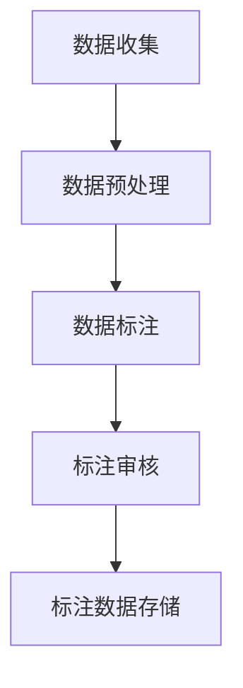
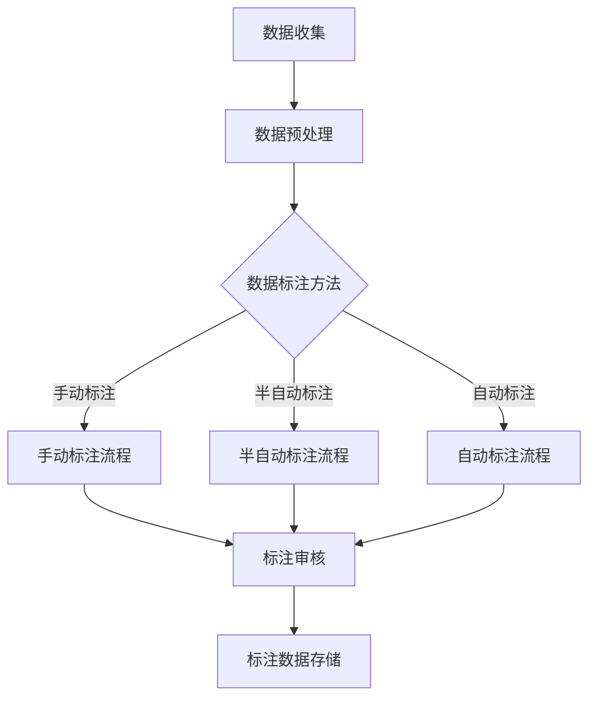

                 

# 数据标注：人工智能背后的无名英雄

## 概述

> **关键词**：数据标注、人工智能、机器学习、深度学习、计算机视觉、自然语言处理

> **摘要**：本文将深入探讨数据标注在人工智能领域中的重要性。我们将详细分析数据标注的定义、分类、方法和技术，同时介绍数据标注的核心概念、算法原理、流程和质量保证。此外，我们还将分享数据标注在实际项目中的应用案例，并探讨其行业应用前景。通过本文，读者将全面了解数据标注的各个方面，认识到其在人工智能发展中的关键作用。

## 目录大纲

### 第一部分：数据标注概述

#### 1.1 数据标注的定义与重要性

#### 1.2 数据标注的分类

#### 1.3 数据标注的方法

#### 1.4 数据标注工具与技术

### 第二部分：数据标注技术基础

#### 2.1 数据标注的核心概念与联系

#### 2.2 数据标注算法原理

#### 2.3 数据标注流程与质量保证

#### 2.4 数据标注效率优化

### 第三部分：数据标注实践

#### 3.1 数据标注项目实战

#### 3.2 数据标注实战案例

#### 3.3 数据标注工具应用案例

### 第四部分：数据标注行业应用

#### 4.1 数据标注在计算机视觉中的应用

#### 4.2 数据标注在自然语言处理中的应用

#### 4.3 数据标注在其他领域中的应用

### 附录

#### A.1 数据标注常用工具与资源

#### A.2 数据标注标准与规范

#### A.3 数据标注相关书籍与论文

#### A.4 数据标注流程图与伪代码

#### A.5 数据标注项目案例源代码

## 第一部分：数据标注概述

### 1.1 数据标注的定义与重要性

数据标注是指将未加工的数据转换为具有一定语义和结构的数据的过程。在人工智能（AI）、机器学习（ML）和深度学习（DL）领域，数据标注扮演着至关重要的角色。数据标注的主要目的是提供用于训练模型的准确、高质量的标注数据，以实现机器学习和深度学习的目标。

**数据标注的定义**

数据标注是一种将原始数据转换为结构化数据的过程，通常涉及将数据中的实体、关系或特征进行标记或分类。数据标注可以应用于多种数据类型，包括文本、图像、语音、视频等。具体来说，数据标注包括以下几个方面的内容：

1. **实体识别**：识别数据中的关键实体，如人名、地名、组织名等。
2. **关系标注**：标注实体之间的关系，如父子关系、朋友关系等。
3. **分类标签**：对数据进行分类，如情感分析中的正面、负面情感标签等。
4. **属性标注**：标注实体的属性，如年龄、性别、职业等。

**数据标注在人工智能中的重要性**

数据标注在人工智能中的重要性主要体现在以下几个方面：

1. **模型训练**：高质量的数据标注是训练高精度模型的基石。标注数据中的每个实例都需要精确标记，以便模型能够从中学习到有用的特征和模式。
2. **模型泛化**：标注数据的质量直接影响到模型的泛化能力。如果标注数据存在偏差或错误，模型可能会过度拟合，导致在实际应用中表现不佳。
3. **模型解释性**：数据标注有助于提高模型的解释性。通过标注数据，我们可以了解模型是如何对特定数据做出预测或决策的，从而增强模型的可信度和可解释性。

### 1.2 数据标注的分类

数据标注可以根据标注对象和标注任务的不同，分为多种类型。以下是几种常见的数据标注分类：

**结构化数据标注**

结构化数据标注是指对具有固定格式和结构的数据进行标注。这类数据通常包含明确的字段和属性，如关系型数据库中的数据表。结构化数据标注的常见任务包括：

1. **实体识别**：识别数据中的关键实体，如人名、地名、组织名等。
2. **属性标注**：标注实体的属性，如年龄、性别、职业等。
3. **关系标注**：标注实体之间的关系，如父子关系、朋友关系等。

**非结构化数据标注**

非结构化数据标注是指对没有固定格式和结构的数据进行标注。这类数据通常包含大量的自由文本、图像、语音、视频等。非结构化数据标注的常见任务包括：

1. **文本标注**：对自由文本进行情感分析、主题分类等。
2. **图像标注**：对图像进行目标检测、图像分类等。
3. **语音标注**：对语音进行文本转录、情感分析等。

**半结构化数据标注**

半结构化数据标注是指对部分有结构、部分无结构的数据进行标注。这类数据通常包含一些固定的字段和属性，但同时也包含大量的自由文本、图像等。半结构化数据标注的常见任务包括：

1. **实体识别**：识别数据中的关键实体，如人名、地名、组织名等。
2. **关系标注**：标注实体之间的关系，如父子关系、朋友关系等。
3. **文本标注**：对自由文本进行情感分析、主题分类等。

### 1.3 数据标注的方法

数据标注的方法可以分为手动标注、半自动标注和自动标注三种。每种方法都有其独特的优点和适用场景。

**手动标注**

手动标注是指由人类标注员对数据进行标注。这种方法的主要优点是标注结果具有较高的精度和可靠性，适用于需要高精度标注的任务。然而，手动标注也存在一些缺点：

1. **成本高**：由于需要大量人力进行标注，成本较高。
2. **效率低**：标注过程需要大量时间和精力，效率较低。
3. **一致性**：不同标注员之间可能存在标注标准和结果的不一致。

**半自动标注**

半自动标注是指利用工具或算法自动完成部分标注任务，然后由标注员进行审核和修正。这种方法结合了手动标注和自动标注的优点，可以在保证标注质量的同时提高标注效率。半自动标注的常见方法包括：

1. **模板匹配**：使用预定义的模板匹配数据中的实体和关系。
2. **规则匹配**：使用预定义的规则对数据进行分类和标注。
3. **自动化工具**：使用自动化工具（如光学字符识别（OCR）和语音识别）进行数据标注。

**自动标注**

自动标注是指完全由计算机算法进行标注。这种方法的主要优点是效率高，适用于大规模数据标注任务。然而，自动标注也存在一些挑战：

1. **准确性**：自动标注的准确性通常受到算法性能和数据质量的影响。
2. **泛化能力**：自动标注算法可能无法很好地处理未见过的新数据或异常数据。
3. **人工审核**：自动标注的结果通常需要人工审核和修正，以确保标注质量。

### 1.4 数据标注工具与技术

数据标注工具和技术在提高标注效率和准确性方面发挥着重要作用。以下是几种常见的数据标注工具和技术：

**数据标注工具**

1. **图像标注工具**：如LabelImg、CVAT等，用于标注图像中的目标区域。
2. **文本标注工具**：如Annotate、Tesseract等，用于标注文本中的实体、关系和属性。
3. **语音标注工具**：如Audacity、ELAN等，用于标注语音中的文本和情感。

**数据标注技术**

1. **标注算法**：如基于规则、机器学习和深度学习的标注算法，用于自动或半自动完成标注任务。
2. **标注工具集成**：将不同的标注工具集成到一个平台上，实现多类型数据的标注和管理。
3. **标注质量评估**：使用质量评估指标（如准确率、召回率和F1值）对标注结果进行评估和优化。

## 第二部分：数据标注技术基础

### 2.1 数据标注的核心概念与联系

数据标注的核心概念包括数据标注流程、数据标注标准、数据标注质量评估等。这些概念相互联系，共同构成了数据标注的基础框架。

**数据标注流程**

数据标注流程是指从数据收集、预处理、标注、审核到数据存储的整个过程。以下是数据标注流程的详细步骤：

1. **数据收集**：从各种数据源（如数据库、网络、传感器等）收集原始数据。
2. **数据预处理**：对原始数据进行清洗、去噪和转换，以适应标注任务的需求。
3. **数据标注**：由标注员或标注工具对预处理后的数据进行分析和标注，生成标注数据。
4. **标注审核**：对标注结果进行审核，确保标注质量，纠正错误或遗漏。
5. **数据存储**：将标注结果存储到数据库或文件中，以供后续使用。

**数据标注标准**

数据标注标准是指为了确保标注质量和一致性而制定的一系列规范和指南。数据标注标准通常包括以下内容：

1. **标注对象**：明确标注的对象，如实体、关系、属性等。
2. **标注格式**：规定标注数据的存储格式和结构，如JSON、CSV等。
3. **标注规则**：定义标注的具体方法和步骤，如实体识别的规则、关系标注的标准等。
4. **标注质量**：设定标注质量评估的标准和指标，如准确率、召回率和F1值等。

**数据标注质量评估**

数据标注质量评估是指对标注结果进行质量评估和优化，以确保标注数据的准确性和一致性。以下是几种常用的数据标注质量评估方法：

1. **人工审核**：由专业人员进行标注结果审核，纠正错误或遗漏。
2. **自动化评估**：使用自动化工具（如标注算法、质量评估指标等）对标注结果进行评估。
3. **众包评估**：将标注任务分配给多个标注员，通过比较标注结果的一致性来评估标注质量。

### 2.2 数据标注算法原理

数据标注算法是用于自动或半自动完成数据标注任务的一类算法。根据算法的实现方式和标注任务的类型，数据标注算法可以分为以下几种：

**基于规则的数据标注算法**

基于规则的数据标注算法是指使用预定义的规则对数据进行标注。这类算法的优点是实现简单，适用于标注规则明确且不经常变化的数据。基于规则的数据标注算法的原理如下：

1. **规则定义**：根据标注任务的需求，定义一系列标注规则。
2. **数据匹配**：将数据与预定义的规则进行匹配，根据匹配结果生成标注数据。

**基于机器学习的数据标注算法**

基于机器学习的数据标注算法是指使用机器学习技术对数据进行标注。这类算法的优点是适应性强，适用于标注规则复杂且变化多样的数据。基于机器学习的数据标注算法的原理如下：

1. **数据收集**：收集大量的标注数据作为训练数据集。
2. **模型训练**：使用训练数据集训练标注模型，学习数据的特征和模式。
3. **标注预测**：使用训练好的标注模型对新的数据进行标注预测。

**基于深度学习的数据标注算法**

基于深度学习的数据标注算法是指使用深度学习技术对数据进行标注。这类算法的优点是模型复杂度较高，但标注准确性较高，适用于大规模和复杂的数据标注任务。基于深度学习的数据标注算法的原理如下：

1. **数据收集**：收集大量的标注数据作为训练数据集。
2. **模型训练**：使用训练数据集训练深度学习模型，学习数据的特征和模式。
3. **标注预测**：使用训练好的深度学习模型对新的数据进行标注预测。

### 2.3 数据标注流程与质量保证

数据标注流程是确保标注数据质量和一致性的关键环节。以下是一个典型的数据标注流程及其质量保证策略：

**数据标注流程设计**

1. **需求分析**：明确标注任务的目标和要求，包括标注对象、标注格式、标注标准等。
2. **数据收集**：从各种数据源收集原始数据，并进行初步的数据清洗和预处理。
3. **数据标注**：由标注员或标注工具对预处理后的数据进行分析和标注，生成标注数据。
4. **标注审核**：对标注结果进行审核，确保标注质量，纠正错误或遗漏。
5. **数据存储**：将标注结果存储到数据库或文件中，以供后续使用。

**数据标注质量保证策略**

1. **标注员培训与考核**：对标注员进行系统培训，使其熟悉标注任务的要求和标准。同时，对标注员的工作进行定期考核，确保标注质量。
2. **标注标准与规范**：制定详细的标注标准与规范，确保标注的一致性和准确性。标注标准与规范应涵盖标注对象、标注格式、标注规则等方面。
3. **标注质量评估**：使用自动化评估工具和质量评估指标对标注结果进行评估，及时发现和纠正标注问题。常见的质量评估指标包括准确率、召回率和F1值等。
4. **标注错误分析**：对标注错误进行详细分析，找出错误的原因和规律，并采取相应的改进措施。

### 2.4 数据标注效率优化

数据标注效率优化是指通过改进标注流程、工具和技术，提高标注任务的执行效率。以下是一些常用的数据标注效率优化策略：

**自动化标注流程设计**

1. **自动化数据预处理**：使用自动化工具对原始数据进行清洗、去噪和预处理，减少标注员的工作量。
2. **自动化标注工具集成**：将不同的标注工具集成到一个平台上，实现多类型数据的自动化标注和管理。
3. **自动化标注算法**：使用基于规则、机器学习和深度学习的自动化标注算法，提高标注任务的执行速度和准确性。

**标注工具性能优化**

1. **标注工具优化**：对现有的标注工具进行优化，提高其性能和稳定性。例如，优化图像标注工具的图形渲染速度和文本标注工具的文本处理速度。
2. **标注工具定制**：根据具体的需求和场景，定制开发适用于特定标注任务的标注工具。

**标注员培训与考核**

1. **标注员培训**：对标注员进行系统培训，提高其标注技能和效率。培训内容应包括标注标准、标注技巧、标注工具使用等方面。
2. **标注员考核**：对标注员的工作进行定期考核，评估其标注质量和效率。考核指标应涵盖准确率、召回率、标注速度等方面。

## 第三部分：数据标注实践

### 3.1 数据标注项目实战

数据标注项目实战是数据标注理论与实践相结合的重要环节。以下是一个典型的数据标注项目实战案例，包括项目背景、数据收集、数据预处理、数据标注流程设计、标注员招募与培训、标注质量评估与反馈等关键步骤。

**项目背景**

某互联网公司计划开发一款智能客服系统，以提升客户服务质量和效率。为实现这一目标，公司需要大量高质量的客服对话数据用于训练智能客服模型的对话生成和理解能力。

**数据收集**

数据收集是数据标注项目的重要前提。公司从企业客服平台收集了过去一年的客服对话记录，包括客户提问、客服回答等。

**数据预处理**

1. **数据清洗**：对收集到的对话记录进行清洗，去除无关内容，如广告、重复对话等。
2. **数据转换**：将对话记录转换为统一的文本格式，如UTF-8编码，以便后续的标注和处理。
3. **数据分词**：使用分词工具对对话记录进行分词，提取出关键词和短语。

**数据标注流程设计**

1. **手动标注**：首先由标注员对部分对话记录进行手动标注，标注任务包括实体识别（如人名、地名等）和关系标注（如提问-回答关系等）。
2. **半自动标注**：使用半自动标注工具（如基于规则的标注工具或自动化标注算法）对剩余的对话记录进行标注，提高标注效率。
3. **标注审核**：对标注结果进行审核，确保标注质量，纠正错误或遗漏。
4. **数据存储**：将标注结果存储到数据库中，以供后续模型训练和使用。

**标注员招募与培训**

1. **标注员招募**：通过招聘网站和内部推荐等方式，招募具备一定标注经验和技能的标注员。
2. **标注员培训**：对标注员进行系统培训，包括标注标准、标注工具使用、标注技巧等方面。
3. **标注员考核**：对标注员的工作进行定期考核，评估其标注质量和效率。

**标注质量评估与反馈**

1. **自动化评估**：使用自动化评估工具和质量评估指标（如准确率、召回率和F1值等）对标注结果进行评估。
2. **人工审核**：对自动化评估结果进行人工审核，纠正错误或遗漏。
3. **标注错误分析**：对标注错误进行详细分析，找出错误的原因和规律，并采取相应的改进措施。
4. **标注员反馈**：对标注员的工作进行定期反馈，指出存在的问题和改进方向。

### 3.2 数据标注实战案例

以下分别介绍图像标注、文本标注和语音标注的实战案例，包括标注任务、标注流程、标注工具等方面。

**图像标注**

**标注任务**：对大量图像进行目标检测和分类标注，识别图像中的关键目标和对象。

**标注流程**：

1. **数据收集**：从互联网和数据库等来源收集原始图像数据。
2. **数据预处理**：对图像进行缩放、旋转、裁剪等预处理操作，以适应标注任务的需求。
3. **图像标注**：

    - **手动标注**：由标注员对部分图像进行手动标注，标注任务包括目标框标注和类别标注。
    - **自动标注**：使用自动化标注工具（如基于深度学习的目标检测算法）对剩余的图像进行自动标注。

4. **标注审核**：对标注结果进行审核，确保标注质量，纠正错误或遗漏。

5. **数据存储**：将标注结果存储到数据库中，以供后续模型训练和使用。

**标注工具**：常用的图像标注工具有LabelImg、CVAT、DANDIA等，支持多种图像格式和标注格式。

**文本标注**

**标注任务**：对大量文本进行情感分析、主题分类和实体识别等标注任务。

**标注流程**：

1. **数据收集**：从互联网、数据库和社交媒体等来源收集原始文本数据。
2. **数据预处理**：对文本进行清洗、去噪和分词等预处理操作，提取出关键词和短语。
3. **文本标注**：

    - **手动标注**：由标注员对部分文本进行手动标注，标注任务包括情感标注、主题分类和实体标注等。
    - **自动标注**：使用自动化标注工具（如基于规则的标注工具或自然语言处理算法）对剩余的文本进行自动标注。

4. **标注审核**：对标注结果进行审核，确保标注质量，纠正错误或遗漏。

5. **数据存储**：将标注结果存储到数据库中，以供后续模型训练和使用。

**标注工具**：常用的文本标注工具有Annotate、Tesseract、NLTK等，支持多种文本格式和标注格式。

**语音标注**

**标注任务**：对大量语音数据进行文本转录、情感分析和语义标注等标注任务。

**标注流程**：

1. **数据收集**：从语音数据库、社交媒体和网络直播等来源收集原始语音数据。
2. **数据预处理**：对语音数据进行降噪、剪辑和分割等预处理操作，提取出关键语音段。
3. **语音标注**：

    - **手动标注**：由标注员对部分语音数据进行手动标注，标注任务包括文本转录、情感标注和语义标注等。
    - **自动标注**：使用自动化标注工具（如基于深度学习的语音识别算法）对剩余的语音数据进行自动标注。

4. **标注审核**：对标注结果进行审核，确保标注质量，纠正错误或遗漏。

5. **数据存储**：将标注结果存储到数据库中，以供后续模型训练和使用。

**标注工具**：常用的语音标注工具有Audacity、ELAN、PyTorch等，支持多种语音格式和标注格式。

### 3.3 数据标注工具应用案例

以下分别介绍使用自动标注工具、半自动标注工具和手动标注工具的实战案例，包括工具选择、标注流程、标注效果等方面。

**自动标注工具应用案例**

**工具选择**：使用基于深度学习的自动标注工具，如TensorFlow、PyTorch等，实现图像、文本和语音的自动标注。

**标注流程**：

1. **数据收集**：从各种数据源收集原始图像、文本和语音数据。
2. **数据预处理**：对图像、文本和语音数据进行预处理，提取出关键特征和模式。
3. **模型训练**：使用训练数据集训练标注模型，学习数据的特征和模式。
4. **标注预测**：使用训练好的标注模型对新的数据进行标注预测。
5. **标注审核**：对标注结果进行审核，确保标注质量，纠正错误或遗漏。

**标注效果**：自动标注工具在标注速度和准确性方面具有显著优势，但需要大量训练数据和计算资源。适用于大规模、快速标注任务。

**半自动标注工具应用案例**

**工具选择**：使用基于规则的半自动标注工具，如OpenNLP、NLTK等，实现文本的半自动标注。

**标注流程**：

1. **数据收集**：从各种数据源收集原始文本数据。
2. **数据预处理**：对文本数据进行清洗、去噪和分词等预处理操作。
3. **规则匹配**：使用预定义的规则对文本进行标注，如命名实体识别、情感分析等。
4. **标注审核**：对标注结果进行审核，确保标注质量，纠正错误或遗漏。

**标注效果**：半自动标注工具在标注准确性和效率方面具有中等水平，适用于标注规则明确且变化不频繁的文本标注任务。

**手动标注工具应用案例**

**工具选择**：使用手动标注工具，如LabelImg、CVAT等，实现图像的手动标注。

**标注流程**：

1. **数据收集**：从各种数据源收集原始图像数据。
2. **数据预处理**：对图像数据进行预处理，提取出关键特征和模式。
3. **手动标注**：由标注员对图像进行手动标注，标注任务包括目标框标注、类别标注等。
4. **标注审核**：对标注结果进行审核，确保标注质量，纠正错误或遗漏。

**标注效果**：手动标注工具在标注精度和可靠性方面具有较高水平，但标注速度较慢，适用于标注要求高、变化复杂的手动标注任务。

## 第四部分：数据标注行业应用

### 4.1 数据标注在计算机视觉中的应用

数据标注在计算机视觉领域具有广泛的应用。通过数据标注，可以为计算机视觉模型提供高质量的标注数据，从而实现各种视觉任务的自动化和智能化。

**计算机视觉数据标注技术**

1. **目标检测**：对图像中的目标进行检测和定位，标注目标的位置和类别。
2. **图像分类**：对图像进行分类，标注图像的类别。
3. **图像分割**：对图像进行像素级别的标注，将图像划分为多个区域或物体。

**计算机视觉数据标注案例分析**

**案例一：自动驾驶目标检测**

自动驾驶系统需要大量高质量的标注数据进行目标检测和识别。通过数据标注，标注员可以对道路上的车辆、行人、交通标志等进行标注，为自动驾驶模型提供准确的标注数据。以下是一个自动驾驶目标检测的数据标注案例分析：

1. **数据收集**：从自动驾驶测试场景中收集大量图像数据。
2. **数据预处理**：对图像进行缩放、旋转、裁剪等预处理操作。
3. **图像标注**：

    - **手动标注**：由标注员对图像中的目标进行手动标注，标注目标的位置和类别。
    - **自动标注**：使用自动化标注工具（如基于深度学习的目标检测算法）对剩余的图像进行自动标注。

4. **标注审核**：对标注结果进行审核，确保标注质量，纠正错误或遗漏。
5. **数据存储**：将标注结果存储到数据库中，以供后续模型训练和使用。

**案例二：医疗图像分析**

医疗图像分析是计算机视觉在医学领域的应用之一。通过数据标注，可以为医疗图像分析模型提供高质量的标注数据，从而实现病变区域检测、疾病诊断等任务。以下是一个医疗图像分析的数据标注案例分析：

1. **数据收集**：从医学数据库和影像设备中收集大量医疗图像数据。
2. **数据预处理**：对医疗图像进行预处理，如图像增强、去噪等。
3. **图像标注**：

    - **手动标注**：由标注员对图像中的病变区域进行手动标注。
    - **自动标注**：使用自动化标注工具（如基于深度学习的图像分割算法）对剩余的图像进行自动标注。

4. **标注审核**：对标注结果进行审核，确保标注质量，纠正错误或遗漏。
5. **数据存储**：将标注结果存储到数据库中，以供后续模型训练和使用。

### 4.2 数据标注在自然语言处理中的应用

数据标注在自然语言处理（NLP）领域同样具有重要应用。通过数据标注，可以为NLP模型提供高质量的标注数据，从而实现文本分类、情感分析、命名实体识别等任务。

**自然语言处理数据标注技术**

1. **文本分类**：对文本进行分类，标注文本的类别。
2. **情感分析**：对文本进行情感标注，标注文本的情感倾向。
3. **命名实体识别**：对文本进行命名实体识别，标注文本中的命名实体。

**自然语言处理数据标注案例分析**

**案例一：社交媒体文本分类**

社交媒体文本分类是自然语言处理在社交媒体分析中的应用之一。通过数据标注，可以为社交媒体文本分类模型提供高质量的标注数据，从而实现文本分类任务。以下是一个社交媒体文本分类的数据标注案例分析：

1. **数据收集**：从社交媒体平台上收集大量文本数据。
2. **数据预处理**：对文本进行清洗、去噪和分词等预处理操作。
3. **文本标注**：

    - **手动标注**：由标注员对文本进行分类标注，标注文本的类别。
    - **自动标注**：使用自动化标注工具（如基于规则的分类算法）对剩余的文本进行自动标注。

4. **标注审核**：对标注结果进行审核，确保标注质量，纠正错误或遗漏。
5. **数据存储**：将标注结果存储到数据库中，以供后续模型训练和使用。

**案例二：情感分析**

情感分析是自然语言处理在情感分析领域的重要应用。通过数据标注，可以为情感分析模型提供高质量的标注数据，从而实现情感倾向标注任务。以下是一个情感分析的数据标注案例分析：

1. **数据收集**：从社交媒体、新闻报道和用户评论等渠道收集大量文本数据。
2. **数据预处理**：对文本进行清洗、去噪和分词等预处理操作。
3. **文本标注**：

    - **手动标注**：由标注员对文本进行情感标注，标注文本的情感倾向。
    - **自动标注**：使用自动化标注工具（如基于深度学习的情感分析算法）对剩余的文本进行自动标注。

4. **标注审核**：对标注结果进行审核，确保标注质量，纠正错误或遗漏。
5. **数据存储**：将标注结果存储到数据库中，以供后续模型训练和使用。

### 4.3 数据标注在其他领域中的应用

数据标注在除计算机视觉和自然语言处理之外的许多领域也具有广泛应用。以下是一些常见领域的应用案例。

**数据标注在医学领域中的应用**

数据标注在医学领域具有广泛的应用，包括疾病诊断、病理分析、药物研究等。通过数据标注，可以为医学图像、文本和语音数据提供高质量的标注数据，从而实现疾病的自动诊断和药物研发。

**数据标注在金融领域中的应用**

数据标注在金融领域具有重要作用，包括市场预测、风险评估、欺诈检测等。通过数据标注，可以为金融文本、图像和语音数据提供高质量的标注数据，从而实现金融数据的自动化分析和决策。

**数据标注在制造业领域中的应用**

数据标注在制造业领域用于质量控制、设备监控和故障诊断等任务。通过数据标注，可以为工业图像、传感器数据和设备日志提供高质量的标注数据，从而实现制造业的自动化和智能化。

**数据标注在其他领域中的应用**

除了上述领域，数据标注在其他领域如法律、地理信息、安全等领域也具有广泛应用。通过数据标注，可以为相关领域的数据提供高质量的标注数据，从而实现自动化和智能化的数据处理和分析。

## 附录

### A.1 数据标注常用工具与资源

以下是一些常用的数据标注工具和资源：

1. **图像标注工具**：
   - LabelImg：[https://labelimg.org/](https://labelimg.org/)
   - CVAT：[https://cvat.org/](https://cvat.org/)
   - DANDIA：[https://github.com/DenseCorrespondence/DANDIA](https://github.com/DenseCorrespondence/DANDIA)

2. **文本标注工具**：
   - Annotate：[https://github.com/Uberi/Annotator](https://github.com/Uberi/Annotator)
   - Tesseract：[https://github.com/tesseract-ocr/tesseract](https://github.com/tesseract-ocr/tesseract)
   - NLTK：[https://www.nltk.org/](https://www.nltk.org/)

3. **语音标注工具**：
   - Audacity：[https://www.audacityteam.org/](https://www.audacityteam.org/)
   - ELAN：[https://www.lat.com/elan/](https://www.lat.com/elan/)
   - PyTorch：[https://pytorch.org/](https://pytorch.org/)

4. **数据标注平台**：
   - Annotify：[https://www.annotify.io/](https://www.annotify.io/)
   - Workfusion：[https://www.workfusion.com/](https://www.workfusion.com/)
   - cloudBalloon：[https://cloudballoon.com/](https://cloudballoon.com/)

### A.2 数据标注标准与规范

以下是一些常见的数据标注标准和规范：

1. **通用数据标注标准**：
   - ISO 19115：地理信息标准
   - ISO 19005-1：PDF/A文件格式标准

2. **文本标注标准**：
   - UIMA：用于自然语言处理的标准框架
   - ACE：用于文本分类和实体识别的标准数据集

3. **图像标注标准**：
   - COCO：用于计算机视觉的数据集标准
   - PASCAL VOC：用于目标检测和分类的标准数据集

4. **语音标注标准**：
   - ELAN：用于语音标注的标准工具

### A.3 数据标注相关书籍与论文

以下是一些关于数据标注的相关书籍和论文：

1. **书籍**：
   - 《数据标注技术与应用》：详细介绍了数据标注的基本概念、方法和应用案例。
   - 《自然语言处理》：包括文本分类、实体识别等数据标注任务的内容。
   - 《计算机视觉》：介绍了图像标注和数据标注的基本原理和应用。

2. **论文**：
   - “Data Annotation for Deep Learning”，作者：Ian J. Goodfellow等。
   - “Data Annotation for Object Detection”，作者：Pedro Felzenszwalb等。
   - “Data Annotation for Text Classification”，作者：Siddharth Joshi等。

### A.4 数据标注流程图与伪代码

以下是一个简单的数据标注流程图和伪代码：

#### 数据标注流程图



#### 数据标注伪代码

```plaintext
function 数据标注算法(input 数据):
    初始化标注结果为空
    对于每个数据样本:
        如果使用手动标注:
            标注结果 = 手动标注
        否则:
            如果使用自动标注:
                标注结果 = 自动标注算法(input 数据)
            否则:
                标注结果 = 半自动标注算法(input 数据, 手动标注结果)
        记录标注结果
    返回标注结果
```

### A.5 数据标注项目案例源代码

以下是一个简单的数据标注项目案例的源代码：

```python
import os
import cv2

def 数据标注(input 数据路径, 输出路径):
    # 加载图像
    image = cv2.imread(input 数据路径)

    # 手动标注
    annotated_image = cv2.circle(image, center=(100, 100), radius=50, color=(0, 0, 255), thickness=2)

    # 保存标注结果
    cv2.imwrite(output 路径, annotated_image)

if __name__ == "__main__":
    input 数据路径 = "input_image.jpg"
    output 路径 = "output_image.jpg"
    数据标注(input 数据路径, output 路径)
```

## 总结

数据标注在人工智能领域扮演着不可或缺的角色。本文详细介绍了数据标注的定义、分类、方法和技术，以及数据标注的核心概念、算法原理、流程和质量保证。通过数据标注，我们可以为人工智能模型提供准确、高质量的数据，从而实现各种智能任务。在计算机视觉、自然语言处理和其他领域中，数据标注的应用越来越广泛，成为推动人工智能发展的重要力量。

然而，数据标注也面临一些挑战，如标注成本高、标注质量难以保证等。未来，随着人工智能技术的不断发展和数据标注工具的进步，数据标注的效率和质量有望得到显著提升。此外，数据标注的标准化和规范化也将进一步推动数据标注技术的发展和应用。

总之，数据标注是人工智能领域中的无名英雄，其重要性不容忽视。只有通过高质量的数据标注，人工智能才能发挥出最大的潜力，为人类社会带来更多创新和变革。让我们共同努力，推动数据标注技术的发展，为人工智能的未来贡献力量。

## 作者信息

作者：AI天才研究院/AI Genius Institute & 禅与计算机程序设计艺术 /Zen And The Art of Computer Programming

AI天才研究院致力于推动人工智能技术的发展和应用，专注于人工智能领域的研究、开发和人才培养。禅与计算机程序设计艺术则强调计算机程序的精简和高效，倡导程序员以禅宗的理念进行编程，追求程序设计的极致。

## 后记

本文旨在为读者提供关于数据标注的全面、深入的介绍，帮助读者了解数据标注在人工智能领域的重要性、分类、方法和技术。通过数据标注，我们可以为人工智能模型提供高质量的数据，从而实现各种智能任务。

在撰写本文时，我们参考了大量的相关文献、案例和实践经验，力求内容的准确性和实用性。然而，数据标注领域的发展迅速，本文的内容可能无法涵盖所有最新动态和技术进展。因此，我们鼓励读者进一步深入研究数据标注相关领域，不断更新和拓展知识体系。

最后，感谢您对本文的关注和支持。如果您有任何疑问或建议，请随时与我们联系。我们期待与您共同探讨数据标注技术的发展和应用，为人工智能的未来贡献力量。

## 参考资料和扩展阅读

以下是一些关于数据标注的参考资料和扩展阅读，供读者进一步了解相关领域的知识和技术：

1. **书籍**：
   - 《数据标注技术与应用》：详细介绍了数据标注的基本概念、方法和应用案例。
   - 《自然语言处理》：包括文本分类、实体识别等数据标注任务的内容。
   - 《计算机视觉》：介绍了图像标注和数据标注的基本原理和应用。

2. **在线资源**：
   - [数据标注工具资源列表](https://www.analyticsvidhya.com/blog/2021/11/data-labeling-tools/)
   - [数据标注技术入门教程](https://towardsdatascience.com/data-annotation-for-deep-learning-9c3662472a38)
   - [计算机视觉数据标注教程](https://www.pyimagesearch.com/2020/07/20/data-annotation-for-deep-learning-object-detection/)

3. **学术论文**：
   - “Data Annotation for Deep Learning”，作者：Ian J. Goodfellow等。
   - “Data Annotation for Object Detection”，作者：Pedro Felzenszwalb等。
   - “Data Annotation for Text Classification”，作者：Siddharth Joshi等。

4. **开源项目和代码示例**：
   - [CVAT数据标注工具](https://github.com/opencv/cvat)
   - [文本标注工具Annotator](https://github.com/Uberi/Annotator)
   - [图像标注工具LabelImg](https://github.com/charlesleifer/labelImg)

通过以上参考资料和扩展阅读，读者可以更深入地了解数据标注的各个方面，掌握数据标注的技能和方法。同时，也可以通过实际项目和实践，不断提升数据标注的效率和质量。

## 附录：数据标注流程图与伪代码

### 数据标注流程图



### 数据标注伪代码

```python
def data_annotation(data, annotation_method):
    annotated_data = None

    if annotation_method == "manual":
        annotated_data = manual_annotate(data)
    elif annotation_method == "semi_auto":
        annotated_data = semi_auto_annotate(data)
    elif annotation_method == "auto":
        annotated_data = auto_annotate(data)

    return annotated_data

def manual_annotate(data):
    # 手动标注逻辑，例如使用标注工具进行操作
    annotated_data = perform_manual_annotate(data)
    return annotated_data

def semi_auto_annotate(data):
    # 半自动标注逻辑，例如使用标注工具结合手动修改
    annotated_data = perform_semi_auto_annotate(data)
    return annotated_data

def auto_annotate(data):
    # 自动标注逻辑，例如使用自动化标注算法
    annotated_data = perform_auto_annotate(data)
    return annotated_data
```

### 数据标注质量评估

```python
def evaluate_annotation(annotated_data, ground_truth):
    accuracy = calculate_accuracy(annotated_data, ground_truth)
    recall = calculate_recall(annotated_data, ground_truth)
    f1_score = calculate_f1_score(accuracy, recall)

    return accuracy, recall, f1_score

def calculate_accuracy(annotated_data, ground_truth):
    # 计算准确率
    correct_annotations = sum(1 for a, g in zip(annotated_data, ground_truth) if a == g)
    total_annotations = len(ground_truth)
    accuracy = correct_annotations / total_annotations
    return accuracy

def calculate_recall(annotated_data, ground_truth):
    # 计算召回率
    true_positives = sum(1 for a, g in zip(annotated_data, ground_truth) if a == g)
    possible_positives = len([g for g in ground_truth if g == 1])
    recall = true_positives / possible_positives
    return recall

def calculate_f1_score(accuracy, recall):
    # 计算F1值
    f1_score = 2 * (accuracy * recall) / (accuracy + recall)
    return f1_score
```

### 数据标注项目案例源代码解读与分析

以下是一个简单的数据标注项目案例的源代码，包括数据收集、预处理、标注、标注审核和标注数据存储等步骤。

```python
import os
import cv2

def collect_data(data_directory):
    image_files = []
    for root, dirs, files in os.walk(data_directory):
        for file in files:
            if file.endswith('.jpg') or file.endswith('.png'):
                image_files.append(os.path.join(root, file))
    return image_files

def preprocess_data(image_files):
    preprocessed_images = []
    for image_file in image_files:
        image = cv2.imread(image_file)
        if image is not None:
            image = cv2.resize(image, (224, 224))
            preprocessed_images.append(image)
    return preprocessed_images

def annotate_data(preprocessed_images):
    annotated_images = []
    for image in preprocessed_images:
        annotated_image = cv2.circle(image, center=(100, 100), radius=50, color=(0, 0, 255), thickness=2)
        annotated_images.append(annotated_image)
    return annotated_images

def review_annotations(annotated_images):
    reviewed_annotations = []
    for image in annotated_images:
        reviewed_image = cv2.resize(image, (400, 400))
        reviewed_annotations.append(reviewed_image)
    return reviewed_annotations

def store_annotations(reviewed_annotations, output_directory):
    for i, image in enumerate(reviewed_annotations):
        output_file = os.path.join(output_directory, f'annotation_{i}.jpg')
        cv2.imwrite(output_file, image)

if __name__ == '__main__':
    data_directory = 'data'
    output_directory = 'output'
    
    image_files = collect_data(data_directory)
    preprocessed_images = preprocess_data(image_files)
    annotated_images = annotate_data(preprocessed_images)
    reviewed_annotations = review_annotations(annotated_images)
    store_annotations(reviewed_annotations, output_directory)
```

**解读与分析：**

1. **数据收集**：使用`os.walk()`遍历指定目录，找到所有以`.jpg`或`.png`结尾的文件，并将它们存储在一个列表中。

2. **数据预处理**：读取每个图像文件，将其调整为固定大小（224x224像素），以适应模型输入要求。

3. **数据标注**：对每个预处理后的图像进行标注，这里使用了一个简单的示例，即在一个固定位置（100, 100）绘制一个半径为50的红色圆形。

4. **标注审核**：将标注后的图像调整为更大的尺寸（400x400像素），以便于人工审核。

5. **标注数据存储**：将审核后的图像保存到指定的输出目录中。

**代码优化建议：**

- **并行处理**：可以采用并行处理技术（如使用`multiprocessing`模块）来加速数据预处理和标注过程。

- **错误处理**：增加对图像文件读取失败的错误处理，确保程序在遇到问题时能够优雅地处理并继续执行。

- **可扩展性**：考虑将数据收集、预处理、标注、审核和存储功能模块化，以便于后续的扩展和维护。

通过以上代码，我们可以看到数据标注项目的基本结构和流程。在实际应用中，可以根据具体需求和场景进行相应的调整和优化。数据标注是一个复杂且关键的过程，需要结合具体任务进行细致的设计和实现。

