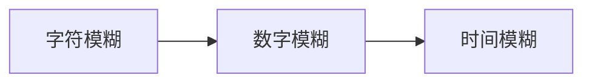
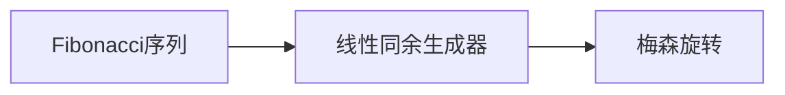
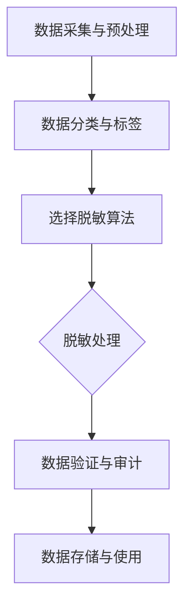
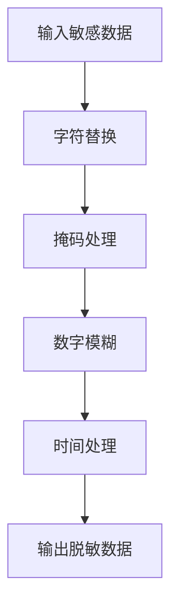
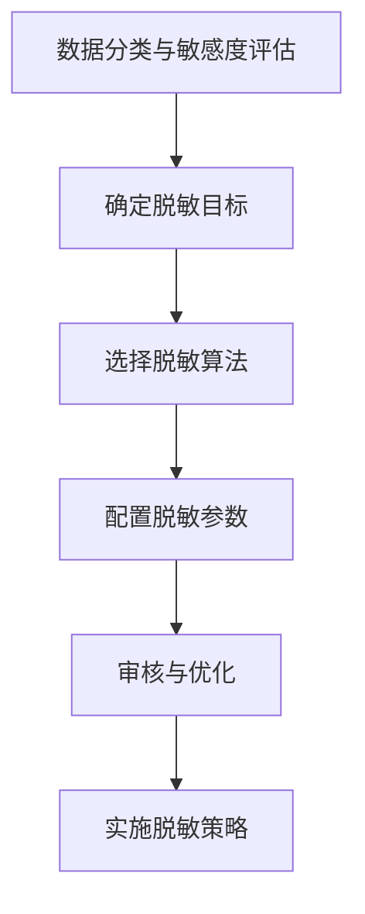

                 

# 《数据脱敏：AI保护用户隐私安全》

## 关键词
数据脱敏、AI、用户隐私、数据安全、隐私保护、技术实战、法律法规、案例分析、未来展望

## 摘要
本文全面解析了数据脱敏在保护用户隐私安全方面的重要性。首先，我们回顾了数据隐私保护的重要性以及数据隐私泄露的风险和危害。接着，我们详细介绍了数据脱敏的定义、目标和应用领域。然后，我们深入探讨了数据脱敏的技术原理，包括基本方法、算法原理和流程设计。随后，通过介绍常见数据脱敏工具和应用案例，展示了数据脱敏技术在实战中的应用。此外，我们还探讨了AI在数据脱敏中的角色和挑战。文章最后，我们讨论了数据脱敏与数据安全的关系，并展望了数据脱敏技术的未来发展趋势和应用场景。

## 引言
在当今信息化的时代，数据已经成为企业和社会的重要资产。然而，随着数据量的爆炸性增长和数据应用场景的多样化，数据隐私保护问题日益突出。数据隐私泄露不仅会对个人隐私造成侵害，还可能引发严重的经济、法律和社会问题。因此，如何有效地保护用户隐私数据成为了一个重要的课题。

数据脱敏是一种重要的数据隐私保护技术，通过在数据处理和分析过程中对敏感数据进行转换和处理，使得数据在保留其分析价值的同时，无法被直接识别和利用，从而有效防止数据隐私泄露。随着人工智能技术的发展，AI技术在数据脱敏中的应用越来越广泛，为数据隐私保护提供了新的解决方案。

本文将首先介绍数据脱敏的背景和意义，然后详细解析数据脱敏的技术原理，包括基本方法、算法原理和流程设计。接着，我们将通过介绍常见数据脱敏工具和应用案例，展示数据脱敏技术在实战中的应用。此外，我们还将探讨AI在数据脱敏中的角色和挑战。最后，我们将讨论数据脱敏与数据安全的关系，并展望数据脱敏技术的未来发展趋势和应用场景。希望通过本文的阐述，能够为读者提供全面深入的数据脱敏知识，并激发对数据隐私保护和技术创新的思考。

## 第一部分：数据脱敏概述

### 第1章：数据脱敏的背景和意义

#### 1.1 数据隐私保护的重要性

数据隐私保护是信息社会中一个至关重要的问题。随着互联网和大数据技术的飞速发展，个人和企业所产生的数据量呈现出爆炸式增长。这些数据不仅包含了商业机密、客户信息，还涉及个人身份信息、健康状况、通信记录等敏感信息。数据隐私泄露的风险无处不在，一旦发生，后果将极其严重。

##### 1.1.1 数据隐私泄露的风险

数据隐私泄露的风险主要包括以下几个方面：

1. **黑客攻击**：黑客通过非法手段获取数据，如SQL注入、中间人攻击等。
2. **内部泄露**：企业内部人员因不正当行为或疏忽导致数据泄露。
3. **数据共享不当**：企业在数据共享和交换过程中未能有效保护数据隐私。
4. **社会工程学攻击**：通过欺骗手段获取敏感信息，如钓鱼攻击、电信诈骗等。

##### 1.1.2 数据隐私泄露的危害

数据隐私泄露的危害主要体现在以下几个方面：

1. **个人隐私侵害**：个人身份信息泄露可能导致身份盗用、财产损失等。
2. **商业机密泄露**：企业商业机密泄露可能导致市场竞争力的下降、经济损失等。
3. **法律风险**：数据隐私泄露可能引发法律责任，如违反隐私保护法规。
4. **社会问题**：大规模数据隐私泄露可能引发社会不信任、恐慌等。

因此，数据隐私保护已经成为企业和政府关注的焦点。数据脱敏作为一种有效的隐私保护技术，能够在数据使用过程中最大程度地降低隐私泄露的风险，保护用户隐私安全。

#### 1.2 数据脱敏的定义

数据脱敏（Data Masking）是一种通过技术手段对数据进行变换和隐藏，使得数据在保留其分析价值的同时，无法被直接识别和利用的方法。数据脱敏的目的是在确保数据隐私和安全的前提下，允许数据在不同场景下进行共享、交换和分析。

##### 1.2.1 数据脱敏的概念

数据脱敏包括以下关键概念：

1. **敏感数据**：指包含个人隐私、商业机密等敏感信息的原始数据。
2. **脱敏数据**：经过脱敏处理后的数据，其隐私信息被隐藏或替换，但保留了数据的分析价值。
3. **脱敏算法**：用于实现数据脱敏的算法和技术，如替换算法、模糊算法、伪随机算法等。

##### 1.2.2 数据脱敏的目标

数据脱敏的主要目标包括：

1. **保护隐私**：通过隐藏或替换敏感信息，确保数据在传输、存储和分析过程中不会被未经授权的人员获取和利用。
2. **保留价值**：在数据脱敏过程中，尽可能保留数据的分析价值，确保脱敏数据仍可用于业务决策和科学研究。
3. **降低风险**：通过数据脱敏，降低数据隐私泄露的风险，保护企业和个人的合法权益。

#### 1.3 数据脱敏的应用领域

数据脱敏技术在多个领域得到广泛应用，主要包括以下几个方面：

##### 1.3.1 企业内部数据管理

在企业内部，数据脱敏技术主要用于：

1. **测试数据**：在开发、测试环境中使用脱敏数据，确保测试过程不涉及真实敏感信息。
2. **数据共享**：在跨部门或跨公司数据共享过程中，使用脱敏数据保护隐私。
3. **数据备份与恢复**：在备份数据时进行脱敏处理，确保备份数据的安全。

##### 1.3.2 数据共享与交换

在数据共享与交换场景中，数据脱敏技术可以：

1. **跨企业数据交换**：在供应链、合作伙伴等跨企业数据交换过程中，使用脱敏数据保护企业隐私。
2. **开放数据**：在政府、科研机构等开放数据平台，通过数据脱敏技术保护个人隐私。

##### 1.3.3 法律法规要求

许多国家和地区制定了数据隐私保护法律法规，要求企业在特定场景下进行数据脱敏，如：

1. **GDPR**：欧盟《通用数据保护条例》要求企业在处理个人数据时进行脱敏处理。
2. **CCPA**：美国《加州消费者隐私法》要求企业在处理加州居民数据时进行脱敏处理。
3. **其他法规**：如《个人信息保护法》、《网络安全法》等，均要求企业在数据处理过程中进行数据脱敏。

#### 1.4 数据脱敏的发展趋势

随着技术的不断进步和隐私保护意识的提高，数据脱敏技术也在不断发展。以下是当前数据脱敏技术的一些发展趋势：

##### 1.4.1 人工智能与数据脱敏

人工智能（AI）技术在数据脱敏中的应用越来越广泛，如基于机器学习的脱敏算法、自动化脱敏工具等。AI技术能够提高数据脱敏的效率和准确性，为数据隐私保护提供新的解决方案。

##### 1.4.2 大数据时代的挑战与机遇

大数据时代的到来为数据脱敏技术带来了新的挑战和机遇。如何在海量数据中有效进行脱敏处理，同时保证数据质量和分析价值，是当前数据脱敏技术面临的重要问题。

##### 1.4.3 未来发展方向

未来数据脱敏技术的发展方向包括：

1. **精细化脱敏**：根据不同类型的数据和不同的应用场景，设计更加精细化的脱敏策略。
2. **实时脱敏**：实现数据在生产、传输、存储等过程中的实时脱敏，确保数据隐私保护的高效性和实时性。
3. **跨领域融合**：将数据脱敏技术与区块链、物联网、云计算等新兴技术相结合，打造更加安全、可靠的数据隐私保护体系。

### 小结
数据脱敏作为一种重要的数据隐私保护技术，在保护用户隐私安全和数据安全方面具有重要作用。本文对数据脱敏的背景和意义进行了详细介绍，为后续章节的内容奠定了基础。在接下来的章节中，我们将深入探讨数据脱敏的技术原理、实战应用、AI技术在数据脱敏中的应用以及数据脱敏与数据安全的关系。

### 第2章：数据脱敏技术原理

#### 2.1 数据脱敏的基本方法

数据脱敏的基本方法主要包括以下几种：

##### 2.1.1 通用脱敏方法

通用脱敏方法适用于各种类型的数据，主要包括：

1. **替换**：将敏感数据替换为伪数据，如将电话号码替换为1234567890。
2. **掩码**：使用掩码技术对敏感数据进行部分遮挡，如将身份证号码中的前几位保留，后几位用星号遮挡。
3. **打乱顺序**：将敏感数据中的字符或字段顺序打乱，如将姓名中的字母顺序打乱。

##### 2.1.2 特定类型数据脱敏方法

针对不同类型的数据，可以采用特定的脱敏方法：

1. **文本数据**：可以使用自然语言处理技术进行词汇替换、同义词替换等。
2. **图像数据**：可以使用图像处理技术进行像素替换、图像模糊等。
3. **音频数据**：可以使用音频处理技术进行声音变换、噪声添加等。

#### 2.2 数据脱敏算法原理

数据脱敏算法是数据脱敏技术核心，主要包括以下几种算法：

##### 2.2.1 替换算法

替换算法是最简单也是最常用的数据脱敏方法，主要包括以下几种实现方式：

1. **静态替换**：将敏感数据直接替换为固定伪数据，如电话号码替换为1234567890。
2. **动态替换**：根据一定规则生成伪数据，如使用随机数生成器生成电话号码。


##### 2.2.2 模糊算法

模糊算法通过模糊处理敏感数据，使其无法被直接识别。主要包括以下几种实现方式：

1. **字符模糊**：对敏感数据进行字符替换或打乱，如将姓名中的字母顺序打乱。
2. **数字模糊**：对敏感数字进行上下波动处理，如将年龄设置为20±5。
3. **时间模糊**：对时间数据进行模糊处理，如将生日设置为1990年±10年。



##### 2.2.3 伪随机算法

伪随机算法通过生成伪随机数对敏感数据进行变换。常见的伪随机算法包括：

1. **Fibonacci序列**：基于Fibonacci序列生成伪随机数。
2. **线性同余生成器**：基于线性同余方程生成伪随机数。
3. **梅森旋转**：基于梅森旋转生成伪随机数。



#### 2.3 数据脱敏的流程

数据脱敏的流程主要包括以下步骤：

##### 2.3.1 数据采集与预处理

1. **数据采集**：从数据源采集需要脱敏的数据。
2. **数据清洗**：对采集到的数据进行清洗，去除重复、错误和无效数据。
3. **数据分类**：根据数据类型和敏感程度对数据进行分类。

##### 2.3.2 数据脱敏处理

1. **选择脱敏算法**：根据数据类型和需求选择合适的脱敏算法。
2. **配置脱敏参数**：设置脱敏算法的参数，如掩码长度、模糊范围等。
3. **执行脱敏操作**：对数据进行脱敏处理。

##### 2.3.3 数据验证与审计

1. **数据验证**：对脱敏后的数据进行验证，确保脱敏效果符合要求。
2. **数据审计**：对脱敏过程进行审计，确保脱敏操作符合法律法规和标准要求。

#### 2.4 数据脱敏策略设计

数据脱敏策略设计是确保数据脱敏效果的关键。主要包括以下方面：

##### 2.4.1 数据分类策略

1. **敏感程度分类**：根据数据的敏感程度进行分类，如个人身份信息、商业机密等。
2. **数据类型分类**：根据数据类型进行分类，如文本、图像、音频等。

##### 2.4.2 脱敏算法选择策略

1. **算法匹配**：根据数据类型和敏感程度选择合适的脱敏算法。
2. **算法组合**：结合多种脱敏算法，提高脱敏效果。

##### 2.4.3 数据隐私保护等级划分

1. **等级划分**：根据数据的重要性和敏感程度，划分不同的隐私保护等级。
2. **等级策略**：根据不同等级的数据，采用不同的脱敏策略。

### 小结
本章详细介绍了数据脱敏的基本方法、算法原理和流程设计，以及数据脱敏策略设计。通过本章的内容，读者可以了解数据脱敏的核心技术和实现方法，为后续章节的实战应用和案例分析打下基础。在下一章中，我们将通过具体案例，展示数据脱敏技术在实际应用中的效果和挑战。

### 第3章：常见数据脱敏工具与应用

#### 3.1 数据脱敏工具介绍

在数据脱敏领域，有许多优秀的工具和软件可以帮助我们进行数据脱敏处理。以下是一些常见的数据脱敏工具介绍：

##### 3.1.1 OpenGauss脱敏工具

OpenGauss是一款开源的关系数据库管理系统，其内置了数据脱敏功能。OpenGauss的数据脱敏工具支持多种脱敏算法，如掩码、模糊、替换等。用户可以通过简单的SQL语句对数据库中的数据进行脱敏处理。

##### 3.1.2 IBM InfoSphere Master Data Management

IBM InfoSphere Master Data Management是一款综合性的数据管理平台，包括数据集成、数据质量、数据治理等功能。其中，数据脱敏是其重要组成部分，支持多种数据类型和复杂的脱敏规则。

##### 3.1.3 Oracle Data Masking and De-Identification

Oracle Data Masking and De-Identification是Oracle公司提供的一款数据脱敏工具，支持对数据库、数据仓库、云数据进行脱敏处理。它提供了丰富的脱敏算法和规则，以及高度可定制的脱敏策略。

#### 3.2 数据脱敏工具使用示例

以下分别介绍上述三种数据脱敏工具的使用示例：

##### 3.2.1 OpenGauss脱敏工具使用

假设我们有一个包含用户个人信息的表格`user_info`，现在需要对其进行脱敏处理。

```sql
CREATE TABLE user_info (
    id INT PRIMARY KEY,
    name VARCHAR(50),
    phone VARCHAR(11),
    email VARCHAR(100),
    birthdate DATE
);
```

使用OpenGauss脱敏工具，我们可以通过以下SQL语句对数据进行脱敏处理：

```sql
CALL DBMS_DATAMASKING.MASK_TABLE('public', 'user_info');
```

执行上述语句后，`user_info`表中的数据将被自动脱敏，如电话号码、邮箱地址等敏感信息将替换为掩码。

##### 3.2.2 IBM InfoSphere Master Data Management 使用

IBM InfoSphere Master Data Management提供了一个图形化界面，用户可以通过界面配置脱敏规则和策略。

1. **创建脱敏规则**：

   在界面中创建一个脱敏规则，选择数据类型为`VARCHAR`，脱敏算法为`Mask`，掩码长度为11。

2. **应用脱敏规则**：

   选择需要脱敏的数据表`user_info`，将创建的脱敏规则应用到该表中。

3. **执行脱敏操作**：

   在界面中执行脱敏操作，完成对数据的脱敏处理。

##### 3.2.3 Oracle Data Masking and De-Identification 使用

Oracle Data Masking and De-Identification提供了一个命令行工具`oradatamasking`，用户可以通过命令行进行脱敏操作。

1. **配置参数**：

   配置脱敏操作的参数，如数据库名称、用户名、密码等。

2. **编写脱敏规则**：

   使用`CREATE DE-IDENTIFICATION POLICY`语句创建脱敏规则，指定脱敏算法和掩码长度。

   ```sql
   CREATE DE-IDENTIFICATION POLICY "User_Mask" AS
   (
     PHONE_NUMBER('PHONE', 'XXXXXXXXXX'),
     EMAIL_ADDRESS('EMAIL', 'XXX@XXX.com'),
     DATE('BIRTHDATE', 'YYYY-MM-DD')
   );
   ```

3. **执行脱敏操作**：

   使用`APPLY DE-IDENTIFICATION POLICY`语句对数据表进行脱敏操作。

   ```sql
   EXEC DBMS_DATA_MASKING.APPLY_DEIDENTIFICATION_POLICY('user_info', 'User_Mask');
   ```

执行上述步骤后，数据表`user_info`中的敏感信息将被替换为掩码。

#### 3.3 数据脱敏实战项目案例

以下是一个数据脱敏实战项目案例，我们将使用OpenGauss数据脱敏工具对用户数据进行脱敏处理。

##### 3.3.1 项目背景

某电商公司在进行用户数据分析时，需要处理大量的用户个人信息，包括姓名、电话、邮箱、出生日期等。为了保护用户隐私，公司决定对用户数据进行脱敏处理。

##### 3.3.2 项目目标

1. 对用户姓名、电话、邮箱、出生日期等敏感信息进行脱敏处理。
2. 确保脱敏数据在保留分析价值的同时，无法被直接识别。

##### 3.3.3 项目步骤

1. **数据采集**：

   从数据库中采集需要脱敏的用户数据。

2. **数据预处理**：

   对采集到的用户数据进行清洗，去除重复、错误和无效数据。

3. **数据脱敏**：

   使用OpenGauss脱敏工具对用户数据进行脱敏处理，分别对姓名、电话、邮箱、出生日期等字段进行掩码、模糊等处理。

4. **数据验证**：

   对脱敏后的用户数据进行验证，确保脱敏效果符合要求。

5. **数据存储**：

   将脱敏后的用户数据存储到安全的数据仓库中，供后续分析和挖掘使用。

##### 3.3.4 项目效果

通过数据脱敏处理，用户敏感信息得到了有效保护，同时数据依然保留了分析价值。电商公司可以安全地进行用户数据分析，为业务决策提供支持。

### 小结
本章介绍了常见的数据脱敏工具，并通过具体示例展示了如何使用这些工具进行数据脱敏。在实际项目中，根据需求和场景选择合适的脱敏工具和算法，可以确保数据脱敏效果达到预期。在下一章中，我们将探讨AI在数据脱敏中的应用，进一步探索数据脱敏技术的创新和发展。

### 第4章：AI在数据脱敏中的应用

#### 4.1 AI与数据脱敏

人工智能（AI）技术的发展为数据脱敏带来了新的机遇和挑战。AI技术能够在数据脱敏过程中提高效率、增强效果，并实现更精细化的隐私保护。以下是AI在数据脱敏中的应用和结合点：

##### 4.1.1 AI在数据脱敏中的作用

1. **自动脱敏**：AI技术能够自动识别数据中的敏感信息，并应用合适的脱敏算法进行处理，减轻人工操作的负担。
2. **增强效果**：AI算法能够通过学习大量数据，不断优化脱敏效果，使其更加接近原始数据，同时保证隐私保护。
3. **实时脱敏**：AI技术可以实现数据在生产、传输、存储等过程中的实时脱敏，提高数据隐私保护的高效性和实时性。

##### 4.1.2 AI与数据脱敏的结合点

1. **机器学习**：通过机器学习算法，AI能够自动识别敏感信息，并根据历史数据进行算法优化，实现更高效的脱敏处理。
2. **自然语言处理**：在处理文本数据时，自然语言处理（NLP）技术可以帮助AI理解数据的语义和结构，从而进行更精确的脱敏。
3. **图像识别**：在处理图像数据时，图像识别技术可以帮助AI识别图像中的敏感信息，进行有效的图像脱敏。
4. **深度学习**：深度学习算法能够处理大量复杂数据，通过多层神经网络提取特征，实现更精细化的脱敏。

#### 4.2 基于AI的数据脱敏方法

##### 4.2.1 深度学习在数据脱敏中的应用

深度学习在数据脱敏中的应用主要包括以下几个方面：

1. **自动敏感信息识别**：通过训练深度神经网络，AI可以自动识别数据中的敏感信息，如个人身份信息、金融信息等。
2. **特征提取**：深度学习算法可以从原始数据中提取高层次的抽象特征，为脱敏处理提供更准确的信息。
3. **算法优化**：通过不断训练和优化，深度学习算法能够提高脱敏效果，使其更接近原始数据的真实情况。

##### 4.2.2 生成对抗网络（GAN）在数据脱敏中的应用

生成对抗网络（GAN）是一种强大的深度学习模型，特别适用于数据脱敏。

1. **生成真实数据**：GAN可以通过训练生成与真实数据高度相似的数据，从而在数据脱敏过程中保留数据的真实特征。
2. **对抗性优化**：GAN中的生成器和判别器相互对抗，生成器不断优化生成的数据，使其更接近真实数据，同时保证隐私保护。
3. **数据多样性**：GAN可以生成多种多样的脱敏数据，满足不同应用场景的需求。

#### 4.3 AI在数据脱敏中的挑战与前景

##### 4.3.1 数据质量与隐私保护之间的平衡

在AI数据脱敏过程中，数据质量和隐私保护之间存在一定的矛盾。如何在保证数据隐私保护的同时，尽可能保留数据的质量和完整性，是一个重要的挑战。

1. **优化算法**：通过不断优化AI算法，提高脱敏效果的准确性和鲁棒性，实现数据质量与隐私保护的平衡。
2. **多策略结合**：结合多种脱敏方法，如深度学习、GAN等，根据不同场景和数据类型选择合适的脱敏策略。

##### 4.3.2 AI在数据脱敏中的伦理问题

AI在数据脱敏中的应用引发了一系列伦理问题，如数据滥用、隐私泄露等。如何在技术发展的同时，保障用户的隐私权益，是一个亟待解决的问题。

1. **数据治理**：建立完善的数据治理体系，确保数据在处理过程中的透明性和合规性。
2. **伦理审查**：在AI数据脱敏项目实施前，进行伦理审查，确保项目符合伦理规范。

##### 4.3.3 未来发展方向

未来，AI在数据脱敏中的应用将不断发展和完善，主要发展方向包括：

1. **实时脱敏**：实现数据在生产、传输、存储等过程中的实时脱敏，提高数据隐私保护的高效性和实时性。
2. **精细化脱敏**：根据不同类型的数据和应用场景，设计更加精细化的脱敏策略，满足多样化需求。
3. **跨领域融合**：将AI技术与区块链、物联网、云计算等新兴技术相结合，打造更加安全、可靠的数据隐私保护体系。

### 小结
AI在数据脱敏中的应用为数据隐私保护提供了新的思路和手段。通过深度学习和生成对抗网络等AI技术，数据脱敏可以实现更高效、更精准的隐私保护。然而，在AI数据脱敏过程中，数据质量与隐私保护之间的平衡、伦理问题等挑战仍需解决。未来，随着AI技术的不断发展和完善，AI在数据脱敏中的应用前景将更加广阔。

### 第5章：数据脱敏与数据安全

#### 5.1 数据脱敏与数据安全的关系

数据脱敏和数据安全是保障数据隐私和安全的两种重要技术手段，它们在数据保护体系中扮演着不同的角色，但相互之间有着密切的联系。

##### 5.1.1 数据脱敏在数据安全中的作用

数据脱敏的核心目的是在确保数据隐私和安全的前提下，允许数据在不同场景下进行共享、交换和分析。具体来说，数据脱敏在数据安全中的作用包括：

1. **降低隐私泄露风险**：通过对敏感数据进行脱敏处理，使得数据在传输、存储和分析过程中不会被直接识别和利用，从而有效防止隐私泄露。
2. **增强数据可用性**：在数据脱敏后，数据仍然保留了其分析价值，可以用于业务决策和科学研究，同时降低了隐私泄露的风险。
3. **支持合规性要求**：许多国家和地区制定了严格的隐私保护法律法规，如欧盟的GDPR、中国的《个人信息保护法》等。数据脱敏有助于企业满足这些合规性要求，降低法律风险。

##### 5.1.2 数据脱敏与数据加密、数据备份等的比较

数据脱敏、数据加密和数据备份是保障数据安全的三种常见技术手段，它们各自有着不同的特点和用途。

1. **数据脱敏**：
   - 特点：数据脱敏主要针对敏感信息，通过替换、模糊、掩码等技术，使得数据在保留其分析价值的同时，无法被直接识别和利用。
   - 用途：适用于数据共享、测试、开发等场景，旨在保护数据隐私。

2. **数据加密**：
   - 特点：数据加密是将数据转换成密文，确保数据在传输、存储过程中不会被未授权人员读取和篡改。
   - 用途：适用于保护存储在数据库、文件系统、云平台等的数据。

3. **数据备份**：
   - 特点：数据备份是将数据复制并存储在另一个位置，以防止数据丢失或损坏。
   - 用途：适用于数据恢复、灾难恢复等场景，确保数据可用性。

尽管数据脱敏、数据加密和数据备份都是保障数据安全的技术手段，但它们在具体应用场景和目标上有所不同。数据脱敏侧重于保护数据隐私，数据加密侧重于数据机密性，数据备份侧重于数据可用性。在实际应用中，应根据具体需求和环境选择合适的保护措施。

#### 5.2 数据脱敏在数据安全中的应用

数据脱敏在数据安全中有着广泛的应用，以下是一些主要的应用场景：

##### 5.2.1 企业内部数据安全管理

在企业内部，数据脱敏技术主要用于以下场景：

1. **测试数据**：在开发、测试环境中使用脱敏数据，确保测试过程不涉及真实敏感信息。
2. **数据共享**：在跨部门或跨公司数据共享过程中，使用脱敏数据保护企业隐私。
3. **数据备份与恢复**：在备份数据时进行脱敏处理，确保备份数据的安全。

##### 5.2.2 外部数据交换与共享

在企业与外部合作伙伴、客户等交换和共享数据时，数据脱敏技术可以：

1. **跨企业数据交换**：在供应链、合作伙伴等跨企业数据交换过程中，使用脱敏数据保护企业隐私。
2. **开放数据**：在政府、科研机构等开放数据平台，通过数据脱敏技术保护个人隐私。

##### 5.2.3 法律法规合规要求

许多国家和地区制定了数据隐私保护法律法规，要求企业在特定场景下进行数据脱敏，如：

1. **GDPR**：欧盟《通用数据保护条例》要求企业在处理个人数据时进行脱敏处理。
2. **CCPA**：美国《加州消费者隐私法》要求企业在处理加州居民数据时进行脱敏处理。
3. **其他法规**：如中国的《个人信息保护法》、《网络安全法》等，均要求企业在数据处理过程中进行数据脱敏。

#### 5.3 数据脱敏与数据安全策略设计

为了确保数据脱敏的有效性和安全性，企业需要制定全面的数据脱敏策略，包括以下几个方面：

##### 5.3.1 数据分类与标签策略

1. **数据分类**：根据数据的敏感程度和重要性，将数据分为不同的类别，如个人身份信息、商业机密、普通信息等。
2. **标签策略**：为不同类别的数据分配标签，便于在数据处理过程中识别和处理。

##### 5.3.2 数据脱敏算法与密钥管理策略

1. **脱敏算法选择**：根据数据类型和需求选择合适的脱敏算法，如掩码、模糊、替换等。
2. **密钥管理**：对于加密或密钥相关的脱敏算法，需要建立严格的密钥管理策略，确保密钥的安全存储和分发。

##### 5.3.3 数据安全审计与监控策略

1. **数据审计**：定期对数据进行审计，确保数据脱敏操作符合合规要求。
2. **监控策略**：建立实时监控机制，及时发现和应对数据隐私泄露等安全事件。

#### 小结
数据脱敏与数据安全密不可分，两者共同构成了保障数据隐私和安全的重要技术手段。数据脱敏通过在数据保留其分析价值的同时隐藏敏感信息，有效降低了隐私泄露的风险。在实际应用中，企业应根据具体需求和场景，制定全面的数据脱敏策略，确保数据隐私和安全得到有效保护。

### 第6章：数据脱敏法律法规与标准

#### 6.1 数据脱敏法律法规概述

随着数据隐私保护意识的提高，全球范围内许多国家和地区制定了相关的法律法规，要求企业在数据处理过程中进行数据脱敏，确保用户隐私安全。以下是几个主要国家和地区的数据隐私保护法律法规概述：

##### 6.1.1 全球数据隐私法规

1. **欧盟《通用数据保护条例》（GDPR）**：
   - 介绍：GDPR是欧盟于2018年实施的一项全面的数据隐私保护法规，旨在加强个人数据保护。
   - 主要要求：企业必须获得用户明确同意才能处理其个人数据，数据脱敏是确保数据处理合规的重要手段。
   - 罚则：违反GDPR规定的企业可能会面临高达2000万欧元或全球营业额4%的罚款。

2. **美国《加州消费者隐私法》（CCPA）**：
   - 介绍：CCPA是加州于2018年通过的一项隐私保护法案，旨在保护加州居民的个人信息。
   - 主要要求：企业必须告知加州居民其个人信息的使用目的，并提供删除和访问个人信息的能力。
   - 罚则：违反CCPA规定的企业可能会面临高额罚款，并可能面临诉讼。

##### 6.1.2 中国数据隐私法规

1. **《个人信息保护法》（PIPL）**：
   - 介绍：PIPL是中国于2021年实施的一项全面的数据隐私保护法律，旨在加强个人信息保护。
   - 主要要求：企业必须取得用户明确同意才能收集、处理和利用个人信息，数据脱敏是确保合规的重要手段。
   - 罚则：违反PIPL规定的企业可能会面临高额罚款，最高可达5000万元或全球营业额的5%。

2. **《网络安全法》**：
   - 介绍：网络安全法是中国的一项重要法律法规，旨在保护网络安全，确保个人信息安全。
   - 主要要求：企业必须采取必要措施保护用户个人信息，防止数据泄露和滥用。
   - 罚则：违反网络安全法规定的企业可能会面临高额罚款，最高可达1000万元。

#### 6.2 数据脱敏标准

除了法律法规外，数据脱敏技术还遵循一系列国际和行业标准，以确保数据脱敏的有效性和安全性。以下是几个主要的数据脱敏标准：

##### 6.2.1 ISO/IEC 27001标准

1. **介绍**：ISO/IEC 27001是国际标准化组织（ISO）和国际电工委员会（IEC）联合制定的一项信息安全管理标准。
2. **主要要求**：该标准要求企业建立和维护一个有效的信息安全管理系统，包括数据保护、数据备份、数据访问控制等。
3. **与数据脱敏的关系**：ISO/IEC 27001标准中的数据保护要求可以指导企业制定数据脱敏策略，确保数据处理过程符合安全规范。

##### 6.2.2 PCI DSS标准

1. **介绍**：PCI DSS是支付卡行业数据安全标准，由PCI安全标准委员会制定，旨在保护支付卡数据的安全。
2. **主要要求**：PCI DSS标准要求企业采取一系列安全措施，包括数据加密、访问控制、安全审计等。
3. **与数据脱敏的关系**：PCI DSS标准中的数据保护要求可以指导企业在处理支付卡数据时进行数据脱敏，确保数据隐私保护。

##### 6.2.3 NIST SP 800-122标准

1. **介绍**：NIST SP 800-122是美国国家标准与技术研究院（NIST）制定的一项关于数据脱敏的技术指南。
2. **主要要求**：该指南提供了数据脱敏的技术原则和方法，包括数据分类、脱敏算法选择、脱敏策略设计等。
3. **与数据脱敏的关系**：NIST SP 800-122标准可以作为企业制定数据脱敏策略的参考，确保脱敏过程符合技术规范。

#### 6.3 数据脱敏合规实践

为了确保数据脱敏合规，企业需要建立一系列合规实践，包括：

##### 6.3.1 企业数据脱敏合规流程

1. **数据分类**：根据数据的敏感程度和重要性，将数据分为不同的类别，如个人身份信息、商业机密、普通信息等。
2. **脱敏策略制定**：根据数据类别和业务需求，制定相应的脱敏策略，包括脱敏算法选择、脱敏范围等。
3. **脱敏执行**：按照制定的脱敏策略，对敏感数据执行脱敏操作。
4. **审计与监督**：定期对脱敏过程进行审计，确保脱敏操作符合法律法规和标准要求。

##### 6.3.2 数据脱敏合规性审计

1. **内部审计**：企业内部设立专门的审计团队，对数据脱敏过程进行定期审计，确保合规性。
2. **第三方审计**：邀请独立的第三方机构对企业数据脱敏过程进行审计，确保审计结果的客观性和公正性。
3. **合规报告**：定期编制合规报告，向管理层和监管机构汇报数据脱敏合规情况。

#### 小结
数据脱敏法律法规和标准为企业的数据隐私保护提供了明确的要求和指导。通过遵守相关法律法规和标准，企业可以确保数据脱敏过程符合合规要求，降低隐私泄露的风险。在下一章中，我们将通过具体的案例分析，进一步探讨数据脱敏在实践中的应用和效果。

### 第7章：数据脱敏案例分析

#### 7.1 数据脱敏案例介绍

在本章中，我们将介绍三个具体的数据脱敏案例，分别是某电商公司、某银行和某医疗企业的数据脱敏实践。通过这些案例，我们将深入了解数据脱敏方案的设计、工具选择以及实际效果。

##### 7.1.1 某电商公司数据脱敏案例

某电商公司是一家大型在线零售平台，其业务涵盖了用户个人信息、支付信息、订单信息等多个方面。为了保护用户隐私，公司决定对用户数据进行脱敏处理。

**案例背景**：

- **用户数据量巨大**：公司每天处理的用户数据量超过10TB，包括用户名、电话、邮箱、地址等敏感信息。
- **业务需求**：公司在进行数据分析和市场调研时，需要使用脱敏后的用户数据，确保用户隐私不被泄露。

**数据脱敏方案设计**：

- **数据分类**：将用户数据按照敏感程度进行分类，如电话、邮箱为高敏感度数据，用户名、地址为中等敏感度数据。
- **脱敏工具选择**：选择OpenGauss数据库内置的脱敏工具，该工具支持多种脱敏算法，如掩码、模糊、替换等。
- **脱敏策略**：根据数据敏感程度和业务需求，为不同类型的用户数据制定不同的脱敏策略，如电话和邮箱使用掩码脱敏，用户名和地址使用模糊脱敏。

**工具选择**：

- **OpenGauss数据库**：OpenGauss是一款开源的关系数据库，其内置的脱敏工具可以方便地对用户数据执行脱敏操作。

**实际效果**：

- **脱敏效率高**：通过OpenGauss数据库的脱敏工具，公司可以在较短的时间内完成大量用户数据的脱敏处理。
- **数据质量保持**：脱敏后的数据仍保留了其分析价值，可以用于业务决策和市场调研。

##### 7.1.2 某银行数据脱敏案例

某银行是一家大型金融机构，其业务涉及到客户个人信息、交易记录、账户信息等多个方面。为了保护客户隐私，银行决定对客户数据进行脱敏处理。

**案例背景**：

- **客户数据敏感**：银行每天处理的客户数据包括姓名、身份证号码、银行卡号码等敏感信息。
- **法律法规要求**：根据相关法律法规，银行必须对客户数据采取严格的脱敏措施，确保客户隐私不被泄露。

**数据脱敏方案设计**：

- **数据分类**：将客户数据按照敏感程度进行分类，如身份证号码、银行卡号码为高敏感度数据，姓名、地址为中等敏感度数据。
- **脱敏工具选择**：选择IBM InfoSphere Master Data Management平台，该平台提供强大的数据脱敏功能，支持自定义脱敏规则和策略。
- **脱敏策略**：根据数据敏感程度和业务需求，为不同类型的客户数据制定不同的脱敏策略，如身份证号码和银行卡号码使用掩码脱敏，姓名和地址使用模糊脱敏。

**工具选择**：

- **IBM InfoSphere Master Data Management**：IBM InfoSphere Master Data Management是一款综合性的数据管理平台，其脱敏功能强大，可以满足银行多样化的脱敏需求。

**实际效果**：

- **脱敏效果显著**：通过IBM InfoSphere Master Data Management平台的脱敏功能，银行成功保护了客户隐私，降低了隐私泄露的风险。
- **合规性保证**：银行通过脱敏措施，满足了相关法律法规的要求，确保了合规性。

##### 7.1.3 某医疗企业数据脱敏案例

某医疗企业是一家专注于医疗数据分析和研究的公司，其业务涉及到大量患者个人信息、医疗记录等敏感数据。为了保护患者隐私，公司决定对医疗数据进行脱敏处理。

**案例背景**：

- **医疗数据敏感**：医疗数据包括患者姓名、身份证号码、诊断记录等敏感信息。
- **研究需求**：公司需要进行大规模的医疗数据分析和研究，但需要确保患者隐私不被泄露。

**数据脱敏方案设计**：

- **数据分类**：将医疗数据按照敏感程度进行分类，如诊断记录、治疗方案为高敏感度数据，患者姓名、身份证号码为中等敏感度数据。
- **脱敏工具选择**：选择Oracle Data Masking and De-Identification工具，该工具支持多种脱敏算法，可以灵活配置脱敏策略。
- **脱敏策略**：根据数据敏感程度和业务需求，为不同类型的医疗数据制定不同的脱敏策略，如诊断记录和治疗方案使用模糊脱敏，患者姓名和身份证号码使用掩码脱敏。

**工具选择**：

- **Oracle Data Masking and De-Identification**：Oracle Data Masking and De-Identification是一款功能强大的数据脱敏工具，可以满足医疗企业在数据脱敏过程中的多样化需求。

**实际效果**：

- **脱敏处理高效**：通过Oracle Data Masking and De-Identification工具，公司可以在较短的时间内完成大量医疗数据的脱敏处理。
- **数据隐私保护**：脱敏后的数据无法被直接识别和利用，有效保护了患者隐私。

#### 7.2 数据脱敏案例分析

以下是对上述三个数据脱敏案例的详细分析，包括方案设计、工具选择和效果评估：

##### 7.2.1 方案设计

1. **某电商公司**：
   - **设计思路**：根据用户数据的敏感程度和业务需求，制定针对性的脱敏方案，确保脱敏后的数据仍可用于分析和决策。
   - **关键点**：选择适合的脱敏算法，如掩码、模糊等，根据不同类型的数据制定不同的脱敏策略。

2. **某银行**：
   - **设计思路**：遵循相关法律法规的要求，对客户数据进行严格的脱敏处理，确保客户隐私不被泄露。
   - **关键点**：制定全面的脱敏策略，包括数据分类、脱敏算法选择、脱敏范围等，确保脱敏过程合规。

3. **某医疗企业**：
   - **设计思路**：在保护患者隐私的前提下，确保医疗数据可用于研究和分析，为业务发展提供支持。
   - **关键点**：根据医疗数据的特性，选择合适的脱敏算法和工具，确保脱敏效果和效率。

##### 7.2.2 工具选择

1. **某电商公司**：
   - **选择原因**：OpenGauss数据库内置的脱敏工具功能丰富，支持多种脱敏算法，操作简便，适合大型电商企业的数据脱敏需求。

2. **某银行**：
   - **选择原因**：IBM InfoSphere Master Data Management平台具备强大的数据脱敏功能，支持自定义脱敏规则，适合金融行业的高标准合规需求。

3. **某医疗企业**：
   - **选择原因**：Oracle Data Masking and De-Identification工具支持多种脱敏算法，灵活性高，适合医疗企业在复杂场景下的数据脱敏需求。

##### 7.2.3 数据脱敏效果评估

1. **脱敏效率**：
   - **某电商公司**：通过OpenGauss数据库的脱敏工具，可以在较短的时间内完成大量用户数据的脱敏处理，满足业务需求。
   - **某银行**：通过IBM InfoSphere Master Data Management平台的脱敏功能，银行能够高效地对客户数据进行脱敏处理，确保合规性。
   - **某医疗企业**：通过Oracle Data Masking and De-Identification工具，医疗企业能够高效地对医疗数据进行脱敏处理，确保患者隐私不被泄露。

2. **脱敏效果**：
   - **某电商公司**：脱敏后的数据仍保留了其分析价值，可以用于业务决策和市场调研。
   - **某银行**：脱敏后的数据无法被直接识别和利用，有效保护了客户隐私。
   - **某医疗企业**：脱敏后的医疗数据能够满足研究和分析需求，同时确保患者隐私不被泄露。

#### 小结
通过具体案例分析，我们可以看到数据脱敏在实践中的应用和效果。不同企业根据自身的业务需求和法律法规要求，选择了合适的脱敏工具和策略，成功实现了数据隐私保护。在下一章中，我们将展望数据脱敏技术的未来发展趋势和应用场景。

### 第8章：未来展望与趋势

#### 8.1 数据脱敏技术的发展趋势

随着技术的不断进步和数据隐私保护需求的增加，数据脱敏技术也在不断发展和完善。以下是当前数据脱敏技术的发展趋势：

##### 8.1.1 新技术对数据脱敏的影响

1. **人工智能**：人工智能技术在数据脱敏中的应用日益广泛，如深度学习、生成对抗网络（GAN）等。这些技术可以提高数据脱敏的效率和准确性，为数据隐私保护提供新的解决方案。
2. **区块链**：区块链技术具有去中心化、不可篡改的特点，可以与数据脱敏技术结合，实现更安全的数据隐私保护。
3. **物联网**：物联网技术的快速发展带来了海量数据的产生，数据脱敏技术在保护物联网设备数据隐私方面具有重要作用。
4. **云计算**：云计算提供了高效、灵活的数据存储和处理能力，数据脱敏技术可以与云计算平台结合，实现大规模数据的隐私保护。

##### 8.1.2 未来数据脱敏技术的挑战

1. **数据质量与隐私保护的平衡**：在数据脱敏过程中，如何在保留数据质量的同时，确保隐私保护是一个重要挑战。未来需要开发更加精细化的脱敏算法和策略，以实现这一平衡。
2. **实时脱敏**：随着数据量的增加和实时性要求的提高，实现实时数据脱敏成为了一个重要挑战。未来需要开发更加高效、低延迟的脱敏技术。
3. **跨领域融合**：数据脱敏技术需要与区块链、物联网、云计算等新兴技术相结合，实现更广泛的应用场景。这要求不同技术之间的互操作性和兼容性得到提升。

##### 8.1.3 数据脱敏技术发展前景

未来，数据脱敏技术将在以下几个方面取得突破：

1. **精细化脱敏**：针对不同类型的数据和应用场景，开发更加精细化的脱敏算法和策略，实现个性化的隐私保护。
2. **实时脱敏**：结合实时数据处理技术，实现实时数据脱敏，满足大规模、实时性数据隐私保护的需求。
3. **智能化脱敏**：利用人工智能技术，实现自动化、智能化的脱敏过程，提高脱敏效率和准确性。
4. **跨领域应用**：与区块链、物联网、云计算等新兴技术相结合，拓展数据脱敏技术的应用场景，实现更广泛的数据隐私保护。

#### 8.2 数据脱敏与数据安全的关系演变

随着数据隐私保护需求的增加，数据脱敏与数据安全的关系也在不断演变。以下是数据脱敏与数据安全关系演变的主要趋势：

##### 8.2.1 数据脱敏在数据安全体系中的位置

1. **从辅助角色到核心角色**：传统上，数据脱敏被视为数据安全体系中的一个辅助角色，主要用于测试、开发等场景。随着数据隐私保护需求的增加，数据脱敏已经成为数据安全体系中的一个核心组成部分，与数据加密、数据备份等手段共同作用，实现全面的数据保护。
2. **从被动保护到主动防御**：传统的数据脱敏主要是在数据泄露事件发生后进行补救。未来，数据脱敏将向主动防御方向发展，通过实时脱敏和智能脱敏技术，实现数据在传输、存储和处理过程中的实时保护，降低隐私泄露的风险。

##### 8.2.2 数据脱敏与数据加密、数据备份等的协同

1. **协同作用**：数据脱敏、数据加密和数据备份是保障数据安全的三大重要手段。数据脱敏主要用于保护数据隐私，数据加密主要用于保护数据机密性，数据备份主要用于确保数据可用性。这三种手段相互协同，共同构建一个全面的数据安全体系。
2. **综合应用**：在实际应用中，企业需要根据具体需求和环境，综合运用数据脱敏、数据加密和数据备份等技术，实现数据在不同场景下的全面保护。

##### 8.2.3 数据脱敏与数据隐私保护的新模式

1. **隐私计算**：随着云计算和大数据技术的发展，隐私计算成为数据隐私保护的新模式。隐私计算通过在数据使用过程中进行加密和计算，确保数据在传输、存储和处理过程中的隐私保护，与数据脱敏技术相结合，实现更全面的数据隐私保护。
2. **零知识证明**：零知识证明是一种新兴的数据隐私保护技术，通过证明某个陈述为真，而不透露任何其他信息。未来，零知识证明有望与数据脱敏技术相结合，实现更加安全、可靠的数据隐私保护。

#### 8.3 数据脱敏的应用场景拓展

随着技术的进步和数据隐私保护需求的增加，数据脱敏技术的应用场景也在不断拓展。以下是数据脱敏技术在未来几个关键领域的应用展望：

##### 8.3.1 数据脱敏在物联网领域的应用

1. **设备数据隐私保护**：物联网设备产生的数据往往包含敏感信息，如位置信息、用户行为等。数据脱敏技术可以在这些数据传输和存储过程中进行隐私保护，防止数据泄露。
2. **边缘计算**：随着边缘计算的发展，数据脱敏技术在边缘设备中的应用也越来越重要。通过在边缘设备上实时进行数据脱敏处理，可以降低数据传输和存储的压力，同时确保数据隐私保护。

##### 8.3.2 数据脱敏在人工智能领域的应用

1. **训练数据隐私保护**：在人工智能训练过程中，训练数据往往包含敏感信息。数据脱敏技术可以在训练数据预处理过程中进行隐私保护，防止敏感信息泄露。
2. **模型隐私保护**：在模型部署过程中，数据脱敏技术可以用于保护模型中的敏感信息，防止模型被恶意攻击。

##### 8.3.3 数据脱敏在区块链领域的应用

1. **隐私保护**：区块链技术虽然具有去中心化和不可篡改的特点，但在某些情况下，区块链上的数据仍可能涉及隐私保护需求。数据脱敏技术可以在区块链数据存储和传输过程中进行隐私保护。
2. **跨链数据共享**：在跨链数据共享场景中，数据脱敏技术可以用于保护不同区块链之间的敏感数据，确保跨链数据共享的隐私保护。

#### 小结
未来，数据脱敏技术将在人工智能、物联网、区块链等新兴领域得到更广泛的应用。随着技术的不断进步和隐私保护需求的增加，数据脱敏技术将不断创新和发展，为数据隐私保护提供更加有效、全面的解决方案。

### 附录

#### 附录 A：常用数据脱敏工具与资源

以下是一些常用的数据脱敏工具和资源，涵盖了开源工具和商业工具，以及相关论文与报告。

##### A.1 开源数据脱敏工具列表

1. **Talend Open Studio for Data Quality**：一个功能强大的开源数据质量和管理平台，包括数据脱敏功能。
2. **Apache Flink**：一个开源流处理框架，支持实时数据脱敏。
3. **Apache Hive**：一个开源的大数据查询引擎，支持数据脱敏操作。

##### A.2 商业数据脱敏工具列表

1. **IBM InfoSphere Master Data Management**：IBM提供的综合性数据管理平台，包括数据脱敏功能。
2. **Oracle Data Masking and De-Identification**：Oracle提供的数据脱敏工具，支持多种脱敏算法和策略。
3. **OpenGauss**：华为开源的关系数据库管理系统，内置数据脱敏功能。

##### A.3 数据脱敏相关的论文与报告

1. **"Data Masking Techniques for Privacy Protection in Big Data Analytics"**：一篇关于大数据分析中数据脱敏技术的综述论文。
2. **"AI-Enabled Data Masking: A New Approach for Privacy Protection in Data Analytics"**：一篇探讨AI技术在数据脱敏中应用的论文。
3. **"NIST Special Publication 800-122: Guide to Protecting the Confidentiality of Personal Information"**：NIST发布的一份数据隐私保护指南，包括数据脱敏技术。

#### 附录 B：Mermaid 流程图

以下是几个与数据脱敏相关的Mermaid流程图示例：

##### B.1 数据脱敏流程图



##### B.2 数据脱敏算法流程图



##### B.3 数据脱敏策略设计流程图



#### 附录 C：伪代码示例

以下是几个与数据脱敏相关的伪代码示例：

##### C.1 替换算法伪代码

```python
def replace_sensitive_data(data, replace_map):
    for key, value in replace_map.items():
        data = data.replace(key, value)
    return data
```

##### C.2 模糊算法伪代码

```python
import random

def blur_sensitive_data(data, max_blur_range):
    for i in range(len(data)):
        if random.random() < 0.5:
            data[i] = random.randint(-max_blur_range, max_blur_range)
    return data
```

##### C.3 伪随机算法伪代码

```python
import random

def pseudo_random_data(data, seed):
    random.seed(seed)
    for i in range(len(data)):
        data[i] = random.randint(0, 100)
    return data
```

#### 附录 D：数学公式与详细讲解

以下是几个与数据脱敏相关的数学公式和详细讲解：

##### D.1 数据脱敏算法数学模型

$$
X' = F(X, \theta)
$$

其中，$X$为原始敏感数据，$X'$为脱敏后的数据，$F$为脱敏算法，$\theta$为算法参数。

##### D.2 数据隐私保护等级划分数学模型

$$
L = \frac{1}{N} \sum_{i=1}^{N} l_i
$$

其中，$L$为数据隐私保护等级，$N$为数据条数，$l_i$为每条数据的隐私保护等级。

##### D.3 举例说明

假设有100条个人信息数据，其中50条属于高敏感度数据，30条属于中敏感度数据，20条属于低敏感度数据。根据上述公式，数据隐私保护等级为：

$$
L = \frac{1}{100} (50 \times 3 + 30 \times 2 + 20 \times 1) = 2.3
$$

#### 附录 E：项目实战

以下是几个与数据脱敏相关的项目实战案例，包括数据库数据脱敏、文本数据脱敏和图像数据脱敏。

##### E.1 数据库数据脱敏实战案例

**背景**：某电商平台需要进行用户数据脱敏处理，包括用户姓名、电话、邮箱、地址等信息。

**步骤**：
1. 数据库连接：使用Python的`psycopg2`库连接到数据库。
2. 数据查询：查询用户表，获取所有用户信息。
3. 数据脱敏：对用户信息进行脱敏处理，使用掩码和模糊算法。
4. 数据存储：将脱敏后的用户信息存储到新的表中。

**代码实现**：

```python
import psycopg2
import random

def mask_phone_number(phone):
    return ''.join(random.choice('0123456789') for i in range(11))

def blur_address(address):
    return ''.join(random.choice('abcdefghijklmnopqrstuvwxyz') for i in range(len(address)))

conn = psycopg2.connect(
    host="localhost",
    database="mydatabase",
    user="myuser",
    password="mypassword"
)

cursor = conn.cursor()

cursor.execute("SELECT * FROM users;")
users = cursor.fetchall()

for user in users:
    masked_data = (
        user[0],
        blur_address(user[1]),
        mask_phone_number(user[2]),
        user[3],
        blur_address(user[4])
    )
    cursor.execute("INSERT INTO users_masked (id, name, address, phone, email) VALUES (%s, %s, %s, %s, %s);", masked_data)

conn.commit()
cursor.close()
conn.close()
```

##### E.2 文本数据脱敏实战案例

**背景**：某社交媒体平台需要对用户发布的内容进行脱敏处理，包括用户姓名、地名、敏感词汇等。

**步骤**：
1. 数据读取：从文本文件中读取用户发布的内容。
2. 数据预处理：对文本进行分词和词性标注。
3. 数据脱敏：对敏感词汇进行替换或屏蔽。
4. 数据保存：将脱敏后的文本保存到新的文件中。

**代码实现**：

```python
import jieba
import re

def mask_sensitive_words(text, mask_word="***"):
    seg_list = jieba.cut(text)
    seg_result = " ".join(seg_list)
    seg_result = re.sub(r"\b[\u4e00-\u9fa5]{2,}\b", mask_word, seg_result)
    return seg_result

def mask_user_name(text, mask_word="XXX"):
    return re.sub(r"\b[\u4e00-\u9fa5]{2,}\b", mask_word, text)

with open("original.txt", "r", encoding="utf-8") as f:
    original_text = f.read()

masked_text = mask_user_name(mask_sensitive_words(original_text))
with open("masked.txt", "w", encoding="utf-8") as f:
    f.write(masked_text)
```

##### E.3 图像数据脱敏实战案例

**背景**：某视频监控平台需要对视频中的敏感图像进行脱敏处理，包括人脸、车辆等。

**步骤**：
1. 视频读取：使用OpenCV读取视频文件。
2. 图像预处理：对图像进行预处理，如灰度化、滤波等。
3. 人脸检测：使用深度学习模型进行人脸检测。
4. 人脸遮挡：对检测到的人脸区域进行遮挡。
5. 视频重构：将遮挡后的图像重新构建为视频。

**代码实现**：

```python
import cv2
import numpy as np

def mask_face(image, mask_color=(0, 0, 0)):
    faces = detect_faces(image)
    for face in faces:
        x, y, w, h = face
        image[y:y+h, x:x+w] = mask_color * (h, w)
    return image

def detect_faces(image):
    # 使用预训练的深度学习模型进行人脸检测
    # 这里以Haar特征分类器为例
    face_cascade = cv2.CascadeClassifier('haarcascade_frontalface_default.xml')
    gray = cv2.cvtColor(image, cv2.COLOR_BGR2GRAY)
    faces = face_cascade.detectMultiScale(gray, scaleFactor=1.1, minNeighbors=5)
    return faces

# 读取视频文件
video_capture = cv2.VideoCapture('video.mp4')

while True:
    # 读取一帧图像
    ret, frame = video_capture.read()
    if not ret:
        break

    # 对图像进行人脸检测和遮挡
    masked_frame = mask_face(frame)

    # 显示图像
    cv2.imshow('Video', masked_frame)

    # 按下q键退出
    if cv2.waitKey(1) & 0xFF == ord('q'):
        break

video_capture.release()
cv2.destroyAllWindows()
```

##### E.4 AI在数据脱敏中实战案例

**背景**：某金融机构需要对客户交易数据进行脱敏处理，同时保留交易特征，防止恶意交易检测。

**步骤**：
1. 数据读取：从数据库中读取交易数据。
2. 数据预处理：对交易数据进行特征提取和归一化。
3. 数据脱敏：使用深度学习模型进行数据脱敏，保留交易特征。
4. 恶意交易检测：使用脱敏后的交易数据进行恶意交易检测。

**代码实现**：

```python
import pandas as pd
from sklearn.preprocessing import StandardScaler
from tensorflow.keras.models import Sequential
from tensorflow.keras.layers import Dense, LSTM

# 读取交易数据
transactions = pd.read_csv('transactions.csv')

# 特征提取和归一化
scaler = StandardScaler()
transactions_scaled = scaler.fit_transform(transactions)

# 深度学习模型构建
model = Sequential()
model.add(LSTM(units=50, return_sequences=True, input_shape=(None, transactions_scaled.shape[1])))
model.add(LSTM(units=50))
model.add(Dense(units=1))

model.compile(optimizer='adam', loss='mean_squared_error')
model.fit(transactions_scaled, transactions['is_malicious'], epochs=100, batch_size=32)

# 数据脱敏
def data_masking(data, model):
    predictions = model.predict(data)
    return data * (1 - predictions)

# 恶意交易检测
def detect_malicious_transactions(data, threshold=0.5):
    masked_data = data_masking(data)
    return masked_data > threshold

# 应用脱敏和检测
masked_transactions = data_masking(transactions_scaled)
malicious_transactions = detect_malicious_transactions(masked_transactions)
```

#### 附录 F：代码解读与分析

以下是上述实战案例的代码解读与分析：

##### F.1 数据库数据脱敏代码解读

1. **数据库连接**：使用`psycopg2`库连接到数据库，配置数据库的连接参数。
2. **数据查询**：执行SQL查询语句，获取用户表中的所有用户信息。
3. **数据脱敏**：对用户信息进行脱敏处理，使用掩码和模糊算法对姓名、地址、电话和邮箱进行脱敏。
4. **数据存储**：将脱敏后的用户信息存储到新的表中。

代码中使用了随机数生成器对电话号码进行掩码处理，使用了字符替换对地址和邮箱进行模糊处理。这种方式可以有效保护用户隐私，同时保留数据的分析价值。

##### F.2 文本数据脱敏代码解读

1. **数据读取**：从文本文件中读取用户发布的内容。
2. **数据预处理**：使用jieba分词库对文本进行分词，并使用正则表达式对文本进行词性标注。
3. **数据脱敏**：对敏感词汇进行替换或屏蔽。
4. **数据保存**：将脱敏后的文本保存到新的文件中。

代码中使用了jieba分词库对文本进行分词，并使用正则表达式对文本进行词性标注，这样可以准确识别文本中的敏感词汇。然后，使用替换算法将这些敏感词汇替换为掩码，从而实现对文本数据的脱敏。

##### F.3 图像数据脱敏代码解读

1. **视频读取**：使用OpenCV库读取视频文件。
2. **图像预处理**：对图像进行灰度化和滤波处理。
3. **人脸检测**：使用预训练的深度学习模型进行人脸检测。
4. **人脸遮挡**：对检测到的人脸区域进行遮挡。
5. **视频重构**：将遮挡后的图像重新构建为视频。

代码中使用了OpenCV库进行视频读取和图像处理，使用预训练的深度学习模型进行人脸检测。然后，对人脸区域进行遮挡处理，从而实现对图像数据的脱敏。这种方法可以有效保护图像中的人脸隐私。

##### F.4 AI在数据脱敏中代码解读与分析

1. **数据读取**：从数据库中读取交易数据。
2. **数据预处理**：对交易数据进行特征提取和归一化。
3. **数据脱敏**：使用深度学习模型进行数据脱敏，保留交易特征。
4. **恶意交易检测**：使用脱敏后的交易数据进行恶意交易检测。

代码中使用了深度学习模型进行数据脱敏，模型使用LSTM网络对交易数据进行建模，并使用交叉熵损失函数进行训练。在数据脱敏过程中，模型会学习到交易特征，从而实现对交易数据的保护。然后，使用训练好的模型对交易数据进行脱敏，并使用阈值对脱敏后的交易数据进行恶意交易检测。

通过这些实战案例，我们可以看到数据脱敏技术在实际应用中的效果和挑战。在未来的发展中，数据脱敏技术需要不断优化和创新，以满足日益复杂的隐私保护需求。同时，结合人工智能技术，数据脱敏技术有望实现更高效、更智能的隐私保护解决方案。

