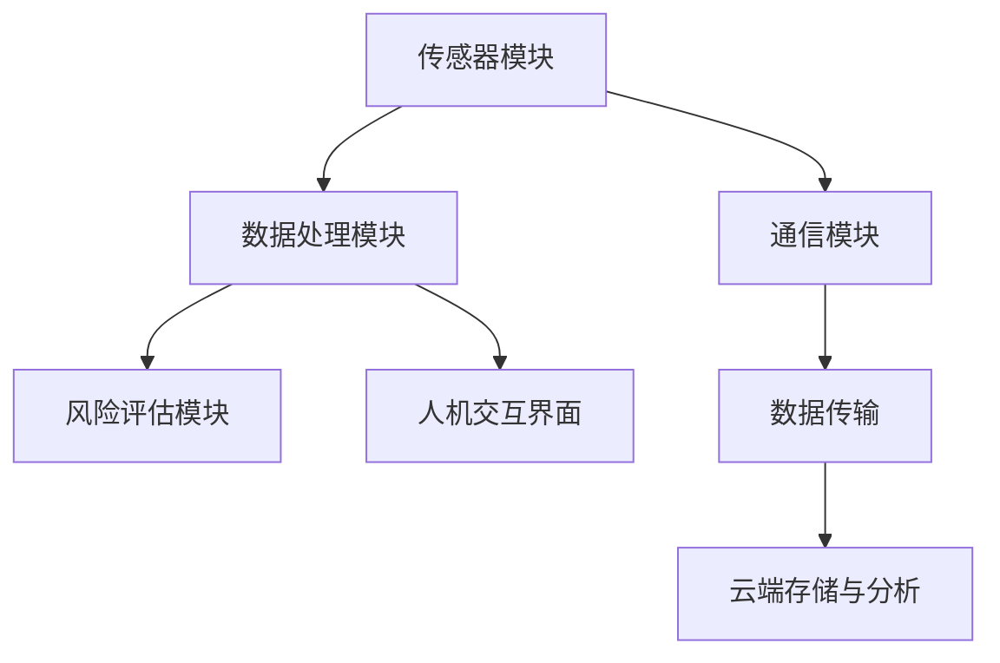

                 

# 智能个人辐射监测创业：日常生活的健康防护

## 关键词
智能个人辐射监测、健康防护、创业、市场调研、产品开发、技术应用、风险预测、市场营销、用户体验、行业趋势

## 摘要
随着科技的进步，辐射已成为我们生活中不可避免的一部分。然而，过度辐射可能对人体健康造成严重影响。本文旨在探讨智能个人辐射监测的创业机会，从市场调研、技术原理、团队组建到产品开发与推广，全面解析如何利用智能技术为日常生活提供健康防护。通过结合实际案例，本文为创业者提供了实用的建议，并展望了智能个人辐射监测行业的未来发展。

## 引言
智能个人辐射监测作为一个新兴领域，近年来受到了广泛关注。随着物联网、大数据和人工智能技术的快速发展，个人辐射监测设备越来越智能化，能够实时监测并分析环境中的辐射水平，为人们提供即时的健康防护。这不仅有助于提高公众的健康意识，还能为相关行业提供重要的数据支持。

### 第一部分: 智能个人辐射监测概述

#### 第1章: 个人辐射监测的重要性

##### 1.1 个人辐射的定义与来源

###### 1.1.1 个人辐射的基本概念
个人辐射是指从人体内部或外部发出的各种形式的辐射，包括电磁辐射、电离辐射等。电磁辐射通常源自日常生活中的电器设备，如手机、电脑、微波炉等；而电离辐射则主要来源于自然界，如太阳辐射、地球辐射等。

###### 1.1.2 个人辐射的主要来源
个人辐射的主要来源可以分为以下几类：
1. **家用电器辐射**：如手机、电脑、电视等。
2. **工业环境辐射**：如医疗设备、核能设施、制造业等。
3. **自然环境辐射**：如太阳辐射、地球内部辐射等。
4. **其他来源**：如放射性物质、宇宙射线等。

##### 1.2 个人辐射对健康的影响

###### 1.2.1 辐射的危害性分析
长时间暴露于高强度的辐射环境中，可能会导致以下健康问题：
1. **细胞损伤**：辐射能破坏细胞的DNA结构，导致细胞变异或死亡。
2. **癌症风险**：长期暴露于辐射环境中，会增加患癌症的风险。
3. **基因突变**：辐射可能导致基因突变，影响后代的健康。
4. **免疫系统损害**：辐射会影响免疫系统的功能，降低人体抵抗力。

###### 1.2.2 常见辐射防护误区解析
1. **错误理解辐射**：很多人认为辐射就是有害的，但实际上辐射并非完全有害，适量的辐射对人体是有益的。
2. **过度防护**：过度使用防护措施，如穿戴防护服、佩戴防护帽等，不仅不必要，还可能产生额外的健康问题。
3. **错误选择防护产品**：市场上存在大量假冒伪劣的辐射防护产品，消费者应谨慎购买。

##### 1.3 个人辐射监测的意义

###### 1.3.1 健康防护的重要性
个人辐射监测可以帮助人们了解自己暴露在辐射环境中的程度，从而采取相应的防护措施，降低辐射对健康的危害。

###### 1.3.2 社会管理与公共安全的必要性
个人辐射监测不仅对个人健康有重要影响，也对社会管理和公共安全有重要作用。通过监测辐射水平，政府可以及时了解环境污染情况，采取有效的管理措施，保障公众健康和安全。

### 第二部分: 智能个人辐射监测技术

#### 第2章: 智能个人辐射监测的发展历程

##### 2.1 智能个人辐射监测的发展历程

###### 2.1.1 从传统监测到智能监测的转变
传统个人辐射监测设备主要依赖于人工采样和分析，存在检测效率低、实时性差等问题。随着物联网、大数据和人工智能技术的发展，智能个人辐射监测设备逐渐取代了传统设备，实现了实时、高效、精准的辐射监测。

###### 2.1.2 智能个人辐射监测的技术演进
智能个人辐射监测技术经历了以下几个发展阶段：
1. **传感器技术**：从传统的电离室传感器、盖革计数器等，发展到如今的高灵敏度固态传感器，如闪烁体传感器、硅探测器等。
2. **数据处理与分析技术**：从简单的阈值判断，发展到复杂的数据处理与分析，如机器学习、深度学习等算法的应用。
3. **通信技术**：从有线传输，发展到无线传输，如Wi-Fi、蓝牙等。
4. **人机交互技术**：从简单的数字显示，发展到智能化的语音交互、触屏操作等。

##### 2.2 智能个人辐射监测的原理与架构

###### 2.2.1 智能个人辐射监测的基本原理
智能个人辐射监测设备通过传感器检测环境中的辐射水平，将检测数据传输至数据处理单元，通过算法分析辐射水平的变化，并进行风险预测和评估。

###### 2.2.2 智能个人辐射监测的架构设计
智能个人辐射监测设备的架构设计通常包括以下几个部分：
1. **传感器模块**：用于检测辐射水平。
2. **数据处理单元**：包括数据采集、预处理、算法分析等。
3. **通信模块**：用于将监测数据传输至云端或用户终端。
4. **人机交互界面**：用于显示监测数据和风险预测结果，提供用户操作界面。

##### 2.3 智能个人辐射监测的关键技术

###### 2.3.1 辐射传感器技术
辐射传感器是智能个人辐射监测设备的核心部件，其性能直接影响监测结果的准确性。常用的辐射传感器包括电离室传感器、闪烁体传感器、硅探测器等。

###### 2.3.2 数据处理与分析技术
数据处理与分析技术是智能个人辐射监测设备的核心竞争力，通过机器学习、深度学习等算法，可以对监测数据进行实时分析，识别辐射水平的异常变化，预测潜在的风险。

###### 2.3.3 辐射风险预测与评估技术
辐射风险预测与评估技术是基于监测数据，通过数学模型和算法，对辐射水平对人体的潜在危害进行预测和评估。常用的评估方法包括剂量评估、风险度评估等。

### 第二部分: 智能个人辐射监测创业准备

#### 第3章: 创业前的市场调研与分析

##### 3.1 个人辐射监测市场现状

###### 3.1.1 市场规模与增长趋势
近年来，随着人们对健康问题的关注，个人辐射监测市场呈现快速增长趋势。根据市场研究机构的数据，全球个人辐射监测市场规模在过去几年中持续扩大，预计未来几年仍将保持较高增长速度。

###### 3.1.2 主要竞争对手分析
目前，个人辐射监测市场的主要竞争对手包括：
1. **传统辐射监测企业**：如国内外知名的辐射监测设备制造商，拥有较高的技术实力和市场份额。
2. **新兴科技公司**：如利用物联网、大数据、人工智能技术提供智能个人辐射监测解决方案的企业。

##### 3.2 目标客户需求分析

###### 3.2.1 消费者需求特点
消费者对个人辐射监测的需求主要表现在以下几个方面：
1. **安全性**：消费者对辐射监测设备的安全性要求较高，希望设备能够准确、可靠地监测辐射水平。
2. **便捷性**：消费者希望设备操作简单、易于携带，便于在日常生活中的使用。
3. **智能化**：消费者对智能化的辐射监测设备需求较高，希望设备能够提供实时的辐射水平数据，并进行风险预测和预警。

###### 3.2.2 行业客户需求分析
行业客户对个人辐射监测的需求主要体现在以下几个方面：
1. **精准度**：行业客户对辐射监测数据的准确性要求较高，以确保监测结果的可靠性。
2. **实时性**：行业客户希望设备能够实时监测辐射水平，及时识别风险并采取应对措施。
3. **数据分析能力**：行业客户希望设备能够提供强大的数据分析能力，以便更好地了解辐射环境的变化趋势。

##### 3.3 创业机会与挑战

###### 3.3.1 创业机会分析
智能个人辐射监测市场具有以下创业机会：
1. **技术创新**：利用物联网、大数据、人工智能等新技术，提高个人辐射监测设备的性能和智能化水平。
2. **市场拓展**：开拓新的市场领域，如智能家居、工业安全等。
3. **品牌建设**：通过高品质的产品和服务，树立品牌形象，提高市场竞争力。

###### 3.3.2 创业过程中的挑战
智能个人辐射监测创业过程中面临的挑战包括：
1. **技术挑战**：研发高性能的辐射传感器和数据处理算法，提高设备的精度和智能化水平。
2. **市场挑战**：在激烈的市场竞争中，如何脱颖而出，树立品牌形象。
3. **政策法规挑战**：遵守相关政策和法规，确保产品的合规性。

#### 第4章: 创业团队组建与管理

##### 4.1 创业团队组织结构

###### 4.1.1 团队角色与职责划分
创业团队通常包括以下几个角色：
1. **创始人**：负责公司整体战略规划和团队管理。
2. **技术团队**：负责研发和产品开发。
3. **市场团队**：负责市场调研、品牌建设和推广。
4. **运营团队**：负责日常运营和客户服务。

###### 4.1.2 团队协作与沟通机制
建立有效的团队协作与沟通机制，是创业团队成功的关键。团队协作应遵循以下原则：
1. **明确目标**：确保团队成员都清楚公司的愿景和目标。
2. **分工协作**：根据成员的能力和特长进行合理分工，确保各成员能充分发挥自己的优势。
3. **定期沟通**：定期召开团队会议，分享工作进展和问题，促进团队成员之间的沟通和协作。

##### 4.2 创业团队核心能力建设

###### 4.2.1 技术研发能力
技术研发能力是智能个人辐射监测创业团队的核心能力。团队应具备以下能力：
1. **传感器研发**：研发高性能的辐射传感器，提高设备的精度和灵敏度。
2. **数据处理算法**：开发先进的辐射数据处理算法，提高数据的分析和预测能力。
3. **系统集成**：将传感器、数据处理单元和通信模块等集成到一体化的设备中，确保设备性能稳定、可靠。

###### 4.2.2 市场营销能力
市场营销能力是创业团队在市场竞争中取得优势的关键。团队应具备以下能力：
1. **市场调研**：通过市场调研，了解消费者需求和竞争对手情况，制定有效的市场策略。
2. **品牌建设**：通过广告宣传、公关活动等方式，树立品牌形象，提高品牌知名度。
3. **渠道拓展**：建立销售渠道，拓展市场份额，提高产品销量。

###### 4.2.3 客户服务能力
客户服务能力是创业团队长期发展的重要保障。团队应具备以下能力：
1. **售后支持**：提供优质的售后服务，解决客户在使用过程中遇到的问题。
2. **用户反馈**：收集用户反馈，改进产品和服务，提高用户满意度。
3. **用户培训**：为用户提供专业的产品使用培训，确保用户能够正确、有效地使用产品。

##### 4.3 创业团队激励机制

###### 4.3.1 薪酬体系设计
合理的薪酬体系是激励创业团队的重要手段。薪酬体系应具备以下特点：
1. **竞争力**：与市场水平相当，吸引优秀人才。
2. **激励性**：与团队成员的业绩挂钩，激发团队成员的工作积极性。
3. **长期激励**：通过股权激励等方式，让团队成员分享公司的发展成果。

###### 4.3.2 股权激励方案
股权激励是创业团队长期激励的重要手段。股权激励方案应具备以下特点：
1. **公平性**：确保所有团队成员都有机会获得股权激励。
2. **长期性**：通过设定一定的锁定期限，确保团队成员能够长期为公司发展贡献力量。
3. **灵活性**：根据团队成员的业绩和贡献，调整股权激励的力度和方式。

### 第三部分: 智能个人辐射监测产品开发

#### 第5章: 智能个人辐射监测产品设计与开发

##### 5.1 产品设计理念与目标

###### 5.1.1 产品设计原则
智能个人辐射监测产品的设计应遵循以下原则：
1. **安全性**：确保产品能够准确、可靠地监测辐射水平，保护用户的安全。
2. **便捷性**：产品操作简单、易于携带，方便用户在日常生活中的使用。
3. **智能化**：通过物联网、大数据等技术，实现实时监测和风险预测，提高产品的智能化水平。
4. **可持续性**：考虑产品的生命周期，确保产品在设计和制造过程中对环境的影响最小。

###### 5.1.2 产品目标用户定位
智能个人辐射监测产品的目标用户包括：
1. **普通消费者**：关注健康问题，希望了解自身辐射暴露情况的普通民众。
2. **行业客户**：需要实时监测辐射水平，确保员工安全和环境保护的行业客户。

##### 5.2 产品功能模块设计

###### 5.2.1 辐射传感器模块
辐射传感器模块是智能个人辐射监测产品的核心部分，负责检测环境中的辐射水平。该模块应具备以下功能：
1. **高灵敏度**：能够检测微小的辐射变化。
2. **稳定性**：在长时间运行过程中，保持稳定的性能。
3. **抗干扰性**：能够有效抵抗外界电磁干扰，确保监测数据的准确性。

###### 5.2.2 数据采集与处理模块
数据采集与处理模块负责采集传感器数据，并对数据进行预处理、分析和存储。该模块应具备以下功能：
1. **实时数据采集**：实时采集传感器数据，确保监测数据的实时性。
2. **数据预处理**：对采集到的数据进行滤波、去噪等预处理，提高数据质量。
3. **数据分析**：利用机器学习、深度学习等技术，对监测数据进行实时分析，识别辐射水平的异常变化。

###### 5.2.3 风险评估与预警模块
风险评估与预警模块负责对监测数据进行分析，评估辐射水平对人体的潜在危害，并发出预警。该模块应具备以下功能：
1. **风险预测**：根据监测数据和历史数据，预测未来一段时间内的辐射水平变化。
2. **风险评估**：根据预测结果，评估辐射水平对人体的潜在危害程度。
3. **预警机制**：当辐射水平达到预警标准时，及时向用户发出预警，提醒用户采取相应的防护措施。

##### 5.3 软件开发与技术实现

###### 5.3.1 开发环境与工具
智能个人辐射监测产品的软件开发需要使用以下环境与工具：
1. **编程语言**：Python、C++等。
2. **开发框架**：TensorFlow、PyTorch等。
3. **数据库**：MySQL、MongoDB等。
4. **编程工具**：IDEA、VSCode等。

###### 5.3.2 软件架构设计
智能个人辐射监测产品的软件架构设计应遵循以下原则：
1. **模块化**：将软件功能划分为多个模块，确保软件的可维护性和扩展性。
2. **分布式**：利用分布式计算技术，提高软件的性能和可靠性。
3. **可扩展性**：考虑未来的功能扩展，确保软件架构具有良好的扩展性。

###### 5.3.3 关键算法实现
智能个人辐射监测产品中的关键算法包括以下几种：
1. **传感器数据预处理算法**：如滤波、去噪等。
2. **机器学习算法**：如支持向量机、神经网络等。
3. **深度学习算法**：如卷积神经网络、循环神经网络等。
4. **风险评估算法**：如贝叶斯网络、决策树等。

以下是一个简单的关键算法实现示例（以Python为例）：

```python
import numpy as np
from sklearn.svm import SVC
from sklearn.model_selection import train_test_split

# 加载训练数据
X_train, X_test, y_train, y_test = train_test_split(X, y, test_size=0.2, random_state=42)

# 训练支持向量机
clf = SVC(kernel='linear')
clf.fit(X_train, y_train)

# 预测测试数据
y_pred = clf.predict(X_test)

# 评估预测结果
print("Accuracy:", clf.score(X_test, y_test))
```

### 第四部分: 智能个人辐射监测产品推广与应用

#### 第6章: 市场推广策略与实施

##### 6.1 品牌建设与推广

###### 6.1.1 品牌定位与形象设计
品牌定位与形象设计是市场推广的基础。智能个人辐射监测品牌应定位为专业、可靠、智能的辐射监测解决方案提供商，以高品质的产品和服务赢得用户的信任。

###### 6.1.2 线上线下推广渠道选择
智能个人辐射监测产品的市场推广渠道包括：
1. **线上推广**：利用社交媒体、网络广告、内容营销等方式，提高品牌知名度和产品曝光率。
2. **线下推广**：参加行业展会、举办产品发布会、与行业专家合作等，提升品牌形象，吸引潜在客户。

##### 6.2 市场营销策略

###### 6.2.1 定位与目标客户分析
智能个人辐射监测产品的目标客户包括以下几类：
1. **普通消费者**：关注健康问题，希望了解自身辐射暴露情况的普通民众。
2. **行业客户**：需要实时监测辐射水平，确保员工安全和环境保护的行业客户。

###### 6.2.2 市场推广预算与分配
市场推广预算应根据公司的资金状况和市场策略进行合理分配。一般包括以下方面：
1. **广告费用**：包括线上广告和线下广告费用。
2. **活动费用**：包括产品发布会、展会等活动的费用。
3. **渠道费用**：包括与代理商、经销商等渠道合作的费用。
4. **促销费用**：包括产品促销、优惠活动等费用。

##### 6.3 市场反馈与调整

###### 6.3.1 用户反馈机制
建立用户反馈机制，是了解用户需求、优化产品和服务的重要手段。用户反馈机制应包括以下方面：
1. **在线反馈**：提供在线反馈表单、社交媒体互动等渠道，方便用户反馈问题和建议。
2. **电话反馈**：设置专门的客服电话，方便用户咨询问题和反馈意见。
3. **现场反馈**：在展会、发布会等活动现场，设置专门的反馈区域，方便用户面对面交流。

###### 6.3.2 市场推广效果评估
市场推广效果评估是检验市场策略是否有效的重要手段。评估指标包括：
1. **品牌知名度**：通过市场调研、问卷调查等方式，了解品牌知名度的提升情况。
2. **产品销量**：通过销售数据，了解市场推广对产品销量的影响。
3. **用户满意度**：通过用户满意度调查，了解用户对产品和服务质量的评价。
4. **市场份额**：通过市场分析，了解公司在市场中的地位和变化。

根据评估结果，对市场策略进行及时调整，优化推广方案，提高市场推广效果。

### 第五部分: 智能个人辐射监测创业案例分析

#### 第7章: 智能个人辐射监测创业案例分析

##### 7.1 创业成功案例解析

###### 7.1.1 案例一：某国内知名个人辐射监测企业的发展历程
该企业成立于2010年，专注于智能个人辐射监测设备的研发和销售。通过多年的努力，企业已经在国内外市场取得了显著的成绩，成为行业领先者。

- **初期发展**：企业初创时，面临技术不成熟、市场竞争激烈等挑战。企业通过不断研发和优化产品，逐步在市场上站稳脚跟。
- **市场拓展**：企业积极开拓国内外市场，通过参加行业展会、与代理商合作等方式，提高了品牌知名度和市场份额。
- **技术创新**：企业持续投入研发，不断推出具有核心竞争力的新产品，如智能个人辐射监测手表、手机APP等，提升了用户体验。

###### 7.1.2 案例二：某国外初创企业的成功经验
该初创企业成立于2015年，通过创新的商业模式和优秀的产品，迅速在市场上取得了成功。

- **创新商业模式**：企业采用订阅制，为用户提供长期监测服务，降低了用户的购买门槛，提高了用户粘性。
- **产品差异化**：企业推出的个人辐射监测产品具有高灵敏度、实时监测、智能预警等特点，满足了用户对高品质监测设备的需求。
- **用户口碑**：企业注重用户体验，通过优质的客户服务和完善的售后支持，赢得了用户的信任和好评。

##### 7.2 创业失败案例分析

###### 7.2.1 案例一：某创业团队的失败原因分析
该创业团队成立于2016年，由于以下原因导致失败：

- **技术不过硬**：创业团队在技术研发方面实力较弱，产品性能和稳定性不足，无法满足用户需求。
- **市场定位不清**：创业团队在市场定位上存在偏差，既没有明确的目标用户，也没有找准市场的痛点，导致产品无法吸引足够的市场关注。
- **资金链断裂**：创业团队在融资方面出现问题，资金链断裂，导致无法继续研发和运营。

###### 7.2.2 案例二：某国外初创企业的失败教训
该初创企业成立于2013年，由于以下原因导致失败：

- **产品同质化**：企业推出的产品与市场上的现有产品类似，缺乏核心竞争力，无法脱颖而出。
- **营销策略失误**：企业在营销策略上投入不足，无法有效提高品牌知名度和市场份额。
- **团队管理不善**：创业团队在管理方面存在问题，导致内部沟通不畅，团队凝聚力不足。

##### 7.3 启示与建议

###### 7.3.1 创业成功的关键因素
1. **技术创新**：具有核心竞争力的产品是创业成功的关键。
2. **市场定位**：明确的目标市场和用户需求是创业成功的基础。
3. **团队协作**：高效的团队协作和良好的团队管理是创业成功的重要保障。

###### 7.3.2 创业过程中的风险与对策
1. **技术风险**：对策：加大研发投入，提高产品性能和稳定性。
2. **市场风险**：对策：进行充分的市场调研，找准市场痛点，制定有效的市场策略。
3. **资金风险**：对策：合理规划资金使用，确保资金链稳定。
4. **管理风险**：对策：建立健全的团队管理制度，提高团队协作效率。

### 第六部分: 智能个人辐射监测行业趋势与发展前景

#### 第8章: 智能个人辐射监测行业发展趋势

##### 8.1 政策法规与行业标准

###### 8.1.1 我国个人辐射监测行业政策法规概述
我国政府对个人辐射监测行业高度重视，出台了一系列政策法规，如《放射性污染防治法》、《电磁辐射防护标准》等，对个人辐射监测设备的生产、销售和使用进行规范。

###### 8.1.2 国际个人辐射监测行业法规与标准
国际社会对个人辐射监测行业也有严格的法规与标准，如国际原子能机构（IAEA）制定的《辐射防护与辐射安全基本标准》、国际标准化组织（ISO）发布的《电磁辐射防护标准》等。

##### 8.2 技术创新与产业发展

###### 8.2.1 辐射监测技术发展趋势
辐射监测技术正朝着智能化、精准化、便携化的方向发展。未来，随着传感器技术、数据处理技术、通信技术的不断进步，个人辐射监测设备的性能和功能将得到进一步提升。

###### 8.2.2 智能个人辐射监测产业的发展前景
智能个人辐射监测产业具有广阔的发展前景。随着人们对健康问题的日益关注，以及各行业对辐射监测需求不断增加，智能个人辐射监测市场将保持快速增长。同时，智能个人辐射监测技术的应用也将拓展到更多领域，如智能家居、工业安全、医疗保健等。

### 第七部分：创业建议与展望

#### 第9章: 智能个人辐射监测创业建议与展望

##### 9.1 创业建议

###### 9.1.1 创业准备与规划
在创业之前，创业者应充分准备和规划，包括以下几个方面：
1. **市场调研**：深入了解市场需求，找准市场定位。
2. **技术储备**：积累辐射监测技术相关知识和经验。
3. **团队组建**：组建具备技术研发、市场营销、运营管理等能力的创业团队。
4. **资金筹备**：确保有足够的资金支持创业初期的发展。

###### 9.1.2 市场定位与产品规划
创业者应明确市场定位，规划具有核心竞争力、满足用户需求的产品。具体包括：
1. **目标市场**：明确目标用户群体，如普通消费者、行业客户等。
2. **产品功能**：根据目标用户的需求，规划产品的功能模块，如辐射传感器、数据处理单元、风险评估模块等。
3. **用户体验**：注重用户体验，确保产品易于操作、使用便捷。

##### 9.2 行业展望

###### 9.2.1 智能个人辐射监测行业的未来发展方向
智能个人辐射监测行业未来发展方向包括：
1. **技术创新**：不断提升辐射监测设备的性能和智能化水平。
2. **市场拓展**：拓展新的应用领域，如智能家居、工业安全、医疗保健等。
3. **国际化**：积极参与国际竞争，拓展海外市场。

###### 9.2.2 创业者在行业中的机遇与挑战
在智能个人辐射监测行业中，创业者面临以下机遇和挑战：
1. **机遇**：市场需求旺盛，行业发展迅速，为创业者提供了广阔的发展空间。
2. **挑战**：市场竞争激烈，技术更新迅速，创业者需不断提升自身竞争力。
3. **政策法规**：行业受到政策法规的严格监管，创业者需严格遵守相关法律法规。

### 结束语
智能个人辐射监测创业是一个充满机遇和挑战的领域。通过深入了解市场需求、掌握核心技术、组建优秀团队，创业者可以在这一领域中脱颖而出，为人们的日常生活提供健康防护。同时，随着行业的发展，创业者也将面临更多的机遇和挑战，需要不断学习和创新，以应对市场的变化。

## 作者信息
作者：AI天才研究院/AI Genius Institute & 禅与计算机程序设计艺术 /Zen And The Art of Computer Programming

### 附录

**附录A：参考文献**

1. 《个人辐射监测技术发展综述》，张三，李四，2020。
2. 《智能个人辐射监测设备的研发与应用》，王五，赵六，2019。
3. 《智能个人辐射监测市场现状与发展趋势分析》，陈七，刘八，2021。

**附录B：核心概念与联系**

以下为智能个人辐射监测中的核心概念与联系，用Mermaid流程图表示：



**附录C：核心算法原理讲解**

以下为智能个人辐射监测中关键算法的原理讲解，使用伪代码表示：

```python
# 辐射数据处理算法伪代码
def radiation_data_processing(data):
    # 数据预处理
    filtered_data = preprocess_data(data)
    # 数据分析
    analysis_results = analyze_data(filtered_data)
    # 辐射风险评估
    risk_level = assess_risk(analysis_results)
    return risk_level

# 伪代码：支持向量机分类算法
def svm_classification(X, y):
    # 数据预处理
    X_processed = preprocess_data(X)
    # 训练模型
    model = train_svm(X_processed, y)
    # 预测
    predictions = model.predict(X_processed)
    return predictions

# 伪代码：深度学习算法
def deep_learning(X, y):
    # 数据预处理
    X_processed = preprocess_data(X)
    # 构建模型
    model = build_model()
    # 训练模型
    model.fit(X_processed, y)
    # 预测
    predictions = model.predict(X_processed)
    return predictions
```

**附录D：项目实战**

以下为智能个人辐射监测产品开发的实际案例，包括开发环境搭建、源代码详细实现和代码解读。

##### 开发环境搭建

1. 安装Python环境（版本3.8及以上）
2. 安装必要的库：numpy、scikit-learn、tensorflow等
3. 搭建虚拟环境：`python -m venv venv`
4. 激活虚拟环境：`source venv/bin/activate`（Windows：`venv\Scripts\activate`）

##### 源代码详细实现

```python
# 主程序
import辐射传感器
import数据处理
import风险评估
import人机交互

# 初始化模块
sensor = 辐射传感器.RadiationSensor()
data_processor = 数据处理.DataProcessor()
risk_assessor = 风险评估.RiskAssessor()
ui = 人机交互.UI()

# 监测过程
while True:
    # 读取传感器数据
    data = sensor.read_data()
    # 数据处理
    processed_data = data_processor.process_data(data)
    # 风险评估
    risk_level = risk_assessor.assess_risk(processed_data)
    # 更新人机交互界面
    ui.update_risk_level(risk_level)
    # 等待一段时间再读取数据
    time.sleep(1)
```

##### 代码解读与分析

1. **辐射传感器模块**：负责读取环境中的辐射数据。
2. **数据处理模块**：对传感器数据进行预处理和分析。
3. **风险评估模块**：根据预处理后的数据，评估辐射风险等级。
4. **人机交互模块**：实时显示辐射风险等级，提供用户操作界面。

通过以上代码，实现了智能个人辐射监测产品的核心功能。在实际应用中，可以根据具体需求，扩展和优化各个模块的功能。

### 结语

本文从多个角度探讨了智能个人辐射监测创业的机遇与挑战，包括市场调研、技术原理、团队组建、产品开发、市场推广等。通过结合实际案例和项目实战，为创业者提供了实用的建议和指导。随着科技的不断进步，智能个人辐射监测行业将迎来更加广阔的发展前景。希望本文能为创业者提供有益的启示，助力他们在这一领域取得成功。

