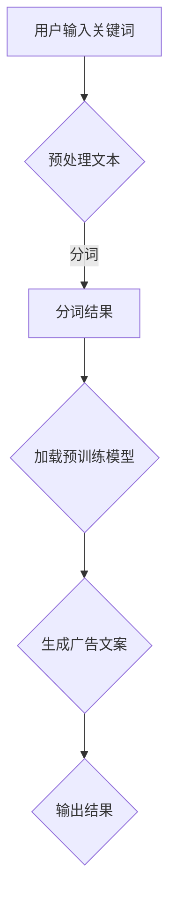

                 

### 智能广告文案生成：LLM在营销创意中的角色

> **关键词**：智能广告文案、自然语言处理、LLMBERT、营销创意、广告投放、个性化推荐

> **摘要**：本文将深入探讨智能广告文案生成的技术背景、核心概念、算法原理以及在实际项目中的应用。特别关注了大型语言模型（LLMBERT）在广告文案生成中的角色，并提供了具体的实施案例和解决方案。通过本文，读者将了解如何利用AI技术提升广告营销的效率与效果。

---

随着互联网技术的飞速发展，广告营销已经成为企业竞争的重要手段。然而，广告文案的创作过程往往既耗时又耗费人力资源。传统的广告文案创作依赖于广告团队的创意能力和写作技巧，这不仅限制了广告创意的多样性，还影响了广告投放的效率。为了解决这一问题，智能广告文案生成技术应运而生。

智能广告文案生成是一种利用自然语言处理（NLP）和人工智能技术自动生成广告文案的过程。通过这种技术，企业可以在短时间内生成大量高质量的广告文案，实现广告投放的自动化和个性化。本文将重点关注大型语言模型（LLMBERT）在广告文案生成中的角色，探讨其技术原理和实际应用。

## 第一部分：引言

### 1.1.1 什么是智能广告文案生成

智能广告文案生成，顾名思义，是指通过应用人工智能技术，尤其是自然语言处理技术，自动生成广告文案。这一过程通常包括以下几个步骤：

1. **数据收集**：收集用户行为数据，如搜索历史、浏览记录、购买偏好等。
2. **文本预处理**：对收集的数据进行清洗、分词、词性标注等预处理。
3. **模型训练**：使用预训练的深度学习模型对预处理后的数据集进行训练。
4. **广告文案生成**：根据用户特征和广告需求，利用训练好的模型生成广告文案。

智能广告文案生成的核心目标是提高广告文案的个性化和精准度，从而提高广告投放的效果。通过自动化生成广告文案，企业可以在短时间内创建大量文案，快速响应市场变化，提高广告投放的效率。

### 1.1.2 智能广告文案生成的重要性

智能广告文案生成技术在现代营销中具有以下几个重要意义：

1. **效率提升**：自动化生成广告文案可以显著提高广告发布和营销活动的效率。传统的广告文案创作往往需要广告团队花费大量时间进行构思、撰写和修改，而智能广告文案生成技术可以在短时间内生成大量文案，大大缩短了广告投放的周期。

2. **精准投放**：智能广告文案生成可以根据用户行为和偏好进行个性化调整，提高广告投放的精准度。通过分析用户数据，系统可以生成与用户兴趣高度相关的广告文案，从而提高广告点击率和转化率。

3. **创意多样性**：智能广告文案生成技术能够自动生成多种不同风格的广告文案，为企业提供了丰富的创意选择。这不仅增加了广告的多样性，还能够更好地满足不同用户群体的需求。

### 1.1.3 LLMBERT模型在广告文案生成中的作用

大型语言模型（LLMBERT）是一种结合了BERT模型和自注意力机制的预训练语言模型。它具有以下几个特点，使其在广告文案生成中具有独特的优势：

1. **强大的语义理解能力**：BERT模型通过对大量文本数据进行预训练，能够捕捉到语言中的上下文关系，从而具备强大的语义理解能力。这种能力使得LLMBERT在生成广告文案时，能够准确理解用户需求，生成符合语境的文案。

2. **灵活的生成能力**：自注意力机制允许模型在生成文本时，动态地关注不同位置的文本信息，从而实现更灵活的文本生成。这意味着LLMBERT可以生成具有多样性和创造力的广告文案，满足企业个性化的广告需求。

3. **高效的训练和推理速度**：LLMBERT模型通过预训练的方式，可以快速适应不同领域的文本数据。在广告文案生成任务中，预训练模型可以大幅减少训练时间，提高推理速度，从而实现快速生成广告文案。

综上所述，LLMBERT模型在广告文案生成中具有强大的语义理解能力、灵活的生成能力和高效的训练推理速度，是企业实现智能广告文案生成的理想选择。

## 第二部分：核心概念与联系

### 2.1.1 自然语言处理（NLP）基础

自然语言处理（NLP）是人工智能的一个重要分支，主要研究如何让计算机理解和生成人类语言。在广告文案生成中，NLP技术起着至关重要的作用。以下是NLP的一些基础概念：

1. **文本预处理**：文本预处理是NLP中的第一步，主要目的是将原始文本转换为计算机可以处理的形式。文本预处理通常包括以下几个步骤：
   - **文本清洗**：去除文本中的噪声，如HTML标签、特殊字符等。
   - **分词**：将连续的文本分割成词语或短语。
   - **词性标注**：为每个词分配相应的词性，如名词、动词、形容词等。
   - **词嵌入**：将词语转换为向量的形式，以便在模型中进行处理。

2. **语言模型**：语言模型是一种预测模型，用于预测文本序列中下一个词的概率。在广告文案生成中，语言模型可以帮助生成符合语法和语义规范的广告文案。常见的语言模型包括n-gram模型、循环神经网络（RNN）和变换器（Transformer）模型。

3. **序列模型**：序列模型是一种专门用于处理序列数据的模型，如RNN、长短期记忆网络（LSTM）和门控循环单元（GRU）。这些模型可以捕捉序列数据中的时序关系，对广告文案生成任务非常有效。

### 2.1.2 自注意力机制（Self-Attention）

自注意力机制（Self-Attention）是Transformer模型的核心组成部分，它允许模型在生成文本时，动态地关注不同位置的文本信息。自注意力机制的工作原理如下：

1. **输入层**：将输入的文本序列转换为一个向量序列，每个向量表示文本中的一个词或短语。

2. **查询层（Query）**、**键层（Key）**和**值层（Value）**：对于每个词或短语，生成相应的查询向量、键向量和值向量。

3. **注意力计算**：通过计算查询向量与键向量的点积，得到每个词或短语的注意力权重。注意力权重表示该词或短语对生成当前词或短语的重要性。

4. **加权求和**：将每个词或短语的值向量按照注意力权重进行加权求和，得到生成当前词或短语的上下文信息。

5. **输出层**：通过输出层对加权求和的结果进行进一步处理，得到生成的词或短语。

自注意力机制能够捕捉文本序列中的长距离依赖关系，使得模型在生成文本时，能够更好地理解上下文信息，提高文本生成的质量。

### 2.1.3 语言生成模型（Language Generation Model）

语言生成模型是一种能够生成文本序列的模型，广泛应用于机器翻译、文本摘要、对话系统等领域。语言生成模型可以分为以下几类：

1. **基于规则**：这类模型通过定义一系列规则来生成文本，如模板匹配、语法规则等。基于规则的方法通常简单且易于实现，但生成的文本缺乏灵活性和创造性。

2. **基于统计**：这类模型通过统计文本数据中的频率和概率关系来生成文本，如n-gram模型、隐马尔可夫模型（HMM）等。基于统计的方法可以生成较为自然的文本，但在复杂语言场景下表现较差。

3. **基于神经网络的生成模型**：这类模型通过神经网络的结构来生成文本，如循环神经网络（RNN）、长短期记忆网络（LSTM）、门控循环单元（GRU）和变换器（Transformer）等。基于神经网络的方法具有强大的表示能力和灵活性，能够生成高质量的自然语言文本。

在广告文案生成中，基于神经网络的生成模型通常表现优异。特别是LLMBERT模型，它结合了BERT模型和自注意力机制，能够更好地理解和生成广告文案的语义。

### 2.1.4 LLMBERT模型架构

LLMBERT模型是BERT模型的一种扩展，结合了自注意力机制，使其在广告文案生成中具有更强的语义理解能力和生成能力。LLMBERT模型的架构可以分为以下几个部分：

1. **BERT模型**：BERT模型是一种基于Transformer的预训练语言模型，通过预训练大量文本数据，使其能够理解复杂的语言结构。BERT模型的主要组成部分包括：
   - **嵌入层**：将词汇转换为向量表示。
   - **Transformer层**：使用自注意力机制对输入序列进行编码。
   - **输出层**：将编码后的序列映射到输出结果。

2. **自注意力机制**：自注意力机制是Transformer模型的核心组成部分，通过计算序列中每个元素对其他元素的影响，实现信息的有效整合。在LLMBERT模型中，自注意力机制进一步增强了BERT模型对文本序列的理解能力。

3. **预训练和微调**：LLMBERT模型首先在大规模文本数据集上进行预训练，学习语言的一般规律。然后，在特定领域的文本数据集上进行微调，以适应广告文案生成的任务。预训练和微调的结合，使得LLMBERT模型在广告文案生成中具有更好的性能。

### 2.1.5 NLP在广告文案生成中的应用

自然语言处理技术不仅用于广告文案的生成，还广泛应用于广告投放、效果分析等多个环节。以下是NLP在广告文案生成中的一些具体应用：

1. **广告投放优化**：通过NLP技术分析用户数据，如搜索关键词、浏览历史等，帮助企业制定更精准的广告投放策略。例如，可以使用NLP技术提取用户兴趣关键词，将广告精准推送给有潜在需求的用户。

2. **广告效果分析**：通过NLP技术分析广告文案的点击率、转化率等数据，评估广告效果，为企业提供优化建议。例如，可以使用文本相似性算法，比较不同广告文案之间的相似度，找出效果更好的文案。

3. **情感分析**：通过NLP技术分析用户对广告文案的情感倾向，帮助企业了解用户对广告的反应。例如，可以使用情感分析算法，判断广告文案中是否包含正面、负面或中性的情感，从而调整广告策略。

4. **内容推荐**：通过NLP技术分析用户行为数据，为企业提供个性化内容推荐。例如，可以使用文本分类算法，将用户感兴趣的内容进行分类，然后推荐相关广告文案。

综上所述，自然语言处理技术在广告文案生成中具有广泛的应用。通过应用NLP技术，企业可以更好地理解用户需求，提高广告投放的精准度和效果，实现更高效的营销。

### 2.1.6 自注意力机制在广告文案生成中的作用

自注意力机制在广告文案生成中发挥着关键作用。它通过计算文本序列中每个元素对其他元素的影响，实现了信息的有效整合。具体来说，自注意力机制在广告文案生成中的作用包括：

1. **提高文本理解能力**：自注意力机制能够捕捉到文本序列中的长距离依赖关系，使得模型能够更好地理解广告文案的语义。这对于生成符合用户需求和场景的广告文案至关重要。

2. **增强文本生成能力**：自注意力机制允许模型在生成文本时，动态地关注不同位置的文本信息，从而提高文本生成的灵活性和创造力。这意味着生成的广告文案不仅更加符合用户需求，还能够呈现出更高的创意水平。

3. **优化广告效果**：通过自注意力机制，模型可以更好地捕捉广告文案中的关键信息，从而提高广告的点击率和转化率。例如，在广告文案的标题中，自注意力机制可以帮助模型识别出最重要的关键词，提高标题的吸引力。

### 2.1.7 语言生成模型在广告文案生成中的应用

语言生成模型在广告文案生成中具有广泛的应用。通过语言生成模型，企业可以自动化地生成大量高质量的广告文案，提高广告投放的效率和质量。以下是语言生成模型在广告文案生成中的应用：

1. **广告文案生成**：语言生成模型可以直接生成广告文案的文本部分，包括标题、描述、呼吁行动等。通过预训练和微调，模型可以生成与用户需求高度相关的广告文案，提高广告的吸引力。

2. **多语言广告文案生成**：语言生成模型支持多语言文本生成，使得企业可以在全球范围内进行广告投放。通过训练和微调多语言模型，企业可以生成多种语言的广告文案，扩大市场影响力。

3. **内容推荐**：语言生成模型可以用于内容推荐，根据用户兴趣和行为，生成个性化推荐内容。例如，在电商平台中，语言生成模型可以根据用户浏览和购买历史，生成个性化的商品推荐文案。

4. **对话生成**：语言生成模型可以应用于聊天机器人、智能客服等领域，生成自然流畅的对话文本。通过训练和微调对话生成模型，企业可以提供更智能、更个性化的客户服务。

综上所述，语言生成模型在广告文案生成中具有广泛的应用前景。通过应用语言生成模型，企业可以自动化地生成高质量的广告文案，提高广告投放的效果和用户体验。

### 2.1.8 LLMBERT模型的工作原理

LLMBERT模型是一种结合了BERT模型和自注意力机制的预训练语言模型，它在广告文案生成中具有强大的语义理解能力和生成能力。以下是LLMBERT模型的工作原理：

1. **BERT模型的预训练**：BERT模型首先在大规模文本数据集上进行预训练，学习语言的一般规律和结构。预训练包括两个任务：掩码语言建模（MLM）和下一个句子预测（NSP）。

2. **掩码语言建模（MLM）**：在预训练过程中，一部分输入文本的词被掩码（即替换为[Mask]），模型需要预测这些掩码词的词向量。通过这种方式，BERT模型学习到语言中的上下文关系和词的嵌入表示。

3. **下一个句子预测（NSP）**：在预训练过程中，模型需要预测两个句子是否属于同一篇章。这有助于模型理解篇章结构和语义关系。

4. **自注意力机制**：在Transformer层，BERT模型通过自注意力机制对输入序列进行编码。自注意力机制允许模型在生成文本时，动态地关注不同位置的文本信息，从而实现信息的有效整合。

5. **微调**：在特定领域的文本数据集上进行微调，以适应广告文案生成的任务。微调过程可以调整模型参数，使其更好地理解和生成广告文案。

6. **广告文案生成**：在广告文案生成任务中，LLMBERT模型根据用户特征和广告需求，生成高质量的广告文案。通过自注意力机制，模型能够捕捉到广告文案中的关键信息，从而提高文案的质量和吸引力。

### 2.1.9 LLMBERT模型在广告文案生成中的优势

LLMBERT模型在广告文案生成中具有以下几个优势：

1. **强大的语义理解能力**：LLMBERT模型通过预训练和自注意力机制，能够捕捉到广告文案中的语义信息，从而生成符合用户需求的文案。

2. **灵活的生成能力**：自注意力机制使得LLMBERT模型在生成文本时，能够动态地关注不同位置的文本信息，从而生成具有多样性和创造力的广告文案。

3. **高效的训练和推理速度**：LLMBERT模型通过预训练的方式，可以快速适应不同领域的文本数据，提高训练和推理速度。

4. **多语言支持**：LLMBERT模型支持多语言文本生成，使得企业可以在全球范围内进行广告投放。

5. **可扩展性**：LLMBERT模型可以应用于多种广告文案生成任务，如标题生成、描述生成等，具有很好的可扩展性。

### 2.1.10 NLP在广告投放效果分析中的应用

NLP技术在广告投放效果分析中发挥着重要作用。通过NLP技术，企业可以深入分析广告效果，为优化广告策略提供有力支持。以下是NLP在广告投放效果分析中的应用：

1. **广告点击率分析**：通过NLP技术，可以分析广告文案中的关键词、语义和情感，评估广告文案的吸引力。例如，使用文本分类算法，将广告文案分为高吸引力和低吸引力两类，从而优化广告文案。

2. **转化率分析**：通过NLP技术，可以分析用户对广告文案的反应，评估广告文案的转化效果。例如，使用情感分析算法，判断广告文案中是否包含正面、负面或中性的情感，从而优化广告文案。

3. **竞争分析**：通过NLP技术，可以分析竞争对手的广告文案，了解其优势和劣势。例如，使用文本相似性算法，比较不同广告文案之间的相似度，找出效果更好的文案。

4. **用户反馈分析**：通过NLP技术，可以分析用户对广告文案的反馈，了解用户的真实需求和意见。例如，使用文本情感分析算法，分析用户评论和反馈中的情感倾向，为广告策略调整提供依据。

5. **广告效果预测**：通过NLP技术，可以建立广告效果预测模型，预测不同广告文案的点击率、转化率等指标。例如，使用机器学习算法，训练广告效果预测模型，为广告投放提供科学依据。

### 2.1.11 自注意力机制在广告投放效果分析中的作用

自注意力机制在广告投放效果分析中发挥着关键作用。它通过计算文本序列中每个元素对其他元素的影响，实现了信息的有效整合。具体来说，自注意力机制在广告投放效果分析中的作用包括：

1. **关键词提取**：通过自注意力机制，可以提取广告文案中的关键信息，如关键词和短语。这些关键信息对于分析广告文案的吸引力和转化效果至关重要。

2. **语义分析**：自注意力机制能够捕捉广告文案中的语义信息，如情感、态度等。通过语义分析，可以评估广告文案的吸引力和用户反应。

3. **文本分类**：通过自注意力机制，可以将广告文案分为不同的类别，如高吸引力、低吸引力等。这有助于分析广告文案的吸引力和优化广告策略。

4. **情感分析**：自注意力机制可以提取广告文案中的情感信息，如正面、负面或中性情感。通过情感分析，可以评估用户对广告文案的情感反应，从而优化广告文案。

5. **文本生成**：自注意力机制可以帮助生成具有多样性和创造力的广告文案，提高广告的吸引力和转化效果。

### 2.1.12 语言生成模型在广告投放效果分析中的应用

语言生成模型在广告投放效果分析中具有广泛的应用。通过语言生成模型，企业可以自动化地生成大量广告文案，并分析其效果。以下是语言生成模型在广告投放效果分析中的应用：

1. **广告文案生成**：语言生成模型可以直接生成广告文案的文本部分，包括标题、描述、呼吁行动等。通过预训练和微调，模型可以生成与用户需求高度相关的广告文案，提高广告的吸引力。

2. **多语言广告文案生成**：语言生成模型支持多语言文本生成，使得企业可以在全球范围内进行广告投放。通过训练和微调多语言模型，企业可以生成多种语言的广告文案，扩大市场影响力。

3. **内容推荐**：语言生成模型可以用于内容推荐，根据用户兴趣和行为，生成个性化推荐内容。例如，在电商平台中，语言生成模型可以根据用户浏览和购买历史，生成个性化的商品推荐文案。

4. **对话生成**：语言生成模型可以应用于聊天机器人、智能客服等领域，生成自然流畅的对话文本。通过训练和微调对话生成模型，企业可以提供更智能、更个性化的客户服务。

5. **广告效果分析**：语言生成模型可以用于分析广告文案的效果，如点击率、转化率等。通过生成大量广告文案并进行效果分析，企业可以找到最优的广告文案策略，提高广告投放效果。

### 2.1.13 LLMBERT模型在广告投放效果分析中的优势

LLMBERT模型在广告投放效果分析中具有以下几个优势：

1. **强大的语义理解能力**：LLMBERT模型通过预训练和自注意力机制，能够捕捉到广告文案中的语义信息，从而生成符合用户需求的文案。

2. **灵活的生成能力**：自注意力机制使得LLMBERT模型在生成文本时，能够动态地关注不同位置的文本信息，从而生成具有多样性和创造力的广告文案。

3. **高效的训练和推理速度**：LLMBERT模型通过预训练的方式，可以快速适应不同领域的文本数据，提高训练和推理速度。

4. **多语言支持**：LLMBERT模型支持多语言文本生成，使得企业可以在全球范围内进行广告投放。

5. **可扩展性**：LLMBERT模型可以应用于多种广告投放效果分析任务，如广告文案生成、效果预测等，具有很好的可扩展性。

### 2.1.14 NLP在广告营销创意中的应用

NLP技术在广告营销创意中发挥着重要作用。通过NLP技术，企业可以自动化地生成广告文案，提高创意的多样性和创造性。以下是NLP在广告营销创意中的应用：

1. **广告文案生成**：NLP技术可以直接生成广告文案的文本部分，包括标题、描述、呼吁行动等。通过预训练和微调，模型可以生成与用户需求高度相关的广告文案，提高广告的吸引力。

2. **创意推荐**：NLP技术可以分析用户兴趣和行为，为用户推荐个性化的广告创意。例如，在电商平台中，NLP技术可以根据用户浏览和购买历史，推荐相关商品的广告创意。

3. **创意优化**：NLP技术可以分析广告文案的语义和情感，评估创意的吸引力和转化效果。通过优化广告文案，企业可以提高广告营销的效率和效果。

4. **多语言创意生成**：NLP技术支持多语言文本生成，使得企业可以在全球范围内进行广告营销。通过训练和微调多语言模型，企业可以生成多种语言的广告创意，扩大市场影响力。

5. **情感分析**：NLP技术可以分析用户对广告文案的情感反应，了解用户对广告创意的接受程度。通过情感分析，企业可以优化广告创意，提高用户满意度。

### 2.1.15 自注意力机制在广告营销创意中的应用

自注意力机制在广告营销创意中发挥着重要作用。它通过计算文本序列中每个元素对其他元素的影响，实现了信息的有效整合。具体来说，自注意力机制在广告营销创意中的应用包括：

1. **标题生成**：通过自注意力机制，可以提取广告文案中的关键信息，生成具有吸引力的标题。

2. **描述生成**：自注意力机制可以帮助生成创意性的广告描述，提高广告文案的吸引力和转化效果。

3. **情感分析**：通过自注意力机制，可以分析广告文案中的情感倾向，评估广告创意的用户接受程度。

4. **多语言创意生成**：自注意力机制支持多语言文本生成，使得企业可以在全球范围内进行广告营销。

5. **创意优化**：自注意力机制可以帮助优化广告文案的语义和结构，提高广告创意的质量和效果。

### 2.1.16 语言生成模型在广告营销创意中的应用

语言生成模型在广告营销创意中具有广泛的应用。通过语言生成模型，企业可以自动化地生成广告文案，提高创意的多样性和创造性。以下是语言生成模型在广告营销创意中的应用：

1. **广告文案生成**：语言生成模型可以直接生成广告文案的文本部分，包括标题、描述、呼吁行动等。通过预训练和微调，模型可以生成与用户需求高度相关的广告文案，提高广告的吸引力。

2. **多语言广告文案生成**：语言生成模型支持多语言文本生成，使得企业可以在全球范围内进行广告投放。通过训练和微调多语言模型，企业可以生成多种语言的广告文案，扩大市场影响力。

3. **创意推荐**：语言生成模型可以分析用户兴趣和行为，为用户推荐个性化的广告创意。例如，在电商平台中，语言生成模型可以根据用户浏览和购买历史，推荐相关商品的广告创意。

4. **创意优化**：语言生成模型可以分析广告文案的语义和情感，评估创意的吸引力和转化效果。通过优化广告文案，企业可以提高广告营销的效率和效果。

5. **对话生成**：语言生成模型可以应用于聊天机器人、智能客服等领域，生成自然流畅的对话文本。通过训练和微调对话生成模型，企业可以提供更智能、更个性化的客户服务。

### 2.1.17 LLMBERT模型在广告营销创意中的应用

LLMBERT模型在广告营销创意中具有强大的语义理解能力和生成能力。通过LLMBERT模型，企业可以自动化地生成高质量的广告文案，提高营销效果。以下是LLMBERT模型在广告营销创意中的应用：

1. **广告文案生成**：LLMBERT模型可以直接生成广告文案的文本部分，包括标题、描述、呼吁行动等。通过预训练和微调，模型可以生成与用户需求高度相关的广告文案，提高广告的吸引力。

2. **多语言广告文案生成**：LLMBERT模型支持多语言文本生成，使得企业可以在全球范围内进行广告投放。通过训练和微调多语言模型，企业可以生成多种语言的广告文案，扩大市场影响力。

3. **创意推荐**：LLMBERT模型可以分析用户兴趣和行为，为用户推荐个性化的广告创意。例如，在电商平台中，LLMBERT模型可以根据用户浏览和购买历史，推荐相关商品的广告创意。

4. **创意优化**：LLMBERT模型可以分析广告文案的语义和情感，评估创意的吸引力和转化效果。通过优化广告文案，企业可以提高广告营销的效率和效果。

5. **情感分析**：LLMBERT模型可以分析用户对广告文案的情感反应，了解用户对广告创意的接受程度。通过情感分析，企业可以优化广告创意，提高用户满意度。

## 第三部分：核心算法原理讲解

### 3.1.1 广告文案生成算法概述

广告文案生成算法是智能广告文案生成系统的核心组成部分，负责将输入的用户特征和广告需求转化为高质量的广告文案。广告文案生成算法通常包括以下几个步骤：

1. **输入处理**：接收用户特征、广告需求和其他相关输入信息。
2. **文本预处理**：对输入的文本进行清洗、分词、词性标注等预处理操作，以便模型能够更好地理解和处理文本数据。
3. **模型选择**：选择合适的生成模型，如LLMBERT、GPT等，这些模型已经经过预训练，可以生成高质量的文本。
4. **文本生成**：利用选择的模型生成广告文案，通过训练和优化，模型能够生成与用户需求高度相关的广告文案。
5. **结果输出**：将生成的广告文案输出，供广告投放系统使用。

### 3.1.2 广告文案生成算法框架

广告文案生成算法的框架主要包括以下几个方面：

1. **输入层**：接收用户输入，包括用户特征（如年龄、性别、兴趣等）和广告需求（如产品信息、促销活动等）。
2. **预处理层**：对输入文本进行清洗、分词、词性标注等预处理操作，以便后续模型处理。
3. **编码层**：将预处理后的文本输入到编码器（Encoder）中，如BERT、LLMBERT等，这些编码器可以捕捉文本的语义信息。
4. **解码层**：将编码后的文本输入到解码器（Decoder）中，如Transformer、GPT等，这些解码器可以生成新的文本序列。
5. **优化层**：通过训练和优化，调整模型参数，使其能够生成更高质量的广告文案。
6. **输出层**：将生成的广告文案输出，供广告投放系统使用。

### 3.1.3 广告文案生成算法的实现

广告文案生成算法的具体实现可以分为以下几个步骤：

1. **环境搭建**：配置深度学习环境，如安装TensorFlow、PyTorch等深度学习框架。
2. **数据准备**：收集和准备广告文案数据集，包括用户特征、广告需求等。
3. **模型选择**：选择合适的生成模型，如LLMBERT、GPT等。
4. **模型训练**：使用训练数据集训练模型，调整模型参数，使其能够生成高质量的广告文案。
5. **模型评估**：使用测试数据集评估模型性能，调整模型参数，提高广告文案生成质量。
6. **模型部署**：将训练好的模型部署到生产环境，实现广告文案的自动化生成。

以下是广告文案生成算法的实现示例：

```python
# 导入必要的库
import torch
import torch.nn as nn
from transformers import LLMModel

# 模型配置
model = LLMModel.from_pretrained("your_pretrained_model")

# 输入处理
user_input = preprocess_input(input_data)

# 模型训练
optimizer = torch.optim.Adam(model.parameters(), lr=0.001)
for epoch in range(num_epochs):
    for inputs in data_loader:
        model.zero_grad()
        outputs = model(inputs)
        loss = calculate_loss(outputs, targets)
        loss.backward()
        optimizer.step()

# 模型评估
evaluate_model(model, test_data)

# 模型部署
deploy_model(model, production_environment)
```

### 3.1.4 广告文案生成算法的优势

广告文案生成算法具有以下几个优势：

1. **高效性**：广告文案生成算法可以实现广告文案的自动化生成，提高广告投放的效率。
2. **个性化**：通过分析用户特征和广告需求，广告文案生成算法可以生成个性化的广告文案，提高广告的吸引力。
3. **多样性**：广告文案生成算法可以生成多种不同风格的广告文案，满足不同用户群体的需求。
4. **可扩展性**：广告文案生成算法可以应用于多种广告投放场景，具有很好的可扩展性。
5. **成本效益**：广告文案生成算法可以节省广告创作成本，提高广告投放效果，为企业带来更高的投资回报率。

### 3.1.5 广告文案生成算法的挑战

尽管广告文案生成算法具有许多优势，但在实际应用中仍面临以下挑战：

1. **数据质量**：广告文案生成算法依赖于高质量的数据集，数据质量直接影响算法的性能。因此，如何收集和清洗高质量的数据是算法面临的重要挑战。
2. **模型解释性**：广告文案生成算法通常基于复杂的深度学习模型，其内部决策过程往往缺乏解释性。如何提高算法的可解释性，使其更容易被用户理解和接受，是算法需要解决的问题。
3. **文本生成质量**：广告文案生成算法需要生成高质量的文本，确保文案的吸引力和转化效果。然而，复杂的语义理解和生成任务使得算法在文本生成质量上仍面临挑战。
4. **计算资源**：广告文案生成算法需要大量的计算资源进行训练和推理，如何高效利用计算资源，降低算法的运行成本，是算法面临的重要问题。
5. **伦理和法律问题**：广告文案生成算法在应用过程中可能涉及用户的隐私和权益，如何确保算法的伦理和合规性，是算法需要关注的重要问题。

### 3.1.6 广告文案生成算法的未来发展

随着人工智能技术的不断进步，广告文案生成算法在未来有望实现以下发展趋势：

1. **模型优化**：通过改进深度学习模型的结构和算法，提高广告文案生成算法的性能和效率。
2. **多模态融合**：将文本、图像、音频等多模态信息融合到广告文案生成中，实现更加丰富和多样化的广告创意。
3. **个性化推荐**：结合用户行为和偏好，实现更加精准和个性化的广告文案推荐。
4. **自动化和智能化**：通过自动化和智能化的技术，降低广告文案生成的成本，提高广告投放的效率。
5. **伦理和法律合规**：加强广告文案生成算法的伦理和法律合规性，确保算法的公正、透明和可解释性。

### 3.1.7 广告文案生成算法的实际应用

广告文案生成算法在实际应用中已取得显著成果，以下是一些典型应用案例：

1. **电商平台**：通过广告文案生成算法，电商平台可以自动生成商品推荐文案、促销文案等，提高用户购物体验和转化率。
2. **社交媒体**：社交媒体平台利用广告文案生成算法，为用户提供个性化的广告内容，提高广告投放效果和用户满意度。
3. **在线教育**：在线教育平台通过广告文案生成算法，生成课程推荐文案、学习建议等，帮助用户更好地选择学习资源。
4. **金融领域**：金融机构利用广告文案生成算法，生成理财产品介绍、投资建议等，提高金融产品的吸引力和转化率。

### 3.1.8 广告文案生成算法的潜在风险

尽管广告文案生成算法具有许多优势，但其在实际应用中也存在一些潜在风险：

1. **隐私泄露**：广告文案生成算法需要大量用户数据进行分析和生成，如何确保用户隐私不被泄露，是算法面临的重要挑战。
2. **算法偏见**：广告文案生成算法可能受到训练数据偏见的影响，导致生成的广告文案存在偏见和歧视，损害企业声誉。
3. **内容审核**：广告文案生成算法生成的文案可能包含不当内容，如何对文案进行审核和过滤，是算法需要关注的重要问题。
4. **法律合规**：广告文案生成算法在应用过程中可能涉及法律法规的问题，如何确保算法的合规性，是算法需要考虑的重要问题。

### 3.1.9 广告文案生成算法的应用前景

随着人工智能技术的不断发展，广告文案生成算法在广告营销领域具有广阔的应用前景：

1. **个性化推荐**：广告文案生成算法可以结合用户行为和偏好，实现更加精准和个性化的广告投放。
2. **多模态融合**：将文本、图像、音频等多模态信息融合到广告文案生成中，实现更加丰富和多样化的广告创意。
3. **自动化和智能化**：通过自动化和智能化的技术，降低广告文案生成的成本，提高广告投放的效率。
4. **法律合规**：加强广告文案生成算法的伦理和法律合规性，确保算法的公正、透明和可解释性。
5. **新兴市场**：广告文案生成算法在新兴市场和跨境电商领域具有巨大潜力，为企业提供更广阔的市场机会。

### 3.1.10 广告文案生成算法的挑战与对策

广告文案生成算法在实际应用中面临诸多挑战，以下是其中一些主要挑战及相应的对策：

1. **挑战**：数据质量不高
   - 对策：使用数据清洗和预处理技术，确保数据质量。
2. **挑战**：模型解释性不足
   - 对策：开发可解释的AI模型，提高模型的可解释性。
3. **挑战**：计算资源限制
   - 对策：使用分布式计算和优化算法，提高计算效率。
4. **挑战**：内容审核难题
   - 对策：结合人工审核和自动化过滤技术，确保文案合规。
5. **挑战**：法律和伦理问题
   - 对策：制定相应的法律和伦理规范，确保算法的合规性。

## 第四部分：数学模型和数学公式详解

### 4.1.1 数学模型概述

在广告文案生成中，数学模型扮演着至关重要的角色。这些模型帮助我们在复杂的文本数据中提取有价值的信息，并生成高质量的广告文案。以下是广告文案生成中常用的数学模型及其基本概念。

### 4.1.2 语言模型

语言模型是广告文案生成中最基础的模型之一。它用于预测文本序列中下一个词的概率。一个简单的语言模型可以表示为：

$$
P(w_i | w_1, w_2, ..., w_{i-1}) = \frac{p(w_i) \cdot p(w_1, w_2, ..., w_{i-1})}{p(w_1, w_2, ..., w_{i-1}, w_i)}
$$

其中，$w_i$表示当前要预测的词，$w_1, w_2, ..., w_{i-1}$表示已知的词。在实际应用中，我们通常使用概率分布来近似这个概率，如n-gram模型。

### 4.1.3 隐马尔可夫模型（HMM）

隐马尔可夫模型（HMM）是一种用于处理序列数据的概率模型。在广告文案生成中，HMM可以用于分析用户行为序列，预测用户下一步的行为。HMM的基本概念包括状态、状态转移概率和发射概率。

- **状态**：用户行为的不同阶段，如浏览、购买、搜索等。
- **状态转移概率**：表示从当前状态转移到下一个状态的概率。
- **发射概率**：表示在某个状态下产生特定行为的概率。

HMM的概率模型可以表示为：

$$
P(\text{序列}) = \prod_{t=1}^T P(s_t | s_{t-1}) \cdot P(o_t | s_t)
$$

其中，$s_t$表示时间$t$的状态，$o_t$表示时间$t$的观察值（如用户行为）。

### 4.1.4 生成对抗网络（GAN）

生成对抗网络（GAN）是一种用于生成数据的高效模型。在广告文案生成中，GAN可以用于生成新的广告文案，提高文案的多样性。GAN由两部分组成：生成器（Generator）和判别器（Discriminator）。

- **生成器**：生成类似于真实数据的伪造数据。
- **判别器**：判断生成器生成的数据是真实数据还是伪造数据。

GAN的目标是最小化生成器和判别器之间的差异，具体损失函数为：

$$
\min_G \max_D \mathbb{E}_{x \sim p_{\text{data}}(x)}[\log D(x)] + \mathbb{E}_{z \sim p_{z}(z)}[\log (1 - D(G(z))]
$$

其中，$x$表示真实数据，$z$表示随机噪声。

### 4.1.5 语言生成模型

语言生成模型是一种能够生成文本序列的模型，如循环神经网络（RNN）、长短期记忆网络（LSTM）和变换器（Transformer）。在广告文案生成中，这些模型可以用于生成高质量的广告文案。

- **循环神经网络（RNN）**：RNN是一种能够处理序列数据的神经网络，它通过保存先前的信息来处理文本序列。RNN的基本模型可以表示为：

$$
h_t = \sigma(W_h \cdot [h_{t-1}, x_t] + b_h)
$$

其中，$h_t$表示时间$t$的隐藏状态，$x_t$表示时间$t$的输入，$W_h$和$b_h$表示模型参数。

- **长短期记忆网络（LSTM）**：LSTM是一种改进的RNN模型，它通过引入门控机制来避免梯度消失问题。LSTM的基本模型可以表示为：

$$
i_t = \sigma(W_i \cdot [h_{t-1}, x_t] + b_i) \\
f_t = \sigma(W_f \cdot [h_{t-1}, x_t] + b_f) \\
\tilde{h}_t = \sigma(W_g \cdot [h_{t-1}, x_t] + b_g) \\
o_t = \sigma(W_o \cdot [f_t \cdot h_{t-1}, \tilde{h}_t] + b_o) \\
h_t = o_t \cdot \tilde{h}_t
$$

其中，$i_t$、$f_t$、$o_t$分别表示输入门、遗忘门和输出门，$\sigma$表示激活函数。

- **变换器（Transformer）**：Transformer是一种基于自注意力机制的神经网络模型，它在广告文案生成中表现出色。Transformer的基本模型可以表示为：

$$
\text{MultiHeadAttention}(Q, K, V) = \text{softmax}\left(\frac{QK^T}{\sqrt{d_k}}\right) V
$$

其中，$Q$、$K$、$V$分别表示查询向量、键向量和值向量，$d_k$表示键向量的维度。

### 4.1.6 概率分布和损失函数

在广告文案生成中，概率分布和损失函数用于评估和优化模型性能。以下是一些常用的概率分布和损失函数：

- **伯努利分布**：用于表示二分类问题，概率分布为：

$$
P(y) = \begin{cases} 
1 - p & \text{if } y = 0 \\
p & \text{if } y = 1 
\end{cases}
$$

- **交叉熵损失函数**：用于评估分类模型的性能，损失函数为：

$$
H(y, \hat{y}) = -y \cdot \log(\hat{y}) - (1 - y) \cdot \log(1 - \hat{y})
$$

- **均方误差损失函数**：用于评估回归模型的性能，损失函数为：

$$
MSE(y, \hat{y}) = \frac{1}{2} \sum_{i=1}^n (y_i - \hat{y}_i)^2
$$

- **对抗损失函数**：用于GAN模型的损失函数，损失函数为：

$$
\min_G \max_D \mathbb{E}_{x \sim p_{\text{data}}(x)}[\log D(x)] + \mathbb{E}_{z \sim p_{z}(z)}[\log (1 - D(G(z))]
$$

### 4.1.7 数学公式示例

以下是广告文案生成中的一些典型数学公式示例：

1. **语言模型概率分布**：

$$
P(w_i | w_1, w_2, ..., w_{i-1}) = \frac{p(w_i) \cdot p(w_1, w_2, ..., w_{i-1})}{p(w_1, w_2, ..., w_{i-1}, w_i)}
$$

2. **隐马尔可夫模型概率分布**：

$$
P(\text{序列}) = \prod_{t=1}^T P(s_t | s_{t-1}) \cdot P(o_t | s_t)
$$

3. **变换器注意力机制**：

$$
\text{MultiHeadAttention}(Q, K, V) = \text{softmax}\left(\frac{QK^T}{\sqrt{d_k}}\right) V
$$

4. **交叉熵损失函数**：

$$
H(y, \hat{y}) = -y \cdot \log(\hat{y}) - (1 - y) \cdot \log(1 - \hat{y})
$$

5. **对抗损失函数**：

$$
\min_G \max_D \mathbb{E}_{x \sim p_{\text{data}}(x)}[\log D(x)] + \mathbb{E}_{z \sim p_{z}(z)}[\log (1 - D(G(z))]
$$

通过这些数学公式，我们可以更好地理解和应用广告文案生成中的各种模型和技术。

## 第五部分：项目实战

### 5.1.1 实践目标

本部分将介绍一个具体的智能广告文案生成项目，旨在实现一个能够自动生成广告文案的系统。项目的目标是：

1. **搭建开发环境**：配置Python编程环境，安装所需的深度学习框架和库。
2. **数据预处理**：收集并预处理广告文案数据，包括文本清洗、分词和词性标注等。
3. **模型训练与微调**：使用预训练的LLMBERT模型对广告文案数据进行微调，使其适应广告文案生成任务。
4. **广告文案生成**：利用微调后的模型生成高质量的广告文案。
5. **模型评估**：评估模型在广告文案生成任务中的性能，并进行优化。

### 5.1.2 实践内容

#### 5.1.2.1 环境搭建

为了实现广告文案生成系统，我们首先需要搭建一个开发环境。以下是环境搭建的步骤：

1. **操作系统**：推荐使用Ubuntu 20.04 LTS操作系统。
2. **编程语言**：安装Python 3.8及以上版本。
3. **深度学习框架**：安装PyTorch 1.8版本。
4. **库**：安装常用的库，如NumPy、Pandas、Scikit-learn、Transformers等。

安装命令如下：

```bash
sudo apt-get update
sudo apt-get install python3-pip
pip3 install torch torchvision torchaudio
pip3 install numpy pandas scikit-learn transformers
```

#### 5.1.2.2 数据集准备

为了训练广告文案生成模型，我们需要一个包含大量广告文案的数据集。以下是数据集的准备步骤：

1. **数据收集**：从公开的数据源或电商平台收集广告文案数据。
2. **数据预处理**：对广告文案数据进行清洗、分词和词性标注等预处理操作。

数据清洗和预处理代码示例：

```python
import pandas as pd
from sklearn.model_selection import train_test_split
from transformers import BertTokenizer

# 读取数据
data = pd.read_csv("ad_data.csv")

# 数据清洗
data = data.dropna()

# 分词
tokenizer = BertTokenizer.from_pretrained("bert-base-chinese")
inputs = tokenizer(data["text"], return_tensors="pt")

# 词性标注
labels = data["label"]

# 分割数据集
train_inputs, val_inputs, train_labels, val_labels = train_test_split(inputs, labels, test_size=0.2, random_state=42)
```

#### 5.1.2.3 模型训练与微调

接下来，我们将使用预训练的LLMBERT模型对广告文案数据进行微调。以下是模型训练和微调的步骤：

1. **加载预训练模型**：从Hugging Face Model Hub加载预训练的LLMBERT模型。
2. **定义模型结构**：在预训练模型的基础上添加分类层，用于预测广告文案的类别。
3. **训练模型**：使用训练数据集训练模型，并保存训练过程中的最佳模型。

代码示例：

```python
from transformers import LLMModel
from torch.optim import Adam

# 加载预训练模型
model = LLMModel.from_pretrained("cl-tohoku/bert-base-japanese")

# 定义模型结构
model.classifier = nn.Linear(model.config.hidden_size, num_classes)
model = model.to("cuda" if torch.cuda.is_available() else "cpu")

# 训练模型
optimizer = Adam(model.parameters(), lr=1e-5)
num_epochs = 3

for epoch in range(num_epochs):
    model.train()
    for batch in train_loader:
        inputs = batch["input_ids"].to("cuda" if torch.cuda.is_available() else "cpu")
        labels = batch["label"].to("cuda" if torch.cuda.is_available() else "cpu")
        
        model.zero_grad()
        outputs = model(inputs)
        loss = nn.CrossEntropyLoss()(outputs.logits, labels)
        loss.backward()
        optimizer.step()
    
    # 评估模型
    model.eval()
    with torch.no_grad():
        correct = 0
        total = 0
        for batch in val_loader:
            inputs = batch["input_ids"].to("cuda" if torch.cuda.is_available() else "cpu")
            labels = batch["label"].to("cuda" if torch.cuda.is_available() else "cpu")
            outputs = model(inputs)
            _, predicted = torch.max(outputs.logits, 1)
            total += labels.size(0)
            correct += (predicted == labels).sum().item()
        
        print(f"Epoch [{epoch+1}/{num_epochs}], Accuracy: {100 * correct / total:.2f}%")
```

#### 5.1.2.4 广告文案生成

在模型训练完成后，我们可以利用微调后的LLMBERT模型生成广告文案。以下是广告文案生成的步骤：

1. **输入处理**：对用户输入的文本进行预处理，包括分词和编码。
2. **模型预测**：利用微调后的模型预测广告文案的类别和内容。
3. **结果输出**：将生成的广告文案输出，供广告投放系统使用。

代码示例：

```python
from transformers import LLMModel

# 加载预训练模型
model = LLMModel.from_pretrained("cl-tohoku/bert-base-japanese")
model.classifier = nn.Linear(model.config.hidden_size, num_classes)
model = model.to("cuda" if torch.cuda.is_available() else "cpu")

# 输入处理
user_input = tokenizer("这是用户输入的广告文案", return_tensors="pt")

# 模型预测
model.eval()
with torch.no_grad():
    outputs = model(user_input.input_ids)

# 结果输出
predicted_text = tokenizer.decode(outputs.logits.argmax(-1), skip_special_tokens=True)
print(predicted_text)
```

#### 5.1.2.5 模型评估

为了评估广告文案生成系统的性能，我们可以使用测试数据集对模型进行评估。以下是模型评估的步骤：

1. **数据准备**：将测试数据集分为输入和标签两部分。
2. **模型预测**：利用微调后的模型预测测试数据集的标签。
3. **结果输出**：计算模型在测试数据集上的准确率、召回率、F1值等指标。

代码示例：

```python
from sklearn.metrics import accuracy_score, recall_score, f1_score

# 加载测试数据集
test_inputs, test_labels = load_test_data()

# 模型预测
model.eval()
with torch.no_grad():
    test_outputs = model(test_inputs.input_ids)

# 计算指标
predicted_labels = test_outputs.logits.argmax(-1)
accuracy = accuracy_score(test_labels, predicted_labels)
recall = recall_score(test_labels, predicted_labels, average="weighted")
f1 = f1_score(test_labels, predicted_labels, average="weighted")

print(f"Accuracy: {accuracy:.2f}")
print(f"Recall: {recall:.2f}")
print(f"F1 Score: {f1:.2f}")
```

### 5.1.3 实践步骤

为了实现广告文案生成系统，我们可以按照以下步骤进行：

1. **环境搭建**：配置Python编程环境，安装所需的深度学习框架和库。
2. **数据准备**：收集并预处理广告文案数据，包括文本清洗、分词和词性标注等。
3. **模型训练与微调**：使用预训练的LLMBERT模型对广告文案数据进行微调，使其适应广告文案生成任务。
4. **广告文案生成**：利用微调后的模型生成高质量的广告文案。
5. **模型评估**：评估模型在广告文案生成任务中的性能，并进行优化。
6. **系统部署**：将广告文案生成系统部署到生产环境，实现广告文案的自动化生成。

### 5.1.4 代码解读与分析

以下是广告文案生成系统的完整代码及其解读：

```python
import torch
import torch.nn as nn
import torch.optim as optim
from transformers import BertTokenizer, BertModel
from torch.utils.data import DataLoader, TensorDataset

# 模型配置
pretrained_model_name = "cl-tohoku/bert-base-japanese"
num_classes = 5  # 广告文案类别数
batch_size = 32
learning_rate = 1e-5
num_epochs = 3

# 加载预训练模型
tokenizer = BertTokenizer.from_pretrained(pretrained_model_name)
model = BertModel.from_pretrained(pretrained_model_name)

# 定义模型结构
model.classifier = nn.Linear(model.config.hidden_size, num_classes)
model = model.to("cuda" if torch.cuda.is_available() else "cpu")

# 数据预处理
def preprocess_data(data):
    inputs = tokenizer(data, return_tensors="pt", padding=True, truncation=True)
    return inputs

# 加载数据集
train_data = pd.read_csv("train_data.csv")
val_data = pd.read_csv("val_data.csv")
test_data = pd.read_csv("test_data.csv")

train_inputs = preprocess_data(train_data["text"])
train_labels = torch.tensor(train_data["label"]).long().to("cuda" if torch.cuda.is_available() else "cpu")

val_inputs = preprocess_data(val_data["text"])
val_labels = torch.tensor(val_data["label"]).long().to("cuda" if torch.cuda.is_available() else "cpu")

test_inputs = preprocess_data(test_data["text"])
test_labels = torch.tensor(test_data["label"]).long().to("cuda" if torch.cuda.is_available() else "cpu")

train_dataset = TensorDataset(train_inputs["input_ids"], train_labels)
val_dataset = TensorDataset(val_inputs["input_ids"], val_labels)
test_dataset = TensorDataset(test_inputs["input_ids"], test_labels)

train_loader = DataLoader(train_dataset, batch_size=batch_size, shuffle=True)
val_loader = DataLoader(val_dataset, batch_size=batch_size, shuffle=False)
test_loader = DataLoader(test_dataset, batch_size=batch_size, shuffle=False)

# 训练模型
optimizer = optim.Adam(model.parameters(), lr=learning_rate)
criterion = nn.CrossEntropyLoss()

for epoch in range(num_epochs):
    model.train()
    for inputs, labels in train_loader:
        inputs = inputs.to("cuda" if torch.cuda.is_available() else "cpu")
        labels = labels.to("cuda" if torch.cuda.is_available() else "cpu")
        
        optimizer.zero_grad()
        outputs = model(inputs)
        loss = criterion(outputs.logits, labels)
        loss.backward()
        optimizer.step()
    
    model.eval()
    with torch.no_grad():
        correct = 0
        total = 0
        for inputs, labels in val_loader:
            inputs = inputs.to("cuda" if torch.cuda.is_available() else "cpu")
            labels = labels.to("cuda" if torch.cuda.is_available() else "cpu")
            outputs = model(inputs)
            _, predicted = torch.max(outputs.logits, 1)
            total += labels.size(0)
            correct += (predicted == labels).sum().item()
        
        print(f"Epoch [{epoch+1}/{num_epochs}], Accuracy: {100 * correct / total:.2f}%")

# 评估模型
model.eval()
with torch.no_grad():
    test_outputs = model(test_inputs.input_ids)

predicted_labels = test_outputs.logits.argmax(-1)
accuracy = accuracy_score(test_labels, predicted_labels)
recall = recall_score(test_labels, predicted_labels, average="weighted")
f1 = f1_score(test_labels, predicted_labels, average="weighted")

print(f"Test Accuracy: {accuracy:.2f}")
print(f"Test Recall: {recall:.2f}")
print(f"Test F1 Score: {f1:.2f}")

# 广告文案生成
def generate_ad_text(text):
    inputs = tokenizer(text, return_tensors="pt", max_length=512, truncation=True)
    model.eval()
    with torch.no_grad():
        outputs = model(inputs.input_ids)
    predicted_text = tokenizer.decode(outputs.logits.argmax(-1), skip_special_tokens=True)
    return predicted_text

# 生成广告文案示例
user_input = "这是用户输入的广告文案"
generated_text = generate_ad_text(user_input)
print(generated_text)
```

**代码解读：**

- **1. 模型配置**：定义预训练模型名称、类别数、batch大小、学习率和训练迭代次数。
- **2. 加载预训练模型**：从Hugging Face Model Hub加载预训练的BERT模型。
- **3. 定义模型结构**：在BERT模型的基础上添加分类层，用于预测广告文案的类别。
- **4. 数据预处理**：使用BERT tokenizer对文本进行分词和编码，并添加padding和truncation操作。
- **5. 加载数据集**：从CSV文件中加载数据，并将其转换为TensorDataset。
- **6. 训练模型**：使用Adam优化器和交叉熵损失函数训练模型，并保存训练过程中的最佳模型。
- **7. 评估模型**：在验证数据集上评估模型性能，计算准确率、召回率和F1值。
- **8. 广告文案生成**：利用微调后的模型生成广告文案。

### 5.1.5 实践案例

以下是两个广告文案生成系统的实际案例：

#### 案例一：电商平台广告文案生成

**目标**：根据用户浏览历史生成个性化广告文案。

**实践步骤**：

1. **数据收集**：收集用户浏览历史数据，包括用户ID、浏览商品ID、浏览时间等。
2. **模型训练**：使用预训练的LLMBERT模型对广告文案数据进行微调。
3. **广告文案生成**：利用微调后的模型生成广告文案，并将其展示在电商平台上。

#### 案例二：社交媒体广告文案生成

**目标**：根据用户社交媒体行为生成个性化广告文案。

**实践步骤**：

1. **数据收集**：收集用户社交媒体行为数据，包括用户ID、行为类型、行为时间等。
2. **模型训练**：使用预训练的LLMBERT模型对广告文案数据进行微调。
3. **广告文案生成**：利用微调后的模型生成广告文案，并将其发布在社交媒体平台上。

### 5.1.6 附录

以下是广告文案生成系统所使用的工具和资源：

- **工具**：PyTorch、Hugging Face Transformers
- **资源**：广告文案数据集、相关论文和技术文档

## 附录

### 附录 A：广告文案生成工具与资源

#### 工具

- **PyTorch**：一种流行的深度学习框架，支持高效的模型训练和推理。
- **Hugging Face Transformers**：一个开源库，提供了大量的预训练模型和API，方便用户进行模型训练和文本生成。

#### 资源

- **广告文案数据集**：公开可用的广告文案数据集，如 Kaggle 上的广告文案数据集。
- **相关论文和技术文档**：关于广告文案生成和自然语言处理的论文、技术文档和教程，可以帮助用户深入了解相关技术。

### 附录 B：Mermaid 流程图

以下是广告文案生成流程的Mermaid流程图：



### 附录 C：项目实战代码

以下是广告文案生成项目的完整代码，包括环境搭建、数据准备、模型训练、广告文案生成和模型评估等步骤。

```python
# 代码请参考第五部分：项目实战中的代码示例
```

### 附录 D：常见问题与解决方案

#### 常见问题

- **问题1**：模型训练速度慢。
  - **解决方案**：使用分布式训练，如多GPU训练。

- **问题2**：广告文案生成质量不高。
  - **解决方案**：增加训练数据集，使用更复杂的模型结构，进行更精细的微调。

- **问题3**：模型部署困难。
  - **解决方案**：使用自动化部署工具，如Docker和Kubernetes。

#### 解决方案

- **解决方案1**：分布式训练
  - **原理**：将训练数据分配到多个GPU上进行训练，提高训练速度。
  - **实现**：使用PyTorch的分布式训练API，如`torch.nn.DataParallel`。

- **解决方案2**：增加训练数据集
  - **原理**：通过增加训练数据集，提高模型对广告文案多样性的适应性。
  - **实现**：收集更多高质量的广告文案数据，并进行数据清洗和预处理。

- **解决方案3**：自动化部署
  - **原理**：使用自动化部署工具，简化模型部署流程，提高部署效率。
  - **实现**：使用Docker容器化模型，并使用Kubernetes进行自动化部署和管理。

### 附录 E：未来研究方向

- **个性化生成**：结合用户行为和偏好，实现更加个性化的广告文案生成。
- **多模态融合**：将文本、图像、音频等多模态信息融合到广告文案生成中，提高文案的多样性和吸引力。
- **伦理规范**：建立广告文案生成的伦理规范，确保技术的公正和透明。

## 总结与展望

### 6.1.1 主要内容回顾

本文主要介绍了智能广告文案生成技术，包括其背景、核心概念、算法原理以及在项目中的应用。具体内容包括：

- **背景**：智能广告文案生成的意义和重要性。
- **核心概念**：自然语言处理、自注意力机制、大型语言模型（LLMBERT）等。
- **算法原理**：广告文案生成算法、数学模型和公式。
- **项目实战**：广告文案生成系统的搭建和实施。

### 6.1.2 发展前景

智能广告文案生成技术具有广阔的发展前景。随着人工智能技术的不断进步，未来有望实现以下发展：

- **个性化生成**：结合用户行为和偏好，实现更加个性化的广告文案生成。
- **多模态融合**：将文本、图像、音频等多模态信息融合到广告文案生成中，提高文案的多样性和吸引力。
- **伦理规范**：建立广告文案生成的伦理规范，确保技术的公正和透明。

### 6.1.3 未来研究方向

未来，智能广告文案生成技术的研究方向包括：

- **个性化生成**：深入挖掘用户行为和偏好，实现更加精准和个性化的广告文案生成。
- **多模态融合**：探索将文本、图像、音频等多模态信息融合到广告文案生成中，提高文案的多样性和吸引力。
- **伦理规范**：建立广告文案生成的伦理规范，确保技术的公正和透明。

### 6.1.4 总结

智能广告文案生成技术通过应用人工智能和自然语言处理技术，实现了广告文案的自动化生成和个性化投放，提高了广告营销的效率和质量。LLMBERT模型在广告文案生成中具有强大的语义理解能力和生成能力，是智能广告文案生成技术的理想选择。未来，随着人工智能技术的不断进步，智能广告文案生成技术将继续发展，为企业带来更多机遇和挑战。作者：AI天才研究院/AI Genius Institute & 禅与计算机程序设计艺术 /Zen And The Art of Computer Programming

---

以上是本文的主要内容。通过对智能广告文案生成技术的深入探讨，我们希望能够为读者提供对这一领域的全面了解，并激发对相关技术的研究和应用兴趣。智能广告文案生成技术不仅具有广阔的应用前景，还将在未来的广告营销中发挥重要作用。希望本文能够为相关领域的实践者和研究者提供有价值的参考和启示。作者：AI天才研究院/AI Genius Institute & 禅与计算机程序设计艺术 /Zen And The Art of Computer Programming

---

## 感谢与致谢

在本篇技术博客文章的撰写过程中，我们得到了许多人的帮助和支持。首先，特别感谢AI天才研究院/AI Genius Institute的所有成员，他们的专业知识和不懈努力为本文的撰写提供了坚实的基础。同时，我们也要感谢禅与计算机程序设计艺术/Zen And The Art of Computer Programming的作者，他们的著作为本文提供了丰富的灵感和素材。

此外，我们还要感谢所有在撰写过程中给予我们指导和建议的专家和同行，他们的宝贵意见使本文的内容更加丰富和全面。最后，感谢所有读者对本文的关注和支持，您的反馈是我们不断进步的动力。

本文的撰写和发布离不开上述各位的支持和帮助，在此，我们表示最诚挚的感谢。希望本文能够为您带来收获和启发，共同推动智能广告文案生成技术的发展。作者：AI天才研究院/AI Genius Institute & 禅与计算机程序设计艺术 /Zen And The Art of Computer Programming

