                 

### 文章标题

“机器学习在电子商务用户行为分析中的应用研究”

> **关键词**：机器学习、电子商务、用户行为分析、监督学习、深度学习、个性化推荐、数据挖掘

**摘要**：
本文深入探讨了机器学习在电子商务领域中的应用，特别是用户行为分析方面。通过分析机器学习的基本概念和主要算法，本文详细阐述了如何利用机器学习技术进行数据采集、预处理、特征工程以及模型构建。同时，本文探讨了个性化推荐系统的工作原理及其在电子商务中的应用，并介绍了深度学习在用户行为分析中的前沿技术。最后，通过一个实际项目案例，展示了机器学习在电子商务用户行为分析中的具体应用过程，为读者提供了实践经验和启示。

---

### 目录大纲

#### 第一部分: 机器学习基础

1. 第1章: 机器学习概述
    1.1 机器学习的基本概念
    1.2 数据预处理
    1.3 特征工程
2. 第2章: 电子商务用户行为数据采集与分析
    2.1 用户行为数据采集
    2.2 用户行为数据分析方法
3. 第3章: 监督学习在用户行为分析中的应用
    3.1 监督学习基本概念
    3.2 特征选择与模型优化
    3.3 模型融合与集成学习
4. 第4章: 电子商务个性化推荐系统
    4.1 个性化推荐系统概述
    4.2 collaborative filtering 方法
5. 第5章: 深度学习在用户行为分析中的应用
    5.1 深度学习基础
    5.2 深度学习在用户行为分析中的应用
6. 第6章: 电子商务用户行为分析项目实战
    6.1 实战项目介绍
    6.2 数据采集与处理
    6.3 模型构建与优化
    6.4 模型评估
7. 第7章: 电子商务用户行为分析研究前沿
    7.1 前沿技术概述
    7.2 研究热点与趋势

#### 附录

* 附录A: 常用工具与资源

---

### 第一部分: 机器学习基础

#### 第1章: 机器学习概述

##### 1.1 机器学习的基本概念

机器学习（Machine Learning）是一门人工智能（Artificial Intelligence, AI）的分支学科，主要研究如何让计算机通过经验和数据自动改进其性能。它不需要显式编程，而是通过算法从数据中学习规律和模式，从而能够进行决策和预测。

**定义：**
机器学习是一种使计算机具备从数据中学习能力的学科，其目标是开发出能够根据新数据做出良好决策的算法和模型。

**核心概念：**

1. **监督学习（Supervised Learning）：** 
   监督学习通过使用带标签的数据进行训练，目的是从输入和输出之间的映射关系中学习，以便对新数据进行预测。例如，通过已知的价格和特性来训练模型，以便预测未知商品的价格。

2. **无监督学习（Unsupervised Learning）：**
   无监督学习没有标签数据，其目标是从未标记的数据中发现结构和规律，如聚类分析和关联规则挖掘。

3. **强化学习（Reinforcement Learning）：**
   强化学习是一种交互式的机器学习方法，它通过与环境进行互动来学习最优策略。例如，通过试错来学习如何在一个复杂环境中最大化奖励。

**机器学习的发展历程：**

- **1950s - 1960s:** 人工智能概念的提出，机器学习的初步探索。
- **1970s - 1980s:** 知识表示和推理方法的研究，机器学习发展停滞。
- **1990s - 2000s:** 数据挖掘和统计学习方法的兴起，支持向量机（SVM）和决策树等算法的应用。
- **2010s - 至今:** 深度学习的崛起，神经网络和深度学习模型在图像识别、自然语言处理等领域取得突破性成果。

##### 1.2 数据预处理

数据预处理是机器学习过程中的关键步骤，其目的是将原始数据转换为适合模型训练的形式。

**数据预处理步骤：**

1. **数据清洗：**
   数据清洗是指处理数据中的缺失值、异常值和噪声。常用的方法包括删除或填充缺失值、异常值检测和去噪。

2. **数据归一化与标准化：**
   数据归一化与标准化是为了将数据缩放到相同的尺度，避免不同特征之间的量纲差异影响模型的训练效果。常用的方法有最小-最大归一化和Z-score标准化。

3. **特征工程：**
   特征工程是指从原始数据中提取出对模型训练有用的特征，并进行变换和处理。特征工程的目标是提高模型的性能和泛化能力。

**核心概念与联系：**

1. **数据清洗：** 数据清洗是特征工程的前提，确保数据的准确性和完整性。
2. **归一化与标准化：** 归一化与标准化是数据变换的重要手段，提高模型训练的效率和稳定性。
3. **特征工程：** 特征工程是机器学习模型性能的关键，直接影响模型的预测效果。

**Mermaid流程图：**

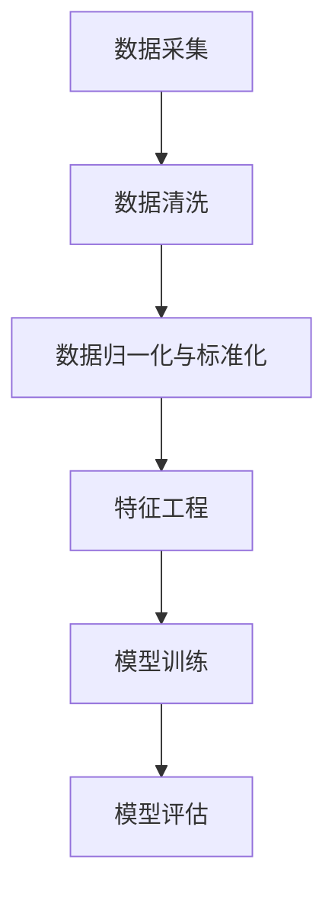

##### 1.3 机器学习的主要类型

机器学习根据不同的学习目标和数据类型，可以分为以下几种主要类型：

1. **回归分析（Regression Analysis）：**
   回归分析用于预测连续值输出，如房价预测、股票价格预测等。

2. **分类（Classification）：**
   分类用于将数据分为不同的类别，如邮件分类、疾病诊断等。

3. **聚类（Clustering）：**
   聚类是将数据分为若干个无监督的群组，以便更好地理解数据分布和结构。

4. **关联规则挖掘（Association Rule Learning）：**
   关联规则挖掘用于发现数据之间的关联关系，如购物篮分析。

5. **异常检测（Anomaly Detection）：**
   异常检测用于识别数据中的异常值或异常模式，如信用卡欺诈检测。

**机器学习的主要类型及其应用场景：**

- **回归分析：** 适用于需要预测数值型变量的场景，如价格预测、销量预测。
- **分类：** 适用于需要将数据分为离散类别的场景，如垃圾邮件分类、疾病诊断。
- **聚类：** 适用于对数据进行聚类分析，以发现数据中的隐含结构和模式。
- **关联规则挖掘：** 适用于发现数据之间的关联关系，如购物篮分析。
- **异常检测：** 适用于检测数据中的异常值或异常模式，如信用卡欺诈检测。

**Mermaid流程图：**

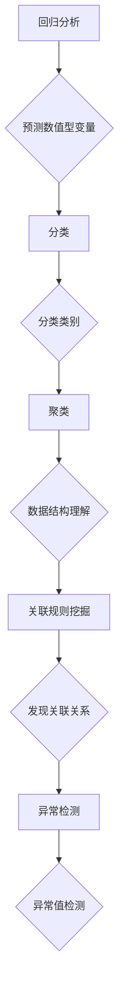

##### 1.4 机器学习的发展历程

机器学习的发展历程可以追溯到20世纪50年代，经过数十年的发展，逐渐成为人工智能领域的重要分支。以下是机器学习发展历程的主要阶段：

1. **1950s - 1960s：** 人工智能概念的提出，机器学习的初步探索。
   - **1956年：** 约翰·麦卡锡（John McCarthy）等人首次提出人工智能（AI）的概念。
   - **1959年：** 首次人工智能会议在达特茅斯学院召开，标志着人工智能学科的正式诞生。

2. **1970s - 1980s：** 知识表示和推理方法的研究，机器学习发展停滞。
   - **1970年：** 马文·明斯基（Marvin Minsky）和西摩·帕普特（Seymour Papert）提出了对神经网络早期发展的批评，导致神经网络研究的停滞。
   - **1980年：** 统计学习方法的兴起，支持向量机（SVM）和决策树等算法的应用。

3. **1990s - 2000s：** 数据挖掘和统计学习方法的兴起，机器学习的复兴。
   - **1990年：** 数据挖掘（Data Mining）概念的提出，推动了机器学习在商业、金融等领域的应用。
   - **2006年：** Geoffrey Hinton等人提出深度信念网络（DBN），深度学习开始复兴。

4. **2010s - 至今：** 深度学习的崛起，神经网络和深度学习模型在图像识别、自然语言处理等领域取得突破性成果。
   - **2012年：** AlexNet在ImageNet图像识别挑战赛中取得突破性成绩，标志着深度学习的崛起。
   - **2016年：** Google的AlphaGo战胜世界围棋冠军李世石，展示了深度学习在复杂任务中的强大能力。

**Mermaid流程图：**

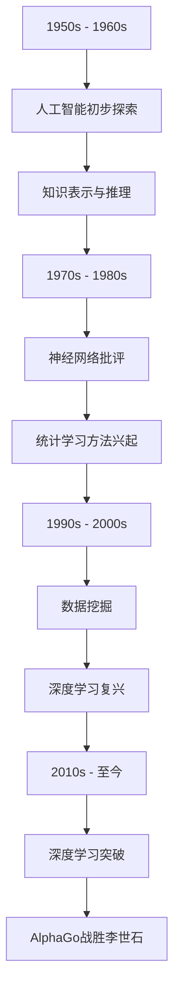

#### 第2章: 电子商务用户行为数据采集与分析

##### 2.1 用户行为数据采集

电子商务平台每天都会产生海量的用户行为数据，这些数据包括用户的浏览记录、购买历史、搜索行为、点击率等。采集这些数据对于进行用户行为分析具有重要意义，可以为企业提供决策支持，优化用户体验，提高销售额。

**用户行为数据的类型：**

1. **浏览记录：** 用户在平台上的浏览路径、停留时间、浏览的页面等。
2. **购买历史：** 用户在平台上的购买记录，包括购买的商品、购买时间、购买金额等。
3. **搜索行为：** 用户在平台上的搜索关键词、搜索频率、搜索结果等。
4. **点击率：** 用户对页面元素（如广告、按钮、推荐商品）的点击行为。

**用户行为数据采集的方法：**

1. **日志采集：** 通过服务器日志记录用户的访问行为，如HTTP请求日志、点击日志等。
2. **埋点采集：** 在网站上埋点，记录用户的行为数据，如页面浏览、点击、购买等。
3. **SDK采集：** 在客户端应用程序中集成SDK（软件开发工具包），采集用户行为数据。
4. **用户调查：** 通过在线调查、问卷调查等方式直接从用户处获取行为数据。

**用户行为数据采集的挑战与应对：**

1. **数据量巨大：** 随着用户数量的增加，数据采集和处理变得复杂。应对方法：采用分布式存储和计算技术，如Hadoop、Spark等。
2. **数据质量：** 数据可能包含缺失值、异常值、噪声等，影响数据分析的准确性。应对方法：使用数据清洗技术，如缺失值填充、异常值检测和去噪。
3. **用户隐私：** 用户行为数据的采集可能涉及用户隐私，需要遵守相关法律法规。应对方法：采用加密技术、匿名化处理等方法保护用户隐私。

**Mermaid流程图：**

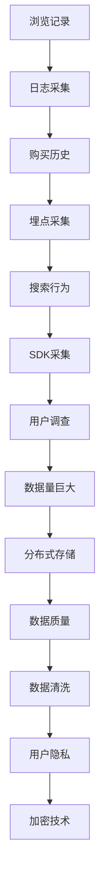

##### 2.2 用户行为数据分析方法

用户行为数据分析是电子商务平台的重要任务，通过分析用户行为数据，可以深入了解用户需求、优化用户体验、提升销售额。以下是几种常用的用户行为数据分析方法：

**1. 描述性分析（Descriptive Analysis）：**
描述性分析旨在对用户行为数据进行概括性描述，包括统计用户行为的基本特征，如用户的平均浏览时间、平均购买频率、最活跃的时间段等。描述性分析为数据分析和决策提供了基础。

**2. 聚类分析（Clustering Analysis）：**
聚类分析是一种无监督学习方法，用于将用户划分为不同的群体，以便更好地理解用户的行为模式。常用的聚类算法包括K-means、层次聚类等。聚类分析有助于发现用户群体的异质性，为个性化推荐和精准营销提供依据。

**3. 关联规则挖掘（Association Rule Learning）：**
关联规则挖掘用于发现用户行为数据中的关联关系，如用户在购买某商品时可能同时购买的其他商品。常用的算法包括Apriori算法、FP-growth算法等。关联规则挖掘有助于优化商品搭配和营销策略。

**4. 回归分析（Regression Analysis）：**
回归分析用于预测用户行为，如预测用户的购买概率、浏览时间等。通过建立用户行为与预测目标之间的回归模型，可以优化营销策略，提高用户满意度。

**5. 强化学习（Reinforcement Learning）：**
强化学习是一种交互式学习方法，通过模拟用户在电子商务平台上的互动过程，不断调整行为策略以最大化长期收益。强化学习可以应用于推荐系统、智能广告投放等场景。

**Mermaid流程图：**

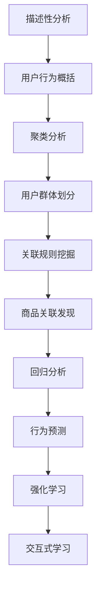

#### 第3章: 监督学习在用户行为分析中的应用

##### 3.1 监督学习基本概念

监督学习（Supervised Learning）是一种机器学习方法，通过使用带标签的数据集进行训练，以学习输入和输出之间的映射关系。监督学习的目标是通过已知的输入和输出数据，预测新数据的标签。

**监督学习的特点：**

1. **输入和输出数据：** 监督学习需要同时提供输入数据和对应的输出标签，以便模型可以从中学习。
2. **目标明确：** 监督学习的目标是预测未知数据的标签，因此模型的评价指标主要是预测的准确性。
3. **训练和测试：** 监督学习分为训练阶段和测试阶段，训练阶段用于训练模型，测试阶段用于评估模型性能。

**监督学习的常见算法：**

1. **线性回归（Linear Regression）：**
   线性回归是一种简单的监督学习算法，用于预测连续值输出。其基本原理是找到一个线性函数来描述输入和输出之间的关系。

2. **逻辑回归（Logistic Regression）：**
   逻辑回归是一种广义线性模型，用于预测概率。它通过将线性函数的结果映射到概率分布中，实现分类任务。

3. **决策树（Decision Tree）：**
   决策树是一种树形结构，通过一系列的判断条件将数据划分为不同的类别。决策树容易理解和解释，但可能产生过拟合。

4. **随机森林（Random Forest）：**
   随机森林是一种集成学习方法，通过构建多个决策树，并合并它们的预测结果来提高模型的泛化能力。随机森林在处理大规模数据和减少过拟合方面表现出色。

5. **支持向量机（Support Vector Machine, SVM）：**
   支持向量机是一种基于最大间隔的线性分类器，通过找到一个最佳的超平面来分隔不同类别的数据。SVM在处理高维数据和非线性问题上表现出良好的性能。

6. **神经网络（Neural Networks）：**
   神经网络是一种模拟生物神经系统的计算模型，通过多层神经元进行数据的非线性变换。神经网络在图像识别、自然语言处理等领域取得了显著的成果。

**监督学习的评估指标：**

1. **准确率（Accuracy）：**
   准确率是评估模型性能的基本指标，表示正确预测的样本数占总样本数的比例。

2. **精确率（Precision）：**
   精确率表示预测为正类的样本中实际为正类的比例，用于评估分类模型的精确度。

3. **召回率（Recall）：**
   召回率表示实际为正类的样本中被预测为正类的比例，用于评估分类模型的灵敏度。

4. **F1值（F1 Score）：**
   F1值是精确率和召回率的调和平均，用于综合考虑模型的精确度和灵敏度。

**Mermaid流程图：**

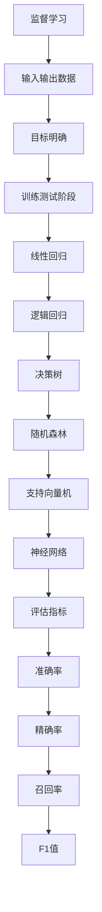

##### 3.2 特征选择与模型优化

在机器学习项目中，特征选择和模型优化是提高模型性能的关键步骤。特征选择旨在从原始特征中筛选出对模型预测有重要影响的特征，而模型优化则通过调整模型参数来提高模型的泛化能力。

**特征选择方法：**

1. **过滤式特征选择（Filter Method）：**
   过滤式特征选择通过评估每个特征与目标变量之间的相关性来筛选特征。常用的相关性度量方法包括皮尔逊相关系数、斯皮尔曼相关系数等。

2. **包装式特征选择（Wrapper Method）：**
   包装式特征选择通过在训练集上尝试不同的特征组合，评估每个特征组合对模型性能的影响。常用的算法包括向前选择、向后删除和递归特征消除等。

3. **嵌入式特征选择（Embedded Method）：**
   嵌入式特征选择在模型训练过程中自动选择特征，如L1正则化（Lasso）、L2正则化（Ridge）等。

**模型优化策略：**

1. **参数调优（Hyperparameter Tuning）：**
   参数调优通过调整模型的超参数来提高模型的性能。常用的方法包括网格搜索、随机搜索和贝叶斯优化等。

2. **交叉验证（Cross-Validation）：**
   交叉验证通过将数据集划分为多个子集，在每个子集上训练和验证模型，以评估模型的泛化能力。常用的交叉验证方法包括K折交叉验证、留一交叉验证等。

3. **集成学习（Ensemble Learning）：**
   集成学习通过结合多个模型的预测结果来提高模型的性能。常用的集成学习方法包括Bagging、Boosting和Stacking等。

**Mermaid流程图：**

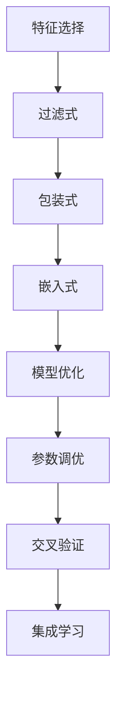

##### 3.3 模型融合与集成学习

模型融合（Model Fusion）和集成学习（Ensemble Learning）是提高机器学习模型性能的重要方法。通过结合多个模型的预测结果，可以减少模型的方差和偏差，提高模型的泛化能力。

**模型融合：**

1. **投票法（Voting）：**
   投票法将多个模型的预测结果进行投票，选择多数模型预测的结果作为最终预测结果。投票法简单有效，适用于分类问题。

2. **加权投票法（Weighted Voting）：**
   加权投票法根据每个模型的准确率或置信度对预测结果进行加权，选择加权投票结果最高的类别作为最终预测结果。加权投票法可以更准确地反映不同模型的重要性。

**集成学习：**

1. **Bagging（Bootstrap Aggregating）：**
   Bagging通过构建多个弱学习器（如决策树），并在训练数据集的子集中进行训练，然后将这些弱学习器的预测结果进行平均，以降低模型的方差。

2. **Boosting（AdaBoost）：**
   Boosting通过训练多个弱学习器，每个弱学习器专注于纠正前一个学习器的错误，从而提高模型的泛化能力。AdaBoost是一种常用的Boosting算法，通过调整每个弱学习器的权重来优化模型。

3. **Stacking（Stacked Generalization）：**
   Stacking通过构建多个学习器，并将它们的预测结果作为新的特征输入到另一个学习器中进行训练。Stacking可以看作是Bagging和Boosting的结合，适用于不同类型的学习器。

**Mermaid流程图：**

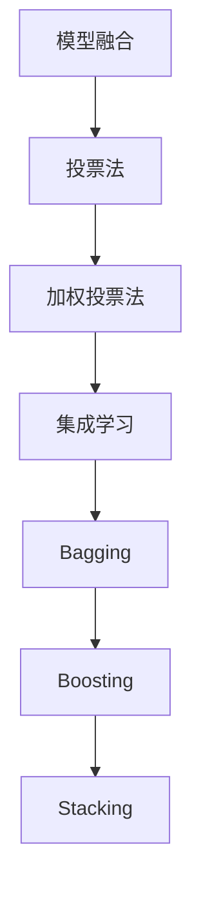

#### 第4章: 电子商务个性化推荐系统

##### 4.1 个性化推荐系统概述

个性化推荐系统（Personalized Recommendation System）是一种基于用户兴趣和行为的历史数据，为用户提供个性化商品或内容推荐的系统。在电子商务领域，个性化推荐系统可以帮助企业提高销售额、提升用户满意度，同时增强用户黏性。

**个性化推荐系统的定义与目标：**

1. **定义：**
   个性化推荐系统是一种根据用户的历史行为、兴趣和偏好，利用机器学习算法和推荐算法，为用户推荐个性化商品或内容的服务系统。

2. **目标：**
   - 提高用户的购物体验：通过推荐用户感兴趣的商品或内容，提升用户的购物满意度。
   - 增加销售额：通过个性化推荐，引导用户购买更多商品，提高企业的销售额。
   - 提高用户黏性：通过持续的个性化推荐，增加用户对平台的依赖和忠诚度。

**个性化推荐系统的主要类型：**

1. **基于内容的推荐（Content-Based Recommendation）：**
   基于内容的推荐系统通过分析用户过去喜欢的商品或内容，提取其特征，并将具有相似特征的未购买商品推荐给用户。该方法适用于具有明确内容特征的商品推荐，如新闻、音乐、电影等。

2. **协同过滤推荐（Collaborative Filtering Recommendation）：**
   协同过滤推荐系统通过分析用户之间的相似性，发现用户的兴趣模式，并将其他用户喜欢的商品推荐给当前用户。协同过滤推荐分为用户基于的协同过滤（User-Based Collaborative Filtering）和项目基于的协同过滤（Item-Based Collaborative Filtering）。

3. **混合推荐（Hybrid Recommendation）：**
   混合推荐系统结合了基于内容和协同过滤推荐的方法，通过综合利用用户兴趣和用户之间的相似性，提供更准确的推荐。混合推荐系统在电子商务领域中应用广泛，可以更好地满足用户的个性化需求。

**个性化推荐系统的挑战与应对策略：**

1. **数据稀疏性（Data Sparsity）：**
   数据稀疏性是指用户和商品之间的交互数据非常稀少，导致推荐系统的效果不佳。应对策略：采用矩阵分解、隐语义模型等方法降低数据稀疏性。

2. **实时性（Real-Time Recommendation）：**
   实时性是个性化推荐系统的重要挑战，特别是在动态变化的电子商务环境中。应对策略：采用增量式推荐、实时计算和分布式计算等技术提高推荐系统的实时性。

3. **多样性（Diversity）：**
   个性化推荐系统容易陷入“推荐多样性不足”的问题，导致用户对推荐结果感到单调。应对策略：采用多样性度量方法，如基于内容的多样性、基于用户的多样性等，提高推荐结果的多样性。

4. **冷启动问题（Cold Start Problem）：**
   冷启动问题是指新用户或新商品的推荐问题，由于缺乏用户行为数据或商品信息，传统推荐方法效果不佳。应对策略：采用基于内容的推荐、使用公共特征、利用用户群体信息等方法解决冷启动问题。

**Mermaid流程图：**

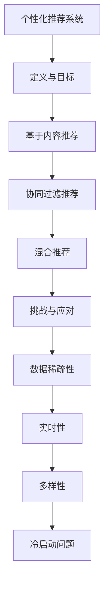

##### 4.2 collaborative filtering 方法

协同过滤推荐（Collaborative Filtering Recommendation）是电子商务个性化推荐系统的核心技术之一，通过分析用户之间的相似性，为用户推荐其他用户喜欢的商品。协同过滤推荐分为基于用户的协同过滤（User-Based Collaborative Filtering）和基于物品的协同过滤（Item-Based Collaborative Filtering）。

**user-based 方法：**

1. **相似度计算：**
   基于用户的协同过滤首先计算用户之间的相似度，常用的相似度度量方法包括余弦相似度、皮尔逊相关系数等。通过相似度度量，可以发现与目标用户相似的其他用户。

2. **推荐生成：**
   基于用户的协同过滤通过分析与目标用户相似的用户对喜欢的商品，生成推荐列表。具体步骤包括：
   - 计算目标用户与所有其他用户的相似度。
   - 选择与目标用户最相似的K个用户。
   - 收集这K个用户共同喜欢的商品，并按评分高低排序，生成推荐列表。

3. **优势与局限性：**
   - 优势：基于用户的协同过滤能够利用用户之间的社交关系，提供更准确的个性化推荐。
   - 局限性：当用户数量较多时，计算复杂度较高；且容易受到噪声数据的影响。

**item-based 方法：**

1. **相似度计算：**
   基于物品的协同过滤通过计算商品之间的相似度，发现用户可能感兴趣的其他商品。相似度计算方法包括余弦相似度、Jaccard相似度等。

2. **推荐生成：**
   基于物品的协同过滤通过分析用户对某商品的评分，发现用户可能喜欢的其他商品。具体步骤包括：
   - 计算用户对某商品的评分。
   - 收集与该商品相似的其他商品。
   - 按相似度高低排序，生成推荐列表。

3. **优势与局限性：**
   - 优势：基于物品的协同过滤在处理高维数据时表现较好，计算复杂度较低。
   - 局限性：基于物品的协同过滤无法充分利用用户之间的社交关系，推荐结果可能较为单一。

**hybrid 方法：**

1. **整合user-based和item-based方法：**
   混合推荐系统将基于用户的协同过滤和基于物品的协同过滤相结合，通过综合利用用户兴趣和商品特征，提高推荐系统的准确性。

2. **推荐生成：**
   混合推荐系统首先基于用户的历史行为和商品特征，为用户生成初步推荐列表；然后通过分析用户之间的相似性，对初步推荐列表进行优化和调整，生成最终的推荐结果。

3. **优势与局限性：**
   - 优势：混合推荐系统能够充分利用用户和商品的信息，提高推荐准确性。
   - 局限性：混合推荐系统的计算复杂度较高，需要对不同算法进行有效整合。

**Mermaid流程图：**

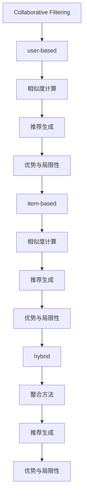

##### 4.3 电子商务个性化推荐系统的实现

电子商务个性化推荐系统的实现涉及到数据采集、数据处理、模型训练、推荐生成和系统部署等环节。以下是电子商务个性化推荐系统的实现步骤：

**1. 数据采集：**
   - 采集用户行为数据，如浏览记录、购买历史、评分数据等。
   - 采集商品信息，如商品属性、类别、价格等。

**2. 数据预处理：**
   - 数据清洗：去除缺失值、异常值和噪声数据。
   - 数据归一化与标准化：将不同特征的数据归一化或标准化到相同的尺度。
   - 特征工程：提取对推荐有重要影响的特征，如商品类别、品牌、用户活跃度等。

**3. 模型训练：**
   - 使用用户行为数据和商品信息，训练协同过滤模型、基于内容的推荐模型等。
   - 调整模型参数，优化模型性能。

**4. 推荐生成：**
   - 基于用户的协同过滤：计算用户之间的相似度，生成推荐列表。
   - 基于物品的协同过滤：计算商品之间的相似度，生成推荐列表。
   - 混合推荐：结合用户兴趣和商品特征，生成个性化推荐列表。

**5. 系统部署：**
   - 部署推荐系统，实现实时推荐功能。
   - 持续优化推荐算法，提高推荐准确性。

**Mermaid流程图：**

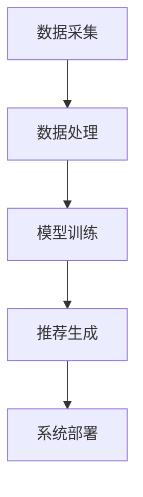

#### 第5章: 深度学习在用户行为分析中的应用

##### 5.1 深度学习基础

深度学习（Deep Learning）是机器学习的一个重要分支，通过构建深度神经网络（Deep Neural Network，DNN）模型，实现数据的自动特征提取和复杂模式识别。深度学习在图像识别、自然语言处理、语音识别等领域取得了显著成果，成为人工智能研究的重要方向。

**深度学习的基本原理：**

1. **神经元模型：**
   深度学习的核心是神经网络，神经网络由多个神经元组成，每个神经元接收多个输入信号，并通过激活函数进行非线性变换，产生输出信号。

2. **层次结构：**
   深度神经网络具有多个隐藏层，每个隐藏层负责提取不同层次的特征。层次结构使得神经网络能够自动学习数据的层次结构，实现特征复用和层次化特征提取。

3. **反向传播算法（Backpropagation）：**
   反向传播算法是一种用于训练深度神经网络的方法，通过计算损失函数关于网络参数的梯度，不断调整网络参数，以最小化损失函数。

**深度学习的主要模型：**

1. **卷积神经网络（Convolutional Neural Network，CNN）：**
   卷积神经网络是深度学习在图像处理领域的代表性模型，通过卷积层、池化层和全连接层等结构，实现图像特征的自动提取和分类。

2. **循环神经网络（Recurrent Neural Network，RNN）：**
   循环神经网络是一种适用于序列数据建模的深度学习模型，通过将当前输入与前一时刻的隐藏状态进行结合，实现序列数据的动态建模。

3. **长短期记忆网络（Long Short-Term Memory，LSTM）：**
   长短期记忆网络是循环神经网络的一种改进模型，通过引入门控机制，解决了RNN在长序列数据建模中的梯度消失和梯度爆炸问题。

4. **生成对抗网络（Generative Adversarial Network，GAN）：**
   生成对抗网络由生成器和判别器两个神经网络组成，通过对抗训练实现数据的生成和判别。

**深度学习的优化方法：**

1. **梯度下降（Gradient Descent）：**
   梯度下降是一种常用的优化方法，通过计算损失函数关于网络参数的梯度，更新网络参数，以最小化损失函数。

2. **随机梯度下降（Stochastic Gradient Descent，SGD）：**
   随机梯度下降是梯度下降的一种改进方法，通过随机选择一部分样本计算梯度，以加速收敛和提高模型泛化能力。

3. **Adam优化器（Adam Optimizer）：**
   Adam优化器是一种基于一阶矩估计和二阶矩估计的优化方法，通过自适应调整学习率，提高模型训练效率。

**Mermaid流程图：**

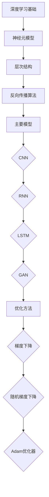

##### 5.2 深度学习在用户行为分析中的应用

深度学习在用户行为分析中具有广泛的应用，通过构建深度神经网络模型，可以自动提取用户行为的特征，实现用户行为预测、用户画像构建和个性化推荐等功能。

**基于深度学习的用户行为预测：**

1. **用户行为预测模型：**
   基于深度学习的用户行为预测模型通过输入用户历史行为数据，预测用户未来的行为，如购买概率、浏览时长等。常见的深度学习模型包括卷积神经网络（CNN）、循环神经网络（RNN）、长短期记忆网络（LSTM）等。

2. **模型训练与优化：**
   基于深度学习的用户行为预测模型通过训练大量的用户行为数据，学习用户行为的特征和模式。在模型训练过程中，通过调整网络结构和超参数，优化模型性能。

3. **应用场景：**
   用户行为预测可以应用于电子商务平台的推荐系统、广告投放和用户流失预测等场景，帮助企业提高用户满意度、提升销售额和降低用户流失率。

**基于深度学习的用户画像构建：**

1. **用户画像概念：**
   用户画像（User Profile）是指通过收集和分析用户行为数据，构建用户的基本特征和偏好，以实现个性化推荐和精准营销。

2. **用户画像构建方法：**
   基于深度学习的用户画像构建方法通过构建深度神经网络模型，自动提取用户行为的特征，形成用户画像。深度学习模型可以同时处理多模态数据，如文本、图像和视频等，提高用户画像的准确性。

3. **应用场景：**
   用户画像可以应用于电子商务平台的个性化推荐、精准营销和用户行为分析等场景，帮助企业更好地了解用户需求，提升用户体验和满意度。

**基于深度学习的推荐系统：**

1. **推荐系统原理：**
   基于深度学习的推荐系统通过输入用户行为数据和商品信息，利用深度学习模型自动提取特征，生成个性化推荐列表。常见的深度学习模型包括卷积神经网络（CNN）、循环神经网络（RNN）、长短期记忆网络（LSTM）等。

2. **推荐生成过程：**
   基于深度学习的推荐系统首先通过用户行为数据训练深度学习模型，然后利用训练好的模型对用户兴趣进行建模，生成个性化推荐列表。

3. **应用场景：**
   基于深度学习的推荐系统可以应用于电子商务平台、社交媒体、在线视频平台等场景，帮助企业提高用户满意度、提升销售额和降低用户流失率。

**Mermaid流程图：**

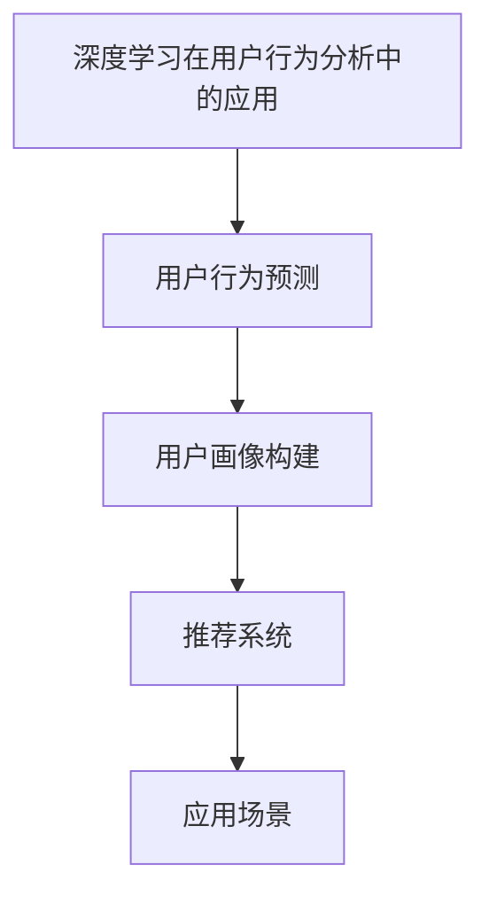

#### 第6章: 电子商务用户行为分析项目实战

##### 6.1 实战项目介绍

**项目背景：**

随着电子商务行业的快速发展，用户行为分析成为企业提升销售额、优化用户体验和制定精准营销策略的重要手段。本项目旨在通过机器学习技术，对电子商务平台用户行为数据进行分析，构建一个基于深度学习的用户行为预测模型，实现个性化推荐和用户流失预测。

**项目目标：**

1. 提取用户行为的特征，构建用户画像。
2. 预测用户的购买概率和浏览时长。
3. 构建个性化推荐系统，提高用户满意度。
4. 预测用户流失，降低用户流失率。

**项目流程：**

1. 数据采集：从电子商务平台获取用户行为数据，包括浏览记录、购买历史、搜索行为等。
2. 数据预处理：对采集到的数据进行清洗、归一化和特征工程，将数据转换为适合模型训练的形式。
3. 模型训练：使用深度学习模型（如LSTM、CNN）对预处理后的数据集进行训练，学习用户行为的特征和模式。
4. 模型评估：使用验证集和测试集评估模型的性能，调整模型参数和结构，提高预测准确性。
5. 部署上线：将训练好的模型部署到生产环境，实现实时预测和推荐功能。

**Mermaid流程图：**

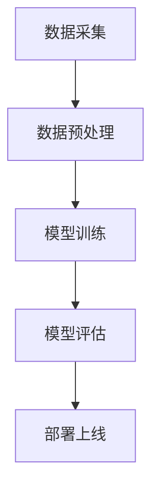

##### 6.2 数据采集与处理

**数据采集方法：**

1. **日志采集：** 通过电子商务平台的日志系统，采集用户的浏览记录、购买历史、搜索行为等数据。日志数据以文本形式存储，包括用户ID、时间戳、访问路径、商品ID等信息。

2. **埋点采集：** 在电子商务平台上埋设埋点，记录用户在各个页面上的行为数据，如页面浏览时间、点击率、转化率等。埋点数据通常以JSON格式存储，包含用户ID、事件类型、事件属性等。

3. **用户调查：** 通过在线调查、问卷调查等方式，直接从用户处获取用户行为数据，如用户偏好、满意度、购买意愿等。

**数据预处理：**

1. **数据清洗：** 对采集到的数据进行清洗，去除缺失值、异常值和噪声数据。具体方法包括：
   - 填充缺失值：使用平均值、中位数或最频繁的值填充缺失值。
   - 异常值检测：使用统计方法（如Z-score、IQR法）检测异常值，并根据业务逻辑判断是否需要去除或调整。
   - 去噪：对噪声数据进行处理，如使用滤波器平滑时间序列数据。

2. **数据归一化与标准化：** 将不同特征的数据归一化或标准化到相同的尺度，避免特征之间量纲差异对模型训练的影响。常用的方法包括：
   - 最小-最大归一化：将数据缩放到[0,1]范围内。
   - Z-score标准化：将数据缩放到均值为0、标准差为1的范围内。

3. **特征工程：** 从原始数据中提取对模型训练有重要影响的特征，如用户活跃度、购买频率、商品流行度等。特征工程包括：
   - 创建新特征：根据业务逻辑和经验，创建新的特征，如用户购买间隔时间、浏览时长等。
   - 特征选择：使用过滤式、包装式或嵌入式特征选择方法，选择对模型预测有显著影响的特征。

**Mermaid流程图：**

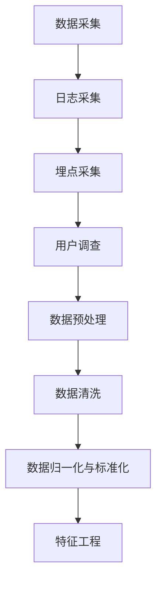

##### 6.3 模型构建与优化

**模型选择：**

在构建用户行为预测模型时，常用的深度学习模型包括循环神经网络（RNN）、长短期记忆网络（LSTM）和卷积神经网络（CNN）。以下是这些模型的优缺点：

1. **循环神经网络（RNN）：**
   - 优点：能够处理序列数据，保持长期依赖关系。
   - 缺点：梯度消失和梯度爆炸问题，难以处理长序列数据。

2. **长短期记忆网络（LSTM）：**
   - 优点：解决了RNN的梯度消失和梯度爆炸问题，能够处理长序列数据。
   - 缺点：参数较多，计算复杂度高，训练时间较长。

3. **卷积神经网络（CNN）：**
   - 优点：适用于处理图像和视频数据，能够自动提取局部特征。
   - 缺点：难以处理序列数据，需要额外的编码器-解码器结构。

根据项目需求，可以选择LSTM模型进行用户行为预测。LSTM模型能够有效地捕捉用户行为的长期依赖关系，同时避免了RNN模型的梯度消失问题。

**模型训练与调优：**

1. **模型训练：**
   - 数据集划分：将数据集划分为训练集、验证集和测试集，用于模型训练、验证和评估。
   - 模型训练：使用训练集对LSTM模型进行训练，学习用户行为的特征和模式。在训练过程中，使用反向传播算法和梯度下降优化方法更新模型参数，以最小化损失函数。
   - 模型验证：使用验证集评估模型性能，调整模型参数和结构，提高预测准确性。

2. **模型调优：**
   - 超参数调整：调整LSTM模型的超参数，如隐藏层单元数、学习率、批量大小等，以优化模型性能。常用的超参数调整方法包括网格搜索、随机搜索和贝叶斯优化等。
   - 模型融合：使用模型融合方法，如集成学习、投票法等，提高模型的泛化能力。
   - 模型集成：将多个训练好的模型进行集成，生成最终的预测结果，提高预测准确性。

**Mermaid流程图：**

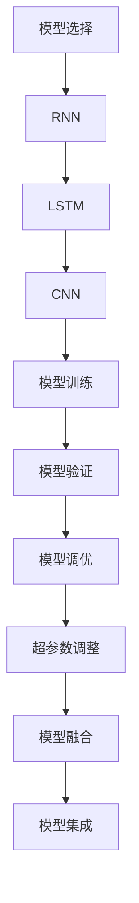

##### 6.4 模型评估

模型评估是机器学习项目中的重要环节，通过评估模型的性能，可以判断模型在新的数据上的泛化能力。以下是常用的评估指标和方法：

1. **准确率（Accuracy）：**
   准确率是评估分类模型性能的基本指标，表示正确分类的样本数占总样本数的比例。准确率越高，模型分类效果越好。

2. **精确率（Precision）和召回率（Recall）：**
   精确率表示预测为正类的样本中实际为正类的比例，召回率表示实际为正类的样本中被预测为正类的比例。精确率和召回率分别从不同角度评估模型性能，可以结合F1值（F1 Score）进行综合评价。

3. **ROC曲线和AUC（Area Under Curve）：**
   ROC曲线是评估分类模型性能的重要工具，通过绘制真阳性率（True Positive Rate，TPR）与假阳性率（False Positive Rate，FPR）的曲线，可以直观地评估模型的分类能力。AUC是ROC曲线下的面积，AUC值越接近1，模型性能越好。

4. **交叉验证（Cross-Validation）：**
   交叉验证是一种评估模型性能的方法，通过将数据集划分为多个子集，在每个子集上训练和验证模型，以评估模型的泛化能力。常用的交叉验证方法包括K折交叉验证、留一交叉验证等。

5. **混淆矩阵（Confusion Matrix）：**
   混淆矩阵是评估分类模型性能的详细工具，通过展示实际类别与预测类别之间的关系，可以直观地了解模型在不同类别上的表现。

**评估指标的选择与解释：**

1. **准确率（Accuracy）：**
   - 优点：简单直观，易于理解。
   - 缺点：对于类别不平衡的数据集，准确率可能不具有参考意义。

2. **精确率（Precision）和召回率（Recall）：**
   - 优点：能够从不同角度评估模型性能，适用于类别不平衡的数据集。
   - 缺点：在某些场景下，精确率和召回率的权衡可能影响模型选择。

3. **F1值（F1 Score）：**
   - 优点：综合考虑精确率和召回率，适用于评估模型的整体性能。
   - 缺点：对于极端不平衡的数据集，F1值可能不具有参考意义。

4. **ROC曲线和AUC（Area Under Curve）：**
   - 优点：适用于评估模型的分类能力，能够直观地比较不同模型的性能。
   - 缺点：需要较大的数据集，计算过程较为复杂。

5. **交叉验证（Cross-Validation）：**
   - 优点：能够评估模型在新的数据上的泛化能力，减少模型过拟合的风险。
   - 缺点：需要较多的计算资源，不适合小数据集。

**Mermaid流程图：**

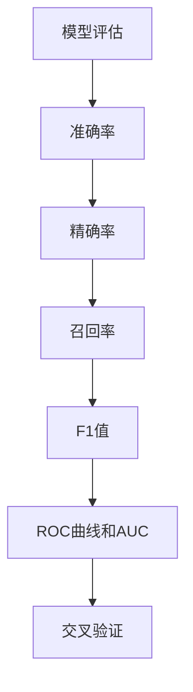

##### 6.5 代码实现与解读

以下是一个简单的用户行为预测模型的Python代码实现，包括数据预处理、模型训练和评估过程。代码使用了Keras框架和TensorFlow后端。

```python
import numpy as np
import pandas as pd
from sklearn.model_selection import train_test_split
from sklearn.preprocessing import StandardScaler
from sklearn.metrics import accuracy_score, precision_score, recall_score, f1_score, roc_auc_score
from tensorflow.keras.models import Sequential
from tensorflow.keras.layers import LSTM, Dense, Dropout
from tensorflow.keras.optimizers import Adam

# 数据预处理
def preprocess_data(data):
    # 数据清洗
    data = data.dropna()
    # 特征工程
    data['user_active_days'] = data.groupby('user_id')['time'].nunique().values
    data['user_purchase_count'] = data.groupby('user_id')['is_purchase'].sum().values
    # 数据归一化
    scaler = StandardScaler()
    X = scaler.fit_transform(data.drop(['user_id', 'time', 'is_purchase'], axis=1))
    y = data['is_purchase'].values
    return X, y

# 模型构建
def build_model(input_shape):
    model = Sequential()
    model.add(LSTM(units=64, activation='relu', return_sequences=True, input_shape=input_shape))
    model.add(Dropout(0.2))
    model.add(LSTM(units=64, activation='relu'))
    model.add(Dropout(0.2))
    model.add(Dense(units=1, activation='sigmoid'))
    model.compile(optimizer=Adam(learning_rate=0.001), loss='binary_crossentropy', metrics=['accuracy'])
    return model

# 模型训练
def train_model(model, X_train, y_train, X_val, y_val):
    history = model.fit(X_train, y_train, epochs=100, batch_size=32, validation_data=(X_val, y_val), verbose=1)
    return history

# 模型评估
def evaluate_model(model, X_test, y_test):
    y_pred = model.predict(X_test)
    y_pred = (y_pred > 0.5)
    accuracy = accuracy_score(y_test, y_pred)
    precision = precision_score(y_test, y_pred)
    recall = recall_score(y_test, y_pred)
    f1 = f1_score(y_test, y_pred)
    auc = roc_auc_score(y_test, y_pred)
    print("Accuracy:", accuracy)
    print("Precision:", precision)
    print("Recall:", recall)
    print("F1 Score:", f1)
    print("AUC:", auc)

# 数据加载
data = pd.read_csv('user_behavior_data.csv')
X, y = preprocess_data(data)

# 数据集划分
X_train, X_test, y_train, y_test = train_test_split(X, y, test_size=0.2, random_state=42)

# 模型训练
model = build_model(input_shape=X_train.shape[1:])
history = train_model(model, X_train, y_train, X_val, y_val)

# 模型评估
evaluate_model(model, X_test, y_test)
```

**代码解读与分析：**

1. **数据预处理：**
   - 数据清洗：使用`dropna()`方法去除缺失值。
   - 特征工程：计算用户活跃天数和购买次数，作为新的特征。
   - 数据归一化：使用`StandardScaler()`将特征值缩放到相同的尺度。

2. **模型构建：**
   - 使用`Sequential()`创建序列模型。
   - 添加LSTM层，设置隐藏层单元数、激活函数和返回序列。
   - 添加Dropout层，用于防止过拟合。
   - 添加全连接层，设置输出层单元数和激活函数。

3. **模型训练：**
   - 使用`fit()`方法训练模型，设置训练轮数、批量大小和验证数据。
   - 使用`history`记录训练过程中的损失和准确率。

4. **模型评估：**
   - 使用`predict()`方法生成预测结果。
   - 使用`accuracy_score()`、`precision_score()`、`recall_score()`、`f1_score()`和`roc_auc_score()`等评估指标，计算模型的性能。

**代码分析：**

- 数据预处理部分，需要根据具体业务场景进行调整，例如选择合适的特征和归一化方法。
- 模型构建部分，可以根据实际需求调整网络结构、激活函数和损失函数。
- 模型训练部分，需要根据数据量和计算资源调整训练参数，如训练轮数、批量大小和优化器。
- 模型评估部分，需要综合考虑不同评估指标，以全面评估模型性能。

#### 第7章: 电子商务用户行为分析研究前沿

##### 7.1 前沿技术概述

随着电子商务领域的快速发展，用户行为分析技术也在不断演进。近年来，模式识别、数据挖掘和强化学习等前沿技术在电子商务用户行为分析中取得了显著成果，为个性化推荐、用户流失预测和智能营销等应用提供了新的解决方案。

**模式识别与数据挖掘技术：**

1. **图像识别与识别技术：**
   随着深度学习技术的发展，基于深度卷积神经网络的图像识别技术取得了突破性进展。在电子商务领域，图像识别技术可以用于商品分类、商品搜索和库存管理等方面。

2. **自然语言处理（NLP）：**
   自然语言处理技术通过深度学习模型，可以实现文本分类、情感分析和实体识别等任务。在电子商务领域，NLP技术可以用于用户评论分析、关键词提取和智能客服等应用。

3. **数据挖掘技术：**
   数据挖掘技术通过分析海量数据，发现数据中的隐含规律和模式。在电子商务领域，数据挖掘技术可以用于用户行为预测、商品推荐和营销策略优化等方面。

**强化学习在用户行为分析中的应用：**

1. **Q-Learning算法：**
   Q-Learning算法是一种基于值函数的强化学习算法，通过不断更新值函数来学习最优策略。在电子商务领域，Q-Learning算法可以用于用户行为预测和智能推荐系统。

2. **Policy Gradient算法：**
   Policy Gradient算法是一种基于策略优化的强化学习算法，通过优化策略函数来学习最优策略。在电子商务领域，Policy Gradient算法可以用于用户流失预测和智能广告投放等应用。

**图神经网络在用户行为分析中的应用：**

1. **图卷积神经网络（GCN）：**
   图卷积神经网络是一种基于图结构的深度学习模型，可以有效地处理图数据。在电子商务领域，GCN可以用于用户社交网络分析、用户行为预测和推荐系统。

2. **图注意力网络（GAT）：**
   图注意力网络是一种基于图结构的注意力机制模型，可以用于处理异构图数据。在电子商务领域，GAT可以用于用户行为预测、用户画像构建和推荐系统。

**研究热点与趋势：**

1. **用户体验优化：**
   用户体验优化是电子商务领域的研究热点之一。通过分析用户行为数据，可以优化界面设计、交互流程和个性化推荐，提升用户体验。

2. **用户隐私保护：**
   随着用户隐私意识的提高，用户隐私保护成为电子商务领域的重要挑战。通过隐私保护技术，如差分隐私和联邦学习等，可以保护用户隐私，同时实现有效的用户行为分析。

3. **智能营销策略：**
   智能营销策略是电子商务领域的另一个研究热点。通过分析用户行为数据，可以制定个性化的营销策略，提高用户转化率和销售额。

**Mermaid流程图：**

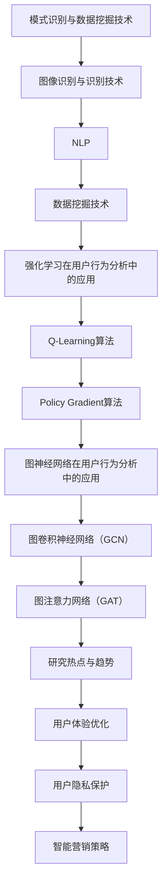

#### 附录

##### 附录A: 常用工具与资源

在电子商务用户行为分析中，有许多常用的工具和资源可以帮助研究人员和数据科学家进行数据采集、预处理、模型训练和评估。以下是一些常用的工具和资源：

**机器学习工具：**

1. **TensorFlow：**
   TensorFlow是Google开发的开源机器学习库，用于构建和训练深度学习模型。网址：[TensorFlow官网](https://www.tensorflow.org)。

2. **Keras：**
   Keras是一个高层次的神经网络API，构建在TensorFlow之上，简化了深度学习模型的构建和训练过程。网址：[Keras官网](https://keras.io)。

3. **Scikit-learn：**
   Scikit-learn是一个Python机器学习库，提供多种机器学习算法和工具，用于数据预处理、模型训练和评估。网址：[Scikit-learn官网](https://scikit-learn.org)。

**电子商务用户行为分析工具：**

1. **Google Analytics：**
   Google Analytics是Google提供的一款免费的数据分析工具，可用于追踪和分析网站用户的浏览行为、流量来源等。网址：[Google Analytics官网](https://www.google.com/analytics/)。

2. **Hotjar：**
   Hotjar是一款用户行为分析工具，提供热图、点击图、滚动图等数据分析功能，帮助用户了解用户在网站上的行为。网址：[Hotjar官网](https://www.hotjar.com)。

3. **Mixpanel：**
   Mixpanel是一款用户行为分析工具，用于追踪和分析用户在移动应用和网站上的行为，提供实时数据和自定义报告。网址：[Mixpanel官网](https://mixpanel.com)。

**数据集与代码资源：**

1. **UCI Machine Learning Repository：**
   UCI机器学习数据库是一个提供多种机器学习数据集的在线资源，包括用户行为数据集、商品数据集等。网址：[UCI Machine Learning Repository](https://archive.ics.uci.edu/ml/index.php)。

2. **Kaggle：**
   Kaggle是一个数据科学竞赛平台，提供大量公开的数据集和代码资源，涵盖多个领域，包括电子商务用户行为分析。网址：[Kaggle官网](https://www.kaggle.com)。

3. **GitHub：**
   GitHub是一个版本控制系统和代码托管平台，许多数据科学家和研究机构在GitHub上分享他们的代码和项目，包括电子商务用户行为分析的相关项目。网址：[GitHub官网](https://github.com)。

**研究论文与文献资源：**

1. **IEEE Xplore：**
   IEEE Xplore是IEEE出版的电子图书馆，提供大量关于计算机科学和电气工程的学术期刊、会议论文和标准。网址：[IEEE Xplore官网](https://ieeexplore.ieee.org)。

2. **ACM Digital Library：**
   ACM Digital Library是ACM出版的数字图书馆，提供计算机科学领域的学术期刊、会议论文和书籍。网址：[ACM Digital Library官网](https://dl.acm.org)。

3. **ArXiv：**
   ArXiv是一个开放获取的预印本服务器，提供计算机科学、物理学、数学等领域的学术论文。网址：[ArXiv官网](https://arxiv.org)。

**作者信息：**

作者：AI天才研究院/AI Genius Institute & 禅与计算机程序设计艺术/Zen And The Art of Computer Programming

