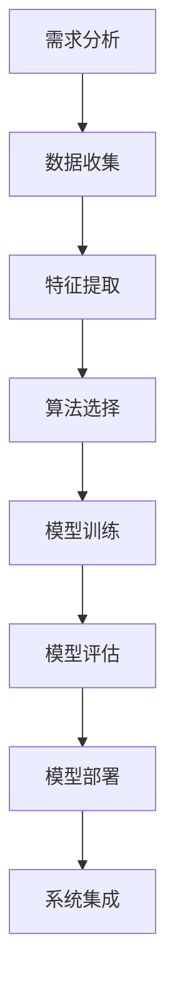
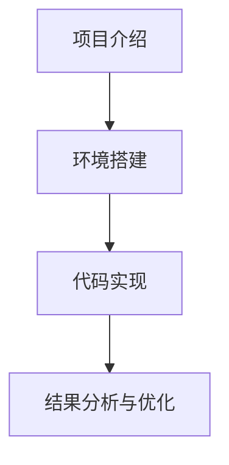

                 

# 机器学习在网络安全中的防御策略

> **关键词：**网络安全，机器学习，入侵检测，流量分析，数据泄露防护，事件预测，防御体系，项目实战。

> **摘要：**本文探讨了机器学习在网络安全中的应用及其防御策略。通过分析网络安全现状和挑战，阐述了机器学习在网络安全中的价值与应用场景，深入介绍了神经网络、支持向量机、决策树等机器学习基础知识。接着，详细讲解了机器学习在入侵检测、网络流量分析、数据泄露防护和网络安全事件预测等领域的实际应用，并展示了如何构建面向机器学习的安全防御体系。最后，通过一个实战项目，展示了网络安全防御系统的实现过程，并对未来发展趋势和挑战进行了展望。

## 第一部分: 机器学习在网络安全中的防御策略概述

### 第1章: 机器学习在网络安全中的应用背景

#### 1.1 网络安全现状与挑战

随着互联网的普及和数字化转型的加速，网络安全问题日益突出。企业、政府和个人都面临着大量的网络攻击，包括恶意软件、网络钓鱼、数据泄露等。这些攻击手段不断演变，攻击者利用各种漏洞和薄弱环节进行攻击，给网络安全带来了极大的威胁。

- **恶意软件**：恶意软件包括病毒、木马、勒索软件等，它们可以通过各种途径进入网络，破坏系统、窃取数据或勒索钱财。
- **网络钓鱼**：网络钓鱼攻击者通过伪造的电子邮件、网站等手段欺骗用户，获取用户的敏感信息，如账号密码、信用卡信息等。
- **数据泄露**：随着数据量的增加，数据泄露事件频发。攻击者通过非法手段获取敏感数据，导致严重后果。
- **DDoS攻击**：分布式拒绝服务攻击（DDoS）通过大量请求使网络或服务器瘫痪，导致正常用户无法访问。

#### 1.2 机器学习在网络安全中的价值

机器学习作为一种先进的人工智能技术，在网络安全领域具有广泛的应用价值。它可以对大量数据进行自动分析，发现潜在的安全威胁，并采取相应的防御措施。

- **异常检测**：机器学习算法可以识别正常行为与异常行为，及时检测出网络攻击。
- **入侵检测**：机器学习可以帮助构建入侵检测系统，对网络流量、系统日志等数据进行实时监控和分析。
- **数据分类**：机器学习算法可以对大量数据进行分类，识别出重要数据，加强数据保护。
- **威胁预测**：通过分析历史数据，机器学习可以预测未来可能出现的网络攻击，提前采取措施。

#### 1.3 机器学习在网络安全中的常见应用场景

机器学习在网络安全中有多种应用场景，以下列举了其中几个常见的应用：

- **入侵检测系统**：使用机器学习算法对网络流量、系统日志等数据进行实时分析，识别恶意行为。
- **网络流量分析**：通过机器学习算法对网络流量进行分析，发现异常流量和潜在威胁。
- **数据泄露防护**：使用机器学习算法对敏感数据进行分类和标注，加强数据保护。
- **安全事件预测**：通过分析历史安全事件数据，使用机器学习算法预测未来可能发生的网络攻击。

## 第二部分: 机器学习基础知识

### 第2章: 神经网络基础

神经网络是机器学习中最常用的模型之一，它在网络安全中的应用也非常广泛。下面将详细介绍神经网络的基础知识。

#### 2.1 神经网络的基本概念

神经网络由一系列相互连接的节点组成，每个节点被称为“神经元”。神经元之间通过权重连接，并通过激活函数进行非线性变换。

- **神经元**：神经元是神经网络的基本单位，它接收输入信号，通过权重连接传递到下一个神经元。
- **权重**：权重是神经元之间连接的参数，用于调整信号的传递强度。
- **激活函数**：激活函数用于对神经元的输出进行非线性变换，常见的激活函数有Sigmoid、ReLU等。

#### 2.2 神经网络的层次结构

神经网络通常由输入层、隐藏层和输出层组成。

- **输入层**：输入层接收外部输入信号，每个神经元对应一个特征。
- **隐藏层**：隐藏层位于输入层和输出层之间，用于提取特征和进行非线性变换。
- **输出层**：输出层产生最终输出，用于分类或回归等任务。

#### 2.3 神经网络的学习过程

神经网络的学习过程是通过反向传播算法（Backpropagation）进行的。反向传播算法包括以下几个步骤：

1. **前向传播**：将输入信号通过神经网络进行传播，计算每个神经元的输出。
2. **计算误差**：计算实际输出与期望输出之间的误差。
3. **反向传播**：将误差反向传播到神经网络中，更新权重和偏置。
4. **重复迭代**：重复前向传播和反向传播的过程，直到达到预设的精度或达到最大迭代次数。

#### 2.4 神经网络的优化方法

为了提高神经网络的性能，可以采用以下几种优化方法：

- **梯度下降**：通过调整权重和偏置，使得误差最小。
- **随机梯度下降**：在梯度下降的基础上，每次迭代使用一部分样本，加快收敛速度。
- **批量梯度下降**：每次迭代使用所有样本，但计算量较大。
- **动量**：在梯度下降的基础上，引入动量项，加速收敛。
- **学习率调整**：通过调整学习率，避免梯度消失或梯度爆炸。

### 第3章: 支持向量机（SVM）

支持向量机（Support Vector Machine，SVM）是一种常用的二分类算法，它在网络安全中的应用也非常广泛。下面将详细介绍支持向量机的基础知识。

#### 3.1 支持向量机的基本概念

支持向量机是一种基于最大间隔分类器的机器学习方法。它的目标是找到一个最优的超平面，将不同类别的数据点尽可能分开。

- **超平面**：超平面是一个将数据集划分为两个不同类别的线性边界。
- **间隔**：间隔是指分类边界到最近数据点的距离。
- **支持向量**：支持向量是指那些位于分类边界附近的数据点，它们对分类边界有重要影响。

#### 3.2 支持向量机的数学模型

支持向量机的数学模型可以表示为：

$$
\begin{aligned}
\min_{\mathbf{w}, b} \frac{1}{2} \lVert \mathbf{w} \rVert^2 \\
\text{subject to} \quad y_i (\mathbf{w} \cdot \mathbf{x_i} + b) \geq 1
\end{aligned}
$$

其中，$\mathbf{w}$是权重向量，$b$是偏置项，$\mathbf{x_i}$是第$i$个数据点，$y_i$是第$i$个数据点的标签。

#### 3.3 支持向量机的求解方法

支持向量机的求解方法通常有两种：硬间隔分类器和软间隔分类器。

- **硬间隔分类器**：当数据集完全可分时，使用硬间隔分类器求解支持向量机。它通过求解以下优化问题找到最优超平面：

$$
\begin{aligned}
\min_{\mathbf{w}, b} \frac{1}{2} \lVert \mathbf{w} \rVert^2 \\
\text{subject to} \quad y_i (\mathbf{w} \cdot \mathbf{x_i} + b) = 1
\end{aligned}
$$

- **软间隔分类器**：当数据集不完全可分时，使用软间隔分类器求解支持向量机。它通过引入松弛变量$\xi_i$，允许分类边界附近的数据点违反间隔约束，求解以下优化问题：

$$
\begin{aligned}
\min_{\mathbf{w}, b, \xi} \frac{1}{2} \lVert \mathbf{w} \rVert^2 + C \sum_{i=1}^n \xi_i \\
\text{subject to} \quad y_i (\mathbf{w} \cdot \mathbf{x_i} + b) \geq 1 - \xi_i
\end{aligned}
$$

其中，$C$是惩罚参数，用于平衡分类边界和平滑度。

#### 3.4 支持向量机的分类算法实现

支持向量机的分类算法实现通常包括以下几个步骤：

1. **数据预处理**：对数据集进行归一化或标准化处理，提高算法性能。
2. **求解优化问题**：使用线性规划或二次规划求解器求解支持向量机的优化问题，得到最优权重向量$\mathbf{w}$和偏置项$b$。
3. **分类决策**：对于新的数据点$\mathbf{x}$，计算$\mathbf{w} \cdot \mathbf{x} + b$，并根据分类规则进行分类。

### 第4章: 决策树与随机森林

决策树（Decision Tree）和随机森林（Random Forest）是另一种常用的机器学习算法，它们在网络安全中也具有广泛的应用。下面将详细介绍决策树和随机森林的基础知识。

#### 4.1 决策树的基本概念

决策树是一种基于树结构的分类算法。它通过一系列的决策规则将数据集划分为不同的类别。

- **决策节点**：决策节点表示一个特征，每个特征都有多个可能的取值。
- **叶节点**：叶节点表示一个类别，表示数据集的最终分类结果。
- **路径**：从根节点到叶节点的路径表示一个决策规则。

#### 4.2 决策树的构建过程

决策树的构建过程包括以下几个步骤：

1. **选择最优特征**：根据信息增益、基尼系数等指标，选择当前节点的最优特征。
2. **划分数据集**：根据最优特征的不同取值，将数据集划分为不同的子集。
3. **递归构建子树**：对每个子集递归构建决策树，直到满足终止条件（如最大深度、最小样本数等）。
4. **合并子树**：将所有子树的叶节点合并，得到最终的决策树。

#### 4.3 决策树的分类算法实现

决策树的分类算法实现通常包括以下几个步骤：

1. **数据预处理**：对数据集进行归一化或标准化处理，提高算法性能。
2. **构建决策树**：根据最优特征选择和划分规则，递归构建决策树。
3. **分类决策**：对于新的数据点，从根节点开始，沿着决策路径到达叶节点，得到最终的分类结果。

#### 4.4 随机森林的基本概念

随机森林（Random Forest）是一种基于决策树的集成学习方法。它通过构建多个决策树，并利用投票或平均的方式得到最终预测结果。

- **基学习器**：随机森林中的每个决策树都是独立的基学习器。
- **集成学习**：随机森林通过集成多个基学习器，提高分类或回归的性能。

#### 4.5 随机森林的构建过程

随机森林的构建过程包括以下几个步骤：

1. **随机选择特征**：每次构建决策树时，从所有特征中随机选择一部分特征作为划分依据。
2. **随机划分数据集**：每次构建决策树时，从数据集中随机选择一部分样本作为训练集。
3. **递归构建决策树**：对每个子集递归构建决策树，直到满足终止条件。
4. **集成学习**：将所有决策树的预测结果进行投票或平均，得到最终的预测结果。

#### 4.6 随机森林的优缺点

随机森林具有以下优点：

- **强大的分类能力**：随机森林通过集成多个决策树，提高了分类性能。
- **易于实现和解释**：决策树结构简单，易于理解和实现。
- **良好的泛化能力**：随机森林通过随机选择特征和样本，减少了过拟合的风险。

随机森林也存在一些缺点：

- **计算成本较高**：随机森林需要构建多个决策树，计算成本较高。
- **可解释性较低**：决策树的结构相对复杂，难以解释每个决策规则的贡献。

## 第三部分: 机器学习在网络安全中的应用

### 第5章: 入侵检测系统

入侵检测系统（Intrusion Detection System，IDS）是一种用于检测和预防网络攻击的安全系统。它通过对网络流量、系统日志等数据进行实时分析，识别恶意行为，并及时发出警报。下面将详细介绍入侵检测系统的基础知识。

#### 5.1 入侵检测系统概述

入侵检测系统可以分为两类：基于异常检测的入侵检测系统和基于误用检测的入侵检测系统。

- **基于异常检测的入侵检测系统**：这种系统通过建立正常行为的模型，检测与正常行为不一致的异常行为。当检测到异常行为时，系统会发出警报。
- **基于误用检测的入侵检测系统**：这种系统通过建立攻击特征的模型，检测与已知攻击特征相匹配的恶意行为。当检测到已知攻击特征时，系统会发出警报。

#### 5.2 基于异常检测的入侵检测

基于异常检测的入侵检测系统的工作流程如下：

1. **数据收集**：收集网络流量、系统日志等数据。
2. **特征提取**：从原始数据中提取特征，如流量大小、源地址、目标地址等。
3. **建模**：使用机器学习算法建立正常行为的模型。
4. **检测**：将实际行为与正常行为模型进行比较，检测异常行为。
5. **警报**：当检测到异常行为时，系统会发出警报。

#### 5.3 基于误用检测的入侵检测

基于误用检测的入侵检测系统的工作流程如下：

1. **数据收集**：收集网络流量、系统日志等数据。
2. **特征提取**：从原始数据中提取特征。
3. **建模**：使用机器学习算法建立攻击特征的模型。
4. **检测**：将实际行为与攻击特征模型进行比较，检测已知攻击行为。
5. **警报**：当检测到已知攻击行为时，系统会发出警报。

#### 5.4 基于机器学习的入侵检测算法实现

下面以神经网络为例，介绍基于机器学习的入侵检测算法的实现过程。

1. **数据预处理**：对网络流量数据进行归一化或标准化处理，提高算法性能。
2. **特征提取**：从原始数据中提取特征，如流量大小、源地址、目标地址等。
3. **模型构建**：使用神经网络构建入侵检测模型。常见的神经网络结构包括多层感知机（MLP）和卷积神经网络（CNN）。
4. **模型训练**：使用训练数据集对模型进行训练，调整模型参数。
5. **模型评估**：使用测试数据集对模型进行评估，计算准确率、召回率等指标。
6. **模型部署**：将训练好的模型部署到实际系统中，对网络流量进行实时检测。

#### 5.5 入侵检测系统的优点和挑战

入侵检测系统的优点包括：

- **实时监控**：入侵检测系统可以实时监控网络流量，及时发现潜在的安全威胁。
- **多角度分析**：入侵检测系统可以从不同的角度分析网络行为，提高检测准确性。
- **自适应能力**：入侵检测系统可以根据网络环境和攻击手段的变化，自适应调整检测策略。

入侵检测系统也面临一些挑战：

- **误报和漏报**：入侵检测系统需要平衡误报和漏报，以提高检测准确性。
- **计算资源消耗**：入侵检测系统需要大量计算资源进行实时检测和分析。
- **更新和维护**：入侵检测系统需要定期更新和维护，以适应新的攻击手段和网络安全环境。

### 第6章: 网络流量分析

网络流量分析（Network Traffic Analysis，NTA）是一种用于检测和识别网络异常行为和潜在安全威胁的方法。它通过对网络流量数据进行实时分析，提取网络流量特征，识别恶意行为和异常行为。下面将详细介绍网络流量分析的基础知识。

#### 6.1 网络流量分析概述

网络流量分析可以分为两种类型：基于特征的网络流量分析和基于统计的网络流量分析。

- **基于特征的网络流量分析**：这种分析方式通过分析网络流量数据中的特定特征，如协议类型、流量大小、源地址、目标地址等，识别恶意行为和异常行为。
- **基于统计的网络流量分析**：这种分析方式通过建立网络流量模型，分析网络流量数据中的统计特征，如流量分布、流量速率等，识别异常行为。

#### 6.2 网络流量异常检测

网络流量异常检测是网络流量分析的重要任务之一。它通过分析网络流量数据，识别异常流量和潜在安全威胁。

1. **数据收集**：收集网络流量数据，包括原始流量数据、协议数据等。
2. **特征提取**：从原始流量数据中提取特征，如流量大小、协议类型、源地址、目标地址等。
3. **建模**：使用机器学习算法建立正常流量模型，识别异常流量。
4. **检测**：将实际流量数据与正常流量模型进行比较，识别异常流量。
5. **警报**：当检测到异常流量时，系统会发出警报。

#### 6.3 网络流量分析与预测

网络流量分析与预测是网络流量分析的另一个重要任务。它通过对历史流量数据进行分析，预测未来流量趋势，为网络规划和管理提供支持。

1. **数据收集**：收集历史流量数据，包括流量大小、协议类型、源地址、目标地址等。
2. **特征提取**：从历史流量数据中提取特征，如流量大小、协议类型、源地址、目标地址等。
3. **建模**：使用机器学习算法建立流量预测模型，如时间序列模型、回归模型等。
4. **预测**：根据流量预测模型，预测未来流量趋势。
5. **优化**：根据流量预测结果，调整网络资源配置，提高网络性能。

#### 6.4 网络流量分析中的机器学习算法实现

下面以神经网络为例，介绍网络流量分析中的机器学习算法实现。

1. **数据预处理**：对网络流量数据进行归一化或标准化处理，提高算法性能。
2. **特征提取**：从原始流量数据中提取特征，如流量大小、协议类型、源地址、目标地址等。
3. **模型构建**：使用神经网络构建流量分析模型，如多层感知机（MLP）、卷积神经网络（CNN）等。
4. **模型训练**：使用训练数据集对模型进行训练，调整模型参数。
5. **模型评估**：使用测试数据集对模型进行评估，计算准确率、召回率等指标。
6. **模型部署**：将训练好的模型部署到实际系统中，对网络流量进行实时分析。

#### 6.5 网络流量分析的优点和挑战

网络流量分析的优点包括：

- **实时监控**：网络流量分析可以实时监控网络流量，及时发现异常流量和潜在安全威胁。
- **多角度分析**：网络流量分析可以从多个角度分析网络流量，提高检测准确性。
- **自适应能力**：网络流量分析可以根据网络环境和流量模式的变化，自适应调整分析策略。

网络流量分析也面临一些挑战：

- **数据量巨大**：网络流量数据量巨大，对数据处理和分析提出了高要求。
- **误报和漏报**：网络流量分析需要平衡误报和漏报，以提高检测准确性。
- **计算资源消耗**：网络流量分析需要大量计算资源进行实时分析。

### 第7章: 数据泄露防护

数据泄露防护（Data Leakage Protection，DLP）是一种用于防止敏感数据泄露的安全技术。它通过识别和阻止敏感数据的不当传输和使用，保护企业的数据安全。下面将详细介绍数据泄露防护的基础知识。

#### 7.1 数据泄露防护概述

数据泄露防护可以分为以下几种类型：

- **基于规则的数据泄露防护**：这种防护方式通过建立规则库，检测和阻止不符合规则的敏感数据传输。
- **基于特征的数据泄露防护**：这种防护方式通过识别敏感数据的特征，检测和阻止敏感数据的不当传输。
- **基于行为的检测**：这种防护方式通过监控用户的行为，识别异常行为并采取相应的防护措施。

#### 7.2 数据分类与标注

数据分类与标注是数据泄露防护的重要步骤。它通过对数据进行分类和标注，识别敏感数据和普通数据。

1. **数据收集**：收集企业内部的数据，包括文档、电子邮件、数据库等。
2. **数据分类**：根据数据的类型和内容，对数据进行分类，如文档、图片、音频等。
3. **数据标注**：对敏感数据进行标注，如客户信息、财务信息等。
4. **模型训练**：使用标注数据集，训练数据分类和标注模型。

#### 7.3 数据加密与访问控制

数据加密与访问控制是数据泄露防护的重要手段。它通过加密和访问控制策略，保护数据的安全。

1. **数据加密**：使用加密算法，将敏感数据加密，确保数据在传输和存储过程中的安全性。
2. **访问控制**：建立访问控制策略，限制对敏感数据的访问权限，确保数据的安全。
3. **身份验证**：使用身份验证技术，确保只有授权用户才能访问敏感数据。

#### 7.4 数据泄露防护中的机器学习算法实现

下面以神经网络为例，介绍数据泄露防护中的机器学习算法实现。

1. **数据预处理**：对敏感数据进行预处理，如归一化或标准化处理。
2. **特征提取**：从敏感数据中提取特征，如文本特征、图像特征等。
3. **模型构建**：使用神经网络构建数据泄露防护模型，如多层感知机（MLP）、卷积神经网络（CNN）等。
4. **模型训练**：使用训练数据集对模型进行训练，调整模型参数。
5. **模型评估**：使用测试数据集对模型进行评估，计算准确率、召回率等指标。
6. **模型部署**：将训练好的模型部署到实际系统中，对敏感数据进行实时检测和保护。

#### 7.5 数据泄露防护的优点和挑战

数据泄露防护的优点包括：

- **实时监控**：数据泄露防护可以实时监控敏感数据的使用和传输，及时发现潜在的安全威胁。
- **自动检测**：数据泄露防护算法可以自动检测和阻止敏感数据的不当传输。
- **适应性**：数据泄露防护可以根据企业内部数据环境和业务需求进行定制。

数据泄露防护也面临一些挑战：

- **数据量巨大**：企业内部的数据量巨大，对数据处理和分析提出了高要求。
- **误报和漏报**：数据泄露防护需要平衡误报和漏报，以提高检测准确性。
- **计算资源消耗**：数据泄露防护算法需要大量计算资源进行实时检测。

### 第8章: 网络安全事件预测

网络安全事件预测（Cybersecurity Event Prediction）是一种基于历史数据和机器学习算法，预测未来可能发生的网络安全事件的方法。它可以帮助企业和组织提前采取预防措施，减少安全事件带来的损失。下面将详细介绍网络安全事件预测的基础知识。

#### 8.1 网络安全事件预测概述

网络安全事件预测主要包括以下几个步骤：

1. **数据收集**：收集历史网络安全事件数据，包括入侵事件、数据泄露事件、恶意软件感染事件等。
2. **特征提取**：从历史事件数据中提取特征，如事件类型、发生时间、受影响的系统等。
3. **模型构建**：使用机器学习算法构建预测模型，如时间序列模型、回归模型、神经网络等。
4. **模型训练**：使用历史事件数据集对模型进行训练，调整模型参数。
5. **模型评估**：使用测试数据集对模型进行评估，计算准确率、召回率等指标。
6. **模型部署**：将训练好的模型部署到实际系统中，进行实时预测。

#### 8.2 时间序列分析方法

时间序列分析方法是一种用于预测未来事件发生时间的方法。它基于历史事件的时间序列数据，分析事件发生的规律和趋势，预测未来事件的发生时间。

1. **数据收集**：收集历史事件的时间序列数据，如事件发生时间、事件类型等。
2. **特征提取**：从时间序列数据中提取特征，如事件发生时间、事件类型等。
3. **模型构建**：使用时间序列模型，如自回归模型（AR）、移动平均模型（MA）、自回归移动平均模型（ARMA）等。
4. **模型训练**：使用历史事件数据集对模型进行训练，调整模型参数。
5. **模型评估**：使用测试数据集对模型进行评估，计算准确率、召回率等指标。
6. **模型部署**：将训练好的模型部署到实际系统中，进行实时预测。

#### 8.3 网络安全事件预测中的机器学习算法实现

下面以神经网络为例，介绍网络安全事件预测中的机器学习算法实现。

1. **数据预处理**：对事件数据进行预处理，如归一化或标准化处理。
2. **特征提取**：从事件数据中提取特征，如事件类型、发生时间、受影响的系统等。
3. **模型构建**：使用神经网络构建事件预测模型，如卷积神经网络（CNN）、循环神经网络（RNN）等。
4. **模型训练**：使用历史事件数据集对模型进行训练，调整模型参数。
5. **模型评估**：使用测试事件数据集对模型进行评估，计算准确率、召回率等指标。
6. **模型部署**：将训练好的模型部署到实际系统中，进行实时预测。

#### 8.4 网络安全事件预测的优点和挑战

网络安全事件预测的优点包括：

- **提前预警**：网络安全事件预测可以提前预测可能发生的网络安全事件，为企业和组织提供预警信息。
- **降低损失**：网络安全事件预测可以降低安全事件带来的损失，减少事故发生后的补救成本。
- **优化资源配置**：网络安全事件预测可以根据预测结果，优化网络安全资源的配置，提高网络安全防护能力。

网络安全事件预测也面临一些挑战：

- **数据质量**：网络安全事件预测需要高质量的历史事件数据，数据质量对预测准确性有重要影响。
- **算法选择**：不同的机器学习算法对网络安全事件预测的效果可能不同，选择合适的算法是关键。
- **实时性**：网络安全事件预测需要实时预测，对算法的实时性和计算性能有较高要求。

### 第9章: 面向机器学习的安全防御体系构建

#### 9.1 安全防御体系概述

面向机器学习的安全防御体系是一种综合应用机器学习技术的网络安全防御体系。它通过将机器学习算法与其他安全技术相结合，提高网络安全防护能力。

1. **入侵检测**：使用机器学习算法构建入侵检测系统，实时监控网络流量和系统日志，识别恶意行为。
2. **网络流量分析**：使用机器学习算法对网络流量进行分析，识别异常流量和潜在安全威胁。
3. **数据泄露防护**：使用机器学习算法构建数据泄露防护系统，实时监控敏感数据的使用和传输，防止数据泄露。
4. **安全事件预测**：使用机器学习算法预测未来可能发生的网络安全事件，提前采取预防措施。

#### 9.2 机器学习防御体系构建

构建面向机器学习的安全防御体系需要遵循以下步骤：

1. **需求分析**：分析网络安全需求，确定防御体系的目标和功能。
2. **数据收集**：收集历史网络安全数据，包括入侵事件、数据泄露事件、恶意软件感染事件等。
3. **特征提取**：从历史事件数据中提取特征，为机器学习算法提供输入。
4. **算法选择**：选择合适的机器学习算法，如神经网络、支持向量机、决策树等。
5. **模型训练**：使用历史事件数据集对机器学习模型进行训练，调整模型参数。
6. **模型评估**：使用测试事件数据集对模型进行评估，计算准确率、召回率等指标。
7. **模型部署**：将训练好的模型部署到实际系统中，进行实时预测和防护。
8. **系统集成**：将面向机器学习的安全防御系统与其他安全技术相结合，形成完整的网络安全防御体系。

#### 9.3 安全防御体系中的机器学习算法选择与优化

在构建面向机器学习的安全防御体系时，选择合适的机器学习算法是关键。以下是一些常见的机器学习算法及其特点：

1. **神经网络**：神经网络具有强大的建模能力，适用于复杂的安全事件预测和入侵检测任务。
2. **支持向量机（SVM）**：SVM适用于二分类任务，适用于入侵检测和恶意软件分类。
3. **决策树**：决策树具有易于理解和解释的特点，适用于简单和中等复杂度的安全事件预测任务。
4. **随机森林**：随机森林通过集成多个决策树，提高分类和回归的性能，适用于复杂的网络安全任务。
5. **聚类算法**：聚类算法用于识别网络流量异常和潜在安全威胁，适用于大规模网络流量分析。

在选择机器学习算法时，需要考虑以下因素：

- **数据规模**：对于大规模数据集，选择计算效率较高的算法，如随机森林。
- **数据类型**：对于不同的数据类型，选择适合的算法，如文本数据使用神经网络，图像数据使用卷积神经网络。
- **模型复杂度**：对于复杂的安全事件预测任务，选择具有较高建模能力的算法，如神经网络。
- **计算资源**：对于计算资源有限的场景，选择计算效率较低的算法，如决策树。

为了提高安全防御体系的效果，可以对机器学习算法进行优化：

- **特征工程**：通过选择合适的特征和特征工程方法，提高模型性能。
- **模型调参**：通过调整模型参数，如学习率、迭代次数等，提高模型性能。
- **模型集成**：通过集成多个模型，提高预测准确性和泛化能力。
- **数据预处理**：通过数据预处理方法，如归一化、标准化等，提高模型性能。

#### 9.4 Mermaid流程图：安全防御体系构建流程



### 第10章: 项目实战：构建一个网络安全防御系统

#### 10.1 实战项目介绍

本节将通过一个实际项目，展示如何构建一个基于机器学习的网络安全防御系统。该系统将包括入侵检测、网络流量分析和数据泄露防护等功能。我们将使用Python和常见的数据科学库（如scikit-learn、TensorFlow、Keras等）来实现。

#### 10.2 环境搭建

在开始项目之前，我们需要搭建一个合适的环境。以下是在Linux系统上搭建项目环境的基本步骤：

1. **安装Python**：确保Python 3.x版本已安装。
2. **安装JDK**：对于TensorFlow，需要安装Java Development Kit（JDK）。
3. **安装pip**：确保pip已安装，用于安装Python库。
4. **安装常用库**：使用pip安装以下常用库：

   ```bash
   pip install numpy pandas scikit-learn tensorflow keras matplotlib
   ```

#### 10.3 代码实现

本节将展示如何实现入侵检测、网络流量分析和数据泄露防护功能。

##### 10.3.1 入侵检测

以下是一个简单的入侵检测器的实现，使用多层感知机（MLP）作为模型。

```python
from sklearn.neural_network import MLPClassifier
from sklearn.model_selection import train_test_split
from sklearn.metrics import accuracy_score

# 加载和预处理数据
X, y = load_invasion_data()
X_train, X_test, y_train, y_test = train_test_split(X, y, test_size=0.2, random_state=42)

# 创建并训练模型
mlp = MLPClassifier(hidden_layer_sizes=(100,), max_iter=1000)
mlp.fit(X_train, y_train)

# 测试模型
y_pred = mlp.predict(X_test)
accuracy = accuracy_score(y_test, y_pred)
print(f"Accuracy: {accuracy}")
```

##### 10.3.2 网络流量分析

以下是一个简单的网络流量分析器的实现，使用卷积神经网络（CNN）来识别异常流量。

```python
from tensorflow.keras.models import Sequential
from tensorflow.keras.layers import Conv2D, MaxPooling2D, Flatten, Dense
from tensorflow.keras.optimizers import Adam

# 加载和预处理数据
X, y = load_traffic_data()
X_train, X_test, y_train, y_test = train_test_split(X, y, test_size=0.2, random_state=42)

# 创建模型
model = Sequential([
    Conv2D(32, (3, 3), activation='relu', input_shape=X_train.shape[1:]),
    MaxPooling2D((2, 2)),
    Flatten(),
    Dense(64, activation='relu'),
    Dense(1, activation='sigmoid')
])

# 编译模型
model.compile(optimizer=Adam(), loss='binary_crossentropy', metrics=['accuracy'])

# 训练模型
model.fit(X_train, y_train, epochs=10, batch_size=32, validation_data=(X_test, y_test))

# 测试模型
loss, accuracy = model.evaluate(X_test, y_test)
print(f"Accuracy: {accuracy}")
```

##### 10.3.3 数据泄露防护

以下是一个简单的数据泄露防护器的实现，使用长短期记忆网络（LSTM）来检测敏感数据传输。

```python
from tensorflow.keras.models import Sequential
from tensorflow.keras.layers import LSTM, Dense
from tensorflow.keras.optimizers import Adam

# 加载和预处理数据
X, y = load_leak_data()
X_train, X_test, y_train, y_test = train_test_split(X, y, test_size=0.2, random_state=42)

# 创建模型
model = Sequential([
    LSTM(50, activation='relu', input_shape=X_train.shape[1:]),
    Dense(1, activation='sigmoid')
])

# 编译模型
model.compile(optimizer=Adam(), loss='binary_crossentropy', metrics=['accuracy'])

# 训练模型
model.fit(X_train, y_train, epochs=10, batch_size=32, validation_data=(X_test, y_test))

# 测试模型
loss, accuracy = model.evaluate(X_test, y_test)
print(f"Accuracy: {accuracy}")
```

#### 10.4 结果分析与优化

在本节中，我们展示了如何实现一个基本的网络安全防御系统。通过测试结果，我们可以看到模型的准确率。为了提高模型的性能，我们可以进行以下优化：

- **特征工程**：选择更合适的特征，使用特征工程方法提高特征质量。
- **模型调参**：调整模型的超参数，如学习率、迭代次数等，以获得更好的性能。
- **模型集成**：使用模型集成方法，如随机森林、梯度提升等，提高模型的泛化能力。
- **数据增强**：通过增加训练数据或对数据进行增强，提高模型的鲁棒性。

#### 10.5 Mermaid流程图：网络安全防御系统实现流程



### 第11章: 未来展望与挑战

随着机器学习技术的不断发展，其在网络安全中的应用前景广阔。然而，也面临着一些挑战。

#### 11.1 机器学习在网络安全中的未来发展趋势

1. **模型压缩与加速**：为了降低计算成本，提高实时性，未来将出现更多模型压缩和加速技术。
2. **自适应防御体系**：基于机器学习的安全防御体系将更加智能化和自适应，能够动态调整防御策略。
3. **多模态融合**：利用多种数据源，如文本、图像、音频等，进行多模态融合分析，提高检测准确性。
4. **联邦学习**：联邦学习（Federated Learning）技术将允许分布式设备共同训练模型，提高隐私保护。

#### 11.2 机器学习在网络安全中的潜在挑战

1. **数据质量和标注**：高质量的数据和准确的标注对于机器学习模型的性能至关重要。
2. **模型可解释性**：随着模型复杂度的提高，模型的可解释性变得越来越重要。
3. **计算资源消耗**：机器学习算法需要大量的计算资源，特别是在大规模数据集上。
4. **模型更新与维护**：随着攻击手段的变化，机器学习模型需要定期更新和维护。

#### 11.3 研究方向与展望

1. **无监督学习与异常检测**：研究无监督学习方法，提高异常检测能力。
2. **隐私保护与联邦学习**：研究隐私保护和联邦学习技术，提高数据安全和模型性能。
3. **多模态融合与深度学习**：研究多模态融合和深度学习技术，提高复杂场景下的检测准确性。
4. **可解释性机器学习**：研究可解释性机器学习技术，提高模型透明度和可理解性。

### 附录

#### 附录 A: 机器学习与网络安全常用工具与资源

1. **机器学习框架**：

   - **scikit-learn**：Python中最流行的机器学习库，提供了丰富的算法和工具。
   - **TensorFlow**：Google开发的深度学习框架，适用于大规模机器学习应用。
   - **PyTorch**：Facebook开发的开源深度学习库，提供了灵活的模型构建和优化工具。

2. **网络安全工具**：

   - **Wireshark**：网络协议分析工具，用于捕捉和分析网络流量。
   - **Nmap**：网络扫描工具，用于检测网络设备和端口。
   - **Bro**：网络入侵检测系统，基于模式匹配和统计分析。

3. **网络安全文献与资料**：

   - **《网络安全基础教程》**：提供网络安全基础知识和实用技巧。
   - **《机器学习与网络安全》**：详细介绍机器学习在网络安全中的应用。
   - **《深度学习与网络安全》**：探讨深度学习在网络安全领域的应用。

4. **开源代码与项目汇总**：

   - **Kaggle**：数据科学竞赛平台，提供丰富的网络安全数据集和项目。
   - **GitHub**：代码托管平台，提供了大量的机器学习和网络安全项目。

## 作者信息

作者：AI天才研究院/AI Genius Institute & 禅与计算机程序设计艺术 /Zen And The Art of Computer Programming

（文章结束）## 摘要

机器学习在网络安全中扮演着至关重要的角色。本文首先探讨了网络安全现状与挑战，阐述了机器学习在网络安全中的价值与应用场景。随后，我们深入介绍了神经网络、支持向量机、决策树等机器学习基础知识，并详细讲解了机器学习在入侵检测、网络流量分析、数据泄露防护和网络安全事件预测等领域的实际应用。通过实战项目展示了如何构建一个网络安全防御系统，并对其中的代码实现和结果进行了详细解析。最后，我们对未来发展趋势和挑战进行了展望，并提供了常用的机器学习与网络安全工具与资源。本文旨在为读者提供一个全面且深入的了解，帮助其掌握机器学习在网络安全中的应用策略。

