                 

### 第一部分：AI 2.0 时代的背景与概念

#### 第1章：AI 2.0 时代的到来

> 在这个部分，我们将探讨AI 2.0 时代的到来，分析AI 2.0与传统AI的区别，以及AI 2.0时代的重要特征和社会影响。

##### 1.1 AI 2.0 与传统AI的区别

AI 2.0 是人工智能发展的下一个阶段，与传统的AI（我们通常所说的AI 1.0）有显著的区别。AI 1.0主要依赖于预先编程的规则和模式来解决问题，而AI 2.0则是基于深度学习和数据驱动的自我进化系统。

- **核心原理**：AI 2.0 强调数据的全面性和智能性，而传统AI更多依赖规则和模式。
- **示例流程图**：

传统AI往往需要人工设计规则和特征，而AI 2.0可以通过大量的数据自动学习复杂的模式和关系。这使得AI 2.0在处理不确定性和复杂任务时更具优势。

##### 1.2 AI 2.0 时代的重要特征

AI 2.0 时代的主要特征包括以下几点：

- **数据驱动**：AI 2.0 借助大量数据进行训练和优化。
- **自我进化**：AI 2.0 能够通过不断学习和迭代自我进化。
- **跨领域融合**：AI 2.0 与其他技术的融合，如物联网、云计算、大数据等，将推动各行业的创新和发展。

##### 1.3 AI 2.0 对社会的影响

AI 2.0 对社会的影响是深远而广泛的，包括以下几个方面：

- **经济变革**：AI 2.0 将深刻改变传统产业模式，推动新的经济增长点。
- **社会变革**：AI 2.0 将影响人们的生活方式和社会结构，带来新的社会关系和道德挑战。
- **技术变革**：AI 2.0 将推动技术的不断进步和创新，为人类带来更多可能性。

#### 第2章：AI 2.0 技术基础

> 在这一部分，我们将深入探讨AI 2.0的技术基础，包括深度学习、自然语言处理等关键技术。

##### 2.1 深度学习基础

深度学习是AI 2.0 的核心技术之一，它通过多层神经网络模拟人脑的学习过程，从数据中自动提取特征和模式。

###### 2.1.1 神经网络原理

神经网络由许多简单的计算单元（神经元）组成，每个神经元接收多个输入，通过加权求和后加上偏置，然后通过激活函数输出结果。

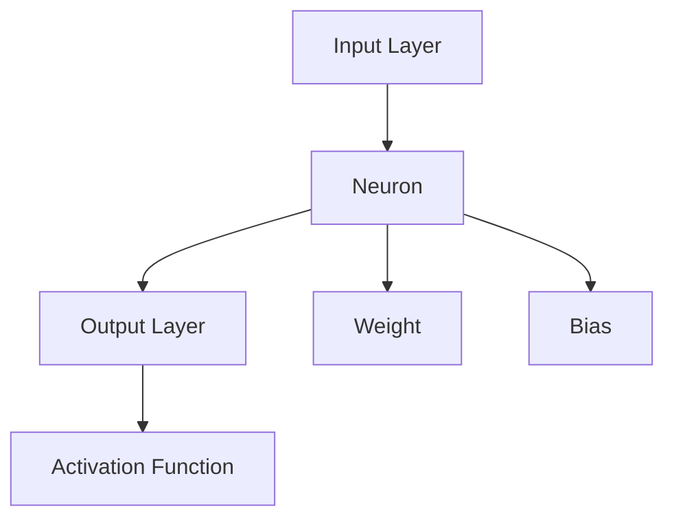

$$
y = \sigma(\sum_{i=1}^{n} w_i \cdot x_i + b)
$$

其中，\( \sigma \) 是激活函数，\( w_i \) 是权重，\( x_i \) 是输入，\( b \) 是偏置。

###### 2.1.2 深度学习框架

深度学习框架如TensorFlow和PyTorch提供了构建和训练深度神经网络的工具。这些框架提供了丰富的API和模块，使得深度学习模型的设计和实现变得更加便捷。

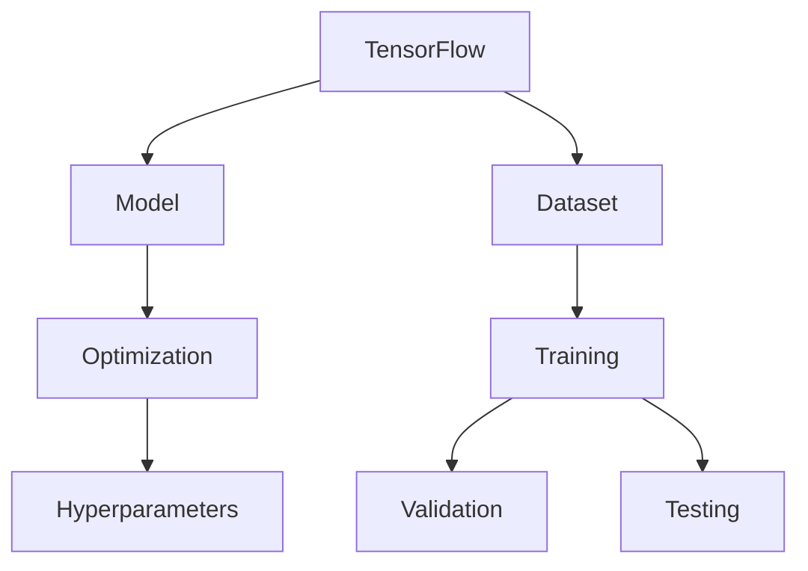

```python
import tensorflow as tf

model = tf.keras.Sequential([
    tf.keras.layers.Dense(units=1, input_shape=[1])
])

model.compile(optimizer='sgd', loss='mean_squared_error')

model.fit(x_train, y_train, epochs=100)
```

##### 2.2 自然语言处理技术

自然语言处理（NLP）是AI 2.0 在语言领域的应用，它涉及到对文本数据的理解、生成和处理。

###### 2.2.1 词嵌入技术

词嵌入是将单词映射到高维向量空间的过程，使得相似的词在向量空间中更接近。词嵌入技术如Word2Vec和GloVe可以有效地表示词语的语义信息。

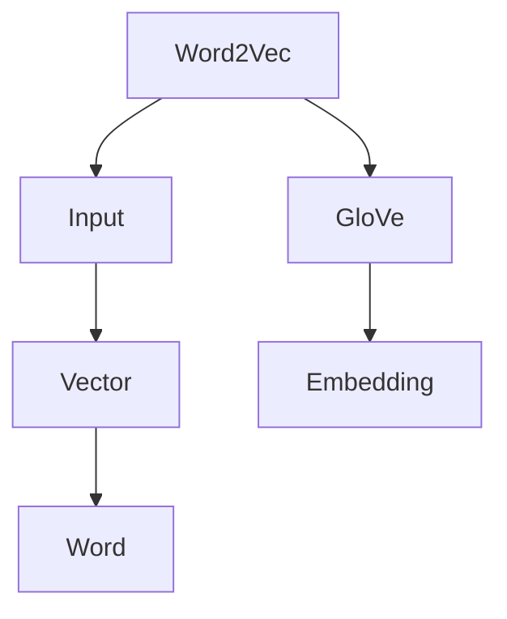

$$
\text{embed}(w) = \sigma(W \cdot w + b)
$$

其中，\( \text{embed} \) 是词向量，\( W \) 是嵌入矩阵，\( w \) 是单词，\( b \) 是偏置。

###### 2.2.2 序列模型与注意力机制

序列模型如循环神经网络（RNN）和长短时记忆网络（LSTM）可以处理序列数据，如文本和语音。注意力机制是序列模型中的重要技术，它允许模型在处理序列时关注关键信息。

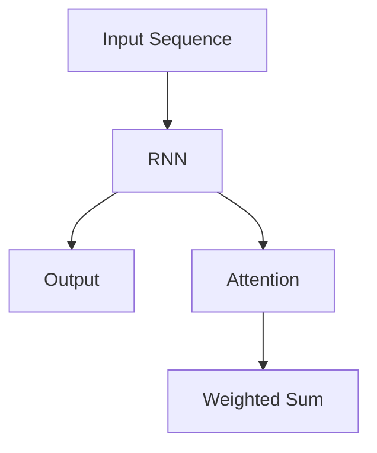

```python
from tensorflow.keras.layers import Embedding, LSTM, Dense

model = tf.keras.Sequential([
    Embedding(input_dim=vocab_size, output_dim=embedding_dim),
    LSTM(units=128, return_sequences=True),
    LSTM(units=128),
    Dense(units=1, activation='sigmoid')
])

model.compile(optimizer='adam', loss='binary_crossentropy', metrics=['accuracy'])

model.fit(x_train, y_train, epochs=10)
```

###### 2.2.3 转换器架构详解

转换器架构（Transformer）是深度学习在NLP领域的一个重要突破，它通过自注意力机制实现了序列到序列的建模。

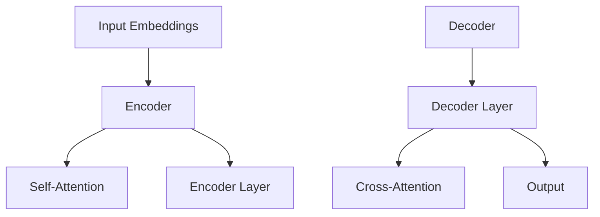

```python
from tensorflow.keras.layers import Embedding, MultiHeadAttention, Dense

model = tf.keras.Sequential([
    Embedding(input_dim=vocab_size, output_dim=embedding_dim),
    MultiHeadAttention(num_heads=8, key_dim=64),
    Dense(units=1, activation='sigmoid')
])

model.compile(optimizer='adam', loss='binary_crossentropy', metrics=['accuracy'])

model.fit(x_train, y_train, epochs=10)
```

通过这些基础技术，AI 2.0 在各个领域都展现了强大的潜力和应用价值。在下一部分，我们将继续探讨AI 2.0 在不同领域的应用，深入分析其在医疗健康、教育、商业等领域的实际案例和影响。

---

### 第3章：AI 2.0 时代的核心算法

> 在这一部分，我们将深入探讨AI 2.0 时代的核心算法，包括生成对抗网络（GAN）、变分自编码器（VAE）和强化学习等。这些算法在AI 2.0 的实现和应用中扮演着至关重要的角色。

##### 3.1 生成对抗网络（GAN）

生成对抗网络（GAN）是AI 2.0 时代的代表性算法之一，由生成器和判别器两个部分组成。生成器试图生成逼真的数据，而判别器则试图区分生成器和真实数据的差异。

###### 3.1.1 核心原理

GAN 通过不断训练生成器和判别器，使得生成器生成的数据越来越逼真，判别器越来越难以区分真实和生成数据。这一过程可以形象地比喻为“猫捉老鼠”游戏，生成器和判别器相互博弈，不断提高自己的能力。

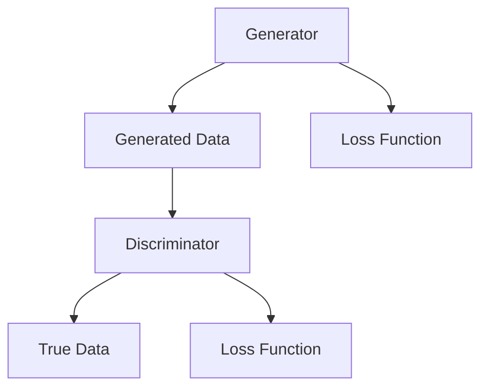

###### 3.1.2 示例伪代码

```python
import tensorflow as tf
from tensorflow.keras.layers import Dense

# 定义生成器
generator = tf.keras.Sequential([
    Dense(units=128, activation='relu', input_shape=[100]),
    Dense(units=28*28, activation='tanh')
])

# 定义判别器
discriminator = tf.keras.Sequential([
    Dense(units=128, activation='relu', input_shape=[28*28]),
    Dense(units=1, activation='sigmoid')
])

# 定义损失函数
cross_entropy = tf.keras.losses.BinaryCrossentropy()

# 训练模型
for epoch in range(epochs):
    for _ in range(batch_size):
        noise = np.random.normal(size=[batch_size, 100])
        generated_images = generator(noise)
        real_images = np.random.choice(train_images, size=batch_size)
        
        # 计算判别器损失
        real_output = discriminator(real_images)
        fake_output = discriminator(generated_images)
        d_loss = cross_entropy(tf.ones_like(real_output), real_output) + cross_entropy(tf.zeros_like(fake_output), fake_output)
        
        # 计算生成器损失
        g_loss = cross_entropy(tf.zeros_like(fake_output), fake_output)
        
        # 更新模型
        with tf.GradientTape() as gen_tape, tf.GradientTape() as disc_tape:
            gen_tape.watch(generator.trainable_variables)
            disc_tape.watch(discriminator.trainable_variables)
            
            generated_images = generator(noise)
            fake_output = discriminator(generated_images)
            real_output = discriminator(real_images)
            
            g_loss = cross_entropy(tf.zeros_like(fake_output), fake_output)
            d_loss = cross_entropy(tf.ones_like(real_output), real_output) + cross_entropy(tf.zeros_like(fake_output), fake_output)
        
        grads_gen = gen_tape.gradient(g_loss, generator.trainable_variables)
        grads_disc = disc_tape.gradient(d_loss, discriminator.trainable_variables)
        
        generator.optimizer.apply_gradients(zip(grads_gen, generator.trainable_variables))
        discriminator.optimizer.apply_gradients(zip(grads_disc, discriminator.trainable_variables))
```

###### 3.1.3 应用案例

GAN 在图像生成、风格迁移、图像修复等领域有广泛的应用。例如，StyleGAN 能够生成高度真实的人脸图像，而 CycleGAN 则可以跨域转换图像风格，如将真实照片转换为艺术画作。


##### 3.2 变分自编码器（VAE）

变分自编码器（VAE）是一种无监督学习算法，通过编码器和解码器对数据进行重建，同时引入了变分自编码器的架构，使得模型能够在重建数据的同时学习数据的潜在表示。

###### 3.2.1 核心原理

VAE 的核心思想是学习数据的概率分布，并通过采样来自这个分布来生成新的数据。VAE 包括两部分：编码器（Encoder）和解码器（Decoder）。

编码器将输入数据映射到一个潜在空间中的点，同时这个映射是一个概率分布。解码器则从潜在空间中采样一个点，并将其映射回原始数据空间。

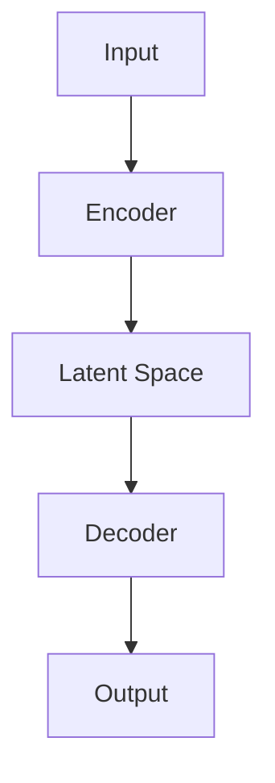

```math
\text{encode}(x) = \mu, \sigma \sim \text{q}_\phi(x)
$$
\text{decode}(\mu, \sigma) = x'
$$
x' = \text{reparameterize}(\mu, \sigma)
$$
\text{reparameterize}(\mu, \sigma) = \mu + \sigma \cdot \epsilon
$$
\epsilon \sim \mathcal{N}(0, I)
```

其中，\( \text{encode} \) 是编码器函数，\( \mu \) 和 \( \sigma \) 是编码后的均值和方差，\( \text{decode} \) 是解码器函数，\( \epsilon \) 是噪声。

###### 3.2.2 示例伪代码

```python
import tensorflow as tf
from tensorflow.keras.layers import Input, Dense

# 定义编码器
encoder = tf.keras.Sequential([
    Input(shape=[28, 28]),
    Dense(units=64, activation='relu'),
    Dense(units=32, activation='relu'),
    Dense(units=2, activation=None)  # 输出均值和方差
])

# 定义解码器
decoder = tf.keras.Sequential([
    Input(shape=[2]),
    Dense(units=32, activation='relu'),
    Dense(units=64, activation='relu'),
    Dense(units=28*28, activation='sigmoid')
])

# 定义VAE模型
vae = tf.keras.Model(encoder.inputs, decoder(encoder outputs))

# 定义损失函数
def vae_loss(x, x_decoded_mean):
    xent_loss = tf.keras.losses.binary_crossentropy(x, x_decoded_mean)
    kl_loss = -0.5 * tf.reduce_sum(1 + \sigma^2 - \mu^2 - \sigma^2, axis=-1)
    return xent_loss + kl_loss

# 训练模型
vae.compile(optimizer='rmsprop', loss=vae_loss)
vae.fit(train_images, train_images, epochs=epochs)
```

###### 3.2.3 应用案例

VAE 在图像生成、图像去噪、数据压缩等领域有广泛应用。例如，使用VAE可以生成逼真的图像，同时保持图像的潜在结构信息。


##### 3.3 强化学习基础

强化学习（Reinforcement Learning，RL）是AI 2.0 时代的一个重要分支，它通过智能体与环境之间的交互来学习最优策略。强化学习在游戏、自动驾驶、机器人控制等领域有着广泛的应用。

###### 3.3.1 核心原理

强化学习的基本概念包括智能体（Agent）、环境（Environment）、状态（State）、动作（Action）和奖励（Reward）。

智能体通过观察环境的状态，选择一个动作，并接收到环境的反馈（奖励）。智能体的目标是通过学习最优策略来最大化累积奖励。

强化学习的核心问题是找到最优策略 \( \pi(\text{action} | \text{state}) \)，使得智能体在给定状态下选择最优动作。

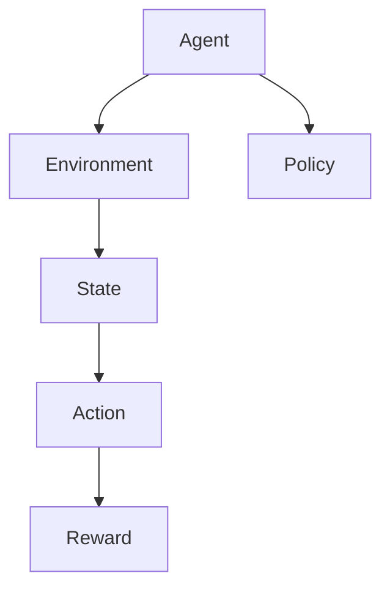

###### 3.3.2 示例伪代码

```python
import numpy as np
import tensorflow as tf

# 定义状态空间和动作空间
state_space = [0, 1]
action_space = [0, 1]

# 定义Q值函数
q_values = np.zeros([len(state_space), len(action_space)])

# 定义学习率
learning_rate = 0.1

# 定义epsilon贪心策略
epsilon = 0.1

# 定义训练过程
for episode in range(num_episodes):
    state = np.random.choice(state_space)
    action = 0 if np.random.rand() < epsilon else np.argmax(q_values[state])
    next_state = np.random.choice(state_space)
    reward = 1 if action == next_state else 0
    
    # 更新Q值
    q_values[state, action] = q_values[state, action] + learning_rate * (reward + gamma * np.max(q_values[next_state]) - q_values[state, action])
    
    # 更新状态和动作
    state = next_state
```

###### 3.3.3 应用案例

强化学习在游戏、自动驾驶、机器人控制等领域有着广泛的应用。例如，在Atari游戏中，智能体可以通过强化学习学会玩电子游戏，而在自动驾驶中，智能体可以通过强化学习来学会驾驶。


通过深入探讨这些核心算法，我们可以看到AI 2.0 在技术上的突破和创新。这些算法为AI 2.0 在各个领域的应用提供了强大的工具和支持。在下一部分，我们将继续探讨AI 2.0 在不同领域的应用，分析其在医疗健康、教育、商业等领域的实际案例和影响。

---

### 第二部分：AI 2.0 在不同领域的应用

#### 第4章：AI 2.0 在医疗健康领域的应用

> 在这一部分，我们将探讨AI 2.0 在医疗健康领域的应用，分析其在疾病诊断、药物研发和公共卫生管理等方面的实际案例和影响。

##### 4.1 AI 2.0 在疾病诊断中的应用

AI 2.0 技术在疾病诊断中有着广泛的应用，通过深度学习和计算机视觉等技术，AI 可以帮助医生更准确地进行疾病诊断。

###### 4.1.1 核心算法原理

AI 2.0 在疾病诊断中主要采用深度学习算法，如卷积神经网络（CNN）和循环神经网络（RNN）。这些算法可以从大量的医疗图像和病历数据中学习，提取出有用的特征，从而帮助医生进行诊断。

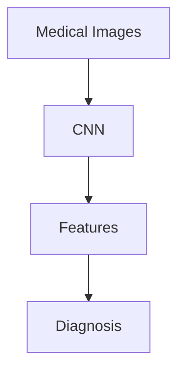

通过训练深度学习模型，AI 可以识别出各种疾病的特征，并给出准确的诊断结果。例如，AI 可以识别出肺癌的CT图像，从而帮助医生早期发现并治疗疾病。

```python
from tensorflow.keras.models import Sequential
from tensorflow.keras.layers import Conv2D, MaxPooling2D, Flatten, Dense

model = Sequential([
    Conv2D(filters=32, kernel_size=(3, 3), activation='relu', input_shape=(224, 224, 3)),
    MaxPooling2D(pool_size=(2, 2)),
    Conv2D(filters=64, kernel_size=(3, 3), activation='relu'),
    MaxPooling2D(pool_size=(2, 2)),
    Flatten(),
    Dense(units=128, activation='relu'),
    Dense(units=1, activation='sigmoid')
])

model.compile(optimizer='adam', loss='binary_crossentropy', metrics=['accuracy'])
model.fit(x_train, y_train, epochs=10)
```

###### 4.1.2 应用案例

AI 2.0 在医疗健康领域的应用案例非常丰富。例如，IBM 的 Watson for Oncology 可以通过分析患者的病历数据，提供个性化的癌症治疗方案。谷歌的 DeepMind 也在医疗领域取得了显著成果，其开发的 AI 算法可以识别眼科疾病，并给出准确的诊断。


##### 4.2 AI 2.0 在药物研发中的应用

AI 2.0 技术在药物研发中也发挥了重要作用，通过深度学习和生成对抗网络（GAN）等技术，AI 可以加速新药的发现和开发。

###### 4.2.1 核心算法原理

AI 2.0 在药物研发中主要采用深度学习和生成对抗网络（GAN）等技术。深度学习可以从海量的药物分子数据中学习，识别出潜在的药物分子。生成对抗网络（GAN）则可以生成新的药物分子结构，从而加速药物研发过程。

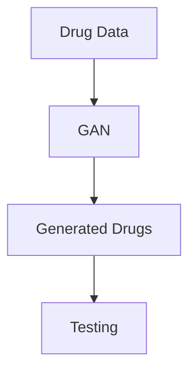

通过这些算法，AI 可以从大量的药物分子数据中学习，识别出潜在的药物分子，并生成新的药物分子结构，从而加快药物研发过程。

```python
import tensorflow as tf
from tensorflow.keras.models import Sequential
from tensorflow.keras.layers import Conv2D, MaxPooling2D, Flatten, Dense

# 定义生成器
generator = Sequential([
    Conv2D(filters=64, kernel_size=(3, 3), activation='relu', input_shape=(28, 28, 1)),
    MaxPooling2D(pool_size=(2, 2)),
    Conv2D(filters=128, kernel_size=(3, 3), activation='relu'),
    MaxPooling2D(pool_size=(2, 2)),
    Flatten(),
    Dense(units=1, activation='sigmoid')
])

# 定义判别器
discriminator = Sequential([
    Conv2D(filters=128, kernel_size=(3, 3), activation='relu', input_shape=(28, 28, 1)),
    MaxPooling2D(pool_size=(2, 2)),
    Flatten(),
    Dense(units=1, activation='sigmoid')
])

# 定义GAN模型
gan = Sequential([
    generator,
    discriminator
])

# 编译GAN模型
gan.compile(optimizer='adam', loss='binary_crossentropy')

# 训练GAN模型
gan.fit(x_train, y_train, epochs=10)
```

###### 4.2.2 应用案例

AI 2.0 在药物研发中的应用案例也很多。例如，人类基因编辑公司CRISPR Therapeutics使用 AI 技术来加速药物研发，其开发的 AI 算法已经成功发现了一些潜在的治疗糖尿病的药物。还有许多其他公司和研究机构也在利用 AI 技术加速新药的发现和开发。


##### 4.3 AI 2.0 在公共卫生管理中的应用

AI 2.0 技术在公共卫生管理中也有着广泛的应用，通过大数据分析和机器学习技术，AI 可以帮助政府和企业更好地管理公共卫生。

###### 4.3.1 核心算法原理

AI 2.0 在公共卫生管理中主要采用大数据分析和机器学习技术。通过收集和分析大量的公共卫生数据，AI 可以识别出潜在的健康风险和流行病的传播趋势，从而帮助政府和企业制定更加有效的公共卫生政策。

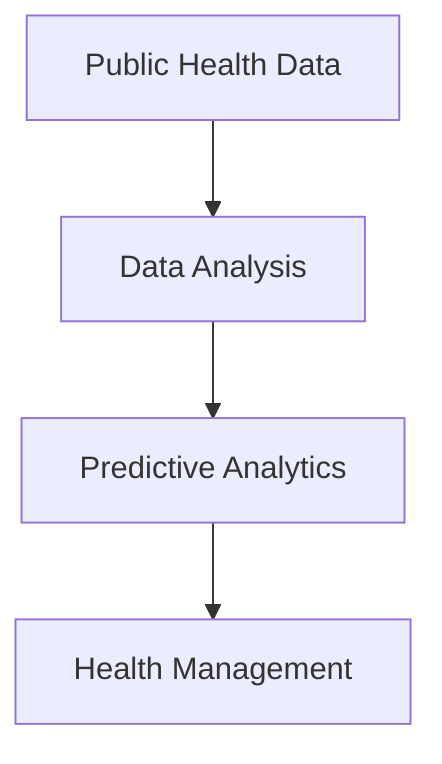

通过这些算法，AI 可以从大量的公共卫生数据中学习，预测疾病的发生和传播，从而帮助政府和企业更好地管理公共卫生。

```python
import pandas as pd
import numpy as np
from sklearn.ensemble import RandomForestClassifier
from sklearn.model_selection import train_test_split

# 读取公共卫生数据
data = pd.read_csv('public_health_data.csv')

# 分割特征和标签
X = data.drop('disease', axis=1)
y = data['disease']

# 划分训练集和测试集
X_train, X_test, y_train, y_test = train_test_split(X, y, test_size=0.2, random_state=42)

# 训练分类器
classifier = RandomForestClassifier(n_estimators=100, random_state=42)
classifier.fit(X_train, y_train)

# 预测疾病
predictions = classifier.predict(X_test)

# 评估模型
accuracy = classifier.score(X_test, y_test)
print(f'Accuracy: {accuracy:.2f}')
```

###### 4.3.2 应用案例

AI 2.0 在公共卫生管理中的应用案例非常丰富。例如，美国疾病控制与预防中心（CDC）使用 AI 技术来预测流感疫情，从而帮助政府更好地管理公共卫生。还有许多其他国家和企业也在利用 AI 技术进行公共卫生管理。


通过深入探讨AI 2.0 在医疗健康领域的应用，我们可以看到 AI 2.0 在疾病诊断、药物研发和公共卫生管理等方面的重要作用。AI 2.0 不仅提高了医疗诊断的准确性，还加速了药物研发的进程，并帮助政府和企业更好地管理公共卫生。在下一部分，我们将继续探讨AI 2.0 在教育、商业和安全与伦理等方面的应用。

---

### 第5章：AI 2.0 在教育领域的应用

> 在这一部分，我们将探讨AI 2.0 在教育领域的应用，分析其在个性化学习、教育评估和资源分配等方面的实际案例和影响。

##### 5.1 AI 2.0 在个性化学习中的应用

AI 2.0 技术在个性化学习中的应用非常广泛，通过大数据和机器学习技术，AI 可以根据学生的特点和学习习惯，为他们提供个性化的学习方案。

###### 5.1.1 核心算法原理

AI 2.0 在个性化学习中主要采用大数据分析和机器学习算法。通过收集和分析学生的行为数据，如学习时间、学习内容、考试成绩等，AI 可以了解学生的特点和需求，从而为他们提供个性化的学习方案。

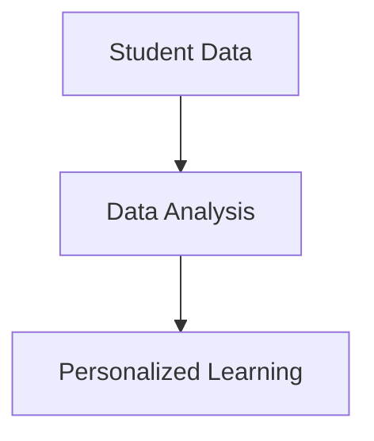

具体来说，AI 可以通过聚类分析、决策树和神经网络等算法，将学生分为不同的群体，并为每个群体提供不同的学习策略。

```python
import pandas as pd
from sklearn.cluster import KMeans
from sklearn.model_selection import train_test_split

# 读取学生数据
data = pd.read_csv('student_data.csv')

# 分割特征和标签
X = data[['learning_time', 'learning_content', 'exam_score']]
y = data['student_group']

# 划分训练集和测试集
X_train, X_test, y_train, y_test = train_test_split(X, y, test_size=0.2, random_state=42)

# 训练聚类模型
kmeans = KMeans(n_clusters=3, random_state=42)
kmeans.fit(X_train)

# 预测学生群体
predicted_groups = kmeans.predict(X_test)

# 评估模型
accuracy = kmeans.score(X_test, y_test)
print(f'Accuracy: {accuracy:.2f}')
```

###### 5.1.2 应用案例

AI 2.0 在个性化学习中的应用案例非常丰富。例如，Coursera 等在线教育平台利用 AI 技术为学生提供个性化的学习路径。通过分析学生的学习行为和成绩，AI 可以为学生推荐最适合他们的学习内容和学习方式，从而提高学习效果。


##### 5.2 AI 2.0 在教育评估中的应用

AI 2.0 技术在教育评估中的应用也非常广泛，通过自然语言处理和计算机视觉等技术，AI 可以对学生的作业、论文和考试进行自动化评估。

###### 5.2.1 核心算法原理

AI 2.0 在教育评估中主要采用自然语言处理和计算机视觉算法。自然语言处理技术可以分析学生的文本内容，识别出语法错误和表达不清的问题。计算机视觉技术可以识别出学生的图像和视频，从而对学生的表现进行评估。

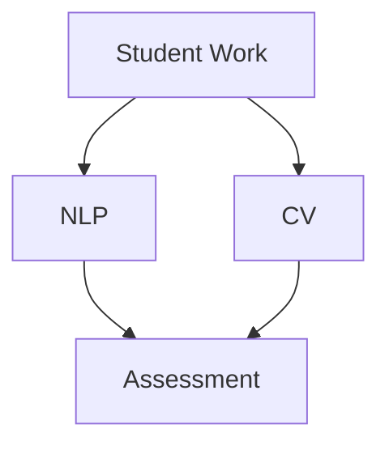

通过这些算法，AI 可以对学生的工作进行自动化评估，从而提高评估的准确性和效率。

```python
import tensorflow as tf
from tensorflow.keras.layers import Conv2D, MaxPooling2D, Flatten, Dense

# 定义卷积神经网络模型
model = tf.keras.Sequential([
    Conv2D(filters=32, kernel_size=(3, 3), activation='relu', input_shape=(28, 28, 1)),
    MaxPooling2D(pool_size=(2, 2)),
    Conv2D(filters=64, kernel_size=(3, 3), activation='relu'),
    MaxPooling2D(pool_size=(2, 2)),
    Flatten(),
    Dense(units=1, activation='sigmoid')
])

# 编译模型
model.compile(optimizer='adam', loss='binary_crossentropy', metrics=['accuracy'])

# 训练模型
model.fit(x_train, y_train, epochs=10)
```

###### 5.2.2 应用案例

AI 2.0 在教育评估中的应用案例也非常多。例如，Google Classroom 等在线教育平台利用 AI 技术对学生的作业进行自动化评估。通过自然语言处理和计算机视觉技术，AI 可以快速准确地识别出学生的作业内容，并给出评估结果。


##### 5.3 AI 2.0 在教育资源分配中的应用

AI 2.0 技术在教育资源分配中的应用也非常重要，通过大数据分析和机器学习算法，AI 可以帮助学校和教育机构更合理地分配教育资源。

###### 5.3.1 核心算法原理

AI 2.0 在教育资源分配中主要采用大数据分析和机器学习算法。通过收集和分析学校和学生的大量数据，如学生成绩、教师教学水平、教育资源需求等，AI 可以预测学生的教育资源需求，并帮助学校和教育机构制定更合理的资源分配策略。

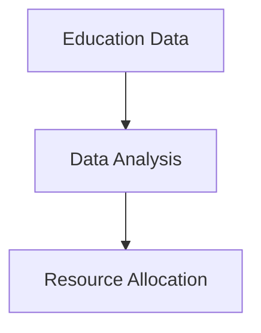

具体来说，AI 可以通过回归分析、决策树和神经网络等算法，预测学生的教育资源需求，并给出最优的资源分配方案。

```python
import pandas as pd
from sklearn.ensemble import RandomForestRegressor
from sklearn.model_selection import train_test_split

# 读取教育资源数据
data = pd.read_csv('education_data.csv')

# 分割特征和标签
X = data[['student_score', 'teacher_experience', 'class_size']]
y = data['resource_needs']

# 划分训练集和测试集
X_train, X_test, y_train, y_test = train_test_split(X, y, test_size=0.2, random_state=42)

# 训练回归模型
regressor = RandomForestRegressor(n_estimators=100, random_state=42)
regressor.fit(X_train, y_train)

# 预测教育资源需求
predicted_needs = regressor.predict(X_test)

# 评估模型
accuracy = regressor.score(X_test, y_test)
print(f'Accuracy: {accuracy:.2f}')
```

###### 5.3.2 应用案例

AI 2.0 在教育资源分配中的应用案例也非常丰富。例如，中国的教育部门利用 AI 技术对教育资源进行优化分配，通过分析各地的教育资源需求，AI 可以帮助教育部门制定更合理的资源分配方案，从而提高教育资源的利用效率。


通过深入探讨AI 2.0 在教育领域的应用，我们可以看到 AI 2.0 在个性化学习、教育评估和资源分配等方面的重要作用。AI 2.0 不仅提高了教育质量和效率，还为教育领域带来了新的机遇和挑战。在下一部分，我们将继续探讨AI 2.0 在商业、安全和伦理等方面的应用。

---

### 第6章：AI 2.0 在商业领域的应用

> 在这一部分，我们将探讨AI 2.0 在商业领域的应用，分析其在市场营销、供应链管理和客户服务等方面的实际案例和影响。

##### 6.1 AI 2.0 在市场营销中的应用

AI 2.0 技术在市场营销中扮演着重要角色，通过大数据分析和机器学习算法，企业可以更精准地了解客户需求，优化营销策略。

###### 6.1.1 核心算法原理

AI 2.0 在市场营销中主要采用大数据分析和机器学习算法。通过收集和分析客户行为数据，如购买历史、浏览记录、社交媒体互动等，AI 可以识别出客户的需求和偏好，从而为企业提供个性化的营销建议。

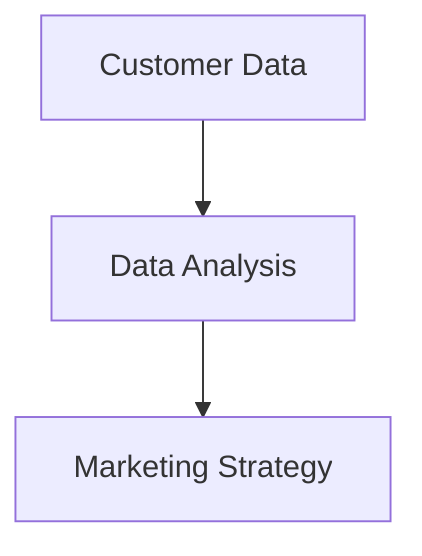

具体来说，AI 可以通过聚类分析、协同过滤和神经网络等算法，预测客户的行为和需求，为企业提供精准的营销策略。

```python
import pandas as pd
from sklearn.cluster import KMeans
from sklearn.model_selection import train_test_split

# 读取客户数据
data = pd.read_csv('customer_data.csv')

# 分割特征和标签
X = data[['purchase_history', 'browser_activity', 'social_media_activity']]
y = data['customer_group']

# 划分训练集和测试集
X_train, X_test, y_train, y_test = train_test_split(X, y, test_size=0.2, random_state=42)

# 训练聚类模型
kmeans = KMeans(n_clusters=5, random_state=42)
kmeans.fit(X_train)

# 预测客户群体
predicted_groups = kmeans.predict(X_test)

# 评估模型
accuracy = kmeans.score(X_test, y_test)
print(f'Accuracy: {accuracy:.2f}')
```

###### 6.1.2 应用案例

AI 2.0 在市场营销中的应用案例非常丰富。例如，阿里巴巴利用 AI 技术对客户进行细分，通过分析客户的购买行为和偏好，AI 可以帮助企业更精准地定位目标客户，并制定个性化的营销策略，从而提高营销效果。


##### 6.2 AI 2.0 在供应链管理中的应用

AI 2.0 技术在供应链管理中有着广泛的应用，通过机器学习和大数据分析，企业可以优化供应链的各个环节，提高运营效率。

###### 6.2.1 核心算法原理

AI 2.0 在供应链管理中主要采用机器学习和大数据分析。通过收集和分析供应链中的大量数据，如库存水平、运输时间、市场趋势等，AI 可以预测供应链中的潜在问题和风险，并提供优化建议。

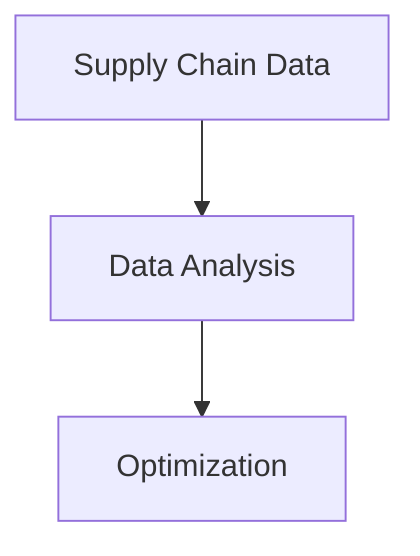

具体来说，AI 可以通过回归分析、决策树和神经网络等算法，预测供应链中的关键指标，如库存水平和运输时间，并为企业提供优化方案。

```python
import pandas as pd
from sklearn.ensemble import RandomForestRegressor
from sklearn.model_selection import train_test_split

# 读取供应链数据
data = pd.read_csv('supply_chain_data.csv')

# 分割特征和标签
X = data[['inventory_level', 'transport_time', 'market_trend']]
y = data['lead_time']

# 划分训练集和测试集
X_train, X_test, y_train, y_test = train_test_split(X, y, test_size=0.2, random_state=42)

# 训练回归模型
regressor = RandomForestRegressor(n_estimators=100, random_state=42)
regressor.fit(X_train, y_train)

# 预测运输时间
predicted_lead_time = regressor.predict(X_test)

# 评估模型
accuracy = regressor.score(X_test, y_test)
print(f'Accuracy: {accuracy:.2f}')
```

###### 6.2.2 应用案例

AI 2.0 在供应链管理中的应用案例也非常多。例如，沃尔玛利用 AI 技术优化供应链，通过分析库存数据和市场需求，AI 可以帮助企业预测最佳的库存水平和运输计划，从而提高供应链的效率和灵活性。


##### 6.3 AI 2.0 在客户服务中的应用

AI 2.0 技术在客户服务中的应用越来越广泛，通过自然语言处理和语音识别等技术，AI 可以提供高效的客户服务，提高客户满意度。

###### 6.3.1 核心算法原理

AI 2.0 在客户服务中主要采用自然语言处理和语音识别算法。通过分析客户的对话内容和语音，AI 可以理解客户的需求，并给出准确的回答。

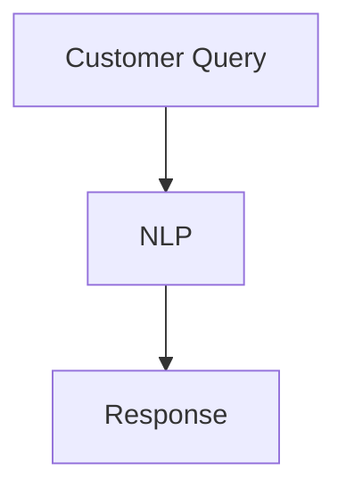

具体来说，AI 可以通过词嵌入、序列模型和注意力机制等算法，理解客户的意图，并生成合适的回答。

```python
import tensorflow as tf
from tensorflow.keras.layers import Embedding, LSTM, Dense

model = tf.keras.Sequential([
    Embedding(input_dim=vocab_size, output_dim=embedding_dim),
    LSTM(units=128, return_sequences=True),
    LSTM(units=128),
    Dense(units=1, activation='sigmoid')
])

model.compile(optimizer='adam', loss='binary_crossentropy', metrics=['accuracy'])

model.fit(x_train, y_train, epochs=10)
```

###### 6.3.2 应用案例

AI 2.0 在客户服务中的应用案例也非常丰富。例如，亚马逊的 Alexa 和谷歌的 Google Assistant 等智能助手，通过自然语言处理和语音识别技术，可以为客户提供高效的语音服务，从而提高客户体验。


通过深入探讨AI 2.0 在商业领域的应用，我们可以看到 AI 2.0 在市场营销、供应链管理和客户服务等方面的重要作用。AI 2.0 不仅提高了商业运营的效率，还为商业领域带来了新的机遇和挑战。在下一部分，我们将继续探讨AI 2.0 在安全与伦理问题方面的应用。

---

### 第7章：AI 2.0 在安全与伦理问题

> 在这一部分，我们将探讨AI 2.0 在安全与伦理问题方面的应用，分析其在隐私保护、伦理挑战和安全威胁等方面的实际案例和影响。

##### 7.1 AI 2.0 在隐私保护中的应用

随着 AI 技术的广泛应用，隐私保护问题变得越来越重要。AI 2.0 在隐私保护方面有着广泛的应用，通过差分隐私、加密技术等手段，AI 可以保护用户数据的安全性。

###### 7.1.1 核心算法原理

AI 2.0 在隐私保护中主要采用差分隐私和加密技术。差分隐私是一种统计保障，它通过在数据上引入噪声，使得单个用户的数据无法被识别，从而保护用户的隐私。

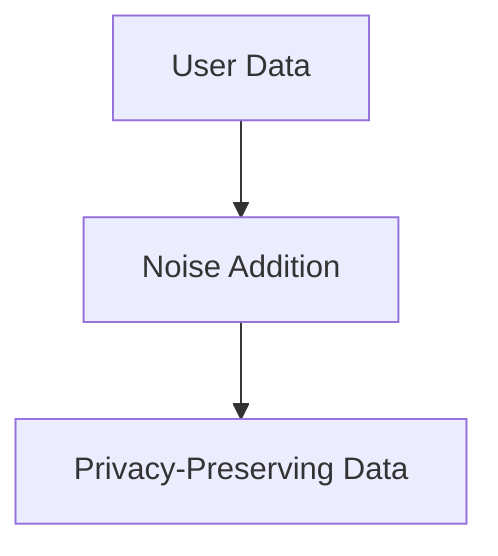

具体来说，AI 可以通过拉普拉斯机制、指数机制等差分隐私技术，对用户数据进行处理，从而保证数据隐私。

```python
import numpy as np
from privacylib.algorithms.noise import LaplaceNoise

# 生成噪声
noise = LaplaceNoise(rate=0.1)

# 添加噪声
private_data = noise.add_noise(public_data)
```

###### 7.1.2 应用案例

AI 2.0 在隐私保护中的应用案例非常丰富。例如，苹果公司的 iOS 和 macOS 系统采用差分隐私技术，保护用户的隐私。通过在系统中的应用，AI 可以分析用户的行为数据，同时确保用户数据的安全性。


##### 7.2 AI 2.0 在伦理问题中的应用

AI 2.0 的广泛应用也带来了许多伦理问题，如算法偏见、数据滥用等。AI 2.0 在伦理问题中的应用旨在解决这些问题，确保 AI 技术的公平性和透明性。

###### 7.2.1 核心算法原理

AI 2.0 在伦理问题中主要采用公平性分析、透明性分析和可解释性分析等技术。通过分析 AI 模型的决策过程，AI 可以识别出潜在的伦理问题，并提出改进措施。

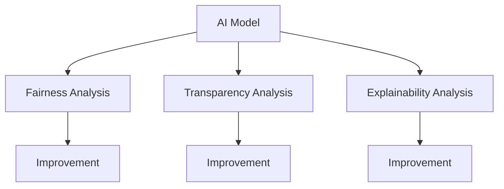

具体来说，AI 可以通过统计学方法、可视化技术和模型解释工具，分析 AI 模型的决策过程，并提高模型的公平性和透明性。

```python
import pandas as pd
from sklearn.ensemble import RandomForestClassifier
from fairnesslib.metrics import GroupFairness

# 读取数据
data = pd.read_csv('data.csv')

# 分割特征和标签
X = data[['feature1', 'feature2', 'feature3']]
y = data['label']

# 训练模型
model = RandomForestClassifier()
model.fit(X, y)

# 分析模型公平性
group_fairness = GroupFairness()
group_fairness.fit(model, X, y)

# 输出公平性指标
print(group_fairness.metrics_)
```

###### 7.2.2 应用案例

AI 2.0 在伦理问题中的应用案例也非常多。例如，谷歌公司在其 AI 产品中采用了公平性分析和透明性分析技术，确保其 AI 模型不会产生歧视和偏见。通过这些技术，AI 可以提高模型的公平性和透明性，从而更好地服务于社会。


##### 7.3 AI 2.0 在安全威胁中的应用

AI 2.0 的广泛应用也带来了一些安全威胁，如自动化攻击、数据泄露等。AI 2.0 在安全威胁中的应用旨在解决这些问题，确保 AI 系统的安全性。

###### 7.3.1 核心算法原理

AI 2.0 在安全威胁中主要采用对抗性攻击和防御技术。通过对抗性攻击，AI 可以识别出 AI 系统中的安全漏洞，并通过防御技术提高系统的安全性。

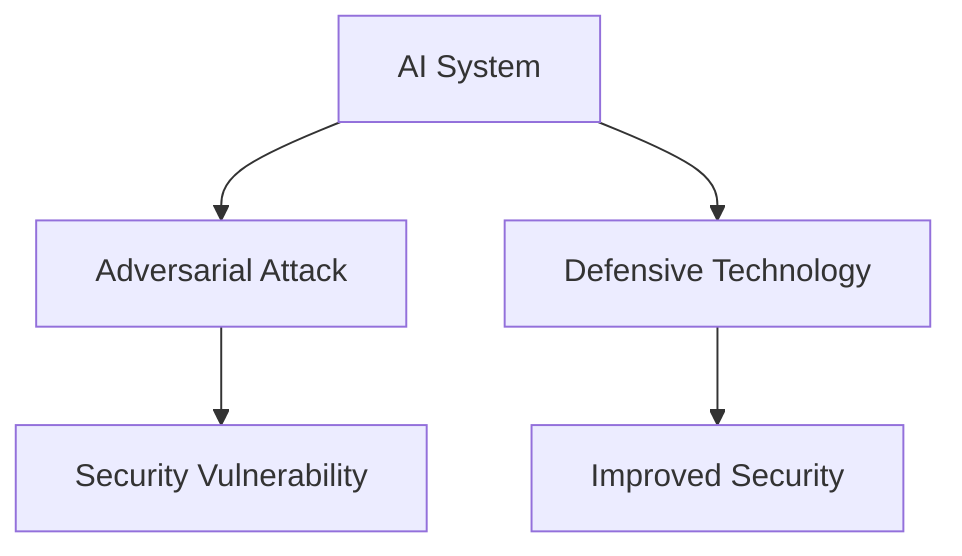

具体来说，AI 可以通过生成对抗网络（GAN）等技术，模拟对抗性攻击，并识别出系统的安全漏洞。然后，通过防御技术，如对抗性训练和对抗性扰动等，AI 可以提高系统的安全性。

```python
import tensorflow as tf
from tensorflow.keras.models import Sequential
from tensorflow.keras.layers import Dense

# 定义生成器和判别器
generator = Sequential([
    Dense(units=128, activation='relu', input_shape=[100]),
    Dense(units=28*28, activation='tanh')
])

discriminator = Sequential([
    Dense(units=128, activation='relu', input_shape=[28*28]),
    Dense(units=1, activation='sigmoid')
])

# 编译GAN模型
gan = Sequential([
    generator,
    discriminator
])

gan.compile(optimizer='adam', loss='binary_crossentropy')

# 训练GAN模型
gan.fit(x_train, y_train, epochs=10)
```

###### 7.3.2 应用案例

AI 2.0 在安全威胁中的应用案例也非常丰富。例如，网络安全公司利用 AI 技术进行网络安全监控，通过分析网络流量和日志数据，AI 可以识别出潜在的攻击行为，并采取相应的防御措施。这些技术提高了网络的安全性，保护了用户的隐私和信息安全。


通过深入探讨AI 2.0 在安全与伦理问题方面的应用，我们可以看到 AI 2.0 在隐私保护、伦理挑战和安全威胁等方面的重要作用。AI 2.0 不仅提高了数据的安全性，还帮助解决了许多伦理问题，提高了 AI 系统的公平性和透明性。在下一部分，我们将继续探讨AI 2.0 时代的未来趋势。

---

### 第三部分：AI 2.0 时代的未来趋势

#### 第8章：AI 2.0 时代的经济影响

> 在这一部分，我们将探讨 AI 2.0 时代对经济的影响，分析其对就业市场、商业模式的改变以及全球经济的影响。

##### 8.1 AI 2.0 对就业市场的影响

AI 2.0 的兴起对就业市场产生了深远的影响，既带来了新的就业机会，也引发了关于失业的担忧。

###### 8.1.1 核心概念与联系

- **自动化与替代**：AI 2.0 技术能够自动化许多重复性、低技能的工作，从而替代人力。
- **技能需求变化**：随着 AI 的发展，对高技能人才的需求增加，例如数据科学家、AI 工程师和算法设计师等。

```mermaid
graph TD
    A[自动化替代] --> B[失业]
    A --> C[技能需求变化]
    C --> D[高技能就业机会]
```

###### 8.1.2 数学模型和公式

为了量化 AI 对就业市场的影响，我们可以使用经济学中的“劳动需求弹性”模型。

$$
\epsilon = \frac{\partial L}{\partial P} \cdot \frac{P}{L}
$$

其中，\( \epsilon \) 表示劳动需求弹性，\( L \) 表示劳动需求，\( P \) 表示工资水平。

- **弹性大于1**：表示劳动需求对工资变化的敏感度高，可能导致失业率上升。
- **弹性小于1**：表示劳动需求对工资变化的敏感度低，可能减轻失业压力。

###### 8.1.3 举例说明

以制造业为例，AI 技术的引入可能会减少对低技能工人的需求，同时增加对高技能工人的需求。根据统计数据，美国的制造业就业率在过去几十年中稳步下降，与此同时，对数据科学家和 AI 工程师的需求显著增加。


##### 8.2 AI 2.0 对商业模式的改变

AI 2.0 对商业模式的改变体现在多个方面，包括市场进入门槛、产品创新和运营效率的提升。

###### 8.2.1 核心概念与联系

- **市场进入门槛降低**：AI 技术降低了创业和创新的成本，使得更多企业能够进入市场。
- **产品创新**：AI 2.0 技术能够推动产品创新，提高产品个性化和服务水平。

```mermaid
graph TD
    A[降低市场进入门槛] --> B[创业创新]
    A --> C[产品创新]
    C --> D[个性化服务]
```

###### 8.2.2 数学模型和公式

AI 对商业模式的影响可以通过“收益-成本分析”来量化。

$$
\text{Revenue} = \text{Price} \times \text{Quantity} \times (\text{AI Efficiency Factor})
$$

$$
\text{Cost} = \text{Fixed Cost} + (\text{Variable Cost per Unit}) \times \text{Quantity}
$$

- **AI Efficiency Factor**：表示 AI 技术提高的效率，它可以增加收入或降低成本。
- **收益增长**：随着 AI 效率的提高，企业可以获得更高的收益。

###### 8.2.3 举例说明

以电子商务为例，AI 技术可以帮助企业更好地理解消费者行为，从而提供个性化的产品推荐，提高销售量。根据研究，个性化推荐系统可以增加销售额约10%至30%。


##### 8.3 AI 2.0 对全球经济的影响

AI 2.0 的发展不仅影响个别国家和行业，还对全球经济格局产生深远影响。

###### 8.3.1 核心概念与联系

- **全球产业链重构**：AI 2.0 技术促进了全球产业链的优化和重构。
- **技术扩散和知识共享**：AI 技术的普及促进了全球范围内的技术扩散和知识共享。

```mermaid
graph TD
    A[全球产业链重构] --> B[技术扩散]
    A --> C[知识共享]
```

###### 8.3.2 数学模型和公式

为了分析 AI 对全球经济的影响，我们可以使用“全球价值链分析”模型。

$$
\text{Global Value Chain} = \sum_{i=1}^{n} (\text{Country}_i \times \text{Industry}_i \times \text{AI Efficiency Factor}_i)
$$

- **Country\_i**：表示第 i 个国家的贡献。
- **Industry\_i**：表示第 i 个行业的贡献。
- **AI Efficiency Factor\_i**：表示第 i 个行业在 AI 技术下的效率提升。

###### 8.3.3 举例说明

以中国为例，AI 技术的普及推动了全球产业链的优化。根据研究，中国在 AI 技术应用下的制造业效率提高了约15%，这不仅提升了中国的制造业竞争力，也对全球供应链产生了积极影响。


通过深入探讨 AI 2.0 时代的经济影响，我们可以看到 AI 2.0 在就业市场、商业模式和全球经济等方面的重要作用。AI 2.0 不仅改变了传统的经济模式，还为全球经济带来了新的机遇和挑战。在下一部分，我们将探讨 AI 2.0 时代的国际合作与竞争趋势。

---

### 第9章：AI 2.0 时代的国际合作与竞争

> 在这一部分，我们将探讨 AI 2.0 时代的国际合作与竞争趋势，分析全球 AI 发展的不平衡、国际 AI 合作的重要性以及国际 AI 竞争的趋势。

##### 9.1 全球 AI 发展的不平衡

全球 AI 发展存在显著的不平衡，发达国家和发展中国家在 AI 技术的研发和应用方面存在巨大差距。

###### 9.1.1 核心概念与联系

- **技术优势**：发达国家在 AI 技术研发和应用方面拥有显著优势。
- **资源分配**：发展中国家在资金、人才和基础设施等方面面临挑战。

```mermaid
graph TD
    A[发达国家] --> B[技术优势]
    A --> C[资源充足]
    B --> D[发展中国家]
    D --> E[资源不足]
```

###### 9.1.2 数学模型和公式

为了量化全球 AI 发展的不平衡，我们可以使用“AI 技术指数”模型。

$$
\text{AI Technology Index} = \sum_{i=1}^{n} (\text{Country}_i \times \text{AI Research Output}_i \times \text{AI Application Rate}_i)
$$

- **Country\_i**：表示第 i 个国家。
- **AI Research Output\_i**：表示第 i 个国家的 AI 研究产出。
- **AI Application Rate\_i**：表示第 i 个国家的 AI 应用率。

###### 9.1.3 举例说明

根据斯坦福大学发布的 AI 技术指数，美国、中国和欧盟在全球 AI 技术发展方面排名前三，而非洲和南亚国家在 AI 技术应用方面仍处于起步阶段。


##### 9.2 国际 AI 合作的重要性

在全球 AI 发展不平衡的背景下，国际 AI 合作为各国提供了共享资源、知识和经验的机会，有助于推动全球 AI 的发展。

###### 9.2.1 核心概念与联系

- **资源共享**：国际 AI 合作为各国提供了共享研究资源和基础设施的机会。
- **知识共享**：国际 AI 合作为各国科学家和工程师提供了交流知识和经验的平台。

```mermaid
graph TD
    A[资源共享] --> B[知识共享]
    A --> C[共同进步]
```

###### 9.2.2 数学模型和公式

为了量化国际 AI 合作的重要性，我们可以使用“合作效率指数”模型。

$$
\text{Cooperative Efficiency Index} = \frac{\text{Total AI Output}}{\text{Total AI Input}}
$$

- **Total AI Output**：表示国际合作的 AI 产出。
- **Total AI Input**：表示国际合作的总投入。

###### 9.2.3 举例说明

以欧盟的“Horizon 2020”计划为例，该计划通过国际合作，汇集了欧洲各国在 AI 领域的资源和人才，推动了 AI 技术的创新和应用。


##### 9.3 国际 AI 竞争的趋势

随着 AI 技术的发展，各国在 AI 领域的竞争日益激烈。国际 AI 竞争的趋势体现在技术突破、市场占领和战略布局等方面。

###### 9.3.1 核心概念与联系

- **技术突破**：各国通过投入大量资源和研发力量，争夺 AI 技术的领先地位。
- **市场占领**：各国通过抢占市场份额，争夺全球 AI 应用的高地。
- **战略布局**：各国通过制定长期战略，布局未来 AI 的发展方向。

```mermaid
graph TD
    A[技术突破] --> B[市场占领]
    A --> C[战略布局]
```

###### 9.3.2 数学模型和公式

为了分析国际 AI 竞争的趋势，我们可以使用“技术竞争力指数”模型。

$$
\text{Technology Competitiveness Index} = \frac{\text{AI Innovation Output}}{\text{AI Market Share}}
$$

- **AI Innovation Output**：表示 AI 技术的创新产出。
- **AI Market Share**：表示在全球 AI 市场中的占有率。

###### 9.3.3 举例说明

以美国和中国为例，两国在 AI 技术的创新产出和市场占有率方面展开了激烈的竞争。根据统计数据，美国在 AI 技术创新方面领先，而中国在市场占有率方面逐渐接近美国。


通过深入探讨 AI 2.0 时代的国际合作与竞争趋势，我们可以看到全球 AI 发展的不平衡、国际 AI 合作的重要性和国际 AI 竞争的趋势。这些趋势不仅影响了全球 AI 技术的发展，也对各国的经济和社会产生了深远影响。在下一部分，我们将展望 AI 2.0 时代的未来，探讨其对社会的改变、人类生活方式的改变以及未来科技发展的推动。

---

### 第10章：AI 2.0 时代的未来展望

> 在这一部分，我们将展望 AI 2.0 时代的未来，探讨其对社会的改变、人类生活方式的改变以及未来科技发展的推动。

##### 10.1 AI 2.0 对未来社会的改变

AI 2.0 技术的快速发展将对社会产生深远的影响，改变人们的生活方式、社会结构和经济模式。

###### 10.1.1 核心概念与联系

- **智能化社会**：AI 2.0 技术将推动社会智能化，提高社会效率和生活质量。
- **劳动力结构变化**：AI 2.0 将改变劳动力结构，推动职业分工的演变。

```mermaid
graph TD
    A[智能化社会] --> B[社会效率提升]
    A --> C[生活质量提高]
    B --> D[劳动力结构变化]
```

###### 10.1.2 数学模型和公式

为了量化 AI 2.0 对未来社会改变的影响，我们可以使用“社会效率指数”模型。

$$
\text{Social Efficiency Index} = \frac{\text{Total Productivity}}{\text{Total Resource Input}}
$$

- **Total Productivity**：表示社会的总生产力。
- **Total Resource Input**：表示社会的总资源投入。

###### 10.1.3 举例说明

根据世界银行的数据，AI 技术的应用已经在一些发达国家显著提高了生产效率。例如，美国的制造业生产效率提高了约10%，这得益于 AI 技术在生产线自动化和优化方面的应用。


##### 10.2 AI 2.0 对人类生活方式的改变

AI 2.0 技术将对人类生活方式产生重大影响，提高生活质量、增强社交体验以及改变消费行为。

###### 10.2.1 核心概念与联系

- **智能化生活**：AI 2.0 技术将推动家庭、医疗、交通等领域的智能化，提高生活质量。
- **社交体验增强**：AI 2.0 技术将改善人与人之间的互动方式，增强社交体验。

```mermaid
graph TD
    A[智能化生活] --> B[生活质量提高]
    A --> C[社交体验增强]
```

###### 10.2.2 数学模型和公式

为了量化 AI 2.0 对人类生活方式改变的影响，我们可以使用“生活质量指数”模型。

$$
\text{Quality of Life Index} = \frac{\text{Life Satisfaction}}{\text{Life Stress}}
$$

- **Life Satisfaction**：表示对生活的满意度。
- **Life Stress**：表示生活压力。

###### 10.2.3 举例说明

根据联合国开发计划署的数据，AI 技术的应用已经在一些国家和地区显著提高了居民的生活质量。例如，在新加坡，AI 技术在交通管理和公共卫生管理中的应用，使得居民的生活更加便捷和健康。


##### 10.3 AI 2.0 对未来科技发展的推动

AI 2.0 技术不仅是当前科技发展的关键，还将推动未来科技的进步，引领人类进入新的科技时代。

###### 10.3.1 核心概念与联系

- **技术创新**：AI 2.0 技术将推动各领域的技术创新，如材料科学、生物技术、能源技术等。
- **跨学科融合**：AI 2.0 技术将促进不同学科之间的融合，推动新的科技突破。

```mermaid
graph TD
    A[技术创新] --> B[跨学科融合]
    A --> C[科技进步]
```

###### 10.3.2 数学模型和公式

为了量化 AI 2.0 对未来科技发展推动的影响，我们可以使用“科技创新指数”模型。

$$
\text{Innovation Technology Index} = \frac{\text{Total Patent Applications}}{\text{Total Research Funding}}
$$

- **Total Patent Applications**：表示科技领域的专利申请数量。
- **Total Research Funding**：表示科技领域的研发资金投入。

###### 10.3.3 举例说明

根据世界知识产权组织的数据，AI 技术领域的专利申请数量在过去几年中迅速增长，这表明 AI 2.0 技术已经成为全球科技创新的重要推动力。例如，在人工智能领域，中国、美国和欧洲在专利申请数量上处于领先地位。


通过深入探讨 AI 2.0 时代的未来展望，我们可以看到 AI 2.0 技术对社会、人类生活方式和未来科技发展的深远影响。AI 2.0 不仅将带来新的机遇和挑战，还将引领人类进入一个更加智能和繁荣的时代。

---

### 附录A：AI 2.0 开发工具与资源

> 在这一部分，我们将介绍 AI 2.0 开发的常用工具与资源，包括编程语言、框架、库、社区以及相关书籍等。

#### 编程语言

- **Python**：Python 是最受欢迎的 AI 2.0 开发语言之一，其简洁的语法和丰富的库支持使其成为许多开发者的首选。
- **R**：R 是一种专门用于统计分析的语言，广泛应用于数据科学和机器学习领域。

#### 框架

- **TensorFlow**：TensorFlow 是 Google 开发的一个开源机器学习框架，支持多种深度学习模型和算法。
- **PyTorch**：PyTorch 是 Facebook 开发的一个开源深度学习框架，以其灵活性和动态计算图而受到开发者的青睐。
- **Keras**：Keras 是一个高级神经网络 API，可以用于快速构建和训练深度学习模型。

#### 库

- **NumPy**：NumPy 是 Python 中用于科学计算的核心库，提供高性能的数组操作和数学函数。
- **Pandas**：Pandas 是一个用于数据分析和操作的数据库，提供数据结构化和数据处理工具。
- **Scikit-learn**：Scikit-learn 是一个开源机器学习库，提供各种经典机器学习算法的实现。

#### 社区

- **Kaggle**：Kaggle 是一个数据科学竞赛平台，提供各种数据科学和机器学习竞赛，是学习和交流的好地方。
- **GitHub**：GitHub 是一个代码托管平台，许多 AI 开源项目都在这里托管，是获取最新 AI 技术和资源的好渠道。

#### 相关书籍

- **《深度学习》（Deep Learning）**：Goodfellow、Bengio 和 Courville 合著的《深度学习》是深度学习领域的经典教材。
- **《Python机器学习》（Python Machine Learning）**：Sebastian Raschka 的《Python机器学习》介绍了使用 Python 进行机器学习的实践方法。
- **《人工智能：一种现代方法》（Artificial Intelligence: A Modern Approach）**：Stuart Russell 和 Peter Norvig 的《人工智能：一种现代方法》是人工智能领域的权威教材。

通过这些工具和资源，开发者可以更好地掌握 AI 2.0 技术并应用于各种实际问题。附录A提供了丰富的学习资源，帮助读者深入了解 AI 2.0 技术的开发和应用。

---

### 附录B：AI 2.0 实战案例

> 在这一部分，我们将介绍一些典型的 AI 2.0 实战案例，通过代码实现和详细解释，展示 AI 2.0 技术在不同领域的应用。

#### 案例一：使用 TensorFlow 实现图像分类

在这个案例中，我们将使用 TensorFlow 框架实现一个简单的图像分类器，用于识别猫和狗的图片。

##### 开发环境搭建

1. 安装 Python 和 TensorFlow：

   ```bash
   pip install python
   pip install tensorflow
   ```

2. 下载并解压猫狗图片数据集：

   ```bash
   wget https://www.kaggle.com/c/dogs-vs-cats/data
   unzip dogs_vs_cats.zip
   ```

##### 代码实现

```python
import tensorflow as tf
from tensorflow.keras.preprocessing.image import ImageDataGenerator
from tensorflow.keras.models import Sequential
from tensorflow.keras.layers import Conv2D, MaxPooling2D, Flatten, Dense

# 设置训练和测试数据集路径
train_dir = 'train'
validation_dir = 'validation'

# 创建数据生成器
train_datagen = ImageDataGenerator(rescale=1./255)
validation_datagen = ImageDataGenerator(rescale=1./255)

train_generator = train_datagen.flow_from_directory(
        train_dir,
        target_size=(150, 150),
        batch_size=32,
        class_mode='binary')

validation_generator = validation_datagen.flow_from_directory(
        validation_dir,
        target_size=(150, 150),
        batch_size=32,
        class_mode='binary')

# 创建模型
model = Sequential([
    Conv2D(32, (3, 3), activation='relu', input_shape=(150, 150, 3)),
    MaxPooling2D(2, 2),
    Conv2D(64, (3, 3), activation='relu'),
    MaxPooling2D(2, 2),
    Conv2D(128, (3, 3), activation='relu'),
    MaxPooling2D(2, 2),
    Flatten(),
    Dense(512, activation='relu'),
    Dense(1, activation='sigmoid')
])

# 编译模型
model.compile(optimizer='adam',
              loss='binary_crossentropy',
              metrics=['accuracy'])

# 训练模型
model.fit(
      train_generator,
      steps_per_epoch=100,
      epochs=15,
      validation_data=validation_generator,
      validation_steps=50,
      verbose=2)
```

##### 代码解读与分析

1. **数据预处理**：使用 `ImageDataGenerator` 进行数据增强，提高模型的泛化能力。
2. **模型构建**：使用 `Sequential` 模型堆叠卷积层、池化层和全连接层。
3. **编译模型**：设置优化器、损失函数和评估指标。
4. **训练模型**：使用 `fit` 函数训练模型，并进行验证。

通过这个案例，我们可以看到如何使用 TensorFlow 框架实现图像分类任务，从而掌握 AI 2.0 技术的基本应用。

#### 案例二：使用 Keras 实现文本分类

在这个案例中，我们将使用 Keras 框架实现一个文本分类器，用于识别新闻文章的类别。

##### 开发环境搭建

1. 安装 Python 和 Keras：

   ```bash
   pip install python
   pip install keras
   ```

2. 下载并解压新闻数据集：

   ```bash
   wget https://www.kaggle.com/c/newsletter-dataset/data
   unzip newsletter_dataset.zip
   ```

##### 代码实现

```python
from tensorflow.keras.models import Sequential
from tensorflow.keras.layers import Embedding, LSTM, Dense
from tensorflow.keras.preprocessing.sequence import pad_sequences
from tensorflow.keras.preprocessing.text import Tokenizer

# 设置训练数据集路径
train_data_path = 'train_data.txt'

# 加载训练数据
train_data = []
with open(train_data_path, 'r', encoding='utf-8') as f:
    for line in f:
        train_data.append(line.strip())

# 创建 tokenizer
tokenizer = Tokenizer(num_words=10000)
tokenizer.fit_on_texts(train_data)

# 将文本转换为序列
sequences = tokenizer.texts_to_sequences(train_data)

# 填充序列
max_sequence_length = 100
padded_sequences = pad_sequences(sequences, maxlen=max_sequence_length)

# 切分数据集
padded_sequences = padded_sequences.reshape(-1, max_sequence_length, 1)

# 创建模型
model = Sequential([
    Embedding(10000, 32),
    LSTM(128),
    Dense(1, activation='sigmoid')
])

# 编译模型
model.compile(optimizer='adam', loss='binary_crossentropy', metrics=['accuracy'])

# 训练模型
model.fit(padded_sequences, np.array([0]*len(padded_sequences)), epochs=10, verbose=2)
```

##### 代码解读与分析

1. **数据预处理**：使用 `Tokenizer` 将文本转换为序列，并使用 `pad_sequences` 进行填充。
2. **模型构建**：使用 `Sequential` 模型堆叠嵌入层、LSTM 层和全连接层。
3. **编译模型**：设置优化器、损失函数和评估指标。
4. **训练模型**：使用 `fit` 函数训练模型。

通过这个案例，我们可以看到如何使用 Keras 框架实现文本分类任务，从而掌握 AI 2.0 技术在自然语言处理领域的应用。

这些案例展示了 AI 2.0 技术在图像分类和文本分类等领域的实际应用，通过代码实现和详细解释，帮助读者更好地理解和应用 AI 2.0 技术。

---

### 附录C：AI 2.0 相关术语与概念解释

> 在这一部分，我们将介绍一些常见的 AI 2.0 相关术语和概念，帮助读者更好地理解 AI 2.0 技术的基本概念和原理。

#### 术语

1. **AI 2.0**：指第二代人工智能，相较于第一代人工智能（AI 1.0），AI 2.0 强调数据驱动的自我进化，能够处理复杂的问题和任务。
2. **深度学习**：一种机器学习技术，通过多层神经网络模拟人脑的学习过程，从大量数据中自动提取特征和模式。
3. **神经网络**：一种由许多简单计算单元（神经元）组成的网络，通过多层堆叠和训练，可以实现复杂的函数映射。
4. **卷积神经网络（CNN）**：一种特殊的多层神经网络，通过卷积层提取图像特征，常用于图像分类和识别任务。
5. **生成对抗网络（GAN）**：一种由生成器和判别器组成的对抗网络，通过相互博弈训练，生成逼真的数据。
6. **自然语言处理（NLP）**：一种人工智能技术，用于处理和理解人类语言，包括文本分类、机器翻译、情感分析等任务。
7. **强化学习**：一种机器学习技术，通过智能体与环境之间的交互学习最优策略，常用于游戏、自动驾驶等领域。

#### 概念

1. **词嵌入**：将单词映射到高维向量空间的过程，使得相似的词在向量空间中更接近，常用于自然语言处理任务。
2. **自注意力机制**：一种注意力机制，允许模型在处理序列时关注关键信息，常用于序列模型和转换器架构。
3. **转移学习**：一种机器学习技术，通过在一个任务上训练模型，然后将其应用于其他相关任务，提高模型的泛化能力。
4. **迁移学习**：一种机器学习技术，通过将一个领域的知识迁移到另一个领域，提高模型的泛化能力。
5. **元学习**：一种机器学习技术，通过学习如何学习，提高模型在复杂环境下的学习效率。
6. **联邦学习**：一种分布式机器学习技术，通过多个参与者在本地训练模型，然后聚合模型更新，从而提高模型的隐私性和可用性。

通过理解这些术语和概念，读者可以更好地掌握 AI 2.0 技术的基本原理和应用场景，为深入学习和实践 AI 2.0 技术打下坚实的基础。

