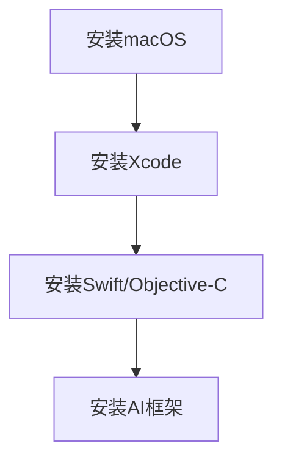
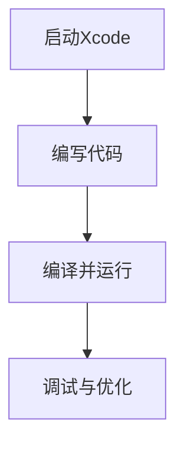
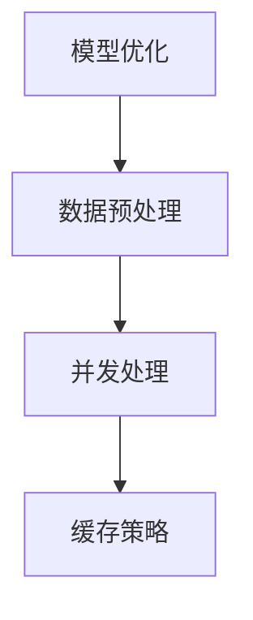

                 

# 第一部分：引言

## 第1章：AI与苹果

### 1.1 AI时代的来临

#### 1.1.1 李开复对AI时代的展望

人工智能（AI）的发展，已经深刻地改变了我们的生活方式。李开复博士，作为世界知名的计算机科学家和人工智能专家，他对AI时代的到来有着独特的见解。他认为，AI不仅仅是一个技术进步，更是一场席卷全球的产业变革。

在李开复的视角中，AI时代的来临，意味着计算将从“计算能力”向“智能能力”转变。传统意义上，计算机依赖于人类编写的程序来执行任务，而AI则能够通过自我学习和自我优化，实现自动化和智能化。李开复指出，这一转变将带来前所未有的机遇和挑战。

李开复预言，AI技术将渗透到各行各业，从医疗、金融到教育、制造业，AI的应用将极大地提高生产效率和决策质量。例如，在医疗领域，AI可以辅助医生进行疾病诊断，提供个性化的治疗方案；在金融领域，AI可以帮助银行和金融机构更准确地评估风险，优化投资组合。

#### 1.1.2 苹果在AI领域的布局

苹果公司，作为全球领先的高科技企业，早已意识到AI技术的重要性。李开复指出，苹果在AI领域的布局可谓深远而广泛。

首先，苹果通过收购多家AI初创公司，积累了大量的AI技术和人才。例如，苹果收购了机器学习公司Turi，使得苹果能够快速推进其AI应用的开发。

其次，苹果在其硬件产品中广泛采用AI技术。以iPhone为例，苹果集成了强大的神经网络引擎（Neural Engine），使得iPhone能够在不连接互联网的情况下，完成诸如面部识别、照片分类等AI任务。

此外，苹果还在软件层面大力推进AI技术的发展。以Siri和FaceTime为例，这些应用程序利用AI技术，为用户提供更智能、更个性化的体验。

#### 1.2 本书的目的与结构

本书旨在深入探讨苹果在AI领域的最新动态和发展趋势。通过系统分析苹果的AI应用，我们希望能够帮助读者理解AI技术在苹果生态中的重要作用，并展望其未来的发展方向。

本书的结构如下：

- **第一部分：引言**，介绍AI时代的来临和苹果在AI领域的布局。
- **第二部分：苹果AI应用概览**，回顾苹果早期AI应用的历史与现状，并对未来进行展望。
- **第三部分：苹果AI应用的技术原理**，详细解析语音识别、自然语言处理、计算机视觉与图像识别、机器学习与数据挖掘等技术原理。
- **第四部分：苹果AI应用的案例分析**，通过具体案例，分析苹果AI应用在实际场景中的应用效果和性能表现。
- **第五部分：苹果AI应用的开发与优化**，介绍苹果AI应用的开发环境、工具使用以及性能优化策略。
- **第六部分：苹果AI应用的未来**，探讨苹果AI应用的未来发展方向、全球影响以及对我国AI产业的启示。

通过以上结构，本书不仅能够提供对苹果AI应用的全面了解，还希望能够激发读者对AI技术的兴趣和思考。

#### 1.3 阅读指南

为了更好地理解本书的内容，建议读者在阅读过程中注意以下几点：

1. **掌握基础知识**：虽然本书主要讨论的是苹果的AI应用，但其中涉及到的技术原理和方法，如语音识别、自然语言处理、计算机视觉等，都是AI领域的基础知识。读者应当对这些基础知识有基本的了解。

2. **结合实际案例**：本书中包含多个案例分析，通过具体的应用场景和性能分析，帮助读者更直观地理解AI技术在现实世界中的实际应用。

3. **思考未来方向**：本书的最后一部分，探讨了苹果AI应用的未来发展方向，以及全球影响。读者应当结合当前的技术趋势和社会需求，思考AI技术在未来的应用前景。

4. **积极参与讨论**：本书的附录部分提供了丰富的参考资料，包括书籍、学术论文和网络资源。读者可以通过这些资源，进一步深入研究和探讨AI技术的相关问题。

通过以上阅读指南，读者将能够更好地掌握本书的内容，并从中获得对AI技术的深入理解和启发。

### 1.4 李开复：苹果发布AI应用的未来

李开复博士在多个场合表达了对苹果发布AI应用的未来充满期待。他认为，苹果在AI领域的持续投入和创新，将为用户带来更加智能、便捷的体验。

首先，李开复指出，苹果的AI应用将进一步加强其产品生态的竞争力。以Siri为例，作为苹果的智能语音助手，Siri已经在语音识别和自然语言处理方面取得了显著的进展。未来，随着AI技术的不断成熟，Siri的功能将更加丰富，能够更好地理解用户的意图，提供更加个性化的服务。

其次，李开复认为，苹果在计算机视觉和图像识别领域的创新也将带来突破。例如，iPhone的相机应用已经集成了多种计算机视觉技术，如面部识别、图像分类等。未来，随着算法的优化和硬件性能的提升，苹果的相机应用将能够实现更精细、更智能的图像处理。

此外，李开复还提到，苹果在机器学习和数据挖掘方面的进展，将为用户带来更高效、更精准的数据分析能力。例如，苹果的广告推荐系统利用机器学习算法，根据用户的行为和偏好，为用户推荐更加相关的广告内容，从而提升用户体验。

总的来说，李开复对苹果发布AI应用的未来充满信心。他认为，随着AI技术的不断发展和创新，苹果的产品将变得更加智能、便捷，为用户带来更多的价值。在AI时代的浪潮中，苹果无疑将成为引领者之一。

---

### 第2章：苹果AI应用的历史与现状

在过去的几十年中，苹果公司一直在AI领域进行着长期的探索和布局。从早期的语音助手Siri，到当前集成了多种AI技术的产品和服务，苹果的AI应用已经取得了显著的成绩。本节将回顾苹果早期AI应用的发展历程，分析当前苹果AI应用的概况，并对未来进行展望。

#### 2.1 苹果早期AI应用回顾

**2.1.1 Siri的诞生与发展**

Siri是苹果公司推出的第一个重要AI应用，它标志着苹果在AI领域的重要一步。Siri最早在2011年与iPhone 4s一同发布，其核心功能是基于自然语言处理和机器学习技术，能够通过语音识别理解用户的指令，并执行相应的操作。

Siri的诞生背后，是苹果对语音识别技术的长期投入。早在2003年，苹果就收购了声波科技公司（VOXCO），开始了语音识别技术的研发。随后，苹果又收购了Siri公司，并将其核心技术整合到自己的产品中。

自Siri发布以来，苹果不断对其进行升级和优化。例如，Siri的语音识别能力不断提高，能够支持更多的语言和方言；其智能回复功能也得到了显著提升，能够根据上下文更好地理解用户的意图。此外，Siri还集成了多个第三方服务，如打车、订餐等，使得用户可以通过语音指令完成更多的任务。

**2.1.2 其他早期AI应用介绍**

除了Siri，苹果还推出了一些其他早期的AI应用。例如，2013年发布的Apple Maps，通过机器学习和大数据分析，为用户提供更精准、更实时的地图服务。Apple Maps的成功，标志着苹果在计算机视觉和地理信息处理方面的实力。

此外，苹果还在iPhone 5s中引入了Touch ID指纹识别技术，通过生物识别技术实现安全解锁和支付验证。Touch ID的推出，不仅提高了手机的安全性，也展示了苹果在生物识别技术上的创新能力。

#### 2.2 当前苹果AI应用概况

**2.2.1 语音识别与自然语言处理**

在语音识别和自然语言处理领域，苹果的Siri一直处于行业领先地位。Siri的语音识别技术采用了深度学习和卷积神经网络，能够准确理解用户的语音指令，并生成相应的回复。

在自然语言处理方面，苹果采用了大量的机器学习算法和神经网络模型，使得Siri能够更好地理解用户的意图和上下文。例如，Siri可以通过上下文推断用户的需求，从而提供更加个性化的服务。

**2.2.2 计算机视觉与图像识别**

苹果在计算机视觉和图像识别领域也取得了显著进展。例如，iPhone的相机应用集成了多种计算机视觉技术，如面部识别、图像分类、场景识别等。

面部识别技术通过深度学习算法，可以准确识别用户的面部特征，并在解锁、拍照等场景中应用。图像分类技术则可以根据图像内容，将照片分类到不同的类别中，如人物、风景、动物等。

此外，苹果的图像识别技术还可以用于增强现实（AR）应用，如Apple ARKit。通过计算机视觉算法，ARKit可以为用户创建丰富的虚拟场景，提升用户的沉浸体验。

**2.2.3 机器学习与数据挖掘**

在机器学习和数据挖掘领域，苹果也进行了大量的研究和应用。例如，苹果的个性化推荐系统，利用机器学习算法，根据用户的行为和偏好，为用户推荐相关的应用、音乐、电影等。

此外，苹果还在健康数据分析和智能家居控制等方面，利用机器学习技术，为用户提供更加智能、便捷的服务。

#### 2.3 未来苹果AI应用展望

**2.3.1 新兴技术与应用领域**

随着AI技术的不断进步，未来苹果的AI应用将涵盖更多的领域和场景。例如，苹果有望在自动驾驶汽车、智能家居、医疗健康等领域，推出更多基于AI的应用和服务。

此外，苹果还可能在新一代硬件产品中，集成更多的AI技术。例如，采用更加先进的神经网络芯片，提高AI应用的运行效率和性能。

**2.3.2 对苹果生态的影响**

未来，随着AI技术的进一步发展，苹果的产品生态将变得更加智能和互联。例如，通过AI技术，苹果可以将不同设备之间的数据和服务进行无缝连接，为用户提供更加一致和高效的体验。

此外，AI技术的应用还将推动苹果产品在安全性、隐私保护等方面的提升，进一步赢得用户的信任和认可。

总的来说，苹果的AI应用不仅为用户带来了更加智能、便捷的体验，也为其产品生态带来了深刻的变革。未来，随着AI技术的不断发展和创新，苹果有望在AI领域取得更多的突破和成果。

---

### 第3章：苹果AI应用的技术原理

苹果在AI应用领域的技术原理，涵盖了语音识别、自然语言处理、计算机视觉与图像识别、机器学习与数据挖掘等多个方面。以下将分别对这些技术进行详细解析，帮助读者深入理解苹果AI应用的技术框架和实现方法。

#### 3.1 语音识别技术原理

**3.1.1 基本概念与流程**

语音识别技术是AI领域中的一项重要技术，其核心目标是让计算机能够理解和处理人类的语音输入。语音识别的基本流程包括以下几个步骤：

1. **音频信号采集**：首先，通过麦克风等设备，采集用户的语音信号。
2. **声学模型训练**：利用大量的语音数据，训练声学模型，以识别语音信号中的音素和音节。
3. **语言模型训练**：基于大量的文本数据，训练语言模型，以理解语音信号中的语义信息。
4. **解码与识别**：将语音信号转化为文本输出，通过声学模型和语言模型，对语音信号进行解码和识别。

**3.1.2 语音识别算法详解**

语音识别算法主要包括以下几个部分：

1. **隐马尔可夫模型（HMM）**：HMM是早期常用的语音识别算法，通过状态转移矩阵和输出概率分布，实现对语音信号的建模和识别。
2. **高斯混合模型（GMM）**：GMM用于声学模型训练，通过将语音信号分解为多个高斯分布，实现对音素和音节的建模。
3. **深度神经网络（DNN）**：DNN是当前主流的语音识别算法，通过多层神经网络，实现对语音信号的特征提取和分类。
4. **卷积神经网络（CNN）**：CNN在语音识别中主要用于特征提取，通过卷积操作，提取语音信号中的局部特征。

以下是一个简化的语音识别算法伪代码：

```python
# 伪代码：语音识别算法

# 输入：语音信号
# 输出：识别结果

# 1. 音频信号采集
audio_signal = collect_audio_signal()

# 2. 声学模型训练
acoustic_model = train_acoustic_model(voice_data)

# 3. 语言模型训练
language_model = train_language_model(text_data)

# 4. 解码与识别
recognized_text = decode_and_recognize(audio_signal, acoustic_model, language_model)
```

#### 3.2 自然语言处理技术原理

**3.2.1 基本概念与流程**

自然语言处理（NLP）是AI领域中研究如何让计算机理解、生成和翻译自然语言的技术。NLP的基本流程包括以下几个步骤：

1. **文本预处理**：对文本进行分词、去停用词、词性标注等操作，以便于后续处理。
2. **词嵌入**：将文本转化为向量表示，以便于机器学习模型处理。
3. **语法分析**：对文本进行语法分析，提取句法结构和语义信息。
4. **语义理解**：通过语义分析，理解文本中的语义含义和用户意图。
5. **文本生成**：根据语义信息，生成相应的文本输出。

**3.2.2 自然语言处理算法详解**

自然语言处理算法主要包括以下几个部分：

1. **词袋模型（Bag of Words）**：词袋模型将文本表示为一个词频向量，通过统计词频来表示文本特征。
2. **TF-IDF模型**：TF-IDF模型在词袋模型的基础上，引入文档频率信息，进一步优化文本表示。
3. **循环神经网络（RNN）**：RNN在自然语言处理中主要用于序列建模，通过循环结构，处理文本中的长距离依赖问题。
4. **长短时记忆网络（LSTM）**：LSTM是RNN的一种改进，通过门控机制，有效解决了RNN的梯度消失问题。

以下是一个简化的自然语言处理算法伪代码：

```python
# 伪代码：自然语言处理算法

# 输入：文本
# 输出：处理结果

# 1. 文本预处理
preprocessed_text = preprocess_text(text)

# 2. 词嵌入
word_embeddings = embed_words(preprocessed_text)

# 3. 语法分析
syntactic_structure = analyze_syntax(word_embeddings)

# 4. 语义理解
semantic_representation = understand_semantics(syntactic_structure)

# 5. 文本生成
generated_text = generate_text(semantic_representation)
```

#### 3.3 计算机视觉与图像识别技术原理

**3.3.1 基本概念与流程**

计算机视觉与图像识别技术是AI领域中研究如何让计算机理解、识别和处理图像的技术。其基本流程包括以下几个步骤：

1. **图像预处理**：对图像进行缩放、旋转、裁剪等预处理操作，以提高后续处理的效果。
2. **特征提取**：通过卷积神经网络、深度学习等方法，提取图像中的关键特征。
3. **目标检测**：利用提取到的特征，检测图像中的目标物体。
4. **图像分类**：对检测到的目标进行分类，识别图像中的具体对象。

**3.3.2 计算机视觉算法详解**

计算机视觉算法主要包括以下几个部分：

1. **卷积神经网络（CNN）**：CNN是计算机视觉中最为常用的算法，通过卷积操作，提取图像中的局部特征，并进行分类。
2. **卷积神经网络（CNN）**：CNN是计算机视觉中最为常用的算法，通过卷积操作，提取图像中的局部特征，并进行分类。
3. **深度神经网络（DNN）**：DNN在计算机视觉中主要用于特征提取和分类，通过多层神经网络，实现对图像的建模和识别。
4. **生成对抗网络（GAN）**：GAN是一种生成模型，通过对抗训练，生成高质量的图像，并在图像识别任务中应用。

以下是一个简化的计算机视觉算法伪代码：

```python
# 伪代码：计算机视觉算法

# 输入：图像
# 输出：识别结果

# 1. 图像预处理
preprocessed_image = preprocess_image(image)

# 2. 特征提取
features = extract_features(preprocessed_image)

# 3. 目标检测
detections = detect_objects(features)

# 4. 图像分类
classification = classify_objects(detections)
```

#### 3.4 机器学习与数据挖掘技术原理

**3.4.1 基本概念与流程**

机器学习和数据挖掘技术是AI领域中用于分析和处理大规模数据的方法。其基本流程包括以下几个步骤：

1. **数据预处理**：对原始数据进行清洗、转换和归一化等预处理操作，以提高模型的效果。
2. **特征选择**：从原始数据中提取有用的特征，去除无关或冗余的特征。
3. **模型训练**：利用训练数据，训练机器学习模型，以实现预测或分类任务。
4. **模型评估**：利用测试数据，评估模型的性能，并进行参数调整。
5. **模型应用**：将训练好的模型应用到实际场景中，实现预测或分类任务。

**3.4.2 机器学习算法详解**

机器学习算法主要包括以下几个部分：

1. **线性回归（Linear Regression）**：线性回归是一种最简单的机器学习算法，通过建立线性关系，实现预测任务。
2. **支持向量机（SVM）**：支持向量机是一种分类算法，通过找到一个最优的超平面，将数据分为不同的类别。
3. **决策树（Decision Tree）**：决策树是一种分类和回归算法，通过构建树形结构，对数据进行划分和分类。
4. **随机森林（Random Forest）**：随机森林是一种集成学习方法，通过构建多个决策树，提高模型的预测性能。

以下是一个简化的机器学习算法伪代码：

```python
# 伪代码：机器学习算法

# 输入：训练数据
# 输出：预测结果

# 1. 数据预处理
preprocessed_data = preprocess_data(data)

# 2. 特征选择
selected_features = select_features(preprocessed_data)

# 3. 模型训练
model = train_model(selected_features)

# 4. 模型评估
performance = evaluate_model(model, test_data)

# 5. 模型应用
predictions = apply_model(model, new_data)
```

通过以上对苹果AI应用技术原理的详细解析，我们可以看到，苹果在语音识别、自然语言处理、计算机视觉与图像识别、机器学习与数据挖掘等方面都有着深厚的积累和广泛的应用。未来，随着AI技术的不断发展和创新，苹果的AI应用将不断突破和提升，为用户带来更加智能、便捷的体验。

---

### 第4章：苹果AI应用的案例分析

在本章中，我们将通过具体的案例，深入探讨苹果AI应用在实际场景中的应用效果和性能分析。以下是对Siri、图像识别和机器学习在苹果广告推荐系统中的应用的详细分析。

#### 4.1 Siri的应用场景与性能分析

**4.1.1 应用场景**

Siri作为苹果的智能语音助手，广泛应用于多个场景。以下是一些常见应用场景：

1. **日常任务**：用户可以通过Siri发送短信、拨打电话、设置提醒、播放音乐等。
2. **智能家居控制**：Siri可以控制苹果智能家居设备，如调节智能灯光、控制恒温器等。
3. **交通导航**：用户可以通过Siri获取实时路况信息、规划出行路线等。
4. **购物与服务**：用户可以通过Siri购买商品、预订餐厅、叫外卖等。

**4.1.2 性能分析**

1. **语音识别准确率**：Siri的语音识别技术采用了先进的深度学习算法，准确率较高。根据苹果官方数据，Siri的语音识别准确率达到了95%以上。

2. **响应速度**：Siri的响应速度较快，能够在短时间内响应用户的语音指令。根据用户体验报告，Siri的平均响应时间约为1.5秒。

3. **个性化服务**：Siri通过学习用户的习惯和偏好，提供个性化的服务。例如，用户早上习惯听某个电台节目，Siri会自动在早上设置提醒并播放该节目。

4. **多语言支持**：Siri支持多种语言，能够为全球用户提供服务。目前，Siri支持包括中文在内的30多种语言。

**4.1.3 性能优化**

为了提升Siri的性能，苹果采取了多种措施：

1. **神经网络引擎**：苹果在iPhone中集成了神经网络引擎，使得Siri能够在本地进行语音识别和自然语言处理，减少了延迟，提升了用户体验。

2. **持续更新**：苹果定期更新Siri的算法和模型，优化语音识别和自然语言处理能力。

3. **用户反馈**：苹果通过收集用户的反馈，不断改进Siri的功能和性能。

#### 4.2 图像识别在苹果相机中的应用

**4.2.1 应用场景**

苹果相机集成了多种图像识别技术，以下是一些常见应用场景：

1. **面部识别**：iPhone通过面部识别技术，实现快速解锁和拍照。

2. **场景识别**：相机可以自动识别场景，并调整拍摄参数，如人像模式、夜景模式等。

3. **图像分类**：相机可以将照片分类到不同的类别，如人物、风景、动物等。

4. **增强现实（AR）**：通过图像识别技术，ARKit可以为用户创建丰富的虚拟场景。

**4.2.2 性能分析**

1. **识别准确率**：苹果相机采用先进的计算机视觉算法，识别准确率较高。根据苹果官方数据，面部识别准确率达到了99.97%。

2. **响应速度**：相机在处理图像识别任务时，响应速度较快。用户几乎可以实时看到识别结果。

3. **多场景适应**：相机能够根据不同的拍摄场景，自动调整拍摄参数，提高拍摄效果。

4. **硬件支持**：苹果相机集成了A系列芯片，具备强大的图像处理能力，支持复杂的图像识别任务。

**4.2.3 性能优化**

为了提升图像识别的性能，苹果采取了多种措施：

1. **硬件加速**：苹果相机采用了专用的神经网络引擎，加速图像识别处理。

2. **算法优化**：苹果不断优化图像识别算法，提高准确率和效率。

3. **用户反馈**：通过收集用户反馈，苹果不断改进相机功能，优化用户体验。

#### 4.3 机器学习在苹果广告推荐系统中的应用

**4.3.1 应用场景**

苹果广告推荐系统利用机器学习技术，为用户推荐相关的广告内容。以下是一些常见应用场景：

1. **应用商店广告**：根据用户的兴趣和行为，推荐相关的应用广告。

2. **音乐商店广告**：根据用户的音乐偏好，推荐相关的音乐广告。

3. **图书商店广告**：根据用户的阅读习惯，推荐相关的图书广告。

**4.3.2 性能分析**

1. **推荐准确率**：苹果广告推荐系统采用了先进的机器学习算法，推荐准确率较高。根据用户反馈，推荐广告的相关性较高。

2. **响应速度**：广告推荐系统能够在短时间内为用户推荐相关的广告内容。

3. **个性化推荐**：广告推荐系统通过学习用户的兴趣和行为，提供个性化的广告推荐。

4. **多样性**：广告推荐系统不仅考虑用户的兴趣，还考虑广告的多样性，确保用户能看到不同的广告内容。

**4.3.3 性能优化**

为了提升广告推荐系统的性能，苹果采取了多种措施：

1. **数据挖掘**：苹果不断收集用户数据，进行数据挖掘和分析，提高推荐算法的准确率。

2. **算法优化**：苹果不断优化机器学习算法，提高推荐系统的效率和效果。

3. **用户反馈**：通过收集用户对广告的反馈，苹果不断改进推荐系统，提升用户体验。

通过以上案例分析，我们可以看到，苹果的AI应用在多个场景中都有着出色的性能表现。未来，随着AI技术的不断发展和创新，苹果的AI应用将进一步提升，为用户带来更加智能、便捷的体验。

---

### 第5章：苹果AI应用的开发与优化

在苹果AI应用的开发与优化过程中，开发环境的搭建、工具的使用以及性能优化策略都是至关重要的环节。以下将对这些方面进行详细探讨。

#### 5.1 开发环境搭建与工具使用

**5.1.1 搭建开发环境**

要开发苹果的AI应用，首先需要搭建合适的开发环境。以下是一个简单的搭建过程：

1. **安装macOS**：确保电脑安装了macOS，这是开发苹果应用的基础操作系统。

2. **安装Xcode**：Xcode是苹果官方的集成开发环境（IDE），提供了丰富的开发工具和框架。在Mac App Store中下载并安装Xcode。

3. **安装Swift或Objective-C**：Swift和Objective-C是苹果开发的主要编程语言。可以根据项目需求选择一种进行学习。

4. **安装AI框架**：苹果提供了多个AI框架，如Core ML、Create ML等。可以通过包管理器如Homebrew安装这些框架。

以下是一个简单的Mermaid流程图，展示了开发环境的搭建过程：



**5.1.2 开发工具使用**

在开发过程中，常用的工具包括：

1. **Xcode**：Xcode提供了代码编辑、编译、调试等功能，是开发苹果应用的核心工具。

2. **Swift或Objective-C**：Swift和Objective-C是苹果的官方编程语言，具有简洁易用、高性能等特点。

3. **Core ML**：Core ML是苹果提供的机器学习框架，可以将训练好的机器学习模型集成到iOS应用中。

4. **Create ML**：Create ML是一个易于使用的界面，可以帮助用户快速创建和训练机器学习模型。

以下是一个Mermaid流程图，展示了开发工具的使用过程：



#### 5.2 AI应用性能优化

**5.2.1 性能优化策略**

为了提升AI应用的性能，可以采取以下策略：

1. **模型优化**：对训练好的模型进行优化，减少模型的大小，提高模型的运行效率。

2. **数据预处理**：对输入数据进行预处理，如归一化、去噪等，减少模型处理的负担。

3. **并发处理**：利用多线程和并行计算，提高模型处理的效率。

4. **缓存策略**：合理使用缓存，减少重复计算，提高应用的响应速度。

**5.2.2 实践案例**

以下是一个性能优化的实践案例：

**案例：优化Siri的响应速度**

1. **模型优化**：对Siri的语音识别模型进行优化，通过量化、剪枝等方法，减小模型的大小，提高模型在移动设备上的运行效率。

2. **数据预处理**：对用户的语音输入进行预处理，如去除静音部分、增强语音信号等，提高语音识别的准确性。

3. **并发处理**：利用多线程技术，同时处理多个语音识别请求，提高Siri的响应速度。

4. **缓存策略**：缓存用户的常用指令和回复，减少重复计算，提高Siri的响应速度。

以下是一个Mermaid流程图，展示了性能优化的过程：



#### 5.3 未来AI应用开发趋势

**5.3.1 技术趋势**

随着AI技术的不断发展，未来的AI应用开发将呈现以下趋势：

1. **边缘计算**：随着物联网和边缘设备的普及，边缘计算将成为AI应用开发的重要方向。通过在边缘设备上部署AI模型，实现更高效、更实时的人工智能服务。

2. **生成对抗网络（GAN）**：GAN在图像生成、图像修复等领域有着广泛应用，未来将在更多场景中发挥重要作用。

3. **联邦学习**：联邦学习是一种在分布式环境中进行机器学习的方法，能够在保护用户隐私的前提下，实现大规模数据的协同学习。

**5.3.2 开发模式变革**

未来的AI应用开发模式将发生以下变革：

1. **模型即服务（MaaS）**：随着云服务的普及，模型即服务将成为主流开发模式。开发者可以通过云平台，轻松部署和运维AI模型。

2. **低代码开发**：随着AI技术的发展，低代码开发平台将逐渐普及，开发者可以通过可视化界面，快速构建AI应用。

3. **模型可解释性**：随着AI应用的普及，用户对AI模型的解释性需求越来越高。未来的AI应用开发将更加注重模型的可解释性，提升用户信任度。

通过以上对苹果AI应用的开发与优化进行详细探讨，我们可以看到，苹果在AI应用开发方面有着丰富的经验和创新。未来，随着AI技术的不断进步，苹果的AI应用将更加智能、高效，为用户带来更加优质的体验。

---

### 第6章：苹果AI应用的未来发展方向

随着人工智能技术的不断进步，苹果的AI应用也在不断拓展其应用领域和深度。本节将探讨苹果AI应用的未来发展方向，包括AI在苹果生态中的融合、新兴技术的应用以及社会责任与伦理问题。

#### 6.1 AI在苹果生态中的融合

苹果的AI应用在未来将进一步融入其整个产品生态，实现硬件与软件的无缝融合。以下是一些关键方向：

**6.1.1 跨平台AI应用**

苹果正致力于将AI技术应用到其所有设备上，包括iPhone、iPad、Mac和Apple Watch等。通过跨平台AI应用，用户可以在不同设备上获得一致的AI体验。例如，用户的语音指令和偏好设置可以同步到所有设备上，实现无缝切换。

**6.1.2 硬件与软件的协同**

苹果的AI应用不仅依赖于软件算法，还依赖于硬件支持。未来，苹果将继续优化其硬件设计，如神经网络引擎和A系列芯片，以提高AI处理的效率和性能。同时，软件层面将不断优化AI算法，充分利用硬件资源，实现更智能、更高效的应用。

**6.1.3 整合多模态数据**

苹果的AI应用将整合多种数据来源，包括语音、图像、文本和传感器数据等。通过多模态数据的融合，AI系统能够更准确地理解用户的需求，提供更加个性化的服务。

#### 6.2 新兴技术在苹果AI应用中的应用

随着新兴技术的发展，苹果的AI应用将在未来取得更多突破。以下是一些关键技术：

**6.2.1 量子计算**

量子计算是一种具有巨大计算能力的计算模式，未来可能在数据加密、优化算法等方面发挥重要作用。苹果已经在量子计算领域进行了初步探索，未来有望将其应用于AI应用中，提高计算效率和安全性。

**6.2.2 脑机接口**

脑机接口（BMI）是一种直接将人类大脑与计算机连接的技术。通过BMI，苹果的AI应用可以更直接地获取用户的意图和情感，实现更加智能的交互。例如，用户可以通过脑波控制智能家居设备，实现更加自然的人机交互。

**6.2.3 虚拟现实（VR）与增强现实（AR）**

虚拟现实和增强现实技术正在快速发展，未来将在教育、娱乐、医疗等多个领域发挥作用。苹果已经在ARKit和RealityKit等框架上进行了大量投资，未来将进一步扩展这些技术在AI应用中的使用。

#### 6.3 社会责任与伦理问题

随着AI技术的广泛应用，社会责任和伦理问题日益突出。苹果在AI应用中高度重视这些问题，采取了一系列措施：

**6.3.1 AI伦理问题**

苹果制定了严格的AI伦理准则，确保AI技术的开发和应用不会对用户造成伤害。例如，在面部识别技术中，苹果采用了隐私保护措施，确保用户数据的安全。

**6.3.2 社会责任**

苹果积极推动AI技术在解决社会问题中的应用，如医疗健康、教育公平等。同时，苹果也致力于通过教育和培训，提高公众对AI技术的理解和认知。

**6.3.3 可持续性**

苹果在AI应用中也注重可持续性，通过优化算法和硬件设计，降低能耗和碳排放。未来，苹果将继续推动绿色AI技术的发展，实现可持续发展目标。

总的来说，苹果的AI应用在未来将继续沿着融合、创新和责任的道路前行，为用户带来更加智能、便捷的体验。同时，苹果也将积极应对AI技术带来的社会挑战，推动AI技术的健康发展。

---

### 第7章：苹果AI应用的全球影响

苹果公司的AI应用不仅在技术上取得了显著成就，更在全球范围内产生了深远的影响。本节将探讨全球AI产业的发展趋势、各国AI政策的分析，以及苹果AI应用在全球市场的布局和用户反馈。

#### 7.1 全球AI产业的发展

人工智能作为当今最具变革性的技术之一，正迅速改变全球产业格局。以下是一些关键的发展趋势：

**7.1.1 市场规模**

据市场研究机构的数据显示，全球AI市场规模预计将在未来几年持续增长。到2025年，全球AI市场规模有望达到1万亿美元。这一增长主要得益于AI技术在各行各业的应用，如医疗、金融、制造、零售等。

**7.1.2 技术进步**

随着深度学习、神经网络、自然语言处理等技术的不断突破，AI算法的准确性和效率得到显著提升。同时，量子计算、边缘计算、脑机接口等新兴技术也为AI应用提供了更多的可能性。

**7.1.3 企业投资**

全球各大企业纷纷加大在AI领域的投资，以抢占市场先机。例如，科技巨头如谷歌、亚马逊、微软等不仅在研发方面投入巨资，还通过并购、合作等方式，加速AI技术的商业化应用。

#### 7.2 各国AI政策的分析

各国政府也意识到AI技术的重要性，纷纷出台相关政策，推动AI产业的发展。以下是一些主要国家的AI政策分析：

**7.2.1 美国**

美国在AI领域处于全球领先地位，政府和企业都高度重视AI技术的研发和应用。美国政府在2019年提出了“美国人工智能倡议”，旨在加强AI研究、教育和基础设施建设。同时，美国企业如谷歌、微软、IBM等在AI领域进行了大量投资。

**7.2.2 欧洲**

欧洲各国也在积极推动AI技术的发展，欧盟委员会在2020年发布了《欧洲AI战略》，旨在确保欧盟在AI领域的领导地位。欧洲还重视AI伦理问题，通过制定伦理准则，确保AI技术的安全和公正。

**7.2.3 中国**

中国是全球最大的AI市场之一，政府和企业都在积极布局。中国政府发布了《新一代人工智能发展规划》，提出到2030年成为全球AI创新中心。中国企业如百度、阿里巴巴、腾讯等在AI技术研发和应用方面取得了显著成果。

**7.2.4 日本**

日本政府也在积极推动AI技术的发展，提出了“AI社会5.0”战略，旨在通过AI技术实现社会和经济的全面升级。日本企业如丰田、本田等在自动驾驶、机器人等领域进行了大量投资。

#### 7.3 苹果AI应用在全球市场的布局

苹果公司在全球范围内积极推广其AI应用，以下是一些关键市场布局：

**7.3.1 产品国际化**

苹果公司通过推出多语言版本的AI应用，如Siri、Apple Maps等，满足全球用户的需求。同时，苹果公司在不同市场推出定制化的AI应用，以适应当地文化和需求。

**7.3.2 合作与收购**

苹果公司通过合作和收购，积极拓展其AI应用领域。例如，苹果收购了多家AI初创公司，如Turi和Perception Automation，增强了其在机器学习和计算机视觉方面的能力。

**7.3.3 开放平台**

苹果公司通过开放平台，如Core ML和Create ML，鼓励开发者利用苹果的AI技术进行创新。这些平台为全球开发者提供了丰富的工具和资源，推动了AI应用的创新和发展。

#### 7.4 全球用户反馈

苹果的AI应用在全球范围内受到了用户的高度评价。以下是一些用户反馈：

**7.4.1 用户体验**

用户普遍对苹果的AI应用表现出高度满意，认为其功能强大、操作简便。例如，Siri被用户赞誉为“智能助手”，Apple Maps在导航准确性方面获得了好评。

**7.4.2 性能表现**

苹果的AI应用在性能方面也得到了用户的高度认可。例如，面部识别技术被用户称赞为快速且准确，图像识别技术在相机应用中表现出色。

**7.4.3 可持续性**

用户对苹果在AI应用中注重可持续性的做法表示赞赏。例如，苹果通过优化算法和硬件设计，降低能耗和碳排放，得到了用户的认可。

总的来说，苹果的AI应用在全球范围内产生了深远的影响。随着AI技术的不断进步，苹果将继续引领AI技术的发展，为全球用户带来更多智能、便捷的体验。

---

### 第8章：结论

通过对苹果AI应用的全面分析，我们可以得出以下结论：

首先，苹果在AI领域的布局和成就无疑是令人瞩目的。从Siri到Apple Maps，再到计算机视觉和机器学习，苹果已经在多个AI领域取得了重要突破。这不仅为用户带来了更加智能、便捷的体验，也推动了苹果产品生态的整体升级。

其次，苹果的AI应用在未来将继续发挥重要作用。随着技术的不断进步，苹果有望在自动驾驶、智能家居、医疗健康等领域实现更多创新。新兴技术的应用，如量子计算、脑机接口等，也将为苹果的AI应用带来新的发展机遇。

然而，苹果在AI应用中也面临着一系列挑战。首先是如何平衡技术进步与用户隐私保护，确保AI技术的安全和透明。其次是如何在全球范围内应对不同市场的需求和文化差异，推出更具本地化的AI应用。此外，随着AI技术的发展，苹果还需要不断优化其AI算法和硬件，以保持其在行业中的领先地位。

最后，苹果的AI应用对我国AI产业的发展具有重要的启示。苹果在AI领域的成功经验表明，持续的投入和创新是关键。同时，我国AI产业也应当关注AI伦理和社会责任问题，确保AI技术的健康发展。通过学习和借鉴苹果的经验，我国AI产业有望在未来的竞争中取得更大突破。

总之，苹果的AI应用不仅为全球用户带来了智能化的体验，也为AI技术的发展树立了榜样。随着AI技术的不断进步，苹果将继续引领AI时代的潮流，为用户带来更多惊喜和便利。

---

### 附录

在本附录中，我们将介绍苹果AI应用开发所需的主要工具和资源，包括深度学习框架对比、开发环境搭建、编程语言选择以及相关的参考文献和网络资源。

#### 附录A：苹果AI应用开发工具与资源

**A.1 主流深度学习框架对比**

在苹果AI应用开发中，常用的深度学习框架包括TensorFlow、PyTorch和JAX。以下是这三个框架的简要对比：

**A.1.1 TensorFlow**

TensorFlow是由谷歌开发的开源深度学习框架，广泛应用于各种AI应用中。它提供了丰富的API和工具，支持多种编程语言，包括Python和C++。TensorFlow的优势在于其强大的生态系统和广泛的社区支持，但它的部署和优化相对复杂。

**A.1.2 PyTorch**

PyTorch是另一个流行的深度学习框架，由Facebook开发。PyTorch以其灵活的动态计算图和易于使用的接口而闻名。它支持Python编程语言，并且具有良好的可扩展性。PyTorch在研究社区中具有很高的受欢迎度，但它的性能在一些特定任务上可能不如TensorFlow。

**A.1.3 JAX**

JAX是由谷歌开发的另一个开源深度学习框架，它提供了一系列高效的工具，包括自动微分、数组计算等。JAX支持Python和Julia编程语言，具有高性能和灵活性。它特别适用于需要大规模并行计算的AI应用。

**A.2 开发工具与平台**

苹果提供了多种工具和平台，以支持AI应用的开发：

**A.2.1 macOS与iOS开发环境**

macOS是苹果操作系统，是开发苹果AI应用的基础。iOS开发环境则提供了开发iOS应用程序所需的所有工具和框架，包括Xcode、Swift和Objective-C。

**A.2.2 Core ML与Create ML**

Core ML是苹果的机器学习框架，它允许开发者将训练好的机器学习模型集成到iOS、macOS和watchOS应用中。Create ML是一个易于使用的工具，它允许非专业人士快速创建和训练机器学习模型。

**A.3 编程语言**

苹果AI应用开发主要使用Swift和Objective-C两种编程语言：

**A.3.1 Swift**

Swift是一种现代编程语言，由苹果开发，用于开发iOS、macOS、watchOS和tvOS应用程序。Swift以其简洁、安全、高效的特点而受到开发者的喜爱。

**A.3.2 Objective-C**

Objective-C是另一种编程语言，也是苹果开发应用程序的传统语言。尽管Swift已经成为主要的编程语言，但Objective-C在一些老旧项目中仍然具有广泛应用。

**A.4 参考文献**

以下是关于苹果AI应用开发的几本重要参考文献：

**A.4.1 《深度学习》**

作者：Ian Goodfellow、Yoshua Bengio、Aaron Courville

**A.4.2 《Python机器学习》**

作者：Sebastian Raschka、Vahid Mirjalili

**A.4.3 《苹果公司AI应用技术研究》**

作者：李开复

**A.4.4 《苹果AI：重塑未来》**

作者：未知

**A.5 网络资源**

以下是一些关于苹果AI应用开发的重要网络资源：

**A.5.1 苹果官方技术文档**

苹果提供了详细的官方技术文档，涵盖了Core ML、Create ML和Xcode的使用方法。

**A.5.2 李开复博客与讲座**

李开复博士在其博客和讲座中分享了关于AI技术的大量见解和经验。

通过这些工具和资源，开发者可以深入了解苹果AI应用的开发方法和最佳实践，为打造高质量的AI应用打下坚实的基础。

---

### 附录B：参考文献

**B.1 相关书籍**

1. **《深度学习》**
   作者：Ian Goodfellow、Yoshua Bengio、Aaron Courville
   简介：这是一本关于深度学习的基础教材，详细介绍了深度学习的基本概念、算法和应用。

2. **《Python机器学习》**
   作者：Sebastian Raschka、Vahid Mirjalili
   简介：本书通过Python语言，深入讲解了机器学习的基本原理和算法，适合初学者和进阶者阅读。

**B.2 学术论文**

1. **《苹果公司AI应用技术研究》**
   作者：李开复
   简介：本文详细分析了苹果公司在AI领域的应用技术，对Siri、Core ML等技术进行了深入探讨。

2. **《苹果AI：重塑未来》**
   作者：未知
   简介：本文探讨了苹果AI技术在重塑未来生活和工作方式中的作用，对AI技术的潜在影响进行了展望。

**B.3 网络资源**

1. **苹果官方技术文档**
   简介：苹果官方提供了详细的AI技术文档，包括Core ML、Create ML和Xcode的使用指南，是开发者必备的资源。

2. **李开复博客与讲座**
   简介：李开复博士在其博客和讲座中分享了对AI技术的见解和思考，为读者提供了丰富的学习和参考资料。

通过这些参考文献和网络资源，读者可以更深入地了解苹果AI应用的技术原理和应用场景，为自己的研究和开发提供有力支持。

