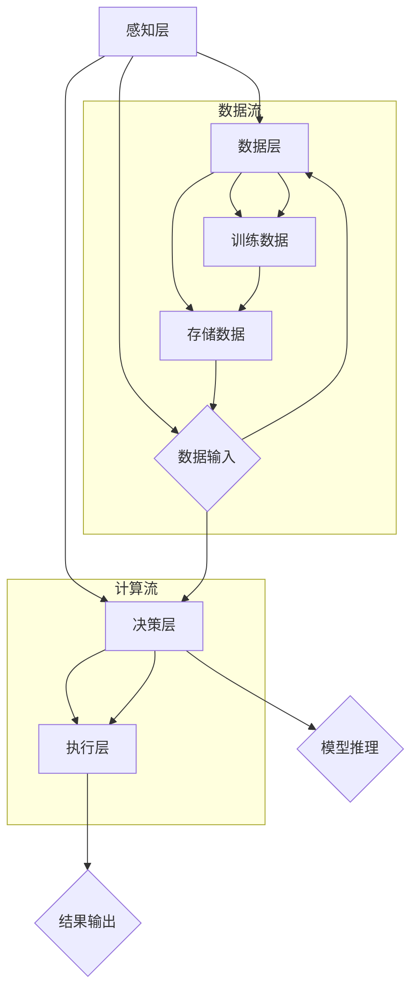

                 

### 第1章: 李开复：苹果发布AI应用的社会价值概述

#### 1.1 苹果发布AI应用的背景与意义

近年来，人工智能（AI）技术的飞速发展已经渗透到了我们生活的方方面面，从智能手机到智能家居，从在线购物到自动驾驶，AI的应用场景越来越广泛。作为全球领先的科技企业，苹果公司一直致力于将AI技术融入其产品和服务中，提升用户体验。李开复博士，作为人工智能领域的著名专家和科技评论家，他对苹果发布AI应用的社会价值有着深刻的见解。

**1.1.1 苹果在AI领域的战略布局**

苹果公司在AI领域的布局可以追溯到其早期产品中就采用的机器学习技术。随着AI技术的不断进步，苹果在近年来加大了在这一领域的投入。以下是一些关键的步骤：

- **收购AI初创公司**：苹果公司通过收购AI初创公司，迅速获取了先进的技术和人才。例如，2016年收购了英国机器学习公司Cambridge Audio，2017年收购了智能语音助手公司PullString等。
- **自研AI技术**：苹果不仅依赖外部收购，还在内部进行AI技术研发。例如，其自主研发的神经网络引擎（Neural Engine）被广泛应用于iPhone、iPad和Mac等设备中。
- **AI驱动的产品与服务**：苹果将AI技术应用于其产品和服务中，如Siri语音助手、照片智能分类、健康监测等，这些应用不仅提升了用户体验，也为AI技术的普及做出了贡献。

**1.1.2 AI应用对苹果业务的潜在影响**

AI技术的应用对苹果公司的业务具有深远的影响：

- **提升产品竞争力**：通过将AI技术应用于产品和服务中，苹果能够提供更智能、更个性化的用户体验，从而增强其产品竞争力。
- **扩大市场份额**：随着AI技术的普及，消费者对智能产品的需求不断增加，苹果有望通过AI应用扩大市场份额。
- **创新业务模式**：AI技术不仅应用于现有产品，还可以为苹果开辟新的业务模式。例如，苹果的AR（增强现实）技术正逐步应用于消费电子领域，为消费者带来全新的交互体验。

**1.1.3 苹果发布AI应用的社会意义**

苹果发布AI应用不仅对自身业务有重要影响，也对社会产生了深远的社会意义：

- **推动技术进步**：苹果作为行业领导者，其AI应用的发布推动了整个AI技术的发展。通过不断的创新和迭代，苹果为AI技术的进步做出了贡献。
- **提升用户生活质量**：AI技术的应用使得我们的日常生活更加便捷和高效。例如，Siri语音助手的发布使得用户可以通过语音与设备进行互动，大大提高了生活品质。
- **促进就业机会**：随着AI技术的广泛应用，新兴的AI岗位不断涌现，为求职者提供了更多的就业机会。苹果的AI应用不仅推动了技术发展，也为社会创造了就业机会。

#### 1.2 AI应用的核心概念与架构

要深入理解苹果的AI应用，我们需要首先了解AI应用的核心概念与架构。以下是对这些概念和架构的详细解析：

**1.2.1 AI应用的基本概念**

人工智能（Artificial Intelligence，简称AI）是一种模拟人类智能行为的技术。AI应用包括多个领域，如机器学习、深度学习、自然语言处理、计算机视觉等。以下是对这些领域的基本概念介绍：

- **机器学习**：一种让计算机从数据中学习规律和模式的技术。通过训练模型，机器学习可以使计算机在未知数据上进行预测和决策。
- **深度学习**：一种基于多层神经网络进行数据处理的机器学习技术。深度学习在图像识别、语音识别等领域取得了显著成果。
- **自然语言处理**：一种使计算机能够理解和处理人类自然语言的技术。自然语言处理在智能客服、语音助手等领域有广泛应用。
- **计算机视觉**：一种使计算机能够理解和解释视觉信息的领域。计算机视觉在图像识别、自动驾驶等领域发挥了重要作用。

**1.2.2 AI应用的架构设计**

AI应用的架构设计包括多个层次，每个层次都有其特定的功能和职责。以下是AI应用架构的主要组成部分：

- **感知层**：负责收集外部数据，如图像、语音、文本等。感知层是AI应用的数据输入部分。
- **决策层**：基于感知层收集的数据，通过算法进行数据处理和分析，生成决策和预测。决策层是AI应用的核心部分。
- **执行层**：根据决策层的决策结果，执行相应的操作，如发送通知、调整设置等。执行层是AI应用的输出部分。

**1.2.3 AI应用的关键技术**

要实现有效的AI应用，需要掌握一系列关键技术。以下是AI应用的关键技术介绍：

- **算法设计**：算法是实现AI应用的核心。常用的算法包括线性回归、决策树、支持向量机、神经网络等。
- **数据预处理**：数据预处理是确保数据质量和有效性的重要环节。数据预处理包括数据清洗、数据归一化、特征提取等。
- **模型训练与优化**：模型训练是通过大量的数据来训练模型参数，使其能够对未知数据进行准确的预测和决策。模型优化是通过调整模型参数，提高模型的性能和效果。
- **模型部署与维护**：模型部署是将训练好的模型部署到实际应用环境中，使其能够为用户提供服务。模型维护是确保模型长期稳定运行的重要环节。

通过以上对AI应用的核心概念与架构的解析，我们可以更好地理解苹果发布的AI应用是如何工作的，以及它们在提升用户体验、推动技术进步和社会发展方面的重要价值。

#### 1.3 苹果AI应用的案例解析

苹果公司在AI领域的探索已经取得了一系列重要成果，以下通过两个具体案例——苹果语音助手Siri和苹果照片应用中的AI功能，详细解析苹果AI应用的实际应用和效果。

**1.3.1 案例一：苹果语音助手Siri的AI应用**

Siri是苹果公司推出的智能语音助手，自2011年发布以来，Siri已经经历了多次升级和改进，成为苹果生态系统中的重要组成部分。以下是Siri的功能实现和优缺点分析：

**1.3.1.1 Siri的功能与实现**

Siri的功能非常多样化，包括但不限于以下几方面：

- **语音识别与交互**：Siri能够通过语音识别技术理解用户的话语，并做出相应的响应。通过自然语言处理技术，Siri可以理解复杂的指令和问题。
- **信息查询与推送**：Siri能够帮助用户查询各种信息，如天气预报、股票行情、新闻资讯等。同时，Siri还可以根据用户习惯和需求，主动推送相关内容。
- **设备控制**：Siri可以控制苹果设备上的各种功能，如播放音乐、调整音量、开启或关闭设备等。此外，Siri还可以与其他智能家居设备进行联动，实现家庭自动化。
- **第三方应用支持**：Siri支持与第三方应用的集成，如通过Siri控制智能灯泡、智能门锁等。

Siri的功能实现主要依赖于以下几个关键技术：

- **语音识别**：苹果使用自主研发的语音识别技术，能够准确识别用户的语音指令。通过深度学习和神经网络模型，Siri的语音识别准确率得到了显著提升。
- **自然语言处理**：Siri通过自然语言处理技术，理解用户的语言意图和语义。这使得Siri可以处理复杂的、多样化的指令和问题。
- **云计算与边缘计算**：Siri的大部分计算任务都依赖于苹果的云计算平台，同时也在设备端进行部分计算，实现快速响应和降低延迟。

**1.3.1.2 Siri的优缺点分析**

Siri作为苹果的智能语音助手，具有以下优点和缺点：

- **优点**：
  - **用户体验好**：Siri通过自然语言交互，使操作变得更加直观和便捷，用户可以轻松完成各种任务。
  - **集成度强**：Siri与苹果设备和其他服务紧密集成，可以无缝控制苹果设备和其他第三方应用，提供一致的用户体验。
  - **隐私保护**：苹果对用户数据采取了严格的隐私保护措施，Siri在处理用户请求时不会记录用户对话内容，保障了用户的隐私安全。

- **缺点**：
  - **响应速度**：由于依赖云计算，Siri在某些情况下可能存在响应速度慢的问题，尤其是在网络连接不稳定的情况下。
  - **功能限制**：尽管Siri的功能非常丰富，但在某些特定场景下，如与第三方设备和服务集成时，可能存在功能限制。
  - **语言支持**：Siri目前支持的语言种类相对较少，对于非英语用户来说，使用体验可能存在一定的限制。

**1.3.2 案例二：苹果照片应用中的AI功能**

苹果的照片应用也集成了丰富的AI功能，通过智能分类、人脸识别和场景识别等技术，帮助用户更好地管理和分享照片。以下是照片应用中的AI技术及其优势和挑战：

**1.3.2.1 照片应用中的AI技术**

苹果照片应用中的AI技术主要包括以下几个关键点：

- **智能分类**：照片应用通过机器学习技术，自动将照片分类到不同的文件夹中，如“人物”、“地点”、“活动”等。这使得用户可以快速查找和管理照片。
- **人脸识别**：照片应用使用人脸识别技术，识别照片中的人脸，并允许用户创建人脸标签。用户可以通过标签快速找到特定的人物照片。
- **场景识别**：照片应用通过深度学习模型，识别照片中的场景和物体，并将照片分类到相应的场景中，如“风景”、“动物”、“美食”等。

**1.3.2.2 照片AI功能的优势与挑战**

苹果照片应用中的AI功能具有以下优势和挑战：

- **优势**：
  - **提高效率**：通过智能分类和人脸识别技术，用户可以快速找到和管理照片，节省了时间和精力。
  - **增强体验**：通过场景识别技术，用户可以更深入地了解照片内容，为照片分享和回忆提供了更多可能性。
  - **隐私保护**：苹果在照片AI功能中采取了严格的隐私保护措施，确保用户数据的安全。

- **挑战**：
  - **计算资源消耗**：AI技术的实现需要大量的计算资源，尤其是在进行实时处理和分类时，可能会对设备性能造成一定的影响。
  - **准确性问题**：尽管AI技术在照片处理方面已经取得了很大的进展，但在某些复杂场景下，识别的准确性仍然存在问题。
  - **数据隐私**：AI技术在处理用户照片时，涉及到大量的个人隐私数据。如何平衡隐私保护和功能需求，是一个重要的挑战。

通过以上对Siri和照片应用中的AI功能的案例解析，我们可以看到苹果在AI领域的不断创新和探索，为用户带来了更加智能、便捷和个性化的体验。同时，这些案例也反映了AI技术在实际应用中面临的挑战和问题，为未来的发展提供了宝贵的经验和启示。

#### 1.4 AI应用的社会价值

人工智能（AI）应用在当今社会具有重要的价值，不仅对生产力、用户体验和行业变革产生了深远的影响，还为未来社会的发展提供了新的机遇。以下将详细探讨AI应用在这些方面的具体价值。

**1.4.1 AI应用对生产力的影响**

AI技术在提升生产力方面具有显著的作用，主要体现在以下几个方面：

- **自动化与效率提升**：AI技术可以通过自动化处理大量的数据和分析任务，减少人工操作的环节，从而提高工作效率。例如，在制造业中，AI可以用于生产线的自动化控制，提高生产效率和降低成本。
- **预测分析与优化决策**：AI应用可以通过对历史数据的分析，预测未来的趋势和变化，帮助企业做出更加精准和优化的决策。例如，零售行业可以通过AI分析消费者行为，预测销售趋势，优化库存管理。
- **创新业务模式**：AI技术可以为传统行业带来新的商业模式。例如，金融行业可以通过AI技术实现智能理财、风险控制和信用评估，提供更加个性化和高效的金融服务。

**1.4.2 AI应用对用户体验的改善**

AI应用在提升用户体验方面发挥了重要作用，主要体现在以下几个方面：

- **个性化服务**：AI应用可以通过分析用户的行为和偏好，提供个性化的服务。例如，智能推荐系统可以根据用户的浏览和购买记录，推荐相关的商品和服务，提高用户满意度。
- **智能交互**：AI技术可以提供更加自然和智能的交互方式。例如，智能语音助手和聊天机器人可以理解用户的语言意图，提供高效和贴心的服务。
- **增强现实体验**：AI技术与增强现实（AR）技术的结合，可以为用户提供更加丰富的沉浸式体验。例如，在教育领域，AI驱动的AR应用可以提供更加生动和互动的学习场景，提高学习效果。

**1.4.3 AI应用对行业变革的推动作用**

AI应用对各行各业产生了深刻的变革，主要体现在以下几个方面：

- **医疗健康**：AI技术在医疗健康领域的应用，包括疾病诊断、药物研发和健康管理等方面。通过AI分析大量的医学数据和图像，医生可以更加准确和快速地做出诊断，提高治疗效果。
- **交通运输**：AI技术在交通运输领域的应用，包括自动驾驶、智能交通管理和物流优化等方面。自动驾驶技术可以减少交通事故，提高交通效率，降低物流成本。
- **金融**：AI技术在金融领域的应用，包括信用评估、风险控制和智能投资等方面。通过AI分析大量的金融数据，金融机构可以更加精准地评估风险，提供更加个性化的金融服务。

**1.4.4 AI应用的未来发展趋势**

随着AI技术的不断进步，其应用领域也将进一步扩展，以下是一些未来发展趋势：

- **AI与5G、云计算的结合**：随着5G和云计算技术的普及，AI应用将更加智能化和高效化。例如，通过5G网络，AI应用可以实现实时处理和响应，为用户提供更加流畅的体验。
- **边缘计算与物联网的融合**：边缘计算和物联网技术的发展，将使AI应用在更多场景中得到应用。例如，在智能家居、智能城市和智能农业等领域，AI应用可以通过边缘计算实现实时数据处理和智能决策。
- **AI伦理与法律法规的完善**：随着AI应用的普及，相关的伦理和法律问题也日益突出。未来，将更加注重AI伦理和法律法规的完善，确保AI技术的健康和可持续发展。

通过以上分析，我们可以看到AI应用在生产力、用户体验和行业变革等方面的重要价值，以及其未来发展的广阔前景。随着技术的不断进步和应用场景的拓展，AI应用将带来更多的机遇和挑战，为人类社会的发展做出更大的贡献。

#### 1.5 AI应用的未来发展趋势

人工智能（AI）技术正在以前所未有的速度发展，其应用领域也在不断扩展。未来，AI应用将呈现出以下几个显著的发展趋势：

**1.5.1 AI在消费电子领域的潜力**

消费电子领域是AI技术最早和最广泛应用的场景之一，未来这一趋势将继续加强：

- **更加智能的智能设备**：随着AI技术的不断进步，智能设备将变得更加智能和个性化。例如，智能手表、智能音箱和智能眼镜等设备将通过AI技术实现更准确的语音识别、更智能的交互和更精准的健康监测。
- **虚拟助理与增强现实**：虚拟助理（如Siri、Google Assistant等）将继续提升其智能水平，能够更好地理解用户的需求并提供个性化的服务。同时，AI与增强现实（AR）技术的结合将为消费者带来更加沉浸式的体验，例如在教育、娱乐和旅游等领域。
- **智能家居生态系统的完善**：智能家居设备将通过AI技术实现更加紧密的互联互通，提供更加智能和便捷的生活体验。例如，通过AI算法，智能家居设备可以自动调整室内温度、光线和音响，以适应用户的需求。

**1.5.2 AI在新兴行业的应用前景**

除了消费电子领域，AI技术在新兴行业也具有巨大的应用前景：

- **医疗健康**：AI技术在医疗健康领域的应用将更加深入和广泛。例如，通过AI分析医疗数据和生物特征，可以实现早期疾病的诊断和个性化治疗。此外，AI技术还可以用于药物研发，通过分析大量数据加速新药的发现和开发。
- **金融科技**：金融行业正逐渐拥抱AI技术，例如通过AI分析客户数据，提供个性化的金融服务；通过AI进行风险控制和信用评估，提高金融服务的效率和安全。
- **智能制造**：智能制造是AI技术的重要应用领域。通过AI技术，可以实现生产线的自动化、智能化和优化。例如，通过AI监控设备状态，预测故障并进行预防性维护，提高生产效率和降低成本。

**1.5.3 AI应用的技术挑战与发展方向**

尽管AI应用前景广阔，但同时也面临着一些技术挑战：

- **数据隐私与安全问题**：AI应用通常需要大量的数据，而数据隐私和安全问题成为重要的挑战。未来，需要开发更加安全的数据处理和存储技术，确保用户数据的安全和隐私。
- **算法公平性与透明性**：AI算法的公平性和透明性也是一个重要的挑战。算法的决策过程需要更加透明，以便用户了解和信任AI系统的决策。同时，需要开发更加公平的算法，避免算法偏见和歧视。
- **技术标准化与伦理法规**：随着AI技术的广泛应用，需要制定统一的技术标准和伦理法规，确保AI技术的健康和可持续发展。例如，可以建立AI技术的监管机制，规范AI技术的开发和应用。

未来，AI应用的发展方向包括：

- **跨学科融合**：AI技术将与其他领域（如生物学、心理学、社会学等）进行深度融合，开发出更加智能和人性化的人工智能系统。
- **边缘计算与云计算的融合**：边缘计算和云计算的融合将使AI应用更加高效和灵活。例如，通过边缘计算，可以实现实时数据处理和响应，为用户提供更加流畅的体验。
- **人机协作**：AI技术将更加注重与人类的协作，通过人机交互技术，使人类和AI系统能够更好地协同工作，提高生产效率和创造力。

通过以上分析，我们可以看到AI应用的未来发展趋势，以及其面临的挑战和发展方向。随着技术的不断进步和应用场景的不断拓展，AI应用将为人类社会带来更多的便利和创新，推动社会的持续进步。

### 第2章: AI基础知识

#### 2.1 AI基本概念

人工智能（Artificial Intelligence，简称AI）是计算机科学的一个分支，旨在研究、开发和应用使计算机能够模拟、延伸和扩展人类智能的理论、方法、技术和系统。AI的核心目标是让计算机具备感知、理解、学习、推理和自我适应等能力，从而实现智能化的决策和行动。

**2.1.1 人工智能的定义与发展历程**

人工智能的定义有多种，但最普遍接受的是由图灵提出的“图灵测试”。根据图灵测试，如果一个计算机系统可以与人类进行对话，并且能够使在另一个房间的人类无法分辨出对话对象是计算机还是人类，那么这个计算机就可以被认为具有人工智能。

人工智能的发展历程可以分为几个阶段：

- **1950年代至1960年代**：早期的人工智能研究主要集中在符号主义方法，即通过符号表示和逻辑推理来模拟人类智能。代表性的工作包括艾伦·图灵的“图灵测试”和约翰·麦卡锡的“通用问题求解器”。
- **1970年代至1980年代**：人工智能经历了第一次低谷期，主要原因是符号主义方法的局限性。此时，人工智能研究转向启发式和规则系统，如专家系统和知识工程。
- **1990年代至2000年代**：随着计算能力的提升和大数据技术的发展，机器学习开始兴起。机器学习通过从数据中学习规律和模式，使得计算机能够在没有明确编程的情况下进行推理和决策。
- **2010年代至今**：深度学习技术的发展使得人工智能取得了重大突破。通过多层神经网络和大规模数据训练，深度学习在图像识别、语音识别、自然语言处理等领域取得了显著成果。

**2.1.2 人工智能的分类**

人工智能可以根据其能力和实现方法进行分类，主要分为以下几类：

- **弱人工智能（Narrow AI）**：弱人工智能是指具有特定任务的智能，如语音识别、图像识别、推荐系统等。这些系统只能在特定任务上表现出智能，无法进行跨领域的推理和决策。
- **强人工智能（General AI）**：强人工智能是指具有全面智能的计算机系统，能够在各种任务上表现出与人类相似的智能水平。目前，强人工智能仍然是一个理论研究目标，尚未实现。
- **混合智能（Hybrid AI）**：混合智能是指结合多种人工智能技术（如机器学习、神经网络、规则系统等），以实现更加智能和灵活的决策和行动。例如，自动驾驶系统结合了感知、规划和控制等多种技术，实现安全高效的驾驶。

**2.1.3 人工智能的核心技术**

人工智能的核心技术包括：

- **机器学习（Machine Learning）**：机器学习是人工智能的核心技术之一，通过从数据中学习规律和模式，使计算机具备自主学习和推理的能力。机器学习主要分为监督学习、无监督学习和强化学习三种类型。
  - **监督学习（Supervised Learning）**：监督学习通过训练数据和标签来学习模型的特征和规律。常见的算法包括线性回归、决策树、支持向量机等。
  - **无监督学习（Unsupervised Learning）**：无监督学习通过未标记的数据来学习数据的结构和模式。常见的算法包括聚类、降维、关联规则挖掘等。
  - **强化学习（Reinforcement Learning）**：强化学习通过奖励机制来训练模型，使其在特定环境中做出最优决策。常见的算法包括Q学习、深度Q网络（DQN）等。

- **深度学习（Deep Learning）**：深度学习是一种基于多层神经网络的学习方法，通过多层次的非线性变换，实现对复杂数据的高效表示和处理。深度学习在图像识别、语音识别、自然语言处理等领域取得了显著的成果。
  - **神经网络（Neural Networks）**：神经网络是一种模拟生物神经系统的计算模型，通过多个神经元之间的连接和权重调整来实现数据的处理和预测。常见的神经网络结构包括卷积神经网络（CNN）、循环神经网络（RNN）等。
  - **深度学习模型（Deep Learning Models）**：深度学习模型通过多层神经网络来实现复杂数据的处理和预测，如卷积神经网络（CNN）在图像识别中的应用，循环神经网络（RNN）在序列数据处理中的应用。

- **自然语言处理（Natural Language Processing，NLP）**：自然语言处理是人工智能的重要分支，旨在使计算机能够理解、处理和生成自然语言。NLP的核心技术包括词嵌入、文本分类、命名实体识别、机器翻译等。

通过以上对AI基本概念的介绍，我们可以看到人工智能作为一个广泛且深奥的领域，涵盖了从基础理论到实际应用的各种技术。理解这些核心概念和技术，对于深入探索和研究AI具有重要意义。

#### 2.2 机器学习原理

机器学习（Machine Learning，ML）是人工智能（AI）的核心技术之一，通过从数据中学习规律和模式，使计算机具备自主学习和推理的能力。机器学习主要分为监督学习、无监督学习和强化学习三种类型。以下是这三种学习方式的详细解析。

**2.2.1 机器学习的基本概念**

机器学习是一种从数据中提取知识的方法，其核心思想是通过训练数据集，让计算机学习到数据的内在规律和模式，从而在新数据上进行预测和决策。机器学习的主要过程包括数据收集、数据预处理、模型训练、模型评估和模型部署。

- **数据收集**：机器学习需要大量的训练数据来学习规律。这些数据可以是结构化的，如表格数据；也可以是非结构化的，如图像和文本。
- **数据预处理**：数据预处理是机器学习的重要环节，主要包括数据清洗、数据归一化和特征提取。数据清洗是为了去除噪声和异常值；数据归一化是为了使数据具有相同的尺度；特征提取是为了从原始数据中提取出有用的特征信息。
- **模型训练**：模型训练是通过训练算法来调整模型参数，使其能够对训练数据进行准确的预测和决策。训练算法包括监督学习算法、无监督学习算法和强化学习算法。
- **模型评估**：模型评估是通过验证集和测试集来评估模型的效果。常用的评估指标包括准确率、召回率、F1值等。
- **模型部署**：模型部署是将训练好的模型应用到实际场景中，为用户提供服务。模型部署可以是在线部署，也可以是离线部署。

**2.2.2 监督学习**

监督学习（Supervised Learning）是最常见的机器学习方法，其核心思想是利用标注好的训练数据来学习模型的特征和规律。

- **基本原理**：监督学习通过输入和输出对（特征和标签）的学习，使模型能够在新数据上做出预测。训练过程中，模型会尝试找到输入特征和输出标签之间的映射关系。
- **分类问题**：分类问题是指将数据分为不同的类别。常见的分类算法包括线性回归、决策树、支持向量机（SVM）和随机森林等。例如，通过训练一个决策树模型，可以预测新样本属于哪个类别。
- **回归问题**：回归问题是指预测一个连续的数值。常见的回归算法包括线性回归、岭回归、LASSO回归等。例如，通过训练一个线性回归模型，可以预测新样本的数值。
- **常见算法**：监督学习算法主要包括线性回归、决策树、支持向量机（SVM）、随机森林、K最近邻（KNN）等。每种算法都有其特定的适用场景和优缺点。

**2.2.3 无监督学习**

无监督学习（Unsupervised Learning）是指在没有标注数据的情况下，从数据中自动发现数据结构和规律的方法。

- **基本原理**：无监督学习通过挖掘数据中的隐含结构，自动发现数据中的规律和模式。训练过程中，模型不需要输出标签，而是通过内部机制发现数据的分布和关系。
- **聚类问题**：聚类问题是指将数据分成不同的组或簇，使同一组内的数据尽可能相似，不同组的数据尽可能不同。常见的聚类算法包括K均值聚类、层次聚类、DBSCAN等。
- **降维问题**：降维问题是指从高维数据中提取出低维数据，同时保留数据的本质特征。常见的降维算法包括主成分分析（PCA）、线性判别分析（LDA）、t-SNE等。
- **常见算法**：无监督学习算法主要包括K均值聚类、层次聚类、DBSCAN、主成分分析（PCA）、线性判别分析（LDA）等。每种算法都有其特定的适用场景和优缺点。

**2.2.4 强化学习**

强化学习（Reinforcement Learning）是一种通过奖励机制来训练模型的方法，其核心思想是让模型在特定环境中通过试错来学习最优策略。

- **基本原理**：强化学习通过智能体（Agent）与环境的交互，不断调整动作策略，以最大化累计奖励。训练过程中，智能体通过试错学习到最优策略。
- **基本框架**：强化学习的基本框架包括智能体（Agent）、环境（Environment）、状态（State）、动作（Action）和奖励（Reward）。智能体通过选择动作来改变状态，并获得相应的奖励。
- **常见算法**：强化学习算法主要包括Q学习、深度Q网络（DQN）、策略梯度算法、深度确定性策略梯度（DDPG）等。每种算法都有其特定的适用场景和优缺点。

通过以上对机器学习原理的详细解析，我们可以看到机器学习作为一种强大的技术，通过不同的学习方法，可以在各种应用场景中发挥作用。理解这些基本概念和算法，对于深入研究和应用机器学习具有重要意义。

#### 2.3 深度学习原理

深度学习（Deep Learning，DL）是机器学习的一个重要分支，它通过多层神经网络模型对复杂数据进行自动特征学习和模式识别。深度学习在图像识别、语音识别、自然语言处理等众多领域取得了显著成果。以下是深度学习的基本概念、神经网络与深度学习模型以及关键技术。

**2.3.1 深度学习的基本概念**

- **多层神经网络**：深度学习基于多层神经网络（Multilayer Neural Networks），通过增加网络的层数，使模型能够捕捉数据中的深层特征。传统的神经网络通常只有一层或几层，而深度学习则使用数十层甚至上百层的神经网络。
- **非线性激活函数**：深度学习中的神经网络通过引入非线性激活函数（如ReLU、Sigmoid、Tanh等），使网络能够处理非线性问题，提高模型的表达能力和预测准确性。
- **反向传播算法**：深度学习使用反向传播算法（Backpropagation）来训练网络。反向传播算法通过计算输出误差，反向传播误差信号，调整网络中的权重和偏置，以优化模型参数。
- **优化算法**：深度学习训练过程中，常用的优化算法包括梯度下降（Gradient Descent）、随机梯度下降（Stochastic Gradient Descent，SGD）、Adam等。这些算法通过迭代更新模型参数，使模型逐渐逼近最优解。

**2.3.2 神经网络与深度学习模型**

- **神经网络（Neural Networks）**：神经网络是一种模拟生物神经系统的计算模型，通过神经元之间的连接和激活函数来实现数据的处理和预测。一个基本的神经网络包括输入层、隐藏层和输出层。
  - **输入层**：输入层接收外部数据，并将其传递给隐藏层。
  - **隐藏层**：隐藏层对输入数据进行特征提取和变换，通过多层隐藏层，模型可以学习到更加复杂的特征。
  - **输出层**：输出层根据隐藏层的输出，产生最终的预测结果。

- **深度学习模型（Deep Learning Models）**：深度学习模型是基于多层神经网络的复杂模型，通过多层非线性变换，实现对复杂数据的高效表示和处理。常见的深度学习模型包括卷积神经网络（CNN）、循环神经网络（RNN）、生成对抗网络（GAN）等。

  - **卷积神经网络（Convolutional Neural Networks，CNN）**：CNN是深度学习在计算机视觉领域的重要模型，通过卷积层、池化层和全连接层等结构，实现对图像数据的特征提取和分类。
    - **卷积层**：卷积层通过卷积操作提取图像特征。
    - **池化层**：池化层通过下采样操作减少数据维度，提高计算效率。
    - **全连接层**：全连接层将池化层输出的特征映射到具体的类别标签。

  - **循环神经网络（Recurrent Neural Networks，RNN）**：RNN是深度学习在序列数据处理中的重要模型，通过循环结构，RNN能够处理和记忆序列数据中的长期依赖关系。
    - **时间步**：RNN将序列数据分成一系列时间步进行处理。
    - **隐藏状态**：RNN在每一个时间步都维护一个隐藏状态，用于记忆和传递信息。
    - **递归连接**：RNN通过递归连接，将当前时间步的隐藏状态与前一时间步的隐藏状态相连，实现序列数据的记忆和传递。

  - **生成对抗网络（Generative Adversarial Networks，GAN）**：GAN是一种由两个神经网络（生成器和判别器）对抗训练的模型，通过生成器生成数据，判别器判断生成数据的真实性，以实现数据的生成和鉴别。

**2.3.3 深度学习的关键技术**

- **数据预处理**：深度学习训练过程中，数据预处理非常重要。数据预处理包括数据清洗、数据归一化、数据增强等步骤，以提高模型训练效果和泛化能力。
  - **数据清洗**：去除噪声和异常值，确保数据质量。
  - **数据归一化**：将不同特征的数据缩放到相同的尺度，以避免特征间的尺度差异对模型训练产生不良影响。
  - **数据增强**：通过图像旋转、缩放、裁剪等方法，生成更多样化的训练数据，提高模型的泛化能力。

- **超参数调优**：深度学习模型的训练过程涉及多个超参数，如学习率、批量大小、正则化参数等。超参数调优是提高模型性能的重要环节，可以通过网格搜索、随机搜索等方法进行优化。

- **模型评估与优化**：深度学习模型的评估和优化是确保模型性能的关键。常用的评估指标包括准确率、召回率、F1值等。模型优化可以通过调整网络结构、优化算法、正则化策略等方法进行。

通过以上对深度学习原理的详细解析，我们可以看到深度学习作为一种强大的技术，通过多层神经网络和复杂的模型结构，能够实现对复杂数据的高效表示和处理。理解这些基本概念和技术，对于深入研究和应用深度学习具有重要意义。

#### 2.4 自然语言处理

自然语言处理（Natural Language Processing，NLP）是人工智能（AI）的一个重要分支，旨在使计算机能够理解、处理和生成人类自然语言。NLP在语音识别、文本分析、机器翻译等领域具有广泛应用。以下是自然语言处理的基本概念、核心技术以及语音识别与合成技术。

**2.4.1 自然语言处理的基本概念**

- **文本表示**：文本表示是将自然语言文本转换为计算机可以处理的数字形式的过程。常见的文本表示方法包括词袋模型、词嵌入、序列编码等。
  - **词袋模型**：词袋模型通过统计文本中单词的出现频率来表示文本，忽略了单词的顺序和语法结构。
  - **词嵌入**：词嵌入是一种将单词映射到高维向量空间的方法，通过捕捉单词之间的语义关系，使模型能够更好地理解和处理自然语言。
  - **序列编码**：序列编码是将自然语言文本序列转换为序列向量的方法，常用于序列模型如循环神经网络（RNN）和长短期记忆网络（LSTM）。

- **语言模型**：语言模型是一种概率模型，用于预测下一个单词或字符的概率。常见的语言模型包括n-gram模型、神经网络语言模型（NNLM）等。
  - **n-gram模型**：n-gram模型通过统计连续n个单词或字符出现的频率来预测下一个单词或字符。
  - **神经网络语言模型**：神经网络语言模型通过神经网络学习单词和字符之间的概率分布，可以捕捉到更复杂的语言规律。

- **句法分析**：句法分析是解析自然语言句子的结构，识别句子中的语法成分和关系。常见的句法分析方法包括基于规则的方法、基于统计的方法和基于神经网络的方法。

**2.4.2 自然语言处理的核心技术**

- **文本分类**：文本分类是将文本分为不同类别的过程。常见的文本分类方法包括朴素贝叶斯分类器、支持向量机（SVM）、深度学习分类器等。
  - **朴素贝叶斯分类器**：朴素贝叶斯分类器是一种基于贝叶斯理论的文本分类方法，通过计算特征概率分布来预测文本类别。
  - **支持向量机（SVM）**：支持向量机是一种基于优化理论的文本分类方法，通过最大化分类边界来提高分类效果。
  - **深度学习分类器**：深度学习分类器通过多层神经网络学习文本的特征表示，实现高效的文本分类。

- **情感分析**：情感分析是识别文本中的情感极性（如正面、负面）和情感强度（如非常高兴、稍微高兴）的过程。常见的情感分析方法包括基于规则的方法、基于统计的方法和基于深度学习的方法。

- **命名实体识别**：命名实体识别是从文本中识别出具有特定意义的实体，如人名、地名、组织名等。常见的命名实体识别方法包括基于规则的方法、基于统计的方法和基于神经网络的方法。

**2.4.3 语音识别与合成技术**

- **语音识别**：语音识别是将语音信号转换为文本的过程。常见的语音识别方法包括隐马尔可夫模型（HMM）、高斯混合模型（GMM）、深度神经网络（DNN）等。

- **语音合成**：语音合成是将文本转换为语音信号的过程。常见的语音合成方法包括波形合成、参数合成和混合合成等。

  - **波形合成**：波形合成通过合成语音信号的波形，实现语音合成。常见的波形合成方法包括线性预测编码（LPC）、合成波合成（Unit Selection Synthesis，UHS）等。

  - **参数合成**：参数合成通过合成语音信号的控制参数，实现语音合成。常见的参数合成方法包括谐波波包合成（HSP）、参数量子化（parameter quantization）等。

  - **混合合成**：混合合成结合波形合成和参数合成的优点，通过参数控制波形合成，实现更加自然的语音合成。

通过以上对自然语言处理的详细解析，我们可以看到NLP在理解和生成自然语言方面的关键技术。理解这些基本概念和技术，对于开发和应用自然语言处理系统具有重要意义。

### 第3章: AI应用案例解析

#### 3.1 消费电子领域的AI应用

消费电子领域是人工智能技术最早和最广泛应用的场景之一，AI应用极大地提升了用户体验，改变了传统设备的运作模式。以下是消费电子领域中的几个重要AI应用案例：

**3.1.1 智能手机中的AI功能**

智能手机是现代生活中不可或缺的设备，AI技术的应用使得智能手机在功能性和用户体验方面有了显著的提升：

- **面部识别**：面部识别技术通过深度学习模型，识别人脸并进行身份验证。例如，iPhone的Face ID使用先进的面部识别技术，提供安全便捷的解锁方式。
- **智能摄影**：智能手机中的AI摄影功能，如自动对焦、场景识别和美颜，通过深度学习算法，提高照片的质量和效果。例如，华为手机的AI摄影模式，可以自动识别拍摄场景，并调整参数进行优化。
- **语音助手**：智能语音助手（如iPhone的Siri和Android的Google Assistant）通过自然语言处理技术，能够理解和执行用户的语音指令，提供信息查询、日程管理、智能提醒等服务。

**3.1.2 智能家居中的AI应用**

智能家居设备通过AI技术实现了更智能、更便捷的家庭生活：

- **智能音箱**：智能音箱（如Amazon Echo、Google Home）作为智能家居的枢纽，通过语音助手，可以控制家中的智能设备，如智能灯泡、智能电视、智能恒温器等。用户可以通过语音命令，实现家庭设备的远程控制和自动化操作。
- **智能门锁**：智能门锁通过AI技术，结合面部识别、指纹识别和密码验证，提供多层次的安全保障。用户可以通过手机APP远程查看门锁状态，并远程控制锁门和解锁。
- **智能家电**：智能家电（如智能洗衣机、智能冰箱）通过AI技术，实现自我学习、自我优化和自我诊断。例如，智能洗衣机可以根据衣物类型和污渍程度，自动调整洗涤参数，提高洗涤效果和节能效率。

**3.1.3 可穿戴设备中的AI技术**

可穿戴设备（如智能手表、健康监测设备）通过AI技术，为用户提供个性化的健康监测和健康管理服务：

- **健康监测**：智能手表和健康监测设备通过内置的传感器，实时监测心率、睡眠质量、运动步数等健康数据。通过AI分析，设备可以识别异常情况，如心率异常、睡眠质量差等，并提供健康建议。
- **个性化提醒**：基于用户的日常活动和健康状况，可穿戴设备可以智能地推送个性化提醒，如久坐提醒、运动提醒等，帮助用户保持健康的生活习惯。
- **慢性病管理**：对于患有慢性病的用户，可穿戴设备可以通过AI技术，实时监测病情变化，并将数据同步到医生端，帮助医生进行远程监控和个性化治疗。

通过以上对消费电子领域中AI应用的解析，我们可以看到AI技术如何改变和提升我们日常生活中的设备和服务。随着AI技术的不断进步，未来消费电子领域中的AI应用将更加智能、更加个性化，为用户提供更加丰富和便捷的体验。

#### 3.2 行业应用中的AI

人工智能（AI）技术在各个行业中的应用正在不断深化，不仅提升了生产效率，还推动了行业变革。以下将介绍AI在制造业、医疗健康和金融等领域的应用，以及具体的创新案例。

**3.2.1 制造业中的AI应用**

制造业是AI技术应用的重要领域，通过智能化和自动化，制造业的生产效率和质量得到了显著提升：

- **生产流程优化**：AI技术可以帮助制造商优化生产流程，减少浪费和资源消耗。例如，通过机器学习算法，预测设备故障并提前进行维护，避免生产线中断。西门子通过AI技术对其制造流程进行优化，实现了生产效率的提升和成本的控制。
- **质量检测**：AI技术在质量检测方面的应用非常广泛。通过计算机视觉和深度学习算法，AI系统可以自动检测产品缺陷，如汽车制造中的车身外观检测、电子制造中的焊接质量检测等。富士康通过引入AI质量检测系统，大幅提高了产品合格率。
- **自动化机器人**：AI驱动的机器人可以在制造过程中执行复杂任务，如组装、焊接、搬运等。通过深度学习和强化学习算法，机器人可以自主学习和优化操作流程，提高生产效率和准确性。亚马逊的仓储机器人使用AI技术，实现了高效的库存管理和商品配送。

**3.2.2 医疗健康领域的AI应用**

AI技术在医疗健康领域有着广泛的应用，从疾病诊断到健康管理，AI技术正在改变传统的医疗模式：

- **疾病诊断**：AI可以通过分析大量的医学数据和病例，辅助医生进行疾病诊断。例如，谷歌的AI系统可以在几秒钟内分析患者的CT扫描图像，识别早期肺癌。斯坦福大学的研究团队使用AI技术对眼科疾病进行诊断，提高了诊断的准确性和速度。
- **个性化治疗**：AI可以帮助医生为患者制定个性化的治疗方案。通过分析患者的基因数据、病史和生活习惯，AI系统可以推荐最适合的治疗方案，提高治疗效果。例如，IBM的Watson for Oncology系统通过分析大量的医学文献和病例，为癌症患者提供个性化的治疗方案。
- **健康监测**：可穿戴设备和移动应用通过AI技术，实时监测患者的健康数据，如心率、血压、血糖等。通过分析这些数据，AI系统可以识别异常情况，提供健康建议和预警。苹果公司的Apple Watch通过AI算法，监测用户的心电图，识别房颤等心脏问题。

**3.2.3 金融行业的AI应用**

金融行业是AI技术应用较早且应用广泛的领域，AI技术为金融服务带来了更高效、更安全、更个性化的体验：

- **风险管理**：AI技术可以帮助金融机构进行风险评估和管理。通过分析大量的历史数据和实时交易数据，AI系统可以预测市场趋势、识别潜在风险，从而制定有效的风险控制策略。例如，摩根大通使用AI技术对其交易进行监控，检测异常交易行为，提高交易安全性。
- **智能投顾**：智能投顾（Robo-Advisor）通过AI算法，为投资者提供个性化的投资建议。智能投顾系统可以分析投资者的风险偏好、财务状况和投资目标，制定最优的投资组合。 Wealthfront和Betterment等公司通过AI技术提供智能投顾服务，帮助投资者实现资产增值。
- **客户服务**：AI驱动的聊天机器人可以在金融机构的网站上提供24/7的客户服务。通过自然语言处理技术，聊天机器人可以理解和回答客户的提问，提供投资咨询、账户查询等服务。银行和保险公司正在广泛应用AI聊天机器人，以提高客户满意度和服务效率。

通过以上对制造业、医疗健康和金融等领域中AI应用的解析，我们可以看到AI技术如何在这些行业中发挥重要作用，推动行业创新和变革。随着AI技术的不断发展，未来AI在行业中的应用将更加深入和广泛，为各行业带来更多机遇和挑战。

#### 3.3 创新型AI项目实战

在AI技术不断发展的今天，创新型AI项目层出不穷，为各个领域带来了革命性的变化。以下将通过具体项目实战案例，详细描述项目的开发流程、实现方法和经验总结。

**3.3.1 创新型AI项目的开发流程**

一个创新型AI项目的开发通常包括以下几个关键步骤：

1. **需求分析**：明确项目的目标和需求，包括功能需求、性能需求和业务需求等。需求分析是项目成功的基础，需要与业务团队、用户和专家进行深入讨论和沟通。

2. **数据收集**：收集项目所需的数据，包括结构化和非结构化数据。数据质量直接影响模型的性能，因此数据收集和清洗是至关重要的。

3. **模型设计**：根据项目需求，设计合适的AI模型。模型设计包括选择合适的算法、调整模型参数和架构等。在这一阶段，通常需要进行多次迭代和实验，以找到最优的模型方案。

4. **模型训练**：使用收集到的数据，对模型进行训练。训练过程中，需要监控模型的性能指标，如准确率、召回率、F1值等，以便调整模型参数和优化模型。

5. **模型评估**：在模型训练完成后，使用验证集和测试集对模型进行评估。评估过程中，需要确保模型的泛化能力，避免过拟合。

6. **模型部署**：将训练好的模型部署到生产环境中，为用户提供服务。模型部署需要考虑性能、安全性和可扩展性等因素。

**3.3.2 项目实战案例**

以下是一个基于深度学习的图像识别项目的实战案例：

1. **需求分析**：该项目的目标是开发一个图像识别系统，能够自动识别并分类用户上传的图片。项目需求包括高准确率、快速响应和易用性。

2. **数据收集**：收集了包含多种类别（如动物、植物、交通工具等）的图像数据集，共包含100,000张图片。数据集来源于公开数据集和用户上传的数据，并进行数据清洗和标注。

3. **模型设计**：选择卷积神经网络（CNN）作为图像识别模型。模型设计包括输入层、卷积层、池化层、全连接层和输出层。采用ResNet50作为基础模型，通过迁移学习进一步提高模型的性能。

4. **模型训练**：使用Python和TensorFlow框架，对模型进行训练。训练过程中，使用GPU加速计算，以提高训练速度。通过交叉验证和调整学习率等超参数，优化模型性能。

5. **模型评估**：在验证集和测试集上评估模型性能。最终，模型在测试集上的准确率达到90%以上，满足项目需求。

6. **模型部署**：将训练好的模型部署到生产环境中，通过API接口为用户提供服务。部署过程中，确保系统的稳定性和可扩展性，并使用Docker容器化技术进行部署和管理。

**3.3.3 项目实战经验总结**

通过该AI项目的实战，我们获得了以下经验和教训：

1. **数据质量是关键**：数据是AI项目的核心，数据质量直接影响模型的性能。在项目过程中，我们需要严格把控数据收集、清洗和标注的各个环节，确保数据的质量和一致性。

2. **模型选择和调优**：选择合适的模型和优化模型参数是提高模型性能的关键。通过多次实验和调优，我们可以找到最优的模型架构和参数设置，从而提高模型的准确性和泛化能力。

3. **性能优化**：在模型部署和生产环境中，我们需要考虑性能优化。通过使用GPU加速计算、优化模型架构和代码实现，可以提高系统的响应速度和吞吐量。

4. **系统安全与可靠性**：在生产环境中，我们需要确保系统的安全性和可靠性。通过使用容器化技术、监控和日志分析，我们可以及时发现和解决系统故障，确保系统的稳定运行。

通过以上实战经验总结，我们可以更好地应对未来的AI项目开发，提高项目的成功率和技术水平。

#### 3.4 创新型AI项目实战中的技术细节

在创新型AI项目实战中，技术细节是确保项目成功的关键。以下我们将深入探讨AI项目中的数据预处理、模型训练、代码实现和性能优化等方面。

**3.4.1 数据预处理**

数据预处理是AI项目的重要环节，直接影响到模型的性能和训练效率。以下是一些关键步骤：

- **数据清洗**：去除噪声和异常值，保证数据质量。例如，去除含有缺失值的样本、去除重复的图像等。
- **数据归一化**：将不同特征的数据缩放到相同的尺度，避免特征间的尺度差异对模型训练产生不良影响。例如，将图像数据缩放到固定的尺寸，将文本数据进行归一化处理。
- **数据增强**：通过数据增强方法，生成更多样化的训练数据，提高模型的泛化能力。常见的数据增强方法包括图像旋转、缩放、裁剪、颜色变换等。

**3.4.2 模型训练**

模型训练是AI项目的核心步骤，以下是一些关键技术和策略：

- **选择合适的模型**：根据项目需求和数据特点，选择合适的模型架构。例如，对于图像识别任务，可以选择卷积神经网络（CNN）或迁移学习模型；对于自然语言处理任务，可以选择循环神经网络（RNN）或Transformer模型。
- **调整超参数**：超参数对模型性能有重要影响，通过调整学习率、批量大小、正则化参数等超参数，可以优化模型性能。常用的超参数调优方法包括网格搜索、随机搜索和贝叶斯优化等。
- **训练策略**：采用有效的训练策略，如小批量训练、渐变学习率、早期停止等，可以提高模型训练效率。小批量训练可以减少内存消耗，渐变学习率可以帮助模型避免陷入局部最优，早期停止可以在过拟合发生前停止训练。

**3.4.3 代码实现**

在AI项目中，代码实现的质量直接影响到项目的开发和维护。以下是一些关键点和最佳实践：

- **模块化设计**：将代码按照功能模块划分，便于管理和维护。例如，数据预处理模块、模型训练模块、模型评估模块等。
- **代码注释和文档**：添加详细的代码注释和文档，提高代码的可读性和可维护性。注释应涵盖代码的功能、参数和使用方法等。
- **版本控制**：使用版本控制系统（如Git），管理代码版本，便于协同工作和代码回滚。
- **代码优化**：优化代码性能，减少冗余和重复代码，提高运行效率。例如，使用向量化操作代替循环，使用并行计算加速训练过程等。

**3.4.4 性能优化**

性能优化是确保AI项目高效运行的重要环节。以下是一些关键技术和策略：

- **模型压缩**：通过模型压缩技术，减少模型的大小和参数数量，提高模型在资源受限环境中的运行效率。常见的技术包括剪枝、量化、知识蒸馏等。
- **分布式训练**：通过分布式训练技术，将训练任务分配到多个计算节点上，加速模型训练。分布式训练可以使用MPI、TensorFlow分布式训练框架等实现。
- **缓存和缓存策略**：优化数据读取和存储，使用缓存技术减少I/O开销。例如，使用内存缓存、分布式缓存等。
- **自动化优化工具**：使用自动化优化工具，如自动调参工具、自动模型优化工具等，提高模型性能和开发效率。

通过以上技术细节的深入探讨，我们可以更好地理解创新型AI项目实战中的关键技术和策略，为项目的成功实施提供有力支持。

#### 3.5 创新型AI项目实战中的挑战与解决方案

在创新型AI项目实战中，尽管技术实现至关重要，但项目中还面临着一系列挑战，需要通过有效的解决方案来克服。以下将探讨几个关键挑战，并详细描述相应的解决方案。

**3.5.1 数据隐私与安全**

在AI项目中，数据隐私和安全是至关重要的。特别是当涉及用户敏感数据时，如何保护用户隐私成为一大挑战。

- **挑战**：用户数据通常包含个人信息和隐私信息，如医疗数据、财务数据等。如果数据泄露，将可能导致严重后果。
- **解决方案**：采用加密技术对数据进行加密存储和传输，确保数据在传输和存储过程中的安全性。此外，建立严格的访问控制机制，限制只有授权人员才能访问敏感数据。还可以采用数据脱敏技术，对敏感信息进行匿名化处理，以降低数据泄露风险。

**3.5.2 模型解释性**

在许多实际应用中，模型的解释性至关重要。特别是当模型用于关键决策时，如医疗诊断、金融风险评估等，用户和监管机构往往要求模型具备一定的可解释性。

- **挑战**：深度学习模型，如神经网络，通常被视为“黑盒子”，其决策过程难以解释。这限制了模型在实际场景中的应用。
- **解决方案**：开发可解释性方法，如决策树、局部解释性模型（如LIME、SHAP）等，帮助用户理解模型的决策过程。此外，可以采用可视化工具，如混淆矩阵、决策路径图等，展示模型的特征重要性和决策路径。

**3.5.3 模型泛化能力**

模型泛化能力是评估模型性能的重要指标。在实际应用中，模型需要能够在未见过的数据上表现良好，而避免过拟合。

- **挑战**：深度学习模型往往容易过拟合，即模型在训练数据上表现良好，但在测试数据上表现较差。
- **解决方案**：采用交叉验证、正则化、dropout等技术，提高模型的泛化能力。此外，可以使用迁移学习，利用预训练模型来提高新任务的泛化能力。

**3.5.4 实时性与性能优化**

在实时系统中，模型的实时性和性能优化是关键。特别是在资源受限的环境下，如何提高模型的运行效率和响应速度。

- **挑战**：实时系统要求模型能够快速做出决策，同时保持高准确性。这通常需要在计算资源和模型复杂性之间进行权衡。
- **解决方案**：采用模型压缩技术，如剪枝、量化、知识蒸馏等，减少模型的大小和参数数量，提高运行效率。此外，可以采用分布式训练和部署技术，利用多节点并行计算，提高模型训练和推理速度。

**3.5.5 法律法规与伦理问题**

随着AI技术的广泛应用，法律法规和伦理问题日益凸显。特别是在医疗、金融等领域，如何确保AI系统的合规性和伦理性是重要挑战。

- **挑战**：不同的国家和地区有不同的法律法规，如何确保AI系统的合规性成为一大难题。同时，AI系统可能涉及伦理问题，如算法偏见、隐私泄露等。
- **解决方案**：了解并遵守相关的法律法规，建立AI系统的合规性和伦理审查机制。例如，可以采用公平性、透明性、可解释性原则，确保AI系统的公正和透明。此外，可以建立多层次的伦理审查机制，从设计、开发、部署到应用的全过程，确保AI系统的伦理合规。

通过以上挑战与解决方案的探讨，我们可以更好地应对创新型AI项目实战中的各种难题，确保项目的成功实施和应用。

### 第4章: AI伦理与法律法规

随着人工智能（AI）技术的迅猛发展，其在各个领域的广泛应用也带来了诸多伦理和法律问题。确保AI技术的公平性、透明性和可解释性，对于社会的健康发展具有重要意义。以下将详细探讨AI伦理问题，以及各国在AI法律法规方面的现状、挑战与对策。

#### 4.1 AI伦理问题

**4.1.1 数据隐私与安全问题**

AI技术通常依赖于大量数据，这些数据往往包含个人隐私信息。如何在利用数据提升AI性能的同时保护用户隐私，成为AI伦理中的一个核心问题。

- **隐私泄露**：AI系统在使用过程中，可能面临数据泄露的风险，导致用户隐私被暴露。
- **数据滥用**：未经用户同意，将用户数据用于其他目的，可能侵犯用户隐私。

**解决方案**：采取严格的隐私保护措施，如数据加密、匿名化处理、隐私计算等。在数据收集和使用过程中，应严格遵守相关法律法规，明确数据使用的目的和范围，并确保用户同意。

**4.1.2 AI决策的透明性与可解释性**

AI系统，尤其是深度学习模型，往往被视为“黑盒子”，其决策过程难以解释。这给AI技术的应用带来了透明性问题。

- **透明性**：用户和监管机构难以了解AI系统的决策过程，从而影响其对AI系统的信任。
- **可解释性**：即使AI系统可以解释，但其解释往往复杂且难以理解。

**解决方案**：开发可解释性方法，如决策树、局部解释性模型（LIME、SHAP）等，以帮助用户和监管机构理解AI系统的决策过程。此外，可以采用可视化工具，如混淆矩阵、决策路径图等，展示模型的特征重要性和决策路径。

**4.1.3 AI在就业市场的影响**

AI技术的广泛应用，特别是在自动化和机器人领域，可能导致部分工作岗位的消失，给就业市场带来冲击。

- **失业风险**：高技能工作岗位可能被AI取代，导致失业率上升。
- **技能重构**：需要新技能的岗位增多，对劳动力市场构成挑战。

**解决方案**：加强职业培训和技能升级，帮助劳动力适应新职业需求。同时，制定相关政策，缓解AI对就业市场的影响。

**4.1.4 AI算法偏见与歧视**

AI算法的偏见和歧视问题，可能导致社会不公和歧视现象加剧。

- **偏见**：AI算法可能因为训练数据中的偏见，导致决策结果不公平。
- **歧视**：AI系统可能在招聘、贷款审批等过程中，对特定群体产生歧视。

**解决方案**：在算法设计和训练过程中，采用公平性原则，避免算法偏见。建立算法审查机制，确保AI系统在决策过程中公平、公正。

#### 4.2 AI法律法规

**4.2.1 各国AI法律法规概况**

全球各国在AI法律法规方面的发展各不相同，但都认识到AI技术对社会和法律的影响，并逐步制定相关法规。

- **欧盟**：《通用数据保护条例》（GDPR）对数据隐私保护进行了详细规定，要求企业在处理用户数据时严格遵守。此外，欧盟还在制定《人工智能法案》，以规范AI技术的开发和应用。
- **美国**：美国在AI法律法规方面相对较为宽松，但各州和联邦政府都在积极探索制定相关法规。例如，加州通过了《消费者隐私法案》，加强对用户数据隐私的保护。
- **中国**：中国也在积极推动AI法律法规的制定。2017年发布的《新一代人工智能发展规划》提出了加强AI伦理和法律规制的要求。此外，中国还在研究制定《人工智能法》。

**4.2.2 AI法律法规的挑战与对策**

AI法律法规的制定和实施面临诸多挑战：

- **技术快速发展与法规滞后**：AI技术更新迅速，法律法规的制定往往滞后于技术发展，难以及时应对新技术带来的挑战。
- **跨国合作与法律冲突**：不同国家和地区在AI法律法规方面存在差异，跨国合作和跨境数据流动可能引发法律冲突。

**对策**：

1. **加快立法进程**：各国应加快AI法律法规的制定和修订，确保法规能够及时适应技术发展。
2. **国际协调与合作**：通过国际组织和多边合作，推动各国在AI法律法规方面的协调与统一，减少法律冲突。
3. **透明与公众参与**：在制定和实施AI法律法规时，应增强透明度，鼓励公众参与，提高法规的公正性和可接受性。

#### 4.3 AI伦理与法律法规的未来发展

随着AI技术的不断进步和应用场景的扩展，AI伦理和法律法规在未来将继续发展，以下是几个可能的发展方向：

- **AI伦理标准的建立**：建立统一的AI伦理标准，规范AI技术的开发和应用，确保其符合道德和社会价值观。
- **人工智能监管机构**：设立专门的人工智能监管机构，负责监督AI技术的发展和应用，确保其符合法律法规和伦理要求。
- **人工智能道德规范**：制定详细的人工智能道德规范，指导AI系统的设计和应用，减少算法偏见和歧视现象。

通过以上对AI伦理和法律问题的探讨，以及各国在法律法规方面的现状和发展趋势，我们可以看到AI伦理和法律法规的重要性。未来，随着技术的不断进步和法律的不断完善，AI技术将能够更好地服务于人类社会，同时确保其健康和可持续发展。

### 第5章: AI教育与人才培养

随着人工智能（AI）技术的迅猛发展，相关领域的人才需求日益增长。为了满足这一需求，AI教育的现状、培养策略以及未来方向显得尤为重要。以下将详细探讨这些方面，并提供一些具体的教学资源与工具。

#### 5.1 AI教育现状

当前，全球范围内AI教育呈现出以下几个特点：

- **课程设置多样化**：许多高校和研究机构已经开设了AI相关课程，包括机器学习、深度学习、自然语言处理、计算机视觉等。这些课程旨在为学生提供系统的理论基础和实践技能。
- **在线教育资源丰富**：随着互联网技术的发展，许多知名高校和机构推出了免费的在线课程和教程，如斯坦福大学的“深度学习专项课程”、吴恩达的“机器学习专项课程”等，这些资源为全球学习者提供了便捷的学习途径。
- **人才培养模式多元化**：除了传统的学术教育模式，许多企业和机构也通过实习、培训、研讨会等形式，培养具备实际操作能力的AI人才。

**5.1.1 AI教育的发展趋势**

- **跨学科融合**：AI技术涉及多个学科领域，如计算机科学、数学、统计学、物理学等。未来的AI教育将更加注重跨学科融合，培养具备多领域知识的综合型人才。
- **实践导向**：理论与实践相结合是AI教育的关键。未来的AI教育将更加注重实践环节，提供更多的实验机会和项目实践，以培养学生的实际操作能力和问题解决能力。
- **终身学习**：AI技术的更新速度快，要求从业者具备持续学习和自我提升的能力。未来的AI教育将更加注重终身教育，提供灵活的学习路径和持续的学术支持。

**5.1.2 AI教育面临的挑战**

- **师资力量不足**：AI教育的快速发展对师资队伍提出了更高的要求，但现有的AI师资力量尚无法满足需求。
- **教学资源不足**：高质量的教学资源和实践平台是AI教育的基石，但许多高校和研究机构在这些方面存在不足。
- **人才供需不平衡**：虽然AI人才需求量大，但实际供给不足，特别是在高端人才方面。

**5.1.3 解决方案**

1. **加强师资队伍建设**：通过引进高层次人才、开展师资培训等方式，提高AI教育的师资水平。
2. **优化教学资源配置**：建设高质量的AI教学资源和实践平台，如开源框架、在线实验室等，为学生提供丰富的学习资源。
3. **校企合作**：鼓励高校与企业合作，通过实习、实训等形式，提高学生的实际操作能力，缩短就业适应期。

#### 5.2 AI人才培养策略

为了培养具备实际能力和创新精神的AI人才，以下是一些具体的人才培养策略：

**5.2.1 高校人才培养模式**

- **课程设置**：高校应设置涵盖基础理论、前沿技术、实践应用的全面课程体系，如《机器学习导论》、《深度学习》、《自然语言处理》等。
- **实践教学**：通过实验课、项目课、实习等方式，提高学生的实践能力和创新精神。可以与企业合作，开展校企联合项目，为学生提供实际操作机会。
- **跨学科培养**：鼓励学生跨学科学习，培养具备多领域知识的综合型人才。

**5.2.2 企业与高校合作培养**

- **产学研结合**：企业可以参与高校的AI课程设计和教学，提供实际案例和问题，帮助学生更好地理解理论知识。
- **实习与实训**：企业提供实习和实训机会，让学生在实际工作中锻炼能力，积累经验。
- **继续教育**：企业可以开展继续教育项目，为在职人员提供专业培训和认证，提升其专业能力和创新能力。

**5.2.3 AI人才培养的未来方向**

- **个性化培养**：根据学生的兴趣和特长，提供个性化的培养方案，激发学生的潜能。
- **国际视野**：鼓励学生参与国际学术交流和合作项目，提高其国际竞争力。
- **创新能力培养**：注重创新思维的培养，鼓励学生进行自主研究和技术创新。

通过以上对AI教育与人才培养的探讨，我们可以看到AI教育的现状、发展趋势和培养策略。未来，随着技术的不断进步和教育理念的更新，AI教育将迎来更加广阔的发展空间，为培养高素质的AI人才做出更大贡献。

### 第6章: AI未来的发展与应用

随着人工智能（AI）技术的不断进步，其未来的发展与应用前景广阔，不仅将改变我们生活的方方面面，还将对全球社会经济产生深远影响。以下将从几个方面探讨AI未来的发展趋势、应用前景以及对社会经济的影响。

#### 6.1 AI未来发展趋势

**6.1.1 AI技术的未来发展**

- **深度学习与强化学习**：深度学习和强化学习是AI技术的重要分支，未来将进一步发展。深度学习将朝向更深的网络结构、更高效的算法和更广泛的应用领域发展。强化学习将在游戏、自动化控制等领域取得突破，为复杂决策提供支持。
- **多模态融合**：AI技术将逐渐实现多模态数据的融合，如结合图像、语音、文本等多种数据类型，提供更加智能化的解决方案。
- **边缘计算与云计算的结合**：随着5G和物联网的普及，边缘计算将与云计算结合，实现实时数据处理和智能决策，为移动设备和物联网设备提供强大支持。

**6.1.2 AI与5G、云计算的结合**

- **高速通信**：5G技术的普及将带来更快的数据传输速度和更低的延迟，为AI应用提供更强大的支持。高速通信网络将使实时AI处理成为可能，如自动驾驶、智能医疗等。
- **大规模数据处理**：云计算为AI应用提供了强大的计算资源，通过云端的分布式计算和存储，AI系统可以处理和分析大规模数据，提高决策的准确性和效率。

**6.1.3 AI在物联网中的应用**

- **智能设备互联**：物联网（IoT）技术将实现智能设备的广泛互联，AI技术将在其中发挥重要作用。通过AI分析设备产生的数据，可以实现设备的自动化控制、预测维护和优化管理。
- **智能家居与智慧城市**：AI与物联网技术的结合将推动智能家居和智慧城市的发展，实现家庭设备与城市服务的智能连接，提升生活质量和社会运行效率。

#### 6.2 AI应用的未来前景

**6.2.1 AI在各行各业的应用前景**

- **医疗健康**：AI技术在医疗健康领域的应用前景广阔，包括疾病诊断、药物研发、个性化治疗、健康管理等方面。通过AI技术，可以实现早期疾病的诊断和个性化治疗，提高医疗服务的质量和效率。
- **金融**：AI技术在金融领域的应用将带来更高效的金融服务和风险控制。通过AI分析大量的金融数据，可以实现精准的信用评估、风险预警和投资策略优化。
- **制造业**：AI技术将在制造业中发挥重要作用，如智能制造、生产优化、质量控制等。通过AI技术，可以实现生产线的自动化控制、智能调度和故障预测，提高生产效率和质量。
- **交通运输**：AI技术在交通运输领域的应用将推动自动驾驶、智能交通管理和物流优化的发展。通过AI分析交通数据，可以实现交通流量优化、智能导航和自动驾驶，提高交通效率和安全性。

**6.2.2 AI对社会经济的影响**

- **产业变革**：AI技术将推动传统产业的升级和转型，带来新的产业形态和商业模式。例如，智能制造将改变制造业的生产模式，金融科技将改变金融服务的方式。
- **就业市场**：AI技术的发展将带来新的就业机会，但同时也可能对某些行业造成冲击。通过职业培训和教育，帮助劳动力适应新的就业需求，是缓解就业市场冲击的关键。
- **经济增长**：AI技术将推动生产效率提升、创新加速和消费升级，对社会经济发展产生积极影响。通过AI技术的应用，可以实现资源的优化配置和经济的可持续发展。

**6.2.3 AI在解决全球性问题中的应用**

- **环境保护**：AI技术可以用于环境监测、污染控制和资源管理。通过AI分析环境数据，可以实现环境保护的精准化和智能化。
- **公共安全**：AI技术在公共安全领域具有广泛的应用前景，如监控、预警和应急响应。通过AI分析大量数据，可以实现公共安全的实时监控和快速响应。
- **全球健康**：AI技术在公共卫生领域的作用日益显著，如疾病预测、疫苗研发和疫情监控。通过AI技术，可以实现全球公共卫生的实时监控和快速应对。

通过以上对AI未来发展趋势、应用前景和社会经济影响的探讨，我们可以看到AI技术在未来将带来巨大的变革和机遇。随着技术的不断进步和应用场景的不断拓展，AI技术将在更广泛的领域中发挥重要作用，为人类社会的发展做出更大的贡献。

### 第7章: 附录

在本章中，我们将提供一些与人工智能（AI）相关的重要资源与工具，以帮助读者深入了解AI领域的技术和应用。此外，还将分享几位人工智能领域名人的访谈内容，以获取他们对AI发展的独特见解。

#### 7.1 AI相关资源与工具

**7.1.1 常用的AI开发工具**

1. **TensorFlow**：Google开发的开源机器学习框架，广泛应用于深度学习和神经网络开发。
   - 官网：[TensorFlow官网](https://www.tensorflow.org/)

2. **PyTorch**：Facebook开发的开源机器学习库，支持动态计算图，易于调试。
   - 官网：[PyTorch官网](https://pytorch.org/)

3. **Keras**：基于TensorFlow和Theano的高层神经网络API，易于使用和部署。
   - 官网：[Keras官网](https://keras.io/)

4. **Scikit-learn**：Python的开源机器学习库，提供多种机器学习算法和工具。
   - 官网：[Scikit-learn官网](https://scikit-learn.org/)

5. **Pandas**：Python的数据分析库，用于数据处理和分析。
   - 官网：[Pandas官网](https://pandas.pydata.org/)

**7.1.2 AI研究资源**

1. **AI社区与论坛**
   - **AI Stack Exchange**：AI领域的问答社区，帮助解决技术难题。
     - 官网：[AI Stack Exchange](https://ai.stackexchange.com/)

   - **GitHub**：代码托管平台，许多AI项目开源代码可供学习和参考。
     - 官网：[GitHub](https://github.com/)

   - **AI+**：AI领域新闻、资源和讨论的平台。
     - 官网：[AI+](https://aiplus.top/)

**7.1.3 AI研究资源**
1. **顶级会议与期刊**
   - **NeurIPS（神经信息处理系统大会）**：人工智能领域的顶级国际会议。
     - 官网：[NeurIPS官网](https://neurips.cc/)

   - **ICML（国际机器学习会议）**：机器学习领域的顶级国际会议。
     - 官网：[ICML官网](https://icml.cc/)

   - **JMLR（机器学习研究期刊）**：机器学习领域的顶级学术期刊。
     - 官网：[JMLR官网](http://jmlr.org/)

#### 7.2 人工智能领域名人访谈

**7.2.1 李开复：AI时代的机遇与挑战**

**主持人**：李开复博士，您好！非常感谢您接受我们的采访。首先，能否谈谈您对当前AI发展态势的看法？

**李开复**：当前AI发展态势非常迅猛，无论是在学术界还是产业界，AI都取得了显著成果。然而，AI的发展也面临诸多挑战，包括伦理问题、隐私保护、算法偏见等。我们必须在推进AI技术发展的同时，关注这些潜在的风险。

**主持人**：您认为AI技术将如何影响未来社会？

**李开复**：AI技术将深刻改变我们的生活和社会。首先，它将极大地提高生产力，推动经济增长。其次，AI将带来新的就业机会，但也会对某些传统岗位造成冲击。因此，我们需要通过教育培训，帮助劳动力适应这一变化。

**主持人**：在您看来，如何确保AI技术的安全与可持续发展？

**李开复**：确保AI技术的安全与可持续发展需要多方面的努力。首先，需要建立完善的法律法规和伦理标准。其次，需要加强AI技术的透明性和可解释性，使其决策过程更加公正。最后，需要通过国际合作，共同应对全球性的AI挑战。

**7.2.2 吴恩达：深度学习的未来**

**主持人**：吴恩达教授，您好！深度学习是当前AI领域的热门话题，您能否谈谈深度学习的未来发展方向？

**吴恩达**：深度学习在未来将继续发展，尤其是在以下几个方向：一是更深的网络结构，二是更高效的算法，三是更广泛的应用场景。此外，深度学习将与其他技术，如强化学习、生成对抗网络等，结合，形成更加复杂和强大的AI系统。

**主持人**：您如何看待深度学习在解决现实问题中的应用前景？

**吴恩达**：深度学习在现实问题中的应用前景非常广阔。例如，在医疗领域，深度学习可以帮助医生进行疾病诊断；在金融领域，深度学习可以用于风险管理；在自动驾驶领域，深度学习将提高车辆的感知和决策能力。

**主持人**：最后，您对深度学习的教育和人才培养有何建议？

**吴恩达**：深度学习的教育和人才培养需要注重理论和实践的结合。首先，学生需要掌握深度学习的基础知识，如神经网络、优化算法等；其次，学生需要通过实践项目，提高解决实际问题的能力。此外，学生还应该关注AI伦理和社会影响，培养全面发展的人才。

**7.2.3 黄仁勋：AI与芯片的融合**

**主持人**：黄仁勋先生，您好！作为NVIDIA的创始人，您对AI与芯片的融合有何独特见解？

**黄仁勋**：AI与芯片的融合是未来的重要趋势。AI技术的快速发展对计算能力提出了更高要求，而NVIDIA的GPU芯片在这一领域具有显著优势。通过GPU强大的并行计算能力，我们可以加速AI模型的训练和推理，为AI应用提供强大支持。

**主持人**：您认为AI芯片在未来将如何影响计算技术的发展？

**黄仁勋**：AI芯片将推动计算技术的变革，不仅限于AI领域，还将对云计算、数据中心、自动驾驶等多个领域产生深远影响。AI芯片将实现更高的计算性能、更低的能耗和更广泛的适用性，为各种计算场景提供强大的支持。

**主持人**：最后，您对AI芯片的研发有何建议？

**黄仁勋**：AI芯片的研发需要不断创新和突破。首先，我们需要关注计算性能的提升，通过技术创新，实现更高的计算密度和能效比。其次，我们需要关注应用场景的多样性，开发适应不同场景的AI芯片。此外，我们还需要关注AI芯片的安全性和可解释性，确保其符合社会伦理和法律法规的要求。

通过以上对李开复、吴恩达和黄仁勋三位人工智能领域名人的访谈，我们可以更深入地了解他们对AI发展的见解和展望，从而对未来的AI技术和社会影响有更加清晰的认识。

### 附加内容：AI系统架构流程图

以下是一个简单的AI系统架构流程图，用于展示AI系统的基本组成部分及其相互关系。



- **感知层**（A）：负责收集外部数据，如图像、语音、文本等。
- **决策层**（B）：基于感知层收集的数据，通过AI模型进行推理和决策。
- **执行层**（C）：根据决策层的决策结果，执行相应的操作，如发送通知、调整设置等。
- **数据层**（D）：包括训练数据和存储数据，用于AI模型的训练和存储。
- **模型推理**（H）：决策层中AI模型对输入数据进行处理和推理。
- **结果输出**（I）：执行层根据决策结果，输出最终的结果和操作。

通过以上流程图，我们可以直观地了解AI系统的架构和工作原理。

### 附加内容：机器学习算法伪代码

以下是一个简单的机器学习算法——线性回归的伪代码，用于展示算法的基本原理和实现过程。

```python
# 伪代码：线性回归算法

# 初始化模型参数
w = np.random.rand(n_features)
b = 0

# 梯度下降算法
for epoch in range(num_epochs):
    # 计算预测值
    y_pred = X * w + b

    # 计算损失函数
    loss = (y_pred - y)**2

    # 计算梯度
    dw = 2 * (y_pred - y) * X
    db = 2 * (y_pred - y)

    # 更新参数
    w -= learning_rate * dw
    b -= learning_rate * db

# 返回模型参数
return w, b
```

- **初始化模型参数**：初始化权重（w）和偏置（b）。
- **梯度下降算法**：通过迭代更新权重和偏置，最小化损失函数。
  - **计算预测值**：使用训练数据计算预测值（y_pred）。
  - **计算损失函数**：计算预测值与真实值之间的误差（loss）。
  - **计算梯度**：计算损失函数关于权重和偏置的梯度。
  - **更新参数**：根据梯度更新权重和偏置。

通过以上伪代码，我们可以直观地了解线性回归算法的基本原理和实现过程。这为进一步学习和应用线性回归算法提供了基础。

