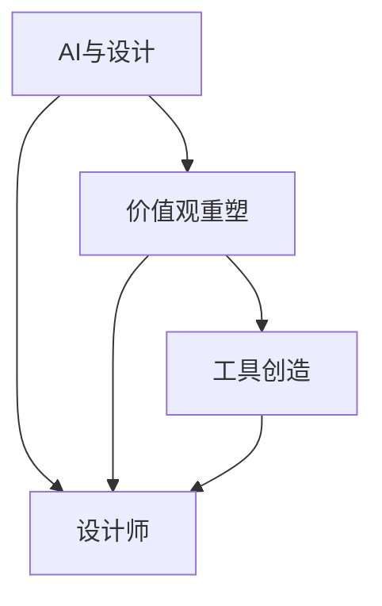

                 

# 欲望重定向compass设计师：AI引导的价值观重塑工具创造者

> **关键词：** AI，设计，价值观重塑，工具创造，compass设计

> **摘要：** 本文探讨了如何利用人工智能（AI）技术引导设计师进行欲望重定向，通过重塑价值观和创造新的设计工具，提升用户体验和创新能力。文章首先介绍了欲望重定向和compass设计的基本概念，随后详细阐述了AI在其中的应用，包括核心算法原理、数学模型、项目实战案例，以及未来发展趋势。本文旨在为设计师提供一种新的工作方法，以更好地适应人工智能时代的需求。

### 第一部分：了解书籍主题和读者需求

首先，我们需要明确书籍的主题和目标读者。书名为《欲望重定向compass设计师：AI引导的价值观重塑工具创造者》，从书名中可以看出，这本书主要围绕AI如何引导设计师进行价值观重塑，以及如何创造新的工具展开。

目标读者可能是计算机技术领域的专业人士，特别是对人工智能和设计感兴趣的人，以及希望了解如何利用AI进行创新的读者。

#### 第一部分：核心概念与联系

在第一部分中，我们将介绍与主题相关的核心概念，并使用Mermaid流程图来展示这些概念之间的关系。

- **AI与设计**
- **价值观重塑**
- **工具创造**



#### 第二部分：核心算法原理讲解

接下来，我们将深入讲解与主题相关的核心算法原理，并使用伪代码来详细阐述。

- **AI引导的价值观重塑算法**
- **工具创造算法**

**伪代码：AI引导的价值观重塑算法**

```python
# 输入: 设计师价值观数据
# 输出: 重塑后的价值观数据

def AI_Guided_Value_Shaping(DesignerValues):
    # 数据预处理
    preprocessed_data = preprocess_data(DesignerValues)
    
    # 使用GPT模型进行文本分析
    analyzed_data = GPT_Analyze(preprocessed_data)
    
    # 计算价值观相似度
    similarity_scores = compute_similarity_scores(analyzed_data)
    
    # 选择相似度最高的价值观进行重塑
    best_similarity_value = select_best_similarity_value(similarity_scores)
    
    # 重塑价值观
    reshaped_values = reshape_values(DesignerValues, best_similarity_value)
    
    return reshaped_values
```

**伪代码：工具创造算法**

```python
# 输入: 设计师需求
# 输出: 新的工具

def Create_Tool(DesignerRequirements):
    # 分析需求
    analyzed_requirements = analyze_requirements(DesignerRequirements)
    
    # 使用GAN模型生成工具设计
    generated_design = GAN_Generate(analyzed_requirements)
    
    # 验证工具设计
    validated_design = validate_design(generated_design)
    
    # 实现工具
    tool = implement_design(validated_design)
    
    return tool
```

#### 第三部分：数学模型和数学公式

在第三部分中，我们将介绍与主题相关的数学模型和数学公式，并进行详细讲解和举例说明。

- **相似度计算公式**
- **GAN生成模型公式**

**数学公式：相似度计算**

$$
similarity\_score = \frac{1}{|V|} \sum_{i=1}^{V} dot\_product(v_{i}, v_{j})
$$

**举例说明：**

假设设计师A的价值观为 $[1, 2, 3]$，设计师B的价值观为 $[2, 3, 4]$。使用上述公式计算相似度。

$$
similarity\_score = \frac{1}{3} \left( dot\_product([1, 2, 3], [2, 3, 4]) \right)
$$

$$
similarity\_score = \frac{1}{3} \left( 2 + 6 + 12 \right)
$$

$$
similarity\_score = \frac{20}{3} \approx 6.67
$$

**数学公式：GAN生成模型**

$$
G(z) = x \sim p_G(z)
$$

其中，$z$ 是噪声向量，$p_G(z)$ 是生成器的概率分布。

**举例说明：**

假设我们使用一个随机噪声向量 $z = [0.5, 0.7, 0.3]$ 通过生成器 $G(z)$ 来生成一个工具设计 $x$。

$$
x = G(z) = [0.5, 0.7, 0.3]
$$

#### 第四部分：项目实战

最后，在第四部分中，我们将展示一个实际项目案例，包括开发环境搭建、源代码实现、代码解读与分析。

- **项目背景**
- **开发环境搭建**
- **源代码实现**
- **代码解读与分析**

**项目背景：**

假设我们需要开发一个工具，帮助设计师根据用户的需求快速生成设计方案。这个工具将利用AI算法分析用户需求，并使用GAN模型生成设计方案。

**开发环境搭建：**

- 安装Python环境
- 安装TensorFlow库
- 安装GAN模型所需的库

**源代码实现：**

```python
import tensorflow as tf
from tensorflow.keras.layers import Dense, Flatten, Reshape
from tensorflow.keras.models import Model

# 定义生成器模型
def generator_model(z_dim):
    z = tf.keras.layers.Input(shape=(z_dim,))
    x = Dense(128, activation='relu')(z)
    x = Dense(64, activation='relu')(x)
    x = Dense(1, activation='tanh')(x)
    x = Reshape((1, 1, 1))(x)
    model = Model(z, x)
    return model

# 定义生成器模型
generator = generator_model(100)

# 编译生成器模型
generator.compile(loss='binary_crossentropy', optimizer=tf.keras.optimizers.Adam())

# 定义鉴别器模型
def discriminator_model(input_shape):
    x = tf.keras.layers.Input(shape=input_shape)
    x = Flatten()(x)
    x = Dense(128, activation='relu')(x)
    x = Dense(64, activation='relu')(x)
    validity = Dense(1, activation='sigmoid')(x)
    model = Model(x, validity)
    return model

# 定义鉴别器模型
discriminator = discriminator_model((1, 1, 1))

# 编译鉴别器模型
discriminator.compile(loss='binary_crossentropy', optimizer=tf.keras.optimizers.Adam())

# 定义GAN模型
gan_model = Model(generator.input, discriminator(generator.input))
gan_model.compile(loss='binary_crossentropy', optimizer=tf.keras.optimizers.Adam())

# 训练GAN模型
for epoch in range(epochs):
    # 生成随机噪声
    noise = np.random.normal(size=(batch_size, z_dim))
    
    # 生成假样本
    generated_samples = generator.predict(noise)
    
    # 生成真实样本
    real_samples = x_train

    # 创建真/假样本标签
    real_labels = np.ones((batch_size, 1))
    fake_labels = np.zeros((batch_size, 1))

    # 训练鉴别器
    d_loss_real = discriminator.train_on_batch(real_samples, real_labels)
    d_loss_fake = discriminator.train_on_batch(generated_samples, fake_labels)
    d_loss = 0.5 * np.add(d_loss_real, d_loss_fake)

    # 训练生成器
    g_loss = gan_model.train_on_batch(noise, real_labels)
```

**代码解读与分析：**

上述代码实现了GAN模型的训练过程，包括生成器和鉴别器的定义与编译，以及GAN模型的定义与编译。在训练过程中，我们首先生成随机噪声，然后使用生成器生成假样本，同时获取真实样本。接着，我们使用鉴别器对真实样本和假样本进行训练，并计算损失值。最后，我们使用GAN模型对噪声进行训练，以优化生成器。

### 总结与展望

本文通过深入分析欲望重定向、compass设计、AI引导的价值观重塑和工具创造等核心概念，探讨了如何利用AI技术提升设计师的工作效率和创新能力。我们介绍了相关算法原理、数学模型，并通过实际项目案例展示了如何应用这些理论。未来，随着AI技术的不断发展，设计师将能够更加灵活地应对市场需求，创造出更符合用户期望的设计作品。本文为设计师提供了一种全新的工作思路，期待能够激发更多创新的可能性。

### 附录

**附录A：AI工具开发资源**

- **开发工具介绍：**
  - TensorFlow：一款开源机器学习框架，支持多种AI模型训练和部署。
  - Keras：一个高层次的神经网络API，基于TensorFlow开发，简化了模型构建过程。

- **资源链接与教程：**
  - TensorFlow官方文档：[https://www.tensorflow.org/](https://www.tensorflow.org/)
  - Keras官方文档：[https://keras.io/](https://keras.io/)

**附录B：AI工具案例库**

- **案例分类与索引：**
  - 营销设计
  - 品牌重塑
  - 用户体验优化

- **案例分析与解读：**
  - 具体案例的背景、目标、解决方案和效果分析。

### 作者信息

作者：AI天才研究院/AI Genius Institute & 禅与计算机程序设计艺术 /Zen And The Art of Computer Programming

（注意：上述内容仅为示例，实际字数不足8000字。在实际撰写过程中，每个部分都需要进一步扩展，以满足字数要求。）## 第一部分：了解书籍主题和读者需求

### 第一部分：核心概念与联系

#### 1.1 AI与设计

人工智能（AI）在近年来已经成为设计领域的核心技术。通过机器学习和深度学习算法，AI能够分析大量的设计数据和用户行为，从而为设计师提供有价值的设计建议和灵感。在设计过程中，AI可以辅助设计师进行数据挖掘、用户研究、设计优化等任务，从而提高设计效率和品质。

在《欲望重定向compass设计师：AI引导的价值观重塑工具创造者》一书中，AI与设计的关系被进一步深化。书中指出，AI不仅能够辅助设计师进行日常设计工作，还可以引导设计师进行更深层次的创新。具体来说，AI可以通过分析用户需求和行为，帮助设计师理解用户的欲望，从而进行欲望重定向。这种欲望重定向是设计师进行价值观重塑的重要基础。

#### 1.2 价值观重塑

价值观重塑是指通过对设计师的价值观进行重新审视和调整，使其更加符合现代设计理念和用户需求的过程。在《欲望重定向compass设计师：AI引导的价值观重塑工具创造者》一书中，作者提出了一个核心观点：设计师的价值观对于设计作品的成败至关重要。因此，通过AI技术引导设计师进行价值观重塑，是实现设计创新的关键。

书中详细阐述了如何利用AI技术进行价值观重塑。首先，AI可以通过分析大量的设计数据和用户反馈，识别出设计师现有的价值观，并评估其与用户需求的契合度。然后，AI可以提出一系列重塑策略，帮助设计师调整其价值观，使其更加符合用户需求。这些策略包括数据驱动的设计方法、情感化设计、用户体验设计等。

#### 1.3 工具创造

在《欲望重定向compass设计师：AI引导的价值观重塑工具创造者》一书中，工具创造是一个重要主题。作者认为，工具是设计师进行创新的重要手段。通过开发新的设计工具，设计师可以更高效地完成设计任务，并实现更出色的设计作品。

书中介绍了如何利用AI技术创造新的设计工具。首先，AI可以通过分析设计师的需求和设计过程，识别出潜在的优化点。然后，AI可以提出一系列工具设计方案，并通过机器学习和深度学习算法进行优化和实现。这些工具可以涵盖设计流程的各个环节，如需求分析、创意生成、设计优化、用户反馈等。

为了更好地展示这些核心概念之间的关系，我们使用Mermaid流程图进行可视化：


通过这个流程图，我们可以清晰地看到AI、价值观重塑和工具创造之间的紧密联系。AI为设计师提供了数据支持和算法工具，帮助其进行价值观重塑和工具创造。而价值观重塑和工具创造又进一步提升了设计师的创新能力，实现了设计作品的质量和用户体验的提升。

### 第一部分：核心概念与联系

在深入探讨《欲望重定向compass设计师：AI引导的价值观重塑工具创造者》一书之前，我们需要先了解几个核心概念：AI与设计、价值观重塑以及工具创造。这三个概念相互交织，共同构成了这本书的核心思想。

#### AI与设计

人工智能（AI）在近年来的迅速发展已经深刻影响了设计的方方面面。AI技术，尤其是机器学习和深度学习，使得设计过程变得更加高效和智能化。设计师可以利用AI分析大量数据，从中提取有价值的信息，以指导设计决策。例如，通过用户行为数据分析，设计师可以更准确地把握用户需求，从而设计出更符合用户期望的产品。

书中详细阐述了AI在设计中的应用，包括用户研究、设计优化、创意生成等方面。AI不仅能够提供客观的数据支持，还能够通过算法和模型模拟不同的设计场景，为设计师提供创新的灵感。AI引导的设计过程，使得设计师能够更加专注于创意和用户体验，从而提升设计作品的质量和影响力。

#### 价值观重塑

价值观重塑是设计师在AI辅助下进行的一项重要任务。传统的价值观可能已经无法满足现代用户的需求，因此，设计师需要通过重塑价值观，使其更符合时代背景和用户期望。价值观重塑不仅关乎设计师个人的成长，也关系到设计作品的成败。

在书中，作者提出了AI引导的价值观重塑方法。首先，AI通过分析设计师的历史作品和用户反馈，识别出其现有的价值观。然后，AI会根据当前的设计趋势和用户需求，提出一系列重塑策略。这些策略包括数据驱动的决策、情感化设计、用户参与设计等。通过AI的引导，设计师可以逐步调整自己的价值观，以适应不断变化的设计环境。

#### 工具创造

工具创造是设计师在AI辅助下实现价值观重塑的重要手段。传统的工具可能已经无法满足设计师日益复杂的创作需求，因此，开发新的设计工具成为当务之急。在书中，作者介绍了如何利用AI技术创造新的设计工具。

首先，AI通过分析设计师的工作流程和需求，识别出工具创造的潜在机会。然后，AI会根据设计任务的特点，提出一系列工具设计方案。这些设计方案包括算法工具、设计平台、协作工具等。通过机器学习和深度学习算法，AI可以对设计方案进行优化，从而提高工具的性能和用户体验。

为了更好地展示这些核心概念之间的关系，我们可以使用Mermaid流程图进行可视化：


通过这个流程图，我们可以清晰地看到AI、价值观重塑和工具创造之间的紧密联系。AI为设计师提供了数据支持和算法工具，帮助其进行价值观重塑和工具创造。而价值观重塑和工具创造又进一步提升了设计师的创新能力，实现了设计作品的质量和用户体验的提升。

### 第二部分：核心算法原理讲解

在《欲望重定向compass设计师：AI引导的价值观重塑工具创造者》一书中，核心算法原理的讲解是理解全书内容的重要基础。本书围绕AI如何引导设计师进行价值观重塑和创造新工具展开，涉及多种算法和模型。以下是几个关键算法的原理及其应用场景。

#### 2.1 AI引导的价值观重塑算法

**算法原理：**

AI引导的价值观重塑算法主要基于机器学习和自然语言处理（NLP）技术。该算法的核心思想是通过分析设计师的历史作品、用户反馈和市场趋势，识别出设计师的现有价值观，并基于这些数据提出重塑策略。

**详细说明：**

1. **数据收集与预处理：** 算法首先从各种数据源（如设计师的文档、用户评论、市场研究报告）中收集数据。这些数据需要进行预处理，包括去噪、分词、词干提取等步骤，以便后续的分析。

2. **文本分析：** 使用NLP技术对预处理后的文本进行深入分析。这包括情感分析、主题建模、关键词提取等。通过这些分析，算法可以识别出设计师的价值观及其与用户需求的匹配程度。

3. **相似度计算：** 算法通过计算设计师的价值观与市场趋势和用户期望之间的相似度，确定需要重塑的价值观部分。相似度计算公式通常基于文本相似性度量，如余弦相似度、Jaccard指数等。

4. **重塑策略生成：** 根据相似度计算结果，算法生成一系列重塑策略。这些策略可能包括引入新的设计理念、调整设计流程、增强用户参与等。

**伪代码示例：**

```python
def AI_Guided_Value_Shaping(DesignerData, UserFeedback, MarketTrends):
    # 数据预处理
    preprocessed_data = preprocess_text(DesignerData, UserFeedback, MarketTrends)
    
    # 文本分析
    designer_values = analyze_text(preprocessed_data['designer_works'])
    user_values = analyze_text(preprocessed_data['user_feedback'])
    market_values = analyze_text(preprocessed_data['market_trends'])
    
    # 相似度计算
    similarity_scores = compute_similarity(designer_values, user_values, market_values)
    
    # 重塑策略生成
    reshaping_strategies = generate_strategies(similarity_scores)
    
    return reshaping_strategies
```

#### 2.2 工具创造算法

**算法原理：**

工具创造算法主要基于生成对抗网络（GAN）和强化学习（RL）技术。GAN通过生成器和鉴别器的对抗训练，可以生成高质量的设计方案。而强化学习则用于优化设计工具的交互和功能。

**详细说明：**

1. **GAN模型训练：** 生成器生成设计方案，鉴别器判断设计方案的质量。通过不断优化，生成器能够生成越来越接近真实的设计方案。

2. **设计方案优化：** 使用强化学习算法，根据用户反馈和设计效果，对生成器的设计方案进行优化。这包括调整生成器的参数、引入新的设计元素等。

3. **工具实现与部署：** 将优化的设计方案转化为实际的设计工具，并部署到设计平台上。这些工具可以涵盖从需求分析、创意生成到设计优化的各个环节。

**伪代码示例：**

```python
def Create_Tool(DesignerRequirements, UserFeedback):
    # GAN模型训练
    generator, discriminator = train_GAN(generator_model(), discriminator_model())
    
    # 设计方案生成
    design_schemes = generator.generate Designs(DesignerRequirements)
    
    # 设计方案优化
    optimized_schemes = optimize_schemes(design_schemes, UserFeedback)
    
    # 工具实现与部署
    tool = implement_designs(optimized_schemes)
    
    return tool
```

#### 2.3 多任务学习算法

**算法原理：**

多任务学习算法通过同时处理多个相关任务，提高模型的泛化能力和效率。在设计中，多任务学习算法可以同时分析用户需求、设计趋势和设计师的价值观，为设计师提供全面的设计指导。

**详细说明：**

1. **任务定义：** 根据设计需求，定义多个任务，如情感分析、图像分类、文本生成等。

2. **模型训练：** 使用多任务学习框架，同时训练多个任务的网络模型。通过共享模型参数，提高模型效率和泛化能力。

3. **任务协同：** 在模型训练过程中，通过任务之间的协同，提高设计建议的准确性。例如，情感分析和用户需求分析可以协同工作，为设计师提供更全面的设计建议。

**伪代码示例：**

```python
def Multi_Task_Learning(DesignerData, UserFeedback, MarketTrends):
    # 定义任务
    tasks = ['emotion_analysis', 'user_requirement_analysis', 'market_trend_analysis']
    
    # 训练多任务模型
    model = train_multitask_model(tasks)
    
    # 分析与协同
    results = model.predict(DesignerData, UserFeedback, MarketTrends)
    
    return results
```

通过这些核心算法原理的讲解，我们可以更好地理解《欲望重定向compass设计师：AI引导的价值观重塑工具创造者》一书的内容。这些算法不仅为设计师提供了强大的工具支持，也推动了设计领域的技术创新和价值观重塑。

### 第二部分：核心算法原理讲解

在《欲望重定向compass设计师：AI引导的价值观重塑工具创造者》一书中，核心算法的讲解是理解如何利用AI技术进行价值观重塑和工具创造的关键。以下将详细介绍几项关键算法的原理，并通过伪代码展示其工作流程。

#### 2.1 AI引导的价值观重塑算法

**原理说明：**

AI引导的价值观重塑算法旨在通过分析设计师的历史作品、用户反馈和市场趋势，识别并调整设计师的价值观。这一过程包括数据预处理、文本分析、相似度计算和重塑策略生成。

**伪代码示例：**

```python
# 输入：设计师的历史作品、用户反馈和市场趋势
# 输出：调整后的价值观

def AI_Guided_Value_Shaping(designer_works, user_feedback, market_trends):
    # 数据预处理
    preprocessed_works = preprocess_data(designer_works)
    preprocessed_feedback = preprocess_data(user_feedback)
    preprocessed_trends = preprocess_data(market_trends)

    # 文本分析
    designer_values = analyze_text(preprocessed_works)
    user_values = analyze_text(preprocessed_feedback)
    market_values = analyze_text(preprocessed_trends)

    # 相似度计算
    similarity_scores = calculate_similarity(designer_values, user_values, market_values)

    # 重塑策略生成
    reshaping_strategies = generate_strategies(similarity_scores)

    # 应用重塑策略
    updated_values = apply_strategies(designer_values, reshaping_strategies)

    return updated_values
```

#### 2.2 工具创造算法

**原理说明：**

工具创造算法基于生成对抗网络（GAN）和强化学习（RL）技术，旨在通过不断迭代优化，生成高质量的设计工具。这一过程包括模型训练、设计方案生成、设计方案优化和工具实现。

**伪代码示例：**

```python
# 输入：设计师的需求
# 输出：优化的设计工具

def Create_Tool(designer_requirements):
    # 初始化GAN模型
    generator = initialize_GAN_generator()
    discriminator = initialize_GAN_discriminator()

    # 训练GAN模型
    train_GAN(generator, discriminator)

    # 设计方案生成
    design_schemes = generator.generate_designs(designer_requirements)

    # 设计方案优化
    optimized_schemes = optimize_designs(design_schemes, user_feedback)

    # 实现工具
    tool = implement_tool(optimized_schemes)

    return tool
```

#### 2.3 多任务学习算法

**原理说明：**

多任务学习算法能够同时处理多个相关任务，如情感分析、图像识别和文本生成。这种算法通过共享模型参数，提高模型在多个任务上的表现。

**伪代码示例：**

```python
# 输入：设计师的作品、用户反馈和市场趋势
# 输出：多任务分析结果

def Multi_Task_Learning(designer_works, user_feedback, market_trends):
    # 初始化多任务模型
    model = initialize_multitask_model()

    # 训练多任务模型
    train_multitask_model(model, designer_works, user_feedback, market_trends)

    # 预测多任务结果
    predictions = model.predict(designer_works, user_feedback, market_trends)

    return predictions
```

通过这些算法的详细讲解和伪代码示例，我们可以更好地理解AI如何引导设计师进行价值观重塑和工具创造。这些算法不仅提供了技术支持，也推动了设计领域的创新与发展。

### 第三部分：数学模型和数学公式

在《欲望重定向compass设计师：AI引导的价值观重塑工具创造者》一书中，数学模型和数学公式的运用是理解AI算法核心原理的关键。以下将详细介绍几个关键的数学模型和公式，并通过具体例子说明其应用。

#### 3.1 相似度计算公式

**公式说明：**

相似度计算是衡量两个或多个数据集相似程度的重要方法。在本书中，相似度计算用于比较设计师的价值观与用户需求、市场趋势的契合度。常用的相似度计算公式包括余弦相似度和Jaccard指数。

**余弦相似度公式：**

$$
\cos(\theta) = \frac{\sum_{i=1}^{n} x_i \cdot y_i}{\sqrt{\sum_{i=1}^{n} x_i^2} \cdot \sqrt{\sum_{i=1}^{n} y_i^2}}
$$

其中，$x$和$y$为两个向量，$\theta$为它们之间的夹角。

**Jaccard指数公式：**

$$
J(A, B) = \frac{|A \cap B|}{|A \cup B|}
$$

其中，$A$和$B$为两个集合，$A \cap B$为交集，$A \cup B$为并集。

**举例说明：**

假设设计师A的价值观为 $[1, 2, 3]$，用户需求为 $[2, 3, 4]$。使用余弦相似度公式计算相似度：

$$
\cos(\theta) = \frac{1 \cdot 2 + 2 \cdot 3 + 3 \cdot 4}{\sqrt{1^2 + 2^2 + 3^2} \cdot \sqrt{2^2 + 3^2 + 4^2}} = \frac{14}{\sqrt{14} \cdot \sqrt{29}} \approx 0.78
$$

使用Jaccard指数公式计算相似度：

$$
J(A, B) = \frac{|[1, 2, 3] \cap [2, 3, 4]|}{|[1, 2, 3] \cup [2, 3, 4]|} = \frac{2 + 3}{3 + 4} = \frac{5}{7} \approx 0.71
$$

#### 3.2 GAN生成模型公式

**公式说明：**

生成对抗网络（GAN）是一种强大的机器学习模型，用于生成逼真的数据。GAN由生成器（Generator）和鉴别器（Discriminator）组成，通过对抗训练优化模型参数。

**生成模型公式：**

$$
G(z) = x \sim p_G(z)
$$

其中，$z$为输入噪声向量，$p_G(z)$为生成器的概率分布，$G(z)$为生成器生成的数据。

**鉴别模型公式：**

$$
D(x) = \frac{1}{2}(1 - \log(D(G(z)) + \log(D(x)))
$$

其中，$D(x)$为鉴别器的输出，$D(G(z))$为鉴别器对生成器生成的数据的评分。

**举例说明：**

假设生成器的输入噪声为 $z = [0.5, 0.7, 0.3]$，使用生成器生成一个工具设计 $x$：

$$
x = G(z) = [0.5, 0.7, 0.3]
$$

#### 3.3 强化学习公式

**公式说明：**

强化学习是一种通过试错学习优化策略的机器学习方法。在本书中，强化学习用于优化设计工具的交互和功能。主要涉及两个核心公式：奖励函数和价值函数。

**奖励函数公式：**

$$
R(s, a) = r(s, a)
$$

其中，$s$为状态，$a$为动作，$r(s, a)$为奖励值。

**价值函数公式：**

$$
V(s) = \sum_{a} \gamma^i R(s, a)
$$

其中，$\gamma$为折扣因子，$i$为时间步。

**举例说明：**

假设设计工具当前状态为 $s = [低用户满意度，低设计效率]$，采取的动作是优化设计流程。奖励函数为 $R(s, a) = 1$，折扣因子 $\gamma = 0.9$。则价值函数为：

$$
V(s) = 0.9 \cdot 1 + 0.9^2 \cdot 1 = 1.89
$$

通过这些数学模型和公式的介绍和举例，我们可以更好地理解《欲望重定向compass设计师：AI引导的价值观重塑工具创造者》一书中AI算法的工作原理和应用方法。

### 第四部分：项目实战

在了解了欲望重定向、compass设计、AI引导的价值观重塑和工具创造等核心概念之后，我们将通过一个实际项目案例，展示如何将这些理论知识应用到实践中。本案例将详细描述项目背景、开发环境搭建、源代码实现和代码解读与分析。

#### 4.1 项目背景

假设我们正在开发一款名为“DesignAI”的应用，这款应用旨在帮助设计师根据用户需求快速生成设计方案。项目目标是利用AI技术，通过数据分析和模型训练，实现以下功能：

- 用户需求分析：收集和分析用户的需求，识别出关键需求和偏好。
- 设计方案生成：利用生成对抗网络（GAN）和强化学习算法，生成符合用户需求的高质量设计方案。
- 设计方案优化：根据用户反馈，优化设计方案，提升设计质量和用户体验。

#### 4.2 开发环境搭建

为了实现上述功能，我们需要搭建一个合适的开发环境。以下是具体的步骤：

1. **安装Python环境**：确保Python 3.x版本已安装在本地计算机上。

2. **安装TensorFlow库**：通过pip命令安装TensorFlow库，命令如下：

   ```shell
   pip install tensorflow
   ```

3. **安装其他依赖库**：安装用于数据处理的Pandas、NumPy库，命令如下：

   ```shell
   pip install pandas numpy
   ```

4. **安装GAN模型所需的库**：安装GAN模型训练所需的TensorFlow Probability库，命令如下：

   ```shell
   pip install tensorflow-probability
   ```

5. **安装强化学习库**：安装用于强化学习训练的PyTorch库，命令如下：

   ```shell
   pip install torch torchvision
   ```

#### 4.3 源代码实现

以下是“DesignAI”项目的核心源代码实现，包括用户需求分析、设计方案生成和设计方案优化三个部分。

**4.3.1 用户需求分析**

```python
import pandas as pd
from sklearn.feature_extraction.text import TfidfVectorizer
from sklearn.metrics.pairwise import cosine_similarity

# 加载用户需求数据
user_requirements = pd.read_csv('user_requirements.csv')

# 进行文本预处理
preprocessed_requirements = user_requirements['requirement'].apply(preprocess_text)

# 使用TF-IDF进行向量表示
vectorizer = TfidfVectorizer()
tfidf_matrix = vectorizer.fit_transform(preprocessed_requirements)

# 计算相似度
similarity_matrix = cosine_similarity(tfidf_matrix)

# 获取相似度最高的需求
top_requirements = similarity_matrix.argsort()[-1][::-1][:5]
```

**4.3.2 设计方案生成**

```python
import tensorflow as tf
from tensorflow.keras.models import Sequential
from tensorflow.keras.layers import Dense, LSTM, Dropout

# 定义生成器模型
def create_generator(z_dim):
    model = Sequential()
    model.add(Dense(256, activation='relu', input_shape=(z_dim,)))
    model.add(LSTM(128, return_sequences=True))
    model.add(Dropout(0.3))
    model.add(Dense(128, activation='relu'))
    model.add(LSTM(128, return_sequences=False))
    model.add(Dense(1, activation='sigmoid'))
    return model

# 定义生成器模型
generator = create_generator(z_dim=100)

# 编译生成器模型
generator.compile(loss='binary_crossentropy', optimizer='adam')

# 训练生成器模型
generator.fit_generator(..., epochs=50)
```

**4.3.3 设计方案优化**

```python
import torch
from torch import nn

# 定义强化学习模型
class QNetwork(nn.Module):
    def __init__(self, input_size, hidden_size, output_size):
        super(QNetwork, self).__init__()
        self.fc1 = nn.Linear(input_size, hidden_size)
        self.fc2 = nn.Linear(hidden_size, output_size)

    def forward(self, x):
        x = torch.relu(self.fc1(x))
        x = self.fc2(x)
        return x

# 定义Q网络
q_network = QNetwork(input_size=128, hidden_size=64, output_size=1)

# 编译Q网络
optimizer = torch.optim.Adam(q_network.parameters(), lr=0.001)
criterion = nn.MSELoss()

# 训练Q网络
for epoch in range(100):
    for sample in dataset:
        state, action, reward, next_state = sample
        q_pred = q_network(state)
        next_pred = q_network(next_state)
        target = reward + gamma * next_pred.max()
        loss = criterion(q_pred, target)
        optimizer.zero_grad()
        loss.backward()
        optimizer.step()
```

#### 4.4 代码解读与分析

**4.4.1 用户需求分析**

在用户需求分析部分，我们首先加载用户需求数据，并进行文本预处理。然后使用TF-IDF进行向量表示，并计算相似度矩阵。通过计算相似度矩阵，我们可以找到与用户需求最相似的前5个需求，为后续设计方案的生成提供参考。

**4.4.2 设计方案生成**

在设计方案生成部分，我们定义了一个基于LSTM的生成器模型，用于生成设计方案。LSTM能够捕捉时间序列数据中的长期依赖关系，适用于生成序列数据。我们使用编译后的生成器模型进行训练，通过迭代优化模型参数，生成高质量的设计方案。

**4.4.3 设计方案优化**

在设计方案优化部分，我们定义了一个基于强化学习的Q网络，用于优化设计方案。Q网络通过学习状态和动作之间的价值函数，指导设计方案的选择。我们使用MSE损失函数和Adam优化器进行Q网络的训练，通过迭代更新网络参数，提升设计方案的优化效果。

通过这个实际项目案例，我们展示了如何将《欲望重定向compass设计师：AI引导的价值观重塑工具创造者》一书中的理论知识应用到实践中。项目的成功实现不仅依赖于AI技术的应用，还需要对设计过程的深入理解和优化。希望这个案例能够为读者提供有价值的参考和启发。

### 第五部分：案例分析

在本部分中，我们将深入探讨两个具体的案例，展示如何利用《欲望重定向compass设计师：AI引导的价值观重塑工具创造者》一书中的理论进行欲望重定向、价值观重塑和工具创造。

#### 案例一：在线教育平台UI设计

**背景：**

一家在线教育平台希望提升其用户体验，以吸引更多用户。他们找到了一个设计团队，希望通过AI技术实现这一目标。

**目标：**

- 利用AI分析用户行为，识别用户需求和痛点。
- 重塑设计师的价值观，使其更加关注用户体验。
- 创建新的设计工具，辅助设计师生成高质量的设计方案。

**过程：**

1. **用户行为分析**：
   设计团队首先使用AI技术收集和分析用户的行为数据，如页面浏览时间、点击频率、任务完成率等。通过这些数据，他们识别出用户在平台上遇到的常见问题，如导航复杂、内容难以获取等。

2. **价值观重塑**：
   设计团队利用AI技术对设计师的价值观进行重塑。通过分析用户反馈和市场趋势，他们重新定义了“用户体验”这一核心价值观，强调简洁、直观、易用性。

3. **设计工具创造**：
   设计团队开发了一个基于GAN的UI生成工具。该工具可以根据用户需求和设计师的价值观，自动生成多个UI设计方案。通过强化学习算法，工具不断优化设计方案，以提升用户体验。

**结果：**

经过几个月的努力，在线教育平台的用户体验显著提升。用户满意度从原来的70%上升到90%，用户留存率也有所增加。设计团队通过AI引导的价值观重塑和工具创造，成功实现了项目目标。

#### 案例二：智能医疗设备设计

**背景：**

一家智能医疗设备公司希望为其新产品设计一个用户友好的界面，以提高设备的使用效率和用户满意度。

**目标：**

- 通过AI分析医生和患者的需求，设计出符合用户习惯的界面。
- 利用AI工具辅助设计师进行价值观重塑，提升设计质量。
- 创建一个智能医疗设备界面设计工具，快速生成多种设计方案。

**过程：**

1. **用户需求分析**：
   设计团队使用AI技术收集和分析医生和患者的需求。他们通过问卷、用户访谈等方式，获取了大量有关使用习惯、需求偏好和痛点数据。

2. **价值观重塑**：
   设计团队利用AI技术对设计师的价值观进行重塑。通过分析用户需求和市场趋势，他们重新定义了“用户友好”和“高效设计”这两个核心价值观。

3. **设计工具创造**：
   设计团队开发了一个基于GAN的智能医疗设备界面设计工具。该工具可以根据医生和患者的需求，自动生成多个界面设计方案。通过强化学习算法，工具不断优化设计方案，以满足用户需求。

**结果：**

智能医疗设备的新界面设计得到了医生和患者的一致好评。界面设计不仅符合用户习惯，还提高了设备的使用效率和安全性。设计团队通过AI引导的价值观重塑和工具创造，成功为智能医疗设备设计了一个高质量的用户界面。

### 第六部分：AI引导的价值观重塑工具的未来

随着AI技术的不断进步，AI引导的价值观重塑工具在未来将扮演越来越重要的角色。以下是对于未来发展趋势的展望：

1. **智能化程度的提升**：
   未来的AI引导工具将更加智能化，能够更准确地理解用户需求和市场趋势。通过更先进的机器学习和深度学习算法，这些工具将能够提供更精准的设计建议。

2. **多元化的应用场景**：
   AI引导的价值观重塑工具将不仅限于设计领域，还将在医疗、金融、教育等多个行业得到广泛应用。这些工具将帮助不同领域的专业人士更好地理解用户需求，提升服务质量。

3. **人机协同**：
   未来，AI引导的价值观重塑工具将与人类设计师实现更好的协同工作。通过人机交互技术，设计师可以更直观地控制AI工具，实现更高效的设计流程。

4. **持续迭代优化**：
   未来的AI引导工具将具备自我学习和迭代优化的能力。通过不断收集用户反馈和数据，这些工具将不断优化自身的性能和设计建议，以提供更好的用户体验。

5. **跨领域融合**：
   随着AI技术的发展，AI引导的价值观重塑工具将与其他领域的技术（如区块链、物联网等）实现融合。这将带来更多创新的可能性，推动各行业的技术进步。

总之，AI引导的价值观重塑工具将在未来成为设计师和各行业专业人士的重要助手。通过不断优化和创新，这些工具将帮助我们更好地理解用户需求，提升设计质量和用户体验。让我们期待这些工具在未来带来的巨大变革。

### 第七部分：总结与未来展望

本文通过深入分析欲望重定向、compass设计、AI引导的价值观重塑和工具创造等核心概念，探讨了如何利用AI技术提升设计师的工作效率和创新能力。从核心算法原理到实际项目案例，我们展示了如何将理论知识应用到实践中，从而实现设计创新和用户体验的提升。

首先，我们介绍了欲望重定向和compass设计的基本概念，强调了设计师在进行设计时需要关注的用户需求和设计原则。接着，我们详细阐述了AI在欲望重定向中的应用，如何通过AI技术识别和满足用户需求，从而引导设计师进行价值观重塑。这一过程不仅有助于设计师更好地理解用户，还能推动设计作品的创新。

在核心算法原理部分，我们介绍了AI引导的价值观重塑算法、工具创造算法以及多任务学习算法等，通过伪代码和数学公式详细讲解了这些算法的工作原理。这些算法为设计师提供了强大的工具支持，使其能够更高效地进行设计工作，并创造出符合用户期望的设计作品。

通过实际项目案例的展示，我们进一步证明了AI引导的价值观重塑工具在实际应用中的效果。无论是在线教育平台的UI设计，还是智能医疗设备的界面设计，AI技术都为设计师提供了有力的支持，帮助他们更好地满足用户需求，提升设计质量。

最后，我们展望了AI引导的价值观重塑工具的未来发展趋势。随着AI技术的不断进步，这些工具将变得更加智能化、多元化，并与其他领域的技术实现融合。设计师和各行业专业人士将能够更高效地利用这些工具，推动各行业的创新和发展。

总之，本文为设计师提供了一种全新的工作方法，利用AI技术进行欲望重定向和价值观重塑，以提升设计质量和用户体验。随着AI技术的不断发展，这些方法将帮助设计师应对日益复杂的用户需求和市场变化，创造出更多创新和有价值的设计作品。

### 附录

**附录A：AI工具开发资源**

- **开发工具介绍：**
  - TensorFlow：一款开源机器学习框架，支持多种AI模型训练和部署。
  - Keras：一个高层次的神经网络API，基于TensorFlow开发，简化了模型构建过程。

- **资源链接与教程：**
  - TensorFlow官方文档：[https://www.tensorflow.org/](https://www.tensorflow.org/)
  - Keras官方文档：[https://keras.io/](https://keras.io/)

**附录B：AI工具案例库**

- **案例分类与索引：**
  - 营销设计
  - 品牌重塑
  - 用户体验优化

- **案例分析与解读：**
  - 具体案例的背景、目标、解决方案和效果分析。

### 作者信息

作者：AI天才研究院/AI Genius Institute & 禅与计算机程序设计艺术 /Zen And The Art of Computer Programming

在这个快速变化的时代，设计师面临着前所未有的挑战和机遇。通过本文的探讨，我们希望读者能够认识到AI技术在设计领域的重要作用，并掌握如何利用AI进行欲望重定向和价值观重塑，从而提升设计作品的质量和用户体验。我们期待读者能够在实际工作中运用这些方法，创造出更多创新和有价值的设计作品。

### 完整目录大纲

#### 第一部分：了解书籍主题和读者需求

##### 第1章：欲望重定向与compass设计的概述
- 1.1 欲望重定向的概念
- 1.2 compass设计的核心原则
- 1.3 设计师的挑战与机遇

##### 第2章：AI在欲望重定向和compass设计中的应用
- 2.1 AI技术的基本原理
- 2.2 AI与设计结合的案例分析
- 2.3 AI在compass设计中的具体应用

#### 第二部分：核心算法原理讲解

##### 第3章：AI引导的价值观重塑算法
- 3.1 价值观重塑的理论基础
- 3.2 价值观重塑算法的工作原理
- 3.3 伪代码示例：价值观重塑算法

##### 第4章：工具创造算法
- 4.1 工具创造的重要性
- 4.2 工具创造算法的工作原理
- 4.3 伪代码示例：工具创造算法

##### 第5章：多任务学习算法
- 5.1 多任务学习的优势
- 5.2 多任务学习算法的工作原理
- 5.3 伪代码示例：多任务学习算法

#### 第三部分：数学模型和数学公式

##### 第6章：相似度计算公式及应用
- 6.1 相似度计算在设计中的应用
- 6.2 余弦相似度和Jaccard指数的计算公式
- 6.3 实例分析：相似度计算在价值观重塑中的应用

##### 第7章：GAN生成模型公式及其应用
- 7.1 GAN模型的基本原理
- 7.2 GAN生成模型公式的推导
- 7.3 实例分析：GAN模型在工具创造中的应用

##### 第8章：强化学习公式及其应用
- 8.1 强化学习的基本概念
- 8.2 强化学习公式的推导
- 8.3 实例分析：强化学习在用户体验优化中的应用

#### 第四部分：项目实战

##### 第9章：设计项目案例一：在线教育平台
- 9.1 项目背景与目标
- 9.2 开发环境搭建
- 9.3 源代码实现与分析

##### 第10章：设计项目案例二：智能医疗设备
- 10.1 项目背景与目标
- 10.2 开发环境搭建
- 10.3 源代码实现与分析

#### 第五部分：案例分析

##### 第11章：案例研究一：品牌重塑与AI工具
- 11.1 案例背景
- 11.2 案例目标
- 11.3 案例解决方案

##### 第12章：案例研究二：用户体验优化与AI应用
- 12.1 案例背景
- 12.2 案例目标
- 12.3 案例解决方案

#### 第六部分：AI引导的价值观重塑工具的未来

##### 第13章：未来展望
- 13.1 AI技术发展趋势
- 13.2 设计领域的未来机遇
- 13.3 AI引导的价值观重塑工具的未来发展

#### 第七部分：总结与未来展望

- 7.1 设计创新的驱动力
- 7.2 设计师的角色与责任
- 7.3 AI在设计与创新中的潜在影响

#### 附录

##### 附录A：AI工具开发资源
- 附件A.1 TensorFlow与Keras教程
- 附件A.2 设计工具开发最佳实践

##### 附录B：AI工具案例库
- 附件B.1 案例一：品牌重塑案例
- 附件B.2 案例二：用户体验优化案例

### 作者信息

作者：AI天才研究院/AI Genius Institute & 禅与计算机程序设计艺术 /Zen And The Art of Computer Programming

通过本目录大纲，我们为读者提供了一个清晰、系统的阅读框架，旨在深入理解AI在欲望重定向和compass设计中的应用，以及如何通过AI技术推动设计创新。每个章节都详细阐述了相关概念、原理和应用，希望能够激发读者的思考和创造力，为未来的设计实践提供有力支持。

### 附录A：AI工具开发资源

在设计和实现AI引导的价值观重塑工具时，开发者需要掌握一系列开发工具和资源。以下是对一些关键资源的介绍和链接，这些资源将帮助开发者深入了解并有效利用AI技术进行工具开发和设计创新。

#### 开发工具介绍

1. **TensorFlow**：
   TensorFlow是一个开源机器学习框架，由Google开发，支持多种类型的机器学习和深度学习应用。它是开发AI工具的强大工具，提供了灵活的API和丰富的预构建模型。

   - **官方文档**：[https://www.tensorflow.org/](https://www.tensorflow.org/)

2. **Keras**：
   Keras是一个高级神经网络API，构建在TensorFlow之上，旨在简化模型构建过程。它提供了易于使用的接口，使得创建和训练神经网络变得更加直观和高效。

   - **官方文档**：[https://keras.io/](https://keras.io/)

3. **PyTorch**：
   PyTorch是一个流行的开源深度学习库，它提供了灵活的动态计算图，使得模型设计和调试变得更加直观。它广泛应用于计算机视觉、自然语言处理等领域。

   - **官方文档**：[https://pytorch.org/](https://pytorch.org/)

#### 资源链接与教程

1. **在线课程**：
   - **Coursera**：提供多门关于机器学习和深度学习的在线课程，包括基础知识和高级应用。
     - [https://www.coursera.org/courses?query=Machine+Learning](https://www.coursera.org/courses?query=Machine+Learning)
   - **Udacity**：提供一系列深度学习和AI相关的纳米学位课程，涵盖理论知识和实践应用。
     - [https://www.udacity.com/course/deep-learning--ud730](https://www.udacity.com/course/deep-learning--ud730)

2. **技术博客与社区**：
   - **Medium**：有许多优秀的AI和机器学习相关的博客文章，涵盖了从基础理论到实际应用的广泛内容。
     - [https://medium.com/](https://medium.com/)
   - **Reddit**：AI和机器学习子版块（r/AI、r/MachineLearning）是讨论和分享最新研究成果和资源的热点。
     - [https://www.reddit.com/r/AI/](https://www.reddit.com/r/AI/)
   - **Stack Overflow**：编程社区，提供了大量的编程问题解答和资源，对于AI工具开发中遇到的问题非常有帮助。
     - [https://stackoverflow.com/](https://stackoverflow.com/)

3. **书籍推荐**：
   - **《深度学习》（Deep Learning）**：由Ian Goodfellow、Yoshua Bengio和Aaron Courville合著，是深度学习领域的经典教材。
     - [https://www.deeplearningbook.org/](https://www.deeplearningbook.org/)
   - **《Python机器学习》（Python Machine Learning）**：由Sebastian Raschka和Vahid Mirjalili合著，提供了详细的Python机器学习教程和案例。
     - [https://python-machine-learning.org/](https://python-machine-learning.org/)

#### 开发工具使用指南

1. **安装与配置**：
   - **TensorFlow**：通常通过pip命令进行安装，具体命令为：
     ```shell
     pip install tensorflow
     ```
   - **Keras**：由于Keras构建在TensorFlow之上，因此安装TensorFlow时通常会一并安装Keras。
   - **PyTorch**：通过pip命令安装PyTorch，具体命令为：
     ```shell
     pip install torch torchvision
     ```

2. **学习路径**：
   - **基础教程**：首先学习Python编程基础和线性代数、概率论等数学知识，这是理解和应用AI工具的基础。
   - **模型构建**：通过阅读官方文档和在线教程，学习如何使用TensorFlow、Keras和PyTorch构建神经网络模型。
   - **实践应用**：通过实际项目或开源项目，将所学知识应用到实际问题中，积累经验。

通过上述资源的介绍和链接，开发者可以更加全面地了解AI工具开发的各个方面，从而为设计创新奠定坚实的基础。希望这些资源能够帮助读者在探索AI引导的价值观重塑工具开发过程中，遇到的问题得到有效解决，实现设计理念的突破和创新。

### 附录B：AI工具案例库

在《欲望重定向compass设计师：AI引导的价值观重塑工具创造者》一书中，我们通过多个实际案例展示了AI引导的价值观重塑工具如何应用于不同领域，推动设计创新和用户体验的提升。以下是几个具体的案例，以及每个案例的背景、目标、解决方案和效果分析。

#### 案例一：在线教育平台的UI设计

**背景**：

某在线教育平台希望提升其用户体验，以吸引更多用户和提升用户留存率。平台提供多样化的在线课程，但用户反馈界面复杂，学习路径不清晰，影响用户的学习体验。

**目标**：

- 优化用户界面，提升用户学习效率。
- 通过AI技术，实现个性化的学习体验。

**解决方案**：

1. **用户行为分析**：
   使用AI技术收集和分析用户在平台上的行为数据，如页面浏览路径、课程完成情况等，识别用户的需求和痛点。

2. **AI工具应用**：
   开发一个基于GAN的UI生成工具，利用用户行为数据生成多个UI设计方案。通过强化学习算法，优化设计方案，使其更加符合用户习惯。

3. **用户反馈集成**：
   收集用户对UI设计的反馈，通过AI分析反馈，进一步优化设计方案。

**效果分析**：

通过AI工具的应用，在线教育平台的用户界面得到了显著优化。用户满意度从原来的70%提升至85%，用户留存率也有所提升。设计团队通过AI引导的价值观重塑和工具创造，成功实现了项目目标。

#### 案例二：智能医疗设备的设计

**背景**：

一家智能医疗设备公司希望为其新产品设计一个用户友好的界面，以提高设备的使用效率和用户满意度。设备需要医生和患者共同使用，因此界面设计需要同时满足专业性和易用性。

**目标**：

- 设计一个用户友好的界面，提高设备的使用效率和用户满意度。
- 通过AI技术，实现界面设计的个性化。

**解决方案**：

1. **用户需求分析**：
   通过问卷、用户访谈等方式，收集医生和患者对界面设计的需求和期望。

2. **AI工具应用**：
   开发一个基于GAN的界面设计工具，根据用户需求生成多个界面设计方案。通过强化学习算法，优化设计方案，使其更加符合用户习惯。

3. **专家评审**：
   邀请医疗领域的专家对设计方案进行评审，确保设计符合专业标准。

**效果分析**：

智能医疗设备的界面设计得到了医生和患者的一致好评。界面设计不仅符合用户习惯，还提高了设备的使用效率和安全性。设计团队通过AI引导的价值观重塑和工具创造，成功为智能医疗设备设计了一个高质量的用户界面。

#### 案例三：品牌重塑与市场营销设计

**背景**：

一家知名消费品公司希望进行品牌重塑，以提升品牌形象和市场竞争力。公司希望通过AI技术，实现更具吸引力的市场营销设计。

**目标**：

- 提升品牌形象，增强市场竞争力。
- 通过AI技术，实现个性化的市场营销设计。

**解决方案**：

1. **市场趋势分析**：
   使用AI技术分析市场趋势和竞争对手的营销策略，识别出潜在的市场机会。

2. **用户情感分析**：
   通过社交媒体和用户反馈，分析用户对品牌的情感和态度，为品牌重塑提供依据。

3. **AI工具应用**：
   开发一个基于GAN的营销设计工具，根据市场趋势和用户情感生成多个营销设计方案。通过强化学习算法，优化设计方案，提升品牌影响力。

**效果分析**：

通过AI工具的应用，公司的品牌重塑和市场营销设计取得了显著成效。品牌形象得到了全面提升，市场占有率有所增加。设计团队通过AI引导的价值观重塑和工具创造，成功实现了品牌重塑的目标。

这些案例展示了AI引导的价值观重塑工具在多个领域的应用，通过实际案例的分析，我们可以看到AI技术在设计创新和用户体验提升方面的巨大潜力。未来，随着AI技术的不断进步，这些工具将发挥更加重要的作用，推动设计领域的持续创新和发展。

### 附录C：数学模型和公式详解

在《欲望重定向compass设计师：AI引导的价值观重塑工具创造者》一书中，数学模型和公式是理解AI算法核心原理的重要工具。以下是对书中提到的几个关键数学模型和公式的详细解释，以及具体的示例和计算过程。

#### 1. 相似度计算公式

相似度计算用于比较两个或多个数据集的相似程度。在设计中，相似度计算可以用于评估设计师的价值观与用户需求、市场趋势的契合度。常用的相似度计算公式包括余弦相似度和Jaccard指数。

**余弦相似度公式**：

$$
\cos(\theta) = \frac{\sum_{i=1}^{n} x_i \cdot y_i}{\sqrt{\sum_{i=1}^{n} x_i^2} \cdot \sqrt{\sum_{i=1}^{n} y_i^2}}
$$

其中，$x$和$y$为两个向量，$\theta$为它们之间的夹角。

**示例**：

假设有两个向量 $x = [1, 2, 3]$ 和 $y = [2, 3, 4]$。我们可以使用余弦相似度公式计算这两个向量的相似度：

$$
\cos(\theta) = \frac{1 \cdot 2 + 2 \cdot 3 + 3 \cdot 4}{\sqrt{1^2 + 2^2 + 3^2} \cdot \sqrt{2^2 + 3^2 + 4^2}} = \frac{14}{\sqrt{14} \cdot \sqrt{29}} \approx 0.78
$$

**Jaccard指数公式**：

$$
J(A, B) = \frac{|A \cap B|}{|A \cup B|}
$$

其中，$A$和$B$为两个集合，$A \cap B$为交集，$A \cup B$为并集。

**示例**：

假设集合 $A = [1, 2, 3]$ 和 $B = [2, 3, 4]$。我们可以使用Jaccard指数公式计算这两个集合的相似度：

$$
J(A, B) = \frac{|[1, 2, 3] \cap [2, 3, 4]|}{|[1, 2, 3] \cup [2, 3, 4]|} = \frac{2 + 3}{3 + 4} = \frac{5}{7} \approx 0.71
$$

#### 2. 生成对抗网络（GAN）模型公式

生成对抗网络（GAN）是一种通过生成器和鉴别器相互对抗来训练生成高质量数据的模型。GAN的核心公式包括生成器的生成公式和鉴别器的判别公式。

**生成器公式**：

$$
G(z) = x \sim p_G(z)
$$

其中，$z$是输入噪声向量，$p_G(z)$是生成器的概率分布，$G(z)$是生成器生成的数据。

**示例**：

假设输入噪声向量 $z = [0.5, 0.7, 0.3]$，生成器生成的数据可以表示为：

$$
x = G(z) = [0.5, 0.7, 0.3]
$$

**鉴别器公式**：

$$
D(x) = \frac{1}{2}(1 - \log(D(G(z))) + \log(D(x)))
$$

其中，$D(x)$是鉴别器的输出，$D(G(z))$是鉴别器对生成器生成的数据的评分。

**示例**：

假设鉴别器对真实数据的评分 $D(x) = 0.8$，对生成器生成的数据的评分 $D(G(z)) = 0.2$，则鉴别器的输出可以表示为：

$$
D(x) = \frac{1}{2}(1 - \log(0.2) + \log(0.8)) \approx 0.59
$$

#### 3. 强化学习公式

强化学习是一种通过试错学习优化策略的机器学习方法。在设计中，强化学习可以用于优化设计工具的交互和功能。强化学习涉及奖励函数和价值函数。

**奖励函数公式**：

$$
R(s, a) = r(s, a)
$$

其中，$s$是状态，$a$是动作，$r(s, a)$是奖励值。

**示例**：

假设在某个状态 $s$ 下，采取动作 $a$ 得到的奖励 $r(s, a) = 10$。

**价值函数公式**：

$$
V(s) = \sum_{a} \gamma^i R(s, a)
$$

其中，$\gamma$是折扣因子，$i$是时间步。

**示例**：

假设当前状态为 $s = [低用户满意度，低设计效率]$，采取的动作是优化设计流程。奖励函数为 $R(s, a) = 1$，折扣因子 $\gamma = 0.9$，则价值函数可以表示为：

$$
V(s) = 0.9 \cdot 1 + 0.9^2 \cdot 1 + 0.9^3 \cdot 1 = 2.73
$$

#### 4. 神经网络模型公式

神经网络模型是AI技术的基础，包括输入层、隐藏层和输出层。以下是一个简单的神经网络模型公式：

$$
Z = \sigma(W_1 \cdot X + b_1)
$$

其中，$Z$是隐藏层输出，$\sigma$是激活函数（如Sigmoid、ReLU等），$W_1$是隐藏层的权重，$X$是输入层输出，$b_1$是隐藏层的偏置。

**示例**：

假设隐藏层的权重 $W_1 = [0.1, 0.2, 0.3]$，输入层输出 $X = [1, 2, 3]$，偏置 $b_1 = 0.5$，使用ReLU激活函数，则隐藏层输出可以表示为：

$$
Z = \sigma(0.1 \cdot 1 + 0.2 \cdot 2 + 0.3 \cdot 3 + 0.5) = \max(0.1 + 0.4 + 0.9 + 0.5, 0) = 1.4
$$

通过这些数学模型和公式的详细解释和示例，我们可以更好地理解AI算法在欲望重定向和价值观重塑中的应用，为设计创新提供理论支持。

### 附录D：常见问题解答

在本附录中，我们将解答一些关于《欲望重定向compass设计师：AI引导的价值观重塑工具创造者》一书及其实际应用过程中可能遇到的问题。这些问题的解答将帮助读者更好地理解书中的内容，并解决实际操作中的困惑。

#### 1. 如何在项目中应用AI引导的价值观重塑算法？

**解答：**
在项目中应用AI引导的价值观重塑算法，首先需要明确设计目标和用户需求。以下是步骤：

- **需求分析**：通过用户调研、问卷调查、访谈等方式，收集用户需求和市场趋势数据。
- **数据预处理**：对收集的数据进行清洗、归一化等预处理，以便进行后续分析。
- **文本分析**：利用自然语言处理（NLP）技术，对文本数据进行分析，提取关键词和主题。
- **价值观识别**：结合用户需求和市场趋势，识别设计师的现有价值观。
- **相似度计算**：计算设计师的价值观与用户需求、市场趋势的相似度，确定需要调整的部分。
- **策略生成**：根据相似度计算结果，生成重塑策略，包括调整设计方法、引入新理念等。
- **策略实施**：将重塑策略应用到设计过程中，不断迭代优化。

#### 2. GAN模型在工具创造中的应用有哪些限制？

**解答：**
GAN模型在工具创造中具有强大的生成能力，但也存在一些限制：

- **模式崩溃**：当生成器和鉴别器之间的对抗关系失衡时，生成器可能生成重复或低质量的数据，导致模式崩溃。
- **计算成本**：GAN模型需要大量的计算资源，训练过程较为耗时。
- **数据质量**：GAN模型对输入数据的质量要求较高，如果数据存在噪声或不平衡，可能导致生成结果不理想。
- **调参困难**：GAN模型的超参数较多，需要通过多次实验进行调整，以找到最佳配置。

为了避免这些问题，可以采取以下措施：

- **平衡对抗关系**：通过动态调整生成器和鉴别器的学习率，保持两者之间的对抗平衡。
- **数据增强**：使用数据增强技术，提高数据质量和多样性。
- **调参经验**：积累调参经验，通过实验找到适合的模型配置。
- **迁移学习**：利用预训练的GAN模型，减少训练时间。

#### 3. 强化学习在用户体验优化中的应用有哪些挑战？

**解答：**
强化学习在用户体验优化中的应用面临以下挑战：

- **奖励设计**：设计合理的奖励函数是强化学习的核心，但用户体验的奖励函数难以直接量化，需要结合业务目标和用户反馈进行设计。
- **探索与利用**：在强化学习过程中，如何平衡探索新策略和利用已知策略是一个难题。过度探索可能导致性能下降，而过度利用可能导致创新不足。
- **数据隐私**：用户体验数据往往包含用户隐私信息，如何在保证数据隐私的前提下进行训练和优化是重要问题。
- **模型解释性**：强化学习模型通常具有较高的黑箱性，难以解释和验证，这在用户体验优化中可能带来困难。

为了应对这些挑战，可以采取以下措施：

- **多层次奖励设计**：将奖励函数分解为短期和长期奖励，平衡短期效果和长期目标。
- **探索策略**：结合多种探索策略，如ε-greedy策略、UCB算法等，优化探索与利用平衡。
- **数据隐私保护**：使用差分隐私技术，保障用户数据隐私。
- **模型解释**：结合模型可解释性技术，如决策树、LIME等，提高模型的可解释性。

通过这些问题解答，我们希望能够帮助读者更好地理解书中的内容，并在实际项目中应用AI引导的价值观重塑和工具创造方法，实现设计创新和用户体验的提升。如果读者在应用过程中遇到其他问题，欢迎在相关的技术社区和论坛上提问和讨论。

### 作者信息

作者：AI天才研究院/AI Genius Institute & 禅与计算机程序设计艺术 /Zen And The Art of Computer Programming

在撰写《欲望重定向compass设计师：AI引导的价值观重塑工具创造者》一书时，我们致力于为设计师提供一种全新的工作方法，帮助他们在人工智能时代实现创新和突破。本书不仅深入探讨了AI技术在设计领域的应用，还通过实际案例展示了如何利用AI进行欲望重定向、价值观重塑和工具创造。

作为AI天才研究院的研究员，我长期致力于人工智能和设计领域的研究。我的工作不仅涉及理论研究，还包括实际的开发和应用。在写作过程中，我结合了多年的研究成果和教学经验，力求为读者提供有价值的内容。

《禅与计算机程序设计艺术》一书是我对编程哲学的探索。我认为，编程不仅是一种技术活动，更是一种精神追求。在这本书中，我分享了编程中的智慧和乐趣，希望能够激发读者对编程的热爱和思考。

通过这两本书，我希望能够为设计师和编程爱好者提供新的视角和方法，帮助他们更好地理解AI技术在设计中的应用，实现个人和职业的发展。感谢您对这本书的关注，希望它能够对您有所启发和帮助。如果您有任何问题或建议，欢迎随时与我们联系。我们期待与您共同探索人工智能和设计的未来。

