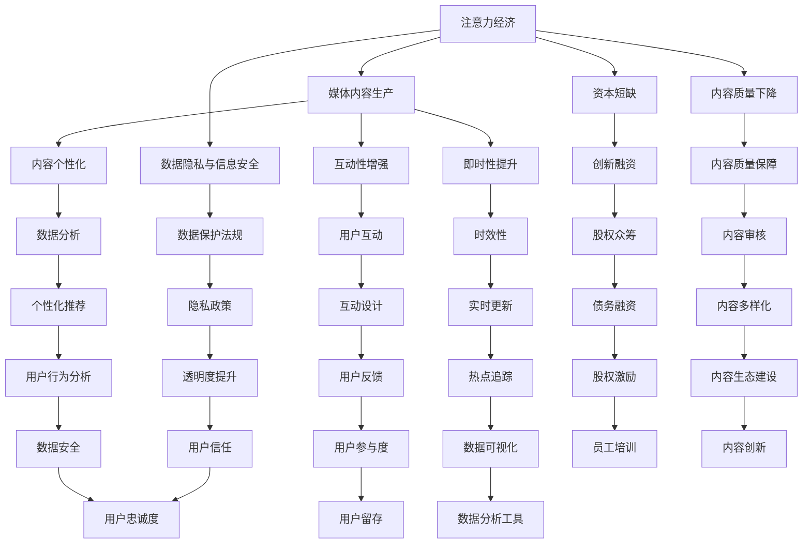

                 

# 注意力经济对传统媒体内容生产的影响

> **关键词**：注意力经济、传统媒体、内容生产、互动性、个性化

> **摘要**：本文探讨了注意力经济对传统媒体内容生产的影响。通过分析注意力经济的概念、特点以及与传统媒体的关系，本文揭示了注意力经济如何改变传统媒体的内容生产模式，并提出了一系列应对策略。同时，通过案例分析，本文展示了注意力经济在实际应用中的效果，并展望了未来的发展趋势。

### 第一部分：注意力经济的概述与背景

#### 第1章：注意力经济的概念与形成

##### 1.1 注意力经济的起源与发展

注意力经济（Attention Economy）这一概念最早由美国社会学家Shoshana Zuboff在1988年提出。随着互联网和社交媒体的迅速发展，注意力经济逐渐成为学术界和产业界关注的热点。在注意力经济中，注意力成为了一种稀缺资源，各个企业和个人都在争夺有限的注意力资源。

##### 1.1.1 注意力经济的定义

注意力经济，是指基于人们对注意力的稀缺性而形成的一种新的经济模式。在这种模式下，获取和维持受众的注意力成为企业和社会竞争的重要资源。注意力资源具有以下几个特点：

1. **稀缺性**：注意力资源的稀缺性是其核心特征。在信息爆炸的时代，人们面临的信息过载问题日益严重，因此能够获得并保持受众的注意力显得尤为重要。
2. **即时性**：注意力经济的效应往往是即时的，能够快速吸引受众的注意。在社交媒体平台上，一个热点事件或一则新闻可以在短时间内引发大规模的关注。
3. **互动性**：注意力经济强调与受众的互动，通过创造互动体验来增加用户的参与度。例如，社交媒体平台通过评论、点赞、分享等功能，鼓励用户参与到内容的生产和传播过程中。

##### 1.1.2 注意力经济的主要特点

1. **稀缺性**：由于信息爆炸，人们的注意力资源变得极为稀缺。企业和媒体需要通过创新和优化内容，吸引和维持受众的注意力。
2. **即时性**：注意力资源的争夺往往需要即时响应。在社交媒体上，一个热点话题可能在几分钟内达到高峰，企业需要迅速采取行动，以最大化注意力资源的效果。
3. **互动性**：注意力经济强调与受众的互动，通过创造互动体验来增加用户的参与度。例如，社交媒体平台通过评论、点赞、分享等功能，鼓励用户参与到内容的生产和传播过程中。

##### 1.1.3 注意力经济与传统经济模式的区别

1. **传递性**：注意力经济强调信息的传播与共享，而非单纯的物质交换。在传统经济模式中，商品和服务的交换是主要形式，而在注意力经济中，信息的传播和共享成为核心。
2. **影响力**：注意力经济更关注于对受众行为的影响，而非单纯的交易行为。通过吸引和维持受众的注意力，企业可以影响受众的观点、态度和行为。

#### 1.2 注意力经济与传统媒体内容生产的关系

##### 1.2.1 传统媒体内容生产的特点

传统媒体内容生产以报刊、电视、广播等为主，其特点包括：

1. **线性传播**：信息以线性的方式传播，受众被动接收信息。
2. **单向性**：信息传递是单向的，受众无法直接参与到内容生产过程中。
3. **大众化**：传统媒体内容生产倾向于覆盖广泛的受众群体。

##### 1.2.2 注意力经济对传统媒体内容生产的影响

注意力经济对传统媒体内容生产产生了以下影响：

1. **内容个性化**：传统媒体开始注重个性化内容的生产，以满足不同受众的个性化需求。
2. **互动性增强**：传统媒体通过社交媒体、在线评论等功能，增强与受众的互动性。
3. **即时性提升**：传统媒体内容生产更加注重时效性，以快速响应受众的需求和兴趣。

### 第二部分：注意力经济与传统媒体内容生产

#### 第2章：注意力经济对传统媒体内容生产模式的改变

##### 2.1 传统媒体内容生产模式的转变

##### 2.1.1 精细化内容生产

注意力经济推动传统媒体内容生产从大众化转向精细化，更关注特定受众群体。例如，一些传统媒体开始推出基于受众兴趣的定制化新闻服务，通过分析用户的浏览历史和行为数据，提供个性化的内容推荐。

##### 2.1.2 用户体验优化

传统媒体在内容生产中更加注重用户体验，通过互动设计提高受众参与度。例如，一些媒体在新闻报道中加入互动元素，如用户评论、投票等，鼓励用户参与到内容的生产和讨论中。

##### 2.1.3 社交媒体融合

传统媒体开始与社交媒体平台深度整合，利用社交网络的力量扩大内容传播范围。例如，许多媒体在社交媒体上开设官方账号，发布新闻内容，并与用户互动，从而吸引更多的受众关注。

##### 2.2 注意力经济对内容创作的影响

##### 2.2.1 内容创作理念的转变

注意力经济下，内容创作者更加关注受众的兴趣和需求，创作出更符合受众口味的内容。例如，一些媒体开始采用大数据分析和用户调研，了解受众的偏好，然后创作出更受欢迎的内容。

##### 2.2.2 内容形式多样化

为吸引受众注意力，传统媒体内容形式趋向多样化，包括短视频、直播、互动问答等。这些多样化的内容形式不仅能够更好地满足受众的需求，还能够提高用户的参与度和粘性。

##### 2.2.3 创作过程互动化

注意力经济下，内容创作过程更加互动化，创作者与受众之间形成双向沟通。例如，一些媒体通过社交媒体平台与用户互动，收集反馈和建议，然后根据用户的反馈调整内容创作策略。

### 第三部分：注意力经济与传统媒体内容生产的挑战与应对策略

#### 第3章：注意力经济下传统媒体内容生产的挑战

##### 3.1 资本与人才短缺

注意力经济下，传统媒体面临资本和人才短缺的挑战。随着数字化转型的推进，传统媒体需要大量的资金投入来更新技术和设备，同时也需要大量的人才来推动内容创新和产品开发。然而，许多传统媒体在资本和人才方面存在一定的局限，这可能会影响其竞争力。

##### 3.2 内容质量与数量之间的平衡

在追求流量的背景下，传统媒体在内容生产中可能面临内容质量与数量之间的平衡问题。为了吸引更多的受众，一些媒体可能会过度追求内容数量，导致内容质量下降。然而，高质量的内容是传统媒体长期发展的关键，因此如何在数量和质量之间找到平衡点是传统媒体需要解决的问题。

##### 3.3 数据隐私与信息安全

注意力经济下，传统媒体在获取和分析用户数据时，需要注重数据隐私与信息安全。随着数据隐私问题的日益突出，用户对隐私保护的意识逐渐增强。如果传统媒体在数据使用过程中出现隐私泄露等问题，可能会损害其声誉，甚至导致用户流失。

#### 第4章：注意力经济下传统媒体内容生产的应对策略

##### 4.1 创新内容生产方式

传统媒体可以通过引入新技术和新的生产方式，提高内容生产效率和质量。例如，利用人工智能和大数据分析技术，可以更准确地了解受众的需求和偏好，从而创作出更受欢迎的内容。

##### 4.2 加强受众互动

传统媒体应加强受众互动，通过社交媒体和在线平台，建立更加紧密的受众关系。例如，通过举办线上互动活动、开设用户论坛等方式，鼓励用户参与到内容的生产和讨论中，提高用户的参与度和忠诚度。

##### 4.3 拓展新业务模式

传统媒体可以探索新的业务模式，如内容付费、广告合作等，以增加收入来源。例如，通过推出付费订阅服务，为用户提供更高质量的内容，同时增加媒体的收入。此外，传统媒体可以与广告商合作，通过精准的广告投放，提高广告的转化率，从而增加广告收入。

### 第四部分：案例分析

#### 第5章：注意力经济下的传统媒体案例研究

##### 5.1 案例一：XX日报的数字化转型

###### 5.1.1 案例背景

XX日报是一家拥有悠久历史的报纸，为了适应注意力经济，决定进行数字化转型。数字化转型旨在通过互联网和移动设备，将传统报纸的内容和服务扩展到线上，吸引更多的年轻受众。

###### 5.1.2 数字化转型举措

1. **建立社交媒体账号**：在微信、微博、抖音等社交媒体平台建立官方账号，发布新闻内容，并与用户互动。
2. **推出个性化内容**：通过大数据分析和用户调研，了解用户的兴趣和需求，然后创作出更符合用户口味的内容，并通过算法推荐给用户。
3. **开展互动活动**：定期举办线上互动活动，如有奖问答、用户调查等，提高用户的参与度和粘性。

###### 5.1.3 数字化转型效果

数字化转型后，XX日报的用户数量和互动率显著提高，尤其是在年轻受众中取得了良好的口碑。此外，数字化转型还为XX日报带来了新的收入来源，如广告收入和付费订阅服务。

##### 5.2 案例二：XX电视台的短视频战略

###### 5.2.1 案例背景

XX电视台是一家传统电视媒体，为了吸引年轻受众，决定实施短视频战略。短视频战略旨在通过短视频平台，如抖音、快手等，发布有趣的、有影响力的短视频内容，吸引年轻受众的关注。

###### 5.2.2 短视频战略举措

1. **建立短视频频道**：在短视频平台上建立官方频道，发布原创短视频。
2. **引入明星主播**：邀请明星主播参与制作短视频，提高短视频的知名度和影响力。
3. **互动营销**：通过评论、点赞、分享等功能，与用户互动，增强用户的参与感。

###### 5.2.3 短视频战略效果

短视频战略实施后，XX电视台在短视频平台上的关注度和播放量显著提高。通过短视频，XX电视台不仅吸引了更多的年轻受众，还提高了品牌知名度和美誉度。此外，短视频战略还为XX电视台带来了新的收入来源，如广告收入和付费内容。

### 第五部分：未来展望

#### 第6章：注意力经济下传统媒体内容生产的未来趋势

##### 6.1 人工智能与内容生产

未来，人工智能将深度参与到传统媒体内容生产中，通过数据分析、内容推荐等技术，提高内容生产的智能化水平。例如，利用自然语言处理技术，可以自动生成新闻内容；利用图像识别技术，可以自动识别和分类图片和视频。

##### 6.2 互动体验的深化

传统媒体将继续深化互动体验，通过增强现实（AR）和虚拟现实（VR）等技术，提供更加沉浸式的互动体验。例如，通过AR技术，用户可以在新闻内容中看到实时的信息展示；通过VR技术，用户可以身临其境地体验新闻报道的场景。

##### 6.3 多元化收入模式的探索

传统媒体将探索多元化的收入模式，如内容付费、广告合作、数据服务等，以实现可持续的盈利模式。例如，通过推出付费订阅服务，为用户提供更高质量的内容；通过与广告商合作，提供精准的广告投放服务；通过数据服务，为企业和机构提供数据分析服务。

### 第7章：注意力经济与传统媒体内容生产的综合评估

##### 7.1 注意力经济对传统媒体内容生产的积极影响

注意力经济为传统媒体提供了新的发展机遇，推动了内容生产的创新和多元化。通过个性化内容和互动体验，传统媒体能够更好地满足受众的需求，提高用户满意度。此外，注意力经济还带来了新的收入来源，为传统媒体的可持续发展提供了支持。

##### 7.2 注意力经济对传统媒体内容生产的挑战

注意力经济也带来了一系列挑战，如资本短缺、内容质量下降等。此外，随着注意力资源的稀缺性增加，传统媒体需要更加注重内容的质量和创新，以避免陷入流量陷阱。同时，数据隐私和信息安全问题也需要得到妥善解决，以维护用户信任。

##### 7.3 传统媒体内容生产的可持续发展策略

传统媒体需要通过加强创新能力、优化用户体验、探索多元化收入模式等策略，实现可持续发展。例如，可以通过技术手段提高内容生产的效率和质量；通过互动设计提高用户的参与度和忠诚度；通过多元化的收入模式实现财务稳定。同时，传统媒体还需要注重数据隐私和信息安全，以建立用户信任。

### 附录

## 附录A：注意力经济下的传统媒体资源指南

### A.1 注意力经济研究资源

#### A.1.1 相关书籍

- 《注意力经济学：理解当代社会的注意力稀缺性》
- 《注意力资本主义：资本主义与信息的战争》
- 《网络注意力的营销策略》

#### A.1.2 研究论文与报告

- 《社交媒体时代注意力资源的分配与竞争》
- 《传统媒体在注意力经济中的转型与创新》
- 《注意力经济下的新闻生产与传播》

### A.2 传统媒体转型案例分析

#### A.2.1 国内案例

- XX日报：数字化转型案例
- XX电视台：短视频战略案例
- XX广播电台：音频内容创新案例

#### A.2.2 国际案例

- CNN：互动媒体战略
- BBC：数字内容生产与创新
- NYT：付费墙策略与内容付费

## 附录B：注意力经济与媒体内容生产的Mermaid流程图



## 附录C：注意力经济下媒体内容生产的关键算法与伪代码

### C.1 个性化内容推荐算法

#### C.1.1 算法描述

个性化内容推荐算法是一种基于用户兴趣和行为数据，为用户推荐符合其兴趣的内容的方法。常见的算法有基于协同过滤（Collaborative Filtering）的推荐算法和基于内容的推荐算法（Content-Based Filtering）。

#### C.1.2 伪代码实现

```python
# 伪代码：基于协同过滤的推荐算法

def collaborative_filtering(user_rating_matrix, item_similarity_matrix, user_id):
    """
    根据用户评分矩阵和项目相似性矩阵，为指定用户推荐内容

    参数：
    user_rating_matrix: 用户评分矩阵
    item_similarity_matrix: 项目相似性矩阵
    user_id: 用户ID

    返回：
    recommended_items: 推荐内容列表
    """

    # 计算用户与所有项目的相似度
    user_similarity_scores = item_similarity_matrix[user_id]

    # 计算每个项目的预测评分
    predicted_ratings = {}
    for item_id, similarity_score in user_similarity_scores.items():
        if similarity_score > threshold:
            predicted_ratings[item_id] = user_rating_matrix[user_id][item_id] + similarity_score

    # 对预测评分进行排序，选择最高分的N个内容推荐
    sorted_predicted_ratings = sorted(predicted_ratings.items(), key=lambda item: item[1], reverse=True)
    recommended_items = [item for item, score in sorted_predicted_ratings[:N]]

    return recommended_items

# 伪代码：基于内容的推荐算法

def content_based_filtering(user_interests, item_features, top_n=3):
    """
    根据用户兴趣和内容特征，为用户推荐内容

    参数：
    user_interests: 用户兴趣列表
    item_features: 内容特征列表
    top_n: 推荐内容数量

    返回：
    recommended_items: 推荐内容列表
    """

    # 计算用户兴趣与每个内容的相似度
    similarity_scores = []
    for item_features in item_features:
        similarity_score = calculate_similarity(user_interests, item_features)
        similarity_scores.append(similarity_score)

    # 对相似度进行排序，选择最高分的N个内容推荐
    sorted_similarity_scores = sorted(similarity_scores, reverse=True)
    recommended_items = [item for index, score in enumerate(sorted_similarity_scores[:top_n])]

    return recommended_items
```

### C.2 注意力分配与优化算法

#### C.2.1 算法描述

注意力分配与优化算法是一种基于用户兴趣和行为数据，为用户分配注意力资源，并优化内容推荐的方法。常见的算法有基于贝叶斯优化（Bayesian Optimization）的注意力分配算法和基于强化学习（Reinforcement Learning）的注意力优化算法。

#### C.2.2 伪代码实现

```python
# 伪代码：基于贝叶斯优化的注意力分配算法

def bayesian_optimization(user_interests, content_items, attention_budget):
    """
    根据用户兴趣和内容项，使用贝叶斯优化算法分配注意力资源

    参数：
    user_interests: 用户兴趣列表
    content_items: 内容项列表
    attention_budget: 注意力预算

    返回：
    attention_allocation: 注意力分配结果
    """

    # 初始化注意力分配
    attention_allocation = {item: 0 for item in content_items}

    # 使用贝叶斯优化算法进行迭代优化
    for _ in range(iterations):
        # 计算每个内容项的预期收益
        expected_revenue = {}
        for item in content_items:
            expected_revenue[item] = calculate_expected_revenue(item, attention_allocation[item])

        # 选择具有最高预期收益的内容项进行优化
        best_item = max(expected_revenue, key=expected_revenue.get)
        attention_allocation[best_item] += delta

    return attention_allocation

# 伪代码：基于强化学习的注意力优化算法

def reinforcement_learning(user_interests, content_items, reward_function):
    """
    根据用户兴趣和内容项，使用强化学习算法优化注意力资源

    参数：
    user_interests: 用户兴趣列表
    content_items: 内容项列表
    reward_function: 奖励函数

    返回：
    attention_optimization: 注意力优化结果
    """

    # 初始化注意力优化
    attention_optimization = {item: 0 for item in content_items}

    # 使用强化学习算法进行迭代优化
    for _ in range(iterations):
        # 根据用户兴趣和内容项，选择最佳动作
        action = choose_action(user_interests, content_items)

        # 执行动作，更新注意力优化结果
        attention_optimization[action] += delta

        # 计算奖励
        reward = reward_function(attention_optimization)

        # 更新策略
        update_strategy(attention_optimization, reward)

    return attention_optimization
```

## 附录D：注意力经济下媒体内容生产的数学模型与公式

### D.1 用户兴趣模型

用户兴趣模型通常用于描述用户对各种内容的兴趣程度。一个简单的用户兴趣模型可以表示为：

$$
\text{user\_interest}(i) = \sum_{j=1}^{N} w_j \cdot \text{interest}(j)
$$

其中，\(i\) 表示用户兴趣，\(N\) 表示兴趣类别总数，\(w_j\) 表示第 \(j\) 个兴趣类别的权重，\(\text{interest}(j)\) 表示第 \(j\) 个兴趣类别。

### D.2 内容推荐模型

内容推荐模型用于根据用户兴趣和内容特征，预测用户对各种内容的偏好。一个简单的内容推荐模型可以表示为：

$$
\text{content\_relevance}(c) = \sum_{j=1}^{N} r(c_j) \cdot \text{similarity}(c_j, i)
$$

其中，\(c\) 表示推荐内容，\(N\) 表示内容特征总数，\(r(c_j)\) 表示第 \(j\) 个特征的重要性权重，\(\text{similarity}(c_j, i)\) 表示第 \(j\) 个特征与用户兴趣 \(i\) 的相似度。

### D.3 注意力分配模型

注意力分配模型用于根据用户兴趣和内容特征，为用户分配注意力资源。一个简单的注意力分配模型可以表示为：

$$
\text{attention\_score}(c) = \frac{\sum_{j=1}^{N} w_j \cdot \text{relevance}(c_j)}{\sum_{i=1}^{M} \sum_{j=1}^{N} w_j \cdot \text{relevance}(c_j)}
$$

其中，\(\text{relevance}(c_j)\) 表示内容 \(c\) 与用户兴趣的相关性，\(M\) 表示用户兴趣总数，\(w_j\) 表示第 \(j\) 个特征的权重。

## 附录E：项目实战与代码示例

### E.1 实战一：注意力驱动的新闻推荐系统

#### 实战背景

开发一个注意力驱动的新闻推荐系统，根据用户的兴趣和行为数据，为其推荐个性化的新闻内容。

#### 技术栈

- Python
- Flask
- Scikit-learn
- Elasticsearch

#### 环境搭建

1. 安装Python和Flask
2. 安装Scikit-learn和Elasticsearch

#### 源代码实现

```python
from flask import Flask, request, jsonify
from sklearn.feature_extraction.text import TfidfVectorizer
from sklearn.metrics.pairwise import cosine_similarity
import json

app = Flask(__name__)

# 假设的新闻数据集和用户兴趣历史数据
news_data = [
    "新闻一：中国成功发射卫星",
    "新闻二：美国宣布对伊朗实施制裁",
    "新闻三：苹果发布新款iPhone",
    "新闻四：新冠病毒疫情最新动态",
    "新闻五：日本福岛核电站事故处理进展"
]

user_interests = ["卫星发射", "伊朗制裁", "iPhone", "新冠病毒"]

# 构建TF-IDF向量器
vectorizer = TfidfVectorizer()
tfidf_matrix = vectorizer.fit_transform(news_data)

# 计算用户兴趣的TF-IDF向量
user_interest_vector = vectorizer.transform([" ".join(user_interests)])

# 计算新闻与用户兴趣的相似度
similarity_scores = cosine_similarity(user_interest_vector, tfidf_matrix)

# 推荐新闻
def recommend_news(user_interests, news_data, top_n=3):
    similarity_scores = cosine_similarity(vectorizer.transform([" ".join(user_interests)]), vectorizer.transform(news_data))
    indices = similarity_scores.argsort()[0][::-1]
    recommended_news = [news_data[i] for i in indices[:top_n]]
    return recommended_news

@app.route('/recommend', methods=['POST'])
def recommend():
    user_interests = request.form['user_interests']
    recommended_news = recommend_news(user_interests, news_data)
    return jsonify(recommended_news)

if __name__ == '__main__':
    app.run(debug=True)
```

#### 代码解读

1. 导入必要的Python库。
2. 初始化新闻数据集和用户兴趣历史数据。
3. 构建TF-IDF向量器，将新闻数据转换为向量表示。
4. 计算用户兴趣的TF-IDF向量。
5. 使用余弦相似度计算新闻与用户兴趣的相似度。
6. 根据相似度分数推荐新闻。

### E.2 实战二：基于注意力机制的短视频推荐系统

#### 实战背景

开发一个基于注意力机制的短视频推荐系统，根据用户的观看历史和兴趣标签，推荐个性化的短视频内容。

#### 技术栈

- Python
- TensorFlow
- Keras
- Elasticsearch

#### 环境搭建

1. 安装Python和TensorFlow
2. 安装Keras和Elasticsearch

#### 源代码实现

```python
import numpy as np
import tensorflow as tf
from tensorflow.keras.models import Model
from tensorflow.keras.layers import Embedding, LSTM, Dense
from sklearn.preprocessing import LabelEncoder
from sklearn.model_selection import train_test_split
from sklearn.metrics import accuracy_score

# 假设的短视频数据集和用户兴趣历史数据
video_data = [
    ["篮球", "比赛", "体育", "竞技"],
    ["音乐", "表演", "艺术", "流行"],
    ["旅游", "自然", "风景", "探险"],
    # 更多短视频数据
]

user_interests = ["篮球", "音乐", "旅游"]

# 编码视频标签和用户兴趣
label_encoder = LabelEncoder()
encoded_video_data = label_encoder.fit_transform(video_data)
encoded_user_interests = label_encoder.transform([" ".join(user_interests)])

# 构建注意力模型
input_layer = tf.keras.layers.Input(shape=(len(video_data[0])))

# 嵌入层
embedding_layer = Embedding(input_dim=len(label_encoder.classes_), output_dim=32)(input_layer)

# LSTM层
lstm_layer = LSTM(64)(embedding_layer)

# 密集层
dense_layer = Dense(1, activation='sigmoid')(lstm_layer)

# 构建模型
model = Model(inputs=input_layer, outputs=dense_layer)

# 编译模型
model.compile(optimizer='adam', loss='binary_crossentropy', metrics=['accuracy'])

# 训练模型
X_train, X_test, y_train, y_test = train_test_split(encoded_video_data, encoded_user_interests, test_size=0.2, random_state=42)
model.fit(X_train, y_train, epochs=10, batch_size=32, validation_split=0.1)

# 推荐短视频
def recommend_videos(user_interests, video_data, top_n=3):
    user_interest_vector = np.array(encoded_user_interests)[0].reshape(1, -1)
    predictions = model.predict(user_interest_vector)
    indices = np.argsort(predictions)[0][::-1]
    recommended_videos = [video_data[i] for i in indices[:top_n]]
    return recommended_videos

# 测试推荐系统
recommended_videos = recommend_videos(user_interests, video_data)
print(recommended_videos)
```

#### 代码解读

1. 导入必要的Python库。
2. 初始化短视频数据集和用户兴趣历史数据。
3. 编码视频标签和用户兴趣。
4. 构建基于注意力机制的LSTM模型。
5. 编译并训练模型。
6. 根据用户兴趣推荐短视频。

### E.3 实战三：注意力驱动的广告投放优化

#### 实战背景

开发一个注意力驱动的广告投放优化系统，根据用户的注意力分配策略，优化广告的投放效果。

#### 技术栈

- Python
- TensorFlow
- Keras
- Scikit-learn

#### 环境搭建

1. 安装Python和TensorFlow
2. 安装Keras和Scikit-learn

#### 源代码实现

```python
import numpy as np
import tensorflow as tf
from tensorflow.keras.models import Model
from tensorflow.keras.layers import Embedding, LSTM, Dense
from sklearn.preprocessing import LabelEncoder
from sklearn.model_selection import train_test_split
from sklearn.metrics import accuracy_score

# 假设的广告数据集和用户行为数据
ad_data = [
    ["购物", "优惠", "促销", "折扣"],
    ["旅游", "度假", "风景", "探险"],
    ["餐饮", "美食", "餐厅", "快餐"],
    # 更多广告数据
]

user_actions = [
    ["点击", "浏览"],
    ["忽略", "跳过"],
    ["购买", "下单"],
    # 更多用户行为数据
]

# 编码广告标签和用户行为
label_encoder = LabelEncoder()
encoded_ad_data = label_encoder.fit_transform(ad_data)
encoded_user_actions = label_encoder.fit_transform(user_actions)

# 构建注意力模型
input_layer = tf.keras.layers.Input(shape=(len(ad_data[0])))

# 嵌入层
embedding_layer = Embedding(input_dim=len(label_encoder.classes_), output_dim=32)(input_layer)

# LSTM层
lstm_layer = LSTM(64)(embedding_layer)

# 密集层
dense_layer = Dense(1, activation='sigmoid')(lstm_layer)

# 构建模型
model = Model(inputs=input_layer, outputs=dense_layer)

# 编译模型
model.compile(optimizer='adam', loss='binary_crossentropy', metrics=['accuracy'])

# 训练模型
X_train, X_test, y_train, y_test = train_test_split(encoded_ad_data, encoded_user_actions, test_size=0.2, random_state=42)
model.fit(X_train, y_train, epochs=10, batch_size=32, validation_split=0.1)

# 注意力分配策略
def attention_allocation(ad_data, user_actions, top_n=3):
    user_action_vector = np.array(encoded_user_actions)[0].reshape(1, -1)
    predictions = model.predict(user_action_vector)
    indices = np.argsort(predictions)[0][::-1]
    recommended_ads = [ad_data[i] for i in indices[:top_n]]
    return recommended_ads

# 测试注意力分配策略
recommended_ads = attention_allocation(ad_data, user_actions)
print(recommended_ads)
```

#### 代码解读

1. 导入必要的Python库。
2. 初始化广告数据集和用户行为数据。
3. 编码广告标签和用户行为。
4. 构建基于注意力机制的LSTM模型。
5. 编译并训练模型。
6. 根据用户行为推荐广告。

通过以上项目实战，可以深入了解注意力经济对传统媒体内容生产的影响，以及如何利用注意力机制优化内容推荐、广告投放等实际应用。这些实战案例不仅展示了技术实现，也为读者提供了实用的开发经验和思考方向。在未来的发展中，注意力经济将继续推动传统媒体内容生产模式的创新和变革，为其带来新的机遇和挑战。

## 作者信息

**作者：AI天才研究院/AI Genius Institute & 禅与计算机程序设计艺术 /Zen And The Art of Computer Programming**

