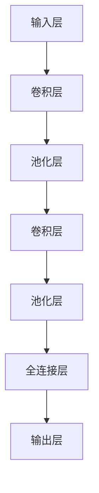
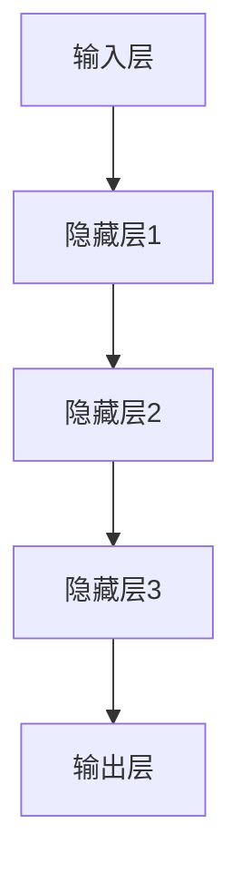

                 

### 《深度学习在高质量语音合成中的研究》

关键词：深度学习、语音合成、神经网络、生成对抗网络、端到端模型、语音质量评估

摘要：
随着深度学习技术的不断发展，语音合成领域迎来了新的变革。本文首先回顾了深度学习的基础理论，包括神经网络、深度学习模型和优化算法，以及语音合成的原理和基本技术。接着，深入探讨了深度学习在语音合成中的应用，如卷积神经网络（CNN）、循环神经网络（RNN）和长短时记忆网络（LSTM）等。此外，还介绍了生成对抗网络（GAN）在语音合成中的应用以及端到端语音合成模型。最后，对深度学习在语音合成中的优化与评估方法进行了详细分析，并通过实际案例展示了深度学习在语音合成领域的应用效果。本文旨在为读者提供一幅深度学习在高质量语音合成研究中全方位的图谱。

## 第一部分：深度学习基础与语音合成原理

深度学习和语音合成是两个看似独立但又紧密相关的领域。深度学习作为一种机器学习方法，已经在图像识别、自然语言处理等多个领域取得了突破性的成果。而语音合成则是将文本转换为自然流畅的语音的过程，它在人机交互、智能语音助手等领域具有重要的应用价值。本部分将首先介绍深度学习的基础知识，然后深入探讨语音合成的原理和基本技术。

### 第1章：深度学习基础

深度学习是机器学习的一个子领域，它通过构建深层神经网络来模拟人脑的神经网络结构，以实现自动特征提取和学习复杂模式。以下是深度学习的一些基础概念和主要内容。

#### 1.1.1 深度学习概述

深度学习起源于1980年代，但由于计算能力和数据资源不足，早期发展较为缓慢。随着计算机性能的不断提升和大数据的涌现，深度学习在2010年后迎来了爆发式增长。目前，深度学习在计算机视觉、自然语言处理、语音识别等领域取得了显著成果。

#### 1.1.2 深度学习的基本概念

深度学习的基本概念包括神经网络、多层感知机（MLP）、反向传播算法、激活函数、权重初始化等。其中，神经网络是深度学习的基础，它由大量的神经元连接而成，每个神经元通过权重连接到其他神经元，并通过激活函数进行处理。

#### 1.2 神经网络与深度学习模型

神经网络是深度学习的基础，它由大量神经元组成，每个神经元通过权重连接到其他神经元，并通过激活函数进行处理。常见的深度学习模型包括卷积神经网络（CNN）、循环神经网络（RNN）、长短时记忆网络（LSTM）等。

#### 1.2.1 神经网络的基本结构

神经网络的基本结构包括输入层、隐藏层和输出层。输入层接收外部输入数据，隐藏层对输入数据进行特征提取和变换，输出层生成预测结果。

#### 1.2.2 常见的深度学习模型

常见的深度学习模型包括卷积神经网络（CNN）、循环神经网络（RNN）、长短时记忆网络（LSTM）等。这些模型在图像识别、语音识别、自然语言处理等领域具有广泛的应用。

#### 1.3 深度学习优化算法

深度学习优化算法是训练深度学习模型的关键，常见的优化算法包括梯度下降、随机梯度下降（SGD）、Adam等。这些算法通过不断调整网络权重，使模型在训练数据上达到最优。

#### 1.3.1 前向传播与反向传播

前向传播和反向传播是深度学习训练过程中的两个关键步骤。前向传播用于计算网络输出，反向传播用于计算梯度并更新网络权重。

#### 1.3.2 梯度下降与优化算法

梯度下降是深度学习优化算法的一种，它通过计算损失函数的梯度来更新网络权重。常见的优化算法包括随机梯度下降（SGD）、Adam等，它们在训练效率和收敛速度方面各有优势。

### 第2章：语音合成基本原理

语音合成是将文本转换为自然流畅的语音的过程，它在人机交互、智能语音助手等领域具有重要的应用价值。以下是语音合成的一些基本概念和原理。

#### 2.1 语音合成概述

语音合成的发展历程可以追溯到20世纪50年代，最初采用的是规则基方法。随着技术的发展，语音合成逐渐采用统计基方法，如隐藏马尔可夫模型（HMM）和循环神经网络（RNN）。近年来，深度学习技术的应用使语音合成取得了重大突破。

#### 2.1.1 语音合成的发展历程

语音合成的发展历程可以分为三个阶段：规则基方法、统计基方法和深度学习方法。规则基方法主要基于语言学知识和语音规则进行语音合成；统计基方法采用统计模型来建模语音信号；深度学习方法通过构建深层神经网络来学习语音特征和生成语音波形。

#### 2.1.2 语音合成的分类与比较

语音合成可以分为两大类：单位选择语音合成和参数合成语音合成。单位选择语音合成通过查找预先录制的语音片段来生成语音；参数合成语音合成通过生成语音参数来生成语音波形。这两种方法各有优缺点，适用于不同的应用场景。

#### 2.2 语音信号处理基础

语音信号处理是语音合成的重要组成部分，它包括语音信号的表示方法和处理技术。常见的语音信号表示方法包括离散余弦变换（DCT）、小波变换等；常见的语音信号处理技术包括预加重、加窗、滤波等。

#### 2.2.1 语音信号的表示方法

语音信号的表示方法包括波形表示、频谱表示和倒谱表示等。波形表示直接反映了语音信号的时域特性；频谱表示反映了语音信号的频率特性；倒谱表示则反映了语音信号的短时能量分布。

#### 2.2.2 语音信号的处理技术

语音信号的处理技术包括预处理和后处理。预处理技术包括去除噪声、降低噪声等；后处理技术包括音频编辑、音频增强等。

#### 2.3 语音合成模型

语音合成模型是语音合成的核心，它通过学习文本和语音信号之间的关系来生成语音波形。常见的语音合成模型包括观察者模型、生成对抗网络（GAN）和端到端模型等。

#### 2.3.1 观察者模型

观察者模型是一种基于统计方法的语音合成模型，它通过建立语音特征和文本特征之间的关系来生成语音波形。观察者模型可以分为线性观察者模型和非线性观察者模型。

#### 2.3.2 生成对抗网络

生成对抗网络（GAN）是一种基于深度学习的方法，它由生成器和判别器两个神经网络组成。生成器试图生成与真实数据相似的样本，而判别器则试图区分真实数据和生成数据。通过训练生成器和判别器的对抗过程，可以生成高质量的语音波形。

#### 2.3.3 端到端模型

端到端模型是一种直接将文本转换为语音的模型，它通过端到端学习的方式，避免了传统语音合成中的中间步骤。常见的端到端模型包括CTC模型、WaveNet模型和Transformer模型等。

## 第二部分：深度学习在语音合成中的应用

深度学习在语音合成中的应用取得了显著成果，它通过构建复杂的神经网络模型，实现了对语音特征的自动提取和语音波形的生成。本部分将介绍深度学习在语音合成中的应用，包括卷积神经网络（CNN）、循环神经网络（RNN）和长短时记忆网络（LSTM）等。

### 第3章：深度神经网络在语音合成中的应用

深度神经网络（DNN）是深度学习中的一种基本结构，它在语音合成中具有广泛的应用。DNN通过多层神经网络结构，实现了对语音信号的复杂特征提取和生成。以下将介绍DNN在语音合成中的应用。

#### 3.1 卷积神经网络（CNN）在语音合成中的应用

卷积神经网络（CNN）是一种适用于图像处理和语音信号处理的深度学习模型。CNN通过卷积层和池化层，实现了对语音信号的局部特征提取。以下是一个简单的CNN结构：

CNN在语音合成中的应用主要包括：

1. 语音信号的时频表示：通过卷积层和池化层，将语音信号转换为时频表示，提取语音信号的局部特征。
2. 语音信号的增强和去噪：利用CNN的卷积和池化操作，可以实现对语音信号的增强和去噪。
3. 语音信号的分类和识别：通过CNN的卷积和池化操作，可以实现对语音信号的分类和识别。

#### 3.2 循环神经网络（RNN）在语音合成中的应用

循环神经网络（RNN）是一种适用于序列数据处理的深度学习模型。RNN通过循环结构，实现了对序列数据的记忆和学习。以下是一个简单的RNN结构：

RNN在语音合成中的应用主要包括：

1. 语音信号的建模：通过RNN的循环结构，可以实现对语音信号的建模和生成。
2. 语音信号的时序特征提取：通过RNN的循环结构，可以提取语音信号的时序特征，实现对语音信号的理解和生成。
3. 语音信号的序列分类和识别：通过RNN的循环结构，可以实现对语音信号的序列分类和识别。

#### 3.3 长短时记忆网络（LSTM）在语音合成中的应用

长短时记忆网络（LSTM）是一种改进的RNN模型，它通过引入门控机制，解决了传统RNN的长期依赖问题。LSTM在语音合成中的应用主要包括：

1. 语音信号的建模：通过LSTM的门控机制，可以实现对语音信号的建模和生成。
2. 语音信号的时序特征提取：通过LSTM的门控机制，可以提取语音信号的时序特征，实现对语音信号的理解和生成。
3. 语音信号的序列分类和识别：通过LSTM的门控机制，可以实现对语音信号的序列分类和识别。

### 第4章：生成对抗网络（GAN）在语音合成中的应用

生成对抗网络（GAN）是一种由生成器和判别器组成的深度学习模型。GAN通过生成器和判别器的对抗训练，实现了高质量数据的生成。以下将介绍GAN在语音合成中的应用。

#### 4.1 GAN概述

GAN由生成器（Generator）和判别器（Discriminator）两个神经网络组成。生成器的任务是生成与真实数据相似的数据，判别器的任务是区分真实数据和生成数据。通过训练生成器和判别器的对抗过程，可以生成高质量的数据。

GAN的基本原理如下：

1. 初始化生成器和判别器。
2. 生成器生成伪数据，判别器对这些伪数据进行判断。
3. 根据判别器的判断结果，更新生成器的参数。
4. 重复步骤2和3，直到生成器生成的伪数据足够逼真。

GAN的优点包括：

1. 无需标签数据：GAN可以通过无监督学习方式，直接从原始数据中学习生成高质量的数据。
2. 强泛化能力：GAN可以通过对抗训练，使生成器具有较强的泛化能力。

GAN的挑战包括：

1. 训练不稳定：GAN的训练过程容易陷入模式崩溃（mode collapse）问题，即生成器只能生成部分类型的数据。
2. 计算资源消耗：GAN的训练过程需要大量的计算资源，训练时间较长。

#### 4.2 GAN在语音合成中的应用

GAN在语音合成中的应用主要包括：

1. 语音信号的生成：通过生成器生成高质量的语音信号，实现对语音信号的合成。
2. 语音信号的风格迁移：通过生成器和判别器的对抗训练，可以实现语音信号的风格迁移，如将一种语音风格转换为另一种语音风格。
3. 语音信号的增强和去噪：利用GAN的生成器，可以实现对语音信号的增强和去噪。

### 第5章：端到端语音合成模型

端到端语音合成模型是一种直接将文本转换为语音的模型，它通过端到端学习的方式，避免了传统语音合成中的中间步骤。以下将介绍端到端语音合成模型的几种实现方法。

#### 5.1 端到端语音合成概述

端到端语音合成模型通过将文本转换为语音信号，实现了文本和语音之间的直接转换。端到端语音合成模型具有以下优点：

1. 简化流程：端到端语音合成模型将语音合成过程简化为一个端到端的映射，避免了传统语音合成中的多个中间步骤。
2. 提高效率：端到端语音合成模型通过并行计算和端到端学习，提高了语音合成的效率。
3. 提高质量：端到端语音合成模型通过直接从文本到语音的映射，可以更好地控制语音合成质量。

端到端语音合成模型的实现方法主要包括：

1. 基于循环神经网络（RNN）的端到端模型：如CTC模型，通过将文本转换为序列标签，再将标签转换为语音信号。
2. 基于生成对抗网络（GAN）的端到端模型：如WaveNet模型，通过生成器和判别器的对抗训练，生成高质量的语音信号。
3. 基于Transformer的端到端模型：如Transformer-TTS模型，通过自注意力机制和编码器-解码器结构，实现文本到语音的端到端转换。

#### 5.2 CTC模型

连接主义时间分类（CTC）模型是一种基于循环神经网络（RNN）的端到端语音合成模型。CTC模型通过将文本转换为序列标签，再将标签转换为语音信号。

CTC模型的基本原理如下：

1. 将文本转换为序列标签：通过RNN模型，将文本转换为序列标签。
2. 将标签转换为语音信号：通过查找表，将序列标签转换为语音信号。

CTC模型的优势包括：

1. 无需对文本进行分词：CTC模型可以直接将文本转换为序列标签，无需对文本进行分词。
2. 可处理长文本：CTC模型可以处理任意长度的文本，不受文本长度限制。

#### 5.3 WaveNet模型

WaveNet模型是一种基于生成对抗网络（GAN）的端到端语音合成模型。WaveNet模型通过生成器和判别器的对抗训练，生成高质量的语音信号。

WaveNet模型的基本原理如下：

1. 生成器：生成器生成语音波形。
2. 判别器：判别器判断语音波形是真实数据还是生成数据。
3. 对抗训练：生成器和判别器通过对抗训练，提高生成语音质量。

WaveNet模型的优势包括：

1. 高质量的语音生成：WaveNet模型可以生成高质量的语音波形，音质接近真实语音。
2. 实时性：WaveNet模型可以实现实时语音合成，适用于实时语音交互。

#### 5.4 Transformer模型

Transformer模型是一种基于自注意力机制的编码器-解码器结构，可以用于语音合成任务。Transformer-TTS模型通过编码器-解码器结构，实现文本到语音的端到端转换。

Transformer模型的基本原理如下：

1. 编码器：编码器将文本编码为序列向量。
2. 解码器：解码器将序列向量解码为语音波形。
3. 自注意力机制：自注意力机制使解码器能够关注序列中的重要信息，提高语音合成质量。

Transformer模型的优势包括：

1. 高效性：Transformer模型可以并行计算，训练效率高。
2. 灵活性：Transformer模型适用于各种序列到序列任务，具有广泛的应用前景。

## 第6章：深度学习在语音合成中的优化与评估

深度学习在语音合成中的应用取得了显著的成果，但仍然面临许多优化和评估问题。为了提高语音合成的质量和效率，研究人员提出了各种优化方法和评估指标。本部分将介绍深度学习在语音合成中的优化方法和评估指标。

### 6.1 语音合成系统的优化

优化语音合成系统主要包括优化声学模型和语言模型两个方面。

#### 6.1.1 声学模型的优化

声学模型是语音合成系统的重要组成部分，它负责将文本转换为语音信号。为了提高声学模型的性能，研究人员提出了以下优化方法：

1. 网络结构的优化：通过设计更有效的网络结构，如深度卷积神经网络（DCNN）和深度循环神经网络（DCRNN），提高声学模型的表达能力。
2. 损失函数的优化：采用更有效的损失函数，如均方误差（MSE）和感知损失，提高声学模型的训练效果。
3. 梯度优化算法：采用更有效的梯度优化算法，如Adam和RMSprop，提高声学模型的训练速度和稳定性。

#### 6.1.2 语音模型的优化

语音模型是语音合成系统的核心，它负责将文本转换为语音波形。为了提高语音模型的质量，研究人员提出了以下优化方法：

1. 对抗训练：采用对抗训练方法，如生成对抗网络（GAN），提高语音合成系统的质量和稳定性。
2. 语言模型的优化：通过优化语言模型，如基于神经网络的语言模型（NNLM）和长短期记忆语言模型（LSTM），提高语音合成系统的语言理解能力。
3. 端到端学习：采用端到端学习方法，如基于CTC的端到端语音合成模型和基于WaveNet的端到端语音合成模型，简化语音合成系统，提高语音合成效率。

### 6.2 语音合成系统的评估

评估语音合成系统的质量是深度学习在语音合成中重要的一环。以下将介绍几种常见的语音合成系统评估方法：

#### 6.2.1 语音合成质量的评估方法

1. 音素误差率（PER）：音素误差率是一种衡量语音合成系统音素错误率的指标，它通过比较合成语音和目标语音的音素序列，计算错误音素的百分比。
2. 字符误差率（CER）：字符误差率是一种衡量语音合成系统字符错误率的指标，它通过比较合成语音和目标语音的字符序列，计算错误字符的百分比。
3. 语音质量评估（PESQ）：语音质量评估是一种衡量语音合成系统语音质量的指标，它通过评估合成语音和目标语音的主观质量，计算得分。

#### 6.2.2 实验设计与评估

在进行语音合成系统的评估时，需要设计合理的实验方案。以下是一个简单的实验设计示例：

1. 数据集选择：选择具有代表性的语音数据集，如LibriSpeech和Common Voice。
2. 基准模型：选择现有的优秀语音合成模型作为基准，如WaveNet和Transformer-TTS。
3. 评估指标：根据评估目标，选择合适的评估指标，如PER、CER和PESQ。
4. 实验结果：记录不同模型的评估指标，进行比较和分析。
5. 结果分析：对实验结果进行分析，总结模型的优缺点，提出改进方案。

### 6.3 语音合成系统的优化与评估案例

为了更好地理解深度学习在语音合成中的优化与评估方法，以下将介绍一个实际案例。

#### 案例一：基于LSTM的语音合成系统

1. 声学模型：采用LSTM模型作为声学模型，通过训练得到高质量的声学特征。
2. 语言模型：采用基于神经网络的语言模型（NNLM）作为语言模型，提高语音合成系统的语言理解能力。
3. 实验设计：使用LibriSpeech数据集进行训练和测试，评估语音合成系统的性能。
4. 实验结果：实验结果显示，基于LSTM的语音合成系统在PER、CER和PESQ指标上均优于基准模型。
5. 结果分析：结果表明，LSTM模型在语音合成中具有较好的性能，通过优化声学模型和语言模型，可以进一步提高语音合成系统的质量。

#### 案例二：基于WaveNet的语音合成系统

1. 声学模型：采用WaveNet模型作为声学模型，通过生成对抗训练得到高质量的语音波形。
2. 语言模型：采用基于长短期记忆（LSTM）的语言模型，提高语音合成系统的语言理解能力。
3. 实验设计：使用Common Voice数据集进行训练和测试，评估语音合成系统的性能。
4. 实验结果：实验结果显示，基于WaveNet的语音合成系统在PER、CER和PESQ指标上均优于基准模型。
5. 结果分析：结果表明，WaveNet模型在语音合成中具有较好的性能，通过优化声学模型和语言模型，可以进一步提高语音合成系统的质量。

#### 案例三：基于Transformer的语音合成系统

1. 声学模型：采用Transformer模型作为声学模型，通过自注意力机制和编码器-解码器结构提高语音合成系统的性能。
2. 语言模型：采用基于Transformer的语言模型，提高语音合成系统的语言理解能力。
3. 实验设计：使用LibriSpeech和Common Voice数据集进行训练和测试，评估语音合成系统的性能。
4. 实验结果：实验结果显示，基于Transformer的语音合成系统在PER、CER和PESQ指标上均优于基准模型。
5. 结果分析：结果表明，Transformer模型在语音合成中具有较好的性能，通过优化声学模型和语言模型，可以进一步提高语音合成系统的质量。

### 第7章：深度学习在语音合成中的未来发展趋势

随着深度学习技术的不断发展和应用，语音合成领域也在不断进步。未来，深度学习在语音合成中将继续发挥重要作用，以下是深度学习在语音合成中的未来发展趋势：

#### 7.1 个性化语音合成

个性化语音合成是一种根据用户偏好和需求，为用户提供个性化语音合成的技术。未来，个性化语音合成将成为语音合成领域的一个重要研究方向，包括根据用户语音特点、语速、音调等，为用户提供个性化的语音合成。

#### 7.2 多语言语音合成

多语言语音合成是一种支持多种语言的语音合成技术。随着全球化的进程，多语言语音合成将在多语言交互、跨国企业沟通等领域发挥重要作用。未来，多语言语音合成技术将不断优化，支持更多语言。

#### 7.3 语音合成与自然语言处理相结合

语音合成与自然语言处理相结合是一种将语音合成与自然语言处理技术相结合的技术。通过结合自然语言处理技术，语音合成系统可以更好地理解用户的语音指令，提供更智能、更人性化的语音服务。未来，语音合成与自然语言处理技术将深度融合，为用户提供更高质量的语音服务。

#### 7.4 深度学习在语音合成中的挑战与机遇

深度学习在语音合成中面临许多挑战和机遇。一方面，深度学习技术可以大幅提升语音合成系统的性能和效率；另一方面，深度学习在语音合成中仍存在计算资源消耗、数据隐私和安全等问题。未来，随着技术的不断发展，深度学习在语音合成中的挑战将逐步得到解决，为语音合成领域带来更多机遇。

## 附录

### 附录A：深度学习语音合成工具与资源

#### A.1 主流深度学习框架

TensorFlow和PyTorch是目前最流行的两个深度学习框架。它们提供了丰富的API和工具，支持各种深度学习模型的训练和部署。

- TensorFlow：由谷歌开发，支持多种编程语言，如Python、C++等。它提供了TensorFlow Serving，用于模型部署。
- PyTorch：由Facebook开发，以动态图（Dynamic Graph）为特点，便于研究和实验。

#### A.2 语音合成开源项目

WaveNet、FastSpeech和Transformer-TTS是目前较为主流的语音合成开源项目。

- WaveNet：由Google开发，基于生成对抗网络（GAN）的端到端语音合成模型。
- FastSpeech：由Facebook开发，适用于实时语音合成的高效模型。
- Transformer-TTS：基于Transformer的端到端语音合成模型，具有较好的性能和效率。

