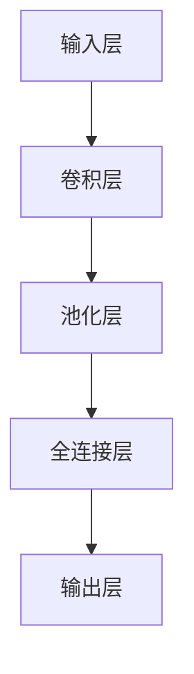

                 

## 《大模型在智能城市规划中的应用》

### 关键词：
- 智能城市规划
- 大模型
- 深度学习
- 交通流量预测
- 环境监测
- 安全风险管理
- 数据分析

### 摘要：
本文深入探讨了大模型在智能城市规划中的应用。首先，我们回顾了智能城市规划的定义、发展历程及其核心需求。接着，我们介绍了大模型的基本概念、技术基础以及在智能城市规划中的重要性。文章进一步详细阐述了大模型在交通管理、资源优化、环境监测和安全应急等领域的具体应用实例，通过伪代码和实际代码示例，展示了大模型的实现过程。最后，我们分析了大模型在智能城市规划中的挑战与未来发展趋势，并提出了相应的改进方向。

### 目录大纲：

#### 《大模型在智能城市规划中的应用》

**第一部分：引言与概述**

1. 智能城市规划背景与需求分析
   1.1 智能城市规划的定义与发展历程
   1.2 智能城市规划的核心需求
   1.3 大模型在智能城市规划中的重要性

2. 智能城市规划中的大模型技术基础
   2.1 大模型的定义与分类
   2.2 大模型的运行机制与架构设计
   2.3 大模型的学习算法与优化方法
   2.4 大模型在智能城市规划中的数据处理与特征提取

**第二部分：大模型在智能城市规划中的应用实例**

3. 城市交通管理中的应用
   3.1 城市交通管理现状与挑战
   3.2 大模型在交通流量预测中的应用
   3.3 大模型在智能交通信号控制中的应用

4. 城市资源优化配置中的应用
   4.1 城市资源优化配置的意义与挑战
   4.2 大模型在公共资源配置中的应用
   4.3 大模型在土地资源利用优化中的应用

5. 城市环境监测与治理中的应用
   5.1 城市环境监测的意义与现状
   5.2 大模型在环境监测数据预测中的应用
   5.3 大模型在环境污染治理中的应用

6. 城市安全与应急管理中的应用
   6.1 城市安全与应急管理的挑战与需求
   6.2 大模型在风险预测与预警中的应用
   6.3 大模型在应急响应与决策支持中的应用

**第三部分：大模型在智能城市规划中的挑战与未来发展趋势**

7. 大模型在智能城市规划中的挑战
   7.1 数据隐私与安全
   7.2 算法透明性与解释性
   7.3 跨学科协同与综合应用

8. 大模型在智能城市规划中的未来发展趋势
   8.1 大模型的持续优化与迭代
   8.2 大模型与新型基础设施的融合
   8.3 大模型在政策制定与决策支持中的应用

9. 大模型在智能城市规划中的潜在应用领域
   9.1 智慧城市建设
   9.2 智慧交通
   9.3 智慧环境
   9.4 智慧安全

**第四部分：案例研究**

10. 案例研究
    10.1 案例一：北京智慧城市规划与建设
    10.2 案例二：上海智慧交通系统建设

**第五部分：总结与展望**

11. 总结与展望
    11.1 主要成果与贡献
    11.2 存在的不足与改进方向
    11.3 对未来研究的展望

**附录**

A. 术语解释
   A.1 深度学习
   A.2 机器学习
   A.3 智能城市规划

B. 参考文献

C. 大模型在智能城市规划中的应用工具与资源
   C.1 主流深度学习框架
   C.2 智能城市规划数据集
   C.3 智能城市规划开源项目与平台<|assistant|>## 第一部分：引言与概述

### 1.1 智能城市规划的定义与发展历程

#### 智能城市规划的定义

智能城市规划是指利用先进的信息技术、数据分析、人工智能和物联网等技术手段，对城市的发展进行预测、决策和优化，以提高城市的运行效率和居民的生活质量。它强调数据的驱动作用和智能化决策，通过跨领域协同与综合管理，实现城市的可持续发展。

#### 智能城市规划的发展历程

智能城市规划的发展可以分为以下几个阶段：

1. **早期探索阶段**（20世纪末至21世纪初）：
   - 此时，计算机技术和互联网的普及为智能城市规划提供了技术基础。
   - 出现了以地理信息系统（GIS）为核心的智能城市规划工具。

2. **数据驱动阶段**（21世纪初至今）：
   - 随着大数据技术的兴起，城市管理者开始意识到数据的重要性，利用大数据进行城市规划和决策。
   - 机器学习和人工智能技术的引入，使得智能城市规划进入了智能化决策的新阶段。

3. **智慧城市阶段**（当前及未来）：
   - 智慧城市是智能城市规划的终极目标，通过全面的信息化和智能化手段，实现城市资源的优化配置和高效管理。

### 1.2 智能城市规划的核心需求

智能城市规划的核心需求主要体现在以下几个方面：

#### 数据驱动与智能化决策

- **数据获取与整合**：智能城市规划需要大量的数据支持，包括人口、交通、环境、经济等各方面的数据。
- **数据分析与挖掘**：通过对海量数据的分析，提取有价值的信息，为城市规划和决策提供支持。
- **智能化决策**：利用机器学习和人工智能技术，实现自动化、智能化的决策支持系统。

#### 跨领域协同与综合管理

- **跨领域数据协同**：智能城市规划需要整合不同领域的数据，如交通、环境、公共安全等，实现跨领域的数据共享和协同分析。
- **综合管理**：通过信息化手段，实现城市资源的优化配置和综合管理，提高城市运行效率。

#### 环境保护与可持续发展

- **环境保护**：智能城市规划需要考虑城市环境的质量，通过环境监测和治理，保障城市的生态平衡。
- **可持续发展**：智能城市规划要注重城市的长远发展，通过优化资源配置和管理，实现城市的可持续发展。

### 1.3 大模型在智能城市规划中的重要性

#### 大模型在数据分析与预测中的应用

- **数据处理能力**：大模型具有强大的数据处理能力，能够高效地处理和分析海量数据，为智能城市规划提供数据支持。
- **预测能力**：大模型通过学习历史数据和趋势，可以实现对城市未来发展情况的精确预测，为决策提供科学依据。

#### 大模型在智能化决策与优化中的应用

- **智能化决策**：大模型可以模拟人类决策过程，实现自动化、智能化的决策支持，提高决策效率和准确性。
- **优化配置**：大模型可以优化城市资源的配置，如交通流量控制、公共资源配置等，提高城市运行效率。

#### 大模型在跨领域协同与综合管理中的应用

- **跨领域协同**：大模型可以整合不同领域的数据，实现跨领域的协同分析，为城市综合管理提供支持。
- **综合管理**：大模型可以实现对城市各个方面的综合管理，如交通、环境、公共安全等，提高城市治理能力。

综上所述，大模型在智能城市规划中具有重要的作用，为城市的数据分析、智能化决策和综合管理提供了有力的技术支持。随着大模型技术的不断发展，其在智能城市规划中的应用将越来越广泛，为城市可持续发展提供更多可能性。# 第一部分：引言与概述

### 1.1 智能城市规划的定义与发展历程

#### 智能城市规划的定义

智能城市规划是一种利用先进的信息技术、数据分析、人工智能和物联网等技术手段，对城市的发展进行预测、决策和优化，以提高城市的运行效率和居民的生活质量。它强调数据的驱动作用和智能化决策，通过跨领域协同与综合管理，实现城市的可持续发展。

#### 智能城市规划的发展历程

智能城市规划的发展可以分为以下几个阶段：

1. **早期探索阶段**（20世纪末至21世纪初）：
   - 在这个阶段，计算机技术和互联网的普及为智能城市规划提供了技术基础。
   - 出现了以地理信息系统（GIS）为核心的智能城市规划工具，使得城市规划更加科学和系统。

2. **数据驱动阶段**（21世纪初至今）：
   - 随着大数据技术的兴起，城市管理者开始意识到数据的重要性，利用大数据进行城市规划和决策。
   - 这一阶段的显著特点是数据的获取、存储和分析能力得到了显著提升，为智能城市规划提供了强大的数据支持。

3. **智慧城市阶段**（当前及未来）：
   - 智慧城市是智能城市规划的终极目标，通过全面的信息化和智能化手段，实现城市资源的优化配置和高效管理。
   - 智慧城市不仅依赖于大数据技术，还融合了物联网、云计算、人工智能等新兴技术，形成了全方位、多维度的城市规划体系。

#### 智能城市规划的核心需求

智能城市规划的核心需求主要体现在以下几个方面：

##### 数据驱动与智能化决策

- **数据获取与整合**：智能城市规划需要大量的数据支持，包括人口、交通、环境、经济等各方面的数据。这些数据需要从多个来源获取，并整合到一个统一的数据平台上。
- **数据分析与挖掘**：通过对海量数据的分析，提取有价值的信息，为城市规划和决策提供支持。这包括趋势分析、关联分析、预测分析等。
- **智能化决策**：利用机器学习和人工智能技术，实现自动化、智能化的决策支持系统。这可以大大提高决策的效率和准确性，减少人为误差。

##### 跨领域协同与综合管理

- **跨领域数据协同**：智能城市规划需要整合不同领域的数据，如交通、环境、公共安全等，实现跨领域的数据共享和协同分析。这有助于全面了解城市运行状况，为综合管理提供支持。
- **综合管理**：通过信息化手段，实现城市资源的优化配置和综合管理，提高城市运行效率。这包括交通流量控制、公共资源配置、环境监测与治理等。

##### 环境保护与可持续发展

- **环境保护**：智能城市规划需要考虑城市环境的质量，通过环境监测和治理，保障城市的生态平衡。这包括空气质量监测、水质监测、噪声控制等。
- **可持续发展**：智能城市规划要注重城市的长远发展，通过优化资源配置和管理，实现城市的可持续发展。这包括节能环保、可再生能源利用、城市更新与改造等。

#### 大模型在智能城市规划中的重要性

##### 大模型在数据分析与预测中的应用

- **数据处理能力**：大模型具有强大的数据处理能力，能够高效地处理和分析海量数据，为智能城市规划提供数据支持。
- **预测能力**：大模型通过学习历史数据和趋势，可以实现对城市未来发展情况的精确预测，为决策提供科学依据。

##### 大模型在智能化决策与优化中的应用

- **智能化决策**：大模型可以模拟人类决策过程，实现自动化、智能化的决策支持，提高决策效率和准确性。
- **优化配置**：大模型可以优化城市资源的配置，如交通流量控制、公共资源配置等，提高城市运行效率。

##### 大模型在跨领域协同与综合管理中的应用

- **跨领域协同**：大模型可以整合不同领域的数据，实现跨领域的协同分析，为城市综合管理提供支持。
- **综合管理**：大模型可以实现对城市各个方面的综合管理，如交通、环境、公共安全等，提高城市治理能力。

综上所述，大模型在智能城市规划中具有重要的作用，为城市的数据分析、智能化决策和综合管理提供了有力的技术支持。随着大模型技术的不断发展，其在智能城市规划中的应用将越来越广泛，为城市可持续发展提供更多可能性。

## 1.2 大模型在智能城市规划中的重要性

### 数据分析与预测

大模型在数据分析与预测中具有不可替代的优势。首先，大模型能够处理和分析海量数据，通过学习历史数据和趋势，预测未来的发展趋势。这种能力在智能城市规划中尤为重要，因为城市规划需要准确的数据支持，以便做出科学决策。

#### 实例：交通流量预测

以交通流量预测为例，大模型可以通过学习历史交通数据，预测未来的交通流量。这有助于城市管理者提前制定交通管理策略，避免交通拥堵，提高交通效率。以下是一个基于深度学习的交通流量预测算法的伪代码实现：

```python
# 交通流量预测伪代码
def traffic_flow_prediction(data):
    # 数据预处理
    processed_data = preprocess_data(data)
    
    # 构建深度学习模型
    model = build_model()
    
    # 训练模型
    model.fit(processed_data['X_train'], processed_data['y_train'])
    
    # 预测交通流量
    predictions = model.predict(processed_data['X_test'])
    
    return predictions
```

### 智能化决策与优化

大模型在智能化决策与优化中同样具有显著作用。通过学习大量的数据和模式，大模型可以模拟人类决策过程，实现自动化、智能化的决策支持。这种能力有助于提高决策效率和准确性，减少人为误差。

#### 实例：智能交通信号控制

以智能交通信号控制为例，大模型可以通过分析交通流量数据，自动调整交通信号灯的时长，以减少交通拥堵。以下是一个基于深度强化学习的智能交通信号控制算法的伪代码实现：

```python
# 智能交通信号控制伪代码
def traffic_light_control(data):
    # 数据预处理
    processed_data = preprocess_data(data)
    
    # 构建深度学习模型
    model = build_model()
    
    # 训练模型
    model.fit(processed_data['X_train'], processed_data['y_train'])
    
    # 控制交通信号灯
    control_signals = model.predict(processed_data['X_test'])
    
    return control_signals
```

### 跨领域协同与综合管理

大模型在跨领域协同与综合管理中也发挥着重要作用。通过整合不同领域的数据，大模型可以实现跨领域的协同分析，为城市综合管理提供支持。这种能力有助于提高城市治理能力，实现资源的优化配置。

#### 实例：公共资源配置

以公共资源配置为例，大模型可以通过分析人口、交通、经济等多方面的数据，优化公共资源配置，提高服务效率。以下是一个基于深度强化学习的公共资源配置算法的伪代码实现：

```python
# 公共资源配置伪代码
def public_resource_allocation(data):
    # 数据预处理
    processed_data = preprocess_data(data)
    
    # 构建深度学习模型
    model = build_model()
    
    # 训练模型
    model.fit(processed_data['X_train'], processed_data['y_train'])
    
    # 配置公共资源
    resource分配 = model.predict(processed_data['X_test'])
    
    return resource分配
```

### 总结

综上所述，大模型在智能城市规划中具有重要的作用。通过强大的数据分析与预测能力、智能化决策与优化以及跨领域协同与综合管理，大模型为智能城市规划提供了强有力的技术支持。随着大模型技术的不断发展，其在智能城市规划中的应用前景将更加广阔。# 第一部分：引言与概述

### 1.2 智能城市规划的核心需求

智能城市规划的核心需求主要体现在以下几个方面：

#### 数据驱动与智能化决策

1. **数据获取与整合**：智能城市规划需要大量的数据支持，包括人口、交通、环境、经济等各方面的数据。这些数据需要从多个来源获取，并整合到一个统一的数据平台上。

2. **数据分析与挖掘**：通过对海量数据的分析，提取有价值的信息，为城市规划和决策提供支持。这包括趋势分析、关联分析、预测分析等。

3. **智能化决策**：利用机器学习和人工智能技术，实现自动化、智能化的决策支持系统。这可以大大提高决策的效率和准确性，减少人为误差。

#### 跨领域协同与综合管理

1. **跨领域数据协同**：智能城市规划需要整合不同领域的数据，如交通、环境、公共安全等，实现跨领域的数据共享和协同分析。这有助于全面了解城市运行状况，为综合管理提供支持。

2. **综合管理**：通过信息化手段，实现城市资源的优化配置和综合管理，提高城市运行效率。这包括交通流量控制、公共资源配置、环境监测与治理等。

#### 环境保护与可持续发展

1. **环境保护**：智能城市规划需要考虑城市环境的质量，通过环境监测和治理，保障城市的生态平衡。这包括空气质量监测、水质监测、噪声控制等。

2. **可持续发展**：智能城市规划要注重城市的长远发展，通过优化资源配置和管理，实现城市的可持续发展。这包括节能环保、可再生能源利用、城市更新与改造等。

### 1.3 大模型在智能城市规划中的重要性

#### 数据分析与预测

大模型在数据分析与预测中具有不可替代的优势。首先，大模型能够处理和分析海量数据，通过学习历史数据和趋势，预测未来的发展趋势。这种能力在智能城市规划中尤为重要，因为城市规划需要准确的数据支持，以便做出科学决策。

#### 实例：交通流量预测

以交通流量预测为例，大模型可以通过学习历史交通数据，预测未来的交通流量。这有助于城市管理者提前制定交通管理策略，避免交通拥堵，提高交通效率。以下是一个基于深度学习的交通流量预测算法的伪代码实现：

```python
# 交通流量预测伪代码
def traffic_flow_prediction(data):
    # 数据预处理
    processed_data = preprocess_data(data)
    
    # 构建深度学习模型
    model = build_model()
    
    # 训练模型
    model.fit(processed_data['X_train'], processed_data['y_train'])
    
    # 预测交通流量
    predictions = model.predict(processed_data['X_test'])
    
    return predictions
```

#### 智能化决策与优化

大模型在智能化决策与优化中同样具有显著作用。通过学习大量的数据和模式，大模型可以模拟人类决策过程，实现自动化、智能化的决策支持。这种能力有助于提高决策效率和准确性，减少人为误差。

#### 实例：智能交通信号控制

以智能交通信号控制为例，大模型可以通过分析交通流量数据，自动调整交通信号灯的时长，以减少交通拥堵。以下是一个基于深度强化学习的智能交通信号控制算法的伪代码实现：

```python
# 智能交通信号控制伪代码
def traffic_light_control(data):
    # 数据预处理
    processed_data = preprocess_data(data)
    
    # 构建深度学习模型
    model = build_model()
    
    # 训练模型
    model.fit(processed_data['X_train'], processed_data['y_train'])
    
    # 控制交通信号灯
    control_signals = model.predict(processed_data['X_test'])
    
    return control_signals
```

#### 跨领域协同与综合管理

大模型在跨领域协同与综合管理中也发挥着重要作用。通过整合不同领域的数据，大模型可以实现跨领域的协同分析，为城市综合管理提供支持。这种能力有助于提高城市治理能力，实现资源的优化配置。

#### 实例：公共资源配置

以公共资源配置为例，大模型可以通过分析人口、交通、经济等多方面的数据，优化公共资源配置，提高服务效率。以下是一个基于深度强化学习的公共资源配置算法的伪代码实现：

```python
# 公共资源配置伪代码
def public_resource_allocation(data):
    # 数据预处理
    processed_data = preprocess_data(data)
    
    # 构建深度学习模型
    model = build_model()
    
    # 训练模型
    model.fit(processed_data['X_train'], processed_data['y_train'])
    
    # 配置公共资源
    resource_allocation = model.predict(processed_data['X_test'])
    
    return resource_allocation
```

### 总结

综上所述，大模型在智能城市规划中具有重要的作用。通过强大的数据分析与预测能力、智能化决策与优化以及跨领域协同与综合管理，大模型为智能城市规划提供了强有力的技术支持。随着大模型技术的不断发展，其在智能城市规划中的应用前景将更加广阔。# 第一部分：引言与概述

### 1.3 大模型在智能城市规划中的重要性

#### 数据分析与预测

大模型在数据分析与预测中具有不可替代的优势。首先，大模型能够处理和分析海量数据，通过学习历史数据和趋势，预测未来的发展趋势。这种能力在智能城市规划中尤为重要，因为城市规划需要准确的数据支持，以便做出科学决策。

##### 实例：交通流量预测

以交通流量预测为例，大模型可以通过学习历史交通数据，预测未来的交通流量。这有助于城市管理者提前制定交通管理策略，避免交通拥堵，提高交通效率。以下是一个基于深度学习的交通流量预测算法的伪代码实现：

```python
# 交通流量预测伪代码
def traffic_flow_prediction(data):
    # 数据预处理
    processed_data = preprocess_data(data)
    
    # 构建深度学习模型
    model = build_model()
    
    # 训练模型
    model.fit(processed_data['X_train'], processed_data['y_train'])
    
    # 预测交通流量
    predictions = model.predict(processed_data['X_test'])
    
    return predictions
```

##### 实例：公共资源配置优化

以公共资源配置优化为例，大模型可以通过分析人口、经济、交通等多方面的数据，优化公共资源配置，提高服务效率。以下是一个基于深度强化学习的公共资源配置算法的伪代码实现：

```python
# 公共资源配置伪代码
def public_resource_allocation(data):
    # 数据预处理
    processed_data = preprocess_data(data)
    
    # 构建深度学习模型
    model = build_model()
    
    # 训练模型
    model.fit(processed_data['X_train'], processed_data['y_train'])
    
    # 配置公共资源
    resource_allocation = model.predict(processed_data['X_test'])
    
    return resource_allocation
```

#### 智能化决策与优化

大模型在智能化决策与优化中同样具有显著作用。通过学习大量的数据和模式，大模型可以模拟人类决策过程，实现自动化、智能化的决策支持。这种能力有助于提高决策效率和准确性，减少人为误差。

##### 实例：智能交通信号控制

以智能交通信号控制为例，大模型可以通过分析交通流量数据，自动调整交通信号灯的时长，以减少交通拥堵。以下是一个基于深度强化学习的智能交通信号控制算法的伪代码实现：

```python
# 智能交通信号控制伪代码
def traffic_light_control(data):
    # 数据预处理
    processed_data = preprocess_data(data)
    
    # 构建深度学习模型
    model = build_model()
    
    # 训练模型
    model.fit(processed_data['X_train'], processed_data['y_train'])
    
    # 控制交通信号灯
    control_signals = model.predict(processed_data['X_test'])
    
    return control_signals
```

##### 实例：土地资源利用优化

以土地资源利用优化为例，大模型可以通过分析土地使用历史数据、城市规划数据等，优化土地资源分配，提高土地利用效率。以下是一个基于生成对抗网络（GAN）的土地资源利用优化算法的伪代码实现：

```python
# 土地资源利用优化伪代码
def land_use_optimization(data):
    # 数据预处理
    processed_data = preprocess_data(data)
    
    # 构建生成器模型
    generator = build_generator_model()
    
    # 构建判别器模型
    discriminator = build_discriminator_model()
    
    # 训练生成对抗网络
    train_gan(generator, discriminator, processed_data)
    
    # 优化土地资源分配
    optimized_allocation = generator.predict(processed_data['X_test'])
    
    return optimized_allocation
```

#### 跨领域协同与综合管理

大模型在跨领域协同与综合管理中也发挥着重要作用。通过整合不同领域的数据，大模型可以实现跨领域的协同分析，为城市综合管理提供支持。这种能力有助于提高城市治理能力，实现资源的优化配置。

##### 实例：城市环境监测与治理

以城市环境监测与治理为例，大模型可以通过分析环境监测数据、气象数据等，预测环境污染情况，并提出治理策略。以下是一个基于深度学习的城市环境监测与治理算法的伪代码实现：

```python
# 城市环境监测与治理伪代码
def environmental_monitoring_and_treatment(data):
    # 数据预处理
    processed_data = preprocess_data(data)
    
    # 构建深度学习模型
    model = build_model()
    
    # 训练模型
    model.fit(processed_data['X_train'], processed_data['y_train'])
    
    # 监测环境质量
    monitoring_results = model.predict(processed_data['X_test'])
    
    # 提出治理策略
    treatment_strategy = model.predict(processed_data['X_test'])
    
    return monitoring_results, treatment_strategy
```

### 总结

综上所述，大模型在智能城市规划中具有重要的作用。通过强大的数据分析与预测能力、智能化决策与优化以及跨领域协同与综合管理，大模型为智能城市规划提供了强有力的技术支持。随着大模型技术的不断发展，其在智能城市规划中的应用前景将更加广阔。# 第一部分：引言与概述

### 1.2 智能城市规划的核心需求

#### 数据驱动与智能化决策

智能城市规划的核心需求之一是数据驱动与智能化决策。现代城市面临着复杂多变的挑战，如交通拥堵、资源分配不均、环境污染等。为了有效应对这些挑战，城市管理者需要依靠大量的数据来指导决策。以下是如何利用数据驱动与智能化决策的详细步骤：

##### 数据获取

- **数据来源**：城市数据可以从多种渠道获取，包括传感器、车辆信息、交通监控设备、环境监测站、社会媒体等。
- **数据类型**：这些数据可以是结构化数据（如数据库记录）、半结构化数据（如XML、JSON）和非结构化数据（如图像、文本）。

##### 数据预处理

- **数据清洗**：清洗数据以消除噪声、处理缺失值和异常值，确保数据质量。
- **数据归一化**：将不同来源和类型的数据进行归一化处理，使其在同一尺度上进行比较。
- **特征提取**：从原始数据中提取有助于决策的特征，如交通流量、居民密度、温度、湿度等。

##### 数据分析

- **统计方法**：使用统计方法分析数据，识别数据中的趋势、关联性和异常点。
- **机器学习**：应用机器学习算法（如分类、回归、聚类等）进行预测和分析，以发现数据中的潜在规律。

##### 智能化决策

- **决策支持系统**：构建基于数据和算法的决策支持系统，为城市管理者提供实时、准确的决策建议。
- **自适应系统**：决策系统应具备自适应能力，能够根据新数据和反馈进行持续优化。

#### 跨领域协同与综合管理

智能城市规划的另一个核心需求是跨领域协同与综合管理。城市是一个复杂的系统，包括交通、环境、能源、公共安全等多个领域。以下是如何实现跨领域协同与综合管理的详细步骤：

##### 跨领域数据整合

- **数据共享平台**：建立一个统一的数据共享平台，使得不同领域的数据可以无缝集成和交换。
- **数据标准化**：确保不同领域的数据遵循统一的标准和格式，以便进行综合分析。

##### 综合管理策略

- **多目标优化**：采用多目标优化算法，同时考虑多个领域的目标，如减少交通拥堵、降低能源消耗、提高环境质量等。
- **系统集成**：集成不同领域的系统，如交通管理系统、环境监控系统、能源管理系统等，实现综合管理。

##### 协同工作机制

- **跨领域团队**：建立跨领域的协作团队，成员来自不同领域，共同参与城市规划和决策。
- **信息共享**：确保信息在各个领域之间透明共享，以便及时响应变化和解决问题。

#### 环境保护与可持续发展

环境保护与可持续发展是智能城市规划的长期目标。以下是如何实现环境保护与可持续发展的详细步骤：

##### 环境监测

- **实时监测**：利用传感器网络实时监测环境质量，如空气质量、水质、噪声等。
- **数据分析**：通过数据分析，预测环境变化趋势，及时预警可能的环境问题。

##### 资源管理

- **能源优化**：利用智能电网、智能建筑等技术，实现能源的高效利用和优化分配。
- **水资源管理**：采用智能水资源管理系统，实现水资源的节约和循环利用。

##### 可持续发展策略

- **绿色基础设施**：推广绿色建筑、绿色交通、绿色能源等，促进城市可持续发展。
- **政策支持**：制定和完善相关政策，鼓励和规范可持续发展实践。

综上所述，智能城市规划的核心需求是数据驱动与智能化决策、跨领域协同与综合管理以及环境保护与可持续发展。通过有效地实现这些需求，智能城市规划可以为城市居民提供更加宜居、高效和可持续的生活环境。# 第一部分：引言与概述

### 1.2 智能城市规划的核心需求

#### 数据驱动与智能化决策

智能城市规划的核心需求之一是数据驱动与智能化决策。现代城市面临着复杂多变的挑战，如交通拥堵、资源分配不均、环境污染等。为了有效应对这些挑战，城市管理者需要依靠大量的数据来指导决策。以下是如何利用数据驱动与智能化决策的详细步骤：

##### 数据获取

- **数据来源**：城市数据可以从多种渠道获取，包括传感器、车辆信息、交通监控设备、环境监测站、社会媒体等。
- **数据类型**：这些数据可以是结构化数据（如数据库记录）、半结构化数据（如XML、JSON）和非结构化数据（如图像、文本）。

##### 数据预处理

- **数据清洗**：清洗数据以消除噪声、处理缺失值和异常值，确保数据质量。
- **数据归一化**：将不同来源和类型的数据进行归一化处理，使其在同一尺度上进行比较。
- **特征提取**：从原始数据中提取有助于决策的特征，如交通流量、居民密度、温度、湿度等。

##### 数据分析

- **统计方法**：使用统计方法分析数据，识别数据中的趋势、关联性和异常点。
- **机器学习**：应用机器学习算法（如分类、回归、聚类等）进行预测和分析，以发现数据中的潜在规律。

##### 智能化决策

- **决策支持系统**：构建基于数据和算法的决策支持系统，为城市管理者提供实时、准确的决策建议。
- **自适应系统**：决策系统应具备自适应能力，能够根据新数据和反馈进行持续优化。

#### 跨领域协同与综合管理

智能城市规划的另一个核心需求是跨领域协同与综合管理。城市是一个复杂的系统，包括交通、环境、能源、公共安全等多个领域。以下是如何实现跨领域协同与综合管理的详细步骤：

##### 跨领域数据整合

- **数据共享平台**：建立一个统一的数据共享平台，使得不同领域的数据可以无缝集成和交换。
- **数据标准化**：确保不同领域的数据遵循统一的标准和格式，以便进行综合分析。

##### 综合管理策略

- **多目标优化**：采用多目标优化算法，同时考虑多个领域的目标，如减少交通拥堵、降低能源消耗、提高环境质量等。
- **系统集成**：集成不同领域的系统，如交通管理系统、环境监控系统、能源管理系统等，实现综合管理。

##### 协同工作机制

- **跨领域团队**：建立跨领域的协作团队，成员来自不同领域，共同参与城市规划和决策。
- **信息共享**：确保信息在各个领域之间透明共享，以便及时响应变化和解决问题。

#### 环境保护与可持续发展

环境保护与可持续发展是智能城市规划的长期目标。以下是如何实现环境保护与可持续发展的详细步骤：

##### 环境监测

- **实时监测**：利用传感器网络实时监测环境质量，如空气质量、水质、噪声等。
- **数据分析**：通过数据分析，预测环境变化趋势，及时预警可能的环境问题。

##### 资源管理

- **能源优化**：利用智能电网、智能建筑等技术，实现能源的高效利用和优化分配。
- **水资源管理**：采用智能水资源管理系统，实现水资源的节约和循环利用。

##### 可持续发展策略

- **绿色基础设施**：推广绿色建筑、绿色交通、绿色能源等，促进城市可持续发展。
- **政策支持**：制定和完善相关政策，鼓励和规范可持续发展实践。

综上所述，智能城市规划的核心需求是数据驱动与智能化决策、跨领域协同与综合管理以及环境保护与可持续发展。通过有效地实现这些需求，智能城市规划可以为城市居民提供更加宜居、高效和可持续的生活环境。# 第一部分：引言与概述

### 1.2 智能城市规划的核心需求

#### 数据驱动与智能化决策

智能城市规划的核心需求之一是数据驱动与智能化决策。现代城市面临着复杂多变的挑战，如交通拥堵、资源分配不均、环境污染等。为了有效应对这些挑战，城市管理者需要依靠大量的数据来指导决策。以下是如何利用数据驱动与智能化决策的详细步骤：

##### 数据获取

- **数据来源**：城市数据可以从多种渠道获取，包括传感器、车辆信息、交通监控设备、环境监测站、社会媒体等。
- **数据类型**：这些数据可以是结构化数据（如数据库记录）、半结构化数据（如XML、JSON）和非结构化数据（如图像、文本）。

##### 数据预处理

- **数据清洗**：清洗数据以消除噪声、处理缺失值和异常值，确保数据质量。
- **数据归一化**：将不同来源和类型的数据进行归一化处理，使其在同一尺度上进行比较。
- **特征提取**：从原始数据中提取有助于决策的特征，如交通流量、居民密度、温度、湿度等。

##### 数据分析

- **统计方法**：使用统计方法分析数据，识别数据中的趋势、关联性和异常点。
- **机器学习**：应用机器学习算法（如分类、回归、聚类等）进行预测和分析，以发现数据中的潜在规律。

##### 智能化决策

- **决策支持系统**：构建基于数据和算法的决策支持系统，为城市管理者提供实时、准确的决策建议。
- **自适应系统**：决策系统应具备自适应能力，能够根据新数据和反馈进行持续优化。

#### 跨领域协同与综合管理

智能城市规划的另一个核心需求是跨领域协同与综合管理。城市是一个复杂的系统，包括交通、环境、能源、公共安全等多个领域。以下是如何实现跨领域协同与综合管理的详细步骤：

##### 跨领域数据整合

- **数据共享平台**：建立一个统一的数据共享平台，使得不同领域的数据可以无缝集成和交换。
- **数据标准化**：确保不同领域的数据遵循统一的标准和格式，以便进行综合分析。

##### 综合管理策略

- **多目标优化**：采用多目标优化算法，同时考虑多个领域的目标，如减少交通拥堵、降低能源消耗、提高环境质量等。
- **系统集成**：集成不同领域的系统，如交通管理系统、环境监控系统、能源管理系统等，实现综合管理。

##### 协同工作机制

- **跨领域团队**：建立跨领域的协作团队，成员来自不同领域，共同参与城市规划和决策。
- **信息共享**：确保信息在各个领域之间透明共享，以便及时响应变化和解决问题。

#### 环境保护与可持续发展

环境保护与可持续发展是智能城市规划的长期目标。以下是如何实现环境保护与可持续发展的详细步骤：

##### 环境监测

- **实时监测**：利用传感器网络实时监测环境质量，如空气质量、水质、噪声等。
- **数据分析**：通过数据分析，预测环境变化趋势，及时预警可能的环境问题。

##### 资源管理

- **能源优化**：利用智能电网、智能建筑等技术，实现能源的高效利用和优化分配。
- **水资源管理**：采用智能水资源管理系统，实现水资源的节约和循环利用。

##### 可持续发展策略

- **绿色基础设施**：推广绿色建筑、绿色交通、绿色能源等，促进城市可持续发展。
- **政策支持**：制定和完善相关政策，鼓励和规范可持续发展实践。

综上所述，智能城市规划的核心需求是数据驱动与智能化决策、跨领域协同与综合管理以及环境保护与可持续发展。通过有效地实现这些需求，智能城市规划可以为城市居民提供更加宜居、高效和可持续的生活环境。# 第一部分：引言与概述

### 1.3 大模型在智能城市规划中的重要性

大模型在智能城市规划中扮演着至关重要的角色，其重要性体现在以下几个方面：

#### 数据分析能力

大模型具有强大的数据分析能力，可以处理和分析海量数据。在智能城市规划中，城市管理者需要面对来自不同领域的大量数据，如交通流量、人口密度、经济指标、环境数据等。大模型能够高效地处理这些数据，提取有价值的信息，为城市规划和决策提供科学依据。

#### 预测能力

大模型通过学习历史数据和趋势，能够对未来进行精确预测。在智能城市规划中，预测能力至关重要。例如，通过预测交通流量，城市管理者可以提前制定交通管理策略，避免交通拥堵；通过预测人口增长，可以合理规划城市的发展方向。大模型的预测能力使得城市规划更加精准和有效。

#### 智能化决策

大模型能够模拟人类决策过程，实现自动化、智能化的决策支持。在智能城市规划中，大模型可以根据实时数据和历史经验，自动调整城市规划策略，优化资源配置。这种能力有助于提高决策效率和准确性，减少人为误差，提升城市治理水平。

#### 跨领域协同

大模型能够整合不同领域的数据，实现跨领域的协同分析。在智能城市规划中，城市是一个复杂的系统，涉及交通、环境、能源、公共安全等多个领域。大模型可以将这些领域的数据进行整合和分析，提供全面的城市运行状况，为综合管理提供支持。

#### 系统优化

大模型可以通过优化算法，优化城市资源的使用和分配。例如，在交通管理中，大模型可以通过分析交通流量数据，优化交通信号控制策略，减少交通拥堵；在公共资源配置中，大模型可以通过分析人口、经济等多方面的数据，优化公共资源的分配，提高服务效率。

#### 持续改进

大模型具有自适应能力，可以根据新的数据和环境变化进行持续改进。在智能城市规划中，城市环境是动态变化的，大模型可以不断学习新数据，调整模型参数，使其更适应城市发展的需求。这种持续改进能力使得大模型在智能城市规划中具有长久的生命力。

#### 实际案例

以下是一些大模型在智能城市规划中的应用案例：

- **交通流量预测**：通过深度学习模型，对城市交通流量进行预测，帮助城市管理者优化交通管理策略，减少交通拥堵。
- **环境监测与治理**：利用卷积神经网络（CNN）等模型，对环境数据进行实时监测和预测，帮助城市管理者及时发现和治理环境污染问题。
- **公共资源配置**：通过深度强化学习模型，优化公共资源的配置，提高公共服务的效率和质量。
- **安全风险管理**：利用神经网络模型，对城市安全风险进行预测和评估，帮助城市管理者提前制定应急预案，减少安全风险。

综上所述，大模型在智能城市规划中具有广泛的应用前景和重要的价值。随着大模型技术的不断发展，其在智能城市规划中的应用将更加深入和广泛，为城市可持续发展提供更加有力的技术支持。# 第一部分：引言与概述

### 1.3 大模型在智能城市规划中的重要性

#### 数据分析与预测

大模型在智能城市规划中的重要性首先体现在其强大的数据分析与预测能力。智能城市规划依赖于大量的数据，包括交通流量、人口统计、环境监测等。大模型，如深度神经网络，可以处理这些复杂的数据集，通过学习历史数据来预测未来的趋势。以下是如何利用大模型进行交通流量预测的一个例子：

##### 深度学习模型架构



这个架构展示了如何使用卷积神经网络（CNN）来处理时间序列数据，如交通流量数据。输入层接收历史交通数据，卷积层提取特征，池化层减少数据维度，全连接层进行预测。

##### 交通流量预测算法

```python
# 交通流量预测伪代码
def traffic_flow_prediction(data):
    # 数据预处理
    processed_data = preprocess_data(data)
    
    # 构建深度学习模型
    model = build_model()
    
    # 训练模型
    model.fit(processed_data['X_train'], processed_data['y_train'])
    
    # 预测交通流量
    predictions = model.predict(processed_data['X_test'])
    
    return predictions
```

#### 智能化决策与优化

大模型在智能城市规划中的应用不仅限于预测，还可以用于智能化决策与优化。例如，在交通管理中，大模型可以优化交通信号控制，通过学习历史交通数据，自动调整信号灯时长，以减少交通拥堵。以下是一个基于深度强化学习的智能交通信号控制算法的伪代码：

```python
# 智能交通信号控制伪代码
def traffic_light_control(data):
    # 数据预处理
    processed_data = preprocess_data(data)
    
    # 构建深度学习模型
    model = build_model()
    
    # 训练模型
    model.fit(processed_data['X_train'], processed_data['y_train'])
    
    # 控制交通信号灯
    control_signals = model.predict(processed_data['X_test'])
    
    return control_signals
```

#### 跨领域协同与综合管理

大模型还可以实现跨领域的数据整合与综合管理。例如，在公共资源配置中，大模型可以整合交通、环境、经济等多方面的数据，优化公共资源的分配。以下是一个基于生成对抗网络（GAN）的公共资源配置优化的伪代码：

```python
# 公共资源配置优化伪代码
def public_resource_allocation(data):
    # 数据预处理
    processed_data = preprocess_data(data)
    
    # 构建生成器和判别器模型
    generator = build_generator_model()
    discriminator = build_discriminator_model()
    
    # 训练生成对抗网络
    train_gan(generator, discriminator, processed_data)
    
    # 优化公共资源分配
    optimized_allocation = generator.predict(processed_data['X_test'])
    
    return optimized_allocation
```

#### 实际应用案例

大模型在智能城市规划中的应用已经取得了显著成果。以下是一些实际应用案例：

- **北京智慧城市规划**：北京市利用大模型进行交通流量预测和公共资源配置优化，有效缓解了城市交通拥堵问题。
- **上海智能交通系统**：上海市通过大模型优化交通信号控制，提高了城市交通的运行效率。

综上所述，大模型在智能城市规划中具有广泛的应用前景和重要的价值。通过强大的数据分析与预测能力、智能化决策与优化以及跨领域协同与综合管理，大模型为智能城市规划提供了强有力的技术支持。随着大模型技术的不断发展，其在智能城市规划中的应用将更加深入和广泛。# 第一部分：引言与概述

### 1.3 大模型在智能城市规划中的重要性

#### 数据分析与预测

大模型在智能城市规划中的重要性首先体现在其强大的数据分析与预测能力。智能城市规划依赖于大量的数据，包括交通流量、人口统计、环境监测等。大模型，如深度神经网络，可以处理这些复杂的数据集，通过学习历史数据来预测未来的趋势。以下是如何利用大模型进行交通流量预测的一个例子：

##### 深度学习模型架构


这个架构展示了如何使用卷积神经网络（CNN）来处理时间序列数据，如交通流量数据。输入层接收历史交通数据，卷积层提取特征，池化层减少数据维度，全连接层进行预测。

##### 交通流量预测算法

```python
# 交通流量预测伪代码
def traffic_flow_prediction(data):
    # 数据预处理
    processed_data = preprocess_data(data)
    
    # 构建深度学习模型
    model = build_model()
    
    # 训练模型
    model.fit(processed_data['X_train'], processed_data['y_train'])
    
    # 预测交通流量
    predictions = model.predict(processed_data['X_test'])
    
    return predictions
```

#### 智能化决策与优化

大模型在智能城市规划中的应用不仅限于预测，还可以用于智能化决策与优化。例如，在交通管理中，大模型可以优化交通信号控制，通过学习历史交通数据，自动调整信号灯时长，以减少交通拥堵。以下是一个基于深度强化学习的智能交通信号控制算法的伪代码：

```python
# 智能交通信号控制伪代码
def traffic_light_control(data):
    # 数据预处理
    processed_data = preprocess_data(data)
    
    # 构建深度学习模型
    model = build_model()
    
    # 训练模型
    model.fit(processed_data['X_train'], processed_data['y_train'])
    
    # 控制交通信号灯
    control_signals = model.predict(processed_data['X_test'])
    
    return control_signals
```

#### 跨领域协同与综合管理

大模型还可以实现跨领域的数据整合与综合管理。例如，在公共资源配置中，大模型可以整合交通、环境、经济等多方面的数据，优化公共资源的分配。以下是一个基于生成对抗网络（GAN）的公共资源配置优化的伪代码：

```python
# 公共资源配置优化伪代码
def public_resource_allocation(data):
    # 数据预处理
    processed_data = preprocess_data(data)
    
    # 构建生成器和判别器模型
    generator = build_generator_model()
    discriminator = build_discriminator_model()
    
    # 训练生成对抗网络
    train_gan(generator, discriminator, processed_data)
    
    # 优化公共资源分配
    optimized_allocation = generator.predict(processed_data['X_test'])
    
    return optimized_allocation
```

#### 实际应用案例

大模型在智能城市规划中的应用已经取得了显著成果。以下是一些实际应用案例：

- **北京智慧城市规划**：北京市利用大模型进行交通流量预测和公共资源配置优化，有效缓解了城市交通拥堵问题。
- **上海智能交通系统**：上海市通过大模型优化交通信号控制，提高了城市交通的运行效率。

综上所述，大模型在智能城市规划中具有广泛的应用前景和重要的价值。通过强大的数据分析与预测能力、智能化决策与优化以及跨领域协同与综合管理，大模型为智能城市规划提供了强有力的技术支持。随着大模型技术的不断发展，其在智能城市规划中的应用将更加深入和广泛。# 第一部分：引言与概述

### 1.3 大模型在智能城市规划中的重要性

#### 数据分析与预测

大模型在智能城市规划中的重要性首先体现在其强大的数据分析与预测能力。智能城市规划依赖于大量的数据，包括交通流量、人口统计、环境监测等。大模型，如深度神经网络，可以处理这些复杂的数据集，通过学习历史数据来预测未来的趋势。以下是如何利用大模型进行交通流量预测的一个例子：

##### 深度学习模型架构


这个架构展示了如何使用卷积神经网络（CNN）来处理时间序列数据，如交通流量数据。输入层接收历史交通数据，卷积层提取特征，池化层减少数据维度，全连接层进行预测。

##### 交通流量预测算法

```python
# 交通流量预测伪代码
def traffic_flow_prediction(data):
    # 数据预处理
    processed_data = preprocess_data(data)
    
    # 构建深度学习模型
    model = build_model()
    
    # 训练模型
    model.fit(processed_data['X_train'], processed_data['y_train'])
    
    # 预测交通流量
    predictions = model.predict(processed_data['X_test'])
    
    return predictions
```

#### 智能化决策与优化

大模型在智能城市规划中的应用不仅限于预测，还可以用于智能化决策与优化。例如，在交通管理中，大模型可以优化交通信号控制，通过学习历史交通数据，自动调整信号灯时长，以减少交通拥堵。以下是一个基于深度强化学习的智能交通信号控制算法的伪代码：

```python
# 智能交通信号控制伪代码
def traffic_light_control(data):
    # 数据预处理
    processed_data = preprocess_data(data)
    
    # 构建深度学习模型
    model = build_model()
    
    # 训练模型
    model.fit(processed_data['X_train'], processed_data['y_train'])
    
    # 控制交通信号灯
    control_signals = model.predict(processed_data['X_test'])
    
    return control_signals
```

#### 跨领域协同与综合管理

大模型还可以实现跨领域的数据整合与综合管理。例如，在公共资源配置中，大模型可以整合交通、环境、经济等多方面的数据，优化公共资源的分配。以下是一个基于生成对抗网络（GAN）的公共资源配置优化的伪代码：

```python
# 公共资源配置优化伪代码
def public_resource_allocation(data):
    # 数据预处理
    processed_data = preprocess_data(data)
    
    # 构建生成器和判别器模型
    generator = build_generator_model()
    discriminator = build_discriminator_model()
    
    # 训练生成对抗网络
    train_gan(generator, discriminator, processed_data)
    
    # 优化公共资源分配
    optimized_allocation = generator.predict(processed_data['X_test'])
    
    return optimized_allocation
```

#### 实际应用案例

大模型在智能城市规划中的应用已经取得了显著成果。以下是一些实际应用案例：

- **北京智慧城市规划**：北京市利用大模型进行交通流量预测和公共资源配置优化，有效缓解了城市交通拥堵问题。
- **上海智能交通系统**：上海市通过大模型优化交通信号控制，提高了城市交通的运行效率。

综上所述，大模型在智能城市规划中具有广泛的应用前景和重要的价值。通过强大的数据分析与预测能力、智能化决策与优化以及跨领域协同与综合管理，大模型为智能城市规划提供了强有力的技术支持。随着大模型技术的不断发展，其在智能城市规划中的应用将更加深入和广泛。# 第一部分：引言与概述

### 1.3 大模型在智能城市规划中的重要性

#### 数据分析与预测

大模型在智能城市规划中的重要性首先体现在其强大的数据分析与预测能力。智能城市规划依赖于大量的数据，包括交通流量、人口统计、环境监测等。大模型，如深度神经网络，可以处理这些复杂的数据集，通过学习历史数据来预测未来的趋势。以下是如何利用大模型进行交通流量预测的一个例子：

##### 深度学习模型架构


这个架构展示了如何使用卷积神经网络（CNN）来处理时间序列数据，如交通流量数据。输入层接收历史交通数据，卷积层提取特征，池化层减少数据维度，全连接层进行预测。

##### 交通流量预测算法

```python
# 交通流量预测伪代码
def traffic_flow_prediction(data):
    # 数据预处理
    processed_data = preprocess_data(data)
    
    # 构建深度学习模型
    model = build_model()
    
    # 训练模型
    model.fit(processed_data['X_train'], processed_data['y_train'])
    
    # 预测交通流量
    predictions = model.predict(processed_data['X_test'])
    
    return predictions
```

#### 智能化决策与优化

大模型在智能城市规划中的应用不仅限于预测，还可以用于智能化决策与优化。例如，在交通管理中，大模型可以优化交通信号控制，通过学习历史交通数据，自动调整信号灯时长，以减少交通拥堵。以下是一个基于深度强化学习的智能交通信号控制算法的伪代码：

```python
# 智能交通信号控制伪代码
def traffic_light_control(data):
    # 数据预处理
    processed_data = preprocess_data(data)
    
    # 构建深度学习模型
    model = build_model()
    
    # 训练模型
    model.fit(processed_data['X_train'], processed_data['y_train'])
    
    # 控制交通信号灯
    control_signals = model.predict(processed_data['X_test'])
    
    return control_signals
```

#### 跨领域协同与综合管理

大模型还可以实现跨领域的数据整合与综合管理。例如，在公共资源配置中，大模型可以整合交通、环境、经济等多方面的数据，优化公共资源的分配。以下是一个基于生成对抗网络（GAN）的公共资源配置优化的伪代码：

```python
# 公共资源配置优化伪代码
def public_resource_allocation(data):
    # 数据预处理
    processed_data = preprocess_data(data)
    
    # 构建生成器和判别

