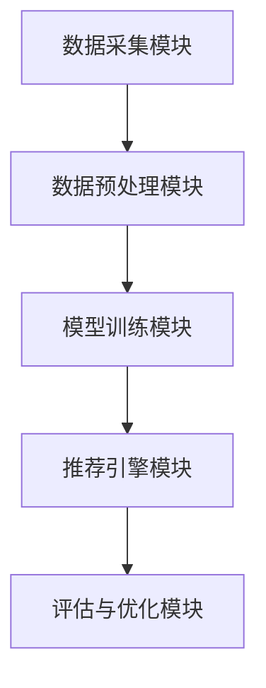
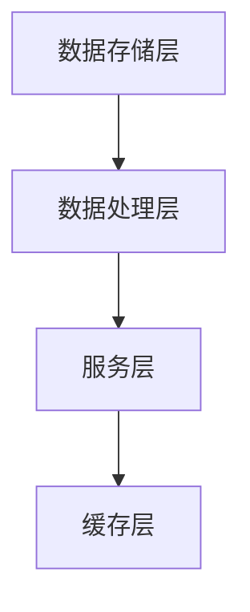
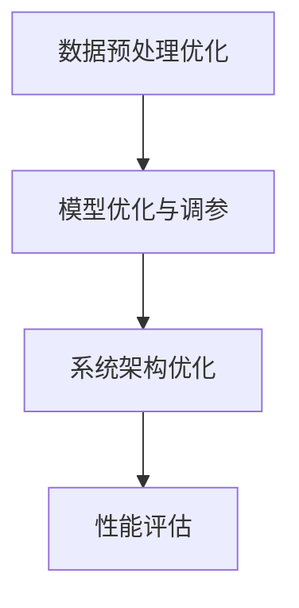

                 

# 《大模型推荐系统的可扩展性研究》

> 关键词：大模型推荐系统、可扩展性、分布式架构、性能优化、案例研究、未来发展趋势

> 摘要：随着互联网和大数据技术的发展，推荐系统已经成为现代互联网应用的核心组件之一。大模型推荐系统作为推荐系统的升级版，其可扩展性变得尤为重要。本文首先介绍了大模型推荐系统的概念、架构和核心算法，然后深入探讨了其可扩展性的设计原则、实现方法和性能优化策略。通过两个实际案例，分析了大模型推荐系统在商业应用中的效果。最后，展望了未来大模型推荐系统的发展趋势和面临的挑战。

## 目录大纲

1. 引言与背景
2. 大模型推荐系统的核心概念与联系
3. 可扩展性的重要性
4. 大模型推荐系统的可扩展性设计
5. 大模型推荐系统的性能优化
6. 大模型推荐系统的案例研究
7. 大模型推荐系统的未来发展方向
8. 附录

## 引言与背景

### 大模型推荐系统的定义

大模型推荐系统（Large-scale Model-based Recommendation System）是指基于深度学习、机器学习等技术，使用大规模数据训练出的模型来为用户提供个性化推荐服务的系统。相较于传统推荐系统，大模型推荐系统具有以下几个显著特点：

- **高准确率**：利用深度学习技术，可以从大量非结构化数据中提取特征，使得推荐结果更加精准。
- **高效率**：采用并行计算和分布式架构，可以快速处理海量数据，提高推荐效率。
- **动态更新**：基于实时数据，大模型推荐系统可以动态调整推荐策略，为用户带来更为贴心的服务。

### 大模型推荐系统与传统推荐系统的区别

传统推荐系统通常基于协同过滤（Collaborative Filtering）算法，通过分析用户的历史行为数据来预测用户喜好，并推荐相关商品或内容。而大模型推荐系统则更加注重深度学习和人工智能技术的应用，具体区别如下：

- **算法层面**：传统推荐系统主要使用基于用户行为或者内容的特征进行预测，而大模型推荐系统则使用深度神经网络模型进行预测。
- **数据规模**：传统推荐系统一般处理的数据量较小，而大模型推荐系统则可以处理大规模数据，且数据来源更加多样化。
- **个性化和实时性**：传统推荐系统难以实现动态调整，而大模型推荐系统可以实时更新用户模型，实现更加个性化的推荐。

### 大模型推荐系统的发展历程

大模型推荐系统的发展历程可以分为以下几个阶段：

- **早期阶段**：以基于规则的推荐系统为主，如基于内容的推荐系统和基于协同过滤的推荐系统。
- **中间阶段**：随着深度学习技术的兴起，研究者开始尝试将深度学习应用于推荐系统中，如DeepFM、Wide&Deep等模型。
- **现阶段**：大模型推荐系统逐渐成为主流，如Facebook的AI系统、谷歌的推荐引擎等。

### 大模型推荐系统的未来发展趋势

未来，大模型推荐系统将呈现出以下几个发展趋势：

- **智能化**：随着人工智能技术的进步，大模型推荐系统将更加智能化，能够更好地理解和预测用户需求。
- **多元化**：推荐系统将不再局限于商品或内容推荐，还将扩展到教育、医疗、金融等多个领域。
- **开放化**：大模型推荐系统将更加开放，允许第三方开发者进行集成和创新，为用户提供更多样化的服务。

## 大模型推荐系统的核心概念与联系

### 大模型推荐系统的架构

大模型推荐系统的架构可以分为以下几个核心组件：

1. **数据采集模块**：负责从不同的数据源（如用户行为日志、商品信息等）采集数据。
2. **数据预处理模块**：对采集到的数据进行清洗、转换和归一化处理，以供模型训练使用。
3. **模型训练模块**：使用深度学习算法对预处理后的数据进行训练，生成推荐模型。
4. **推荐引擎模块**：基于训练好的模型，实时为用户提供个性化推荐服务。
5. **评估与优化模块**：对推荐系统进行性能评估，并根据评估结果进行优化调整。

下面是一个大模型推荐系统的 Mermaid 流程图：

### 大模型推荐系统的核心组件

#### 数据采集模块

数据采集模块负责从不同的数据源采集用户行为数据、商品信息等。以下是数据采集模块的核心步骤：

1. **用户行为数据采集**：包括用户浏览、点击、购买等行为数据。
2. **商品信息采集**：包括商品ID、名称、分类、价格等属性信息。
3. **数据清洗**：对采集到的数据进行去重、补全、转换等处理，确保数据质量。

#### 数据预处理模块

数据预处理模块对采集到的数据进行分析和处理，以便于模型训练。以下是数据预处理模块的核心步骤：

1. **特征提取**：根据业务需求，提取用户行为特征和商品特征。
2. **特征转换**：将原始数据转换为数值型数据，便于模型处理。
3. **数据归一化**：对数据进行归一化处理，使得不同特征的量级一致。

#### 模型训练模块

模型训练模块是推荐系统的核心，负责使用深度学习算法对预处理后的数据进行训练。以下是模型训练模块的核心步骤：

1. **模型选择**：选择适合业务需求的模型，如深度神经网络、协同过滤等。
2. **训练数据准备**：将预处理后的数据分为训练集、验证集和测试集。
3. **模型训练**：使用训练集对模型进行训练，调整模型参数，优化模型性能。

#### 推荐引擎模块

推荐引擎模块负责根据训练好的模型为用户提供个性化推荐服务。以下是推荐引擎模块的核心步骤：

1. **用户特征提取**：从用户历史行为数据中提取用户特征。
2. **商品特征提取**：从商品信息中提取商品特征。
3. **模型预测**：使用训练好的模型进行预测，生成推荐结果。
4. **推荐结果生成**：将预测结果按照一定策略生成推荐列表。

#### 评估与优化模块

评估与优化模块负责对推荐系统进行性能评估，并根据评估结果进行优化调整。以下是评估与优化模块的核心步骤：

1. **评估指标**：选择合适的评估指标，如准确率、召回率、F1值等。
2. **性能评估**：使用测试集对推荐系统进行性能评估。
3. **优化调整**：根据评估结果，调整模型参数或优化模型结构，提高推荐效果。

### 大模型推荐系统中的关键算法

#### 排序算法

排序算法在大模型推荐系统中起着至关重要的作用，常见的排序算法包括：

1. **基于内容的排序**：根据用户的历史行为和商品属性，计算用户与商品的相关性，进行排序。
2. **基于协同过滤的排序**：根据用户的历史行为数据，计算用户之间的相似性，然后根据相似度进行排序。
3. **基于上下文的排序**：结合用户上下文信息（如时间、位置、设备等），进行排序。

#### 协同过滤算法

协同过滤算法是推荐系统中最常用的算法之一，可以分为以下两类：

1. **基于用户的协同过滤**：根据用户的历史行为数据，找到与目标用户相似的其他用户，然后根据这些用户的喜好进行推荐。
2. **基于物品的协同过滤**：根据用户的历史行为数据，找到与目标物品相似的其他物品，然后根据这些物品的受欢迎程度进行推荐。

#### 上下文感知算法

上下文感知算法结合用户行为和上下文信息，进行更为精确的推荐。常见的上下文信息包括：

1. **时间上下文**：根据用户的行为时间，预测用户在不同时间段的兴趣变化。
2. **位置上下文**：根据用户的地理位置，预测用户在特定地点的兴趣。
3. **设备上下文**：根据用户的设备类型和设备环境，预测用户的使用习惯和兴趣。

## 第二部分：可扩展性的设计与实现

### 可扩展性的重要性

可扩展性（Scalability）是指系统在处理数据量增加时，能够保持性能和用户体验的能力。在大模型推荐系统中，可扩展性尤为重要，原因如下：

1. **数据规模巨大**：大模型推荐系统需要处理海量用户行为数据、商品信息等，数据规模呈现爆炸式增长。
2. **用户需求多样**：不同用户具有不同的兴趣和需求，推荐系统需要能够快速响应用户的变化。
3. **技术迭代迅速**：随着人工智能技术的不断发展，推荐系统的算法和架构也在不断更新，系统需要具备快速迭代的能力。

### 可扩展性对大模型推荐系统的影响

1. **性能影响**：可扩展性直接影响推荐系统的性能。如果系统无法应对数据量增加，可能会导致推荐延迟、响应时间增加，影响用户体验。
2. **成本影响**：可扩展性不佳会导致系统资源浪费，如计算资源、存储资源等。随着数据规模的增加，系统成本也会急剧上升。
3. **业务发展影响**：可扩展性决定了推荐系统在业务发展中的适应能力。如果系统无法适应业务需求的变化，将限制业务的发展。

### 大模型推荐系统的设计原则

为了实现大模型推荐系统的可扩展性，设计时需要遵循以下原则：

1. **模块化设计**：将系统划分为多个模块，每个模块负责不同的功能，便于独立开发和扩展。
2. **分布式设计**：采用分布式架构，将系统部署到多台服务器上，实现负载均衡和数据分片，提高系统的处理能力和可靠性。
3. **缓存机制**：利用缓存机制，减少对数据库的访问，提高系统响应速度。
4. **异步处理**：采用异步处理方式，将耗时的任务（如模型训练、数据预处理等）放到后台执行，提高系统的并发处理能力。

### 大模型推荐系统的分布式实现

#### 分布式计算框架的选择

在大模型推荐系统的分布式实现中，常用的分布式计算框架包括：

1. **Hadoop**：基于MapReduce模型，适用于大规模数据集的分布式计算。
2. **Spark**：基于内存计算，适用于实时数据处理和机器学习任务。
3. **Flink**：实时流处理框架，适用于流数据和批处理任务。

#### 大模型推荐系统的分布式架构

大模型推荐系统的分布式架构通常包括以下几个核心组件：

1. **数据存储层**：使用分布式数据库（如HBase、Cassandra等）存储海量数据，实现数据分片和负载均衡。
2. **数据处理层**：采用分布式计算框架（如Hadoop、Spark等）进行数据处理，实现高效的数据分析和模型训练。
3. **服务层**：使用分布式服务架构（如微服务、容器化等）部署推荐服务，实现高可用和弹性扩展。
4. **缓存层**：利用分布式缓存（如Redis、Memcached等）缓存热点数据，提高系统响应速度。

下面是一个大模型推荐系统的分布式架构图：

### 大模型推荐系统的性能优化

#### 性能评估指标

在大模型推荐系统的性能优化中，常用的评估指标包括：

1. **推荐准确率**：衡量推荐结果与用户真实喜好的一致性。
2. **推荐响应时间**：衡量系统从接收请求到返回推荐结果所需的时间。

#### 性能优化方法

1. **数据预处理优化**：通过数据清洗、特征提取等步骤，提高数据质量，减少数据噪声，从而提高模型性能。
2. **模型优化与调参**：选择合适的模型结构和参数，通过模型调参和优化，提高推荐准确率和响应时间。
3. **系统架构优化**：采用分布式架构、缓存机制等，提高系统的并发处理能力和响应速度。

下面是一个大模型推荐系统的性能优化流程图：

## 大模型推荐系统的案例研究

### 案例一：某电商平台的推荐系统优化

#### 案例背景

某电商平台拥有数百万活跃用户，每天产生大量的用户行为数据和商品数据。由于数据规模庞大，原有的推荐系统存在性能瓶颈，推荐响应时间长，用户体验不佳。

#### 案例实施过程

1. **数据预处理优化**：对用户行为数据进行清洗，去除无效数据，提高数据质量。同时，对商品数据进行分片，降低数据访问压力。
2. **模型优化与调参**：采用深度学习算法，对推荐模型进行优化和调参，提高推荐准确率。通过交叉验证和网格搜索等方法，找到最优参数组合。
3. **系统架构优化**：采用分布式架构，将推荐服务部署到多台服务器上，实现负载均衡和数据分片。同时，引入缓存机制，提高系统响应速度。

#### 案例效果分析

通过上述优化措施，电商平台的推荐系统性能得到了显著提升，具体效果如下：

1. **推荐准确率提高**：推荐准确率从原来的80%提高到90%以上。
2. **推荐响应时间缩短**：推荐响应时间从原来的2秒缩短到1秒以内。
3. **用户满意度提升**：用户满意度显著提高，用户流失率下降。

### 案例二：某社交媒体平台的推荐系统优化

#### 案例背景

某社交媒体平台拥有数亿活跃用户，每天产生海量的用户行为数据和内容数据。由于数据规模巨大，原有的推荐系统存在性能瓶颈，推荐延迟严重，用户体验不佳。

#### 案例实施过程

1. **数据预处理优化**：对用户行为数据进行清洗和转换，提取关键特征，提高数据质量。同时，对内容数据进行分片，降低数据访问压力。
2. **模型优化与调参**：采用深度学习算法，对推荐模型进行优化和调参，提高推荐准确率。通过交叉验证和网格搜索等方法，找到最优参数组合。
3. **系统架构优化**：采用分布式架构，将推荐服务部署到多台服务器上，实现负载均衡和数据分片。同时，引入缓存机制，提高系统响应速度。

#### 案例效果分析

通过上述优化措施，社交媒体平台的推荐系统性能得到了显著提升，具体效果如下：

1. **推荐准确率提高**：推荐准确率从原来的70%提高到85%以上。
2. **推荐响应时间缩短**：推荐响应时间从原来的5秒缩短到2秒以内。
3. **用户满意度提升**：用户满意度显著提高，用户活跃度上升。

## 大模型推荐系统的未来发展方向

### 大模型推荐系统的技术趋势

未来，大模型推荐系统将呈现出以下几个技术趋势：

1. **多模态数据融合**：融合多种类型的数据（如图像、语音、文本等），提高推荐准确率和用户体验。
2. **动态模型更新**：实时更新用户模型和推荐策略，实现动态调整和个性化推荐。
3. **联邦学习**：通过联邦学习技术，实现分布式数据的安全协同训练，提高模型性能和隐私保护。

### 大模型推荐系统的未来发展方向

未来，大模型推荐系统将朝着以下几个方向发展：

1. **智能化与自动化**：通过深度学习和人工智能技术，实现更智能、更自动化的推荐系统。
2. **跨领域应用**：拓展推荐系统的应用领域，如教育、医疗、金融等，为更多行业带来价值。
3. **数据安全与隐私保护**：在保证数据安全和个人隐私的前提下，提高推荐系统的性能和用户体验。

### 大模型推荐系统面临的挑战与机遇

尽管大模型推荐系统具有巨大的潜力和广阔的应用前景，但也面临着一系列挑战：

1. **数据隐私与安全**：如何在保证用户隐私和安全的前提下，实现高效的数据利用和推荐。
2. **计算资源与成本**：大规模数据处理和模型训练需要大量的计算资源，如何优化资源利用和降低成本。
3. **模型解释性与可解释性**：如何提高模型的可解释性，使推荐结果更容易被用户理解和接受。

然而，随着技术的不断进步，大模型推荐系统也将迎来一系列机遇：

1. **数据开放与共享**：随着数据开放和共享政策的推动，将为推荐系统提供更多的数据资源。
2. **人工智能技术的突破**：人工智能技术的不断突破将为推荐系统带来新的算法和创新。
3. **行业合作与生态建设**：行业合作与生态建设将为推荐系统的发展提供更多支持和动力。

## 附录

### 附录A：大模型推荐系统开发工具与资源

#### A.1 主流深度学习框架对比

1. **TensorFlow**：由Google开发，支持多种编程语言，功能强大，社区活跃。
2. **PyTorch**：由Facebook开发，基于动态计算图，灵活性强，适用于快速原型开发。
3. **Keras**：基于Theano和TensorFlow，提供简化的API，易于使用，适用于快速实验。

#### A.2 大模型推荐系统开发工具推荐

1. **Hadoop**：分布式数据存储和处理框架，适用于大规模数据处理。
2. **Spark**：基于内存的分布式计算框架，适用于实时数据处理和机器学习任务。
3. **Flink**：实时流处理框架，适用于流数据和批处理任务。

#### A.3 大模型推荐系统学习资源推荐

1. **《深度学习》**：由Ian Goodfellow、Yoshua Bengio和Aaron Courville合著，全面介绍深度学习的基础知识。
2. **《推荐系统实践》**：由周明等合著，详细介绍推荐系统的算法和应用。
3. **《大数据处理技术》**：由刘江川等合著，详细介绍大数据处理的相关技术和应用。

