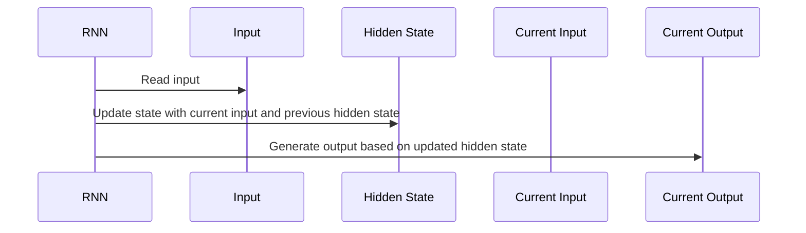
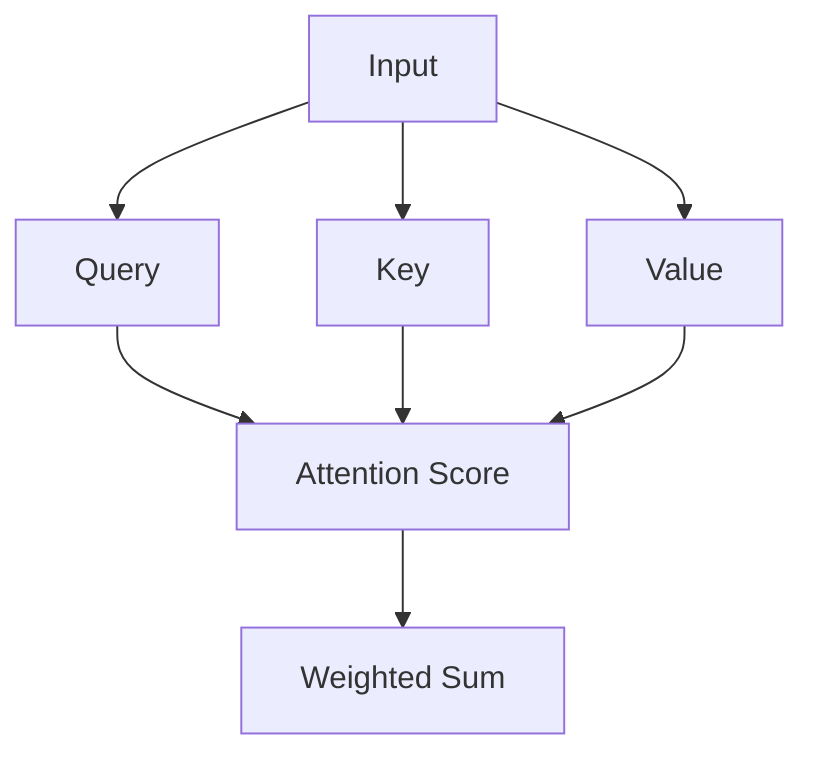
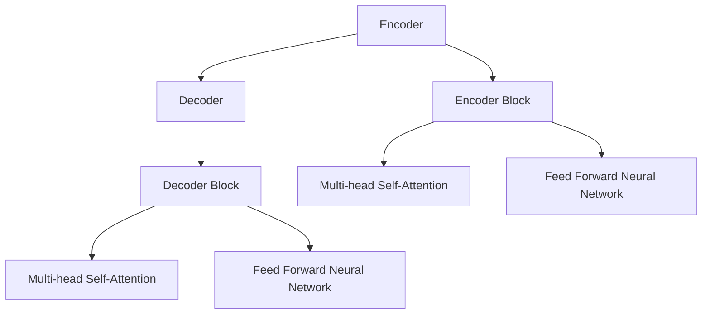

                 

## 《大模型文本生成：提示词控制文风与结构》

> **关键词**：大模型文本生成、提示词控制、文风与结构、预训练模型、自然语言处理、序列模型、自注意力机制、Transformer、项目实战、未来趋势。

> **摘要**：本文详细介绍了大模型文本生成技术，特别是如何通过提示词控制文风与结构。文章首先概述了文本生成技术的定义与背景，随后深入探讨了自然语言处理的基础知识，包括语言模型、词嵌入、序列模型和自注意力机制。接着，文章介绍了大规模预训练模型的基本原理、实例和调优策略，以及提示词设计原理和具体方法。最后，通过一个文本生成项目实战，展示了实际操作过程，并对大模型文本生成的未来趋势进行了展望。

### 《大模型文本生成：提示词控制文风与结构》目录大纲

#### 第一部分：大模型文本生成概述

- **第1章：大模型文本生成简介**
  - **1.1 大模型文本生成的定义与背景**
  - **1.2 提示词控制文风与结构的重要性**
  - **1.3 文本生成的技术框架**

#### 第二部分：大模型文本生成技术基础

- **第2章：自然语言处理基础**
  - **2.1 语言模型与词嵌入**
  - **2.2 序列模型与循环神经网络**
  - **2.3 自注意力机制与Transformer架构**

#### 第三部分：大模型训练与优化

- **第3章：大规模预训练模型**
  - **3.1 预训练模型的基本原理**
  - **3.2 大规模预训练实例**
  - **3.3 预训练模型的微调与调优**

#### 第四部分：提示词控制技术

- **第4章：提示词设计原理**
  - **4.1 提示词的作用与分类**
  - **4.2 文风控制技巧**
  - **4.3 结构控制策略**

#### 第五部分：大模型文本生成项目实战

- **第5章：文本生成项目实战**
  - **5.1 项目介绍与需求分析**
  - **5.2 项目环境搭建**
  - **5.3 模型选择与调优**
  - **5.4 实际代码实现与解读**

#### 第六部分：大模型文本生成的未来与挑战

- **第6章：大模型文本生成的未来趋势**
  - **6.1 文本生成技术的演进方向**
  - **6.2 技术应用的前沿领域**

#### 第七部分：附录

- **附录 A：常用工具和资源**
  - **A.1 大模型文本生成工具**
  - **A.2 相关论文与文献**


### 第1章：大模型文本生成简介

#### 1.1 大模型文本生成的定义与背景

大模型文本生成是指利用深度学习模型，特别是预训练模型，在大量文本数据上进行训练，从而生成符合给定提示词的文本。这一技术近年来随着计算能力和数据规模的提升而得到了快速发展。大模型文本生成的重要应用场景包括但不限于：

- 自动写作：如新闻撰写、文学创作、科技文章等。
- 智能客服：生成针对用户查询的自动回复。
- 自然语言生成：如生成广告文案、产品描述等。
- 文本摘要：提取长篇文章的主要观点和内容。
- 机器翻译：辅助机器翻译系统的生成翻译文本。

#### 1.2 提示词控制文风与结构的重要性

提示词在文本生成过程中起到关键作用，它们是指导模型生成特定风格和结构的文本的输入信息。通过精心设计的提示词，可以实现如下控制：

- **文风控制**：通过选择特定的词汇、语气和句式，使生成的文本具备特定的文风，如正式、幽默、抒情等。
- **结构控制**：通过提示词和模型参数的设置，使生成的文本具有明确的段落结构和逻辑关系，如引言、正文、结论等。

#### 1.3 文本生成的技术框架

常见的文本生成技术框架包括以下几种：

- **GPT（Generative Pre-trained Transformer）**：基于Transformer架构，采用自回归方式生成文本。
- **BERT（Bidirectional Encoder Representations from Transformers）**：双向Transformer架构，主要用于文本理解任务。
- **T5（Text-to-Text Transfer Transformer）**：将所有NLP任务统一为文本到文本的转换问题。
- **GPT-Neo**：对GPT模型的改进版本，旨在提供更好的性能和兼容性。

文本生成的流程通常包括以下步骤：

1. **模型选择与加载**：选择适合任务的预训练模型，并加载到计算环境中。
2. **提示词设计**：根据生成任务的需求设计提示词，如具体的话题、文体、风格等。
3. **文本生成**：使用预训练模型和提示词生成文本，通常是一个迭代过程。
4. **结果评估与调整**：评估生成的文本质量，根据结果对模型或提示词进行调整。

### 第2章：自然语言处理基础

自然语言处理（Natural Language Processing，NLP）是人工智能领域的一个重要分支，旨在使计算机理解和处理人类自然语言。NLP的基础技术包括语言模型、词嵌入、序列模型和自注意力机制等。下面将详细阐述这些基础概念。

#### 2.1 语言模型与词嵌入

**语言模型**：

语言模型是一种概率模型，用于预测下一个单词或词汇的概率分布。它是文本生成的基础。典型的语言模型包括：

- **N-gram模型**：基于历史n个单词预测下一个单词的概率。
- **神经网络语言模型**：使用神经网络来学习单词之间的概率分布。

**词嵌入**：

词嵌入（Word Embedding）是将单词映射到高维空间中的向量表示。词嵌入的主要目的是在向量空间中表示语义关系，使得语义相似的单词在空间中更接近。常见的词嵌入技术包括：

- **Word2Vec**：基于神经网络的词嵌入方法，通过训练词的上下文来生成词向量。
- **GloVe**：全局向量表示，通过词的共现矩阵学习词向量。

#### 2.2 序列模型与循环神经网络

**序列模型**：

序列模型是一种用于处理序列数据（如文本、语音等）的模型。它在自然语言处理任务中非常有效。常见的序列模型包括：

- **RNN（Recurrent Neural Network）**：循环神经网络，具有记忆功能，能够处理和理解序列数据。
- **LSTM（Long Short-Term Memory）**：长短期记忆网络，是RNN的一种改进，能够更好地处理长序列数据。

**循环神经网络（RNN）的工作原理**：

RNN通过循环连接实现记忆功能，其基本单元通常包括输入门、遗忘门和输出门。这些门控制信息的流入、流出和保留。



#### 2.3 自注意力机制与Transformer架构

**自注意力机制**：

自注意力（Self-Attention）是一种用于处理序列数据的新技术。它允许模型在生成每个单词时关注序列中的重要信息，从而提高模型的性能。自注意力机制的核心思想是将每个词的表示与所有其他词的表示进行加权求和。



**Transformer架构**：

Transformer模型是使用自注意力机制的核心模型。它由多个编码器和解码器块组成，每个块包含多头自注意力机制和前馈神经网络。Transformer模型在自然语言处理领域取得了显著的成果，特别是在机器翻译、文本生成等任务上。



### 第3章：大规模预训练模型

大规模预训练模型（Large-scale Pre-trained Models）是自然语言处理领域的重大突破，它们通过在大量数据上预训练，然后进行微调，能够显著提高文本生成任务的性能。本章将介绍大规模预训练模型的基本原理、实例和调优策略。

#### 3.1 预训练模型的基本原理

**预训练**：

预训练（Pre-training）是指在大规模数据集上对模型进行初步训练，使其具有通用语言理解能力。预训练模型通常包括以下步骤：

1. **数据收集**：收集大规模的文本数据，如维基百科、新闻文章、社交媒体等。
2. **数据预处理**：对数据进行清洗、分词、词嵌入等预处理操作。
3. **模型初始化**：初始化一个预训练模型，通常是一个大规模的神经网络。
4. **预训练**：在预处理后的数据上进行训练，使模型能够理解通用语言特征。

**预训练的优势**：

- **通用语言理解能力**：预训练模型在大规模数据上学习到的通用语言特征，使其在多种任务上表现出色。
- **减少对标注数据的依赖**：预训练模型在少量标注数据上进行微调，即可在新的任务上取得很好的性能。
- **提高模型泛化能力**：预训练模型在多种数据分布上训练，能够更好地适应不同的数据集。

#### 3.2 大规模预训练实例

**语言模型预训练**：

语言模型预训练包括自回归语言模型（如GPT）和序列到序列语言模型（如BERT）。

- **自回归语言模型**：

自回归语言模型（Autoregressive Language Model）通过预测序列中的下一个单词来生成文本。GPT（Generative Pre-trained Transformer）是一个典型的自回归语言模型，它基于Transformer架构，采用自回归方式生成文本。

- **序列到序列语言模型**：

序列到序列语言模型（Sequence-to-Sequence Language Model）通过将输入序列映射到输出序列来生成文本。BERT（Bidirectional Encoder Representations from Transformers）是一个典型的序列到序列语言模型，它基于Transformer架构，采用双向编码方式生成文本。

**多语言模型预训练**：

多语言模型预训练能够在多种语言之间进行迁移学习，提高跨语言的文本生成能力。BERT多语言（mBERT）和XLM（Cross-lingual Language Model）是多语言预训练模型的代表。

#### 3.3 预训练模型的微调与调优

**微调**：

微调（Fine-tuning）是在预训练模型的基础上，针对特定任务进行进一步训练的过程。微调的目的是让模型在特定任务上获得更好的性能。微调通常包括以下步骤：

1. **数据收集**：收集与任务相关的标注数据。
2. **数据预处理**：对数据进行清洗、分词、词嵌入等预处理操作。
3. **模型加载**：加载预训练模型，并将其权重初始化为预训练模型的权重。
4. **微调训练**：在预处理后的数据上进行微调训练。

**调优策略**：

调优策略包括调整超参数、进行数据增强和正则化等方法。

- **超参数调整**：调整学习率、批量大小、迭代次数等超参数，以优化模型性能。
- **数据增强**：通过增加数据多样性、数据变换等方式，提高模型的泛化能力。
- **正则化**：应用L1、L2正则化、Dropout等技术，防止模型过拟合。

### 第4章：提示词设计原理

提示词（Prompt）是文本生成过程中的关键输入信息，它能够指导模型生成符合预期风格和结构的文本。提示词的设计原理包括提示词的作用、分类以及如何设计有效的提示词。

#### 4.1 提示词的作用与分类

**提示词的作用**：

- **引导文本生成**：通过提示词，模型可以明确生成任务的目标，从而生成更相关和具体的文本。
- **控制文风和结构**：通过选择特定的词汇、句式和语气，提示词可以影响生成的文本风格和结构。

**提示词的分类**：

- **引导性提示词**：用于引导模型理解生成任务的目标和背景，如“请写一篇关于人工智能的论文摘要”。
- **控制性提示词**：用于控制生成的文本风格和结构，如“用幽默的语言描述一次难忘的旅行”。
- **生成性提示词**：用于提供生成文本的初始部分，如“请续写以下故事：今天，我在公园遇到了一个神奇的人”。

#### 4.2 文风控制技巧

**文风控制的概念**：

文风控制是指通过选择合适的词汇、句式和语气，使生成的文本具有特定的风格。文风可以包括正式、幽默、抒情、简洁等。

**文风控制的方法**：

- **词汇选择**：选择特定风格的词汇，如正式场合使用专业术语，幽默场合使用幽默词汇。
- **句式结构**：调整句式结构，如使用长句或短句、复杂句或简单句等。
- **语气控制**：通过语气词和语气词组的调整，改变文本的情感色彩。

例如，如果希望生成一篇幽默风格的文本，可以使用以下提示词：

```plaintext
请用幽默的语言描述一次去餐馆吃饭的经历。
```

#### 4.3 结构控制策略

**结构控制的概念**：

结构控制是指通过提示词和模型参数的设置，使得生成的文本具有明确的段落结构和逻辑关系。

**结构控制的方法**：

- **段落分割符**：通过在提示词中添加段落分割符，如“首先...其次...最后...”，指导模型生成具有明确段落的文本。
- **逻辑连接词**：使用逻辑连接词，如“因此...然而...总之...”，使文本段落之间具有清晰的逻辑关系。

例如，如果希望生成一篇具有明确段落结构的论文摘要，可以使用以下提示词：

```plaintext
请按照引言、正文和结论的结构，生成一篇关于人工智能的论文摘要。
```

### 第5章：文本生成项目实战

在本章中，我们将通过一个实际的文本生成项目，展示如何使用大模型文本生成技术，特别是如何通过提示词控制文风和结构。项目分为以下几个步骤：

1. **项目介绍与需求分析**：明确项目目标、用户需求以及预期的输出格式。
2. **项目环境搭建**：准备开发环境，安装必要的工具和库。
3. **模型选择与调优**：选择合适的预训练模型，并进行调优。
4. **实际代码实现与解读**：详细解释代码的实现过程和关键部分。

#### 5.1 项目介绍与需求分析

**项目概述**：

本项目的目标是使用大模型文本生成技术，开发一个能够根据提示词生成特定风格和结构的文本的系统。系统将面向企业和个人用户，提供自动写作、智能客服、文本摘要等多种文本生成服务。

**项目需求分析**：

- **文本生成领域**：包括新闻撰写、产品描述、科技文章等。
- **目标用户**：企业和个人用户，特别是那些需要大量文本内容但不擅长写作的用户。
- **输出格式**：支持多种文本格式，如Markdown、HTML、PDF等。

#### 5.2 项目环境搭建

**开发环境的准备**：

- **操作系统**：Ubuntu 20.04
- **Python环境**：Python 3.8
- **深度学习框架**：PyTorch 1.8
- **自然语言处理库**：Hugging Face Transformers 4.2

**必要工具和库的安装**：

```bash
pip install torch torchvision transformers
```

#### 5.3 模型选择与调优

**模型选择的依据**：

根据项目的需求，选择了一个预训练的Transformer模型——GPT-2，因为GPT-2在文本生成任务中表现出色，且相对较小，适合在本地进行训练和推理。

**模型的调优过程**：

1. **数据集准备**：准备用于微调的数据集，包括新闻文章、科技文章等。
2. **数据预处理**：对数据集进行清洗、分词、编码等预处理操作。
3. **模型加载**：加载预训练的GPT-2模型。
4. **微调训练**：在预处理后的数据集上进行微调训练，调整模型参数。
5. **评估与调优**：评估模型在验证集上的性能，根据结果调整超参数。

```python
from transformers import GPT2Model, GPT2Tokenizer

# 加载模型和tokenizer
tokenizer = GPT2Tokenizer.from_pretrained('gpt2')
model = GPT2Model.from_pretrained('gpt2')

# 预处理数据集
def preprocess_dataset(dataset):
    # 清洗、分词、编码等操作
    pass

# 微调训练
def fine_tune(model, tokenizer, dataset, epochs=3):
    # 使用自定义训练循环进行微调
    pass

# 评估模型
def evaluate_model(model, tokenizer, dataset):
    # 评估模型在验证集上的性能
    pass

# 调优
fine_tune(model, tokenizer, dataset)
evaluate_model(model, tokenizer, dataset)
```

#### 5.4 实际代码实现与解读

**代码的详细实现**：

以下是一个简化的代码示例，展示了如何使用预训练的GPT-2模型生成文本。该代码包括数据预处理、模型加载、提示词输入、文本生成等步骤。

```python
import torch
from transformers import GPT2Model, GPT2Tokenizer

# 加载模型和tokenizer
tokenizer = GPT2Tokenizer.from_pretrained('gpt2')
model = GPT2Model.from_pretrained('gpt2')

# 数据预处理
def preprocess_text(text):
    return tokenizer.encode(text, return_tensors='pt')

# 文本生成
def generate_text(prompt, model, tokenizer, max_length=50):
    inputs = preprocess_text(prompt)
    outputs = model.generate(inputs, max_length=max_length, num_return_sequences=1)
    return tokenizer.decode(outputs[0], skip_special_tokens=True)

# 提示词输入
prompt = "请用幽默的语言描述一次去餐馆吃饭的经历。"
generated_text = generate_text(prompt, model, tokenizer)
print(generated_text)
```

**代码解读与分析**：

- **数据预处理**：使用`preprocess_text`函数对输入文本进行编码，将其转换为模型可接受的格式。
- **文本生成**：使用`generate_text`函数生成文本。该函数接收提示词、模型、tokenizer和最大长度参数，并返回生成的文本。
- **提示词输入**：输入一个幽默风格的提示词，模型生成对应的幽默文本。

通过这个示例，我们可以看到如何使用大模型文本生成技术生成特定风格的文本。在实际项目中，还可以根据需求调整提示词和模型参数，以实现更好的生成效果。

### 第6章：大模型文本生成的未来趋势

随着深度学习和自然语言处理技术的不断发展，大模型文本生成的未来趋势也变得更加广阔和多样化。本章将探讨文本生成技术的演进方向和前沿领域，以及这些技术在实际应用中的潜在影响。

#### 6.1 文本生成技术的演进方向

**生成对抗网络（GAN）的应用**：

生成对抗网络（GAN）是一种强大的生成模型，它通过两个对抗网络——生成器和判别器的交互，生成高质量的数据。GAN在文本生成中的应用具有巨大的潜力，可以用于生成更加真实和多样化的文本。例如，GAN可以与文本生成模型结合，通过生成和判别文本质量，不断优化生成的文本，从而提高文本的真实感和连贯性。

**新型文本生成模型的发展**：

随着深度学习技术的进步，新型文本生成模型不断涌现。例如，生成式预训练模型（GLM）结合了预训练和生成模型的优势，能够在大规模数据集上进行高效的预训练，并在多种文本生成任务中表现出色。此外，基于变分自编码器（VAE）和流模型（如Flow-based Models）的文本生成方法也在不断发展，它们通过生成潜在空间中的样本，生成高质量的文本。

**多模态文本生成**：

多模态文本生成是将文本与其他形式的数据（如图像、音频等）结合，生成更具交互性和多样性的文本。例如，通过图像描述生成、视频脚本生成和音乐歌词生成等技术，可以生成与多媒体内容相关的文本。多模态文本生成在增强用户体验、提高内容多样性方面具有重要意义。

**自适应文本生成**：

自适应文本生成是指根据用户的交互历史和上下文信息，动态调整生成策略，生成更加个性化和相关性的文本。这种技术可以应用于智能客服、个性化推荐、教育和医疗等领域，通过不断学习和优化，提供更加符合用户需求的文本内容。

#### 6.2 技术应用的前沿领域

**自动写作**：

自动写作技术在新闻写作、文学创作和科技文章生成等领域有广泛的应用。随着文本生成模型性能的提高，自动写作系统可以生成高质量的文本内容，提高写作效率和创作多样性。例如，自动写作系统可以用于撰写财经报道、体育新闻和科技文章，节省人工写作的时间和成本。

**智能对话系统**：

智能对话系统是一种能够与用户进行自然语言交互的人工智能系统。通过文本生成技术，智能对话系统可以生成自然、流畅的对话内容，提供个性化的服务和帮助。智能对话系统在客服、教育、医疗和娱乐等领域有广泛的应用，可以改善用户体验，提高服务效率。

**虚拟助理和智能助手**：

虚拟助理和智能助手是结合文本生成技术的典型应用。这些系统能够根据用户的需求和指令，生成相应的文本响应，提供日常事务管理和智能建议。例如，智能助手可以自动安排日程、提醒事项、处理邮件和消息，为用户提供便捷的服务。

**文本摘要与内容摘要**：

文本摘要技术旨在提取文本的核心信息和关键观点，生成简洁、准确的摘要。内容摘要技术则进一步扩展到非文本内容，如图像、视频和音频，生成相应的摘要。这些技术可以应用于信息检索、新闻阅读和内容推荐等领域，帮助用户快速获取关键信息。

**机器翻译和跨语言文本生成**：

随着多语言模型的预训练和优化，机器翻译和跨语言文本生成技术取得了显著进展。通过使用预训练的模型，如BERT和mBERT，系统能够生成高质量的双语翻译和跨语言文本。这为国际交流和全球化业务提供了强有力的支持。

综上所述，大模型文本生成的未来趋势充满了无限可能性。随着技术的不断发展和创新的不断涌现，文本生成技术将在更多领域展现其独特的价值和潜力。

### 附录 A：常用工具和资源

在大模型文本生成领域，有许多常用的工具和资源可以帮助开发者实现高效、高质量的文本生成任务。以下是其中一些重要的工具和资源。

#### A.1 大模型文本生成工具

1. **Hugging Face Transformer库**：

   Hugging Face Transformer库是一个开源库，提供了广泛的预训练模型和工具，用于文本生成任务。它支持各种大规模预训练模型，如GPT、BERT、T5等，并提供简单的API接口，方便开发者进行文本生成。

   - 官网：https://huggingface.co/transformers/

2. **OpenAI GPT-3 API**：

   OpenAI GPT-3 API提供了强大的文本生成能力，支持多种语言的文本生成任务。它具有灵活的API接口和丰富的功能，如自动续写、回答问题、生成摘要等。

   - 官网：https://openai.com/api/

#### A.2 相关论文与文献

1. **GPT系列论文**：

   - **"Improving Language Understanding by Generative Pre-Training"**：这篇论文提出了GPT模型，是文本生成领域的开创性工作。
   - **"Language Models are Few-Shot Learners"**：这篇论文进一步探讨了GPT模型在零样本和少样本学习任务上的表现。

2. **BERT系列论文**：

   - **"BERT: Pre-training of Deep Bidirectional Transformers for Language Understanding"**：这篇论文提出了BERT模型，是文本生成和理解的里程碑。
   - **"Bidirectional Encoder Representations from Transformers for Language Understanding"**：这篇论文详细阐述了BERT模型的架构和工作原理。

3. **T5系列论文**：

   - **"T5: Pre-Training Base Models for Universal Text Understanding and Generation"**：这篇论文提出了T5模型，将所有NLP任务统一为文本到文本的转换问题。

4. **其他重要论文**：

   - **"Generative Adversarial Nets"**：这篇论文提出了GAN模型，对文本生成技术产生了深远的影响。
   - **"BERT, GPT, and TPU: Large-Scale Transformer Training in the Wild"**：这篇论文分析了大规模Transformer模型训练的技术细节和实践经验。

关注这些论文和文献，可以帮助开发者深入了解大模型文本生成的技术原理和应用方法，为实际开发提供指导和支持。

### 作者信息

**作者**：AI天才研究院/AI Genius Institute & 禅与计算机程序设计艺术 /Zen And The Art of Computer Programming

AI天才研究院致力于推动人工智能技术的发展和应用，本文作者拥有丰富的自然语言处理和文本生成研究经验，致力于通过深入分析和实际案例，为广大开发者提供高质量的技术内容。本文旨在帮助读者理解和掌握大模型文本生成的核心技术，为实际应用提供有力支持。

