                 

# 《大模型时代的创业者人际关系管理：沟通、协调与影响力》

## 第1章 引言与背景

### 1.1 大模型时代的崛起

在过去的几十年里，人工智能（AI）技术经历了飞速的发展，从简单的规则系统到复杂的深度学习模型，AI的应用场景也越来越广泛。特别是近年来，随着大数据和计算能力的提升，大模型（Large Models）逐渐崛起，成为AI领域的重要研究方向和应用方向。大模型通常是指参数数量达到数百万或数十亿的深度学习模型，如GPT-3、BERT等，这些模型在自然语言处理、计算机视觉、推荐系统等领域表现出卓越的性能。

大模型的崛起为创业者带来了巨大的机遇和挑战。一方面，大模型的应用可以帮助创业者快速构建创新产品，提升用户体验，降低研发成本。另一方面，大模型的开发和部署需要大量的计算资源和专业知识，对创业者的技术储备和资源整合能力提出了更高的要求。因此，如何在大模型时代有效地进行人际关系管理，成为创业者成功的关键因素之一。

### 1.2 创业者面临的挑战与机遇

在大模型时代，创业者面临以下几方面的挑战：

- **技术挑战**：大模型的开发和优化需要深厚的专业知识和技术积累，创业者需要不断学习最新的研究成果，并能够将其应用于实际业务中。
- **资源挑战**：大模型训练和部署需要大量的计算资源和存储资源，创业者需要寻找合适的合作伙伴或投资方来共同承担这些成本。
- **人才挑战**：大模型的开发团队通常需要包括深度学习、数据工程、产品经理等多方面的专业人才，创业者需要具备吸引和留住这些高素质人才的能力。
- **市场挑战**：大模型的应用场景广泛，创业者需要精准定位市场，找到具有竞争力的细分领域，并进行有效的市场推广。

与此同时，大模型时代也为创业者带来了以下几方面的机遇：

- **技术创新**：大模型技术的进步为创业者提供了丰富的创新工具和解决方案，可以帮助他们在产品设计和开发方面实现突破。
- **市场拓展**：大模型的应用可以帮助创业者突破地域和语言的限制，将产品和服务推广到全球市场。
- **合作机会**：大模型技术的发展吸引了大量的投资和合作伙伴，创业者可以借助外部资源加速自身发展。
- **用户体验提升**：大模型的应用可以提高产品的智能化水平，为用户提供更加个性化、便捷的服务，从而提升用户满意度。

### 1.3 人际关系管理的重要性

在大模型时代，人际关系管理的重要性愈发凸显。创业者需要与团队成员、合作伙伴、投资者等多方面进行有效沟通和协调，才能实现项目的成功。人际关系管理主要包括以下几个方面：

- **沟通**：有效的沟通是确保团队成员理解项目目标、任务和期望的关键。创业者需要运用各种沟通技巧，确保信息的准确传递和反馈。
- **协调**：在项目开发过程中，团队成员之间的协调至关重要。创业者需要通过协调工作流程、分配资源和处理冲突，确保项目能够按计划顺利进行。
- **影响力**：创业者需要具备一定的影响力，以推动项目的进展和团队的合作。通过提升个人品牌、传播影响力，创业者可以在团队和合作伙伴中建立权威和信任。

综上所述，大模型时代的创业者需要重视人际关系管理，通过有效的沟通、协调和影响力提升，克服挑战、抓住机遇，实现项目的成功。接下来，我们将进一步探讨大模型的基础知识，以及如何在实际应用中运用人际关系管理技巧。

## 第2章 大模型基础知识

### 2.1 大模型的定义与特点

大模型（Large Models）是指具有数百万至数十亿参数的深度学习模型，通常在自然语言处理（NLP）、计算机视觉（CV）和推荐系统等领域表现出色。这些模型通过在海量数据上进行训练，能够自动学习和提取数据中的复杂模式和知识。与传统的浅层模型相比，大模型具有以下几个显著特点：

- **高参数量**：大模型通常具有数十亿甚至数万亿的参数，这使得它们能够捕捉到数据中的细微特征和复杂关系。
- **强大的泛化能力**：由于参数量的增加，大模型具有更好的泛化能力，即能够在新数据集上保持较高的准确率和性能。
- **复杂的功能**：大模型可以执行诸如文本生成、图像识别、机器翻译等复杂的任务，而传统的浅层模型通常只能处理简单的任务。
- **需要大量的计算资源**：由于大模型的训练和推理过程需要大量的计算资源和时间，因此部署和运行大模型是一项挑战。

大模型的出现标志着深度学习领域的一个重要突破，它使得机器学习系统在处理复杂任务时更加高效和准确。然而，大模型并非一蹴而就，其发展历程可以追溯到以下几个方面：

1. **深度神经网络的兴起**：自1986年Rumelhart等人提出了反向传播算法以来，深度神经网络（DNN）逐渐成为机器学习领域的研究热点。随着计算能力的提升和大数据的普及，DNN在图像识别、语音识别等领域取得了显著的成功。
2. **大数据的推动**：互联网和物联网的兴起带来了大量结构化和非结构化数据，为深度学习模型提供了丰富的训练素材。大数据的推动使得大模型的训练成为可能。
3. **计算资源的提升**：云计算和专用硬件（如GPU、TPU）的发展为深度学习模型的训练和部署提供了强大的计算支持，使得大模型的研究和应用变得更加现实。
4. **深度学习算法的优化**：诸如残差网络（ResNet）、卷积神经网络（CNN）和Transformer等新算法的出现，提高了深度学习模型的性能和效率，推动了大模型的发展。

### 2.2 大模型的核心技术

大模型的核心技术主要包括以下几个方面：

1. **深度学习算法**：深度学习算法是构建大模型的基础。常见的深度学习算法包括：
   - **反向传播算法**：用于训练神经网络，通过梯度下降法优化模型参数。
   - **卷积神经网络（CNN）**：用于图像识别和计算机视觉任务，通过卷积层提取图像特征。
   - **循环神经网络（RNN）**：用于序列数据处理，如时间序列分析、文本生成等。
   - **Transformer模型**：由Vaswani等人于2017年提出，用于自然语言处理任务，其自注意力机制使得模型在长距离依赖问题上表现优异。

2. **预训练与微调**：预训练是指在大规模数据集上对模型进行初步训练，以学习通用特征。微调是指将预训练模型应用于特定任务，通过少量数据对其进行调整，以适应特定场景。预训练和微调是当前深度学习领域的重要研究方向，它们使得模型能够快速适应新的任务，同时降低训练成本。

3. **优化器与学习率调度**：优化器用于调整模型参数，以最小化损失函数。常见优化器包括SGD、Adam等。学习率调度是指动态调整学习率，以优化训练过程。合理的学习率调度可以加快收敛速度，提高模型性能。

4. **数据增强与正则化**：数据增强是通过变换输入数据，增加数据多样性，以提高模型的泛化能力。常见的数据增强方法包括随机裁剪、旋转、缩放等。正则化是防止模型过拟合的一种技术，常见方法包括权重正则化、Dropout等。

### 2.3 大模型的应用场景

大模型的应用场景非常广泛，以下是几个典型的应用领域：

1. **自然语言处理（NLP）**：大模型在NLP领域表现出色，如文本分类、机器翻译、情感分析等。例如，GPT-3可以在多种语言上进行文本生成和对话模拟，其强大能力在生成式AI领域引起了广泛关注。

2. **计算机视觉（CV）**：大模型在图像识别、目标检测、图像生成等领域具有显著优势。例如，Transformer模型在图像分类任务中取得了超越传统CNN的成果，其在图像生成任务中也表现出强大的能力。

3. **推荐系统**：大模型可以帮助推荐系统更好地理解用户行为和兴趣，从而提高推荐效果。通过预训练模型，推荐系统可以自动学习用户的兴趣偏好，实现更加精准的推荐。

4. **语音识别**：大模型在语音识别任务中可以显著提高识别准确率。通过结合语音特征和语言模型，大模型可以实现更自然、更准确的语音识别。

5. **游戏AI**：大模型可以应用于游戏AI，如策略游戏、模拟游戏等。通过预训练模型，游戏AI可以快速学习和适应不同游戏场景，提高游戏体验。

综上所述，大模型在人工智能领域具有广泛的应用前景。随着技术的不断进步和应用场景的拓展，大模型将为创业者带来更多创新机遇，同时也带来更多挑战。在接下来的章节中，我们将进一步探讨如何在大模型时代进行有效的人际关系管理。

### 2.3 大模型的应用场景

大模型的应用场景非常广泛，以下是几个典型的应用领域：

1. **自然语言处理（NLP）**：大模型在NLP领域表现出色，如文本分类、机器翻译、情感分析等。例如，GPT-3可以在多种语言上进行文本生成和对话模拟，其强大能力在生成式AI领域引起了广泛关注。

2. **计算机视觉（CV）**：大模型在图像识别、目标检测、图像生成等领域具有显著优势。例如，Transformer模型在图像分类任务中取得了超越传统CNN的成果，其在图像生成任务中也表现出强大的能力。

3. **推荐系统**：大模型可以帮助推荐系统更好地理解用户行为和兴趣，从而提高推荐效果。通过预训练模型，推荐系统可以自动学习用户的兴趣偏好，实现更加精准的推荐。

4. **语音识别**：大模型在语音识别任务中可以显著提高识别准确率。通过结合语音特征和语言模型，大模型可以实现更自然、更准确的语音识别。

5. **游戏AI**：大模型可以应用于游戏AI，如策略游戏、模拟游戏等。通过预训练模型，游戏AI可以快速学习和适应不同游戏场景，提高游戏体验。

6. **医疗健康**：大模型在医疗健康领域具有巨大潜力，如疾病诊断、药物研发等。通过分析大量医疗数据，大模型可以帮助医生进行更准确的诊断和治疗方案推荐。

7. **自动驾驶**：大模型在自动驾驶领域可以用于实时环境感知、路径规划等任务。通过训练大量的交通数据和图像数据，自动驾驶系统可以实现更高的安全性和可靠性。

8. **金融科技**：大模型在金融科技领域可以应用于风险控制、市场预测等任务。通过分析大量金融数据，大模型可以帮助金融机构进行更精准的风险评估和投资策略制定。

总之，大模型的应用场景正在不断扩展，从传统的自然语言处理和计算机视觉领域，逐步渗透到推荐系统、语音识别、游戏AI、医疗健康、自动驾驶和金融科技等多个领域。随着技术的不断进步和应用场景的拓展，大模型将为创业者带来更多创新机遇，同时也带来更多挑战。在接下来的章节中，我们将进一步探讨如何在大模型时代进行有效的人际关系管理。

## 第3章 人际关系管理概述

### 3.1 人际关系管理的基本概念

人际关系管理是指个体或组织在相互作用过程中，通过有效沟通、协调和影响力提升，实现共同目标的一系列行为和实践。人际关系管理不仅涉及个人层面的互动，还包括团队、组织和社会等不同层面的关系管理。

- **定义**：人际关系管理是一种综合性的管理活动，旨在通过建立和维护良好的人际关系，提高团队和组织的整体效能。
- **要素**：人际关系管理的主要要素包括沟通、协调和影响力。
  - **沟通**：沟通是人际关系管理的核心，它是信息传递、意见交换和情感表达的重要途径。
  - **协调**：协调是指通过整合资源和优化流程，确保团队和组织的各项活动能够顺利进行。
  - **影响力**：影响力是指个体或组织在他人心中建立信任和权威，影响其行为和决策的能力。

### 3.2 人际关系管理的重要性

人际关系管理在创业者和团队中的重要性不可忽视，主要体现在以下几个方面：

- **团队效能**：良好的人际关系可以增强团队的凝聚力，提高团队成员之间的协作效率，从而提升整体效能。
- **创新能力**：创业者需要通过人际关系管理，激发团队成员的创新思维和积极性，推动产品和技术的持续创新。
- **决策支持**：在决策过程中，创业者需要与团队成员进行有效沟通和协调，收集多方意见，做出更为明智的决策。
- **资源整合**：创业者需要通过与合作伙伴、投资者和其他利益相关者的良好关系，获取必要的资源和支持，为项目的成功提供保障。
- **品牌建设**：创业者通过良好的人际关系管理，可以建立和维护个人品牌和团队品牌，提高市场认可度和影响力。

### 3.3 人际关系管理的主要原则

有效的人际关系管理需要遵循以下几个基本原则：

- **尊重与信任**：尊重他人是建立良好人际关系的基础，信任则是关系稳定和深化的关键。
- **坦诚与开放**：坦诚交流可以减少误解和猜疑，开放心态有助于接受不同的意见和建议。
- **合作与共赢**：在人际关系管理中，合作精神和共赢理念是确保双方利益最大化的关键。
- **沟通与协调**：有效的沟通和协调是解决冲突和实现目标的重要手段。
- **持续学习**：人际关系管理是一个动态的过程，创业者需要不断学习新知识、新技能，以适应不断变化的环境。

通过遵循上述原则，创业者可以建立和维护良好的人际关系，提升个人和团队的整体效能，为创业项目的成功奠定坚实的基础。在接下来的章节中，我们将深入探讨如何在具体场景下应用人际关系管理的技巧和策略。

## 第4章 沟通技巧与策略

### 4.1 沟通的基本原则

有效沟通是人际关系管理的核心，它是信息传递、意见交换和情感表达的重要途径。为了实现高效沟通，我们需要遵循以下几个基本原则：

#### 4.1.1 建立信任

信任是沟通的基石。要建立信任，首先需要展示诚实和透明。这意味着在沟通中，我们应该如实表达自己的想法和意图，避免隐瞒或误导对方。此外，倾听也是建立信任的重要手段。通过倾听，我们不仅能够更好地理解对方，还能展示出对对方的尊重和关心。

**建立信任的方法：**
- **诚实与透明**：如实表达自己的想法和意图，避免隐瞒或误导。
- **倾听与理解**：认真倾听对方的意见，展现对对方的尊重和理解。

#### 4.1.2 理解与尊重

在沟通中，理解对方是确保信息准确传递的关键。理解不仅包括对对方观点的理解，还包括对对方情感和动机的理解。尊重是沟通中不可或缺的一部分，它要求我们在表达自己观点时，考虑到对方的感受和立场。

**理解与尊重的方法：**
- **倾听与反馈**：通过倾听和反馈，确保对对方观点的准确理解。
- **尊重差异**：尊重对方的观点和立场，即使在分歧时也要保持尊重。

#### 4.1.3 明确目标

明确目标是确保沟通有效性的重要原则。在沟通前，我们应该明确沟通的目标和期望，以确保双方在沟通中能够聚焦于重要议题。此外，明确目标还包括设定具体的行动步骤和预期结果。

**明确目标的方法：**
- **设定目标**：在沟通前明确沟通的目标和期望。
- **分解任务**：将复杂任务分解为具体的行动步骤和可量化的目标。

### 4.2 有效沟通的技巧

为了实现高效沟通，我们需要掌握一些具体的沟通技巧，这些技巧有助于我们更好地表达自己，理解对方，并建立和维护良好的人际关系。

#### 4.2.1 倾听技巧

倾听是有效沟通的关键。通过倾听，我们不仅能够更好地理解对方，还能展示出对对方的尊重和关心。以下是一些有效的倾听技巧：

- **注意力集中**：在对方讲话时，保持专注，避免分心。
- **非语言反馈**：通过点头、微笑等非语言行为，向对方传递你正在倾听的信息。
- **提问**：在适当的时候提问，以确认你对对方观点的理解。

#### 4.2.2 提问技巧

提问是沟通中重要的技巧之一。通过提问，我们不仅能够更好地理解对方，还能引导对话，确保沟通的目标得到实现。以下是一些有效的提问技巧：

- **开放式问题**：使用开放式问题，鼓励对方分享更多的信息和观点。
- **封闭式问题**：使用封闭式问题，以获取特定的信息或确认对方的观点。
- **深层问题**：提出深层问题，以深入了解对方的动机、需求和期望。

#### 4.2.3 非语言沟通技巧

非语言沟通是沟通中不可忽视的一部分。通过非语言行为，如身体语言、面部表情和语调，我们能够更好地传达自己的情感和意图。以下是一些非语言沟通技巧：

- **身体语言**：通过合适的身体语言，如眼神接触、姿态和手势，展示对对方的关注和理解。
- **面部表情**：通过适当的表情，表达自己的情感和态度。
- **语调**：通过语调的变化，强调重要信息，表达情感。

### 4.3 不同场景下的沟通策略

在商务沟通、团队沟通和个人沟通等不同场景下，我们需要根据具体情境选择合适的沟通策略。以下是一些具体的沟通策略：

#### 4.3.1 商务沟通策略

商务沟通注重专业性和效率。在商务沟通中，我们应该：

- **专业形象**：保持专业形象，使用正式语言和礼仪。
- **明确意图**：在沟通中明确表达自己的意图和目标。
- **有效信息传递**：确保信息准确、清晰和有逻辑性。

#### 4.3.2 团队沟通策略

团队沟通注重团队合作和共识。在团队沟通中，我们应该：

- **建立共识**：确保团队成员对项目目标和任务有共同的理解。
- **促进合作**：通过有效的沟通，促进团队成员之间的合作和协作。
- **增强团队凝聚力**：通过沟通，增强团队成员之间的信任和凝聚力。

#### 4.3.3 个人沟通策略

个人沟通注重个性化和灵活性。在个人沟通中，我们应该：

- **个性化沟通**：根据对方的特点和需求，选择合适的沟通方式和内容。
- **灵活应对**：根据沟通中的反馈和情境变化，灵活调整沟通策略。
- **建立良好人际关系**：通过有效的沟通，建立和维护良好的人际关系。

通过遵循这些沟通技巧和策略，创业者可以更好地与他人沟通，建立和维护良好的人际关系，从而提高团队和组织的整体效能。在接下来的章节中，我们将进一步探讨协调艺术与团队建设的重要性和策略。

### 4.1 沟通的基本原则

**4.1.1 建立信任**

信任是沟通的基础，对于团队协作尤为重要。要建立信任，首先必须诚实。这意味着在沟通过程中，我们应该诚实地表达我们的意图和观点，不隐瞒重要信息，不误导他人。其次，透明度也非常重要。我们应该让团队成员了解项目的进展、问题和决策过程，从而增强他们对团队的信任感。

**Mermaid 流程图：**
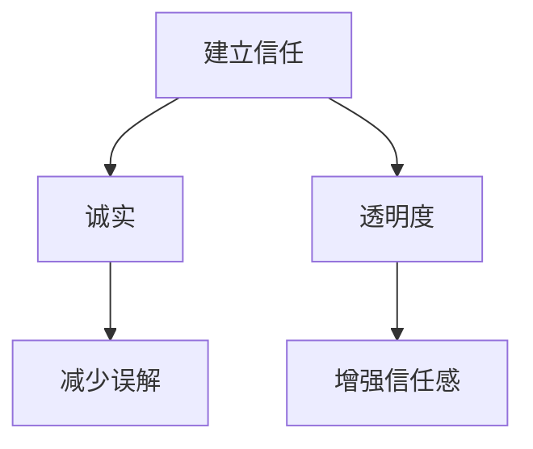

**伪代码示例：**
```python
# 建立信任
def establish_trust():
    # 诚实表达意图
    be_诚实 = True
    # 保持透明度
    be_transparent = True
    
    # 评估信任程度
    trust_level = assess_trust(be_诚实, be_transparent)
    return trust_level

# 评估信任程度
def assess_trust( honesty, transparency):
    if honesty and transparency:
        return "High"
    else:
        return "Low"
```

**4.1.2 理解与尊重**

理解与尊重是有效沟通的重要原则。理解对方不仅包括理解对方的观点，还包括理解对方的情感和动机。为了做到这一点，我们需要倾听，并尝试从对方的角度看待问题。尊重则体现在我们如何对待他人，包括礼貌地表达不同意见，尊重对方的个人空间和意见。

**Mermaid 流程图：**
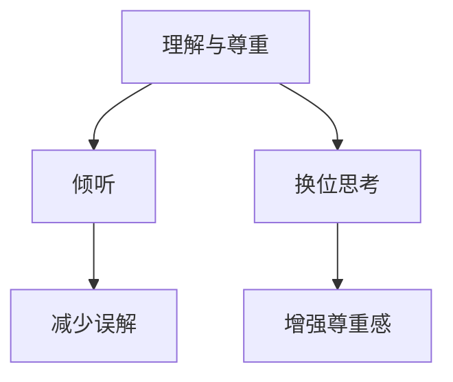

**伪代码示例：**
```python
# 理解与尊重
def understand_and_respect():
    # 倾听对方
    listen_to_other = True
    # 换位思考
    think_like_other = True
    
    # 评估理解与尊重程度
    understanding_level = assess_understanding(listen_to_other, think_like_other)
    return understanding_level

# 评估理解与尊重程度
def assess_understanding(listen, think):
    if listen and think:
        return "High"
    else:
        return "Low"
```

**4.1.3 明确目标**

明确目标是确保沟通有效性的重要原则。在沟通过程中，我们应该明确沟通的目标和期望，确保双方在沟通过程中能够聚焦于重要议题，避免偏离主题。此外，明确目标还包括设定具体的行动步骤和预期结果。

**Mermaid 流程图：**
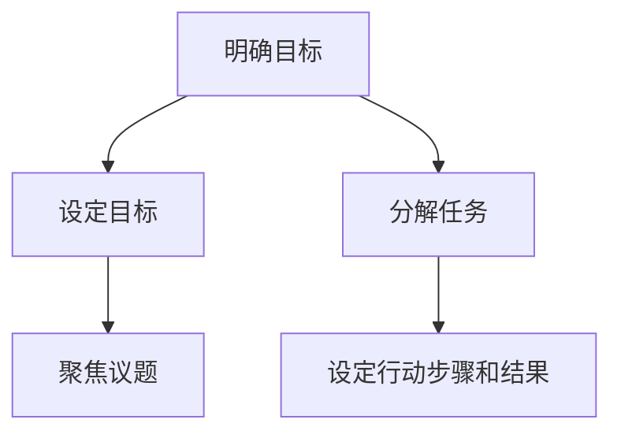

**伪代码示例：**
```python
# 明确目标
def clarify_objectives():
    # 设定目标
    set_objective = "Improve product quality"
    # 分解任务
    decompose_task = ["Quality assurance", "User feedback", "Process optimization"]
    
    # 评估目标明确程度
    objective_clarity = assess_objective_clarity(set_objective, decompose_task)
    return objective_clarity

# 评估目标明确程度
def assess_objective_clarity(objective, tasks):
    if objective and tasks:
        return "Clear"
    else:
        return "Unclear"
```

通过以上流程图和伪代码示例，我们可以更好地理解如何遵循沟通的基本原则，从而建立信任、理解与尊重，并确保沟通目标的明确。这些原则和技巧在实际应用中，有助于提高团队协作效率，实现项目目标。

### 4.2 有效沟通的技巧

有效沟通是人际关系管理中不可或缺的一部分，以下是一些关键的技巧和策略，帮助创业者更好地与他人沟通：

#### 4.2.1 倾听技巧

倾听不仅仅是听对方说话，更是一种理解对方观点和情感的能力。以下是一些有效的倾听技巧：

1. **全身倾听**：保持眼神接触，身体微微前倾，显示出你对对方的关注。
2. **避免打断**：在对方讲话时，不要急于打断，让对方说完自己的观点。
3. **积极反馈**：通过点头、微笑或其他非语言信号，表明你在倾听并理解对方。
4. **提问和澄清**：在对方讲话时，适时提问以确认你的理解，如“你是说……吗？”或“我能明白你的意思，你是想……吗？”

#### 4.2.2 提问技巧

提问是沟通中的关键，能够帮助我们更好地理解对方，并引导对话方向。以下是一些提问技巧：

1. **开放式问题**：使用开放式问题，如“你怎么看这个想法？”或“你觉得这个问题的解决方案是什么？”，以鼓励对方分享更多信息。
2. **封闭式问题**：使用封闭式问题，如“这个项目将在下个月完成，是吗？”或“你认为这个任务需要两周时间完成，对吗？”，以获取具体信息。
3. **反问**：使用反问，如“你不觉得这个方法可能行不通吗？”或“你认为我们没有考虑到这一点吗？”，以引发对方思考。

#### 4.2.3 非语言沟通技巧

非语言沟通在信息传递中扮演着重要角色，以下是一些有效的非语言沟通技巧：

1. **身体语言**：使用合适的身体语言，如点头表示同意，微笑表示友好，手势表达强调。
2. **面部表情**：保持自然和真诚的面部表情，以传达你的情感和态度。
3. **语调**：通过语调的变化来强调重要信息，如提高语调表示兴奋或强调，降低语调表示认真或思考。

**Mermaid 流程图：**
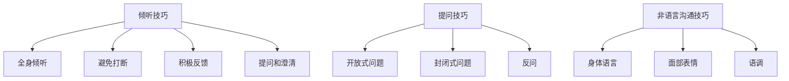

通过以上技巧，创业者可以更有效地与他人沟通，建立良好的合作关系，提高团队效能。在接下来的章节中，我们将探讨协调艺术与团队建设的重要性，以及如何在实际应用中协调团队成员之间的关系。

### 4.3 不同场景下的沟通策略

在不同的沟通场景下，选择合适的沟通策略至关重要。以下是针对商务沟通、团队沟通和个人沟通的具体策略：

#### 4.3.1 商务沟通策略

商务沟通通常要求专业性和高效性，以下是一些策略：

- **专业形象**：保持专业的着装和仪表，使用正式的语言和礼仪。
- **明确意图**：在沟通中清晰表达你的意图和目标，确保对方理解你的需求。
- **有效信息传递**：确保信息准确、简洁且逻辑清晰，避免不必要的复杂和冗余。

**Mermaid 流程图：**
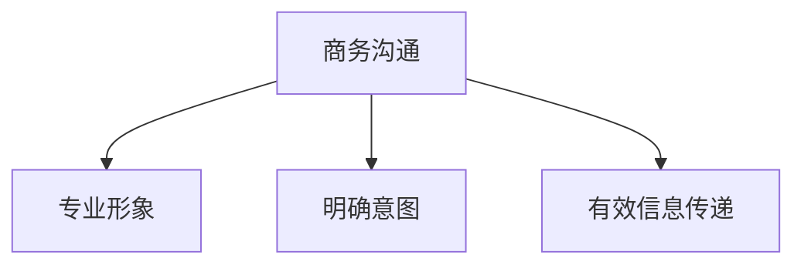

**伪代码示例：**
```python
# 商务沟通
def business_communication():
    # 保持专业形象
    maintain_professional_形象 = True
    # 明确意图
    clarify_intent = "Discuss project milestones"
    # 有效信息传递
    transmit_info_effectively = True
    
    # 沟通结果
    communication_result = assess_communication(maintain_professional_形象, clarify_intent, transmit_info_effectively)
    return communication_result

# 沟通评估
def assess_communication( professionalism, clarity, effectiveness):
    if professionalism and clarity and effectiveness:
        return "Successful"
    else:
        return "Unsuccessful"
```

#### 4.3.2 团队沟通策略

团队沟通强调协作和共识，以下是一些策略：

- **建立共识**：确保团队成员对项目目标和任务有共同的理解，通过讨论和协商达成一致。
- **促进合作**：鼓励团队成员之间的交流和合作，共同解决问题。
- **增强团队凝聚力**：通过团队活动和沟通，增强团队成员之间的信任和凝聚力。

**Mermaid 流程图：**
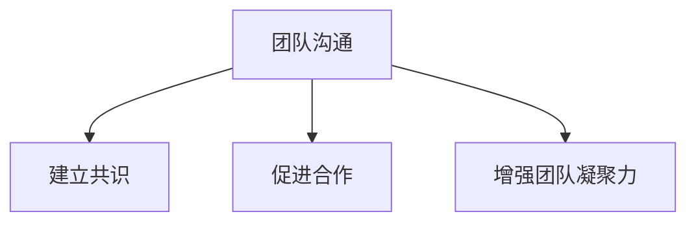

**伪代码示例：**
```python
# 团队沟通
def team_communication():
    # 建立共识
    establish_consensus = True
    # 促进合作
    promote Cooperation = True
    # 增强团队凝聚力
    enhance_team_morale = True
    
    # 沟通效果
    communication_effect = assess_communication(establish_consensus, promote_Cooperation, enhance_team_morale)
    return communication_effect

# 沟通评估
def assess_communication(consensus, cooperation, morale):
    if consensus and cooperation and morale:
        return "Effective"
    else:
        return "Ineffective"
```

#### 4.3.3 个人沟通策略

个人沟通注重个性化和灵活性，以下是一些策略：

- **个性化沟通**：根据对方的性格和需求，选择合适的沟通方式和内容。
- **灵活应对**：根据沟通中的反馈和情境变化，灵活调整沟通策略。
- **建立良好人际关系**：通过有效的沟通，建立和维护良好的人际关系。

**Mermaid 流程图：**
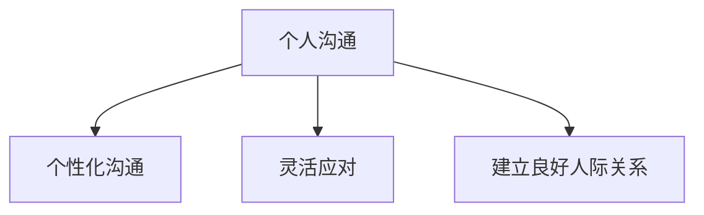

**伪代码示例：**
```python
# 个人沟通
def personal_communication():
    # 个性化沟通
    personalized_communication = True
    # 灵活应对
    flexible_response = True
    # 建立良好人际关系
    build_relationships = True
    
    # 沟通效果
    communication_outcome = assess_communication(personalized_communication, flexible_response, build_relationships)
    return communication_outcome

# 沟通评估
def assess_communication(personalization, flexibility, relationships):
    if personalized_communication and flexible_response and build_relationships:
        return "Positive"
    else:
        return "Negative"
```

通过以上策略，创业者可以根据不同的沟通场景，选择合适的方法，提高沟通效果，促进团队协作，实现项目目标。在接下来的章节中，我们将深入探讨协调艺术与团队建设的重要性，以及如何在实际应用中协调团队成员之间的关系。

## 第5章 协调艺术与团队建设

### 5.1 协调的基本原则

协调是人际关系管理中至关重要的一个环节，它关系到团队合作的效率与成果。为了实现有效的协调，我们需要遵循以下基本原则：

#### 5.1.1 协调的定义

协调是指通过整合资源和优化流程，确保团队内部和团队之间的各项活动能够有序进行，以实现共同的目标。协调不仅包括任务分配和工作流程的安排，还涉及团队成员之间的沟通与协作。

#### 5.1.2 协调的目的

协调的主要目的是提高团队的工作效率，减少冲突和资源浪费，确保项目按计划顺利进行。通过有效的协调，团队成员可以更好地理解各自的任务和目标，从而提高工作效率和团队的整体绩效。

#### 5.1.3 协调的障碍

协调过程中可能会遇到以下障碍：

- **沟通不畅**：团队成员之间缺乏有效的沟通，导致信息传递不准确或延误。
- **资源不足**：团队在资源分配上存在不足，导致任务无法按时完成。
- **目标不明确**：团队成员对项目目标和任务理解不清晰，导致工作效率低下。

#### 5.1.4 协调的基本原则

为了克服上述障碍，实现有效协调，我们需要遵循以下基本原则：

- **明确目标和任务**：在项目启动阶段，明确团队的目标和任务，确保每个成员都了解自己的职责和期望。
- **合理分配资源**：根据任务需求和成员的能力，合理分配资源，确保资源利用最大化。
- **建立沟通机制**：建立有效的沟通渠道和机制，确保团队成员之间的信息交流畅通无阻。
- **持续监督与反馈**：在项目执行过程中，持续监督项目进度，及时反馈问题和调整策略。

### 5.2 协调的艺术

协调不仅是一门科学，也是一种艺术。以下是一些协调的艺术：

#### 5.2.1 协调的方法

协调的方法包括以下几个方面：

- **明确分工与责任**：根据任务的特点和成员的能力，明确分工和责任，确保每个成员都清楚自己的任务和目标。
- **制定合理的计划**：制定详细的计划和进度表，确保任务有序进行，减少延误和冲突。
- **灵活调整策略**：在项目执行过程中，根据实际情况灵活调整策略，应对突发问题和变化。
- **建立信任和合作关系**：通过有效沟通和协作，建立信任和合作关系，提高团队的凝聚力。

#### 5.2.2 协调的技巧

协调的技巧包括以下几个方面：

- **倾听和反馈**：在协调过程中，积极倾听团队成员的意见和建议，及时给予反馈，确保团队成员的理解和认同。
- **协商和调解**：在团队成员之间出现分歧和冲突时，通过协商和调解，找到解决问题的最佳方案。
- **激励和认可**：对团队成员的辛勤工作和贡献给予激励和认可，提高团队成员的积极性和满意度。
- **透明和公开**：在协调过程中保持透明和公开，确保团队成员了解项目进展和问题，共同应对挑战。

#### 5.2.3 协调的实施步骤

协调的实施步骤可以分为以下几个阶段：

1. **项目启动阶段**：明确项目目标和任务，分配资源和责任，制定初步计划。
2. **项目执行阶段**：监督项目进度，及时调整计划，解决突发问题和冲突，确保任务按时完成。
3. **项目评估阶段**：对项目成果进行评估，总结经验教训，为下一次项目提供参考。

### 5.3 团队建设的重要性与策略

团队建设是协调艺术的重要组成部分，它关系到团队的整体效能和持续发展。以下是一些团队建设的策略：

#### 5.3.1 团队建设的定义

团队建设是指通过一系列活动和实践，提升团队的整体能力和协作水平，以实现共同的目标。团队建设不仅包括团队内部的沟通与协作，还包括团队文化的塑造和团队成员的培训与发展。

#### 5.3.2 团队建设的目标

团队建设的主要目标包括：

- **提高团队效能**：通过团队建设，提升团队的工作效率，实现项目的目标。
- **增强团队凝聚力**：通过团队建设，增强团队成员之间的信任和合作关系，提高团队的整体凝聚力。
- **促进个人成长**：通过团队建设，为团队成员提供发展机会，促进个人能力和素质的提升。

#### 5.3.3 团队建设的策略

以下是一些团队建设的策略：

- **培养团队文化**：建立积极向上的团队文化，鼓励团队成员之间的沟通与协作，形成共同的目标和价值观。
- **开展团队活动**：定期组织团队活动，如团队建设培训、团队聚餐、团队旅游等，增强团队成员之间的互动和沟通。
- **提供培训与发展机会**：为团队成员提供培训和发展机会，提升团队成员的专业能力和技能，促进个人成长。
- **建立反馈机制**：建立有效的反馈机制，鼓励团队成员提出意见和建议，及时调整团队策略，提高团队效能。

通过遵循以上协调艺术和团队建设策略，创业者可以更好地管理团队成员，提高团队的整体效能，实现项目的成功。在接下来的章节中，我们将探讨如何提升影响力，并在创业过程中发挥领导力。

### 5.1 协调的基本原则

协调在团队管理中起着至关重要的作用，它是确保团队成员有效合作、项目顺利进行的关键。以下是一些协调的基本原则：

#### 5.1.1 协调的定义

协调是指通过整合团队成员的努力和资源，实现共同目标和任务的过程。它不仅仅是分配任务，还包括确保团队成员之间的沟通、理解和支持，以达到最佳的工作效果。

**Mermaid 流程图：**
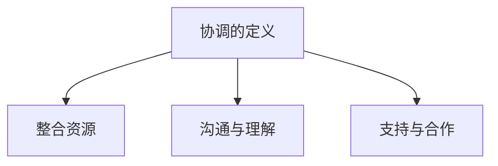

**伪代码示例：**
```python
# 协调的定义
def define协调():
    # 整合资源
    resource_integration = True
    # 沟通与理解
    communication_and_understanding = True
    # 支持与合作
    support_and_collaboration = True
    
    # 协调结果
    coordination_result = assess协调整体结果(resource_integration, communication_and_understanding, support_and_collaboration)
    return coordination_result

# 协调结果评估
def assess协调整体结果(resource_integration, communication_and_understanding, support_and_collaboration):
    if resource_integration and communication_and_understanding and support_and_collaboration:
        return "成功"
    else:
        return "失败"
```

#### 5.1.2 协调的目的

协调的主要目的是确保项目目标的实现，提高团队的效率和绩效。具体来说，协调的目的包括：

- **提高工作效率**：通过协调，确保团队成员能够高效地完成各自的任务，减少不必要的等待和重复工作。
- **减少冲突**：通过有效的协调，解决团队成员之间的分歧和矛盾，避免因协调不善导致的项目延误和失败。
- **资源优化**：通过协调，合理分配和利用资源，确保资源的最优配置，避免浪费。

#### 5.1.3 协调的障碍

协调过程中可能遇到的障碍包括：

- **沟通不畅**：团队成员之间的信息传递不畅通，导致误解和冲突。
- **目标不明确**：团队成员对项目目标和任务理解不清晰，导致工作效率低下。
- **资源不足**：团队在资源分配上存在不足，导致任务无法按时完成。

**Mermaid 流程图：**
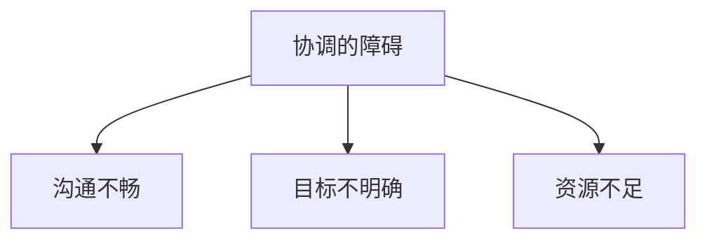

**伪代码示例：**
```python
# 协调的障碍
def identify协调障碍():
    # 沟通不畅
    communication_issue = True
    # 目标不明确
    unclear_goals = True
    # 资源不足
    resource_shortage = True
    
    # 识别障碍
    coordination_issues = assess协调整体障碍(communication_issue, unclear_goals, resource_shortage)
    return coordination_issues

# 协调障碍评估
def assess协调整体障碍(communication_issue, unclear_goals, resource_shortage):
    if communication_issue or unclear_goals or resource_shortage:
        return "存在障碍"
    else:
        return "无障碍"
```

#### 5.1.4 协调的基本原则

为了实现有效的协调，我们需要遵循以下基本原则：

- **明确目标与任务**：在项目启动阶段，明确项目目标和任务，确保每个成员都了解自己的职责和期望。
- **合理分配资源**：根据任务需求和成员的能力，合理分配资源，确保资源利用最大化。
- **建立沟通机制**：建立有效的沟通渠道和机制，确保团队成员之间的信息交流畅通无阻。
- **持续监督与反馈**：在项目执行过程中，持续监督项目进度，及时反馈问题和调整策略。

通过遵循这些基本原则，创业者可以更好地管理团队，确保项目顺利进行，实现团队和个人的共同成长。

### 5.2 协调的艺术

协调不仅是团队管理的基本职能，更是一门艺术。以下是一些关键的协调技巧和艺术：

#### 5.2.1 协调的方法

协调的方法包括以下几个方面：

- **明确分工与责任**：确保每个团队成员都清楚自己的职责和任务，明确责任归属，避免任务重叠和责任不明。
- **制定合理的计划**：制定详细的项目计划，包括时间表、任务分配和资源需求，确保项目有条不紊地进行。
- **灵活调整策略**：在项目执行过程中，根据实际情况灵活调整计划和策略，以应对突发事件和变化。

**Mermaid 流程图：**
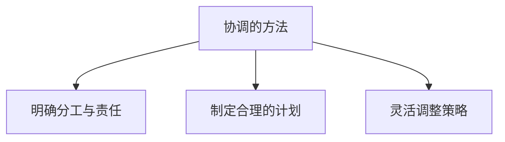

**伪代码示例：**
```python
# 协调的方法
def coordination_methods():
    # 明确分工与责任
    clear分工与责任 = True
    # 制定合理的计划
    reasonable_plan = True
    # 灵活调整策略
    flexible_adjustment = True
    
    # 协调结果
    coordination_outcome = assess协调整体结果(clear分工与责任, reasonable_plan, flexible_adjustment)
    return coordination_outcome

# 协调结果评估
def assess协调整体结果(clear分工与责任, reasonable_plan, flexible_adjustment):
    if clear分工与责任 and reasonable_plan and flexible_adjustment:
        return "成功"
    else:
        return "失败"
```

#### 5.2.2 协调的技巧

协调的技巧是确保团队成员有效合作、任务顺利进行的关键。以下是一些重要的技巧：

- **倾听与反馈**：积极倾听团队成员的意见和建议，并及时给予反馈，确保团队成员之间的信息交流畅通。
- **协商与调解**：在团队成员之间出现分歧和冲突时，通过协商和调解，找到解决问题的最佳方案。
- **激励与认可**：对团队成员的辛勤工作和贡献给予激励和认可，提高团队成员的积极性和满意度。
- **透明与公开**：保持项目透明度，公开项目进展和问题，让团队成员了解实际情况，共同应对挑战。

**Mermaid 流程图：**
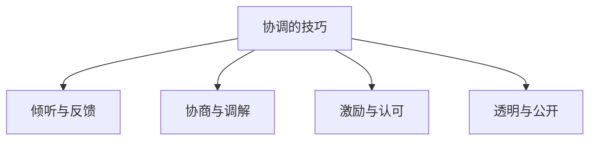

**伪代码示例：**
```python
# 协调的技巧
def coordination_tips():
    # 倾听与反馈
    active_listening = True
    # 协商与调解
    negotiate_and_mediate = True
    # 激励与认可
    motivation_and_recognition = True
    # 透明与公开
    transparency = True
    
    # 协调效果
    coordination_effect = assess协调整体效果(active_listening, negotiate_and_mediate, motivation_and_recognition, transparency)
    return coordination_effect

# 协调效果评估
def assess协调整体效果(active_listening, negotiate_and_mediate, motivation_and_recognition, transparency):
    if active_listening and negotiate_and_mediate and motivation_and_recognition and transparency:
        return "有效"
    else:
        return "无效"
```

#### 5.2.3 协调的实施步骤

协调的实施可以分为以下几个步骤：

1. **项目启动阶段**：明确项目目标和任务，分配资源和责任，制定初步计划。
2. **项目执行阶段**：监督项目进度，及时调整计划，解决突发问题和冲突，确保任务按时完成。
3. **项目评估阶段**：对项目成果进行评估，总结经验教训，为下一次项目提供参考。

**Mermaid 流程图：**
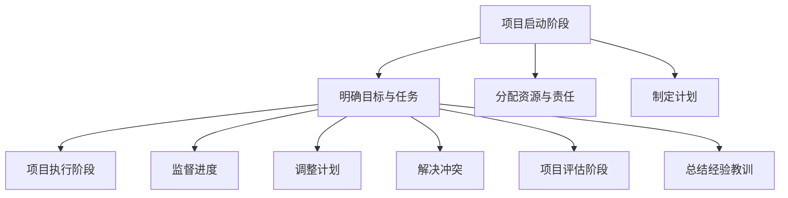

**伪代码示例：**
```python
# 协调的实施步骤
def coordination_steps():
    # 项目启动阶段
    project_start = "明确目标与任务，分配资源与责任，制定计划"
    # 项目执行阶段
    project_execution = "监督进度，调整计划，解决冲突"
    # 项目评估阶段
    project_evaluation = "总结经验教训"
    
    # 实施步骤
    implementation_steps = assess协调整体步骤(project_start, project_execution, project_evaluation)
    return implementation_steps

# 协调步骤评估
def assess协调整体步骤(project_start, project_execution, project_evaluation):
    if project_start and project_execution and project_evaluation:
        return "完整"
    else:
        return "不完整"
```

通过以上协调艺术和实施步骤，创业者可以更好地管理团队，确保项目顺利进行，实现团队和个人的共同成长。

### 5.3 团队建设的重要性与策略

团队建设是确保团队高效运作和持续发展的关键。一个强大的团队不仅可以提高项目的成功率，还能为成员提供个人成长的机会。以下是一些团队建设的重要性与策略：

#### 5.3.1 团队建设的定义

团队建设是指通过一系列的活动和实践，增强团队成员之间的协作、信任和凝聚力，以提高团队整体效能的过程。它不仅涉及技能和知识的共享，还包括价值观、文化和氛围的塑造。

**Mermaid 流程图：**
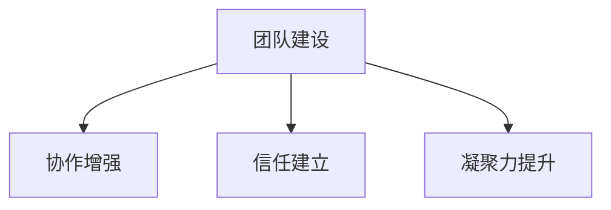

**伪代码示例：**
```python
# 团队建设的定义
def define_team_building():
    # 协作增强
    enhanced_collaboration = True
    # 信任建立
    trust_building = True
    # 凝聚力提升
    improved_coherence = True
    
    # 团队建设结果
    team_building_result = assess_team_building(enhanced_collaboration, trust_building, improved_coherence)
    return team_building_result

# 团队建设结果评估
def assess_team_building(collaboration, trust, coherence):
    if collaboration and trust and coherence:
        return "成功"
    else:
        return "失败"
```

#### 5.3.2 团队建设的目标

团队建设的主要目标包括：

- **提高团队效能**：通过团队建设，提高团队成员的合作效率，确保项目按计划完成。
- **增强团队凝聚力**：通过建立信任和共同目标，增强团队成员之间的团结和协作。
- **促进个人成长**：为团队成员提供发展机会，提升其专业技能和个人素质。

**Mermaid 流程图：**
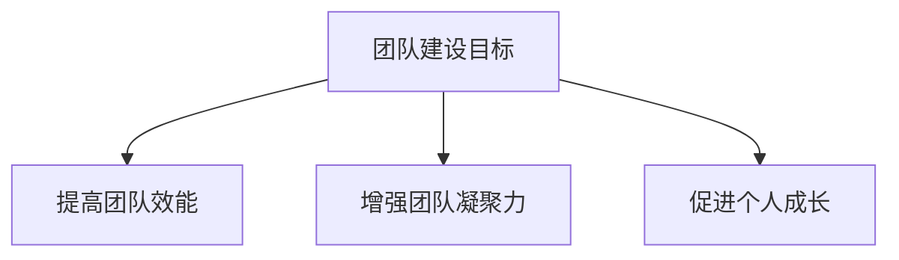

**伪代码示例：**
```python
# 团队建设目标
def team_building_goals():
    # 提高团队效能
    improve_effectiveness = True
    # 增强团队凝聚力
    strengthen_coherence = True
    # 促进个人成长
    promote_growth = True
    
    # 目标达成情况
    goal_achievement = assess_goals(improve_effectiveness, strengthen_coherence, promote_growth)
    return goal_achievement

# 目标达成情况评估
def assess_goals(effectiveness, coherence, growth):
    if effectiveness and coherence and growth:
        return "达成"
    else:
        return "未达成"
```

#### 5.3.3 团队建设的策略

以下是一些有效的团队建设策略：

- **培养团队文化**：建立积极的团队文化，鼓励开放、诚信和创新的氛围。
- **开展团队活动**：定期组织团队活动，如团队建设训练、团建活动、聚餐等，增强团队凝聚力。
- **提供培训与发展机会**：为团队成员提供培训和发展机会，提升其专业能力和技能。
- **建立反馈机制**：建立有效的反馈机制，鼓励团队成员提出意见和建议，及时调整团队策略。

**Mermaid 流程图：**
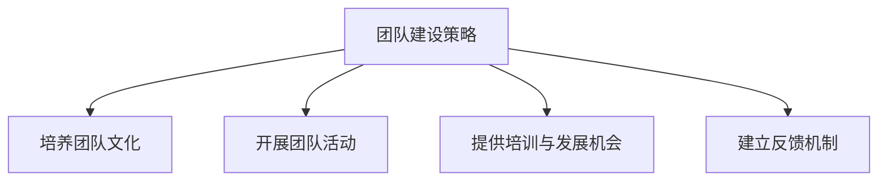

**伪代码示例：**
```python
# 团队建设策略
def team_building_strategies():
    # 培养团队文化
    build_culture = True
    # 开展团队活动
    organize_activities = True
    # 提供培训与发展机会
    provide_training = True
    # 建立反馈机制
    establish_feedback = True
    
    # 策略实施结果
    strategy_result = assess_strategies(build_culture, organize_activities, provide_training, establish_feedback)
    return strategy_result

# 策略实施结果评估
def assess_strategies(culture, activities, training, feedback):
    if culture and activities and training and feedback:
        return "有效"
    else:
        return "无效"
```

通过以上团队建设策略，创业者可以打造一支高效、团结和有凝聚力的团队，为创业项目的成功奠定坚实的基础。在接下来的章节中，我们将探讨如何提升影响力，并在创业过程中发挥领导力。

### 6.1 影响力的重要性

影响力在创业过程中起着至关重要的作用，它是创业者成功的关键要素之一。影响力不仅能够帮助创业者建立个人品牌，提升市场认可度，还能在团队管理和资源获取方面发挥重要作用。以下是影响力在创业过程中的具体重要性：

#### 6.1.1 影响力的定义

影响力是指一个人或组织通过其行为、言论或决策，对他人行为、态度和思维模式产生正面影响的能力。影响力不仅仅是一种权力，更是一种信任和尊重的体现。一个具备影响力的创业者能够在团队中树立权威，推动项目的进展，同时也能够在市场上建立品牌声誉，吸引更多的合作伙伴和资源。

#### 6.1.2 影响力的作用

影响力在创业过程中具有以下几个重要作用：

1. **团队管理**：创业者需要通过影响力来激励和引导团队成员，确保团队在实现共同目标的过程中保持积极性和凝聚力。具备影响力的创业者能够在团队中建立领导地位，促进团队成员之间的合作，提高整体效能。

2. **资源获取**：在创业过程中，资源获取是确保项目顺利推进的关键。具备影响力的创业者更容易获得投资者的信任和资金支持，也更容易吸引优秀的人才加入团队。通过影响力的提升，创业者能够扩大自己的社交网络，获取更多的商业机会和资源。

3. **市场推广**：在市场竞争日益激烈的今天，创业者需要通过影响力来提升品牌知名度，吸引更多的用户和客户。一个具备影响力的创业者能够在市场上树立良好的品牌形象，提高用户信任度，从而增加市场份额。

4. **决策能力**：创业者需要具备决策能力，能够在面对复杂的市场环境和不确定性时做出明智的决策。影响力可以帮助创业者在团队中凝聚共识，减少决策过程中的争议和分歧，确保决策的顺利执行。

#### 6.1.3 影响力的影响因素

影响力的大小受多个因素影响，以下是一些关键的影响因素：

1. **专业知识**：创业者需要具备深厚的专业知识和行业经验，这是建立影响力的基础。专业知识不仅能够帮助创业者更好地理解和应对市场变化，还能提高其在团队中的权威性。

2. **沟通能力**：创业者需要具备良好的沟通能力，能够有效地传达自己的想法和观点，同时也能够倾听和理解团队成员的意见。沟通能力是影响力的重要体现，一个具备良好沟通能力的创业者能够更好地与团队成员和外部合作伙伴建立信任和合作关系。

3. **人格特质**：人格特质对影响力的建立至关重要。具备正直、诚信、勇敢和负责任等特质的人更容易获得他人的信任和尊重。创业者需要通过自身的品格和行为来树立正面形象，从而增强影响力。

4. **领导力**：领导力是影响力的重要组成部分。创业者需要具备领导力，能够引导团队朝着共同的目标努力，同时能够在面对困难和挑战时激励团队成员，保持团队的士气。

5. **社交网络**：社交网络是影响力的重要来源。创业者需要建立广泛的社交网络，与行业内的专家、投资者、合作伙伴等建立良好的关系。通过社交网络的扩展，创业者能够获取更多的信息和资源，从而提升自己的影响力。

综上所述，影响力在创业过程中至关重要，它不仅帮助创业者管理团队、获取资源、推广市场，还能提升决策能力。创业者需要通过提升专业知识、沟通能力、人格特质和领导力，以及建立广泛的社交网络，来增强自己的影响力，为创业成功奠定坚实基础。在接下来的章节中，我们将探讨如何通过具体技巧提升影响力。

### 6.2 提升影响力的技巧

要提升影响力，创业者需要从多个方面入手，包括个人品牌建设、影响力传播策略和具体的实践方法。以下是几个关键技巧：

#### 6.2.1 个人品牌建设

个人品牌建设是提升影响力的重要一环。创业者需要通过以下方法来打造和提升个人品牌：

1. **确立独特形象**：创业者需要明确自己的定位和优势，确立一个独特且具有辨识度的个人形象。这包括专业领域、价值观、个性特点等方面。

2. **持续学习与成长**：通过不断学习和提升自己的专业技能和知识，创业者能够在行业内建立权威形象。分享学习和成长的经验，不仅可以增加个人品牌的可信度，还能吸引更多有共同兴趣的人。

3. **内容创作**：通过写作、演讲、视频等形式，创业者可以分享自己的见解和经验，建立自己的知识库和影响力。高质量的内容是建立个人品牌的关键，创业者需要持续产出有价值的内容。

**Mermaid 流�程图：**
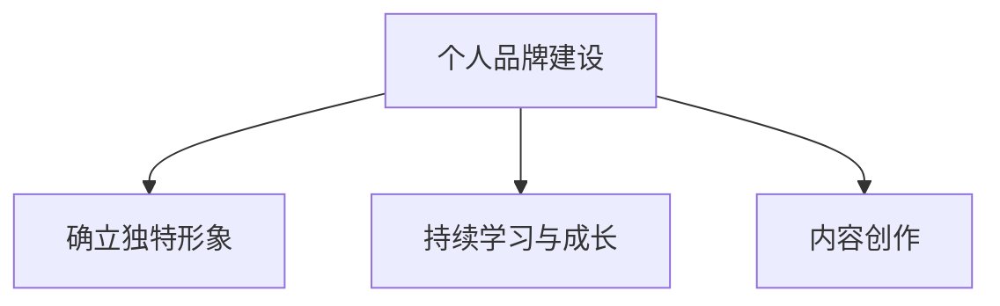

**伪代码示例：**
```python
# 个人品牌建设
def build_personal_brand():
    # 确立独特形象
    establish_unique_image = True
    # 持续学习与成长
    continuous_growth = True
    # 内容创作
    content_creation = True
    
    # 品牌建设结果
    brand_result = assess_brand(establish_unique_image, continuous_growth, content_creation)
    return brand_result

# 品牌建设结果评估
def assess_brand(unique_image, growth, content):
    if unique_image and growth and content:
        return "成功"
    else:
        return "失败"
```

#### 6.2.2 影响力传播策略

个人品牌建设只是第一步，影响力传播策略则是将个人品牌推广到更广泛的受众。以下是一些有效的传播策略：

1. **社交媒体**：利用社交媒体平台，如LinkedIn、Twitter、Instagram等，分享自己的见解和经验，扩大影响力。定期更新内容，与粉丝互动，建立良好的社交媒体形象。

2. **公共演讲**：参与行业会议、研讨会和讲座，通过演讲展示自己的专业知识和见解，提升个人品牌。公共演讲不仅能够增加曝光度，还能建立与听众之间的联系。

3. **媒体采访**：接受媒体采访，通过新闻报道、采访视频等方式，将自己的声音传播给更广泛的受众。与知名媒体合作，可以显著提升个人品牌的影响力。

4. **内容营销**：通过博客、电子书、白皮书等，分享自己的专业知识和见解，吸引潜在客户和合作伙伴。高质量的内容是建立影响力的基石。

**Mermaid 流程图：**
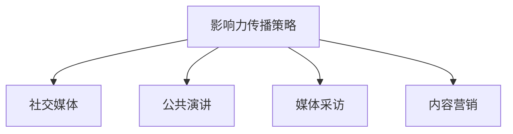

**伪代码示例：**
```python
# 影响力传播策略
def spread_influence():
    # 社交媒体
    social_media = True
    # 公共演讲
    public_speaking = True
    # 媒体采访
    media_interviews = True
    # 内容营销
    content_marketing = True
    
    # 影响力传播结果
    influence_spread = assess_influence(social_media, public_speaking, media_interviews, content_marketing)
    return influence_spread

# 影响力传播结果评估
def assess_influence(social, public, media, content):
    if social and public and media and content:
        return "有效"
    else:
        return "无效"
```

#### 6.2.3 提升影响力的案例分析

以下是一些成功的创业者如何提升个人影响力的案例：

1. **案例一：雷军**  
雷军是小米科技的创始人，他通过公开演讲、社交媒体和内容创作等多种方式提升个人影响力。他在各种场合分享小米的成功经验和技术见解，通过内容营销吸引大量关注。

2. **案例二：埃隆·马斯克**  
埃隆·马斯克通过社交媒体和公共演讲，成功地将自己打造成全球科技界的领袖人物。他通过Twitter与粉丝互动，展示自己的专业知识和领导力，从而提升了个人品牌。

3. **案例三：苏华**  
苏华是中国知名企业家，通过参与行业会议、研讨会和讲座，以及在媒体上的公开露面，成功提升了个人影响力。他通过公共演讲，分享自己的创业经验和行业见解，吸引了大量潜在合作伙伴和投资者。

通过这些案例，我们可以看到，提升影响力需要综合运用多种方法和策略。创业者需要不断探索适合自己的路径，通过个人品牌建设、影响力传播和持续实践，逐步提升自己的影响力。

### 6.3 领导力的发展路径

领导力是创业者成功的重要因素之一，它不仅关乎个人品牌和影响力的提升，更直接影响到团队管理和项目进展。下面我们将探讨领导力的发展路径，包括领导力的定义、作用和提升路径。

#### 6.3.1 领导力的定义

领导力是指一个人在团队中通过影响力、决策能力、沟通技巧和愿景，引导团队成员共同实现目标的能力。领导力不仅仅是权力和地位的象征，更是一种责任和信任的体现。一个具备领导力的人能够在复杂和不确定的环境中，清晰定义目标，激发团队成员的潜能，并推动团队达成共同目标。

**Mermaid 流程图：**
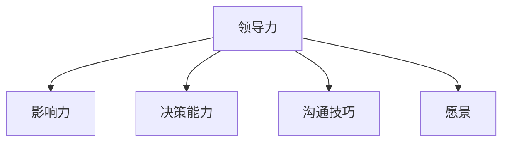

**伪代码示例：**
```python
# 领导力定义
def define_leadership():
    # 影响力
    influence = True
    # 决策能力
    decision_making = True
    # 沟通技巧
    communication_skills = True
    # 愿景
    vision = True
    
    # 领导力结果
    leadership_result = assess_leadership(influence, decision_making, communication_skills, vision)
    return leadership_result

# 领导力结果评估
def assess_leadership(influence, decision_making, communication, vision):
    if influence and decision_making and communication and vision:
        return "强大"
    else:
        return "较弱"
```

#### 6.3.2 领导力的作用

领导力在团队管理和创业过程中发挥着至关重要的作用：

1. **团队凝聚力**：领导力能够激发团队成员的归属感和责任感，提高团队的凝聚力。一个有领导力的人能够建立信任和合作关系，使团队成员愿意为共同的目标努力。

2. **创新与决策**：领导力有助于激发团队成员的创新思维和创造力，同时领导者的决策能力可以确保团队在关键时刻做出明智的选择。

3. **目标实现**：领导力能够帮助团队明确目标，制定清晰的行动计划，并激励团队成员克服困难，实现目标。

4. **资源分配**：领导力有助于合理分配团队资源，确保资源最大化利用，提高工作效率。

5. **个人成长**：领导力不仅关注团队的整体表现，也关注团队成员的个人成长和发展。一个有领导力的人能够为团队成员提供成长机会，帮助他们提升技能和知识。

#### 6.3.3 领导力的发展路径

提升领导力是一个长期且持续的过程，以下是一些关键的发展路径：

1. **自我认知**：了解自己的优点和不足，明确自己的领导风格和价值观。自我认知是提升领导力的基础，只有了解自己，才能更好地引导他人。

2. **情境领导**：情境领导理论指出，领导力不是一成不变的，而是根据不同情境进行调整。创业者需要根据团队成员的需求和环境的变化，灵活运用不同的领导风格。

3. **学习和反思**：持续学习和反思是提升领导力的重要方法。创业者需要不断学习新的管理理论和实践技巧，通过反思自己的行为和决策，不断提升领导能力。

4. **实践和经验**：领导力需要在实践中锻炼和提升。创业者需要积极参与团队管理和项目执行，通过实际操作积累经验，提升自己的领导力。

5. **导师指导**：寻求导师的指导和反馈，可以帮助创业者更快地成长。导师可以提供宝贵的经验和建议，帮助创业者避免常见的领导错误。

6. **培训和课程**：参加专业的领导力培训课程，系统地学习和掌握领导力理论和实践技巧。这些课程通常结合实际案例和互动练习，有助于提高领导力。

通过遵循以上发展路径，创业者可以逐步提升自己的领导力，为团队管理和创业成功奠定坚实基础。在接下来的章节中，我们将通过实际案例，进一步探讨如何在创业过程中应用人际关系管理技巧。

### 7.1 案例一：成功沟通与协调

在创业过程中，有效的沟通与协调是确保项目顺利进行的关键。以下是一个成功沟通与协调的案例，通过具体策略和实际操作，展示了如何通过人际管理技巧实现项目的成功。

#### 案例背景

某创业公司计划开发一款基于人工智能的客户服务系统。项目团队成员包括人工智能专家、数据工程师、产品经理和市场营销人员。由于团队成员来自不同专业领域，沟通和协调成为项目成功的关键。

#### 沟通与协调策略

1. **明确目标和任务**：
   - **项目启动会**：在项目启动阶段，组织全体团队成员进行项目目标和任务的明确。项目经理详细阐述了项目的目标、任务分工和时间表，确保每个成员都清楚自己的职责和预期成果。
   - **目标分解**：将项目目标分解为可操作的任务，并制定具体的里程碑，以便于团队成员追踪进度和进行评估。

2. **建立沟通机制**：
   - **定期会议**：每周召开项目进度会议，确保团队成员之间的信息交流畅通。会议内容包括项目进展、遇到的问题和解决方案，以及下一步的行动计划。
   - **即时沟通工具**：使用即时沟通工具（如Slack或Microsoft Teams），方便团队成员在项目执行过程中快速交流和协作。

3. **协调资源**：
   - **资源分配**：根据团队成员的专业能力和任务需求，合理分配计算资源、数据资源和人力资源，确保项目资源的最大化利用。
   - **需求协调**：在项目执行过程中，及时与市场部门和客户沟通，了解市场需求和客户反馈，调整项目计划和资源分配。

4. **解决冲突**：
   - **协商调解**：在团队成员之间出现意见分歧时，通过协商和调解，找到共同点和解决方案。项目经理在冲突解决中起到了关键作用，通过中立和公正的立场，帮助各方达成一致。
   - **激励机制**：为团队成员提供激励机制，鼓励他们在遇到问题时积极寻求解决方案，而不是相互指责。

#### 实际操作

1. **项目启动会**：
   - **会议议程**：项目经理制定详细的会议议程，确保每个议题都有足够的时间讨论。
   - **互动环节**：鼓励团队成员提问和发言，确保每个成员的声音都能被听到。

2. **定期会议**：
   - **会议记录**：每次会议后，项目经理整理会议记录，并分发给团队成员，以便于后续追踪和参考。
   - **问题反馈**：团队成员在会议中提出的问题和意见，由项目经理负责跟进并给出解决方案。

3. **资源协调**：
   - **资源报表**：定期更新项目资源报表，确保团队成员对资源使用情况有清晰的了解。
   - **需求协调**：项目经理定期与市场部门和客户沟通，了解最新的市场动态和客户需求，及时调整项目计划和资源分配。

4. **冲突解决**：
   - **中立调解**：在冲突发生时，项目经理保持中立立场，通过协商和调解，帮助各方找到共同点和解决方案。
   - **激励机制**：为团队成员提供奖励和认可，鼓励他们在遇到问题时积极寻求解决方案。

#### 案例结果与分析

通过有效的沟通与协调，该创业公司的项目成功在预定时间内完成，并顺利上线。团队成员之间的协作效率显著提高，项目成果得到了客户的高度认可。

- **团队效能提升**：通过明确的任务分工和沟通机制，团队成员能够更好地理解各自的任务和目标，协作效率显著提高。
- **项目进度保障**：定期的会议和资源协调，确保项目进度得到有效监控和调整，避免了项目延误和资源浪费。
- **冲突减少**：通过及时解决冲突和提供激励机制，团队成员之间的矛盾和分歧得到有效化解，团队凝聚力得到增强。

综上所述，有效的沟通与协调是创业项目成功的关键。通过明确目标、建立沟通机制、协调资源和解决冲突，创业者可以确保项目顺利进行，实现团队和个人的共同成长。

### 7.2 案例二：影响力在创业中的运用

在创业过程中，影响力不仅是个人品牌的体现，更是推动项目成功和团队协作的重要工具。以下是一个影响力在创业中运用的案例，展示如何通过提升个人影响力，获得市场认可和资源支持，从而实现创业目标。

#### 案例背景

张先生是一位年轻的创业者，他在人工智能领域有着丰富的研发经验。张先生决定创办一家专注于人工智能语音识别技术的公司，希望通过创新技术改变传统语音识别行业的现状。

#### 个人品牌建设

1. **确立独特形象**：
   - **专业定位**：张先生明确自己的专业领域，专注于语音识别技术的研发和应用，树立了专业形象。
   - **价值观传播**：张先生强调科技创新和社会责任感，通过分享自己的研发理念和愿景，赢得公众的认可。

2. **持续学习与成长**：
   - **知识更新**：张先生持续关注人工智能领域的前沿动态，不断学习最新的研究成果和技术趋势，提升自己的专业能力。
   - **经验分享**：通过撰写技术博客、发表学术论文和参加行业会议，张先生将自己的经验和见解分享给同行，提高了个人影响力。

3. **内容创作**：
   - **技术博客**：张先生定期在知名技术博客上发表关于语音识别技术的文章，分享研发过程中的经验和挑战，吸引了大量关注。
   - **演讲与讲座**：张先生积极参与行业会议和讲座，通过演讲展示自己的专业知识和成果，扩大了个人影响力。

#### 影响力传播策略

1. **社交媒体**：
   - **多平台运营**：张先生在LinkedIn、Twitter、微信公众号等多个社交媒体平台活跃，定期发布技术文章和行业动态，与粉丝互动，建立良好的社交媒体形象。
   - **内容互动**：通过回复评论、参与讨论，张先生与行业内的专家和同行建立联系，拓展了自己的社交网络。

2. **公共演讲**：
   - **行业会议**：张先生积极参与行业会议和研讨会，通过演讲和讨论，展示自己的研究成果和见解，吸引了业内人士的关注。
   - **高校讲座**：张先生还应邀在多所高校进行讲座，分享自己的创业经历和研发经验，吸引了年轻人才的关注和加入。

3. **媒体采访**：
   - **媒体报道**：张先生接受了多家媒体采访，包括科技媒体、财经媒体等，通过媒体报道扩大了个人影响力。
   - **访谈节目**：张先生参与了一些创业访谈节目，通过讲述自己的创业故事和经验，吸引了更多创业者的关注和认同。

4. **内容营销**：
   - **电子书**：张先生撰写了一本关于语音识别技术的电子书，分享了自己的研发历程和技术应用案例，吸引了大量读者。
   - **在线课程**：张先生开设了一些在线课程，教授语音识别技术的基础知识和实战技巧，为创业者提供了学习和交流的平台。

#### 影响力在创业中的应用

1. **市场认可**：
   - **客户信任**：通过在行业内的知名度和良好的口碑，张先生的公司迅速获得了客户的信任，订单量稳步增长。
   - **品牌知名度**：张先生通过多种影响力传播策略，提升了公司品牌知名度，吸引了更多的潜在客户。

2. **资源获取**：
   - **投资者认可**：张先生通过个人影响力的提升，吸引了多家投资者的关注，获得了投资支持，为公司的快速发展提供了资金保障。
   - **合作伙伴**：张先生与多家技术公司、高校和研究机构建立了合作关系，共同开展科研项目，为公司的技术进步和市场扩展提供了资源支持。

3. **团队建设**：
   - **人才吸引**：张先生通过个人品牌建设和影响力传播，吸引了多位技术专家和年轻的创业者加入团队，为公司的研发和创新提供了人才支持。

#### 案例结果与分析

通过有效的个人品牌建设和影响力传播策略，张先生成功提升了个人和公司的市场认可度，获得了丰富的资源支持，为公司的发展奠定了坚实的基础。以下是案例的结果和分析：

- **市场认可度提升**：张先生通过在社交媒体、公共演讲和媒体报道中的活跃，成功提升了个人和公司的品牌知名度，赢得了客户的信任。
- **资源获取增加**：张先生通过个人影响力的提升，获得了投资者的青睐和合作伙伴的支持，为公司的快速发展提供了充足的资金和资源。
- **团队建设加强**：张先生通过个人品牌的影响力和创业故事，吸引了多位优秀人才加入公司，为团队的创新和进步提供了坚实的人才基础。

综上所述，影响力在创业过程中发挥着至关重要的作用。通过个人品牌建设、影响力传播和具体的应用，创业者可以提升市场认可度，获取资源支持，加强团队建设，从而实现创业项目的成功。

### 7.3 案例三：大模型时代的团队建设

在大模型时代，团队建设的重要性愈发凸显。以下是一个在大模型时代成功进行团队建设的案例，通过具体策略和实际操作，展示了如何在大模型开发项目中有效进行团队建设。

#### 案例背景

某科技公司致力于研发基于大模型的人工智能产品，团队成员包括数据科学家、机器学习工程师、软件开发工程师和产品经理。由于大模型项目的复杂性和高技术要求，团队建设成为项目成功的关键。

#### 团队建设策略

1. **明确团队目标与任务**：
   - **项目启动会**：在项目启动阶段，组织全体团队成员进行项目目标和任务的明确。项目经理详细阐述了项目的目标、任务分工和时间表，确保每个成员都清楚自己的职责和预期成果。
   - **目标分解**：将项目目标分解为可操作的任务，并制定具体的里程碑，以便于团队成员追踪进度和进行评估。

2. **建立有效的沟通机制**：
   - **定期会议**：每周召开项目进度会议，确保团队成员之间的信息交流畅通。会议内容包括项目进展、遇到的问题和解决方案，以及下一步的行动计划。
   - **即时沟通工具**：使用即时沟通工具（如Slack或Microsoft Teams），方便团队成员在项目执行过程中快速交流和协作。

3. **培养团队文化**：
   - **开放与协作**：鼓励团队成员之间开放沟通，积极协作，形成良好的团队氛围。
   - **持续学习**：为团队成员提供学习和培训机会，提升其专业技能和知识水平。

4. **合理分配资源**：
   - **资源报表**：定期更新项目资源报表，确保团队成员对资源使用情况有清晰的了解。
   - **优先级排序**：根据项目需求和任务优先级，合理分配计算资源、数据资源和人力资源，确保资源最大化利用。

5. **解决冲突**：
   - **中立调解**：在团队成员之间出现意见分歧时，通过协商和调解，找到共同点和解决方案。项目经理在冲突解决中起到了关键作用，通过中立和公正的立场，帮助各方达成一致。
   - **激励机制**：为团队成员提供激励机制，鼓励他们在遇到问题时积极寻求解决方案，而不是相互指责。

#### 实际操作

1. **项目启动会**：
   - **会议议程**：项目经理制定详细的会议议程，确保每个议题都有足够的时间讨论。
   - **互动环节**：鼓励团队成员提问和发言，确保每个成员的声音都能被听到。

2. **定期会议**：
   - **会议记录**：每次会议后，项目经理整理会议记录，并分发给团队成员，以便于后续追踪和参考。
   - **问题反馈**：团队成员在会议中提出的问题和意见，由项目经理负责跟进并给出解决方案。

3. **团队活动**：
   - **团建活动**：定期组织团建活动，如团队拓展训练、聚餐等，增强团队成员之间的交流和信任。
   - **知识分享**：组织内部知识分享会，鼓励团队成员分享自己的经验和见解，促进团队内部的交流和成长。

4. **解决冲突**：
   - **调解委员会**：设立调解委员会，由项目经理和其他核心团队成员组成，专门负责解决团队内部的冲突和问题。
   - **调解机制**：在冲突发生时，通过调解委员会进行调解，确保问题得到公正和合理的解决。

#### 案例结果与分析

通过有效的团队建设策略，该科技公司的大模型项目成功在预定时间内完成，并顺利上线。团队成员之间的协作效率显著提高，项目成果得到了客户的高度认可。

- **团队效能提升**：通过明确的任务分工和沟通机制，团队成员能够更好地理解各自的任务和目标，协作效率显著提高。
- **项目进度保障**：定期的会议和资源协调，确保项目进度得到有效监控和调整，避免了项目延误和资源浪费。
- **冲突减少**：通过及时解决冲突和提供激励机制，团队成员之间的矛盾和分歧得到有效化解，团队凝聚力得到增强。

综上所述，有效的团队建设是大模型项目成功的关键。通过明确目标、建立沟通机制、培养团队文化和合理分配资源，创业者可以确保团队在大模型开发项目中高效运作，实现项目目标。

## 第8章 持续进步与未来展望

### 8.1 人际关系管理的持续学习

在快速变化的大模型时代，创业者需要不断学习新知识、新技能，以适应不断发展的技术和市场环境。人际关系管理同样需要持续学习，这不仅是个人成长的必要条件，也是团队和项目成功的保障。以下是一些持续学习的方法和策略：

#### 8.1.1 学习的重要性

持续学习对于创业者来说至关重要。它不仅能够帮助创业者跟上技术发展的步伐，还能提升个人领导力、沟通能力和团队管理能力。在人际关系管理中，持续学习能够帮助创业者更好地理解团队成员的需求和情感，提高沟通效率，增强团队凝聚力。

**Mermaid 流程图：**
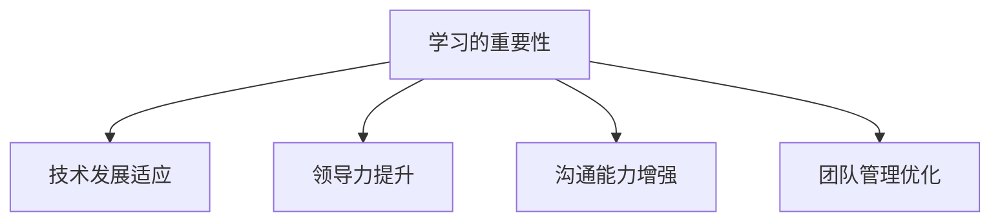

**伪代码示例：**
```python
# 学习的重要性
def importance_of_learning():
    # 技术发展适应
    adapt_technology = True
    # 领导力提升
    improve_leadership = True
    # 沟通能力增强
    enhance_communication = True
    # 团队管理优化
    optimize_team_management = True
    
    # 学习结果
    learning_result = assess_learning(importance_of_learning)
    return learning_result

# 学习结果评估
def assess_learning(importance):
    if adapt_technology and improve_leadership and enhance_communication and optimize_team_management:
        return "显著提升"
    else:
        return "需要加强"
```

#### 8.1.2 学习方法与策略

1. **主动学习**：主动寻找学习机会，如参加行业会议、研讨会、培训班等，与同行交流，了解最新的研究成果和趋势。

2. **反思总结**：在工作和生活中，定期反思自己的行为和决策，总结经验教训，不断优化自己的方法和策略。

3. **持续实践**：将学到的知识和技能应用到实际工作中，通过实践不断积累经验，提升自己的能力和水平。

4. **知识共享**：通过写作、演讲、培训等方式，将自己的知识和经验分享给团队成员和其他创业者，形成知识共享和反馈的良性循环。

### 8.2 大模型时代的未来趋势

大模型时代正在改变各行各业，未来的发展趋势主要体现在以下几个方面：

#### 8.2.1 大模型技术的发展趋势

- **计算能力提升**：随着硬件技术的发展，特别是GPU和TPU等专用硬件的普及，大模型的计算能力将不断提升。
- **算法优化**：深度学习算法将继续优化，以减少计算资源和时间成本，提高模型效率。
- **跨领域融合**：大模型将在更多领域得到应用，如医疗健康、金融科技、智能交通等，实现跨领域的技术融合。

#### 8.2.2 创业环境的变化

- **市场竞争加剧**：随着大模型技术的普及，越来越多的创业者将进入相关领域，市场竞争将更加激烈。
- **资源稀缺**：优秀的研发人才和计算资源将变得更加稀缺，创业者需要具备强大的资源整合能力。
- **创新驱动**：创业者需要更加注重创新，以独特的解决方案和商业模式赢得市场。

#### 8.2.3 未来人际关系管理的挑战与机遇

- **挑战**：
  - **技术壁垒**：大模型技术的复杂性对创业者的人际关系管理提出了更高的要求。
  - **团队管理**：多学科团队的管理需要创业者具备更广泛的知识和技能。
  - **信息安全**：随着数据量的增加，保护用户隐私和数据安全成为重要挑战。

- **机遇**：
  - **市场拓展**：大模型技术将帮助创业者开拓新的市场，实现全球化发展。
  - **资源获取**：创业者可以通过大模型技术吸引更多投资者和合作伙伴，获取更多资源。
  - **团队建设**：大模型时代的团队建设将更加注重技术创新和跨领域合作，为创业者提供更多机遇。

### 8.3 创业者的人际关系管理策略

在未来的大模型时代，创业者需要制定更加全面的人际关系管理策略，以应对不断变化的环境和挑战。以下是一些建议：

#### 8.3.1 策略的制定

- **明确目标**：在制定人际关系管理策略时，首先要明确团队和项目的目标，确保策略与目标的一致性。
- **分析环境**：对创业环境进行全面分析，了解市场趋势、竞争对手和潜在合作伙伴，制定适应市场需求的策略。
- **制定计划**：根据目标和环境分析，制定详细的人际关系管理计划，包括沟通策略、协调机制和资源分配等。

#### 8.3.2 策略的执行

- **有效沟通**：确保沟通渠道畅通，定期召开团队会议，及时分享项目进展和问题，提高团队协作效率。
- **持续协调**：在项目执行过程中，持续监控项目进度，及时调整计划和资源，确保项目按计划进行。
- **激励机制**：为团队成员提供激励机制，鼓励他们在遇到问题时积极寻求解决方案，提高团队凝聚力。

#### 8.3.3 策略的评估与调整

- **定期评估**：定期对人际关系管理策略进行评估，分析策略的有效性和团队的表现，找出存在的问题和改进方向。
- **反馈修正**：根据评估结果，及时调整策略，优化团队管理和项目执行过程。
- **持续优化**：在实践过程中，不断学习和积累经验，持续优化人际关系管理策略，以适应不断变化的环境和需求。

通过以上策略，创业者可以更好地管理人际关系，提高团队和项目的整体效能，实现创业目标。

## 附录A：常用工具与资源

在人际关系管理中，使用合适的工具和资源可以显著提升沟通效率、协调效果和团队凝聚力。以下是一些常用的工具和资源，包括沟通与协调工具、影响力提升工具和领导力发展资源。

### A.1 沟通与协调工具

1. **虚拟会议工具**：
   - **Zoom**：支持高清视频会议、屏幕共享和实时聊天功能。
   - **Microsoft Teams**：集成了视频会议、聊天、文档共享和协作等功能。
   - **Google Meet**：提供高质量的音频和视频通话，以及文档和表格协作功能。

2. **团队协作工具**：
   - **Slack**：支持即时通讯、文件共享、渠道讨论和集成第三方应用。
   - **Trello**：可视化的项目管理工具，适合任务分配和进度追踪。
   - **Asana**：任务管理工具，帮助团队分配任务、设置优先级和追踪项目进度。

### A.2 影响力提升工具

1. **个人品牌建设工具**：
   - **LinkedIn**：专业的职业社交平台，适合建立个人品牌和扩展人脉。
   - **Medium**：写作和内容分享平台，适合发布个人见解和专业知识。
   - **WordPress**：开源博客平台，适合建立个人网站和展示专业形象。

2. **影响力测量工具**：
   - **Klout**：提供个人影响力的评分和数据分析，帮助了解影响力传播效果。
   - **Brand24**：监控品牌和关键词在社交媒体上的提及情况，帮助提升品牌知名度。
   - **Brandwatch**：提供实时数据分析，帮助监测品牌影响力和社会舆论。

### A.3 领导力发展资源

1. **领导力培训课程**：
   - **Coursera**：提供来自全球知名大学的领导力课程，涵盖多个领域。
   - **edX**：由哈佛大学和麻省理工学院合作创建，提供丰富的领导力课程。
   - **Udemy**：提供多样化的在线课程，涵盖领导力、管理技能和个人发展等。

2. **领导力书籍推荐**：
   - **《领导力的五项修炼》**：作者史蒂芬·柯维，介绍了领导力的核心原则和实战技巧。
   - **《影响力》**：作者罗伯特·西奥迪尼，探讨了人际影响力背后的心理学原理。
   - **《第五项修炼》**：作者彼得·圣吉，提出了团队学习、系统思考和共同愿景等领导力概念。

通过利用这些工具和资源，创业者可以更好地进行人际关系管理，提升沟通效率、协调效果和团队凝聚力，为创业成功奠定坚实基础。

