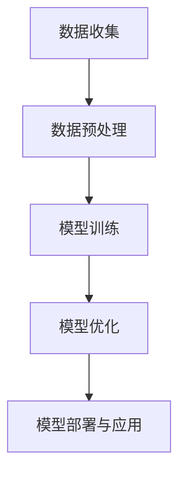
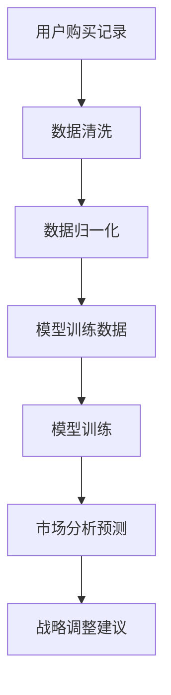
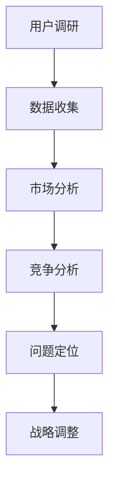

                 

## 《大模型时代的创业者创业心得交流：经验分享、教训总结与成长感悟》

### 关键词：
- 大模型时代
- 创业者经验分享
- 创业挑战与应对
- 成长感悟
- 未来展望

> 摘要：
本文旨在与广大创业者交流在大模型时代创业的心得与体会。通过分享成功与失败的案例，探讨创业者如何利用大模型优化创业策略，团队管理文化建设和个人成长，以及面对未来的展望。文章结构清晰，内容丰富，旨在为创业者提供有价值的参考。

### 目录大纲

## 第一部分：大模型时代背景与机遇

### 第1章：大模型时代的来临
#### 1.1 大模型的概念与特点
#### 1.2 大模型在创业中的应用

### 第2章：创业者面临的挑战与应对
#### 2.1 创业初期的困难与解决策略
#### 2.2 团队管理与文化建设

## 第二部分：经验分享与教训总结

### 第3章：成功的创业案例解析
#### 3.1 创业案例一：如何利用大模型进行市场分析
#### 3.2 创业案例二：创业过程中的战略调整

### 第4章：创业失败的原因与教训
#### 4.1 失败案例分析
#### 4.2 教训总结

## 第三部分：成长感悟与未来展望

### 第5章：创业过程中的个人成长
#### 5.1 创业对个人能力的提升
#### 5.2 心理建设与自我激励

### 第6章：创业者对未来的展望
#### 6.1 大模型技术发展展望
#### 6.2 创业者对社会责任的担当

## 附录

### 附录A：创业资源与工具推荐
#### A.1 常用创业工具介绍

### 附录B：大模型相关资源与链接
#### B.1 大模型学习资源

### 引言

### 1. 大模型时代的来临

#### 1.1 大模型的概念与特点

在过去的几十年里，人工智能（AI）领域经历了从规则驱动到数据驱动的重要转变。特别是在深度学习技术的推动下，我们迎来了“大模型时代”。所谓“大模型”，指的是那些拥有数十亿、甚至千亿参数的神经网络模型。这些模型通过对海量数据进行训练，能够自动提取特征并完成任务，如自然语言处理、图像识别、语音识别等。

大模型的基本架构可以抽象为一个多层神经网络，每一层都对输入数据进行处理和转换。Mermaid流程图如下：



其中，数据收集是基础，数据预处理是为了提高数据质量，模型训练是核心，模型优化是为了提升性能，模型部署与应用则是为了实现具体应用。随着技术的进步，大模型在创业中的应用前景愈发广阔。

#### 1.2 大模型在创业中的应用

大模型在创业中的应用范围广泛，涵盖了市场分析、用户画像、产品设计等多个方面。例如，在市场分析中，大模型可以通过分析用户行为数据，预测市场趋势，帮助创业者制定更精准的市场策略。在用户画像中，大模型可以识别用户的偏好和需求，从而实现个性化推荐。

以下是一个利用大模型进行市场分析的伪代码示例：

```python
def market_analysis(data, model):
    # 数据清洗和预处理
    cleaned_data = preprocess_data(data)
    
    # 使用大模型进行预测
    predictions = model.predict(cleaned_data)
    
    # 根据预测结果调整创业策略
    strategy = adjust_strategy(predictions)
    
    return strategy
```

在这个例子中，`data` 是输入的市场数据，`model` 是训练好的大模型。通过预测和调整策略，创业者可以更好地应对市场变化，提高创业成功率。

## 第一部分：大模型时代背景与机遇

### 第1章：大模型时代的来临

#### 1.1 大模型的概念与特点

大模型时代，是指以深度学习为核心的人工智能技术，通过大规模训练神经网络模型，实现高性能、通用化的人工智能应用的阶段。大模型的特点主要体现在以下几个方面：

1. **参数规模巨大**：大模型通常拥有数十亿甚至千亿级别的参数。这些参数使得模型在处理复杂任务时，能够自动从海量数据中提取高级特征，从而提高模型的性能。

2. **自主学习能力**：大模型通过大规模数据训练，能够自动调整参数，优化模型结构，实现自我学习和自我改进。这种能力使得大模型在处理未知任务时，能够快速适应并取得良好的效果。

3. **泛化能力强**：大模型的训练数据量巨大，模型能够从中学习到广泛的规律，从而提高模型的泛化能力。这意味着大模型不仅能在训练数据上表现优异，也能在未见过的数据上保持良好的性能。

4. **跨领域应用**：大模型具有强大的通用性，可以应用于各个领域。无论是自然语言处理、图像识别、语音识别，还是推荐系统、金融风控等，大模型都能发挥其强大的能力。

为了更直观地理解大模型的基本架构，我们可以使用Mermaid流程图来描述其关键组件和流程：


1. **数据收集**：这是大模型训练的基础，需要收集大量的标注数据或无标注数据。数据来源可以包括公开数据集、用户数据、商业数据等。

2. **数据预处理**：对收集到的数据进行清洗、去噪、归一化等处理，提高数据质量，为后续训练做好准备。

3. **模型训练**：使用收集到的数据，通过神经网络的反向传播算法，不断调整模型参数，使得模型在训练数据上达到较高的准确率。

4. **模型优化**：在训练过程中，通过对模型结构、参数进行调整，优化模型性能，提高模型在测试数据上的表现。

5. **模型部署与应用**：将训练好的模型部署到实际应用中，如服务API、移动应用、智能设备等，实现大模型的商业价值。

#### 1.2 大模型在创业中的应用

大模型在创业中的应用场景非常广泛，下面列举几个主要的应用方向：

1. **市场分析**：利用大模型对市场数据进行深度分析，可以预测市场趋势，为创业者提供决策依据。例如，通过分析用户搜索和行为数据，预测流行趋势，指导产品开发和营销策略。

2. **用户画像**：通过大模型对用户行为和偏好进行分析，构建详细的用户画像，帮助创业者实现个性化推荐和精准营销。

3. **产品设计**：利用大模型进行产品设计，可以快速生成多种设计方案，通过用户反馈和数据分析，筛选出最佳方案。

4. **供应链优化**：通过大模型对供应链数据进行预测和分析，优化库存管理、物流调度等环节，降低成本，提高效率。

5. **风险评估**：在金融领域，大模型可以用于风险评估、信用评分等任务，提高金融服务的准确性和可靠性。

以下是一个简单的伪代码示例，展示如何利用大模型进行市场分析：

```python
def market_analysis(data, model):
    # 数据清洗和预处理
    cleaned_data = preprocess_data(data)
    
    # 使用大模型进行预测
    predictions = model.predict(cleaned_data)
    
    # 根据预测结果调整创业策略
    strategy = adjust_strategy(predictions)
    
    return strategy
```

在这个示例中，`data` 是输入的市场数据，`model` 是训练好的大模型。通过预测和调整策略，创业者可以更好地应对市场变化，提高创业成功率。

总之，大模型时代为创业者提供了丰富的工具和机遇。创业者需要深入了解大模型的技术原理和应用场景，结合自身业务需求，合理利用大模型，实现创业的成功。

### 第2章：创业者面临的挑战与应对

#### 2.1 创业初期的困难与解决策略

创业初期的困难往往是最具挑战性的，创业者需要面对资源有限、市场需求不明确、技术难题等多重压力。以下是一些常见的困难及其解决策略：

1. **资源有限**：创业者通常面临着资金、人力资源和基础设施等资源的限制。解决策略包括：
   - **精益创业**：通过最小可行产品（MVP）来验证市场可行性，降低资金投入风险。
   - **资源整合**：利用外部资源，如政府支持、天使投资、风险投资等，优化资源利用。

2. **市场需求不明确**：在初期，创业者往往难以准确把握市场需求。解决策略包括：
   - **用户调研**：通过问卷调查、用户访谈等方式，了解用户需求和痛点。
   - **市场分析**：利用大数据分析工具，对市场趋势进行分析，找到机会点。

3. **技术难题**：创业过程中，技术实现往往是一个巨大的挑战。解决策略包括：
   - **技术外包**：将部分技术需求外包给专业团队，降低开发难度和成本。
   - **技术积累**：通过不断学习和实践，积累技术经验和团队实力。

以下是一个伪代码示例，展示如何利用大模型优化创业策略：

```python
def optimize_strategy(data, model):
    # 数据清洗和预处理
    cleaned_data = preprocess_data(data)
    
    # 使用大模型进行预测
    predictions = model.predict(cleaned_data)
    
    # 根据预测结果调整创业策略
    strategy = adjust_strategy(predictions)
    
    return strategy
```

在这个示例中，`data` 是输入的市场数据，`model` 是训练好的大模型。通过预测和调整策略，创业者可以更好地应对市场变化，提高创业成功率。

#### 2.2 团队管理与文化建设

团队管理和文化建设是创业成功的关键因素。以下是一些有效的团队管理和文化建设策略：

1. **组建多元化团队**：多元化团队能够带来不同的视角和思路，提高创新能力和决策质量。策略包括：
   - **招聘多样性**：在招聘过程中，注重性别、年龄、文化背景、专业知识的多样性。
   - **内部培养**：通过内部培训和职业发展计划，提升团队成员的技能和多样性。

2. **建立开放沟通机制**：开放沟通能够促进团队成员之间的合作和信任，提高团队效率。策略包括：
   - **定期会议**：组织定期团队会议，分享项目进展、讨论问题、交流想法。
   - **透明化信息**：确保团队成员能够获取到必要的信息，避免信息不对称。

3. **打造积极企业文化**：积极的企业文化能够激发团队成员的创造力和忠诚度。策略包括：
   - **激励机制**：设立合理的激励机制，鼓励团队成员追求卓越。
   - **团队建设活动**：组织团队建设活动，增强团队凝聚力和归属感。

以下是一个简单的伪代码示例，展示如何利用大模型优化团队管理策略：

```python
def team_management_strategy(data, model):
    # 数据清洗和预处理
    cleaned_data = preprocess_data(data)
    
    # 使用大模型进行预测
    predictions = model.predict(cleaned_data)
    
    # 根据预测结果调整团队管理策略
    strategy = adjust_team_management(predictions)
    
    return strategy
```

在这个示例中，`data` 是输入的团队管理数据，`model` 是训练好的大模型。通过预测和调整策略，创业者可以更好地管理团队，提升团队绩效。

总之，创业者需要面对多种挑战，通过科学的管理策略和优秀的团队文化，才能在激烈的市场竞争中脱颖而出。大模型技术的应用，为创业者在团队管理和决策方面提供了强有力的支持。

### 第二部分：经验分享与教训总结

#### 第3章：成功的创业案例解析

在探索大模型时代创业的道路上，成功案例无疑是宝贵的经验和智慧的结晶。以下我们将分析两个具体的创业案例，探讨如何利用大模型技术实现市场分析和战略调整。

#### 3.1 创业案例一：如何利用大模型进行市场分析

**案例背景**：
某创业公司主要从事智能健身设备的研发与销售。在市场竞争日益激烈的背景下，公司希望通过市场分析找到差异化的营销策略，提高市场占有率。

**案例分析**：
1. **市场数据分析**：
   - **数据收集**：公司收集了用户购买记录、社交媒体评论、健身数据等大量数据。
   - **数据预处理**：对数据进行清洗、去噪和归一化处理，确保数据质量。
   - **模型选择**：选择了一个基于深度学习的市场分析模型，用于分析用户行为和市场趋势。



2. **市场分析预测**：
   - **模型训练**：使用收集到的数据对模型进行训练，模型能够自动提取用户行为特征和市场趋势。
   - **预测结果**：模型预测出哪些产品类别在特定时间段最受欢迎，以及潜在的市场增长点。

3. **战略调整**：
   - **市场定位**：根据预测结果，公司将产品定位在年轻人群，推出了一系列智能健身App和配套设备。
   - **营销策略**：利用社交媒体和精准广告，针对年轻用户进行宣传，提高品牌知名度和用户粘性。

**成功经验**：
- **数据驱动决策**：通过市场数据分析，公司能够实时调整战略，降低市场风险。
- **精准营销**：利用大模型进行用户行为预测，实现了精准营销，提高了用户转化率。

**案例总结**：
该创业案例展示了如何利用大模型技术进行市场分析，为公司提供决策依据。成功的关键在于数据驱动的决策和精准的市场定位。

#### 3.2 创业案例二：创业过程中的战略调整

**案例背景**：
某创业公司致力于智能家居设备的研发与销售。然而，在市场推广过程中，公司发现市场反应不如预期。

**案例分析**：
1. **市场调研**：
   - **用户调研**：公司进行了广泛的用户调研，收集用户反馈和需求。
   - **市场分析**：通过大数据分析工具，对市场趋势和竞争对手进行分析。



2. **战略调整**：
   - **问题定位**：通过市场调研，公司发现用户对智能家居设备的操作复杂度和价格敏感度较高。
   - **解决方案**：公司决定简化设备操作，降低产品价格，并增加功能模块的灵活性。

3. **执行与反馈**：
   - **产品优化**：公司对产品进行了多次迭代优化，简化了用户界面，降低了操作难度。
   - **价格调整**：公司调整了产品价格策略，提供更多性价比高的产品组合。

**成功经验**：
- **快速响应**：公司能够快速根据市场反馈调整战略，避免了产品滞销的风险。
- **用户导向**：以用户需求为导向，持续优化产品和服务，提高了用户满意度。

**案例总结**：
该创业案例强调了在创业过程中，及时调整战略的重要性。通过用户调研和市场分析，公司能够找到问题所在，并迅速采取行动，确保产品的市场竞争力。

#### 3.3 总结与启示

两个创业案例展示了大模型技术在市场分析和战略调整中的应用。成功的关键在于数据驱动的决策、快速响应市场变化和持续优化产品。对于创业者来说，以下是几点启示：

- **数据驱动**：充分利用大数据和分析工具，实现数据驱动的决策，提高决策的准确性。
- **市场调研**：定期进行市场调研，了解用户需求和竞争对手动态，及时调整战略。
- **产品优化**：持续优化产品和服务，以用户需求为导向，提高用户体验和满意度。

通过学习和借鉴这些成功案例，创业者可以更好地应对大模型时代的挑战，实现创业的成功。

#### 第4章：创业失败的原因与教训

尽管大模型时代为创业者提供了丰富的机遇，但也存在诸多失败案例。理解失败的原因和教训，对于避免重蹈覆辙至关重要。以下我们将分析几个典型的创业失败案例，总结其主要原因，并提供宝贵的教训。

#### 4.1 失败案例分析

**案例一：技术不成熟导致失败**

**背景**：
某创业公司致力于开发一款基于深度学习的人工智能客服系统。然而，在实际应用中，系统表现不佳，导致用户投诉增多，公司最终倒闭。

**分析**：
- **技术不成熟**：公司的核心技术——人工智能客服系统，由于深度学习模型的训练和优化不足，导致系统无法准确理解用户需求，客服质量低下。
- **市场需求错判**：公司在市场调研中未能准确判断用户对人工智能客服的实际需求，导致产品与市场脱节。

**教训**：
- **技术验证**：在产品发布前，必须确保核心技术的成熟度和稳定性，通过多次测试和优化，确保产品性能。
- **市场需求调研**：深入了解市场需求，确保产品的实用性和市场竞争力。

**案例二：团队管理不善导致失败**

**背景**：
某创业公司专注于智能家居设备的研发，但由于内部团队管理混乱，导致项目进度延误，最终资金链断裂，公司倒闭。

**分析**：
- **团队管理不善**：公司创始人缺乏团队管理经验，未能有效协调团队成员的工作，导致项目进度严重滞后。
- **资源分配不合理**：公司在资源分配上存在不合理现象，导致技术研发和市场营销的投入失衡。

**教训**：
- **团队建设**：重视团队建设，培养高效的团队管理和沟通机制，确保项目顺利进行。
- **资源合理分配**：合理安排资金和人力资源，确保技术研发和市场推广的平衡发展。

**案例三：市场竞争激烈导致失败**

**背景**：
某创业公司开发了一款智能语音助手，但面临竞争对手的激烈竞争，最终市场份额被压缩，公司陷入困境。

**分析**：
- **市场竞争激烈**：智能语音助手市场已经存在多家巨头竞争，新进入者难以获得市场份额。
- **产品差异化不足**：公司的产品在功能和用户体验上与竞争对手相差不大，缺乏独特的竞争优势。

**教训**：
- **市场定位**：在进入竞争激烈的市场时，必须明确市场定位，找到差异化竞争优势。
- **持续创新**：不断优化产品功能，提升用户体验，以保持市场竞争力。

#### 4.2 教训总结

从以上失败案例中，我们可以总结出以下教训：

- **技术成熟度**：确保核心技术的成熟度和稳定性，避免因技术问题导致的产品失败。
- **团队管理**：重视团队建设，培养高效的团队管理和沟通机制。
- **市场定位**：准确判断市场需求，找到差异化竞争优势。
- **资源合理分配**：合理安排资金和人力资源，确保技术研发和市场推广的平衡发展。
- **持续创新**：保持产品创新，提升用户体验，以适应不断变化的市场环境。

通过吸取这些教训，创业者可以更好地应对大模型时代的挑战，提高创业成功率。

### 第三部分：成长感悟与未来展望

#### 第5章：创业过程中的个人成长

在创业的道路上，个人成长是不可或缺的一部分。创业者不仅需要面对外部的市场挑战，还需要不断提升自身的综合素质。以下将探讨创业对个人能力的提升以及心理建设与自我激励的重要性。

#### 5.1 创业对个人能力的提升

创业过程中，个人能力得到了显著提升，主要体现在以下几个方面：

1. **技术能力**：创业者需要不断学习新技术，掌握核心科技，以应对快速变化的市场需求。例如，在人工智能领域，创业者需要了解深度学习、自然语言处理等技术，并将其应用于产品开发。

2. **管理能力**：创业者需要具备良好的团队管理能力，能够有效协调团队成员的工作，确保项目顺利进行。这包括时间管理、资源分配、沟通协调等多方面的能力。

3. **决策能力**：在创业过程中，创业者需要做出大量的决策。这些决策往往需要基于数据分析和市场趋势，以最小化风险，最大化收益。提升决策能力，对于创业成功至关重要。

4. **创新能力**：创业者需要具备创新思维，能够不断提出新的产品和服务，满足市场需求。创新能力的提升，可以来源于对市场的敏锐洞察、对用户需求的深刻理解以及跨领域的知识整合。

以下是一个简单的伪代码示例，展示如何利用大模型提升决策能力：

```python
def decision_making(data, model):
    # 数据清洗和预处理
    cleaned_data = preprocess_data(data)
    
    # 使用大模型进行预测
    predictions = model.predict(cleaned_data)
    
    # 根据预测结果进行决策
    decision = make_decision(predictions)
    
    return decision
```

在这个示例中，`data` 是输入的市场数据，`model` 是训练好的大模型。通过预测和决策，创业者可以更加科学地做出决策，提高创业成功率。

#### 5.2 心理建设与自我激励

创业之路充满挑战，创业者需要具备强大的心理素质。以下是一些心理建设与自我激励的方法：

1. **积极心态**：保持积极的心态，面对困难和挫折时，能够保持冷静和乐观。积极心态有助于创业者更好地应对压力，持续前进。

2. **自我激励**：通过设定明确的目标和里程碑，不断激励自己。在实现目标的过程中，庆祝每一个小的胜利，增强自信心和动力。

3. **情绪管理**：学会管理情绪，避免因负面情绪影响决策。例如，通过冥想、运动等方式，缓解压力，保持情绪稳定。

以下是一个简单的伪代码示例，展示如何利用大模型进行情绪管理：

```python
def emotion_management(data, model):
    # 数据清洗和预处理
    cleaned_data = preprocess_data(data)
    
    # 使用大模型进行情绪分析
    emotions = model.analyze(cleaned_data)
    
    # 根据情绪分析结果进行情绪调节
    emotion_strategy = manage_emotion(emotions)
    
    return emotion_strategy
```

在这个示例中，`data` 是输入的情感数据，`model` 是训练好的大模型。通过情绪分析和调节，创业者可以更好地管理情绪，提高心理健康。

总之，创业过程中的个人成长是一个持续的过程。创业者需要不断提升技术能力、管理能力和决策能力，同时保持积极心态和自我激励，以应对创业中的各种挑战。大模型技术的应用，为创业者提供了强有力的支持，助力个人成长和创业成功。

#### 第6章：创业者对未来的展望

随着大模型技术的不断成熟和应用，创业者对未来的展望也愈发清晰。以下将探讨大模型技术发展展望以及创业者如何承担社会责任，推动可持续发展。

#### 6.1 大模型技术发展展望

大模型技术的快速发展，将带来以下几个方面的变化：

1. **技术创新**：随着计算能力的提升和数据量的增加，大模型的参数规模和训练时间将持续增长。未来，大模型将更加高效、智能，能够处理更复杂的任务。

2. **应用领域拓展**：大模型将在更多领域得到应用，如医疗健康、金融科技、自动驾驶等。这些领域将受益于大模型在数据分析和预测方面的优势。

3. **商业模式创新**：大模型的应用，将催生新的商业模式。例如，基于大模型的服务提供商、大模型训练平台等，将为创业者提供更多机会。

以下是一个简单的伪代码示例，展示如何利用大模型进行商业模式的创新：

```python
def business_model_innovation(data, model):
    # 数据清洗和预处理
    cleaned_data = preprocess_data(data)
    
    # 使用大模型进行市场预测
    market_predictions = model.predict(cleaned_data)
    
    # 根据预测结果调整商业模式
    business_model = adjust_model(market_predictions)
    
    return business_model
```

在这个示例中，`data` 是输入的市场数据，`model` 是训练好的大模型。通过预测和调整商业模式，创业者可以更好地抓住市场机遇。

#### 6.2 创业者对社会责任的担当

作为社会的建设者，创业者有责任承担社会责任，推动可持续发展。以下是一些创业者可以采取的行动：

1. **环境保护**：在产品设计和生产过程中，注重环保，减少对环境的负面影响。例如，开发绿色能源产品、推行环保包装等。

2. **社会公益**：积极参与社会公益事业，为社会提供帮助。例如，捐赠教育资源、支持贫困地区发展等。

3. **员工关怀**：关注员工福利，提供良好的工作环境和职业发展机会。例如，推行员工培训计划、提供弹性工作制度等。

以下是一个简单的伪代码示例，展示如何利用大模型进行社会责任的管理：

```python
def social_responsibility_management(data, model):
    # 数据清洗和预处理
    cleaned_data = preprocess_data(data)
    
    # 使用大模型进行社会责任分析
    responsibility_ratings = model.analyze(cleaned_data)
    
    # 根据分析结果调整社会责任策略
    responsibility_strategy = adjust_strategy(rating)
    
    return responsibility_strategy
```

在这个示例中，`data` 是输入的社会责任数据，`model` 是训练好的大模型。通过分析和调整社会责任策略，创业者可以更好地承担社会责任。

总之，创业者需要对未来有清晰的展望，把握大模型技术发展的趋势，同时积极承担社会责任，推动可持续发展。通过技术创新和社会责任担当，创业者将为社会创造更大的价值。

### 附录A：创业资源与工具推荐

#### A.1 常用创业工具介绍

在创业过程中，选择合适的工具和资源对于提高效率和实现目标至关重要。以下是一些常用的创业工具和资源推荐：

1. **数据分析工具**：
   - **Tableau**：一款强大的数据可视化工具，帮助企业更好地理解和展示数据。
   - **Power BI**：微软推出的商业智能工具，适用于数据分析、报表生成和共享。

2. **项目管理工具**：
   - **Trello**：一个直观易用的项目管理工具，适合团队协作和任务追踪。
   - **Asana**：一款功能丰富的项目管理工具，支持任务分配、进度追踪和团队协作。

3. **编程工具**：
   - **Visual Studio Code**：一款免费的代码编辑器，支持多种编程语言和扩展，非常适合开发者使用。
   - **GitHub**：一个版本控制系统，支持代码托管、协作开发和项目管理。

4. **营销工具**：
   - **Google Analytics**：一款强大的网站分析工具，帮助企业了解用户行为和网站性能。
   - **Mailchimp**：一款电子邮件营销工具，支持邮件发送、自动化和数据分析。

5. **资金管理工具**：
   - **Xero**：一款在线会计软件，适用于中小企业的财务管理和报告生成。
   - **QuickBooks**：一款功能强大的会计软件，适合中小企业进行财务管理和报表生成。

通过合理利用这些工具，创业者可以更好地管理资源、提高效率，为创业成功奠定基础。

### 附录B：大模型相关资源与链接

#### B.1 大模型学习资源

为了帮助创业者深入了解大模型技术，以下是几个推荐的学习资源和链接：

1. **在线课程**：
   - **Coursera**：提供《深度学习》和《自然语言处理》等课程，适合初学者和进阶者。
   - **Udacity**：提供《深度学习工程师纳米学位》和《自然语言处理工程师纳米学位》等课程。

2. **开源框架**：
   - **TensorFlow**：谷歌开源的深度学习框架，适用于各种深度学习应用。
   - **PyTorch**：Facebook开源的深度学习框架，具有灵活的动态计算图和强大的社区支持。

3. **教程与文档**：
   - **机器之心**：提供大量深度学习教程和论文解读，适合技术爱好者学习。
   - **fast.ai**：提供入门级和进阶级的深度学习课程和教程，适合初学者。

4. **社区与论坛**：
   - **Reddit**：关注深度学习和人工智能的子版块，如r/MachineLearning、r/deeplearning。
   - **GitHub**：查找和贡献深度学习项目，与其他开发者交流和学习。

通过利用这些资源，创业者可以不断提升自身在大模型技术领域的知识水平，为创业成功奠定坚实的基础。

### 作者信息

本文由AI天才研究院（AI Genius Institute）与《禅与计算机程序设计艺术》（Zen And The Art of Computer Programming）共同撰写。AI天才研究院致力于推动人工智能技术的研究和应用，为创业者提供技术支持和解决方案。而《禅与计算机程序设计艺术》则是一套经典的计算机科学书籍，以其深刻的哲学思考和精妙的编程技巧，深受广大开发者喜爱。希望本文能为您的创业之路带来启示和帮助。感谢您的阅读！

