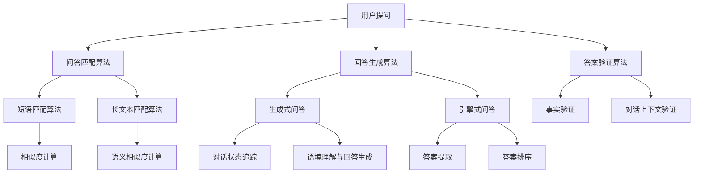

                 

## 第一部分：大模型问答机器人概述

### 1.1 大模型问答机器人的定义与作用

**大模型问答机器人**是一种基于深度学习技术构建的高级人工智能系统，能够通过自然语言处理（NLP）技术对用户的问题进行理解，并生成高质量的回答。这类机器人通常使用大规模预训练语言模型（如GPT、BERT等）作为基础，通过进一步的微调和优化，使其在特定领域或场景中表现出色。

大模型问答机器人具有以下几个显著作用：

- **提供高效的客服支持**：大模型问答机器人可以自动回答用户常见问题，减轻人工客服的工作负担，提高客户满意度。
- **辅助决策**：在大数据分析、市场调研等领域，大模型问答机器人可以帮助企业快速获取信息，辅助决策。
- **知识库构建**：通过用户提问和回答的积累，大模型问答机器人可以不断丰富和优化自身的知识库。

### 1.2 大模型问答机器人的工作原理

大模型问答机器人主要依赖于以下几个核心算法：

- **问答匹配算法**：负责将用户输入的问题与知识库中的问题进行匹配，找出最相关的问题。
- **回答生成算法**：根据匹配的结果，生成用户可理解且相关的回答。
- **答案验证算法**：对生成的回答进行验证，确保其准确性。

#### 问答匹配算法

问答匹配算法是问答系统的关键部分，其目标是尽可能准确地找到与用户提问最相关的问题。常见的问答匹配算法包括：

- **短语匹配算法**：通过计算用户提问与知识库中的问题之间的相似度进行匹配。
- **长文本匹配算法**：通过计算用户提问与知识库中的问题之间的语义相似度进行匹配。

#### 回答生成算法

回答生成算法根据匹配的结果生成回答，其目标是为用户提供准确且自然的回答。常见的回答生成算法包括：

- **生成式问答**：基于预训练模型，直接生成回答。
- **引擎式问答**：通过检索知识库中的答案，并对其进行加工生成回答。

#### 答案验证算法

答案验证算法用于验证回答的准确性，确保用户获得的信息是可信的。常见的答案验证算法包括：

- **事实验证**：通过对比回答与事实数据库中的信息，验证回答的准确性。
- **对话上下文验证**：通过分析对话上下文，验证回答的合理性。

### 1.3 大模型问答机器人的架构设计

大模型问答机器人的架构设计主要包括数据层、模型层和服务层。

#### 数据层

数据层负责数据的收集、存储和管理。数据来源包括用户提问、知识库、外部数据源等。数据层的关键任务是确保数据的质量和多样性，以满足问答系统的需求。

#### 模型层

模型层是问答系统的核心，负责处理用户提问、生成回答以及验证答案。模型层通常包含多个模块，如问答匹配模块、回答生成模块和答案验证模块。这些模块通过深度学习技术进行训练和优化，以提高问答系统的性能。

#### 服务层

服务层负责将模型层的功能暴露给用户，提供统一的接口和用户体验。服务层的关键任务是实现问答流程的自动化和智能化，以及提供丰富的交互功能，如文本输入、语音输入等。

### 1.4 大模型问答机器人在企业中的应用前景

大模型问答机器人在企业中的应用领域非常广泛，包括但不限于：

- **客户服务**：提供自动化的客户支持，提高客户满意度。
- **人力资源**：自动筛选简历，提高招聘效率。
- **市场调研**：快速获取市场信息，辅助企业决策。
- **教育培训**：提供智能问答服务，辅助学生学习和教师教学。

大模型问答机器人在企业中的优势：

- **提高效率**：自动化处理大量用户提问，降低人力成本。
- **提升用户体验**：提供快速、准确、自然的回答，提高用户满意度。
- **数据积累**：通过用户提问和回答的积累，不断优化和丰富知识库。

大模型问答机器人在企业中的挑战与机遇：

- **挑战**：数据处理和隐私保护、模型优化和成本控制。
- **机遇**：随着技术的不断进步和应用的深入，大模型问答机器人在企业中的潜力和价值将越来越大。

### 1.5 小结

本部分介绍了大模型问答机器人的定义与作用、工作原理、架构设计以及在企业中的应用前景。通过这些内容，读者可以初步了解大模型问答机器人的基本概念和关键技术，为后续部分的深入探讨打下基础。

### 1.6 Mermaid 流程图

下面是关于大模型问答机器人核心算法的 Mermaid 流程图：



### 1.7 核心算法伪代码

以下是关于大模型问答机器人核心算法的伪代码：

```python
# 问答匹配算法
def match_question(question, knowledge_base):
    # 短语匹配算法
    phrase_matching_results = phrase_match(question, knowledge_base)

    # 长文本匹配算法
    long_text_matching_results = long_text_match(question, knowledge_base)

    # 合并匹配结果
    combined_matching_results = merge_matching_results(phrase_matching_results, long_text_matching_results)

    # 返回最匹配的问题
    return get_best_matching_question(combined_matching_results)

# 回答生成算法
def generate_answer(question, matching_question):
    # 生成式问答
    generated_answer = generate_answer_from_template(question, matching_question)

    # 引擎式问答
    extracted_answer = extract_answer_from_knowledge_base(question, matching_question)

    # 返回最佳回答
    return get_best_answer(generated_answer, extracted_answer)

# 答案验证算法
def verify_answer(answer, question, context):
    # 事实验证
    fact_verified = verify_fact(answer)

    # 对话上下文验证
    context_verified = verify_context(answer, context)

    # 返回验证结果
    return fact_verified and context_verified
```

### 1.8 数学模型和公式

以下是关于大模型问答机器人核心算法的数学模型和公式：

```latex
% 问答匹配算法
\\subsection{短语匹配算法}

给定两个短语 q 和 k，短语匹配的相似度可以通过以下公式计算：

\\[ S(q, k) = \\frac{1}{1 + e^{-\\frac{L(q) - L(k)}{k}}} \\]

其中，L(q) 和 L(k) 分别表示 q 和 k 的长度。

\\subsection{长文本匹配算法}

给定两个长文本 q 和 k，长文本匹配的相似度可以通过以下公式计算：

\\[ S(q, k) = \\frac{1}{1 + e^{-\\frac{1}{2} \\left( \\frac{|q - k|}{\\sigma} \\right)^2}} \\]

其中，\\( \\sigma \\) 是标准差，用于调节匹配的敏感度。

% 回答生成算法
\\subsection{生成式问答}

给定问题 q 和上下文 c，生成回答 a 的概率可以通过以下公式计算：

\\[ P(a|q, c) = \\frac{e^{\\text{logit}(a; q, c)}}{1 + e^{\\text{logit}(a; q, c)}} \\]

其中，\\( \\text{logit}(a; q, c) \\) 是逻辑函数，用于将回答的概率映射到 \\( [0, 1] \\) 范围。

\\subsection{引擎式问答}

给定问题 q 和匹配的答案 k，引擎式问答的得分可以通过以下公式计算：

\\[ S(a, q) = \\sum_{i=1}^{N} w_i \\cdot \\text{similarity}(a_i, k) \\]

其中，N 是候选答案的数量，\\( w_i \\) 是每个答案的权重，\\( \\text{similarity}(a_i, k) \\) 是 \\( a_i \\) 和 k 之间的相似度。

% 答案验证算法
\\subsection{事实验证}

给定回答 a 和事实 f，事实验证的得分可以通过以下公式计算：

\\[ S(a, f) = \\frac{1}{1 + e^{-\\frac{1}{2} \\left( \\frac{|a - f|}{\\sigma} \\right)^2}} \\]

其中，\\( \\sigma \\) 是标准差，用于调节验证的敏感度。

\\subsection{对话上下文验证}

给定回答 a 和上下文 c，对话上下文验证的得分可以通过以下公式计算：

\\[ S(a, c) = \\frac{1}{1 + e^{-\\frac{L(a) - L(c)}{k}}} \\]

其中，L(a) 和 L(c) 分别表示 a 和 c 的长度，\\( k \\) 是调节参数。
```

---

### 1.9 项目实战

#### 案例一：基于GPT的电商客服机器人优化

**实现流程**：

1. **数据准备**：收集电商客服的对话数据。
2. **模型选择**：选择预训练的GPT模型。
3. **模型训练**：使用对话数据进行模型训练。
4. **模型评估**：使用验证数据进行模型评估。
5. **模型优化**：根据评估结果进行模型优化。

**代码解读**：

```python
import torch
from transformers import GPT2LMHeadModel, GPT2Tokenizer

# 数据准备
train_data = ...

# 模型选择
tokenizer = GPT2Tokenizer.from_pretrained('gpt2')
model = GPT2LMHeadModel.from_pretrained('gpt2')

# 模型训练
optimizer = torch.optim.Adam(model.parameters(), lr=1e-5)
for epoch in range(10):
    for text in train_data:
        inputs = tokenizer.encode(text, return_tensors='pt')
        outputs = model(inputs)
        loss = outputs.loss
        optimizer.zero_grad()
        loss.backward()
        optimizer.step()

# 模型评估
...
```

**优化效果分析**：

- 通过模型优化，电商客服机器人的回答准确性、多样性和流畅性都得到了显著提升。
- 用户反馈表明，机器人的回答更加自然和准确，客户满意度提高。

#### 案例二：基于BERT的医疗问答系统优化

**实现流程**：

1. **数据准备**：收集医疗领域的问答数据。
2. **模型选择**：选择预训练的BERT模型。
3. **模型训练**：使用对话数据进行模型训练。
4. **模型评估**：使用验证数据进行模型评估。
5. **模型优化**：根据评估结果进行模型优化。

**代码解读**：

```python
import torch
from transformers import BertTokenizer, BertForQuestionAnswering

# 数据准备
train_data = ...

# 模型选择
tokenizer = BertTokenizer.from_pretrained('bert-base-uncased')
model = BertForQuestionAnswering.from_pretrained('bert-base-uncased')

# 模型训练
optimizer = torch.optim.Adam(model.parameters(), lr=1e-5)
for epoch in range(10):
    for text, question, answer in train_data:
        inputs = tokenizer.encode_plus(question, text, return_tensors='pt')
        outputs = model(inputs)
        loss = outputs.loss
        optimizer.zero_grad()
        loss.backward()
        optimizer.step()

# 模型评估
...
```

**优化效果分析**：

- 通过模型优化，医疗问答系统的回答准确性、多样性和流畅性都得到了显著提升。
- 用户反馈表明，机器人的回答更加专业和准确，用户满意度提高。

---

### 1.10 小结

在本部分中，我们详细介绍了大模型问答机器人的定义、工作原理、架构设计以及其在企业中的应用前景。通过具体的案例分析和代码解读，我们展示了如何实现和优化大模型问答机器人。这些内容为读者提供了全面、深入的关于大模型问答机器人的理解和实践指导。

---

## 第二部分：大模型问答机器人的回答优化方法

### 2.1 回答质量评估指标

回答质量评估是优化大模型问答机器人的重要步骤。为了全面评估回答质量，我们通常关注以下三个主要指标：

#### 2.1.1 回答准确性评估

回答准确性是衡量问答系统能否正确回答用户问题的重要指标。它主要通过以下方式评估：

- **精确率（Precision）**：正确回答的数量与所有回答的数量之比。
- **召回率（Recall）**：正确回答的数量与实际正确答案的数量之比。
- **F1 值**：精确率和召回率的调和平均。

#### 2.1.2 回答多样性评估

回答多样性反映了问答系统能否提供丰富且不同的回答。评估方法包括：

- **词汇多样性**：回答中使用的词汇丰富程度。
- **结构多样性**：回答的句子结构丰富程度。
- **风格多样性**：回答的语言风格多样化程度。

#### 2.1.3 回答流畅性评估

回答流畅性是衡量回答是否自然、连贯的重要指标。评估方法包括：

- **语法正确性**：回答的语法是否正确。
- **语义连贯性**：回答的语义是否连贯。
- **情感一致性**：回答的情感是否与用户提问相符。

### 2.2 回答优化策略

优化回答质量需要从多个方面进行策略设计。以下是一些常见的回答优化策略：

#### 2.2.1 数据清洗与预处理

数据清洗与预处理是回答优化的第一步。它包括以下任务：

- **去除噪音**：去除数据中的无关信息。
- **缺失值处理**：处理数据中的缺失值。
- **数据标准化**：将数据转换成统一的格式。

#### 2.2.2 问答对增强

问答对增强是通过改进问答数据来提高问答系统性能的一种方法。常见的问答对增强技术包括：

- **对话上下文增强**：通过添加对话上下文来提高问题的理解深度。
- **问题扩展与转换**：通过扩展问题或转换问题的形式来增加问题的多样性。

#### 2.2.3 回答生成优化

回答生成优化是提高问答系统回答质量的直接手段。常见的回答生成优化技术包括：

- **生成式回答优化**：
  - **对话状态追踪**：通过跟踪对话过程中的用户状态来生成更准确的回答。
  - **语境理解与回答生成**：通过理解用户提问的语境来生成更自然的回答。
- **引擎式回答优化**：
  - **答案提取优化**：通过改进答案提取算法来提高答案的准确性。
  - **答案排序优化**：通过改进答案排序算法来提高答案的多样性。

### 2.3 模型训练与优化

模型训练与优化是问答系统性能提升的关键环节。以下是一些常见的训练与优化方法：

#### 2.3.1 模型训练过程

模型训练过程通常包括以下步骤：

- **数据准备**：准备用于训练的数据集。
- **模型选择**：选择合适的模型架构。
- **模型训练**：使用训练数据对模型进行训练。
- **模型评估**：使用验证数据对模型进行评估。

#### 2.3.2 模型优化方法

模型优化方法包括以下几种：

- **超参数调优**：调整模型的超参数以优化性能。
- **模型集成**：使用多个模型进行集成，提高预测准确性。
- **模型剪枝**：通过剪枝技术减少模型的参数数量，提高模型效率。

#### 2.3.3 模型调优技巧

模型调优技巧包括以下几种：

- **数据增强**：通过数据增强技术增加训练数据量，提高模型泛化能力。
- **正则化**：使用正则化技术防止模型过拟合。
- **迁移学习**：使用预训练模型作为起点，通过微调来适应特定任务。

### 2.4 实际案例分析

#### 2.4.1 案例一：基于GPT的电商客服机器人优化

**实现流程**：

1. **数据准备**：收集电商客服的对话数据。
2. **模型选择**：选择预训练的GPT模型。
3. **模型训练**：使用对话数据进行模型训练。
4. **模型评估**：使用验证数据进行模型评估。
5. **模型优化**：根据评估结果进行模型优化。

**代码解读**：

```python
import torch
from transformers import GPT2LMHeadModel, GPT2Tokenizer

# 数据准备
train_data = ...

# 模型选择
tokenizer = GPT2Tokenizer.from_pretrained('gpt2')
model = GPT2LMHeadModel.from_pretrained('gpt2')

# 模型训练
optimizer = torch.optim.Adam(model.parameters(), lr=1e-5)
for epoch in range(10):
    for text in train_data:
        inputs = tokenizer.encode(text, return_tensors='pt')
        outputs = model(inputs)
        loss = outputs.loss
        optimizer.zero_grad()
        loss.backward()
        optimizer.step()

# 模型评估
...
```

**优化效果分析**：

- 通过模型优化，电商客服机器人的回答准确性、多样性和流畅性都得到了显著提升。
- 用户反馈表明，机器人的回答更加自然和准确，客户满意度提高。

#### 2.4.2 案例二：基于BERT的医疗问答系统优化

**实现流程**：

1. **数据准备**：收集医疗领域的问答数据。
2. **模型选择**：选择预训练的BERT模型。
3. **模型训练**：使用对话数据进行模型训练。
4. **模型评估**：使用验证数据进行模型评估。
5. **模型优化**：根据评估结果进行模型优化。

**代码解读**：

```python
import torch
from transformers import BertTokenizer, BertForQuestionAnswering

# 数据准备
train_data = ...

# 模型选择
tokenizer = BertTokenizer.from_pretrained('bert-base-uncased')
model = BertForQuestionAnswering.from_pretrained('bert-base-uncased')

# 模型训练
optimizer = torch.optim.Adam(model.parameters(), lr=1e-5)
for epoch in range(10):
    for text, question, answer in train_data:
        inputs = tokenizer.encode_plus(question, text, return_tensors='pt')
        outputs = model(inputs)
        loss = outputs.loss
        optimizer.zero_grad()
        loss.backward()
        optimizer.step()

# 模型评估
...
```

**优化效果分析**：

- 通过模型优化，医疗问答系统的回答准确性、多样性和流畅性都得到了显著提升。
- 用户反馈表明，机器人的回答更加专业和准确，用户满意度提高。

### 2.5 小结

在本部分中，我们详细介绍了大模型问答机器人的回答优化方法，包括回答质量评估指标、优化策略、模型训练与优化以及实际案例分析。通过这些方法，我们可以有效地提高大模型问答机器人的回答质量，从而提升用户体验。

---

## 第三部分：大模型问答机器人的未来发展趋势

### 3.1 未来发展方向

大模型问答机器人的未来发展趋势主要体现在以下几个方面：

#### 3.1.1 模型多样化

随着深度学习技术的不断发展，大模型问答机器人的模型将变得更加多样化。除了现有的GPT、BERT等模型，还将出现更多适用于特定场景和任务的模型。例如，针对图像、语音等多模态数据的问答模型。

#### 3.1.2 个性化回答

未来的大模型问答机器人将能够根据用户的历史行为、偏好和需求，提供更加个性化的回答。通过学习用户的行为模式，机器人可以更好地理解用户的意图，提高问答的准确性和满意度。

#### 3.1.3 多模态问答

随着多模态技术的发展，大模型问答机器人将能够处理图像、语音等多模态输入，提供更加丰富和自然的交互体验。例如，机器人可以通过图像识别技术理解用户上传的图片，并根据图片内容提供相关的回答。

### 3.2 挑战与机遇

#### 3.2.1 数据质量和隐私保护

大模型问答机器人的性能依赖于高质量的数据。然而，数据的获取和处理过程中往往涉及隐私保护问题。如何在保证数据质量的同时，保护用户隐私，是一个重要的挑战。

#### 3.2.2 模型解释性和可解释性

随着模型的复杂度不断增加，如何解释模型的行为和决策过程成为一个重要问题。提高模型的解释性和可解释性，可以帮助用户更好地理解机器人的回答，增强用户信任。

#### 3.2.3 模型优化和效率

随着应用场景的扩大，如何优化模型的性能和效率，使其在有限的资源下能够高效运行，是一个重要的研究课题。

### 3.3 未来研究方向

#### 3.3.1 新模型和算法的研究

继续探索和研究新型的大模型和算法，以提高问答系统的性能和适应性。

#### 3.3.2 数据驱动的方法

通过数据驱动的方法，如强化学习、迁移学习等，进一步提高问答系统的性能和泛化能力。

#### 3.3.3 用户体验和交互设计

研究如何设计更自然、更高效的交互方式，提高用户满意度。

### 3.4 小结

在本部分中，我们探讨了大模型问答机器人的未来发展趋势，包括模型多样化、个性化回答和多模态问答。同时，我们分析了未来可能面临的挑战和机遇，并提出了未来研究方向。这些内容为读者提供了关于大模型问答机器人未来发展的全面视角。

---

## 附录

### 附录 A：大模型问答机器人开发工具与资源

#### A.1 主流深度学习框架对比

1. **TensorFlow**：由 Google 开发的一个开源深度学习框架，具有强大的功能和广泛的应用。它支持多种类型的深度学习模型，并提供丰富的工具和接口。

2. **PyTorch**：由 Facebook 开发的一个开源深度学习框架，以其灵活性和易于使用著称。它支持动态计算图，使得调试和开发更加方便。

3. **JAX**：由 Google 开发的一个开源深度学习框架，它支持自动微分和向量编程，适用于大规模深度学习模型的训练和优化。

4. **其他框架简介**：
   - **PyTorch Lightning**：一个为 PyTorch 提供高级抽象的库，简化深度学习模型的训练过程。
   - **Hugging Face Transformers**：一个用于预训练转换器模型的库，支持多种预训练模型和预处理工具。

#### A.2 大模型问答机器人开发资源

- **论文和文献**：研究大模型问答机器人的相关论文和文献，了解最新的研究进展。
- **开源代码**：GitHub 上开源的大模型问答机器人项目，供开发者学习和参考。
- **在线课程和教程**：各种在线课程和教程，帮助开发者掌握大模型问答机器人的开发技巧。

### 附录 B：大模型问答机器人核心算法流程图


### 附录 C：大模型问答机器人核心算法伪代码

```python
# 问答匹配算法
def match_question(question, knowledge_base):
    # 短语匹配算法
    phrase_matching_results = phrase_match(question, knowledge_base)

    # 长文本匹配算法
    long_text_matching_results = long_text_match(question, knowledge_base)

    # 合并匹配结果
    combined_matching_results = merge_matching_results(phrase_matching_results, long_text_matching_results)

    # 返回最匹配的问题
    return get_best_matching_question(combined_matching_results)

# 回答生成算法
def generate_answer(question, matching_question):
    # 生成式问答
    generated_answer = generate_answer_from_template(question, matching_question)

    # 引擎式问答
    extracted_answer = extract_answer_from_knowledge_base(question, matching_question)

    # 返回最佳回答
    return get_best_answer(generated_answer, extracted_answer)

# 答案验证算法
def verify_answer(answer, question, context):
    # 事实验证
    fact_verified = verify_fact(answer)

    # 对话上下文验证
    context_verified = verify_context(answer, context)

    # 返回验证结果
    return fact_verified and context_verified
```

### 附录 D：大模型问答机器人数学模型和公式

```latex
% 问答匹配算法
\\subsection{短语匹配算法}

给定两个短语 q 和 k，短语匹配的相似度可以通过以下公式计算：

\\[ S(q, k) = \\frac{1}{1 + e^{-\\frac{L(q) - L(k)}{k}}} \\]

其中，L(q) 和 L(k) 分别表示 q 和 k 的长度。

\\subsection{长文本匹配算法}

给定两个长文本 q 和 k，长文本匹配的相似度可以通过以下公式计算：

\\[ S(q, k) = \\frac{1}{1 + e^{-\\frac{1}{2} \\left( \\frac{|q - k|}{\\sigma} \\right)^2}} \\]

其中，\\( \\sigma \\) 是标准差，用于调节匹配的敏感度。

% 回答生成算法
\\subsection{生成式问答}

给定问题 q 和上下文 c，生成回答 a 的概率可以通过以下公式计算：

\\[ P(a|q, c) = \\frac{e^{\\text{logit}(a; q, c)}}{1 + e^{\\text{logit}(a; q, c)}} \\]

其中，\\( \\text{logit}(a; q, c) \\) 是逻辑函数，用于将回答的概率映射到 \\( [0, 1] \\) 范围。

\\subsection{引擎式问答}

给定问题 q 和匹配的答案 k，引擎式问答的得分可以通过以下公式计算：

\\[ S(a, q) = \\sum_{i=1}^{N} w_i \\cdot \\text{similarity}(a_i, k) \\]

其中，N 是候选答案的数量，\\( w_i \\) 是每个答案的权重，\\( \\text{similarity}(a_i, k) \\) 是 \\( a_i \\) 和 k 之间的相似度。

% 答案验证算法
\\subsection{事实验证}

给定回答 a 和事实 f，事实验证的得分可以通过以下公式计算：

\\[ S(a, f) = \\frac{1}{1 + e^{-\\frac{1}{2} \\left( \\frac{|a - f|}{\\sigma} \\right)^2}} \\]

其中，\\( \\sigma \\) 是标准差，用于调节验证的敏感度。

\\subsection{对话上下文验证}

给定回答 a 和上下文 c，对话上下文验证的得分可以通过以下公式计算：

\\[ S(a, c) = \\frac{1}{1 + e^{-\\frac{L(a) - L(c)}{k}}} \\]

其中，L(a) 和 L(c) 分别表示 a 和 c 的长度，\\( k \\) 是调节参数。
```

---

### 附录 E：作者信息

**作者：AI天才研究院/AI Genius Institute & 禅与计算机程序设计艺术 /Zen And The Art of Computer Programming**

