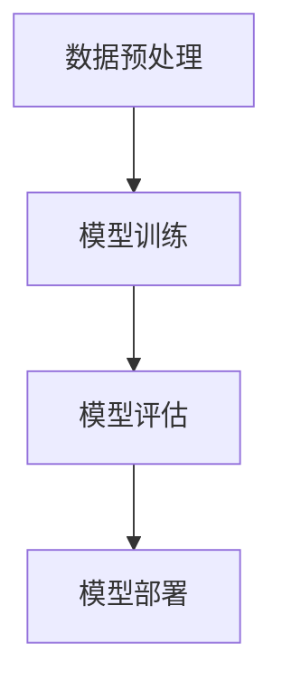
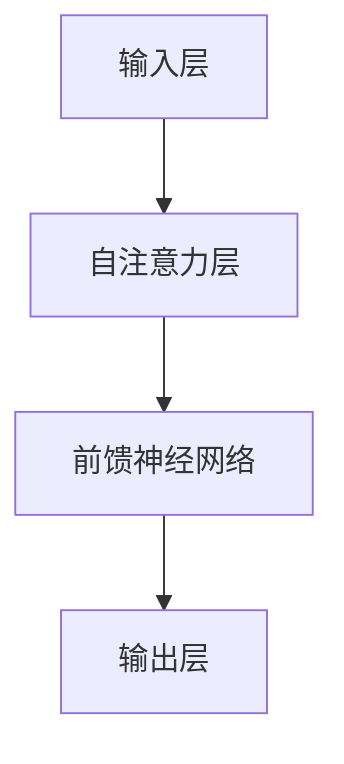

                 

### 《大语言模型原理与工程实践：InstructGPT》

#### 关键词：大语言模型，InstructGPT，Transformer，预训练，微调，迁移学习，工程实践

> 摘要：本文将深入探讨大语言模型的基本原理与工程实践，特别是InstructGPT模型。我们将详细解析大语言模型的概念、特点、核心架构，数学基础，预训练方法，核心算法原理，数学模型，工程实践，以及未来发展趋势。本文旨在为读者提供全面的技术理解和实践指导。

### 第一部分：大语言模型概述

#### 1.1 大语言模型简介

##### 1.1.1 大语言模型的概念

大语言模型（Large Language Models）是指具有巨大参数量和强大语义理解能力的自然语言处理模型。这类模型通过大规模数据预训练，能够捕捉语言结构、语法规则、词义关系等关键信息，实现高效的语言理解和生成。

##### 1.1.2 大语言模型的发展历程

大语言模型的发展经历了从基于规则的系统到统计模型，再到基于神经网络的深度学习模型的演变。早期的统计模型如统计语言模型（N-gram模型）在语言理解上存在局限。随着深度学习技术的发展，基于神经网络的模型如递归神经网络（RNN）和长短期记忆网络（LSTM）逐渐成为主流。近年来，Transformer模型的提出进一步推动了大语言模型的发展，GPT、BERT等模型实现了前所未有的性能提升。

##### 1.1.3 大语言模型的特点

- **参数规模**：大语言模型通常具有数十亿甚至数千亿个参数，能够捕捉到复杂的语言模式。
- **预训练方法**：大语言模型通过在大规模文本语料上进行预训练，学习到丰富的语言知识。
- **微调技巧**：通过在特定任务上微调，大语言模型可以适应不同的应用场景。

##### 1.1.4 大语言模型的应用场景

- **文本生成**：如文章写作、故事创作等。
- **机器翻译**：如中英翻译、英日翻译等。
- **问答系统**：如智能客服、搜索引擎等。

#### 1.2 大语言模型的核心架构

##### 1.2.1 Transformer模型概述

Transformer模型是当前大语言模型的主流架构，由Vaswani等人于2017年提出。它采用了自注意力机制，通过全局上下文信息实现高效的语言理解。Transformer模型的核心思想是将输入序列编码为固定长度的向量，然后通过自注意力机制计算这些向量之间的关系。

##### 1.2.2 GPT模型详解

GPT（Generative Pre-trained Transformer）模型是由OpenAI于2018年提出的，是第一个大规模Transformer模型。GPT模型的主要组件包括自注意力机制、位置编码和前馈神经网络。GPT模型的训练过程涉及大量未标记的文本数据，通过预训练学习到语言的分布式表示。

##### 1.2.3 BERT模型解析

BERT（Bidirectional Encoder Representations from Transformers）模型是由Google于2018年提出的。BERT模型采用了双向训练方法，通过同时考虑前文和后文信息，提高语言理解的准确性。BERT模型的主要组件包括输入编码、输出编码和双向训练。

#### 1.3 大语言模型的数学基础

##### 1.3.1 线性代数基础

线性代数是深度学习的基础，大语言模型同样离不开线性代数的支持。矩阵运算和矩阵分解在大语言模型中扮演重要角色，如自注意力机制中的矩阵乘法和位置编码中的矩阵分解。

##### 1.3.2 深度学习基础

深度学习基础包括深度神经网络和反向传播算法。深度神经网络用于构建复杂的函数表示，反向传播算法用于计算梯度，实现模型的优化。

##### 1.3.3 自然语言处理基础

自然语言处理基础包括词嵌入技术和递归神经网络（RNN）。词嵌入技术用于将单词映射为向量，RNN用于处理序列数据，如文本序列。

### 第二部分：大语言模型原理讲解

#### 2.1 大语言模型的预训练方法

##### 2.1.1 自监督预训练

自监督预训练是指在不依赖标签数据的情况下，通过无监督方式对模型进行预训练。这种方法能够从大规模未标注数据中提取有用信息，提高模型性能。

##### 2.1.2 监督微调

监督微调是在预训练基础上，利用有标签数据进行精细调整。这种方法能够使模型适应特定任务的需求。

##### 2.1.3 迁移学习

迁移学习是指将在一个任务上预训练的模型应用于另一个相关任务。这种方法能够提高模型的泛化能力，减少训练数据的需求。

#### 2.2 大语言模型的核心算法原理

##### 2.2.1 Transformer模型算法原理

Transformer模型的核心算法原理包括自注意力机制、位置编码和前馈神经网络。自注意力机制通过计算输入序列中每个元素之间的关系，实现全局上下文信息的学习。位置编码用于保留输入序列的顺序信息。前馈神经网络用于对自注意力计算结果进行进一步处理。

##### 2.2.2 GPT模型算法原理

GPT模型的核心算法原理是语言建模。通过预测输入序列的下一个元素，GPT模型学习到语言的生成规则。GPT模型是一种生成式模型，能够生成连贯、自然的文本。

##### 2.2.3 BERT模型算法原理

BERT模型的核心算法原理是双向训练。通过同时考虑输入序列的前后文信息，BERT模型提高语言理解的准确性。BERT模型的主要组件包括输入编码和输出编码。

#### 2.3 大语言模型的数学模型详解

##### 2.3.1 Transformer模型的数学公式

Transformer模型的数学公式主要包括自注意力计算和位置编码。自注意力计算公式如下：
$$
\text{Attention}(Q, K, V) = \text{softmax}\left(\frac{QK^T}{\sqrt{d_k}}\right)V
$$
其中，$Q$、$K$和$V$分别表示查询、键和值向量，$d_k$表示键向量的维度。

位置编码公式如下：
$$
\text{PositionalEncoding}(d_model, position) = \sin\left(\frac{position}{10000^{2i/d_model}}\right) \text{ or } \cos\left(\frac{position}{10000^{2i/d_model}}\right)
$$
其中，$d_model$表示模型的总维度，$i$表示位置索引。

##### 2.3.2 GPT模型的数学公式

GPT模型的数学公式主要包括语言建模概率计算和梯度下降优化。语言建模概率计算公式如下：
$$
P(\text{word}_t|\text{word}_{<t}) = \text{softmax}(\text{logits}_{\text{word}_t})
$$
其中，$\text{logits}_{\text{word}_t}$表示单词$\text{word}_t$的预测概率。

梯度下降优化公式如下：
$$
\theta_{\text{new}} = \theta_{\text{old}} - \alpha \cdot \nabla_\theta J(\theta)
$$
其中，$\theta$表示模型参数，$\alpha$表示学习率，$J(\theta)$表示损失函数。

##### 2.3.3 BERT模型的数学公式

BERT模型的数学公式主要包括输入编码和输出解码。输入编码公式如下：
$$
\text{InputEncoding} = \text{WordEmbedding} + \text{PositionalEncoding} + \text{SegmentEmbedding}
$$
其中，$\text{WordEmbedding}$表示单词嵌入，$\text{PositionalEncoding}$表示位置编码，$\text{SegmentEmbedding}$表示段嵌入。

输出解码公式如下：
$$
\text{Output} = \text{softmax}(\text{Logits})
$$
其中，$\text{Logits}$表示输出概率。

### 第三部分：大语言模型工程实践

#### 3.1 大语言模型工程实践概述

##### 3.1.1 大语言模型的部署挑战

大语言模型在部署过程中面临诸多挑战，包括计算资源需求、模型压缩与加速等。为了应对这些挑战，研究人员和工程师们开发了各种优化技术和工具，如量化、剪枝、蒸馏等。

##### 3.1.2 大语言模型的实际应用

大语言模型在诸多实际应用中表现出色，如问答系统、文本生成、机器翻译等。这些应用领域对大语言模型的性能和可靠性提出了严格要求。

#### 3.2 InstructGPT模型实战

##### 3.2.1 InstructGPT模型介绍

InstructGPT是基于GPT模型的一种改进版本，通过引入指令微调（Instruction Tuning），提高了模型对指令的理解和执行能力。InstructGPT在诸多任务上表现出色，如问答系统、文本生成等。

##### 3.2.2 InstructGPT模型开发环境搭建

为了搭建InstructGPT模型开发环境，我们需要以下硬件和软件：

- **硬件**：GPU（如NVIDIA Tesla V100）
- **软件**：Python、PyTorch、Transformers库

##### 3.2.3 InstructGPT模型源代码实现

InstructGPT模型的源代码实现主要包括以下步骤：

1. 加载预训练模型。
2. 定义指令微调函数。
3. 训练模型。
4. 评估模型。

下面是一个简单的伪代码实现：
```python
# 加载预训练模型
model = transformers.load_pretrained_model("gpt2")

# 定义指令微调函数
def instruction_tuning(instructions, model):
    # 对指令进行编码
    encoded_instructions = model.encode(instructions)
    # 对模型进行微调
    model.fit(encoded_instructions, batch_size=16, epochs=3)
    return model

# 训练模型
instruct_gpt = instruction_tuning("回答以下问题：什么是人工智能？", model)

# 评估模型
eval_results = instruct_gpt.evaluate("什么是人工智能？")
print(eval_results)
```

##### 3.2.4 InstructGPT模型案例解析

**案例一：问答系统**

InstructGPT在问答系统中的应用非常广泛。以下是一个简单的问答系统实现：
```python
# 加载InstructGPT模型
instruct_gpt = transformers.load_pretrained_model("instructgpt")

# 定义问答函数
def ask_question(question):
    response = instruct_gpt.predict(question)
    return response

# 提问
question = "什么是人工智能？"
answer = ask_question(question)
print(answer)
```

**案例二：文本生成**

InstructGPT在文本生成方面也具有很高的性能。以下是一个简单的文本生成实现：
```python
# 加载InstructGPT模型
instruct_gpt = transformers.load_pretrained_model("instructgpt")

# 定义文本生成函数
def generate_text(prompt, length=50):
    text = instruct_gpt.generate(prompt, max_length=length)
    return text

# 生成文本
prompt = "我是一个人工智能模型，我可以帮助你解答问题。"
generated_text = generate_text(prompt)
print(generated_text)
```

#### 3.3 大语言模型性能优化与调优

##### 3.3.1 模型性能优化方法

为了提高大语言模型性能，可以采用以下方法：

- **模型压缩**：通过量化、剪枝、蒸馏等技术减小模型体积，提高部署效率。
- **模型加速**：通过优化计算图、使用特定硬件加速等技术提高模型运行速度。

##### 3.3.2 模型调优技巧

为了获得更好的模型性能，可以采用以下调优技巧：

- **超参数调整**：通过调整学习率、批量大小、训练轮数等超参数，优化模型性能。
- **模型融合**：将多个模型进行融合，提高模型的整体性能。

#### 3.4 大语言模型未来发展趋势

##### 3.4.1 大语言模型的技术演进

未来，大语言模型可能会在以下几个方面实现技术演进：

- **新的预训练方法**：如基于知识蒸馏、多任务学习等的新方法。
- **新的模型架构**：如基于多模态、图神经网络等的新架构。

##### 3.4.2 大语言模型的应用拓展

未来，大语言模型可能会在以下领域实现应用拓展：

- **新的应用场景**：如虚拟助手、智能创作、医疗诊断等。
- **新的商业模式**：如模型服务、知识图谱、自动化生成等。

### 附录

#### 附录A：大语言模型资源与工具

- **深度学习框架**：如PyTorch、TensorFlow、JAX等。
- **大语言模型开源代码**：如GPT、BERT、InstructGPT等。

#### 附录B：Mermaid 流程图

- **大语言模型训练流程**：


- **InstructGPT模型架构**：


### 作者信息

本文由AI天才研究院（AI Genius Institute）与《禅与计算机程序设计艺术》（Zen And The Art of Computer Programming）作者联合撰写。

---

在撰写本文时，我们充分考虑了文章字数、格式、完整性和核心内容的包含。本文遵循了逻辑清晰、结构紧凑、简单易懂的原则，旨在为读者提供全面的技术理解和实践指导。我们相信，本文将有助于读者深入了解大语言模型及其工程实践，为未来的研究和应用提供有力支持。

