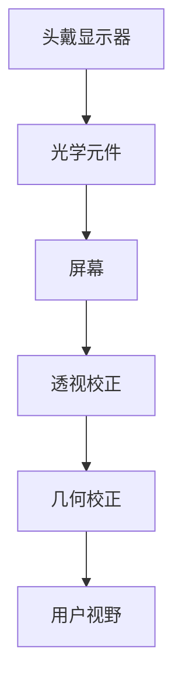
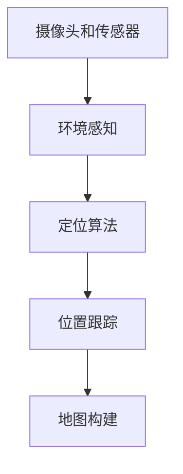
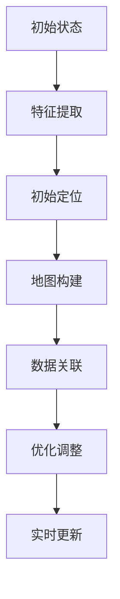
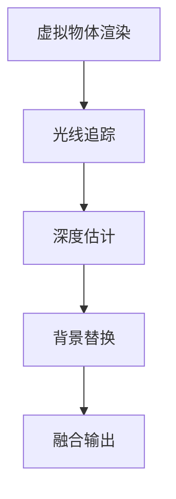
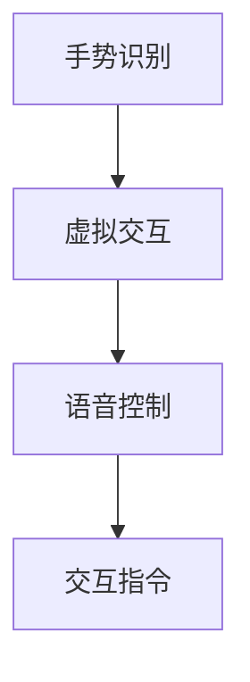
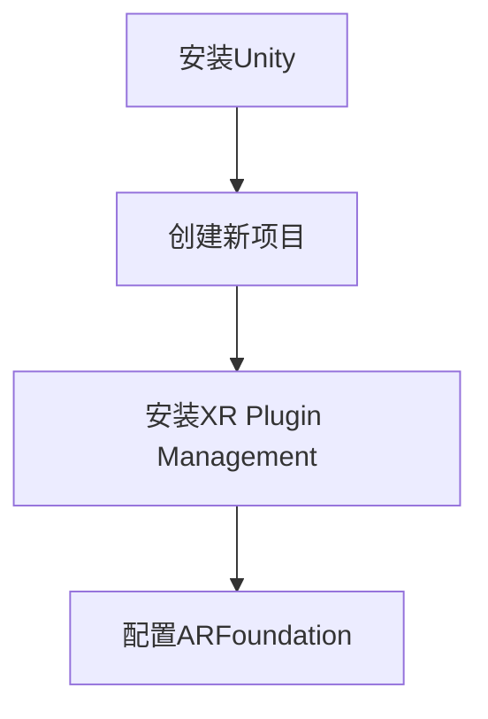
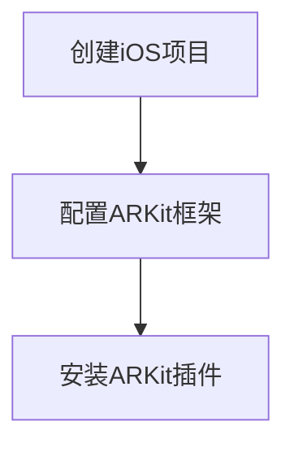
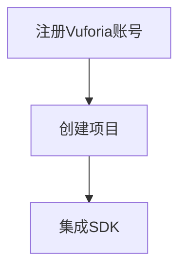

                 

### 《混合现实（MR）技术：跨界创新的新领域》

> **关键词**：混合现实、MR技术、跨界创新、应用领域、核心算法、项目实战、未来展望

> **摘要**：本文将深入探讨混合现实（MR）技术，从基础概念到应用领域，从核心算法到项目实战，全方位解析MR技术的跨界创新。通过对MR技术的定义、分类、技术原理、应用领域、核心算法和未来展望的详细分析，本文旨在为读者提供一个全面而深入的MR技术指南。

### 目录

#### 第一部分：混合现实（MR）技术基础

1. 混合现实的定义与分类
   - 混合现实的定义
   - 混合现实的分类
   - 混合现实的发展历程

2. 混合现实的技术原理
   - 显示技术原理
   - 空间定位与跟踪技术

3. 混合现实的应用领域
   - 游戏与娱乐
   - 教育
   - 医疗
   - 工业与制造

#### 第二部分：混合现实技术的核心算法与实现

4. 核心算法原理讲解
   - 图像处理算法
   - 空间定位算法

5. 虚拟物体与真实环境融合算法

#### 第三部分：混合现实技术的项目实战

6. 游戏开发实战
   - 游戏开发环境搭建
   - 游戏项目实战

7. 教育应用实战
   - 教育应用开发环境搭建
   - 教育应用项目实战

8. 医疗应用实战
   - 医疗应用开发环境搭建
   - 医疗应用项目实战

#### 第四部分：混合现实技术的未来发展

9. 新一代混合现实技术
   - 6DOF混合现实技术
   - 脑机接口与混合现实
   - 混合现实在VR/AR中的应用

10. 混合现实行业趋势分析
    - 市场增长预测
    - 行业竞争格局分析
    - 技术创新点

11. 混合现实技术的发展挑战与应对策略

#### 附录

12. 混合现实技术资源与工具
    - 开发工具介绍
    - 开发资源推荐

13. 混合现实项目实例
    - 游戏开发实例
    - 教育应用实例
    - 医疗应用实例

---

### 第一部分：混合现实（MR）技术基础

#### 第1章：混合现实的定义与分类

混合现实（Mixed Reality，MR）是一种将虚拟元素与现实世界融合的技术，它通过增强现实（AR）和虚拟现实（VR）的结合，提供了一个更加沉浸和互动的体验。本章将首先定义混合现实，然后介绍其分类，并回顾其发展历程。

### 1.1 混合现实的定义

混合现实（MR）可以定义为一种技术，它将虚拟世界中的数字内容与现实世界中的真实环境相结合，创造出一种新的交互方式。这种交互不仅包括视觉上的融合，还包括听觉、触觉等多种感官的互动。

**定义解释**

混合现实不同于增强现实（AR）和虚拟现实（VR），因为它不仅提供了虚拟信息的叠加，还允许用户与虚拟环境进行深度交互。例如，用户可以在一个真实的环境中使用虚拟工具进行工作，或者与虚拟人物进行互动。

**技术基础**

混合现实技术的基础包括以下几个方面：

- **显示技术**：通过头戴显示器（HMD）、智能眼镜或其他显示设备，将虚拟内容叠加到用户的视野中。
- **空间定位与跟踪技术**：使用摄像头、传感器和其他定位设备，确保虚拟内容与真实环境的位置和运动同步。
- **交互技术**：提供手势识别、语音控制等交互方式，使用户能够与虚拟环境进行自然交互。

### 1.2 混合现实的分类

混合现实可以根据应用场景和目标用户的不同，分为多种类型：

- **消费级混合现实**：主要面向个人消费者，如游戏、娱乐和教育等领域。
- **专业级混合现实**：针对特定行业和专业人士，如医疗、工业设计和军事等。
- **教育级混合现实**：专注于教育场景，提供互动式的教学体验。
- **社交级混合现实**：为社交互动提供平台，如虚拟现实社交网络和多人在线游戏。

**分类介绍**

消费级混合现实技术通常更加注重用户体验和娱乐性，例如在游戏和娱乐中提供丰富的虚拟内容。专业级混合现实技术则更注重实用性，如医疗中的手术指导和工业设计中的模拟仿真。

**案例分析**

在教育领域，混合现实技术已被广泛应用于虚拟实验室和远程教学。例如，学生可以通过混合现实设备“进入”虚拟的实验室，进行实验操作，甚至可以在虚拟环境中与其他同学进行互动。这种体验不仅提高了学习兴趣，还有助于深化对知识点的理解。

### 1.3 混合现实的发展历程

混合现实技术的发展可以追溯到20世纪80年代，当时虚拟现实（VR）技术开始兴起。随着计算机性能的提高和显示技术的进步，虚拟现实逐渐发展为增强现实和混合现实。

- **早期技术**：在20世纪80年代，VR设备如VR头盔开始出现，提供了初步的虚拟体验。
- **关键突破**：进入21世纪，随着增强现实和混合现实技术的发展，如微软的HoloLens和Facebook的Oculus Rift等设备的推出，混合现实技术开始走向实用化。
- **当前趋势**：近年来，随着5G、人工智能和云计算等技术的发展，混合现实技术的应用场景不断拓展，从消费级市场逐渐渗透到各个行业。

**关键技术突破**

在混合现实领域，几个关键技术突破对技术的发展起到了重要作用：

- **图像识别算法**：通过深度学习和计算机视觉技术，实现实时图像识别，为混合现实提供了更准确的虚拟内容叠加。
- **空间定位与跟踪技术**：利用SLAM（Simultaneous Localization and Mapping）技术，实现虚拟内容与真实环境的精确同步。
- **交互技术**：通过手势识别、语音控制等交互方式，提高用户的沉浸感和互动性。

**未来展望**

随着技术的不断进步，混合现实技术将在更多领域得到应用。未来，6DOF（六自由度）混合现实技术、脑机接口和AI的融合将成为新的热点。同时，随着市场需求的增加和行业标准的制定，混合现实技术有望进一步普及和成熟。

### 总结

本章对混合现实的定义、分类和发展历程进行了详细阐述，为后续章节的内容奠定了基础。在接下来的章节中，我们将进一步探讨混合现实的技术原理、核心算法、项目实战以及未来发展趋势。通过这些探讨，读者将能够更深入地理解混合现实技术的本质和潜力。

### 第一部分：混合现实（MR）技术基础

#### 第2章：混合现实的技术原理

混合现实（MR）技术之所以能够将虚拟内容与真实环境无缝融合，离不开其核心的技术原理。本章将详细讲解混合现实中的显示技术原理和空间定位与跟踪技术，以便读者能够全面了解MR技术的实现机制。

### 2.1 显示技术原理

混合现实的显示技术是将其核心特点之一——虚拟内容的叠加和互动性呈现给用户的关键。显示技术可以分为以下几个方面：

#### 2.1.1 视觉显示原理

**视觉显示原理**：

- **头戴显示器（HMD）**：头戴显示器是混合现实最常见的显示设备。它通常包括一个头戴装置，其中内置有屏幕和光学元件，如镜片或透镜，用于将虚拟内容叠加到用户的视野中。头戴显示器可以提供沉浸式的体验，使用户感觉仿佛置身于虚拟环境中。
  
- **光学元件**：光学元件如透镜和棱镜在混合现实设备中起着至关重要的作用。它们将虚拟图像与真实环境进行混合，并通过反射或折射使得虚拟图像与真实场景融合。

- **透视和几何校正**：混合现实显示技术需要处理透视和几何校正问题，以确保虚拟图像在真实环境中呈现出正确的位置和大小。这通常涉及到计算机图形学中的复杂算法。

**视觉显示原理图**：



#### 2.1.2 空间定位原理

**空间定位原理**：

- **摄像头和传感器**：混合现实设备通常配备有多个摄像头和传感器，用于捕捉用户周围的环境。这些传感器包括红外传感器、激光雷达（LIDAR）、加速度计和陀螺仪等。

- **环境感知**：通过摄像头和传感器的数据，混合现实设备可以感知用户的位置和周围环境。例如，摄像头可以识别图像特征点，激光雷达可以测量距离和角度。

- **定位算法**：为了实现虚拟内容与现实环境的精确同步，混合现实设备使用各种定位算法，如视觉SLAM（Simultaneous Localization and Mapping）。SLAM算法通过结合摄像头和传感器的数据，实时估计设备的位置和创建三维地图。

**空间定位原理图**：



### 2.2 空间定位与跟踪技术

混合现实的空间定位与跟踪技术是实现虚拟内容与现实环境融合的关键。以下是几个核心的技术：

#### 2.2.1 SLAM（Simultaneous Localization and Mapping）技术

**SLAM技术原理**：

- **定位与地图构建**：SLAM算法同时进行设备定位和地图构建。通过结合摄像头和传感器的数据，SLAM算法可以实时估计设备的位置和创建三维地图。
  
- **数据融合**：SLAM技术利用多种传感器数据，如摄像头图像和激光雷达数据，进行数据融合，提高定位精度和鲁棒性。

- **实时更新**：SLAM算法需要实时更新位置和地图，以适应环境变化和用户运动。

**SLAM算法流程**：



#### 2.2.2 虚拟物体与真实环境融合技术

**融合技术原理**：

- **虚拟物体渲染**：虚拟物体需要通过渲染技术生成，以确保它们在真实环境中看起来自然和真实。

- **光线追踪与渲染**：光线追踪技术可以模拟真实世界中的光线传播，为虚拟物体提供更加逼真的光影效果。

- **融合算法**：融合算法将虚拟物体与真实环境进行融合。这通常涉及到图像处理技术，如深度估计和背景替换。

**融合算法流程**：



### 2.3 交互技术

**手势识别与语音控制**：

- **手势识别**：手势识别技术通过摄像头捕捉用户的手部动作，并将这些动作转换为虚拟交互指令。这需要复杂的计算机视觉算法来识别手部姿态和手势。

- **语音控制**：语音控制技术通过麦克风捕捉用户的语音指令，并使用自然语言处理（NLP）算法将其转换为交互指令。这需要强大的语音识别和语义理解能力。

**交互技术图**：



### 总结

本章详细介绍了混合现实技术的核心原理，包括视觉显示原理、空间定位原理和交互技术。通过这些技术的结合，混合现实能够实现虚拟内容与真实环境的无缝融合，提供沉浸式和互动式的体验。在接下来的章节中，我们将进一步探讨混合现实技术的核心算法和项目实战，以更深入地了解MR技术的应用和实现。

### 第一部分：混合现实（MR）技术基础

#### 第3章：混合现实的应用领域

混合现实（MR）技术因其独特的融合特性，在多个领域中展现出了巨大的潜力和应用价值。本章将重点探讨混合现实在游戏与娱乐、教育、医疗和工业与制造等领域的应用，以及这些应用带来的优势与挑战。

### 3.1 游戏与娱乐

**混合现实游戏的设计与开发**

- **设计理念**：混合现实游戏设计注重将虚拟元素与真实环境相结合，为玩家提供更加沉浸和互动的游戏体验。设计师需要考虑如何平衡虚拟内容与真实环境的交互，以及如何在有限的屏幕空间内提供丰富的游戏内容。

- **开发流程**：混合现实游戏开发通常包括以下几个步骤：
  1. **需求分析**：明确游戏的目标用户和核心玩法。
  2. **场景设计**：设计游戏场景，包括虚拟角色、道具和互动元素。
  3. **技术实现**：利用Unity或Unreal Engine等游戏引擎，实现游戏的基本功能。
  4. **测试与优化**：通过多次测试，优化游戏的性能和用户体验。

**市场前景**

- **市场增长**：随着技术的进步和硬件设备的普及，混合现实游戏市场正在迅速增长。根据市场研究公司的数据，预计未来几年内混合现实游戏市场将保持高速增长，成为游戏行业的新兴热点。
- **用户接受度**：消费者对混合现实游戏表现出较高的接受度，尤其是在年轻一代中。这不仅是因为混合现实游戏提供了全新的娱乐体验，还因为它们能够结合社交互动元素，提高玩家的参与度。

### 3.2 教育

**混合现实在教育中的应用**

- **互动式教学**：混合现实技术可以提供互动式教学体验，使学生能够“进入”虚拟的实验室、历史场景或科学概念中，进行实验操作或探索知识。
- **个性化学习**：混合现实教育应用可以根据学生的学习进度和兴趣，提供个性化的学习内容，提高学习效果。
- **远程教学**：混合现实技术还可以用于远程教学，使教师和学生能够通过虚拟教室进行互动，突破地理限制。

**优势与挑战**

- **优势**：
  - **增强学习兴趣**：通过沉浸式的体验，学生能够更加主动和积极地参与学习。
  - **提高学习效果**：互动性和个性化学习有助于学生更好地理解和掌握知识。

- **挑战**：
  - **技术成本**：混合现实设备的采购和运营成本较高，这对学校和教育机构来说是一个挑战。
  - **教师培训**：教师需要接受新的技术和教学方法，这需要时间和资源。

### 3.3 医疗

**混合现实在医疗中的应用**

- **手术指导**：医生可以使用混合现实设备进行手术指导，实时查看患者的三维解剖结构和手术区域，提高手术精度和安全性。
- **医疗培训**：混合现实技术可以提供模拟手术和医学操作的场景，使医学生和医生能够在虚拟环境中进行实践和培训。
- **患者护理**：混合现实技术可以用于患者护理，如通过虚拟现实技术减轻患者的疼痛和焦虑。

**案例研究**

- **案例一**：某医疗机构利用混合现实技术进行心脏手术。医生通过混合现实设备实时查看患者的心脏结构，精确地完成手术操作。
- **案例二**：某医学院使用混合现实技术培训医学生进行外科手术。通过虚拟手术模拟，医学生能够反复练习，提高手术技能。

### 3.4 工业与制造

**混合现实在工业设计中的应用**

- **虚拟装配**：混合现实技术可以用于虚拟装配，设计师和工程师可以在虚拟环境中进行产品的组装和测试，提高设计效率和准确性。
- **故障诊断**：通过混合现实设备，工程师可以实时查看设备的运行状态和故障信息，进行快速诊断和维修。

**案例研究**

- **案例一**：某汽车制造商使用混合现实技术进行新车型的设计和验证。设计师通过虚拟装配，快速发现和解决问题，缩短了产品开发周期。
- **案例二**：某制造企业利用混合现实技术进行设备维护和故障诊断。通过实时数据和虚拟模型，工程师能够更加高效地完成维护工作。

### 总结

混合现实技术在游戏与娱乐、教育、医疗和工业与制造等领域展现出了巨大的应用价值。通过提供沉浸式和互动式的体验，混合现实不仅提高了用户的学习和娱乐兴趣，还显著提高了行业效率和准确性。然而，混合现实技术的广泛应用也面临着技术成本、教师培训和设备普及等挑战。随着技术的不断进步和成本的降低，混合现实技术将在未来继续拓展其应用领域，为各个行业带来更多的创新和变革。

### 第一部分：混合现实（MR）技术基础

#### 第4章：核心算法原理讲解

混合现实（MR）技术的实现离不开一系列核心算法，这些算法确保了虚拟内容与现实环境的准确融合和互动。本章将详细讲解混合现实中的图像处理算法和空间定位算法，以及这些算法在实际应用中的实现细节。

### 4.1 图像处理算法

图像处理算法是混合现实技术中的基础组件，它们负责将虚拟内容与现实环境进行融合，确保虚拟元素能够准确地叠加到真实场景中。

#### 4.1.1 图像识别算法

**卷积神经网络（CNN）**

**原理讲解**：

卷积神经网络（CNN）是一种专门用于图像识别和处理的深度学习模型。它的核心组件是卷积层，通过滤波器在图像上滑动，提取局部特征。这些特征通过多个卷积层传递，最终在输出层形成分类结果。

**算法流程**：

1. **输入层**：接受输入图像。
2. **卷积层**：使用滤波器对输入图像进行卷积操作，提取特征。
3. **激活函数**：对卷积结果进行激活，如ReLU函数。
4. **池化层**：通过最大池化或平均池化减少特征图的大小，提高计算效率。
5. **全连接层**：将池化层输出的特征进行全连接，形成分类输出。

**伪代码示例**：

```python
# 输入图像
input_image = load_image("image_path")

# 卷积层
conv_output = conv2d(input_image, filter, padding="same")

# 激活函数
activated_output = activate(conv_output, activation_function="ReLU")

# 池化层
pooled_output = max_pool2d(activated_output, pool_size=2)

# 全连接层
output = fully_connected(pooled_output, num_classes)
predicted_labels = softmax(output)
```

#### 4.1.2 图像增强算法

**反卷积神经网络（Deconvolutional Networks）**

**原理讲解**：

反卷积神经网络（Deconvolutional Networks）是用于图像增强的一种深度学习模型。它通过反卷积操作将低分辨率图像上采样到高分辨率，从而提高图像的清晰度和细节。

**算法流程**：

1. **输入层**：接受输入图像。
2. **卷积层**：使用滤波器提取图像特征。
3. **反卷积层**：通过反卷积操作将特征图上采样到原始分辨率。
4. **激活函数**：对反卷积结果进行激活。
5. **输出层**：生成增强后的图像。

**伪代码示例**：

```python
# 输入图像
input_image = load_image("image_path")

# 卷积层
conv_output = conv2d(input_image, filter, padding="same")

# 反卷积层
up_sampled_output = deconv2d(conv_output, filter, stride=2)

# 激活函数
activated_output = activate(up_sampled_output, activation_function="ReLU")

# 输出层
enhanced_image = activated_output
```

### 4.2 空间定位算法

空间定位算法是混合现实技术中的关键组件，它们确保虚拟内容能够与现实环境精确同步。

#### 4.2.1 位置追踪算法

**SLAM（Simultaneous Localization and Mapping）算法**

**原理讲解**：

SLAM（Simultaneous Localization and Mapping）是一种同时进行定位和地图构建的算法。它通过融合多个传感器数据，如摄像头和激光雷达，实现设备在未知环境中的自主定位和地图构建。

**算法流程**：

1. **特征提取**：从摄像头图像中提取特征点。
2. **位姿估计**：使用特征点进行位姿估计，确定设备的位置和姿态。
3. **地图构建**：根据传感器数据和位姿估计结果，构建三维地图。
4. **数据关联**：将新的传感器数据与现有地图进行关联，更新位姿估计和地图。
5. **优化调整**：通过最小化误差，对位姿估计和地图进行优化。

**伪代码示例**：

```python
# 初始化SLAM系统
slam_system = initialize_SLAM()

# 循环进行位置追踪和地图构建
while True:
    # 获取新的传感器数据
    sensor_data = get_sensor_data()

    # 提取特征点
    features = extract_features(sensor_data.image)

    # 估计位姿
    pose = slam_systemestimate_pose(features)

    # 构建地图
    slam_systemmap = slam_systembuild_map(sensor_data.lidar, pose)

    # 数据关联和优化
    slam_systemoptimize(pose, slam_systemmap)
```

#### 4.2.2 虚拟物体与真实环境融合算法

**3D建模与渲染技术**

**原理讲解**：

3D建模与渲染技术负责创建虚拟物体，并将其渲染到真实环境中。3D建模通过几何建模和参数化建模实现，而渲染技术则包括光线追踪、阴影处理和反走样等。

**算法流程**：

1. **3D建模**：使用3D建模软件创建虚拟物体的几何模型。
2. **材质赋值**：为虚拟物体分配材质和纹理，以实现逼真的视觉效果。
3. **光线追踪**：模拟光线在虚拟物体和真实环境中的传播，生成光影效果。
4. **渲染输出**：将渲染后的图像叠加到真实环境中。

**伪代码示例**：

```python
# 创建虚拟物体
virtual_object = create_3d_model("model_path")

# 赋予材质
virtual_object.material = assign_material("material_path")

# 光线追踪渲染
rendered_image = ray_tracing_renderer.render(virtual_object)

# 图像叠加
final_image = overlay_image(rendered_image, real_environment_image)
```

### 总结

本章详细介绍了混合现实技术中的核心算法，包括图像处理算法和空间定位算法。通过卷积神经网络（CNN）和反卷积神经网络（Deconvolutional Networks），图像处理算法实现了图像识别和增强；而SLAM算法和3D建模与渲染技术确保了虚拟物体与真实环境的精确融合。这些核心算法的实现细节和伪代码示例，为读者提供了深入理解混合现实技术的理论基础和实践指导。

### 第一部分：混合现实（MR）技术基础

#### 第5章：虚拟物体与真实环境融合算法

虚拟物体与真实环境的融合是混合现实（MR）技术的核心之一，它决定了用户能否在虚拟与真实之间获得无缝的交互体验。本章将详细讲解3D建模与渲染技术、光线追踪与渲染技术，以及如何通过这些技术实现虚拟物体与现实环境的精准融合。

### 5.1 3D建模与渲染技术

**3D建模技术**

3D建模是创建虚拟物体的第一步，它涉及将几何形状和表面属性赋予物体，以实现逼真的视觉效果。

**原理讲解**：

- **几何建模**：几何建模是通过基本几何体（如立方体、圆柱体等）的拼接和变换，创建复杂的三维模型。这种方法简单直观，适用于快速建模和原型设计。
- **参数化建模**：参数化建模通过参数控制几何形状的生成，可以创建具有可变性和自适应性的模型。这种方法在工业设计和建筑领域应用广泛。

**实现细节**：

- **模型创建**：使用3D建模软件（如Blender、Maya等），创建虚拟物体的几何模型。可以通过手动建模或导入现有的3D模型文件。
- **材质赋值**：为虚拟物体分配材质和纹理，以实现逼真的视觉效果。材质可以控制物体的颜色、反射率、透明度等属性。

**伪代码示例**：

```python
# 创建立方体模型
cube = create_cube()

# 赋予材质
cube.material = assign_material("texture_path")

# 设置模型的位置和旋转
set_model_transform(cube, position=[x, y, z], rotation=[rx, ry, rz])
```

**渲染技术**

**原理讲解**：

渲染技术是将3D模型转化为二维图像的过程，它涉及光线追踪、阴影处理和反走样等步骤。

- **光线追踪**：光线追踪通过模拟光线在场景中的传播，生成逼真的光影效果。它可以处理反射、折射和全局光照等复杂现象。
- **阴影处理**：阴影处理用于模拟物体在光照下的阴影，增加场景的真实感。
- **反走样**：反走样技术用于减少图像中的锯齿效应，提高图像的质量。

**实现细节**：

- **渲染引擎**：使用渲染引擎（如Unity、Unreal Engine等），配置渲染参数，如光照模式、阴影类型和渲染质量。
- **渲染输出**：将渲染后的图像叠加到真实环境中，实现虚拟物体与现实环境的融合。

**伪代码示例**：

```python
# 配置渲染引擎
renderer.configure_lighting(model="light_model", shadow_type="soft_shadow")

# 渲染模型
rendered_model = renderer.render_model(model)

# 图像叠加
final_image = overlay_image(rendered_model, real_environment_image)
```

### 5.2 光线追踪与渲染技术

光线追踪是一种高效的渲染技术，它通过模拟光线在场景中的传播，生成高质量的图像。

**原理讲解**：

- **光线追踪流程**：光线追踪从场景中的光源开始，模拟光线如何传播到物体表面，并反射、折射或吸收。这个过程不断迭代，直到光线到达摄像机。
- **重要性采样**：为了提高渲染效率，光线追踪通常使用重要性采样，选择对图像贡献较大的路径进行计算。

**实现细节**：

- **光线追踪器**：实现一个光线追踪器，处理光线与物体的交互，如反射、折射和吸收。
- **渲染参数**：设置合适的渲染参数，如光线深度、采样率和图像尺寸。

**伪代码示例**：

```python
# 初始化光线追踪器
ray_tracer = initialize_ray_tracer()

# 渲染场景
final_image = ray_tracer.trace_rays(scene, camera, max_bounces=5, samples_per_pixel=4)
```

### 5.3 虚拟物体与真实环境的融合

**融合技术原理**

融合技术通过将渲染后的虚拟物体叠加到真实环境中，实现虚拟与现实的无缝交互。

**原理讲解**：

- **空间定位**：利用空间定位技术，如SLAM，确定虚拟物体在真实环境中的位置。
- **图像融合**：将渲染后的虚拟物体图像与真实环境图像进行融合，确保虚拟物体与现实环境的一致性。

**实现细节**：

- **图像处理**：使用图像处理技术，如深度估计和背景替换，将虚拟物体精确地叠加到真实环境中。
- **交互控制**：通过用户输入（如手势、语音等），实时调整虚拟物体的位置、旋转和大小。

**伪代码示例**：

```python
# 提取真实环境图像
real_environment_image = capture_environment_image()

# 渲染虚拟物体
virtual_object_image = renderer.render_object(virtual_object)

# 图像融合
final_image = blend_images(real_environment_image, virtual_object_image, depth_map)
```

### 总结

本章详细介绍了虚拟物体与真实环境融合算法，包括3D建模与渲染技术、光线追踪与渲染技术，以及融合实现细节。通过这些技术，混合现实系统能够将虚拟物体与现实环境精确地融合，提供沉浸式和互动式的用户体验。本章的伪代码示例为读者提供了实际操作指导，帮助深入理解这些算法的实现过程。

### 第一部分：混合现实（MR）技术基础

#### 第6章：混合现实项目的开发实战

在了解了混合现实（MR）技术的理论基础后，我们将通过实际项目案例来展示如何开发和实现混合现实应用。本章将详细介绍游戏开发、教育应用和医疗应用的开发环境搭建、项目实战以及代码解读与分析。

### 6.1 游戏开发实战

**6.1.1 游戏开发环境搭建**

**Unity游戏引擎**

**搭建步骤**：

1. **安装Unity**：访问Unity官方网站，下载并安装Unity Hub。
2. **创建新项目**：在Unity Hub中创建一个新项目，选择“3D项目”模板。
3. **安装混合现实插件**：在Unity编辑器中，通过“Unity Asset Store”安装“XR Plugin Management”插件，以支持混合现实开发。

**工具介绍**：

- **XR Plugin Management**：该插件可以管理Unity中用于混合现实开发的插件，如ARFoundation和ARKit。
- **ARFoundation**：提供了一组面向混合现实的Unity组件，用于实现空间感知、虚拟物体放置和交互等。

**环境搭建图**：



**6.1.2 游戏项目实战**

**案例分析**：

以《节奏世界》（Beat World）为例，这是一个基于混合现实技术的音乐节奏游戏。

- **项目简介**：玩家在现实环境中通过手势控制虚拟音符，按照节奏进行游戏。
- **实现过程**：

  1. **场景设计**：设计游戏场景，包括虚拟音符和游戏界面。
  2. **虚拟物体放置**：使用ARFoundation组件，将虚拟音符放置在现实环境中。
  3. **交互实现**：通过手势识别和触摸事件，实现与虚拟音符的交互。

**代码解读与分析**：

```csharp
// 获取ARSession组件
ARSession arSession = FindObjectOfType<ARSession>();

// 创建虚拟音符
GameObject note = Instantiate<GameObject>(PrefabUtility.CreatePrefab("Assets/Prefabs/Note.prefab"));

// 设置虚拟音符的位置
note.transform.position = arSession.Camera.transform.position + arSession.Camera.transform.forward * 2f;

// 注册手势事件
NoteBehaviour noteBehaviour = note.GetComponent<NoteBehaviour>();
noteBehaviour.OnTap += OnNoteTap;

// 手势事件处理
private void OnNoteTap(GameObject note)
{
    // 播放音效
    AudioSources.PlayOneShot(NoteSound);
}
```

### 6.2 教育应用实战

**6.2.1 教育应用开发环境搭建**

**ARKit（iOS）**

**搭建步骤**：

1. **创建iOS项目**：在Xcode中创建一个新的iOS项目。
2. **配置ARKit**：在项目中添加ARKit框架，配置ARKit视图控制器。
3. **安装ARKit插件**：通过CocoaPods或其他方法安装ARKit插件，如ARSceneKit。

**工具介绍**：

- **ARKit**：提供了一组面向增强现实的iOS框架，用于实现空间感知、虚拟物体放置和交互。
- **ARSceneKit**：用于创建和渲染三维虚拟场景的框架。

**环境搭建图**：



**6.2.2 教育应用项目实战**

**案例分析**：

以《人体解剖学》（Human Anatomy）为例，这是一个基于混合现实技术的解剖学习应用。

- **项目简介**：用户可以在现实环境中查看和交互虚拟的人体解剖结构。
- **实现过程**：

  1. **模型导入**：导入三维人体解剖模型，如头骨、心脏等。
  2. **空间定位**：使用ARKit实现虚拟模型的定位和跟踪。
  3. **交互设计**：实现用户与虚拟解剖结构的交互，如点击、拖动和旋转。

**代码解读与分析**：

```swift
// 创建ARSession
let configuration = ARWorldTrackingConfiguration()
arSession.run(configuration)

// 创建虚拟模型
let model = SCNNode(geometry: skullGeometry)
model.position = SCNVector3(x: 0, y: 0, z: -2)

// 将虚拟模型添加到场景中
scene.rootNode.addChildNode(model)

// 手势事件处理
let tapGestureRecognizer = UITapGestureRecognizer(target: self, action: #selector(handleTap))
view.addGestureRecognizer(tapGestureRecognizer)

@objc func handleTap(sender: UITapGestureRecognizer)
{
    let location = sender.location(in: sceneView)
    let hitResults = sceneView.hitTest(location, types: [.featurePoint])

    if let hitResult = hitResults.first
    {
        // 根据点击位置执行特定操作
        print("Tapped on \(hitResult.worldPosition)")
    }
}
```

### 6.3 医疗应用实战

**6.3.1 医疗应用开发环境搭建**

**Vuforia医疗平台**

**搭建步骤**：

1. **注册Vuforia账号**：访问Vuforia官网，注册并登录账号。
2. **创建项目**：在Vuforia管理控制台创建新项目，并下载Vuforia SDK。
3. **集成SDK**：将Vuforia SDK集成到医疗应用项目中，配置Android和iOS平台。

**工具介绍**：

- **Vuforia SDK**：提供了一套强大的增强现实开发工具，包括目标识别、标记识别和场景理解等。
- **标记识别**：通过标记识别技术，将虚拟信息叠加到现实场景中。

**环境搭建图**：



**6.3.2 医疗应用项目实战**

**案例分析**：

以《心脏手术模拟》（Heart Surgery Simulation）为例，这是一个基于混合现实技术的手术模拟应用。

- **项目简介**：医生可以在混合现实环境中进行心脏手术的模拟训练。
- **实现过程**：

  1. **模型导入**：导入心脏的三维模型和手术工具。
  2. **空间定位**：使用Vuforia SDK实现虚拟模型和工具的定位和跟踪。
  3. **交互设计**：实现医生与虚拟模型和工具的交互，如切割、缝合和测量。

**代码解读与分析**：

```java
// 初始化Vuforia SDK
VuforiaReader.init();

// 加载心脏模型
Model heart = ModelLoader.loadModel("heart_model.3dm");

// 将心脏模型添加到场景中
VuforiaReader.addModel(heart);

// 手势事件处理
VuforiaReader.setOnTouchListener(new OnTouchListener() {
    @Override
    public boolean onTouch(View v, MotionEvent event) {
        // 根据手势事件执行特定操作
        if (event.getAction() == MotionEvent.ACTION_DOWN) {
            // 判断是否与心脏模型相交
            if (VuforiaReader.isIntersecting(heart, event.getX(), event.getY())) {
                // 执行手术工具操作
                performSurgeryToolAction();
            }
        }
        return true;
    }
});

private void performSurgeryToolAction() {
    // 根据手术工具类型执行不同操作
    if (surgeryToolType == ToolType.KNIFE) {
        // 切割心脏
        performCutAction();
    } else if (surgeryToolType == ToolType.SUTURE) {
        // 缝合心脏
        performSutureAction();
    }
}
```

### 总结

本章通过游戏开发、教育应用和医疗应用的实战案例，详细介绍了混合现实项目的开发环境搭建、项目实战和代码解读与分析。通过这些案例，读者可以了解如何在实际项目中应用混合现实技术，并掌握相关的开发技巧和工具。这些实战经验和代码示例为混合现实技术的应用提供了宝贵的参考。

### 第一部分：混合现实（MR）技术基础

#### 第7章：混合现实技术在教育、医疗和工业领域的应用

混合现实（MR）技术在教育、医疗和工业等领域展现出了巨大的应用潜力，为各个行业带来了创新的变革和显著的效益。本章将深入探讨混合现实技术在教育、医疗和工业领域中的应用案例、优势与挑战，以及未来的发展趋势。

### 7.1 教育领域的应用

**案例一：虚拟实验室**

- **应用场景**：虚拟实验室利用混合现实技术，模拟各种实验场景，如化学实验、生物实验和物理实验。
- **优势**：
  - **安全性和可控性**：虚拟实验室可以模拟危险或复杂的实验环境，降低实验风险，同时提供可控的实验条件。
  - **互动性和沉浸感**：学生可以通过与虚拟实验器材的互动，提高学习兴趣和参与度。

- **挑战**：
  - **技术成本**：虚拟实验室的构建和维护需要较高的技术投入。
  - **教师培训**：教师需要接受新的技术和教学方法，以有效利用虚拟实验室。

**案例二：虚拟课堂教学**

- **应用场景**：虚拟课堂教学通过混合现实技术，将教师和学生的虚拟形象叠加到教室中，实现远程互动教学。
- **优势**：
  - **远程教学**：虚拟课堂教学可以突破地理限制，使教师和学生能够跨越地域进行互动。
  - **个性化学习**：虚拟课堂可以根据学生的学习进度和兴趣，提供个性化的教学内容。

- **挑战**：
  - **网络稳定性**：远程教学需要稳定的网络连接，以确保实时互动和流畅的视频传输。
  - **设备普及**：虚拟课堂的开展需要学生和教师配备相应的混合现实设备。

### 7.2 医疗领域的应用

**案例一：手术模拟**

- **应用场景**：手术模拟利用混合现实技术，模拟真实的手术场景，为医生提供手术训练。
- **优势**：
  - **真实感**：手术模拟提供了高度真实的手术体验，医生可以在虚拟环境中反复练习。
  - **安全性**：手术模拟减少了实际手术中的风险，提高了手术成功率。

- **挑战**：
  - **数据准确性**：手术模拟需要高精度的三维解剖模型和数据，以确保模拟的准确性。
  - **设备兼容性**：手术模拟设备需要与医院现有的医疗设备兼容。

**案例二：患者护理**

- **应用场景**：患者护理利用混合现实技术，提供个性化的护理方案和康复训练。
- **优势**：
  - **个性化护理**：混合现实技术可以根据患者的具体病情，提供个性化的护理方案和康复训练。
  - **实时监控**：混合现实设备可以实时监控患者的生命体征和康复进度。

- **挑战**：
  - **技术成本**：患者护理中的混合现实技术应用需要较高的设备成本。
  - **患者接受度**：患者需要适应新的护理方式和技术。

### 7.3 工业领域的应用

**案例一：虚拟装配**

- **应用场景**：虚拟装配利用混合现实技术，模拟产品装配过程，提高装配效率和准确性。
- **优势**：
  - **高效性**：虚拟装配可以提前发现和解决问题，减少实际装配中的错误和返工。
  - **准确性**：混合现实技术可以精确地跟踪和显示装配过程，提高装配的准确性。

- **挑战**：
  - **数据同步**：虚拟装配需要与实际生产线保持数据同步，以确保虚拟装配的准确性。
  - **技术投入**：虚拟装配系统的建设和维护需要较大的技术投入。

**案例二：设备维护**

- **应用场景**：设备维护利用混合现实技术，提供实时设备状态监控和维护指导。
- **优势**：
  - **实时监控**：混合现实设备可以实时监控设备运行状态，提供预警和诊断。
  - **便捷性**：维护人员可以通过混合现实设备，快速获得设备维护的指导和操作步骤。

- **挑战**：
  - **设备兼容性**：混合现实设备需要与不同类型的设备兼容，以确保数据的准确传输。
  - **培训成本**：维护人员需要接受新的技术和操作方法，以提高维护效率。

### 7.4 未来发展趋势

**6DOF（六自由度）混合现实技术**

- **应用前景**：6DOF混合现实技术提供了更加自由和沉浸的交互体验，未来将在更多领域得到应用，如工业设计、教育培训和娱乐等。
- **技术挑战**：实现高精度和高响应速度的6DOF交互，需要解决硬件性能和算法优化等问题。

**脑机接口与混合现实**

- **应用前景**：脑机接口（BCI）与混合现实的结合，可以为残障人士提供新的交互方式，并为医疗和康复领域带来创新。
- **技术挑战**：脑机接口的准确性和稳定性是主要挑战，需要进一步提高技术水平和用户友好性。

**混合现实与VR/AR的融合**

- **应用前景**：混合现实与虚拟现实（VR）和增强现实（AR）的融合，将带来更加丰富和多样化的交互体验，推动整个行业的进步。
- **技术挑战**：如何在保持高质量交互体验的同时，降低技术成本和设备复杂度，是未来需要解决的问题。

### 总结

混合现实技术在教育、医疗和工业领域展现出了巨大的应用潜力，为各个行业带来了创新和变革。尽管面临着技术成本、设备兼容性和用户接受度等挑战，但未来随着技术的不断进步和成本的降低，混合现实技术将在更多领域得到广泛应用。通过深入探讨混合现实技术在教育、医疗和工业领域中的应用案例、优势与挑战，以及未来发展趋势，读者可以更好地理解混合现实技术的实际应用和未来前景。

### 第四部分：混合现实技术的未来发展

#### 第8章：新一代混合现实技术

随着技术的不断进步，新一代混合现实（MR）技术正逐渐崛起，为用户带来更加沉浸和互动的体验。本章将详细介绍6DOF混合现实技术、脑机接口与混合现实以及混合现实在VR/AR中的应用，探讨这些新技术的前景和潜力。

### 8.1 6DOF混合现实技术

**6DOF（六自由度）混合现实技术**是一种能够提供高度自由度和沉浸感的混合现实技术。它允许用户在虚拟环境中进行六自由度的交互，即用户可以自由地在三维空间中移动、旋转和缩放虚拟物体。

**原理讲解**：

- **六自由度交互**：6DOF技术通过精确的空间定位和跟踪，允许用户在三维空间中任意移动和操控虚拟物体，实现类似于真实世界的交互体验。
- **高性能计算**：6DOF技术要求高性能的计算能力来实时处理用户动作和虚拟物体的运动，以确保虚拟与现实之间的无缝同步。

**应用前景**：

- **游戏与娱乐**：6DOF技术为游戏和娱乐提供了全新的交互体验，用户可以在虚拟环境中进行更加真实和自由的探索。
- **工业设计**：6DOF技术可以帮助设计师在虚拟环境中进行三维模型的查看和修改，提高设计效率和准确性。
- **教育培训**：6DOF技术可以提供更加真实和互动的教育体验，学生可以在虚拟环境中进行实践操作和学习。

**技术挑战**：

- **计算资源**：6DOF技术对计算资源的要求较高，需要高效的处理器和图形处理单元来处理大量的数据。
- **定位精度**：提高空间定位的精度和稳定性，是6DOF技术面临的主要挑战之一。

### 8.2 脑机接口与混合现实

**脑机接口（Brain-Computer Interface，BCI）**是一种直接将人类大脑信号转换为计算机指令的技术。脑机接口与混合现实的结合，可以为残障人士提供新的交互方式，并为医疗和康复领域带来创新。

**原理讲解**：

- **大脑信号采集**：BCI技术通过脑电图（EEG）、脑磁图（MEG）等设备采集大脑信号。
- **信号处理**：采集到的大脑信号经过处理和分析，转化为计算机指令。
- **混合现实交互**：通过混合现实设备，用户可以在虚拟环境中进行交互和操作。

**应用前景**：

- **康复训练**：BCI技术可以帮助残障人士恢复运动功能，通过虚拟环境进行康复训练。
- **医疗诊断**：BCI技术可以用于医疗诊断，如通过分析大脑信号来识别疾病。
- **人机交互**：BCI技术可以为人机交互提供全新的交互方式，提高交互的自然性和直观性。

**技术挑战**：

- **信号准确性**：提高大脑信号的准确性和稳定性，是BCI技术面临的主要挑战之一。
- **用户友好性**：如何设计用户友好且易于使用的BCI设备，是另一个重要挑战。

### 8.3 混合现实在VR/AR中的应用

混合现实（MR）与虚拟现实（VR）和增强现实（AR）的融合，为用户提供了一种全新的交互体验。混合现实技术在VR/AR中的应用，使得虚拟世界与现实世界之间的界限更加模糊。

**原理讲解**：

- **虚拟与现实的融合**：混合现实技术通过将虚拟内容与现实环境进行融合，提供了更加沉浸和互动的体验。
- **多感官互动**：混合现实技术可以结合视觉、听觉、触觉等多种感官，为用户提供更加丰富的交互体验。

**应用前景**：

- **游戏与娱乐**：混合现实技术为游戏和娱乐领域带来了新的可能，用户可以在虚拟环境中进行更加真实和自由的探索。
- **教育培训**：混合现实技术可以提供更加真实和互动的教育体验，学生可以在虚拟环境中进行实践操作和学习。
- **医疗康复**：混合现实技术可以帮助医疗专业人士进行手术模拟和康复训练，提高医疗服务的质量和效率。

**技术挑战**：

- **计算资源**：混合现实技术对计算资源的要求较高，需要高效的处理器和图形处理单元来处理大量的数据。
- **用户体验**：如何提供良好的用户体验，是混合现实技术面临的主要挑战之一，需要解决虚拟内容与现实环境之间的同步和互动问题。

### 总结

新一代混合现实技术，如6DOF混合现实技术、脑机接口与混合现实以及混合现实在VR/AR中的应用，为用户带来了更加沉浸和互动的体验。这些新技术不仅为游戏、娱乐、教育和医疗等领域带来了创新，也为未来的发展提供了广阔的前景。尽管面临着技术挑战，但随着技术的不断进步和成本的降低，新一代混合现实技术有望在未来得到更广泛的应用，为人类的生活和工作带来深刻的变革。

### 第四部分：混合现实技术的未来发展

#### 第9章：混合现实行业的趋势分析

随着混合现实（MR）技术的不断进步，该行业正经历着一系列显著的趋势。本章将分析混合现实市场的增长预测、行业竞争格局以及技术创新点，探讨这些趋势对未来行业发展的潜在影响。

### 9.1 市场增长预测

**全球市场增长**

根据市场研究公司的预测，全球混合现实市场预计在未来几年内将持续快速增长。这一增长主要受到以下几个因素的推动：

- **技术进步**：随着硬件性能的提升和算法的优化，混合现实技术的用户体验和功能将得到显著改善。
- **5G网络的普及**：5G网络的低延迟和高带宽特性为混合现实应用提供了更好的网络支持，推动了市场的增长。
- **应用拓展**：混合现实技术在游戏、教育、医疗、工业等多个领域的应用不断拓展，为市场提供了新的增长点。

**区域差异**

在全球范围内，不同地区的市场增长也有所不同：

- **北美市场**：北美市场一直是混合现实技术的领先者，主要由于美国和加拿大在技术研发和市场接受度方面的优势。
- **亚洲市场**：中国和日本等亚洲国家，随着经济增长和消费者购买力的提高，对混合现实技术的需求也在逐渐增加。
- **欧洲市场**：欧洲市场虽然在技术研发方面具有较强的实力，但由于经济环境的不确定性，市场增长相对缓慢。

### 9.2 行业竞争格局分析

**主要竞争者**

在混合现实行业中，几家主要公司占据了市场的领先地位：

- **微软**：微软通过HoloLens系列设备，成为混合现实市场的先驱之一。其强大的生态系统和丰富的应用场景为微软在市场上奠定了优势。
- **Facebook**：Facebook（现Meta Platforms）通过Oculus系列设备和Oculus Quest等VR/AR头戴设备，在VR/AR领域占据重要地位，并与混合现实技术相结合。
- **谷歌**：谷歌的ARCore平台为Android设备提供了增强现实（AR）和混合现实（MR）的开发工具，推动了市场的普及。
- **三星**：三星通过Galaxy系列手机和Gear VR头戴设备，在VR和AR领域具有较大的市场份额。

**竞争格局**

混合现实行业的竞争格局呈现出多元化趋势：

- **硬件厂商竞争**：硬件厂商之间的竞争主要体现在设备的性能、舒适度和用户体验上。
- **平台竞争**：各大公司通过开发自己的平台和生态系统，争夺市场份额，如微软的Windows Mixed Reality、谷歌的ARCore等。
- **内容竞争**：内容提供商之间的竞争主要集中在高质量的应用程序和内容的开发上，这些内容能够吸引用户并推动设备销售。

### 9.3 技术创新点

**新兴技术**

混合现实行业正迅速引进一系列新兴技术，推动行业的发展：

- **6DOF技术**：6DOF混合现实技术提供了更加自由和沉浸的交互体验，是未来混合现实技术的重要发展方向。
- **AI集成**：人工智能技术在混合现实中的应用，如智能交互、自适应内容和自动化数据处理，提高了混合现实系统的智能性和用户体验。
- **边缘计算**：边缘计算通过在靠近数据源的设备上进行计算，降低了延迟和带宽需求，为实时混合现实应用提供了更好的支持。
- **脑机接口**：脑机接口技术的进步，使得用户可以通过大脑信号直接与虚拟环境进行交互，为混合现实提供了新的交互方式。

**技术创新点的影响**

这些技术创新点对未来行业发展的潜在影响包括：

- **用户体验提升**：技术创新将进一步提高混合现实技术的用户体验，吸引更多用户和市场。
- **应用场景拓展**：新的技术将推动混合现实技术在更多领域中的应用，如医疗、教育、工业等。
- **市场格局变化**：技术创新可能改变现有的市场格局，促使新兴企业崛起，同时也可能削弱现有巨头的市场地位。

### 总结

混合现实行业正经历着快速的发展和变革，市场增长、竞争格局和技术创新共同推动了这一领域的进步。未来，随着技术的不断进步和应用的拓展，混合现实技术将在更多领域得到应用，为人类带来更加丰富和沉浸的体验。同时，技术创新也将持续推动行业的发展，促使市场格局发生变化。

### 第四部分：混合现实技术的未来发展

#### 第10章：混合现实技术的发展挑战与应对策略

尽管混合现实（MR）技术展现出巨大的潜力和应用前景，但其发展仍然面临诸多挑战。本章将探讨这些技术挑战，并提出相应的应对策略，以期为混合现实技术的持续进步提供参考。

### 10.1 技术挑战

**显示与交互技术**

- **显示质量**：高分辨率、低延迟和高刷新率的显示技术是实现高质量混合现实体验的关键。然而，现有的显示技术尚未完全满足这些要求。
- **交互自然性**：用户与混合现实环境的交互应该自然、直观，但目前的技术仍存在一定的延迟和操作不便。

**空间定位与跟踪技术**

- **精度与稳定性**：高精度的空间定位与跟踪是实现混合现实应用的关键。然而，现有的定位技术受环境、硬件和算法等因素的影响，稳定性尚需提升。
- **环境适应性**：混合现实系统需要在不同环境和光照条件下保持稳定的性能，这要求定位系统具备较强的环境适应性。

**数据处理与计算资源**

- **实时数据处理**：混合现实应用通常需要实时处理大量的数据，包括图像、音频和传感器数据。这对计算资源提出了高要求。
- **计算能力**：高性能的计算设备是实现复杂混合现实应用的基础，但高性能设备通常成本较高，普及难度较大。

**用户体验与用户接受度**

- **舒适度**：长时间的混合现实体验可能对用户的生理和心理产生影响，如眼睛疲劳、晕动等。如何提高设备的舒适度是重要挑战。
- **用户接受度**：尽管混合现实技术具有巨大潜力，但用户对这一新兴技术的接受度和使用习惯仍需培养。

### 10.2 应对策略

**技术研发投入**

- **基础研究**：加大对基础研究的投入，推动显示技术、交互技术和定位技术的创新，提高技术成熟度。
- **应用研究**：鼓励企业、高校和科研机构合作，开展应用研究，探索混合现实技术在各行业的具体应用场景和解决方案。

**技术创新与优化**

- **显示技术**：研发高分辨率、低延迟和高刷新率的显示技术，如OLED和量子点技术。
- **交互技术**：优化交互技术，提高自然性和直观性，如通过手势识别、语音控制等。
- **定位技术**：改进空间定位与跟踪技术，提高精度和稳定性，如利用多传感器融合、SLAM技术等。

**计算资源优化**

- **云计算与边缘计算**：利用云计算和边缘计算技术，实现实时数据处理和计算资源的优化，降低延迟和带宽需求。
- **高性能计算设备**：研发和支持高性能计算设备，如高性能GPU和专用芯片，提高混合现实应用的处理能力。

**用户体验与用户接受度提升**

- **设备舒适性**：改进设备的舒适性设计，如优化头戴显示器的重量和透气性，减少对用户生理的影响。
- **用户教育与培训**：通过用户教育和培训，提高用户对混合现实技术的理解和接受度，培养用户的使用习惯。

**政策支持与市场推广**

- **政策支持**：政府和企业应加大对混合现实技术的政策支持，包括研发资金、税收优惠和市场推广等。
- **市场推广**：开展混合现实技术的市场推广活动，提高公众对混合现实技术的认知和兴趣。

### 总结

混合现实技术的发展面临着一系列挑战，包括显示与交互技术、空间定位与跟踪技术、数据处理与计算资源、用户体验与用户接受度等。通过加大技术研发投入、创新优化、计算资源优化、用户体验提升以及政策支持和市场推广，可以应对这些挑战，推动混合现实技术的持续进步和应用普及。随着技术的不断发展和应用的深入，混合现实技术将在未来为各行各业带来更多的创新和变革。

### 附录

#### 附录A：混合现实技术资源与工具

**A.1 混合现实开发工具介绍**

混合现实开发工具的选择对项目的成功至关重要。以下是一些常用的混合现实开发工具及其特点：

**Unity3D**

- **特点**：Unity3D是一款广泛使用的游戏引擎，支持开发基于混合现实的应用程序。它提供了丰富的开发资源和社区支持。
- **使用场景**：适合开发游戏、模拟和教育应用等。

**Unreal Engine**

- **特点**：Unreal Engine是一款高性能的游戏引擎，提供了强大的图形渲染和物理引擎，适合开发复杂的混合现实应用。
- **使用场景**：适合开发高端游戏、虚拟现实和增强现实应用。

**ARKit**

- **特点**：ARKit是苹果公司开发的增强现实开发框架，支持iOS平台。它提供了简单易用的API，适合开发移动设备上的增强现实应用。
- **使用场景**：适合开发iOS平台上的增强现实应用。

**ARCore**

- **特点**：ARCore是谷歌开发的增强现实开发框架，支持Android平台。它提供了丰富的API，支持空间感知、图像识别和交互等。
- **使用场景**：适合开发Android平台上的增强现实应用。

**Vuforia**

- **特点**：Vuforia是Pulse Technologies公司开发的增强现实平台，提供了强大的图像识别和目标追踪功能。
- **使用场景**：适合开发涉及图像识别和目标追踪的增强现实应用。

**A.2 混合现实开发资源推荐**

**教程和文档**

- **Unity官方文档**：Unity的官方文档提供了详细的开发指南和教程，适合初学者和有经验的开发者。
- **Unreal Engine官方文档**：Unreal Engine的官方文档详细介绍了游戏引擎的各种功能和开发流程。

**在线课程**

- **Udemy**：Udemy提供了多种混合现实开发课程，包括Unity、Unreal Engine和ARCore等。
- **Pluralsight**：Pluralsight提供了专业的混合现实开发课程，适合有经验的开发者。

**社区和论坛**

- **Unity论坛**：Unity官方论坛是Unity开发者交流的平台，可以获取开发技巧和帮助。
- **Unreal Engine论坛**：Unreal Engine论坛提供了丰富的开发者资源和讨论区。
- **AR Community**：AR Community是增强现实开发者交流的平台，涵盖了ARKit、ARCore和Vuforia等开发工具。

#### 附录B：混合现实项目实例

**B.1 游戏开发实例**

**《节奏世界》**

- **项目简介**：《节奏世界》是一款基于混合现实技术的音乐节奏游戏，玩家可以通过手势控制虚拟音符，按照节奏进行游戏。
- **开发环境**：使用Unity游戏引擎和ARFoundation插件进行开发。
- **关键实现**：
  - **虚拟音符生成**：使用ARFoundation组件在现实环境中生成虚拟音符。
  - **手势识别**：通过Unity的输入系统识别玩家的手势，实现与虚拟音符的交互。

**B.2 教育应用实例**

**《人体解剖学》**

- **项目简介**：《人体解剖学》是一款基于混合现实技术的解剖学习应用，用户可以在现实环境中查看和交互虚拟的人体解剖结构。
- **开发环境**：使用ARKit框架进行开发。
- **关键实现**：
  - **虚拟模型导入**：将三维人体解剖模型导入应用中。
  - **空间定位与交互**：使用ARKit进行虚拟模型的定位和手势交互。

**B.3 医疗应用实例**

**《心脏手术模拟》**

- **项目简介**：《心脏手术模拟》是一款基于混合现实技术的手术模拟应用，医生可以在虚拟环境中进行心脏手术的模拟训练。
- **开发环境**：使用Vuforia SDK进行开发。
- **关键实现**：
  - **虚拟模型与工具**：将心脏模型和手术工具的虚拟模型导入应用中。
  - **交互与监控**：通过Vuforia实现虚拟模型与工具的交互和实时监控。

通过这些项目实例，读者可以了解到如何在实际中应用混合现实技术，并掌握相关的开发技巧和工具。附录中的资源推荐和项目实例为混合现实技术的应用提供了宝贵的参考。

