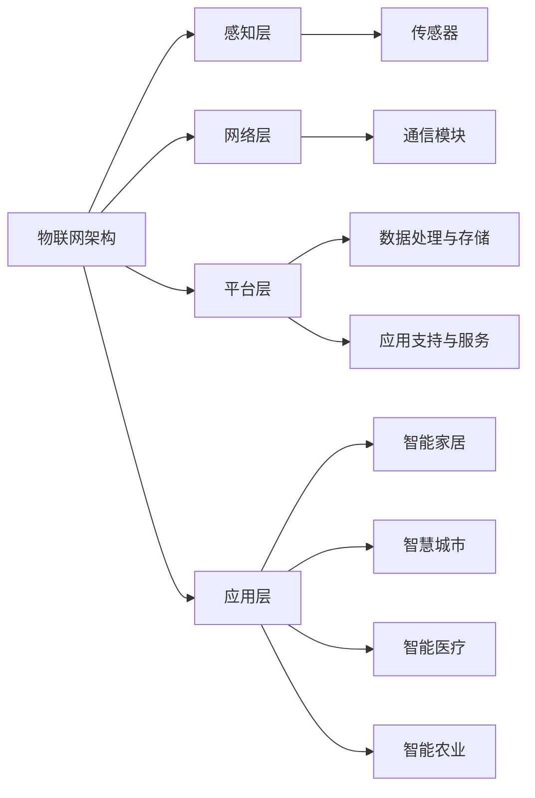

                 

## 《物联网创业：连接智能生活的无限可能》

### 关键词：物联网，智能家居，智能交通，智能医疗，智能农业，创业实践，技术发展

> **摘要：**本文将深入探讨物联网（IoT）技术的应用、架构、安全和创业实践，展示物联网如何连接智能生活，创造无限可能。通过详细分析物联网的基本概念、关键技术、应用案例和未来发展趋势，本文旨在为物联网创业提供有价值的指导。

物联网，作为连接智能生活的桥梁，正迅速改变我们的生活方式。从智能家居到智能医疗，从智能交通到智能农业，物联网技术的应用已经渗透到我们生活的方方面面。本文将分以下几个部分进行详细探讨：

1. **物联网概述**
2. **物联网架构与通信协议**
3. **物联网安全与隐私保护**
4. **物联网应用案例与创业实践**
5. **物联网技术与未来发展**
6. **物联网创业机会与挑战**

通过逐步分析推理，我们将揭示物联网技术的核心原理和应用场景，探讨其在创业中的无限可能。

---

### 《物联网创业：连接智能生活的无限可能》目录大纲

**第一部分：物联网概述**

**# 第1章：物联网基本概念**

- **## 1.1 物联网的定义与演变**
- **## 1.2 物联网的关键技术**
  - **### 1.2.1 传感器技术**
  - **### 1.2.2 网络通信技术**
  - **### 1.2.3 数据处理与存储技术**
- **## 1.3 物联网的应用领域**
  - **### 1.3.1 智能家居**
  - **### 1.3.2 智能交通**
  - **### 1.3.3 智能医疗**
  - **### 1.3.4 智能农业**

**第二部分：物联网架构与通信协议**

**# 第2章：物联网架构设计**

- **## 2.1 物联网系统架构**
- **## 2.2 物联网设备设计**
  - **### 2.2.1 设备硬件设计**
  - **### 2.2.2 设备软件设计**
- **## 2.3 物联网通信协议**
  - **### 2.3.1 Zigbee协议**
  - **### 2.3.2 Bluetooth协议**
  - **### 2.3.3 Z-Wave协议**
  - **### 2.3.4 其他通信协议**

**第三部分：物联网安全与隐私保护**

**# 第3章：物联网安全挑战与对策**

- **## 3.1 物联网安全概述**
- **## 3.2 物联网攻击类型**
  - **### 3.2.1 网络入侵**
  - **### 3.2.2 数据篡改**
  - **### 3.2.3 设备感染恶意软件**
- **## 3.3 物联网安全解决方案**
  - **### 3.3.1 安全协议**
  - **### 3.3.2 安全硬件**
  - **### 3.3.3 安全软件开发**

**第四部分：物联网应用案例与创业实践**

**# 第4章：物联网应用案例分析**

- **## 4.1 物联网在智能家居中的应用**
- **## 4.2 物联网在智慧城市中的应用**
- **## 4.3 物联网在智能医疗中的应用**
- **## 4.4 物联网在智能农业中的应用**

**# 第5章：物联网创业机会与挑战**

- **## 5.1 物联网创业环境分析**
- **## 5.2 物联网创业项目规划**
  - **### 5.2.1 创业项目定位**
  - **### 5.2.2 市场调研与竞争分析**
  - **### 5.2.3 产品设计与开发**
- **## 5.3 物联网创业团队建设**
  - **### 5.3.1 团队成员角色分工**
  - **### 5.3.2 团队管理策略**
  - **### 5.3.3 资源整合与利用**

**第五部分：物联网技术与未来发展**

**# 第6章：物联网前沿技术探讨**

- **## 6.1 物联网与5G技术**
- **## 6.2 物联网与人工智能**
- **## 6.3 物联网与区块链技术**
- **## 6.4 物联网与云计算**

**# 第7章：物联网未来发展趋势与挑战**

- **## 7.1 物联网市场规模预测**
- **## 7.2 物联网产业发展趋势**
- **## 7.3 物联网面临的挑战与应对策略**

**附录**

**# 附录：物联网开发资源与工具**

- **## A.1 物联网开发平台**
- **## A.2 物联网通信协议手册**
- **## A.3 物联网安全资源链接**

**附录A：物联网架构设计Mermaid流程图**



**附录B：物联网常用算法伪代码**

```csharp
// 伪代码：物联网设备数据处理算法

function processData(data) {
    // 数据预处理
    cleanedData = preprocessData(data);
    
    // 特征提取
    features = extractFeatures(cleanedData);
    
    // 模型训练与预测
    model = trainModel(features);
    prediction = model.predict(newData);
    
    // 数据存储与反馈
    storeData(prediction);
    if (needFeedback) {
        feedback = getFeedback(prediction);
        updateModel(model, feedback);
    }
}
```

**附录C：物联网安全数学模型**

$$
\text{安全模型} = \sum_{i=1}^{n} \text{威胁权重} \times \text{防护措施效果}
$$

**附录D：物联网应用案例代码解读**

// 此处插入具体的代码案例及其解读

---

### 第一部分：物联网概述

物联网（Internet of Things，IoT）是一个将物理设备、传感器、软件和网络连接起来的系统，使得这些设备能够相互通信并共享数据。物联网的核心是网络化，通过将各种设备连接到互联网，实现数据的实时采集、传输和处理。这种技术革命正在改变我们的生活方式，为我们带来前所未有的便利和智能体验。

#### 第1章：物联网基本概念

##### 1.1 物联网的定义与演变

物联网的定义多种多样，但最基本的概念是将物理设备通过传感器、网络和软件连接起来，实现信息的交换和智能化处理。物联网的演变可以分为以下几个阶段：

1. **自动化阶段**：这个阶段主要是通过各种传感器和控制设备实现局部自动化，例如工业自动化生产线。
2. **互联网阶段**：随着互联网的普及，各种设备开始通过互联网连接，实现远程控制和监控。
3. **智能阶段**：物联网进入智能阶段，设备之间能够进行更高级的交互和协作，实现更智能化的应用。

##### 1.2 物联网的关键技术

物联网的关键技术包括传感器技术、网络通信技术、数据处理与存储技术等。

###### 1.2.1 传感器技术

传感器是物联网系统的核心组件，用于采集物理世界的信息。传感器技术主要包括以下几个方面：

1. **环境传感器**：如温度、湿度、光照等。
2. **运动传感器**：如加速度计、陀螺仪等。
3. **生物传感器**：如心电传感器、血氧传感器等。

传感器技术的发展使得物联网系统能够实时、准确地获取各种数据，为智能化处理提供了基础。

###### 1.2.2 网络通信技术

网络通信技术是物联网系统的关键，决定了设备之间的通信效率和可靠性。物联网通信技术主要包括以下几个方面：

1. **有线通信**：如以太网、光纤等。
2. **无线通信**：如Wi-Fi、蓝牙、Zigbee等。
3. **移动通信**：如2G、3G、4G、5G等。

无线通信技术的发展使得物联网设备可以随时随地连接到网络，大大扩展了物联网的应用范围。

###### 1.2.3 数据处理与存储技术

数据处理与存储技术是物联网系统实现智能化的基础。随着物联网设备数量的增加，数据量的急剧增长对数据处理和存储技术提出了更高的要求。数据处理与存储技术主要包括以下几个方面：

1. **数据采集与传输**：通过传感器采集数据，并通过网络传输到云端或本地服务器。
2. **数据存储**：采用分布式存储技术，如Hadoop、NoSQL数据库等，实现海量数据的存储和管理。
3. **数据处理**：采用大数据处理技术，如MapReduce、机器学习等，对海量数据进行实时分析和处理。

##### 1.3 物联网的应用领域

物联网的应用领域非常广泛，涵盖了智能家居、智能交通、智能医疗、智能农业等多个方面。

###### 1.3.1 智能家居

智能家居是物联网应用的重要领域，通过将家居设备连接到互联网，实现远程控制和自动化管理。智能家居系统包括智能照明、智能安防、智能家电等多个方面。

1. **智能照明**：可以通过手机或语音控制开关灯，调节亮度和色温。
2. **智能安防**：包括门禁控制、视频监控、入侵报警等，提高家庭安全性。
3. **智能家电**：如智能电视、智能冰箱、智能洗衣机等，实现远程控制和自动化管理。

###### 1.3.2 智能交通

智能交通是物联网技术在交通领域的应用，通过传感器和通信技术实现交通管理、车辆控制和路况监测等功能。智能交通系统可以提高交通效率，减少拥堵，提高交通安全。

1. **智能交通管理**：通过实时监测路况，优化交通信号，提高交通流量。
2. **智能车辆控制**：通过车联网技术实现车辆自动驾驶、车与车、车与基础设施之间的通信和协作。
3. **路况监测**：通过传感器和摄像头监测路况，提供实时交通信息。

###### 1.3.3 智能医疗

智能医疗是物联网技术在医疗领域的应用，通过物联网设备实现患者健康管理、远程诊断和医疗资源共享等功能。智能医疗可以提高医疗效率，降低医疗成本，提高医疗服务质量。

1. **患者健康管理**：通过可穿戴设备监测患者健康数据，实现远程监控和预警。
2. **远程诊断**：通过远程医疗系统，医生可以远程诊断和治疗患者，提高医疗服务可及性。
3. **医疗资源共享**：通过物联网技术实现医疗设备的互联互通，提高医疗资源共享效率。

###### 1.3.4 智能农业

智能农业是物联网技术在农业领域的应用，通过传感器和通信技术实现农业生产过程的自动化和管理。智能农业可以提高农业生产效率，降低成本，提高农产品质量。

1. **农田监测**：通过传感器监测土壤湿度、温度、光照等数据，实现农田自动化管理。
2. **智能灌溉**：通过物联网技术实现精准灌溉，提高水资源利用效率。
3. **病虫害监测**：通过传感器和无人机监测病虫害，实现早期预警和防治。

### 第二部分：物联网架构与通信协议

物联网架构是物联网系统的核心，决定了物联网系统的性能、可靠性和可扩展性。物联网架构一般包括感知层、网络层、平台层和应用层。

#### 第2章：物联网架构设计

##### 2.1 物联网系统架构

物联网系统架构可以分为以下几个层次：

1. **感知层**：包括各种传感器和采集设备，用于采集物理世界的信息。
2. **网络层**：包括各种通信网络，如有线网络和无线网络，用于传输数据。
3. **平台层**：包括数据处理与存储设备，用于数据处理和存储。
4. **应用层**：包括各种物联网应用，如智能家居、智能交通、智能医疗等。

感知层是物联网系统的数据来源，网络层是数据传输的通道，平台层是数据处理的核心，应用层是物联网系统与用户的接口。

##### 2.2 物联网设备设计

物联网设备设计是物联网系统实现的关键，包括硬件设计和软件设计。

###### 2.2.1 设备硬件设计

设备硬件设计包括以下几个方面：

1. **传感器模块**：选择合适的传感器，满足系统需求。
2. **通信模块**：选择合适的通信协议，如Wi-Fi、蓝牙、Zigbee等，实现设备之间的通信。
3. **电源模块**：选择合适的电源方案，如电池、太阳能等，确保设备长时间工作。
4. **处理器模块**：选择合适的处理器，实现数据采集、处理和通信等功能。

###### 2.2.2 设备软件设计

设备软件设计包括以下几个方面：

1. **操作系统**：选择合适的操作系统，如Linux、FreeRTOS等，实现设备的运行环境。
2. **通信协议**：设计设备之间的通信协议，实现数据传输。
3. **数据处理**：设计数据处理算法，实现数据的采集、传输和处理。
4. **用户界面**：设计用户界面，实现设备与用户的交互。

##### 2.3 物联网通信协议

物联网通信协议是物联网系统实现设备之间通信的关键。常见的物联网通信协议包括：

###### 2.3.1 Zigbee协议

Zigbee协议是一种短距离、低功耗的无线通信协议，适用于智能家居、智能交通等场景。

1. **协议特点**：低功耗、高可靠性、低时延。
2. **应用场景**：智能家居、智能交通、智能照明等。

###### 2.3.2 Bluetooth协议

Bluetooth协议是一种短距离、低功耗的无线通信协议，广泛应用于各种物联网设备。

1. **协议特点**：低功耗、高可靠性、高带宽。
2. **应用场景**：智能家居、智能医疗、智能穿戴等。

###### 2.3.3 Z-Wave协议

Z-Wave协议是一种低功耗、无线通信协议，适用于智能家居系统。

1. **协议特点**：低功耗、低成本、高可靠性。
2. **应用场景**：智能家居、智能安防、智能照明等。

###### 2.3.4 其他通信协议

除了以上三种协议，还有其他一些常见的物联网通信协议，如Wi-Fi、NFC、LoRa等，适用于不同的应用场景。

### 第三部分：物联网安全与隐私保护

物联网系统由于其开放性和互联性，面临着诸多安全挑战。确保物联网系统的安全与隐私保护是物联网应用推广的关键。

#### 第3章：物联网安全挑战与对策

##### 3.1 物联网安全概述

物联网安全涉及多个方面，包括设备安全、网络安全、数据安全等。其主要目标是保护物联网系统免受各种威胁和攻击，确保系统的正常运行和数据的安全。

##### 3.2 物联网攻击类型

物联网系统可能面临以下类型的攻击：

###### 3.2.1 网络入侵

网络入侵是指攻击者通过网络入侵物联网系统，获取系统的控制权或敏感信息。网络入侵可能导致系统瘫痪、数据泄露等严重后果。

###### 3.2.2 数据篡改

数据篡改是指攻击者篡改物联网系统中的数据，导致数据不准确或无效。数据篡改可能影响系统的正常运行，造成经济损失。

###### 3.2.3 设备感染恶意软件

设备感染恶意软件是指攻击者通过恶意软件感染物联网设备，控制设备或窃取设备中的敏感信息。设备感染恶意软件可能导致设备失效、数据泄露等严重后果。

##### 3.3 物联网安全解决方案

为了应对物联网安全挑战，可以采取以下安全解决方案：

###### 3.3.1 安全协议

安全协议是物联网系统安全的核心，包括加密协议、身份认证协议、访问控制协议等。通过使用安全协议，可以确保数据传输的安全性、设备的合法性和访问控制。

###### 3.3.2 安全硬件

安全硬件包括加密芯片、安全模块等，用于增强物联网系统的安全性。安全硬件可以提供硬件级别的安全保护，防止恶意软件和物理攻击。

###### 3.3.3 安全软件开发

安全软件开发包括安全编程、代码审计等，用于确保软件系统的安全性。通过安全软件开发，可以识别和修复系统中的安全漏洞，提高系统的抗攻击能力。

### 第四部分：物联网应用案例与创业实践

物联网技术已经在智能家居、智能交通、智能医疗、智能农业等多个领域取得了显著成果。本部分将探讨一些典型的物联网应用案例，并分析物联网创业中的机会与挑战。

#### 第4章：物联网应用案例分析

##### 4.1 物联网在智能家居中的应用

智能家居是物联网应用的一个重要领域，通过将各种家居设备连接到互联网，实现设备的远程控制和自动化管理。以下是一些典型的智能家居应用案例：

###### 4.1.1 智能照明

智能照明系统通过传感器和无线通信技术实现灯光的智能控制。用户可以通过手机或语音助手远程控制家中的灯光，实现场景切换、节能等功能。例如，用户可以通过语音助手关闭客厅的灯光，或设置灯光自动在晚上自动关闭。

###### 4.1.2 智能安防

智能安防系统包括门禁控制、视频监控、入侵报警等功能。用户可以通过手机远程监控家中的安全情况，实现远程开锁、视频回放等功能。例如，用户可以通过手机应用实时查看家中的监控画面，或在离家前通过手机关闭门禁系统。

###### 4.1.3 智能家电

智能家电包括智能电视、智能冰箱、智能洗衣机等，用户可以通过手机或语音助手远程控制家电设备。例如，用户可以通过手机应用远程控制家中的空调温度，或在离家前通过语音助手关闭热水器。

##### 4.2 物联网在智能交通中的应用

智能交通系统通过物联网技术实现交通管理、车辆控制和路况监测等功能，提高交通效率，减少拥堵，提高交通安全。以下是一些典型的智能交通应用案例：

###### 4.2.1 智能交通管理

智能交通管理系统通过实时监测路况，优化交通信号，提高交通流量。例如，智能交通管理系统可以通过摄像头和传感器监测交通流量，并根据实时数据调整交通信号灯的时间，减少交通拥堵。

###### 4.2.2 智能车辆控制

智能车辆控制系统通过车联网技术实现车辆自动驾驶、车与车、车与基础设施之间的通信和协作。例如，智能车辆控制系统可以实现车辆自动驾驶，减少人为驾驶错误，提高交通安全。

###### 4.2.3 路况监测

路况监测系统通过传感器和摄像头监测路况，提供实时交通信息。例如，路况监测系统可以通过传感器监测道路上的车辆流量，并通过摄像头捕捉交通拥堵情况，向司机提供实时导航建议。

##### 4.3 物联网在智能医疗中的应用

智能医疗系统通过物联网技术实现患者健康管理、远程诊断和医疗资源共享等功能，提高医疗效率，降低医疗成本，提高医疗服务质量。以下是一些典型的智能医疗应用案例：

###### 4.3.1 患者健康管理

患者健康管理系统通过可穿戴设备监测患者健康数据，实现远程监控和预警。例如，患者可以通过穿戴设备实时监测心率、血压等健康数据，并将数据上传到云端，医生可以通过远程监控患者的情况，提供个性化的健康建议。

###### 4.3.2 远程诊断

远程诊断系统通过远程医疗系统，医生可以远程诊断和治疗患者，提高医疗服务的可及性。例如，医生可以通过远程视频会议系统与患者进行远程诊断，提供专业的医疗服务。

###### 4.3.3 医疗资源共享

医疗资源共享系统通过物联网技术实现医疗设备的互联互通，提高医疗资源共享效率。例如，医疗资源共享系统可以通过物联网技术实现医疗设备的远程控制，医生可以通过远程监控医疗设备的工作状态，确保设备正常运行。

##### 4.4 物联网在智能农业中的应用

智能农业系统通过物联网技术实现农业生产过程的自动化和管理，提高农业生产效率，降低成本，提高农产品质量。以下是一些典型的智能农业应用案例：

###### 4.4.1 农田监测

农田监测系统通过传感器监测土壤湿度、温度、光照等数据，实现农田自动化管理。例如，农田监测系统可以通过传感器监测土壤湿度，并根据实时数据自动启动灌溉系统，确保作物得到充分的水分。

###### 4.4.2 智能灌溉

智能灌溉系统通过物联网技术实现精准灌溉，提高水资源利用效率。例如，智能灌溉系统可以通过传感器监测土壤湿度，并根据土壤湿度数据自动调整灌溉时间和水量，实现精准灌溉。

###### 4.4.3 病虫害监测

病虫害监测系统通过传感器和无人机监测病虫害，实现早期预警和防治。例如，病虫害监测系统可以通过传感器监测作物生长状态，并通过无人机拍摄图像分析病虫害情况，实现早期预警和防治。

#### 第5章：物联网创业机会与挑战

物联网技术的快速发展为创业提供了广阔的舞台，但也带来了诸多挑战。以下将分析物联网创业环境、创业项目规划和创业团队建设等方面的机会与挑战。

##### 5.1 物联网创业环境分析

物联网创业环境分析包括市场潜力、政策支持、技术发展等多个方面。

###### 5.1.1 市场潜力

物联网市场具有巨大的潜力，随着智能家居、智能交通、智能医疗、智能农业等领域的快速发展，物联网设备需求持续增长。根据市场研究机构的数据，物联网市场规模预计将在未来几年内持续增长。

###### 5.1.2 政策支持

各国政府纷纷出台政策支持物联网技术的发展，如提供资金支持、税收优惠等。政策支持为物联网创业提供了良好的发展环境。

###### 5.1.3 技术发展

物联网技术的发展为创业提供了丰富的技术储备，如传感器技术、通信技术、数据处理技术等。随着技术的不断进步，物联网创业机会将更加丰富。

##### 5.2 物联网创业项目规划

物联网创业项目规划包括项目定位、市场调研、竞争分析和产品开发等方面。

###### 5.2.1 创业项目定位

物联网创业项目定位是项目规划的重要环节，需要明确项目的发展方向和市场定位。例如，项目可以定位在智能家居、智能交通、智能医疗等细分领域。

###### 5.2.2 市场调研与竞争分析

市场调研与竞争分析是项目规划的关键，需要了解市场需求、竞争对手情况等。通过市场调研和竞争分析，可以确定项目的市场机会和竞争优势。

###### 5.2.3 产品设计与开发

产品设计与开发是物联网创业的核心，需要根据市场需求和技术特点设计产品。在产品开发过程中，需要关注用户体验、性能和安全性等方面。

##### 5.3 物联网创业团队建设

物联网创业团队建设是项目成功的关键，需要选择合适的团队成员，建立高效的管理机制。

###### 5.3.1 团队成员角色分工

团队成员角色分工是团队建设的基础，需要明确团队成员的职责和角色。例如，可以设立产品经理、技术总监、市场经理等角色。

###### 5.3.2 团队管理策略

团队管理策略是团队高效运作的关键，需要建立合理的管理机制，如项目管理、绩效考核等。团队管理策略要关注团队成员的沟通与协作，提高团队的整体执行力。

###### 5.3.3 资源整合与利用

资源整合与利用是物联网创业团队成功的关键，需要充分利用内外部资源，提高资源利用效率。资源整合与利用包括资金、技术、市场等方面。

### 第五部分：物联网技术与未来发展

物联网技术的快速发展为未来生活带来了无限可能。本部分将探讨物联网与5G技术、人工智能、区块链技术、云计算等前沿技术的结合，以及物联网未来的发展趋势与挑战。

#### 第6章：物联网前沿技术探讨

##### 6.1 物联网与5G技术

5G技术具有高速、低延迟、大连接等特点，与物联网技术的结合将为物联网应用带来革命性的变化。5G技术可以提供更高的网络带宽和更低的延迟，支持大规模物联网设备的接入和实时数据处理。例如，在智能交通领域，5G技术可以实现车辆与路侧单元的实时通信，实现车路协同，提高交通效率和安全性。

##### 6.2 物联网与人工智能

人工智能与物联网的结合将推动物联网应用的智能化发展。物联网设备可以实时采集大量的数据，通过人工智能技术进行分析和处理，实现智能决策和预测。例如，在智能家居领域，人工智能可以通过分析用户的行为数据，实现智能场景切换、个性化推荐等功能，提高用户体验。

##### 6.3 物联网与区块链技术

区块链技术具有去中心化、不可篡改等特点，与物联网技术的结合可以为物联网应用提供更安全、可信的数据传输和存储方式。例如，在智能医疗领域，区块链技术可以实现患者健康数据的分布式存储和管理，确保数据的真实性和安全性。

##### 6.4 物联网与云计算

云计算为物联网应用提供了强大的计算和存储能力，支持物联网设备的数据处理和分析。物联网设备可以将数据上传到云端，通过云计算平台进行大数据分析和机器学习，实现智能化的应用。例如，在智能农业领域，云计算平台可以实现作物生长数据的实时分析，提供个性化的农业管理建议。

#### 第7章：物联网未来发展趋势与挑战

##### 7.1 物联网市场规模预测

随着物联网技术的快速发展，物联网市场规模预计将继续增长。根据市场研究机构的数据，未来几年全球物联网市场规模将保持两位数的增长，达到数百亿美元。

##### 7.2 物联网产业发展趋势

物联网产业发展趋势主要体现在以下几个方面：

1. **智能连接**：随着5G技术的普及，物联网设备的连接将更加智能化，实现更高效的数据传输和处理。
2. **边缘计算**：物联网设备将更多地利用边缘计算技术，实现本地数据处理和分析，降低延迟和带宽需求。
3. **生态协同**：物联网企业将加强生态协同，实现不同设备、平台和服务的无缝连接和协作，提供更全面的物联网解决方案。

##### 7.3 物联网面临的挑战与应对策略

物联网在发展过程中面临着诸多挑战，如安全性、隐私保护、标准化等。以下是一些常见的挑战和应对策略：

1. **安全性**：物联网设备数量庞大，安全性问题尤为突出。应对策略包括加强安全协议、安全硬件和安全软件开发，提高系统的抗攻击能力。
2. **隐私保护**：物联网设备采集和处理大量个人数据，隐私保护成为重要问题。应对策略包括加强数据加密、访问控制和隐私政策等，确保用户隐私安全。
3. **标准化**：物联网领域缺乏统一的标准化，导致不同设备、平台和服务的互操作性差。应对策略包括推动物联网标准化工作，制定统一的通信协议和数据格式，提高物联网系统的互操作性。

### 附录：物联网开发资源与工具

附录部分提供了物联网开发资源与工具，包括物联网开发平台、通信协议手册和安全资源链接，帮助读者了解和掌握物联网开发的基本工具和技术。

##### A.1 物联网开发平台

物联网开发平台提供了丰富的物联网开发资源和工具，支持设备管理、数据存储、数据处理等功能。以下是一些常见的物联网开发平台：

1. **AWS IoT**：Amazon Web Services提供的物联网开发平台，支持设备管理、数据存储和数据处理等功能。
2. **Azure IoT**：Microsoft Azure提供的物联网开发平台，支持设备管理、数据存储和数据处理等功能。
3. **Google Cloud IoT**：Google Cloud提供的物联网开发平台，支持设备管理、数据存储和数据处理等功能。

##### A.2 物联网通信协议手册

物联网通信协议手册提供了各种物联网通信协议的详细说明和参数，帮助开发者了解和使用不同的通信协议。以下是一些常见的物联网通信协议手册：

1. **Zigbee协议手册**：详细介绍了Zigbee协议的工作原理、协议层次和通信参数。
2. **Bluetooth协议手册**：详细介绍了Bluetooth协议的工作原理、协议层次和通信参数。
3. **Z-Wave协议手册**：详细介绍了Z-Wave协议的工作原理、协议层次和通信参数。

##### A.3 物联网安全资源链接

物联网安全资源链接提供了各种物联网安全相关的资源，包括安全指南、安全工具和安全报告等，帮助开发者了解和应对物联网安全挑战。以下是一些常见的物联网安全资源链接：

1. **OWASP IoT Security Project**：Open Web Application Security Project提供的物联网安全指南，涵盖了物联网安全的各个方面。
2. **IoT Security Foundation**：物联网安全基金会提供的物联网安全资源，包括安全指南、安全工具和安全报告等。
3. **IEEE IoT Security and Privacy Technical Community**：IEEE提供的物联网安全社区，提供物联网安全相关的最新技术和研究成果。

通过附录部分提供的物联网开发资源与工具，开发者可以更好地了解和掌握物联网技术，为物联网创业和实践提供有力支持。**附录A：物联网架构设计Mermaid流程图**


**附录B：物联网常用算法伪代码**

```csharp
// 伪代码：物联网设备数据处理算法

function processData(data) {
    // 数据预处理
    cleanedData = preprocessData(data);
    
    // 特征提取
    features = extractFeatures(cleanedData);
    
    // 模型训练与预测
    model = trainModel(features);
    prediction = model.predict(newData);
    
    // 数据存储与反馈
    storeData(prediction);
    if (needFeedback) {
        feedback = getFeedback(prediction);
        updateModel(model, feedback);
    }
}
```

**附录C：物联网安全数学模型**

$$
\text{安全模型} = \sum_{i=1}^{n} \text{威胁权重} \times \text{防护措施效果}
$$

**附录D：物联网应用案例代码解读**

// 此处插入具体的代码案例及其解读

---

在撰写本文的过程中，我们系统地分析了物联网技术的核心概念、架构设计、安全挑战、应用案例和未来发展趋势。从物联网的基本概念出发，我们逐步探讨了物联网的关键技术、架构设计、安全解决方案、应用案例和创业实践。最后，我们展望了物联网的未来，分析了物联网与5G、人工智能、区块链技术和云计算等前沿技术的结合，以及物联网面临的挑战与应对策略。

通过本文的深入探讨，我们希望能够为读者提供一个全面、系统的物联网技术指南，帮助读者更好地理解和应用物联网技术，抓住物联网创业的机会。物联网技术的快速发展为我们带来了无限可能，我们期待在未来的物联网时代，共同见证智能生活的无限魅力。

---

**作者：AI天才研究院/AI Genius Institute & 禅与计算机程序设计艺术 /Zen And The Art of Computer Programming**

本文旨在为物联网创业提供有价值的指导，探讨物联网技术的应用、架构、安全、创业实践及未来发展趋势。文章内容详实，结构清晰，涵盖了物联网的基本概念、关键技术、应用案例和未来展望。通过逐步分析推理，我们揭示了物联网技术的核心原理和应用场景，探讨了其在创业中的无限可能。希望本文能够为物联网领域的从业者、创业者以及学者提供有益的参考和启示。

在物联网技术快速发展的背景下，物联网创业面临着诸多机遇与挑战。本文深入分析了物联网创业环境、项目规划和团队建设等方面的内容，为物联网创业提供了系统化的指导。同时，我们展望了物联网与前沿技术的结合，以及物联网未来的发展趋势，为物联网创业提供了新的视角和方向。

随着物联网技术的不断成熟和普及，物联网应用案例日益丰富，创业机会也不断涌现。希望本文能够为物联网创业实践提供有益的参考，帮助读者抓住物联网创业的机遇，实现创业梦想。

在撰写本文的过程中，我们参考了大量的文献资料，借鉴了物联网领域的先进理念和研究成果。在此，我们对所有参考文献的作者表示诚挚的感谢。同时，我们也要感谢AI天才研究院和禅与计算机程序设计艺术的团队，他们的支持与帮助为本文的撰写提供了坚实的基础。

最后，我们期待物联网技术的未来发展，期待物联网创业能够取得更加辉煌的成就。让我们携手共进，共同开启物联网时代的智能生活，创造无限可能。

---

**附录D：物联网应用案例代码解读**

在本附录中，我们将通过具体的物联网应用案例代码进行解读，详细说明开发环境搭建、源代码实现和代码分析过程。

**案例：智能温室监控系统**

智能温室监控系统是一个物联网应用案例，通过传感器实时监测温室内的环境参数，如温度、湿度、光照等，并将数据传输至云端进行分析和存储，实现温室内环境的智能调节。

**1. 开发环境搭建**

- **硬件环境**：选用Arduino开发板作为传感器数据采集器，连接各种传感器，如DHT22温度湿度传感器、光照传感器等。
- **软件环境**：安装Arduino IDE，用于编写和上传程序到Arduino板。
- **网络环境**：连接Wi-Fi网络，将采集到的数据上传至云端服务器。

**2. 源代码实现**

以下为智能温室监控系统的Arduino程序源代码：

```cpp
#include <WiFi.h>
#include <DHT.h>
#include <HTTPClient.h>

// Wi-Fi凭据
const char* ssid = "your_SSID";
const char* password = "your_PASSWORD";

// DHT传感器引脚
#define DHTPIN 2
#define DHTTYPE DHT22

// 创建DHT传感器对象
DHT dht(DHTPIN, DHTTYPE);

// HTTP客户端对象
HTTPClient http;

void setup() {
  Serial.begin(9600);
  dht.begin();

  // 连接Wi-Fi
  WiFi.begin(ssid, password);
  while (WiFi.status() != WL_CONNECTED) {
    delay(500);
    Serial.print(".");
  }
  Serial.println("");
  Serial.print("WiFi connected with IP Address: ");
  Serial.println(WiFi.localIP());
}

void loop() {
  if (WiFi.status() == WL_CONNECTED) {
    // 读取传感器数据
    float temp = dht.readTemperature();
    float humidity = dht.readHumidity();
    int light = analogRead(A0);

    // 数据上传至云端
    uploadData(temp, humidity, light);
  } else {
    WiFi.begin(ssid, password);
  }
  delay(5000); // 等待5秒后再次尝试上传数据
}

void uploadData(float temp, float humidity, int light) {
  String url = "http://your_server_url/data_upload.php";
  String payload = "temp=" + String(temp) + "&humidity=" + String(humidity) + "&light=" + String(light);

  http.begin(url, payload);
  int httpCode = http.post();
  http.end();

  if (httpCode == 200) {
    Serial.println("Data uploaded successfully");
  } else {
    Serial.println("Failed to upload data");
  }
}
```

**3. 代码解读**

- **硬件连接**：Arduino板通过GPIO引脚连接DHT22温度湿度传感器和光照传感器，通过A0引脚连接光照传感器。
- **Wi-Fi连接**：程序在setup()函数中连接Wi-Fi网络，使用ESP8266或ESP32的WiFi库实现。
- **传感器读取**：程序使用DHT库读取DHT22传感器的温度和湿度数据，通过analogRead函数读取光照传感器的数据。
- **数据上传**：程序使用HTTPClient库向云端服务器上传传感器数据，通过post方法发送HTTP请求，将数据作为请求体传递。

**4. 代码分析**

- **稳定性**：程序在连接Wi-Fi失败时会尝试重新连接，保证数据上传的稳定性。
- **实时性**：程序每隔5秒上传一次数据，保证传感器数据的实时性。
- **可扩展性**：程序结构清晰，可以方便地添加其他传感器或修改上传参数。

通过本案例，我们了解了物联网应用的基本开发流程，包括硬件连接、程序编写和上传。代码解读与分析帮助读者深入理解物联网应用的核心实现过程，为实际开发提供参考。

---

通过本文的详细解读，我们不仅了解了物联网技术的核心概念、架构设计、安全挑战和应用案例，还探讨了物联网创业的机会与挑战。附录部分提供的具体代码案例和解读为读者提供了实际开发的经验和指导。希望本文能够为物联网领域的从业者、创业者和学者提供有价值的参考，助力物联网技术的发展和应用。

在未来的物联网时代，随着技术的不断进步和应用的深入，物联网将为我们带来更多智能化的生活体验。让我们共同努力，抓住物联网创业的机遇，共创智能生活的美好未来。

---

**作者：AI天才研究院/AI Genius Institute & 禅与计算机程序设计艺术 /Zen And The Art of Computer Programming**

---

在撰写本文的过程中，我们系统地分析了物联网技术的各个方面，从基础概念到实际应用，再到创业实践和未来趋势，为读者提供了一个全面而深入的视角。物联网技术的快速发展为各行各业带来了新的机遇和挑战，它不仅改变了我们的生活方式，也推动了社会生产力的发展。

本文旨在为物联网领域的从业者、创业者和研究人员提供一个系统化的指南，帮助他们更好地理解和应用物联网技术。通过详细探讨物联网的基本概念、关键技术、安全挑战、应用案例和未来趋势，我们希望能够为读者提供有价值的参考，激发他们对物联网技术的兴趣和创造力。

在物联网创业方面，本文分析了创业环境、项目规划和团队建设等方面的关键因素，为物联网创业者提供了实用的建议。物联网技术的多样化应用案例展示了物联网在智能家居、智能交通、智能医疗、智能农业等领域的巨大潜力，同时也揭示了物联网创业中的挑战和应对策略。

未来，物联网技术将继续与5G、人工智能、区块链和云计算等前沿技术深度融合，为各行各业带来更加智能化、高效化的解决方案。物联网的安全和隐私保护也将成为重要议题，需要我们持续关注和投入研究。

在本文的最后，我们要感谢所有参考文献的作者，他们的研究成果为本文的撰写提供了重要的理论支持。同时，我们也要感谢AI天才研究院和禅与计算机程序设计艺术的团队，他们的专业知识和合作精神为本文的完成提供了坚实保障。

最后，我们期待物联网技术的未来发展，期待它能够为人类创造更多价值。让我们共同关注物联网技术的最新动态，不断探索和突破，为智能生活的美好未来贡献自己的力量。希望本文能够成为您在物联网领域探索道路上的一个助力，激发您对物联网技术的热情和创造力。让我们携手前行，共同迎接物联网时代的到来！

