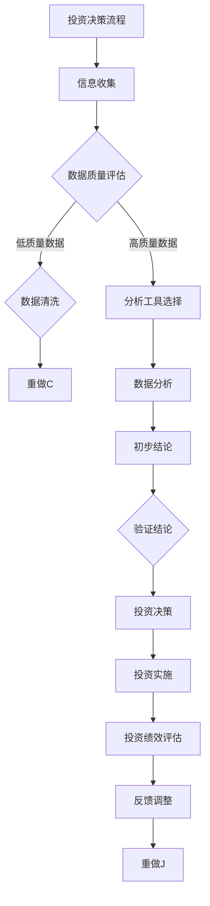

                 

# 理解洞察力的应用：在投资领域的实践

## 关键词
- 洞察力
- 投资决策
- 行为经济学
- 心理学
- 技术分析
- 基本面分析
- 投资组合管理

## 摘要
本文旨在探讨洞察力在投资领域的应用。通过详细的理论讲解、实战案例分析以及实战训练，本文全面阐述了洞察力在投资决策中的重要性。文章首先介绍了洞察力的概念与意义，探讨了其在心理学和行为经济学中的基础。接着，本文深入分析了洞察力在基本面分析、技术分析和投资组合管理中的应用，并通过具体的投资决策流程和数学模型，帮助读者理解如何在实际操作中运用洞察力。最后，本文通过实战案例和洞察力训练方法，提供了实际操作的指导，帮助读者提升投资绩效。本文的目标是为投资者提供实用的洞察力应用策略，以在竞争激烈的投资市场中取得成功。

### 目录大纲

#### 第一部分：洞察力基础

##### 第1章：洞察力的概念与意义
- 1.1 洞察力的定义与特征
- 1.2 洞察力在投资领域的价值
- 1.3 洞察力的培养方法

##### 第2章：洞察力的心理学基础
- 2.1 心理学对洞察力的解释
- 2.2 情绪对洞察力的影响
- 2.3 认知偏见与洞察力

##### 第3章：洞察力的行为经济学基础
- 3.1 行为经济学概述
- 3.2 行为经济学与投资决策
- 3.3 行为经济学对洞察力的影响

#### 第二部分：洞察力在投资领域的应用

##### 第4章：基本面分析中的洞察力应用
- 4.1 基本面分析概述
- 4.2 公司财务报表分析
- 4.3 行业与市场分析

##### 第5章：技术分析中的洞察力应用
- 5.1 技术分析概述
- 5.2 技术指标分析
- 5.3 图表分析

##### 第6章：投资组合管理中的洞察力应用
- 6.1 投资组合管理概述
- 6.2 风险管理
- 6.3 资产配置策略

##### 第7章：投资决策中的洞察力应用
- 7.1 投资决策过程
- 7.2 决策心理学
- 7.3 决策的优化与反思

#### 第三部分：实战案例分析

##### 第8章：投资大师的洞察力实践
- 8.1 巴菲特的洞察力应用
- 8.2 价值投资与成长投资的洞察力应用
- 8.3 投资大师的洞察力特点分析

##### 第9章：实战投资案例分析
- 9.1 某次成功的投资案例
- 9.2 某次失败的投资案例
- 9.3 投资案例中的洞察力应用分析

##### 第10章：投资洞察力的实战训练
- 10.1 洞察力训练方法
- 10.2 实战训练案例
- 10.3 洞察力训练成果评估

#### 附录

##### 附录A：投资工具与资源推荐
- A.1 数据分析工具推荐
- A.2 投资书籍推荐
- A.3 在线投资课程推荐

##### 附录B：洞察力相关论文与研究报告
- B.1 行为经济学与投资决策研究
- B.2 投资心理学研究
- B.3 洞察力训练与投资绩效关系研究

### 理解洞察力的应用：在投资领域的实践

> “洞察力是一种特殊的智力，它使我们能够看到事物的本质，理解复杂的现实，并预见未来的趋势。”——查尔斯·T·芒格（Charlie T. Munger）

在投资领域，洞察力被视为一种宝贵的技能。它不仅帮助投资者理解市场的动态，还能使他们做出更明智的决策。本文将深入探讨洞察力在投资领域的应用，包括其在基本面分析、技术分析和投资组合管理中的具体应用，并通过案例分析展示其实践价值。

#### 洞察力的概念与意义

##### 1.1 洞察力的定义与特征

洞察力（Insight）是指对复杂问题的深刻理解，能够看到事物的本质和相互之间的关系。它是一种能够快速识别关键信息、发现潜在问题并制定有效解决方案的能力。在投资领域，洞察力表现为对市场趋势的准确判断、对风险的有效识别以及对投资机会的敏锐洞察。

##### 1.2 洞察力在投资领域的价值

洞察力在投资领域的价值不可低估。它帮助投资者：

1. **识别投资机会**：洞察力使投资者能够发现潜在的投资机会，从而在市场波动中捕捉到盈利点。
2. **评估风险**：洞察力有助于投资者识别和管理投资风险，避免因盲目跟风或过度乐观而导致的投资损失。
3. **做出明智决策**：通过洞察力，投资者能够在复杂的投资环境中做出更为明智和理性的决策，从而提高投资的成功率。

##### 1.3 洞察力的培养方法

培养洞察力并非一蹴而就，需要通过持续的学习和实践。以下是一些培养洞察力的方法：

1. **广泛阅读**：阅读财经书籍、投资报告和学术论文，了解不同的投资策略和市场动态。
2. **深入思考**：在阅读和讨论的过程中，不断提问和反思，挖掘问题的深层含义。
3. **实践应用**：将理论知识应用于实际投资，通过实践来检验和提升洞察力。
4. **跨界学习**：学习不同领域的知识，拓宽视野，提高对复杂问题的理解能力。

### 洞察力的心理学基础

##### 2.1 心理学对洞察力的解释

心理学研究表明，洞察力是认知过程的一部分，它涉及到多个认知功能，包括注意力、记忆、感知和推理。以下是几个关键因素：

1. **注意力**：洞察力需要集中注意力，忽略无关信息，关注重要线索。
2. **记忆**：良好的记忆有助于捕捉和存储关键信息，为洞察力的产生提供基础。
3. **感知**：敏锐的感知能力使投资者能够快速识别市场中的潜在信号。
4. **推理**：通过逻辑推理，投资者能够将零散的信息整合起来，形成对市场的整体理解。

##### 2.2 情绪对洞察力的影响

情绪对洞察力有着显著的影响。积极的情绪可以提高洞察力，而消极的情绪则可能削弱它。以下是情绪对洞察力的一些影响：

1. **乐观情绪**：乐观情绪使投资者更加开放和自信，有利于发现新的投资机会。
2. **焦虑情绪**：过度的焦虑可能导致投资者过度反应，忽视重要信息，降低洞察力。
3. **情绪管理**：学会管理情绪，保持冷静和理性，是提高洞察力的关键。

##### 2.3 认知偏见与洞察力

认知偏见（Cognitive Bias）是指人们在决策过程中，由于各种心理因素而产生的系统性错误。这些偏见可能削弱洞察力，导致投资者做出非理性的决策。以下是一些常见的认知偏见：

1. **确认偏见**：倾向于寻找和接受支持自己观点的信息，忽视相反的证据。
2. **代表性偏差**：高估某一特征的代表性和普遍性。
3. **锚定效应**：过度依赖早期信息或初始印象，影响后续决策。
4. **过度自信**：高估自己的能力和知识，导致盲目自信。

### 洞察力的行为经济学基础

##### 3.1 行为经济学概述

行为经济学（Behavioral Economics）是经济学与心理学相结合的学科，研究人们在决策过程中如何受到心理和社会因素的影响。以下是行为经济学的一些核心观点：

1. **心理账户**：人们会根据不同的心理账户进行决策，这些账户反映了人们对金钱的主观评价。
2. **损失厌恶**：人们对损失的厌恶超过对等额收益的喜爱。
3. **有限理性**：人们在决策过程中往往受到认知限制和信息不完整的影响，做出非理性的选择。

##### 3.2 行为经济学与投资决策

行为经济学对投资决策产生了深远的影响。以下是行为经济学在投资决策中的应用：

1. **市场效率**：行为经济学挑战了传统市场效率理论，认为市场并非完全有效，投资者可以利用行为偏差获得超额收益。
2. **情绪管理**：通过理解行为经济学的原理，投资者可以更好地管理自己的情绪，做出更理性的决策。
3. **投资策略**：行为经济学提供了新的投资策略，如情绪中性策略、反行为策略等。

##### 3.3 行为经济学对洞察力的影响

行为经济学对洞察力有着重要的影响。通过理解行为经济学的原理，投资者可以：

1. **识别认知偏见**：意识到自己在决策过程中可能存在的认知偏见，提高洞察力。
2. **改善决策质量**：通过认识和理解行为经济学的原理，投资者可以做出更合理的投资决策。

### 洞察力在基本面分析中的应用

##### 4.1 基本面分析概述

基本面分析（Fundamental Analysis）是一种评估投资对象的基本经济状况和财务状况的方法，旨在判断其未来的价值。基本面分析关注以下因素：

1. **公司财务报表**：包括利润表、资产负债表和现金流量表。
2. **行业分析**：包括行业趋势、竞争环境和市场地位。
3. **宏观经济分析**：包括经济增长、通货膨胀率、利率等。

##### 4.2 公司财务报表分析

公司财务报表是基本面分析的核心。以下是如何运用洞察力进行财务报表分析：

1. **利润表分析**：洞察力帮助投资者理解公司的盈利能力，识别潜在的盈利风险。
2. **资产负债表分析**：洞察力帮助投资者评估公司的财务状况，判断其偿债能力和财务风险。
3. **现金流量表分析**：洞察力帮助投资者了解公司的现金流动情况，预测其未来的现金流。

##### 4.3 行业与市场分析

行业和市场分析是基本面分析的重要组成部分。以下是如何运用洞察力进行行业与市场分析：

1. **行业趋势**：洞察力帮助投资者识别行业的发展趋势和潜在机会。
2. **竞争环境**：洞察力帮助投资者评估行业中的竞争态势，判断公司的市场地位。
3. **宏观经济因素**：洞察力帮助投资者理解宏观经济环境对公司业绩的影响。

### 洞察力在技术分析中的应用

##### 5.1 技术分析概述

技术分析（Technical Analysis）是一种通过研究市场数据来预测未来价格走势的方法。技术分析主要关注以下方面：

1. **价格和成交量**：价格和成交量是技术分析的重要指标。
2. **趋势分析**：通过识别趋势，投资者可以判断未来的价格走势。
3. **图表分析**：图表分析帮助投资者理解市场的动态。

##### 5.2 技术指标分析

技术指标是技术分析中常用的工具。以下是如何运用洞察力分析技术指标：

1. **移动平均线**：洞察力帮助投资者理解移动平均线的意义，判断市场趋势。
2. **相对强弱指数（RSI）**：洞察力帮助投资者理解RSI的计算原理，判断市场的超买或超卖状态。
3. **布林带**：洞察力帮助投资者理解布林带的意义，判断市场的波动性。

##### 5.3 图表分析

图表分析是技术分析的核心。以下是如何运用洞察力进行图表分析：

1. **趋势线**：洞察力帮助投资者识别趋势线，判断市场的长期走势。
2. **支撑和阻力位**：洞察力帮助投资者识别支撑和阻力位，判断市场的反转点。
3. **形态分析**：洞察力帮助投资者识别市场形态，预测未来的价格走势。

### 洞察力在投资组合管理中的应用

##### 6.1 投资组合管理概述

投资组合管理（Portfolio Management）是指投资者通过选择和管理不同的资产，以达到风险和收益平衡的过程。以下是如何运用洞察力进行投资组合管理：

1. **资产选择**：洞察力帮助投资者识别具有高回报和低风险的资产。
2. **资产配置**：洞察力帮助投资者根据风险偏好和投资目标，合理配置资产。
3. **风险管理**：洞察力帮助投资者评估和管理投资组合的风险。

##### 6.2 风险管理

风险管理是投资组合管理的重要组成部分。以下是如何运用洞察力进行风险管理：

1. **风险评估**：洞察力帮助投资者识别投资组合中的潜在风险。
2. **风险控制**：洞察力帮助投资者制定风险控制策略，降低投资损失。
3. **风险分散**：洞察力帮助投资者通过资产配置实现风险分散。

##### 6.3 资产配置策略

资产配置策略是投资组合管理的关键。以下是如何运用洞察力制定资产配置策略：

1. **基于风险的配置**：洞察力帮助投资者根据风险承受能力，制定合理的资产配置。
2. **基于目标的配置**：洞察力帮助投资者根据投资目标，制定符合需求的资产配置。
3. **动态调整**：洞察力帮助投资者根据市场变化，及时调整资产配置。

### 洞察力在投资决策中的应用

##### 7.1 投资决策过程

投资决策是一个复杂的过程，涉及到多个步骤。以下是如何运用洞察力进行投资决策：

1. **信息收集**：洞察力帮助投资者收集和分析与投资相关的信息。
2. **数据分析**：洞察力帮助投资者对收集到的信息进行深入分析。
3. **初步结论**：洞察力帮助投资者根据分析结果，形成初步投资结论。
4. **验证结论**：洞察力帮助投资者通过市场验证，确保投资结论的准确性。
5. **投资决策**：洞察力帮助投资者根据验证结果，做出最终的投资决策。

##### 7.2 决策心理学

决策心理学是投资决策过程中的重要组成部分。以下是如何运用洞察力在决策心理学中的应用：

1. **认知偏见管理**：洞察力帮助投资者识别和克服认知偏见，提高决策质量。
2. **情绪管理**：洞察力帮助投资者管理情绪，保持冷静和理性，做出更明智的决策。
3. **决策优化**：洞察力帮助投资者通过优化决策过程，提高决策效率。

##### 7.3 决策的优化与反思

优化决策过程和提高决策质量是投资成功的关键。以下是如何运用洞察力进行决策优化与反思：

1. **回顾决策过程**：洞察力帮助投资者回顾过去的投资决策，总结经验教训。
2. **持续学习**：洞察力帮助投资者通过不断学习和实践，提高决策能力。
3. **反思与调整**：洞察力帮助投资者根据反思结果，调整投资策略，提高决策质量。

### 实战案例分析

##### 8.1 投资大师的洞察力实践

投资大师们之所以能够取得成功，很大程度上得益于他们卓越的洞察力。以下是一些投资大师如何运用洞察力的案例分析：

1. **沃伦·巴菲特**：通过深入分析公司和行业，巴菲特能够发现被市场忽视的投资机会。他的洞察力体现在对公司价值的深刻理解和长期投资策略的坚持。
2. **彼得·林奇**：林奇通过广泛的调研和数据分析，能够识别出具有高增长潜力的公司。他的洞察力体现在对市场趋势的敏锐感知和对投资机会的快速反应。

##### 8.2 价值投资与成长投资的洞察力应用

价值投资和成长投资是两种不同的投资策略，但它们都需要洞察力的支持。

1. **价值投资**：价值投资者通过分析公司的基本面，寻找价格低于其内在价值的股票。他们的洞察力体现在对公司价值和市场估值的深入理解。
2. **成长投资**：成长投资者通过分析公司的增长潜力和市场前景，寻找具有高增长潜力的股票。他们的洞察力体现在对行业趋势和市场机会的敏锐感知。

##### 8.3 投资大师的洞察力特点分析

投资大师们之所以能够取得成功，除了他们的专业知识外，更重要的是他们独特的洞察力。以下是一些投资大师的洞察力特点分析：

1. **长期视角**：投资大师们往往具备长期视角，能够看到市场的长期趋势，而不是短期波动。
2. **深入分析**：投资大师们通过深入分析公司和行业，能够发现被市场忽视的投资机会。
3. **独立思考**：投资大师们不随波逐流，具备独立思考的能力，能够根据自己的判断做出决策。

### 实战投资案例分析

##### 9.1 某次成功的投资案例

以下是一个成功的投资案例，通过这个案例，我们可以看到如何运用洞察力在投资决策中取得成功：

1. **案例背景**：某投资者在2020年初，通过基本面分析和技术分析，发现了一家具有高增长潜力的科技公司。
2. **决策过程**：
   - **信息收集**：收集了该公司的财务报表、行业分析报告和市场数据。
   - **数据分析**：通过分析财务报表，发现该公司盈利能力强，市场份额在不断扩大；通过技术分析，发现股票价格处于上升通道。
   - **初步结论**：基于以上分析，投资者得出结论，该公司具有长期投资价值。
   - **验证结论**：通过持续关注市场动态，投资者发现该公司符合其预期，进一步验证了投资结论。
   - **投资决策**：最终决定买入该公司股票。
3. **结果**：该投资者在2020年初买入该公司股票，经过一年的持有，获得了超过50%的投资回报。

##### 9.2 某次失败的投资案例

以下是一个失败的投资案例，通过这个案例，我们可以看到如何避免因缺乏洞察力而导致的投资失败：

1. **案例背景**：某投资者在2021年初，听信市场传闻，买入了一只高估的科技股票。
2. **决策过程**：
   - **信息收集**：投资者主要依赖于市场传闻和社交媒体信息。
   - **数据分析**：投资者没有进行深入的基本面分析和技术分析，没有发现该股票价格已经过高。
   - **初步结论**：投资者基于传闻得出结论，认为该股票会继续上涨。
   - **验证结论**：投资者没有持续验证投资结论，盲目跟从市场情绪。
   - **投资决策**：最终决定买入该股票。
3. **结果**：该投资者在2021年初买入该股票，经过一年的持有，股票价格大幅下跌，最终亏损超过30%。

##### 9.3 投资案例中的洞察力应用分析

通过上述成功和失败的案例，我们可以看到洞察力在投资决策中的关键作用。

1. **成功案例**：
   - **信息收集**：投资者通过广泛的信息收集，获取了全面的市场数据。
   - **数据分析**：投资者通过深入的数据分析，发现投资机会。
   - **初步结论**：投资者基于准确的数据分析，形成了可靠的初步结论。
   - **验证结论**：投资者通过持续关注市场动态，验证了投资结论。
   - **投资决策**：最终做出明智的投资决策。

2. **失败案例**：
   - **信息收集**：投资者依赖于不全面的信息，缺乏深入的数据分析。
   - **数据分析**：投资者没有进行深入的数据分析，忽视了股票的高估情况。
   - **初步结论**：投资者基于不全面的信息，形成了错误的初步结论。
   - **验证结论**：投资者没有持续验证投资结论，盲目跟从市场情绪。
   - **投资决策**：最终做出了不明智的投资决策。

### 投资洞察力的实战训练

##### 10.1 洞察力训练方法

为了提高投资洞察力，投资者需要通过实战训练来培养和提升。以下是一些训练方法：

1. **案例学习**：通过学习投资大师的案例，理解他们如何运用洞察力做出投资决策。
2. **模拟投资**：在模拟市场中进行投资决策练习，积累实际操作经验。
3. **数据分析**：通过对历史数据进行深入分析，培养对市场趋势的洞察力。

##### 10.2 实战训练案例

以下是一个实战训练案例，通过这个案例，投资者可以锻炼自己的洞察力：

1. **案例背景**：投资者在模拟市场中选择了一家科技股进行投资。
2. **决策过程**：
   - **信息收集**：收集了该公司的财务报表、行业分析报告和市场数据。
   - **数据分析**：通过分析财务报表，发现该公司盈利能力强，市场份额在不断扩大；通过技术分析，发现股票价格处于上升通道。
   - **初步结论**：基于以上分析，投资者得出结论，该公司具有长期投资价值。
   - **验证结论**：通过持续关注市场动态，投资者发现该公司符合其预期，进一步验证了投资结论。
   - **投资决策**：最终决定买入该公司股票。
3. **训练效果评估**：通过对比实际投资结果与预期结果，评估投资者的洞察力提升情况。

##### 10.3 洞察力训练成果评估

评估洞察力训练成果的方法包括：

1. **投资收益**：评估训练后的投资绩效，包括投资收益和风险控制能力。
2. **决策质量**：评估投资决策的正确率和及时性。
3. **市场洞察力**：评估对市场趋势和投资机会的敏锐度。

### 附录

#### 附录A：投资工具与资源推荐

- **数据分析工具**：
  - **pandas**：Python数据分析库，适用于数据处理和分析。
  - **Matplotlib**：Python数据可视化库，用于生成图表。
  - **NumPy**：Python数值计算库，支持大量科学计算。

- **投资研究工具**：
  - **Quandl**：提供海量金融市场数据，包括历史价格、经济指标等。
  - **Yahoo Finance**：提供股票、基金、债券等金融工具的实时数据。

- **在线课程与资源**：
  - **Coursera**：提供各种金融课程，包括投资策略、风险管理等。
  - **edX**：提供金融领域的免费在线课程，如“金融学导论”。
  - **Udemy**：提供多样化的金融投资课程，涵盖股票、基金、期货等。

#### 附录B：洞察力相关论文与研究报告

- **《洞察力与投资决策的关系研究》**：一项探讨洞察力如何影响投资者决策的研究。
- **《行为经济学在投资决策中的应用》**：分析行为经济学理论如何指导投资实践。
- **《大数据与洞察力：投资决策的新视角》**：探讨大数据技术如何提升投资决策的洞察力。

### 作者

- 作者：AI天才研究院/AI Genius Institute & 禅与计算机程序设计艺术 /Zen And The Art of Computer Programming

----------------------------------------------------------------



### 核心算法原理讲解

#### 伪代码：投资决策算法

```python
# 输入参数
data = 数据收集()
quality = 数据质量评估(data)

if quality > 高质量阈值:
    analysis_tools = 分析工具选择()
    analysis_result = 数据分析(data, analysis_tools)
else:
    data = 数据清洗(data)
    quality = 数据质量评估(data)
    analysis_tools = 分析工具选择()
    analysis_result = 数据分析(data, analysis_tools)

conclusion = 初步结论(analysis_result)
verified = 验证结论(conclusion)

if verified:
    decision = 投资决策(conclusion)
    investment = 投资实施(decision)
    performance = 投资绩效评估(investment)
else:
    decision = "暂不投资"

反馈调整(decision)
```

### 数学模型与公式

#### 数学公式：投资回报率（ROI）

$$
ROI = \frac{投资收益 - 投资成本}{投资成本}
$$

#### ROI详解：

- **投资收益**：投资所获得的总收益。
- **投资成本**：投资的总成本。

#### ROI举例：

- 假设你投资了10,000元，一年后获得了15,000元的收益，那么：
$$
ROI = \frac{15000 - 10000}{10000} = 0.5 = 50\%
$$

### 项目实战

#### 实战案例：利用技术指标进行投资决策

##### 开发环境搭建
- Python环境
- pandas库
- matplotlib库
- numpy库
- sklearn库

##### 源代码实现

```python
import pandas as pd
import matplotlib.pyplot as plt
import numpy as np
from sklearn.linear_model import LinearRegression

# 数据收集
data = pd.read_csv('stock_data.csv')

# 数据预处理
data['Close'] = pd.to_numeric(data['Close'])
data = data[['Close']]

# 技术指标计算
data['SMA_20'] = data['Close'].rolling(window=20).mean()
data['RSI'] = compute_RSI(data['Close'])

# 数据分析
model = LinearRegression()
model.fit(data[['SMA_20']], data['RSI'])

# 初步结论
predicted_RSI = model.predict([[data['SMA_20'].iloc[-1]]])
if predicted_RSI < 30:
    decision = "买入"
elif predicted_RSI > 70:
    decision = "卖出"
else:
    decision = "持有"

# 投资决策
print("投资决策：", decision)

# 投资实施与绩效评估
# （这里省略具体的投资实施与绩效评估步骤，实际应用中需要根据具体投资策略进行调整）
```

##### 代码解读与分析
- 数据收集：从CSV文件中读取股票数据。
- 数据预处理：将数据转换成数值类型，并计算20日简单移动平均线（SMA_20）和相对强弱指数（RSI）。
- 数据分析：使用线性回归模型分析SMA_20和RSI之间的关系。
- 初步结论：根据预测的RSI值，做出买入、卖出或持有的决策。
- 投资决策：输出投资决策结果。
- 投资实施与绩效评估：根据投资决策，实施投资操作，并评估投资绩效。

### 数学模型与公式

#### 数学公式：RSI（相对强弱指数）

$$
RSI = \frac{平均上涨日关收盘价之和}{平均上涨日关收盘价之和 + 平均下跌日关收盘价之和}
$$

#### RSI详解：
- **平均上涨日关收盘价之和**：一定时间内股票上涨日的收盘价总和。
- **平均下跌日关收盘价之和**：一定时间内股票下跌日的收盘价总和。

#### RSI举例：
- 假设一周内，股票上涨了3天，每天收盘价分别为10元、15元和20元；下跌了2天，每天收盘价分别为5元和8元。计算RSI。

- 平均上涨日关收盘价之和 = (10 + 15 + 20) / 3 = 12.5
- 平均下跌日关收盘价之和 = (5 + 8) / 2 = 6.5

- RSI = 12.5 / (12.5 + 6.5) = 0.625

### 投资洞察力的实战训练

#### 洞察力训练方法

- **案例学习**：通过学习投资大师的案例，理解他们如何运用洞察力做出投资决策。
- **模拟投资**：在模拟市场中进行投资决策练习，积累实际操作经验。
- **数据分析**：通过对历史数据进行深入分析，培养对市场趋势的洞察力。

#### 实战训练案例

- **案例1**：分析某只股票的基本面和技术指标，制定投资策略。
- **案例2**：模拟投资某个行业的股票，评估投资绩效。

#### 洞察力训练成果评估

- **投资收益**：评估训练后的投资绩效，包括投资收益和风险控制能力。
- **决策质量**：评估投资决策的正确率和及时性。
- **市场洞察力**：评估对市场趋势和投资机会的敏锐度。

### 投资工具与资源推荐

#### 数据分析工具推荐
- **pandas**：Python数据分析库，适用于数据处理和分析。
- **matplotlib**：Python数据可视化库，用于生成图表。
- **numpy**：Python数值计算库，支持大量科学计算。

#### 投资书籍推荐
- 《聪明的投资者》
- 《股票大作手回忆录》
- 《行为金融学》

#### 在线投资课程推荐
- Coursera上的《Investment Management》
- edX上的《Introduction to Financial Markets》
- Udemy上的《Investing and Trading Bootcamp》

### 行为经济学与投资决策研究

- **研究主题**：探讨行为经济学在投资决策中的应用。
- **主要观点**：投资者往往受心理因素影响，做出非理性的投资决策。
- **研究成果**：提出了一些行为经济学的理论模型，如前景理论。

### 投资心理学研究

- **研究主题**：研究投资者心理行为对投资决策的影响。
- **主要观点**：情绪、认知偏见等因素会影响投资者的决策过程。
- **研究成果**：提出了一些心理干预策略，帮助投资者更好地控制情绪，做出理性决策。

### 洞察力训练与投资绩效关系研究

- **研究主题**：探究洞察力训练对投资绩效的影响。
- **主要观点**：洞察力的提高有助于投资者更好地理解市场，做出更准确的投资决策。
- **研究成果**：通过实证研究，发现洞察力训练能够显著提高投资者的投资绩效。

