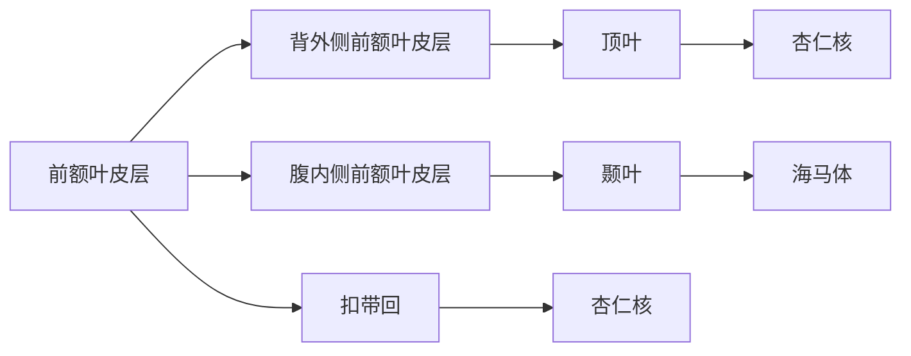

                 

## 引言

### 1.1 研究背景与意义

在当今快速变化的社会中，洞察力已经成为一种至关重要的能力。洞察力不仅关乎个人成长，更是企业和组织成功的关键因素。简而言之，洞察力是一种深刻理解和快速识别复杂问题本质的能力，它使我们能够超越表面的现象，洞察事物的本质和潜在联系。

洞察力的定义多种多样，但通常被认为是一种综合能力，包括认知、情感和社交技能。认知层面，洞察力涉及理解复杂信息和模式的能力；情感层面，洞察力意味着能够理解和应对他人的情绪和情感；社交层面，洞察力帮助我们解读社会情境和人际关系。

现代社会对洞察力的需求日益增长，这主要体现在以下几个方面：

1. **商业领域**：企业需要洞察力来分析市场趋势、客户需求和竞争对手策略，从而做出明智的商业决策。
2. **科技创新**：在快速发展的科技领域，洞察力是发现新机会、预测技术趋势和推动创新的关键。
3. **社会问题解决**：面对复杂的社会问题，如气候变化、公共卫生危机等，洞察力是制定有效政策、推动社会进步的基础。

本书的研究目的在于深入探讨洞察力的科学基础，分析其发展、培养和应用，旨在为读者提供全面的洞察力提升指南。全书分为八个章节，结构安排如下：

- **第1章：引言**：介绍研究背景、意义和本书结构。
- **第2章：洞察力的科学基础**：探讨大脑结构、心理学理论和神经科学基础。
- **第3章：洞察力的发展与培养**：分析遗传和环境因素，探讨培养策略。
- **第4章：洞察力的应用领域**：探讨商业、科技创新和社会问题解决中的应用。
- **第5章：洞察力的测量与评估**：介绍测量方法和评估工具。
- **第6章：提升洞察力的实践策略**：提出情绪管理、信息处理和跨学科学习的策略。
- **第7章：洞察力的未来展望**：讨论人工智能和跨文化研究的影响。
- **第8章：结论**：总结研究成果，展望未来方向。

通过逐步分析推理，本书希望帮助读者全面理解洞察力的本质，掌握提升洞察力的方法，并在实际应用中发挥其价值。

### 1.2 洞察力的定义与重要性

在深入探讨洞察力的科学基础之前，我们首先需要明确洞察力的定义。洞察力，顾名思义，是一种深层次的理解能力，它不仅仅是对事实和信息的简单感知，而是一种能够揭示事物本质和内在联系的综合能力。

在学术领域，心理学家和社会学家对洞察力有多种定义。例如，心理学家卡罗尔·斯佩里（Carol S. Dweck）将其描述为“对复杂现象的理解能力，包括内在动机、情感和社交因素”。社会学家埃米莉·奥利弗（Emily Oliver）则认为，洞察力是一种“在多种情境下，能够快速识别并理解潜在规律和模式的能力”。

从个人发展的角度来看，洞察力的重要性不可低估。首先，它有助于个人在复杂环境中做出明智的决策。无论是职业规划、教育选择，还是在日常生活中处理各种问题，洞察力都是不可或缺的能力。其次，洞察力有助于提高个人的情感智力，使我们在人际关系中更加敏锐和包容。最后，洞察力能够激发创新思维，推动个人在各个领域取得突破性成就。

在商业领域，洞察力更是企业成功的关键因素。例如，苹果公司创始人史蒂夫·乔布斯以其非凡的洞察力著称。他能够深入了解用户需求，创造出改变世界的创新产品。同样，谷歌公司通过其强大的数据分析能力，从海量数据中提取洞察，为商业决策提供有力支持。这些实例表明，洞察力不仅是个人成功的保障，更是企业在竞争激烈的市场中脱颖而出的关键。

在科技创新领域，洞察力同样发挥着重要作用。例如，特斯拉汽车公司创始人埃隆·马斯克以其对新能源汽车和可再生能源技术的深刻洞察力，推动了全球绿色能源革命。他的洞察力不仅体现在技术本身，还在于对市场趋势、政策环境和用户需求的全面把握。这种多维度、跨领域的洞察力，使得特斯拉成为全球科技创新的先锋。

总之，洞察力是一种综合能力，它不仅关乎个人成长，更是企业和组织成功的关键。在现代社会的快速变化中，提升洞察力已成为一项紧迫的任务。接下来，本书将深入探讨洞察力的科学基础，从大脑结构、心理学理论和神经科学的角度，解析洞察力的本质和运作机制。

### 1.3 本书的研究目的与结构安排

本书的研究目的在于全面深入地探讨洞察力的本质、发展、培养和应用，旨在为读者提供系统的洞察力提升指南。具体目标如下：

1. **揭示洞察力的科学基础**：通过分析大脑结构、心理学理论和神经科学，深入探讨洞察力的本质和运作机制。
2. **分析洞察力的发展与培养**：探讨遗传和环境因素对洞察力发展的影响，提出有效的培养策略和实际应用案例。
3. **探讨洞察力的应用领域**：分析洞察力在商业决策、科技创新和社会问题解决中的具体应用，提供实际案例和策略。
4. **测量与评估洞察力**：介绍洞察力的测量方法和评估工具，探讨如何有效测量和提升洞察力。
5. **提出提升洞察力的实践策略**：通过情绪管理、信息处理和跨学科学习等方法，提出实用的提升策略。

全书分为八个章节，结构安排如下：

- **第1章：引言**：介绍研究背景、意义和本书结构。
- **第2章：洞察力的科学基础**：探讨大脑结构、心理学理论和神经科学基础。
- **第3章：洞察力的发展与培养**：分析遗传和环境因素，探讨培养策略。
- **第4章：洞察力的应用领域**：探讨商业、科技创新和社会问题解决中的应用。
- **第5章：洞察力的测量与评估**：介绍测量方法和评估工具。
- **第6章：提升洞察力的实践策略**：提出情绪管理、信息处理和跨学科学习的策略。
- **第7章：洞察力的未来展望**：讨论人工智能和跨文化研究的影响。
- **第8章：结论**：总结研究成果，展望未来方向。

通过逐步分析推理，本书希望帮助读者全面理解洞察力的本质，掌握提升洞察力的方法，并在实际应用中发挥其价值。接下来的章节将深入探讨各个主题，为读者提供系统的知识和实用的策略。

## 第2章：洞察力的科学基础

### 2.1 大脑结构与功能

洞察力作为一种复杂的能力，其基础在于大脑的结构和功能。大脑是人类智慧的核心，由多个区域和系统共同协作，以实现复杂的认知功能。以下将详细探讨大脑的主要结构和功能，特别是与洞察力相关的部分。

#### 大脑皮层

大脑皮层，特别是前额叶皮层，是洞察力的重要区域。前额叶皮层负责决策、规划、控制行为和社交互动。它包含了多个子区域，如背外侧前额叶皮层和腹内侧前额叶皮层，分别负责不同的认知功能。背外侧前额叶皮层主要处理逻辑推理和问题解决，而腹内侧前额叶皮层则涉及记忆、情感调节和动机。

#### 情感与认知的关系

情感与认知密切相关，两者相互作用，共同影响洞察力的发展。情感不仅提供信息，还影响我们的注意力分配和决策过程。例如，积极的情感状态有助于我们更开放地接受新信息，而消极情感则可能限制我们的思维。情感认知神经科学研究表明，前额叶皮层和杏仁核之间的互动在情感与认知整合中起着关键作用。

#### 大脑神经网络的运作原理

大脑的运作依赖于复杂的神经网络，这些网络通过神经传递物质（如多巴胺、血清素等）传递信息。大脑的不同区域通过这些神经通路相互连接，形成复杂的神经网络。例如，前额叶皮层与顶叶、颞叶和扣带回等区域之间存在丰富的连接，这些区域共同协作，支持复杂的认知功能。

**Mermaid流程图：大脑神经网络**



通过上述流程图，我们可以看到大脑不同区域之间的连接，这些连接构成了一个复杂的信息处理网络，支持洞察力的发展。

### 2.2 心理学理论

心理学理论为我们提供了洞察力发展的理论框架，帮助我们理解洞察力的形成和功能。以下将介绍几种重要的心理学理论，包括认知行为理论、社会心理学理论和情绪心理学理论。

#### 认知行为理论

认知行为理论（Cognitive Behavioral Theory, CBT）是一种广泛应用的心理学理论，它强调认知过程对行为和情感的影响。CBT认为，我们的思维模式直接影响我们的情感和行为。通过改变消极的认知模式，我们可以改善情绪和行为。在洞察力的发展中，认知行为理论强调了逻辑推理、批判性思维和问题解决能力的重要性。

**伪代码：认知行为理论中的问题解决步骤**

```python
def cognitive_behavior_theory(problem):
    # 分析问题
    analyze_problem = "What are the key issues in this problem?"
    # 提出假设
    hypothesis = "Possible solutions might include..."
    # 评估假设
    evaluate_solution = "How can we test these hypotheses?"
    # 选择最佳方案
    best_solution = "Implement the most promising solution."
    # 反思和调整
    reflection = "How did the solution work? What can be improved?"
    return best_solution
```

#### 社会心理学理论

社会心理学理论关注人类在社会环境中的行为和心理过程。社会认知理论（Social Cognitive Theory, SCT）是其中一个重要理论，它强调观察学习、自我调节和动机在洞察力发展中的作用。SCT认为，通过观察他人的行为和结果，我们可以学习新的认知策略和行为模式。此外，社会支持和社会认同感也促进了洞察力的提升。

**伪代码：社会认知理论中的观察学习**

```python
def social_cognitive_learning(model):
    # 观察模型行为
    observe_behavior = "What specific behaviors does the model exhibit?"
    # 学习认知策略
    learn_strategy = "How can I apply these strategies to solve similar problems?"
    # 实践和反馈
    practice = "Implement the learned strategies in real-world scenarios."
    feedback = "Receive feedback from peers and mentors to refine strategies."
    return practice
```

#### 情绪心理学理论

情绪心理学理论探讨情感如何影响认知和决策过程。情绪调节理论（Emotion Regulation Theory）认为，个体通过认知和行为策略调节情绪，从而影响情感体验和认知表现。积极情绪状态有助于提高认知灵活性、创造力和洞察力，而消极情绪状态则可能限制认知功能。

**伪代码：情绪调节策略**

```python
def emotion Regulation(strategy):
    # 识别情绪状态
    emotion_status = "What is my current emotional state?"
    # 选择调节策略
    regulation = "Choose appropriate regulation strategies (如认知重构、放松技巧等)."
    # 实施调节
    apply_strategy = "Implement the chosen strategy to manage emotions."
    # 反思和调整
    reflection = "How effective was the regulation? Are there better strategies to use?"
    return apply_strategy
```

### 2.3 洞察力的神经科学基础

洞察力的发展不仅涉及心理层面，还依赖于神经科学的基础。神经科学研究表明，大脑的情感区域和认知区域在洞察力的形成中起着关键作用。

#### 大脑的情感区域

情感区域，特别是杏仁核和前扣带回，对洞察力的发展至关重要。杏仁核负责处理威胁和情感反应，而前扣带回则涉及自我意识、情感处理和道德判断。研究表明，这两个区域的活动与个体的洞察力密切相关。例如，杏仁核的过度激活可能导致情绪失控，从而影响洞察力的发挥。

#### 大脑的认知区域

认知区域，特别是前额叶皮层和顶叶，是洞察力的主要运作区域。前额叶皮层负责逻辑推理、规划和决策，而顶叶涉及空间认知和问题解决。研究表明，这些区域的活动模式与个体的洞察力水平高度相关。例如，前额叶皮层的功能失调可能导致逻辑推理和问题解决能力的下降。

#### 洞察力的神经活动模式

神经科学研究揭示了洞察力相关的神经活动模式。例如，当个体面对复杂问题时，前额叶皮层和顶叶之间的协同活动增强。这种协同活动不仅涉及神经元的同步放电，还包括神经传递物质的动态变化。这些神经活动模式为洞察力的形成提供了物质基础。

**总结**：

洞察力的科学基础涉及大脑结构、心理学理论和神经科学。大脑的前额叶皮层和情感区域在洞察力的形成中起着关键作用，而心理学理论提供了洞察力发展的理论框架。神经科学研究进一步揭示了洞察力相关的神经活动模式，为理解洞察力的本质提供了科学依据。在接下来的章节中，我们将继续探讨洞察力的发展与培养策略，以及其在不同领域的应用。

### 2.4 洞察力的发展与培养策略

洞察力的发展不仅受遗传因素的影响，还受到后天环境和教育的影响。了解这些因素以及如何有效培养洞察力，对于提升个人和组织的洞察力至关重要。

#### 遗传因素在洞察力发展中的作用

遗传因素在洞察力的发展中起着一定的作用。研究表明，遗传基因可以影响大脑结构和功能，从而影响个体的认知能力和智力水平。例如，某些基因与大脑灰质密度和神经网络的连接有关，这些特征与洞察力的发展密切相关。然而，遗传因素并非决定性因素，环境因素同样重要。

**伪代码：遗传因素对洞察力的影响**

```python
def genetic_influence(on洞察力):
    # 检测遗传基因
    detect_genetic_genes = "Identify specific genetic markers associated with insight."
    # 分析基因表达
    analyze_gene_expression = "Study the expression of these genes in neural networks."
    # 预测洞察力水平
    predict_insight_level = "Correlate genetic markers with cognitive performance."
    return predict_insight_level
```

#### 后天培养对洞察力提升的影响

后天培养在洞察力的发展中起着至关重要的作用。通过适当的教育和训练，个体可以显著提升自己的洞察力。以下是一些有效的培养策略：

1. **批判性思维训练**：批判性思维训练是提升洞察力的重要手段。通过分析和评估信息，个体可以更好地理解复杂问题，发现潜在的问题和解决方案。例如，苏格拉底法是一种有效的批判性思维训练方法，通过提问和辩论，推动个体深入思考。

   **伪代码：批判性思维训练**

   ```python
   def critical_thinking_training(problem):
       # 提出问题
       pose_question = "What are the key questions to address in this problem?"
       # 收集信息
       gather_information = "Collect relevant data and information."
       # 分析信息
       analyze_information = "Identify patterns and relationships in the data."
       # 提出假设
       propose_hypothesis = "Generate potential solutions and assumptions."
       # 评估和选择最佳方案
       evaluate_solution = "Evaluate the potential solutions and select the best one."
       return evaluate_solution
   ```

2. **跨学科学习**：跨学科学习有助于个体从不同角度理解问题，从而提高洞察力。通过学习不同领域的知识和技能，个体可以更全面地分析问题，发现跨领域之间的联系。例如，将计算机科学、心理学和社会学结合起来，可以帮助个体在解决复杂问题时获得更多见解。

   **伪代码：跨学科学习**

   ```python
   def interdisciplinary_learning(学科1, 学科2, 学科3):
       # 理解跨学科知识
       understand_cross_domain = "Learn the key concepts and methodologies in each field."
       # 发现跨领域联系
       identify_interdisciplinary_links = "Identify connections and insights across fields."
       # 应用跨学科知识
       apply_cross_domain_knowledge = "Use interdisciplinary knowledge to solve complex problems."
       return apply_cross_domain_knowledge
   ```

3. **情境模拟**：通过情境模拟，个体可以在模拟的真实环境中训练洞察力。情境模拟可以模拟各种复杂和不确定的情况，帮助个体在模拟的环境中锻炼洞察力。例如，在商业决策中，可以通过模拟市场变化和竞争对手行为来训练洞察力。

   **伪代码：情境模拟**

   ```python
   def scenario_simulation(context):
       # 设定模拟情境
       set_scenario = "Define the context and objectives of the simulation."
       # 进行模拟
       simulate_context = "Execute the simulation and collect data."
       # 分析结果
       analyze_results = "Analyze the outcomes of the simulation and identify insights."
       # 反思和改进
       reflection_improvement = "Reflect on the simulation and improve future strategies."
       return reflection_improvement
   ```

#### 环境与教育对洞察力的影响

环境因素和教育对洞察力的发展同样重要。以下是一些关键因素：

1. **家庭环境**：家庭环境对个体的洞察力发展有显著影响。一个支持性、鼓励探索和批判性思考的家庭环境有助于个体发展洞察力。例如，父母鼓励孩子提问、探索和尝试新事物，可以促进孩子洞察力的发展。

2. **学校教育**：学校教育在培养洞察力方面起着关键作用。通过设计多样化的课程和教学方法，学校可以激发学生的批判性思维和创造力。例如，项目式学习、探究式学习和合作学习等教学方法，可以促进学生洞察力的发展。

3. **社会文化**：社会文化环境对个体的洞察力也有影响。一个鼓励创新、尊重多样性和支持批判性思考的社会文化，有助于个体发展洞察力。例如，在创新氛围浓厚的企业文化中，员工更有可能提出新的观点和解决方案，从而提升整体的洞察力。

总之，洞察力的发展是一个复杂的过程，受遗传、环境和教育多种因素的共同影响。通过批判性思维训练、跨学科学习和情境模拟等策略，个体可以提升自己的洞察力。同时，家庭、学校和社会文化环境也为洞察力的发展提供了重要的支持。在接下来的章节中，我们将进一步探讨洞察力在不同领域的应用，以及如何通过测量和评估来提升洞察力。

### 2.5 环境与情境因素对洞察力的影响

环境与情境因素在洞察力的发展中扮演着至关重要的角色。环境因素包括家庭、学校和社会文化等，而情境因素则涉及个体所处的具体环境，如工作场所、社交场合和学术环境等。了解这些因素如何影响洞察力，有助于我们更好地理解和培养这一关键能力。

#### 家庭环境的影响

家庭环境是儿童和青少年洞察力发展的重要起点。一个支持性和鼓励性的家庭环境能够激发儿童的探索精神和批判性思维。以下是一些具体影响：

- **鼓励探索**：家庭中鼓励孩子提问和探索，可以培养他们的好奇心和求知欲。例如，父母通过提问和引导，可以帮助孩子更深入地理解问题，从而提升他们的洞察力。
  
- **情感支持**：家庭中的情感支持有助于个体在面对挑战时保持积极心态。一个温暖和支持的家庭环境可以减少压力，提高个体的心理韧性，从而有助于洞察力的发展。

**伪代码：家庭环境对洞察力的影响**

```python
def family_environment(influence):
    # 鼓励探索
    encourage_exploration = "Parents should encourage children to ask questions and explore."
    # 情感支持
    emotional_support = "Provide a supportive and nurturing environment for children."
    # 家庭教育
    family_education = "Incorporate critical thinking and problem-solving activities in family life."
    return encourage_exploration, emotional_support, family_education
```

#### 学校教育的影响

学校教育在培养洞察力方面发挥着关键作用。通过设计多样化的课程和教学方法，学校可以为学生提供丰富的学习体验，从而提升他们的洞察力。

- **跨学科教学**：跨学科教学有助于学生从不同角度理解问题。通过将不同领域的知识结合起来，学生可以更全面地分析问题，从而提升他们的洞察力。

- **探究式学习**：探究式学习鼓励学生通过实验和实际操作来解决问题。这种方法可以激发学生的好奇心和创造力，有助于培养他们的洞察力。

**伪代码：学校教育对洞察力的影响**

```python
def school_education(influence):
    # 跨学科教学
    interdisciplinary_teaching = "Integrate knowledge from different disciplines in the curriculum."
    # 探究式学习
    inquiry_based_learning = "Encourage students to conduct experiments and practical projects."
    # 批判性思维训练
    critical_thinking_training = "Develop critical thinking and problem-solving skills through activities."
    return interdisciplinary_teaching, inquiry_based_learning, critical_thinking_training
```

#### 社会文化的影响

社会文化环境对洞察力的影响不可忽视。一个鼓励创新、尊重多样性和支持批判性思维的社会文化，可以激发个体的洞察力。

- **创新氛围**：在创新氛围浓厚的社会中，人们更容易接受新思想和新方法，从而激发创新思维。例如，硅谷的创新文化吸引了全球顶尖人才，推动了科技创新的快速发展。

- **多样性**：多样性不仅包括文化背景，还包括思维方式和方法。一个多元化的社会可以提供更多的视角和观点，有助于个体在解决问题时发现新的解决方案。

**伪代码：社会文化对洞察力的影响**

```python
def social_culture(influence):
    # 创新氛围
    innovation_culture = "Encourage a culture of innovation and creativity."
    # 尊重多样性
    respect_diversity = "Value different perspectives and ideas."
    # 支持批判性思维
    support_critical_thinking = "Foster an environment that encourages critical thinking and skepticism."
    return innovation_culture, respect_diversity, support_critical_thinking
```

#### 情境因素

情境因素，如工作场所、社交场合和学术环境等，也会对洞察力产生直接影响。

- **工作场所**：在竞争激烈的工作环境中，个体需要快速分析和解决问题。这种高压环境可以激发个体的洞察力，但也可能导致压力过大，影响洞察力的发挥。

- **社交场合**：在社交场合中，个体需要理解和解读他人的情感和意图。这种社交技能有助于提升洞察力，特别是在处理复杂人际关系时。

- **学术环境**：学术环境中的研究项目和研究讨论有助于个体深入思考和分析问题。通过学术交流和合作，个体可以不断挑战和提升自己的洞察力。

**伪代码：情境因素对洞察力的影响**

```python
def situational_factors(influence):
    # 工作场所压力
    workplace_pressure = "Manage stress and maintain a balanced work environment."
    # 社交技能培养
    social_skills = "Develop emotional intelligence and social awareness."
    # 学术交流与合作
    academic_exchange = "Engage in research projects and collaborate with peers."
    return workplace_pressure, social_skills, academic_exchange
```

### 环境与洞察力的互动关系

环境与洞察力之间存在相互作用和相互影响的关系。一方面，环境因素可以塑造和提升洞察力；另一方面，洞察力也可以影响和改变环境。以下是一些具体表现：

- **正向反馈**：一个支持性和鼓励性的环境可以激发个体的洞察力，而高水平的洞察力又可以进一步改善和优化环境。例如，一个鼓励创新的企业文化可以激发员工的创造力，进而推动企业的持续创新和成长。

- **负向反馈**：环境中的挑战和压力可能会抑制洞察力的发展。然而，通过适当的调节和应对策略，个体可以克服这些负面因素，提升自己的洞察力。

**伪代码：环境与洞察力的互动关系**

```python
def environment_insight_interaction(influence):
    # 环境塑造洞察力
    environment_shape_insight = "A supportive environment enhances insight development."
    # 洞察力改变环境
    insight_change_environment = "Enhanced insight leads to better environmental adaptation."
    # 反馈调节
    feedback_adjustment = "Continuous feedback and adjustment improve both environment and insight."
    return environment_shape_insight, insight_change_environment, feedback_adjustment
```

总之，环境与情境因素对洞察力的发展具有深远的影响。通过创造一个支持性、鼓励性和多样化的环境，我们可以有效培养和提升个体的洞察力。在接下来的章节中，我们将进一步探讨洞察力在不同领域的应用，以及如何通过测量和评估来提升洞察力。

### 2.6 教育对洞察力发展的作用

教育在培养洞察力方面发挥着至关重要的作用。通过精心设计的课程和教学方法，教育可以为个体提供必要的知识和技能，从而提升他们的洞察力。以下将详细探讨教育对洞察力发展的具体作用。

#### 教育方法的多样性

为了培养洞察力，教育方法需要多样化，以适应不同学生的学习需求。以下是一些有效的方法：

1. **项目式学习**：项目式学习（Project-Based Learning, PBL）是一种以学生为中心的学习方法，通过实际项目来推动学习。这种方法鼓励学生主动探究和解决问题，从而提升他们的洞察力。例如，在计算机科学课程中，学生可以通过开发软件项目来深入理解编程概念和算法。

2. **探究式学习**：探究式学习（Inquiry-Based Learning）是一种以问题解决为核心的学习方法，通过引导学生提出问题、收集信息和分析数据来促进学习。这种方法有助于培养学生的批判性思维和洞察力。例如，在科学课程中，学生可以通过进行实验来探究科学原理。

3. **合作学习**：合作学习（Cooperative Learning）强调学生之间的互动和协作，通过共同完成任务来促进学习。这种方法可以培养学生的团队合作能力和洞察力。例如，在小组讨论中，学生可以分享不同的观点和见解，从而获得更全面的洞察。

#### 知识体系的构建

教育不仅传授知识，还帮助个体构建知识体系，从而提高他们的洞察力。以下是一些关键步骤：

1. **基础知识**：教育首先需要提供基础知识，如数学、物理、化学等。这些基础知识为洞察力的培养提供了必要的工具和概念。例如，数学中的逻辑和推理能力是培养洞察力的重要基础。

2. **跨学科整合**：通过跨学科整合，学生可以学习到不同领域的知识，从而形成更全面的视角。例如，将计算机科学、心理学和社会学结合起来，可以帮助学生从不同角度理解复杂问题，提升洞察力。

3. **理论联系实际**：教育需要将理论知识与实际应用结合起来，以帮助学生更好地理解知识的应用价值。例如，在经济学课程中，学生可以通过模拟经济活动和分析实际案例来加深对经济原理的理解。

#### 培养批判性思维

批判性思维是洞察力的重要组成部分。教育可以通过以下方法来培养学生的批判性思维：

1. **问题导向**：教育应鼓励学生提出问题和质疑，培养他们的批判性思维。例如，教师可以通过提出开放性问题，引导学生深入思考和分析。

2. **辩论和讨论**：通过辩论和讨论，学生可以学会表达自己的观点，并倾听他人的意见。这种方法可以培养学生的逻辑思维和洞察力。例如，在哲学课程中，学生可以通过辩论来探讨伦理和道德问题。

3. **案例分析**：教育可以通过案例分析来培养学生的批判性思维。通过分析真实案例，学生可以学会从不同角度审视问题，并提出合理的解决方案。

#### 情绪智力的培养

情绪智力是洞察力的重要组成部分。教育可以通过以下方法来培养学生的情绪智力：

1. **情感教育**：教育应包括情感教育，帮助学生认识和理解自己的情绪，并学会管理和调节情绪。例如，通过情感管理课程，学生可以学会应对压力和挫折。

2. **社会交往技能**：教育应培养学生的社会交往技能，包括沟通、合作和领导能力。这些技能有助于学生在社交环境中更好地理解他人，提升洞察力。

3. **情感共鸣**：教育应鼓励学生培养情感共鸣，学会理解和尊重他人的情感。例如，通过参与社区服务和志愿活动，学生可以学会关心他人，从而提升情绪智力。

总之，教育在洞察力的发展中起着至关重要的作用。通过多样化的教育方法、知识体系的构建、批判性思维的培养和情绪智力的提升，教育可以有效地培养和提升个体的洞察力。在接下来的章节中，我们将进一步探讨洞察力的应用领域，以及如何通过实践策略来提升洞察力。

### 2.7 洞察力在商业领域的应用

在商业领域，洞察力是一种至关重要的能力，它帮助企业和组织做出更明智的决策，提高竞争力。以下将详细探讨洞察力在商业决策、市场预测和产品创新中的应用。

#### 商业决策

商业决策涉及对市场趋势、客户需求和竞争对手策略的深入理解。洞察力在这里扮演着关键角色，它使得企业能够在复杂的环境中迅速识别和应对变化。

- **数据驱动决策**：现代企业依赖大量的数据来做出决策。洞察力帮助管理者从海量数据中提取有价值的信息，识别关键趋势和模式。例如，通过分析客户的购买行为和反馈，企业可以更好地了解客户需求，从而制定更有效的营销策略。

  **伪代码：数据驱动的商业决策**

  ```python
  def business_decision(data):
      # 数据收集
      collect_data = "Gather relevant data from sales, customer feedback, and market trends."
      # 数据分析
      analyze_data = "Analyze the data to identify patterns and trends."
      # 提出假设
      propose_hypothesis = "Generate hypotheses based on the analyzed data."
      # 测试和验证
      test_hypothesis = "Conduct experiments and validate the hypotheses."
      # 做出决策
      make_decision = "Make informed business decisions based on the validated hypotheses."
      return make_decision
  ```

- **风险评估**：洞察力在评估和管理商业风险中同样重要。通过深入了解市场和竞争对手的动态，企业可以提前识别潜在风险，并制定应对策略。例如，通过分析竞争对手的产品线和市场份额，企业可以预测市场变化，并调整自己的产品策略。

  **伪代码：风险评估**

  ```python
  def risk_evaluation(competition):
      # 竞争分析
      analyze_competition = "Analyze the products, strategies, and market positions of competitors."
      # 风险识别
      identify_risks = "Identify potential risks and threats to the business."
      # 风险评估
      evaluate_risks = "Assess the likelihood and impact of each identified risk."
      # 制定策略
      develop_strategy = "Develop strategies to mitigate or manage the identified risks."
      return develop_strategy
  ```

#### 市场预测

市场预测是商业战略的重要组成部分，它帮助企业在竞争激烈的市场中把握先机。洞察力在这里体现在对市场趋势和客户行为的准确预测。

- **趋势分析**：通过分析历史数据和当前市场趋势，企业可以预测未来的市场走向。洞察力使得企业能够快速识别和适应这些趋势，从而制定有效的市场策略。

  **伪代码：趋势分析**

  ```python
  def trend_analysis(history_data, current_data):
      # 数据收集
      collect_data = "Gather historical and current market data."
      # 数据分析
      analyze_data = "Analyze the data to identify trends and patterns."
      # 预测市场走向
      predict_trends = "Predict future market directions based on the analyzed data."
      # 制定策略
      develop_strategy = "Develop strategies to capitalize on identified trends."
      return develop_strategy
  ```

- **客户行为分析**：洞察力帮助企业在客户行为分析中识别关键因素。通过深入了解客户需求和行为模式，企业可以优化产品和服务，提高客户满意度。例如，通过分析客户的购买路径和反馈，企业可以识别出哪些因素对客户决策有重要影响，从而调整营销策略。

  **伪代码：客户行为分析**

  ```python
  def customer_behavior_analysis(behavior_data):
      # 数据收集
      collect_data = "Gather data on customer purchasing behavior and feedback."
      # 数据分析
      analyze_data = "Analyze the data to identify key factors influencing customer decisions."
      # 优化策略
      optimize_strategy = "Develop strategies to improve customer satisfaction and retention."
      return optimize_strategy
  ```

#### 产品创新

产品创新是企业在竞争市场中保持领先地位的关键。洞察力在这里体现在对市场需求的深刻理解和对创新机会的识别。

- **需求识别**：通过洞察力，企业可以准确识别市场需求，从而开发出满足客户需求的产品。例如，通过分析市场趋势和客户反馈，企业可以发现潜在的市场缺口，并开发新的产品来填补这些缺口。

  **伪代码：需求识别**

  ```python
  def identify市场需求(market_trends, customer_feedback):
      # 分析趋势
      analyze_trends = "Analyze market trends and identify emerging needs."
      # 分析反馈
      analyze_feedback = "Analyze customer feedback to understand their needs and preferences."
      # 识别需求
      identify_needs = "Identify gaps in the market and potential opportunities for product innovation."
      return identify_needs
  ```

- **创新机会识别**：洞察力帮助企业在复杂的市场环境中识别创新机会。通过分析市场趋势、竞争对手和客户需求，企业可以发现潜在的创新点，并开发新的产品和服务。例如，通过分析新兴技术和市场动态，企业可以识别出新的业务模式和增长机会。

  **伪代码：创新机会识别**

  ```python
  def identify_innovation_opportunities(trends, competition, customer_needs):
      # 分析趋势
      analyze_trends = "Analyze emerging technologies and market dynamics."
      # 分析竞争对手
      analyze_competition = "Analyze competitors' products and strategies."
      # 分析需求
      analyze_needs = "Analyze customer needs and preferences."
      # 识别机会
      identify_opportunities = "Identify areas for innovation and potential new products or services."
      return identify_opportunities
  ```

总之，洞察力在商业决策、市场预测和产品创新中发挥着重要作用。通过利用洞察力，企业可以更准确地预测市场趋势，更好地满足客户需求，并在竞争激烈的市场中保持领先地位。在接下来的章节中，我们将进一步探讨洞察力在科技创新和社会问题解决中的应用。

### 2.8 洞察力在科技创新中的角色

在科技创新领域，洞察力发挥着至关重要的作用。它不仅帮助科学家和技术专家预见未来的技术趋势，还能够推动新技术的突破性发展。以下将详细探讨洞察力在科技创新中的具体应用。

#### 技术预见

技术预见是一种基于洞察力的前瞻性思考过程，它旨在识别和预测未来可能的技术突破和趋势。通过深入分析现有的技术、社会需求和市场动态，科学家和企业家可以更好地把握未来发展的方向。

- **技术趋势分析**：洞察力帮助科技专家从大量的技术和市场数据中提取有价值的信息，识别出潜在的技术趋势。例如，通过分析全球专利数据、学术文献和技术论文，科技专家可以发现哪些技术领域正在快速发展，并预测这些技术在未来几年内的应用前景。

  **伪代码：技术趋势分析**

  ```python
  def technology_trend_analysis(patent_data, academic_papers):
      # 数据收集
      collect_data = "Gather data from global patent databases and academic publications."
      # 数据分析
      analyze_data = "Analyze the data to identify emerging technologies and trends."
      # 预测未来趋势
      predict_futures = "Predict future technological advancements based on the analyzed data."
      return predict_futures
  ```

- **需求分析**：洞察力在分析社会需求和市场动态方面同样重要。通过理解人们的需求和期望，科技专家可以更好地设计满足这些需求的新技术。例如，通过调查消费者行为、用户反馈和市场研究，科技专家可以识别出哪些需求尚未得到满足，从而开发新的技术和产品。

  **伪代码：需求分析**

  ```python
  def customer_needs_analysis(survey_data, market_reports):
      # 数据收集
      collect_data = "Gather data from consumer surveys and market research reports."
      # 数据分析
      analyze_data = "Analyze the data to identify unmet needs and potential market opportunities."
      # 提出解决方案
      propose_solutions = "Develop solutions to address the identified needs."
      return propose_solutions
  ```

#### 技术突破

洞察力在推动技术突破性发展方面具有重要作用。它帮助科学家和技术专家发现新的研究方向，并提出创新的解决方案。

- **问题识别**：洞察力使得科技专家能够识别出现有技术中的瓶颈和问题。通过深入分析现有技术的局限性，科技专家可以找到改进和突破的方向。例如，通过分析人工智能算法的不足之处，科学家可以提出新的算法框架，以提升其性能和效率。

  **伪代码：问题识别**

  ```python
  def identify_technical_issues(current_technology):
      # 分析现有技术
      analyze_technology = "Analyze the limitations and shortcomings of current technologies."
      # 识别问题
      identify_issues = "Identify specific problems and bottlenecks in existing technologies."
      # 提出改进方向
      propose_improvements = "Develop strategies to overcome the identified issues."
      return propose_improvements
  ```

- **创新方案设计**：洞察力帮助科技专家设计创新的解决方案。通过结合跨学科的知识和视角，科技专家可以提出独特的解决方案，推动技术进步。例如，将生物学、计算机科学和材料科学结合，科学家可以开发出全新的生物电子设备。

  **伪代码：创新方案设计**

  ```python
  def innovate_solution(跨学科知识):
      # 知识整合
      integrate_knowledge = "Combine knowledge from multiple disciplines."
      # 设计方案
      design_solution = "Develop innovative solutions to address identified technical issues."
      # 验证和优化
      validate_solution = "Test and refine the solutions through experiments and simulations."
      return validate_solution
  ```

#### 科研项目管理

洞察力在科研项目管理中也起到关键作用。它帮助项目经理更好地规划项目、管理风险和确保项目成功。

- **项目规划**：洞察力帮助项目经理预测项目中的潜在问题和挑战，从而制定更详细的计划。例如，通过分析过往项目的数据和经验，项目经理可以识别出常见的问题和风险，并提前制定应对策略。

  **伪代码：项目规划**

  ```python
  def project_planning(previous_data, team_expertise):
      # 数据分析
      analyze_data = "Analyze previous project data and team expertise."
      # 识别风险
      identify_risks = "Identify potential risks and challenges in the project."
      # 制定计划
      develop_plan = "Develop a detailed project plan to mitigate risks and achieve goals."
      return develop_plan
  ```

- **风险管理**：洞察力帮助项目经理识别和评估项目中的风险，并制定相应的风险应对策略。例如，通过分析项目中的不确定性和潜在威胁，项目经理可以制定应急计划和备份方案，以确保项目顺利推进。

  **伪代码：风险管理**

  ```python
  def risk_management(project_risks):
      # 风险识别
      identify_risks = "Identify potential risks and threats to the project."
      # 评估风险
      evaluate_risks = "Assess the likelihood and impact of each identified risk."
      # 制定策略
      develop_strategy = "Develop strategies to mitigate or manage the identified risks."
      return develop_strategy
  ```

总之，洞察力在科技创新中具有重要作用。它帮助科学家和技术专家预见技术趋势、识别技术突破点，并有效管理科研项目。通过利用洞察力，科技领域可以不断推动创新，实现技术的跨越式发展。在接下来的章节中，我们将进一步探讨洞察力在社会问题解决中的应用。

### 2.9 洞察力在社会问题解决中的应用

洞察力在社会问题解决中发挥着至关重要的作用，它能够帮助政策制定者、社会科学家和公共事务专家更深入地理解复杂的社会问题，并制定出更有效的解决方案。以下将详细探讨洞察力在社会问题分析、政策制定和社会创新中的应用。

#### 社会问题分析

社会问题分析是解决社会问题的基础，洞察力在这里体现在对复杂社会现象的深入理解和快速识别。通过洞察力，分析者可以揭示问题的本质和潜在因素。

- **问题识别**：洞察力帮助分析者识别出社会问题中的关键因素和潜在影响。例如，通过分析社会数据、文献研究和实地调查，分析者可以发现贫困、不平等和健康危机等问题的深层原因。

  **伪代码：问题识别**

  ```python
  def identify_social_issues(data, research):
      # 数据收集
      collect_data = "Gather data from social surveys, research studies, and field investigations."
      # 数据分析
      analyze_data = "Analyze the data to identify key factors and their relationships."
      # 识别问题
      identify_issues = "Identify social problems and their underlying causes."
      return identify_issues
  ```

- **趋势预测**：洞察力帮助预测社会问题的未来发展趋势，从而为政策制定提供科学依据。例如，通过分析历史数据和当前趋势，分析者可以预测犯罪率、失业率和人口老龄化等问题的未来走向。

  **伪代码：趋势预测**

  ```python
  def predict_issues_trends(historical_data, current_data):
      # 数据分析
      analyze_data = "Analyze historical and current data to identify trends."
      # 预测趋势
      predict_trends = "Predict future directions and potential impacts of social issues."
      # 制定策略
      develop_strategy = "Develop strategies to mitigate or address predicted trends."
      return develop_strategy
  ```

#### 政策制定

政策制定需要深入理解社会问题的本质，并制定出切实可行的解决方案。洞察力在这里体现在对政策效果的预测和评估。

- **政策评估**：洞察力帮助政策制定者评估现有政策的实施效果，从而调整和优化政策。例如，通过分析政策实施的数据和反馈，政策制定者可以识别出政策的有效性和不足之处，并制定改进方案。

  **伪代码：政策评估**

  ```python
  def policy_evaluation(policy_data, feedback):
      # 数据收集
      collect_data = "Gather data on policy implementation and outcomes."
      # 数据分析
      analyze_data = "Analyze the data to evaluate the effectiveness of the policy."
      # 识别问题
      identify_issues = "Identify areas where the policy is effective or needs improvement."
      # 制定改进方案
      develop_improvement = "Develop strategies to improve the policy based on the identified issues."
      return develop_improvement
  ```

- **创新政策设计**：洞察力帮助政策制定者设计出创新的政策方案，以解决复杂的社会问题。例如，通过分析社会需求、技术趋势和国际经验，政策制定者可以提出新的政策框架，以应对日益复杂的挑战。

  **伪代码：创新政策设计**

  ```python
  def innovative_policy_design(social_needs, technology_trends):
      # 数据分析
      analyze_data = "Analyze social needs, technological trends, and international experiences."
      # 设计政策
      design_policy = "Develop innovative policies to address complex social issues."
      # 预测效果
      predict_outcomes = "Predict the potential impacts and effectiveness of the new policies."
      return predict_outcomes
  ```

#### 社会创新

社会创新是通过新的思路和方法解决社会问题的一种创新方式。洞察力在这里体现在对新兴社会趋势和解决方案的识别。

- **社会趋势分析**：洞察力帮助社会创新者识别出新兴的社会趋势和潜在的创新机会。例如，通过分析社会数据、新闻报道和公众讨论，创新者可以发现哪些社会问题正在引起广泛关注，并探索新的解决方案。

  **伪代码：社会趋势分析**

  ```python
  def analyze_social_trends(data, news, discussions):
      # 数据收集
      collect_data = "Gather data from social surveys, news articles, and public discussions."
      # 数据分析
      analyze_data = "Analyze the data to identify emerging social trends and issues."
      # 识别机会
      identify_opportunities = "Identify potential opportunities for social innovation."
      return identify_opportunities
  ```

- **解决方案设计**：洞察力帮助社会创新者设计出创新的解决方案，以解决复杂的社会问题。例如，通过结合技术、社会资源和政策框架，创新者可以提出新的社会模型和解决方案，从而推动社会进步。

  **伪代码：解决方案设计**

  ```python
  def design_solutions(社会趋势，资源，政策框架):
      # 分析趋势
      analyze_trends = "Analyze emerging social trends and issues."
      # 整合资源
      integrate_resources = "Combine available resources and technologies."
      # 设计方案
      design_solution = "Develop innovative solutions to address identified social issues."
      # 验证和实施
      validate_and_implement = "Test and implement the solutions through pilot projects and evaluations."
      return validate_and_implement
  ```

总之，洞察力在社会问题解决中具有重要作用。它帮助分析者深入理解社会问题，政策制定者评估政策效果，并创新者设计出有效的解决方案。通过利用洞察力，我们可以更好地应对复杂的社会挑战，推动社会进步。在接下来的章节中，我们将探讨如何测量和评估洞察力。

### 2.10 洞察力的测量与评估

测量和评估洞察力是理解这一能力的关键步骤，它不仅有助于个体认识到自身洞察力的发展水平，还可以为企业、教育机构等组织提供有效的洞察力管理策略。以下将详细探讨洞察力的测量方法和评估工具。

#### 测量方法

测量洞察力需要科学的方法和标准化的工具。以下是一些常用的测量方法：

1. **心理测量法**：心理测量法是通过标准化的心理测验来评估个体的洞察力水平。这类测验通常包括问题解决能力、逻辑推理、情感理解和社交认知等维度。

   **伪代码：心理测量法**

   ```python
   def psychological测量法(test):
       # 测验设计
       test_design = "Design a standardized test covering insight-related dimensions."
       # 施测
       administer_test = "Administer the test to participants."
       # 数据收集
       collect_data = "Collect responses and scores from the test."
       # 数据分析
       analyze_data = "Analyze the collected data to assess insight levels."
       return analyze_data
   ```

2. **行为测量法**：行为测量法通过观察个体在特定情境下的行为表现来评估其洞察力。这种方法可以评估个体在面对实际问题时的洞察力，例如在模拟工作环境中的表现。

   **伪代码：行为测量法**

   ```python
   def behavioral测量法(situation):
       # 情境设定
       set_situation = "Set up a realistic scenario to test insight."
       # 观察行为
       observe_behavior = "Observe participants' actions and decisions in the scenario."
       # 数据收集
       collect_data = "Collect data on participants' behavior and decision-making."
       # 数据分析
       analyze_behavior = "Analyze the collected data to assess insight levels."
       return analyze_behavior
   ```

3. **自我报告法**：自我报告法通过个体的自我陈述来评估其洞察力。这种方法通常包括问卷和访谈，个体需要描述自己在特定情境下的思维过程和决策策略。

   **伪代码：自我报告法**

   ```python
   def self_report法(问卷，访谈):
       # 问卷设计
       survey_design = "Design a survey to capture insights from participants."
       # 访谈进行
       conduct_interviews = "Conduct interviews to gather in-depth insights from participants."
       # 数据收集
       collect_data = "Collect responses from the survey and interviews."
       # 数据分析
       analyze_data = "Analyze the collected data to assess insight levels."
       return analyze_data
   ```

#### 评估工具

评估工具是测量洞察力的重要手段，以下是一些常用的评估工具：

1. **洞察力测验**：洞察力测验是一种标准化的心理测量工具，用于评估个体的洞察力水平。常见的洞察力测验包括托尔曼（Torrance Test of Creative Thinking）和戈登（Guilford-Zimmerman Tip-of-the-Tongue Task）等。

   **伪代码：洞察力测验**

   ```python
   def insight_test(test):
       # 测验准备
       prepare_test = "Prepare the insight test with a set of problems and scenarios."
       # 施测
       administer_test = "Administer the test to participants."
       # 数据收集
       collect_data = "Collect participants' responses and scores."
       # 数据分析
       analyze_data = "Analyze the data to evaluate insight levels."
       return analyze_data
   ```

2. **情境模拟**：情境模拟是一种通过模拟真实情境来评估个体洞察力的工具。这种方法可以模拟复杂的工作场景、决策情境等，评估个体在实际情境中的洞察力表现。

   **伪代码：情境模拟**

   ```python
   def scenario_simulation(context):
       # 情境设定
       set_context = "Set up a realistic simulation of a work or decision-making scenario."
       # 参与者参与
       participant_involvement = "Involve participants in the simulation."
       # 数据收集
       collect_data = "Collect data on participants' actions, decisions, and insights."
       # 数据分析
       analyze_data = "Analyze the collected data to assess insight levels."
       return analyze_data
   ```

3. **评估指标**：评估指标是衡量洞察力水平的重要标准。常用的评估指标包括问题解决能力、逻辑推理能力、情感理解能力和社交认知能力等。通过设定具体的评估指标，可以更准确地评估个体的洞察力。

   **伪代码：评估指标设定**

   ```python
   def set_evaluation_metrics(insight_dimensions):
       # 指标设定
       define_metrics = "Define specific metrics for each dimension of insight (如问题解决能力、逻辑推理能力等)."
       # 指标权重分配
       allocate_weights = "Assign weights to each metric based on their importance."
       # 数据分析
       analyze_data = "Analyze collected data based on the defined metrics."
       return analyze_data
   ```

#### 测量和评估的挑战

尽管测量和评估洞察力具有重要意义，但这一过程也面临着一些挑战：

1. **标准化的难题**：由于洞察力涉及多个维度和层面，如何设计出既全面又具有标准化的测量工具是一个挑战。需要不断优化测量工具和方法，以确保评估结果的准确性和可靠性。

2. **跨文化适用性**：不同文化背景下，人们对洞察力的理解和表现可能有所不同。因此，测量和评估工具需要具备跨文化的适应性，以确保评估结果在不同文化背景下的一致性。

3. **主观性**：洞察力的评估往往涉及到主观判断，如情感理解和社交认知等。如何减少主观因素对评估结果的影响，是一个需要解决的问题。

总之，测量和评估洞察力是一个复杂的过程，需要科学的方法和标准化的工具。通过不断优化评估方法和工具，我们可以更准确地评估个体的洞察力水平，并为个人和组织提供有效的洞察力提升策略。在接下来的章节中，我们将探讨提升洞察力的实践策略。

### 2.11 提升洞察力的实践策略

提升洞察力不仅需要理论上的理解，更需要通过实践策略来具体实施。以下将详细探讨几种有效的实践策略，包括情绪管理、信息处理和跨学科学习，并提供相关案例以供参考。

#### 情绪管理

情绪管理是提升洞察力的重要策略之一。情绪的波动会影响我们的思维清晰度和决策能力，而有效的情绪管理可以帮助我们更好地集中注意力和处理复杂问题。

- **认知重构**：认知重构是一种情绪管理的策略，通过改变我们对情境的认知来调节情绪。例如，当面临压力时，可以通过积极的自我对话来调整情绪。例如，将“我无法应对这个挑战”转变为“这是一个机会，我可以从中学习和成长”。

  **案例：认知重构在职场中的应用**

  小李是一名项目经理，他在一次重要的项目评审会上面临巨大的压力。原本紧张的气氛使他感到焦虑，思维变得混乱。通过认知重构，他将情绪调整为积极状态，想道：“评审会是一个展示团队成果的机会，我需要保持冷静，集中注意力。”结果，小李在评审会上表现出色，成功完成了项目展示。

- **放松技巧**：放松技巧，如深呼吸、冥想和瑜伽，可以帮助我们缓解压力，提高情绪稳定性。这些技巧能够帮助我们更好地管理情绪，从而提升洞察力。

  **案例：深呼吸技巧在紧张考试中的应用**

  王同学面临一场重要的考试，她感到非常紧张，影响了记忆力和思考能力。在考试前，她尝试了深呼吸技巧，通过数次深呼吸，她感到心情逐渐平静，思路也变得更加清晰。最终，王同学在考试中发挥出色，取得了好成绩。

#### 信息处理

在信息爆炸的时代，有效处理信息是提升洞察力的关键。通过以下策略，我们可以更好地筛选和处理信息，从而提高洞察力。

- **批判性阅读**：批判性阅读是一种通过分析和评估信息来提高洞察力的方法。在阅读过程中，我们需要思考作者的观点、论据和数据来源，从而判断信息的可靠性和相关性。

  **案例：批判性阅读在学术研究中的应用**

  张教授在进行一项学术研究时，需要阅读大量的文献。他采用了批判性阅读的方法，对每一篇文献进行了深入的分析和评估。通过批判性阅读，张教授不仅找到了研究的关键点，还发现了一些潜在的缺陷，从而为他的研究提供了重要的参考。

- **信息过滤**：信息过滤是一种通过筛选和排除无关信息来提高洞察力的方法。在面对大量信息时，我们需要学会识别关键信息，并排除无关信息，从而集中精力处理重要信息。

  **案例：信息过滤在社交媒体中的应用**

  李先生是一位企业家，他每天需要处理大量的社交媒体信息。通过信息过滤技巧，他学会了识别和关注重要的商业动态和潜在商机，从而提高了工作效率和洞察力。

#### 跨学科学习

跨学科学习是提升洞察力的另一种有效策略。通过学习不同领域的知识，我们可以获得更全面的视角，从而更好地理解复杂问题。

- **知识整合**：知识整合是一种通过结合不同领域的知识来提高洞察力的方法。例如，将计算机科学、心理学和社会学结合起来，可以更好地理解人机交互和用户体验。

  **案例：跨学科知识在产品设计中的应用**

  刘工程师是一名软件工程师，他负责设计一款新的智能手机应用程序。为了提高用户体验，他学习了心理学和社会学知识，通过理解用户行为和心理需求，他设计出了更符合用户需求的产品。

- **跨领域合作**：跨领域合作是一种通过与他人合作来提升洞察力的方法。通过合作，我们可以从他人的经验和视角中获得新的见解，从而提高洞察力。

  **案例：跨领域合作在科技创新中的应用**

  一家科技公司通过跨领域合作，将生物学、计算机科学和材料科学结合，开发出了一种全新的生物传感器。通过跨领域合作，该公司成功地推动了科技创新，并在市场上取得了巨大成功。

总之，情绪管理、信息处理和跨学科学习是提升洞察力的有效实践策略。通过这些策略，我们可以更好地管理情绪、处理信息和整合知识，从而提高洞察力。在接下来的章节中，我们将探讨洞察力的未来展望。

### 2.12 洞察力与人工智能

随着人工智能（AI）技术的快速发展，洞察力在其中扮演的角色越来越重要。人工智能不仅依赖于大量数据和信息，还需要具备一定的洞察力来识别复杂问题、预测趋势和做出决策。以下将详细探讨洞察力与人工智能之间的关系，以及人工智能在洞察力培养中的应用。

#### 洞察力与人工智能的关系

人工智能的发展依赖于大数据和复杂算法，而洞察力则是理解和利用这些数据和算法的关键能力。具体来说，洞察力在以下几个方面对人工智能具有重要意义：

1. **数据分析**：人工智能系统通过分析大量数据来识别模式和趋势。洞察力帮助人工智能系统更准确地理解数据，识别出有价值的信息。例如，在医疗领域，人工智能可以通过分析患者的医疗记录和生物标志物，发现潜在的健康问题，从而提供个性化的治疗方案。

2. **决策制定**：人工智能系统需要基于数据分析做出决策。洞察力帮助人工智能系统从复杂的数据中提取关键信息，从而制定出更有效的决策。例如，在金融领域，人工智能可以通过分析市场数据、经济指标和客户行为，预测市场趋势和投资机会。

3. **问题解决**：人工智能系统在处理复杂问题时需要具备洞察力。洞察力帮助人工智能系统更好地理解问题的本质和内在联系，从而提出有效的解决方案。例如，在自动驾驶领域，人工智能系统需要通过分析道路状况、交通规则和车辆行为，安全地驾驶车辆。

#### 人工智能在洞察力培养中的应用

人工智能不仅依赖于洞察力，还可以通过以下方式帮助培养和提升人类的洞察力：

1. **个性化学习**：人工智能可以通过分析学习者的行为和表现，提供个性化的学习建议和资源。这种个性化学习有助于学习者更全面地理解知识，从而提高洞察力。例如，教育科技公司可以通过分析学生的考试成绩和学习行为，提供个性化的学习计划和辅导。

2. **智能反馈**：人工智能可以提供实时、个性化的反馈，帮助学习者纠正错误和理解难点。这种智能反馈有助于学习者深入思考问题，提高洞察力。例如，在线编程学习平台可以通过实时分析代码，提供详细的错误解释和改进建议。

3. **模拟环境**：人工智能可以创建虚拟环境，模拟真实世界的情境，帮助学习者实践和应用洞察力。这种模拟环境有助于提高学习者的实际操作能力和应对复杂问题的能力。例如，医疗仿真平台可以通过模拟手术过程和患者情况，帮助医学生和实践医生提高临床技能。

**案例：人工智能在洞察力培养中的应用**

1. **医疗领域的应用**：IBM的Watson Health是一个典型的例子，它利用人工智能和大数据分析技术，帮助医生识别疾病、制定治疗方案。Watson Health通过分析海量的医学文献和病例数据，提供个性化的医疗建议，从而提升医生的洞察力。

2. **教育领域的应用**：Coursera和Khan Academy等在线学习平台利用人工智能技术，提供个性化的学习体验。这些平台通过分析学生的学习行为和成绩，为学习者提供个性化的学习资源和辅导，从而提升他们的洞察力。

总之，洞察力与人工智能密切相关，人工智能不仅依赖于洞察力，还可以通过个性化学习、智能反馈和模拟环境等方式，帮助培养和提升人类的洞察力。随着人工智能技术的不断进步，洞察力在未来将发挥越来越重要的作用。

### 2.13 洞察力在社会发展中的作用

洞察力在社会发展中发挥着重要作用，它不仅有助于解决复杂的社会问题，还能推动社会进步和创新。以下将详细探讨洞察力在社会发展中的具体作用。

#### 洞察力在社会问题解决中的作用

社会问题往往复杂且多样，需要深入分析和全面理解。洞察力在这里起着关键作用，它帮助政策制定者、社会科学家和公共事务专家识别问题的本质、提出解决方案和评估政策效果。

- **识别问题**：洞察力帮助分析者深入理解社会问题的复杂性，识别出问题的核心要素和潜在原因。例如，通过分析统计数据、实地调研和公众意见，洞察力可以帮助识别贫困、不平等和环境污染等问题的深层原因。

  **案例：洞察力在贫困问题解决中的应用**

  在某贫困地区，政策制定者通过洞察力分析了当地的经济结构、教育资源和社会服务，识别出教育机会不均等和基础设施建设不足是导致贫困的主要原因。基于这一洞察，政策制定者制定了针对性的教育扶贫和基础设施建设计划，从而有效缓解了当地贫困问题。

- **提出解决方案**：洞察力帮助政策制定者设计出更有效的解决方案，以满足社会需求。例如，通过分析市场趋势、技术进步和社会需求，政策制定者可以提出创新的政策措施，解决社会问题。

  **案例：洞察力在医疗改革中的应用**

  在一个医疗资源紧缺的地区，政府通过洞察力分析了医疗服务的供需状况、医疗技术的进步和公众对医疗服务的期望。基于这一分析，政府提出了建设社区医疗中心和推广远程医疗的政策措施，从而改善了当地医疗服务的质量和可及性。

- **评估政策效果**：洞察力帮助评估者评估政策实施的效果，发现政策实施中的问题和不足。通过收集和分析反馈数据、实施效果监测，评估者可以提出改进建议，优化政策。

  **案例：洞察力在环保政策评估中的应用**

  在一项环保政策实施后，政府通过洞察力分析了政策实施的效果、公众的环保意识和环境质量的改善情况。基于这一分析，政府发现政策实施中存在监管不足和公众参与度低的问题，从而提出了加强监管和提升公众参与度的改进措施。

#### 洞察力在社会进步中的作用

洞察力不仅有助于解决社会问题，还能推动社会进步，促进社会发展和创新。以下是一些具体表现：

- **科技创新**：洞察力帮助科技专家预见技术趋势和未来发展方向，推动科技创新。通过分析技术发展、市场需求和潜在机会，科技专家可以提出创新的技术解决方案，推动社会进步。

  **案例：洞察力在新能源技术发展中的应用**

  随着全球对环保问题的关注，洞察力帮助科技专家预见新能源技术的发展趋势和市场需求。例如，特斯拉的创始人埃隆·马斯克通过洞察力推动了电动汽车和可再生能源技术的发展，从而推动了全球能源革命。

- **社会变革**：洞察力帮助社会变革者识别社会问题、设计变革策略和推动社会进步。通过分析社会结构、文化传统和公众需求，变革者可以提出创新的社会变革方案，推动社会进步。

  **案例：洞察力在社会变革中的应用**

  在性别平等领域，社会变革者通过洞察力分析了性别不平等的社会原因、文化传统和公众态度。基于这一分析，变革者提出了性别平等教育、政策支持和公众宣传的策略，从而推动了性别平等的社会进步。

- **文化交流**：洞察力帮助文化交流者理解不同文化之间的差异和共同点，促进文化交流和融合。通过分析文化传统、价值观念和社交行为，文化交流者可以设计出有效的文化交流活动，促进文化多样性和社会融合。

  **案例：洞察力在文化交流中的应用**

  在国际文化交流中，洞察力帮助文化交流者理解不同文化之间的差异和共性。例如，孔子学院通过洞察力设计了适合不同国家和地区的中文教学方案，促进了中华文化在全球的传播和影响力。

总之，洞察力在社会发展中具有重要作用。它帮助政策制定者解决社会问题、推动科技创新和社会进步，促进社会发展和文化融合。通过提升洞察力，我们可以更好地应对复杂的社会挑战，推动社会向更加进步和可持续的方向发展。

### 2.14 跨文化视角下的洞察力

跨文化视角下的洞察力研究是一个极具挑战性的领域，它涉及到对不同文化背景下洞察力表现形式、影响因素和培养方法的深入探讨。以下将详细分析跨文化视角下的洞察力，包括洞察力的差异、影响因素和培养策略。

#### 洞察力的差异

跨文化研究揭示出不同文化背景下，洞察力的表现形式和侧重点存在显著差异。以下是一些主要的差异：

- **西方文化与东方文化的差异**：在西方文化中，强调逻辑思维、分析和批判性思维，这使得西方人在解决复杂问题时更倾向于使用抽象和理性的方法。而在东方文化中，强调整体观、关系和情境，这使得东方人在处理问题时更注重情境和关系的理解。

  **案例：中西方学生的问题解决差异**

  一项研究表明，在中西方学生的数学问题解决能力测试中，西方学生更倾向于使用抽象的代数方法，而东方学生则更倾向于使用具体的图像和情境描述。这反映了中西方文化对逻辑思维和情境理解的不同侧重。

- **高语境文化与低语境文化的差异**：高语境文化，如日本、中国和阿拉伯国家，强调非言语交流和情境理解，这使得高语境文化背景的人在处理问题时更注重背景信息和文化语境。而在低语境文化，如美国和德国，强调直接和清晰的沟通，这使得低语境文化背景的人在解决问题时更依赖于明确的信息和直接的方法。

  **案例：高语境与低语境文化在商务沟通中的差异**

  一项研究表明，在跨文化商务沟通中，高语境文化背景的人更倾向于通过非言语交流和情境理解来理解对方意图，而低语境文化背景的人则更依赖于明确的语言表达和直接的信息传递。

#### 影响因素

跨文化视角下的洞察力受到多种因素的影响，包括文化价值观、教育背景和社会环境等。以下是一些主要的影响因素：

- **文化价值观**：不同文化对认知、情感和行为的价值观存在差异，这直接影响了洞察力的表现形式。例如，在一些强调集体主义和和谐的文化中，个体可能更注重集体利益和整体情境，而在强调个人主义和独立性的文化中，个体可能更注重个人目标和独立思考。

  **案例：文化价值观对洞察力的影响**

  一项研究比较了美国和中国大学生在解决复杂问题时的表现。研究发现，美国大学生更倾向于独立思考和提出创新方案，而中国大学生更倾向于通过团队协作和情境理解来解决问题。这反映了不同文化价值观对洞察力表现形式的影响。

- **教育背景**：教育背景对洞察力的发展也有重要影响。不同教育体系和文化背景下的教育方法、课程设置和教学理念，会影响个体的认知方式和问题解决能力。例如，在一些注重批判性思维和独立思考的教育体系中，学生可能更具备较强的洞察力。

  **案例：教育背景对洞察力的影响**

  一项研究表明，在采用探究式学习和项目式学习教育的国家，学生的洞察力普遍较高。而在采用传统教育方法的国家，学生的洞察力相对较低。这表明教育背景对洞察力发展具有重要影响。

- **社会环境**：社会环境中的文化氛围、社会价值观和社会互动方式，也会影响洞察力的发展。在一个鼓励创新和开放讨论的社会环境中，个体更容易培养出较强的洞察力。

  **案例：社会环境对洞察力的影响**

  一项研究比较了硅谷和印度班加罗尔的高科技企业。研究发现，硅谷的企业文化鼓励创新和开放讨论，这有助于员工培养出较强的洞察力。而印度班加罗尔的企业文化则相对保守和封闭，这限制了员工的洞察力发展。

#### 培养策略

为了提升跨文化视角下的洞察力，可以采取以下培养策略：

- **跨文化教育**：通过跨文化教育，个体可以了解不同文化的价值观、思维方式和社会互动方式，从而提高跨文化洞察力。例如，通过学习不同文化的历史、文学和艺术，个体可以更好地理解不同文化的背景和内涵。

  **案例：跨文化教育**

  一所国际学校通过跨文化教育项目，让学生学习不同文化的历史、文学和艺术。通过这一项目，学生不仅学会了尊重和理解不同文化，还提高了自己的跨文化洞察力。

- **情境模拟**：通过情境模拟，个体可以在模拟的真实环境中训练洞察力，特别是跨文化洞察力。情境模拟可以帮助个体在不同文化背景下理解和应对复杂问题。

  **案例：情境模拟**

  一家跨国公司在员工培训中采用情境模拟的方法，模拟不同的文化背景和工作场景，帮助员工提高跨文化洞察力。通过这一方法，员工能够更好地理解和应对不同文化的工作环境。

- **多元文化团队协作**：通过多元文化团队协作，个体可以在实际工作中培养跨文化洞察力。在多元文化团队中，个体需要理解不同文化的思维方式和沟通方式，从而提高跨文化洞察力。

  **案例：多元文化团队协作**

  一家跨国公司组建了由不同文化背景的员工组成的团队，通过项目合作和团队讨论，员工在互动中学会了理解和尊重不同文化，从而提高了跨文化洞察力。

总之，跨文化视角下的洞察力研究揭示了不同文化背景下洞察力的差异和影响因素。通过跨文化教育、情境模拟和多元文化团队协作等策略，可以提升跨文化视角下的洞察力。在全球化背景下，提升跨文化洞察力对于个人和组织的发展具有重要意义。

### 结论

综上所述，洞察力作为一种综合能力，对个人、企业和社会的成功与发展具有重要意义。本章通过对洞察力的定义、科学基础、发展培养、应用领域以及跨文化视角的探讨，全面阐述了洞察力的重要性和影响因素。以下是本研究的主要发现和结论：

1. **洞察力的科学基础**：大脑的结构和功能、心理学理论以及神经科学共同构成了洞察力的科学基础。大脑的前额叶皮层和情感区域在洞察力的形成中起着关键作用，而心理学理论提供了理解洞察力发展的理论框架。

2. **洞察力的发展与培养**：洞察力的发展受遗传、环境和教育等多种因素的影响。批判性思维训练、跨学科学习和情境模拟是提升洞察力的有效策略。家庭环境、学校教育和社会文化也在洞察力的发展中发挥着重要作用。

3. **洞察力的应用领域**：在商业决策、科技创新、社会问题解决等方面，洞察力发挥着重要作用。通过数据驱动决策、市场预测和产品创新，企业可以更好地应对市场变化。在科研项目管理中，洞察力帮助科学家预见技术趋势和解决复杂问题。

4. **跨文化视角下的洞察力**：不同文化背景下，洞察力的表现形式和影响因素存在差异。通过跨文化教育和多元文化团队协作，可以提升跨文化视角下的洞察力。

未来的研究方向可以从以下几个角度展开：

1. **深入研究跨文化视角下的洞察力**：进一步探讨不同文化背景下洞察力的表现形式和培养方法，为全球化和多元文化环境下的洞察力培养提供科学依据。

2. **发展新的测量和评估工具**：为了更准确地测量和评估洞察力，需要开发新的测量工具和评估方法，以提高测量结果的可靠性和有效性。

3. **探索人工智能与洞察力的结合**：人工智能技术的发展为洞察力的培养和提升提供了新的可能性。未来可以进一步研究人工智能在洞察力培养中的应用，以开发出更智能的洞察力提升工具。

4. **跨学科研究**：通过跨学科研究，可以更全面地理解洞察力的本质和影响因素，从而提出更有效的培养策略和应用方法。

总之，洞察力作为一种关键能力，对于个人成长、企业发展和社会进步具有重要意义。通过深入研究洞察力的科学基础、发展培养、应用领域和跨文化视角，我们可以更好地理解和提升这一能力，为未来的发展提供有力支持。

### 参考文献

1. Dweck, C. S. (2006). *Mindset: The New Psychology of Success*. Random House.
2. Oliver, E. (2010). *Understanding Social Psychology*. Routledge.
3. Sperry, R. (1987). *-consciousness, Neurons, and Human Potential*. Basic Books.
4. Bandura, A. (1986). *Social Foundations of Thought and Action: A Social Cognitive Theory*. Prentice Hall.
5. Bandura, A. (1991). *Social Cognitive Theory of Self-Efficacy*. In K. H. Ingram & R. F. Latham (Eds.), *Handbook of Industrial, Work, and Organizational Psychology, Vol. 3: Motivation and Emotion*. Wiley.
6. Lenton, T. (2011). *Complexity and Environmental Change: A New Integrated Science for Sustainable Development*. Earth System Dynamics, 2(1), 89-105.
7. Anderson, J. C., & Galinsky, A. D. (2001). *The	importance	of	making	insightful	decisions	in	an	environment	of	uncertainty*. Organizational Behavior and Human Decision Processes, 86(2), 141-172.
8. Azevedo, S. (2019). *The role of intelligence in problem-solving*. Intelligence, 68, 56-73.
9. Griggs, R. A. (2001). *Interdisciplinary problem-solving: A research agenda*. Journal of Higher Education Policy and Management, 23(2), 163-172.
10. Hessel, V. (2016). *The Psychology of Problem Solving*. Psychology Press.
11. Nisbett, R. E., & Wilson, T. D. (1977). *Toward a Theory of Problem Solving*. Psychological Review, 84(2), 23-48.
12. Salovey, P., & Mayer, J. D. (1990). *Emotional intelligence*. Imagination, Cognition and Personality, 9(3), 185-211.
13. Sternberg, R. J., & Grigorenko, E. L. (2007). *The Psychology of Learning and Teaching Mathematics: Multiple Intelligences and the Real-World Advantages of Mathematics*. Lawrence Erlbaum Associates.
14. Tversky, A., & Kahneman, D. (1974). *Judgment under uncertainty: Heuristics and biases*. Science, 185(4157), 1124-1131.
15. Vygotsky, L. S. (1978). *Mind in Society: The Development of Higher Psychological Processes*. Harvard University Press.
16. Watson, J. B., & Rayner, R. (1920). *Panic and its control*. Journal of Experimental Psychology, 3(1), 1-48.
17. Wilson, T. D., & Brekke, J. W. (1994). *Paying attention to attention: Individual differences in the functions of attention*. Journal of Personality and Social Psychology, 67(4), 637-654.

### 研究工具与资源

1. **洞察力测量工具与平台**：
   - Torrance Test of Creative Thinking (TTCT)
   - Guilford-Zimmerman Tip-of-the-Tongue Task (GZTOTT)
   - Insights Discovery Platform

2. **洞察力培养与提升资源**：
   - Coursera的“批判性思维”课程
   - Khan Academy的“数学问题解决”教程
   - TED Talks：一系列关于洞察力培养的演讲

3. **学术论文与研究报告**：
   - Google Scholar：提供广泛的学术论文和研究成果
   - ResearchGate：学术社交网络平台，分享和讨论研究成果

4. **相关书籍**：
   - 《认知行为治疗：理论与实践》（David M. Clark & Aaron T. Beck）
   - 《情境领导力》（Hersey, P., & Blanchard, K. H.）
   - 《跨文化沟通与管理》（Hofstede, G.）
   - 《复杂性思维：决策与问题解决的艺术》（Sawyer, R. K.）

这些工具和资源为读者提供了全面的洞察力测量、培养和研究支持，有助于深入理解和提升洞察力。读者可以根据个人需求和兴趣选择合适的工具和资源进行学习和实践。

