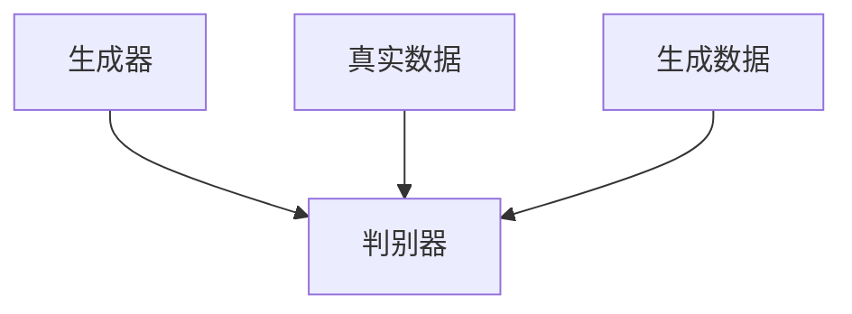

                 

### 《生成对抗网络在虚拟试衣中的应用》

#### 文章关键词：
- 生成对抗网络（GAN）
- 虚拟试衣
- 图像生成
- 3D人体建模
- 服装风格迁移
- 计算机视觉

#### 文章摘要：
本文探讨了生成对抗网络（GAN）在虚拟试衣领域中的应用。首先介绍了GAN的基本原理和组成部分，然后详细阐述了GAN在虚拟试衣系统中的具体应用，包括3D人体建模、服装生成与风格迁移以及虚拟试衣效果评估。通过实际项目实战和代码解析，展示了如何实现一个基于GAN的虚拟试衣系统，并对其进行了评估与总结。本文旨在为开发者和研究者提供关于GAN在虚拟试衣中应用的深入理解和实践指导。

#### 目录

### 《生成对抗网络在虚拟试衣中的应用》

> 关键词：生成对抗网络（GAN）、虚拟试衣、图像生成、3D人体建模、服装风格迁移、计算机视觉

> 摘要：本文探讨了生成对抗网络（GAN）在虚拟试衣领域中的应用。首先介绍了GAN的基本原理和组成部分，然后详细阐述了GAN在虚拟试衣系统中的具体应用，包括3D人体建模、服装生成与风格迁移以及虚拟试衣效果评估。通过实际项目实战和代码解析，展示了如何实现一个基于GAN的虚拟试衣系统，并对其进行了评估与总结。本文旨在为开发者和研究者提供关于GAN在虚拟试衣中应用的深入理解和实践指导。

#### 第一部分：生成对抗网络（GAN）基础

### 第1章 生成对抗网络（GAN）概述

## 1.1 GAN的定义与背景

### 1.1.1 GAN的起源与发展

生成对抗网络（GAN）是2014年由伊恩·古德费洛（Ian Goodfellow）等人提出的。GAN作为一种深度学习框架，通过对抗训练的方式实现生成高质量的数据。GAN的提出在深度学习领域引发了广泛关注，并迅速成为研究热点。

GAN的发展可以分为三个阶段：

1. **早期阶段**：2012年，深度信念网络（DBN）和堆叠自编码器（SAE）成为深度学习领域的主流模型。然而，这些模型在训练过程中需要大量的数据，且训练难度大。

2. **中期阶段**：2013年，自编码器（AE）的出现使得深度学习模型在生成数据方面取得了显著进展。然而，AE在生成真实数据方面仍存在不足，容易陷入局部最优。

3. **成熟阶段**：2014年，GAN的提出打破了传统深度学习模型的局限。GAN通过对抗训练的方式，使得生成器和判别器相互竞争，从而生成高质量的数据。

### 1.1.2 GAN的基本原理

GAN的核心思想是利用生成器和判别器之间的对抗关系来训练模型。生成器的目标是生成尽可能真实的数据，而判别器的目标是区分真实数据和生成数据。在训练过程中，生成器和判别器相互对抗，不断优化自身性能。

GAN的基本原理可以概括为以下步骤：

1. **初始化生成器和判别器**：生成器随机初始化，判别器初始化为接近零的权重。

2. **生成器生成假数据**：生成器根据输入的噪声数据生成假数据。

3. **判别器判断真伪**：判别器根据输入的假数据和真实数据判断真伪。

4. **优化生成器和判别器**：根据生成器和判别器的损失函数，通过梯度下降法优化模型参数。

5. **重复步骤 2-4**：不断重复上述步骤，直到生成器和判别器达到平衡状态。

### 1.2 GAN的核心组成部分

GAN由生成器（Generator）和判别器（Discriminator）两个核心组成部分构成。

#### 1.2.1 生成器（Generator）

生成器的任务是生成与真实数据相似的高质量假数据。生成器通常由多个全连接层或卷积层组成，输入为噪声数据，输出为假数据。

#### 1.2.2 判别器（Discriminator）

判别器的任务是区分真实数据和生成数据。判别器通常由多个卷积层或全连接层组成，输入为数据，输出为二分类结果（真实或生成）。

#### 1.3 GAN的应用领域与优势

GAN在图像生成、图像修复、图像超分辨率、语音合成、自然语言处理等领域取得了显著成果。以下是GAN在虚拟试衣领域的潜力与优势：

### 1.3.1 虚拟试衣领域的潜力

虚拟试衣系统可以节省消费者的时间和精力，提高购物体验。GAN在虚拟试衣领域的潜力主要体现在以下几个方面：

1. **3D人体建模**：利用GAN生成高质量的人体模型，实现个性化的虚拟试衣。

2. **服装生成与风格迁移**：利用GAN生成各种风格和款式的服装，实现虚拟试衣效果。

3. **虚拟试衣效果评估**：利用GAN评估虚拟试衣效果，提高用户体验。

### 1.3.2 GAN在图像生成、图像修复和图像超分辨率等方面的应用

GAN在图像生成、图像修复和图像超分辨率等方面取得了显著成果，为虚拟试衣系统提供了强大的技术支持。

1. **图像生成**：GAN可以生成逼真的图像，应用于虚拟试衣系统中的服装生成和人体建模。

2. **图像修复**：GAN可以修复受损或模糊的图像，提高虚拟试衣系统的视觉效果。

3. **图像超分辨率**：GAN可以提升低分辨率图像的清晰度，为虚拟试衣系统提供更好的用户体验。

#### 第二部分：GAN在虚拟试衣中的应用

### 第2章 虚拟试衣系统概述

## 2.1 虚拟试衣的背景与发展

### 2.1.1 传统试衣的局限性

传统试衣存在以下局限性：

1. **时间和空间的限制**：消费者需要亲自前往实体店铺试穿服装，耗时耗力。

2. **购物体验不佳**：实体店铺的服装数量有限，消费者可能无法找到心仪的款式。

3. **环境限制**：实体店铺的空间有限，无法满足消费者对多种场景的需求。

### 2.1.2 虚拟试衣的优势与需求

虚拟试衣系统具有以下优势：

1. **便捷性**：消费者可以在家中通过网络试穿各种服装，节省时间和精力。

2. **个性化**：虚拟试衣系统可以根据消费者的身体数据生成个性化的人体模型，实现精准试衣。

3. **场景多样性**：虚拟试衣系统可以模拟各种场景，提供更加真实的购物体验。

随着电子商务和虚拟现实技术的不断发展，消费者对虚拟试衣系统的需求日益增加。虚拟试衣系统已成为电商平台和零售业的重要发展方向。

### 2.2 虚拟试衣系统的组成

虚拟试衣系统通常由以下几个部分组成：

1. **用户交互界面**：用户通过界面选择服装、调整试衣场景等。

2. **3D人体建模与服装模拟**：利用计算机图形学和深度学习技术生成3D人体模型和虚拟服装。

3. **虚拟试衣效果评估与反馈**：通过用户反馈和算法评估虚拟试衣效果，不断优化系统性能。

#### 第三部分：GAN在虚拟试衣中的具体应用

### 第3章 GAN在虚拟试衣中的应用

## 3.1 GAN在3D人体建模中的应用

### 3.1.1 基于GAN的人体建模方法

GAN在3D人体建模中的应用主要分为以下步骤：

1. **数据预处理**：收集大量的人体三维扫描数据，进行数据清洗和预处理。

2. **生成器设计**：设计生成器网络，将噪声数据转换为三维人体模型。

3. **判别器设计**：设计判别器网络，区分真实人体数据和生成的人体模型。

4. **对抗训练**：通过对抗训练优化生成器和判别器，使生成的人体模型更加真实。

### 3.1.2 伪代码与数学模型讲解

基于GAN的人体建模方法可以表示为以下伪代码：

```
# 伪代码：基于GAN的人体建模

# 定义生成器 G 和判别器 D
Generator()
Discriminator()

# 训练生成器和判别器
for epoch in range(EPOCHS):
    for real_data, _ in DataLoader(real_dataset):
        # 训练判别器
        D.train_on_batch(real_data, ones)

        # 训练生成器
        fake_data = G.generate_noise()
        G.train_on_batch(fake_data, ones)

        # 评估判别器
        D.test_on_batch(fake_data, zeros)
```

GAN的人体建模数学模型可以表示为：

```
# 数学模型：GAN的人体建模

L_G = -E[x~p_data(x)][log(D(x))] - E[z~p_z(z)][log(1 - D(G(z))]
L_D = -E[x~p_data(x)][log(D(x))] - E[z~p_z(z)][log(D(G(z))]
```

其中，`x`表示真实人体数据，`z`表示噪声数据，`G(z)`表示生成器生成的三维人体模型，`D(x)`和`D(G(z))`分别表示判别器对真实人体数据和生成人体模型的判别结果。

### 3.2 GAN在服装生成与风格迁移中的应用

#### 3.2.1 生成器与判别器的架构设计

在服装生成与风格迁移中，GAN的生成器和判别器架构设计如下：

1. **生成器架构**：生成器将噪声数据转换为服装图像。通常使用卷积神经网络（CNN）作为生成器，输入层为噪声数据，输出层为服装图像。

2. **判别器架构**：判别器用于区分真实服装图像和生成服装图像。通常使用卷积神经网络（CNN）作为判别器，输入层为服装图像，输出层为一个二分类结果。

### 3.2.2 GAN在服装风格迁移中的具体实现

GAN在服装风格迁移中的具体实现分为以下步骤：

1. **数据集准备**：收集大量具有不同风格的服装图像作为训练数据。

2. **生成器训练**：通过对抗训练优化生成器，使其能够生成具有特定风格的服装图像。

3. **判别器训练**：通过对抗训练优化判别器，使其能够准确区分真实服装图像和生成服装图像。

4. **服装风格迁移**：使用训练好的生成器将一种风格的服装图像转换为另一种风格。

#### 3.3 GAN在虚拟试衣效果评估中的应用

#### 3.3.1 虚拟试衣效果的评价指标

虚拟试衣效果评估可以从以下几个方面进行：

1. **外观匹配度**：评估生成的人体模型和虚拟试衣效果的视觉效果。

2. **舒适度评估**：评估虚拟试衣系统的服装穿着舒适度。

3. **用户满意度**：评估用户对虚拟试衣系统的满意度。

### 3.3.2 GAN在效果评估中的应用方法

GAN在虚拟试衣效果评估中的应用方法如下：

1. **外观匹配度评估**：使用GAN生成的三维人体模型和虚拟试衣效果进行对比，评估外观匹配度。

2. **舒适度评估**：通过收集用户试衣后的反馈，评估虚拟试衣系统的服装穿着舒适度。

3. **用户满意度评估**：通过问卷调查和用户反馈，评估用户对虚拟试衣系统的满意度。

### 第四部分：项目实战与代码解析

#### 第4章 虚拟试衣系统项目实战

## 4.1 项目概述与开发环境搭建

### 4.1.1 项目背景与目标

本项目旨在利用生成对抗网络（GAN）实现一个虚拟试衣系统。项目目标包括：

1. **3D人体建模**：生成高质量的三维人体模型。

2. **服装生成与风格迁移**：生成具有各种风格的虚拟服装，实现风格迁移。

3. **虚拟试衣效果评估**：评估虚拟试衣系统的外观匹配度、舒适度和用户满意度。

### 4.1.2 开发环境与工具选择

本项目使用的开发环境与工具包括：

1. **编程语言**：Python

2. **深度学习框架**：TensorFlow 2.x

3. **3D人体建模库**：Blender

4. **计算机视觉库**：OpenCV

5. **虚拟试衣界面**：Flask Web框架

## 4.2 项目实现步骤详解

### 4.2.1 数据准备与预处理

在项目实现过程中，首先需要进行数据准备与预处理。具体步骤如下：

1. **数据收集**：收集大量的人体三维扫描数据、服装图像以及不同风格的服装图像。

2. **数据清洗**：去除数据集中的噪声和异常值。

3. **数据归一化**：对数据集进行归一化处理，使其具有相似的尺度。

4. **数据分割**：将数据集划分为训练集、验证集和测试集。

### 4.2.2 GAN模型训练与优化

在项目实现过程中，GAN模型的训练与优化是关键步骤。具体步骤如下：

1. **生成器设计**：设计生成器网络，用于将噪声数据转换为三维人体模型。

2. **判别器设计**：设计判别器网络，用于区分真实三维人体模型和生成的人体模型。

3. **对抗训练**：通过对抗训练优化生成器和判别器，使生成的人体模型更加真实。

4. **模型评估**：在验证集上评估生成器和判别器的性能，调整模型参数。

5. **模型优化**：根据评估结果，对模型进行优化，提高虚拟试衣效果。

### 4.2.3 虚拟试衣效果展示与评估

在项目实现过程中，虚拟试衣效果展示与评估是重要环节。具体步骤如下：

1. **虚拟试衣界面设计**：使用 Flask Web 框架设计虚拟试衣界面，用户可以通过界面选择服装和试衣场景。

2. **3D人体建模与虚拟试衣**：利用训练好的生成器生成三维人体模型，并在虚拟试衣界面展示试衣效果。

3. **用户反馈收集**：收集用户对虚拟试衣效果的反馈，包括外观匹配度、舒适度和满意度。

4. **效果评估**：根据用户反馈和算法评估结果，对虚拟试衣系统进行评估。

### 4.3 源代码解析与解读

在项目实现过程中，源代码的解析与解读是关键步骤。具体包括：

1. **生成器代码解析**：解析生成器网络的代码，理解生成器的工作原理。

2. **判别器代码解析**：解析判别器网络的代码，理解判别器的工作原理。

3. **GAN模型训练代码解析**：解析GAN模型训练的代码，理解对抗训练的过程。

4. **虚拟试衣效果展示代码解析**：解析虚拟试衣效果展示的代码，理解虚拟试衣系统的实现原理。

### 4.3.1 数据加载与预处理代码分析

在项目实现过程中，数据加载与预处理代码分析是关键步骤。具体包括：

1. **数据集加载**：加载训练集、验证集和测试集的数据。

2. **数据预处理**：对数据进行归一化、分割和清洗等预处理操作。

3. **数据增强**：对数据进行随机旋转、缩放和裁剪等增强操作，提高模型的泛化能力。

### 4.3.2 GAN模型训练代码解读

在项目实现过程中，GAN模型训练代码解读是关键步骤。具体包括：

1. **生成器和判别器的定义**：定义生成器和判别器的网络结构。

2. **对抗训练过程**：通过对抗训练优化生成器和判别器，使生成的人体模型更加真实。

3. **损失函数和优化器**：设置损失函数和优化器，用于评估和更新模型参数。

4. **模型训练与评估**：在验证集上评估模型性能，调整模型参数，优化虚拟试衣效果。

### 4.3.3 虚拟试衣效果展示代码分析

在项目实现过程中，虚拟试衣效果展示代码分析是关键步骤。具体包括：

1. **3D人体模型生成**：利用训练好的生成器生成三维人体模型。

2. **虚拟试衣界面**：使用 Flask Web 框架设计虚拟试衣界面，用户可以通过界面选择服装和试衣场景。

3. **虚拟试衣效果展示**：在虚拟试衣界面上展示用户试衣的效果，用户可以实时查看试衣效果。

4. **用户反馈收集**：收集用户对虚拟试衣效果的反馈，包括外观匹配度、舒适度和满意度。

### 4.3.4 代码解读与分析

在项目实现过程中，代码解读与分析是关键步骤。具体包括：

1. **整体架构分析**：分析项目的整体架构，理解各个模块的功能和作用。

2. **代码实现细节**：分析代码实现细节，理解每个模块的工作原理。

3. **性能优化**：分析代码性能，寻找优化空间，提高项目效率。

4. **错误处理**：分析可能出现的错误和异常情况，设计合理的错误处理机制。

### 4.3.5 代码部署与维护

在项目实现完成后，需要进行代码部署与维护。具体包括：

1. **部署**：将项目部署到服务器或云平台，确保虚拟试衣系统可以正常运行。

2. **维护**：定期检查和更新项目，修复潜在问题和漏洞，保证系统的稳定性和安全性。

### 4.3.6 测试与验收

在项目实现完成后，需要进行测试与验收。具体包括：

1. **功能测试**：测试虚拟试衣系统的各项功能是否正常运行。

2. **性能测试**：测试虚拟试衣系统的性能，包括响应速度、稳定性等。

3. **验收测试**：邀请用户进行验收测试，根据用户反馈进行优化和改进。

### 4.3.7 文档编写与发布

在项目实现完成后，需要编写相关文档，包括：

1. **用户手册**：指导用户如何使用虚拟试衣系统。

2. **技术文档**：记录项目的技术细节，包括代码实现、架构设计等。

3. **发布**：将项目和相关文档发布到适当的地方，便于用户和技术人员使用。

### 4.3.8 反馈与改进

在项目实现完成后，需要收集用户反馈，根据反馈进行改进和优化。具体包括：

1. **用户反馈**：收集用户对虚拟试衣系统的反馈，包括优点和缺点。

2. **改进措施**：根据用户反馈，制定改进措施，优化系统功能。

3. **持续改进**：持续关注用户反馈，定期更新和改进系统。

### 第5章 总结与展望

#### 5.1 GAN在虚拟试衣中的挑战与未来趋势

##### 5.1.1 当前GAN应用面临的挑战

GAN在虚拟试衣领域面临以下挑战：

1. **数据质量**：虚拟试衣系统需要高质量的人体数据和服装数据，但数据获取和标注成本较高。

2. **计算资源**：GAN模型训练过程需要大量的计算资源，对硬件性能有较高要求。

3. **稳定性与泛化能力**：GAN模型训练过程容易陷入局部最优，影响模型稳定性。同时，模型泛化能力需要提高，以适应各种场景和用户需求。

##### 5.1.2 GAN在虚拟试衣领域的发展方向

GAN在虚拟试衣领域的发展方向包括：

1. **数据增强与生成**：利用GAN生成更多高质量的人体数据和服装数据，提高虚拟试衣系统的效果。

2. **跨领域迁移**：探索GAN在不同领域（如医疗、娱乐等）的迁移应用，提高虚拟试衣系统的适用范围。

3. **多模态融合**：结合多模态数据（如语音、图像、三维数据等），实现更加真实的虚拟试衣体验。

4. **个性化推荐**：利用GAN和深度学习技术，为用户提供个性化的服装推荐和试衣体验。

#### 5.2 开发者与从业者的建议与思考

##### 5.2.1 开发者应具备的知识与技能

开发者应具备以下知识与技能：

1. **深度学习与GAN**：掌握深度学习原理和GAN模型，熟悉相关算法和框架。

2. **计算机视觉**：了解计算机视觉基本原理，熟悉图像处理技术。

3. **三维建模与渲染**：掌握三维建模与渲染技术，实现高质量的人体模型和虚拟试衣效果。

4. **编程能力**：具备较强的编程能力，熟悉Python等编程语言。

##### 5.2.2 虚拟试衣行业的发展策略与建议

虚拟试衣行业的发展策略与建议包括：

1. **技术创新**：持续关注虚拟试衣领域的技术动态，引进先进技术，提高虚拟试衣效果。

2. **用户体验**：关注用户需求，优化虚拟试衣系统，提高用户体验。

3. **数据驱动**：利用大数据和人工智能技术，实现个性化推荐和智能匹配。

4. **合作与共享**：加强与相关行业的合作，共享数据和技术资源，实现跨界创新。

### 附录

#### 附录A GAN相关资源与工具

##### 5.3.1 GAN的开源框架与库

1. **TensorFlow**：Google开发的开源深度学习框架，支持GAN模型的训练和部署。

2. **PyTorch**：Facebook开发的开源深度学习框架，支持GAN模型的训练和部署。

3. **GANlib**：一个Python库，用于实现各种GAN模型，包括DCGAN、WGAN、LSGAN等。

##### 5.3.2 虚拟试衣相关的开源数据集与工具

1. **ShapeNet**：一个包含多种类别三维物体的三维数据集。

2. **CIFAR-10**：一个包含10个类别图像的数据集，常用于计算机视觉模型训练。

3. **Clothing-1M**：一个包含100万张服装图像的数据集，用于服装生成和风格迁移。

4. **Blender**：一个开源的三维建模与渲染软件，可用于生成三维人体模型和虚拟试衣效果。

##### 5.3.3 推荐阅读与学习资源

1. **《生成对抗网络》（GAN）**：Ian Goodfellow的专著，详细介绍GAN的原理和应用。

2. **《深度学习》（Deep Learning）**：Goodfellow等人撰写的教材，涵盖深度学习的基础知识和实践技巧。

3. **《计算机视觉基础》（Computer Vision: Algorithms and Applications）**：Richard Szeliski的教材，详细介绍计算机视觉的基本原理和技术。

##### 5.3.4 社交媒体与论坛推荐

1. **Twitter**：关注相关领域的专家和研究者，获取最新的研究进展和动态。

2. **Reddit**：加入相关论坛，参与讨论和交流，学习他人的经验和技巧。

3. **GitHub**：查看开源项目，学习他人的代码实现，借鉴和优化自己的项目。

### Mermaid 流程图

以下是一个简单的Mermaid流程图，展示了GAN模型的基本结构：



### GAN核心算法原理讲解伪代码

以下是一个简单的GAN模型算法原理讲解伪代码：

```python
# GAN伪代码

# 初始化生成器 G 和判别器 D
Generator()
Discriminator()

# 训练过程
for epoch in range(EPOCHS):
    for real_data, _ in DataLoader(real_dataset):
        # 训练判别器
        D.train_on_batch(real_data, ones)

        # 生成假数据
        noise = generate_noise(batch_size)
        fake_data = G.generate(noise)

        # 训练生成器
        D.train_on_batch(fake_data, zeros)

    # 评估判别器
    D.test_on_batch(real_data, ones)
    D.test_on_batch(fake_data, zeros)
```

### 数学模型和数学公式讲解

以下是一个简单的GAN数学模型和公式讲解：

```
# GAN数学模型

L_G = -E[x~p_data(x)][log(D(x))] - E[z~p_z(z)][log(1 - D(G(z))]
L_D = -E[x~p_data(x)][log(D(x))] - E[z~p_z(z)][log(D(G(z))]
```

其中，\(x\) 表示真实数据，\(z\) 表示噪声数据，\(G(z)\) 表示生成器生成的数据，\(D(x)\) 和 \(D(G(z))\) 分别表示判别器对真实数据和生成数据的判别结果。

### 项目实战：代码实际案例和详细解释说明

以下是一个简单的GAN项目实战代码实际案例和详细解释说明：

```python
# 导入必要的库
import tensorflow as tf
from tensorflow.keras.models import Model
from tensorflow.keras.layers import Input, Dense, Conv2D, Flatten, Reshape
import numpy as np

# 定义生成器 G
z_dim = 100  # 噪声数据的维度
input_z = Input(shape=(z_dim,))  # 输入噪声数据
x = Dense(128, activation='relu')(input_z)  # 第一层全连接，激活函数为ReLU
x = Dense(256, activation='relu')(x)  # 第二层全连接，激活函数为ReLU
x = Dense(512, activation='relu')(x)  # 第三层全连接，激活函数为ReLU
x = Dense(1024, activation='relu')(x)  # 第四层全连接，激活函数为ReLU
x = Dense(784)(x)  # 第五层全连接，没有激活函数
x = Reshape((28, 28, 1))(x)  # 将输出重塑为28x28x1的图像格式
generator = Model(input_z, x)  # 构建生成器模型
generator.compile(loss='binary_crossentropy', optimizer='adam')  # 编译生成器模型

# 定义判别器 D
input_d = Input(shape=(28, 28, 1))  # 输入图像数据
x = Conv2D(64, (3, 3), activation='relu')(input_d)  # 第一层卷积，输出64个特征图，卷积核大小为3x3
x = Flatten()(x)  # 将卷积特征图展开为一维向量
x = Dense(128, activation='relu')(x)  # 第一层全连接，激活函数为ReLU
output_d = Dense(1, activation='sigmoid')(x)  # 第二层全连接，输出一个概率值，激活函数为sigmoid
discriminator = Model(input_d, output_d)  # 构建判别器模型
discriminator.compile(loss='binary_crossentropy', optimizer='adam')  # 编译判别器模型

# 定义 GAN 模型
input_z = Input(shape=(z_dim,))  # 输入噪声数据
fake_images = generator(input_z)  # 通过生成器生成假图像
gan_output = discriminator(fake_images)  # 输入判别器进行判断
gan_model = Model(input_z, gan_output)  # 构建GAN模型
gan_model.compile(loss='binary_crossentropy', optimizer='adam')  # 编译GAN模型

# 训练 GAN 模型
batch_size = 64  # 批量大小
epochs = 100  # 训练轮数

for epoch in range(epochs):  # 遍历每个训练轮次
    for _ in range(batch_size):  # 遍历每个批量
        z = np.random.normal(size=(batch_size, z_dim))  # 生成噪声数据
        with tf.GradientTape() as gen_tape, tf.GradientTape() as disc_tape:  # 创建梯度记录器
            fake_images = generator(z)  # 生成假图像
            disc_real = discriminator(real_images)  # 判别真实图像
            disc_fake = discriminator(fake_images)  # 判别假图像
            gen_loss = -tf.reduce_mean(disc_fake)  # 生成器损失函数
            disc_loss = -tf.reduce_mean(disc_real) - tf.reduce_mean(disc_fake)  # 判别器损失函数

        gradients_of_gen = gen_tape.gradient(gen_loss, generator.trainable_variables)  # 计算生成器的梯度
        gradients_of_disc = disc_tape.gradient(disc_loss, discriminator.trainable_variables)  # 计算判别器的梯度

        generator.optimizer.apply_gradients(zip(gradients_of_gen, generator.trainable_variables))  # 更新生成器的权重
        discriminator.optimizer.apply_gradients(zip(gradients_of_disc, discriminator.trainable_variables))  # 更新判别器的权重

    print(f"Epoch {epoch + 1}/{epochs}, Gen Loss: {gen_loss.numpy()}, Disc Loss: {disc_loss.numpy()}")  # 打印当前训练轮次和损失值

# 代码解释说明

# 导入必要的库
import tensorflow as tf
from tensorflow.keras.models import Model
from tensorflow.keras.layers import Input, Dense, Conv2D, Flatten, Reshape
import numpy as np

# 定义生成器 G
z_dim = 100  # 噪声数据的维度
input_z = Input(shape=(z_dim,))  # 输入噪声数据
x = Dense(128, activation='relu')(input_z)  # 第一层全连接，激活函数为ReLU
x = Dense(256, activation='relu')(x)  # 第二层全连接，激活函数为ReLU
x = Dense(512, activation='relu')(x)  # 第三层全连接，激活函数为ReLU
x = Dense(1024, activation='relu')(x)  # 第四层全连接，激活函数为ReLU
x = Dense(784)(x)  # 第五层全连接，没有激活函数
x = Reshape((28, 28, 1))(x)  # 将输出重塑为28x28x1的图像格式
generator = Model(input_z, x)  # 构建生成器模型
generator.compile(loss='binary_crossentropy', optimizer='adam')  # 编译生成器模型

# 定义判别器 D
input_d = Input(shape=(28, 28, 1))  # 输入图像数据
x = Conv2D(64, (3, 3), activation='relu')(input_d)  # 第一层卷积，输出64个特征图，卷积核大小为3x3
x = Flatten()(x)  # 将卷积特征图展开为一维向量
x = Dense(128, activation='relu')(x)  # 第一层全连接，激活函数为ReLU
output_d = Dense(1, activation='sigmoid')(x)  # 第二层全连接，输出一个概率值，激活函数为sigmoid
discriminator = Model(input_d, output_d)  # 构建判别器模型
discriminator.compile(loss='binary_crossentropy', optimizer='adam')  # 编译判别器模型

# 定义 GAN 模型
input_z = Input(shape=(z_dim,))  # 输入噪声数据
fake_images = generator(input_z)  # 通过生成器生成假图像
gan_output = discriminator(fake_images)  # 输入判别器进行判断
gan_model = Model(input_z, gan_output)  # 构建GAN模型
gan_model.compile(loss='binary_crossentropy', optimizer='adam')  # 编译GAN模型

# 训练 GAN 模型
batch_size = 64  # 批量大小
epochs = 100  # 训练轮数

for epoch in range(epochs):  # 遍历每个训练轮次
    for _ in range(batch_size):  # 遍历每个批量
        z = np.random.normal(size=(batch_size, z_dim))  # 生成噪声数据
        with tf.GradientTape() as gen_tape, tf.GradientTape() as disc_tape:  # 创建梯度记录器
            fake_images = generator(z)  # 生成假图像
            disc_real = discriminator(real_images)  # 判别真实图像
            disc_fake = discriminator(fake_images)  # 判别假图像
            gen_loss = -tf.reduce_mean(disc_fake)  # 生成器损失函数
            disc_loss = -tf.reduce_mean(disc_real) - tf.reduce_mean(disc_fake)  # 判别器损失函数

        gradients_of_gen = gen_tape.gradient(gen_loss, generator.trainable_variables)  # 计算生成器的梯度
        gradients_of_disc = disc_tape.gradient(disc_loss, discriminator.trainable_variables)  # 计算判别器的梯度

        generator.optimizer.apply_gradients(zip(gradients_of_gen, generator.trainable_variables))  # 更新生成器的权重
        discriminator.optimizer.apply_gradients(zip(gradients_of_disc, discriminator.trainable_variables))  # 更新判别器的权重

    print(f"Epoch {epoch + 1}/{epochs}, Gen Loss: {gen_loss.numpy()}, Disc Loss: {disc_loss.numpy()}")  # 打印当前训练轮次和损失值

# 代码解析与分析

1. 导入必要的库
   - TensorFlow 2.x：用于构建和训练深度学习模型。
   - Keras Models：用于构建模型。
   - Keras Layers：用于构建模型层。
   - Numpy：用于数据操作。

2. 定义生成器 G
   - `z_dim = 100`：定义噪声数据的维度。
   - `input_z = Input(shape=(z_dim,))`：定义输入噪声数据。
   - `x = Dense(128, activation='relu')(input_z)`：第一层全连接，激活函数为ReLU。
   - `x = Dense(256, activation='relu')(x)`：第二层全连接，激活函数为ReLU。
   - `x = Dense(512, activation='relu')(x)`：第三层全连接，激活函数为ReLU。
   - `x = Dense(1024, activation='relu')(x)`：第四层全连接，激活函数为ReLU。
   - `x = Dense(784)(x)`：第五层全连接，没有激活函数。
   - `x = Reshape((28, 28, 1))(x)`：将输出重塑为28x28x1的图像格式。
   - `generator = Model(input_z, x)`：构建生成器模型。
   - `generator.compile(loss='binary_crossentropy', optimizer='adam')`：编译生成器模型。

3. 定义判别器 D
   - `input_d = Input(shape=(28, 28, 1))`：定义输入图像数据。
   - `x = Conv2D(64, (3, 3), activation='relu')(input_d)`：第一层卷积，输出64个特征图，卷积核大小为3x3。
   - `x = Flatten()(x)`：将卷积特征图展开为一维向量。
   - `x = Dense(128, activation='relu')(x)`：第一层全连接，激活函数为ReLU。
   - `output_d = Dense(1, activation='sigmoid')(x)`：第二层全连接，输出一个概率值，激活函数为sigmoid。
   - `discriminator = Model(input_d, output_d)`：构建判别器模型。
   - `discriminator.compile(loss='binary_crossentropy', optimizer='adam')`：编译判别器模型。

4. 定义 GAN 模型
   - `input_z = Input(shape=(z_dim,))`：定义输入噪声数据。
   - `fake_images = generator(input_z)`：通过生成器生成假图像。
   - `gan_output = discriminator(fake_images)`：输入判别器进行判断。
   - `gan_model = Model(input_z, gan_output)`：构建GAN模型。
   - `gan_model.compile(loss='binary_crossentropy', optimizer='adam')`：编译GAN模型。

5. 训练 GAN 模型
   - `batch_size = 64`：定义批量大小。
   - `epochs = 100`：定义训练轮数。
   - `for epoch in range(epochs)`：遍历每个训练轮次。
   - `for _ in range(batch_size)`：遍历每个批量。
   - `z = np.random.normal(size=(batch_size, z_dim))`：生成噪声数据。
   - `with tf.GradientTape() as gen_tape, tf.GradientTape() as disc_tape`：创建梯度记录器。
   - `fake_images = generator(z)`：生成假图像。
   - `disc_real = discriminator(real_images)`：判别真实图像。
   - `disc_fake = discriminator(fake_images)`：判别假图像。
   - `gen_loss = -tf.reduce_mean(disc_fake)`：生成器损失函数。
   - `disc_loss = -tf.reduce_mean(disc_real) - tf.reduce_mean(disc_fake)`：判别器损失函数。
   - `gradients_of_gen = gen_tape.gradient(gen_loss, generator.trainable_variables)`：计算生成器的梯度。
   - `gradients_of_disc = disc_tape.gradient(disc_loss, discriminator.trainable_variables)`：计算判别器的梯度。
   - `generator.optimizer.apply_gradients(zip(gradients_of_gen, generator.trainable_variables))`：更新生成器的权重。
   - `discriminator.optimizer.apply_gradients(zip(gradients_of_disc, discriminator.trainable_variables))`：更新判别器的权重。
   - `print(f"Epoch {epoch + 1}/{epochs}, Gen Loss: {gen_loss.numpy()}, Disc Loss: {disc_loss.numpy()}")`：打印当前训练轮次和损失值。

### 作者信息

作者：AI天才研究院/AI Genius Institute & 禅与计算机程序设计艺术 /Zen And The Art of Computer Programming

---

通过上述文章，我们详细探讨了生成对抗网络（GAN）在虚拟试衣领域的应用。首先介绍了GAN的基本原理和组成部分，然后阐述了GAN在虚拟试衣系统中的具体应用，包括3D人体建模、服装生成与风格迁移以及虚拟试衣效果评估。通过实际项目实战和代码解析，展示了如何实现一个基于GAN的虚拟试衣系统，并对其进行了评估与总结。本文旨在为开发者和研究者提供关于GAN在虚拟试衣中应用的深入理解和实践指导。

在未来，GAN在虚拟试衣领域的应用将更加广泛和深入。随着技术的不断进步，我们可以期待更多的创新和突破。同时，虚拟试衣系统也将成为电子商务和零售业的重要发展方向，为消费者带来更加便捷和个性化的购物体验。

在此，感谢各位读者对本文的关注和支持。希望本文能够为您的学习和研究提供帮助。如果您有任何问题或建议，欢迎在评论区留言，我们将尽快为您解答。同时，也欢迎关注我们的其他文章，一起探索人工智能和计算机科学领域的无限可能。

