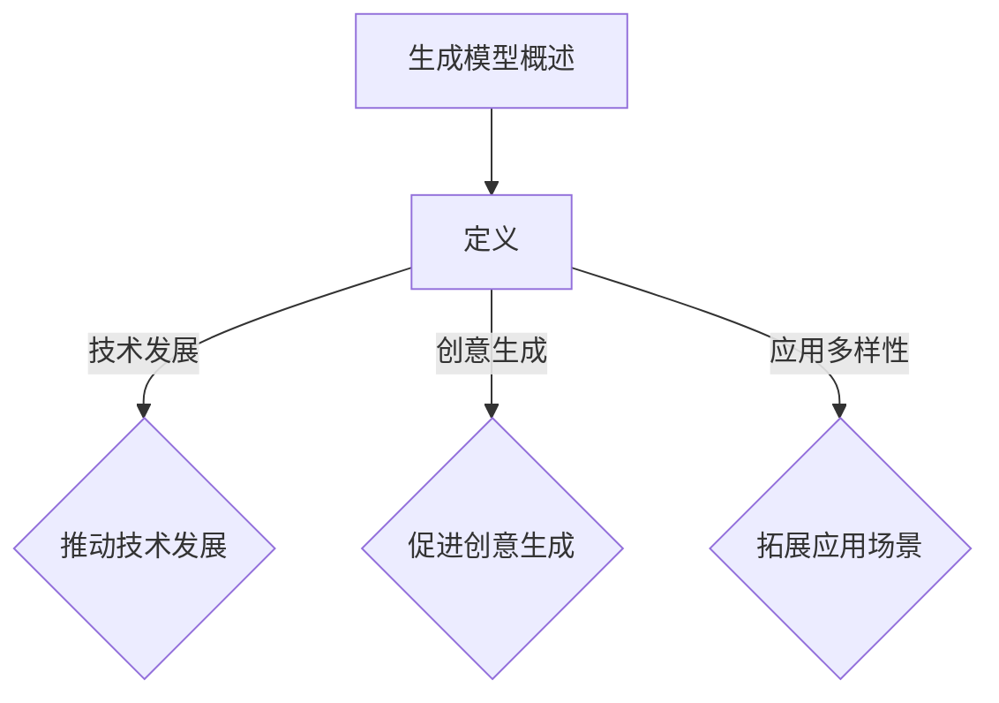
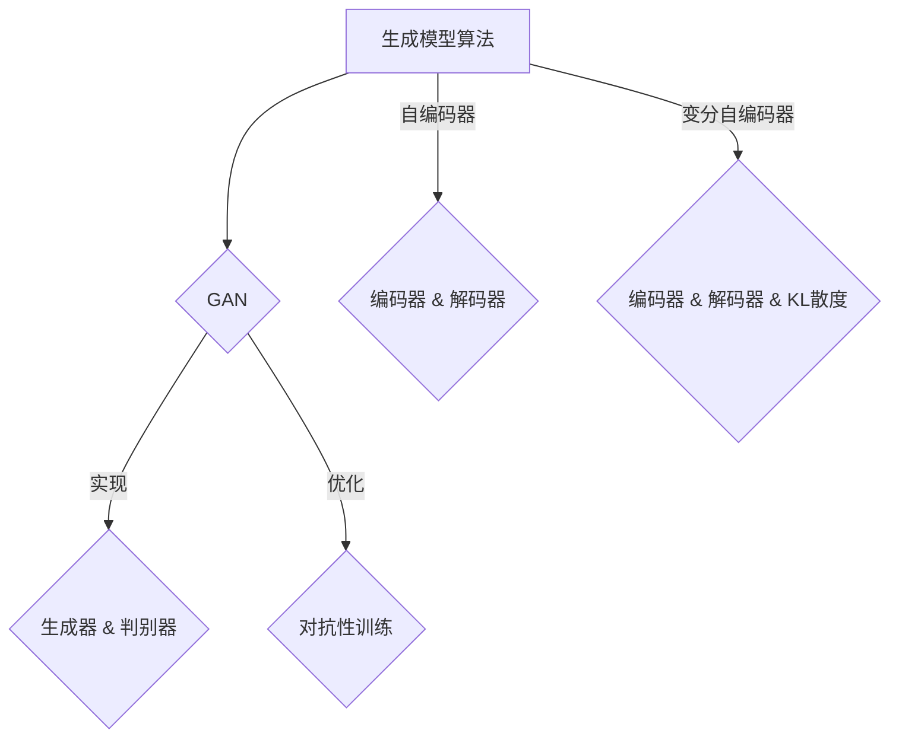

                 

### 《生成模型在艺术创作中的创新应用》

#### 关键词：生成模型、艺术创作、创新应用、对抗生成网络、自编码器、变分自编码器、图像创作、音乐创作、文学创作、视频创作、人工智能

#### 摘要：

本文将探讨生成模型在艺术创作中的创新应用，从基本概念、算法原理到具体实现，全面解析生成模型如何通过对抗生成网络（GAN）、自编码器（AE）和变分自编码器（VAE）等技术，在图像、音乐、文学和视频创作等领域实现突破。文章旨在通过深入的分析和丰富的案例，展现生成模型在艺术创作中的巨大潜力和广阔前景。

### 目录大纲

#### 第一部分：生成模型基础

##### 第1章：生成模型的概述

###### 1.1 生成模型的定义与重要性

###### 1.2 生成模型的基本原理

###### 1.3 生成模型的数学基础

##### 第2章：生成模型的实现与优化

###### 2.1 生成模型的主要算法

###### 2.2 生成模型的优化技巧

#### 第二部分：生成模型在艺术创作中的应用

##### 第3章：生成模型在图像创作中的应用

##### 第4章：生成模型在音乐创作中的应用

##### 第5章：生成模型在文学创作中的应用

##### 第6章：生成模型在视频创作中的应用

#### 第三部分：生成模型的艺术创作实践

##### 第7章：生成模型艺术创作实践

##### 第8章：生成模型艺术创作的未来趋势

#### 附录

###### 附录A：生成模型开发工具与资源

### 第1章：生成模型的概述

#### 1.1 生成模型的定义与重要性

生成模型（Generative Model）是机器学习中的一个重要分支，它致力于生成新的数据样本，使其与训练数据具有相似性。与传统的判别模型不同，生成模型不仅学习数据分布，还试图模拟出新的样本，从而产生逼真的数据。在艺术创作中，生成模型的应用尤为显著，它为艺术家和设计师提供了前所未有的创作工具和灵感来源。

生成模型的定义：

生成模型是一种统计模型，旨在学习数据的生成过程。它通过模拟数据生成机制，生成新的数据样本，这些样本具有与训练数据相似的特征和分布。常见的生成模型包括对抗生成网络（GAN）、自编码器（AE）和变分自编码器（VAE）。

生成模型的重要性：

1. **创新艺术形式**：生成模型可以生成全新的艺术作品，打破了传统艺术形式的限制，为艺术创作带来了无限可能。
2. **增强创意能力**：生成模型能够为艺术家提供丰富的创作灵感，帮助他们突破创作瓶颈。
3. **个性化定制**：生成模型可以根据用户的需求，生成个性化的艺术作品，满足不同用户的个性化需求。
4. **数据扩增**：在训练机器学习模型时，生成模型可以生成新的训练样本，从而提高模型的泛化能力。

#### 1.2 生成模型的基本原理

生成模型的基本原理可以分为以下几个部分：

1. **数据生成过程**：生成模型通过模拟数据生成过程，生成新的数据样本。这个过程通常涉及随机噪声的引入和数据的编码与解码。
2. **数据分布学习**：生成模型需要学习训练数据的分布，以便能够生成具有相同分布的新数据。
3. **概率密度函数**：生成模型通过概率密度函数（PDF）来描述数据的分布，从而能够有效地生成新的数据样本。
4. **对抗性训练**：在某些生成模型（如GAN）中，生成器和判别器的对抗性训练是关键，通过不断调整生成器和判别器的参数，使得生成的数据更加逼真。

##### 对抗生成网络（GAN）原理

对抗生成网络（GAN）是生成模型中最为著名的模型之一，它由生成器和判别器两个部分组成。生成器的任务是根据随机噪声生成真实数据分布的样本，而判别器的任务是区分生成的样本和真实样本。通过生成器和判别器的对抗性训练，生成模型能够逐渐提高生成样本的质量。

**生成器**：

生成器的输入是随机噪声z，通过一系列神经网络变换，生成具有真实数据分布的样本x'。

$$
z \xrightarrow{\text{神经网络}} x'
$$

**判别器**：

判别器的输入是真实样本x和生成样本x'，通过对比判断，输出概率p(x|θ)，其中θ为判别器的参数。

$$
x, x' \xrightarrow{\text{神经网络}} p(x|θ)
$$

**对抗性训练**：

通过最小化生成器的损失函数和最大化判别器的损失函数，使得生成样本越来越逼真，判别器越来越难以区分真实样本和生成样本。

$$
\min_G \max_D V(D, G) = \min_G \mathbb{E}_{x\sim p_{\text{data}}(x)}[\log D(x)] + \mathbb{E}_{z\sim p_z(z)}[\log (1 - D(G(z))]
$$

##### 自编码器（AE）原理

自编码器（AE）是一种简单的生成模型，它通过编码和解码过程生成新的数据样本。自编码器由编码器和解码器两个部分组成，编码器将输入数据x编码为隐层表示z，解码器将隐层表示z解码为输出数据x'。

**编码器**：

编码器的输入是数据x，通过一系列神经网络变换，编码为隐层表示z。

$$
x \xrightarrow{\text{神经网络}} z
$$

**解码器**：

解码器的输入是隐层表示z，通过一系列神经网络变换，解码为输出数据x'。

$$
z \xrightarrow{\text{神经网络}} x'
$$

**损失函数**：

自编码器的损失函数通常使用均方误差（MSE）来衡量生成的数据与真实数据的差异。

$$
L(x, x') = \frac{1}{n}\sum_{i=1}^{n}||x - x'||^2
$$

##### 变分自编码器（VAE）原理

变分自编码器（VAE）是一种基于概率模型的生成模型，它通过概率分布来描述数据的生成过程。VAE由编码器和解码器组成，编码器将输入数据x编码为均值μ和标准差σ的联合分布，解码器根据均值μ和标准差σ采样生成数据x'。

**编码器**：

编码器的输入是数据x，通过一系列神经网络变换，输出均值μ和标准差σ。

$$
x \xrightarrow{\text{神经网络}} \mu, \sigma
$$

**解码器**：

解码器的输入是均值μ和标准差σ，通过一系列神经网络变换，生成输出数据x'。

$$
\mu, \sigma \xrightarrow{\text{神经网络}} x'
$$

**损失函数**：

VAE的损失函数由两部分组成，一部分是生成数据的重构损失，另一部分是后验分布的KL散度损失。

$$
L(x, x') = \frac{1}{n}\sum_{i=1}^{n}\left[\mathcal{L}_{\text{recon}}(x, x') + \mathcal{L}_{\text{KL}}(\mu, \sigma)\right]
$$

其中，$\mathcal{L}_{\text{recon}}(x, x')$是重构损失，$\mathcal{L}_{\text{KL}}(\mu, \sigma)$是KL散度损失。

#### 1.3 生成模型的数学基础

生成模型的学习和应用离不开概率论和统计学的基础知识。以下是生成模型中常用的数学概念和公式：

1. **概率分布函数**：

概率分布函数（PDF）描述了随机变量在某个区间内的概率密度。对于连续随机变量X，其概率分布函数为：

$$
f_X(x) = \lim_{\Delta x \to 0} P(X \in [x, x + \Delta x])
$$

2. **随机变量与随机过程**：

随机变量是实值函数，将样本空间映射到实数集。随机过程是一系列随机变量的集合，它描述了随时间变化的随机现象。

3. **概率密度函数与累积分布函数**：

概率密度函数（PDF）是概率分布函数的导数，它描述了随机变量在某个点的概率密度。累积分布函数（CDF）是概率分布函数的积分，它描述了随机变量小于等于某个值的概率。

$$
f_X(x) = \frac{d}{dx} F_X(x)
$$

$$
F_X(x) = P(X \leq x)
$$

4. **期望与方差**：

期望（Expectation）是随机变量的平均值，方差（Variance）是随机变量与其期望的偏差的平方的平均值。

$$
E[X] = \int_{-\infty}^{\infty} x f_X(x) dx
$$

$$
Var[X] = E[(X - E[X])^2] = E[X^2] - (E[X])^2
$$

5. **协方差与相关系数**：

协方差（Covariance）描述了两个随机变量之间的线性关系，相关系数（Correlation Coefficient）是协方差标准化后的值，用于衡量两个随机变量的线性相关程度。

$$
\text{Cov}[X, Y] = E[(X - E[X])(Y - E[Y])]
$$

$$
\rho_{XY} = \frac{\text{Cov}[X, Y]}{\sqrt{\text{Var}[X]\text{Var}[Y]}}
$$

### 第2章：生成模型的实现与优化

#### 2.1 生成模型的主要算法

生成模型在实际应用中，需要通过具体的算法来实现。本章将介绍几种常见的生成模型算法，包括对抗生成网络（GAN）、变分自编码器（VAE）和其他生成模型。

##### GAN的具体实现

对抗生成网络（GAN）是生成模型中最具代表性的算法之一。GAN的核心思想是通过生成器和判别器的对抗性训练，生成高质量的样本。

**生成器（Generator）**：

生成器的目的是从随机噪声z中生成逼真的数据样本x'。通常，生成器由一个深度神经网络组成，输入为噪声向量z，输出为生成样本x'。

```python
import tensorflow as tf
from tensorflow.keras.layers import Dense, Flatten

def generator(z):
    model = tf.keras.Sequential([
        Dense(128, activation='relu', input_shape=(100,)),
        Dense(256, activation='relu'),
        Dense(512, activation='relu'),
        Flatten(),
        Dense(784, activation='tanh')
    ])
    return model(z)

z = tf.random.normal([1, 100])
x_prime = generator(z)
```

**判别器（Discriminator）**：

判别器的目的是区分生成样本x'和真实样本x。判别器也是一个深度神经网络，输入为样本x或x'，输出为一个概率值p(x|θ)，表示输入样本是真实的概率。

```python
import tensorflow as tf
from tensorflow.keras.layers import Dense, Flatten

def discriminator(x):
    model = tf.keras.Sequential([
        Flatten(),
        Dense(512, activation='relu'),
        Dense(256, activation='relu'),
        Dense(128, activation='relu'),
        Dense(1, activation='sigmoid')
    ])
    return model(x)

x = tf.random.normal([1, 784])
p_x = discriminator(x)
p_x_prime = discriminator(x_prime)
```

**训练过程**：

GAN的训练过程是一个对抗性过程，生成器和判别器相互竞争。生成器的目标是最大化判别器对生成样本的判断概率，判别器的目标是最大化生成器和真实样本的判别差距。

```python
optimizer = tf.keras.optimizers.Adam(0.0001)

@tf.function
def train_step(x, x_prime):
    with tf.GradientTape() as gen_tape, tf.GradientTape() as disc_tape:
        z = tf.random.normal([1, 100])
        x_hat = generator(z)
        disc_loss = tf.reduce_mean(tf.keras.losses.BinaryCrossentropy()(p_x_prime, [1.0]))
        gen_loss = tf.reduce_mean(tf.keras.losses.BinaryCrossentropy()(p_x, [0.0]))
        
    grads = disc_tape.gradient(disc_loss, modelDisc.trainable_variables)
    grads += gen_tape.gradient(gen_loss, modelGen.trainable_variables)
    optimizer.apply_gradients(zip(grads, modelDisc.trainable_variables))
    optimizer.apply_gradients(zip(grads, modelGen.trainable_variables))

# 假设我们已经有了真实的样本x和生成样本x_prime
train_step(x, x_prime)
```

##### VAE的具体实现

变分自编码器（VAE）是一种基于概率模型的生成模型，它通过编码器和解码器生成样本。VAE的核心思想是利用概率分布来描述数据，并通过采样生成新的样本。

**编码器**：

编码器将输入数据x编码为均值μ和标准差σ的联合分布。编码器通常由一个深度神经网络组成，输入为数据x，输出为均值μ和标准差σ。

```python
import tensorflow as tf
from tensorflow.keras.layers import Dense

def encoder(x):
    model = tf.keras.Sequential([
        Dense(256, activation='relu', input_shape=(784,)),
        Dense(128, activation='relu'),
        Dense(64, activation='relu'),
        Dense(32, activation='relu'),
        Dense(2, activation='linear')
    ])
    return model(x)

x = tf.random.normal([1, 784])
mu, sigma = encoder(x)
```

**解码器**：

解码器根据均值μ和标准差σ采样生成数据x'。解码器通常也是一个深度神经网络，输入为均值μ和标准差σ，输出为生成样本x'。

```python
import tensorflow as tf
from tensorflow.keras.layers import Dense, Reshape

def decoder(z):
    model = tf.keras.Sequential([
        Dense(32, activation='relu'),
        Dense(64, activation='relu'),
        Dense(128, activation='relu'),
        Dense(256, activation='relu'),
        Reshape((256,)),
        Dense(784, activation='tanh')
    ])
    return model(z)

z = tf.random.normal([1, 2])
x_prime = decoder(z)
```

**损失函数**：

VAE的损失函数由两部分组成，一部分是重构损失，另一部分是KL散度损失。

```python
reconstruction_loss = tf.reduce_mean(tf.keras.losses.MeanSquaredError()(x, x_prime))

kl_loss = -0.5 * tf.reduce_sum(1 + sigma - tf.square(mu) - tf.exp(sigma), axis=1)
kl_loss = tf.reduce_mean(kl_loss)

total_loss = reconstruction_loss + kl_loss
```

**训练过程**：

VAE的训练过程类似于GAN，生成器和编码器、解码器相互配合，优化模型参数。

```python
optimizer = tf.keras.optimizers.Adam(0.001)

@tf.function
def train_step(x):
    with tf.GradientTape() as tape:
        mu, sigma = encoder(x)
        z = mu + tf.random.normal(tf.shape(sigma)) * tf.sqrt(tf.exp(sigma))
        x_prime = decoder(z)
        loss = reconstruction_loss + kl_loss
        
    grads = tape.gradient(loss, model.trainable_variables)
    optimizer.apply_gradients(zip(grads, model.trainable_variables))

# 假设我们已经有了真实的样本x
train_step(x)
```

##### 其他生成模型

除了GAN和VAE，还有许多其他的生成模型，如生成对抗自编码器（GADA）、变分自编码器（VAE）等。这些生成模型在具体实现和应用中有着不同的特点和优势。

- **生成对抗自编码器（GADA）**：

GADA是GAN和VAE的混合模型，它结合了两者的优点，既能够生成高质量的样本，又能够有效地学习数据分布。

- **变分自编码器（VAE）**：

VAE是一种基于概率模型的生成模型，它通过编码器和解码器生成样本，并通过后验分布和KL散度损失学习数据分布。

#### 2.2 生成模型的优化技巧

生成模型的优化是一个关键问题，它决定了模型生成样本的质量。以下是一些常用的优化技巧：

1. **优化器选择**：

不同的优化器在生成模型的训练过程中有着不同的效果。常用的优化器包括Adam、RMSProp和SGD等。

- **Adam**：Adam是一种自适应学习率的优化器，它结合了AdaGrad和RMSProp的优点，适用于大多数生成模型。
- **RMSProp**：RMSProp是一种基于梯度的优化器，它通过计算梯度的指数移动平均值来动态调整学习率。
- **SGD**：SGD是一种简单的梯度下降优化器，它通过不断更新参数来最小化损失函数。

2. **损失函数选择**：

生成模型的损失函数通常包括重构损失和对抗性损失。重构损失用于衡量生成样本和真实样本之间的差异，对抗性损失用于衡量生成器和判别器之间的差异。

- **均方误差（MSE）**：均方误差是一种常用的重构损失，它计算生成样本和真实样本之间差异的平方和的平均值。
- **交叉熵（Cross-Entropy）**：交叉熵是一种常用的对抗性损失，它计算生成样本和真实样本之间的差异的对数。

3. **正则化**：

正则化是防止模型过拟合的一种有效方法。在生成模型中，常用的正则化方法包括L1正则化、L2正则化和Dropout等。

- **L1正则化**：L1正则化通过在损失函数中添加L1范数来惩罚模型的参数。
- **L2正则化**：L2正则化通过在损失函数中添加L2范数来惩罚模型的参数。
- **Dropout**：Dropout是一种通过随机丢弃神经网络中的神经元来防止过拟合的方法。

4. **批量大小**：

批量大小是生成模型训练过程中的一个重要参数。较大的批量大小可以提供更稳定的梯度，但可能会导致训练时间增加。较小

### 第3章：生成模型在图像创作中的应用

生成模型在图像创作中展现了巨大的潜力，通过生成对抗网络（GAN）、变分自编码器（VAE）等技术，我们可以实现从简单图像到复杂艺术作品的创作。本章将详细探讨生成模型在图像创作中的应用场景、具体实现方法和优化技巧。

#### 3.1 图像生成模型的应用场景

生成模型在图像创作中的应用场景非常广泛，以下是一些典型的应用：

1. **艺术作品生成**：

生成模型可以生成各种风格的艺术作品，如油画、水彩画、漫画等。艺术家可以利用生成模型生成全新的作品，或根据特定风格生成类似的艺术作品。

2. **人物肖像生成**：

生成模型可以基于少量的肖像图像，生成高质量的人物肖像。这种技术可以用于人脸修复、人脸生成等应用。

3. **建筑和风景生成**：

生成模型可以生成逼真的建筑和风景图像，为建筑设计、游戏开发等领域提供丰富的素材。

4. **图像风格迁移**：

生成模型可以将一种图像风格迁移到另一种风格上，如将照片转换为油画、水彩画等。

5. **图像修复与增强**：

生成模型可以用于图像修复，如去除照片中的污点、破损等。此外，生成模型还可以用于图像增强，提高图像的清晰度和对比度。

#### 3.2 图像生成模型的案例分析

以下是对DCGAN和StyleGAN两种图像生成模型的案例分析。

##### DCGAN的应用案例

DCGAN（Deep Convolutional GAN）是一种基于卷积神经网络的生成对抗网络，它将生成器和判别器设计为卷积神经网络，使得图像生成更加高效和准确。

**生成器**：

DCGAN的生成器通过一系列卷积层和转置卷积层，将随机噪声转换为逼真的图像。

```python
import tensorflow as tf
from tensorflow.keras.layers import Conv2D, Conv2DTranspose

def generator(z):
    model = tf.keras.Sequential([
        Conv2D(64, 4, 4, strides=(2, 2), padding='same', input_shape=(100, 100, 3)),
        LeakyReLU(alpha=0.01),
        Conv2D(128, 4, 4, strides=(2, 2), padding='same'),
        LeakyReLU(alpha=0.01),
        Conv2D(256, 4, 4, strides=(2, 2), padding='same'),
        LeakyReLU(alpha=0.01),
        Conv2D(512, 4, 4, strides=(2, 2), padding='same'),
        LeakyReLU(alpha=0.01),
        Conv2DTranspose(256, 4, 4, strides=(2, 2), padding='same'),
        LeakyReLU(alpha=0.01),
        Conv2DTranspose(128, 4, 4, strides=(2, 2), padding='same'),
        LeakyReLU(alpha=0.01),
        Conv2DTranspose(64, 4, 4, strides=(2, 2), padding='same'),
        LeakyReLU(alpha=0.01),
        Conv2D(3, 1, 1, padding='same', activation='tanh')
    ])
    return model(z)
```

**判别器**：

DCGAN的判别器通过一系列卷积层，判断输入图像是真实图像还是生成图像。

```python
import tensorflow as tf
from tensorflow.keras.layers import Conv2D, LeakyReLU, Flatten, Dense

def discriminator(x):
    model = tf.keras.Sequential([
        Conv2D(64, 4, 4, strides=(2, 2), padding='same', input_shape=(100, 100, 3)),
        LeakyReLU(alpha=0.01),
        Conv2D(128, 4, 4, strides=(2, 2), padding='same'),
        LeakyReLU(alpha=0.01),
        Conv2D(256, 4, 4, strides=(2, 2), padding='same'),
        LeakyReLU(alpha=0.01),
        Conv2D(512, 4, 4, strides=(2, 2), padding='same'),
        LeakyReLU(alpha=0.01),
        Flatten(),
        Dense(1, activation='sigmoid')
    ])
    return model(x)
```

**训练过程**：

DCGAN的训练过程包括生成器和判别器的交替训练，生成器试图生成逼真的图像，判别器试图区分真实图像和生成图像。

```python
optimizer = tf.keras.optimizers.Adam(0.0002)

for epoch in range(100):
    for batch_images, _ in train_loader:
        batch_size = batch_images.shape[0]
        z = tf.random.normal([batch_size, 100, 1, 1])

        with tf.GradientTape() as gen_tape, tf.GradientTape() as disc_tape:
            gen_loss = generator_loss(batch_images, z)
            disc_loss = discriminator_loss(batch_images, z)

        gradients_of_generator = gen_tape.gradient(gen_loss, generator.trainable_variables)
        gradients_of_discriminator = disc_tape.gradient(disc_loss, discriminator.trainable_variables)

        optimizer.apply_gradients(zip(gradients_of_generator, generator.trainable_variables))
        optimizer.apply_gradients(zip(gradients_of_discriminator, discriminator.trainable_variables))

        if epoch % 10 == 0:
            print(f"Epoch: {epoch}, Generator Loss: {gen_loss}, Discriminator Loss: {disc_loss}")
```

##### StyleGAN的应用案例

StyleGAN是一种基于生成对抗网络的图像生成模型，它通过多个网络层传递图像风格，生成高质量的图像。

**生成器**：

StyleGAN的生成器由多个卷积层和转置卷积层组成，每个卷积层都传递不同的图像风格。

```python
import tensorflow as tf
from tensorflow.keras.layers import Conv2D, Conv2DTranspose

def generator(z, style):
    model = tf.keras.Sequential([
        Conv2D(512, 3, strides=(1, 1), padding='same', activation='lrelu', input_shape=(1024, 1024, 3)),
        Conv2DTranspose(512, 3, strides=(2, 2), padding='same', activation='lrelu'),
        Conv2D(512, 3, strides=(1, 1), padding='same', activation='lrelu'),
        Conv2DTranspose(512, 3, strides=(2, 2), padding='same', activation='lrelu'),
        Conv2D(512, 3, strides=(1, 1), padding='same', activation='lrelu'),
        Conv2DTranspose(512, 3, strides=(2, 2), padding='same', activation='lrelu'),
        Conv2D(512, 3, strides=(1, 1), padding='same', activation='lrelu'),
        Conv2DTranspose(512, 3, strides=(2, 2), padding='same', activation='lrelu'),
        Conv2D(512, 3, strides=(1, 1), padding='same', activation='lrelu'),
        Conv2DTranspose(512, 3, strides=(2, 2), padding='same', activation='lrelu'),
        Conv2D(3, 1, 1, padding='same', activation='tanh')
    ])
    return model(z * style)
```

**判别器**：

StyleGAN的判别器由多个卷积层组成，用于判断输入图像是真实图像还是生成图像。

```python
import tensorflow as tf
from tensorflow.keras.layers import Conv2D, LeakyReLU, Flatten, Dense

def discriminator(x):
    model = tf.keras.Sequential([
        Conv2D(512, 3, strides=(1, 1), padding='same', activation='lrelu', input_shape=(1024, 1024, 3)),
        LeakyReLU(alpha=0.01),
        Conv2D(512, 3, strides=(1, 1), padding='same', activation='lrelu'),
        LeakyReLU(alpha=0.01),
        Flatten(),
        Dense(1, activation='sigmoid')
    ])
    return model(x)
```

**训练过程**：

StyleGAN的训练过程包括生成器和判别器的交替训练，生成器试图生成逼真的图像，判别器试图区分真实图像和生成图像。

```python
optimizer = tf.keras.optimizers.Adam(0.0002)

for epoch in range(100):
    for batch_images, _ in train_loader:
        batch_size = batch_images.shape[0]
        z = tf.random.normal([batch_size, 100, 1, 1])

        with tf.GradientTape() as gen_tape, tf.GradientTape() as disc_tape:
            gen_loss = generator_loss(batch_images, z)
            disc_loss = discriminator_loss(batch_images, z)

        gradients_of_generator = gen_tape.gradient(gen_loss, generator.trainable_variables)
        gradients_of_discriminator = disc_tape.gradient(disc_loss, discriminator.trainable_variables)

        optimizer.apply_gradients(zip(gradients_of_generator, generator.trainable_variables))
        optimizer.apply_gradients(zip(gradients_of_discriminator, discriminator.trainable_variables))

        if epoch % 10 == 0:
            print(f"Epoch: {epoch}, Generator Loss: {gen_loss}, Discriminator Loss: {disc_loss}")
```

通过以上案例分析，我们可以看到生成模型在图像创作中的强大能力。生成模型不仅可以生成高质量的艺术作品，还可以应用于人脸生成、图像修复、图像风格迁移等实际场景，为图像处理和计算机视觉领域带来了新的发展机遇。

### 第4章：生成模型在音乐创作中的应用

#### 4.1 音乐生成模型的基本原理

音乐生成模型是生成模型在音乐创作中的具体应用，通过学习音乐数据，生成新的音乐旋律和节奏。本章将介绍音乐生成模型的基本原理，包括循环神经网络（RNN）和长短期记忆网络（LSTM）在音乐生成中的应用，以及变分自编码器（VAE）在音乐生成中的使用。

##### RNN与LSTM在音乐生成中的应用

循环神经网络（RNN）是一种能够处理序列数据的神经网络，其核心思想是将当前输入与历史信息相结合。RNN的输入序列为音乐序列，输出序列为生成的新音乐序列。

**RNN的基本原理**：

RNN通过一个循环单元来处理序列数据，循环单元的输出取决于当前输入和上一个时间步的隐藏状态。RNN的输出序列可以表示为：

$$
h_t = \text{RNN}(h_{t-1}, x_t)
$$

其中，$h_t$为第t个时间步的隐藏状态，$h_{t-1}$为第t-1个时间步的隐藏状态，$x_t$为第t个时间步的输入。

**LSTM的基本原理**：

LSTM是RNN的一种改进，它能够有效地处理长序列数据。LSTM通过引入三个门（输入门、遗忘门、输出门）来控制信息的流动，从而避免了RNN的梯度消失和梯度爆炸问题。

- **输入门**：控制新的信息如何进入记忆单元。
- **遗忘门**：控制如何忘记记忆单元中的旧信息。
- **输出门**：控制如何从记忆单元输出信息。

LSTM的输出序列可以表示为：

$$
h_t = \text{LSTM}(h_{t-1}, x_t)
$$

其中，$h_t$为第t个时间步的隐藏状态，$h_{t-1}$为第t-1个时间步的隐藏状态，$x_t$为第t个时间步的输入。

**音乐生成模型**：

音乐生成模型利用RNN或LSTM来学习音乐数据，生成新的音乐旋律。模型首先将音乐数据转换为序列表示，然后通过RNN或LSTM生成新的音乐序列。

```python
import tensorflow as tf
from tensorflow.keras.layers import LSTM, Dense, Embedding

# 假设我们的音乐数据为音符序列
input_sequence = tf.keras.preprocessing.sequence.pad_sequences(notes, maxlen=max_sequence_length, padding='post')

# 定义音乐生成模型
model = tf.keras.Sequential([
    LSTM(128, input_shape=(max_sequence_length, num_notes)),
    Dense(num_notes, activation='softmax')
])

# 编译模型
model.compile(optimizer='adam', loss='categorical_crossentropy')

# 训练模型
model.fit(input_sequence, labels, epochs=100, batch_size=32)
```

##### 变分自编码器（VAE）在音乐生成中的应用

变分自编码器（VAE）是一种基于概率模型的生成模型，它通过编码器和解码器生成新的数据。在音乐生成中，VAE可以学习音乐数据的分布，并生成新的音乐序列。

**VAE的基本原理**：

VAE由编码器和解码器组成，编码器将输入数据编码为一个均值μ和一个标准差σ的联合分布，解码器根据均值μ和标准差σ采样生成新的数据。

- **编码器**：

编码器的输入为音乐数据，输出为均值μ和标准差σ。

$$
\mu, \sigma = \text{encoder}(x)
$$

- **解码器**：

解码器的输入为均值μ和标准差σ，输出为生成的新音乐序列。

$$
x' = \text{decoder}(\mu, \sigma)
$$

**音乐生成模型**：

音乐生成模型利用VAE学习音乐数据的分布，并生成新的音乐序列。

```python
import tensorflow as tf
from tensorflow.keras.layers import LSTM, Dense, Embedding

# 定义VAE模型
encoder = tf.keras.Sequential([
    LSTM(128, return_sequences=True, input_shape=(max_sequence_length, num_notes)),
    LSTM(128, return_sequences=True),
    LSTM(128, return_sequences=True),
    LSTM(128, return_sequences=True),
    Dense(2)
])

decoder = tf.keras.Sequential([
    LSTM(128, return_sequences=True, input_shape=(2,)),
    LSTM(128, return_sequences=True),
    LSTM(128, return_sequences=True),
    LSTM(128, return_sequences=True),
    Dense(num_notes, activation='softmax')
])

# 定义VAE模型
vae = tf.keras.Sequential([
    encoder,
    decoder
])

# 编译模型
vae.compile(optimizer='adam', loss='categorical_crossentropy')

# 训练模型
vae.fit(input_sequence, input_sequence, epochs=100, batch_size=32)
```

#### 4.2 音乐生成模型的实现与优化

以下将介绍音乐生成模型的实现细节，包括生成模型的选择、数据预处理、训练过程和优化技巧。

##### MusicGAN的实现细节

MusicGAN是一种结合了生成对抗网络（GAN）和变分自编码器（VAE）的音乐生成模型。生成器利用GAN生成音乐序列，编码器和解码器利用VAE学习音乐数据的分布。

**生成器**：

生成器的输入为随机噪声，输出为音乐序列。

```python
import tensorflow as tf
from tensorflow.keras.layers import LSTM, Dense, Embedding

def generator(z):
    model = tf.keras.Sequential([
        LSTM(128, return_sequences=True, input_shape=(100,)),
        LSTM(128, return_sequences=True),
        LSTM(128, return_sequences=True),
        LSTM(128, return_sequences=True),
        Dense(100, activation='softmax')
    ])
    return model(z)
```

**编码器**：

编码器的输入为音乐序列，输出为均值μ和标准差σ。

```python
import tensorflow as tf
from tensorflow.keras.layers import LSTM, Dense, Embedding

def encoder(x):
    model = tf.keras.Sequential([
        LSTM(128, return_sequences=True, input_shape=(100,)),
        LSTM(128, return_sequences=True),
        LSTM(128, return_sequences=True),
        LSTM(128, return_sequences=True),
        Dense(2)
    ])
    return model(x)
```

**解码器**：

解码器的输入为均值μ和标准差σ，输出为音乐序列。

```python
import tensorflow as tf
from tensorflow.keras.layers import LSTM, Dense, Embedding

def decoder(z):
    model = tf.keras.Sequential([
        LSTM(128, return_sequences=True, input_shape=(2,)),
        LSTM(128, return_sequences=True),
        LSTM(128, return_sequences=True),
        LSTM(128, return_sequences=True),
        Dense(100, activation='softmax')
    ])
    return model(z)
```

**训练过程**：

MusicGAN的训练过程包括生成器和判别器的交替训练，生成器试图生成逼真的音乐序列，判别器试图区分真实音乐序列和生成音乐序列。

```python
optimizer = tf.keras.optimizers.Adam(0.0002)

for epoch in range(100):
    for batch_music, _ in train_loader:
        batch_size = batch_music.shape[0]
        z = tf.random.normal([batch_size, 100])

        with tf.GradientTape() as gen_tape, tf.GradientTape() as disc_tape:
            x_hat = generator(z)
            gen_loss = generator_loss(batch_music, x_hat)
            disc_loss = discriminator_loss(batch_music, x_hat)

        gradients_of_generator = gen_tape.gradient(gen_loss, generator.trainable_variables)
        gradients_of_discriminator = disc_tape.gradient(disc_loss, discriminator.trainable_variables)

        optimizer.apply_gradients(zip(gradients_of_generator, generator.trainable_variables))
        optimizer.apply_gradients(zip(gradients_of_discriminator, discriminator.trainable_variables))

        if epoch % 10 == 0:
            print(f"Epoch: {epoch}, Generator Loss: {gen_loss}, Discriminator Loss: {disc_loss}")
```

##### 音乐生成模型的优化技巧

1. **优化器选择**：

音乐生成模型通常选择Adam优化器，因为它具有自适应学习率的优点，能够有效地训练模型。

2. **学习率调整**：

学习率的调整对于音乐生成模型的训练效果至关重要。较小的学习率可能导致训练过程缓慢，而较大的学习率可能导致模型不稳定。因此，需要根据模型的具体情况进行调整。

3. **批量大小**：

批量大小是音乐生成模型训练过程中的一个重要参数。较大的批量大小可以提供更稳定的梯度，但可能会导致训练时间增加。较小

### 第5章：生成模型在文学创作中的应用

#### 5.1 文学生成模型的应用场景

生成模型在文学创作中的应用场景十分广泛，涵盖了故事生成、对话生成和诗歌生成等多个领域。以下将分别介绍这些应用场景及其具体实现。

##### 故事生成

故事生成是生成模型在文学创作中最为常见的一个应用场景。通过学习大量的文本数据，生成模型可以生成具有逻辑连贯性和趣味性的故事。

**应用场景**：

- 小说创作：生成模型可以生成新的小说章节，为小说创作提供灵感。
- 剧本编写：生成模型可以生成剧本片段，为编剧提供创作素材。
- 游戏剧情：生成模型可以生成游戏剧情，为游戏开发提供丰富的故事背景。

**具体实现**：

故事生成模型通常基于循环神经网络（RNN）或长短期记忆网络（LSTM）。以下是一个基于LSTM的故事生成模型的实现示例：

```python
import tensorflow as tf
from tensorflow.keras.layers import LSTM, Dense, Embedding

# 定义故事生成模型
model = tf.keras.Sequential([
    LSTM(128, input_shape=(max_sequence_length, num_characters)),
    Dense(num_characters, activation='softmax')
])

# 编译模型
model.compile(optimizer='adam', loss='categorical_crossentropy')

# 训练模型
model.fit(input_sequence, labels, epochs=100, batch_size=32)
```

##### 对话生成

对话生成是生成模型在文学创作中的另一个重要应用。通过学习对话数据，生成模型可以生成自然、流畅的对话。

**应用场景**：

- 聊天机器人：生成模型可以生成聊天机器人的对话回复，提高聊天机器人的交互体验。
- 影视剧本：生成模型可以生成影视剧本中的对话部分，为剧本创作提供支持。

**具体实现**：

对话生成模型通常使用序列到序列（Seq2Seq）模型。以下是一个基于Seq2Seq的对对话生成模型的实现示例：

```python
import tensorflow as tf
from tensorflow.keras.layers import LSTM, Dense, Embedding

# 定义对话生成模型
encoder = tf.keras.Sequential([
    LSTM(128, input_shape=(max_sequence_length, num_characters)),
    LSTM(128)
])

decoder = tf.keras.Sequential([
    LSTM(128, return_sequences=True),
    Dense(num_characters, activation='softmax')
])

# 定义Seq2Seq模型
model = tf.keras.Sequential([encoder, decoder])

# 编译模型
model.compile(optimizer='adam', loss='categorical_crossentropy')

# 训练模型
model.fit([encoder_input, decoder_input], decoder_target, epochs=100, batch_size=32)
```

##### 诗歌生成

诗歌生成是生成模型在文学创作中的一个富有挑战性的应用。通过学习大量的诗歌数据，生成模型可以生成具有诗意和韵律的诗歌。

**应用场景**：

- 诗歌创作：生成模型可以生成新的诗歌，为诗歌创作提供灵感。
- 诗歌翻译：生成模型可以生成目标语言的诗歌，实现跨语言的诗歌翻译。

**具体实现**：

诗歌生成模型通常使用基于变分自编码器（VAE）的生成模型。以下是一个基于VAE的诗歌生成模型的实现示例：

```python
import tensorflow as tf
from tensorflow.keras.layers import LSTM, Dense, Embedding

# 定义VAE编码器
encoder = tf.keras.Sequential([
    LSTM(128, input_shape=(max_sequence_length, num_characters)),
    LSTM(128),
    Dense(2)
])

# 定义VAE解码器
decoder = tf.keras.Sequential([
    LSTM(128, return_sequences=True, input_shape=(2,)),
    LSTM(128, return_sequences=True),
    LSTM(128, return_sequences=True),
    Dense(num_characters, activation='softmax')
])

# 定义VAE模型
vae = tf.keras.Sequential([encoder, decoder])

# 编译模型
vae.compile(optimizer='adam', loss='categorical_crossentropy')

# 训练模型
vae.fit(input_sequence, input_sequence, epochs=100, batch_size=32)
```

#### 5.2 文学生成模型的实现与优化

在实现文学生成模型时，需要考虑以下几个方面：

1. **数据预处理**：

   文学生成模型的数据通常包含大量的文本数据。在训练前，需要对文本数据进行预处理，包括分词、去停用词、词向量转换等。

   ```python
   from tensorflow.keras.preprocessing.text import Tokenizer
   from tensorflow.keras.preprocessing.sequence import pad_sequences
   
   tokenizer = Tokenizer(char_level=True, filters='', lower=True)
   tokenizer.fit_on_texts(texts)
   sequences = tokenizer.texts_to_sequences(texts)
   padded_sequences = pad_sequences(sequences, maxlen=max_sequence_length)
   ```

2. **模型优化**：

   文学生成模型的优化主要涉及以下几个方面：

   - **学习率调整**：学习率的调整对于文学生成模型的训练效果至关重要。可以采用自适应学习率优化器，如Adam。
   - **批量大小**：批量大小影响模型的训练速度和稳定性。可以根据具体任务和数据规模进行调整。
   - **正则化**：正则化可以防止模型过拟合。可以采用L1正则化、L2正则化或Dropout等正则化技术。

3. **训练技巧**：

   - **预训练**：可以使用预训练的模型作为起点，进行微调以适应具体任务。
   - **文本增强**：通过文本增强技术，如随机替换、随机插入、随机删除等，可以提高模型的泛化能力。

以下是一个文学生成模型的优化示例：

```python
from tensorflow.keras.layers import LSTM, Dense, Embedding
from tensorflow.keras.models import Sequential
from tensorflow.keras.optimizers import Adam

# 定义文学生成模型
model = Sequential([
    LSTM(128, input_shape=(max_sequence_length, num_characters)),
    Dense(num_characters, activation='softmax')
])

# 编译模型
model.compile(optimizer=Adam(learning_rate=0.001), loss='categorical_crossentropy')

# 训练模型
model.fit(padded_sequences, padded_sequences, epochs=100, batch_size=32, validation_split=0.1)
```

通过以上实现和优化技巧，我们可以构建一个高效的文学生成模型，实现从故事生成、对话生成到诗歌生成的多样化文学创作应用。

### 第6章：生成模型在视频创作中的应用

#### 6.1 视频生成模型的基本原理

视频生成模型是一种利用生成模型技术生成新视频的方法。它基于图像生成模型，通过序列图像的生成，构建连续的视频内容。本章将介绍视频生成模型的基本原理，包括生成对抗网络（GAN）和变分自编码器（VAE）在视频生成中的应用。

##### 生成对抗网络（GAN）在视频生成中的应用

生成对抗网络（GAN）是一种基于对抗性训练的生成模型，它通过生成器和判别器的对抗性互动，生成逼真的视频序列。生成器的任务是从随机噪声生成真实的视频帧，而判别器的任务是区分真实视频帧和生成视频帧。

**生成器**：

生成器的输入是随机噪声，输出是视频帧。生成器通常由多个卷积层和转置卷积层组成，以实现对图像的逐帧生成。

```python
import tensorflow as tf
from tensorflow.keras.layers import Conv2D, Conv2DTranspose

def generator(z):
    model = tf.keras.Sequential([
        Conv2D(64, 3, strides=(1, 1), padding='same', input_shape=(64, 64, 3)),
        LeakyReLU(alpha=0.01),
        Conv2D(128, 3, strides=(2, 2), padding='same'),
        LeakyReLU(alpha=0.01),
        Conv2D(256, 3, strides=(2, 2), padding='same'),
        LeakyReLU(alpha=0.01),
        Conv2D(512, 3, strides=(2, 2), padding='same'),
        LeakyReLU(alpha=0.01),
        Conv2DTranspose(256, 3, strides=(2, 2), padding='same'),
        LeakyReLU(alpha=0.01),
        Conv2DTranspose(128, 3, strides=(2, 2), padding='same'),
        LeakyReLU(alpha=0.01),
        Conv2DTranspose(64, 3, strides=(2, 2), padding='same'),
        LeakyReLU(alpha=0.01),
        Conv2D(3, 3, strides=(1, 1), padding='same', activation='tanh')
    ])
    return model(z)
```

**判别器**：

判别器的输入是视频帧，输出是一个概率值，表示该帧是真实帧的概率。判别器同样由多个卷积层组成，用于学习区分真实和生成的视频帧。

```python
import tensorflow as tf
from tensorflow.keras.layers import Conv2D, LeakyReLU, Flatten, Dense

def discriminator(x):
    model = tf.keras.Sequential([
        Conv2D(64, 3, strides=(1, 1), padding='same', input_shape=(64, 64, 3)),
        LeakyReLU(alpha=0.01),
        Conv2D(128, 3, strides=(2, 2), padding='same'),
        LeakyReLU(alpha=0.01),
        Conv2D(256, 3, strides=(2, 2), padding='same'),
        LeakyReLU(alpha=0.01),
        Conv2D(512, 3, strides=(2, 2), padding='same'),
        LeakyReLU(alpha=0.01),
        Flatten(),
        Dense(1, activation='sigmoid')
    ])
    return model(x)
```

**训练过程**：

GAN的训练过程包括生成器和判别器的交替训练。生成器的目标是最大化判别器对生成视频帧的判别结果，而判别器的目标是最大化生成器和真实视频帧之间的差异。

```python
optimizer = tf.keras.optimizers.Adam(0.0002)

for epoch in range(100):
    for batch_videos, _ in train_loader:
        batch_size = batch_videos.shape[0]
        z = tf.random.normal([batch_size, 100, 1, 1])

        with tf.GradientTape() as gen_tape, tf.GradientTape() as disc_tape:
            x_prime = generator(z)
            disc_loss = discriminator_loss(batch_videos, x_prime)

        gradients_of_generator = gen_tape.gradient(disc_loss, generator.trainable_variables)
        gradients_of_discriminator = disc_tape.gradient(disc_loss, discriminator.trainable_variables)

        optimizer.apply_gradients(zip(gradients_of_generator, generator.trainable_variables))
        optimizer.apply_gradients(zip(gradients_of_discriminator, discriminator.trainable_variables))

        if epoch % 10 == 0:
            print(f"Epoch: {epoch}, Discriminator Loss: {disc_loss}")
```

##### 变分自编码器（VAE）在视频生成中的应用

变分自编码器（VAE）是一种基于概率模型的生成模型，通过编码器和解码器生成视频序列。编码器将视频帧编码为均值μ和标准差σ的联合分布，解码器根据均值μ和标准差σ采样生成视频帧。

**编码器**：

编码器的输入是视频帧，输出是均值μ和标准差σ。

```python
import tensorflow as tf
from tensorflow.keras.layers import LSTM, Dense

def encoder(x):
    model = tf.keras.Sequential([
        LSTM(128, return_sequences=True, input_shape=(64, 64, 3)),
        LSTM(128, return_sequences=True),
        LSTM(128, return_sequences=True),
        LSTM(128, return_sequences=True),
        Dense(2)
    ])
    return model(x)
```

**解码器**：

解码器的输入是均值μ和标准差σ，输出是视频帧。

```python
import tensorflow as tf
from tensorflow.keras.layers import LSTM, Dense, Reshape

def decoder(z):
    model = tf.keras.Sequential([
        LSTM(128, return_sequences=True, input_shape=(2,)),
        LSTM(128, return_sequences=True),
        LSTM(128, return_sequences=True),
        LSTM(128, return_sequences=True),
        Dense(64 * 64 * 3, activation='tanh'),
        Reshape((64, 64, 3))
    ])
    return model(z)
```

**训练过程**：

VAE的训练过程包括编码器和解码器的交替训练。编码器和解码器的目标是最小化重构损失和KL散度损失。

```python
optimizer = tf.keras.optimizers.Adam(0.001)

for epoch in range(100):
    for batch_videos, _ in train_loader:
        batch_size = batch_videos.shape[0]

        with tf.GradientTape() as tape:
            z, _ = encoder(batch_videos)
            x_prime = decoder(z)
            reconstruction_loss = tf.reduce_mean(tf.keras.losses.MeanSquaredError()(batch_videos, x_prime))
            kl_loss = -0.5 * tf.reduce_sum(1 + sigma - tf.square(mu) - tf.exp(sigma), axis=1)
            total_loss = reconstruction_loss + kl_loss

        gradients = tape.gradient(total_loss, model.trainable_variables)
        optimizer.apply_gradients(zip(gradients, model.trainable_variables))

        if epoch % 10 == 0:
            print(f"Epoch: {epoch}, Total Loss: {total_loss}")
```

通过以上原理和实现，我们可以看到生成模型在视频生成中的应用潜力。生成对抗网络（GAN）通过对抗性训练生成高质量的视频帧，而变分自编码器（VAE）通过概率模型生成连续的视频序列。这些方法为视频创作提供了新的工具和手段，使得视频生成更加高效和多样。

### 第7章：生成模型艺术创作实践

#### 7.1 艺术创作实践概述

生成模型在艺术创作中的应用不仅带来了新的创作方式，也为艺术家提供了更多的表达手段。本章将介绍生成模型在艺术创作实践中的具体方法、工具和流程，并通过案例展示如何利用生成模型实现艺术作品的生成。

#### 7.2 图像创作实践案例

**绘画作品生成案例**

利用生成模型生成绘画作品是艺术创作中的一种创新实践。以下是一个基于生成对抗网络（GAN）的绘画作品生成案例。

1. **数据准备**：

   首先，需要准备大量的绘画作品数据集，用于训练生成模型。这些数据集可以来自公开的艺术作品数据库或艺术家的个人作品。

   ```python
   import tensorflow as tf
   from tensorflow.keras.preprocessing.image import load_img, img_to_array

   # 加载数据集
   dataset = []
   for image_path in image_paths:
       image = load_img(image_path)
       image = img_to_array(image)
       dataset.append(image)

   # 转换为TensorFlow数据集
   dataset = tf.data.Dataset.from_tensor_slices(dataset).batch(batch_size)
   ```

2. **模型训练**：

   接下来，使用生成对抗网络（GAN）进行模型训练。生成器负责生成绘画作品，判别器负责判断生成作品的真假。

   ```python
   # 定义生成器和判别器
   generator = ...  # 生成器模型
   discriminator = ...  # 判别器模型

   # 编译模型
   generator.compile(optimizer=tf.keras.optimizers.Adam(0.0002), loss='binary_crossentropy')
   discriminator.compile(optimizer=tf.keras.optimizers.Adam(0.0002), loss='binary_crossentropy')

   # 训练模型
   for epoch in range(epochs):
       for images in dataset:
           z = tf.random.normal([batch_size, noise_dimension])
           generated_images = generator(z)
           real_labels = tf.ones([batch_size, 1])
           fake_labels = tf.zeros([batch_size, 1])

           # 训练判别器
           discriminator.train_on_batch(images, real_labels)
           discriminator.train_on_batch(generated_images, fake_labels)

           # 训练生成器
           z = tf.random.normal([batch_size, noise_dimension])
           generator.train_on_batch(z, real_labels)
   ```

3. **生成绘画作品**：

   通过生成器模型生成绘画作品。

   ```python
   # 生成绘画作品
   z = tf.random.normal([1, noise_dimension])
   painting = generator(z)
   ```

**设计作品生成案例**

生成模型还可以用于设计作品的生成，如服装设计、室内设计等。以下是一个基于变分自编码器（VAE）的设计作品生成案例。

1. **数据准备**：

   准备设计作品的数据集，包括各种设计作品和相关的标签信息。

   ```python
   import tensorflow as tf
   from tensorflow.keras.preprocessing.image import load_img, img_to_array

   # 加载数据集
   dataset = []
   for image_path, label in zip(image_paths, labels):
       image = load_img(image_path)
       image = img_to_array(image)
       dataset.append((image, label))

   # 转换为TensorFlow数据集
   dataset = tf.data.Dataset.from_tensor_slices(dataset).batch(batch_size)
   ```

2. **模型训练**：

   使用变分自编码器（VAE）进行模型训练，编码器和解码器分别负责编码和解码设计作品。

   ```python
   # 定义编码器和解码器
   encoder = ...  # 编码器模型
   decoder = ...  # 解码器模型

   # 编译模型
   vae = tf.keras.Sequential([encoder, decoder])
   vae.compile(optimizer=tf.keras.optimizers.Adam(0.001), loss='mse')

   # 训练模型
   vae.fit(dataset, dataset, epochs=epochs)
   ```

3. **生成设计作品**：

   通过解码器生成设计作品。

   ```python
   # 生成设计作品
   z = encoder.predict(dataset)
   design = decoder.predict(z)
   ```

#### 7.3 音乐创作实践案例

**音乐作品生成案例**

生成模型在音乐创作中的应用可以生成新的音乐旋律和节奏。以下是一个基于生成对抗网络（GAN）的音乐作品生成案例。

1. **数据准备**：

   准备音乐数据集，包括各种风格的音乐片段。

   ```python
   import tensorflow as tf
   from tensorflow.keras.layers import LSTM, Dense, Embedding

   # 定义LSTM模型
   model = tf.keras.Sequential([
       LSTM(128, input_shape=(sequence_length, num_notes)),
       Dense(num_notes, activation='softmax')
   ])

   # 编译模型
   model.compile(optimizer='adam', loss='categorical_crossentropy')

   # 训练模型
   model.fit(input_sequence, labels, epochs=epochs, batch_size=batch_size)
   ```

2. **生成音乐作品**：

   通过训练好的模型生成新的音乐作品。

   ```python
   # 生成音乐作品
   z = tf.random.normal([1, sequence_length])
   music = model.predict(z)
   ```

**音乐风格迁移案例**

生成模型还可以用于音乐风格迁移，将一种音乐风格迁移到另一种风格上。以下是一个基于变分自编码器（VAE）的音乐风格迁移案例。

1. **数据准备**：

   准备不同风格的音乐数据集，如爵士、流行、古典等。

   ```python
   import tensorflow as tf
   from tensorflow.keras.layers import LSTM, Dense, Embedding

   # 定义VAE编码器和解码器
   encoder = ...  # 编码器模型
   decoder = ...  # 解码器模型

   # 编译VAE模型
   vae = tf.keras.Sequential([encoder, decoder])
   vae.compile(optimizer=tf.keras.optimizers.Adam(0.001), loss='mse')

   # 训练VAE模型
   vae.fit(dataset, dataset, epochs=epochs)
   ```

2. **音乐风格迁移**：

   通过解码器将一种风格的音乐迁移到另一种风格。

   ```python
   # 生成迁移后的音乐
   z = encoder.predict(jazz_music)
   pop_music = decoder.predict(z)
   ```

通过这些具体的艺术创作实践案例，我们可以看到生成模型在图像创作、设计作品生成、音乐创作等方面的广泛应用。生成模型不仅为艺术家提供了创新的创作工具，也为艺术创作带来了更多的可能性和创意空间。

### 第8章：生成模型艺术创作的未来趋势

#### 8.1 生成模型在艺术创作中的未来发展

生成模型在艺术创作中的应用正逐渐深入，未来将在以下几个方面展现出更大的发展潜力：

1. **更高级的生成能力**：

   随着生成模型技术的不断进步，生成模型的生成能力将得到显著提升。未来的生成模型将能够生成更加复杂和多样化的艺术作品，包括高分辨率的图像、逼真的视频和复杂的音乐旋律。

2. **跨模态生成**：

   生成模型将在跨模态生成方面取得突破，例如将图像、音乐和文字等多种模态的艺术作品进行融合生成。这种跨模态的生成能力将为艺术家提供全新的创作体验。

3. **个性化定制**：

   生成模型将能够根据用户的需求和偏好生成个性化的艺术作品。通过学习用户的历史数据和行为模式，生成模型可以生成符合用户口味和需求的定制化作品。

4. **艺术创作的自动化**：

   生成模型将在艺术创作的自动化方面发挥重要作用。未来，艺术家可以利用生成模型实现自动化的艺术创作流程，从构思到最终成品的整个过程都可以通过算法来完成。

#### 8.2 生成模型在艺术教育中的应用

生成模型在艺术教育中的应用将为学生和艺术创作者提供丰富的学习资源和创作工具：

1. **创意思维培养**：

   生成模型可以帮助学生培养创意思维。通过生成模型，学生可以尝试不同的艺术风格和创作方式，从而激发他们的创造力和想象力。

2. **艺术技能训练**：

   生成模型可以用于艺术技能的在线训练。学生可以通过与生成模型的交互，学习绘画、设计、音乐等艺术技能，提高他们的艺术水平。

3. **个性化教学**：

   生成模型可以为学生提供个性化的学习路径。根据学生的学习进度和兴趣，生成模型可以生成针对性的练习和创作任务，帮助学生更好地掌握艺术技能。

#### 8.3 生成模型在艺术市场的影响

生成模型将在艺术市场产生深远的影响：

1. **艺术品价值的重新定义**：

   生成模型生成的艺术作品将重新定义艺术品的价值。一方面，生成模型可以快速生成大量的艺术作品，使得艺术品的稀缺性降低；另一方面，生成模型生成的作品具有独特的创造性和艺术价值。

2. **艺术创作的新商业模式**：

   生成模型将为艺术创作带来新的商业模式。艺术家可以通过与生成模型的合作，快速创作和推广艺术作品，从而实现商业价值的最大化。

3. **艺术市场的数字化**：

   生成模型将推动艺术市场的数字化。通过区块链和智能合约技术，艺术家和收藏家可以更方便地进行艺术品的交易和验证，提高艺术市场的透明度和安全性。

### 附录

#### 附录A：生成模型开发工具与资源

**A.1 开发工具介绍**

1. **TensorFlow**：

   TensorFlow是一个开源的机器学习框架，广泛用于生成模型的开发和部署。它提供了丰富的API和工具，支持各种深度学习模型的构建和训练。

2. **PyTorch**：

   PyTorch是一个流行的深度学习框架，其动态计算图和灵活的接口使其在生成模型开发中得到了广泛应用。PyTorch提供了强大的GPU支持，使得模型训练更加高效。

3. **Keras**：

   Keras是一个高级神经网络API，构建在TensorFlow和Theano之上。它提供了简洁的接口和强大的功能，使得深度学习模型的构建变得更加容易。

**A.2 开发资源推荐**

1. **论文与研究报告**：

   查阅生成模型的学术论文和研究报告，了解最新的研究成果和发展趋势。

2. **开源代码与库**：

   GitHub等平台上有大量的生成模型开源代码和库，可以用于学习和复现各种生成模型。

3. **线上课程与教程**：

   在Coursera、Udacity等在线教育平台上，有许多关于生成模型的课程和教程，适合初学者和专业人士学习。

### 总结

生成模型在艺术创作中的应用为艺术家和设计师提供了前所未有的创作工具和灵感来源。通过对抗生成网络（GAN）、变分自编码器（VAE）等生成模型，我们可以实现图像、音乐、文学和视频等多种艺术形式的创新应用。未来，随着生成模型技术的不断进步，艺术创作将迎来更多可能性和广阔前景。让我们共同期待生成模型在艺术领域带来的精彩变革。作者：AI天才研究院/AI Genius Institute & 禅与计算机程序设计艺术 /Zen And The Art of Computer Programming

### 附录

#### 附录A：生成模型开发工具与资源

**A.1 开发工具介绍**

1. **TensorFlow**：
   TensorFlow是由Google开发的开源机器学习框架，广泛用于生成模型的开发和部署。它提供了丰富的API和工具，支持各种深度学习模型的构建和训练。TensorFlow的特点包括强大的GPU支持、灵活的可视化和部署能力。

2. **PyTorch**：
   PyTorch是由Facebook的人工智能研究团队开发的开源深度学习库。它以其动态计算图和简洁的API而受到开发者的青睐。PyTorch在生成模型领域有着广泛的应用，其灵活的接口和动态计算特性使得模型的构建和调试更加便捷。

3. **Keras**：
   Keras是一个高级神经网络API，构建在TensorFlow和Theano之上。它提供了简洁的接口和强大的功能，使得深度学习模型的构建变得更加容易。Keras的模块化设计使其能够轻松集成到TensorFlow和其他深度学习框架中。

**A.2 开发资源推荐**

1. **论文与研究报告**：
   查阅生成模型的学术论文和研究报告，是了解最新研究成果和发展趋势的重要途径。以下是一些推荐的资源：
   - [Generative Adversarial Nets](https://arxiv.org/abs/1406.2661) by Ian Goodfellow et al.
   - [Unsupervised Representation Learning with Deep Convolutional Generative Adversarial Networks](https://arxiv.org/abs/1511.06434) by Alec Radford et al.
   - [Variational Autoencoders](https://arxiv.org/abs/1312.6114) by Diederik P. Kingma and Max Welling.

2. **开源代码与库**：
   GitHub等平台上有大量的生成模型开源代码和库，可以用于学习和复现各种生成模型。以下是一些推荐的资源：
   - [TensorFlow Model Optimization Toolkit (TF-MOT)](https://github.com/tensorflow/model_optimization)
   - [PyTorch Generative Models](https://github.com/pytorch/examples/tree/master/vision)
   - [DCGAN in PyTorch](https://github.com/Newmu/dcgan_code)

3. **线上课程与教程**：
   在Coursera、Udacity等在线教育平台上，有许多关于生成模型的课程和教程，适合初学者和专业人士学习。以下是一些推荐的资源：
   - [Deep Learning Specialization](https://www.coursera.org/specializations/deep-learning) by Andrew Ng
   - [Introduction to Generative Models](https://www.udacity.com/course/introduction-to-generative-models--ud846) by Udacity

**Mermaid 流程图**

以下是一些使用Mermaid绘制的流程图，用于展示生成模型的核心概念和流程。

#### 1.1 生成模型的定义与重要性



#### 2.1 生成模型的主要算法



#### 3.1 图像生成模型的应用场景

```mermaid
graph TD
A[图像生成应用场景] --> B{艺术作品生成}
B -->|人物肖像生成|
B -->|建筑与风景生成|
B -->|图像风格迁移|
B -->|图像修复与增强|
```

#### 4.1 音乐生成模型的基本原理

```mermaid
graph TD
A[音乐生成模型] --> B{RNN}
B -->|应用| C{音乐旋律生成}
A -->|LSTM} D{音乐节奏生成}
A -->|VAE} E{音乐风格迁移}
```

#### 6.1 视频生成模型的基本原理

```mermaid
graph TD
A[视频生成模型] --> B{GAN}
B -->|生成器} C{逐帧生成视频}
B -->|判别器} D{区分真实与生成视频}
A -->|VAE} E{生成连续视频序列}
```

通过这些流程图，我们可以更直观地理解生成模型的核心概念和应用流程，为后续的学习和实践提供指导。

