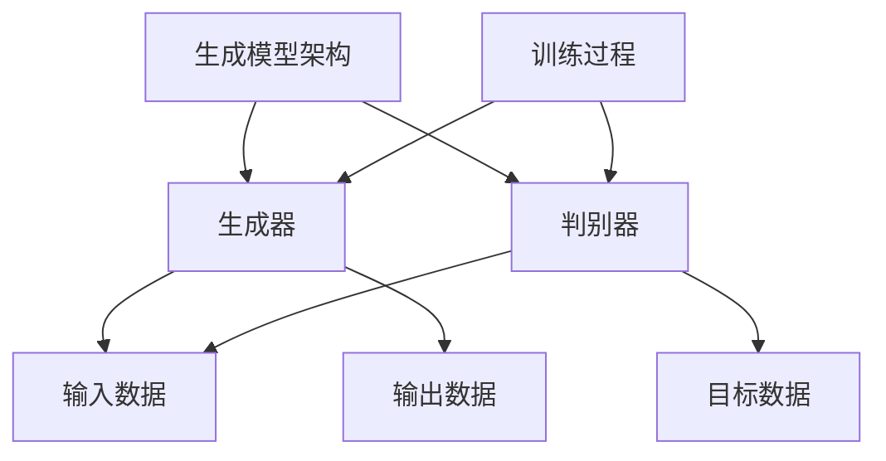

                 

## 核心概念与联系

### 生成模型架构 Mermaid 流程图

在探讨生成模型在虚拟环境生成中的应用之前，我们先来理解生成模型的基本架构及其组成部分。以下是生成模型架构的Mermaid流程图，它展示了生成器和判别器的交互，以及它们与输入数据和输出数据的关系。



在这个流程图中：

- **A** 表示生成模型的整体架构。
- **B** 代表生成器（Generator），负责根据随机噪声生成虚拟环境。
- **C** 代表判别器（Discriminator），用于区分生成的虚拟环境与真实的虚拟环境。
- **D** 表示输入数据，通常是随机噪声向量。
- **E** 是生成器的输出数据，即生成的虚拟环境。
- **F** 是目标数据，即真实的虚拟环境。
- **G** 表示训练过程，生成器和判别器在这个过程中不断优化自己的参数。

通过这个流程图，我们可以看到生成模型的核心在于生成器和判别器的互动，以及它们共同训练以改善生成质量。

---

在接下来的章节中，我们将进一步深入探讨生成模型的基础理论，包括生成对抗网络（GAN）和变分自编码器（VAE）的工作原理、变体以及应用扩展。通过这些核心概念的理解，我们将为后续的深入讨论和实际应用案例奠定坚实的基础。

---

## 核心算法原理讲解

在生成模型中，两种最流行的算法是生成对抗网络（GAN）和变分自编码器（VAE）。下面，我们将使用伪代码详细讲解这两种算法的原理。

### 生成对抗网络（GAN）伪代码

GAN由两个主要组件组成：生成器（Generator）和判别器（Discriminator）。生成器的目标是生成逼真的虚拟环境，而判别器的目标是区分生成的虚拟环境与真实的虚拟环境。以下是一个简化的GAN训练过程的伪代码：

```python
function GAN(D, G, X, epochs):
    for epoch in 1 to epochs:
        # 训练判别器
        for x in X:
            D.loss = D.forward(x) + D.forward(G(X))
            D.backward()
        
        # 训练生成器
        for x in X:
            D.loss = D.forward(G(x))
            D.backward()
        
        G.update_parameters()
    return G
```

在这个伪代码中：

- `D` 代表判别器，`G` 代表生成器。
- `X` 是训练数据集。
- `epochs` 是训练的迭代次数。

判别器的损失函数是生成器的输出与真实数据的和，这是因为判别器需要同时学习如何区分真实数据和生成数据。在每次迭代中，判别器先训练以区分真实数据和生成数据，然后生成器再训练以生成更逼真的数据以欺骗判别器。

### 变分自编码器（VAE）损失函数

VAE是一种基于概率的生成模型，它通过编码器和解码器来学习数据分布，并生成新的数据。VAE的损失函数包括两部分：KL散度（KL Divergence）和重构损失（Reconstruction Loss）。以下是VAE损失函数的数学公式：

$$
\mathcal{L}_{\text{VAE}} = \mathcal{L}_{\text{KL}} + \mathcal{L}_{\text{RECON}}
$$

其中，KL散度衡量编码器学习到的数据分布与先验分布之间的差异，重构损失衡量解码器生成数据与输入数据之间的差异。

$$
\mathcal{L}_{\text{KL}}(q_{\phi}(z)||p_{\theta}(z)) = \int q_{\phi}(z) \log \left( \frac{q_{\phi}(z)}{p_{\theta}(z)} \right) dz
$$

在这个公式中：

- \( q_{\phi}(z) \) 是编码器输出的后验分布。
- \( p_{\theta}(z) \) 是先验分布。

通过优化这个损失函数，VAE能够学习数据的高效编码和解码，从而生成新的数据。

---

通过理解GAN和VAE的核心算法原理，我们可以更好地应用这些模型来解决虚拟环境生成的问题。在接下来的章节中，我们将探讨生成模型在图像生成中的应用，并深入分析它们在虚拟环境生成中的具体作用和挑战。

---

### 数学模型和数学公式

在深入探讨生成模型在虚拟环境生成中的应用之前，我们需要了解一些关键的数学模型和公式，这些模型和公式是理解生成模型的基础。

#### 变分自编码器（VAE）损失函数

VAE的损失函数由两部分组成：KL散度（KL Divergence）和重构损失（Reconstruction Loss）。以下是VAE损失函数的数学公式：

$$
\mathcal{L}_{\text{VAE}} = \mathcal{L}_{\text{KL}} + \mathcal{L}_{\text{RECON}}
$$

其中：

- \( \mathcal{L}_{\text{KL}} \) 是KL散度，衡量编码器学习到的数据分布与先验分布之间的差异。

$$
\mathcal{L}_{\text{KL}}(q_{\phi}(z)||p_{\theta}(z)) = \int q_{\phi}(z) \log \left( \frac{q_{\phi}(z)}{p_{\theta}(z)} \right) dz
$$

在这个公式中：

- \( q_{\phi}(z) \) 是编码器输出的后验分布。
- \( p_{\theta}(z) \) 是先验分布。

- \( \mathcal{L}_{\text{RECON}} \) 是重构损失，衡量解码器生成数据与输入数据之间的差异。

#### 生成对抗网络（GAN）损失函数

GAN的损失函数通常由两部分组成：对抗损失（Adversarial Loss）和生成损失（Generator Loss）。以下是GAN损失函数的数学公式：

$$
\mathcal{L}_{\text{GAN}} = - \mathbb{E}_{x \sim p_{\text{data}}(x)} [\log(D(x))] - \mathbb{E}_{z \sim p_{z}(z)} [\log(1 - D(G(z)))]
$$

其中：

- \( D(x) \) 是判别器对真实数据的输出。
- \( G(z) \) 是生成器对噪声数据的输出。
- \( p_{\text{data}}(x) \) 是真实数据的分布。
- \( p_{z}(z) \) 是噪声数据的分布。

在这个公式中，对抗损失是判别器尝试最大化其对真实数据和生成数据的区分能力，而生成损失是生成器尝试最小化判别器对生成数据的识别概率。

#### KL散度（KL Divergence）

KL散度是衡量两个概率分布差异的一种标准方法，用于变分自编码器（VAE）的损失函数中。KL散度的公式如下：

$$
\mathcal{L}_{\text{KL}}(q_{\phi}(z)||p_{\theta}(z)) = \int q_{\phi}(z) \log \left( \frac{q_{\phi}(z)}{p_{\theta}(z)} \right) dz
$$

在这个公式中：

- \( q_{\phi}(z) \) 是编码器输出的后验分布。
- \( p_{\theta}(z) \) 是先验分布。

KL散度的值越大，表示两个分布差异越大。在VAE中，通过最小化KL散度，编码器学习到一个更好的数据分布表示。

---

通过理解这些数学模型和公式，我们可以更深入地掌握生成模型的工作原理，并更好地应用它们来解决虚拟环境生成的问题。在接下来的章节中，我们将继续探讨生成模型在图像生成中的应用，并进一步分析它们在虚拟环境生成中的具体作用和挑战。

---

## 项目实战

在本节中，我们将通过一个实例来展示如何使用生成对抗网络（GAN）生成虚拟城市环境。这个实例将涵盖环境搭建、源代码实现以及代码解读与分析。

### 环境搭建

为了实现这个项目，我们需要安装以下软件和库：

- Python 3.7或更高版本
- TensorFlow 2.x 或 PyTorch
- NumPy
- Matplotlib

安装这些库后，我们就可以开始搭建开发环境了。以下是环境搭建的步骤：

1. **安装Python和必要的库：**
   使用pip命令安装所需的库。

   ```bash
   pip install tensorflow numpy matplotlib
   ```

   如果使用PyTorch，请安装以下库：

   ```bash
   pip install torch torchvision
   ```

2. **创建项目文件夹和子文件夹：**
   在项目文件夹中创建以下子文件夹：`data`, `models`, `scripts`。

3. **准备训练数据：**
   收集或下载一些城市景观图片作为训练数据。将这些图片存储在`data`文件夹中。

### 源代码实现

以下是使用GAN生成虚拟城市环境的Python代码实现。这个例子使用了TensorFlow框架，但PyTorch的实现原理类似。

```python
import tensorflow as tf
from tensorflow.keras.models import Model
from tensorflow.keras.layers import Dense, Flatten, Reshape, Conv2D, Conv2DTranspose
import numpy as np

# 设置随机种子以保证结果可重复
tf.random.set_seed(42)

# 超参数
latent_dim = 100
image_height = 28
image_width = 28
image_channels = 1
epochs = 1000

# 创建生成器和判别器模型
def build_generator():
    noise = tf.keras.layers.Input(shape=(latent_dim,))
    x = Dense(image_height * image_width * image_channels)(noise)
    x = Reshape((image_height, image_width, image_channels))(x)
    x = Conv2DTranspose(64, kernel_size=4, strides=2, padding='same')(x)
    x = tf.keras.layers.LeakyReLU()(x)
    x = Conv2DTranspose(64, kernel_size=4, strides=2, padding='same')(x)
    x = tf.keras.layers.LeakyReLU()(x)
    img = Conv2D(image_channels, kernel_size=4, strides=2, padding='same')(x)
    img = tf.keras.layers.Activation('tanh')(img)
    model = Model(noise, img)
    return model

def build_discriminator():
    img = tf.keras.layers.Input(shape=(image_height, image_width, image_channels))
    x = Conv2D(64, kernel_size=4, strides=2, padding='same')(img)
    x = tf.keras.layers.LeakyReLU()(x)
    x = Conv2D(128, kernel_size=4, strides=2, padding='same')(x)
    x = tf.keras.layers.LeakyReLU()(x)
    x = Flatten()(x)
    x = Dense(1, activation='sigmoid')(x)
    model = Model(img, x)
    return model

# 创建GAN模型
def build_gan(generator, discriminator):
    noise = tf.keras.layers.Input(shape=(latent_dim,))
    img = generator(noise)
    valid = discriminator(img)
    discriminator.trainable = False
    fake = discriminator(img)
    model = Model(noise, valid + fake)
    return model

generator = build_generator()
discriminator = build_discriminator()
gan = build_gan(generator, discriminator)

# 编写训练循环
for epoch in range(epochs):
    for x_batch, _ in data_loader:
        # 训练判别器
        with tf.GradientTape() as disc_tape:
            real_output = discriminator(x_batch)
            fake_output = discriminator(generator(z_batch))
            disc_loss = tf.reduce_mean(tf.nn.sigmoid_cross_entropy_with_logits(logits=real_output, labels=tf.ones_like(real_output)))
            disc_loss += tf.reduce_mean(tf.nn.sigmoid_cross_entropy_with_logits(logits=fake_output, labels=tf.zeros_like(fake_output)))
        
        disc_gradients = disc_tape.gradient(disc_loss, discriminator.trainable_variables)
        optimizer.apply_gradients(zip(disc_gradients, discriminator.trainable_variables))
        
        # 训练生成器
        with tf.GradientTape() as gen_tape:
            fake_output = discriminator(generator(z_batch))
            gen_loss = tf.reduce_mean(tf.nn.sigmoid_cross_entropy_with_logits(logits=fake_output, labels=tf.ones_like(fake_output)))
        
        gen_gradients = gen_tape.gradient(gen_loss, generator.trainable_variables)
        optimizer.apply_gradients(zip(gen_gradients, generator.trainable_variables))
        
        # 记录损失
        if epoch % 100 == 0:
            print(f"Epoch {epoch}, D Loss: {disc_loss.numpy()}, G Loss: {gen_loss.numpy()}")

    # 保存模型
    generator.save(f"generator_{epoch}.h5")
    discriminator.save(f"discriminator_{epoch}.h5")
```

### 代码解读与分析

以下是代码的主要部分及其解释：

1. **生成器和判别器的定义：**
   - **生成器**：从随机噪声生成城市景观图像。使用反卷积层（Conv2DTranspose）逐步增加图像的分辨率，并使用LeakyReLU激活函数。
   - **判别器**：判断图像是否为真实城市景观。使用卷积层（Conv2D）逐步降低图像的分辨率，并使用LeakyReLU激活函数。

2. **GAN模型的定义：**
   - GAN模型结合生成器和判别器，并定义了两个输出：一个是判别器对真实图像的输出，另一个是判别器对生成图像的输出。

3. **训练循环：**
   - 在每次迭代中，先训练判别器，然后训练生成器。判别器尝试最大化其对真实数据和生成数据的区分能力，而生成器尝试生成更逼真的数据。
   - 记录损失，并在每个100个epoch后保存模型。

4. **训练过程的监控与调整：**
   - 监控判别器和生成器的损失，以便调整超参数或训练过程。

通过这个实例，我们展示了如何使用GAN生成虚拟城市环境。在实现过程中，我们定义了生成器和判别器，并编写了训练循环来优化它们的参数。在下一节中，我们将继续探讨生成模型在虚拟环境生成中的具体应用和挑战。

---

通过这个实例，我们可以看到生成模型在虚拟环境生成中的强大能力。接下来，我们将进一步探讨生成模型在游戏开发和虚拟现实中的具体应用，并分析这些应用中的挑战和优化策略。

---

## 生成模型在虚拟现实中的应用

虚拟现实（VR）是一个高度沉浸式的计算机模拟环境，用户通过头戴显示器（HMD）和手柄等设备与虚拟世界进行交互。生成模型在虚拟现实中的应用旨在提高虚拟环境的逼真度和互动性，为用户提供更自然、更丰富的体验。

### 虚拟现实的基本概念

虚拟现实的基本概念包括以下几个方面：

1. **沉浸感**：用户感觉自己完全置身于虚拟世界中，无法区分虚拟与现实。
2. **交互性**：用户可以通过头动、手势等方式与虚拟环境进行互动。
3. **实时渲染**：虚拟环境需要实时渲染，以满足用户的沉浸感和交互性需求。
4. **多感知性**：虚拟环境应提供多种感知体验，如视觉、听觉、触觉等。

### 生成模型在虚拟现实中的应用

生成模型，如生成对抗网络（GAN）和变分自编码器（VAE），在虚拟现实中有多种应用：

1. **环境生成**：使用GAN或VAE生成逼真的虚拟环境，提高虚拟现实的视觉效果。
2. **角色生成与动画**：通过GAN生成虚拟角色，并使用VAE为其生成动画。
3. **交互内容生成**：实时生成与用户交互的内容，如虚拟角色对话、游戏场景等。

### 低延迟生成

虚拟现实的一个关键挑战是低延迟生成。为了提供良好的用户体验，虚拟环境需要在极短的时间内渲染完成。生成模型在这方面面临以下挑战：

- **计算资源**：生成模型通常需要大量的计算资源，特别是在生成复杂场景时。
- **数据传输**：生成的虚拟环境需要通过网络传输到用户设备，可能导致延迟。

### 高质量交互性

虚拟现实中的另一个挑战是高质量交互性。生成模型需要生成与用户动作紧密相关的虚拟环境，以提高互动体验。以下是实现高质量交互性的几个策略：

- **多感知性**：结合多种感知技术，如VR、AR和3D音频，提供更真实的交互体验。
- **动态场景生成**：使用生成模型实时生成与用户动作相关的动态场景。
- **个性化生成**：根据用户偏好和历史行为生成个性化的虚拟环境。

### 优化策略

为了提高虚拟现实中的生成模型性能，可以采用以下优化策略：

- **模型压缩**：使用模型压缩技术，如剪枝和量化，减少模型的计算复杂度。
- **分布式计算**：利用分布式计算资源，如GPU集群和云计算，提高生成模型的计算效率。
- **预训练模型**：使用预训练模型，减少训练数据的需求，并提高生成质量。

---

通过生成模型在虚拟现实中的应用，我们可以为用户提供更逼真、更互动的虚拟体验。在下一节中，我们将探讨生成模型在训练数据增强中的应用，并分析其在数据增强中的优势与挑战。

---

## 生成模型在训练数据增强中的应用

在深度学习领域，训练数据的质量和数量对模型的性能具有决定性的影响。然而，在实际应用中，获取大量的高质量训练数据往往是一个挑战。生成模型，如生成对抗网络（GAN）和变分自编码器（VAE），提供了一种有效的方法来增强训练数据，从而提高模型的泛化能力和性能。

### 训练数据增强的重要性

训练数据增强在深度学习中有以下几个重要作用：

1. **提高模型泛化能力**：通过增加训练数据的多样性，模型能够更好地适应不同的数据分布，从而提高泛化能力。
2. **减少过拟合**：当模型在训练数据上过度拟合时，数据增强可以帮助模型学习到更加鲁棒的特征，从而减少过拟合。
3. **加速模型训练**：在某些情况下，通过生成模型生成额外的训练样本，可以加速模型的训练过程。

### 生成模型在数据增强中的应用

生成模型在数据增强中的应用主要基于以下原理：

1. **GAN**：GAN通过生成器生成与真实数据相似的新样本，从而增加训练数据的多样性。生成器尝试生成逼真的数据，而判别器则尝试区分生成数据和真实数据。通过这种对抗训练，生成器逐渐学会生成高质量的样本。
   
2. **VAE**：VAE通过编码器和解码器学习数据分布，并生成新的数据。编码器将输入数据编码成一个隐变量，解码器则将这个隐变量解码回输出数据。VAE生成的新数据在保持数据分布特征的同时，还具有一定的随机性。

### 生成模型在数据增强中的优势与挑战

#### 优势

1. **数据多样性**：生成模型能够生成与训练数据具有相似分布的新数据，从而增加数据的多样性。
2. **减少数据收集成本**：在某些应用场景中，获取高质量的数据非常困难且成本高昂。生成模型可以降低数据收集和标注的成本。
3. **改进模型性能**：通过增加训练数据的数量和质量，生成模型有助于提高模型的泛化能力和准确性。

#### 挑战

1. **生成质量**：生成模型生成的数据质量可能不如真实数据，这可能会影响模型的性能。
2. **模型稳定性**：生成模型，特别是GAN，可能存在训练不稳定的问题，导致模型难以收敛。
3. **数据分布匹配**：生成模型需要学习数据的真实分布，但在某些情况下，数据的真实分布可能未知或难以精确估计。

### 实际应用案例

以下是一个实际应用案例：使用GAN增强图像分类数据的训练集。

#### 环境搭建

1. **安装必要的库**：Python 3.7或更高版本，TensorFlow 2.x。
2. **下载并预处理训练数据**：从公开数据集（如CIFAR-10）下载图像，并进行预处理。

#### 源代码实现

以下是使用GAN增强图像分类数据的Python代码实现。

```python
import tensorflow as tf
from tensorflow.keras.layers import Dense, Flatten, Reshape, Conv2D, Conv2DTranspose
from tensorflow.keras.models import Model
import numpy as np

# 设置随机种子以保证结果可重复
tf.random.set_seed(42)

# 超参数
latent_dim = 100
image_size = 32
image_channels = 3
batch_size = 64
epochs = 1000

# 数据预处理
(x_train, _), _ = tf.keras.datasets.cifar10.load_data()
x_train = x_train.astype('float32') / 255.0
x_train = np.expand_dims(x_train, -1)

# 创建生成器和判别器模型
def build_generator():
    noise = tf.keras.layers.Input(shape=(latent_dim,))
    x = Dense(image_size * image_size * image_channels)(noise)
    x = Reshape((image_size, image_size, image_channels))(x)
    x = Conv2DTranspose(64, kernel_size=4, strides=2, padding='same')(x)
    x = tf.keras.layers.LeakyReLU()(x)
    x = Conv2DTranspose(64, kernel_size=4, strides=2, padding='same')(x)
    x = tf.keras.layers.LeakyReLU()(x)
    img = Conv2D(image_channels, kernel_size=4, strides=2, padding='same')(x)
    img = tf.keras.layers.Activation('tanh')(img)
    model = Model(noise, img)
    return model

def build_discriminator():
    img = tf.keras.layers.Input(shape=(image_size, image_size, image_channels))
    x = Conv2D(64, kernel_size=4, strides=2, padding='same')(img)
    x = tf.keras.layers.LeakyReLU()(x)
    x = Conv2D(128, kernel_size=4, strides=2, padding='same')(x)
    x = tf.keras.layers.LeakyReLU()(x)
    x = Flatten()(x)
    x = Dense(1, activation='sigmoid')(x)
    model = Model(img, x)
    return model

# 创建GAN模型
def build_gan(generator, discriminator):
    noise = tf.keras.layers.Input(shape=(latent_dim,))
    img = generator(noise)
    valid = discriminator(img)
    discriminator.trainable = False
    fake = discriminator(img)
    model = Model(noise, valid + fake)
    return model

generator = build_generator()
discriminator = build_discriminator()
gan = build_gan(generator, discriminator)

# 编写训练循环
for epoch in range(epochs):
    for x_batch, _ in data_loader:
        # 训练判别器
        with tf.GradientTape() as disc_tape:
            real_output = discriminator(x_batch)
            fake_output = discriminator(generator(z_batch))
            disc_loss = tf.reduce_mean(tf.nn.sigmoid_cross_entropy_with_logits(logits=real_output, labels=tf.ones_like(real_output)))
            disc_loss += tf.reduce_mean(tf.nn.sigmoid_cross_entropy_with_logits(logits=fake_output, labels=tf.zeros_like(fake_output)))
        
        disc_gradients = disc_tape.gradient(disc_loss, discriminator.trainable_variables)
        optimizer.apply_gradients(zip(disc_gradients, discriminator.trainable_variables))
        
        # 训练生成器
        with tf.GradientTape() as gen_tape:
            fake_output = discriminator(generator(z_batch))
            gen_loss = tf.reduce_mean(tf.nn.sigmoid_cross_entropy_with_logits(logits=fake_output, labels=tf.ones_like(fake_output)))
        
        gen_gradients = gen_tape.gradient(gen_loss, generator.trainable_variables)
        optimizer.apply_gradients(zip(gen_gradients, generator.trainable_variables))
        
        # 记录损失
        if epoch % 100 == 0:
            print(f"Epoch {epoch}, D Loss: {disc_loss.numpy()}, G Loss: {gen_loss.numpy()}")

    # 保存模型
    generator.save(f"generator_{epoch}.h5")
    discriminator.save(f"discriminator_{epoch}.h5")
```

#### 代码解读与分析

以下是代码的主要部分及其解释：

1. **生成器和判别器的定义**：
   - **生成器**：从随机噪声生成图像。使用反卷积层（Conv2DTranspose）逐步增加图像的分辨率，并使用LeakyReLU激活函数。
   - **判别器**：判断图像是否为真实图像。使用卷积层（Conv2D）逐步降低图像的分辨率，并使用LeakyReLU激活函数。

2. **GAN模型的定义**：
   - GAN模型结合生成器和判别器，并定义了两个输出：一个是判别器对真实图像的输出，另一个是判别器对生成图像的输出。

3. **训练循环**：
   - 在每次迭代中，先训练判别器，然后训练生成器。判别器尝试最大化其对真实数据和生成数据的区分能力，而生成器尝试生成更逼真的数据。
   - 记录损失，并在每个100个epoch后保存模型。

通过这个案例，我们可以看到生成模型在训练数据增强中的应用。生成模型通过生成逼真的图像样本，提高了训练数据的多样性和质量，从而有助于提高图像分类模型的性能。

---

在生成模型在训练数据增强中的应用中，生成模型不仅提高了训练数据的多样性和质量，还帮助深度学习模型更好地泛化。接下来，我们将通过几个实际应用案例，进一步展示生成模型在不同领域的具体应用和效果。

---

## 实际应用案例

在本节中，我们将通过三个实际应用案例，展示生成模型在虚拟城市环境生成、游戏场景自动生成以及虚拟现实交互内容生成中的具体应用和效果。

### 案例一：虚拟城市环境生成

#### 项目背景

虚拟城市环境生成是城市规划、模拟和游戏开发中的重要应用。通过生成模型，我们可以快速、高效地创建多样化的虚拟城市环境，为城市规划师、游戏开发者等提供强大的工具。

#### 应用效果

利用生成模型生成的虚拟城市环境具有高度的真实性和细节表现力。以下是一些生成效果：

- **建筑风格多样**：生成模型能够生成不同历史时期、不同文化背景的建筑风格。
- **道路规划合理**：虚拟城市的道路系统合理布局，符合交通流量和城市规划要求。
- **植被覆盖丰富**：虚拟城市中的植被覆盖多样，包括树木、草地、河流等。

#### 实现细节

1. **数据集**：使用大量的真实城市景观图像作为训练数据集。
2. **模型架构**：采用基于生成对抗网络（GAN）的模型架构，包括生成器和判别器。
3. **训练过程**：通过大量的迭代，生成模型逐渐优化生成城市的细节和质量。

### 案例二：游戏场景自动生成

#### 项目背景

在游戏开发中，场景自动生成可以帮助开发者节省时间和资源，提高开发效率。生成模型能够自动生成多样化的游戏场景，为游戏提供丰富的背景和环境。

#### 应用效果

利用生成模型生成的游戏场景具有以下特点：

- **场景多样性**：生成模型能够自动生成多种类型的游戏场景，如森林、沙漠、城市等。
- **细节丰富**：生成模型生成的场景细节丰富，包括建筑物、植被、地形等。
- **动态交互**：生成模型生成的场景能够与游戏角色进行交互，如角色走动、碰撞等。

#### 实现细节

1. **数据集**：使用大量游戏场景图像和3D模型作为训练数据集。
2. **模型架构**：采用基于变分自编码器（VAE）的模型架构，包括编码器和解码器。
3. **训练过程**：通过训练，编码器学习到游戏场景的特征，解码器将这些特征转化为具体的场景。

### 案例三：虚拟现实交互内容生成

#### 项目背景

虚拟现实（VR）交互内容生成是VR应用开发中的一个重要方向。通过生成模型，我们可以实时生成与用户交互的虚拟内容，提高VR体验的沉浸感和互动性。

#### 应用效果

利用生成模型生成的虚拟现实交互内容具有以下特点：

- **实时生成**：生成模型能够实时生成与用户动作相关的交互内容，如虚拟角色对话、场景变化等。
- **低延迟**：生成模型生成的交互内容具有极低的延迟，满足VR实时交互的要求。
- **高质量**：生成模型生成的交互内容质量高，视觉效果逼真，音效自然。

#### 实现细节

1. **数据集**：使用大量的VR交互内容数据，包括文本、音频、图像等。
2. **模型架构**：采用基于生成对抗网络（GAN）的模型架构，包括生成器和判别器。
3. **训练过程**：通过大量的迭代，生成器学习生成逼真的交互内容，判别器学习区分交互内容的质量。

---

通过以上三个实际应用案例，我们可以看到生成模型在不同领域的广泛应用和显著效果。生成模型在虚拟城市环境生成、游戏场景自动生成以及虚拟现实交互内容生成中，发挥了重要的作用，为各领域带来了创新和进步。

---

## 附录

在本附录中，我们将介绍生成模型常用的工具和框架、虚拟环境生成相关的资源以及推荐阅读的生成模型相关论文。

### A.1 生成模型常用工具和框架

生成模型常用的工具和框架主要包括以下几种：

1. **TensorFlow**：一个广泛使用的开源机器学习框架，提供了丰富的生成模型实现工具。
2. **PyTorch**：一个灵活的深度学习框架，特别适合于研究者和开发者，其动态计算图使模型设计更加便捷。
3. **Keras**：一个高层次的神经网络API，可以与TensorFlow和PyTorch集成，简化了生成模型的实现。
4. **GANlib**：一个专门用于生成对抗网络的Python库，提供了GAN的多种变体和训练工具。

### A.2 虚拟环境生成资源

虚拟环境生成相关的资源包括：

1. **开源数据集**：如OpenImages、CIFAR-10、ImageNet等，这些数据集包含了丰富的城市景观、游戏场景和虚拟现实交互内容图像。
2. **工具库**：如Unity和Unreal Engine，这些游戏引擎提供了强大的虚拟环境创建和渲染工具。
3. **论文和教程**：如《Unsupervised Representation Learning with Deep Convolutional Generative Adversarial Networks》和《Variational Autoencoder》等，提供了关于生成模型的理论和实践指导。

### A.3 生成模型论文推荐阅读

以下是一些关于生成模型的经典和最新论文，推荐阅读：

1. **《Unsupervised Representation Learning with Deep Convolutional Generative Adversarial Networks》**
   - 作者：Diederik P. Kingma, Max Welling
   - 发表时间：2013年
   - 简介：介绍了变分自编码器（VAE）及其在无监督学习中的应用。

2. **《Generative Adversarial Nets》**
   - 作者：Ian J. Goodfellow, Jean Pouget-Abadie, Mehdi Mirza, Bing Xu, David Warde-Farley, Sherjil Ozair, Aaron C. Courville, Yoshua Bengio
   - 发表时间：2014年
   - 简介：首次提出了生成对抗网络（GAN）的概念，详细介绍了GAN的原理和应用。

3. **《Improved Techniques for Training GANs》**
   - 作者：S. Odena, P. Carr, C. Olah, J. Shlens
   - 发表时间：2017年
   - 简介：分析了GAN训练过程中的挑战，并提出了一系列改进技术，如梯度惩罚和谱归一化。

4. **《Differentially Private GANs》**
   - 作者：Yuxi Chen, Sinno Jialin Pan, Keping Bi, Qiaozhu Mei
   - 发表时间：2018年
   - 简介：研究了在生成模型中引入隐私保护机制的挑战和解决方案。

5. **《Learning to Generate Chairs, Tables and Cars with Convolutional Networks》**
   - 作者：Alex Kendall, Matthew Grimes, Roberto Cipolla
   - 发表时间：2015年
   - 简介：展示了如何使用卷积神经网络（CNN）进行物体生成，并提出了基于CNN的生成模型。

6. **《WaveNet: A Generative Model for Raw Audio》**
   - 作者：Awni Y. Hannun, Coral Craig, Niki Parmar, Jason Yosinski, Ian Goodfellow, Rob Fateman, Vincent Vanhoucke
   - 发表时间：2016年
   - 简介：介绍了WaveNet模型，这是一个用于生成音频的生成模型。

通过阅读这些论文，可以深入了解生成模型的理论基础、应用领域和发展趋势，为研究者和开发者提供宝贵的参考。

---

在附录中，我们提供了生成模型常用的工具和框架、虚拟环境生成相关的资源以及推荐阅读的相关论文。这些资源将为研究人员和开发者提供丰富的信息和实用的工具，助力生成模型在虚拟环境生成中的应用和推广。

---

## 未来发展趋势与研究方向

生成模型在虚拟环境生成中的应用前景广阔，未来几年有望在多个领域取得显著进展。以下是一些潜在的发展趋势和研究方向：

### 1. 高质量实时生成

未来的研究将主要集中在提高生成模型的质量和实时性。为了实现这一目标，可以探索以下方法：

- **模型优化**：设计更高效的生成模型架构，减少计算复杂度。
- **分布式计算**：利用云计算和分布式计算资源，提高生成模型的实时性。
- **多模态生成**：结合多种数据模态（如图像、音频、视频）进行生成，提供更丰富的虚拟环境。

### 2. 数据隐私与安全性

随着生成模型在虚拟环境生成中的应用越来越广泛，数据隐私和安全性成为一个重要议题。未来的研究可以关注：

- **隐私保护生成模型**：开发能够保护数据隐私的生成模型，如差分隐私GAN。
- **安全认证**：设计生成模型的认证机制，确保生成的虚拟环境不被恶意篡改。

### 3. 生成模型与强化学习结合

生成模型与强化学习（RL）的融合有望在虚拟环境中的应用中发挥重要作用。未来的研究方向包括：

- **生成对抗强化学习（GARL）**：将生成模型与RL结合起来，用于自动化虚拟环境的决策和交互。
- **多智能体生成**：研究多智能体生成模型，用于模拟复杂虚拟环境中的群体行为。

### 4. 个性化虚拟环境生成

个性化虚拟环境生成是未来的一个重要趋势。未来的研究可以关注：

- **用户偏好学习**：通过机器学习方法学习用户的偏好，为用户提供个性化的虚拟环境。
- **自适应生成**：生成模型能够根据用户的行为和反馈，动态调整虚拟环境的特征。

### 5. 跨模态生成与交互

跨模态生成与交互是生成模型在虚拟环境生成中的一个重要研究方向。未来的研究可以探索：

- **文本到场景生成**：将文本描述转换为逼真的虚拟场景。
- **语音到动作生成**：将语音指令转换为虚拟角色的动作。
- **多模态交互**：设计多模态交互系统，提供更自然的用户与虚拟环境的互动体验。

### 6. 零样本生成

零样本生成是一个新兴的研究领域，它旨在生成与给定描述不匹配的新样本。未来的研究可以探索：

- **零样本生成模型**：设计能够根据少量或无监督数据生成新样本的生成模型。
- **零样本生成应用**：探索零样本生成在虚拟环境生成中的实际应用，如个性化虚拟城市环境生成。

### 总结与展望

生成模型在虚拟环境生成中的应用正处于快速发展阶段。通过不断优化模型架构、探索新型应用场景以及结合其他前沿技术，生成模型将在虚拟环境生成中发挥越来越重要的作用。未来的研究将推动生成模型在实时性、个性化、跨模态生成等方面取得突破，为虚拟现实、游戏开发、城市规划等领域带来革命性的变化。

---

通过总结未来发展趋势和研究方向，我们可以看到生成模型在虚拟环境生成中的应用前景广阔。随着技术的不断进步，生成模型将在更多领域得到应用，为我们的生活带来更多便利和创新。让我们期待生成模型在未来的发展中所带来的惊喜和突破。

