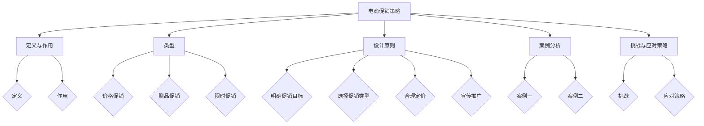
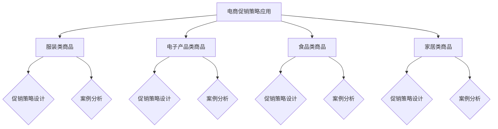
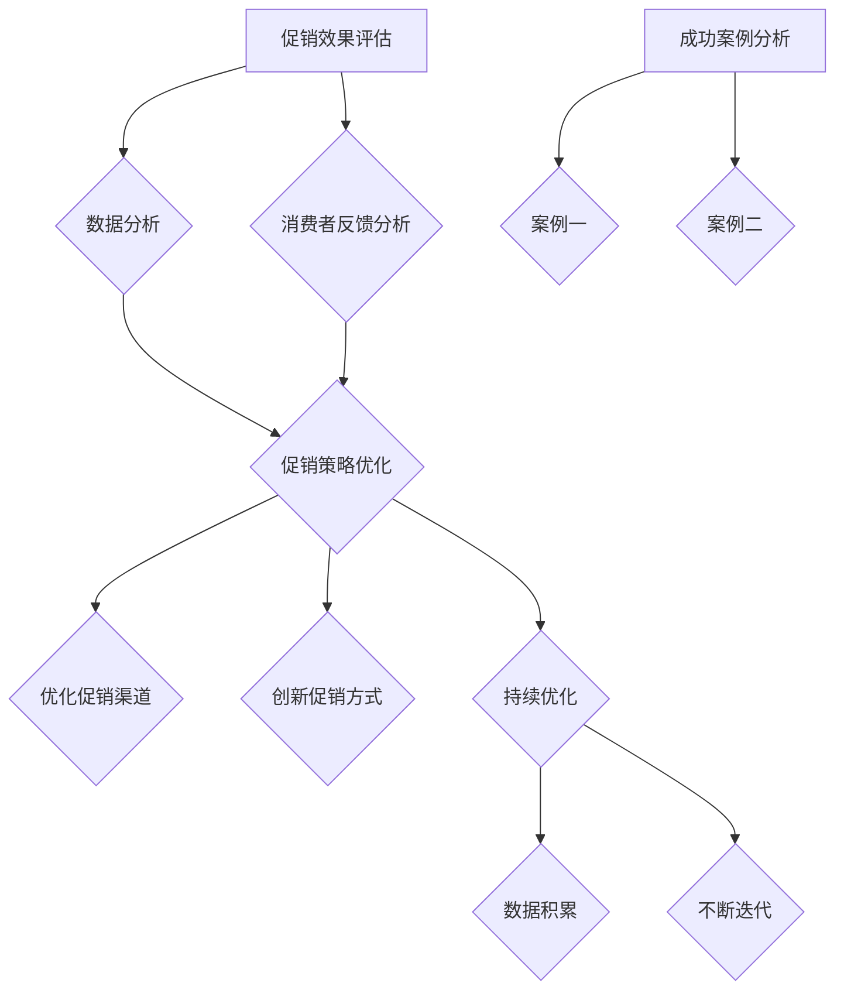
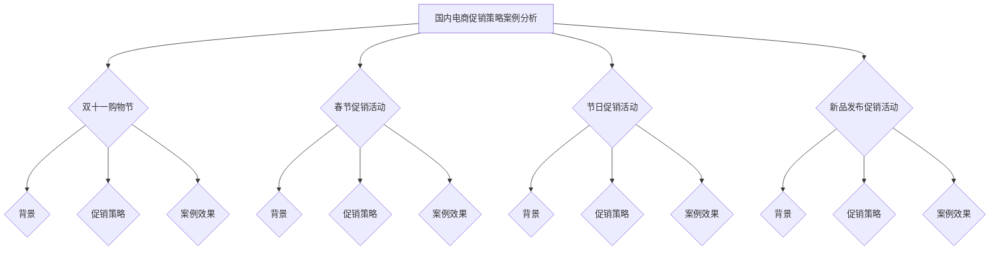
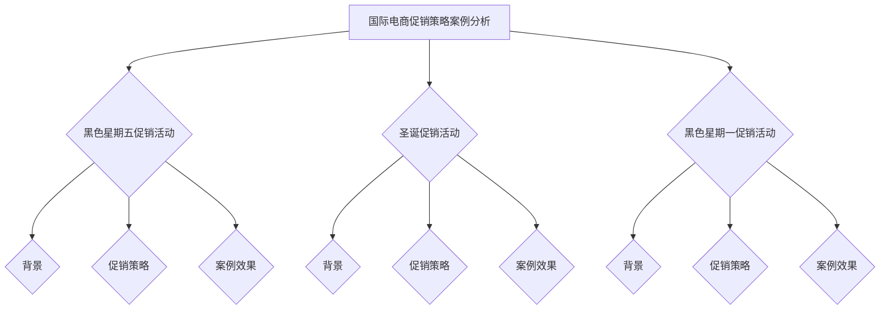
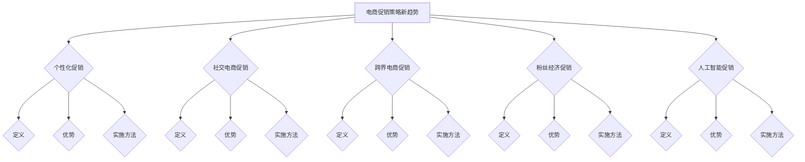
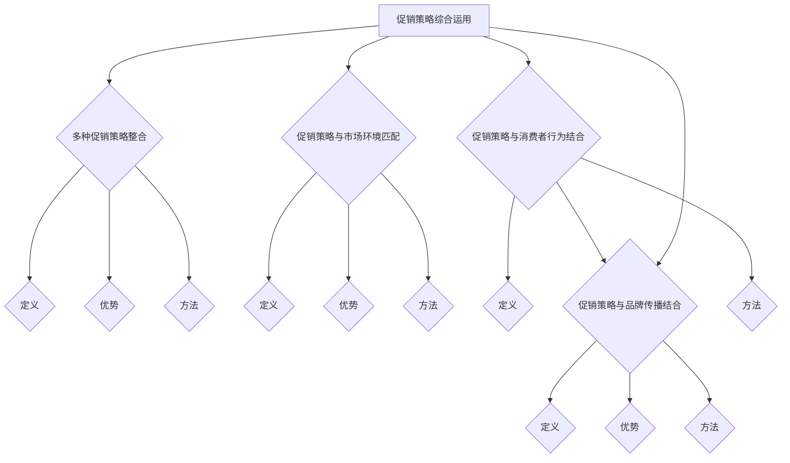
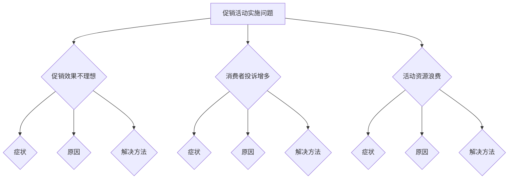
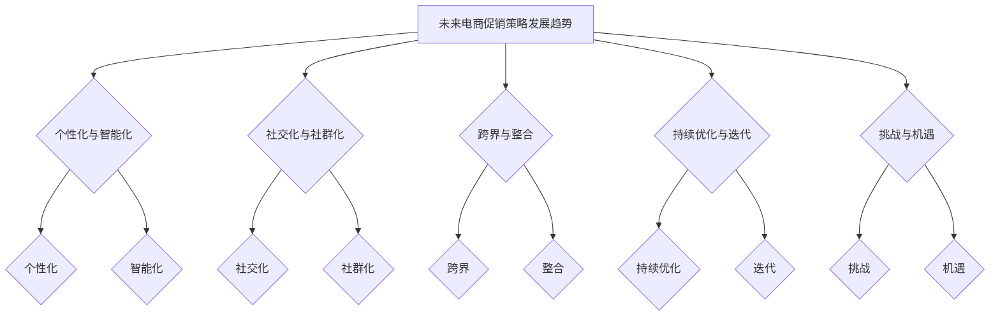
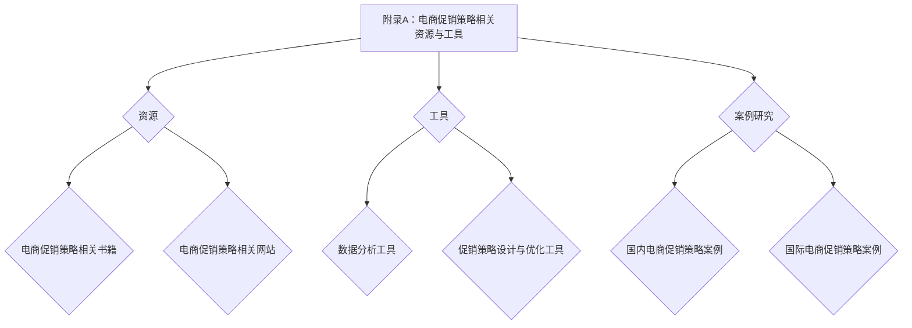

                 

### 电商促销策略概述

#### 第1章：电商促销策略的概述

#### 1.1 电商促销策略的定义与作用

##### 1.1.1 电商促销策略的定义

电商促销策略是指在电子商务运营过程中，商家为达到销售目标，采取的各种优惠、折扣、赠品等手段，以刺激消费者购买欲望，提高销售额。

##### 1.1.2 电商促销策略的作用

1. **提高销售量**：通过优惠活动吸引消费者，增加销售量。
2. **提升品牌知名度**：促销活动能够提高品牌曝光率，提升品牌知名度。
3. **促进库存周转**：通过促销活动清理库存，降低库存压力。

#### 1.2 电商促销策略的类型

##### 1.2.1 价格促销

1. **折扣促销**：直接降低商品售价，吸引消费者购买。
2. **满减促销**：满一定金额即可享受优惠。

##### 1.2.2 赠品促销

1. **购物赠品**：购买指定商品即可获得赠品。
2. **满赠促销**：满一定金额赠送特定商品。

##### 1.2.3 限时促销

1. **节假日促销**：在特定的节假日进行促销活动。
2. **限时抢购**：限定时间内的优惠活动。

#### 1.3 电商促销策略的设计原则

##### 1.3.1 明确促销目标

- 明确促销目标，如提升销售额、清理库存、提升品牌知名度等。

##### 1.3.2 选择合适的促销类型

- 根据产品特性、消费者需求和市场环境，选择合适的促销类型。

##### 1.3.3 合理定价

- 价格策略要合理，既要吸引消费者，又不能损害商家利益。

##### 1.3.4 宣传推广

- 利用多种渠道进行宣传推广，提高促销活动的知名度。

#### 1.4 电商促销策略的案例分析

##### 1.4.1 案例一：某电商平台“双十一”购物节

- **促销类型**：价格促销、限时促销
- **促销效果**：大幅提升销售额，提升品牌知名度

##### 1.4.2 案例二：某电商平台新品发布会

- **促销类型**：赠品促销、限时抢购
- **促销效果**：吸引大量消费者参与，提升新品销量

#### 1.5 电商促销策略的挑战与应对策略

##### 1.5.1 挑战

1. **消费者心理预期**：消费者对促销活动有更高的预期，可能导致商家难以满足。
2. **促销成本**：促销活动需要投入大量资金，可能影响商家利润。
3. **市场竞争**：促销活动需要与其他商家竞争，可能面临价格战。

##### 1.5.2 应对策略

1. **精准营销**：通过数据分析，精准定位目标消费者。
2. **个性化定制**：根据消费者偏好，提供个性化的促销方案。
3. **提高服务质量**：提升购物体验，增强消费者忠诚度。

#### 总结

电商促销策略是电商运营中不可或缺的一环，通过合理的设计和实施，能够有效提升销售额、品牌知名度和消费者满意度。但在实施过程中也需要应对各种挑战，以确保促销活动的效果最大化。



### 第2章：电商促销策略在不同类型商品中的应用

#### 2.1 服装类商品

##### 2.1.1 促销策略设计

1. **购物满减**：购买多件商品可享受满减优惠。
2. **购物返现**：购买商品后可返还一定金额的现金。
3. **限时抢购**：在特定时间段内推出限量商品，吸引消费者抢购。

##### 2.1.2 案例分析

- **某电商平台春季新品促销**：通过限时抢购和购物返现，吸引消费者购买新款服装。

#### 2.2 电子产品类商品

##### 2.2.1 促销策略设计

1. **价格折扣**：直接降低电子产品价格，吸引消费者购买。
2. **赠品促销**：购买指定电子产品可获赠配件或周边产品。
3. **会员专享**：会员可享受专属的优惠价格和赠品。

##### 2.2.2 案例分析

- **某电商平台电子产品节**：通过价格折扣和赠品促销，提升电子产品销量。

#### 2.3 食品类商品

##### 2.3.1 促销策略设计

1. **买一赠一**：购买指定食品可获得同等价值的赠品。
2. **限时特惠**：在特定时间段内推出特价食品。
3. **礼品卡促销**：购买食品可赠送礼品卡，用于购买其他商品。

##### 2.3.2 案例分析

- **某电商平台食品节**：通过买一赠一和限时特惠，提高食品销售量。

#### 2.4 家居类商品

##### 2.4.1 促销策略设计

1. **满减促销**：购买多件家居商品可享受满减优惠。
2. **购物赠品**：购买指定家居商品可获赠配件或相关产品。
3. **限时折扣**：在特定时间段内推出折扣家居商品。

##### 2.4.2 案例分析

- **某电商平台家居日**：通过满减促销和限时折扣，吸引消费者购买家居商品。

#### 总结

不同类型的商品适合不同的促销策略，通过合理设计促销活动，能够提高商品销量，提升消费者购物体验。



### 第3章：电商促销策略的实施流程

#### 3.1 促销活动的策划

##### 3.1.1 确定促销目标

- 根据商家需求，明确促销活动的目标，如提升销售额、提升品牌知名度等。

##### 3.1.2 选择促销类型

- 根据产品特性、消费者需求和市场竞争情况，选择合适的促销类型。

##### 3.1.3 制定促销方案

- 设计具体的促销方案，包括优惠幅度、促销时间、参与商品等。

#### 3.2 促销活动的宣传推广

##### 3.2.1 线上宣传

- 利用电商平台自身的宣传渠道，如首页广告、推荐位等。
- 利用社交媒体平台，如微博、微信、抖音等，发布促销信息。

##### 3.2.2 线下宣传

- 利用线下渠道，如商场、超市等，进行促销活动的宣传。
- 利用传统媒体，如报纸、电视等，发布促销信息。

#### 3.3 促销活动的执行

##### 3.3.1 商品准备

- 根据促销方案，提前准备好参与促销的商品。

##### 3.3.2 价格调整

- 根据促销方案，调整商品的价格。

##### 3.3.3 系统测试

- 在促销活动前，对电商平台系统进行测试，确保促销活动顺利进行。

#### 3.4 促销活动的监控与调整

##### 3.4.1 销售监控

- 在促销活动期间，实时监控销售额、订单量等指标，了解促销效果。

##### 3.4.2 消费者反馈

- 收集消费者的反馈意见，了解促销活动的效果和不足。

##### 3.4.3 数据分析

- 利用数据分析工具，分析促销活动的效果，为后续促销活动提供参考。

#### 总结

电商促销策略的实施流程包括促销活动的策划、宣传推广、执行和监控调整，通过科学、有序的实施流程，可以提高促销活动的效果。

```mermaid
graph TD
    A[促销活动策划] --> B{确定目标}
    A --> C{选择类型}
    A --> D{制定方案}
    B --> E[宣传推广]
    E --> F{线上宣传}
    E --> G{线下宣传}
    C --> H[商品准备}
    H --> I[价格调整}
    H --> J{系统测试}
    D --> K[销售监控}
    D --> L{消费者反馈}
    D --> M{数据分析}
```

### 第4章：电商促销策略的优化与调整

#### 4.1 促销效果评估

##### 4.1.1 数据分析

- 利用数据分析工具，对促销活动的效果进行评估，如销售额、订单量、客单价等指标。

##### 4.1.2 消费者反馈分析

- 收集消费者的反馈意见，分析消费者对促销活动的满意度和参与度。

#### 4.2 促销策略优化

##### 4.2.1 调整促销方案

- 根据促销效果评估结果，调整促销方案，如调整优惠幅度、促销时间等。

##### 4.2.2 优化促销渠道

- 根据促销效果评估结果，优化促销渠道，如增加线上宣传渠道、扩大线下宣传范围等。

##### 4.2.3 创新促销方式

- 根据市场变化和消费者需求，创新促销方式，如推出新形式的促销活动。

#### 4.3 持续优化

##### 4.3.1 数据积累

- 持续积累促销活动的数据，为后续促销活动提供参考。

##### 4.3.2 不断迭代

- 根据促销效果评估结果和消费者反馈，不断迭代促销策略，提高促销效果。

#### 4.4 成功案例分析

##### 4.4.1 案例一：某电商平台“双十一”购物节

- **促销策略**：价格折扣、限时抢购、购物返现等。
- **促销效果**：大幅提升销售额，提升品牌知名度。

##### 4.4.2 案例二：某电商平台新品发布会

- **促销策略**：赠品促销、限时抢购、会员专享等。
- **促销效果**：吸引大量消费者参与，提升新品销量。

#### 总结

电商促销策略的优化与调整是提升促销效果的关键，通过科学的数据分析和消费者反馈，不断优化促销策略，可以提高促销活动的效果。



### 第5章：国内电商促销策略案例分析

#### 5.1 某电商平台“双十一”购物节

##### 5.1.1 案例背景

- **时间**：每年的11月11日。
- **背景**：该平台最大的购物节，旨在提升销售额和品牌知名度。

##### 5.1.2 促销策略

- **价格折扣**：商品价格大幅折扣。
- **限时抢购**：在特定时间段内推出限量商品。
- **购物返现**：购买指定商品后可获得一定金额的现金返现。

##### 5.1.3 案例效果

- **销售额**：创纪录的销售额，大幅提升品牌知名度。
- **消费者反馈**：消费者满意度高，积极参与购物节。

#### 5.2 某电商平台春节促销活动

##### 5.2.1 案例背景

- **时间**：春节期间。
- **背景**：春节是家庭团聚的重要时刻，消费者购物需求旺盛。

##### 5.2.2 促销策略

- **购物满减**：购买多件商品可享受满减优惠。
- **赠品促销**：购买指定商品可获赠配件或相关产品。
- **限时特惠**：在特定时间段内推出特价商品。

##### 5.2.3 案例效果

- **销售额**：春节期间销售额大幅增长。
- **消费者反馈**：消费者满意度高，购物体验良好。

#### 5.3 某电商平台节日促销活动

##### 5.3.1 案例背景

- **时间**：节日期间，如中秋节、圣诞节等。
- **背景**：节日期间消费者有购物需求，商家有促销机会。

##### 5.3.2 促销策略

- **限时折扣**：在特定时间段内推出折扣商品。
- **礼品卡促销**：购买商品可赠送礼品卡，用于购买其他商品。
- **会员专享**：会员可享受专属的优惠价格和赠品。

##### 5.3.3 案例效果

- **销售额**：节日期间销售额有所提升。
- **消费者反馈**：消费者满意度较高，会员忠诚度提高。

#### 5.4 某电商平台新品发布促销活动

##### 5.4.1 案例背景

- **时间**：新品发布期间。
- **背景**：新品发布是提升品牌形象和销售额的重要时刻。

##### 5.4.2 促销策略

- **赠品促销**：购买指定商品可获赠配件或周边产品。
- **限时抢购**：在特定时间段内推出限量商品。
- **会员专享**：会员可享受专属的优惠价格和赠品。

##### 5.4.3 案例效果

- **销售额**：新品发布期间销售额有所提升。
- **消费者反馈**：消费者对新品的认可度高，参与度良好。

#### 总结

国内外电商促销策略各有特点，但都通过价格折扣、限时抢购、购物赠品等手段，吸引消费者购买。通过案例分析，可以了解到不同促销策略的效果和消费者反馈，为电商促销策略的设计提供参考。



### 第6章：国际电商促销策略案例分析

#### 6.1 某国际电商平台“黑色星期五”促销活动

##### 6.1.1 案例背景

- **时间**：每年的11月最后一个星期五。
- **背景**：这是美国的重要购物节，类似于中国的“双十一”。

##### 6.1.2 促销策略

- **价格折扣**：商品价格大幅折扣。
- **限时抢购**：在特定时间段内推出限量商品。
- **购物返现**：购买指定商品后可获得一定金额的现金返现。

##### 6.1.3 案例效果

- **销售额**：创下历史记录，销售额大幅提升。
- **消费者反馈**：消费者满意度高，积极参与购物节。

#### 6.2 某国际电商平台圣诞促销活动

##### 6.2.1 案例背景

- **时间**：圣诞节期间。
- **背景**：圣诞节是西方的重要节日，消费者有购物需求。

##### 6.2.2 促销策略

- **限时折扣**：在特定时间段内推出折扣商品。
- **礼品卡促销**：购买商品可赠送礼品卡，用于购买其他商品。
- **会员专享**：会员可享受专属的优惠价格和赠品。

##### 6.2.3 案例效果

- **销售额**：圣诞期间销售额大幅增长。
- **消费者反馈**：消费者满意度较高，会员忠诚度提高。

#### 6.3 某国际电商平台“黑色星期一”促销活动

##### 6.3.1 案例背景

- **时间**：每年的1月第三个星期一。
- **背景**：这是美国的新年促销节，旨在吸引消费者购物。

##### 6.3.2 促销策略

- **价格折扣**：商品价格大幅折扣。
- **购物赠品**：购买指定商品可获赠配件或相关产品。
- **限时抢购**：在特定时间段内推出限量商品。

##### 6.3.3 案例效果

- **销售额**：创下新高，销售额大幅提升。
- **消费者反馈**：消费者满意度较高，积极参与购物节。

#### 总结

国内外电商促销策略各有特点，但都通过价格折扣、限时抢购、购物赠品等手段，吸引消费者购买。通过案例分析，可以了解到不同促销策略的效果和消费者反馈，为电商促销策略的设计提供参考。



### 第7章：电商促销策略的新趋势

#### 7.1 个性化促销

##### 7.1.1 个性化促销的定义

个性化促销是根据消费者的个人喜好、购买历史和行为数据，定制化地推送促销信息。

##### 7.1.2 个性化促销的优势

- **提高促销效果**：精准推送促销信息，提高消费者购买意愿。
- **提升用户体验**：根据消费者偏好提供个性化服务，提升用户满意度。

##### 7.1.3 个性化促销的实施方法

- **数据分析**：收集并分析消费者行为数据，了解消费者偏好。
- **算法推荐**：利用算法为消费者推荐个性化的促销信息。
- **个性化推送**：根据消费者偏好，推送个性化的促销信息。

#### 7.2 社交电商促销

##### 7.2.1 社交电商促销的定义

社交电商促销是通过社交网络平台，推广促销信息和商品，吸引消费者购买。

##### 7.2.2 社交电商促销的优势

- **扩大宣传范围**：利用社交网络平台的传播力，扩大促销活动的影响力。
- **提高互动性**：通过社交互动，增加消费者参与度。
- **提升品牌形象**：通过社交互动，树立良好的品牌形象。

##### 7.2.3 社交电商促销的实施方法

- **社交媒体宣传**：在社交媒体平台发布促销信息。
- **KOL合作**：与知名博主或网红合作，推广促销活动。
- **社交互动**：通过评论、点赞、分享等方式，增加消费者互动。

#### 7.3 跨界电商促销

##### 7.3.1 跨界电商促销的定义

跨界电商促销是不同领域的品牌或企业，合作推出促销活动，吸引消费者购买。

##### 7.3.2 跨界电商促销的优势

- **拓展受众群体**：通过跨界合作，吸引不同领域的消费者。
- **提升品牌知名度**：通过跨界合作，提升品牌在目标消费者中的知名度。
- **增加销售额**：通过跨界合作，吸引更多消费者购买。

##### 7.3.3 跨界电商促销的实施方法

- **跨界合作**：与不同领域的品牌或企业合作，推出联名促销活动。
- **联名商品**：推出跨界联名商品，吸引消费者购买。
- **跨界营销**：通过跨界合作，进行跨领域营销。

#### 7.4 粉丝经济促销

##### 7.4.1 粉丝经济促销的定义

粉丝经济促销是利用粉丝的忠诚度，推出专属促销活动，吸引粉丝购买。

##### 7.4.2 粉丝经济促销的优势

- **提高粉丝忠诚度**：通过专属促销活动，增加粉丝的忠诚度。
- **提升品牌影响力**：通过粉丝的传播，提升品牌在粉丝群体中的影响力。
- **增加销售额**：通过粉丝经济促销，吸引粉丝购买。

##### 7.4.3 粉丝经济促销的实施方法

- **粉丝专享优惠**：为粉丝提供专属的优惠价格和赠品。
- **粉丝互动活动**：通过互动活动，增加粉丝参与度。
- **粉丝社区**：建立粉丝社区，提供专属服务。

#### 7.5 人工智能促销

##### 7.5.1 人工智能促销的定义

人工智能促销是利用人工智能技术，分析消费者行为，提供个性化的促销方案。

##### 7.5.2 人工智能促销的优势

- **提高促销效果**：通过人工智能分析，提供精准的促销方案。
- **提升用户体验**：通过人工智能技术，为消费者提供个性化的购物体验。
- **降低促销成本**：通过人工智能技术，优化促销策略，降低促销成本。

##### 7.5.3 人工智能促销的实施方法

- **数据分析**：收集并分析消费者行为数据，了解消费者偏好。
- **个性化推荐**：利用算法为消费者推荐个性化的促销信息。
- **促销策略优化**：通过数据分析，优化促销策略，提高促销效果。

#### 总结

电商促销策略的新趋势包括个性化促销、社交电商促销、跨界电商促销、粉丝经济促销和人工智能促销。这些新趋势能够更好地满足消费者的需求，提高促销效果，为电商运营带来新的机遇。



### 第8章：电商促销策略的综合运用

#### 8.1 多种促销策略的整合

##### 8.1.1 促销策略整合的定义

促销策略整合是指在电商运营过程中，将多种促销策略相结合，以达到更好的促销效果。

##### 8.1.2 促销策略整合的优势

- **提高促销效果**：多种促销策略的结合，可以更有效地刺激消费者购买欲望。
- **提升品牌知名度**：通过多种促销策略的整合，提高品牌在消费者心中的形象。
- **降低促销成本**：合理运用多种促销策略，可以降低促销成本，提高投资回报率。

##### 8.1.3 促销策略整合的方法

- **跨界整合**：与不同领域的品牌或企业合作，推出跨界促销活动。
- **个性化整合**：根据消费者偏好，提供个性化的促销方案。
- **时空整合**：在特定的时空节点，推出针对性的促销活动。

#### 8.2 促销策略与市场环境的匹配

##### 8.2.1 促销策略与市场环境的定义

促销策略与市场环境的匹配是指根据市场环境的变化，调整促销策略，以适应市场环境。

##### 8.2.2 促销策略与市场环境匹配的优势

- **提高促销效果**：根据市场环境调整促销策略，可以更好地适应市场需求，提高促销效果。
- **提升品牌竞争力**：通过适应市场环境，提高品牌在市场中的竞争力。
- **降低市场风险**：通过及时调整促销策略，降低市场风险。

##### 8.2.3 促销策略与市场环境匹配的方法

- **数据分析**：收集并分析市场环境数据，了解市场变化趋势。
- **情报监测**：实时关注市场动态，掌握市场环境变化。
- **风险评估**：评估市场风险，制定相应的促销策略调整方案。

#### 8.3 促销策略与消费者行为的结合

##### 8.3.1 促销策略与消费者行为的定义

促销策略与消费者行为的结合是指根据消费者行为数据，制定相应的促销策略。

##### 8.3.2 促销策略与消费者行为结合的优势

- **提高促销效果**：根据消费者行为数据，提供个性化的促销方案，提高消费者购买意愿。
- **提升用户体验**：通过了解消费者行为，提供更加个性化的服务，提升用户体验。
- **降低营销成本**：通过分析消费者行为，精准定位目标消费者，降低营销成本。

##### 8.3.3 促销策略与消费者行为结合的方法

- **数据分析**：收集并分析消费者行为数据，了解消费者偏好。
- **算法推荐**：利用算法为消费者推荐个性化的促销信息。
- **用户画像**：建立消费者画像，为消费者提供个性化的促销方案。

#### 8.4 促销策略与品牌传播的结合

##### 8.4.1 促销策略与品牌传播的定义

促销策略与品牌传播的结合是指将促销策略与品牌传播相结合，提高品牌知名度和美誉度。

##### 8.4.2 促销策略与品牌传播结合的优势

- **提高品牌知名度**：通过促销活动，扩大品牌影响力。
- **提升品牌形象**：通过品牌传播，树立良好的品牌形象。
- **增加消费者忠诚度**：通过促销活动和品牌传播，增加消费者的忠诚度。

##### 8.4.3 促销策略与品牌传播结合的方法

- **品牌宣传**：在促销活动期间，加大品牌宣传力度，提高品牌知名度。
- **精准营销**：根据消费者需求，提供个性化的品牌传播方案。
- **跨媒体传播**：利用多种媒体渠道，进行品牌传播。

#### 总结

电商促销策略的综合运用是提升促销效果的关键。通过整合多种促销策略、与市场环境匹配、与消费者行为结合以及与品牌传播结合，可以更好地满足消费者的需求，提高促销效果，为电商运营带来更大的价值。



### 第9章：电商促销策略实施中的问题与解决方法

#### 9.1 促销活动实施中的常见问题

##### 9.1.1 促销效果不理想

- **症状**：促销活动期间销售额没有达到预期。
- **原因**：促销方案设计不合理、宣传力度不足、目标受众定位不准确等。
- **解决方法**：优化促销方案，加大宣传力度，精准定位目标受众。

##### 9.1.2 消费者投诉增多

- **症状**：促销活动期间消费者投诉增多。
- **原因**：促销规则不明确、商品质量出现问题、售后服务不到位等。
- **解决方法**：明确促销规则，提高商品质量，加强售后服务。

##### 9.1.3 活动资源浪费

- **症状**：促销活动投入大量资源，但效果不显著。
- **原因**：促销策略与市场需求不匹配、资源分配不合理等。
- **解决方法**：根据市场需求调整促销策略，合理分配资源。

#### 9.2 促销策略实施中的问题解决方法

##### 9.2.1 促销效果不理想

- **解决步骤**：
  1. 分析促销活动数据，找出问题所在。
  2. 优化促销方案，提高优惠幅度或增加促销手段。
  3. 加大宣传力度，提高活动知名度。
  4. 精准定位目标受众，提高促销活动的针对性。

##### 9.2.2 消费者投诉增多

- **解决步骤**：
  1. 建立消费者投诉处理机制，及时回应和处理消费者投诉。
  2. 优化促销规则，确保消费者权益。
  3. 提高商品质量，减少商品质量问题导致的投诉。
  4. 加强售后服务，提高消费者满意度。

##### 9.2.3 活动资源浪费

- **解决步骤**：
  1. 分析促销活动成本，找出浪费点。
  2. 优化资源分配，提高资源利用效率。
  3. 调整促销策略，减少不必要的投入。
  4. 加强活动管理，确保活动顺利进行。

#### 总结

在电商促销策略的实施过程中，可能会遇到各种问题。通过分析问题原因，采取相应的解决方法，可以有效地提高促销活动的效果，降低成本，为电商运营带来更大的价值。



### 第10章：未来电商促销策略的趋势展望

#### 10.1 电商促销策略发展趋势概述

##### 10.1.1 个性化与智能化

- **个性化**：未来电商促销策略将更加注重个性化，根据消费者的购物行为和偏好，提供个性化的促销信息。
- **智能化**：利用人工智能技术，分析消费者行为数据，制定智能化的促销方案。

##### 10.1.2 社交化与社群化

- **社交化**：通过社交媒体平台进行促销活动的宣传和推广，扩大促销活动的影响力。
- **社群化**：利用社群营销，建立消费者社群，提供专属的促销服务。

##### 10.1.3 跨界与整合

- **跨界**：与不同领域的品牌或企业合作，推出跨界促销活动，吸引更多消费者。
- **整合**：将多种促销策略相结合，提高促销活动的整体效果。

##### 10.1.4 持续优化与迭代

- **持续优化**：根据促销效果反馈，不断调整和优化促销策略。
- **迭代**：根据市场变化和消费者需求，不断推出新的促销形式和方案。

#### 10.2 电商促销策略的未来趋势

##### 10.2.1 个性化促销

- **特点**：通过数据分析，精准推送个性化促销信息。
- **实践**：利用大数据和人工智能技术，为消费者提供个性化的优惠和推荐。

##### 10.2.2 社交化促销

- **特点**：通过社交媒体平台，扩大促销活动的传播范围。
- **实践**：利用微博、微信、抖音等社交媒体平台，进行促销信息的推广和互动。

##### 10.2.3 跨界促销

- **特点**：与不同领域的品牌或企业合作，推出创新性促销活动。
- **实践**：与时尚品牌、美妆品牌等合作，推出联名促销活动。

##### 10.2.4 持续优化与迭代

- **特点**：根据市场变化和消费者需求，不断调整和优化促销策略。
- **实践**：通过持续的数据分析和消费者反馈，优化促销活动，提高效果。

#### 10.3 未来电商促销策略的挑战与机遇

##### 10.3.1 挑战

- **消费者需求变化**：消费者需求不断变化，要求促销策略更加个性化、智能化。
- **数据隐私与安全**：保护消费者数据隐私和安全，是未来电商促销策略面临的挑战。

##### 10.3.2 机遇

- **新技术发展**：人工智能、大数据等新技术的发展，为电商促销策略的创新提供了机遇。
- **市场竞争激烈**：在激烈的市场竞争中，通过创新的促销策略，可以提升品牌竞争力和市场份额。

#### 总结

未来电商促销策略将更加注重个性化、智能化、社交化、跨界与持续优化。通过不断创新和优化促销策略，可以更好地满足消费者的需求，提高促销效果，为电商运营带来更大的价值。同时，也需要应对消费者需求变化、数据隐私与安全等挑战，抓住新技术发展带来的机遇。



### 附录

#### 附录A：电商促销策略相关资源与工具

##### A.1 资源

##### A.1.1 电商促销策略相关书籍

- 《电商营销策略与实务》
- 《电商促销策略与案例分析》
- 《电商营销实战》

##### A.1.2 电商促销策略相关网站

- 电商平台官方网站：如淘宝、京东、拼多多等。
- 行业资讯网站：如电子商务研究中心、电商网等。
- 学术研究网站：如IEEE Xplore、Google Scholar等。

##### A.2 工具

##### A.2.1 数据分析工具

- Excel
- Tableau
- Python数据分析库（如Pandas、NumPy等）

##### A.2.2 促销策略设计与优化工具

- 营销自动化工具：如HubSpot、Marketo等。
- 社交媒体营销工具：如Facebook Ads、Twitter Ads等。
- 促销活动管理工具：如Eventbrite、Regpack等。

##### A.3 案例研究

##### A.3.1 国内电商促销策略案例

- 某电商平台“双十一”购物节
- 某电商平台春节促销活动

##### A.3.2 国际电商促销策略案例

- 某国际电商平台“黑色星期五”促销活动
- 某国际电商平台圣诞促销活动

#### 总结

附录部分提供了电商促销策略相关资源与工具，包括书籍、网站、数据分析工具、促销策略设计与优化工具以及案例研究，为读者提供了丰富的学习资料和实践案例，有助于深入理解和应用电商促销策略。



### 作者信息

- **作者**：AI天才研究院/AI Genius Institute & 禅与计算机程序设计艺术 /Zen And The Art of Computer Programming

文章内容结束。感谢您的阅读！希望本文对您在电商促销策略方面有所帮助。如有任何问题或建议，欢迎在评论区留言。再次感谢！<|im_end|>

