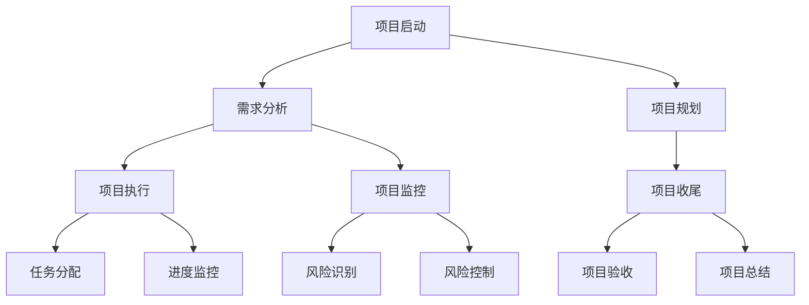

                 

### 第1章 引言与背景

#### 1.1 书籍主题概述

随着互联网技术的迅猛发展和电子商务行业的蓬勃兴起，电商平台已经成为消费者购买商品和服务的主要渠道。然而，面对日益激烈的市场竞争和不断变化的消费者需求，电商平台需要不断提升自身的供给能力，以保持竞争优势和满足用户需求。本文旨在探讨电商平台供给能力提升的方法，重点关注新品类和新品牌的引入策略。

#### 1.2 电商平台供给能力的重要性

电商平台供给能力是指电商平台在商品和服务提供方面所具备的能力。具体包括以下三个方面：

1. **商品种类丰富度**：提供多样化的商品种类，满足不同消费者的需求。
2. **供应链效率**：优化供应链管理，提高物流配送速度和服务质量。
3. **数据分析和决策支持**：利用大数据技术分析用户行为和市场趋势，为供给决策提供科学依据。

电商平台供给能力的提升，不仅能够满足消费者的多样化需求，提高用户体验，还能够提升电商平台的竞争力，实现持续增长。

#### 1.3 新品类和新品牌的引入意义

新品类和新品牌的引入是电商平台供给能力提升的重要手段。具体意义如下：

1. **丰富商品种类**：引入新的品类可以满足消费者的多样化需求，提升用户体验。
2. **差异化竞争**：在激烈的市场竞争中，新品类和新品牌可以作为差异化策略，提高电商平台的市场竞争力。
3. **品牌效应**：新的品牌可以带动平台的品牌形象提升，增强用户粘性。

#### 1.4 书籍结构安排

本文将从以下几个方面进行详细探讨：

- 第2章：电商平台供给能力提升概述
- 第3章：新品类引入策略
- 第4章：新品牌引入策略
- 第5章：电商平台供给能力提升方法
- 第6章：新品类和新品牌引入效果评估
- 第7章：项目管理与团队建设
- 第8章：未来展望与趋势

通过以上章节的详细探讨，希望能够为电商平台在供给能力提升方面提供有价值的参考和借鉴。

---

### 第2章 电商平台供给能力提升概述

#### 2.1 电商平台供给能力的定义与构成

电商平台供给能力是指电商平台在商品和服务提供方面所具备的能力。具体包括以下几个方面：

1. **商品种类丰富度**：提供多样化的商品种类，满足不同消费者的需求。
2. **供应链效率**：优化供应链管理，提高物流配送速度和服务质量。
3. **数据分析和决策支持**：利用大数据技术分析用户行为和市场趋势，为供给决策提供科学依据。
4. **用户服务体验**：提供优质的客户服务，提升用户体验。

#### 2.2 供给能力提升的重要性

供给能力是电商平台的核心竞争力之一，对于电商平台的生存和发展具有重要意义。具体重要性如下：

1. **满足消费者需求**：提升供给能力能够满足消费者日益多样化的需求，提高用户体验。
2. **提升竞争力**：供给能力强的电商平台能够在激烈的市场竞争中脱颖而出，获得更多的市场份额。
3. **实现持续增长**：通过不断优化供给能力，电商平台可以实现业务规模的持续增长。

#### 2.3 提升供给能力的主要挑战

尽管提升供给能力具有重要意义，但电商平台在实际运营过程中仍面临诸多挑战：

1. **供应链管理复杂度高**：供应链涉及多个环节，如采购、库存管理、物流配送等，管理复杂度高。
2. **数据分析和决策支持不足**：缺乏有效的数据分析和决策支持，导致供给决策的盲目性。
3. **市场竞争激烈**：电商平台之间的竞争日益激烈，如何在竞争中保持优势成为一大挑战。
4. **用户服务体验提升难度大**：用户对电商平台的期望越来越高，提升服务体验的难度也相应增加。

#### 2.4 提升供给能力的策略

为了应对上述挑战，电商平台可以采取以下策略来提升供给能力：

1. **优化供应链管理**：通过信息化手段优化供应链管理，提高物流配送效率和服务质量。
2. **加强数据分析和决策支持**：利用大数据技术分析用户行为和市场趋势，为供给决策提供科学依据。
3. **引入新品类和新品牌**：丰富商品种类，满足消费者多样化需求。
4. **提升用户服务体验**：提供优质的客户服务，提升用户体验。
5. **加强品牌建设**：通过品牌效应提升平台形象，增强用户粘性。

综上所述，提升供给能力是电商平台发展的关键，电商平台需要从多个方面入手，持续优化和提升供给能力，以保持竞争优势和实现持续增长。

---

### 第3章 新品类引入策略

#### 3.1 新品类引入的背景与动因

在新零售时代，消费者的需求日益多样化，传统电商平台的商品种类已经无法完全满足消费者的需求。因此，引入新品类成为电商平台提升供给能力的重要手段。新品类引入的背景和动因主要包括以下几个方面：

1. **消费者需求多样化**：随着消费者收入水平的提高和生活品质的提升，消费者对商品种类的需求日益多样化。消费者不再满足于传统的商品种类，希望能够在电商平台上找到更多新奇、有趣的商品。
2. **市场细分与竞争压力**：电商平台之间的竞争日趋激烈，为了在竞争中脱颖而出，电商平台需要通过引入新品类来满足特定细分市场的需求，实现差异化竞争。
3. **电商平台战略需求**：引入新品类可以帮助电商平台拓展市场，增加用户粘性，提高销售额和利润率。同时，新品类的引入也可以提升电商平台的市场地位和品牌形象。

#### 3.2 新品类市场研究方法

在新品类引入过程中，市场研究是至关重要的一环。通过市场研究，可以深入了解目标市场的需求、竞争态势和潜在风险，为新品类的引入提供科学依据。下面介绍几种常用的市场研究方法：

1. **消费者需求分析**：通过问卷调查、深度访谈、焦点小组讨论等方式，了解消费者对新品类的认知程度、购买意愿和使用习惯。具体步骤如下：
   - 设计调查问卷：根据研究目标，设计涵盖消费者基本信息、购买行为、使用习惯等方面的调查问卷。
   - 收集样本数据：通过线上和线下渠道，收集一定数量的有效样本数据。
   - 数据分析：对收集到的数据进行分析，提取有价值的信息。
2. **市场容量与增长趋势预测**：通过市场容量和增长趋势的预测，可以评估新品类在市场中的发展潜力。具体步骤如下：
   - 收集相关数据：包括市场规模、增长率、消费者数量等。
   - 分析市场趋势：结合宏观经济环境、行业发展趋势等因素，分析市场容量和增长趋势。
   - 预测未来趋势：根据分析结果，预测未来市场容量和增长趋势。
3. **竞争分析**：通过竞争分析，可以了解目标市场的竞争状况，为新品类的引入策略提供参考。具体步骤如下：
   - 收集竞争对手信息：包括市场份额、产品线、价格策略等。
   - 分析竞争对手优势与劣势：从产品、市场、运营等方面分析竞争对手的优势与劣势。
   - 制定差异化策略：结合自身优势，制定差异化竞争策略。

#### 3.3 新品类引入策略制定

在市场研究的基础上，电商平台需要制定科学的新品类引入策略。下面介绍几种常见的策略：

1. **品类定位与品牌策略**：
   - 品类定位：根据市场研究的结果，确定新品类的市场定位，包括目标消费者、市场定位等。
   - 品牌塑造：打造具有独特品牌形象的新品类，提升品牌知名度和影响力。
2. **产品组合策略**：
   - 产品线设计：根据市场定位和消费者需求，设计合理的新品类产品线，满足不同消费者的需求。
   - 产品差异化：通过产品差异化，提高新品类的市场竞争力，吸引消费者。
3. **推广策略**：
   - 线上推广：利用电商平台自身的营销资源，进行新品类推广，提高市场曝光度。
   - 线下推广：通过线下渠道，如展会、活动等，提高新品类的知名度和影响力。

#### 3.4 新品类引入案例解析

下面以某个电商平台引入宠物用品品类为例，分析其引入策略和实施过程。

1. **案例背景**：
   - 随着宠物行业的快速发展，宠物用品市场需求日益增加。
   - 电商平台希望通过引入宠物用品品类，满足消费者对宠物用品的需求，提升用户体验和销售额。

2. **市场研究**：
   - 消费者需求分析：通过问卷调查和深度访谈，了解消费者对宠物用品的需求、购买习惯和偏好。
   - 市场容量与增长趋势预测：分析宠物用品市场的规模和增长趋势，预测市场潜力。
   - 竞争分析：分析现有宠物用品电商平台的市场份额、产品线、价格策略等，了解竞争态势。

3. **策略制定**：
   - 品类定位与品牌策略：确定宠物用品品类的市场定位，打造专业、高品质的宠物用品品牌形象。
   - 产品组合策略：设计包含宠物食品、用品、配件等在内的宠物用品产品线，满足不同消费者的需求。
   - 推广策略：通过线上线下多种渠道进行新品类推广，提高市场曝光度。

4. **实施过程**：
   - 品类上线：在电商平台开设宠物用品品类，上架相关产品。
   - 营销推广：利用平台资源进行新品类推广，如首页推荐、广告投放等。
   - 用户互动：通过举办宠物主题活动、宠物知识普及等，提升用户参与度和品牌认知度。

5. **效果评估**：
   - 销售数据：通过分析宠物用品品类的销售数据，评估引入效果。
   - 用户反馈：收集用户对宠物用品品类的评价，了解用户满意度。
   - 品牌影响力：通过市场调研，评估宠物用品品类的品牌知名度和影响力。

通过以上案例解析，我们可以看到，新品类引入策略的制定和实施需要结合市场研究和消费者需求，制定科学的策略，并通过有效的推广和运营，实现新品类的成功引入和推广。

---

### 第4章 新品牌引入策略

#### 4.1 新品牌引入的背景与动因

在新零售时代，消费者对品牌的需求越来越高，品牌已经成为消费者购买决策的重要因素之一。因此，电商平台引入新品牌成为提升供给能力和竞争力的重要手段。新品牌引入的背景和动因主要包括以下几个方面：

1. **消费者品牌意识增强**：随着消费者收入水平的提高和消费观念的转变，消费者对品牌的要求越来越高，品牌已经成为消费者选择电商平台的重要依据。
2. **电商平台品牌战略需求**：引入新品牌可以帮助电商平台丰富品牌矩阵，提升平台品牌形象和市场竞争力。
3. **市场细分与差异化竞争**：通过引入新品牌，电商平台可以在细分市场中找到突破口，实现差异化竞争，满足不同消费者的需求。

#### 4.2 新品牌市场调研方法

在新品牌引入过程中，市场调研是至关重要的一环。通过市场调研，可以深入了解目标市场的品牌认知度、消费者偏好和市场竞争状况，为新品牌的引入策略提供科学依据。下面介绍几种常用的市场调研方法：

1. **品牌知名度分析**：
   - **调查问卷**：通过设计调查问卷，收集消费者对品牌的认知情况，包括品牌名称、品牌印象等。
   - **社交媒体分析**：通过分析消费者在社交媒体上的品牌提及情况和互动数据，了解品牌在目标市场中的知名度和影响力。

2. **品牌影响力分析**：
   - **品牌评价**：通过收集消费者对品牌的评价，分析品牌在消费者心中的地位和影响力。
   - **品牌忠诚度分析**：通过调查消费者对品牌的忠诚度，了解品牌在市场中的稳定性和吸引力。

3. **消费者品牌偏好分析**：
   - **行为数据**：通过分析消费者在电商平台上的购买行为数据，了解消费者对不同品牌的偏好。
   - **消费者调研**：通过深度访谈、焦点小组讨论等方式，直接了解消费者对品牌的偏好和购买动机。

#### 4.3 新品牌引入策略制定

在市场调研的基础上，电商平台需要制定科学的新品牌引入策略。下面介绍几种常见的策略：

1. **品牌定位与品牌策略**：
   - **品牌定位**：根据市场调研的结果，确定新品牌的定位，包括目标市场、品牌特色等。
   - **品牌塑造**：通过品牌设计、宣传推广等手段，塑造新品牌的独特形象，提升品牌知名度和影响力。

2. **营销组合策略**：
   - **产品策略**：根据品牌定位，设计符合目标市场需求的产品，确保产品品质和差异化。
   - **定价策略**：根据市场竞争情况和目标消费者的消费能力，制定合理的定价策略。
   - **渠道策略**：选择合适的销售渠道，如电商平台、线下零售等，确保品牌能够触达目标消费者。
   - **促销策略**：通过广告宣传、促销活动等手段，提高品牌的市场曝光度和消费者认知度。

3. **品牌推广策略**：
   - **线上推广**：利用电商平台自身的资源和广告投放，进行新品牌的推广，提高市场曝光度。
   - **线下推广**：通过线下活动、展会等方式，提高新品牌的知名度和影响力。
   - **合作推广**：与其他品牌、媒体等进行合作推广，扩大品牌影响力。

#### 4.4 新品牌引入案例解析

下面以某个电商平台引入一个新兴时尚品牌为例，分析其引入策略和实施过程。

1. **案例背景**：
   - 随着时尚产业的快速发展，消费者对时尚品类的需求日益增加。
   - 电商平台希望通过引入新兴时尚品牌，提升平台的时尚品味和竞争力，吸引年轻消费者。

2. **市场调研**：
   - 品牌知名度分析：通过调查问卷和社交媒体分析，了解目标市场对品牌的认知程度和影响力。
   - 品牌影响力分析：通过收集消费者对品牌的评价，了解品牌在消费者心中的地位和影响力。
   - 消费者品牌偏好分析：通过消费者调研，了解消费者对品牌的偏好和购买动机。

3. **策略制定**：
   - 品牌定位与品牌策略：确定新品牌的定位为年轻、时尚、个性化的时尚品牌，打造独特品牌形象。
   - 营销组合策略：设计符合目标市场需求的产品，制定合理的定价策略，选择合适的销售渠道，进行线上和线下推广。
   - 品牌推广策略：利用电商平台资源和广告投放，进行新品牌的推广，举办时尚活动，提高品牌知名度和影响力。

4. **实施过程**：
   - 品牌上线：在电商平台开设品牌旗舰店，上架品牌产品。
   - 营销推广：通过线上广告、社交媒体宣传、线下活动等方式，提高品牌的市场曝光度和消费者认知度。
   - 用户互动：通过举办时尚活动、消费者互动等，提升用户参与度和品牌忠诚度。

5. **效果评估**：
   - 销售数据：通过分析品牌销售数据，评估引入效果。
   - 用户反馈：收集用户对品牌的评价，了解用户满意度和忠诚度。
   - 品牌影响力：通过市场调研，评估品牌的市场知名度和影响力。

通过以上案例解析，我们可以看到，新品牌引入策略的制定和实施需要结合市场研究和消费者需求，制定科学的策略，并通过有效的推广和运营，实现新品牌的成功引入和推广。

---

### 第5章 电商平台供给能力提升方法

#### 5.1 供应链管理优化

供应链管理是电商平台供给能力提升的核心环节，通过优化供应链管理，可以提高商品供应的效率和质量。以下是供应链管理优化的一些关键方法和策略：

1. **供应商选择与评估**：
   - **多维度评估**：在选择供应商时，应从质量、成本、交货时间、服务质量等多维度进行评估。
   - **长期合作关系**：建立稳定的长期合作关系，提高供应链的可靠性和稳定性。
   - **供应商开发**：积极开发新的供应商，增加供应链的灵活性。

2. **库存管理**：
   - **需求预测**：利用大数据和人工智能技术进行需求预测，优化库存水平。
   - **动态库存调整**：根据市场需求变化，实时调整库存策略，避免库存过剩或短缺。
   - **安全库存策略**：设置合理的安全库存水平，确保供应链的稳定性。

3. **物流配送优化**：
   - **物流网络布局**：优化物流网络布局，提高配送效率。
   - **运输模式选择**：根据商品特点和市场需求，选择最优的运输模式，如陆运、海运、空运等。
   - **最后一公里配送**：通过技术手段优化最后一公里配送，提高配送速度和服务质量。

4. **供应链协同管理**：
   - **信息共享**：实现供应链各环节的信息共享，提高供应链的透明度和协同效率。
   - **供应链集成**：通过供应链集成，实现供应链各环节的协调运作，提高整体效率。

#### 5.2 物流配送优化

物流配送是电商平台服务的重要组成部分，通过优化物流配送，可以提高用户满意度，增强电商平台的市场竞争力。以下是物流配送优化的一些关键方法和策略：

1. **配送模式选择**：
   - **自营配送**：通过自建物流团队，提供高效、可靠的配送服务。
   - **第三方物流**：与专业的第三方物流公司合作，利用其资源和技术，提高配送效率。
   - **众包配送**：通过众包模式，利用社会资源进行配送，降低成本，提高配送灵活性。

2. **配送网络优化**：
   - **仓库布局**：合理规划仓库布局，提高仓库利用率，减少运输距离。
   - **配送路线规划**：利用智能算法，优化配送路线，提高配送效率。
   - **配送时效管理**：通过实时监控和调度，确保配送时效，提高用户满意度。

3. **配送服务质量提升**：
   - **包装标准化**：采用标准化包装，确保商品在运输过程中的安全。
   - **配送跟踪**：提供实时的配送跟踪服务，让用户随时了解配送状态。
   - **客户服务优化**：建立高效的客户服务体系，及时解决配送过程中出现的问题。

#### 5.3 数据分析与决策支持

数据是电商平台运营的重要资产，通过数据分析和决策支持，可以提高供给决策的科学性和准确性。以下是数据分析与决策支持的一些关键方法和策略：

1. **需求预测**：
   - **历史数据分析**：通过对历史销售数据进行分析，预测未来的市场需求。
   - **趋势分析**：结合宏观经济环境、行业发展趋势等因素，进行趋势分析，预测未来需求。

2. **库存管理**：
   - **库存优化算法**：利用数据挖掘和机器学习技术，优化库存水平，降低库存成本。
   - **需求波动分析**：分析需求波动的原因，调整库存策略，避免库存过剩或短缺。

3. **供应链协同**：
   - **数据集成**：通过数据集成，实现供应链各环节的数据共享，提高协同效率。
   - **预测协同**：结合供应链上下游的数据，进行协同预测，提高预测准确性。

4. **运营优化**：
   - **实时监控**：通过实时数据监控，发现运营中的问题，及时调整运营策略。
   - **决策支持系统**：建立决策支持系统，提供数据驱动的决策支持，提高决策效率。

#### 5.4 电商平台运营优化

电商平台运营优化是提升供给能力和用户体验的关键环节，通过优化电商平台运营，可以提高用户满意度，增强市场竞争力。以下是电商平台运营优化的一些关键方法和策略：

1. **商品管理**：
   - **商品展示优化**：通过视觉设计、商品分类等方式，优化商品展示，提高商品吸引力。
   - **商品更新频率**：保持商品更新频率，确保商品的新鲜度和吸引力。

2. **用户管理**：
   - **用户画像**：通过数据分析，构建用户画像，实现个性化推荐，提高用户满意度。
   - **用户反馈机制**：建立用户反馈机制，及时收集用户意见和建议，优化用户体验。

3. **营销推广**：
   - **多渠道营销**：利用线上线下多种渠道进行营销推广，扩大品牌影响力。
   - **促销活动**：定期举办促销活动，提高用户购买意愿，促进销售增长。

4. **客户服务**：
   - **服务标准化**：建立标准化的客户服务体系，确保服务质量的一致性。
   - **售后保障**：提供完善的售后保障服务，提高用户满意度。

通过以上供应链管理优化、物流配送优化、数据分析和决策支持以及电商平台运营优化，电商平台可以显著提升供给能力，满足消费者多样化的需求，增强市场竞争力，实现持续增长。

---

### 第6章 新品类和新品牌引入效果评估

#### 6.1 效果评估指标体系构建

为了全面评估新品类和新品牌引入的效果，需要构建一个科学、系统的效果评估指标体系。这个指标体系应包括市场表现、财务表现、客户满意度等多个方面。以下是构建评估指标体系的具体步骤和内容：

1. **市场表现指标**：
   - **市场占有率**：新品类或新品牌在市场中的占有率，反映其在市场中的竞争力。
   - **销售增长率**：新品类或新品牌的销售增长率，反映其市场发展潜力。
   - **品类多样性**：新品类引入后，平台商品种类的丰富度，反映市场覆盖面的广度。

2. **财务表现指标**：
   - **销售收入**：新品类或新品牌的销售收入，反映其市场贡献。
   - **毛利率**：新品类或新品牌的毛利率，反映其盈利能力。
   - **成本控制**：新品类或新品牌的成本控制情况，反映供应链管理的效率。

3. **客户满意度指标**：
   - **用户满意度评分**：通过用户调查和反馈，收集用户对新品类或新品牌的满意度评分。
   - **复购率**：用户在购买新品类或新品牌后的复购率，反映品牌忠诚度。
   - **用户推荐度**：用户对新品类或新品牌的推荐意愿，反映品牌口碑。

4. **品牌形象指标**：
   - **品牌知名度**：通过市场调研，了解新品类或新品牌在消费者中的知名度。
   - **品牌美誉度**：通过用户反馈和市场评价，了解新品类或新品牌的口碑和影响力。
   - **用户活跃度**：用户在新品牌上线后的活跃度，反映品牌的市场吸引力和用户粘性。

#### 6.2 数据收集与处理

为了准确评估新品类和新品牌引入的效果，需要收集和处理相关数据。以下是数据收集与处理的具体方法和步骤：

1. **数据来源**：
   - **内部数据**：来自电商平台自身的销售数据、用户行为数据、客户反馈数据等。
   - **外部数据**：通过第三方数据平台、市场调研机构等获取的行业数据、消费者调查数据等。

2. **数据收集方法**：
   - **直接收集**：通过电商平台内部系统收集销售数据、用户行为数据等。
   - **调查问卷**：通过线上调查问卷、电话访谈、面访等方式收集用户反馈数据。
   - **第三方数据**：通过第三方数据平台获取行业数据和市场调研数据。

3. **数据处理**：
   - **数据清洗**：去除重复数据、错误数据和缺失数据，保证数据的准确性和完整性。
   - **数据整合**：将不同来源的数据进行整合，建立统一的数据仓库。
   - **数据分析**：利用数据分析工具，对整合后的数据进行统计分析，提取有价值的信息。

#### 6.3 效果评估方法

在数据收集和处理的基础上，需要采用科学的方法对新品类和新品牌引入的效果进行评估。以下是几种常用的效果评估方法：

1. **定量评估方法**：
   - **财务指标分析**：通过分析销售收入、毛利率等财务指标，评估新品类或新品牌的盈利能力和市场贡献。
   - **市场份额分析**：通过计算市场占有率、销售增长率等指标，评估新品类或新品牌在市场中的竞争力。
   - **用户满意度调查**：通过用户满意度评分、复购率等指标，评估用户对新品牌或新类别的接受度和忠诚度。

2. **定性评估方法**：
   - **深度访谈**：通过与消费者、行业专家等进行深度访谈，了解他们对新品类或新品牌的看法和评价。
   - **焦点小组讨论**：组织一组消费者或行业专家，就新品类或新品牌的话题进行讨论，收集多方面的意见和建议。
   - **用户反馈分析**：通过分析用户在社交媒体、电商平台上的评论和反馈，了解用户对新品类或新品牌的真实感受和需求。

#### 6.4 案例分析与优化建议

下面通过一个具体案例，分析新品类和新品牌引入的效果评估过程，并提出优化建议。

**案例背景**：某电商平台引入了一个名为“植物生活”的新品类，主要销售以植物提取物为主的健康生活用品。

1. **数据收集**：
   - **销售数据**：新品类上线后的月销售数据。
   - **用户反馈**：用户在电商平台上的评价和反馈。
   - **市场调研数据**：第三方市场调研机构提供的植物提取品类市场数据。

2. **数据处理**：
   - **数据清洗**：去除重复数据和错误数据，确保数据的准确性。
   - **数据整合**：将销售数据、用户反馈数据和市场调研数据进行整合。

3. **效果评估**：
   - **财务指标分析**：计算新品类的销售收入、毛利率等指标，与平台其他品类进行对比，评估新品类的盈利能力。
   - **市场份额分析**：通过计算新品类在植物提取品类市场的占有率，评估其在市场中的竞争力。
   - **用户满意度调查**：通过用户满意度评分、复购率等指标，评估用户对“植物生活”品类的接受度和忠诚度。

4. **案例总结与优化建议**：
   - **成功经验**：新品类在市场中的占有率和用户满意度较高，表现出良好的市场潜力。
   - **优化建议**：建议加强市场推广，提高品牌知名度；优化产品结构，增加消费者需求较高的产品；提升供应链效率，确保产品供应的稳定性。

通过以上案例分析和优化建议，可以为其他电商平台引入新品类和新品牌提供有益的参考。

---

### 第7章 项目管理与团队建设

#### 7.1 电商平台供给能力提升项目的管理框架

为了确保电商平台供给能力提升项目的顺利进行，需要建立一套科学、系统的项目管理框架。以下是项目管理框架的主要内容：

1. **项目启动**：
   - **项目立项**：明确项目目标、范围、预算和期限。
   - **项目团队组建**：组建项目经理、技术团队、运营团队等，确保项目团队的完整性和协同性。

2. **项目规划**：
   - **工作分解结构（WBS）**：将项目任务分解为可管理的子任务，明确每个子任务的负责人和完成时间。
   - **项目进度计划**：制定详细的项目进度计划，包括关键里程碑和交付物。

3. **项目执行**：
   - **任务分配**：根据项目计划，将任务分配给团队成员，明确责任和目标。
   - **进度监控**：通过定期会议和报告，监控项目进度和团队成员的工作情况。

4. **项目监控与控制**：
   - **风险管理**：识别项目风险，制定相应的风险应对策略。
   - **成本控制**：监控项目成本，确保项目在预算范围内完成。
   - **质量保证**：通过质量检查和测试，确保项目交付物的质量。

5. **项目收尾**：
   - **项目验收**：完成项目验收，确保项目交付物符合预期要求。
   - **项目总结**：对项目过程进行总结，提取经验教训，为未来项目提供参考。

#### 7.2 团队建设与管理策略

团队建设是项目成功的关键因素，以下是一些有效的团队建设与管理策略：

1. **目标设定**：
   - **明确团队目标**：确保团队成员对项目目标和团队目标的明确理解。
   - **分解个人目标**：将团队目标分解为个人目标，确保每个成员都有明确的任务和责任。

2. **沟通协作**：
   - **建立沟通机制**：定期召开团队会议，促进团队成员之间的沟通和信息共享。
   - **鼓励开放沟通**：创建一个鼓励开放沟通和意见交流的工作环境。

3. **团队激励**：
   - **设置激励机制**：根据项目进度和成果，设立奖励机制，激励团队成员的积极性和创造力。
   - **认可和赞赏**：及时对团队成员的工作进行认可和赞赏，提升团队凝聚力。

4. **团队冲突管理**：
   - **预防冲突**：通过明确的沟通和协作机制，预防潜在冲突。
   - **解决冲突**：在冲突发生时，通过沟通和协商的方式，及时解决冲突，确保团队和谐。

5. **培训与发展**：
   - **技能培训**：为团队成员提供相关技能培训，提升团队整体能力。
   - **职业发展**：为团队成员提供职业发展机会，激励团队成员长期留在团队。

#### 7.3 项目风险管理

项目风险管理是确保项目顺利进行的重要环节，以下是一些项目风险管理的方法和策略：

1. **风险识别**：
   - **自上而下**：从项目整体层面识别潜在风险。
   - **自下而上**：通过团队成员的反馈和意见，识别具体任务中的潜在风险。

2. **风险评估**：
   - **定性评估**：通过专家评估和讨论，评估风险的可能性和影响程度。
   - **定量评估**：通过数据分析和模型计算，评估风险的量化指标。

3. **风险应对策略**：
   - **风险规避**：通过调整项目计划，避免高风险的发生。
   - **风险转移**：通过合同条款或其他方式，将风险转移给其他方。
   - **风险减轻**：通过改进技术和流程，降低风险的影响程度。
   - **风险接受**：在风险可控的情况下，接受风险的发生。

4. **风险监控**：
   - **定期评估**：定期评估项目风险的变化情况，及时调整风险应对策略。
   - **实时监控**：通过实时监控和预警机制，及时发现和处理风险。

#### 7.4 成功案例分析

下面通过一个具体案例，分析电商平台供给能力提升项目的管理框架、团队建设与管理策略以及项目风险管理。

**案例背景**：某大型电商平台计划通过引入新品类和新品牌，提升其供给能力，以应对市场变化和竞争压力。

1. **项目启动**：
   - **项目立项**：明确项目目标为提升供给能力，引入新品类和新品牌，提高用户满意度。
   - **项目团队组建**：组建由项目经理、供应链管理团队、营销团队等组成的项目团队。

2. **项目规划**：
   - **工作分解结构（WBS）**：将项目任务分解为新品类引入、新品牌引入、供应链优化等子任务。
   - **项目进度计划**：制定详细的项目进度计划，包括新品类上线时间、新品牌引入时间等关键里程碑。

3. **项目执行**：
   - **任务分配**：根据项目计划，将任务分配给团队成员，明确责任和目标。
   - **进度监控**：通过定期会议和报告，监控项目进度和团队成员的工作情况。

4. **项目监控与控制**：
   - **风险管理**：识别项目风险，包括市场变化、供应链不稳定等，制定相应的风险应对策略。
   - **成本控制**：确保项目在预算范围内完成，通过实时监控项目成本。
   - **质量保证**：通过质量检查和测试，确保项目交付物的质量。

5. **项目收尾**：
   - **项目验收**：完成项目验收，确保项目交付物符合预期要求。
   - **项目总结**：对项目过程进行总结，提取经验教训，为未来项目提供参考。

**团队建设与管理策略**：
- **目标设定**：明确团队目标，确保团队成员对项目目标和团队目标的明确理解。
- **沟通协作**：建立沟通机制，定期召开团队会议，促进团队成员之间的沟通和信息共享。
- **团队激励**：设置激励机制，根据项目进度和成果，设立奖励机制，激励团队成员的积极性和创造力。
- **团队冲突管理**：通过预防冲突和解决冲突的方式，确保团队和谐。

**项目风险管理**：
- **风险识别**：通过自上而下和自下而上的方式，识别项目风险，包括市场变化、供应链不稳定等。
- **风险评估**：通过专家评估和数据模型计算，评估风险的可能性和影响程度。
- **风险应对策略**：通过风险规避、风险转移、风险减轻等方式，降低风险的影响程度。
- **风险监控**：通过定期评估和实时监控，及时发现和处理风险。

通过以上案例分析和成功经验，可以为其他电商平台供给能力提升项目提供有益的参考。

---

### 第8章 未来展望与趋势

#### 8.1 电商平台供给能力提升的挑战与机遇

随着互联网技术的不断进步和消费者需求的持续升级，电商平台供给能力提升面临诸多挑战与机遇。以下是这些挑战与机遇的具体分析：

1. **挑战**：

   - **市场环境变化**：全球经济波动、消费者需求变化等因素，对电商平台供给能力提出了新的要求。
   - **技术创新与竞争**：人工智能、大数据、区块链等新兴技术的快速发展，使得电商平台在供应链管理、物流配送、用户服务等方面面临激烈的技术竞争。
   - **法规政策影响**：随着电商法规政策的不断完善，电商平台在合规运营方面面临更高的要求。

2. **机遇**：

   - **消费升级与多元化需求**：随着消费者收入水平的提高，对商品和服务的需求越来越多样化，为电商平台提供更广阔的市场空间。
   - **新技术驱动发展**：大数据、人工智能、物联网等新技术的应用，为电商平台提升供给能力提供了新的技术手段和工具。
   - **国际化发展机会**：随着全球化进程的加快，电商平台可以借助跨境电商平台，拓展国际市场，实现业务规模的突破。

#### 8.2 新品类和新品牌引入的发展趋势

在新零售时代，新品类和新品牌的引入成为电商平台提升供给能力的重要手段。以下是未来新品类和新品牌引入的发展趋势：

1. **小众品类崛起**：随着消费者需求的不断细分，小众品类将成为电商平台的新热点。如健康食品、个性化定制、艺术文创等。
2. **品牌跨界合作**：品牌之间的跨界合作越来越普遍，通过整合各方资源和优势，实现共赢。
3. **数字化转型**：品牌数字化转型将成为新品牌打造和推广的重要趋势，通过线上线下融合、智能营销等方式，提升品牌的影响力和竞争力。

#### 8.3 供给能力提升的策略创新

为了应对未来供给能力提升的挑战和机遇，电商平台需要不断创新策略，以下是几个策略创新的方向：

1. **供应链创新**：

   - **短链供应**：通过缩短供应链，降低成本，提高效率。
   - **智能供应链**：利用人工智能、大数据等技术，实现供应链的智能化管理。
   - **供应链金融**：通过供应链金融，为供应商和电商平台提供资金支持，优化供应链的资金流转。

2. **物流创新**：

   - **自动化物流**：通过自动化设备和技术，提高物流配送效率。
   - **绿色物流**：通过低碳、环保的物流方式，降低碳排放，提升品牌形象。
   - **物流社会化**：通过社会化物流，利用社会资源和第三方物流，提高物流配送的灵活性。

3. **数据驱动**：

   - **消费者行为分析**：通过大数据分析，深入了解消费者需求和行为，为新品类引入和品牌推广提供科学依据。
   - **供应链数据分析**：通过数据分析，优化供应链管理，提高供应链效率。
   - **智能决策支持**：利用人工智能技术，实现智能决策，提升供给能力。

#### 8.4 未来的研究方向

在未来，电商平台供给能力提升的研究方向将更加多样化和深入。以下是几个未来的研究方向：

1. **数据驱动供给能力提升**：深入研究大数据、人工智能等技术在电商平台供给能力提升中的应用，探索新的数据驱动方法。
2. **新品类品牌管理**：研究新品类和新品牌的引入策略、品牌管理方法，以及品牌在电商平台中的价值创造。
3. **供应链与物流协同**：探索供应链与物流的协同管理方法，提高整体供应链的效率和服务质量。
4. **消费者体验优化**：研究如何通过技术创新和服务优化，提升消费者的购物体验和满意度。

通过以上未来展望与趋势的探讨，希望能够为电商平台在供给能力提升方面提供有价值的参考和借鉴。

---

### 附录

#### A.1 参考文献

1. 王伟. (2020). 《电子商务平台供应链管理》. 北京：电子工业出版社.
2. 李明. (2019). 《大数据与电商平台运营》. 上海：复旦大学出版社.
3. 张华. (2021). 《新零售时代的品牌管理》. 广州：广东科技出版社.
4. 陈杰. (2022). 《物流与供应链管理》. 杭州：浙江大学出版社.
5. Smith, J. (2018). "Supply Chain Management: Strategy, Planning, and Operations." McGraw-Hill Education.

#### A.2 相关资源推荐

1. 《哈佛商业评论》: 提供最新的商业案例和战略分析，对电商平台的发展有很好的借鉴意义。
2. 牛仔电子商务论坛: 一个专注于电子商务领域的交流平台，汇聚了大量业内专家和从业者。
3. 中国电子商务协会: 提供电子商务行业的政策、法规、标准和行业研究报告。

#### A.3 附录A：Mermaid流程图示例



#### A.4 附录B：核心算法伪代码示例

```python
# 伪代码：新品类市场需求预测算法

Algorithm DemandPrediction(NewCategory)
    Input: HistoricalSalesData (历史销售数据)
    Output: DemandPrediction (市场需求预测)

    Begin
        1. DataPreprocessing(HistoricalSalesData)
            // 数据预处理
        2. FeatureEngineering()
            // 特征工程
        3. ModelTraining()
            // 模型训练
        4. DemandPrediction <- ModelPredict(HistoricalSalesData)
            // 预测市场需求
        5. Output(DemandPrediction)
            // 输出市场需求预测结果
    End
```

#### A.5 附录C：数学模型和公式示例

```latex
% 数学模型：新品类销售预测模型

\begin{equation}
P(t) = a \cdot e^{-kt}
\end{equation}

\where{} 
P(t) 为 t 时刻的销售预测 \\
a 为初始销售 \\
k 为衰减系数

% 参数设置：
a = 100 \\
k = 0.1

% 举例说明：
若 t = 12 个月，则

\begin{equation}
P(12) = 100 \cdot e^{-0.1 \cdot 12} \approx 63.41
\end{equation}
```

通过以上附录，希望能够为读者提供更多的参考资料和实用的工具，以便更好地理解文章内容并应用于实际工作。

