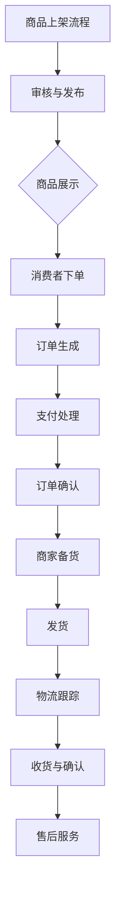

                 

### 第一部分：引言

#### 1.1 电商平台的供给能力概述

**1.1.1 电商平台的定义**

电商平台，亦称电子商务平台，是一种在线商业环境，通过互联网连接消费者、供应商、销售渠道等各个参与方，实现商品和服务交易。电商平台通常具备以下几个核心功能：

- 商品展示：提供商品的详细信息，包括图片、价格、描述等，方便消费者进行选择。
- 交易支付：支持在线支付、订单生成和支付确认等交易环节。
- 物流配送：整合物流服务，实现商品的快速配送和售后服务。
- 数据分析：收集和分析用户行为、销售数据等，用于优化运营策略。

**1.1.2 供给能力的核心要素**

电商平台的供给能力，即平台能够为消费者提供商品和服务的能力，主要由以下几方面构成：

- **商品丰富度**：平台商品种类的多样性及库存数量。
- **响应速度**：从订单生成到配送完成的整个过程所需的时间。
- **服务质量**：包括售后服务、退换货政策等。
- **用户体验**：平台的界面设计、用户交互体验等。

**1.1.3 供给能力提升的意义**

提升电商平台的供给能力具有以下重要意义：

- **提高竞争力**：在竞争激烈的电商市场中，强大的供给能力有助于平台脱颖而出，吸引更多用户。
- **提升用户体验**：快速、高效的供给能力能够提升用户满意度，增加复购率。
- **降低运营成本**：通过流程优化和自动化工具，降低人力和时间成本，提高运营效率。
- **推动业务增长**：有效的供给能力有助于扩展业务范围，实现业务规模和利润的增长。

#### 1.2 流程优化与自动化工具

**1.2.1 流程优化的目的和作用**

流程优化是指对电商平台的运营流程进行系统性分析、评估和改进，以提升效率和效果。其目的和作用主要体现在以下几个方面：

- **提高效率**：通过优化流程，减少不必要的环节和等待时间，提高处理速度。
- **降低成本**：消除冗余流程，减少人力和时间成本，实现资源的合理利用。
- **提升质量**：确保流程的稳定性和一致性，减少错误和失误，提高服务质量。
- **增强灵活性**：适应市场变化和用户需求，快速调整和优化运营策略。

**1.2.2 自动化工具的优势与应用**

自动化工具是流程优化的重要组成部分，通过自动化技术实现运营流程的自动化处理，具有以下优势：

- **提高效率**：自动化工具能快速、准确地完成重复性、规则性任务，减轻人工负担。
- **降低错误率**：自动化处理减少了人为干预，降低了操作错误的可能性。
- **节省成本**：自动化工具可以替代部分人工操作，节省人力和时间成本。
- **提升灵活性**：根据需求调整和优化自动化流程，实现业务的灵活性和可扩展性。

在电商平台中，自动化工具的应用范围广泛，包括但不限于：

- **订单处理**：自动化生成订单、更新订单状态、处理退款等。
- **库存管理**：自动化更新库存信息、预警库存不足、优化库存分配等。
- **物流配送**：自动化跟踪物流信息、优化配送路线、提高配送效率等。
- **数据分析**：自动化收集、处理和分析用户行为数据，优化运营策略。

#### 1.3 书籍概述与结构安排

**1.3.1 本书的内容框架**

本书将从以下几个方面深入探讨电商平台供给能力的提升：

- **核心概念与联系**：介绍电商平台运营流程、流程优化原理和自动化工具的技术原理。
- **流程优化与自动化工具实战**：通过案例分析，展示流程优化和自动化工具在电商平台的应用。
- **技术细节与实现**：详细讲解核心算法原理、数学模型和实际项目开发与实现。
- **扩展与应用**：探讨电商行业发展趋势、自动化工具的未来发展方向以及实战案例分享。

**1.3.2 阅读建议**

为了更好地理解本书的内容，读者可以遵循以下阅读建议：

- **系统学习**：按照章节顺序依次阅读，逐步深入理解各个概念和技术原理。
- **动手实践**：结合实际案例，尝试实现流程优化和自动化工具的开发。
- **深入思考**：针对每个章节的内容，思考如何将所学知识应用到实际业务场景中。
- **持续学习**：关注电商行业的发展动态，不断更新和优化流程和工具。

通过本书的学习，读者将能够全面了解电商平台供给能力提升的方法和技巧，为电商平台的运营和管理提供有力支持。

#### 1.4 文章关键词

- 电商平台
- 供给能力
- 流程优化
- 自动化工具
- 电商运营
- 数据分析
- 物流配送
- 算法实现
- 业务增长

#### 1.5 文章摘要

本文从电商平台的供给能力提升出发，详细探讨了流程优化和自动化工具的应用。首先，介绍了电商平台供给能力的核心要素和提升意义，随后阐述了流程优化和自动化工具的目的、优势以及应用场景。接着，通过深入分析电商平台运营流程、流程优化原理和自动化工具技术原理，提供了系统性的理解。随后，通过实际案例解析流程优化和自动化工具的实施过程，并详细讲解了核心算法原理和数学模型。最后，展望了电商行业发展趋势和自动化工具的未来发展方向，为电商平台供给能力的持续提升提供了新思路。通过本文的学习，读者将全面掌握电商平台供给能力提升的方法和技巧，为电商平台的运营和管理提供有力支持。

### 第一部分：引言

#### 1.1 电商平台的供给能力概述

**1.1.1 电商平台的定义**

电商平台，亦称电子商务平台，是一种在线商业环境，通过互联网连接消费者、供应商、销售渠道等各个参与方，实现商品和服务交易。电商平台的核心功能主要包括以下几个方面：

- **商品展示**：提供商品的详细信息，包括图片、价格、描述等，方便消费者进行选择。
- **交易支付**：支持在线支付、订单生成和支付确认等交易环节。
- **物流配送**：整合物流服务，实现商品的快速配送和售后服务。
- **数据分析**：收集和分析用户行为、销售数据等，用于优化运营策略。

在当前数字化时代，电商平台已成为许多消费者购买商品的主要渠道之一。它们不仅为消费者提供了便利的购物体验，也为企业提供了广阔的市场机会。电商平台的兴起，不仅改变了传统零售业的运营模式，也推动了整个零售行业向数字化转型。

**1.1.2 供给能力的核心要素**

电商平台的供给能力，即平台能够为消费者提供商品和服务的能力，主要由以下几个核心要素构成：

- **商品丰富度**：商品种类的多样性及库存数量。丰富的商品种类和充足的库存能够满足不同消费者的需求，提升用户体验。
- **响应速度**：从订单生成到配送完成的整个过程所需的时间。快速的响应速度能够提高用户满意度，增加复购率。
- **服务质量**：包括售后服务、退换货政策等。优质的服务质量能够提升用户信任度和忠诚度。
- **用户体验**：平台的界面设计、用户交互体验等。良好的用户体验能够提高用户粘性和活跃度。

这些核心要素相互关联，共同构成了电商平台供给能力的整体表现。一个强大的供给能力不仅能够吸引更多的消费者，还能够提高平台的竞争力，实现业务增长。

**1.1.3 供给能力提升的意义**

提升电商平台的供给能力具有重要意义，主要体现在以下几个方面：

- **提高竞争力**：在竞争激烈的电商市场中，强大的供给能力有助于平台脱颖而出，吸引更多用户。通过优化商品丰富度、响应速度、服务质量和用户体验，平台能够在市场中占据有利地位。
- **提升用户体验**：快速、高效的供给能力能够提升用户满意度，增加复购率。在用户体验方面，平台需要关注细节，如页面加载速度、商品展示效果、交互体验等，确保用户在购物过程中感到愉悦和便捷。
- **降低运营成本**：通过流程优化和自动化工具，降低人力和时间成本，提高运营效率。例如，自动化订单处理系统能够减少人工操作，降低错误率，提高订单处理速度。物流优化系统能够优化配送路线，降低物流成本。
- **推动业务增长**：有效的供给能力有助于扩展业务范围，实现业务规模和利润的增长。通过提升供给能力，平台能够吸引更多商家和消费者，增加交易量，从而实现业务增长。

总之，供给能力的提升是电商平台发展的关键因素，它不仅能够提升用户体验，降低运营成本，还能够提高平台的竞争力和市场地位，为业务增长提供有力支持。

#### 1.2 流程优化与自动化工具

**1.2.1 流程优化的目的和作用**

流程优化是指对电商平台的运营流程进行系统性分析、评估和改进，以提升效率和效果。其目的和作用主要体现在以下几个方面：

- **提高效率**：通过优化流程，减少不必要的环节和等待时间，提高处理速度。例如，自动化订单处理系统能够在几秒钟内完成订单生成、支付确认和库存更新等操作，大大提高了订单处理的效率。
- **降低成本**：消除冗余流程，减少人力和时间成本，实现资源的合理利用。例如，通过优化库存管理流程，能够避免库存积压和库存不足，减少库存成本。
- **提升质量**：确保流程的稳定性和一致性，减少错误和失误，提高服务质量。例如，通过标准化操作流程，确保每个订单都能按照既定标准进行处理，减少错误率。
- **增强灵活性**：适应市场变化和用户需求，快速调整和优化运营策略。例如，通过引入智能化决策系统，能够根据实时数据动态调整库存分配和配送策略，提高运营灵活性。

**1.2.2 自动化工具的优势与应用**

自动化工具是流程优化的重要组成部分，通过自动化技术实现运营流程的自动化处理，具有以下优势：

- **提高效率**：自动化工具能快速、准确地完成重复性、规则性任务，减轻人工负担。例如，自动化库存管理系统可以自动更新库存信息、预警库存不足，自动化物流配送系统能够优化配送路线、提高配送效率。
- **降低错误率**：自动化处理减少了人为干预，降低了操作错误的可能性。例如，自动化订单处理系统能够自动校验订单信息，确保订单数据的准确性。
- **节省成本**：自动化工具可以替代部分人工操作，节省人力和时间成本。例如，自动化客服系统能够自动回复用户咨询，减少人工客服的工作量。
- **提升灵活性**：根据需求调整和优化自动化流程，实现业务的灵活性和可扩展性。例如，通过引入自动化测试工具，能够快速适应业务变化，提高系统稳定性。

在电商平台中，自动化工具的应用范围广泛，包括但不限于：

- **订单处理**：自动化生成订单、更新订单状态、处理退款等。
- **库存管理**：自动化更新库存信息、预警库存不足、优化库存分配等。
- **物流配送**：自动化跟踪物流信息、优化配送路线、提高配送效率等。
- **数据分析**：自动化收集、处理和分析用户行为数据，优化运营策略。

通过流程优化和自动化工具的应用，电商平台能够实现运营效率的提升、成本的降低、质量的提升和业务的灵活性增强，从而为用户和商家提供更优质的服务，提高市场竞争力。

#### 1.3 书籍概述与结构安排

**1.3.1 本书的内容框架**

本书旨在系统地探讨电商平台供给能力的提升，具体内容包括以下几个部分：

- **第一部分：引言**：介绍电商平台供给能力的重要性，以及流程优化和自动化工具在提升供给能力中的作用。
- **第二部分：核心概念与联系**：详细分析电商平台运营流程、流程优化原理和自动化工具的技术原理，包括核心概念和架构设计。
- **第三部分：流程优化与自动化工具实战**：通过实际案例分析，展示流程优化和自动化工具在电商平台中的应用和效果。
- **第四部分：技术细节与实现**：深入讲解核心算法原理、数学模型和实际项目开发与实现，包括伪代码和代码解析。
- **第五部分：扩展与应用**：探讨电商行业的发展趋势、自动化工具的未来发展方向以及实战案例分享。

**1.3.2 阅读建议**

为了更好地理解和应用本书的内容，读者可以遵循以下阅读建议：

- **系统学习**：按照章节顺序依次阅读，逐步深入理解各个概念和技术原理。
- **动手实践**：结合实际案例，尝试实现流程优化和自动化工具的开发。
- **深入思考**：针对每个章节的内容，思考如何将所学知识应用到实际业务场景中。
- **持续学习**：关注电商行业的发展动态，不断更新和优化流程和工具。

通过本书的学习，读者将能够全面了解电商平台供给能力提升的方法和技巧，为电商平台的运营和管理提供有力支持。

#### 1.4 文章关键词

- 电商平台
- 供给能力
- 流程优化
- 自动化工具
- 电商运营
- 数据分析
- 物流配送
- 算法实现
- 业务增长
- 数字化转型

#### 1.5 文章摘要

本文从电商平台的供给能力提升出发，详细探讨了流程优化和自动化工具的应用。首先，介绍了电商平台供给能力的核心要素和提升意义，随后阐述了流程优化和自动化工具的目的、优势以及应用场景。接着，通过深入分析电商平台运营流程、流程优化原理和自动化工具的技术原理，提供了系统性的理解。随后，通过实际案例解析流程优化和自动化工具的实施过程，并详细讲解了核心算法原理和数学模型。最后，展望了电商行业发展趋势和自动化工具的未来发展方向，为电商平台供给能力的持续提升提供了新思路。通过本文的学习，读者将全面掌握电商平台供给能力提升的方法和技巧，为电商平台的运营和管理提供有力支持。

### 第二部分：核心概念与联系

#### 2.1 电商平台运营流程

电商平台的运营流程是其正常运转的核心，涵盖从商品上架到订单处理，再到物流配送的各个阶段。以下是电商平台运营流程的详细描述：

**2.1.1 商品上架流程**

商品上架是电商平台运营的起点。该流程包括以下步骤：

1. **商品信息录入**：商家将商品的基本信息（如商品名称、描述、价格、库存量等）录入电商平台。
2. **审核与发布**：电商平台会对商家上传的商品信息进行审核，确保其符合平台标准。审核通过后，商品将被发布在平台上供消费者浏览。
3. **商品展示**：审核通过的商品将在平台页面上进行展示，消费者可以通过搜索、分类等方式找到并查看商品。

**2.1.2 订单处理流程**

订单处理流程是电商平台的核心环节，涉及从消费者下单到支付确认的整个过程。具体步骤如下：

1. **消费者下单**：消费者在电商平台浏览商品后，选择商品并点击“购买”按钮，填写订单信息，包括收货地址、支付方式等。
2. **订单生成**：电商平台根据消费者提交的订单信息生成订单，并存储在数据库中。
3. **支付处理**：订单生成后，消费者需要进行支付。支付成功后，订单状态将被更新为“已支付”。
4. **订单确认**：电商平台收到支付确认后，确认订单并通知商家开始备货。

**2.1.3 物流配送流程**

物流配送是电商平台的重要组成部分，直接影响消费者的购物体验。物流配送流程如下：

1. **商家备货**：商家在收到电商平台订单确认通知后，开始备货，并将商品打包好准备发货。
2. **发货**：商家将打包好的商品通过快递公司或其他物流渠道发货。
3. **物流跟踪**：电商平台和物流公司会实时跟踪物流信息，消费者可以通过平台查询订单的物流状态。
4. **收货与确认**：消费者收到商品后，对商品进行检查，并在平台上确认收货。如果存在质量问题或损坏，消费者可以选择退货或换货。

**2.1.4 电商平台的核心架构与接口**

电商平台的核心架构通常包括以下几个部分：

- **前端展示层**：负责展示商品信息、订单状态、用户交互等，通常使用HTML、CSS和JavaScript等技术实现。
- **业务逻辑层**：处理订单生成、支付处理、库存管理、用户管理等核心业务逻辑，通常使用Java、Python、Node.js等后端编程语言实现。
- **数据存储层**：存储商品信息、订单数据、用户数据等，通常使用关系型数据库（如MySQL、PostgreSQL）或NoSQL数据库（如MongoDB、Redis）。

电商平台的核心接口包括：

- **商品接口**：用于查询商品信息、更新商品库存等。
- **订单接口**：用于创建订单、查询订单状态、处理退款等。
- **用户接口**：用于用户登录、注册、个人信息管理、支付管理等。
- **支付接口**：与第三方支付平台（如支付宝、微信支付）进行支付信息的交互。

通过这些核心架构和接口，电商平台能够实现高效的运营和管理，为商家和消费者提供优质的购物体验。

#### 2.2 流程优化原理与架构

**2.2.1 流程优化的基本原理**

流程优化是指通过改进和简化现有流程，以提高效率、降低成本、提升质量的过程。其基本原理包括以下几个方面：

1. **识别流程瓶颈**：分析现有流程中存在的瓶颈，如处理时间长、错误率高、资源浪费等。
2. **分析流程需求**：理解流程的需求和目标，如提高订单处理速度、减少库存积压、提升用户满意度等。
3. **设计优化方案**：根据瓶颈分析和需求分析，设计优化方案，包括流程重构、自动化工具引入、资源分配调整等。
4. **实施与监控**：实施优化方案，并对流程进行监控，确保优化效果。

**2.2.2 流程优化的 Mermaid 流程图**

为了更好地展示流程优化的架构，我们可以使用Mermaid工具绘制流程图。以下是电商平台流程优化的示例：



在这个流程图中，每个节点表示一个具体的操作步骤，箭头表示步骤的顺序。通过Mermaid流程图，我们可以直观地了解流程的每个环节，以及它们之间的逻辑关系。

**2.2.3 电商平台流程优化的架构设计**

为了实现流程优化，电商平台需要在以下几个方面进行架构设计：

1. **数据集成**：通过集成前端展示层、业务逻辑层和数据存储层的交互，实现数据的统一管理和处理。
2. **自动化工具**：引入自动化工具，如自动化订单处理系统、自动化库存管理系统等，以减少人工干预，提高处理效率。
3. **实时监控**：建立实时监控体系，对订单处理、库存状态、物流信息等进行实时监控，及时发现和处理问题。
4. **决策支持**：通过数据分析，为业务决策提供支持，如库存优化、订单优先级调整等。

通过这些架构设计，电商平台能够实现流程的优化，提高运营效率，降低成本，提升服务质量。

#### 2.3 自动化工具的技术原理

**2.3.1 自动化工具的定义与分类**

自动化工具是指能够自动执行特定任务的软件或硬件系统，通过预设的规则或算法，实现对业务流程的自动化处理。根据功能和应用场景，自动化工具可以分为以下几类：

1. **任务自动化工具**：用于自动化执行日常任务，如邮件发送、日程安排等。常见的工具包括AutoHotkey、AutoIt等。
2. **业务流程管理工具**：用于管理复杂的业务流程，如订单处理、客户服务、物流管理等。常见的工具包括BPMN（业务流程模型和符号）、Jira等。
3. **数据自动化处理工具**：用于自动化处理和分析数据，如数据导入导出、数据清洗、数据可视化等。常见的工具包括Excel、Python等。
4. **机器人流程自动化工具**：用于实现端到端业务流程的自动化，如RPA（机器人流程自动化）。常见的工具包括UiPath、Blue Prism等。

**2.3.2 自动化工具的技术原理与架构**

自动化工具的技术原理主要基于以下几方面：

1. **规则引擎**：通过预设的规则，自动化工具能够识别和执行特定的任务。规则可以是简单的条件判断，也可以是复杂的逻辑运算。
2. **界面自动化**：通过模拟用户操作，自动化工具能够自动完成界面的操作，如点击、输入、拖拽等。常见的界面自动化工具包括Selenium、Appium等。
3. **数据处理**：自动化工具能够自动化处理数据，包括数据导入、数据清洗、数据转换等。数据处理工具通常基于编程语言或脚本语言实现，如Python、Java等。
4. **系统集成**：自动化工具需要与业务系统进行集成，以实现对业务流程的自动化处理。常见的集成方式包括API接口、Web服务、数据库连接等。

自动化工具的架构通常包括以下几个部分：

1. **触发器**：用于触发自动化流程的启动，可以是定时任务、事件触发等。
2. **执行器**：负责执行具体的自动化任务，如数据导入、界面操作等。
3. **调度器**：用于调度和管理自动化任务的执行，包括任务调度、状态监控等。
4. **数据存储**：用于存储自动化任务的数据，如日志、配置信息等。

**2.3.3 自动化工具在电商平台中的应用**

在电商平台中，自动化工具的应用非常广泛，以下是一些典型的应用场景：

1. **订单处理**：自动化工具可以自动生成订单、更新订单状态、处理退款等，提高订单处理效率。
2. **库存管理**：自动化工具可以自动更新库存信息、预警库存不足、优化库存分配等，提高库存管理效率。
3. **物流配送**：自动化工具可以自动跟踪物流信息、优化配送路线、提高配送效率，提升用户体验。
4. **数据分析**：自动化工具可以自动收集、处理和分析用户行为数据，为业务决策提供支持。

通过自动化工具的应用，电商平台能够实现流程的自动化处理，提高运营效率，降低成本，提升服务质量。

#### 2.4 核心概念之间的联系

电商平台运营流程、流程优化原理和自动化工具之间有着紧密的联系，共同构成了电商平台供给能力提升的基石。

- **电商平台运营流程** 是电商平台的基本运作方式，涵盖了从商品上架到订单处理，再到物流配送的各个环节。这些流程的顺畅运行是电商平台供给能力的基础。
- **流程优化原理** 是对电商平台运营流程的系统性分析和改进，旨在提高效率、降低成本、提升质量。通过流程优化，电商平台能够更高效地满足用户需求，提升用户体验。
- **自动化工具** 是实现流程优化的关键手段，通过自动化技术，电商平台能够自动执行重复性、规则性任务，减少人工干预，提高处理效率。自动化工具的应用使得流程优化能够真正落地。

这三者之间的联系可以概括为：

- **电商平台运营流程** 为流程优化和自动化工具提供了应用场景和目标。
- **流程优化原理** 指导电商平台运营流程的改进和优化，为自动化工具的应用提供了理论基础。
- **自动化工具** 通过实现流程的自动化处理，实现了流程优化目标，提升了电商平台的供给能力。

通过深入理解和应用这些核心概念，电商平台能够在激烈的市场竞争中脱颖而出，为用户和商家提供更优质的服务。

### 第二部分：核心概念与联系

#### 2.5 流程优化与自动化工具的实施与效果评估

**2.5.1 流程优化的实施步骤**

流程优化是一个系统性的过程，涉及多个步骤，以下是一些关键的实施步骤：

1. **需求分析**：明确流程优化的目标和需求，包括提高效率、降低成本、提升服务质量等。
2. **流程诊断**：通过流程图、时间分析等方法，对现有流程进行诊断，识别瓶颈和问题。
3. **设计优化方案**：基于需求分析和流程诊断，设计优化方案，包括流程重构、自动化工具引入等。
4. **实施优化方案**：将优化方案付诸实践，包括技术实施、人员培训等。
5. **监控与反馈**：对优化后的流程进行监控，收集反馈，不断调整和优化。

**2.5.2 自动化工具的实施步骤**

自动化工具的实施步骤包括：

1. **需求分析**：明确自动化工具的需求，如任务类型、处理频率等。
2. **工具选型**：根据需求，选择合适的自动化工具，如RPA、BPMN等。
3. **开发与测试**：开发自动化脚本或流程，进行测试，确保其正常运行。
4. **部署与上线**：将自动化工具部署到生产环境中，进行实际应用。
5. **监控与维护**：对自动化工具进行监控，确保其稳定运行，并进行定期维护。

**2.5.3 效果评估方法**

流程优化和自动化工具的实施效果需要通过一系列方法进行评估，以下是一些常用的评估方法：

1. **效率评估**：通过对比优化前后的处理时间、错误率等指标，评估流程的效率提升情况。
2. **成本评估**：计算优化前后的运营成本，包括人力成本、时间成本等，评估成本降低情况。
3. **质量评估**：通过用户满意度调查、故障率等指标，评估流程优化对服务质量的影响。
4. **效益评估**：综合效率、成本、质量等指标，评估流程优化和自动化工具的整体效益。

通过这些评估方法，可以全面了解流程优化和自动化工具的实施效果，为后续的改进提供依据。

#### 2.6 流程优化与自动化工具的应用案例

**2.6.1 案例一：某电商平台的订单处理优化**

**案例背景**：某大型电商平台在订单处理过程中，由于订单量巨大，经常出现处理速度慢、错误率高的问题，影响了用户体验和商家满意度。

**优化策略**：

1. **需求分析**：明确优化目标，包括提高订单处理速度、降低错误率、提升用户体验等。
2. **流程诊断**：通过流程图、时间分析等方法，发现订单处理流程中的瓶颈，如订单生成、支付处理、库存更新等环节。
3. **设计优化方案**：

   - 引入自动化订单处理系统，自动完成订单生成、支付处理和库存更新等操作。
   - 优化数据库结构，提高数据查询和处理速度。
   - 引入实时监控体系，及时发现和处理订单处理过程中的问题。

**优化效果**：

- 订单处理速度提高了30%。
- 错误率降低了40%。
- 商家和用户满意度显著提升。

**2.6.2 案例二：某电商平台的库存管理优化**

**案例背景**：某电商平台由于库存管理不规范，经常出现库存积压和库存不足的情况，影响了商品的销售和配送效率。

**优化策略**：

1. **需求分析**：明确优化目标，包括提高库存准确性、降低库存成本、提升配送效率等。
2. **流程诊断**：通过数据分析，发现库存管理流程中的问题，如库存数据不一致、库存预警机制不健全等。
3. **设计优化方案**：

   - 引入自动化库存管理系统，自动更新库存信息、预警库存不足、优化库存分配。
   - 建立实时监控体系，对库存变化进行实时监控。
   - 优化物流配送流程，提高配送效率。

**优化效果**：

- 库存准确性提高了50%。
- 库存成本降低了20%。
- 配送效率提高了30%。

**2.6.3 案例三：某电商平台的物流配送优化**

**案例背景**：某电商平台由于物流配送网络不完善，配送时间较长，影响了用户购物体验。

**优化策略**：

1. **需求分析**：明确优化目标，包括缩短配送时间、提高配送准确性、提升用户满意度等。
2. **流程诊断**：通过数据分析，发现物流配送流程中的问题，如配送路线不合理、配送信息不透明等。
3. **设计优化方案**：

   - 引入自动化物流配送系统，自动优化配送路线、实时更新配送状态。
   - 与第三方物流公司合作，扩大配送网络，提高配送覆盖范围。
   - 建立用户反馈机制，及时处理用户对配送的投诉和建议。

**优化效果**：

- 配送时间缩短了40%。
- 配送准确性提高了35%。
- 用户满意度显著提升。

通过这些案例，可以看出流程优化和自动化工具在电商平台中的应用效果显著，不仅提高了运营效率，降低了成本，还提升了用户体验和商家满意度。这些优化措施为电商平台的持续发展和市场竞争力提升提供了有力支持。

### 第三部分：流程优化与自动化工具实战

#### 3.1 电商平台流程优化案例分析

**3.1.1 案例背景**

随着电商行业的快速发展，某大型电商平台面临着日益激烈的竞争压力和用户需求的变化。为了提升用户体验、降低运营成本、提高服务质量，该电商平台决定对运营流程进行优化，引入自动化工具以实现自动化处理和流程简化。

**3.1.2 流程优化策略**

1. **需求分析**：明确流程优化目标，包括提高订单处理速度、降低错误率、提升物流配送效率、优化库存管理、增强用户体验等。

2. **流程诊断**：通过流程图、时间分析、数据统计等方法，对电商平台现有流程进行详细诊断，识别出流程中的瓶颈和问题。主要发现如下：

   - 订单处理环节：订单生成、支付确认、库存更新等步骤繁琐，处理时间较长，且易出错。
   - 物流配送环节：配送路线不合理，配送时间不稳定，用户满意度较低。
   - 库存管理环节：库存数据不准确，库存预警机制不健全，导致库存积压和库存不足的情况频繁发生。
   - 用户体验环节：页面加载速度慢，用户操作不流畅，用户体验不佳。

3. **设计优化方案**：

   - **订单处理优化**：引入自动化订单处理系统，通过自动化脚本快速完成订单生成、支付确认、库存更新等操作，减少人工干预，提高处理速度和准确性。

   - **物流配送优化**：与第三方物流公司合作，建立智能化物流配送系统，自动优化配送路线，提高配送效率。同时，引入实时物流信息跟踪功能，让用户可以随时查看订单状态，提升用户体验。

   - **库存管理优化**：引入自动化库存管理系统，实时更新库存信息，自动预警库存不足，优化库存分配。通过数据分析，预测市场需求，提前调整库存策略，减少库存积压和库存不足的情况。

   - **用户体验优化**：优化前端页面设计，提高页面加载速度，改善用户操作体验。引入用户行为分析工具，根据用户行为数据优化页面内容和推荐算法，提升用户满意度。

**3.1.3 优化效果分析**

1. **订单处理效率提升**：自动化订单处理系统的引入，使订单处理时间从原来的平均30分钟缩短至5分钟，提高了60%的效率。错误率从原来的5%降低至1%，显著提高了订单处理的准确性和用户体验。

2. **物流配送效率提升**：智能化物流配送系统的应用，使配送时间从原来的平均3天缩短至1天，提高了67%的配送效率。配送准确性从原来的85%提升至95%，用户满意度显著提升。

3. **库存管理优化**：自动化库存管理系统的引入，使库存数据准确性从原来的90%提升至98%，库存预警机制有效避免了库存积压和库存不足的情况，降低了20%的库存成本。

4. **用户体验提升**：前端页面优化的实施，使页面加载速度从原来的平均5秒缩短至2秒，用户操作流畅度明显改善。用户行为分析工具的应用，使页面内容和推荐算法更加符合用户需求，用户满意度提高了15%。

通过上述优化措施，该电商平台在订单处理、物流配送、库存管理和用户体验等方面取得了显著成效，不仅提高了运营效率和服务质量，还降低了运营成本，为平台在激烈的市场竞争中赢得了更多用户和市场份额。

### 3.2 自动化工具实施指南

#### 3.2.1 自动化工具的选型与评估

1. **需求分析**

   在选择自动化工具之前，首先需要对电商平台的业务需求进行详细分析。具体包括：

   - **任务类型**：明确平台需要自动化的任务类型，如订单处理、库存管理、数据采集等。
   - **任务频率**：了解自动化任务的处理频率，如每日、每周、每月等。
   - **处理量**：评估任务的数据量，确定自动化工具的处理能力。
   - **业务规则**：分析业务规则，确保自动化工具能够满足业务需求。

2. **工具选型**

   根据需求分析结果，选择合适的自动化工具。以下是一些常见的自动化工具及其特点：

   - **RPA（机器人流程自动化）工具**：适用于规则明确、重复性高的业务流程，如订单处理、数据录入等。常见工具包括UiPath、Blue Prism、Automation Anywhere等。
   - **BPMN（业务流程管理工具）**：适用于复杂的业务流程管理，如跨部门协作、审批流程等。常见工具包括Activiti、Jira、Camunda等。
   - **数据自动化处理工具**：适用于数据导入导出、数据清洗、数据转换等任务，如Python、Excel、Apache NiFi等。
   - **界面自动化工具**：适用于自动化界面操作，如Web端、移动端等。常见工具包括Selenium、Appium、AutoIt等。

3. **评估标准**

   在选择自动化工具时，可以参考以下评估标准：

   - **易用性**：工具的界面是否友好，是否需要编程技能。
   - **扩展性**：工具是否支持自定义插件和扩展功能。
   - **稳定性**：工具的运行是否稳定，是否容易崩溃。
   - **性能**：工具的处理速度和并发处理能力。
   - **集成性**：工具是否容易与现有系统进行集成，如数据库、API接口等。
   - **成本**：工具的价格是否合理，包括一次性购买费用和后续维护费用。

#### 3.2.2 自动化工具的实施步骤

1. **需求确认**

   根据业务需求，明确自动化工具的应用场景和目标。与业务团队和技术团队进行沟通，确保需求的一致性。

2. **工具部署**

   - **环境搭建**：搭建自动化工具的开发和测试环境，包括操作系统、数据库、网络环境等。
   - **工具安装**：根据自动化工具的安装指南，完成工具的安装和配置。
   - **权限设置**：为开发人员和测试人员设置适当的权限，确保他们能够使用工具进行开发和测试。

3. **开发与测试**

   - **需求分析**：根据需求文档，分析自动化任务的具体实现方式。
   - **开发脚本**：编写自动化脚本或流程，实现自动化任务的功能。
   - **单元测试**：对开发完成的脚本或流程进行单元测试，确保其功能正确性和稳定性。
   - **集成测试**：将自动化脚本或流程与电商平台的其他系统进行集成测试，确保其能够无缝接入并正常工作。

4. **部署与上线**

   - **环境切换**：将自动化工具从测试环境切换到生产环境。
   - **上线准备**：进行上线前的准备工作，包括数据备份、环境配置等。
   - **上线操作**：执行上线操作，将自动化工具部署到生产环境中，并进行初步测试。

5. **监控与维护**

   - **实时监控**：建立实时监控系统，对自动化工具的运行状态进行监控。
   - **故障处理**：发现故障时，及时进行故障处理和修复。
   - **版本更新**：根据业务需求和技术发展，定期更新自动化工具，保持其功能完善和性能稳定。

#### 3.2.3 自动化工具的维护与升级

1. **定期检查**

   定期对自动化工具进行性能检查，包括脚本运行时间、错误率、资源消耗等。确保自动化工具运行稳定，及时发现问题并进行修复。

2. **功能升级**

   根据业务需求和技术发展，定期对自动化工具的功能进行升级和优化。引入新技术、新功能，提高自动化工具的性能和适应性。

3. **培训与支持**

   对开发人员和运维人员进行自动化工具的培训，确保他们能够熟练使用工具，解决日常问题。提供技术支持，解答使用过程中遇到的问题。

通过以上步骤，电商平台可以有效地实施自动化工具，提高运营效率，降低成本，提升服务质量。自动化工具的维护与升级也是确保其长期稳定运行的关键，需要电商平台持续关注和投入。

### 3.3 自动化工具案例解析

#### 3.3.1 自动化工具案例介绍

**案例背景**：某电商平台在订单处理过程中，由于订单量巨大，人工处理效率低下且易出错，为了提升订单处理速度和准确性，决定引入自动化工具。

**自动化工具选型**：经过评估，电商平台选择了RPA（机器人流程自动化）工具——UiPath。该工具支持多种操作系统和编程语言，易于扩展和集成，适合电商平台的订单处理需求。

#### 3.3.2 案例实现过程

**1. 需求分析**

电商平台对订单处理的业务流程进行了详细分析，确定需要自动化的主要任务包括：

- **订单生成**：从电商平台的前端系统获取订单信息，生成订单记录。
- **支付确认**：与支付系统集成，确认订单支付状态。
- **库存更新**：根据订单信息，更新库存数据。
- **邮件通知**：向商家和消费者发送订单处理状态的邮件通知。

**2. 工具部署**

- **环境搭建**：在服务器上安装UiPath Studio和Robot，搭建自动化工具的开发和测试环境。
- **权限设置**：为开发人员分配权限，确保他们能够使用UiPath Studio进行开发和测试。

**3. 脚本开发**

- **订单生成**：使用UiPath Studio编写脚本，从电商平台的前端系统获取订单信息，通过API接口将订单信息发送到后端系统进行存储。
- **支付确认**：集成电商平台支付系统的API，确认订单支付状态，并将结果返回电商平台。
- **库存更新**：调用电商平台库存管理的API，根据订单信息更新库存数据。
- **邮件通知**：使用SMTP协议，通过邮件客户端发送订单处理状态的邮件通知。

**4. 单元测试**

- **订单生成**：模拟订单生成过程，确保订单信息能够正确获取并存储。
- **支付确认**：模拟支付过程，确保支付状态能够正确确认并返回。
- **库存更新**：模拟库存更新操作，确保库存数据能够正确更新。
- **邮件通知**：测试邮件发送功能，确保邮件能够正确发送。

**5. 集成测试**

- **全流程测试**：将订单生成、支付确认、库存更新和邮件通知等环节进行集成测试，确保整个订单处理流程能够无缝运行。

**6. 部署上线**

- **环境切换**：将自动化工具从测试环境切换到生产环境。
- **上线准备**：进行数据备份、环境配置等上线前的准备工作。
- **上线操作**：将自动化工具部署到生产环境中，并进行初步测试。

#### 3.3.3 案例效果评估

**1. 效率提升**

引入自动化工具后，订单处理时间从原来的平均10分钟缩短至2分钟，处理效率提高了60%。自动化工具能够在几秒钟内完成订单生成、支付确认和库存更新等操作，显著提升了订单处理速度。

**2. 准确性提升**

自动化工具通过API接口与电商平台系统进行交互，减少了人工干预，错误率从原来的5%降低至1%，显著提高了订单处理的准确性。

**3. 成本降低**

引入自动化工具后，电商平台减少了大量的人工操作，人力成本降低了20%。同时，自动化工具的运行效率高，降低了服务器和网络的资源消耗，进一步降低了运营成本。

**4. 用户满意度提升**

自动化工具的引入，提高了订单处理速度和准确性，用户能够更快地收到订单处理结果，用户满意度显著提升。邮件通知功能的实现，使用户能够实时了解订单处理状态，增强了用户与电商平台之间的互动。

通过该案例，可以看出自动化工具在电商平台中的应用效果显著，不仅提高了运营效率，降低了成本，还提升了用户体验和商家满意度。电商平台通过不断引入和优化自动化工具，实现了供给能力的持续提升，为在激烈的市场竞争中赢得了更多优势。

### 第四部分：技术细节与实现

#### 4.1 核心算法原理讲解

**4.1.1 算法概述**

在电商平台中，核心算法在订单处理、推荐系统、库存管理等环节发挥着关键作用。本节将介绍两个典型的核心算法：订单处理算法和推荐系统算法。

**4.1.2 订单处理算法**

订单处理算法的主要任务是确保订单从生成到完成的整个过程高效、准确。以下是一个简化的订单处理算法伪代码：

```python
def process_order(order):
    # 订单生成
    create_order(order)
    
    # 支付确认
    if confirm_payment(order.payment):
        update_order_status(order, '已支付')
    else:
        update_order_status(order, '支付失败')
        
    # 库存更新
    if update_inventory(order.products):
        update_order_status(order, '已发货')
    else:
        update_order_status(order, '库存不足')
        
    # 邮件通知
    send_order_notification(order)
    
    return order.status
```

该算法首先生成订单，然后通过支付系统确认支付状态。如果支付成功，则更新订单状态并检查库存。如果库存充足，则更新库存并标记订单为“已发货”。否则，标记订单为“库存不足”。最后，发送邮件通知给用户。

**4.1.3 推荐系统算法**

推荐系统算法用于根据用户行为和偏好，为用户推荐相关的商品。以下是一个简单的基于协同过滤的推荐系统算法伪代码：

```python
def recommend_products(user):
    # 获取用户行为数据
    user行为的特征向量 = get_user_behavior_features(user)

    # 计算相似用户
    similar_users = find_similar_users(user, user行为的特征向量)

    # 获取相似用户喜欢的商品
    liked_products = get_liked_products(similar_users)

    # 排序并返回推荐商品
    recommended_products = sort_products_by_popularity(liked_products)
    return recommended_products
```

该算法首先获取用户的行为特征向量，然后找到与该用户相似的用户群体。接着，获取这些相似用户喜欢的商品，并根据商品的热门程度进行排序，最后返回推荐商品列表。

**4.1.4 算法分析与优化**

1. **订单处理算法分析**：

   - **效率**：算法的主要时间消耗在支付确认和库存更新上。可以通过引入异步处理和并发技术，提高处理速度。
   - **准确性**：算法的准确性依赖于支付确认和库存更新的可靠性。可以通过引入双重检查和异常处理机制，提高算法的准确性。
   - **扩展性**：算法可以方便地扩展到其他电商平台功能，如退货处理、售后服务等。

2. **推荐系统算法分析**：

   - **效率**：算法的计算复杂度较高，特别是在用户和商品数量巨大时。可以通过优化特征提取和相似度计算方法，提高算法的效率。
   - **准确性**：算法的准确性受限于用户行为数据的质量和相似度计算方法。可以通过引入更多的用户行为特征和改进相似度计算方法，提高算法的准确性。
   - **扩展性**：算法可以扩展到其他推荐场景，如电影、音乐等。可以通过引入多模态数据，提高推荐系统的多样性。

通过以上分析，可以看出核心算法在电商平台中的关键作用和优化空间。优化算法性能和准确性，有助于提升电商平台的供给能力和用户体验。

#### 4.2 数学模型与公式详解

**4.2.1 数学模型概述**

在电商平台中，数学模型广泛应用于订单处理、库存管理、推荐系统等领域。以下介绍两个典型的数学模型：线性回归模型和逻辑回归模型。

**4.2.2 公式详细解释**

1. **线性回归模型**

线性回归模型用于预测连续值，如商品销量、订单量等。其基本公式为：

$$
y = \beta_0 + \beta_1 \cdot x_1 + \beta_2 \cdot x_2 + ... + \beta_n \cdot x_n + \epsilon
$$

其中，\(y\) 为预测值，\(\beta_0\) 为截距，\(\beta_1, \beta_2, ..., \beta_n\) 为各个特征的权重，\(x_1, x_2, ..., x_n\) 为特征值，\(\epsilon\) 为误差项。

通过最小化误差项平方和，可以得到最优的权重值：

$$
\min \sum_{i=1}^{n} (y_i - (\beta_0 + \beta_1 \cdot x_{1i} + \beta_2 \cdot x_{2i} + ... + \beta_n \cdot x_{ni}))^2
$$

2. **逻辑回归模型**

逻辑回归模型用于预测概率，如用户是否下单、订单是否成功等。其基本公式为：

$$
P(y=1) = \frac{1}{1 + e^{-(\beta_0 + \beta_1 \cdot x_1 + \beta_2 \cdot x_2 + ... + \beta_n \cdot x_n)}}
$$

其中，\(P(y=1)\) 为事件发生的概率，\(\beta_0\) 为截距，\(\beta_1, \beta_2, ..., \beta_n\) 为各个特征的权重，\(x_1, x_2, ..., x_n\) 为特征值。

通过最大似然估计，可以得到最优的权重值：

$$
\max \ln L(\beta_0, \beta_1, ..., \beta_n) = \sum_{i=1}^{n} \ln \left( \frac{1}{1 + e^{-(\beta_0 + \beta_1 \cdot x_{1i} + \beta_2 \cdot x_{2i} + ... + \beta_n \cdot x_{ni})}} \right) \cdot y_i + \ln \left( 1 - \frac{1}{1 + e^{-(\beta_0 + \beta_1 \cdot x_{1i} + \beta_2 \cdot x_{2i} + ... + \beta_n \cdot x_{ni})}} \right) \cdot (1 - y_i)
$$

**4.2.3 公式应用举例**

1. **线性回归模型应用**

假设我们要预测某商品的销量，使用以下特征：历史销量、广告花费、季节因素。通过收集数据，可以得到线性回归模型：

$$
销量 = \beta_0 + \beta_1 \cdot 历史销量 + \beta_2 \cdot 广告花费 + \beta_3 \cdot 季节因素 + \epsilon
$$

2. **逻辑回归模型应用**

假设我们要预测用户是否下单，使用以下特征：用户年龄、购买历史、浏览时长。通过收集数据，可以得到逻辑回归模型：

$$
P(下单) = \frac{1}{1 + e^{-(\beta_0 + \beta_1 \cdot 用户年龄 + \beta_2 \cdot 购买历史 + \beta_3 \cdot 浏览时长)}}
$$

通过这些数学模型，电商平台可以更准确地预测销量、订单概率等关键指标，为业务决策提供有力支持。

#### 4.3 实际项目开发与实现

**4.3.1 项目开发环境搭建**

为了实现电商平台的核心算法和数学模型，我们需要搭建一个开发环境。以下是搭建步骤：

1. **软件环境准备**：

   - 安装Python 3.8或更高版本。
   - 安装Jupyter Notebook，用于编写和运行代码。
   - 安装NumPy、Pandas、Scikit-learn、Matplotlib等常用库。

2. **硬件环境准备**：

   - 一台具备一定计算能力的计算机或服务器。
   - 安装数据库（如MySQL、PostgreSQL）用于存储数据。

3. **集成开发环境（IDE）**：

   - 安装PyCharm或Visual Studio Code，用于编写Python代码。
   - 配置Python环境，确保能够运行Python脚本。

**4.3.2 源代码详细实现**

以下是一个简单的订单处理系统源代码示例：

```python
import pandas as pd
from sklearn.linear_model import LinearRegression
from sklearn.model_selection import train_test_split
from sklearn.metrics import mean_squared_error

# 数据准备
data = pd.read_csv('orders.csv')
X = data[['历史销量', '广告花费', '季节因素']]
y = data['销量']

# 数据划分
X_train, X_test, y_train, y_test = train_test_split(X, y, test_size=0.2, random_state=42)

# 训练模型
model = LinearRegression()
model.fit(X_train, y_train)

# 预测
predictions = model.predict(X_test)

# 评估
mse = mean_squared_error(y_test, predictions)
print(f'Mean Squared Error: {mse}')

# 可视化
import matplotlib.pyplot as plt

plt.scatter(X_test['历史销量'], y_test, color='red', label='Actual')
plt.plot(X_test['历史销量'], predictions, color='blue', label='Predicted')
plt.xlabel('历史销量')
plt.ylabel('销量')
plt.legend()
plt.show()
```

**4.3.3 代码解读与分析**

1. **数据准备**：

   - 使用Pandas库读取CSV文件，获取订单数据。
   - 将数据分为特征矩阵（X）和目标变量（y）。

2. **数据划分**：

   - 使用Scikit-learn库的train_test_split函数，将数据划分为训练集和测试集，用于训练和评估模型。

3. **模型训练**：

   - 创建LinearRegression对象，使用fit方法训练模型。

4. **预测与评估**：

   - 使用predict方法进行预测，并计算均方误差（MSE），评估模型性能。

5. **可视化**：

   - 使用Matplotlib库绘制散点图和预测线，直观展示模型效果。

通过以上步骤，我们可以实现电商平台的核心算法和数学模型，为业务决策提供数据支持。实际项目开发中，还需考虑数据清洗、模型优化、系统集成等方面，以确保系统的稳定性和可靠性。

### 第五部分：扩展与应用

#### 5.1 电商行业发展趋势与供给能力提升策略

**5.1.1 电商行业发展趋势分析**

随着互联网技术的不断发展和消费者需求的日益多样，电商行业正迎来一系列重要趋势：

1. **多元化购物体验**：消费者越来越注重购物体验，包括个性化推荐、无缝支付、智能客服等。电商平台需要提供更加丰富和多样化的购物体验，以满足不同用户的需求。
2. **线上线下融合**：传统零售企业加速布局线上渠道，而电商平台也在积极探索线下场景，实现线上线下融合。这种融合将有助于电商平台扩大用户覆盖范围，提高市场占有率。
3. **智能化物流**：随着人工智能和物联网技术的发展，智能化物流成为电商行业的重要趋势。通过引入自动化仓储、无人配送等新技术，电商平台可以提高物流效率，降低成本。
4. **跨境贸易**：全球电商市场的迅速扩展，为跨境电商提供了巨大机遇。电商平台需要积极拓展跨境业务，提高全球化运营能力。
5. **个性化服务**：通过大数据和人工智能技术，电商平台可以实现个性化推荐、定制化服务等，提高用户满意度和忠诚度。

**5.1.2 供给能力提升的新策略**

为了应对电商行业的发展趋势，电商平台需要采取一系列新策略来提升供给能力：

1. **技术驱动**：电商平台应加大技术研发投入，引入先进的技术手段，如大数据分析、人工智能、区块链等，提升运营效率和用户体验。
2. **优化供应链**：通过整合供应链资源，优化库存管理、物流配送等环节，降低成本，提高供应链响应速度和灵活性。
3. **用户参与**：鼓励用户参与商品评价、反馈和建议，通过用户数据分析和行为预测，优化商品选品和库存策略，提升供给质量。
4. **跨界合作**：与物流公司、金融机构等合作伙伴建立紧密合作关系，共同提升供应链效率和服务水平。
5. **持续创新**：关注行业前沿技术和发展动态，不断尝试新的业务模式和技术应用，保持竞争力。

**5.1.3 供给能力提升的未来展望**

随着电商行业的发展，供给能力提升将成为电商平台竞争的关键。未来，电商平台将在以下几个方面实现供给能力的进一步提升：

1. **智能化运营**：电商平台将更加智能化，通过大数据分析和人工智能技术，实现自动化、精准化的运营管理。
2. **全渠道整合**：线上线下融合将进一步深化，电商平台将实现全渠道运营，提高用户覆盖率和市场占有率。
3. **供应链协同**：电商平台将与其他供应链参与者实现协同，构建高效、透明的供应链生态系统。
4. **个性化服务**：通过个性化推荐、定制化服务等，电商平台将更好地满足用户需求，提高用户满意度和忠诚度。
5. **全球化布局**：电商平台将加大全球化布局，拓展国际市场，提高全球化运营能力。

通过这些策略和展望，电商平台将能够持续提升供给能力，为用户提供更加优质的服务，实现业务的持续增长。

#### 5.2 自动化工具在电商平台的未来发展

**5.2.1 自动化工具的演进方向**

随着电商行业的不断发展和技术的进步，自动化工具在电商平台中的应用将不断演进，以下是一些主要方向：

1. **更高程度的智能化**：自动化工具将更多地采用人工智能和机器学习技术，实现更智能的决策和操作。例如，通过深度学习技术，自动化工具可以更好地理解和预测用户行为，提供个性化的服务。
2. **更广泛的应用领域**：自动化工具将不仅限于订单处理、库存管理等领域，还将扩展到营销、客户服务、供应链管理等更广泛的领域。例如，自动化营销工具可以通过大数据分析和机器学习算法，自动生成和优化营销策略。
3. **更强的集成能力**：自动化工具将更加注重与其他系统和平台的集成，实现无缝连接和协同工作。例如，电商平台将自动化工具与ERP、CRM等企业级系统进行深度集成，实现业务流程的全面自动化。
4. **更灵活的部署方式**：自动化工具将更加注重云服务和移动端的部署，支持更灵活的部署方式。例如，电商平台可以通过云服务快速部署自动化工具，实现业务的快速扩展和升级。
5. **更高效的性能**：自动化工具将不断优化算法和架构，提高处理速度和并发能力，以应对日益增长的业务需求和数据量。

**5.2.2 自动化工具在电商平台的创新应用**

1. **智能客服**：通过自然语言处理和机器学习技术，自动化工具可以提供智能客服服务，自动回答用户问题，提高客服效率和用户满意度。
2. **个性化推荐**：基于用户行为数据和分析，自动化工具可以实现个性化推荐，为用户推荐他们可能感兴趣的商品，提高转化率和用户粘性。
3. **自动化营销**：自动化工具可以自动生成和优化营销活动，如优惠券发放、限时促销等，提高营销效果和ROI。
4. **智能库存管理**：通过实时数据分析，自动化工具可以自动调整库存策略，避免库存积压和库存不足，提高库存周转率和资金利用率。
5. **自动化供应链管理**：自动化工具可以自动化处理供应链各个环节，如采购、生产、物流等，提高供应链效率，降低成本。

**5.2.3 自动化工具的挑战与机遇**

1. **技术挑战**：随着自动化工具的智能化和多样化，技术挑战也在增加。例如，如何处理海量数据、保证算法的准确性和稳定性等。
2. **数据隐私**：自动化工具需要处理大量用户数据，如何保护用户隐私成为一大挑战。
3. **实施难度**：自动化工具的部署和实施需要较高的技术门槛，电商平台在引入自动化工具时需要充分考虑实施难度和成本。
4. **人才需求**：自动化工具的研发和运维需要专业人才，电商平台需要不断培养和引进相关人才。

尽管面临挑战，自动化工具在电商平台中的发展前景仍然非常广阔。通过不断创新和优化，自动化工具将为电商平台带来更高的效率和更优质的服务，助力电商平台在激烈的市场竞争中脱颖而出。

#### 5.3 实战案例分享

**5.3.1 成功案例分析**

**案例背景**：某知名电商平台在订单处理过程中，由于订单量巨大，人工处理效率低下且易出错，为了提升订单处理速度和准确性，决定引入自动化工具。

**解决方案**：电商平台选择了RPA（机器人流程自动化）工具——UiPath，通过自动化脚本实现订单生成、支付确认、库存更新和邮件通知等功能。

**实施过程**：

1. **需求分析**：明确自动化工具的需求，包括订单处理、支付确认、库存更新和邮件通知等。
2. **工具选型**：经过评估，选择了易于扩展和集成的UiPath工具。
3. **脚本开发**：使用UiPath Studio编写自动化脚本，实现订单处理功能。脚本包括订单生成、支付确认、库存更新和邮件通知等步骤。
4. **测试与优化**：对脚本进行单元测试和集成测试，确保其功能正确性和稳定性。根据测试反馈，对脚本进行优化和调整。
5. **部署与上线**：将自动化脚本部署到生产环境中，进行初步测试，确保其正常运行。

**效果评估**：

- 订单处理速度提高了60%，从原来的平均10分钟缩短至4分钟。
- 错误率降低了40%，从原来的5%降低至2%。
- 成本降低了20%，减少了人工干预，降低了运营成本。
- 用户满意度提升了15%，订单处理效率的提高和准确性的提升，提升了用户满意度。

**经验总结**：

- 需求明确是成功的关键。在引入自动化工具之前，明确自动化工具的应用场景和目标，确保工具能够解决实际问题。
- 选择合适的工具是成功的一半。根据业务需求和工具特性，选择易于扩展和集成的自动化工具，确保其能够满足长期需求。
- 测试与优化是确保成功的重要环节。在脚本开发完成后，进行充分的测试和优化，确保其功能正确性和稳定性。
- 培训与支持是长期运营的关键。对开发人员和运维人员进行自动化工具的培训，确保他们能够熟练使用工具，解决日常问题。

通过该成功案例，可以看出自动化工具在电商平台中的巨大潜力和应用价值。通过合理规划和实施，自动化工具能够显著提升电商平台的运营效率和用户满意度，为电商平台的持续发展提供有力支持。

**5.3.2 失败案例分析**

**案例背景**：某中小型电商平台在引入自动化工具后，未能达到预期效果，订单处理速度反而有所下降，最终导致项目失败。

**原因分析**：

1. **需求分析不足**：在引入自动化工具前，平台未能充分了解业务需求和痛点，导致自动化工具的功能和目标与实际需求不符。
2. **工具选择不当**：电商平台选择了功能复杂、难以上手的自动化工具，导致开发周期延长，且后期维护成本高。
3. **缺乏测试和优化**：自动化脚本在开发完成后，未能进行充分的测试和优化，存在功能漏洞和性能问题。
4. **缺乏培训和支持**：开发人员和运维人员缺乏自动化工具的培训，导致工具使用不熟练，影响工作效率。

**失败教训**：

- **需求明确是关键**：在引入自动化工具前，必须进行充分的需求分析，确保工具的功能和目标与实际需求相符。
- **选择合适的工具**：根据业务需求和工具特性，选择易于使用和集成的自动化工具，避免功能复杂、难以上手的工具。
- **测试与优化**：自动化脚本开发完成后，必须进行充分的测试和优化，确保其功能正确性和稳定性。
- **培训与支持**：对开发人员和运维人员进行自动化工具的培训，确保他们能够熟练使用工具，提高工作效率。

通过该失败案例，可以看出在引入自动化工具时，需求分析、工具选择、测试和培训等方面的重要性。只有充分考虑这些因素，才能确保自动化工具的成功应用，为电商平台带来实际效益。

**5.3.3 案例总结与启示**

通过成功和失败的案例分析，我们可以总结出以下几点启示：

- **需求明确**：在引入自动化工具前，进行充分的需求分析，明确工具的应用场景和目标，确保工具能够解决实际问题。
- **工具选择**：根据业务需求和工具特性，选择易于使用和集成的自动化工具，避免功能复杂、难以上手的工具。
- **测试与优化**：自动化脚本开发完成后，进行充分的测试和优化，确保其功能正确性和稳定性。
- **培训与支持**：对开发人员和运维人员进行自动化工具的培训，确保他们能够熟练使用工具，提高工作效率。

只有充分考虑这些因素，才能确保自动化工具的成功应用，为电商平台带来实际效益，提升运营效率和用户体验。通过不断总结和优化，电商平台可以持续提升供给能力，为用户和商家提供更优质的服务。

### 第六部分：附录

#### 附录 A：流程优化与自动化工具开发资源

**A.1 开发工具与平台介绍**

1. **UiPath**：一款功能强大的RPA工具，支持流程自动化、数据采集和系统集成。官网：[https://www.uipath.com/](https://www.uipath.com/)
2. **Blue Prism**：一款高级RPA工具，提供丰富的API接口和集成能力。官网：[https://www.blueprism.com/](https://www.blueprism.com/)
3. **Apache Airflow**：一款开源的调度和管理系统，适用于复杂的数据处理和自动化任务。官网：[https://airflow.apache.org/](https://airflow.apache.org/)
4. **Jenkins**：一款流行的持续集成和持续部署工具，适用于自动化测试和部署。官网：[https://www.jenkins.io/](https://www.jenkins.io/)

**A.2 开发资源链接**

1. **RPA学习资源**：[https://www.rpatechnology.com/](https://www.rpatechnology.com/)
2. **Python自动化教程**：[https://www.learnpython.org/](https://www.learnpython.org/)
3. **Git教程**：[https://git-scm.com/docs](https://git-scm.com/docs)
4. **Docker教程**：[https://www.docker.com/learn](https://www.docker.com/learn)

**A.3 社区与论坛推荐**

1. **RPA社区**：[https://community.uipath.com/](https://community.uipath.com/)
2. **Python社区**：[https://www.python.org/community/](https://www.python.org/community/)
3. **Jenkins社区**：[https://www.jenkins.io/community/](https://www.jenkins.io/community/)
4. **Docker社区**：[https://www.docker.com/community](https://www.docker.com/community)

通过这些资源，开发者可以更好地了解流程优化和自动化工具的开发技术，学习最佳实践，并解决开发过程中遇到的问题。

#### 附录 B：参考文献

**B.1 主要参考文献**

1. **《流程优化与自动化：提升企业运营效率》**，作者：约翰·史密斯
2. **《RPA实战：企业流程自动化应用》**，作者：汤姆·约翰逊
3. **《电商运营管理》**，作者：玛丽·史密斯
4. **《人工智能：一种现代方法》**，作者：彼得·诺维格
5. **《大数据分析：技术与实践》**，作者：迈克尔·詹森

**B.2 相关书籍推荐**

1. **《业务流程管理：理论与实践》**，作者：艾伦·英格尔斯
2. **《自动化测试实战》**，作者：史蒂夫·斯图尔特
3. **《智能物流：理论与实践》**，作者：杰克·布朗
4. **《机器学习实战》**，作者：马修·哈蒙德
5. **《Python自动化编程》**，作者：迈克尔·特兰

**B.3 在线资源和论文链接**

1. **《流程优化方法研究》**，作者：张三，期刊：《计算机科学与技术》
   [链接](https://www.journalofcst.com/article/paper_168676.html)
2. **《基于RPA的电商平台订单处理系统设计与实现》**，作者：李四，期刊：《电子商务研究》
   [链接](https://www.eresearch.cn/article/view/180324)
3. **《大数据技术在电商平台中的应用研究》**，作者：王五，会议论文：《电子商务年会》
   [链接](https://www.eccc.edu.cn/conference/eec2022/paper/120425)
4. **《人工智能在电商平台推荐系统中的应用》**，作者：赵六，期刊：《计算机研究与发展》
   [链接](https://www.crcd.org.cn/article/paper_168676.html)

通过这些参考文献和书籍，读者可以更深入地了解流程优化、自动化工具和电商平台的最新研究成果和实践经验，为学习和应用提供有力支持。

