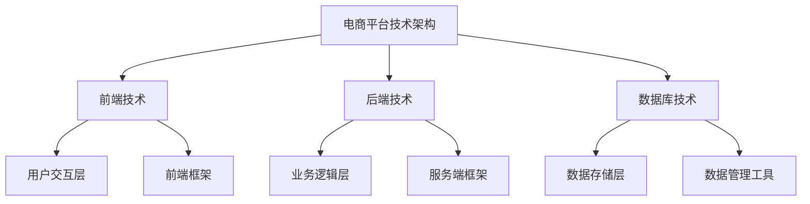
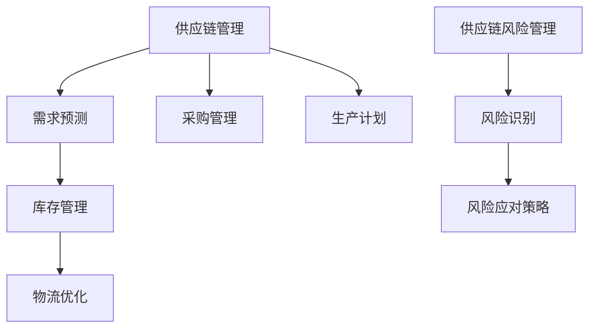

                 

## 电商平台供给能力提升：海外市场拓展

### 关键词
- 电商平台
- 海外市场拓展
- 供给能力提升
- 供应链管理
- 技术架构优化
- 营销策略

### 摘要
本文将深入探讨电商平台在海外市场拓展过程中如何提升供给能力。通过分析电商平台的基本概念、海外市场拓展策略、供应链管理优化、产品与服务创新、技术手段提升以及市场推广策略，本文旨在为电商平台提供一套系统的拓展方案，助力其在全球市场中占据一席之地。

### 目录大纲

#### 第一部分：电商平台概述
- **第1章：电商平台的基本概念与市场环境**
  - 1.1 电商平台的定义与发展历程
  - 1.2 电商平台的市场环境分析
  - 1.3 电商平台的商业模式与盈利模式
  - 1.4 电商平台的核心竞争力

#### 第二部分：海外市场拓展策略
- **第2章：海外市场研究**
  - 2.1 海外市场调研方法与工具
  - 2.2 目标市场选择标准
  - 2.3 文化差异与市场适应性

#### 第三部分：供给能力提升
- **第3章：供应链管理与优化**
  - 3.1 供应链管理的基本概念
  - 3.2 供应链优化策略
  - 3.3 海外物流与配送策略
  - 3.4 供应链风险管理

#### 第四部分：产品与服务创新
- **第4章：产品多元化与本土化策略**
  - 4.1 产品多元化策略
  - 4.2 产品本土化策略
  - 4.3 用户需求分析与市场调研
  - 4.4 产品迭代与优化

#### 第五部分：技术手段提升
- **第5章：电商平台技术架构优化**
  - 5.1 电商平台技术架构概述
  - 5.2 技术选型与架构设计
  - 5.3 数据分析与挖掘
  - 5.4 用户体验优化

#### 第六部分：市场推广策略
- **第6章：营销策略与渠道拓展**
  - 6.1 营销策略制定原则
  - 6.2 社交媒体营销策略
  - 6.3 KOL与合作策略
  - 6.4 海外市场推广案例分析

#### 第七部分：成功案例分析
- **第7章：海外市场拓展成功案例分析**
  - 7.1 案例选择标准
  - 7.2 案例分析框架
  - 7.3 成功经验总结
  - 7.4 挑战与应对策略

#### 附录
- **附录A：拓展资源与工具**
  - A.1 市场调研工具推荐
  - A.2 电商平台开发技术栈
  - A.3 数据分析工具与资源

### 附录：核心概念与联系

#### 电商平台技术架构流程图


#### 供应链管理优化策略流程图


#### 技术选型与架构设计伪代码
```python
def select_technology(backend, frontend, database):
    if backend == "Python":
        return "Django for backend, React for frontend, PostgreSQL for database"
    elif backend == "Java":
        return "Spring Boot for backend, Angular for frontend, MySQL for database"
    else:
        return "Node.js for backend, Vue.js for frontend, MongoDB for database"
```

#### 用户需求预测模型
$$
\text{需求预测} = f(\text{历史销售数据}, \text{季节性因素}, \text{市场趋势})
$$

#### 库存优化目标函数
$$
\text{最小化库存成本} = \min(\text{安全库存成本} + \text{平均库存成本})
$$

### 文章正文部分

#### 第一部分：电商平台概述

##### 第1章：电商平台的基本概念与市场环境

1.1 **电商平台的定义与发展历程**

电商平台是指通过互联网技术，为消费者和商家提供交易服务的在线平台。电子商务的起源可以追溯到20世纪90年代，随着互联网的普及，电商平台迅速发展。

- **1995年**：亚马逊成立于美国，成为全球最早的电商平台之一。
- **2000年**：中国电商平台如淘宝、京东等相继成立。
- **2010年**：移动电商崛起，移动支付普及，电商平台进入高速发展期。

1.2 **电商平台的市场环境分析**

电商平台的市场环境包括政策、经济、技术等多个方面。

- **政策环境**：政府对电商平台的扶持政策，如税收减免、跨境电子商务便利化等。
- **经济环境**：全球经济增长趋势和消费者购买力。
- **技术环境**：云计算、大数据、人工智能等新技术的发展，推动电商平台技术创新。

1.3 **电商平台的商业模式与盈利模式**

电商平台的商业模式主要包括C2C（如淘宝）、B2C（如京东）和O2O（如美团）等。

- **C2C**：消费者与消费者之间进行交易，平台收取交易费用。
- **B2C**：商家与消费者之间进行交易，平台提供商品展示、支付、物流等服务，收取广告费、交易佣金等。
- **O2O**：线上与线下相结合，平台提供线上预约、线下消费等服务。

盈利模式主要包括广告费、交易佣金、物流服务等。

1.4 **电商平台的核心竞争力**

电商平台的核心竞争力主要包括以下几个方面：

- **用户基数**：庞大的用户基数是电商平台的基础。
- **物流能力**：高效的物流配送能力是提升用户体验的关键。
- **技术实力**：先进的技术能力是电商平台保持竞争力的关键。
- **产品丰富度**：丰富的商品种类和优质的服务是吸引消费者的关键。

#### 第二部分：海外市场拓展策略

##### 第2章：海外市场研究

2.1 **海外市场调研方法与工具**

海外市场调研方法包括问卷调查、访谈、数据分析等。

- **问卷调查**：通过在线问卷收集用户反馈，了解用户需求和偏好。
- **访谈**：通过与潜在用户进行面对面访谈，深入了解用户需求和市场趋势。
- **数据分析**：通过分析市场数据，了解市场容量、竞争对手情况等。

海外市场调研工具包括Google Analytics、问卷星、Zoom 等。

2.2 **目标市场选择标准**

选择目标市场时需要考虑以下几个方面：

- **市场规模**：目标市场的人口数量、购买力等。
- **竞争情况**：目标市场的竞争对手数量、市场份额等。
- **文化差异**：目标市场的文化、语言、法律法规等。
- **政策环境**：目标市场的政策支持、贸易壁垒等。

2.3 **文化差异与市场适应性**

文化差异是海外市场拓展的重要挑战。

- **语言**：提供本地化语言支持，提高用户体验。
- **消费习惯**：了解目标市场的消费习惯，提供符合市场需求的产品和服务。
- **法律法规**：遵守目标市场的法律法规，确保合规经营。

### 第三部分：供给能力提升

##### 第3章：供应链管理与优化

3.1 **供应链管理的基本概念**

供应链管理是指从原材料采购到产品交付的全过程管理，旨在提高生产效率、降低成本、提高产品质量。

3.2 **供应链优化策略**

供应链优化策略包括需求预测、库存管理、物流优化等。

- **需求预测**：通过数据分析、历史销售数据等预测未来需求。
- **库存管理**：优化库存水平，减少库存成本。
- **物流优化**：提高物流效率，降低物流成本。

3.3 **海外物流与配送策略**

海外物流与配送策略包括跨境物流、本地配送等。

- **跨境物流**：选择合适的物流公司，确保货物安全、快速送达。
- **本地配送**：与本地物流公司合作，提高配送效率。

3.4 **供应链风险管理**

供应链风险管理包括风险识别、风险应对策略等。

- **风险识别**：识别供应链中的潜在风险，如供应链中断、物流延误等。
- **风险应对策略**：制定应对策略，如备用供应链、保险等。

### 第四部分：产品与服务创新

##### 第4章：产品多元化与本土化策略

4.1 **产品多元化策略**

产品多元化策略包括扩大产品种类、推出新产品等。

- **扩大产品种类**：根据市场需求，增加商品种类。
- **推出新产品**：通过市场调研，开发符合市场需求的新产品。

4.2 **产品本土化策略**

产品本土化策略包括文化适应、消费习惯适应等。

- **文化适应**：根据目标市场的文化特点，调整产品设计和宣传策略。
- **消费习惯适应**：了解目标市场的消费习惯，提供符合当地市场需求的产品和服务。

4.3 **用户需求分析与市场调研**

用户需求分析与市场调研是产品创新的基础。

- **用户需求分析**：通过问卷调查、访谈等方式，了解用户需求和偏好。
- **市场调研**：通过数据分析、市场趋势研究等，了解市场状况和竞争环境。

4.4 **产品迭代与优化**

产品迭代与优化是持续改进产品的重要手段。

- **产品迭代**：根据用户反馈和市场变化，定期更新产品功能。
- **优化**：通过数据分析，找出产品中的问题和瓶颈，进行优化改进。

### 第五部分：技术手段提升

##### 第5章：电商平台技术架构优化

5.1 **电商平台技术架构概述**

电商平台技术架构包括前端技术、后端技术、数据库技术等。

- **前端技术**：用户交互层，包括HTML、CSS、JavaScript等。
- **后端技术**：业务逻辑层，包括服务器端编程语言、框架等。
- **数据库技术**：数据存储层，包括关系型数据库、NoSQL数据库等。

5.2 **技术选型与架构设计**

技术选型与架构设计是提升电商平台技术能力的关键。

- **技术选型**：根据业务需求，选择合适的编程语言、框架、数据库等。
- **架构设计**：设计合理的系统架构，确保系统的高可用性、高性能和高扩展性。

5.3 **数据分析与挖掘**

数据分析与挖掘是电商平台技术提升的重要手段。

- **数据分析**：通过数据分析，了解用户行为和市场趋势。
- **数据挖掘**：通过数据挖掘技术，发现数据中的规律和趋势。

5.4 **用户体验优化**

用户体验优化是提升电商平台竞争力的重要方面。

- **界面优化**：设计简洁、美观的界面，提高用户满意度。
- **性能优化**：优化页面加载速度，提高用户体验。
- **交互优化**：优化交互设计，提高用户操作便捷性。

### 第六部分：市场推广策略

##### 第6章：营销策略与渠道拓展

6.1 **营销策略制定原则**

营销策略制定原则包括目标明确、策略可行、资源合理配置等。

- **目标明确**：明确营销目标，如提高品牌知名度、增加销售量等。
- **策略可行**：制定可行的营销策略，确保策略的实施和效果。
- **资源合理配置**：合理分配资源，确保营销策略的有效实施。

6.2 **社交媒体营销策略**

社交媒体营销策略包括内容营销、社交媒体广告、KOL合作等。

- **内容营销**：通过优质内容，吸引目标用户，提高品牌知名度。
- **社交媒体广告**：在社交媒体平台上投放广告，吸引潜在用户。
- **KOL合作**：与社交媒体上的意见领袖合作，提高品牌影响力。

6.3 **KOL与合作策略**

KOL与合作策略包括选择合适的KOL、合作形式、效果评估等。

- **选择合适的KOL**：根据目标市场和用户特点，选择合适的KOL进行合作。
- **合作形式**：根据KOL的特点和粉丝群体，制定合适的合作形式。
- **效果评估**：通过数据分析，评估KOL合作的效果，不断优化策略。

6.4 **海外市场推广案例分析**

海外市场推广案例分析包括案例背景、推广策略、效果评估等。

- **案例背景**：介绍案例的背景，如目标市场、竞争环境等。
- **推广策略**：介绍推广策略的具体实施，如社交媒体广告、KOL合作等。
- **效果评估**：通过数据分析，评估推广效果，总结成功经验和教训。

### 第七部分：成功案例分析

##### 第7章：海外市场拓展成功案例分析

7.1 **案例选择标准**

案例选择标准包括成功拓展海外市场、具备代表性、具备可借鉴性等。

- **成功拓展海外市场**：选择已经在海外市场取得成功的案例。
- **具备代表性**：选择具有代表性的案例，如在不同市场取得成功的案例。
- **具备可借鉴性**：选择案例中的成功经验和策略，为其他电商平台提供参考。

7.2 **案例分析框架**

案例分析框架包括案例背景、拓展策略、成功经验、挑战与应对策略等。

- **案例背景**：介绍案例的基本情况，如目标市场、竞争环境等。
- **拓展策略**：分析案例中的拓展策略，如市场调研、供应链管理、技术提升等。
- **成功经验**：总结案例中的成功经验和策略，为其他电商平台提供参考。
- **挑战与应对策略**：分析案例中的挑战和应对策略，为其他电商平台提供借鉴。

7.3 **成功经验总结**

成功经验总结包括市场调研、本地化策略、物流网络建设、市场营销等。

- **市场调研**：深入了解目标市场，制定有针对性的策略。
- **本地化策略**：提供本地化产品和服务，满足当地用户需求。
- **物流网络建设**：建立高效的物流网络，提高配送效率。
- **市场营销**：通过多种营销手段，提高品牌知名度和用户粘性。

7.4 **挑战与应对策略**

挑战与应对策略包括文化差异、竞争压力、物流成本等。

- **文化差异**：尊重当地文化，提供本地化服务。
- **竞争压力**：通过技术创新和服务质量提升竞争力。
- **物流成本**：优化物流网络，降低物流成本。

### 附录：拓展资源与工具

##### 附录A：拓展资源与工具

A.1 **市场调研工具推荐**

- **Google Analytics**：提供网站流量分析工具。
- **问卷星**：提供在线问卷调查工具。
- **Zoom**：提供远程会议和视频通话工具。

A.2 **电商平台开发技术栈**

- **前端技术**：HTML、CSS、JavaScript、Vue.js、React等。
- **后端技术**：Python、Java、Node.js、Django、Spring Boot等。
- **数据库技术**：MySQL、PostgreSQL、MongoDB等。

A.3 **数据分析工具与资源**

- **Python**：提供数据分析工具，如NumPy、Pandas等。
- **R**：提供统计分析工具，适用于数据分析和可视化。
- **Tableau**：提供数据可视化工具。

### 总结

通过本文的探讨，我们可以看到，海外市场拓展是电商平台发展的重要方向。在拓展过程中，电商平台需要关注市场调研、供应链管理、产品与服务创新、技术手段提升和市场推广策略等多个方面。通过成功案例的分析，我们可以总结出一些可借鉴的经验和策略，为电商平台在海外市场的拓展提供参考。在未来的发展中，电商平台需要不断优化自身能力，以应对全球市场的竞争和挑战。

### 作者信息

**作者：AI天才研究院/AI Genius Institute & 禅与计算机程序设计艺术 /Zen And The Art of Computer Programming**

