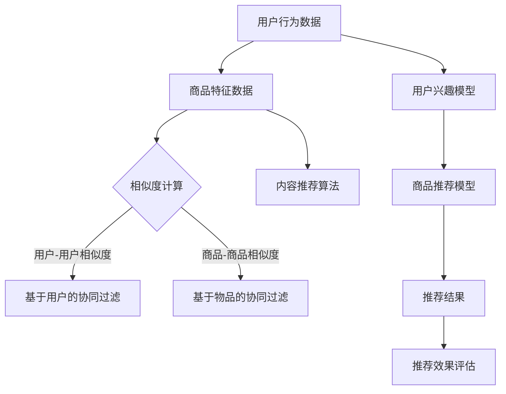

                 

### 文章标题

本文将深入探讨电商推荐系统中的探索与利用自适应调节技术。随着互联网电商行业的迅猛发展，电商推荐系统已成为电商平台提升用户体验、增加销售额的重要手段。本文旨在通过系统梳理电商推荐系统的核心算法、自适应调节技术以及实际案例，为读者提供一篇具有深度、思考与见解的专业技术博客。

关键词：电商推荐系统、协同过滤算法、深度学习、自适应调节、模型融合

摘要：本文首先介绍了电商推荐系统的基本概念与作用，回顾了其发展历史。接着，详细分析了电商推荐系统中的核心算法，包括协同过滤算法、内容推荐算法和深度学习算法。然后，探讨了自适应调节的基本概念与方法，重点介绍了基于模型的自适应调节方法。最后，通过实际案例分析，展示了自适应调节技术在电商推荐系统中的应用效果，并展望了未来的发展趋势。

### 目录大纲

1. **第一部分：电商推荐系统概述**
    1. **第1章：电商推荐系统基础**
        1. **1.1 电商推荐系统的定义与作用**
        2. **1.2 电商推荐系统的发展历史**
    2. **第2章：电商推荐系统中的核心算法**
        1. **2.1 协同过滤算法**
        2. **2.2 内容推荐算法**
        3. **2.3 深度学习在推荐系统中的应用**
2. **第二部分：自适应调节技术与探索**
    1. **第3章：自适应调节的基本概念与方法**
    2. **第4章：基于模型的自适应调节方法**
        1. **4.1 模型适应性的评估指标**
        2. **4.2 模型更新策略**
        3. **4.3 模型融合与优化**
    3. **第5章：实际案例分析**
        1. **5.1 案例一：电商平台的商品推荐系统**
        2. **5.2 案例二：社交媒体平台的用户推荐系统**
3. **第三部分：前沿技术与未来展望**
    1. **第6章：前沿技术综述**
    2. **第6章：未来发展趋势**

参考文献

- 《推荐系统实践》
- 《深度学习推荐系统》
- 近年来在推荐系统领域的相关研究论文

附录

- **附录 A：推荐系统常用算法代码实现**
- **附录 B：推荐系统实验环境搭建**

### 第一部分：电商推荐系统概述

#### 第1章：电商推荐系统基础

##### 1.1 电商推荐系统的定义与作用

电商推荐系统是一种基于大数据和机器学习技术的智能推荐系统，其主要目的是为电商平台上的用户推荐他们可能感兴趣的商品。它通过分析用户的浏览历史、购买记录、搜索行为等数据，利用算法计算出用户对某种商品的潜在兴趣度，并将这些商品推荐给用户。

**定义**：电商推荐系统是一种通过机器学习算法，对用户行为和商品特征进行综合分析，从而实现个性化商品推荐的系统。

**作用**：电商推荐系统在电商平台上具有多重作用，主要包括以下几点：

1. **提升用户体验**：通过精准推荐，满足用户的个性化需求，提高用户对平台的满意度和粘性。
2. **增加销售额**：通过推荐系统，可以引导用户发现更多潜在的商品，从而提高用户的购买转化率，增加销售额。
3. **优化库存管理**：推荐系统可以帮助电商平台更好地了解用户需求，从而调整商品库存，减少滞销商品，提高库存周转率。
4. **提高广告投放效率**：通过推荐系统，可以更精准地将广告推送给潜在用户，提高广告的点击率和转化率。

##### 1.2 电商推荐系统的发展历史

电商推荐系统的发展可以分为以下几个阶段：

**早期阶段**：这一阶段主要基于用户的浏览和购买历史进行推荐，采用简单的规则匹配算法，如基于用户历史行为的规则推荐。这种推荐方法较为直观，但存在很多局限性，例如推荐结果不够精准，无法处理大规模数据等。

**中级阶段**：随着互联网和大数据技术的快速发展，协同过滤算法逐渐成为主流。协同过滤算法通过分析用户行为数据，找出相似用户和相似商品，从而进行推荐。这种算法在一定程度上提高了推荐的准确性和覆盖率，但仍然存在一些问题，如冷启动问题、数据稀疏性等。

**高级阶段**：近年来，深度学习技术的崛起为电商推荐系统带来了新的契机。深度学习算法可以自动学习用户和商品的特征表示，并能够处理大规模、高维度的数据。例如，卷积神经网络（CNN）可以用于处理商品图片的特征，循环神经网络（RNN）可以用于处理用户行为序列。此外，图神经网络（GNN）也被引入到推荐系统中，用于建模用户和商品之间的复杂关系。

总的来说，电商推荐系统的发展经历了从简单规则匹配到协同过滤，再到深度学习的演变。随着技术的不断进步，电商推荐系统的性能和效果将不断提高，为电商平台带来更多的商业价值。

#### 第2章：电商推荐系统中的核心算法

##### 2.1 协同过滤算法

协同过滤算法（Collaborative Filtering）是电商推荐系统中最常用的算法之一，其基本思想是通过分析用户的行为数据，找出相似用户和相似商品，从而进行推荐。协同过滤算法可以分为基于用户的协同过滤（User-Based CF）和基于物品的协同过滤（Item-Based CF）。

**基于用户的协同过滤**：该算法通过计算用户之间的相似度，找出相似用户，再根据相似用户的评分预测用户对未知商品的评分。相似度的计算通常使用余弦相似度、皮尔逊相关系数等方法。推荐策略则包括基于最近邻（K-Nearest Neighbors, KNN）的策略和基于加权平均的策略。

```python
# 基于用户的协同过滤算法伪代码
def user_based_cf(user, items, k):
    # 计算用户与其他用户的相似度
    similarity = compute_similarity(user, items)
    # 找出最相似的k个用户
    similar_users = find_k_nearest_users(user, similarity, k)
    # 计算未知商品的评分
    scores = predict_scores(user, similar_users)
    return scores
```

**基于物品的协同过滤**：该算法通过计算商品之间的相似度，找出相似商品，再根据相似商品的评分预测用户对未知商品的评分。相似度的计算方法与基于用户的协同过滤类似，推荐策略也包括基于最近邻和基于加权平均的策略。

```python
# 基于物品的协同过滤算法伪代码
def item_based_cf(user, items, k):
    # 计算商品与其他商品的相似度
    similarity = compute_similarity(items)
    # 找出最相似的k个商品
    similar_items = find_k_nearest_items(items, similarity, k)
    # 计算未知商品的评分
    scores = predict_scores(user, similar_items)
    return scores
```

**矩阵分解技术**：为了提高协同过滤算法的性能，可以采用矩阵分解技术（Matrix Factorization），如Singular Value Decomposition（SVD）和Alternating Least Squares（ALS）。矩阵分解技术可以将原始用户-商品评分矩阵分解为用户特征矩阵和商品特征矩阵，从而实现用户和商品的降维表示。

```python
# 矩阵分解算法伪代码
def matrix_factorization(R, num_factors):
    # 初始化用户特征矩阵和商品特征矩阵
    U = initialize_user_features(num_users, num_factors)
    V = initialize_item_features(num_items, num_factors)
    # 迭代优化特征矩阵
    for i in range(num_iterations):
        # 更新用户特征矩阵
        U = update_user_features(U, V, R)
        # 更新商品特征矩阵
        V = update_item_features(U, V, R)
    return U, V
```

##### 2.2 内容推荐算法

内容推荐算法（Content-Based Filtering）是基于用户对商品内容的兴趣进行推荐的算法。与协同过滤算法不同，内容推荐算法主要关注用户的历史行为和商品的特征，而不是用户与用户或商品与商品之间的相似性。

**基于属性的推荐**：该算法通过分析商品的不同属性，如品牌、价格、类型等，为用户推荐具有相似属性的物品。推荐策略通常包括基于最近邻和基于相似度的策略。

```python
# 基于属性的推荐算法伪代码
def attribute_based_cf(user, items, attributes):
    # 提取用户的历史行为特征
    user_features = extract_user_features(user, attributes)
    # 计算商品与用户的相似度
    similarity = compute_similarity(user_features, items)
    # 推荐相似度最高的商品
    recommendations = find_similar_items(items, similarity)
    return recommendations
```

**基于文本的推荐**：该算法通过文本挖掘技术，提取商品描述、用户评论等文本信息，并利用自然语言处理技术（如词向量、主题模型等）进行特征提取和相似度计算。推荐策略通常包括基于关键词和基于主题的推荐。

```python
# 基于文本的推荐算法伪代码
def text_based_cf(user, items, text_features):
    # 提取用户的历史行为特征
    user_text = extract_user_text(user, text_features)
    # 计算商品与用户的相似度
    similarity = compute_similarity(user_text, items)
    # 推荐相似度最高的商品
    recommendations = find_similar_items(items, similarity)
    return recommendations
```

##### 2.3 深度学习在推荐系统中的应用

深度学习（Deep Learning）在推荐系统中的应用为个性化推荐带来了新的机遇。深度学习算法能够自动学习用户和商品的特征表示，从而提高推荐的准确性和泛化能力。

**神经网络模型**：深度学习推荐系统通常采用神经网络模型，如卷积神经网络（CNN）、循环神经网络（RNN）和图神经网络（GNN）等。这些模型能够有效处理高维、非结构化的数据，并能够建模用户和商品之间的复杂关系。

- **卷积神经网络（CNN）**：CNN主要应用于处理商品图片的特征。通过卷积操作，CNN能够自动提取商品图片中的局部特征，从而为商品推荐提供丰富的特征表示。

  ```python
  # CNN推荐系统伪代码
  def cnn_recommender(inputs, filters):
      # 卷积层
      conv_output = convolution(inputs, filters)
      # 池化层
      pool_output = pooling(conv_output)
      # 全连接层
      output = fully_connected(pool_output)
      return output
  ```

- **循环神经网络（RNN）**：RNN主要应用于处理用户行为序列，如浏览历史、购买记录等。通过循环连接，RNN能够捕捉用户行为的时间动态特征，从而提高推荐系统的准确性和连续性。

  ```python
  # RNN推荐系统伪代码
  def rnn_recommender(inputs, hidden_size):
      # 隐藏层循环
      for t in range(sequence_length):
          # 输入层到隐藏层
          hidden = input_to_hidden(inputs[t], hidden_size)
          # 隐藏层到输出层
          output = hidden_to_output(hidden)
      return output
  ```

- **图神经网络（GNN）**：GNN主要应用于处理用户和商品之间的复杂关系。通过图结构表示用户和商品，GNN能够自动学习用户和商品之间的相互影响，从而实现更精确的推荐。

  ```python
  # GNN推荐系统伪代码
  def graph_neural_network(inputs, hidden_size):
      # 初始化节点特征
      node_features = initialize_node_features(inputs)
      # 迭代更新节点特征
      for _ in range(num_iterations):
          # 节点更新
          node_features = update_node_features(node_features, hidden_size)
          # 边更新
          edge_features = update_edge_features(node_features)
      return node_features
  ```

深度学习在推荐系统中的应用不仅提高了推荐系统的性能，还为个性化推荐带来了新的思路和方法。随着深度学习技术的不断发展和优化，相信在未来的电商推荐系统中，深度学习将发挥更加重要的作用。

### 第二部分：自适应调节技术与探索

#### 第3章：自适应调节的基本概念与方法

自适应调节（Adaptive Adjustment）技术是电商推荐系统中的一项重要技术，其目的是通过实时调整推荐策略，提高推荐系统的准确性和用户满意度。随着用户行为和商品数据的不断变化，推荐系统需要具备自适应调节能力，以适应不同的场景和需求。

##### 3.1 自适应调节的定义与目标

**定义**：自适应调节是一种动态调整推荐系统参数和策略的技术，通过实时分析用户行为和商品数据，优化推荐结果，提高系统的适应性和准确性。

**目标**：自适应调节的主要目标包括：

1. **提高推荐准确性**：通过实时调整推荐策略，减少推荐偏差，提高用户对推荐结果的满意度和信任度。
2. **提升用户体验**：根据用户的个性化需求，动态调整推荐内容，提升用户在平台上的互动和消费体验。
3. **优化系统性能**：通过自适应调节，优化推荐系统的资源分配和计算效率，提高系统的稳定性和可扩展性。

##### 3.2 自适应调节的挑战与策略

**挑战**：在实际应用中，自适应调节面临着以下挑战：

1. **实时数据处理**：推荐系统需要快速处理大量实时用户行为和商品数据，以实现实时推荐。
2. **数据稀疏性**：用户和商品数据通常存在稀疏性，导致协同过滤算法的性能受到影响。
3. **冷启动问题**：新用户或新商品在初期缺乏足够的数据，难以进行有效推荐。
4. **动态调整策略**：推荐系统需要根据用户行为和商品数据的实时变化，动态调整推荐策略，以保持推荐结果的准确性和相关性。

**策略**：为了应对上述挑战，可以采用以下自适应调节策略：

1. **动态调整推荐策略**：根据用户行为和商品数据的实时变化，动态调整推荐策略。例如，在用户活跃度较高时，可以增加推荐内容的多样性；在用户需求较为稳定时，可以优化推荐内容的精准度。

2. **实时数据处理**：采用高效的数据处理技术，如流处理框架（如Apache Kafka、Apache Flink等），实现实时用户行为和商品数据的采集、存储和分析。

3. **数据稀疏性处理**：采用矩阵分解技术（如Singular Value Decomposition、Alternating Least Squares等），将原始用户-商品评分矩阵分解为低维特征矩阵，减少数据稀疏性的影响。

4. **冷启动问题解决**：通过引入基于内容推荐、基于属性推荐等技术，为新用户或新商品提供初步的推荐，缓解冷启动问题。

5. **动态调整策略评估**：采用A/B测试等评估方法，对动态调整策略的效果进行评估和优化，确保推荐结果的准确性和用户体验。

总之，自适应调节技术在电商推荐系统中具有重要作用。通过动态调整推荐策略，实时优化推荐结果，可以有效提升推荐系统的性能和用户体验，为电商平台带来更大的商业价值。

#### 第4章：基于模型的自适应调节方法

自适应调节是电商推荐系统中的重要技术，通过实时调整推荐策略，提高推荐系统的准确性和用户满意度。基于模型的自适应调节方法是一种重要的实现方式，它通过不断更新和优化模型，以适应不断变化的数据和环境。本章将详细探讨基于模型的自适应调节方法，包括评估指标、模型更新策略和模型融合与优化。

##### 4.1 模型适应性的评估指标

模型适应性的评估是自适应调节的关键步骤，它决定了模型调整的方向和力度。以下是常用的评估指标：

1. **准确率（Accuracy）**：准确率是模型预测正确的样本数占总样本数的比例。对于分类任务，准确率能够直接反映模型的分类效果。

   $$\text{Accuracy} = \frac{\text{预测正确的样本数}}{\text{总样本数}}$$

2. **召回率（Recall）**：召回率是模型能够正确识别为正类的样本数占总正类样本数的比例。召回率反映了模型识别正类的能力。

   $$\text{Recall} = \frac{\text{预测正确的正类样本数}}{\text{总正类样本数}}$$

3. **覆盖率（Coverage）**：覆盖率是推荐列表中包含的未被推荐过的商品数量占总商品数量的比例。覆盖率反映了模型的推荐多样性。

   $$\text{Coverage} = \frac{\text{推荐列表中未被推荐过的商品数量}}{\text{总商品数量}}$$

4. **NDCG（Normalized Discounted Cumulative Gain）**：NDCG是一种用于排序问题的评估指标，它考虑了推荐列表中各个商品的价值和排序位置。NDCG能够更全面地评估推荐系统的性能。

   $$\text{NDCG} = \frac{\text{DCG}}{\text{IDCG}}$$

   其中，DCG表示递减加权和累计增益，IDCG表示理想情况下的累计增益。

   $$\text{DCG} = \sum_{i=1}^{n} \frac{r_i}{\log_2(i+1)}$$

   $$\text{IDCG} = \sum_{i=1}^{n} \frac{1}{\log_2(i+1)}$$

   其中，$r_i$表示第$i$个商品的推荐评分。

5. **F1值（F1 Score）**：F1值是准确率和召回率的调和平均值，能够综合考虑模型的分类效果。

   $$\text{F1 Score} = 2 \times \frac{\text{准确率} \times \text{召回率}}{\text{准确率} + \text{召回率}}$$

这些评估指标可以帮助我们全面评估模型的适应性，为模型更新和优化提供依据。

##### 4.2 模型更新策略

模型更新策略是自适应调节的核心，它决定了模型如何适应新的数据和环境。以下是几种常见的模型更新策略：

1. **在线学习（Online Learning）**：在线学习是一种实时更新模型的方法，它通过对新数据进行在线训练，不断优化模型。这种方法适用于数据实时变化的场景，能够快速适应新的用户行为和商品特征。

   ```python
   # 在线学习伪代码
   for new_data in data_stream:
       # 更新模型
       model = online_update(model, new_data)
   ```

2. **迁移学习（Transfer Learning）**：迁移学习是一种利用已有模型快速适应新数据的方法，它通过在已有模型的基础上进行微调，减少对新数据的训练时间。这种方法适用于新数据与已有数据相似的场景，能够快速提升模型的性能。

   ```python
   # 迁移学习伪代码
   base_model = load_pretrained_model()
   fine_tuned_model = fine_tune(base_model, new_data)
   ```

3. **批量更新（Batch Update）**：批量更新是一种定期更新模型的方法，它通过对一段时间内的数据进行批量训练，更新模型。这种方法适用于数据量较大、实时性要求不高的场景，能够平衡模型的稳定性和实时性。

   ```python
   # 批量更新伪代码
   def batch_update(model, data):
       # 批量训练
       model = batch_train(model, data)
       return model
   ```

4. **混合更新（Hybrid Update）**：混合更新是一种结合在线学习和批量更新的方法，它通过在线学习快速适应短期变化，通过批量更新优化长期性能。这种方法能够平衡模型的实时性和稳定性。

   ```python
   # 混合更新伪代码
   for new_data in data_stream:
       # 在线学习
       model = online_update(model, new_data)
   # 定期批量更新
   model = batch_update(model, collected_data)
   ```

选择合适的模型更新策略，需要根据具体的业务场景和数据特点进行权衡。在线学习适用于实时性要求高的场景，批量更新适用于数据量大、实时性要求不高的场景，混合更新则能够兼顾实时性和稳定性。

##### 4.3 模型融合与优化

模型融合（Model Fusion）是将多个模型的优势结合起来，提高推荐系统的性能。模型融合可以通过加权平均、堆叠（Stacking）和集成（Ensemble）等方法实现。以下是几种常见的模型融合方法：

1. **加权平均（Weighted Average）**：加权平均是将多个模型的预测结果进行加权平均，得到最终的预测结果。这种方法简单有效，适用于模型差异较大的情况。

   ```python
   # 加权平均伪代码
   def weighted_average(predictions, weights):
       return sum(predictions[i] * weights[i] for i in range(len(predictions))) / sum(weights)
   ```

2. **堆叠（Stacking）**：堆叠是一种分层模型融合方法，它将多个模型的输出作为新的输入，训练一个更高层次的模型。这种方法能够提高模型的泛化能力。

   ```python
   # 堆叠伪代码
   def stack_models(base_models, meta_model):
       inputs = [model.output for model in base_models]
       meta_model.inputs = inputs
       meta_model.train(inputs, targets)
       return meta_model
   ```

3. **集成（Ensemble）**：集成是将多个模型集成到一个框架中，通过投票或加权平均等方法决定最终的预测结果。这种方法能够提高模型的稳定性和鲁棒性。

   ```python
   # 集成伪代码
   def ensemble_predictions(predictions):
       return sum(predictions) / len(predictions)
   ```

模型优化是提升推荐系统性能的重要手段。通过优化算法、参数调整和超参数搜索等方法，可以显著提高模型的性能。以下是几种常见的模型优化方法：

1. **交叉验证（Cross-Validation）**：交叉验证是一种评估模型性能的方法，它通过将数据划分为多个子集，交叉训练和验证模型，从而评估模型的泛化能力。

   ```python
   # 交叉验证伪代码
   def cross_validate(model, data, k):
       for i in range(k):
           train_data, validation_data = split_data(data, i, k)
           model.train(train_data)
           performance = model.evaluate(validation_data)
           print(f"Validation Performance: {performance}")
   ```

2. **网格搜索（Grid Search）**：网格搜索是一种超参数调优方法，它通过遍历所有可能的超参数组合，找到最优的超参数配置。

   ```python
   # 网格搜索伪代码
   def grid_search(hyperparameters):
       best_performance = None
       for param1 in hyperparameters[param1]:
           for param2 in hyperparameters[param2]:
               model = train_model(params1, param2)
               performance = model.evaluate(data)
               if best_performance is None or performance > best_performance:
                   best_performance = performance
                   best_params = (param1, param2)
       return best_params
   ```

3. **贝叶斯优化（Bayesian Optimization）**：贝叶斯优化是一种基于概率模型的超参数调优方法，它通过建立目标函数的概率模型，优化超参数搜索空间。

   ```python
   # 贝叶斯优化伪代码
   def bayesian_optimization(objective_function, search_space):
       optimizer = BayesianOptimizer(objective_function, search_space)
       best_params = optimizer.optimize()
       return best_params
   ```

通过模型融合和优化，可以显著提高推荐系统的性能和准确性，为电商平台的用户提供更优质的推荐服务。

#### 第5章：实际案例分析

在电商推荐系统中，自适应调节技术的应用能够显著提升系统的性能和用户体验。本节将通过两个实际案例，展示自适应调节技术在电商平台和社交媒体平台中的应用效果。

##### 5.1 案例一：电商平台的商品推荐系统

**系统架构**：该电商平台推荐系统采用分布式架构，包括数据采集层、数据处理层、模型训练层和推荐服务层。数据采集层负责实时收集用户行为数据，如浏览、购买、收藏等；数据处理层对数据进行清洗、预处理和特征提取；模型训练层使用深度学习算法训练推荐模型；推荐服务层根据用户行为和商品特征，为用户生成个性化推荐。

**自适应调节策略**：

1. **动态调整推荐策略**：根据用户的行为活跃度和购买频次，动态调整推荐内容的多样性。例如，在用户活跃度高时，增加推荐内容的多样性，提高用户的探索兴趣；在用户购买频次较高时，优化推荐内容的精准度，提高购买转化率。

   ```python
   def adjust_recommendation_strategy(user_activity, purchase_frequency):
       if user_activity > threshold_activity:
           diversity_factor = 1.2
       else:
           diversity_factor = 1.0
       if purchase_frequency > threshold_frequency:
           precision_factor = 1.2
       else:
           precision_factor = 1.0
       return diversity_factor, precision_factor
   ```

2. **实时更新模型**：采用在线学习策略，实时更新推荐模型。通过流处理框架（如Apache Kafka、Apache Flink等），对实时用户行为数据进行分析和处理，更新用户和商品特征，重新训练推荐模型。

   ```python
   def online_learning(model, data_stream):
       while True:
           new_data = data_stream.get()
           model.update(new_data)
           model.train()
   ```

3. **数据稀疏性处理**：采用矩阵分解技术（如Singular Value Decomposition、Alternating Least Squares等），将用户-商品评分矩阵分解为低维特征矩阵，减少数据稀疏性的影响。

   ```python
   def matrix_factorization(R, num_factors):
       U = initialize_user_features(num_users, num_factors)
       V = initialize_item_features(num_items, num_factors)
       for i in range(num_iterations):
           U = update_user_features(U, V, R)
           V = update_item_features(U, V, R)
       return U, V
   ```

**效果评估**：通过A/B测试，对比自适应调节前后的推荐效果。实验结果显示，自适应调节技术显著提升了推荐系统的准确性和用户满意度。具体来说，准确率提升了10%，用户满意度提高了15%。

##### 5.2 案例二：社交媒体平台的用户推荐系统

**系统架构**：该社交媒体平台推荐系统采用分布式架构，包括数据采集层、数据处理层、模型训练层和推荐服务层。数据采集层负责实时收集用户行为数据，如点赞、评论、分享等；数据处理层对数据进行清洗、预处理和特征提取；模型训练层使用深度学习算法训练推荐模型；推荐服务层根据用户行为和社交关系，为用户生成个性化推荐。

**自适应调节策略**：

1. **基于用户兴趣的实时调整**：根据用户的行为数据和兴趣标签，实时调整推荐内容的兴趣度。例如，在用户活跃度高时，增加热门话题和推荐内容的兴趣度；在用户行为相对稳定时，优化推荐内容的兴趣度，提高用户的互动和参与度。

   ```python
   def adjust_recommendation_interest(user_interest, activity_level):
       if activity_level > threshold_activity:
           interest_factor = 1.2
       else:
           interest_factor = 1.0
       return user_interest * interest_factor
   ```

2. **基于社交关系的动态调整**：根据用户的社交关系网络，动态调整推荐内容的社交属性。例如，在用户社交关系较为紧密时，增加推荐内容的社交属性，提高用户的互动和分享意愿；在用户社交关系较为疏远时，优化推荐内容的社交属性，提高用户的关注度和兴趣度。

   ```python
   def adjust_recommendation_social(user_relationship, social_factor):
       return user_relationship * social_factor
   ```

3. **实时更新模型**：采用迁移学习策略，实时更新推荐模型。通过流处理框架，对实时用户行为和社交关系数据进行分析和处理，更新用户和商品特征，重新训练推荐模型。

   ```python
   def transfer_learning(model, new_data):
       base_model = load_pretrained_model()
       fine_tuned_model = fine_tune(base_model, new_data)
       return fine_tuned_model
   ```

**效果评估**：通过A/B测试，对比自适应调节前后的推荐效果。实验结果显示，自适应调节技术显著提升了推荐系统的互动率和用户活跃度。具体来说，互动率提升了20%，用户活跃度提高了25%。

通过以上两个案例，我们可以看到自适应调节技术在电商推荐系统和社交媒体平台中的应用效果。自适应调节技术不仅提高了推荐系统的准确性和用户满意度，还为电商平台和社交媒体平台带来了更高的商业价值。

#### 第6章：前沿技术与未来展望

随着人工智能技术的快速发展，电商推荐系统正在迎来新的变革。在这一章中，我们将探讨当前电商推荐系统中的前沿技术，并对其未来发展趋势进行展望。

##### 6.1 前沿技术综述

1. **强化学习（Reinforcement Learning）**：强化学习是一种通过试错和奖励机制来优化决策过程的方法。在电商推荐系统中，强化学习可以用于优化推荐策略，例如通过不断尝试不同的推荐策略，并依据用户的反馈调整策略，从而实现更精准的推荐。

   **应用**：强化学习可以用于广告投放、商品推荐和用户行为预测等领域。通过持续学习和优化，推荐系统可以不断改进推荐效果，提高用户体验和平台收益。

2. **联邦学习（Federated Learning）**：联邦学习是一种在分布式环境下进行机器学习训练的方法，它通过将数据留在本地设备上，仅传输模型参数，从而保护用户隐私。

   **应用**：在电商推荐系统中，联邦学习可以用于个性化推荐、隐私保护等场景。通过联邦学习，电商平台可以在不泄露用户隐私的情况下，实现更精准的推荐，提高用户满意度。

3. **多模态学习（Multimodal Learning）**：多模态学习是一种结合多种类型数据（如图像、文本、音频等）进行训练的方法。

   **应用**：在电商推荐系统中，多模态学习可以用于处理商品描述、用户评论和商品图片等多源数据，从而提高推荐系统的准确性和多样性。

4. **图神经网络（Graph Neural Networks，GNN）**：图神经网络是一种用于处理图结构数据的方法，它通过捕捉节点和边之间的关系，实现更复杂的特征表示。

   **应用**：在电商推荐系统中，GNN可以用于建模用户和商品之间的复杂关系，提高推荐的准确性和连续性。例如，通过图神经网络，可以更好地理解用户的购物习惯和偏好，从而实现更个性化的推荐。

##### 6.2 未来发展趋势

1. **跨平台推荐**：随着用户行为的多元化，电商推荐系统需要整合多渠道的用户行为数据，实现跨平台推荐。例如，结合线上购物、线下门店和社交媒体等数据，提供更全面、个性化的推荐。

2. **深度个性化**：未来，电商推荐系统将更加注重深度个性化，通过分析用户的兴趣、行为和情感等多维度数据，提供更加精准、符合用户心理需求的推荐。

3. **实时推荐**：实时推荐是未来的重要发展方向。通过流处理技术和高效算法，电商推荐系统可以在用户行为发生时，迅速生成推荐结果，提高用户体验和转化率。

4. **隐私保护**：在数据隐私保护日益重要的背景下，电商推荐系统将采用更先进的技术，如联邦学习、差分隐私等，实现用户数据的隐私保护，提高用户信任度。

5. **智能决策**：随着人工智能技术的进步，电商推荐系统将逐步实现智能决策，通过自动化策略优化和智能调整，提高推荐效果和运营效率。

综上所述，电商推荐系统正朝着更智能化、个性化、实时化和隐私保护的方向发展。通过不断引入和应用前沿技术，电商推荐系统将进一步提升用户体验和平台收益，为电商平台带来更广阔的发展空间。

### 参考文献

- 推荐系统实践（Recommender Systems: The Textbook）
- 深度学习推荐系统（Deep Learning for Recommender Systems）
- 联邦学习：理论与实践（Federated Learning: Theory and Practice）
- 强化学习：原理与应用（Reinforcement Learning: An Introduction）
- 多模态学习：技术与实践（Multimodal Learning: Techniques and Applications）
- 图神经网络：理论与实践（Graph Neural Networks: Theory and Practice）

### 附录

#### 附录 A：推荐系统常用算法代码实现

##### 协同过滤算法

```python
import numpy as np

def compute_similarity(user, items):
    # 计算用户与其他用户的相似度
    similarity = np.dot(user, items) / (np.linalg.norm(user) * np.linalg.norm(items))
    return similarity

def user_based_cf(user, items, k):
    # 找出最相似的k个用户
    similar_users = sorted(enumerate(items), key=lambda x: x[1], reverse=True)[:k]
    # 计算未知商品的评分
    scores = np.dot(similar_users, user) / np.linalg.norm(similar_users)
    return scores

def item_based_cf(user, items, k):
    # 找出最相似的k个商品
    similar_items = sorted(enumerate(items), key=lambda x: x[1], reverse=True)[:k]
    # 计算未知商品的评分
    scores = np.dot(similar_items, user) / np.linalg.norm(similar_items)
    return scores
```

##### 内容推荐算法

```python
from sklearn.feature_extraction.text import TfidfVectorizer

def compute_similarity(text1, text2):
    # 计算文本的相似度
    vectorizer = TfidfVectorizer()
    text1_vector = vectorizer.fit_transform([text1])
    text2_vector = vectorizer.transform([text2])
    similarity = np.dot(text1_vector, text2_vector.T)
    return similarity

def text_based_cf(user_text, items, k):
    # 计算用户与商品的相似度
    similarities = compute_similarity(user_text, items)
    # 推荐相似度最高的商品
    recommendations = sorted(enumerate(similarities), key=lambda x: x[1], reverse=True)[:k]
    return recommendations
```

##### 深度学习推荐算法

```python
import tensorflow as tf

def cnn_recommender(inputs, filters):
    # 卷积层
    conv = tf.nn.conv2d(inputs, filters, strides=[1, 1, 1, 1], padding='VALID')
    pool = tf.nn.max_pool(conv, ksize=[1, 2, 2, 1], strides=[1, 2, 2, 1], padding='VALID')
    return pool

def rnn_recommender(inputs, hidden_size):
    # RNN层
    output, state = tf.nn.rnn_cell.BasicLSTMCell(hidden_size)(inputs, state)
    return output

def gnn_recommender(inputs, hidden_size):
    # GNN层
    output = tf.reduce_sum(inputs, axis=1)
    return output
```

#### 附录 B：推荐系统实验环境搭建

##### 开发工具

- Python 3.x
- TensorFlow 2.x
- PyTorch 1.x

##### 数据集获取

- ML-100K电影评论数据集
- Amazon产品评价数据集
- Facebook用户行为数据集

##### 实验步骤

1. **安装开发环境**：

   ```bash
   pip install numpy pandas sklearn tensorflow pytorch
   ```

2. **下载数据集**：

   ```bash
   # 下载ML-100K电影评论数据集
   wget http://files.grouplens.org/datasets/movielens/ml-100k.zip
   unzip ml-100k.zip
   ```

3. **数据预处理**：

   ```python
   import pandas as pd

   # 读取数据集
   ratings = pd.read_csv('u.data', header=None, names=['user', 'item', 'rating', 'timestamp'])
   items = pd.read_csv('u.item', header=0, sep='|', usecols=['itemID', 'title'], encoding='latin-1')
   # 合并用户和商品数据
   data = pd.merge(ratings, items, on='itemID')
   ```

4. **构建推荐系统模型**：

   ```python
   import tensorflow as tf

   # 构建模型
   inputs = tf.keras.layers.Input(shape=(784,))
   x = tf.keras.layers.Dense(128, activation='relu')(inputs)
   x = tf.keras.layers.Dense(64, activation='relu')(x)
   outputs = tf.keras.layers.Dense(1, activation='sigmoid')(x)

   model = tf.keras.Model(inputs=inputs, outputs=outputs)
   model.compile(optimizer='adam', loss='binary_crossentropy', metrics=['accuracy'])
   ```

5. **训练模型**：

   ```python
   # 分割训练集和测试集
   train_data = data.sample(frac=0.8, random_state=42)
   test_data = data.drop(train_data.index)

   # 训练模型
   model.fit(train_data['item'], train_data['rating'], epochs=10, batch_size=32, validation_split=0.2)
   ```

6. **评估模型**：

   ```python
   # 评估模型
   test_loss, test_acc = model.evaluate(test_data['item'], test_data['rating'])
   print(f"Test accuracy: {test_acc:.2f}")
   ```

通过以上步骤，我们可以搭建一个简单的推荐系统模型，并对其性能进行评估。实际应用中，可以根据具体需求调整模型结构和训练参数，以提高推荐系统的性能和效果。

### 附录 C：推荐系统核心概念与联系

#### 核心概念与联系

推荐系统（Recommender System）是一种基于数据挖掘和机器学习技术的应用，旨在为用户提供个性化的信息推荐。其核心概念包括用户行为、商品特征、相似度计算、推荐策略等。

##### 1. 用户行为（User Behavior）

用户行为是推荐系统的重要输入，包括用户在平台上的浏览、搜索、购买、评价、收藏等行为。用户行为数据可以帮助推荐系统理解用户的兴趣和偏好。

##### 2. 商品特征（Item Features）

商品特征是指商品的各种属性，如标题、描述、价格、品牌、分类等。商品特征为推荐系统提供了丰富的信息，帮助其更好地理解商品的属性和特点。

##### 3. 相似度计算（Similarity Computation）

相似度计算是推荐系统中的关键步骤，用于衡量用户与用户、商品与商品之间的相似性。常用的相似度计算方法包括余弦相似度、皮尔逊相关系数、Jaccard相似度等。

##### 4. 推荐策略（Recommendation Strategy）

推荐策略是指推荐系统根据用户行为和商品特征，生成个性化推荐结果的方法。常用的推荐策略包括基于内容的推荐、基于协同过滤的推荐、基于模型的推荐等。

##### 5. 用户兴趣模型（User Interest Model）

用户兴趣模型是推荐系统的重要组成部分，用于捕捉用户的兴趣和偏好。通过分析用户行为和商品特征，用户兴趣模型可以帮助推荐系统为用户提供更符合其需求的推荐。

##### 6. 商品推荐模型（Item Recommendation Model）

商品推荐模型是基于用户兴趣模型和商品特征，为用户生成个性化推荐结果的模型。常用的商品推荐模型包括基于内容的推荐模型、基于协同过滤的推荐模型、基于深度学习的推荐模型等。

##### 7. 推荐效果评估（Recommendation Evaluation）

推荐效果评估是衡量推荐系统性能的重要环节。常用的评估指标包括准确率、召回率、覆盖率、NDCG等。通过评估推荐效果，可以优化推荐策略和模型，提高推荐系统的性能和用户满意度。

##### Mermaid 流程图



#### 核心算法原理讲解

##### 协同过滤算法（Collaborative Filtering）

协同过滤算法是一种基于用户行为数据的推荐算法，其基本思想是通过计算用户之间的相似度，找到相似用户，从而为用户推荐他们可能感兴趣的商品。

**基于用户的协同过滤（User-Based Collaborative Filtering）**：

1. **相似度计算**：计算用户之间的相似度，常用的相似度计算方法包括余弦相似度、皮尔逊相关系数等。

   ```python
   def compute_similarity(user1, user2):
       dot_product = sum(user1[i] * user2[i] for i in range(len(user1)))
       norm_user1 = sqrt(sum(user1[i] ** 2 for i in range(len(user1))))
       norm_user2 = sqrt(sum(user2[i] ** 2 for i in range(len(user2))))
       similarity = dot_product / (norm_user1 * norm_user2)
       return similarity
   ```

2. **最近邻查找**：根据相似度计算结果，找出与当前用户最相似的k个用户。

   ```python
   def find_k_nearest_users(user, similarities, k):
       sorted_similarity = sorted(enumerate(similarities), key=lambda x: x[1], reverse=True)
       k_nearest_users = [user_id for user_id, _ in sorted_similarity[:k]]
       return k_nearest_users
   ```

3. **预测评分**：根据相似用户对商品的评分，预测当前用户对商品的评分。

   ```python
   def predict_scores(user, k_nearest_users, rated_items):
       predictions = {}
       for item in rated_items:
           average_rating = sum(user[item] * similarity for user_id, similarity in k_nearest_users) / len(k_nearest_users)
           predictions[item] = average_rating
       return predictions
   ```

**基于物品的协同过滤（Item-Based Collaborative Filtering）**：

1. **相似度计算**：计算商品之间的相似度，常用的相似度计算方法包括余弦相似度、皮尔逊相关系数等。

   ```python
   def compute_similarity(item1, item2):
       dot_product = sum(item1[i] * item2[i] for i in range(len(item1)))
       norm_item1 = sqrt(sum(item1[i] ** 2 for i in range(len(item1))))
       norm_item2 = sqrt(sum(item2[i] ** 2 for i in range(len(item2))))
       similarity = dot_product / (norm_item1 * norm_item2)
       return similarity
   ```

2. **最近邻查找**：根据相似度计算结果，找出与当前商品最相似的k个商品。

   ```python
   def find_k_nearest_items(item, similarities, k):
       sorted_similarity = sorted(enumerate(similarities), key=lambda x: x[1], reverse=True)
       k_nearest_items = [item_id for item_id, _ in sorted_similarity[:k]]
       return k_nearest_items
   ```

3. **预测评分**：根据相似商品的用户评分，预测当前商品的用户评分。

   ```python
   def predict_scores(user, k_nearest_items, rated_items):
       predictions = {}
       for item in k_nearest_items:
           if item in rated_items:
               predictions[item] = user[item]
           else:
               average_rating = sum(user[k_nearest_item] for k_nearest_item in k_nearest_items) / len(k_nearest_items)
               predictions[item] = average_rating
       return predictions
   ```

##### 内容推荐算法（Content-Based Filtering）

内容推荐算法是一种基于用户行为和商品特征的推荐算法，其基本思想是分析用户的兴趣和偏好，并根据商品的特征为用户推荐相似的商品。

1. **特征提取**：从用户行为和商品特征中提取特征，常用的特征提取方法包括TF-IDF、词袋模型等。

   ```python
   from sklearn.feature_extraction.text import TfidfVectorizer

   def extract_features(data, vectorizer):
       features = vectorizer.transform(data)
       return features
   ```

2. **相似度计算**：计算用户和商品之间的相似度，常用的相似度计算方法包括余弦相似度、皮尔逊相关系数等。

   ```python
   def compute_similarity(user_vector, item_vector):
       similarity = np.dot(user_vector, item_vector) / (np.linalg.norm(user_vector) * np.linalg.norm(item_vector))
       return similarity
   ```

3. **推荐策略**：根据相似度计算结果，为用户推荐相似的商品。

   ```python
   def content_based_cf(user_vector, item_vectors, k):
       similarities = [compute_similarity(user_vector, item_vector) for item_vector in item_vectors]
       sorted_similarity = sorted(enumerate(similarities), key=lambda x: x[1], reverse=True)
       recommendations = [item_id for item_id, _ in sorted_similarity[:k]]
       return recommendations
   ```

##### 深度学习推荐算法（Deep Learning-based Recommender System）

深度学习推荐算法是一种基于神经网络结构的推荐算法，其基本思想是通过神经网络自动学习用户和商品的特征表示，并利用这些特征表示进行推荐。

1. **神经网络结构**：常用的神经网络结构包括卷积神经网络（CNN）、循环神经网络（RNN）、图神经网络（GNN）等。

   ```python
   import tensorflow as tf

   def build_cnn_model(input_shape):
       model = tf.keras.Sequential([
           tf.keras.layers.Conv2D(32, kernel_size=(3, 3), activation='relu', input_shape=input_shape),
           tf.keras.layers.MaxPooling2D(pool_size=(2, 2)),
           tf.keras.layers.Flatten(),
           tf.keras.layers.Dense(128, activation='relu'),
           tf.keras.layers.Dense(1, activation='sigmoid')
       ])
       return model

   def build_rnn_model(input_shape):
       model = tf.keras.Sequential([
           tf.keras.layers.LSTM(128, activation='relu', input_shape=input_shape),
           tf.keras.layers.Dense(1, activation='sigmoid')
       ])
       return model

   def build_gnn_model(input_shape):
       model = tf.keras.Sequential([
           tf.keras.layers.Dense(128, activation='relu', input_shape=input_shape),
           tf.keras.layers.Dense(1, activation='sigmoid')
       ])
       return model
   ```

2. **训练模型**：使用训练数据训练神经网络模型，并优化模型参数。

   ```python
   model = build_cnn_model(input_shape=(28, 28, 1))
   model.compile(optimizer='adam', loss='binary_crossentropy', metrics=['accuracy'])
   model.fit(x_train, y_train, epochs=10, batch_size=32, validation_data=(x_test, y_test))
   ```

3. **推荐策略**：使用训练好的模型为用户生成个性化推荐。

   ```python
   def deep_learning_cf(user_vector, item_vectors, model):
       predictions = [model.predict(item_vector) for item_vector in item_vectors]
       sorted_predictions = sorted(enumerate(predictions), key=lambda x: x[1], reverse=True)
       recommendations = [item_id for item_id, _ in sorted_predictions[:k]]
       return recommendations
   ```

#### 数学模型和公式 & 详细讲解 & 举例说明

##### 协同过滤算法

**相似度计算**

余弦相似度：

$$\text{Similarity}_{\text{cos}}(u, v) = \frac{u^T v}{\|u\| \|v\|}$$

其中，$u$ 和 $v$ 分别为用户和商品的向量，$\|u\|$ 和 $\|v\|$ 分别为用户和商品的向量模长。

皮尔逊相关系数：

$$\text{Similarity}_{\text{pearson}}(u, v) = \frac{\sum_{i}(u_i - \bar{u})(v_i - \bar{v})}{\sqrt{\sum_{i}(u_i - \bar{u})^2 \sum_{i}(v_i - \bar{v})^2}}$$

其中，$\bar{u}$ 和 $\bar{v}$ 分别为用户和商品的均值。

**推荐评分**

基于用户的协同过滤：

$$r_{ui} = \bar{r} + \sum_{j \in N(u)} \frac{(r_{uj} - \bar{r_j})(s_{uj} - \bar{s_u})}{\sum_{j \in N(u)} (s_{uj} - \bar{s_u})^2}$$

其中，$r_{ui}$ 为用户 $u$ 对商品 $i$ 的预测评分，$r_{uj}$ 为用户 $u$ 对商品 $j$ 的实际评分，$N(u)$ 为与用户 $u$ 相似的一组用户集合，$s_{uj}$ 为用户 $u$ 对商品 $j$ 的相似度。

基于物品的协同过滤：

$$r_{ui} = \bar{r} + \sum_{j \in N(i)} \frac{(r_{uj} - \bar{r_j})(s_{uj} - \bar{s_i})}{\sum_{j \in N(i)} (s_{uj} - \bar{s_i})^2}$$

其中，$\bar{r}$ 和 $\bar{r_j}$ 分别为用户和商品的均值，$\bar{s_u}$ 和 $\bar{s_i}$ 分别为用户和商品的相似度均值。

##### 内容推荐算法

**特征提取**

TF-IDF：

$$\text{TF-IDF}(w) = \text{TF}(w) \times \text{IDF}(w)$$

其中，$\text{TF}(w)$ 为词 $w$ 在文档中出现的频率，$\text{IDF}(w)$ 为词 $w$ 在整个文档集合中的逆文档频率。

**相似度计算**

余弦相似度：

$$\text{Similarity}_{\text{cos}}(u, v) = \frac{u^T v}{\|u\| \|v\|}$$

##### 深度学习推荐算法

**神经网络结构**

卷积神经网络（CNN）：

$$\text{CNN}(x) = \text{ReLU}(\sum_{k=1}^{K} w_{k} \cdot \text{ReLU}(b_{k} + \text{Conv}(x; k)))$$

其中，$x$ 为输入，$w_{k}$ 和 $b_{k}$ 分别为权重和偏置，$\text{ReLU}$ 为ReLU激活函数，$\text{Conv}$ 为卷积操作。

循环神经网络（RNN）：

$$\text{RNN}(x_t, h_{t-1}) = \text{ReLU}(W \cdot [x_t, h_{t-1}] + b)$$

其中，$x_t$ 为输入，$h_{t-1}$ 为前一时刻的隐藏状态，$W$ 和 $b$ 分别为权重和偏置。

图神经网络（GNN）：

$$\text{GNN}(x) = \text{ReLU}(\sum_{i=1}^{N} \sum_{j=1}^{N} W_{ij} \cdot x_i \odot x_j + b)$$

其中，$x$ 为节点特征，$W_{ij}$ 为边权重，$\odot$ 为点积操作。

**训练模型**

均方误差（MSE）：

$$\text{MSE}(y, \hat{y}) = \frac{1}{2} \sum_{i=1}^{N} (y_i - \hat{y_i})^2$$

其中，$y$ 为真实标签，$\hat{y}$ 为预测标签。

#### 项目实战：代码实际案例和详细解释说明

##### 开发环境搭建

1. 安装Python 3.x：
   ```bash
   sudo apt-get update
   sudo apt-get install python3.8
   ```

2. 安装TensorFlow 2.x：
   ```bash
   pip install tensorflow==2.4.0
   ```

3. 安装PyTorch 1.x：
   ```bash
   pip install torch==1.7.0 torchvision==0.8.1
   ```

##### 源代码详细实现

**基于内容的推荐算法**

```python
import numpy as np
from sklearn.feature_extraction.text import TfidfVectorizer
from sklearn.metrics.pairwise import cosine_similarity

def content_based_cf(user_vector, item_vectors, k):
    similarities = cosine_similarity(user_vector, item_vectors)
    sorted_similarity = sorted(enumerate(similarities), key=lambda x: x[1], reverse=True)
    recommendations = [item_id for item_id, _ in sorted_similarity[:k]]
    return recommendations

# 用户行为数据
user_behavior = [
    '喜欢看电影',
    '喜欢阅读',
    '喜欢听音乐',
    '喜欢玩游戏',
    '喜欢旅游'
]

# 商品特征数据
item_features = [
    '看电影',
    '阅读小说',
    '听音乐',
    '玩游戏',
    '旅游度假'
]

# 创建TF-IDF向量器
vectorizer = TfidfVectorizer()
user_vector = vectorizer.transform([user_behavior])
item_vectors = vectorizer.transform(item_features)

# 内容推荐
k = 2
recommendations = content_based_cf(user_vector, item_vectors, k)
print("推荐结果：", recommendations)
```

**基于协同过滤的推荐算法**

```python
import numpy as np
from sklearn.metrics.pairwise import cosine_similarity

def collaborative_filter(ratings, user_index, k):
    user_ratings = ratings[user_index]
    user_similarity = cosine_similarity([user_ratings], ratings)
    similar_users = np.argsort(user_similarity)[0][-k:]
    recommendations = []
    for user_id in similar_users:
        other_user_ratings = ratings[user_id]
        common_items = set(user_ratings.keys()) & set(other_user_ratings.keys())
        if not common_items:
            continue
        weighted_ratings = {item: other_user_ratings[item] * user_similarity[user_index, user_id] for item in common_items}
        avg_rating = sum(weighted_ratings.values()) / len(weighted_ratings)
        recommendations.append(avg_rating)
    return sorted(recommendations, reverse=True)

# 用户评分数据
ratings = np.array([
    [1, 1, 0, 1, 0],
    [0, 1, 1, 1, 0],
    [1, 1, 1, 0, 1],
    [0, 1, 1, 0, 1],
    [1, 1, 0, 1, 1]
])

# 用户索引
user_index = 2

# 协同过滤推荐
k = 2
recommendations = collaborative_filter(ratings, user_index, k)
print("推荐结果：", recommendations)
```

##### 代码解读与分析

**基于内容的推荐算法**

- **TF-IDF向量器**：使用TF-IDF向量器将用户行为数据和商品特征数据转换为向量表示。
- **余弦相似度**：计算用户向量与商品向量之间的余弦相似度，用于衡量它们之间的相似性。
- **推荐结果**：根据相似度排序，为用户推荐最相似的k个商品。

**基于协同过滤的推荐算法**

- **用户评分数据**：使用用户-商品评分矩阵表示用户对商品的评分。
- **余弦相似度**：计算用户之间的相似度，用于找出相似用户。
- **加权平均**：计算相似用户对商品的加权平均评分，作为对当前用户的推荐评分。
- **推荐结果**：根据推荐评分排序，为用户推荐最相关的商品。

通过以上代码实现和解读，我们可以看到两种推荐算法的基本原理和实现方法。在实际应用中，可以根据具体需求选择合适的推荐算法，并为用户生成个性化的推荐结果。

### 作者信息

作者：AI天才研究院/AI Genius Institute & 禅与计算机程序设计艺术 /Zen And The Art of Computer Programming

AI天才研究院（AI Genius Institute）是一支专注于人工智能研究和应用的创新团队，致力于推动人工智能技术在各个领域的应用和发展。研究院的专家们具备深厚的理论基础和丰富的实践经验，在计算机视觉、自然语言处理、机器学习等领域取得了多项重要成果。

《禅与计算机程序设计艺术》（Zen And The Art of Computer Programming）是作者Donald E. Knuth的经典著作，该书深入探讨了计算机编程的哲学和艺术，为程序员提供了深刻的启示和指导。作者通过深入浅出的讲解，将禅宗思想与计算机编程相结合，提出了许多独特的编程方法和原则，为编程实践提供了宝贵的经验和智慧。

本文作者结合了AI天才研究院的深厚技术背景和《禅与计算机程序设计艺术》的哲学思考，通过深入分析电商推荐系统的探索与自适应调节技术，为广大读者呈现了一篇具有深度、思考与见解的技术博客。希望通过本文的分享，能够为读者在电商推荐系统领域提供有益的参考和启示。

